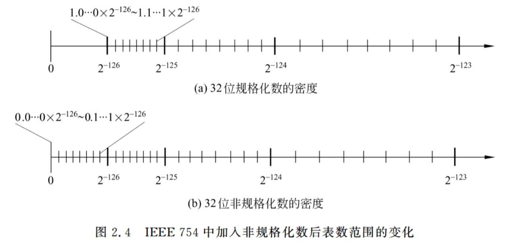

# FDU 数值算法 1. 稠密线性方程组的直接解法

本文参考以下教材:

- 数值线性代数 (第二版) 徐树方, 高立, 张平文 第 $1$ & $2$ 章

欢迎批评指正!

## 1.1 三角方程组和三角分解

三角方程组易于求解，它是用分解方法求解一般线性方程组的基础.

### 1.1.1 前代法

考虑下三角方程组 $Ly=b$.  
其中 $L\in \mathbb R^{n\times n}$ 为已知的非奇异下三角阵 (满足 $\begin{cases}
l_{ij}=0\ (\forall\ i<j)\\
l_{ii}\neq 0\ (i=1,\dots,n)
\end{cases}$)，$b\in \mathbb R^n$ 为已知的向量.  
$$
Ly = \begin{bmatrix}
l_{11} & & &\\
l_{21} & l_{22} & & \\
\vdots & \vdots & \ddots & \\
l_{n1} & l_{n2} & \dots & l_{nn}\end{bmatrix} 
\begin{bmatrix}
y_1\\
y_2\\
\vdots\\
y_n\end{bmatrix} = 
\begin{bmatrix}
b_1\\
b_2\\
\vdots\\
b_n\end{bmatrix} = b 
\tag{1}
$$

- 由第一个方程 $l_{11}y_1 = b_1$ 可知 $y_1 = \frac{1}{l_{11}} b_1$
- 由第二个方程 $l_{21}y_1 + l_{22}y_2 = b_2$ 可知 $y_2 = \frac{1}{l_{22}}(b_2 - l_{21}y_1)$ 
- 一般地，如果我们已经求出 $y_1,\dots,y_{i-1}$   
  可以根据 $(1)$ 的第 $i$ 个方程 $l_{i1}y_1 + {l_{i2}} y_2 + \dots + l_{i,i-1}y_{i-1} + l_{ii} y_i = b_i$  
  可知 $y_i = \frac{1}{l_{ii}}(b_i - \underset{j=1}{\overset{i-1}{\sum}}l_{ij}y_j)$ 

这种求解下三角方程组的方法称为前代法.  
在实际计算中，我们将 $y_i$ 存放在 $b_i$ 所用的存储单元中，并调整运算次序.  
**(前代法, 数值线性代数, 算法 $1.1.1$)**   
$$
\begin{align}
&\text{function}:y = \text{Forward\_Sweep}[L,b]\\
&\qquad\text{for }i=1:n-1\\
&\qquad\qquad b(i) \leftarrow b(i)/L(i,i)\\
&\qquad\qquad b(i+1:n) \leftarrow b(i+1:n) - b(i) L(i+1:n,i)\\
&\qquad\text{end}\\
&\qquad b(n) \leftarrow b(n)/L(n,n)\\
&\qquad\text{return }b
\end{align}
$$
最终 $Ly=b$ 的解 $y$ 存储在 $b$ 中.  
第 $1\leq i\leq n-1$ 步浮点运算次数为 $1 + (n-i) + (n-i) = 2(n-i) + 1$
最后一步浮点运算次数为 $1$  
总浮点运算次数为:   
$$
\begin{align}
\{\underset{i=1}{\overset{n-1}\sum}[2(n-i)+1]\} + 1 
&= \underset{k=1}{\overset{n-1}\sum} (2k + 1) + 1 \\
&= \frac12 (n-1)(3 + 2n-1) + 1 \\
&= n^2 -1 + 1\\ 
&= n^2\end{align}
$$

其 Matlab 代码如下:

```matlab
function y = Forward_Sweep(L, b)
    % 前代法求解 Ly = b
    n = length(b);
    for i = 1:n-1
        b(i) = b(i) / L(i, i);  % 对角线归一化
        b(i+1:n) = b(i+1:n) - b(i) * L(i+1:n, i);  % 消去
    end
    b(n) = b(n) / L(n, n);  % 处理最后一行
    y = b;  % 返回结果
end
```


### 1.1.2 回代法

考虑上三角方程组 $Ux=y$.  
其中 $U\in \mathbb R^{n\times n}$ 为已知的非奇异上三角阵 (满足 $\begin{cases}
u_{ij}=0\ (\forall\ i>j)\\ 
u_{ii}\neq 0\ (i=1,\dots,n)
\end{cases}$)，$y\in \mathbb R^n$ 为已知的向量.  
$$
Ux = \begin{bmatrix}
u_{11} & u_{12} & \dots & u_{1n}\\ 
& u_{22} & \dots & u_{2n}\\
& & \ddots & \vdots\\
&&& u_{nn}\end{bmatrix} 
\begin{bmatrix}
x_1\\
x_2\\
\vdots\\
x_n\end{bmatrix} = 
\begin{bmatrix}
y_1\\
y_2\\
\vdots\\
y_n\end{bmatrix} = y 
\tag{2}
$$

- 由第 $n$ 个方程 $u_{nn}x_n = y_n$ 可知 $x_n = \frac{1}{u_{nn}} y_n$ 
- 由第 $n-1$ 个方程 $u_{n-1,n-1}x_{n-1} + u_{n-1,n}x_n = y_{n-1}$ 可知 $x_{n-1} = \frac{1}{u_{n-1,n-1}}(y_{n-1} - u_{n-1,n}x_n)$  
- 一般地，如果我们已经求出 $x_{i+1},\dots,x_{n}$   
  可以根据 $(2)$ 的第 $i$ 个方程 $u_{ii}x_i + u_{i,i+1} x_{i+1} + \dots + u_{i,n-1}x_{n-1} + u_{i,n} x_n = y_i$  
  可知 $x_i = \frac{1}{u_{ii}}(y_i - \underset{j=i+1}{\overset{n}{\sum}}u_{ij}x_j)$ 

这种求解上三角方程组的方法称为回代法.  
在实际计算中，我们将 $x_i$ 存放在 $y_i$ 所用的存储单元中，并调整运算次序.  
**(回代法, 数值线性代数, 算法 $1.1.2$)**   
$$
\begin{align}
&\text{function: }x = \text{Backward\_Sweep}[U,y]\\
&\qquad\text{for }i=n:-1:2\\
&\qquad\qquad y(i) \leftarrow y(i)/U(i,i)\\
&\qquad\qquad y(1:i-1) \leftarrow y(1:i-1) - y(i) U(1:i-1,i)\\
&\qquad\text{end}\\
&\qquad y(1) \leftarrow y(1)/U(1,1)\\
&\qquad\text{return }y
\end{align}
$$
最终 $Ux=y$ 的解 $x$ 存储在 $y$ 中.  
第 $2\leq i\leq n$ 步浮点运算次数为 $1 + (i-1) + (i-1) = 2i - 1$
最后一步浮点运算次数为 $1$  
总浮点运算次数为:   
$$
\begin{align}
\underset{i=2}{\overset{n}\sum}(2i-1) + 1 
&= \underset{k=1}{\overset{n-1}\sum} (2k + 1) + 1 \\
&= \frac12 (n-1)(3 + 2n-1) + 1 \\
&= n^2 -1 + 1\\ 
&= n^2\end{align}
$$

其 Matlab 代码如下:

```matlab
function x = Backward_Sweep(U, y)
    % 回代法求解 Ux = y
    n = length(y);
    for i = n:-1:2
        y(i) = y(i) / U(i, i);  % 对角线归一化
        y(1:i-1) = y(1:i-1) - y(i) * U(1:i-1, i);  % 消去
    end
    y(1) = y(1) / U(1, 1);  % 处理第一行
    x = y;  % 返回结果
end
```


### 1.1.3 Gauss 变换

我们想将给定矩阵 $A$ 分解为一个下三角阵 $L$ 和一个上三角阵 $U$ 的乘积.  
这样求解 $Ax=(LU)x=b$ 的任务可以通过两步得到:

- 用前代法解 $Ly = b$ 得到 $y$
- 用回代法解 $Ux=y$ 得到 $x$

得到 $A=LU$ 的最自然的做法是通过一系列的初等变换，  
逐步将 $A$ 变换为一个上三角阵 $U$，同时保证变换矩阵的乘积是一个下三角阵 $L$.    

给定 $x\in \mathbb R^n$，考虑初等下三角阵 $L_k = I - l_k e_k^T = \begin{bmatrix}
1 & & & & & \\
& \ddots &  & & & \\
& & 1 & & &\\
& & -l_{k+1,k} & 1 & & \\
& & \vdots & & \ddots & \\
&& -l_{n,k}&&& 1\end{bmatrix}$  

其中 $l_k = \begin{bmatrix}
0\\
\vdots\\
0\\
l_{k+1,k}\\
\vdots\\
l_{n,k}\end{bmatrix}$ 而 $e_k$ 是 $\mathbb R^n$ 的第 $k$ 个标准单位基向量.  

我们希望 $L_k x = \begin{bmatrix}
x_1\\
\vdots\\
x_k\\
x_{k+1} - x_k l_{k+1,k}\\
\vdots\\
x_{n} - x_n l_{n,k}\end{bmatrix}$ 的第 $k+1$ 至第 $n$ 个分量均为零  

因此可令 $l_{i,k} = \frac{x_i}{x_k}\ (i=k+1,\dots,n)$ (当然我们要求 $x_k\neq 0$)  

我们就得到 $l_k = \frac{1}{x_k} \begin{bmatrix}
0\\
\vdots\\
0\\
x_{k+1}\\
\vdots\\
x_{n}\end{bmatrix}$ (称为 **Gauss 向量**)  

而初等下三角阵 $L_k = I - l_k e_k^T = \begin{bmatrix}
1 & & & & & \\
& \ddots &  & & & \\
& & 1 & & &\\
& & -\frac{x_{k+1}}{x_k} & 1 & & \\
& & \vdots & & \ddots & \\
&& -\frac{x_n}{x_k} &&& 1\end{bmatrix}$ 称为 **Gauss 变换矩阵**

***

Gauss 变换 $L_k=I - l_k e_k^T$ 具有许多良好的性质:

- 其逆矩阵 $L_k^{-1} = I + l_k e_k^T$   
  这是因为 $e_k^T l_k = 0$，于是有 $L_k (I+l_k e_k^T) = (I-l_k e_k^T)(I+l_k e_k^T)=I-l_k e_k^T l_k e_k^T = I$ 
- Gauss 变换作用于一个矩阵相当于对其进行秩 $1$ 修正.  
  设 $A\in \mathbb R^{n\times n}$，我们有 $L_k A = (I-l_k e_k^T)A = A - l_k (e_k^T A)$


### 1.1.4 Gauss 消去法

给定方阵 $A\in \mathbb R^{n\times n}$.  
在一定条件下，我们可以计算 $n-1$ 个 Gauss 变换 $L_1,\dots,L_{n-1}$ 使得 $L_{n-1}\dotsm L_1 A$ 为上三角阵.

记 $A^{(0)}=A$，并假定已求出 $k-1\ (k<n)$ 个 Gauss 变换 $L_1,\dots,L_{k-1}\in \mathbb R^{n\times n}$   
使得 $A^{(k-1)} = L_{k-1}\dotsm L_1 A = \begin{bmatrix}
A_{11}^{(k-1)} & A_{12}^{(k-1)}\\
0_{(k-1)\times (n-k+1)} & A_{22}^{(k-1)}\end{bmatrix}$  
其中 $A_{11}^{(k-1)}$ 是 $k-1$ 阶上三角阵，记 $A_{22}^{(k-1)}=\begin{bmatrix}
a_{kk}^{(k-1)} & \dots & a_{kn}^{(k-1)}\\
\vdots & & \vdots\\
a_{nk}^{(k-1)} & \dots & a_{nn}^{(k-1)}\end{bmatrix}$   

若 $a_{kk}^{(k-1)}\neq 0$，则我们又可以确定一个 Gauss 变换 $L_k$   
使得 $L_k A^{(k-1)}$ 的第 $k$ 列的最后 $n-k$ 个元素均为 $0$.  
$$
l_k = \frac{1}{a_{kk}^{(k-1)}}\begin{bmatrix}
0\\
\vdots\\
0\\
a_{k+1,k}^{(k-1)}\\
\vdots\\
a_{n,k}^{(k-1)}\end{bmatrix}\qquad L_k = I - l_k e_k^T = \begin{bmatrix}
1 & & & & & \\
& \ddots &  & & & \\
& & 1 & & &\\
& & -\frac{a_{k+1,k}^{(k-1)}}{a_{k,k}^{(k-1)}} & 1 & & \\
& & \vdots & & \ddots & \\
&& -\frac{a_{n,n}^{(k-1)}}{a_{k,k}^{(k-1)}} &&& 1\end{bmatrix}
$$
如此进行 $n-1$ 步，最终得到 $A^{(n-1)}$ 和 $L_1,L_2,\dots, L_{n-1}$ (其中 $A^{(n-1)}=L_{n-1}\dotsm L_2L_1 A^{(0)}$)    
我们令 $\begin{cases}
L= (L_{n-1}\dotsm L_2L_1)^{-1}\\
U = A^{(n-1)}\end{cases}$，于是有 $LU = A^{(0)} = A$   

> 以 $n=4$ 的情况为例:  
> $$
> \begin{align}
> A 
> &=
> \begin{bmatrix}
> * & * & * & *\\
> * & * & * & *\\
> * & * & * & *\\
> * & * & * & *
> \end{bmatrix}\\
> 
> &=
> \begin{bmatrix}
> 1 &  &  & \\
> * & 1 &  & \\
> * &  & 1 & \\
> * &  &  & 1
> \end{bmatrix}
> 
> \begin{bmatrix}
> * & * & * & *\\
>  & * & * & *\\
>  & * & * & *\\
>  & * & * & *
> \end{bmatrix}\\
> 
> &=
> 
> \begin{bmatrix}
> 1 &  &  & \\
> * & 1 &  & \\
> * &  & 1 & \\
> * &  &  & 1
> \end{bmatrix}
> 
> \begin{bmatrix}
> 1 &  &  & \\
>  & 1 &  & \\
>  & *  & 1 & \\
>  & *  &  & 1
> \end{bmatrix}
> 
> \begin{bmatrix}
> * & * & * & *\\
>  & * & * & *\\
>  &  & * & *\\
>  &  & * & *
> \end{bmatrix}\\
> 
> &=
> \begin{bmatrix}
> 1 &  &  & \\
> * & 1 &  & \\
> * &  & 1 & \\
> * &  &  & 1
> \end{bmatrix}
> 
> \begin{bmatrix}
> 1 &  &  & \\
>  & 1 &  & \\
>  & *  & 1 & \\
>  & *  &  & 1
> \end{bmatrix}
> 
> \begin{bmatrix}
> 1 &  &  & \\
>  & 1 &  & \\
>  &   & 1 & \\
>  &   & * & 1
> \end{bmatrix}
> 
> \begin{bmatrix}
> * & * & * & *\\
>  & * & * & *\\
>  &  & * & *\\
>  &  &  & *
> \end{bmatrix}\\
> 
> &=
> 
> L_3^{-1} L_2^{-1} L_1^{-1} U\\
> 
> &=
> 
> LU
> 
> \end{align}
> $$

根据 Gauss 变换的特点，我们有:  
$$
\begin{align}
L 
&= (L_{n-1}\dotsm L_2L_1)^{-1}\\
&= L_1^{-1} L_2^{-1} \dotsm L_{n-1}^{-1}\\
&= (I + l_1 e_1^T)(I + l_2 e_2^T)\dotsm (I+l_{n-1} e_{n-1}^T)\quad (\text{note that }e_j^Tl_i = 0 \text{ for all }j<i)\\
&= I + l_1 e_1^T + l_2 e_2^T + \dotsm + l_{n-1} e_{n-1}^T\end{align}
$$
即 $L$ 是形如 $L = I + [l_1,l_2,\dots,l_{n-1},0]=\begin{bmatrix}
1 & & & & \\
l_{21} & 1 & &  &\\
l_{31} & l_{32}& 1& &\\
\vdots &  \vdots & \vdots & \ddots & \\
l_{n1} & l_{n2} & l_{n3}&\dots & 1\end{bmatrix}$ 的**单位下三角阵**.  
这种计算三角分解的方法称为 **Gauss 消去法**.

- $L_k$ 作用于 $A^{(k-1)}$ 得到 $A^{(k)}$   
  即 $A^{(k)}= L_k A^{(k-1)} = (I-l_k e_k^T) A^{(k-1)} = A^{(k-1)} - l_k e_k^T A^{(k-1)}$    
  注意到 $e_k^T A^{(k-1)}$ 是 $A^{(k-1)}$ 的第 $k$ 行，且 $l_k$ 的前 $k$ 个分量为 $0$，我们可知:
  - $A^{(k)}$ 和 $A^{(k-1)}$ 前 $k$ 行完全相同
  - $\begin{cases}
    a_{ik}^{(k)} = 0 &(\forall\ i=k+1,\dots,n)\\
    a_{ij}^{(k)} = a_{ij}^{(k-1)} - l_{ik}a_{kj}^{(k-1)} = a_{ij}^{(k-1)} - \frac{1}{a_{kk}^{(k-1)}} a_{ik}^{(k-1)} a_{kj}^{(k-1)} &(\forall\ i,j=k+1,\dots,n)\end{cases}$
- $A^{(k)}$ 和 $L_k$ 的存储:  
  首先，$A^{(k-1)}$ 的第 $k+1$ 行至第 $n$ 行的元素在计算出 $A^{(k)}$ 后不再有用，  
  因此 $A^{(k)}$ 在 $(k+1:n,k+1:n)$ 位置的元素可覆写到 $A^{(k-1)}$ 中的相应位置.  
  其次，由于 $A^{(k)}$ 的第 $k$ 列对角元以下的元素 $a_{ik}^{(k)}\ (i=k+1,\dots,n)$ 为零，无需储存，  
  故我们可将 $l_k$ 的非零元存储在这些位置上.  
  例如一个 $4\times 4$ 的矩阵 $A$ 经过两步 Gauss 消元后，其形式为 $\begin{bmatrix}
  a_{11}^{(0)} & a_{12}^{(0)} & a_{13}^{(0)} & a_{14}^{(0)}\\
  l_{21} & a_{22}^{(1)} & a_{23}^{(1)} & a_{24}^{(1)}\\
  l_{31} & l_{32} & a_{33}^{(2)} & a_{34}^{(2)}\\
  l_{41} & l_{42} & a_{43}^{(2)} & a_{44}^{(2)}\end{bmatrix}$

**(Gauss 消去法, 数值线性代数, 算法 $1.1.3$)**  
$$
\begin{align}
&\text{function: }[L,U] = \text{Gaussian\_Elimination}(A)\\
&\qquad n=\dim(A)\\
&\qquad \text{for }k=1:n-1\\
&\qquad\qquad A(k+1:n , k) \leftarrow A(k+1:n,k) / A(k,k)\\
&\qquad\qquad A(k+1:n , k+1 : n) \leftarrow A(k+1:n,k+1:n) - A(k+1:n,k) A(k,k+1:n)\\
&\qquad\text{end}\\
&\qquad L = I_n + A\odot (\text{strictly lower triangular matrix with all ones})\quad (\odot \text{ stands for Hadamand product})\\
&\qquad U = A\odot (\text{upper triangular matrix with all ones})\\
&\qquad \text{return }[L,U]
\end{align}
$$
总浮点运算数为:  
$$
\begin{align}
\underset{k=1}{\overset{n-1}\sum} [(n-k) + 2(n-k)^2]
&= \underset{i=1}{\overset{n-1}\sum} (i + 2i^2)\\
&=
\frac{1}{2} (n-1)n + 2\cdot \frac{1}{6}(n-1)n(2n-1)\\
&=
\frac{2}{3}n^3 - \frac12 n^2 - \frac16 n\\
&= O(\frac23 n^3)\end{align}
$$

***

显然当且仅当前 $n-1$ 个主元 $a_{kk}^{(k-1)}\ (k=1,\dots,n-1)$ 均不为零时，Gauss 消去法才能进行到底.  
我们自然要问: 矩阵 $A$ 满足什么条件，才能保证前 $n-1$ 个主元均不为零?  
**(前 $k$ 个主元不为零的充要条件, 数值线性代数, 定理 $1.1.1$)**  
对 $A$ 进行 Gauss 消去法过程中的前 $k\in \{1,\dots,n-1\}$ 个主元 $a_{ii}^{(i-1)}\ (i=1,\dots,k)$ 均不为零，  
当且仅当 $A$ 的前 $k$ 个顺序主子阵 $A_i\ (i=1,\dots,k)$ 都是非奇异的.

- **证明:**  
  对 $k$ 应用数学归纳法.  
  当 $k=1$ 时，$A_1 = [a_{11}^{(0)}]$，定理显然成立.  

  假设定理直至 $k-1$ 成立，且 $A_1,\dots,A_{k-1}$ 非奇异.  
  根据归纳假设可知 $a_{ii}^{(i-1)}\neq 0\ (i=1,\dots,k-1)$   
  因此 Gauss 消去过程至少可以进行 $k-1$ 步，  
  得到 $A^{(k-1)} = L_{k-1}\dotsm L_1 A = \begin{bmatrix}
  A_{11}^{(k-1)} & A_{12}^{(k-1)}\\
  & A_{22}^{(k-1)}\end{bmatrix}$   
  其中 $A_{11}^{(k-1)}$ 是 $(k-1)\times (k-1)$ 的上三角阵.

  因此 $A_{(k-1)}$​ 的 $k$​ 阶顺序主子阵具有形状 $\begin{bmatrix}
  A_{11}^{(k-1)} & *\\
  & a_{kk}^{(k-1)}\end{bmatrix}$​  
  记 $L_1,\dots,L_{k-1}$​ 的 $k$​ 阶顺序主子阵为 $(L_1)_k, \dots, (L_{k-1})_k$​，  
  则我们有 $(L_{k-1})_k\dotsm (L_1)_k A_k = \begin{bmatrix}
  A_{11}^{(k-1)} & *\\
  & a_{kk}^{(k-1)}\end{bmatrix}$ 

  注意到 $L_1,\dots,L_{k-1}$ 均为单位下三角阵，故我们有:  
  $\det(A_k) = \frac{1}{\det((L_1)_k)\dots \det((L_{k-1})_k)} \det(\begin{bmatrix}
  A_{11}^{(k-1)} & *\\
  & a_{kk}^{(k-1)}\end{bmatrix}) =a_{kk}^{(k-1)} \det(A_{11}^{(k-1)})$  
  从而 $a_{kk}^{(k-1)}\neq 0$ 当且仅当 $A_k$ 非奇异.  
  因此定理对 $k-1$ 的情况也成立，于是定理得证.

- **(三角分解存在且唯一的充分条件, 数值线性代数, 定理 $1.1.2$)**  
  若 $A\in \mathbb R^{n\times n}$ 的前 $n-1$ 个顺序主子阵 $A_k\ (k=1,\dots, n-1)$ 都是非奇异的，  
  则存在唯一的一对单位下三角阵 $L\in \mathbb R^{n\times n}$ 和上三角阵 $U\in \mathbb R^{n\times n}$ 使得 $A= LU$.

****

Gauss 消去法的 Matlab 代码如下:  

```matlab
function [L, U] = Gaussian_Elimination(A)
    % Input:
    % A - An n x n matrix
    %
    % Output:
    % L - Lower triangular matrix
    % U - Upper triangular matrix

    % Get the size of the matrix A
    [n, ~] = size(A);

    % Perform Gaussian Elimination
    for k = 1:n-1
        % Update column elements below the diagonal
        A(k+1:n, k) = A(k+1:n, k) / A(k, k);

        % Update the remaining submatrix
        A(k+1:n, k+1:n) = A(k+1:n, k+1:n) - A(k+1:n, k) * A(k, k+1:n);
    end

    % Construct the lower triangular matrix L
    L = eye(n) + tril(A, -1);

    % Construct the upper triangular matrix U
    U = triu(A);

    % Return the results
    return;
end
```

函数调用:  

```matlab
% Define the range of n values to test (100 to 3000 with step of 100)
n_values = 100: 100: 2000;
execution_times = zeros(size(n_values));

% Loop over each value of n
for i = 1:length(n_values)
    n = n_values(i);
    
    % Generate a random nxn matrix with normally distributed elements
    A = randn(n, n);
    
    % Measure the execution time of GaussianElimination
    tic;  % Start timer
    [L, U] = GaussianElimination(A);
    execution_times(i) = toc;  % Stop timer and record the time
    
    % Output the current dimension and execution time
    fprintf('Matrix size: %d x %d, Execution time: %.4f seconds\n', n, n, execution_times(i));
end

% Plot the results in log-log scale
figure;
loglog(n_values, execution_times, '-o', 'LineWidth', 2, 'MarkerSize', 8);
hold on;

% Plot n^3 for comparison (normalize to match the scale of the execution times)
normalized_n_cubed = (n_values.^3) * (execution_times(end) / n_values(end)^3);
loglog(n_values, normalized_n_cubed, '--r', 'LineWidth', 2);

% Labels and titles
xlabel('Matrix Size (n)', 'FontSize', 14);
ylabel('Execution Time (seconds)', 'FontSize', 14);
title('Execution Time of GaussianElimination and O(n^3) Comparison on Log-Log Scale', 'FontSize', 16);
legend('Gaussian Elimination Execution Time', 'O(n^3) Reference Line');
grid on;
hold off;
```

输出结果:  

```tex
Matrix size: 100 x 100, Execution time: 0.0099 seconds
Matrix size: 200 x 200, Execution time: 0.0156 seconds
Matrix size: 300 x 300, Execution time: 0.0286 seconds
Matrix size: 400 x 400, Execution time: 0.0840 seconds
Matrix size: 500 x 500, Execution time: 0.1986 seconds
Matrix size: 600 x 600, Execution time: 0.3693 seconds
Matrix size: 700 x 700, Execution time: 0.5889 seconds
Matrix size: 800 x 800, Execution time: 0.8541 seconds
Matrix size: 900 x 900, Execution time: 1.2081 seconds
Matrix size: 1000 x 1000, Execution time: 1.7111 seconds
Matrix size: 1100 x 1100, Execution time: 2.3695 seconds
Matrix size: 1200 x 1200, Execution time: 3.4898 seconds
Matrix size: 1300 x 1300, Execution time: 4.2514 seconds
Matrix size: 1400 x 1400, Execution time: 5.5133 seconds
Matrix size: 1500 x 1500, Execution time: 6.6729 seconds
Matrix size: 1600 x 1600, Execution time: 7.1258 seconds
Matrix size: 1700 x 1700, Execution time: 9.3520 seconds
Matrix size: 1800 x 1800, Execution time: 12.8476 seconds
Matrix size: 1900 x 1900, Execution time: 11.9220 seconds
Matrix size: 2000 x 2000, Execution time: 13.9834 seconds
```


这验证了 Gauss 消元法 $O(n^3)$ 级别的时间复杂度.


## 1.2 选主元 Gauss 消去法

对于线性方程组 $Ax=b$ 来说，只要 $A$ 非奇异，方程组就存在唯一解.  
然而 $A$ 非奇异不代表其前 $n-1$ 个顺序主子阵 $A_k\ (k=1,\dots, n-1)$ 都是非奇异的，  
因此不能保证 Gauss 消去法能够进行到底.   
此外，根据数值线性代数例 $1.2.1$ 可知，若主元非零但是很小，则也会对算法造成不良影响.

我们自然要问: 如何修改 Gauss 消去法使之适应所有非奇异矩阵呢?  

### 1.2.1 全选主元

在第 $k$ 步中，若 $a_{kk}^{(k-1)}$ 为零 (或者非零但是太小)，  
则我们可以选择某个 $a_{pq}^{(k-1)}\neq 0$ 作为主元 (为不破坏已经引入的零元素，要求 $p,q\geq k$)，  
即需要交换第 $k$ 行和第 $p$ 行，再交换第 $k$ 列和第 $q$ 列.

> 任意给定 $i\neq j$  
> 初等置换矩阵 $P_{i\leftrightarrow j} = [e_1,\dots, e_{i-1},\ \underline{e_j}\ , e_{i+1},\dots, e_{j-1}, \ \underline{e_i}\ ,e_{j+1},\dots,e_n]$    
> 它是单位矩阵 $I$ 的第 $i,j$ 列交换得到的矩阵.  
> 用 $P_{i\leftrightarrow j}$ 左乘 $A$ 便可交换 $A$ 的第 $i,j$ 行，用 $P_{i\leftrightarrow j}$ 右乘 $A$ 便可交换 $A$ 的第 $i,j$ 列.  
>
> $P_{i\leftrightarrow j}$ 的另一种更便捷的表示方法是: 
> $$
> P_{i\leftrightarrow j} = I_n -(e_ie_i^T + e_je_j^T) + (e_ie_j^T + e_j e_i^T) = 
> \begin{bmatrix}
> 1 &&&&&&&&&\\
> &\ddots &&&&&&&&\\
> &&0 & & \dotsm & & 1 &&&\\
> &&& 1 &&&&&&\\
> &&\vdots & &\ddots & & \vdots &&&\\
> &&&&&1 &&&&\\
> &&1 & & \dotsm & & 0 &&&\\
> &&&&&&&1&&\\
> &&&&&&&&\ddots&\\
> &&&&&&&&& 1
> \end{bmatrix}
> $$

假定 Gauss 消去法已经进行了 $k-1$ 步，  
即已经确定了 $k-1$ 个 Gauss 变换 $L_1,\dots, L_{k-1}$ 和 $2(k-1)$ 个初等置换矩阵 $\begin{cases}
P_1,\dots, P_{k-1}\\
Q_1,\dots, Q_{k-1}\end{cases}$  
使得 $A^{(k-1)} = L_{k-1} P_{k-1} \dotsm L_1 P_1 A^{(0)} Q_1\dotsm Q_{k-1}= \begin{bmatrix}
A_{11}^{(k-1)} & A_{12}^{(k-1)}\\
& A_{22}^{(k-1)}\end{bmatrix}$  
其中 $A_{11}^{(k-1)}$ 为 $k-1$ 阶上三角阵，记 $A_{22}^{(k-1)}=\begin{bmatrix}
a_{kk}^{(k-1)} & \dots & a_{kn}^{(k-1)}\\
\vdots & & \vdots\\
a_{nk}^{(k-1)} & \dots & a_{nn}^{(k-1)}\end{bmatrix}$   

我们在 $A_{22}^{(k-1)}$ 中选取绝对值尽可能大的主元，即取 $(p,q) \in \arg \underset{k\leq i,j\leq n}\max |a_{ij}^{(k-1)}|$   

- 若 $a_{pq}^{(k-1)}=0$，则说明 $A_{22}^{(k-1)}$ 为全零矩阵，消去过程终止.

- 若 $a_{pq}^{(k-1)}\neq 0$，则我们交换 $A^{(k-1)}$ 的第 $k$ 行和第 $p$ 行，以及第 $k$ 列和第 $q$ 列.  
  即取 $\begin{cases}
  P_k = I_{kp}\\
  Q_k = I_{kq}\end{cases}$，记交换后的矩阵为 $\tilde A^{(k-1)} = P_{k} A^{(k-1)} Q_k$  
  记其 $(2,2)$ 分块 $\tilde A_{22}^{(k-1)}=\begin{bmatrix}
  \tilde a_{kk}^{(k-1)} & \dots & \tilde a_{kn}^{(k-1)}\\
  \vdots & & \vdots\\
  \tilde a_{nk}^{(k-1)} & \dots & \tilde a_{nn}^{(k-1)}\end{bmatrix}$   
  然后计算 Gauss 变换:
  $$
  l_k = \frac{1}{\tilde a_{kk}^{(k-1)}}\begin{bmatrix}
  0\\
  \vdots\\
  0\\
  \tilde a_{k+1,k}^{(k-1)}\\
  \vdots\\
  \tilde a_{n,k}^{(k-1)}\end{bmatrix}\qquad L_k = I - l_k e_k^T = \begin{bmatrix}
  1 & & & & & \\
  & \ddots &  & & & \\
  & & 1 & & &\\
  & & -\frac{\tilde a_{k+1,k}^{(k-1)}}{\tilde a_{k,k}^{(k-1)}} & 1 & & \\
  & & \vdots & & \ddots & \\
  && -\frac{\tilde a_{n,n}^{(k-1)}}{\tilde a_{k,k}^{(k-1)}} &&& 1\end{bmatrix}
  $$
  这样便有 $A^{(k)} = L_k \tilde A^{(k)} = L_k (P_k A^{(k-1)}Q_k) = \begin{bmatrix}
  A_{11}^{(k)} & A_{12}^{(k)}\\
  & A_{22}^{(k)}\end{bmatrix}$   
  其中 $A_{11}^{(k)}$ 为 $k$ 阶上三角阵.

上述过程称为**全主元 Gauss 消去法**.   
**(全主元 Gauss 消去法, 数值线性代数, 算法 $1.2.1$)**  
$$
\begin{align}
&\text{function: } [P,Q,L,U]=\text{Gaussian\_Elimination\_Complete\_Pivoting}(A)\\
&\qquad n=\dim(A)\\
&\qquad P =Q=I_n\\
&\qquad\text{for }k=1:n-1\\
&\qquad\qquad (p,q) \in  \arg \underset{k\leq i,j\leq n}\max |A(i,j)|\quad (确定主元位置)\\
&\qquad\qquad A(k,1:n) \leftrightarrow A(p,1:n)\quad (交换第\ k,p\ 行)\\
&\qquad\qquad A(1:n,k) \leftrightarrow A(1:n,q)\quad (交换第\ k,q\ 列)\\
&\qquad\qquad P(k,1:n) \leftrightarrow P(p,1:n)\quad (记录置换矩阵\ P_k)\\
&\qquad\qquad Q(1:n,k) \leftrightarrow P(1:n,q)\quad (记录置换矩阵\ Q_k)\\ 
&\qquad\qquad\text{if } A(k,k) \neq 0\\
&\qquad\qquad\qquad (进行\text{ Gauss } 消去)\\
&\qquad\qquad\qquad A(k+1:n,k) = A(k+1:n,k+1:n)/ A(k,k)\\
&\qquad\qquad\qquad A(k+1:n , k+1 : n) = A(k+1:n,k+1:n) - A(k+1:n,k) A(k,k+1:n)\\
&\qquad\qquad \text{else}\\
&\qquad\qquad\qquad \text{break}\quad (矩阵奇异)\\
&\qquad\qquad \text{end}\\
&\qquad L = I_n + A\odot (\text{strictly lower triangular matrix with all ones})\quad (\odot \text{ stands for Hadamand product})\\
&\qquad U = A\odot (\text{upper triangular matrix with all ones})\\
&\qquad \text{return }[P,Q,L,U]
\end{align}
$$

与不选主元的 Gauss 消去法一样，$L$ 的严格下三角部分和 $U$ 分别存储在 $A$ 的严格下三角部分和上三角部分.   
其 Matlab 代码如下:

```matlab
function [P, Q, L, U] = Gaussian_Elimination_Complete_Pivoting(A)
    % 获取矩阵的维度
    [n, m] = size(A);
    if n ~= m
        error('矩阵A必须是方阵');
    end
    
    % 初始化置换矩阵 P 和 Q 为单位矩阵
    P = eye(n);
    Q = eye(n);
    
    % 高斯消去过程
    for k = 1:n-1
        % 在子矩阵 A(k:n, k:n) 中找到最大值的索引 (p, q)
        [~, idx] = max(abs(A(k:n, k:n)), [], 'all', 'linear');
        [p, q] = ind2sub([n-k+1, n-k+1], idx);
        p = p + k - 1; % 调整行索引
        q = q + k - 1; % 调整列索引
        
        % 交换第 k 行和第 p 行
        if p ~= k
            A([k, p], :) = A([p, k], :); 
            P([k, p], :) = P([p, k], :); % 记录行置换
        end
        
        % 交换第 k 列和第 q 列
        if q ~= k
            A(:, [k, q]) = A(:, [q, k]);
            Q(:, [k, q]) = Q(:, [q, k]); % 记录列置换
        end
        
        % 检查主元是否为零
        if A(k, k) == 0
            error('矩阵是奇异的');
        end
        
        % Gauss 消去过程：对 A(k+1:n, k) 进行归一化
        A(k+1:n, k) = A(k+1:n, k) / A(k, k);
        
        % 更新 A(k+1:n, k+1:n)
        A(k+1:n, k+1:n) = A(k+1:n, k+1:n) - A(k+1:n, k) * A(k, k+1:n);
    end
    
    % 计算 L 和 U 矩阵
    L = tril(A, -1) + eye(n); % L 是单位下三角矩阵
    U = triu(A); % U 是上三角矩阵
    
    % 返回置换矩阵 P、Q，以及分解矩阵 L、U
end
```

***

假设全主元 Gauss 消去法进行 $r$ 步后终止，  
则我们得到 $r$ 个 Gauss 变换 $L_1,\dots, L_{r}$ 和 $2r$ 个初等置换矩阵 $\begin{cases}
P_1,\dots, P_{r}\\
Q_1,\dots, Q_{r}\end{cases}$   
使得 $U:=A^{(r)} = L_{r} P_{r} \dotsm L_1 P_1 A Q_1\dotsm Q_{r}$ 为上三角阵.  

取 $\begin{cases}
Q=Q_1\dotsm Q_r\\
P=P_r \dotsm P_1\\
L= P(L_rP_r\dotsm L_1P_1)^{-1}\end{cases}$ 则我们有 $PAQ=LU$   
根据 Gauss 消元法的特性，我们知道 $L$ 是一个单位下三角阵 (对角元均为 $1$).  
而且由于我们采用全选主元策略，因此 $L$ 的严格下三角元的绝对值都小于等于 $1$.  
根据算法的终止条件我们可知 $r$ 是方阵 $A$ 的秩，因此 $U$ 非零对角元个数为 $r$.

**(数值线性代数, 定理 $1.2.1$)**  
设 $A\in \mathbb R^{n\times n}$，记 $r= \rank(A)$   
则存在排列矩阵 $P,Q\in \mathbb R^{n\times n}$，单位下三角阵 $L\in \mathbb R^{n\times n}$ 和上三角阵 $U\in \mathbb R^{n\times n}$ 使得 $PAQ=LU$.  
其中 $L$ 的严格下三角元的绝对值都小于等于 $1$，且 $U$ 的非零对角元个数为 $r$.

****

设 $A\in \mathbb R^{n\times n}$ 非奇异 (即满秩)，则线性方程组 $Ax=b$ 可以这样求解:

- 用全选主元 Gauss 消去法得到 $PAQ=LU$ 
- 用前代法求解 $Ly=Pb$ 得到 $y$ 
- 用回代法求解 $Uz = y$ 得到 $z$
- 计算 $x=Qz$ 


### 1.2.2 列选主元

虽然全主元 Gauss 消去法弥补了不选主元的 Gauss 消去法的不足，但其代价极其昂贵.  
在 $A$ 非奇异 (即满秩) 的情况下，  
全选主元必须进行 $\underset{k=1}{\overset{n-1}\sum} (n-k+1)^2 =\underset{i=2}{\overset{n}\sum} i^2  = \frac13 n^3 + O(n^2)$ 次比较操作.  
为尽可能减少所进行的比较，我们提出**列选主元的 Gauss 消去法**:  
第 $k$ 步只在 $A_{22}^{(k-1)}$ 的第 $k$ 列上寻找绝对值最大元，  
取 $p\in \arg \underset{k\leq i\leq n}{\max} |a_{ik}^{(k-1)}|$，则选取的主元是 $a_{pk}^{(k-1)}$    
这样我们只需行交换而不需要列交换，即 $\begin{cases}
P_{k} = I_{kp}\\
Q_k = I\end{cases}$ 

**(列主元 Gauss 消去法, 数值线性代数, 算法 $1.2.2$)**  
$$
\begin{align}
&\text{function: }[P,L,U] = \text{Gaussian\_Elimination\_Partial\_Pivoting}(A)\\
&\qquad n = \dim(A)\\
&\qquad P = I_n\\
&\qquad\text{for }k=1:n-1\\
&\qquad\qquad p \in  \arg \underset{k\leq i\leq n}\max |A(i,k)|\quad (确定主元位置)\\
&\qquad\qquad A(k,1:n) \leftrightarrow A(p,1:n)\quad (交换第\ k,p\ 行)\\
&\qquad\qquad P(k,1:n) \leftrightarrow P(p,1:n)\quad (记录置换矩阵\ P_k)\\
&\qquad\qquad\text{if } A(k,k) \neq 0\\
&\qquad\qquad\qquad (进行\text{ Gauss } 消去)\\
&\qquad\qquad\qquad A(k+1:n,k) = A(k+1:n,k+1:n)/ A(k,k)\\
&\qquad\qquad\qquad A(k+1:n , k+1 : n) = A(k+1:n,k+1:n) - A(k+1:n,k) A(k,k+1:n)\\
&\qquad\qquad \text{else}\\
&\qquad\qquad\qquad \text{break}\quad (矩阵奇异)\\
&\qquad\qquad \text{end}\\
&\qquad L = I_n + A\odot (\text{strictly lower triangular matrix with all ones})\quad (\odot \text{ stands for Hadamand product})\\
&\qquad U = A\odot (\text{upper triangular matrix with all ones})\\
&\qquad \text{return }[P,L,U]
\end{align}
$$
与不选主元的 Gauss 消去法一样，$L$ 的严格下三角部分和 $U$ 分别存储在 $A$ 的严格下三角部分和上三角部分.  

其 Matlab 代码如下:  

```matlab
function [P, L, U] = Gaussian_Elimination_Partial_Pivoting(A)
    % 获取矩阵的维度
    [n, m] = size(A);
    if n ~= m
        error('矩阵A必须是方阵');
    end
    
    % 初始化置换矩阵 P 为单位矩阵
    P = eye(n);
    
    % 高斯消去过程
    for k = 1:n-1
        % 在第 k 列的 A(k:n, k) 中找到最大值的行索引 p
        [~, p] = max(abs(A(k:n, k)));
        p = p + k - 1; % 调整为在整个矩阵中的行索引
        
        % 交换第 k 行和第 p 行
        if p ~= k
            A([k, p], :) = A([p, k], :); 
            P([k, p], :) = P([p, k], :); % 记录行置换
        end
        
        % 检查主元是否为零
        if A(k, k) == 0
            error('矩阵是奇异的');
        end
        
        % Gauss 消去过程：对 A(k+1:n, k) 进行归一化
        A(k+1:n, k) = A(k+1:n, k) / A(k, k);
        
        % 更新 A(k+1:n, k+1:n)
        A(k+1:n, k+1:n) = A(k+1:n, k+1:n) - A(k+1:n, k) * A(k, k+1:n);
    end
    
    % 计算 L 和 U 矩阵
    L = tril(A, -1) + eye(n); % L 是单位下三角矩阵
    U = triu(A); % U 是上三角矩阵
    
    % 返回置换矩阵 P，以及分解矩阵 L、U
end
```

****

设 $A\in \mathbb R^{n\times n}$ 非奇异 (即满秩)，则线性方程组 $Ax=b$ 可以这样求解:

- 用列主元 Gauss 消去法得到 $PA=LU$ 
- 用前代法求解 $Ly=Pb$ 得到 $y$ 
- 用回代法求解 $Ux = y$ 得到 $x$

实际计算的经验和理论分析的结果表明，  
列主元 Gauss 消去法在数值稳定性方面完全可以媲美全主元 Gauss 消去法，同时具有更小的计算复杂度.  
它是目前求解中小型稠密线性方程组最受欢迎的方法之一.

****

列主元 Gauss 消去法可用于计算行列式.  
设 $A\in \mathbb R^{n\times n}$ 的列主元 Gauss 消去法的结果是 $PA=LU$   
注意到置换矩阵 $P$ 的行列式 $\det(P)=1$，单位下三角阵 $L$ 的行列式 $\det(L)=1$，上三角阵 $U$ 的行列式即主对角元相乘  
因此 $\det(A)=\frac{\det(L)\det(U)}{\det(P)} = \det(U)$ 就很容易计算了.  
这个算法的计算复杂度是 $O(\frac23 n^3)$ 

- 如果使用 Laplace 展开计算行列式 $\det(A)$  
  则根据计算量的递归关系 $\begin{cases}
  T(n)=(n-1)T(n-1)+O(n)\\
  T(2) = O(1)\end{cases}$ 可知 $T(n)=O(n!)$   
  因此使用 Laplace 展开计算行列式 $\det(A)$ 的计算复杂度是 $O(n!)$ 

结合 Cramer 法则求解线性方程组 $Ax=b$，则我们需要计算 $n+1$ 个 $n$ 阶行列式.  
若使用列主元 Gauss 消去法来计算行列式，则总计算复杂度是 $O(n\cdot \frac23 n^3)$   
若使用 Laplace 展开计算行列式，则总计算复杂度是 $O(n\cdot n!)$   
当然，直接使用列主元 Gauss 消去法结合回代法和前代法求解线性方程组的计算复杂度是 $O(\frac{2}{3}n^3)$ 

>**回顾 Cramer 法则**  
>给定 $A\in \mathbb F^{n\times n}$ 和 $b\in \mathbb F^m$ (其中 $\mathbb F$ 为复数域 $\mathbb C$ 或实数域 $\mathbb R$)，考虑线性方程组 $Ax=b$  
>当 $A\in \mathbb F^{n\times n}$ 非奇异时，我们可以使用 Cramer 法则给出方程的唯一解的解析表达式.
>
>记 $\det{(A\underset{(i)}\leftarrow b)}$ 为用 $b$ 替代 $A$ 的第 $i$ 列得到的矩阵的行列式值，则我们有 **(Matrix Analysis 0.8.3 节)**: 
>$$
>A
>\begin{bmatrix}
>\det{(A\underset{(1)}\leftarrow b)}\\
>\vdots\\
>\det{(A\underset{(n)}\leftarrow b)}
>\end{bmatrix}
>=
>A\text{adj}(A)b
>=
>\det(A)b
>$$
>当 $A\in \mathbb F^{n\times n}$ 非奇异时，我们就有:  
>$$
>x_i = \frac{\det{(A\underset{(i)}\leftarrow b)}}{\det(A)}\ \ (i=1,\dots,n)
>$$
>
>**Cramer 法则的另一种推导方法:** 
>方程组 $Ax=b$ 可改写为 $A(I_n\underset{(i)}\leftarrow x)= (A\underset{(i)}\leftarrow b)$   
>两边取行列式即得到:  
>$$
>\begin{align}
>\det\{(A\underset{(i)}\leftarrow b)\}
>&=
>\det{(A(I_n\underset{(i)}\leftarrow x))}\\
>&=
>\det(A)\det{(I_n\underset{(i)}\leftarrow x)}\\
>&=
>\det(A) x_i
>\end{align}\ \ \ (i=1,\dots,n)
>$$
>当 $A\in \mathbb F^{n\times n}$ 非奇异时，即得到 $x_i = \frac{\det{(A\underset{(i)}\leftarrow b)}}{\det(A)}\ \ (i=1,\dots,n)$ 


## 1.3 Cholesky 分解

Cholesky 分解法是求解正定线性方程组最常用的方法之一.  

**(Cholesky 分解定理, 数值线性代数, 定理 $1.3.1$)**  
若方阵 $A\in \mathbb R^{n\times n}$ 正定，  
则存在一个对角元均为正数的下三角阵 $L\in \mathbb R^{n\times n}$ 使得 $A=LL^T$   
上式称为 Cholesky 分解，而 $L$ 称为 $A$ 的 Cholesky 因子.

- > **Lemma: (三角分解存在且唯一的充分条件, 数值线性代数, 定理 $1.1.2$)**  
  > 若 $A\in \mathbb R^{n\times n}$ 的前 $n-1$ 个顺序主子阵 $A_k\ (k=1,\dots, n-1)$ 都是非奇异的，  
  > 则存在唯一的一对单位下三角阵 $L\in \mathbb R^{n\times n}$ 和上三角阵 $U\in \mathbb R^{n\times n}$ 使得 $A= LU$.

- **证明:**  
  $A$ 正定，因此其所有的顺序主子阵都正定 (自然非奇异).  
  根据 Lemma 可知存在唯一的一对单位下三角阵 $\tilde L\in \mathbb R^{n\times n}$ 和上三角阵 $U\in \mathbb R^{n\times n}$ 使得 $A= \tilde LU$.  

  令 $\begin{cases}
  D=\text{diag}(u_{11},\dots,u_{nn})\\
  \tilde U = D^{-1} U\end{cases}$ (显然 $\tilde U$ 是单位上三角阵)  
  则有 $\tilde U^T D \tilde L^T = A^T = A = \tilde L D \tilde U$   
  等式两端同时左乘 $D^{-1}\tilde U^{-T}$ 并右乘 $\tilde U^{-1}$，即有 $\tilde L^T \tilde U^{-1} = D^{-1} \tilde U^{-T} \tilde L D$   

  注意到新等式的左端是单位上三角阵，右端是下三角阵，因此二者都是单位矩阵，  
  即有 $\tilde L^T \tilde U^{-1} = D^{-1} \tilde U^{-T} \tilde L D=I$   
  因此 $\tilde L^T = \tilde U$，  
  从而 $A=\tilde L U = \tilde L D\tilde U = \tilde L D\tilde L^T$ 

  根据 $A$ 的正定性可知 $D$ 的对角元都为正数.  

  > 如若不然，不妨设 $u_{11}\leq 0$，  
  > 则对于使得 $\tilde L^T x = e_1$ 的 $x$ 都有 $x^TAx = x^T \tilde L D\tilde L^Tx = (\tilde L^T x)^T D (\tilde L^T x) = e_1^T D e_1 = u_{11}\leq 0$ 成立，  
  > 与 $A$ 的正定性矛盾.

  因此我们可定义 $D^{\frac12} := \text{diag}(\sqrt{u_{11}},\dots,\sqrt{u_{nn}})$  
  并令 $L= \tilde L D^{\frac12}$，其对角元 $l_{ii}=\sqrt{u_{ii}}>0\ (i=1,\dots,n)$  
  且有 $A= \tilde L D\tilde L^T = (\tilde L D^{\frac12})(\tilde L D^{\frac12})^T = LL^T$ 成立.

****

若方阵 $A\in \mathbb R^{n\times n}$ 正定，则我们可以这样求解线性方程组 $Ax=b$:

- 计算 $A$ 的 Cholesky 分解 $A=LL^T$     

  > 根据 Cholesky 分解定理的证明可知:  
  > 一种方法是用不选主元的 Gauss 消去法得到 $A=\tilde L U$  
  > 定义 $\begin{cases}
  > D:=\text{diag}(u_{11},\dots,u_{nn})\\
  > D^{\frac12} := \text{diag}(\sqrt{u_{11}},\dots,\sqrt{u_{nn}})\\
  > L:= \tilde L D^{\frac12}\end{cases}$  (我们有 $U= D\tilde L^T$)      
  > 即得到 $A= \tilde L D\tilde L^T = (\tilde L D^{\frac12})(\tilde L D^{\frac12})^T = LL^T$ 

- 前代法求解 $Ly = b$ 得到 $y$

- 回代法求解 $L^Tx=y$ 得到 $x$


### 1.3.1 平方根法

关于 Cholesky 分解，更简单实用的方法是逐元素比较 $A=LL^T$ 来计算 $L$.  
设 $L=\begin{bmatrix}
l_{11} & & &\\
l_{21} & l_{22} & & \\
\vdots & \vdots & \ddots & \\
l_{n1} & l_{n2} & \dots & l_{nn}\end{bmatrix} $   
比较 $A=LL^T$ 两边对应元素，得到 $a_{ij} = \underset{p=1}{\overset{\min(i,j)}\sum}l_{ip} l_{jp}\ (1\leq i,j \leq n)$   

- 首先由 $a_{11}=l_{11}^2$ 得到 $l_{11} = \sqrt{a_{11}}$   
  再由 $a_{i1} = l_{11}l_{i1}\ (1\leq i\leq n)$ 得到 $l_{i1} = \frac{1}{l_{11}}a_{i1}\ (1\leq i\leq n)$  
  这样便得到矩阵 $L$ 的第 $1$ 列元素.
- 假设已经计算出 $L$ 的前 $k-1$ 列元素.  
  由 $a_{kk} = \underset{p=1}{\overset{k}\sum}l_{kp}^2$ 得到 $l_{kk} = (a_{kk}- \underset{p=1}{\overset{k-1}\sum}l_{kp}^2)^{\frac12}$   
  再由 $a_{ik} = \underset{p=1}{\overset{k}\sum} l_{ip}l_{kp}= \underset{p=1}{\overset{k-1}\sum}l_{ip}l_{kp} + l_{ik}l_{kk}\ \ (i=k+1,\dots, n)$   
  得到 $l_{ik} = \frac{1}{l_{kk}} (a_{ik}-\underset{p=1}{\overset{k-1}\sum}l_{ip}l_{kp})\ \ (i=k+1,\dots, n)$   
  这样便得到矩阵 $L$ 的第 $k$ 列元素.

上述次序可以调整为按行计算.  
由于 $A$ 的元素 $a_{ij}$ 被用来计算 $l_{ij}$ 后就不再使用，故我们可将 $L$ 的元素存储在 $A$ 的对应位置上.  
**(平方根法, 数值线性代数, 算法 $1.3.1$)**  
$$
\begin{align}
&\text{for }k=1:n\\
&\qquad A(k,k) = \sqrt{A(k,k)}\\
&\qquad A(k+1:n,k) = A(k+1:n,k)/A(k,k)\\
&\qquad \text{for }j=k+1:n\\
&\qquad\qquad A(j:n,j) = A(j:n,j) - A(j:n,k)A(j,k)\\
&\qquad \text{end}\\
&\text{end}\\
\end{align}
$$
总浮点运算数为:  
$\begin{align}
\underset{k=1}{\overset{n}\sum} [1 + (n-k-1) + \underset{j=k+1}{\overset{n}\sum} 2(n-j+1)]
&=
\underset{k=1}{\overset{n}\sum} [1+(n-k-1) + 2\cdot \frac12 (n-k)(n-k-1)]\\
&=
\underset{i=1}{\overset{n}\sum} [1 + i + (i+1)i]\\
&=
\underset{i=1}{\overset{n}\sum} (1 +2i+ i^2)\\
&= n + 2\cdot \frac12 n(n+1) + \frac16n(n+1)(2n+1)\\
&= O(\frac13 n^3)\end{align}$  
仅是不选主元 Gauss 消去法运算量的一半.

此外，平方根法计算 Cholesky 分解的计算过程是稳定的.  
因为 $a_{ii}= \underset{p=1}{\overset{i}\sum} l_{ip}^2$，所以 $|l_{ij}|\leq \sqrt{a_{ii}}\ \ (j=1,\dots,i-1)$   
这表明 Cholesky 分解中的量 $l_{ij}$ 能够得以控制，因此其计算过程是稳定的.


### 1.3.2 改进的平方根法

为避免开方运算，我们分解正定阵 $A$ 为 $A=LDL^T$    
其中 $L$ 是单位下三角阵，$D$ 是正定对角阵.  
它是 Cholesky 分解的变形.

设 $L=\begin{bmatrix}
l_{11} & & &\\
l_{21} & l_{22} & & \\
\vdots & \vdots & \ddots & \\
l_{n1} & l_{n2} & \dots & l_{nn}\end{bmatrix} $ 和 $D=\begin{bmatrix}
d_{1} & & &\\
 & d_{2} & & \\
 &  & \ddots & \\
 & &  & d_{n}\end{bmatrix}\succ 0$     
我们有 $LD = \begin{bmatrix}
l_{11} d_1 & & &\\
l_{21} d_1 & l_{22} d_2 & & \\
\vdots & \vdots & \ddots & \\
l_{n1} d_1 & l_{n2} d_2 & \dots & l_{nn} d_n\end{bmatrix}$  
比较 $A=LDL^T$ 两侧的对应元素可知:  
$a_{ij}=\underset{k=1}{\overset{j}\sum} (l_{ik} d_k) l_{jk} =\underset{k=1}{\overset{j-1}\sum} l_{ik} d_k l_{jk} + l_{ij} d_j l_{jj}= \underset{k=1}{\overset{j-1}\sum} l_{ik} d_k l_{jk} + l_{ij} d_j\ \ (1\leq j\leq i\leq n)$  (注意到 $l_{jj}=1$)  
由此可以确定 $l_{ij}$ 和 $d_j$ 的计算公式 $(j=1,\dots,n)$:
$$
\begin{cases}
v_k = d_k l_{jk}&(k=1,\dots,j-1)\\
d_j = a_{jj} - \underset{k=1}{\overset{j-1}\sum} l_{jk} v_k&(i=j\ 的情况)\\
l_{ij} = \frac{1}{d_j}(a_{ij} - \underset{k=1}{\overset{j-1}\sum} l_{ik} v_k) &(i=j+1,\dots,n)\end{cases}
$$
上述确定 $A=LDL^T$ 分解的方法称为**改进的平方根法**  
实际计算时，我们将 $L$ 的严格下三角元素存储在 $A$ 的对应位置上，  
同时将 $D$ 的对角元存储在 $A$ 的对应位置上.  
**(改进的平方根法, 数值线性代数, 算法 $1.3.2$)**
$$
\begin{align}
&\text{for }j=1:n\\
&\qquad \text{for }k=1:j-1\\
&\qquad\qquad v(k) = A(k,k) A(j,k)\\
&\qquad \text{end}\\
&\qquad A(j,j) = A(j,j) - A(j,1:j-1) v(1:j-1)\\
&\qquad A(j+1:n,j) = [A(j+1:n,j) - A(j+1:n,1:j-1)v(1:j-1)]/A(j,j)\\
&\text{end}\\
\end{align}
$$
总浮点运算数大约为:  
$\begin{align}
&\underset{j=1}{\overset{n}\sum} [(j-1) +  (j-1) + 2(n-j-1)(j-1)]\\
&= 
2\underset{j=1}{\overset{n}\sum} (n-j)(j-1)\\
&= 2[(n+1)\underset{j=1}{\overset{n}\sum}j  - \underset{j=1}{\overset{n}\sum} j^2 - \underset{j=1}{\overset{n}\sum}n] \\
&=
2[(n+1)\cdot \frac12 n(n+1) -\frac16n(n+1)(2n+1) -n^2]\\
&=
O(\frac13 n^3)\end{align}$  

改进的平方根法计算复杂度也是 $O(\frac13n^3)$，而且还不需要开方运算，因此比平方根法更加实用.

****

若方阵 $A\in \mathbb R^{n\times n}$ 正定，则我们可以这样求解线性方程组 $Ax=b$:

- 改进的平方根法计算 $A$ 的改进 Cholesky 分解 $A=LDL^T$     
- 前代法求解 $Ly = b$ 得到 $y$ 
- 回代法求解 $DL^Tx=y$ 得到 $x$ 


## 1.4 分块三角分解

基于计算机的存储层次结构，  
在编制程序时应当尽量减少主存与磁盘、寄存器与主存之间的数据传输次数.  

假定完成某计算任务的运算量为 $f$，数据传输次数为 $m$，  
我们记平均每次数据传输可做的运算量为 $q=\frac{f}{m}$  
记 $t_{\text{arith}}$ 为做一次运算所需的时间，$t_{\text{mem}}$ 为一次数据传输所需的时间  
这样完成该计算任务所需的时间为 $f\cdot t_{\text{arith}} + m\cdot t_{\text{mem}}=f\cdot t_{\text{arith}}(1+ \frac{1}{q}\cdot \frac{t_{\text{mem}}}{t_{\text{arith}}})$   
由此可见，$q$ 越大，执行该任务的时间越少，效率越高.

数值线性代数的算法一般主要是由一些向量运算、矩阵-向量运算和矩阵-矩阵运算组成的.  
我们已将这三种类型的一些最常用的基本运算编制成了**数值线性代数基础子程序**，  
称为 $\text{BLAS}$ (Basic Linear Algebra Subroutines):

- $\text{BLAS}1$: 常用的向量运算，例如 $\begin{cases}
  y \leftarrow y + \alpha x\\
  \alpha \leftarrow x^Ty\\
  x\leftrightarrow y\end{cases}$  
- $\text{BLAS}2$: 常用的矩阵-向量运算，例如 $\begin{cases}
  y\leftarrow y + Ax\\
  A\leftarrow A + xy^T\\
  x\leftarrow U^{-1}x\end{cases}$ 
- $\text{BLAS}3$: 常用的矩阵-矩阵运算，例如 $\begin{cases}
  Y\leftarrow Y+AX\\
  A\leftarrow A + XY^T\\
  X\leftarrow U^{-1}X\end{cases}$ 

|         典型运算         |  运算量 $f$  | 数据传输次数 $t$ | 平均每次数据传输可做的运算量 $q=\frac{f}{t}$ |
| :----------------------: | :----------: | :--------------: | :------------------------------------------: |
| $y\leftarrow y+\alpha x$ |     $2n$     |      $3n+1$      |                $\frac{2}{3}$                 |
|    $y\leftarrow y+Ax$    |  $2n^2 + n$  |    $n^2 + 3n$    |                     $2$                      |
|    $Y\leftarrow Y+AX$    | $2n^3 + n^2$ |      $4n^2$      |                $\frac{1}{2}n$                |

显然矩阵-矩阵运算的效率是最高的，因此编程时应尽可能多地使用矩阵-矩阵运算 $\text{BLAS}3$.    
(以前是 GotoBLAS 为硬件开发 BLAS 运算，但现在是中国的 OpenBLAS 团队在维护)

****

下面我们简要介绍如何在计算一个矩阵的三角分解时尽可能多地使用 $\text{BLAS}3$   
设 $A=\begin{bmatrix}
A_{11} & A_{12}\\
A_{21} & A_{22}\end{bmatrix}$ 我们令: 
$$
LU = \begin{bmatrix}
L_{11} & \\
L_{21} & I\end{bmatrix} \begin{bmatrix}
U_{11} & U_{12}\\
& \tilde A_{22}\end{bmatrix} = \begin{bmatrix}
A_{11} & A_{12}\\
A_{21} & A_{22}\end{bmatrix} = A
$$
比较两侧的对应分块可得: 
$$
\begin{cases}
A_{11} = L_{11} U_{11}\\
A_{12} = L_{11} U_{12}\\
A_{21} = L_{21} U_{11}\\
A_{22} = L_{21}U_{12} + \tilde A_{22}\end{cases}
$$
于是我们可按照以下步骤计算各个分块矩阵:

- 使用 Gauss 消去法计算分块 $A_{11}$ 的三角分解 $A_{11}=L_{11}U_{11}$，得到 $L_{11}$ 和 $U_{11}$   
  (实际计算时应当使用列主元的 Gauss 消去法)
- 使用前代法和回代法解方程组 $\begin{cases}
  L_{11} U_{12} = A_{12}\\
  L_{21} U_{11} = A_{21}\end{cases}$ 得到 $U_{12}$ 和 $L_{21}$ 
- 计算 $\tilde A_{22} = A_{22} - L_{21} U_{12}$ 

最后两步均为 $\text{BLAS}3$ 运算，而且我们可以对 $\tilde A_{22}$ 重复上述过程，  
得到一个尽可能多地使用 $\text{BLAS}3$ 运算的三角分解算法.   
假设分块的平均阶数为 $n_b$，则计算复杂度约为 $\frac{n}{n_b}\cdot O(n_b^3) = O(n\cdot n_b^2)$ 

*****

设 $A=\begin{bmatrix}
A_{11} & A_{12}\\
A_{21} & A_{22}\end{bmatrix}$ 我们令: 
$$
LU = \begin{bmatrix}
L_{11} & \\
L_{21} & I\end{bmatrix} \begin{bmatrix}
U_{11} & U_{12}\\
& \tilde A_{22}\end{bmatrix} 
= 
\begin{bmatrix}
P_{11}&\\
& I
\end{bmatrix}
\begin{bmatrix}
A_{11} & A_{12}\\
A_{21} & A_{22}\end{bmatrix}= PA
$$

> 邵老师说这里的做法是不正确的，列选主元应对整个矩阵的列进行，而不仅仅是 $A_{11}$ 分块的列  
> 因此追求精度 (列选主元) 和追求高性能计算 (分块算法) 是冲突的.  
> But I choose to do it anyway.

比较两侧的对应分块可得: 
$$
\begin{cases}
P_{11}A_{11} = L_{11} U_{11}\\
P_{11}A_{12} = L_{11} U_{12}\\
A_{21} = L_{21} U_{11}\\
A_{22} = L_{21}U_{12} + \tilde A_{22}\end{cases}
$$

于是我们可按照以下步骤计算各个分块矩阵:

- ① 使用列主元 Gauss 消去法计算分块 $A_{11}$ 的三角分解 $P_{11} A_{11}=L_{11}U_{11}$，得到 $P_{11},L_{11}$ 和 $U_{11}$ 
- ② 使用前代法和回代法解方程组 $\begin{cases}
  L_{11} U_{12} = P_{11}A_{12}\\
  L_{21} U_{11} = A_{21}\end{cases}$ 得到 $U_{12}$ 和 $L_{21}$   
  为规避 $P_{11}A_{12}$ 的矩阵乘法，可以不显式地计算 $P_{11}A_{12}$，而是融合到 ① 中的行交换中  
  也就是说，将 ① 中的行交换应用到 $A_{11},A_{12}$ 所在的整个区域上.
- ③ 计算 $\tilde A_{22} = A_{22} - L_{21} U_{12}$ 

最后两步均为 $\text{BLAS}3$ 运算，而且我们可以对 $\tilde A_{22}$ 重复上述过程，  
得到一个尽可能多地使用 $\text{BLAS}3$ 运算的三角分解算法.

*****

设 $A=\begin{bmatrix}
A_{11} & A_{12}\\
A_{21} & A_{22}\end{bmatrix}$ 我们令: 
$$
LU = \begin{bmatrix}
L_{11} & \\
L_{21} & I\end{bmatrix} \begin{bmatrix}
U_{11} & U_{12}\\
& \tilde A_{22}\end{bmatrix} 
= 
P
\begin{bmatrix}
A_{11} & A_{12}\\
A_{21} & A_{22}\end{bmatrix}= PA
$$
比较两侧的对应分块可得: 
$$
\begin{cases}
P
\begin{bmatrix}
A_{11}\\
A_{21}
\end{bmatrix} = 
\begin{bmatrix}
L_{11} U_{11}\\
L_{21} U_{11}
\end{bmatrix}
\\
P
\begin{bmatrix}
A_{12}\\
A_{22}
\end{bmatrix}
=
\begin{bmatrix}
\hat A_{12}\\
\hat A_{22}
\end{bmatrix}
=
\begin{bmatrix}
L_{11} U_{12}\\
L_{21}U_{12} + \tilde A_{22}
\end{bmatrix}
\end{cases}
$$

于是我们可按照以下步骤计算各个分块矩阵:

- ① 使用列主元 Gauss 消去法计算分块 $\begin{bmatrix}
  A_{11}\\
  A_{21}
  \end{bmatrix}$ 的长方三角分解 $P\begin{bmatrix}
  A_{11}\\
  A_{21}
  \end{bmatrix} = 
  \begin{bmatrix}
  L_{11} & \\
  L_{21} & I
  \end{bmatrix}
  \begin{bmatrix}
  U_{11}\\
  0
  \end{bmatrix}$，得到 $P,L_{11},L_{21}$ 和 $U_{11}$​ 
- ② 使用前代法解方程组 $L_{11}U_{12} = \hat A_{12}$​ 得到 $U_{12}$​     
  为规避 $P
  \begin{bmatrix}
  A_{12}\\
  A_{22}
  \end{bmatrix}$​ 的矩阵乘法，可以不显式地计算它，而是融合到 ① 中的行交换中，得到 $\begin{bmatrix}
  \hat A_{12}\\
  \hat A_{22}
  \end{bmatrix}$
- ③ 计算 $\tilde A_{22} = \hat A_{22} - L_{21} U_{12}$​    

最后两步均为 $\text{BLAS}3$ 运算，而且我们可以对 $\tilde A_{22}$ 重复上述过程，  
得到一个尽可能多地使用 $\text{BLAS}3$ 运算的三角分解算法.


## 1.5 线性方程组的扰动分析

在实际问题中，非奇异线性方程组 $Ax=b$ 中的数据 $A,b$ 是带有误差的 (即受到了扰动).  
通常这种扰动相对于真实数据是微小的.  
我们自然要问: $A,b$ 的微小扰动将对线性方程组的解有何影响?

考虑非奇异线性方程组 $Ax=b$   
假定该方程组经微小扰动之后变为 $(A+\delta A) (x+\delta x) = b+\delta b$   
代入 $b=Ax$ 得到 $(A+\delta A)\delta x = \delta b - \delta A\cdot x$ 

由于 $A$ 非奇异，故在 $\delta A$ 充分小时 $A+\delta A$ 仍是非奇异的.

> **(数值线性代数, 推论 $2.1.1$)**  
> 设 $\|\cdot\|$ 是 $\mathbb C^{n\times n}$ 上的一个满足条件 $\|I\|=1$ 的矩阵范数  
> 若 $A\in \mathbb C^{n\times n}$ 满足 $\|A\|<1$，则 $I-A$ 可逆，且 $\|(I-A)^{-1}\| \leq \frac{1}{1-\|A\|}$ 

事实上，只要 $\|-A^{-1} \delta A\|\leq \|A^{-1}\|\cdot \|\delta A\| <1$，  
就有 $I+A^{-1}\delta A$ 可逆，于是 $A+\delta A = A(I+A^{-1}\delta A)$ 也是可逆的 (考虑到 $A$ 是可逆的)，  
且 $\|(I+A^{-1}\delta A)^{-1}\|\leq \frac{1}{1-\|-A^{-1} \delta A\|} \leq \frac{1}{1-\|A^{-1}\|\cdot \|\delta A\|}$ 

根据 $(A+\delta A)\delta x = \delta b - \delta A\cdot x$ 可知:  
$$
\begin{align}
\delta x
&=
(A+\delta A)^{-1} (\delta b - \delta A\cdot x)\\
&=
(I+A^{-1}\delta A)^{-1} A^{-1} (\delta b - \delta A\cdot x)\end{align}
$$
两边同时取范数，则有:  
$$
\begin{align}
\|\delta x\|
&=
\|(I+A^{-1}\delta A)^{-1} A^{-1} (\delta b - \delta A\cdot x)\|\\
&\leq 
\|(I+A^{-1}\delta A)^{-1}\|\cdot \|A^{-1}\|\cdot \|\delta b - \delta A\cdot x\|\\
&\leq 
\|(I+A^{-1}\delta A)^{-1}\|\cdot \|A^{-1}\|\cdot (\|\delta b\| + \|\delta A\|\cdot \|x\|)\\
&=
\frac{1}{1-\|A^{-1}\|\cdot\|\delta A\|}\cdot \|A^{-1}\|\cdot (\|\delta b\| + \|\delta A\|\cdot \|x\|)\end{align}
$$
两边同时除以 $\|x\|$ (前提是 $x\neq 0$)，则有:   
$$
\begin{align}
\frac{\|\delta x\|}{\|x\|}
&\leq 
\frac{\|A^{-1}\|}{1-\|A^{-1}\|\cdot\|\delta A\|}(\frac{\|\delta b\|}{\|x\|} + \|\delta A\|)\\
&= 
\frac{\|A^{-1}\|\cdot \|A\|}{1-\|A^{-1}\|\cdot\|\delta A\|}(\frac{\|\delta b\|}{\|A\|\cdot\|x\|} + \frac{\|\delta A\|}{\|A\|})\quad (\text{note that }\|b\|=\|Ax\|\leq \|A\|\cdot \|x\|)\\
&\leq 
\frac{\|A^{-1}\|\cdot \|A\|}{1-\|A^{-1}\|\cdot\|\delta A\|}(\frac{\|\delta b\|}{\|b\|} + \frac{\|\delta A\|}{\|A\|})\end{align}
$$
于是我们得到以下定理:  
**(数值线性代数, 定理 $2.2.1$)**  
设 $\|\cdot\|$ 是 $\mathbb C^{n\times n}$ 上的一个满足条件 $\|I\|=1$ 的矩阵范数，  
$A\in \mathbb R^{n\times n}$ 非奇异，$b\in \mathbb R^n$ 非零 (这保证了 $Ax=b$ 的唯一解 $x$ 不是 $0_n$)   
若扰动 $\delta A\in \mathbb R^{n\times n}$ 满足 $\|A^{-1}\|\cdot\|\delta A\|<1$，且 $\begin{cases}
Ax=b\\
(A+\delta A)(x+\delta x) = b+\delta b\end{cases}$   
则 $A+\delta A$ 也是非奇异的，且有 $\frac{\|\delta x\|}{\|x\|} \leq 
\frac{\|A^{-1}\|\cdot \|A\|}{1-\|A^{-1}\|\cdot\|\delta A\|}(\frac{\|\delta b\|}{\|b\|} + \frac{\|\delta A\|}{\|A\|})$  

- 通过定义 $\kappa(A) = \|A^{-1}\|\cdot \|A\|$ 可将该不等式记为 $\frac{\|\delta x\|}{\|x\|} \leq 
  \frac{\kappa(A)}{1-\kappa(A)\cdot \frac{\|\delta A\|}{\|A\|}}(\frac{\|\delta b\|}{\|b\|} + \frac{\|\delta A\|}{\|A\|})$  
  当 $\frac{\|\delta A\|}{\|A\|}$ 较小时，我们有 $\frac{\kappa(A)}{1-\kappa(A)\cdot \frac{\|\delta A\|}{\|A\|}}\approx \kappa(A)$   
  此时近似有 $\frac{\|\delta x\|}{\|x\|}\leq \kappa(A) (\frac{\|\delta b\|}{\|b\|} + \frac{\|\delta A\|}{\|A\|})$ 

  由此可知，线性方程组的解 $x$ 的相对误差 $\frac{\|\delta x\|}{\|x\|}$ 具有近似上界 $\kappa(A) (\frac{\|\delta b\|}{\|b\|} + \frac{\|\delta A\|}{\|A\|})$   
  它是 $A,b$ 的相对误差之和乘以 $\kappa(A)$ 得到的.

  若 $\kappa(A) = \|A^{-1}\|\cdot \|A\|$ 较小，则扰动对解的影响也较小;   
  否则扰动对解的影响可能很大.

我们称 $\kappa(A) = \|A^{-1}\|\cdot \|A\|$ 为线性方程组 $Ax=b$ 的**条件数**.  
若 $\kappa(A)$ 很小，则我们称 $Ax=b$ 的求解问题是**良态的**;  
若 $\kappa(A)$ 很大，则我们称 $Ax=b$ 的求解问题是**病态的**; 

- 显然条件数与范数有关.  
  当要强调使用什么样的范数时，可注明下标，例如 $\kappa_2(A) = \|A\|_2\|A^{-1}\|_2$ 

  根据范数的等价性容易知道不同范数对应的条件数也是等价的，  
  即存在常数 $c_1,c_2$ 使得 $c_1 \kappa_\alpha (A) \leq \kappa_\beta(A) \leq c_2 \kappa_\alpha(A)$ (其中 $\|\cdot\|_\alpha$ 和 $\|\cdot\|_\beta$ 为对应的范数)  
  因此若一个方程组在一种范数下是病态的，则在另一种范数下也是病态的.

  常用的关系式有 $\begin{cases}
  \frac1n \kappa_2(A)\leq \kappa_1(A)\leq n\kappa_2(A)\\
  \frac1n \kappa_\infty (A) \leq \kappa_2(A)\leq n\kappa_\infty(A)\\
  \frac{1}{n^2} \kappa_1(A) \leq \kappa_\infty (A) \leq n^2 \kappa_1(A)\end{cases}$

****

对于任意 $b\neq 0_n$，令 $\delta b =0_n$，即 $Ax=b$ 扰动后的方程组是 $(A+\delta A) (x+\delta x) = b$    
我们有 $\frac{\|\delta x\|}{\|x\|} \leq 
\frac{\kappa(A)}{1-\kappa(A)\cdot \frac{\|\delta A\|}{\|A\|}}(\frac{\|\delta b\|}{\|b\|} + \frac{\|\delta A\|}{\|A\|}) = \frac{\kappa(A)}{1-\kappa(A)\cdot \frac{\|\delta A\|}{\|A\|}}\frac{\|\delta A\|}{\|A\|}$ 成立.

考虑到 $\begin{cases}
\delta x = (x+\delta x) - x = (A+\delta A)^{-1} b - A^{-1}b\\
x = A^{-1}b\end{cases}$   
因此 $\frac{\|(A+\delta A)^{-1} - A^{-1}\|}{\|A^{-1}\|} 
= \frac{\underset{\|b\|=1}{\sup} \|[(A+\delta A)^{-1} - A^{-1}]b\|}{\underset{\|b\|=1}{\sup} \|A^{-1}b\|} 
\approx \underset{\|b\|=1}{\sup}\frac{\|(A+\delta A)^{-1} - A^{-1}\|}{\|A^{-1}\|} \leq \frac{\kappa(A)}{1-\kappa(A)\cdot \frac{\|\delta A\|}{\|A\|}}\frac{\|\delta A\|}{\|A\|}$   

**(数值线性代数, 推论 $2.2.1$)**  
设 $\|\cdot\|$ 是 $\mathbb C^{n\times n}$ 上的一个满足条件 $\|I\|=1$ 的矩阵范数，$A\in \mathbb R^{n\times n}$ 非奇异   
若扰动 $\delta A\in \mathbb R^{n\times n}$ 满足 $\|A^{-1}\|\cdot\|\delta A\|<1$，
则 $A + \delta A$ 是非奇异的，且有 $\frac{\|(A+\delta A)^{-1} - A^{-1}\|}{\|A^{-1}\|} \leq 
\frac{\kappa(A)}{1-\kappa(A)\cdot \frac{\|\delta A\|}{\|A\|}}\frac{\|\delta A\|}{\|A\|}$    
这表明 $\kappa(A) = \|A^{-1}\|\cdot \|A\|$ 也可作为矩阵求逆问题的条件数.

***

最后我们再来看一下谱范数下条件数的几何意义.  
**(数值线性代数, 定理 $2.2.2$)**  
若 $A\in \mathbb R^{n\times n}$ 非奇异，则 $\inf\{\frac{\|\delta A\|_2}{\|A\|_2}:\det(A+\delta A)= 0\}= \frac{1}{\|A\|_2\|A^{-1}\|_2} = \frac{1}{\kappa_2(A)}$   
即在谱范数下，矩阵 $A$ 与全体奇异矩阵所成集合的相对距离，恰好等于其条件数的倒数.  

- 这个定理表明，当 $A$ 十分病态 (即 $\kappa_2(A)$ 很大) 时，$A$ 已经接近奇异了.

- **证明:**    
  若 $A$ 非奇异，则在 $\delta A$ 充分小时 $A+\delta A$ 仍是非奇异的.

  > **(数值线性代数, 推论 $2.1.1$)**  
  > 设 $\|\cdot\|$ 是 $\mathbb C^{n\times n}$ 上的一个满足条件 $\|I\|=1$ 的矩阵范数  
  > 若 $A\in \mathbb C^{n\times n}$ 满足 $\|A\|<1$，则 $I-A$ 可逆，且 $\|(I-A)^{-1}\| \leq \frac{1}{1-\|A\|}$ 

  事实上，只要 $\|-A^{-1} \delta A\|_2\leq \|A^{-1}\|_2\cdot \|\delta A\|_2 <1$，  
  就有 $I+A^{-1}\delta A$ 可逆，于是 $A+\delta A = A(I+A^{-1}\delta A)$ 也是可逆的 (考虑到 $A$ 是可逆的).  
  因此 $\inf\{\|\delta A\|_2:\det(A+\delta A)= 0\} \geq \frac{1}{\|A^{-1}\|_2}$ 

  **下面我们证明上述不等式是取等的.**
  由于谱范数是由向量 $2$ 范数诱导出的算子范数 (例如对于 $A^{-1}$ 有 $\|A^{-1}\|_2 = \underset{\|x\|_2=1}\sup \|A^{-1}x\|_2$)，  
  故存在满足 $\|x\|_2 = 1$ 的 $x\in \mathbb R^n$ 使得 $\|A^{-1}x\|_2 = \|A^{-1}\|_2$  

  令 $\begin{cases}
  y = \frac{A^{-1}x}{\|A^{-1}x\|_2}\\
  \delta A = - \frac{xy^T}{\|A^{-1}\|_2}\end{cases}$   
  则我们有 $\begin{cases}
  \|y\|_2 = 1\\
  (A+\delta A)y = Ay + \delta A \cdot y = A\frac{A^{-1}x}{\|A^{-1}x\|_2}-\frac{x y^T y}{\|A^{-1}\|_2}= \frac{x}{\|A^{-1}x\|_2}-\frac{x}{\|A^{-1}\|_2} = 0\end{cases}$    
  于是 $\|\delta A\|_2 
  = \underset{\|z\|_2=1}\sup \|\delta A \cdot z\|_2 
  = \underset{\|z\|_2=1}\sup \|- \frac{xy^T}{\|A^{-1}\|_2}z\|_2 
  = \frac{\|x\|_2}{\|A^{-1}\|_2} \underset{\|z\|_2=1}\sup |y^Tz| 
  =\frac{1}{\|A^{-1}\|_2}$   
  也就是说，我们找到了一个 $\delta A$ 使得 $A+\delta A$ 奇异.  
  因此 $\inf\{\|\delta A\|_2:\det(A+\delta A)= 0\} = \frac{1}{\|A^{-1}\|_2}$   
  从而有 $\inf\{\frac{\|\delta A\|_2}{\|A\|_2}:\det(A+\delta A)= 0\}= \frac{1}{\|A\|_2\|A^{-1}\|_2} = \frac{1}{\kappa_2(A)}$ 


## 1.6 舍入误差分析

### 1.6.1 IEEE 754 浮点数

**IEEE 754 浮点标准**使用 $V = (-1)^s \times M \times 2^E$ 的形式来表示一个数.  

- **① 符号 (sign)：$s$**   
  由一个单独的符号位 $s$ 编码.   
  它决定这个数是负数 $(s=1)$ 还是正数 $(s=0)$  
  (数值 $0$ 作为特殊值处理)  
- **② 实际指数 (actual exponent)：$E$**  
  由 $n_e$ 位阶码字段 $\exp = e_{n_e-1}\dotsm e_0$ 以移码形式编码，偏移量 $\text{bias} = 2^{n_e-1}-1$.  
  (对于单精度浮点数 $\begin{cases}
  n_e = 8\\
  \text{bias}=127
  \end{cases}$，对于双精度浮点数 $\begin{cases}
  n_e = 11\\
  \text{bias} =1023
  \end{cases}$)  
  $E = \text{B2U}_{n_e}(\exp) - \text{bias}$ 的作用是对浮点数加权，其权重为 $2^E$  
- **③ 尾数 (mantissa/significand)：$M$**   
  由 $n_f$ 位小数字段 $\text{frac} = f_{n_f-1}\dotsm f_0$ 编码 (但编码出来的值也依赖于阶码字段的值是否等于 $0$).  
  (对于单精度浮点数 $n_f = 23$，对于双精度浮点数 $n_f = 52$)  
  尾数 $M$ 是一个二进制小数，其范围为 $1 \sim 2-\varepsilon$ (规格化数) 或 $\varepsilon \sim 1- \varepsilon$ (非规格化数)   
  (其中精度 $\varepsilon = 2^{-n_f}$)  


给定位表示，根据 $\exp$ 字段的值，被编码的数值可以分为三种不同的情况：  
(其中最后一种情况有两个变种)  
以单精度浮点数为例： 


- **情况1：规格化的值** (Normalized Values)  
  这是最普遍的情况，  
  字段 $\exp$ 的位模式既不全为 `0` (数值 $0$)，  
  也不全为 `1` (单精度 $2^8-1 = 255$，双精度 $2^{11}-1 = 2047$)  

  这种情况下，字段 $\exp$ 被解释为以**移码**形式表示的有符号整数，  
  且偏移量 $\text{bias} = 2^{n_e-1}-1$   
  (对于单精度浮点数 $\begin{cases}
    n_e = 8\\
    \text{bias}=127
    \end{cases}$，对于双精度浮点数 $\begin{cases}
    n_e = 11\\
    \text{bias} =1023
    \end{cases}$)  
  也就是说，实际指数的值 $E = e - \text{bias} = \text{B2U}_{n_e}(\exp) - (2^{n_e-1}-1)$  
  (其中阶码 $e = \text{B2U}_{n_e}(\exp)$ 是阶码字段 $\exp$ 对应的无符号数)  
  于是实际指数的范围是 $1-\text{bias} = 2 -2^{n_e-1}$ 至 $(\text{UMax}_{n_e}-1) - \text{bias} = 2^{n_e-1} -1 = \text{bias}$  
  (单精度 $-126\sim +127$，双精度 $-1022\sim +1023$)  
  我们之所以选用移码表示实际指数，  
  是为了简化浮点数的比较，使之就像整数比较一样简单.  
  因为阶码字段和小数部分都是按照无符号整数进行编码的，  
  所以可以直接比较两个浮点数的二进制表示，而不需要先将它们转换为十进制.    

  小数字段 $\text{frac}$ 描述的是二进制小数 $0\leq f<1$，  
  规格化数的尾数定义为 $M = 1 + f$  
  这称为**隐含的首一表示法** (implied leading 1 representation)  
  它是一种轻松获得额外精度位的技巧，  
  既然规格化数的尾数的第一位总是等于 `1`，那么我们就不需要显式地表示它.  

- **情况2：非规格化的值** (Denormalized Values)   
  当阶码字段 $\exp$ 的位全为 `0` (数值 $0$) 时，所表示的数是非规格化形式.  
  在这种情况下，实际指数 $E = 1-\text{bias} = 2 - 2^{n_e-1}$，  
  而尾数的值是 $M = f$ (不包含隐含的首一)  

  非规格化数的实际指数设为 $1-\text{bias}$ 似乎是反直觉的，  
  但这实际上是为了从非规格化数平滑转换到规格化值. 

  非规格化数有两个用途：  

    - **① 提供一种表示数值 $0$ 的方法：**  
      因为单靠规格化数是无法表示数值 $0$ 的，因为尾数 $M \geq 1$ 恒成立.  
      若浮点数的位模式全为 `0`，则代表 $+0.0$；  
      若浮点数除了符号位为 `1`，其他位全为 `0`，则代表 $-0.0$；  
      这两种数值 $0$ 在某些特殊情况下被认为是不同的 (例如浮点数的比较)，  
      而在其他大多数方面是相同的 (例如加、减、乘、除等基本数值运算).   
    - **② 表示那些非常接近于 $\pm 0.0$ 的数：**  
      非规格化数提供了一种机制，称为**渐进下溢** (gradual underflow)  
      而不是直接**向零下溢** (即直接舍入到零) 

- **情况3：特殊值** (Special Values)  
  当阶码字段 $\exp$ 的位全为 `1` 时 (单精度 $2^8-1 = 255$，双精度 $2^{11}-1 = 2047$)，  
  所表示的数是特殊值.   

    - ① 当小数字段 $\text{frac}$ 全为 `0` 时 (数值 0)，得到的值表示 $\infty$：  
      若符号位 $s = 0$，则代表 $+\infty$；  
      若符号位 $s = 1$，则代表 $-\infty$；  
    - ② 当小数字段 $\text{frac}$ 为非零值时，得到的值表示 $\text{NaN}$ (非数，Not a Number)  
      表明运算结果不是实数或无穷，例如计算 $\sqrt{-1}$ 或 $\infty-\infty$ 时.  

**IEEE 754 浮点表示的范围：**    

- **(Ⅰ) 单精度浮点数：** (以正数部分为例)  
  它具有 $1$ 位符号位，$8$ 位阶码字段，$23$ 位小数字段.  

  最大的正规格化值的位模式为：
  $\begin{array}{|c|c|c|}
  \hline
  0 & 1111\ 1110 & \underset{23}{\underbrace{1111\ 1111\ 1111\ 1111\ 1111\ 111}}\\
  \hline
  \end{array} = (2-2^{-23})\times 2^{127} \approx 3.40\times 10^{38}$

  最小的正规格化值的位模式为：
  $\begin{array}{|c|c|c|}
  \hline
  0 & 0000\ 0001 & \underset{23}{\underbrace{0000\ 0000\ 0000\ 0000\ 0000\ 000}}\\
  \hline
  \end{array} = 1\times 2^{-126} \approx 1.18×10^{-38}$

  最大的正非规格化值的位模式为：
  $\begin{array}{|c|c|c|}
  \hline
  0 & 0000\ 0000 & \underset{23}{\underbrace{1111\ 1111\ 1111\ 1111\ 1111\ 111}}\\
  \hline
  \end{array} = (1-2^{-23})\times 2^{-126} \approx 1.18×10^{-38}$

  最小的正非规格化值的位模式为：
  $\begin{array}{|c|c|c|}
  \hline
  0 & 0000\ 0000 & \underset{23}{\underbrace{0000\ 0000\ 0000\ 0000\ 0000\ 001}}\\
  \hline
  \end{array} = (2^{-23})\times 2^{-126} \approx 1.40×10^{-45}$  

- **(Ⅱ) 双精度浮点数：** (以正数部分为例)  
  它具有 $1$ 位符号位，$11$ 位阶码字段，$52$ 位小数字段.    

  最大的正规格化值的位模式为：
  $\begin{array}{|c|c|c|}
  \hline
  0 & 1111\ 1111\ 110 & \underset{52}{\underbrace{1111\ 1111\ 1111\ 1111\ 1111\ 1111\ 1111\ 1111\ 1111\ 1111\ 1111\ 1111\ 1111}}\\
  \hline
  \end{array} = (2-2^{-52})\times 2^{1023} \approx 1.80\times 10^{308}$

  最小的正规格化值的位模式为：
  $\begin{array}{|c|c|c|}
  \hline
  0 & 0000\ 0000\ 001 & \underset{52}{\underbrace{0000\ 0000\ 0000\ 0000\ 0000\ 0000\ 0000\ 0000\ 0000\ 0000\ 0000\ 0000\ 0000}}\\
  \hline
  \end{array} = 1\times 2^{-1022} \approx 2.23\times 10^{-308}$  

  最大的正非规格化值的位模式为：
  $\begin{array}{|c|c|c|}
  \hline
  0 & 0000\ 0000\ 000 & \underset{52}{\underbrace{1111\ 1111\ 1111\ 1111\ 1111\ 1111\ 1111\ 1111\ 1111\ 1111\ 1111\ 1111\ 1111}}\\
  \hline
  \end{array} = (1-2^{-52})\times 2^{-1022} \approx 2.23\times 10^{-308}$

  最小的正非规格化值的位模式为：
  $\begin{array}{|c|c|c|}
  \hline
  0 & 0000\ 0000\ 000 & \underset{52}{\underbrace{0000\ 0000\ 0000\ 0000\ 0000\ 0000\ 0000\ 0000\ 0000\ 0000\ 0000\ 0000\ 0001}}\\
  \hline
  \end{array} = (2^{-52})\times 2^{-1022} \approx 5\times 10^{-324}$    




**将一些整数值转换为浮点形式对理解浮点表示很有用：**  
(以十进制数 `12345` 为例)  
`12345` 具有二进制表示 $\begin{array}{|c|c|c|c|}
\hline
0000\ 0000 & 0000\ 0000 & 00\underset{*}{1}\underline{1\ 0000} & \underline{0011\ 1001}\\
\hline
\end{array}$  
因此：

- 符号位为 `0` 
- 小数字段为 `1000 0001 1100 1000 0000 000`
- 阶码字段的十进制无符号整数值为 `13` (实际指数) + `127` (偏置值) = `140` (阶码)，即 `1000 1100` 

转换为单精度浮点数为：$\begin{array}{|c|c|c|}
\hline
0 & 1000\ 1100 & \underline{1000\ 0001\ 1100\ 1}000\ 0000\ 000 \\
\hline
\end{array}$  

****

因为表示方法限制了浮点数的范围和精度，所以浮点运算只能近似地表示实数运算.  
对于真值 $x$，我们自然想用一种系统的方法，来寻找最接近的浮点数匹配值 $x'$，以最小化精度损失，  
这便是**舍入运算** (rounding operation) 的任务.  
IEEE 754 浮点标准定义的是二进制的**银行家舍入法 (Banker's Rounding)**，  
它总是**向最接近的值舍入** (round-to-nearest)，  
若两侧的舍入选项同样接近，则采取**向偶数舍入** (round-to-even) 的策略 (以尽可能规避统计偏差)：  
$$
\begin{array}{|c|c|c|c|c|}
\hline
舍入至1/4 位 
& \begin{matrix} 10.00011_2 & (\text{i.e. }\ 2\frac{3}{32}) \end{matrix} 
& \begin{matrix}-10.00110_2 & (\text{i.e. }\ -2\frac{3}{16}) \end{matrix}
& \begin{matrix} 10.11100_2 & (\text{i.e. }\ 2\frac{7}{8}) \end{matrix} 
& \begin{matrix} 10.10100_2 & (\text{i.e. }\ 2\frac{5}{8}) \end{matrix}\\
\hline
银行家舍入法
& \begin{matrix}10.00_2 & (\text{i.e. }\ 2)\end{matrix} 
& \begin{matrix}-10.01_2 & (\text{i.e. }\ -2\frac{1}{4}) \end{matrix} 
& \begin{matrix} 11.00_2 & (\text{i.e. }\ 3)\end{matrix} 
& \begin{matrix} 10.10_2 & (\text{i.e.}\ 2\frac{1}{2})\end{matrix}\\
\hline
& 向最接近的值舍入 & 向最接近的值舍入 & 向偶数舍入 & 向偶数舍入\\
\hline
向下舍入 
& \begin{matrix} 10.00_2 & (\text{i.e. }\ 2)\end{matrix}
& \begin{matrix} -10.01_2 & (\text{i.e. }\ -2\frac{1}{4}) \end{matrix}
& \begin{matrix} 10.11_2 & (\text{i.e. }\ 2\frac{3}{4}) \end{matrix}
& \begin{matrix} 10.10_2 & (\text{i.e. }\ 2\frac{1}{2}) \end{matrix}\\
\hline
向上舍入
& \begin{matrix} 10.01_2 & (\text{i.e. }\ 2\frac{1}{4}) \end{matrix}
& \begin{matrix} -10.00_2 & (\text{i.e. }\ -2) \end{matrix}
& \begin{matrix} 11.00_2 & (\text{i.e. }\ 3) \end{matrix}
& \begin{matrix} 10.11_2 & (\text{i.e. }\ 2\frac{3}{4}) \end{matrix}\\
\hline
向零舍入
& \begin{matrix} 10.00_2 & (\text{i.e. }\ 2) \end{matrix}
& \begin{matrix} -10.00_2 & (\text{i.e. }\ -2) \end{matrix}
& \begin{matrix} 10.11_2 & (\text{i.e. }\ 2\frac{3}{4}) \end{matrix}
& \begin{matrix} 10.10_2 & (\text{i.e. }\ 2\frac{1}{2}) \end{matrix}\\
\hline
\end{array}
$$


### 1.6.2 浮点数的基本运算

下面的基本定理给出了一个实数表示为浮点数引起的相对误差.  
**(数值线性代数, 定理 $2.3.1$)**  
设机器使用 IEEE 754 浮点标准.  
对于位于 IEEE 754 浮点数表示范围中的实数 $x$，  
其浮点数表示 $\text{fl}(x) = x(1+\delta)$，相对误差 $\delta$ 满足 $|\delta|\leq \text{eps}$   
其中机器精度 $\text{eps}$ 用于描述计算机系统在浮点运算中能够准确表示的最小差值.  

在 IEEE 754 标准中，机器精度通常定义为 $1$ 与大于 $1$ 的最小浮点数之间的差值.  
(下面是向零舍入的机器精度，若考虑银行家舍入法，则还应乘以 $\frac12$) 

- 对于单精度浮点数 (尾数 $23$ 位)，$\text{eps} = 2^{-23} \approx 1.192 \times 10^{-7}$ 
- 对于单精度浮点数 (尾数 $52$ 位)，$\text{eps} = 2^{-52} \approx 2.220 \times 10^{-16}$ 

为以后使用方便，我们有时也将 $\text{fl}(x)$ 表示为 $\text{fl}(x) = \frac{x}{1+\delta}$，其中相对误差 $\delta$ 满足 $|\delta|\leq \text{eps}$ 

****

现在考虑基本浮点运算的舍入误差.  
我们用 $\circ$ 来表示 $+,-,\times,/$ 中的任意一种运算.  
$\text{fl}(a\circ b)$ 的意义是先进行运算，得到精确的实数，再按舍入规则表示成浮点数.  
在不发生溢出的情况下，我们有:  
**(Wilkinson 模型, 数值线性代数, 定理 $2.3.2$)**  
设 $a,b$ 为浮点数，则 $\text{fl}(a\circ b) = (a\circ b)(1+\delta)$，其中相对误差 $\delta$ 满足 $|\delta|\leq \text{eps}$.

**(数值线性代数, 定理 $2.3.3$)**  
若 $|\delta_i|\leq \text{eps}\ (i=1,\dots,n)$ 且 $n\cdot \text{eps} \leq 0.01$，  
则我们有 $1-n\cdot\text{eps} \leq \prod_{i=1}^n (1+\delta_i)\leq 1 + 1.01 n\cdot \text{eps}$      
若记 $\gamma_n$ 为 $n$ 层浮点运算的累积相对误差的上界，则此时我们有 $|\gamma_n|\leq 1.01n\cdot \text{eps}$

利用这些基本浮点运算的相对误差上界，可以建立更复杂的运算的相对误差上界.  

- 考虑 $\beta = \sum_{i=1}^n \alpha_i$ 的舍入误差分析.  
  如果我们按 $(((\alpha_1+\alpha_2)+\alpha_3)+\dotsm + \alpha_{n-1}) + \alpha_n$ 的次序计算，  
  则会有 $n-1$ 层浮点运算的累积相对误差 (记其绝对值为 $\gamma_{n-1}$)，于是我们有: $\frac{|\text{fl}(\beta) - \beta|}{\sum_{i=1}^n |\alpha_i|}\leq \gamma_{n-1}$   
  其中左侧代表问题的困难程度，我们是管不了的;   
  右侧的 $\gamma_{n-1}$ 我们是管得了的，可通过算法改进.  
  例如我们可以将 $\alpha_1,\dots,\alpha_n$ 两两结合着去算，这样只有 $\lceil \log_2(n)\rceil$ 层累积误差，于是 $\gamma_{n-1}$ 会变为 $\gamma_{\lceil \log_2(n)\rceil}$   
  但实际应用中我们很少会去这样算.

****

**(数值线性代数, 例 $2.3.1$)**  
设 $x,y$ 是 $n$ 维浮点数向量，试估计内积运算 $\text{fl}(x^{\mathrm T}y)$ 的绝对误差上界.  

记 $S_k = \text{fl}(\sum_{i=1}^k x_i y_i)$，我们有:
$$
\begin{cases}
S_1 = x_1 y_1 (1+r_1)&(|r_1|\leq \text{eps})\\
S_k = \text{fl}(S_{k-1} + \text{fl}(x_k y_k))\\
\ \ \ \ = (S_{k-1} + x_k y_k (1+r_k))(1+\delta_k)&(|r_k|,|\delta_k|\leq \text{eps},\ k\geq 2)\end{cases}
$$
定义 $\delta_1=0$ 和 $S_0=0$，则有:
$$
\begin{align}
\text{fl}(x^{\mathrm T}y) 
&= S_n\\
&= (S_{n-1} + x_n y_n (1+r_n))(1+\delta_n)\\
&= S_{n-1}(1+\delta_n) + x_ny_n (1+r_n)(1+\delta_n)\\
&=\dotsm\\
&= S_0 \prod_{i=1}^n (1+\delta_i) + \sum_{k=1}^n \left(x_ky_k (1+r_k)
\prod_{i=k}^n(1+\delta_i)\right)\quad (\text{note that }S_0=0)\\
&= 0 + \sum_{k=1}^n \left(x_ky_k (1+r_k)
\prod_{i=k}^n(1+\delta_i)\right)\quad (\text{denote }\varepsilon_k := (1+r_k)\prod_{i=k}^n(1+\delta_i)-1\text{ for all }k\geq 1)\\
&=
\sum_{k=1}^n x_ky_k(1+\varepsilon_k)
\end{align}
$$
其中 $1 + \varepsilon_k = (1+r_k)\prod_{i=k}^n (1+\delta_i)\ (k=1,\dots,n)$.  
于是 $\text{fl}(x^{\mathrm T}y)$ 的绝对误差上界为:
$$
\begin{align}
|\text{fl}(x^{\mathrm T}y) - x^{\mathrm T}y| 
&\leq \sum_{k=1}^{n} |\varepsilon_k||x_ky_k|\\
&\leq \gamma_{n}\sum_{k=1}^{n}|x_k y_k|\\
&\leq \gamma_n |x|^\mathrm{T}|y|
\end{align}
$$
其中 $\gamma_n:= \frac{n\cdot \text{eps}}{1-n\cdot\text{eps}}$ 代表 $n$ 层浮点运算的累积相对误差的上界，$\text{eps}$ 代表机器精度.

注意上式表明:  
若 $|x^{\mathrm T}y| = |\sum_{k=1}^n x_k y_k|\ll \sum_{k=1}^n |x_k y_k|$，  
则 $\text{fl}(x^{\mathrm T}y)$ 的相对误差 $\frac{|\text{fl}(x^{\mathrm T}y) - x^{\mathrm T}y|}{|x^{\mathrm T}y|}\leq \gamma_{n} \frac{\sum_{k=1}^n|x_k y_k|}{|x^{\mathrm T}y|}$，可能会很大.  
因此计算内积时通常先用双精度浮点数，在将计算结果舍入单精度浮点数.

***

最后我们分析一下矩阵基本运算的舍入误差.

对于矩阵 $A = [a_{ij}]$，我们定义 $|A|:= [|a_{ij}|]$ (即逐元素取绝对值)，  
并规定 $|A|\leq |B|$ 当且仅当对于任意 $i,j$ 都有 $|a_{ij}|\leq |b_{ij}|$ 成立.

设 $A,B$ 是 $n\times n$ 的浮点数矩阵，$\alpha$ 为浮点数.  
利用**数值线性代数的定理 $2.3.2$ 和例 $2.3.1$** 我们有:
$$
\begin{cases}
\text{fl}(\alpha A) = \alpha A + \Delta & (|\Delta|\leq \text{eps}|\alpha A|)\\
\text{fl}(A+B) = (A+B) +\Delta & (|\Delta|\leq \text{eps} |A+B|)\\
\text{fl}(AB) = AB + \Delta & (|\Delta|\leq \gamma_n |A||B|)
\end{cases}
$$
其中 $\gamma_n$ 代表 $n$ 层浮点运算的累积相对误差的绝对值.

对于第三个式子，注意矩阵 $|AB|$ 的元素可能比矩阵 $|A||B|$ 的对应元素小得多，  
所以 $AB$ 在任意 $(i,j)$ 位置上的元素的相对误差 $\frac{|\text{fl}((AB)_{ij})-(AB)_{ij}|}{|(AB)_{ij}|} \leq \gamma_n \frac{(|A||B|)_{ij}}{(AB)_{ij}}$ 可能会很大.  
因此计算矩阵乘积时通常先用双精度浮点数，在将计算结果舍入单精度浮点数.

****

我们在上面给出的舍入误差上界与精确值有关，这种误差分析的方法称为**向前误差分析法**.   
实际上更常用的是**向后误差分析法** (由 Wilkinson 提出)，例如:

- 设 $A,B$ 是 $2\times 2$ 的浮点数上三角阵.  
  我们有 $\text{fl}(AB) = \begin{bmatrix}
  a_{11} b_{11} (1+\delta_1) & [a_{11}b_{12} (1+\delta_2) + a_{12} b_{22} (1+\delta_3)] (1+\delta_4)\\
  & a_{22}b_{22} (1+\delta_5)\end{bmatrix}$  
  其中 $|\delta_i|\leq \text{eps}\ \ (i=1,2,3,4,5)$

  注意到 $\text{fl}(AB)$ 可以写成两个微小扰动矩阵 $\begin{cases}
  \widetilde A= A+\Delta_A = 
  \begin{bmatrix}
  a_{11} & a_{12}(1+\delta_3)(1+\delta_4)\\
  & a_{22}(1+\delta_5)\end{bmatrix}\\
  \tilde B= B+\Delta_B = 
  \begin{bmatrix}
  b_{11}(1+\delta_1) & b_{12}(1+\delta_2)(1+\delta_3)\\
  & b_{22}\end{bmatrix}\end{cases}$ 的精确乘积  
  而且扰动 $\Delta_A,\Delta_B$ 满足 $\begin{cases}
  |\Delta_A| \leq 3\text{eps} |A|\\
  |\Delta_B| \leq 3\text{eps} |B|\end{cases}$ 

这种把计算过桯产生的误差归结为具有误差的原始数据的精确运算的误差分析方法称为向后误差分析法.  
其优点在于: 它将浮点数的运算转化为实数的精确运算，从而在分析过程中可以毫无困难地使用实数的代数运算法则.

给定问题 $y=f(x)$  
向前误差分析法关注的是 $\|y-\text{fl}(y)\|$ 的误差上界  
而向后误差分析法关注的是 $\text{fl}(y)=f(x+\Delta x)$ 中 $\|\Delta x\|$ 的误差上界  
它不回答解得准不准的问题，而是说如果把自变量改 $\Delta x$ 那么多就是准的，并给 $\|\Delta x\|$ 一个误差上界.   
这是合理的:   
如果向后误差分析给出 $\|\Delta x\|$ 的量级接近 (甚至小于) 原始数据 $x$ 中的测量误差，  
那么你就不应该责怪我算得不准，而是应该考虑自己的问题——原始数据 $x$ 提供得能不能再准一些?  
也就是把 "脏水" 泼到原始数据上.

**数值线性代数, 例 $2.3.1$** 展示的是内积运算的向前误差分析，下面我们来进行向后误差分析.  
我们记:
$$
\beta = y^{\mathrm T}x\\
\Delta \beta = (y+\Delta y)^{\mathrm T}(x+\Delta x) - y^{\mathrm T}x
$$
则我们有:
$$
\begin{align}
|\frac{\Delta \beta}{\beta}|
&=
|\frac{\Delta y^{\mathrm T}x + y^{\mathrm T}\Delta x+\Delta y^{\mathrm T}\Delta x}{y^{\mathrm T}x}|\\
&=
\frac{\left|
\begin{bmatrix}
\Delta y\\
\Delta x\end{bmatrix}^{\mathrm T}
\begin{bmatrix}
x\\
y\end{bmatrix}
+
\frac12\begin{bmatrix}
\Delta x\\
\Delta y\end{bmatrix}^{\mathrm T}
\begin{bmatrix}
\Delta y\\
\Delta x\end{bmatrix}
\right|}

{|y^{\mathrm T}x|}\\

&\leq
\frac{\left|
\begin{bmatrix}
\Delta y\\
\Delta x\end{bmatrix}^{\mathrm T}
\begin{bmatrix}
x\\
y\end{bmatrix}\right|
+
\frac12\left|\begin{bmatrix}
\Delta x\\
\Delta y\end{bmatrix}^{\mathrm T}
\begin{bmatrix}
\Delta y\\
\Delta x\end{bmatrix}
\right|}

{|y^{\mathrm T}x|}\quad (\text{Cauchy-Schwarz})\\
&\leq
\frac{
\left\| 
\begin{bmatrix}
\Delta y\\
\Delta x\end{bmatrix}
\right\|
\left\| 
\begin{bmatrix}
x\\
y\end{bmatrix}
\right\|
+
\frac12 
\left\| 
\begin{bmatrix}
\Delta y\\
\Delta x\end{bmatrix}
\right\|
\left\| 
\begin{bmatrix}
\Delta x\\
\Delta y\end{bmatrix}
\right\|
}{|y^{\mathrm T}x|}\quad (\text{omit higher-order terms})\\

&\approx

\frac{\left\| 
\begin{bmatrix}
\Delta y\\
\Delta x\end{bmatrix}
\right\|
\left\| 
\begin{bmatrix}
x\\
y\end{bmatrix}
\right\|}{|y^{\mathrm T}x|}\\
&=
\frac{\left\| 
\begin{bmatrix}
y\\
x\end{bmatrix}
\right\|
\left\|
\begin{bmatrix}
x\\
y\end{bmatrix}
\right\|}{|y^{\mathrm T}x|}\cdot 
\frac{
\left\|
\begin{bmatrix}
\Delta y\\
\Delta x\end{bmatrix}\right\|
}
{
\left\|\begin{bmatrix}
y\\
x\end{bmatrix}\right\|}


\end{align}
$$
我们可以近似地将 $\frac{\left\| 
\begin{bmatrix}
y\\
x\end{bmatrix}\right\|\left\|\begin{bmatrix}
x\\
y\end{bmatrix}
\right\|}{|y^{\mathrm T}x|}$ 作为内积运算问题的条件数.  

上述向后误差分析中，我们把 "脏水" $\Delta x,\Delta y$ 泼到了 $x,y$ 上  
实际上我们可以只把 "脏水" 泼到 $x,y$ 其中之一上 (反正只要不泼在 $\beta$ 上就行)，这样误差分析会较为简单.

***

**(2023秋期末考试第 1 题)**  
请说明使用 IEEE 754 双精度浮点数计算调和级数的部分和 $H_n = \sum_{k=1}^n \frac{1}{k}$ 为什么会收敛？  
并估算 $H_n$ 收敛时 $n$ 的大小.

**Solution:**  
调和级数 $\sum_{k=1}^n \frac{1}{k}$ 理论上固然是发散的  ([这又不得不提起那篇文章了](https://max.book118.com/html/2019/0327/5320131213002022.shtm))  
而数值计算中发生的 "收敛" 是由浮点数的舍入误差造成的.  

考虑 IEEE 754 双精度浮点数，  
它由**符号位** (Sign)、**指数位** (Exponent)、**尾数位** (Fraction) 构成：  
① 符号位：占 $1$ 位，用于表示数值的正负；  
② 指数位：占 $11$ 位，使用偏移量为 $2^{10}-1=1023$ 的偏移表示法；  
③ 尾数位：占 $52$ 位，用于表示数值的小数部分，隐含一个前导的 $1$   
因此规格化双精度浮点数的数值为：  
$$
\text{Double Float} = (-1)^{\text{Sign}} \times 1.\text{Fraction} \times 2^{\text{Exponent - 1023}} 
$$
其精度范围约为：  
$$
\pm [1\times 2^{-1022},(2-2^{-52})\times 2^{+1024}] \approx \pm [2.23\times 10^{-308},3.56\times 10^{+308}]
$$
如果考虑非规格化的情况，则精度范围约为：  
$$
\pm [2^{-52}\times 2^{-1022},(2-2^{-52})\times 2^{+1024}] \approx \pm [4.94\times 10^{-324},3.56\times 10^{+308}]
$$
考虑以下算法: (算法仅供示例, 当然有优化空间)  
$$
\begin{align}
&\text{whlie }H_{n} \neq H_n + \frac{1}{n}\ \text{do}\\
&\qquad H_{n+1} = H_n + \frac1n\\
&\qquad n = n+1\\
&\text{end}
\end{align}
$$
当计算机在计算 $H_n + \frac{1}{n}$ 时，  
它首先会将两个双精度浮点数 $H_n$ 和 $\frac{1}{n}$ 的指数部分对齐，  
此时 $\frac{1}n$ 作为较小的数，其尾数部分会向右移动，超出的部分会被舍弃，   
当 $n$ 足够大时，$H_n$ 和 $\frac{1}{n}$ 的指数部分的差距会足够大，使得在对齐过程中 $\frac{1}{n}$ 的尾数部分全部被舍弃.   
这样 $H_n + \frac1n$ 的结果就是 $H_n$，于是循环条件 $H_{n} \neq H_n + \frac{1}{n}$ 判错，迭代终止.  
这就是调和级数在数值计算中产生 "收敛" 现象的原因.

**那么 $H_n$ 收敛时的 $n$ 的大致是多少呢？**  
要找 $n$ 使得双精度浮点数下 $H_n = H_n +\frac{1}n$ 成立，  
即要找 $n$ 使得双精度浮点数 $H_n$ 和 $\frac1n$ 的指数部分至少相差 $53$ 位.  
我们知道调和级数的增长速度类似于自然对数，即 $H_n \approx \ln(n) + \gamma$   
(其中 Euler 常数 $\gamma = \underset{n\rightarrow \infty} {\lim}(H_n - \ln(n)) \approx 0.5772156649$)  

因此 $H_n$ 的指数部分 $\text{Exponent}(H_n) \approx  \text{Floor}\{\log_2(\ln(n)+\gamma)\}$   
而 $\frac1n$ 的指数部分 $\text{Exponent}(\frac1n) = \text{Floor}\{-\log_2(n)\} = -\text{Ceil}\{\log_2(n)\}$   
其中 $\text{Ceil}、\text{Floor}$ 分别代表上、下取整.  

我们令:
$$
\begin{align}
&\text{Exponent}(H_n) - \text{Exponent}(\frac1n )\\
&=\text{Floor}\{\log_2(\ln(n)+\gamma)\}+\text{Ceil}\{\log_2(n)\} \\
&\geq 53
\end{align}
$$
通过数值方法解得 $n \approx 1.407 \times 10^{14}$   
代码如下：


```python
import math

def find_min_n_optimized():
    n = 1e14             # 从一个非常大的数开始
    step = 1e9           # 以较大的步长进行迭代
    gamma = 0.5772156649 # Euler 常数

    while True:
        term1 = math.floor(math.log2(math.log(n) + gamma))
        term2 = math.ceil(math.log2(n))
        if term1 + term2 >= 53:
            return n
        n += step

min_n_optimized = find_min_n_optimized()
print(min_n_optimized)
```

也可以粗放成求解不等式 $\log_2(\ln(n)+\gamma)+\log_2(n)\geq 53 + 1 = 54$   
通过数值方法解得 $n \geq 522654037162240 \approx 5.227\times 10^{14}$ (量级与上一个结果相同)  
代码如下: 


```python
import numpy as np
from scipy.optimize import fsolve

# 定义方程
def equation(n):
    return np.log2(n * (np.log(n) + 0.5772156649)) - 54
    # gamma = 0.5772156649 为Euler常数

# 使用数值方法求解
n_estimate = fsolve(equation, 1e14)  # 从一个大的数开始搜索
n_min = np.ceil(n_estimate[0])       # 使用 NumPy 的 ceil 函数实现上取整
print(n_min)
```


### 1.6.3 相消问题

数值计算中的相消问题 (例如两个相近的正数相减) 会导致有效数字丢失.    
(相消问题并不总是危险的，但作为入门课程我们不做更深入的讨论)

考虑一个具体的例子:  
注意到当 $t$ 接近于 $0$ 时，我们有: 
$$
1-\cos(t) = 2(\sin{(\frac{t}2)})^2 \approx 2\cdot (\frac{t}{2})^2 = \frac12 t^2
$$
尽管理论上 $1-\cos(t)$ 和 $2(\sin{(\frac{t}2)})^2$ 是等价的  
但数值计算中前者可能出现相消问题，因为当 $t\to 0$ 时我们有 $\cos(t)\to 1$，进而计算 $1-\cos(t)$ 时会损失精度.  
用 Python 验证:

```python
import numpy as np

t = 1e-6
ans = 0.5 * t ** 2
ans_1 = 1 - np.cos(t)
ans_2 = 2 * (np.sin(t/2)) **2

print(ans_1 / ans)
print(ans_2 / ans)
```

输出结果为:  

```
1.000088900582341
0.9999999999999166
```

我们发现前者与极限值 $1$ 偏离了 $10^{-5}$ 量级，后者与与极限值 $1$ 偏离了 $10^{-13}$ 量级.


### 1.6.5 列主元 Gauss 消去法

首先考虑三角分解的舍入误差.  
**(数值线性代数, 引理 $2.4.1$)**  
若 $A=[a_{ij}]\in \mathbb R^{n\times n}$ 存在三角分解 (即前 $n-1$ 个顺序主子阵都正定)，且 $1.01n\cdot\text{eps}\leq 0.01$，  
则用不选主元的 Gauss 消去法得到的单位下三角阵 $\tilde L$ 和上三角阵 $\tilde U$ 满足 $\begin{cases}
\tilde L \tilde U = A + \Delta\\
|\Delta| \leq 2.05 n\cdot \text{eps} |\tilde L| |\tilde U| \end{cases}$

> **(Gauss 消去法, 数值线性代数, 算法 $1.1.3$)**  
> $$
> \begin{align}
> &\text{for }k=1:n-1\\
> &\qquad A(k+1:n , k) \leftarrow A(k+1:n,k) / A(k,k)\\
> &\qquad A(k+1:n , k+1 : n) \leftarrow A(k+1:n,k+1:n) - A(k+1:n,k) A(k,k+1:n)\\
> &\text{end}\\
> \end{align}
> $$

**证明:** 设 $\tilde L=[\tilde l_{ij}]$ 和 $\tilde U = [\tilde u_{ij}]$   

一方面，我们有 $\begin{cases}
a_{ij}^{(0)} = a_{ij}\\
a_{ij}^{(k)} = \text{fl}(a_{ij}^{(k-1)} - \text{fl}(\tilde l_{ik}\tilde u_{kj})) & (k=1,\dots,i-2)\\
\tilde u_{ij} = a_{ij}^{(i-1)}&(i\leq j)\end{cases}$

于是有 $a_{ij}^{(k)} = [a_{ij}^{(k-1)} - \tilde l_{ik}\tilde u_{kj}(1+\gamma_k)](1+\delta_k)\ \ (|\gamma_k|,|\delta_k|\leq \text{eps},k=1,\dots,i-1)$   
从而有:  
$$
\begin{align}
\tilde u_{ij} 
&= a_{ij}^{(i-1)}\\
&= [a_{ij}^{(i-2)} - \tilde l_{i,i-1}\tilde u_{i-1,j}(1+\gamma_{i-1})](1+\delta_{i-1})\\
&= a_{ij}^{(i-2)} (1+\delta_{i-1}) - \tilde l_{i,i-1}\tilde u_{i-1,j}(1+\gamma_{i-1})(1+\delta_{i-1})\\
&=\dotsm\\
&= a_{ij}^{(0)} \underset{p=1}{\overset{i-1}\prod} (1+\delta_p) - \underset{k=1}{\overset{i-1}\sum} [\tilde l_{ik}\tilde u_{kj} (1+\gamma_k) \underset{p=k}{\overset{i-1}\prod} (1+\delta_p)]\\
&= a_{ij} (1+\varepsilon_i) - \underset{k=1}{\overset{i-1}\sum} \tilde l_{ik}\tilde u_{kj} (1+\varepsilon_k)\end{align}
$$
其中 $\begin{cases}
1+\varepsilon_i = \underset{p=1}{\overset{i-1}\prod} (1+\delta_p)\\
1+\varepsilon_k = (1+\gamma_k) \underset{p=k}{\overset{i-1}\prod} (1+\delta_p)&(k=1,\dots,i-1)\end{cases}$ 且 $|\varepsilon_k|\leq 1.01 n\cdot \text{eps}<0.01\ \ (k=1,\dots,i)$ 

我们可以反解出:  
$$
\begin{align}
a_{ij} 
&= \frac{1}{1+\varepsilon_i} [\tilde u_{ij} + \underset{k=1}{\overset{i-1}\sum} \tilde l_{ik}\tilde u_{kj} (1+\varepsilon_k)]\\
&= \frac{\tilde u_{ij}}{1+\varepsilon_i} + \underset{k=1}{\overset{i-1}\sum} \tilde l_{ik}\tilde u_{kj} \frac{1+\varepsilon_k}{1+\varepsilon_i}\\
&= \underset{k=1}{\overset{i}\sum} \tilde l_{ik}\tilde u_{kj} - \tilde l_{ii} \tilde u_{ij} \frac{\varepsilon_i}{1+\varepsilon_i} - \underset{k=1}{\overset{i-1}\sum} \tilde l_{ik}\tilde u_{kj} \frac{\varepsilon_i - \varepsilon_k}{1+\varepsilon_i}\quad (\text{note that }\tilde l_{ii} = 1)\\
&= \underset{k=1}{\overset{i}\sum} \tilde l_{ik}\tilde u_{kj} - e_{ij}\end{align}
$$
其中 $e_{ij}=\tilde l_{ii} \tilde u_{ij} \frac{\varepsilon_i}{1+\varepsilon_i} + \underset{k=1}{\overset{i-1}\sum} \tilde l_{ik}\tilde u_{kj} \frac{\varepsilon_i - \varepsilon_k}{1+\varepsilon_i}$，我们有:   
$$
\begin{align}
|e_{ij}| 
&= |\tilde l_{ii} \tilde u_{ij} \frac{\varepsilon_i}{1+\varepsilon_i} + \underset{k=1}{\overset{i-1}\sum} \tilde l_{ik}\tilde u_{kj} \frac{\varepsilon_i - \varepsilon_k}{1+\varepsilon_i}|\\
&\leq 
|\tilde l_{ii}| |\tilde u_{ij}| \frac{|\varepsilon_i|}{1-|\varepsilon_i|} + \underset{k=1}{\overset{i-1}\sum} |\tilde l_{ik}| |\tilde u_{kj}| \frac{|\varepsilon_i| + |\varepsilon_k|}{1-|\varepsilon_i|}\quad (\text{note that }|\varepsilon_k|\leq 1.01 n\cdot \text{eps}<0.01\text{ for all }k=1,\dots,i)\\
&\leq 
\frac{2\cdot 1.01n\cdot \text{eps}}{1-1.01} \underset{k=1}{\overset{i}\sum} |\tilde l_{ik}| |\tilde u_{kj}|\\
&\leq 
2.05 n\cdot \text{eps} \underset{k=1}{\overset{i}\sum} |\tilde l_{ik}| |\tilde u_{kj}|\end{align}
$$

*****

另一方面，我们有 $\begin{cases}
a_{ij}^{(0)} = a_{ij}\\
a_{ij}^{(k)} = \text{fl}(a_{ij}^{(k-1)} - \text{fl}(\tilde l_{ik}\tilde u_{kj})) & (k=1,\dots,j-1)\\ 
\tilde l_{ij} = \text{fl}(a_{ij}^{(j-1)}/\tilde u_{jj}) & (i>j)\end{cases}$  

于是有 $\begin{cases}
a_{ij}^{(k)} = [a_{ij}^{(k-1)} - \tilde l_{ik}\tilde u_{kj}(1+\gamma_k)](1+\delta_k)  & (|\gamma_k|,|\delta_k|\leq \text{eps},k=1,\dots,j-1)\\
\tilde l_{ij} = (a_{ij}^{(j-1)}/\tilde u_{jj})(1+\zeta) & (|\zeta|\leq \text{eps})\end{cases}$  

从而有:  
$$
\begin{align}
\tilde l_{ij} 
&= (a_{ij}^{(j-1)}/\tilde u_{jj})(1+\zeta)\\
&= \frac{(1+\zeta)}{\tilde u_{jj}}[a_{ij}^{(j-2)} - \tilde l_{i,j-1}\tilde u_{j-1,j}(1+\gamma_{j-1})](1+\delta_{j-1})\\
&= \frac{(1+\zeta)}{\tilde u_{jj}} [a_{ij}^{(j-2)} (1+\delta_{j-1}) - \tilde l_{i,j-1}\tilde u_{j-1,j}(1+\gamma_{j-1})(1+\delta_{j-1})]\\
&=\dotsm\\
&= \frac{1}{\tilde u_{jj}} \{a_{ij}^{(0)} (1+\zeta) \underset{p=1}{\overset{j-1}\prod} (1+\delta_p) - \underset{k=1}{\overset{j-1}\sum} [\tilde l_{ik}\tilde u_{kj} (1+\zeta)(1+\gamma_k) \underset{p=k}{\overset{j-1}\prod} (1+\delta_p)]\}\\
&= \frac{1}{\tilde u_{jj}} \{a_{ij} (1+\varepsilon_j) - \underset{k=1}{\overset{j-1}\sum} \tilde l_{ik}\tilde u_{kj} (1+\varepsilon_k)\}\end{align}
$$
其中 $\begin{cases}
1+\varepsilon_j = (1+\zeta)\underset{p=1}{\overset{j-1}\prod} (1+\delta_p)\\
1+\varepsilon_k = (1+\zeta)(1+\gamma_k) \underset{p=k}{\overset{j-1}\prod} (1+\delta_p)&(k=1,\dots,j-1)\end{cases}$ 且 $|\varepsilon_k|\leq 1.01 n\cdot \text{eps}<0.01\ \ (k=1,\dots,j)$  

我们可以反解出:  
$$
\begin{align}
a_{ij} 
&= \frac{1}{1+\varepsilon_j} [\tilde l_{ij} \tilde u_{jj} + \underset{k=1}{\overset{j-1}\sum} \tilde l_{ik}\tilde u_{kj} (1+\varepsilon_k)]\\
&= \frac{\tilde l_{ij}\tilde u_{jj}}{1+\varepsilon_j} + \underset{k=1}{\overset{j-1}\sum} \tilde l_{ik}\tilde u_{kj} \frac{1+\varepsilon_k}{1+\varepsilon_j}\\
&= \underset{k=1}{\overset{j}\sum} \tilde l_{ik}\tilde u_{kj} - \tilde l_{ij} \tilde u_{jj} \frac{\varepsilon_j}{1+\varepsilon_j} - \underset{k=1}{\overset{j-1}\sum} \tilde l_{ik}\tilde u_{kj} \frac{\varepsilon_j - \varepsilon_k}{1+\varepsilon_j}\\
&= \underset{k=1}{\overset{j}\sum} \tilde l_{ik}\tilde u_{kj} - e_{ij}\end{align}
$$
其中 $e_{ij}=\tilde l_{ij} \tilde u_{jj} \frac{\varepsilon_j}{1+\varepsilon_j} + \underset{k=1}{\overset{j-1}\sum} \tilde l_{ik}\tilde u_{kj} \frac{\varepsilon_j - \varepsilon_k}{1+\varepsilon_j}$，我们有:   
$$
\begin{align}
|e_{ij}| 
&= |\tilde l_{ij} \tilde u_{jj} \frac{\varepsilon_j}{1+\varepsilon_j} + \underset{k=1}{\overset{j-1}\sum} \tilde l_{ik}\tilde u_{kj} \frac{\varepsilon_j - \varepsilon_k}{1+\varepsilon_j}|\\
&\leq 
|\tilde l_{ij}| |\tilde u_{jj}| \frac{|\varepsilon_j|}{1-|\varepsilon_j|} + \underset{k=1}{\overset{j-1}\sum} |\tilde l_{ik}| |\tilde u_{kj}| \frac{|\varepsilon_j| + |\varepsilon_k|}{1-|\varepsilon_j|}\quad (\text{note that }|\varepsilon_k|\leq 1.01 n\cdot \text{eps}<0.01\text{ for all }k=1,\dots,j)\\
&\leq 
\frac{2\cdot 1.01n\cdot \text{eps}}{1-1.01} \underset{k=1}{\overset{j}\sum} |\tilde l_{ik}| |\tilde u_{kj}|\\
&\leq 
2.05 n\cdot \text{eps} \underset{k=1}{\overset{j}\sum} |\tilde l_{ik}| |\tilde u_{kj}|\end{align}
$$
综上所述，命题得证.

****

注意到交换浮点数矩阵的行或列并不会引入舍入误差，因此我们有:  
**(数值线性代数, 推论 $2.4.1$)**    
若 $A=[a_{ij}]\in \mathbb R^{n\times n}$ 非奇异 (即满秩)，且 $1.01n\cdot\text{eps}\leq 0.01$，  
则用列主元的 Gauss 消去法得到的单位下三角阵 $\tilde L$、上三角阵 $\tilde U$ 以及排列矩阵 $\tilde P$ 满足 $\begin{cases}
\tilde L \tilde U = \tilde P A + \Delta\\
|\Delta| \leq 2.05 n\cdot \text{eps} |\tilde L| |\tilde U| \end{cases}$

当对 $A$ 完成三角分解后，求解线性方程组 $Ax=b$ 的问题就归结为:

- 用前代法求解 $\tilde Ly=\tilde Pb$ 得到 $y$ 
- 用回代法求解 $\tilde Ux = y$ 得到 $x$


### 1.6.5 求解三角方程组

我们现在来估计求解三角方程组的舍入误差.  
**(数值线性代数, 引理 $2.4.2$)**   
若下三角阵 $L=[l_{ij}]\in \mathbb R^{n\times n}$ 非奇异 (即满秩)，且 $1.01n\cdot\text{eps}\leq 0.01$，  
则使用前代法求解 $Ly=b$ 得到的 $\tilde y$ 满足 $\begin{cases}
(L+\Delta) \tilde y = b\\
|\Delta| \leq 1.01n\cdot \text{eps} |L|\end{cases}$ 

- 上述引理很容易推广至上三角阵和回代法.

- **证明:** 对 $n$ 使用数学归纳法.  
  当 $n=1$ 时，命题显然成立.  
  假设命题对于所有 $n-1$ 阶下三角方程组都成立，现在考虑 $n$ 阶的情形.  

  将 $L,b$ 和 $\tilde y$ 分块为:
  $$
  L= \begin{bmatrix}
  l_{11} & \\
  l_1 & L_1\end{bmatrix}
  \qquad
  \tilde y = \begin{bmatrix} \tilde y_1\\ \tilde x\end{bmatrix}
  \qquad 
  b= \begin{bmatrix}b_1\\ c\end{bmatrix}
  $$
  对于 $\tilde y$ 的第 $1$ 个分块，我们有 $\tilde y_1 = \text{fl}(\frac{b_1}{l_{11}}) = \frac{b_1}{l_{11} (1+\delta_1)}\quad (|\delta_1|\leq \text{eps})$   
  对于 $\tilde y$ 的第 $2$ 个分块，由归纳假设我们有 $\begin{cases}
  (L_1+ \Delta_1) \tilde x = \text{fl}(c -\text{fl}(\tilde y_1 l_1))\\
  |\Delta_1| \leq 1.01n\cdot \text{eps} |L_1|\end{cases}$   

  关于 $\text{fl}(c -\text{fl}(\tilde y_1 l_1))$ 我们有:
  $$
  \begin{align}
  \text{fl}(c -\text{fl}(\tilde y_1 l_1))
  &=
  \begin{bmatrix}
  (b_2-\tilde y_1 l_{21}(1+\delta_2))\cdot \frac{1}{1+\gamma_2}\\
  \vdots\\
  (b_n-\tilde y_1 l_{n1}(1+\delta_n))\cdot \frac{1}{1+\gamma_n}\\
  \end{bmatrix}
  \quad
  (\text{note that }c = 
  \begin{bmatrix}
  b_2\\
  \vdots\\
  b_n\end{bmatrix}\text{ and }
  l_1=
  \begin{bmatrix}
  l_{21}\\
  \vdots\\
  l_{n1}\end{bmatrix})\\
  &=
  (I+D_\gamma)^{-1} [c- (I+D_\delta)\tilde y_1 l_1]\end{align}
  $$
  其中 $\begin{cases}
  D_\gamma = \text{diag}(\gamma_2,\dots,\gamma_n)\\
  D_\delta = \text{diag}(\delta_2,\dots,\delta_n)\\
  |\gamma_i|,|\delta_i|\leq \text{eps} & (i=2,\dots,n)\end{cases}$
  
  因此我们有 $(L_1+ \Delta_1) \tilde x = \text{fl}(c -\text{fl}(\tilde y_1 l_1)) = (I+D_\gamma)^{-1} [c- (I+D_\delta)\tilde y_1 l_1]$   
  于是 $c=(I+D_\gamma)(L_1 + \Delta_1)\tilde x + (I+D_\delta) \tilde y_1 l_1$   
  
  联立 $\begin{cases}
  l_{11}(1+\delta_1)\cdot \tilde y_1 = b_1\\
  (I+D_\delta)l_1\cdot  \tilde y_1 + (I+D_\gamma)(L_1 + \Delta_1)\cdot \tilde x  = c\end{cases}$  可知: 
  $$
  (L+\Delta) \tilde y = 
  \begin{bmatrix}
  l_{11}(1+\delta_1) & \\
  (I+D_\delta)l_1 & (I+D_\gamma)(L_1 + \Delta_1) \end{bmatrix} 
  \begin{bmatrix}
  \tilde y_1\\
  \tilde x\end{bmatrix}
  =
  \begin{bmatrix}
  b_1\\
  c\end{bmatrix} = b
  $$
  其中我们记 $\Delta = \begin{bmatrix}
  \delta_1 l_{11} & \\
  D_\delta l_1 & (I+D_\gamma)\Delta_1 + D_{\gamma} L_1 \end{bmatrix}$   
  对于 $\Delta$ 我们有:
  $$
  \begin{align}
  |\Delta| 
  &= 
  \begin{bmatrix}
  |\delta_1 l_{11}| & \\
  |D_\delta l_1| & |(I+D_\gamma)\Delta_1 + D_{\gamma} L_1| \end{bmatrix}\\
  &\leq 
  \begin{bmatrix}
  |\delta_1||l_{11}| & \\
  |D_\delta | |l_1| & |\Delta_1| + |D_\gamma|(|\Delta_1| + |L_1|) \end{bmatrix}\\
  &\leq
  \begin{bmatrix}
  \text{eps}|l_{11}| & \\
  \text{eps} |I||l_1| & 1.01(n-1)\cdot \text{eps} |L_1| + \text{eps} |I|(1.01 (n-1)\cdot \text{eps} |L_1| + |L_1|) \end{bmatrix}\\
  &=
  \text{eps} 
  \begin{bmatrix}
  |l_{11}| & \\
  |l_1| & (1.01(n-1) + 1.01(n-1)\text{eps} + 1) |L_1|\end{bmatrix}\\
  &\leq 
  \text{eps}\begin{bmatrix}
  |l_{11}| & \\
  |l_1| & (1.01(n-1) + 0.01 + 1) |L_1|\end{bmatrix}\\
  &\leq 
  \text{eps}\cdot 1.01 n |L|\end{align}
  $$
  这样我们就有 $\begin{cases}
  (L+\Delta) \tilde y = b\\
  |\Delta| \leq 1.01n\cdot \text{eps} |L|\end{cases}$，命题得证.

****

当对 $A$ 完成三角分解 $\begin{cases}
\tilde L \tilde U = \tilde P A + \Delta\\
|\Delta| \leq 2.05 n\cdot \text{eps} |\tilde L| |\tilde U| \end{cases}$ 后，求解线性方程组 $Ax=b$ 的问题就归结为:

- 用前代法求解 $\tilde Ly=\tilde Pb$ 得到 $y$ 
- 用回代法求解 $\tilde Ux = y$ 得到 $x$

根据**数值线性代数 引理 $2.4.2$** 可知最后的解 $\tilde x$ 满足 $\begin{cases}
(\tilde L + \Delta_L)(\tilde U + \Delta_U) \tilde x = \tilde P b\\
|\Delta_L| \leq 1.01n\cdot \text{eps} |\tilde L|\\
|\Delta_U| \leq 1.01n\cdot \text{eps} |\tilde U|\end{cases}$ 

联立 $\begin{cases}
\tilde L \tilde U = \tilde P A + \Delta\\
(\tilde L + \Delta_L)(\tilde U + \Delta_U) \tilde x = (\tilde L\tilde U + \tilde L \Delta_U + \Delta_L \tilde U + \Delta_L \Delta_U)\tilde x= \tilde P b\end{cases}$ 就得到: 
$$
(\tilde P A + \Delta + \tilde L \Delta_U + \Delta_L \tilde U + \Delta_L \Delta_U)\tilde x = \tilde P b\\
\Leftrightarrow\\
(A + \tilde P^T (\Delta + \tilde L \Delta_U + \Delta_L \tilde U + \Delta_L \Delta_U)) \tilde x = b\\
\Leftrightarrow\\
(A+\Delta_A) \tilde x = b\ \text{where } \Delta_A = \tilde P^T (\Delta + \tilde L \Delta_U + \Delta_L \tilde U + \Delta_L \Delta_U)
$$
关于 $\Delta_A$ 我们有:  
$$
\begin{align}
|\Delta_A| 
&= |\tilde P^T (\Delta + \tilde L \Delta_U + \Delta_L \tilde U + \Delta_L \Delta_U)|\\
&\leq \tilde P^T (|\Delta| + |\tilde L| |\Delta_U| + |\Delta_L| |\tilde U|+ |\Delta_L||\Delta_U|)\\ &\leq \tilde P^T (2.05 n\cdot \text{eps} |\tilde L| |\tilde U| + |\tilde L|\cdot 1.01 n\cdot \text{eps} |\tilde U| + |\tilde U|\cdot 1.01 n\cdot \text{eps} |\tilde L| + 1.01 n\cdot \text{eps} |\tilde L| \cdot 1.01 n\cdot \text{eps} |\tilde U|)\\
&=
\tilde P^T (4.07 n\cdot \text{eps} |\tilde L| |\tilde U| + 1.01 n\cdot \text{eps} |\tilde L| |\tilde U| \cdot 1.01 n\cdot \text{eps})\\
&\leq 
\tilde P^T (4.07 n\cdot \text{eps} |\tilde L| |\tilde U| + 1.01 n\cdot \text{eps} |\tilde L| |\tilde U| \cdot 0.01)\quad (\text{note that }1.01 n\cdot \text{eps}\leq 0.01)\\
&\leq  
\tilde P^T (4.09 n\cdot \text{eps} |\tilde L| |\tilde U|)\\
&= 4.09 n\cdot \text{eps} \tilde P^T |\tilde L| |\tilde U|\end{align}
$$
> 邵老师说书上写得不好:  
> $$
> \begin{align}
> |\Delta_A| 
> &= |\tilde P^T (\Delta + \tilde L \Delta_U + \Delta_L \tilde U + \Delta_L \Delta_U)|\\
> &\leq \tilde P^T (|\Delta| + |\tilde L| |\Delta_U| + |\Delta_L| |\tilde U|+ |\Delta_L||\Delta_U|)\\
> &\leq \tilde P^T (\gamma_{n} |\tilde  L||\tilde U| + \gamma_n |\tilde  L||\tilde U| + \gamma_n |\tilde  L||\tilde U| + \gamma^2_n|\tilde  L||\tilde U|)\\
> &=
>  (3\gamma_n + \gamma_n^2) \tilde P^T|\tilde  L||\tilde U|\\
> &=
>  (3+ \gamma_n)\gamma_n  \tilde P^T|\tilde  L||\tilde U|\\
> &\leq
> \gamma_{3n} \tilde P^T |\tilde L||\tilde U|
> \end{align}
> $$
> 其中 $\gamma_n$ 指代的是 $n$ 次累积误差，不必是书上的 $1.01n\text{eps}$，这样显然更紧，而且更加美观.

注意到 $\tilde L$ 是单位下三角阵，且列选主元策略保证了 $\tilde L$ 的严格下三角元的绝对值都小于等于 $1$，  
因此我们有 $\|\tilde L\|_\infty \leq n$ (列选主元的算法成功将 $\|\tilde L\|_\infty$ 按下去了)  
但是 $\|\tilde U\|_\infty$ 最坏的情况是 $O(2^n)$，例如以下的情况:
$$
A = \begin{bmatrix}
1 & &&&1\\
& 1&&&2\\
&&\ddots &&\vdots\\
&&&1 & 2^{n-2}\\
&&&&2^{n-1}
\end{bmatrix}
$$
这个上估计太大了 (尽管它能够取到)  
(值得一提的是，全选主元策略的数值稳定性是很强的，Wilkinson 给出了一个误差上界，但通常取不到)  
为给出 $\|\tilde U\|_\infty$ 的更紧的上估计，我们定义**列主元 Gauss 消去法的增长因子** $\rho = \frac{\underset{i,j}\max |\tilde u_{ij}|}{\underset{i,j}\max |\tilde a_{ij}|}$   
(值得注意的是，增长因子的定义是不统一的，有些教材上的分子是迭代过程中 $\tilde U^{(k)}$ 元素的模最大值，即 $\underset{i,j,k}{\max}|\tilde U^{(k)}_{ij}|$)  
我们有 $\|\tilde U\|_\infty\leq n \underset{i,j}\max |\tilde u_{ij}| = n\rho \underset{i,j}\max |\tilde a_{ij}| \leq n\rho \|A\|_\infty$ 

因此我们有:
$$
\begin{align}
\|\Delta_A\|_\infty
&\leq
\|4.09 n\cdot \text{eps} \tilde P^T |\tilde L| |\tilde U|\|_\infty\\
&\leq 
4.09 n\cdot \text{eps} \cdot \|\tilde P^T\|_\infty \|\tilde L\|_\infty \|\tilde U\|_\infty\\
&\leq
4.09n \cdot \text{eps} \cdot 1\cdot n\cdot n\rho \|A\|_\infty\\
&= 4.09 n^3 \rho \cdot \text{eps} \|A\|_\infty\end{align}
$$
于是我们有 $\frac{\|\Delta_A\|_\infty}{\|A\|_\infty}\leq 4.09 n^3 \rho \cdot \text{eps}$，即得到一个重要定理:  
**(数值线性代数, 定理 $2.4.1$)**   
若 $A=[a_{ij}]\in \mathbb R^{n\times n}$ 非奇异 (即满秩)，且 $1.01n\cdot\text{eps}\leq 0.01$，  
则用列主元的 Gauss 消去法解线性方程组 $Ax=b$ 得到的计算解 $\tilde x$ 满足 $\begin{cases}
(A+\Delta A) \tilde x = b\\
\frac{\|\Delta_A\|_\infty}{\|A\|_\infty}\leq 4.09 n^3 \rho \cdot \text{eps}\end{cases}$

- 这个定理表明:  
  列主元的 Gauss 消去法得到的计算解相当于系数矩阵作某些扰动而得到的扰动方程组的精确解.  
  一般来说，$\Delta_A$ 的元素 (舍入误差) 比起 $A$ 的元素的初始误差 (测量误差、模型误差等) 来是很小的.  
  从这个意义上来说，列主元 Gauss 消去法是数值稳定的.

- 理论上可以证明列主元 Gauss 消去法的增长因子 $\rho\leq 2^{n-1}$，且上界可以达到.  
  但在实际问题中，$\rho$ 通常很小 (满足 $\rho\leq n$)   

  此外，上界 $4.09 n^3 \rho \cdot \text{eps}$ 一般比 $\frac{\|\Delta_A\|_\infty}{\|A\|_\infty}$ 大得多.  
  在实际问题中，通常都有 $\frac{\|\Delta_A\|_\infty}{\|A\|_\infty}\approx \text{eps}$


### 1.6.6 条件数

主要内容参见 FDU 高等线性代数 2. 范数 $2.3.8$ 应用: 条件数  
以下是邵老师的补充:

- 线性方程组 $Ax=b$ 中，$A$ 越接近奇异，问题越病态.   
  极限情况:   
  若 $A$ 为奇异矩阵，且 $x_0$ 满足 $Ax_0=b$，  
  则对于任意 $\Delta x\neq 0_n\in \text{Ker}(A)$ 我们都有 $A(x_0+\Delta x)=b+0_n= b$   
  换言之，即使什么扰动都不加，问题的解都会面目全非.

  再从奇异值分解的角度看待这个问题:  
  设 $A=U\Sigma V^H = \sum_{i=1}^n u_i \sigma_i v_i^H$   
  则 $A^{-1} = \sum_{i=1}^n v_i \sigma_i^{-1}u_i^H$   
  取 $\Delta x = v_n$，那么我们有 $\begin{cases}
  \Delta b = A\Delta x = Av_n = u_n \sigma_n\\
  \|\Delta x\| = \|v_n\| = 1\\
  \|\Delta b\| = \|u_n \sigma_n\| = \sigma_n \|u_n\| = \sigma_n\end{cases}$   
  $A$ 越接近奇异，最小的奇异值 $\sigma_n$ 就越接近于零，问题的解对 $b$ 的扰动就越敏感.

- 考虑 $\beta = \sum_{i=1}^n \alpha_i$ 的舍入误差分析.  
  如果我们按 $(((\alpha_1+\alpha_2)+\alpha_3)+\dotsm + \alpha_{n-1}) + \alpha_n$ 的次序计算，  
  则会有 $n-1$ 层累积误差，于是我们有: $\frac{|\text{fl}(\beta) - \beta|}{\sum_{i=1}^n |\alpha_i|}\leq \gamma_{n-1}$   
  其中左侧代表问题的困难程度，我们是管不了的; 右侧的 $\gamma_{n-1}$ 我们是管得了的，可通过算法改进.  
  例如我们可以将 $\alpha_1,\dots,\alpha_n$ 两两结合着去算，这样只有 $\lceil \log_2(n)\rceil$ 层累积误差，于是 $\gamma_{n-1}$ 会变为 $\gamma_{\lceil \log_2(n)\rceil}$   
  但实际应用中我们很少会去这样算.

**The End**
