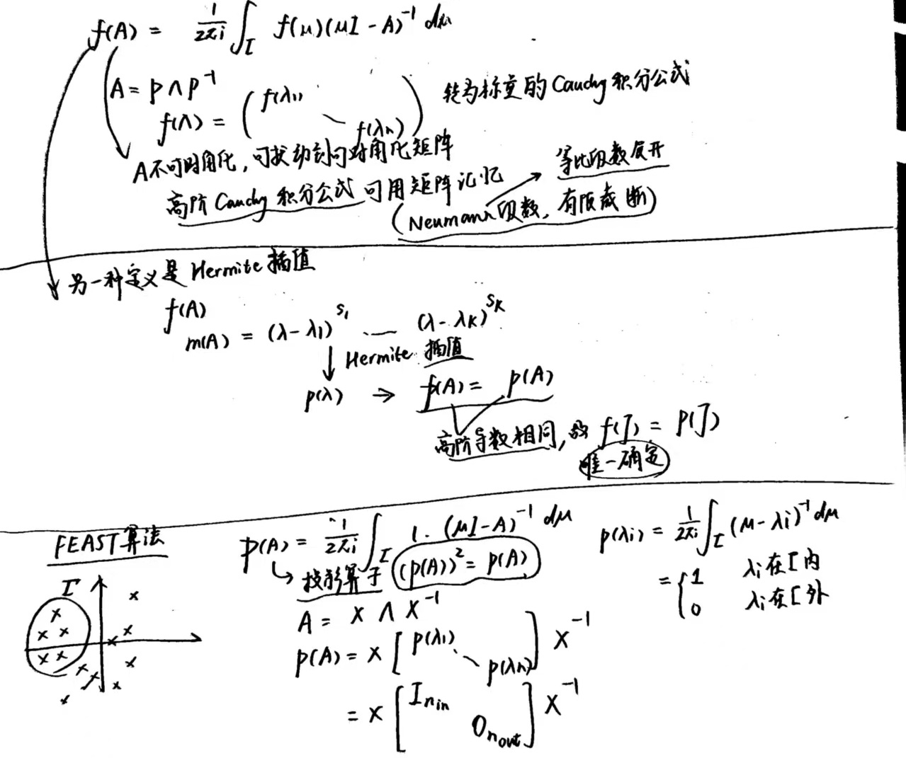
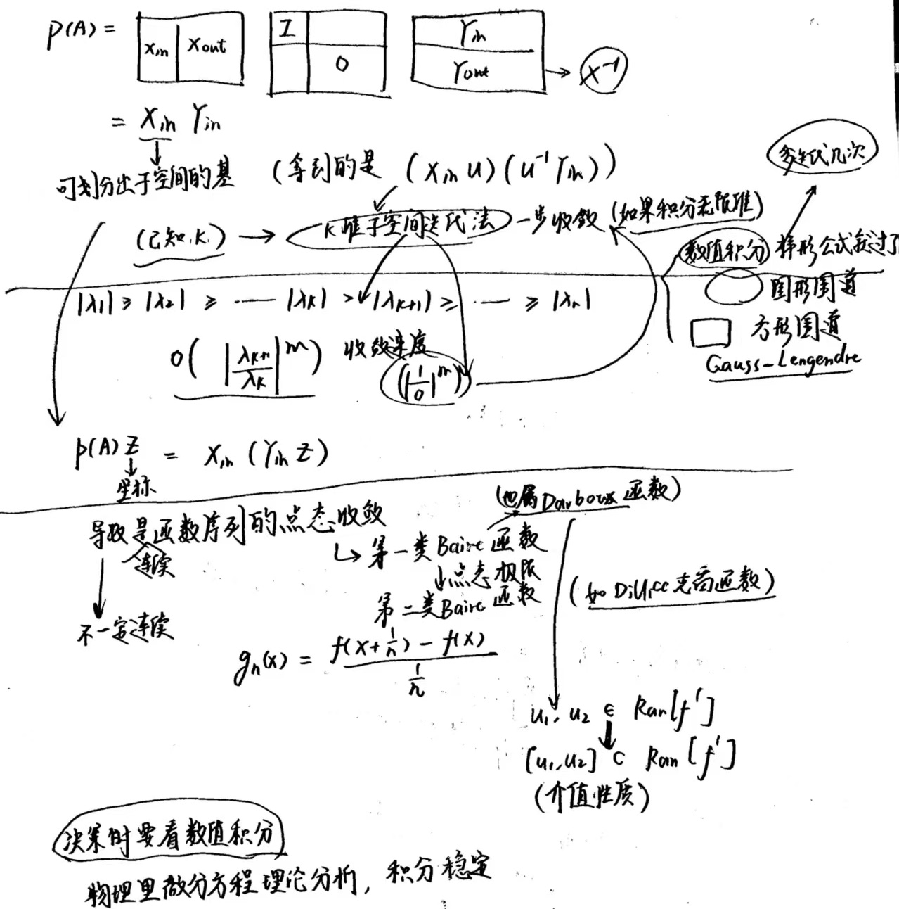

# FDU 数值算法 4. Krylov 子空间方法

本文参考以下教材:

- 数值线性代数 (第二版) 徐树方, 高立, 张平文 第 $5$ 章

欢迎批评指正!

## 4.1 共轭梯度法

使用超松弛迭代法求解线性方程组 $Ax=b$ 时，我们需要确定松弛因子 $\omega$.  
但只有系数矩阵 $A$ 具有较好的性质 (例如 $A$ 对称正定且具有相容次序) 时，我们才有可能找到最佳松弛因子 $\omega_{\text{opt}}$   
更何况计算 $\omega_{\text{opt}}$ 时需要首先求出 Jacobi 迭代矩阵的谱半径 $\rho(B^{(1)})$ (这通常是非常困难的)

我们将介绍一种不需要确定任何参数的求解对称正定线性方程组的方法——共轭梯度法.  
它已经成为求解大型稀疏线性方程组最受欢迎的一类方法.  

共枙梯度法有多种引入方法，这里我们采用较为直观的最优化问题来引入.  
为此，我们首先介绍最速下降法.

### 4.1.1 最速下降法

考虑线性方程组 $Ax=b$ 的求解问题.  
其中 $A\in \mathbb R^{n\times n}$ 是给定的对称正定阵.  
定义二次函数 $\varphi(x) = x^TAx - 2b^Tx$ 

**(数值线性代数, 定理 $5.1.1$)**   
对称正定线性方程组 $Ax=b$ 的解等价于二次函数 $\varphi(x) = x^TAx - 2b^Tx$ 的极小值点 (它是唯一的，因而是最小值点).

求解二次函数 $\varphi(x) = x^TAx - 2b^Tx$ 的极小值问题，  
通常从一个初始向量 $x^{(0)}$ 出发，按迭代格式 $x^{(k+1)} = x^{(k)} + t_k d^{(k)}$ 得到向量序列 $\{x^{(k)}\}$   
不同的确定搜索方向 $d^{(k)}$ 和步长 $t_k$ 的方法，就得到不同的迭代算法.

考虑最速下降法:

- 固定下降方向 $d^{(k)}$，考虑确定步长 $t_k$:  
  $$
  \begin{align}
  t_k &= \arg \min_{t>0} \varphi(x^{(k)} + t d^{(k)})\\
  &= \arg \{\frac{d}{dt} \varphi(x^{(k)} + td^{(k)})=0\}\quad (\text{note that }\varphi(x^{(k)} + t d^{(k)})\text{ is convex with respect to }t)\\
  &= \arg \{(d^{(k)})^T \nabla\varphi(x^{(k)} + td^{(k)}) = 0\}\\
  &= \arg \{(d^{(k)})^T [2A(x^{(k)}+td^{(k)})-2b] = 0\}\quad (\text{note that }\nabla\varphi(x) = 2Ax-2b)\\
  &= \arg \{2t (d^{(k)})^T A d^{(k)} + 2(d^{(k)})^T (Ax^{(k)}-b)=0\}\\
  &= \arg \{2t (d^{(k)})^T A d^{(k)} - 2(d^{(k)})^T r^{(k)} = 0\}\quad (\text{denote residual vector }r^{(k)} = b-Ax^{(k)})\\
  &= \frac{(d^{(k)})^T r^{(k)}}{(d^{(k)})^T A d^{(k)}}
  \end{align}
  $$
  因此步长 $t_k = \frac{(r^{(k)})^T d^{(k)}}{(d^{(k)})^T A d^{(k)}}$ (其中残差向量 $r^{(k)} = b-Ax^{(k)}$)   
  那么 $\varphi(x^{(k+1)}) = \varphi(x^{(k)} + t_k d^{(k)})$ 在什么条件下小于 $\varphi(x^{(k)})$ 呢?  
  $$
  \begin{align}
  \varphi(x^{(k+1)}) - \varphi(x^{(k)}) 
  &= 
  \varphi(x^{(k)} + t_k d^{(k)}) - \varphi(x^{(k)})\\
  &= 
  (x^{(k)} + t_k d^{(k)})^T A (x^{(k)} + t_k d^{(k)}) -2b^T (x^{(k)} + t_k d^{(k)}) - [(x^{(k)})^T A(x^{(k)}) - 2b^T x^{(k)}]\\
  &=
  t_k^2(d^{(k)})^T A d^{(k)} + 2t_k (d^{(k)})^T (Ax^{(k)}-b)\\
  &=
  t_k^2(d^{(k)})^T A d^{(k)} - 2t_k (d^{(k)})^T r^{(k)}\quad (\text{denote residual vector }r^{(k)} = b-Ax^{(k)})\\
  &=
  (\frac{(d^{(k)})^T r^{(k)}}{(d^{(k)})^T A d^{(k)}})^2 (d^{(k)})^T A d^{(k)} 
  - 2 \frac{(d^{(k)})^T r^{(k)}}{(d^{(k)})^T A d^{(k)}} (d^{(k)})^T r^{(k)}\\
  &=
  -\frac{[(d^{(k)})^T r^{(k)}]^2}{(d^{(k)})^T A d^{(k)}}\\
  &\leq 0
  \end{align}
  $$
  上式当且仅当 $(r^{(k)})^T d^{(k)}\neq 0$ 时严格成立.  
  因此只要 $(r^{(k)})^T d^{(k)}\neq 0$，就有 $\varphi(x^{(k+1)}) < \varphi(x^{(k)})$ 成立.

- 再考虑确定下降方向 $d^{(k)}$:  
  根据 $\varphi(x)$ 在 $x^{(k)}$ 的一阶 Taylor 展开式 $\varphi(x) = \varphi(x^{(k)}) + \nabla \varphi(x^{(k)})^T (x-x^{(k)}) + O(\|x-x^{(k)}\|)$ 可知，  
  在 $x^{(k)}$ 的足够小的邻域内，位移 $x-x^{(k)}$ 沿负梯度方向 $-\nabla \varphi(x^{(k)})$ 时下降最快  
  因此我们可取 $d^{(k)}=-\nabla \varphi(x^{(k)}) = -(2Ax^{(k)}-2b) = 2r^{(k)}$   
  (为与教材保持一致，我们丢弃系数 $2$，取 $d^{(k)}=r^{(k)}$)

  根据之前的结论，对应的步长 $t_k = \frac{(r^{(k)})^T d^{(k)}}{(d^{(k)})^T A d^{(k)}} = \frac{(r^{(k)})^T r^{(k)}}{(r^{(k)})^T A r^{(k)}}$   
  只要 $(r^{(k)})^T d^{(k)} = (r^{(k)})^T r^{(k)} = \|r^{(k)}\|_2^2\neq 0$，就有 $\varphi(x^{(k+1)}) < \varphi(x^{(k)})$ 成立.

综上所述，我们得到如下算法:  
**(最速下降法, 数值线性代数, 算法 $5.1.1$)**  
$$
\begin{align}
&\text{Given positive definite matrix }A,\text{ vector } b \text{ and initial point }x^{(0)}\\
& r^{(0)} = b-Ax^{(0)}\\
&\text{for }k=0:\text{max\_iter}-1\\
&\qquad t_{k} = \frac{(r^{(k)})^T r^{(k)}}{(r^{(k)})^T A r^{(k)}}\\
&\qquad x^{(k+1)} = x^{(k)} + t_{k} r^{(k)}\\
&\qquad r^{(k+1)} = b - Ax^{(k+1)} = b - A(x^{(k)}+t_k r^{(k)}) = r^{(k)}-t_k (Ar^{(k)})\quad (复用\ Ar^{(k)}\ 以规避一次矩阵乘法)\\
&\qquad k=k+1\\
&\qquad \text{if }\|r^{(k)}\|_2 < \text{tolerance}\quad \text{(终止条件)}\\
&\qquad\qquad \text{break}\\
&\qquad \text{end}\\
&\text{end}\\
& x= x^{(k)}
\end{align}
$$
**(最速下降法的收敛性, 数值线性代数, 定理 $5.1.2$)**  
考虑求解对称正定线性方程组 $Ax=b$，任意给定初始向量 $x^{(0)}$ 
设对称正定阵 $A\in \mathbb R^{n\times n}$ 的特征值为 $0<\lambda_1\leq \dots\leq \lambda_n$，  
则由最速下降法产生的序列 $\{x^{(k)}\}$ 满足: 
$$
\|x^{(k)}-x^\star\|_A \leq \left(\frac{\lambda_n - \lambda_1}{\lambda_n + \lambda_1} \right)^k \|x^{(0)}-x^\star\|_A\\
$$
其中精确解 $x^\star = A^{-1}b$，而范数 $\|\cdot \|_A$ 的定义为 $\|x\|_A := \sqrt{x^TAx}$

- 上述定理表明:  
  从任意初始向量 $x^{(0)}$ 出发，由最速下降法产生的序列 $\{x^{(k)}\}$ 总是收敛到对称正定线性方程组 $Ax=b$ 的精确解 $x=A^{-1}b$   
  其收敛速度的快慢由 $\frac{\lambda_n-\lambda_1}{\lambda_n + \lambda_1}$ 决定.   

- 虽然最速下降法简单易用，且能充分利用 $A$ 的稀疏性，  
  但是当问题相当病态 (即 $\lambda_1\ll \lambda_n\ \Rightarrow\ \frac{\lambda_n-\lambda_1}{\lambda_n + \lambda_1}\to 1$) 时，其收敛速度会变得非常慢，  
  因此很少用于对称正定线性方程组 $Ax=b$ 的实际求解.

  此外，它是一种贪心的算法.  
  可以证明其下降方向 (即负梯度方向，也即残差方向) 相互正交 (即 $(r^{(k+1)})^Tr^{(k)}=0$)  
  因此会呈现出锯齿状 (zig-zag) 收敛路径.   
  这表明最速下降法过分追求眼前利益 (局部的梯度信息)，缺少了全局的考量，因而其收敛效率可能并不高.

  然而它揭示了一种重要的思想，开辟了一条全新的求解线性方程组的途径.  
  我们对最速下降法稍加改进，就能得到著名的共轭梯度法.

### 4.1.2 共轭梯度法

对最速下降法做简单的分析就会发现，  
负梯度方向尽管是局部的最佳下降方向，但从全局来看并非最佳.  
这就促使我们寻找全局意义上更好的下降方向，但每步确定该下降方向的代价不要太大.  
共轭梯度法就是根据这一思想设计的，其具体计算过程如下:

给定初始向量 $x^{(0)}$，$k=0$ 时和最速下降法一致:
$$
d^{(0)} = r^{(0)} = b-Ax^{(0)}\\
t_0 = \frac{(r^{(0)})^T d^{(0)}}{(d^{(0)})^T A d^{(0)}} = \frac{(r^{(0)})^T r^{(0)}}{(r^{(0)})^T A r^{(0)}}\\
x^{(1)} = x^{(0)} + t_0 d^{(0)} = x^{(0)} + t_0 r^{(0)}\\
r^{(1)} = b - Ax^{(1)} = b - A(x^{(0)} + t_0 r^{(0)}) = r^{(0)} - t_0Ar^{(0)}
$$
对第 $k\geq 1$ 步，下降方向不再取负梯度方向 $-\nabla \varphi(x^{(k)}) = -(2Ax^{(k)}-2b) = 2r^{(k)}$ (一般丢弃系数 $2$)， 
而是在 $r^{(k)}$ 和 $d^{(k-1)}$ 所张成的二维平面 $S_k = \{x=x^{(k)} + \xi r^{(k)} + \eta d^{(k-1)}:\xi,\eta\in \mathbb R\}$ 内  
找到使函数 $\varphi$ 下降最快的方向作为新的下降方向 $d^{(k)}$  

将 $\varphi$ 限制在二维平面 $S_k = \{x=x^{(k)} + \xi r^{(k)} + \eta d^{(k-1)}:\xi,\eta\in \mathbb R\}$ 得到的新函数为:
$$
\begin{align}
g(\xi,\eta) 
&=
\varphi(x^{(k)} + \xi r^{(k)} + \eta d^{(k-1)})\\
&=
(x^{(k)} + \xi r^{(k)} + \eta d^{(k-1)})^T A (x^{(k)} + \xi r^{(k)} + \eta d^{(k-1)}) - 2b^T (x^{(k)} + \xi r^{(k)} + \eta d^{(k-1)})
\end{align}
$$
其偏导数为: 
$$
\begin{align}
\frac{\partial g(\xi,\eta)}{\partial \xi} 
&= (r^{(k)})^T \nabla \varphi (x^{(k)} + \xi r^{(k)} + \eta d^{(k-1)})\\
&= (r^{(k)})^T [2A(x^{(k)} + \xi r^{(k)} + \eta d^{(k-1)}) -2b]\quad (\text{note that }r^{(k)} = b-Ax^{(k)})\\
&= (r^{(k)})^T [2\xi A r^{(k)} + 2\eta A d^{(k-1)} -2r^{(k)}]\\
&= 2[\xi (r^{(k)})^T A r^{(k)} + \eta (r^{(k)})^T A d^{(k-1)} - (r^{(k)})^Tr^{(k)}]\\
\hline
\frac{\partial g(\xi,\eta)}{\partial \eta} 
&= (d^{(k-1)})^T \nabla \varphi (x^{(k)} + \xi r^{(k)} + \eta d^{(k-1)})\\
&= (d^{(k-1)})^T [2A(x^{(k)} + \xi r^{(k)} + \eta d^{(k-1)}) -2b]\quad (\text{note that }r^{(k)} = b-Ax^{(k)})\\
&= (d^{(k-1)})^T [2\xi A r^{(k)} + 2\eta A d^{(k-1)} -2r^{(k)}]\qquad\  (\text{note that }(r^{(k)})^T d^{(k-1)} = 0)\\
&= 2[\xi (d^{(k-1)})^T A r^{(k)} + \eta (d^{(k-1)})^T A d^{(k-1)} - (d^{(k-1)})^Tr^{(k)}]\\
&=
2[\xi (d^{(k-1)})^T A r^{(k)} + \eta (d^{(k-1)})^T A d^{(k-1)}]
\end{align}
$$

> 我们验证 $(r^{(k)})^T d^{(k-1)} = 0$:  
> $$
> \begin{align}
> (r^{(k)})^T d^{(k-1)} 
> &=
> (b-A x^{(k)})^T d^{(k-1)}\\
> &=
> [b-A(x^{(k-1)} + t_{k-1}d^{(k-1)})]^T d^{(k-1)}\\
> &=
> (r^{(k-1)} - t_{k-1} A d^{(k-1)})^T d^{(k-1)}\quad (\text{the best stepsize is } t_{k-1}=\frac{(r^{(k-1)})^T d^{(k-1)}}{(d^{(k-1)})^T A d^{(k-1)}})\\
> &=
> (r^{(k-1)})^Td^{(k-1)} - \frac{(r^{(k-1)})^T d^{(k-1)}}{(d^{(k-1)})^T A d^{(k-1)}} (d^{(k-1)})^T A d^{(k-1)}\\
> &= (r^{(k-1)})^Td^{(k-1)} - (r^{(k-1)})^Td^{(k-1)}\\
> &= 0
> \end{align}
> $$

由于 $\varphi$ 是一个凸二次函数，  
故 $\varphi$ 在二维平面 $S_k = \{x=x^{(k)} + \xi r^{(k)} + \eta d^{(k-1)}:\xi,\eta\in \mathbb R\}$ 中具有唯一的最小值点 $\tilde x$.  

令 $\begin{cases}
\frac{\partial g(\xi,\eta)}{\partial \xi} = 2[\xi (r^{(k)})^T A r^{(k)} + \eta (r^{(k)})^T A d^{(k-1)} - (r^{(k)})^Tr^{(k)}] = 0\\
\frac{\partial g(\xi,\eta)}{\partial \eta} = 2[\xi (d^{(k-1)})^T A r^{(k)} + \eta (d^{(k-1)})^T A d^{(k-1)}] = 0\end{cases}$ 可解得:   
$$
\tilde x = x^{(k)} + \tilde \xi r^{(k)} + \tilde \eta d^{(k-1)}\\
\text{where }\begin{cases}
\tilde \xi (r^{(k)})^T A r^{(k)} + \tilde \eta (r^{(k)})^T A d^{(k-1)} = (r^{(k)})^Tr^{(k)}\\
\tilde \xi (d^{(k-1)})^T A r^{(k)} + \tilde \eta (d^{(k-1)})^T A d^{(k-1)} = 0
\end{cases}\ \Rightarrow\ \frac{\tilde \eta}{\tilde \xi} = - \frac{ (d^{(k-1)})^T A r^{(k)}}{(d^{(k-1)})^T A d^{(k-1)}}
$$
显然当 $r^{(k)}\neq 0_n$ 时，我们有 $\tilde \xi\neq 0$，因此我们可取 $d^{(k)}$ 为:  
$$
d^{(k)} = \frac{1}{\tilde \xi}(\tilde x - x^{(k)}) = \frac{1}{\tilde \xi} (\tilde \xi r^{(k)} + \tilde \eta d^{(k-1)}) =r^{(k)} + \frac{\tilde \eta}{\tilde \xi} d^{(k-1)} = r^{(k)} - \frac{ (d^{(k-1)})^T A r^{(k)}}{(d^{(k-1)})^T A d^{(k-1)}} d^{(k-1)}
$$

> 我们验证 $(d^{(k)})^T A d^{(k-1)}=0$ :  
> $$
> \begin{align}
> (d^{(k)})^T A d^{(k-1)}
> &=
> \left[r^{(k)} - \frac{ (d^{(k-1)})^T A r^{(k)}}{(d^{(k-1)})^T A d^{(k-1)}} d^{(k-1)} \right]^T A d^{(k-1)}\\
> &=
> (r^{(k)})^T A d^{(k-1)} - \frac{ (d^{(k-1)})^T A r^{(k)}}{(d^{(k-1)})^T A d^{(k-1)}}(d^{(k-1)})^T A d^{(k-1)}\\
> &=
> (r^{(k)})^T A d^{(k-1)} - (d^{(k-1)})^T A r^{(k)}\\
> &= 0
> \end{align}
> $$
> 也就是说，相邻两次迭代的下降方向 $d^{(k)}$ 和 $d^{(k-1)}$ 是相互共轭的 (关于 $A$ 的内积为 $0$)

这样我们就知道了 $d^{(k-1)}$, $r^{(k)}$ 和 $d^{(k)}$ 之间存在关系 $\begin{cases}
(r^{(k)})^T d^{(k-1)} = 0\\
(d^{(k)})^T A d^{(k-1)}=0 \end{cases}$     
其几何意义如同所示 **(记号不一致, 待修改)**:

*****

综上所述，我们得到如下的计算公式 $(k\geq 0)$:
$$
d^{(0)} = r^{(0)} = b-Ax^{(0)}\\
\hline
t_k = \frac{(r^{(k)})^T d^{(k)}}{(d^{(k)})^TA d^{(k)}}\\
x^{(k+1)} = x^{(k)} + t_k d^{(k)}\\
r^{(k+1)} = b-Ax^{(k+1)} = r^{(k)} - t_k Ad^{(k)}\\
\beta_k = -\frac{ (r^{(k+1)})^T A d^{(k)}}{(d^{(k)})^T A d^{(k)}} \\
d^{(k+1)} = r^{(k+1)} + \beta_k d^{(k)}
$$
在实际计算中，通常将上述公式进一步简化，从而得到形式上更简单且对称的计算公式.

- 简化 $t_k$ 的计算公式:  
  $$
  \begin{align}
  (r^{(k)})^T d^{(k)} 
  &=
  (r^{(k)})^T (r^{(k)} + \beta_{k-1} d^{(k-1)})\\
  &=
  (r^{(k)})^T r^{(k)} + \beta_{k-1} (r^{(k)})^T d^{(k-1)}\quad (\text{note that }(r^{(k)})^T d^{(k-1)}=0)\\
  &=
  (r^{(k)})^T r^{(k)}
  \end{align}
  $$
  因此 $t_k = \frac{(r^{(k)})^T d^{(k)}}{(d^{(k)})^TA d^{(k)}} = \frac{(r^{(k)})^T r^{(k)}}{(d^{(k)})^TA d^{(k)}}$ 

- 简化 $r^{(k+1)}$ 的计算公式:  
  $$
  \begin{align}
  r^{(k+1)} 
  &= b- Ax^{(k+1)}\\
  &= b- A(x^{(k)} + t_k d^{(k)})\\
  &= r^{(k)} - t_k A d^{(k)}
  \end{align}
  $$
  注意到 $Ad^{(k)}$ 在计算 $t_k = \frac{(r^{(k)})^T d^{(k)}}{(d^{(k)})^TA d^{(k)}}$ 时已经计算过了.  

- 简化 $\beta_k$ 的计算公式:     
  由 $r^{(k+1)}=r^{(k)} - t_k A d^{(k)}$ 我们得到:
  $$
  \begin{align}
  (r^{(k+1)})^T A d^{(k)}
  &= 
  (r^{(k+1)})^T\cdot \frac{1}{t_k} (r^{(k)}-r^{(k+1)})\\
  &=
  \frac{1}{t_k} [(r^{(k+1)})^T r^{(k)}-(r^{(k+1)})^T r^{(k+1)}]\quad (\text{note that }(r^{(k+1)})^T r^{(k)} = 0)\\
  &=
  -\frac{1}{t_k}(r^{(k+1)})^T r^{(k+1)}\quad (\text{note that }t_k = \frac{(r^{(k)})^T d^{(k)}}{(d^{(k)})^TA d^{(k)}} = \frac{(r^{(k)})^T r^{(k)}}{(d^{(k)})^TA d^{(k)}})\\
  &=
  -\frac{1}{\frac{(r^{(k)})^T r^{(k)}}{(d^{(k)})^TA d^{(k)}}} (r^{(k+1)})^T r^{(k+1)}\\
  &=
  -\frac{(r^{(k+1)})^T r^{(k+1)}}{(r^{(k)})^T r^{(k)}} (d^{(k)})^TA d^{(k)}
  \end{align}
  $$
  因此 $\beta_k = -\frac{ (r^{(k+1)})^T A d^{(k)}}{(d^{(k)})^T A d^{(k)}} = -\frac{-\frac{(r^{(k+1)})^T r^{(k+1)}}{(r^{(k)})^T r^{(k)}} (d^{(k)})^TA d^{(k)}}{(d^{(k)})^T A d^{(k)}} = \frac{(r^{(k+1)})^T r^{(k+1)}}{(r^{(k)})^T r^{(k)}}$ 

  > 我们验证 $(r^{(k+1)})^T r^{(k)}=0$ :  
  > $$
  > \begin{align}
  > (r^{(k+1)})^T r^{(k)}
  > &= 
  > (r^{(k+1)})^T (d^{(k)}-\beta_{k-1}d^{(k-1)})\quad (\text{note that }d^{(k+1)} = r^{(k+1)} + \beta_k d^{(k)})\\
  > &=
  > (r^{(k+1)})^T d^{(k)} - \beta_{k-1} (r^{(k+1)})^T d^{(k-1)}\quad (\text{note that }(r^{(k+1)})^T d^{(k)}=(r^{(k+1)})^T d^{(k-1)} = 0)\\
  > &=0
  > \end{align}
  > $$

综上所述，简化后的计算公式为 $(k\geq 0)$: 
$$
d^{(0)} = r^{(0)} = b-Ax^{(0)}\\
\hline
t_k = \frac{(r^{(k)})^T r^{(k)}}{(d^{(k)})^TA d^{(k)}}\\
x^{(k+1)} = x^{(k)} + t_k d^{(k)}\\
r^{(k+1)}=r^{(k)} - t_k A d^{(k)}\\
(\text{note that }Ad^{(k)} \text{ is already at hand after computing }t_k)\\
\beta_k = \frac{(r^{(k+1)})^T r^{(k+1)}}{(r^{(k)})^T r^{(k)}} \\
d^{(k+1)} = r^{(k+1)} + \beta_k d^{(k)}
$$
于是我们得到如下算法:    
**(共轭梯度法, 数值线性代数, 算法 $5.2.1$)**  
$$
\begin{align}
&\text{Given positive definite matrix }A,\text{ vector } b \text{ and initial point }x^{(0)}\\
& r^{(0)} = b-Ax^{(0)}\\
& d^{(0)} = r^{(0)}\\
& k=0\\
&\text{while }r^{(k)}\neq 0_n\qquad (v^{(k)}\neq 0)\\

&\qquad t_k = \frac{(r^{(k)})^T r^{(k)}}{(d^{(k)})^TA d^{(k)}}
\qquad\quad\ \ \  (\begin{cases}
\rho^{(k)} = (r^{(k)})^T r^{(k)}\\
u^{(k)}=Ad^{(k)}\\
\end{cases};\ t_k = \frac{\rho^{(k)}}{(d^{(k)})^Tu^{(k)}})\\

&\qquad x^{(k+1)} = x^{(k)} + t_k d^{(k)}\\

&\qquad r^{(k+1)}=r^{(k)} - t_k A d^{(k)}\qquad (r^{(k+1)}=r^{(k)} - t_k u^{(k)})\\

&\qquad \beta_k = \frac{(r^{(k+1)})^T r^{(k+1)}}{(r^{(k)})^T r^{(k)}} 
\qquad\ \ \  (\beta_k = \frac{\rho^{(k+1)}}{\rho^{(k)}})\\

&\qquad d^{(k+1)} = r^{(k+1)} + \beta_k d^{(k)}\\
&\qquad k=k+1\\
&\text{end}\\
&x=x^{(k)}
\end{align}
$$

该算法每迭代一次仅需使用系数矩阵 $A$ 做一次矩阵-向量运算 $(u^{(k)}=Ad^{(k)})$ 

### 4.1.3 实用形式

**数值线性代数 定理 $5.2.1$** 表明，在共轭梯度法中，  
残差向量序列 $\{r^{(i)}\}_{i=0}^k$ 和下降方向向量序列 $\{d^{(i)}\}_{i=0}^k$ 分别是 Krylov 子空间 $\mathcal K(A,r^{(0)},k+1)$ 的正交基和共轭正交基.  
因此从理论上来说，利用共轭梯度法最多 $n$ 步便可得到方程组 $Ax=b$ 的精确解 $x^\star = A^{-1}b$   
它理论上是直接法，但在实际计算中其有限步终止性并不成立.  
这是由于误差的积累，导致序列 $\{r^{(i)}\}_{i=0}^k$ 和 $\{d^{(i)}\}_{i=0}^k$ 随迭代次数增加而很快丧失其正交性.

因此我们将共轭梯度法作为一种迭代法使用，  
而且通过设置 $\|r^{(k)}\|$ 的收敛阈值和最大迭代次数 $k_\max$ 来终止迭代.    
**(共轭梯度法的实用形式, 数值线性代数, 算法 $5.3.1$)**
$$
\begin{align}
&\text{Given positive definite matrix }A,\text{ vector } b \text{ and initial point }x^{(0)}\\
& x= x^{(0)}\\
& r = b-Ax\\
& d = r\\
& \rho = r^T r\\
& k=0\\
&\text{while }(\sqrt{\rho}>\varepsilon\|b\|_2)\text{ and }(k<k_\max)\\

&\qquad u = Ad\\
&\qquad t = \frac{\rho}{d^T u}\\

&\qquad x = x + t d\\

&\qquad r=r - t u\\
&\qquad \tilde \rho = \rho\\
&\qquad \rho = r^Tr\\

&\qquad \beta = \frac{\rho}{\tilde \rho}\\

&\qquad d = r + \beta d\\
&\qquad k=k+1\\
&\text{end}\\
\end{align}
$$
共轭梯度法作为一种实用的迭代法，它主要有以下优点:

- 不需要预先估计任何参数   
  (区别于超松弛迭代法，它需要估计最优松弛因子 $\omega_{\text{opt}}$)
- 每步迭代只需使用系数矩阵 $A$ 做一次矩阵-向量运算 $u=Ad$   
  这不仅可以充分利用 $A$ 的稀疏性，  
  而且适用于某些提供矩阵 $A$ 显式形式较为困难，但由已知向量 $d$ 产生 $u=Ad$ 却十分方便的应用问题.
- 每步迭代主要进行的是向量之间的运算，因此特别便于并行化

### 4.1.4 收敛性分析

**(数值线性代数, 定理 $5.2.1$)**   
考虑对称正定线性方程组 $Ax=b$  
由共轭梯度法得到的残差向量序列 $\{r^{(i)}\}_{i=0}^k$ 和下降方向向量序列 $\{d^{(i)}\}_{i=0}^k$ 具有以下性质:

- $(d^{(i)})^Tr^{(j)} =0\ \ (0\leq i<j\leq k)$ 
- $(r^{(i)})^Tr^{(j)} =0\ \ (0\leq i\neq j\leq k)$ 
- $(d^{(i)})^T A d^{(j)} = 0\ \ (0\leq i\neq j \leq k)$ 
- $\text{span}\{r^{(0)},\dots,r^{(k)}\} = \text{span}\{d^{(0)},\dots, d^{(k)}\} = \mathcal K(A,r^{(0)},k+1)$   
  其中 **Krylov 子空间** $\mathcal K(A,r^{(0)},k+1):=\text{span}\{r^{(0)},A r^{(0)},\dots,A^k r^{(0)}\}$ 

**上述定理表明:**  
残差向量序列 $\{r^{(i)}\}_{i=0}^k$ 和下降方向向量序列 $\{d^{(i)}\}_{i=0}^k$ 分别是 Krylov 子空间 $\mathcal K(A,r^{(0)},k+1)$ 的正交基和共轭正交基.  
因此从理论上来说，利用共轭梯度法最多 $n$ 步便可得到方程组 $Ax=b$ 的精确解 $x^\star = A^{-1}b$   
它理论上是直接法，但在实际计算中其有限步终止性并不成立.  
这是由于误差的积累，导致序列 $\{r^{(i)}\}_{i=0}^k$ 和 $\{d^{(i)}\}_{i=0}^k$ 随迭代次数增加而很快丧失其正交性.

**回顾共轭梯度法的计算公式及其简化版本:**
$$
d^{(0)} = r^{(0)} = b-Ax^{(0)}\\
\hline
t_k = \frac{(r^{(k)})^T d^{(k)}}{(d^{(k)})^TA d^{(k)}} = \frac{(r^{(k)})^T r^{(k)}}{(d^{(k)})^TA d^{(k)}}\\
x^{(k+1)} = x^{(k)} + t_k d^{(k)}\\
r^{(k+1)} = b-Ax^{(k+1)} = r^{(k)} - t_k A d^{(k)}\\
(\text{note that }Ad^{(k)} \text{ is already at hand after computing }t_k)\\
\beta_k = -\frac{ (r^{(k+1)})^T A d^{(k)}}{(d^{(k)})^T A d^{(k)}} = \frac{(r^{(k+1)})^T r^{(k+1)}}{(r^{(k)})^T r^{(k)}}\\
d^{(k+1)} = r^{(k+1)} + \beta_k d^{(k)}\\
$$
**用数学归纳法证明:**    
当 $k=1$ 时，我们有: 
$$
d^{(0)} = r^{(0)} = b-Ax^{(0)}\\
t_0 = \frac{(r^{(0)})^T r^{(0)}}{(d^{(0)})^TA d^{(0)}}\\
x^{(1)} = x^{(0)} + t_0 d^{(0)}\\
r^{(1)} = r^{(0)} - t_0 A d^{(0)}\\
\beta_0 = -\frac{ (r^{(1)})^T A d^{(0)}}{(d^{(0)})^T A d^{(0)}} =\frac{(r^{(1)})^T r^{(1)}}{(r^{(0)})^T r^{(0)}} \\
d^{(1)} = r^{(1)} + \beta_0 d^{(0)}
$$
于是有:
$$
(d^{(0)})^T r^{(1)} = (r^{(0)})^T r^{(1)} = (r^{(0)})^T (r^{(0)}-t_0 A d^{(0)}) = (r^{(0)})^T r^{(0)} -\frac{(r^{(0)})^T r^{(0)}}{(d^{(0)})^TA d^{(0)}} (r^{(0)})^T A d^{(0)} = 0\\

(d^{(0)})^T A d^{(1)} = (r^{(0)})^T A (r^{(1)} + \beta_0 d^{(0)}) = (r^{(0)})^T A r^{(1)} -\frac{ (r^{(1)})^T A d^{(0)}}{(d^{(0)})^T A d^{(0)}} (r^{(0)})^T A d^{(0)} = 0\\

\text{span}\{d^{(0)},d^{(1)}\} = \text{span}\{r^{(0)}, r^{(1)} + \beta_0 r^{(0)}\} = \text{span}\{r^{(0)},r^{(1)}\} = \text{span}\{r^{(0)}, r^{(0)} - t_0 A d^{(0)}\} = \text{span}\{r^{(0)}, Ar^{(0)}\}
$$
因此命题对 $k=1$ 的情况成立. 

现在假设命题对 $k\geq 1$ 成立，我们来证明其对 $k+1$ 也成立.  

- ① 要证明 $(d^{(i)})^Tr^{(j)} =0\ \ (0\leq i<j\leq k+1)$，只要证明 $(d^{(i)})^Tr^{(k+1)} =0\ \ (0\leq i\leq k)$:  
  对于 $i=k$ 的情况，我们有:
  $$
  \begin{align}
  (d^{(k)})^T r^{(k+1)} 
  &=
  (d^{(k)})^T(b-A x^{(k+1)})\\
  &= (d^{(k)})^T[b-A (x^{(k)} +t_k d^{(k)})]\\
  &= (d^{(k)})^T(r^{(k)} - t_k Ad^{(k)})\\
  &= (d^{(k)})^Tr^{(k)} - \frac{(r^{(k)})^T d^{(k)}}{(d^{(k)})^TA d^{(k)}} (d^{(k)})^T A d^{(k)}\\
  &= 0
  \end{align}
  $$
  对于 $0\leq i\leq k-1$ 的情况，我们有: 
  $$
  \begin{align}
  (d^{(i)})^T r^{(k+1)} 
  &=
  (d^{(i)})^T(b-A x^{(k+1)})\\
  &= (d^{(i)})^T[b-A (x^{(k)} +t_k d^{(k)})]\\
  &= (d^{(i)})^T(r^{(k)} - t_k Ad^{(k)})\\
  &= (d^{(i)})^Tr^{(k)} - \frac{(r^{(k)})^T d^{(k)}}{(d^{(k)})^TA d^{(k)}} (d^{(i)})^T A d^{(k)}
  \quad(根据归纳假设有
  \begin{cases}
  (d^{(i)})^Tr^{(k)} = 0\\
  (d^{(i)})^T A d^{(k)} = 0
  \end{cases})\\
  &= 0
  \end{align}
  $$

- ② 由归纳假设可知 $\text{span}\{r^{(0)},\dots,r^{(k)}\} = \text{span}\{d^{(0)},\dots, d^{(k)}\}$   
  而由 ① 可知 $r^{(k+1)}$ 与 $d^{(0)},\dots,d^{(k)}$ 正交，因而 $r^{(k+1)}$ 也与 $r^{(0)},\dots,r^{(k)}$ 正交，  
  即有 $(r^{(i)})^Tr^{(k+1)} =0\ \ (0\leq i\leq k)$ 成立，  
  结合归纳假设 $(r^{(i)})^Tr^{(j)} =0\ \ (0\leq i\neq j\leq k)$   
  可知 $(r^{(i)})^Tr^{(j)} =0\ \ (0\leq i\neq j\leq k+1)$ 成立.

- ③ 要证明 $(d^{(i)})^T A d^{(j)} = 0\ \ (0\leq i\neq j \leq k+1)$，只要证明 $\begin{cases}
  (d^{(i)})^T A d^{(k+1)} = 0\ \ (0\leq i\leq k-1)\\
  (d^{(k+1)})^T A d^{(k)} = 0\end{cases}$    
  对于 $(d^{(i)})^T A d^{(k+1)}\ \ (0\leq i\leq k-1)$，我们有:  
  $$
  \begin{align}
  (d^{(i)})^T A d^{(k+1)}
  &=
  (d^{(i)})^T A (r^{(k+1)} + \beta_k d^{(k)})\\
  &=
  (d^{(i)})^T A r^{(k+1)} + \beta_k (d^{(i)})^T A d^{(k)}\quad (根据归纳假设有\ (d^{(i)})^T A d^{(k)}=0)\\
  &=
  (d^{(i)})^T A r^{(k+1)} +0\quad (\text{note that }r^{(i+1)}=r^{(i)} - t_i A d^{(i)})\\
  &= [\frac1{t_i}(r^{(i+1)}-r^{(i)})]^T r^{(k+1)}\\
  &= \frac1{t_i}[(r^{(i+1)})^T r^{(k+1)} - (r^{(i)})^T r^{(k+1)}]\quad (根据归纳假设有\ (r^{(i+1)})^T r^{(k+1)}=(r^{(i)})^T r^{(k+1)}=0)\\
  &= \frac1{t_i}(0-0)\\
  &= 0
  \end{align}
  $$
   对于 $(d^{(k+1)})^T A d^{(k)}$，我们有: 
  $$
  \begin{align}
  (d^{(k+1)})^T A d^{(k)}
  &=
  (r^{(k+1)} + \beta_k d^{(k)})^T A d^{(k)}\\
  &=
  (r^{(k+1)})^T A d^{(k)} + \beta_k (d^{(k)})^T A d^{(k)}\\
  &=
  (r^{(k+1)})^T A d^{(k)} -\frac{ (r^{(k+1)})^T A d^{(k)}}{(d^{(k)})^T A d^{(k)}} (d^{(k)})^T A d^{(k)}\\
  &= 0
  \end{align}
  $$
  
- ④ 由归纳假设可知 $r^{(k)},d^{(k)} \in \mathcal K(A,r^{(0)},k+1) = \text{span}\{r^{(0)},Ar^{(0)},\dots,A^k r^{(0)}\}$  
  于是我们有:
  $$
  r^{(k+1)} = r^{(k)} - t_k A d^{(k)} \in \mathcal K(A,r^{(0)},k+2) = \text{span}\{r^{(0)},Ar^{(0)},\dots,A^k r^{(0)},A^{k+1}r^{(0)}\}\\
  
  d^{(k+1)} = r^{(k+1)} + \beta_k d^{(k)} \in \mathcal K(A,r^{(0)},k+2) = \text{span}\{r^{(0)},Ar^{(0)},\dots,A^k r^{(0)},A^{k+1}r^{(0)}\}\\
  $$
  又注意到 ②③ 的结果表明:  
  向量组 $r^{(0)},\dots,r^{(k)},r^{(k+1)}$ 和 $d^{(0)},\dots,d^{(k)},d^{(k+1)}$ 都是线性无关的，  
  因此 $\text{span}\{r^{(0)},\dots,r^{(k)},r^{(k+1)}\} = \text{span}\{d^{(0)},\dots, d^{(k)},d^{(k+1)}\} = \mathcal K(A,r^{(0)},k+2)$ 

综上所述，定理得证.

***

**(数值线性代数, 定理 $5.2.2$)**     
用共轭梯度法计算的近似解 $x^{(k)}$ 满足:
$$
\varphi(x^{(k)}) = \min\{\varphi(x):x\in x^{(0)} + \mathcal K(A,r^{(0)},k)\}\ \text{where } \varphi(x) = x^TAx - 2b^Tx\\

\|x^{(k)}-x^{\star}\|_A = \min \{\|x-x^\star\|_A : x\in x^{(0)} + \mathcal K(A,r^{(0)},k)\}
$$
其中精确解 $x^\star = A^{-1}b$，而范数 $\|\cdot \|_A$ 的定义为 $\|x\|_A := \sqrt{x^TAx}$   
Krylov 子空间 $\mathcal K(A,r^{(0)},k) = \{r^{(0)},Ar^{(0)},\dots,Ar^{(k-1)}\}$ 

***

**(共轭梯度法的收敛性, 数值线性代数, 定理 $5.3.1$)**  
考虑对称正定线性方程组 $Ax=b$，将 $A$ 分解为 $A=I+B$.  
共轭梯度法至多迭代 $\rank(B)+1$ 步即可得到 $Ax=b$ 的精确解 $x^\star = A^{-1}b$ 

- **上述定理表明:**  
  若系数矩阵 $A$ 减去单位阵 $I$ 得到的矩阵 $B$ 的秩 $\rank(B)$ 很小，  
  则共轭迭代法将会收敛得很快 (在 $\rank(B)+1$ 步内收敛).  
  其中 "$\rank(B)$ 很小" 保证了共轭梯度法的残差向量序列 $\{r^{(i)}\}_{i=0}^k$ 的正交性还没有因误差积累而丧失.

- **证明:**   
  设初始向量为 $x^{(0)}$，对应的残差向量为 $r^{(0)}=b-Ax^{(0)}$ 

  注意到 $\rank(B)=r$ 意味着对于任意 $k\geq 0$，Krylov 子空间 $\mathcal K(A,r^{(0)},k+1)$ 的维度都不会超过 $r+1$.  
  $$
  \text{span}\{r^{(0)},Ar^{(0)},\dots, A^k r^{(0)}\} = \text{span}\{r^{(0)},(I+B)r^{(0)},\dots,(I+B)^k r^{(0)}\} = \text{span}\{r^{(0)},Br^{(0)},\dots, B^k r^{(0)}\}\\
  \Rightarrow\\
  \dim(\text{span}\{r^{(0)},Ar^{(0)},\dots, A^k r^{(0)}\}) =\dim(\text{span}\{r^{(0)},Br^{(0)},\dots, B^k r^{(0)}\}) \leq \rank(B) + 1
  $$
  根据**数值线性代数 定理 $5.2.1$** 可知 $\text{span}\{r^{(0)},\dots,r^{(k)}\} = \mathcal K(A,r^{(0)},k+1)$  
  而且 $r^{(0)},\dots,r^{(k)}$ 相互正交，因此 $\dim(\mathcal K(A,r^{(0)},k+1)) = \dim(\text{span}\{r^{(0)},\dots,r^{(k)}\}) = k+1$ 

  当共轭梯度法的迭代进行到第 $\rank(B)+1$ 步 (即 $k=\rank(B)$) 时，  
  我们有 $\dim(\mathcal K(A,r^{(0)},\rank(B)+1))=\rank(B)+1$  
  于是一定有 $x^\star = A^{-1}b\in \mathcal K(A,r^{(0)},\rank(B)+1)$   
  再结合**数值线性代数 定理 $5.2.2$** 可知 $\|x^{(k)}-x^\star\|_A = \sqrt{(x^{(k)}-x^\star)^T A (x^{(k)}-x^\star)} = 0$，即 $x^{(k)}=x^\star$   
  命题得证.

***

**(共轭梯度法的误差估计, 数值线性代数, 定理 $5.3.2$)**  
考虑对称正定线性方程组 $Ax=b$  
共轭梯度法产生的序列 $\{x^{(k)}\}$ 满足:
$$
\|x^{(k)}-x^\star\|_A \leq 2(\frac{\sqrt{\kappa_2(A) -1}}{\sqrt{\kappa_2(A) + 1}})^k \|x^{(0)}-x^\star\|_A
$$
其中精确解 $x^\star = A^{-1}b$，而范数 $\|\cdot \|_A$ 的定义为 $\|x\|_A := \sqrt{x^TAx}$  
条件数 $\kappa_2(A) = \|A\|_2 \|A^{-1}\|_2 =\frac{\sigma_{\max}(A)}{\sigma_{\min}(A)}= \frac{\lambda_\max(A)}{\lambda_\min (A)}$  

- 上述定理给出的误差估计是十分粗糙的，实际计算中其收敛速度往往比这个估计快得多.  
  不过它揭示了共轭梯度法的一个重要性质:  
  只要对称正定线性方程组 $Ax=b$ 的系数矩阵 $A$ 是良态的 (即 $\kappa_2(A)\approx 1$)，共轭梯度法就会收敛得很快.

### 4.1.5 预优共轭梯度法

考虑对称正定线性方程组 $Ax=b$   
$4.1.4$ 节中的结论表明:  
当系数矩阵 $A$ 只有少数几个互不相同的特征值 (即 $\rank(A-I)$ 很小) 或非常良态 (即 $\kappa_2(A)\approx 1$) 时，  
共轭梯度法会收敛得非常快.    
这启发我们在应用共轭梯度法时，首先应设法将 $Ax=b$ 转化为一个等价方程组 $\tilde A \tilde x=\tilde b$，  
使得新的系数矩阵 $\tilde A$ 只有少数几个互不相同的特征值 (即 $\rank(\tilde A-I)$ 很小) 或非常良态 (即 $\kappa_2(\tilde A)\approx 1$)   

预优共轭梯度法正是基于这一基本思想产生的.  
它通过选择一个对称正定阵 $C$ 使得 $\tilde A=C^{-1}AC^{-1}$ 具有我们所希望的良好性质，然后应用共轭梯度法.  
其中我们记:  
$$
Ax=b\quad \Leftrightarrow\quad\tilde A \tilde x = \tilde b\\
\text{where }\tilde A=C^{-1}AC^{-1}\quad \tilde x = Cx\quad \tilde b = C^{-1}b
$$
我们有以下计算公式 (其中 $\tilde x^{(0)}$ 为任意初始向量):
$$
\tilde d^{(0)} = \tilde r^{(0)} = b-A \tilde  x^{(0)}\\
\hline
\tilde t_k = \frac{(\tilde r^{(k)})^T \tilde r^{(k)}}{(\tilde d^{(k)})^T\tilde A \tilde d^{(k)}}\\
\tilde x^{(k+1)} = \tilde x^{(k)} + \tilde t_k \tilde d^{(k)}\\
\tilde r^{(k+1)} = \tilde r^{(k)} - \tilde t_k \tilde A \tilde d^{(k)}\\
(\text{note that }\tilde A \tilde d^{(k)} \text{ is already at hand after computing }\tilde t_k)\\
\tilde \beta_k = \frac{(\tilde r^{(k+1)})^T \tilde r^{(k+1)}}{(\tilde r^{(k)})^T \tilde r^{(k)}} \\
\tilde d^{(k+1)} = \tilde r^{(k+1)} + \tilde \beta_k \tilde d^{(k)}
$$
按照上述公式迭代，我们需要事先计算 $\begin{cases}
\tilde A=C^{-1}AC^{-1}\\
\tilde b = C^{-1}b\end{cases}$   
最后还要将迭代得到的近似解 $\tilde x^{(k)}$ 变换回 $x^{(k)}$，即 $x^{(k)}=C^{-1}\tilde x^{(k)}$   
实际上这些计算都是可以规避的.

记 $M=C^2$，并代入 $\begin{cases}
x^{(k)}=C^{-1}\tilde x^{(k)}\\
\tilde r^{(k)} = \tilde b - \tilde A \tilde x^{(k)} = C^{-1}b - C^{-1}AC^{-1} \cdot Cx^{(k)}= C^{-1}(b-Ax^{(k)})=C^{-1} r^{(k)}\\
\tilde d^{(k)} = Cd^{(k)}\quad (根据正交性结论推知)\end{cases}$ 即得:  
$$
r^{(0)} = b-Ax^{(0)}\\
d^{(0)} = z^{(0)} = M^{-1}r^{(0)}\\
\hline
t_k = \frac{(r^{(k)})^T z^{(k)}}{(d^{(k)})^TA d^{(k)}}\\
x^{(k+1)} = x^{(k)} + t_k d^{(k)}\\
r^{(k+1)} = r^{(k)} - t_k A d^{(k)}\\
(\text{note that }Ad^{(k)} \text{ is already at hand after computing }t_k)\\
z^{(k+1)} = M^{-1}r^{(k+1)}\\
\beta_k = \frac{(r^{(k+1)})^T z^{(k+1)}}{(r^{(k)})^T z^{(k)}} \\
d^{(k+1)} = z^{(k+1)} + \beta_k d^{(k)}
$$
这样就得到了如下算法:    
**(预优共轭梯度法, 数值线性代数, 算法 $5.4.1$)**
$$
\begin{align}
&\text{Given positive definite matrix }A,\text{ vector } b \text{ and initial point }x^{(0)}\\
& x= x^{(0)}\\
& r = b-Ax\\
& z = M^{-1}r\quad (\text{solve }Mz=r)\\
& d = z\\
& \rho = r^T z\\
& k=0\\
&\text{while }(\sqrt{r^Tr}>\varepsilon\|b\|_2)\text{ and }(k<k_\max)\\

&\qquad u = Ad\\
&\qquad t = \frac{\rho}{d^T u}\\

&\qquad x = x + t d\\

&\qquad r=r - t u\\
&\qquad z = M^{-1}r\quad (\text{solve }Mz=r)\\
&\qquad \tilde \rho = \rho\\
&\qquad \rho = r^Tz\\

&\qquad \beta = \frac{\rho}{\tilde \rho}\\

&\qquad d = z + \beta d\\
&\qquad k=k+1\\
&\text{end}\\
\end{align}
$$
我们称 $M=C^2$ 为**预优矩阵**，它是一个对称正定阵.

****

利用共轭梯度法的性质易知预优共轭梯度法具有如下性质:  

- 残差向量 $\{r^{(i)}\}_{i=0}^k$ 是相互 $M^{-1}$ 正交的，即 $(r^{(i)})^TM^{-1}r^{(j)}=0\ \ (0\leq i\neq j\leq k)$
- 方向向量 $\{d^{(i)}\}_{i=0}^k$ 是相互 $A$ 正交的，即 $(d^{(i)})^T A d^{(j)} = 0\ \ (0\leq i\neq j \leq k)$ 
- $(d^{(i)})^Tr^{(j)} =0\ \ (0\leq i<j\leq k)$ 
- 近似解 $x^{(k)}$ 满足 $\|x^{(k)}-x^\star\|_A \leq 2(\frac{\sqrt{\kappa_2(M^{-1}A) -1}}{\sqrt{\kappa_2(M^{-1}A) + 1}})^k \|x^{(0)}-x^\star\|_A$     
  其中精确解 $x^\star = A^{-1}b$，而范数 $\|\cdot \|_A$ 的定义为 $\|x\|_A := \sqrt{x^TAx}$  
  条件数 $\kappa_2(M^{-1}A) = \|M^{-1}A\|_2 \|(M^{-1}A)^{-1}\|_2 =\frac{\sigma_{\max}(M^{-1}A)}{\sigma_{\min}(M^{-1}A)}= \frac{\lambda_\max(M^{-1}A)}{\lambda_\min (M^{-1}A)}$   

预优共轭梯度法成功与否，关键在于预优矩阵 $M$ 选取得是否合适.  
一个好的预优矩阵 $M$ 应具有如下的特征:

- $M$ 对称正定
- $M$ 是稀疏的
- $M^{-1}A$ 仅有少数几个互不相同的特征值 (即 $\rank(M^{-1}A)$ 很小) 或大部分特征值都集中在某点附近
- 形如 $Mz=r$ 的方程组易于求解

下面简要地介绍几种常用地预优矩阵的选取技巧:

- **(1) 对角预优矩阵:**  
  若系数矩阵 $A$ 的对角元相差较大，则可取 $M=\text{diag}(a_{11},\dots,a_{nn})$ (它自然是对称正定且稀疏的)  
  若系数矩阵 $A=\begin{bmatrix}
  A_{11} & \dotsm & A_{1p}\\
  \vdots && \vdots\\
  A_{p1} & \dotsm & A_{pp}\end{bmatrix}$ 的对角块 $A_{ii}\ (i=1,\dots,p)$ 是易于求逆的方阵，  
  则可取 $M=\text{diag}(A_{11},\dots,A_{pp})$

- **(2) 不完全 Cholesky 因子预优矩阵:**  
  首先计算系数矩阵 $A$ 的不完全 Cholesky 分解 $A=LL^T + R$ (其中 $L$ 是单位下三角阵)，  
  然后取预优矩阵 $M=LL^T$ 

  由于分解中有一个剩余矩阵 $R$，故我们可以要求 $L$ 具有某种需要的稀疏性 (例如与 $A$ 相同的稀疏性)  
  当然，为使得到的预优矩阵有效，还需使 $LL^T$ 尽可能接近 $A$   

  这种预优矩阵的缺点是:  
  求解 $Mz=LL^T z= r$ 等价于求解两个三角方程组 $\begin{cases}
  Ly = r\\
  L^Tz=y\end{cases}$   
  尽管三角方程组可通过前代法和回代法求解，但这两个算法的并行效率是很低的.

- **(3) 多项式预优矩阵:**  
  由于预优矩阵 $M$ 实质上是系数矩阵 $A$ 的某种近似，  
  故我们可将 $Mz=r$ 的解 $z$ 看作 $Az=r$ 的解的近似.

  求 $Az=r$ 近似解的最自然的方法就是**单步线性定常迭代法**:  
  假设 $A = A_1 - A_2$ 是 $A$ 的一种较好的分解，考虑迭代 $\begin{cases}
  z^{(0)} = 0_n\\
  A_1 z^{(k+1)} = A_2 z^{(k)} + r
  \end{cases}$   
  记迭代矩阵和常数项 $\begin{cases}
  B= A^{-1}_1 A_2\\
  c = A_1^{-1} r\end{cases}$ 即有迭代格式 $z^{(k+1)} = Bz^{(k)} + c$   
  我们可取 $p$ 次迭代解为 $z$ 的近似解: $z=z^{(p)} = (I+B+\dotsm+B^{p-1})c = (I+B+\dotsm+B^{p-1})A_1^{-1}r$   
  从而可取 $M^{-1} = (I+B+\dotsm+B^{p-1})A_1^{-1}$  
  在实际计算中，我们并不需要将 $M^{-1}$ 显式地计算出来，  
  只需由迭代格式 $z^{(k+1)} = Bz^{(k)} + c$ 产生 $p$ 次迭代解 $z^{(p)}$ 即可.  
  因此这一方法特别有利于并行化.

## 4.2 Krylov 子空间方法

如何利用共轭梯度法的基本思想去求解一般的线性方程组 $Ax=b$ (其中仅假设 $A$ 为非奇异方阵)?   

### 4.2.1 基本框架

(Krylov 子空间方法的基本框架)

#### (1) 正则化方法

我们将非奇异线性方程组 $Ax=b$ 转换为对称正定线性方程组 $A^TAx = A^Tb$，并应用共轭梯度法.  
虽然这一方法简单易行，且对于一些没有什么特殊结构的线性方程组来说通常是有效的，  
但当 $A$ 病态 (即 $\kappa_2(A)\gg 1$) 时，条件数 $\kappa_2(A^TA)=(\kappa_2(A))^2$ 会非常大，使得问题对舍入误差异常敏感.

为避免正则化方法的缺点，人们找到了两类依赖于 $\kappa_2(A)$ (而不是其平方 $(\kappa_2(A))^2$) 的有限方法.  
一类是残量极小化方法，另一种是残量正交化方法.

#### (2) 残量极小化方法

共轭梯度法求解对称正定线性方程组 $Ax=b$ 的第 $k$ 次迭代实质上是:  
求解 $x^{(k)}\in x^{(0)} + \mathcal K(A,r^{(0)},k)$ 使得 $\varphi(x^{(k)}) = \min \{\varphi(x):x\in x^{(0)} + \mathcal K(A,r^{(0)},k)\}$   
其中 $\begin{cases}
r^{(0)} = b-Ax^{(0)}\\
\mathcal K(A,r^{(0)},k) = \text{span}\{r^{(0)},Ar^{(0)},\dots,A^{k-1}r^{(0)}\}\\
\varphi(x) = x^TAx - 2b^Tx\end{cases}$  

当 $A$ 不是对称正定阵时，$\varphi$ 在 $x^{(0)} + \mathcal K(A,r^{(0)},k)$ 上就不一定有极小值，  
因此直接使用共轭梯度法来求解一般的非奇异线性方程组 $Ax=b$ 是行不通的.  

然而这种思想可以推广到一般情形，即有**残量极小化方法**:  
求 $x^{(k)}\in x^{(0)} + \mathcal K(A,r^{(0)},k)$ 使得 $\|b-Ax^{(k)}\|_2 = \min \{\|b-Ax\|_2 : x\in x^{(0)} + \mathcal K(A,r^{(0)},k)\}$   
(函数 $\|b-Ax\|_2$ 是凸函数，因此在 $x^{(0)} + \mathcal K(A,r^{(0)},k)$ 上一定有极小值)

采用不同方法求解这一优化问题就会得到求解非奇异线性方程组 $Ax=b$ 的不同方法.  
其中最具代表性的方法主要有两种:

- 极小残量法 $(\text{MINRES})$ (求解对称不定线性方程组)
- 广义极小残量法 $(\text{GMRES})$ (求解非对称线性方程组)

#### (3) 残量正交化方法

共轭梯度法求解对称正定线性方程组 $Ax=b$ 的第 $k$ 次迭代实质上是:  
求解 $x^{(k)}\in x^{(0)} + \mathcal K(A,r^{(0)},k)$ 使得 $\varphi(x^{(k)}) = \min \{\varphi(x):x\in x^{(0)} + \mathcal K(A,r^{(0)},k)\}$   
其中 $\begin{cases}
r^{(0)} = b-Ax^{(0)}\\
\mathcal K(A,r^{(0)},k) = \text{span}\{r^{(0)},Ar^{(0)},\dots,A^{k-1}r^{(0)}\}\\
\varphi(x) = x^TAx - 2b^Tx\end{cases}$  

可以证明，当 $A$ 对称正定时，  
$\varphi(x^{(k)}) = \min \{\varphi(x):x\in x^{(0)} + \mathcal K(A,r^{(0)},k)\}$ 的充要条件是 $(b-Ax^{(k)})\ \bot\ \mathcal K(A,r^{(0)},k)$ 

**残量正交化方法**即从这一条件出发来构造求解非奇异线性方程组 $Ax=b$ 的迭代方法.  
其中最具代表性的方法主要有两种:

- **Arnoldi 方法** (求解非对称线性方程组) (FOM)
- $\text{SYMMLQ}$ 方法 (求解对称不定线性方程组)

****

GMRES

应用于奇异值

- $A^HA$ (计算最大、最小奇异值)

- 计算最大奇异值 (最小奇异值躲到中间了)  
  $$
  \begin{bmatrix}
  0  & A\\
  A^H & 0
  \end{bmatrix}
  $$
  直接应用 Lanzcos 算法没有用到 "其特征值 (奇异值) 成对出现" 的性质.

  (跳来跳去的初值)  
  $$
  \begin{bmatrix}
  0  & A\\
  A^H & 0
  \end{bmatrix}
  \begin{bmatrix}
  *  & \\
   & *
  \end{bmatrix}
  =
  \begin{bmatrix}
   & *\\
  * &
  \end{bmatrix}
  $$
  合适的初值，可以使得:  
  $$
  Q=
  \begin{bmatrix}
  * & 0 & * & 0 & \dotsm\\
  0 & * & 0 & * & \dotsm
  \end{bmatrix}\\
  T_k 
  $$
  (对角线是零的对称阵的特征值是成对出现的？三对角阵？)
  $$
  A^HU_k = V_k B_k^H\\
  AV_k = U_{k+1}\tilde B_k
  $$
  得出 Lanczos 双对角化 **(自动省去一次正交，并保证 $T_k$ 对角线有精确的零)**  
  一个产生上双对角阵？一个产生下双对角阵 (加秩一修正项)

  根据作用在什么上得到新的向量，Lanczos 双对角化有两种:  
  上双对角化 (Golub-Kahan)，下双对角化 (Paige and Saunders，最小二乘只能走这个，奇异值分解两个都可以走)
  $$
  AV_k = U_k B_k^H\\
  A^HU_k = V_{k+1}\tilde B_k
  $$

向前误差是条件数与向后误差的共同作用.

### 4.4.7 应用于最小二乘

### 4.4.8 Davidson 算法

### 4.4.9 FEAST 算法

### 4.4.10 总结

****

$X=\mathbb C^{n\times 5}$，假定 $X^HX=I$    
子空间逼近误差:
$$
R = AX - X(X^HAX)
$$
设 $X^HAX=U\Theta U^H$   
$$
U^HX^HAXU=\Theta\\
\tilde R = AXU-XU\Theta\\
\tilde R = RU
$$

***

4.4.2 FEAST

子空间基 $Q_k$ 的生成有其他方式.

**FEAST** (围道积分算中间特征值)

$A^H=A$   
围道 $\Gamma$ 将 $\alpha,\beta$ 包围.($\lambda_{in},\lambda_{out}$)  
设 $A= \sum_{i=1}^n \lambda_i q_iq_i^H$  
则我们有:  
$$
\begin{align}
p(A)
&=
\frac1{2\pi i} \int_\Gamma (\mu I-A)^{-1}d\mu\\
&=
Q (\frac1{2\pi i}\int_\Gamma \text{diag}\{\frac1{\mu-\lambda_1},\dots,\frac{1}{\mu-\lambda_n}\}d\mu)Q^H\\
&=
\sum_{\lambda_i(a,b)} q_iq_i^H\\
&=
Q_{in} Q_{in}^H\\
&=
[Q_{in},Q_{out}] (I\oplus 0) [Q_{in},Q_{out}]^H
\end{align}
$$
若 $\lambda_i$ 落在 $\Gamma$ 外，则其特征向量的方向被丢弃了

> Cauchy 积分公式:   
> **(Cauchy 积分公式, Complex Variables and Applications 第 54 节)**  
> 设函数 $f$ 在由一条**正向** (即逆时针方向) 的简单闭围道 $C$ 围成的闭区域 $\text{cl}(C)$ 上解析.  
> 若 $z_0$ 是 $C$ 内部的任意一点，则我们有:   
> $$
> f(z_0) = \frac{1}{2\pi i} \int_C \frac{f(z)}{z-z_0}dz
> $$
>

子空间迭代法:
$$
\begin{align}
Y=p(A)X 
&= \frac1{2\pi i} \int_\Gamma (\mu I-A)^{-1}Xd\mu\\
&= \frac1N \sum_{j=1}^N (\mu_j I -A)^{-1}X
\end{align}
$$
$\text{span}(Y)$ 找到一组标准正交基即得到 $Q_{in}$ 特征向量 (解多个线性方程组)

****

FEAST 如果确定围道的包含的特征值个数？  
$$
\rank(p(A)) = \tr(p(A)) = \text{E}[x^Hp(A)x]
$$
有随机变量的 trace 估计器.  
估计大了没问题，最后会分离的.

****

(相册: 对称特征值问题)  
特征值的收敛速度是特征向量的收敛速度的两倍.  
(例如物理里只需要计算谱，可以快速收敛特征值，即使特征向量精度没有那么高)

****

应用于奇异值

- $A^HA$ (计算最大、最小奇异值)

- 计算最大奇异值 (最小奇异值躲到中间了)  
  $$
  \begin{bmatrix}
  0  & A\\
  A^H & 0
  \end{bmatrix}
  $$
  直接应用 Lanzcos 算法没有用到 "其特征值 (奇异值) 成对出现" 的性质.

  (跳来跳去的初值)  
  $$
  \begin{bmatrix}
  0  & A\\
  A^H & 0
  \end{bmatrix}
  \begin{bmatrix}
  *  & \\
   & *
  \end{bmatrix}
  =
  \begin{bmatrix}
   & *\\
  * &
  \end{bmatrix}
  $$
  合适的初值，可以使得:  
  $$
  Q=
  \begin{bmatrix}
  * & 0 & * & 0 & \dotsm\\
  0 & * & 0 & * & \dotsm
  \end{bmatrix}\\
  T_k 
  $$
  (对角线是零的对称阵的特征值是成对出现的？三对角阵？)
  $$
  A^HU_k = V_k B_k^H\\
  AV_k = U_{k+1}\tilde B_k
  $$
  得出 Lanczos 双对角化 **(自动省去一次正交，并保证 $T_k$ 对角线有精确的零)**  
  一个产生上双对角阵？一个产生下双对角阵 (加秩一修正项)

  根据作用在什么上得到新的向量，Lanczos 双对角化有两种:  
  上双对角化 (Golub-Kahan)，下双对角化 (Paige and Saunders，最小二乘只能走这个，奇异值分解两个都可以走)
  $$
  AV_k = U_k B_k^H\\
  A^HU_k = V_{k+1}\tilde B_k
  $$

向前误差是条件数与向后误差的共同作用.

应用于最小二乘问题
$$
A^HAx=A^Hb \quad (\text{CG})\\
\begin{bmatrix}
I & A\\
A^H & 0
\end{bmatrix}
\begin{bmatrix}
r\\
x
\end{bmatrix}
=
\begin{bmatrix}
b\\
0
\end{bmatrix}\quad (\text{MINRES})
$$

****

- ①

Lanczos 方法就是计算标准正交基 $Q$ 的一种方法.

> 如果 $Q$ 不是标准正交基，则我们只能做成广义特征值问题: $Q^HAQX = Q^HQX\Theta$ 

定义残量 $R:=AY-Y\Theta$，我们下一步就是扩大标准正交基 $Q$  

- ① Lanczos: (基于乘幂法，线性收敛性)  
  通过 $Y,R$ 的正交化得到新的 $Q$，相当于优化问题:  
  $$
  \min_{Y^HY=I_k} \tr(Y^HAY) = \sum_{i=1}^k \lambda_i
  $$

- ② Davidson: (基于反幂法，至少有线性收敛性)  
  通过 $Y,M^{-1}R$ 的正交化得到新的 $Q$，其中 $M$ 是预条件.  
  (预条件反幂法是可以应用位移的)

应用比较:

- Lanczos 算法适合计算端部特征值，不适合计算中间特征值.  
- ① FEAST 算法使用投影算子 $P(A)=\frac{1}{2\pi i} \oint_\Gamma (\mu I - A)^{-1}d\mu$ (实际应用中需要离散化)  
  可以计算出围道 $\Gamma$ 围起来的特征值.  
  通过正交化 $P(A)Z$ 得到 $Q$ (也需要迭代)
- ② (shift-and-invert) $f(A)=(A-\lambda_0 I)^{-1}$ 使得靠近 $\lambda_0$ 的特征值变为最大、最小特征值
- ③ (shift-and-square) $f(A)=(A-\lambda_0 I)^{-1}$ 使得靠近 $\lambda_0$ 的特征值变为最小特征值

**The End**

