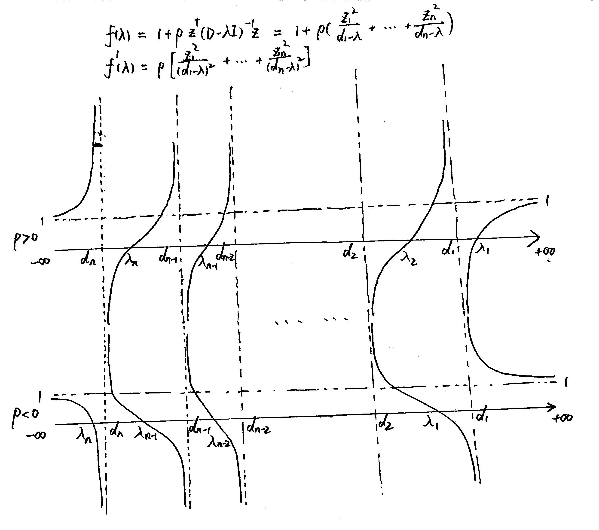

# FDU 数值算法 6. 对称特征值问题的解法

本文根据邵老师授课内容整理而成，并参考了以下教材:

- 数值线性代数 (第二版, 徐树方, 高立, 张平文) 第 $7$ 章

欢迎批评指正!

## 6.1 对称阵特征值的基本性质

实对称矩阵的特征值均为实数，且其特征向量可以构成 $\mathbb R^n$ 的一组标准正交基.  
**(谱分解定理, 数值线性代数, 定理 $7.1.1$)**  
若 $A$ 是 $n$ 阶实对称阵，则存在正交阵 $Q\in \mathbb R^{n\times n}$ 使得 $Q^{\mathrm T}AQ = \Lambda = \text{diag}(\lambda_1,\dots,\lambda_n)$   
其中 $\lambda_1,\dots,\lambda_n$ 为 $A$ 的特征值，我们默认其按升序排列，即 $\lambda_\min = \lambda_1 \leq \dotsm \leq \lambda_n = \lambda_\max$ 

**(Rayleigh-Ritz 定理, Matrix Analysis 定理 $4.2.2$)**  
若 $A$ 是 $n$ 阶 Hermite 阵，则我们有: 
$$
\lambda_\min = \min_{x\neq 0_n} \frac{x^{\mathrm H}Ax}{x^{\mathrm H}x} = \min_{\|x\|_2 =1} x^{\mathrm H}Ax\\
\lambda_\max = \max_{x\neq 0_n} \frac{x^{\mathrm H}Ax}{x^{\mathrm H}x} = \max_{\|x\|_2 =1} x^{\mathrm H}Ax
$$
**(Courant–Fischer min-max 定理, Matrix Analysis 定理 $4.2.6$ & 数值线性代数, 定理 $7.1.2$)**   
若 $A$ 是 $n$ 阶 Hermite 阵，并记 $\mathbb C^n$ 的 $k$ 维子空间的全体为 $\mathcal G^n_k$，则对于任意 $k=1,\dots,n$ 我们都有:   
$$
\begin{align}
\lambda_k 
&= \max_{\mathcal X\in \mathcal G^n_k} \min_{x\neq 0_n \in \mathcal X} \frac{x^{\mathrm H}Ax}{x^{\mathrm H}x}\\
&= \min_{\mathcal X\in \mathcal G^n_{n-k+1}} \max_{x\neq 0_n \in \mathcal X} \frac{x^{\mathrm H}Ax}{x^{\mathrm H}x}
\end{align}
$$

***

关于对称阵特征值的敏感性，我们有如下定理:  
**(Weyl 定理, 数值线性代数, 定理 $7.1.3$)**  
设 $A$ 和 $A+\Delta A$ 均为 $n$ 阶实对称阵，记 $\{\lambda_i(A)\}_{i=1}^n$ 和 $\{\lambda_i(A+\Delta A)\}_{i=1}^n$ 为其按升序排列的特征值.  
则对于任意 $i=1,\dots,n$ 我们都有: 
$$
|\lambda_i(A+\Delta A) - \lambda_i(A)| \leq \|\Delta A\|_2
$$
这表明对称阵的特征值总是良态的.

- > **($\text{SVD}$ 分解定理, 数值线性代数, 定理 $7.1.5$)**  
  > 设 $A\in \mathbb R^{m\times n}$，则存在正交矩阵 $\begin{cases}
  > U\in \mathbb R^{m\times m}\\
  > V\in \mathbb R^{n\times n}\end{cases}$ 使得:  
  > $$
  > U^{\mathrm T}AV = \begin{bmatrix}
  > \Sigma_{r} & O_{r\times (n-r)}\\
  > O_{(m-r)\times r} & O_{(m-r)\times (n-r)}
  > \end{bmatrix}\\
  > \text{where }r=\rank(A),\ \Sigma_r = \text{diag}(\sigma_1,\dots,\sigma_r)\text{ and }\sigma_1 \geq \dotsm \geq \sigma_r > 0
  > $$
  > 我们称 $\sigma_1 \geq \dotsm \geq \sigma_r >  0 = \sigma_{r+1} = \dotsm = \sigma_{\min(m,n)}$ 为 $A$ 的**奇异值**  
  > $U$ 的列向量称为 $A$ 的**左奇异向量**，$V$ 的列向量称为 $A$ 的**右奇异向量**.

  现在假设特征值和奇异值均按降序排列. 
  当 $m\leq n$ 时，$\sigma_i(A)$ 是半正定阵 $AA^{\mathrm T}$ 的第 $i$ 大特征值 $\lambda_i(AA^{\mathrm T})$ 的正平方根，即有 $\sigma_i(A) = \sqrt{\lambda_i(AA^{\mathrm T})}$     
  当 $m> n$ 时，$\sigma_i(A)$ 是半正定阵 $A^{\mathrm T}A$ 的第 $i$ 大特征值 $\lambda_i(A^{\mathrm T}A)$ 的正平方根，即有 $\sigma_i(A) = \sqrt{\lambda_i(A^{\mathrm T}A)}$     
  于是根据 **Weyl 定理**可推出:  

  **(数值线性代数, 推论 $7.1.1$)**    
  设 $A, A+\Delta A\in \mathbb R^{m\times n}$，记 $\{\sigma_i(A)\}_{i=1}^{\min(m,n)}$ 和 $\{\sigma_i(A+\Delta A)\}_{i=1}^{\min(m,n)}$ 为其按降序排列的奇异值.  
  则对于任意 $i=1,\dots,\min(m,n)$ 我们都有: 
  $$
  |\sigma_i(A+\Delta A) - \sigma_i(A)| \leq \|\Delta A\|_2
  $$
  这表明矩阵的奇异值问题总是良态的.

***

关于对称阵特征向量的敏感性，我们有如下定理:   
**(数值线性代数, 定理 $7.1.3$)**  
设 $A$ 和 $A+\Delta A$ 均为 $n$ 阶实对称阵，$q_1$ 是 $A$ 关于 $\lambda$ 的一个单位特征向量，$Q=[q_1,\widetilde Q]$ 是 $n$ 阶正交阵.  
记 $Q^{\mathrm T}AQ$ 和 $Q^{\mathrm T}\Delta A Q$ 的分块如下:  
$$
Q^{\mathrm T}AQ = \begin{bmatrix}
\lambda &\\
& \widetilde \Lambda
\end{bmatrix}

\qquad 

Q^{\mathrm T}\Delta A Q = \begin{bmatrix}
\delta_{11} & \delta_{21}^{\mathrm T}\\
\delta_{21} & \Delta_{22}
\end{bmatrix}
$$
若 $\lambda $ 与其余特征值的最短距离 $d = \min_{\mu \in \text{e}(\widetilde \Lambda)} |\lambda-\mu|>0$ 且 $\|\Delta A\|_2 \leq \frac14 d$，  
则 $A+\Delta A$ 存在一个单位特征向量 $\widetilde q_1$ 使得:  
$$
\sin \theta = \sqrt{1-|q_1^{\mathrm T}\widetilde q_1|^2} \leq  \frac{4}{d}\|\delta_{21}\|_2 \leq \frac{4}{d} \|\Delta A\|_2\\
\text{where }\theta = \angle (q_1,\widetilde q_1) = \text{arc}\cos |q_1^{\mathrm T}\widetilde q_1| \in (0,\frac{\pi}2)
$$

- 从几何直观上来看，夹角 $\theta = \angle (q_1,\widetilde q_1)$ 刻画了扰动前后单位特征向量 $q_1$ 和 $\widetilde q_1$ 之间的差距.  
  上述定理表明:   
  特征向量对矩阵扰动的敏感性依赖于对应的特征值与其余特征值之间的分离程度.

## 6.2 对称 QR 方法

对称 $\text{QR}$ 方法就是将 $\text{QR}$ 方法应用于实对称阵，并充分利用其对称性得到的.

### 6.2.1 对称三对角分解

若 $A$ 是 $n$ 阶实对称阵 (即使是 Hermite 阵也可以，参见 Homework 10 Problem 01)，  
则其上 Hessenberg 分解实质上就是对称三对角分解.  
我们可以在约化过程中充分利用其对称性以减少运算量.

第一步，我们自然选取 Householder 变换 $H_1$，使得 $H_1A$ 的第 $1$ 列有尽可能多的零元素 (至多 $n-1$ 个).  
为保证对 $A$ 进行 (正交) 相似变换，我们需对行、列进行相同的变换，变换后的相似型为 $H_1 A H_1^{\mathrm T} = H_1 A H_1$   

为避免 $H_1A$ 右乘 $H_1$ 时第 $1$ 列已构建的零元素被破坏，$H_1$ 应形如 $H_1 = \begin{bmatrix}
1 & \\
& \hat H_1\end{bmatrix}$   
因此 $H_1$ 只能保证 $H_1A$ 第 $1$ 列的第 $3$ 个至第 $n$ 个元素为零.  
相应地，$H_1AH_1$ 的第 $1$ 列的第 $3$ 个至第 $n$ 个元素为零，  
而且 $A$ 对称性保证了 $H_1AH_1$ 的第 $1$ 行的第 $3$ 个至第 $n$ 个元素也为零，即形如:  
$$
H_1 A =
\begin{bmatrix}
1 & \\
& \hat H_1\end{bmatrix}
\begin{bmatrix}
a_{11} & a_1^{\mathrm T}\\
a_1 & A_{22}
\end{bmatrix}
=
\begin{bmatrix}
a_{11} & a_1^{\mathrm T}\\
\hat H_1 a_1 & \hat H_1 A_{22}
\end{bmatrix}
=
\left[
\begin{array}{c|ccccc}
* & * & * & * &\dotsm & *\\
\hline
* & * & * & * &\dotsm & *\\
0 & * & * & * &\dotsm & * \\
0 & * & * & * &\dotsm & * \\
\vdots & \vdots & \vdots & \vdots & \vdots & \vdots\\
0 & * & * & * &\dotsm & *
\end{array} \right]\\

H_1 A H_1 = (H_1 A) H_1 = 
\begin{bmatrix}
a_{11} & a_1^{\mathrm T}\\
\hat H_1 a_1 & \hat H_1 A_{22}
\end{bmatrix}
\begin{bmatrix}
1 & \\
& \hat H_1\end{bmatrix}
=
\begin{bmatrix}
a_{11} & a_1^{\mathrm T} \hat H_1\\
\hat H_1 a_1 & \hat H_1 A_{22} \hat H_1
\end{bmatrix}
=
\left[
\begin{array}{c|ccccc}
* & * & 0 & 0 &\dotsm & 0\\
\hline
* & * & * & * &\dotsm & *\\
0 & * & * & * &\dotsm & * \\
0 & * & * & * &\dotsm & * \\
\vdots & \vdots & \vdots & \vdots & \vdots & \vdots\\
0 & * & * & * &\dotsm & *
\end{array} \right]\\
$$
我们对 $a_1 = \begin{bmatrix}
a_{21}\\
a_{31}\\
\vdots\\
a_{n1}\end{bmatrix}$ 计算 Householder 变换 $\widetilde H_1$，使得 $\widetilde H_1 a_1 = \alpha \begin{bmatrix}
1\\
0\\
\vdots\\
0\end{bmatrix} = \alpha e_1$ (其中 $e_1$ 是 $\mathbb R^{n-1}$ 的第 $1$ 个标准单位基向量)   

> 回忆 Householder 变换的构造方法:
> **(数值线性代数, 定理 $3.2.2$)**  
> 若 $x\neq 0_n\in \mathbb R^n$，则可构造 $\begin{cases}
> \alpha = \pm \|x\|_2\\
> w = \frac{x-\alpha e_1}{\|x-\alpha e_1\|_2}\\
> H = I - 2ww^{\mathrm T}\end{cases}$ 使得 $Hx = \alpha e_1$ (其中 $e_1$ 是 $\mathbb R^n$ 的第 $1$ 个标准单位基向量)

****

对 $\widetilde A_{22} = \widetilde H_1 A_{22} \widetilde H_1\in \mathbb R^{(n-1)\times (n-1)}$ 进行相同的考虑，  
又可找到 Householder 变换 $\widetilde H_2 = \begin{bmatrix}
1 & \\
& \hat H_2\end{bmatrix}\in \mathbb R^{(n-1)\times (n-1)}$ 使得:  
$$
\widetilde H_2 \widetilde A_{22} \widetilde H_2 = \widetilde H_2 (\widetilde H_1 A_{22} \widetilde H_1) \widetilde H_2   = \left[
\begin{array}{c|cccc}
* & * & 0  &\dotsm & 0\\
\hline
* & * & *  &\dotsm & *\\
0 & * & *  &\dotsm & * \\
\vdots & \vdots & \vdots & \vdots & \vdots\\
0 & * & *  &\dotsm & *
\end{array} \right]\\
$$
令 $H_2 = \begin{bmatrix}
1 & \\
& \widetilde  H_2\end{bmatrix}
=
\left[\begin{array}{c|cc}
1 & & \\
\hline  & 1 & \\
&& \hat H_2\end{array}\right] 
=
\begin{bmatrix} 
I_2 & \\
& \hat H_2\end{bmatrix} \in \mathbb R^{n\times n}$，则我们有:  
$$
H_2 (H_1 A H_1) H_2 = \left[
\begin{array}{c|c|cccc}
* & * & 0 & 0 &\dotsm & 0\\
\hline
* & * & * & 0 &\dotsm & 0\\
\hline
0 & * & * & * &\dotsm & * \\
0 & 0 & * & * &\dotsm & * \\
\vdots & \vdots & \vdots & \vdots & \vdots & \vdots\\
0 & 0 & * & * &\dotsm & *
\end{array} \right]
$$
如此进行 $n-2$ 步，就可找到 $n-2$ 个 Householder 变换 $H_1,\dots,H_{n-2}\in \mathbb R^{n\times n}$ 使得:    
$$
Q^{\mathrm T} A Q = (H_{n-2}\dotsm H_1) A (H_1\dotsm H_{n-2}) = \begin{bmatrix}
\alpha_1 & \beta_1 &  & & \\
\beta_1 & \alpha_{2} & \beta_{2} &  & \\
  & \beta_2 & \alpha_{3} & \ddots & \\
  & & \ddots & \ddots & \beta_{n-1} \\
  & & & \beta_{n-1} & \alpha_{n} \\
\end{bmatrix} 
\overset{\Delta}= T
$$
其中 $Q = H_1\dotsm H_{n-2} \in \mathbb R^{n\times n}$ 是正交阵. 
我们称 $Q^{\mathrm T} A Q = T$ (即 $A= Q T Q^{\mathrm H}$) 为实对称阵 $A$ 的**对称三对角分解**   

***

到目前为止，我们只需对一般方阵的上 Hessenberg 分解的 Householder 变换法做一点小改动.

- > **回忆起 (Householder 变换法计算上 Hessenberg 分解, 数值线性代数, 算法 $6.4.1$)**
  > $$
  > \begin{align}
  > &\text{Given }A \in \mathbb R^{n\times n}\\
  > \hline
  > &\text{for }k=1:n-2\\
  > &\qquad [v,\beta] = \text{Householder}(A(k+1:n,k))\\
  > &\qquad A(k+1:n,k:n) = (I_{n-k}-\beta vv^{\mathrm T}) A(k+1:n,k:n) = A(k+1:n,k:n) - (\beta v) (v^{\mathrm T} A(k+1:n,k:n))\\
  > &\qquad A(1:n,k+1:n) = A(1:n,k+1:n)(I_{n-k}-\beta vv^{\mathrm T}) = A(1:n,k+1:n) - (A(1:n,k+1:n)v) (\beta v)^{\mathrm T}\\
  > &\text{end}\\
  > &H = A
  > \end{align}
  > $$

注意到左乘 $(I_{n-k}-\beta vv^{\mathrm T})$ 之后，矩阵分块 $A(1:n,k+1:n)$ 中的第 $1$ 行至第 $k-1$ 行均为零，  
因此右乘 $(I_{n-k}-\beta vv^{\mathrm T})$ 的操作只用对矩阵分块 $A(k:n,k+1:n)$ 进行即可.  
这样我们就得到:  
**(Householder 变换法计算对称三对角分解, 数值线性代数, 算法 $7.2.1$ 前身)**
$$
\begin{align}
&\text{Given symmetric matrix }A \in \mathbb R^{n\times n}\\
\hline
&\text{for }k=1:n-2\\
&\qquad [v,\beta] = \text{Householder}(A(k+1:n,k))\\
&\qquad A(k+1:n,k:n) = (I_{n-k}-\beta vv^{\mathrm T}) A(k+1:n,k:n) = A(k+1:n,k:n) - (\beta v) (v^{\mathrm T} A(k+1:n,k:n))\\
&\qquad A(k:n,k+1:n) = A(k:n,k+1:n)(I_{n-k}-\beta vv^{\mathrm T}) = A(k:n,k+1:n) - (A(k:n,k+1:n)v) (\beta v)^{\mathrm T}\\
&\text{end}\\
&T = A
\end{align}
$$

***

但这还不够:  
我们注意到上述算法首先对 $A(k+1:n,k:n)$ 左乘 $(I_{n-k}-\beta vv^{\mathrm T})$，再对 $A(k:n,k+1:n)$ 右乘 $(I_{n-k}-\beta vv^{\mathrm T})$     

- 左乘 Householder 变换 $(I_{n-k}-\beta vv^{\mathrm T})$ 的效果是将 $A(k+1:n,k)$ 约化为 $\|A(k+1:n,k)\|_2 \cdot e_1$   
  (其中 $e_1$ 是 $\mathbb R^{n-k}$ 的第 $1$ 个标准单位基向量)  
  而且矩阵分块 $A(k+1:n,k)$ 不参与右乘 Householder 变换 $(I_{n-k}-\beta vv^{\mathrm T})$ 的操作
- 注意到矩阵分块 $A(k,k+1:n)$ 不参与左乘 Householder 变换 $(I_{n-k}-\beta vv^{\mathrm T})$ 的操作  
  而右乘 Householder 变换 $(I_{n-k}-\beta vv^{\mathrm T})$ 的效果是将 $A(k,k+1:n)$ 约化为 $\|A(k+1:n,k)\|_2 \cdot e_1^{\mathrm T}$    

因此 $A(k+1:n,k)$ 和 $A(k,k+1:n)$ 的更新可以单独处理:  

- 将 $\|A(k+1:n,k)\|_2$ 的值赋给 $A(k+1,k)$ 和 $A(k,k+1)$   

- 将其余元素 (即 $A(k+2:n,k)$ 和 $A(k,k+2 :n) $ 的元素) 均置为零   
  实际上这个操作是不必要的，这些位置的元素后续不再参与运算  
  迭代终止后，我们取出 $A$ 的主对角线和次对角线的元素即可确定三对角矩阵 $T$   

  (注意到 $A$ 的超对角元和次对角元对应相等)

剩下的操作可看作对矩阵分块 $A_{k}=A(k+1:n,k+1:n)$ 同时左乘和右乘 $(I_{n-k}-\beta vv^{\mathrm T})$   
如果按照原计算次序，运算量为 $5(n-k)^2$ **(存疑)** :  
$$
\begin{align}
(I_{n-k}-\beta vv^{\mathrm T}) A_k (I_{n-k}-\beta vv^{\mathrm T})
&=
A_k - \beta v v ^{\mathrm T} A_k - A_k \cdot \beta vv^{\mathrm T} + \beta vv^{\mathrm T} \cdot A_k \cdot \beta vv^{\mathrm T}\\
&=
A_k - v(\beta A_k^{\mathrm T}v)^{\mathrm T} - (\beta A_k^{\mathrm T} v)v^{\mathrm T} + [\beta(\beta A_k^{\mathrm T}v)^{\mathrm T}v] vv^{\mathrm T}  

\end{align}
$$
我们可以调整计算次序，运算量为 $4(n-k)^2$:  
$$
\begin{align}
(I_{n-k}-\beta vv^{\mathrm T}) A_k (I_{n-k}-\beta vv^{\mathrm T})
&=
A_k - \beta v v ^{\mathrm T} A_k - A_k \cdot \beta vv^{\mathrm T} + \beta vv^{\mathrm T} \cdot A_k \cdot \beta vv^{\mathrm T}\\
&=
A_k - v(\beta A_k^{\mathrm T}v)^{\mathrm T} - (\beta A_k^{\mathrm T} v) v^{\mathrm T}  + \{ \frac12 v [\beta( v^{\mathrm T} (\beta A_k^{\mathrm T}v))v]^{\mathrm T} + 
\frac12[\beta( v^{\mathrm T} (\beta A_k^{\mathrm T}v))v]v^{\mathrm T}\}\\

&=
A_k - v[\beta A_k^{\mathrm T}v - \frac12 \beta( v^{\mathrm T} (\beta A_k^{\mathrm T}v))v]^{\mathrm T} - [\beta A_k^{\mathrm T}v - \frac12 \beta( v^{\mathrm T} (\beta A_k^{\mathrm T}v))v]v^{\mathrm T}\\

&=
A_k -vw^{\mathrm T} - wv^{\mathrm T}

\quad \text{where }\begin{cases}
u = \beta A_k^{\mathrm T}v = \beta A_k v\\
w = \beta A_k^{\mathrm T}v - \frac12 \beta( v^{\mathrm T} (\beta A_k^{\mathrm T}v))v = u - \frac12 \beta(v^{\mathrm T}u)v
\end{cases}
\end{align}
$$
其中计算 $u$ 的运算量为 $2(n-k)^2$，计算 $A_k - vw^{\mathrm T}-wv^{\mathrm T}$ 中的两个矩阵减法的运算量为 $2(n-k)^2$ 

这样，我们就得到如下算法:  
**(Householder 变换法计算对称三对角分解, 数值线性代数, 算法 $7.2.1$)**  
$$
\begin{align}
&\text{Given symmetric matrix }A \in \mathbb R^{n\times n}\\
\hline
&\text{for }k=1:n-2\\
&\qquad [v,\beta] = \text{Householder}(A(k+1:n,k))\\
&\qquad A(k+1,k) = \|A(k+1:n,k)\|_2\\
&\qquad A(k,k+1) = A(k+1,k)\\
&\qquad u = \beta A(k+1:n,k+1:n)v\\
&\qquad w = u - (\frac12\beta v^{\mathrm T}u) v\\
&\qquad A(k+1:n,k+1:n) = A(k+1:n,k+1:n) - vw^{\mathrm T} - wv^{\mathrm T}\\
&\text{end}\\
&T = A
\end{align}
$$
该算法的总运算量为 $\frac{4}{3}n^3$ (回忆起非对称实方阵的上 Hessenberg 化需要 $\frac{10}3 n^3$)  
若需要累积正交变换矩阵，则还需增加 $\frac{4}{3}n^3$ 的运算量.

### 6.2.2 隐式对称 QR 迭代

将实对称阵 $A$ 约化为对称三对角阵 $T$ 后，我们下一步的任务就是选取适当的位移进行 $\text{QR}$ 迭代.  
由于实对称阵 $A$ 的特征值均为实数，故我们只需进行单位移的 $\text{QR}$ 迭代即可.
$$
\text{Given symmetric tridiagonal matrix }T_0 = T\in \mathbb R^{n\times n}\\
\hline
T_k - \mu_k I = Q_k R_k\\
T_{k+1} = R_k Q_k + \mu_k I
$$
从非对称 $\text{QR}$ 方法的讨论可知，$\text{QR}$ 迭代保持上 Hessenberg 结构.  
结合 $T_0=T$ 的对称性可知上述迭代格式产生的 $T_k$ 都是对称三对角阵，形如:  
$$
T_k = \begin{bmatrix}
\alpha_1^{(k)} & \beta_1^{(k)} &  & & \\
\beta_1^{(k)} & \alpha_{2}^{(k)} & \beta_{2}^{(k)} &  & \\
  & \beta_2^{(k)} & \alpha_{3}^{(k)} & \ddots & \\
  & & \ddots & \ddots & \beta_{n-1}^{(k)} \\
  & & & \beta_{n-1}^{(k)} & \alpha_{n}^{(k)} \\
\end{bmatrix}
$$
与非对称 $\text{QR}$ 方法一样，我们假定迭代中出现的所有对称三对角阵 $T_k$ 都是不可约的，即其次对角元均非零.    

从非对称 $\text{QR}$ 方法的讨论可知，最简单的位移选取是 $\mu_k = T_k(n,n)=\alpha_n^{(k)}$ (二次收敛)  
然而更好的做法是取 $\mu_k$ 为矩阵 $T_k(n-1:n,n-1:n) = \begin{bmatrix}
\alpha_{n-1}^{(k)} & \beta_{n-1}^{(k)}\\
\beta_{n-1}^{(k)} & \alpha_n^{(k)} \end{bmatrix}$ 的两个实特征值中靠近 $\alpha_n^{(k)}$ 的那个:  
$$
\delta_k = \frac{1}{2}(\alpha_{n-1}^{(k)}-\alpha_n^{(k)})\\
\mu_k = \alpha_n^{(k)} + \delta_k -\text{sgn}(\delta_k) \sqrt{\delta_k^2 + (\beta_{n-1}^{(k)})^{2}}
$$
这就是著名的 **Wilkinson 位移**.

Wilkinson 证明了:  
$\begin{bmatrix}
\alpha_{n-1}^{(k)} & \beta_{n-1}^{(k)}\\
\beta_{n-1}^{(k)} & \alpha_n^{(k)} \end{bmatrix}$ 的两个实特征值 $\frac12(\alpha_{n-1}^{(k)} + \alpha_{n}^{(k)}) \pm \sqrt{\frac{1}{4}(\alpha_{n-1}^{(k)} + \alpha_{n}^{(k)})^2 + (\beta_{n-1}^{(k)})^{2}}$ 作为位移都能保证三次收敛.  
而且其中更靠近 $\alpha_n^{(k)}$ 的那个实特征值作为位移的效果会更好.

***

考虑一次对称 $\text{QR}$ 迭代的具体实现:  
$$
T-\mu I = QR\\
\widetilde T = RQ + \mu I
$$
我们当然可以使用 Givens 变换来直接实现 $T-\mu I$ 的 $\text{QR}$ 分解，进而得到 $\widetilde T = RQ + \mu I$   
但更美观的做法是以隐含的形式来实现由 $T$ 到 $\widetilde T$ 的变换.

我们知道上述迭代的本质是用正交相似变换将 $T-\mu I$ 变为 $\widetilde T - \mu I$，即 $(\widetilde T-\mu I) = Q^{\mathrm T}(T-\mu I)Q$     
我们同时也知道一旦 $Q$ 的第一列确定了，那么 $\widetilde T-\mu I$ 所有元素的绝对值就都确定了 (符号可以变动)

- > 回忆起**数值线性代数 定理 $6.4.3$** 的结论:     
  > 设 $A\in \mathbb R^{n\times n}$ 有两个上 Hessenberg 分解 $\begin{cases}
  > (Q^{(1)})^{\mathrm T}  A Q^{(1)} = H^{(1)}\\
  > (Q^{(2)})^{\mathrm T} A Q^{(2)} = H^{(2)}\end{cases}$   
  > 其中 $Q^{(1)} = [q_1^{(1)},\dots,q_n^{(1)}]$ 和 $Q^{(2)} = [q_1^{(2)},\dots,q_n^{(2)}]$ 是 $n$ 阶正交矩阵，  
  > 而 $H^{(1)} = [h_{ij}^{(1)}]$ 和 $H^{(2)} = [h_{ij}^{(2)}]$ 是上 Hessenberg 矩阵.
  >
  > 若 $q_1^{(1)} = q_1^{(2)}$ 且 $H^{(1)}$ 是**不可约的** (即其次对角元 $h_{i+1,i}^{(1)}$ 均不为零)，  
  > 则存在对角元均属于 $\{+1,-1\}$ 的对角阵 $D$ 使得 $\begin{cases}
  > Q^{(1)} = Q^{(2)} D\\
  > H^{(1)} = D H^{(2)} D\end{cases}$ (即仅在正负号上有区别)
  >
  > 上述定理表明:   
  > 若 $Q^{\mathrm T}AQ = H$ 是不可约的上 Hessenberg 矩阵，其中 $Q$ 是正交矩阵，  
  > 则在不考虑正负号变动的意义下，$Q$ 和 $H$ 完全由 $Q$ 的第一列 $q_1$ 确定.
  >
  > 也就是说，无论采用什么方法去求正交矩阵 $\widetilde Q$ 使得 $\widetilde H_2 = \widetilde Q ^{\mathrm T} H Q$ 为上 Hessenberg 矩阵，  
  > 只要 $\widetilde Q$ 的第一列与 $Q$ 的第一列相同，  
  > $\widetilde H_2$ 就与 $H_2 = Q^{\mathrm T}HQ$ 本质上相同 (所有元素绝对值都对应相等，只是正负号可能不同)   
  > 当然，这需要 $H_2$ 是不可约的上 Hessenberg 矩阵.  
  > 换言之，只要 $H_2$ 是不可约不可约的上 Hessenberg 矩阵，  
  > 我们就有很大的自由度去寻找更有效的方法来实现由 $H$ 到 $H_2$ 的变换.

首先根据 $T-\mu I = QR$ 可知 $Q$ 的第一列 $Qe_1$ 就是 $T-\mu I$ 的第一列 $(T-\mu I)e_1$ 单位化得到的.  
而 $T-\mu I$ 的第一列元素如下:  
(我们不用计算整个 $T-\mu I$，只需计算其第一列的前两个元素 $m_{11},m_{21}$ 即可)
$$
(T-\mu I)e_1 = \begin{bmatrix}
m_{11}\\
m_{21}\\
0\\
\vdots\\
0
\end{bmatrix}
=
\begin{bmatrix}
\alpha_{1} - \mu\\
\beta_{1}\\
0\\
\vdots\\
0
\end{bmatrix}
$$
其次，我们计算 Givens 变换 $G_0$，将 $T-\mu I$ 的第一列 $(T-\mu I)e_1$ 的第 $2$ 个分量化为零，  
即使得 $G_0(T-\mu I) e_1 = r e_1$ (其中 $r = \sqrt{(\alpha_1-\mu)^2 + \beta_1^2}$)   
$$
[c,s] = \text{Givens}(m_{11},m_{21}) = \text{Givens}(\alpha_1-\mu, \beta_1) = \text{Givens}(T(1,1)-\mu, T(2,1))\\
\widetilde G_0  = \begin{bmatrix}
c & s\\
-s & c
\end{bmatrix}\\
G_0 = \begin{bmatrix}
\widetilde G_0 & \\
& I_{n-2}
\end{bmatrix}
$$
根据 Givens 变换的推导过程可知 $G_0$ 的第一行的转置 (即 $G_0^{\mathrm T} e_1$) 就是 $(T-\mu I)e_1$ 单位化得到的向量，  
因此待求正交矩阵 $Q$ 的第一列即为 $G_0^{\mathrm T}$ 的第一列，即 $Qe_1 = G_0^{\mathrm T} e_1$ **(存疑)**

现令 $B=G_0TG_0^{\mathrm T}$    
由于这个正交相似变换只改变了 $T$ 的前两行和前两列，故 $B$ 的形状如下:  
$$
B=G_0 T G_0^{\mathrm T} = 
\begin{bmatrix}
\widetilde G_0 & \\
& I_{n-2}
\end{bmatrix}

\begin{bmatrix}
* & * &  &  &  &  \\
* & * & * &  &  &  \\
& * & * & * & &   \\
& & * & * &\ddots &   \\
&&& \ddots &\ddots & * \\
&&&& * & * 
\end{bmatrix} 

\begin{bmatrix}
\widetilde G_0 & \\
& I_{n-2}
\end{bmatrix}^{\mathrm T}
=

\begin{bmatrix}
* & * & + &  &  &  \\
* & * & * &  &  &  \\
+ & * & * & * & &   \\
& & * & * &\ddots &   \\
&&& \ddots &\ddots & * \\
&&&& * & * 
\end{bmatrix}
$$
接下来我们只要能够找到第一列为 $e_1$ 的正交矩阵 $\widetilde Q$ 使得 $\widetilde T=\widetilde Q^{\mathrm T} B \widetilde Q$ 为对称三对角阵，  
那么这个 $\widetilde T$ 就是我们希望得到的 $\widetilde T$   

根据 $6.2.1$ 节的对称三对角分解算法可知，这是容易办到的  
例如可以确定 $n-2$ 个 Givens 变换 $G_1,\dots,G_{n-2}$ 使得 $G_{n-2} \dotsm G_1 B G_1^{\mathrm T} \dotsm G_{n-2}^{\mathrm T}=\widetilde T$   
则正交矩阵 $\widetilde Q = G_1^{\mathrm T} \dotsm G_{n-2}^{\mathrm T}$ 的第一行和第一列只有 $(1,1)$ 位置上的元素为 $1$，其余元素非零  
(这是因为 $G_1,\dots,G_{n-2}$ 的第一行和第一列都只有 $(1,1)$ 位置上的元素为 $1$，其余元素非零)  
因此 $\widetilde Q$ 的第一列自然为 $e_1$   

- 以 $n=5$ 的情况为例:  
  $$
  B = \begin{bmatrix}
  * & * & + & & \\
  * & * & * & &\\
  + & * & * & * & \\
  && * & * & *\\
  &&& * & *
  \end{bmatrix}\\
  
  G_1 B G_1^{\mathrm T} = \begin{bmatrix}
  * & * & & & \\
  * & * & * & + &\\
   & * & * & * & \\
  &+& * & * & *\\
  &&& * & *
  \end{bmatrix}\\
  
  G_2(G_1 B G_1^{\mathrm T})G_2^{\mathrm T} = \begin{bmatrix}
  * & * &  & & \\
  * & * & * & &\\
   & * & * & * & +\\
  && * & * & *\\
  && + & * & *
  \end{bmatrix}\\
  
  G_3(G_2G_1 B G_1^{\mathrm T} G_2^{\mathrm T} )G_3^{\mathrm T} = \begin{bmatrix}
  * & * &  & & \\
  * & * & * & &\\
   & * & * & * & \\
  && * & * & *\\
  &&  & * & *
  \end{bmatrix}
  $$

综上所述，我们有如下算法:   
**(带 Wilkinson 位移的隐式对称 $\text{QR}$ 迭代, 数值线性代数, 算法 $7.2.2$)**  
$$
\begin{align}
&\text{Given symmetric tridiagonal matrix }T\in \mathbb R^{n\times n}\\
&Q=I_n\\
\hline

&\delta = \frac12(T(n-1,n-1)-T(n,n))\\
&\mu = T(n,n) + \delta -\text{sgn}(\delta) \sqrt{\delta^2 + T(n,n-1)^2} = T(n,n) - \frac{T(n,n-1)^2}{\delta + \text{sgn}(\delta) \sqrt{\delta^2 + T(n,n-1)^2}}\\

&m_{11} = T(1,1) - \mu\\
&m_{21} = T(2,1)\\
&[c,s] = \text{Givens}(m_{11},m_{21})\quad(\text{case of }k=0)\\
&T(1:2,1:3) = \begin{bmatrix}
c & s\\
-s & c\end{bmatrix}
T(1:2,1:3)\\
&T(1:3,1:2) = T(1:3,1:2)\begin{bmatrix}
c & s\\
-s & c
\end{bmatrix}^{\mathrm T}\\
&Q(1:n,1:2) = Q(1:n,1:2)\begin{bmatrix}
c & s\\
-s & c
\end{bmatrix}^{\mathrm T}\\

\hline
&\text{for }k=1:n-3\\
&\qquad [c,s] = \text{Givens}(T(k+1,k),T(k+2,k))\\
&\qquad T(k+1:k+2,k:k+3) = \begin{bmatrix}
c & s\\
-s & c\end{bmatrix} T(k+1:k+2,k:k+3)\\
&\qquad T(k:k+3,k+1:k+2) = 
T(k:k+3,k+1:k+2)
\begin{bmatrix}
c & s\\
-s & c\end{bmatrix}^{\mathrm T}\\

&\qquad Q(1:n,k+1:k+2) = Q(1:n,k+1:k+2)\begin{bmatrix}
c & s\\
-s & c
\end{bmatrix}^{\mathrm T}\\

&\text{end}\\

\hline
&[c,s] = \text{Givens}(T(n-1,n-2),T(n-1,n))\quad(\text{case of }k=n-2)\\
&T(n-1:n,n-2:n) = \begin{bmatrix}
c & s\\
-s & c\end{bmatrix}
T(n-1:n,n-2:n)\\
&T(n-2:n,n-1:n-2) = T(n-2:n,n-1:n-2)\begin{bmatrix}
c & s\\
-s & c
\end{bmatrix}^{\mathrm T}\\
&Q(1:n,n-1:n-2) = Q(1:n,n-1:n-2)\begin{bmatrix}
c & s\\
-s & c
\end{bmatrix}^{\mathrm T}\\
\end{align}
$$

上述算法的总运算量为 $10n$  
如需累积正交变换矩阵，则还需增加运算量 $6n^2$   
实际计算时，三对角阵 $T$ 通过两个 $n$ 维向量存储，算法需要做相应调整.   
**(存疑: 具体来说是一个 $n$ 维一个 $n-1$ 维，邵老师说实现时再注重小细节，学的时候是不用的)**

### 6.2.3 隐式对称 QR 算法

实对称阵 $A\in \mathbb R^{n\times n}$ 的实 Schur 标准型即为矩阵的谱 $\Lambda = \text{diag}(\lambda_1,\dots,\lambda_n)$   
因此隐式对称 $\text{QR}$ 算法的结果是实对称阵 $A\in \mathbb R^{n\times n}$ 的谱分解 $A=Q\Lambda Q^{\mathrm T}$ 

**(隐式对称 $\text{QR}$ 算法计算实对称阵的谱分解, 数值线性代数, 算法 $7.2.3$)**  

- **(1) 将给定实对称阵 $A\in \mathbb R^{n\times n}$ 对称三对角化:**  
  $$
  \begin{align}
  &\text{Given symmetric matrix }A \in \mathbb R^{n\times n}\\
  \hline
  &Q = I_n\\
  &\text{for }k=1:n-2\\
  &\qquad [v,\beta] = \text{Householder}(A(k+1:n,k))\\
  &\qquad A(k+1,k) = \|A(k+1:n,k)\|_2\\
  &\qquad A(k,k+1) = A(k+1,k)\\
  &\qquad u = \beta A(k+1:n,k+1:n)v\\
  &\qquad w = u - (\frac12\beta v^{\mathrm T}u) v\\
  &\qquad A(k+1:n,k+1:n) = A(k+1:n,k+1:n) - vw^{\mathrm T} - wv^{\mathrm T}\\
  &\qquad Q(1:n,k+1:n) = Q(1:n,k+1:n)(I_{n-k} - \beta vv^{\mathrm T}) = Q(1:n,k+1:n)- (Q(1:n,k+1:n)v)(\beta v)^{\mathrm T}\\
  &\text{end}\\
  &T = A
  \end{align}
  $$

- **(2) 收敛性判定:**  

  - 将所有满足条件 $|t_{i+1,i}| = |t_{i,i+1}| \leq (|t_{i,i}| + |t_{i+1,i+1}|) \text{eps}$ 的次对角元 $h_{i+1,i}$ 和超对角元 $h_{i,i+1}$ 置为零.

  - 将 $T$ 划分为 $T= \begin{bmatrix}
    T_{11} &  & \\
    & T_{22} & \\
    && T_{33}\end{bmatrix}$ (其中 $\begin{cases}
    T_{11}\in \mathbb R^{l\times l}\\
    T_{22}\in \mathbb R^{(u-l)\times (u-l)}\\
    T_{33}\in \mathbb R^{(n-u)\times (n-u)}\end{cases}$)  
    最小化 $u$ 使得 $T_{33}\in R^{(n-u)\times (n-u)}$ 为对角阵  
    最小化 $l$ 使得 $T_{22}\in \mathbb R^{(u-l)\times (u-l)}$ 为不可约的对称三对角阵.

    若 $u=0$，则迭代终止; 否则进行下一步.

- **(3) 带 Wilkinson 位移的隐式 $\text{QR}$ 迭代:**  
  对 $T$ 的 $T_{22}$ 分块进行带 Wilkinson 位移的隐式 $\text{QR}$ 迭代 **(待 debug)**:    
  $$
  \begin{align}
  \hline
  &\delta = \frac12(T(u-1,u-1)-T(u,u))\\
  &\mu = T(u,u) + \delta -\text{sgn}(\delta) \sqrt{\delta^2 + T(u,u-1)^2} = T(u,u) - \frac{T(u,u-1)^2}{\delta + \text{sgn}(\delta) \sqrt{\delta^2 + T(u,u-1)^2}}\\
  
  &m_{11} = T(l+1,l+1) - \mu\\
  &m_{21} = T(l+2,l+1)\\
  &[c,s] = \text{Givens}(m_{11},m_{21})\quad(\text{case of }k=0)\\
  &T(l+1:l+2,l+1:l+3) = \begin{bmatrix}
  c & s\\
  -s & c\end{bmatrix}
  T(l+1:l+2,l+1:l+3)\\
  &T(l+1:l+3,l+1:l+2) = T(l+1:l+3,l+1:l+2)\begin{bmatrix}
  c & s\\
  -s & c
  \end{bmatrix}^{\mathrm T}\\
  
  &Q(1:n,l+1:l+2) = Q(1:n,l+1:l+2)\begin{bmatrix}
  c & s\\
  -s & c
  \end{bmatrix}^{\mathrm T}\\
  
  \hline
  &\text{for }k=1:u-l-3\\
  &\qquad [c,s] = \text{Givens}(T(l+k+1,l+k),T(l+k+2,l+k))\\
  &\qquad T(l+k+1:l+k+2,l+k:l+k+3) = \begin{bmatrix}
  c & s\\
  -s & c\end{bmatrix} T(l+k+1:l+k+2,l+k:l+k+3)\\
  &\qquad T(l+k:l+k+3,l+k+1:l+k+2) = 
  T(l+k:l+k+3,l+k+1:l+k+2)
  \begin{bmatrix}
  c & s\\
  -s & c\end{bmatrix}^{\mathrm T}\\
  
  &\qquad Q(1:n,l+k+1:l+k+2) = 
  Q(1:n,l+k+1:l+k+2)
  \begin{bmatrix}
  c & s\\
  -s & c\end{bmatrix}^{\mathrm T}\\
  
  &\text{end}\\
  
  \hline
  &[c,s] = \text{Givens}(T(u-1,u-2),T(u-1,u))\quad(\text{case of }k=u-l-2)\\
  &T(u-1:u,u-2:u) = \begin{bmatrix}
  c & s\\
  -s & c\end{bmatrix}
  T(u-1:u,u-2:u)\\
  &T(u-2:u,u-1:u-2) = T(u-2:u,u-1:u-2)\begin{bmatrix}
  c & s\\
  -s & c
  \end{bmatrix}^{\mathrm T}\\
  
  &Q(1:n,u-1,u-2) = Q(1:n,u-1:u-2)\begin{bmatrix}
  c & s\\
  -s & c
  \end{bmatrix}^{\mathrm T}\\
  
  \end{align}
  $$
  这样就完成了一次带 Wilkinson 位移的隐式 $\text{QR}$ 迭代，对称三对角阵 $T$ 和正交矩阵 $Q$ 均得到更新.  
  然后转到第 $(2)$ 步.

最终计算结果为 $Q^{\mathrm T}AQ = T_{33}$ (其中 $T_{33}\in \mathbb R^{n\times n}$ 为存储特征值的对角阵)

实际计算的经验表明:   
若只计算特征值，则该算法总运算量平均约为 $\frac43n^3$   
若特征值和特征向量都需要，则总运算量平均约为 $9n^3$ 

隐式对称 $\text{QR}$ 算法是矩阵计算中最漂亮的算法之一.  
误差分析的结果表明:  
该算法计算得到的谱 $\widetilde \Lambda = \text{diag}(\widetilde \lambda_1,\dots,\widetilde \lambda_n)$ 满足:  
$$
Q^{\mathrm T}(A+\Delta A) Q = \widetilde \Lambda\text{ where } \|\Delta A\|_2 \approx \|A\|_2 \cdot \text{eps}\\
\Rightarrow\\
\|\Delta \Lambda\|_2 = \|\widetilde \Lambda - \widetilde \Lambda\|_2 = \|Q^{\mathrm T}(A+\Delta A)Q - Q^{\mathrm T}AQ\|_2 = \|Q^{\mathrm T}\Delta A Q\|_2 = \|\Delta A\|_2 \approx \|A\|_2 \cdot \text{eps}
$$

- > 回忆起关于对称阵特征值的敏感性，我们有如下定理:  
  > **(Weyl 定理, 数值线性代数, 定理 $7.1.3$)**  
  > 设 $A$ 和 $A+\Delta A$ 均为 $n$ 阶实对称阵，记 $\{\lambda_i(A)\}_{i=1}^n$ 和 $\{\lambda_i(A+\Delta A)\}_{i=1}^n$ 为其按升序排列的特征值.  
  > 则对于任意 $i=1,\dots,n$ 我们都有: 
  > $$
  > |\lambda_i(A+\Delta A) - \lambda_i(A)| \leq \|\Delta A\|_2
  > $$
  > 这表明对称阵的特征值总是良态的.

这表明隐式对称 $\text{QR}$ 算法计算得到的特征值是相对精确的，相对误差 $\frac{\|\Delta \Lambda\|_2}{\|A\|_2}$ 不超过机器精度 $\text{eps}$   
但值得注意的是，计算得到的特征向量并不一定有这样良好的精度，  
因为实对称阵的特征向量对矩阵扰动的敏感性依赖于对应的特征值与其余特征值之间的分离程度.

- > 回忆起关于对称阵特征向量的敏感性，我们有如下定理:   
  > **(数值线性代数, 定理 $7.1.3$)**  
  > 设 $A$ 和 $A+\Delta A$ 均为 $n$ 阶实对称阵，$q_1$ 是 $A$ 关于 $\lambda$ 的一个单位特征向量，$Q=[q_1,\widetilde Q]$ 是 $n$ 阶正交阵.  
  > 记 $Q^{\mathrm T}AQ$ 和 $Q^{\mathrm T}\Delta A Q$ 的分块如下:  
  > $$
  > Q^{\mathrm T}AQ = \begin{bmatrix}
  > \lambda &\\
  > & \widetilde \Lambda
  > \end{bmatrix}
  > 
  > \qquad 
  > 
  > Q^{\mathrm T}\Delta A Q = \begin{bmatrix}
  > \delta_{11} & \delta_{21}^{\mathrm T}\\
  > \delta_{21} & \Delta_{22}
  > \end{bmatrix}
  > $$
  > 若 $\lambda $ 与其余特征值的最短距离 $d = \underset{\mu \in \lambda(\widetilde \Lambda)}{\min} |\lambda-\mu|>0$ 且 $\|\Delta A\|_2 \leq \frac14 d$，  
  > 则 $A+\Delta A$ 存在一个单位特征向量 $\widetilde q_1$ 使得:  
  > $$
  > \sin \theta = \sqrt{1-|q_1^{\mathrm T}\widetilde q_1|^2} \leq  \frac{4}{d}\|\delta_{21}\|_2 \leq \frac{4}{d} \|\Delta A\|_2\\
  > \text{where }\theta = \angle (q_1,\widetilde q_1) = \text{arc}\cos |q_1^{\mathrm T}\widetilde q_1| \in (0,\frac{\pi}2)
  > $$
  >
  > - 从几何直观上来看，夹角 $\theta = \angle (q_1,\widetilde q_1)$ 刻画了扰动前后单位特征向量 $q_1$ 和 $\widetilde q_1$ 之间的差距.  
  >   上述定理表明:   
  >   特征向量对矩阵扰动的敏感性依赖于对应的特征值与其余特征值之间的分离程度.

## 6.3 Jacobi 方法

Jacobi 方法是求实对称阵全部特征值和特征向量的最古老的方法之一.    
它利用 "实对称阵存在谱分解，即可通过正交相似变换约化为对角阵" 的性质，  
通过选取一系列正交变换将一个实对称阵逐步约化为对角阵.

与隐式对称 $\text{QR}$ 算法相比，Jacobi 方法的收敛速度很慢，  
但由于其具有编程简单、并行效率高的特点，近年来又重新受到重视.  
此外，对于某些几乎是对角阵的实对称阵来说，Jacobi 方法也是十分有效的.

### 6.3.1 经典 Jacobi 方法

设 $A=[a_{ij}]$ 为 $n$ 阶实对称阵.  
Jacobi 方法的目标是将 $A$ 的非对角元素的模平方和 $E(A) = (\|A\|_{\mathrm F}^2 - \sum_{i=1}^n a_{ii}^2)^\frac12$ 逐步约化为零.

第 $k$ 步迭代中，我们希望选取 $(p,q)$ (其中 $p<q$)，并确定一个正交变换 (参数为 $[c,s]=[\cos(\theta),\sin(\theta)]$)，使得:   
(注意其中 $a_{pq}^{(k)} = a_{qp}^{(k)}$)
$$
\begin{bmatrix}
a_{pp}^{(k+1)} & 0\\
0 & a_{qq}^{(k+1)}
\end{bmatrix} 

=

\begin{bmatrix}
c & s\\
-s & c
\end{bmatrix}

\begin{bmatrix}
a_{pp}^{(k)} & a_{pq}^{(k)}\\
a_{qp}^{(k)} & a_{qq}^{(k)}
\end{bmatrix}

\begin{bmatrix}
c & s\\
-s & c
\end{bmatrix}^{\mathrm T}
$$
记其为 **Jacobi 变换**:  
$$
J_k(p,q,\theta) = I_n + (\cos(\theta)-1) (e_pe_p^{\mathrm T} + e_qe_q^{\mathrm T}) + \sin(\theta) (e_pe_q^{\mathrm T} - e_qe_p^{\mathrm T}) = \begin{array}{cl}
\begin{bmatrix}
  1 &  &  &  &  &  &  \\
   & \ddots &  &  &  &  &  \\
   &  & \cos(\theta) & \cdots & \sin(\theta) &  &  \\
   &  & \vdots & \ddots & \vdots &  &  \\
   &  & -\sin(\theta) & \cdots & \cos(\theta) &  &  \\
   &  &  &  &  & \ddots &  \\
   &  &  &  &  &  & 1 \\
\end{bmatrix} 
&
\begin{array}{}
\\
\\
p\\
\\
q\\
\\
\\
\end{array} \\
\begin{array}{}
&& \ \ p &\qquad& q &&\\
\end{array}
\end{array}\\

A^{(k+1)} = J_k(p,q,\theta) A^{(k)} J_k(p,q,\theta)^{\mathrm T}
$$
根据 Frobenius 范数的酉不变性可知:  
$$
\|A^{(k+1)}\|_{\mathrm F}^2 = \| J_k(p,q,\theta) A^{(k)} J_k(p,q,\theta)^{\mathrm T}\|_{\mathrm F}^2 =  \|A^{(k)}\|_{\mathrm F}^2 \\

(a_{pp}^{(k+1)})^2 + (a_{qq}^{(k+1)})^2 
= 
\left\| \begin{bmatrix}
a_{pp}^{(k+1)} & 0\\
0 & a_{qq}^{(k+1)}
\end{bmatrix} \right\|_{\mathrm F}^2
=
\left\| \begin{bmatrix}
a_{pp}^{(k)} & a_{pq}^{(k)}\\
a_{qp}^{(k)} & a_{qq}^{(k)}
\end{bmatrix} \right\|_{\mathrm F}^2 
=
(a_{pp}^{(k)})^2 + (a_{qq}^{(k)})^2 + 2(a_{pq}^{(k)})^2
$$
同时注意到 Jacobi 变换 $J_k(p,q,\theta)$ 只改变 $(p,p)$ 和 $(q,q)$ 位置的对角元，于是我们有:  
$$
\begin{align}
E(A^{(k+1)})^2 
&=
\|A^{(k+1)}\|_{\mathrm F}^2 - \sum_{i=1}^n (a_{ii}^{(k+1)})^2\\
&=
\|A^{(k+1)}\|_{\mathrm F}^2 - \sum_{i\neq p,q}^n (a_{ii}^{(k+1)})^2 - (a_{pp}^{(k+1)})^2 - (a_{qq}^{(k+1)})^2\\
&=
\|A^{(k)}\|_{\mathrm F}^2 - \sum_{i\neq p,q}^n (a_{ii}^{(k)})^2 - (a_{pp}^{(k)})^2 - (a_{qq}^{(k)})^2 - 2(a_{pq}^{(k)})^2\\
&=
\|A^{(k)}\|_{\mathrm F}^2 - \sum_{i=1}^n (a_{ii}^{(k)})^2 - 2(a_{pq}^{(k)})^2\\
&=
E(A^{(k)})^2 - 2(a_{pq}^{(k)})^2
\end{align}
$$
这说明 $|a_{pq}^{(k)}|$ 应当越大越好，因此有序对 $(p,q)$ 的最佳选取为:  
$$
(p,q) = \arg \max_{1\leq i<j\leq n} |a_{ij}^{(k)}|
$$

****

现在返回来考虑确定 Jacobi 变换 (参数为 $[c,s]=[\cos(\theta),\sin(\theta)]$)，使得:   
(注意其中 $a_{pq}^{(k)} = a_{qp}^{(k)}$)
$$
\begin{align}
\begin{bmatrix}
a_{pp}^{(k+1)} & 0\\
0 & a_{qq}^{(k+1)}
\end{bmatrix} 

&=

\begin{bmatrix}
c & s\\
-s & c
\end{bmatrix}

\begin{bmatrix}
a_{pp}^{(k)} & a_{pq}^{(k)}\\
a_{qp}^{(k)} & a_{qq}^{(k)}
\end{bmatrix}

\begin{bmatrix}
c & s\\
-s & c
\end{bmatrix}^{\mathrm T}\\
&=
\begin{bmatrix}
* & * \\
a_{pq}^{(k)}(c^2-s^2) + (a_{qq}^{(k)} - a_{pp}^{(k)}) cs & *
\end{bmatrix}

\end{align}
$$
根据 $(1,2)$ 位置的等式，我们有:  
$$
a_{pq}^{(k)}(c^2-s^2) + (a_{qq}^{(k)} - a_{pp}^{(k)}) cs = 0
$$
不妨设 $a_{pq}^{(k)} = a_{qp}^{(k)}\neq 0$ (因为如若不然, 则 Jacobi 迭代终止, 或只需取 $c=1,s=0$)   
则我们有:  
$$
\frac{c^2 -s^2}{cs} = \frac{c}{s} - \frac{s}{c} = \frac{a_{pp}^{(k)} - a_{qq}^{(k)}}{a_{pq}^{(k)}}
$$
我们可以定义 $\begin{cases}
t = \frac{s}{c}\\
\tau = \frac{a_{pp}^{(k)} - a_{qq}^{(k)}}{2a_{pq}^{(k)}}\end{cases}$ 即有:  
$$
\frac{1}{t} - t = \frac{c}{s} - \frac{s}{c} = \frac{a_{pp}^{(k)} - a_{qq}^{(k)}}{a_{pq}^{(k)}} = 2\tau\\
\Leftrightarrow\\
t^2 + 2\tau t -1 =0
$$
解得 $t = -\tau \pm \sqrt{1+\tau^2}$   
我们选择模长较小的根，即 $t=\frac{\text{sgn}(\tau)}{|\tau| + \sqrt{1+\tau^2}}$，以保证旋转角 $\theta$ 满足 $|\theta|\leq \frac{\pi}{4}$  
这对 Jacobi 方法的收敛性是至关重要的.  
因为 $|\theta|\leq \frac{\pi}{4}$ 可以保证余弦占优，使得 Jacobi 变换矩阵更接近于单位阵，使得行列次序不会变.  
否则可能导致正弦占优，会使得行列次序会发生改变 (可能导致某些非对角元 "逃脱")

因此我们有如下计算公式:  
$$
\tau = \frac{a_{pp}^{(k)} - a_{qq}^{(k)}}{2a_{pq}^{(k)}}\\
t = \frac{\text{sgn}(\tau)}{|\tau| + \sqrt{1+\tau^2}}\\
c = \frac{1}{\sqrt{1+t^2}}\\
s = tc
$$

****

综上所述，**经典 Jacobi 方法**的迭代格式为:  
$$
\text{Given symmetric matrix }A_0 = A\in \mathbb R^{n\times n}\\
\hline
(p,q) = \arg \max_{1\leq i<j\leq n} |a_{ij}^{(k)}|\\
\tau = \frac{a_{pp}^{(k)} - a_{qq}^{(k)}}{2a_{pq}^{(k)}}\\
t = \frac{\text{sgn}(\tau)}{|\tau| + \sqrt{1+\tau^2}}\\
c = \frac{1}{\sqrt{1+t^2}}\\
s = tc\\
J_k = I_n + (c-1) (e_pe_p^{\mathrm T} + e_qe_q^{\mathrm T}) + s (e_pe_q^{\mathrm T} - e_qe_p^{\mathrm T}) = \begin{array}{cl}
\begin{bmatrix}
  1 &  &  &  &  &  &  \\
   & \ddots &  &  &  &  &  \\
   &  & c & \cdots & s &  &  \\
   &  & \vdots & \ddots & \vdots &  &  \\
   &  & -s & \cdots & c &  &  \\
   &  &  &  &  & \ddots &  \\
   &  &  &  &  &  & 1 \\
\end{bmatrix} 
&
\begin{array}{}
\\
\\
p\\
\\
q\\
\\
\\
\end{array} \\
\begin{array}{}
&& \ \ p &\qquad& q &&\\
\end{array}
\end{array}\\

A^{(k+1)} = J_k A^{(k)} J_k^{\mathrm T}
$$

注意在实际计算中我们无需计算出 Jacobi 变换 $J_k$ 的显式形式，只需计算其参数 $[c,s]$ 即可  
而应用该 Jacobi 变换只需对 $A^{(k)}$ 的第 $p,q$ 行左乘 $\begin{bmatrix}
c& s\\
-s & c\end{bmatrix}$ 再对第 $p,q$ 列右乘 $\begin{bmatrix}
c& s\\
-s & c\end{bmatrix}^{\mathrm T}$(这样只需 $O(n)$ 级别的运算量)

***

**(经典 Jacobi 方法的收敛性, 数值线性代数, 定理 $7.3.1$)**  
若 $\{A^{(k)}\}$ 是经典 Jacobi 方法产生的实对称阵序列，  
则存在 $A$ 的特征值的一个排列 $\lambda_1,\dots,\lambda_n$ 使得 $\underset{k\to \infty}{\lim} A^{(k)} = \text{diag}(\lambda_1,\dots,\lambda_n)$   

**证明:**

- **首先证明 $E(A^{(k)}) = (\|A^{(k)}\|_{\mathrm F}^2 - \sum_{i=1}^n(a_{ii}^{(k)})^2)^\frac12$ 趋于 $0$:**  
  根据 $(p,q) = \arg \underset{1\leq i<j\leq n}\max |a_{ij}^{(k)}|$ 可知 $A^{(k)}$ 的非对角元模长之和 $E(A^{(k)})^2 \leq 2\cdot \frac{n(n-1)}2 (a_{pq}^{(k)})^2 = n(n-1)(a_{pq}^{(k)})^2$   
  代入 $E(A^{(k+1)})^2 = E(A^{(k)})^2 - 2(a_{pq}^{(k)})^2$ 可知:  
  $$
  \begin{align}
  E(A^{(k+1)})^2 
  &= E(A^{(k)})^2 - 2(a_{pq}^{(k)})^2\\
  &\leq E(A^{(k)})^2 - \frac{2}{n(n-1)} E(A^{(k)})^2\\
  &= \left(1-\frac{2}{n(n-1)} \right) E(A^{(k)})^2
  \end{align}
  $$
  因此我们有 $E(A^{(k)}) \to 0\ (k\to \infty)$ 成立.

- **其次证明存在 $A$ 的特征值的一个排列 $\lambda_1,\dots,\lambda_n$ 使得 $\underset{k\to\infty}{\lim} a_{ii}^{(k)} = \lambda_i\ (i=1,\dots,n)$:**   
  注意到序列 $\{A^{(k)}\}$ 中的所有方阵都与 $A$ 相似，因而具有完全相同的谱.    
  记 $A$ 的互不相同的特征值之间的最小距离为 $\delta:= \min\{|\lambda_1-\lambda_2|:\lambda_1,\lambda_2 \in \lambda(A),\ \lambda_1\neq \lambda_2\}$   
  对于任意 $\varepsilon \in (0,\frac{\delta}{4})$，由 $E(A^{(k)}) \to 0\ (k\to \infty)$ 可知存在 $k_0$ 使得对于任意 $k\geq k_0$ 都有 $E(A^{(k)}) < \varepsilon < \frac{\delta}{4}$ 成立.      

  记 $A^{(k)}$ 的对角元部分为 $D^{(k)} = \text{diag}(a_{11}^{(k)},\dots,a_{nn}^{(k)})$   

  > **(Weyl 定理, 数值线性代数, 定理 $7.1.3$)**  
  > 设 $A$ 和 $A+\Delta A$ 均为 $n$ 阶实对称阵，记 $\{\lambda_i(A)\}_{i=1}^n$ 和 $\{\lambda_i(A+\Delta A)\}_{i=1}^n$ 为其按升序排列的特征值.  
  > 则对于任意 $i=1,\dots,n$ 我们都有: 
  > $$
  > |\lambda_i(A+\Delta A) - \lambda_i(A)| \leq \|\Delta A\|_2
  > $$

  根据 Weyl 定理可知:  
  对于任意给定的 $k\geq k_0$，都对应存在 $A$ 的特征值的一个排列 $\lambda_1,\dots,\lambda_n$ 使得:  
  $$
  |\lambda_i - a_{ii}^{(k)}| \leq \|A^{(k)}-D^{(k)}\|_2 \leq \|A^{(k)}-D^{(k)}\|_{\mathrm F} = E(A^{(k)}) < \varepsilon < \frac{\delta}{4}\ \ (i=1,\dots,n)
  $$
  但从严谨的角度来说，对于不同的 $k\geq k_0$，上述 $A$ 的特征值的排列可能是不相同，我们需要排除这个可能.  
  下面我们从 $k=k_0$ 情况对应的 $A$ 的特征值的排列 $\lambda_1,\dots,\lambda_n$ 出发，  
  证明从 $|\lambda_i - a_{ii}^{(k_0)}|<\varepsilon \ (i=1,\dots,n)$ 可以推出对于任意 $k\geq k_0$ 都有 $|\lambda_i - a_{ii}^{(k)}|<\varepsilon \ (i=1,\dots,n)$ 成立.  
  即需证明从 $|\lambda_i - a_{ii}^{(k_0)}|<\varepsilon \ (i=1,\dots,n)$ 可以推出 $|\lambda_i - a_{ii}^{(k_0+1)}|<\varepsilon \ (i=1,\dots,n)$   

  ***
  
  记  $(p,q) = \arg \underset{1\leq i<j\leq n}\max |a_{ij}^{(k_0)}|$  
  注意到 $A^{(k_0+1)}$ 和 $A^{(k_0)}$ 的对角元仅有 $(p,p)$ 和 $(q,q)$ 两个位置不同  
  因此我们只需证明从 $|\lambda_i - a_{ii}^{(k_0)}|<\varepsilon \ (i=1,\dots,n)$ 可以推出 $|\lambda_i - a_{ii}^{(k_0+1)}|<\varepsilon \ (i=p,q)$ 即可: 

  回忆起:
  $$
  {\begin{bmatrix}
  a_{pp}^{(k_0+1)} & 0\\
  0 & a_{qq}^{(k_0+1)}
  \end{bmatrix} 
  
  =
  
  \begin{bmatrix}
  c & s\\
  -s & c
  \end{bmatrix}
  
  \begin{bmatrix}
  a_{pp}^{(k_0)} & a_{pq}^{(k_0)}\\
  a_{qp}^{(k_0)} & a_{qq}^{(k_0)}
  \end{bmatrix}
  
  \begin{bmatrix}
  c & s\\
  -s & c
  \end{bmatrix}^{\mathrm T}}\\
  
  \tau = \frac{a_{pp}^{(k_0)} - a_{qq}^{(k_0)}}{2a_{pq}^{(k_0)}}\\
  t = \frac{\text{sgn}(\tau)}{|\tau| + \sqrt{1+\tau^2}}\in [-1,1]\text{ is a solution of }t^2 + 2\tau t -1 =0\\
  c = \frac{1}{\sqrt{1+t^2}}\\
  s = tc
  $$
  
  ***
  
  对于 $(p,p)$ 位置的对角元我们有:   
  $$
  \begin{align}
  a_{pp}^{(k_0+1)}
  &= (ca_{pp}^{(k_0)} + s a_{qp}^{(k_0)})\cdot c + (c a_{pq}^{(k_0)}+s a_{qq}^{(k_0)})\cdot s\\
  &=
  c^2 a_{pp}^{(k_0)} + 2cs a_{pq}^{(k_0)} + s^2 a_{qq}^{(k_0)}\\
  &=
  a_{pp}^{(k_0)} + 2cs a_{pq}^{(k_0)} + s^2(a_{qq}^{(k_0)}-a_{pp}^{(k_0)})\\
  &=
  a_{pp}^{(k_0)} + c^2\cdot 2t a_{pq}^{(k_0)} + s^2 (-\tau \cdot 2 a_{pq}^{(k_0)})\\
  &=
  a_{pp}^{(k_0)} + c^2 (2t a_{pq}^{(k_0)} -t\cdot 2\tau t \cdot a_{pq}^{(k_0)})\quad (\text{note that }t^2 + 2\tau t -1 =0\ \Rightarrow\ 2\tau t = 1-t^2)\\
  &=
  a_{pp}^{(k_0)} + c^2 (2t a_{pq}^{(k_0)} -t(1-t^2) a_{pq}^{(k_0)})\\
  &=
  a_{pp}^{(k_0)} + c^2 \cdot t(1+t^2) a_{pq}^{(k_0)}\\
  &=
  a_{pp}^{(k_0)} + t(c^2+s^2) a_{pq}^{(k_0)}\\
  &=
  a_{pp}^{(k_0)} + t a_{pq}^{(k_0)}
  \end{align}
  $$
  因此对于任意 $\lambda_j \neq \lambda_p$，我们都有:  
  $$
  \begin{align}
  |a_{pp}^{(k_0+1)}-\lambda_j|
  &=
  |a_{pp}^{(k_0+1)}-\lambda_p + \lambda_p - \lambda_j|\\
  &=
  |a_{pp}^{(k_0)}-\lambda_p + \lambda_p - \lambda_j + ta_{pq}^{(k_0)}|\\
  &\geq 
  |\lambda_p - \lambda_j|- |a_{pp}^{(k_0)}-\lambda_p| - |t|\cdot |a_{pq}^{(k_0)}|\quad (\text{note that }|t|\leq 1\text{ and }|a_{pq}^{(k_0)}|\leq E(A^{(k_0)})<\varepsilon)\\
  &>
  \delta - \varepsilon - 1\cdot \varepsilon
  \quad (\text{recall that }\delta:= \min\{|\lambda_1-\lambda_2|:\lambda_1,\lambda_2 \in \lambda(A),\ \lambda_1\neq \lambda_2\})\\
  &> 4\varepsilon - \varepsilon -\varepsilon \\
  &= 2\varepsilon \end{align}
  $$
  而根据之前的结论，$a_{pp}^{(k_0+1)}$ 必须与 $A^{(k_0+1)}$ 的某个特征值 (即 $A$ 的某个特征值) 的距离小于 $\varepsilon$  
  故我们有 $|a_{pp}^{(k_0+1)}-\lambda_p|<\varepsilon$ 成立.
  
  ***
  
  对于 $(q,q)$ 位置的对角元我们有:   
  $$
  \begin{align}
  a_{qq}^{(k_0+1)}
  &= (-sa_{pp}^{(k_0)} + c a_{qp}^{(k_0)})\cdot (-s) + (-s a_{pq}^{(k_0)}+c a_{qq}^{(k_0)})\cdot c\\
  &=
  s^2 a_{pp}^{(k_0)} - 2cs a_{pq}^{(k_0)} + c^2 a_{qq}^{(k_0)}\\
  &=
  a_{qq}^{(k_0)} - 2cs a_{pq}^{(k_0)} + s^2(a_{pp}^{(k_0)}-a_{qq}^{(k_0)})\\
  &=
  a_{qq}^{(k_0)} - c^2\cdot 2t a_{pq}^{(k_0)} + s^2 (\tau \cdot 2 a_{pq}^{(k_0)})\\
  &=
  a_{qq}^{(k_0)} - c^2 (2t a_{pq}^{(k_0)} -t\cdot 2\tau t \cdot a_{pq}^{(k_0)})\quad (\text{note that }t^2 + 2\tau t -1 =0\ \Rightarrow\ 2\tau t = 1-t^2)\\
  &=
  a_{qq}^{(k_0)} - c^2 (2t a_{pq}^{(k_0)} -t(1-t^2) a_{pq}^{(k_0)})\\
  &=
  a_{qq}^{(k_0)} - c^2 \cdot t(1+t^2) a_{pq}^{(k_0)}\\
  &=
  a_{qq}^{(k_0)} - t(c^2+s^2) a_{pq}^{(k_0)}\\
  &=
  a_{qq}^{(k_0)} - t a_{pq}^{(k_0)}
  \end{align}
  $$
  因此对于任意 $\lambda_j \neq \lambda_q$，我们都有:  
  $$
  \begin{align}
  |a_{qq}^{(k_0+1)}-\lambda_j|
  &=
  |a_{qq}^{(k_0+1)}-\lambda_q + \lambda_q - \lambda_j|\\
  &=
  |a_{qq}^{(k_0)}-\lambda_q + \lambda_q - \lambda_j - ta_{pq}^{(k_0)}|\\
  &\geq 
  |\lambda_q - \lambda_j|- |a_{qq}^{(k_0)}-\lambda_q| - |t|\cdot |a_{pq}^{(k_0)}|\quad (\text{note that }|t|\leq 1\text{ and }|a_{pq}^{(k_0)}|\leq E(A^{(k_0)})<\varepsilon)\\
  &>
  \delta - \varepsilon - 1\cdot \varepsilon \quad (\text{recall that }\delta:= \min\{|\lambda_1-\lambda_2|:\lambda_1,\lambda_2 \in \lambda(A),\ \lambda_1\neq \lambda_2\})\\
  &> 4\varepsilon - \varepsilon -\varepsilon \\
  &= 2\varepsilon \end{align}
  $$
  而根据之前的结论，$a_{qq}^{(k_0+1)}$ 必须与 $A^{(k_0+1)}$ 的某个特征值 (即 $A$ 的某个特征值) 的距离小于 $\varepsilon$  
  故我们有 $|a_{qq}^{(k_0+1)}-\lambda_q|<\varepsilon$ 成立.
  
  ***
  
  这样我们就证明了从 $|\lambda_i - a_{ii}^{(k_0)}|<\varepsilon \ (i=1,\dots,n)$ 可以推出对于任意 $k\geq k_0$ 都有 $|\lambda_i - a_{ii}^{(k)}|<\varepsilon \ (i=1,\dots,n)$ 成立.  
  也就是说，存在 $A$ 的特征值的一个排列 $\lambda_1,\dots,\lambda_n$，使得对于任意给定的 $k\geq k_0$ 都有:  
  $$
  |\lambda_i - a_{ii}^{(k)}| \leq \|A^{(k)}-D^{(k)}\|_2 \leq \|A^{(k)}-D^{(k)}\|_{\mathrm F} = E(A^{(k)}) < \varepsilon < \frac{\delta}{4}\ \ (i=1,\dots,n)
  $$
  (也就是说，对于所有的 $k\geq k_0$，Weyl 定理所描述的 $A$ 的特征值排列 $\lambda_1,\dots,\lambda_n$ 都是相同的)    
  根据 $\varepsilon \in (0,\frac{\delta}4)$ 的任意性可知 $\underset{k\to \infty}{\lim} A^{(k)} = \text{diag}(\lambda_1,\dots,\lambda_n)$   
  定理得证.

***

从这一定理的证明我们可以看出:  
选择 $t = \frac{\text{sgn}(\tau)}{|\tau| + \sqrt{1+\tau^2}}\in [-1,1]$ 作为方程 $t^2 + 2\tau t -1 =0$ 的解对经典 Jacobi 方法的收敛起到了至关重要的作用  
它保证了**迭代序列 $\{A^{(k)}\}$ 的每一个对角元序列 $\{a_{ii}^{(k)}\}$ 都目标一致地收敛于 $A$ 的某一固定的特征值 (记为 $\lambda_i$)**   
因而有 $\underset{k\to \infty}{\lim} A^{(k)} = \text{diag}(\lambda_1,\dots,\lambda_n)$ 成立.

此外，根据证明中得到的结论 $E(A^{(k+1)})^2 = (1-\frac{2}{n(n-1)}) E(A^{(k)})^2$，我们知道:  
$$
E(A^{(k)})^2 \leq \left(1-\frac1N \right)^k E(A^{(0)})^2\ \ \text{where } N=\frac{n(n-1)}{2}
$$
这表明经典 Jacobi 方法是**全局线性收敛**的.  
进一步，我们可以证明它是**渐近二次收敛**的  
即存在正常数 $\mu>0$ 使得 $E(A^{(k+N)})\leq \mu E(A^{(k)})^2$ 对于充分大的自然数 $k$ 成立 (其中 $N=\frac{n(n-1)}{2}$)

### 6.3.2 循环 Jacobi 方法

回忆经典 Jacobi 方法的迭代格式:  
$$
\text{Given symmetric matrix }A_0 = A\in \mathbb R^{n\times n}\\
\hline
(p,q) = \arg \max_{1\leq i<j\leq n} |a_{ij}^{(k)}|\\
\tau = \frac{a_{pp}^{(k)} - a_{qq}^{(k)}}{2a_{pq}^{(k)}}\\
t = \frac{\text{sgn}(\tau)}{|\tau| + \sqrt{1+\tau^2}}\\
c = \frac{1}{\sqrt{1+t^2}}\\
s = tc\\
J_k = I_n + (c-1) (e_pe_p^{\mathrm T} + e_qe_q^{\mathrm T}) + s (e_pe_q^{\mathrm T} - e_qe_p^{\mathrm T}) = \begin{array}{cl}
\begin{bmatrix}
  1 &  &  &  &  &  &  \\
   & \ddots &  &  &  &  &  \\
   &  & c & \cdots & s &  &  \\
   &  & \vdots & \ddots & \vdots &  &  \\
   &  & -s & \cdots & c &  &  \\
   &  &  &  &  & \ddots &  \\
   &  &  &  &  &  & 1 \\
\end{bmatrix} 
&
\begin{array}{}
\\
\\
p\\
\\
q\\
\\
\\
\end{array} \\
\begin{array}{}
&& \ \ p &\qquad& q &&\\
\end{array}
\end{array}\\

A^{(k+1)} = J_k A^{(k)} J_k^{\mathrm T}
$$
我们注意到在一次迭代中，确定 $(p,q)$ 需要从 $\frac{n(n-1)}{2}$ 个元素中找出模最大元，因此需要 $O(n^2)$ 级别的运算量.  
反观计算 Jacobi 变换 $J_k$ 的参数 $[c,s]$ 只需 $O(1)$ 级别的运算量，  
而应用该 Jacobi 变换只需对 $A^{(k)}$ 的第 $p,q$ 行左乘 $\begin{bmatrix}
c& s\\
-s & c\end{bmatrix}$ 再对第 $p,q$ 列右乘 $\begin{bmatrix}
c& s\\
-s & c\end{bmatrix}^{\mathrm T}$(只需 $O(n)$ 级别的运算量)  
也就是说，经典 Jacobi 方法的大部分时间都花在寻找模最大非对角元上，这是得不偿失的.  

为避免这样的问题，我们不去寻找模最大非对角元，  
而是按照指定次序将 $N=\frac{n(n-1)}{2}$ 个非对角元扫描一次，这就是所谓的**循环 Jacobi 方法**.  

最自然的循环次序是按列扫描: $(p,q) = (1,2),\dots,(1,n);(2,3),\dots,(2,n); \dotsm; (n-1,n)$   
我们可以证明它是**渐近二次收敛**的，  
即存在正常数 $\mu>0$ 使得 $E(A^{(kN)})\leq \mu E(A^{((k-1)N)})^2$ 对于充分大的自然数 $k$ 成立   
(其中 $N=\frac{n(n-1)}{2}$，我们称每 $N$ 次迭代为一次**扫描**)

### 6.3.3 阈值 Jacobi 方法

在实际计算中，我们更多使用循环 Jacobi 方法的一种变体——**阈值 Jacobi 方法**  
首先确定一个阈值，在每次扫描中，只对那些绝对值超过阈值的非对角元进行 Jacobi 变换.  
这样反复扫描，直到所有的非对角元的绝对值都不超过阈值.  
此时降低阈值，再按这个新阈值进行扫描.  
以此类推，直至阈值充分小 (从而达到迭代过程的收敛)  

通常来说，阈值是这样选取的:  
$$
\delta_0 = E(A^{(0)}) = E(A) = (\|A\|_{\mathrm F} - \sum_{i=1}^n a_{ii}^2)^\frac12\\
\delta_m = \frac{1}{\sigma} \delta_{m-1}\ \ (m=1,2,\dots)\ \text{where }\sigma\geq n\text{ is a fixed constant}
$$
可以证明这样选取阈值的阈值 Jacobi 方法是收敛的.  

综上所述，具体算法如下:
$$
\begin{align}
&\text{Given symmetric matrix }A\in \mathbb R^{n\times n}\text{ and constants } \begin{cases}\sigma\geq n\\
\varepsilon>0\end{cases} \\
&\text{Define }Q = I_n\\
\hline

&\delta = E(A) = (\|A\|_{\mathrm F} - \sum_{i=1}^n a_{ii}^2)^\frac12\\
&S = \{(i,j):|a_{ij}|\geq \delta\text{ and } 1\leq i<j\leq n\}\\

&\text{while }\delta \geq \varepsilon \quad(\text{change of threshold }\delta)\\
&\qquad \text{while }S\neq \emptyset \quad (\text{each scan with current threshold }\delta)\\

&\qquad \qquad \text{for } (p,q) \in S \quad (\text{each Jacobian iteration in current scan})\\
&\qquad \qquad \qquad \tau = \frac{a_{pp} - a_{qq}}{2a_{pq}}\\
&\qquad \qquad \qquad t = \frac{\text{sgn}(\tau)}{|\tau| + \sqrt{1+\tau^2}}\\
&\qquad \qquad \qquad c = \frac{1}{\sqrt{1+t^2}}\\
&\qquad \qquad \qquad s = tc\\
&\qquad \qquad \qquad A([p,q],1:n) = \begin{bmatrix}
c & s\\
-s & c\end{bmatrix} A([p,q],1:n)\\
&\qquad \qquad \qquad A(1:n,[p,q]) = A(1:n,[p,q]) \begin{bmatrix}
c & s\\
-s & c\end{bmatrix}^{\mathrm T}\\
&\qquad \qquad \qquad Q(1:n,[p,q]) = Q(1:n,[p,q]) \begin{bmatrix}
c & s\\
-s & c\end{bmatrix}^{\mathrm T}\\
&\qquad \qquad \text{end}\\

&\qquad\qquad S = \{(i,j):|a_{ij}|\geq \delta\text{ and } 1\leq i<j\leq n\}\\
&\qquad \text{end}\\

&\qquad \delta = \frac{\delta}{\sigma}\\
&\text{end}
\end{align}
$$

但上述算法存在一个问题:  
在一次扫描前确定的指标集 $S = \{(i,j):|a_{ij}|\geq \delta\text{ and } 1\leq i<j\leq n\}$ 在该次扫描的迭代过程中会不断变化.  
因此需要修正.

### 6.3.4 并行化

近年来人们重新对古老的 Jacobi 方法感兴趣的主要原因之一是因为它容易实现并行化.  
这里我们借助一个简单的例子来说明 Jacobi 方法的这一特点:   

考虑 $n=8$ 的情况:  
设 $A$ 是 $8\times 8$ 的实对称阵，而我们利用一个四核处理器求解 $A$ 的特征值和特征向量.  
我们可以将 $A$ 的 $\frac{8(8-1)}{2}=28$ 个严格下三角元分为七组:  
$$
\text{Group 1:}\quad (1,2),(3,4),(5,6),(7,8)\\
\text{Group 2:}\quad (1,3),(2,4),(5,7),(6,8)\\
\text{Group 3:}\quad (1,4),(2,3),(5,8),(6,7)\\
\text{Group 4:}\quad (1,5),(2,6),(3,7),(4,8)\\
\text{Group 5:}\quad (1,6),(2,5),(3,8),(4,7)\\
\text{Group 6:}\quad (1,7),(2,8),(3,5),(4,6)\\
\text{Group 7:}\quad (1,8),(2,7),(3,6),(4,5)
$$
每组的四个严格下三角元同时分配给处理器的四个核进行.  
以第一组为例:  

- 首先独立地确定 $(1,2),(3,4),(5,6),(7,8)$ 四个 Jacobi 变换的参数 $[c,s]$ 
- 其次独立地左乘相应的 Jacobi 矩阵.  
  之所以是独立的，是因为只分别改变 $A$ 的第 $1,2$ 行，第 $3,4$ 行，第 $5,6$ 行以及第 $7,8$ 行.
- 最后独立地右乘相应的 Jacobi 矩阵.   
  之所以是独立的，是因为只分别改变 $A$ 的第 $1,2$ 列，第 $3,4$ 列，第 $5,6$ 列以及第 $7,8$ 列.

由此可见，Jacobi 方法的并行效率是很高的.

## 6.4 二分法

将二分法与实对称阵的三对角化技巧相结合，  
我们可以求解实对称阵的任意指定特征值和对应的特征向量 (结合反幂法).

### 6.4.1 不可约对称三对角阵的性质

设实对称阵 $A\in \mathbb R^{n\times n}$ 的对称三对角分解 $Q^{\mathrm T}AQ=T$ 已经得到:  
$$
T = \begin{bmatrix}
\alpha_1 & \beta_1 & & &\\
\beta_1 & \alpha_2 & \beta_2 & \\
& \beta_2 & \alpha_3 & \ddots &\\
&&\ddots & \ddots & \beta_{n-1}\\
&&&\beta_{n-1} & \alpha_n
\end{bmatrix}
$$
我们来考虑对称三对角阵 $T$ 的特征值的计算.     
不失一般性，我们可以假定 $T$ 是不可约的对称三对角阵 (即假定 $\beta_i \neq 0\ (i=1,\dots,n-1)$)   
否则，可将 $T$ 分为若干个低阶的不可约对称三对角阵.  

记 $T-\lambda I$ 的第 $i$ 阶顺序主子式为 $p_i(\lambda)$   
由于 $T-\lambda I$ 是一个对称三对角阵，故 $p_i(\lambda)$ 满足以下三项递推公式 (其中 $|\cdot|$ 代表方阵行列式):  
$$
\text{Define }p_0(\lambda) \equiv 1\\

p_1(\lambda) = \begin{vmatrix}
\alpha_1 -\lambda \end{vmatrix}
= \alpha_1 - \lambda\\

{
\begin{align}
p_i(\lambda) 
&=
\begin{vmatrix}
\alpha_1-\lambda & \beta_1 & & & & \\
\beta_1 & \alpha_2-\lambda & \ddots & & & \\
& \ddots & \ddots & \beta_{i-3} & &\\
&&\beta_{i-3} & \alpha_{i-2}-\lambda & \beta_{i-2} &\\
&&& \beta_{i-2} & \alpha_{i-1}-\lambda & \beta_{i-1} \\
&&&& \beta_{i-1} & \alpha_{i}-\lambda
\end{vmatrix}\quad (\text{decompose it using the last line})\\
&=
(\alpha_i-\lambda) 

\begin{vmatrix}
\alpha_1-\lambda & \beta_1 & & & \\
\beta_1 & \alpha_2-\lambda & \ddots & & \\
& \ddots & \ddots & \beta_{i-3} & \\
&&\beta_{i-3} & \alpha_{i-2}-\lambda & \beta_{i-2}\\
&&& \beta_{i-2} & \alpha_{i-1}-\lambda
\end{vmatrix}

- \beta_{i-1} 
\begin{vmatrix}
\alpha_1-\lambda & \beta_1 & & & \\
\beta_1 & \alpha_2-\lambda & \ddots & & \\
& \ddots & \ddots & \beta_{i-3} &\\
&&\beta_{i-3} & \alpha_{i-2}-\lambda & 0\\
&&& \beta_{i-2} & \beta_{i-1}
\end{vmatrix}\\

&=
(\alpha_i-\lambda) p_{i-1}(\lambda)
- \beta_{i-1} \cdot \beta_{i-1}

\begin{vmatrix}
\alpha_1-\lambda & \beta_1 & & \\
\beta_1 & \alpha_2-\lambda & \ddots & \\
& \ddots & \ddots & \beta_{i-3}\\
&&\beta_{i-3} & \alpha_{i-2}-\lambda \\
\end{vmatrix}\\

&=
(\alpha_i-\lambda) p_{i-1}(\lambda)
- \beta_{i-1}^2 p_{i-2}(\lambda)\qquad (\text{for all }i=2,\dots,n)
\end{align}}
$$
由于 $T$ 是实对称的，故 $T-\lambda I$ 的任意阶顺序主子阵都是实对称的，因而只具有实特征值.  
因此 $T-\lambda I$ 的第 $i$ 阶顺序主子式 $p_i(\lambda)\ (i=1,\dots,n)$ 的根都是实的.

***

事实上，$T-\lambda I$ 的第 $i$ 阶顺序主子式 $p_i(\lambda)\ (i=1,\dots,n)$ 还具有更多重要性质:  
**(数值线性代数, 定理 $7.4.1$)**  
设 $T$ 为不可约对称三对角阵 (即有 $\beta_i \neq 0\ (i=1,\dots,n-1)$)  
记 $T-\lambda I$ 的第 $i$ 阶顺序主子式为 $p_i(\lambda)\ (i=1,\dots,n)$，它们满足以下三项递推公式:  
$$
p_0(\lambda) \equiv 1\\

p_1(\lambda) 
= \alpha_1 - \lambda\\

p_i(\lambda) =
(\alpha_i-\lambda) p_{i-1}(\lambda)
- \beta_{i-1}^2 p_{i-2}(\lambda)\ \  (i=2,\dots,n)
$$
并且成立:  

- ① 存在正数 $M>0$ 使得当 $\lambda>M$ 时，$p_i(\lambda)$ 的符号为 $(-1)^i$，而 $p_i(-\lambda)$ 的符号为正.

- ② 相邻两个多项式没有公共根

- ③ 对于任意 $i=1,\dots,n-1$，若 $p_i(\mu)=0$，则 $p_{i-1}(\mu)p_{i+1}(\mu)<0$ 

- ④ $p_i(\lambda)$ 的根都是单重实根，  
  且对于任意 $i=1,\dots,n-1$，$p_i(\lambda)$ 的根严格交错分隔 $p_{i+1}(\lambda)$ 的根.

  > 值得注意的是，根据 $p_n(\lambda)=\det(T-\lambda I)$ 具有 $n$ 个单重实根可知:  
  > **不可约对称三对角阵 $T$ 具有 $n$ 个互不相同的实特征值.**

**证明:**

- ① $p_i(\lambda)$ 的最高次 (第 $i$ 次) 项由 $(\alpha_1-\lambda)\dotsm (\alpha_i-\lambda)$ 决定，即为 $(-1)^i\lambda^i$   
  因此当 $\lambda$ 为足够大的正数时，$p_i(\lambda)$ 的符号为 $(-1)^i$，而 $p_i(-\lambda)$ 的符号为 $(-1)^i (-1)^i = 1$，即为正号.  
  即存在正数 $M>0$ 使得当 $\lambda>M$ 时，$p_i(\lambda)$ 的符号为 $(-1)^i$，而 $p_i(-\lambda)$ 的符号为正.

- ② **(反证法)** 假设存在某个 $i=1,\dots,n$，使得 $p_{i-1}(\lambda)$ 和 $p_{i}(\lambda)$ 有公共根 $\mu$ 
  即成立 $p_{i-1}(\mu) = p_{i}(\mu) = 0$​  
  则由三项递推公式 $p_{i}(\lambda) =
  (\alpha_i-\lambda) p_{i-1}(\lambda)-\beta_{i-1}^2 p_{i-2}(\lambda)$ 可知:  
  $$
  0 = p_i(\mu) = (\alpha_i -\mu) p_{i-1}(\mu) - \beta_{i-1}^2 p_{i-2}(\mu) = - \beta_{i-1}^2 p_{i-2}(\mu)
  $$
  注意我们在本节的最开始默认 $T$ 的次对角元 $\beta_{i}\ (i=1,\dots,n-1)$ 均非零，  
  因此我们有 $p_{i-2}(\mu)=0$  

  这样，由 $p_{i-2}(\mu) = p_{i-1}(\mu) = 0$ 又可推出 $p_{i-3}(\mu) = 0$  
  如此下去，我们得到 $p_0(\mu)=0$，但这与我们定义的 $p_0(\mu)=1$ 矛盾.  
  因此对于任意 $i=1,\dots,n$，多项式 $p_{i-1}(\lambda)$ 和 $p_{i}(\lambda)$ 都没有公共根  
  即相邻两个多项式没有公共根.

- ③ 假设 $p_i(\mu)=0$，则由 ② 和三项递推公式 $p_{i+1}(\lambda) =
  (\alpha_{i+1}-\lambda) p_{i}(\lambda)-\beta_{i}^2 p_{i-1}(\lambda)$ 可知:  
  $$
  \begin{align}
  p_{i-1}(\mu)p_{i+1}(\mu) 
  &= p_{i-1}(\mu)[(\alpha_{i-1}-\lambda) p_{i}(\mu)-\beta_{i}^2 p_{i-1}(\mu)]\\
  &= p_{i-1}(\mu)[(\alpha_{i-1}-\lambda)\cdot 0-\beta_{i}^2 p_{i-1}(\mu)]\\
  &= -\beta_i^2 (p_{i-1}(\mu))^2\\
  &< 0
  \end{align}
  $$

- ④ 由于 $T$ 是实对称的，故 $T-\lambda I$ 的任意阶顺序主子阵都是实对称的，因而只具有实特征值.  
  因此 $T-\lambda I$ 的第 $i$ 阶顺序主子式 $p_i(\lambda)\ (i=1,\dots,n)$ 的根都是实的.

  下面对 $i$ 应用数学归纳法:

  - 考虑 $i=1$ 的情况:  
    显然 $\alpha_1$ 是 $p_1(\lambda)=\alpha_1 -\lambda$ 的单重实根，即有 $p_1(\alpha_1)=0$

    而 $p_{2}(\alpha_1) =
    (\alpha_{1}-\alpha_1) p_{1}(\alpha_1)-\beta_{1}^2 p_{0}(\alpha_1) = -\beta_1^2<0$  
    注意到根据 ① 的结论，当 $\lambda$ 为足够大的正数时，$p_2(-\lambda)$ 的符号为正，$p_2(\lambda)$ 的符号为 $(-1)^2=1$ 也为正.  
    因此 $p_2(\lambda)$ 在 $(-\infty,\alpha_1)$ 和 $(\alpha_1,+\infty)$ 分别有两个单重实根.  
    于是 $p_1(\lambda)$ 的根 $\alpha_1$ 严格交错分隔 $p_2(\lambda)$ 的两个单重实根.

  - 现假设我们已经证明了 ④ 对所有 $i\leq k$ 成立  

    根据归纳假设可知 $p_{k-1}(\lambda)$ 和 $p_{k}(\lambda)$ 的根都是单重实根，且 $p_{k-1}(\lambda)$ 的根严格交错分隔 $p_{k}(\lambda)$ 的根    
    设 $p_{k-1}(\lambda)$ 的根为 $\nu_1<\dots < \nu_{k-1}$，$p_{k}(\lambda)$ 的根为 $\mu_1<\dots < \mu_{k}$  
    它们满足 $\mu_1<\nu_1 < \mu_2 < \dots <\mu_{k-1} < \nu_{k-1} < \mu_k$   

    应用三项递推公式 $p_{i+1}(\lambda) =
    (\alpha_{i+1}-\lambda) p_{i}(\lambda)-\beta_{i}^2 p_{i-1}(\lambda)$ 可知:  
    $$
    \begin{align}
    p_{k+1}(\mu_j) 
    &= (\alpha_{k+1}-\mu_j) p_{k}(\mu_j)-\beta_{k}^2 p_{k-1}(\mu_j)\\
    &= (\alpha_{k+1}-\mu_j) \cdot 0-\beta_{k}^2 p_{k-1}(\mu_j)\\
    &= -\beta_{k}^2 p_{k-1}(\mu_j)\quad (\text{for all }j=1,\dots,k)\\
    \end{align}
    $$
    注意到根据 ① 的结论，当 $\lambda$ 为足够大的正数时，$p_{k-1}(-\lambda)$ 的符号为正，$p_{k-1}(\lambda)$ 的符号为 $(-1)^{k-1}$  
    考虑到 $\nu_1<\dots < \nu_{k-1}$ 为 $p_{k-1}(\lambda)$ 的**单重**实根，  
    因此根据 $\mu_1<\nu_1 < \mu_2 < \dots <\mu_{k-1} < \nu_{k-1} < \mu_k$ 我们有:  
    $$
    (-1)^{j-1} p_{k-1}(\mu_j) > 0\ \ (j=1,\dots,k)
    $$
    于是根据 $p_{k+1}(\mu_j) = -\beta_k^2 p_{k-1}(\mu_j)\ \ (j=1,\dots,k)$ 可知:  
    $$
    (-1)^j p_{k+1}(\mu_j)>0\ \ (j=1,\dots,k)
    $$
    注意到根据 ① 的结论，当 $\lambda$ 为足够大的正数时，$p_{k+1}(-\lambda)$ 的符号为正，$p_{k+1}(\lambda)$ 的符号为 $(-1)^{k+1}$   
    即对于充分大的正数 $\lambda$ 有:  
    $$
    p_{k+1}(-\lambda)>0\\
    (-1)^{k+1} p_{k+1}(\lambda)>0
    $$
    结合 $(-1)^j p_{k+1}(\mu_j)>0\ \ (j=1,\dots,k)$ 我们知道:  
    $p_{k+1}(\lambda)$ 在 $k+1$ 个区间 $(-\infty,\mu_1),(\mu_1,\mu_2),\dots,(\mu_{k-1},\mu_k),(\mu_k,+\infty)$ 内分别有一个单重实根.  
    这样，$p_{k+1}(\lambda)$ 的 $k+1$ 个单重实根 $\lambda_1<\dots<\lambda_{k+1}$ 满足:  
    $$
    \lambda_1 < \mu_2 < \lambda_2 < \dots < \lambda_k < \mu_k < \lambda_{k+1}
    $$
    因此 ④ 对 $i=k+1$ 的情况仍然成立.

  根据归纳法原理可知 ④ 对任意 $i=1,\dots,n-1$ 成立.

定理得证.

***

对任意给定的实数 $\mu$，我们定义 $s_i(\mu)\ (i=1,\dots,n)$ 为数列 $p_0(\mu),\dots,p_i(\mu)$ 的变号次数.  
这里规定从非零数变换到 $0$ 不是一次符号改变 (但反过来，从 $0$ 变换到非零数是一次符号改变)，  
即若 $p_i(\mu)=0$ (根据**数值线性代数 定理 $7.4.1$** 的结论 ② "相邻多项式没有公共根" 可知 $p_{i-1}(\mu)\neq 0$)，  
则我们认为从 $p_{i-1}(\mu)\neq 0$ 到 $p_i(\mu)=0$ 未变号，  
但接下来一步，从 $p_i(\mu)=0$ 到 $p_{i+1}(\mu)\neq 0$ 视作发生一次变号.

- 为弄清这一概念，考虑 $T = \begin{bmatrix}
  1 & 1 & \\
  1 & 1 & 1\\
  &1 & 1\end{bmatrix}$ 的例子，我们有:  
  $$
  T-\lambda I = \begin{bmatrix}
  1-\lambda & 1 & \\
  1 & 1-\lambda & 1\\
  &1 & 1-\lambda\end{bmatrix}\\
  p_0(\lambda) \equiv 1\\
  p_1(\lambda) = 1-\lambda\\
  p_2(\lambda) = (1-\lambda)^2 -1\\
  p_3(\lambda) = (1-\lambda)^3 - 2(1-\lambda)
  $$
  
  取 $\mu=1$ 我们有:  
  $$
  p_0(1) = 1\\
  p_1(1) = 0\\
  p_2(1) = -1\\
  p_3(1) = 0
  $$
  从而这一数列的变号次数为:  
  $$
  s_1(1) = 0\\
  s_2(1) = 1\\
  s_3(1) = 1
  $$

现考虑对称三对角阵:  
$$
T = \begin{bmatrix}
\alpha_1 & \beta_1 & & &\\
\beta_1 & \alpha_2 & \beta_2 & \\
& \beta_2 & \alpha_3 & \ddots &\\
&&\ddots & \ddots & \beta_{n-1}\\
&&&\beta_{n-1} & \alpha_n
\end{bmatrix}
$$
**(数值线性代数, 定理 $7.4.2$)**  
若 $T$ 为不可约对称三对角阵 (即有 $\beta_i \neq 0\ (i=1,\dots,n-1)$)，  
则数列 $p_0(\mu),\dots,p_i(\mu)$ 的变号次数 $s_i(\mu)\ (i=1,\dots,n)$ 恰好是 $p_i(\lambda)$ 在区间 $(-\infty,\mu)$ 内根的个数.

**证明: (数学归纳法) **  

- 当 $i=1$ 时，结论显然成立.  

- 现假设当 $i=k$ 时结论成立.  
  设 $p_k(\lambda)$ 的根为 $\mu_1<\dots<\mu_k$，设 $p_{k+1}(\lambda)$ 的根为 $\lambda_1<\dots < \lambda_{k+1}$  
  根据**数值线性代数 定理 $7.4.1$** 的结论 ④ 可知 $\lambda_1<\mu_1 < \lambda_2 < \dots < \lambda_k < \mu_k < \lambda_{k+1}$   

  设 $s_k(\mu) = m$  
  则根据归纳假设可知 $\mu_m < \mu \leq \mu_{m+1}$  
  $\mu$ 可能在 $\lambda_{m+1}$ 的左侧 (即 $\mu_m < \mu \leq  \lambda_{m+1}<\mu_{m+1}$)，也可能在 $\lambda_{m+1}$ 的右侧 (即 $\mu_m<\lambda_{m+1} < \mu \leq \mu_{m+1}$)

  注意到:  
  $$
  p_k(\mu) = \prod_{i=1}^k (\mu_i - \mu)\\
  p_{k+1}(\mu) = \prod_{i=1}^{k+1} (\lambda_i - \mu)
  $$

  - 当 $\mu$ 在 $\lambda_{m+1}$ 的左侧 (即 $\lambda_m <\mu_m < \mu \leq  \lambda_{m+1}<\mu_{m+1}$) 时，  
    $p_k(\mu)$ 的因式分解中有 $m$ 个负项 $(\mu_1-\mu),\dots,(\mu_m-\mu)$，其余均是正项.  
    而 $p_{k+1}(\mu)$ 的因式分解中有 $m$ 个负项 $(\lambda_1-\mu),\dots,(\lambda_m-\mu)$，一个非负项 $(\lambda_{m+1}-\mu)$，其余均是正项.  
    显然 $p_k(\mu)$ 至 $p_{k+1}(\mu)$ 未变号.  
    (即使 $\mu = \lambda_{m+1}$，我们也将 $p_k(\mu)\neq 0$ 到 $p_{k+1}(\mu)=0$ 看作未变号，这是我们前面所做的规定)

    此时 $s_{k+1}(\mu) = s_k(\mu) + 0 = m$  
    这恰好等于 $p_{k+1}(\lambda)$ 在区间 $(-\infty,\mu)$ 内根的个数 $m$.

  - 当 $\mu$ 在 $\lambda_{m+1}$ 的右侧 (即 $\mu_m<\lambda_{m+1} < \mu \leq \mu_{m+1}<\lambda_{m+2}$) 时，    
    $p_k(\mu)$ 的因式分解中有 $m$ 个负项 $(\mu_1-\mu),\dots,(\mu_m-\mu)$，一个非负项 $(\mu_{m+1}-\mu)$，其余均是正项.  
    而 $p_{k+1}(\mu)$ 的因式分解中有 $m+1$ 个负项 $(\lambda_1-\mu),\dots,(\lambda_{m+1}-\mu)$，其余均是正项.  
    显然从 $p_k(\mu)$ 至 $p_{k+1}(\mu)$ 发生一次变号.  
    (至于 $\mu = \mu_{m+1}$ 的情况，我们将从 $p_k(\mu)= 0$ 到 $p_{k+1}(\mu)\neq 0$ 视作发生一次变号)  

    此时 $s_{k+1}(\mu) = s_k(\mu) + 1 = m+1$  
    这恰好等于 $p_{k+1}(\lambda)$ 在区间 $(-\infty,\mu)$ 内根的个数 $m+1$. 

  因此无论哪种情况，$s_{k+1}(\mu)$ 都恰好等于 $p_{k+1}(\lambda)$ 在区间 $(-\infty,\mu)$ 内根的个数，即结论对 $i=k+1$ 也成立. 
  由归纳法原理知命题得证.

### 6.4.2 二分法

> **(数值线性代数, 定理 $7.4.2$)**  
> 若 $T$ 为不可约对称三对角阵 (即有 $\beta_i \neq 0\ (i=1,\dots,n-1)$)，  
> 则数列 $p_0(\mu),\dots,p_i(\mu)$ 的变号次数 $s_i(\mu)\ (i=1,\dots,n)$ 恰好是 $p_i(\lambda)$ 在区间 $(-\infty,\mu)$ 内根的个数.

令 $i=n$ 即得到如下结论:  
**(数值线性代数, 推论 $7.4.1$)**   
若 $T$ 为不可约对称三对角阵 (即有 $\beta_i \neq 0\ (i=1,\dots,n-1)$)，  
则数列 $p_0(\mu),\dots,p_n(\mu)$ 的变号次数 $s_n(\mu)$ 恰好是 $p_n(\lambda)$ 在区间 $(-\infty,\mu)$ 内根的个数.

利用这一推论，我们可以用二分法来求对称三对角阵 $T$ 的任意指定的特征值.  
回忆起**数值线性代数 定理 $7.4.1$** 的结论 **"不可约对称三对角阵 $T$ 具有 $n$ 个互不相同的特征值"**  
于是我们可设 $T$ 的特征值为 $\lambda_1 <\dots < \lambda_n$   
因此有:  
$$
|\lambda_i| \leq \rho(T) = \max_{1\leq i\leq n}|\lambda_i| = \sigma_\max(T) = \|T\|_2 \leq \|T\|_\infty\ \ (i=1,\dots,n)
$$
现假定我们希望求 $T$ 的第 $m$ 小的特征值 $\lambda_m$  
我们先取: 
$$
l_0 = -\|T\|_\infty\\
u_0 = \|T\|_\infty
$$
显然区间 $[l_0,u_0] = [-\|T\|_\infty,\|T\|_\infty]$ 包含了 $T$ 的所有特征值，自然蕴含了 $\lambda_m\in [l_0,u_0]$.  

取 $[l_0,u_0]$ 的中点 $r_1 = \frac12(l_0 + u_0)$，并计算 $s_n(r_1)$   

- 若 $s_n(r_1)\geq m$，则 $\lambda_m \in [l_0,r_1]$，我们取 $\begin{cases}
  l_1 = l_0\\
  u_1 = r_1\end{cases}$ 
- 若 $s_n(r_1)< m$，则 $\lambda_m \in [r_1,u_0]$，我们取 $\begin{cases}
  l_1 = r_1\\
  u_1 = u_0\end{cases}$  

这样就完成一次区间的二等分过程，且仍包含 $\lambda_m$，即 $\lambda_m \in [l_1,u_1]$   
以此类推，经过 $k$ 次二等分过程，  
我们将得到一个长度为 $u_k-l_k = \frac{u_0-l_0}{2^k} = \frac{2\|T\|_\infty}{2^k} = \frac{\|T\|_\infty}{2^{k-1}}$ 的区间 $[l_k,u_k]$，且仍包含 $\lambda_m$，即 $\lambda_m \in [l_k,u_k]$   
当 $k$ 充分大时，这个区间的长度就非常小，此时可取该区间的任意一点 (最好为中点) 作为 $\lambda_m$ 的近似值.

****

从上述二分法的框架可以看出，其主要工作量在于计算数列 $p_0(\mu),\dots,p_n(\mu)$ 的变号次数 $s_n(\mu)$   
但在实际计算中，$s_n(\mu)$ 的计数不是直接通过计算 $p_0(\mu),\dots,p_n(\mu)$ 的值来实现的，  
这是因为高阶多项式的计算可能会发生溢出.

- > 回忆起 $T-\lambda I$ 的第 $i$ 阶顺序主子式 $p_i(\mu)$ 的计算公式:  
  > $$
  > p_0(\lambda) \equiv 1\\
  > 
  > p_1(\lambda) 
  > = \alpha_1 - \lambda\\
  > 
  > p_i(\lambda) =
  > (\alpha_i-\lambda) p_{i-1}(\lambda)
  > - \beta_{i-1}^2 p_{i-2}(\lambda)\ \  (i=2,\dots,n)
  > $$

为避免溢出，我们定义: 
$$
q_i(\lambda) = \frac{p_i(\lambda)}{p_{i-1}(\lambda)}\ \ (i=1,\dots,n)
$$
其计算公式为:  
$$
q_1(\lambda) = \frac{p_1(\lambda)}{p_0(\lambda)} = \frac{\alpha_1-\lambda}{1} = \alpha_1 -\lambda\\
q_i(\lambda) = \frac{p_i(\lambda)}{p_{i-1}(\lambda)} = \frac{(\alpha_i-\lambda) p_{i-1}(\lambda)
- \beta_{i-1}^2 p_{i-2}(\lambda)}{p_{i-1}(\lambda)} = (\alpha_i - \lambda) - \frac{\beta_{i-1}^2}{q_{i-1}(\lambda)}\quad (i=2,\dots,n)
$$
容易验证，数列 $p_0(\mu),\dots,p_n(\mu)$ 的变号次数 $s_n(\mu)$ 就是数列 $q_1(\mu),\dots,q_n(\mu)$ 中负数的个数.  
这样我们就得到了计算 $s_n(\mu)$ 的实用算法:    
**(计算变号次数, 数值线性代数, 算法 $7.4.1$)**  
$$
\begin{align}
&\text{Given irreducible symmetric tridiagonal matrix }T\in \mathbb R^{n\times n} \text{ in the form of }\begin{cases}
\alpha = [\alpha_1,\dots,\alpha_n]\\
\beta = [\beta_1,\dots,\beta_{n-1}]\ (\beta_i\neq 0\ \text{for all }i)
\end{cases}\\

&\text{Given constant }\mu\\

\hline
&\text{function: }s = \text{SignChange}[\alpha,\beta,\mu]\\

&\qquad s = 0\\
&\qquad q = \alpha(1) - \mu\\

&\qquad \text{for }k=1:n-1\\
&\qquad \qquad \text{if }q<0\\
&\qquad \qquad \qquad s = s+1\\
&\qquad \qquad \text{end}\\

&\qquad \qquad \text{if }q = 0\\
&\qquad \qquad \qquad q = |\beta(k)|\text{eps}\\
&\qquad \qquad \text{end}\\

&\qquad \qquad q = x(k+1) - \mu - \frac{y(k)^2}{q}\\
&\qquad \text{end}\\

&\qquad \text{if }q<0\\
&\qquad \qquad s = s+1\\
&\qquad \text{end}\\

&\text{end}
\end{align}
$$

值得注意的是，当 $q_{i}(\mu)=0$ 时，按规定此时 $q_{i}$ 应按正数对待  
因此我们可以在上述算法中将 $q_{i}(\mu)=0$ 赋为很小的正数 $|\beta_{i}|\text{eps}$   
这实质上相当于在对称三对角阵 $T$ 中将 $\alpha_i$ 替换为 $\alpha_i+|\beta_{i}|\text{eps}$ (即在该位置引入了 $|\beta_{i}|\text{eps}$ 的扰动)   
由上述算法引入的扰动对特征值的影响并不大，因为对称阵的特征值总是良态的.

- > 回忆起关于对称阵特征值的敏感性，我们有如下定理:  
  > **(Weyl 定理, 数值线性代数, 定理 $7.1.3$)**  
  > 设 $A$ 和 $A+\Delta A$ 均为 $n$ 阶实对称阵，记 $\{\lambda_i(A)\}_{i=1}^n$ 和 $\{\lambda_i(A+\Delta A)\}_{i=1}^n$ 为其按升序排列的特征值.  
  > 则对于任意 $i=1,\dots,n$ 我们都有: 
  > $$
  > |\lambda_i(A+\Delta A) - \lambda_i(A)| \leq \|\Delta A\|_2
  > $$
  > 这表明对称阵的特征值总是良态的.

如果我们事先将 $\beta_i^2 \ (i=1,\dots,n-1)$ 算好并存放起来，  
则上述算法需要 $n-1$ 次除法运算和 $2n-1$ 次加减运算.

因此如果计算一个特征值平均需要 $k$ 次二分法，则其平均运算量为 $3kn$  
这表明用二分法求解对称三对角阵的特征值所花费的时间是很少的.

****

综上所述，求解实对称阵 $A\in \mathbb R^{n\times n}$ 的第 $m$ 小的特征值 $\lambda_m$ 和对应的特征向量的二分法如下:  

- 首先使用 Householder 变换法计算对称三对角分解 (数值线性代数, 算法 $7.2.1$):  
  $$
  \begin{align}
  &\text{Given symmetric matrix }A \in \mathbb R^{n\times n}\\
  \hline
  &\text{for }k=1:n-2\\
  &\qquad [v,\beta] = \text{Householder}(A(k+1:n,k))\\
  &\qquad A(k+1,k) = \|A(k+1:n,k)\|_2\\
  &\qquad A(k,k+1) = A(k+1,k)\\
  &\qquad u = \beta A(k+1:n,k+1:n)v\\
  &\qquad w = u - (\frac12\beta v^{\mathrm T}u) v\\
  &\qquad A(k+1:n,k+1:n) = A(k+1:n,k+1:n) - vw^{\mathrm T} - wv^{\mathrm T}\\
  &\text{end}\\
  &T = A
  \end{align}
  $$
  我们记 $T = \begin{bmatrix}
  \alpha_1 & \beta_1 & & &\\
  \beta_1 & \alpha_2 & \beta_2 & \\
  & \beta_2 & \alpha_3 & \ddots &\\
  &&\ddots & \ddots & \beta_{n-1}\\
  &&&\beta_{n-1} & \alpha_n
  \end{bmatrix}$ 为方便起见，假定它是不可约的 (即 $\beta_i\neq 0\ (i=1,\dots,n-1)$)  
  提取其主对角元 $\alpha = [\alpha_1,\dots,\alpha_n]$ 和次对角元 $\beta=[\beta_1,\dots,\beta_{n-1}]$ ​

- 其次使用二分法近似求解对称三对角阵 $T$ 的第 $m$ 小的特征值 $\lambda_m$ 的误差小于 $\varepsilon$ 的近似值 $\mu$:   
  $$
  \begin{align}
  &\text{Given irreducible symmetric tridiagonal matrix }T\in \mathbb R^{n\times n} \text{ in the form of }\begin{cases}
  \alpha = [\alpha_1,\dots,\alpha_n]\\
  \beta = [\beta_1,\dots,\beta_{n-1}]\ (\beta_i\neq 0\ \text{for all }i)
  \end{cases}\\
  
  &\text{Given index }m\in \{1,\dots,n\}\text{ and error tolerance }\varepsilon>0\\
  
  \hline
  &(\text{Calculate }\|T\|_\infty\text{ and assign } u_0 = \|T\|_\infty\text{ and }l_0 = -\|T\|_\infty)\\
  &u = \max (|\alpha| + |[\beta,0]| + |[0,\beta]|) = \max(|\alpha_1| + |\beta_1|, |\beta_1| + |\alpha_2| + |\beta_2|, \dots, |\beta_{n-2}|+|\alpha_{n-1}| + |\beta_{n-1}|, |\beta_{n-1}| + |\alpha_{n-1}|)\\
  &l = -u\\
  &\text{gap} = 2u\\
  
  \hline
  &\text{while gap }\geq 2\varepsilon \\
  
  &\qquad r = \frac12 (l+u)\\
  &\qquad s = \text{SignChange}(\alpha,\beta,r)\\
  &\qquad \text{if }s\geq m\\
  &\qquad\qquad u=r\\
  &\qquad \text{else}\\
  &\qquad\qquad l=r\\
  &\qquad\text{end}\\
  
  &\qquad\text{gap} = \frac{\text{gap}}{2}\\
  
  &\text{end}\\
  &\mu = \frac{1}{2}(l+u)
  \end{align}
  $$
  这样我们就得到了对称三对角阵 $T$ 的第 $m$ 小的特征值 $\lambda_m$ 的误差小于 $\varepsilon$ 的近似值 $\mu$ 

- 最后使用反幂法精确计算 $\lambda_m$ 以及对应的特征向量:  

  - ① 使用列主元 Gauss 消去法计算 $T-\mu I$ 的 $\text{LU}$ 分解 $P(T-\mu I) = LU$ 

  - ② 第一次反幂法迭代为: 
    $$
    \begin{cases}
    (T-\mu I) y^{(1)} = z^{(0)}\\
    z^{(1)} = \frac{y^{(1)}}{\|y^{(1)}\|_\infty}
    \end{cases}
    
    \Leftrightarrow
    
    \begin{cases}
    P(T-\mu I)y^{(1)} = LU y^{(1)} = Pz^{(0)}\\
    z^{(1)} = \frac{y^{(1)}}{\|y^{(1)}\|_\infty}
    \end{cases}
    $$
    我们取 $z^{(0)} = P^{\mathrm T}L 1_n$ (无需显式计算)  
    则为求解 $y^{(1)}$，只需用回代法求解一个上三角方程组 $Uy^{(1)} = 1_n$  
    然后我们得到 $\rho_1$ 和 $z^{(1)}$:
    $$
    \rho_1 = \|y^{(1)}\|_\infty\\
    z^{(1)} = \frac{1}{\rho_1} y^{(1)}
    $$

  - ③ 后续第 $k=2,3,\dots$ 次反幂法迭代为:  
    $$
    (\text{Solve } (T-\mu I)y^{(k)} = z^{(k-1)}\ \Leftrightarrow\ \text{Sovle }P(T-\mu I)y^{(k)} = LU y^{(k)} = Pz^{(k-1)})\\
    \text{Sovle } Lx = Pz^{(k-1)} \text{ by using forward subsitution and abtain }x\\
    \text{Sovle } Uy^{(k)} = x \text{ by using backward subsitution and abtain }y^{(k)}\\
    
    \hline
    \rho_k = \|y^{(k)}\|_\infty\\
    z^{(k)} = \frac{1}{\rho_k} y^{(k)}
    $$

  序列 $\{\rho_k\}$ 收敛于 $T-\mu I$ 的模最小特征值 $\lambda_m-\mu$ (如果二分法得到的近似值 $\mu$ 足够接近 $\lambda_m$ 的话, 即误差 $\varepsilon$ 足够小)  
  而序列 $\{z^{(k)}\}$ 收敛于 $T$ 关于第 $m$ 小的特征值 $\lambda_m$ 的单位特征向量.  
  (实际使用时还需设置迭代终止条件，记最终得到的单位近似特征向量为 $q_m$)

这样我们就得到了实对称阵 $A\in \mathbb R^{n\times n}$ 的第 $m$ 小的特征值 $\lambda_m$ 和对应的特征向量 $q_m$

****

二分法具有较大的灵活性，它既可求某些指定的较大或较小的特征值，  
也可求某个区间内的特征值，而且对各个特征值的精度要求也可以不一样.

误差分析的结果表明二分法是非常稳定的，  
而且计算精度和所需计算时间与特征值的分离程度无关.

## 6.5 分而治之法

分而治之法用于求解实对称阵的全部特征值和特征向量.   
其基本思想是:  

- 首先计算给定实对称阵 $A\in \mathbb R^{n\times n}$ 的对称三对角分解 $Q^{\mathrm T}AQ=T$ 
- 其次将对称三对角阵 $T$ "分割" 为 $2^k$ 个低阶的对称三对角阵
- 然后分别求出每个低阶的对称三对角阵的谱分解
- 最后将 $2^k$ 个低阶谱分解 "胶合" 在一起得到原对称三对角阵 $T$ 的谱分解.

显然分而治之法特别适用于并行计算.

### 6.5.1 分割

设实对称阵 $A\in \mathbb R^{n\times n}$ 的对称三对角分解 $Q^{\mathrm T}AQ=T$ 已经得到:  
$$
T = \begin{bmatrix}
\alpha_1 & \beta_1 & & &\\
\beta_1 & \alpha_2 & \beta_2 & \\
& \beta_2 & \alpha_3 & \ddots &\\
&&\ddots & \ddots & \beta_{n-1}\\
&&&\beta_{n-1} & \alpha_n
\end{bmatrix}
$$
为下面讨论的方便，我们不妨假定 $n=2m$ (即是一个偶数)  
定义 $v\in \mathbb R^n$ 为:  
$$
v = \begin{bmatrix}e_m\\
\theta e_1 
\end{bmatrix}
=
\begin{bmatrix}
0\\
\vdots\\
0\\
1\\
\theta\\
0\\
\vdots\\
0
\end{bmatrix}

\ \ \Rightarrow\ \ 

vv^{\mathrm T}
=
\begin{bmatrix}
0 &&&&&&&\\
&\ddots &&&&&&\\
&&0 &&&&&\\
&&& 1 &\theta&&&\\
&&& \theta & \theta^2 &&&\\
&&&&&0 &&\\
&&&&&&\ddots&\\
&&&&&&& 0
\end{bmatrix}
$$
其中我们记 $e_i$ 为 $\mathbb R^{m}$ 的第 $i$ 个标准单位基向量，而 $\theta$ 为待定实数.

现在考虑 $\widetilde T = T - \rho v v ^{\mathrm T}$ (其中 $\rho$ 也为待定实数)  
显然 $\widetilde T$ 与 $T$ 仅在中心的 $2\times 2$ 的分块处有差别，$\widetilde T$ 的该分块为:   
$$
\widetilde T_{(m:m+1,m:m+1)} = \begin{bmatrix}
\alpha_m - \rho & \beta_{m} -\rho \theta\\
\beta_{m} - \rho\theta & \alpha_{m+1} - \rho \theta^2
\end{bmatrix}
$$
因此假如我们取 $\rho \theta = \beta_{m}$，则 $\widetilde T = T - \rho vv^{\mathrm T}$ 就是一个在 $m$ 至 $m+1$ 处可约的对称三对角阵: 
$$
\widetilde T = T - \rho vv^{\mathrm T} =

\left[\begin{array}{ccccc|ccccc}
\alpha_1 & \beta_1 & & & &&&&&\\
\beta_1 & \alpha_2 & \beta_2 & &&&&&\\
& \beta_2 & \alpha_3 & \ddots &&&&&&\\
&&\ddots & \ddots & \beta_{m-1}&&&&&\\
&&&\beta_{m-1} & \underline{\alpha_m - \rho}&&&&&\\

\hline
&&&&& \underline{\alpha_{m+1}-\rho \theta^2} & \beta_{m+1} &&&\\
&&&&& \beta_{m+1} & \alpha_{m+2} & \beta_{m+2} &&\\
&&&&&& \beta_{m+2} & \ddots & \ddots &\\
&&&&&&& \ddots & \alpha_{2m-1} & \beta_{2m-1}\\
&&&&&&&&\beta_{2m-1} & \alpha_{2m}

\end{array}\right]
$$
于是我们有:  
$$
T = \begin{bmatrix}
T_1 & \\
& T_2
\end{bmatrix} + \rho vv^{\mathrm T}\\

T_1 = \begin{bmatrix}
\alpha_1 & \beta_1 & & &\\
\beta_1 & \alpha_2 & \beta_2 &\\
& \beta_2 & \alpha_3 & \ddots &\\
&&\ddots & \ddots & \beta_{m-1}\\
&&&\beta_{m-1} & \underline{\alpha_m - \rho}\\
\end{bmatrix}\\

T_2 = \begin{bmatrix}
\underline{\alpha_{m+1}-\rho \theta^2} & \beta_{m+1} &&&\\
\beta_{m+1} & \alpha_{m+2} & \beta_{m+2} &&\\
& \beta_{m+2} & \ddots & \ddots &\\
&& \ddots & \alpha_{2m-1} & \beta_{2m-1}\\
&&&\beta_{2m-1} & \alpha_{2m}
\end{bmatrix}
$$
这样，我们把 $T$ 分割为一个由两个低阶对称三对角阵构成的分块对角阵 $\begin{bmatrix}
T_1 & \\
& T_2
\end{bmatrix}$ 和一个秩一矩阵 $\rho vv^{\mathrm T}$.  
我们还可以对 $T_1$ 和 $T_2$ 进行类似的分割 (即使其阶数 $m$ 不再是偶数)  
如此下去，就可将 $T$ 分割为一个由 $2^k$ 个低阶对称三对角阵构成的分块对角阵 $\begin{bmatrix}
T_1 & &\\
& \ddots & \\
&&T_n\end{bmatrix}$ 和 $2^k-1$ 个秩一矩阵

### 6.5.2 胶合

假定我们已经求得 $T_1$ 和 $T_2$ 的谱分解:  
$$
Q_1^{\mathrm T} T_1 Q_1 = \Lambda_1\\
Q_2^{\mathrm T} T_2 Q_2 = \Lambda_2
$$
其中 $Q_1,Q_2\in \mathbb R^{m\times m}$ 为正交阵，而 $D_1,D_2\in \mathbb R^{m\times m}$ 为对角阵.  
我们的任务是利用 $T_1$ 和 $T_2$ 的谱分解计算 $T$ 的谱分解.  

记 $U= \begin{bmatrix} Q_1 & \\ & Q_2\end{bmatrix}$ 则我们有:  
$$
\begin{align}
U^{\mathrm T}TU
&=
\begin{bmatrix} Q_1 & \\ & Q_2\end{bmatrix}^{\mathrm T} 

\left(\begin{bmatrix} T_1 & \\ & T_2\end{bmatrix} + \rho vv^{\mathrm T} \right) 

\begin{bmatrix} Q_1 & \\ & Q_2\end{bmatrix}\\

&=
\begin{bmatrix} Q_1^{\mathrm T}T_1 Q_1 & \\ & Q_2^{\mathrm T} T_2 Q_2\end{bmatrix} + \rho U^{\mathrm T}vv^{\mathrm T}U\\

&=
\begin{bmatrix} D_1 & \\ & D_2\end{bmatrix} + \rho (U^{\mathrm T}v)(U^{\mathrm T}v)^{\mathrm T}\\

&=
D + \rho zz^{\mathrm T}\quad (\text{denote }D = \begin{bmatrix} D_1 & \\ & D_2\end{bmatrix}\text{ and }z = U^{\mathrm T}v)
\end{align}
$$

这样一来，计算 $T$ 的谱分解的问题就归结为求解 $D+\rho zz^{\mathrm T}$ 的谱分解的问题.

***

**(数值线性代数, 引理 $7.5.1$)**  
设 $D=\text{diag}(d_1,\dots,d_n)\in \mathbb R^{n\times n}$ 满足 $d_1>\dotsm > d_n$，而 $\rho$ 是非零实数，$z\in \mathbb R^n$ 的分量均不为零.  
若 $\lambda\in \mathbb R$ 和 $u\neq 0_n \in \mathbb R^n$ 是 $D+\rho zz^{\mathrm T}$ 的特征对，即满足 $(D+\rho zz^{\mathrm T}) u = \lambda u$，  
则 $z^{\mathrm T}u \neq 0$ 且 $D-\lambda I$ 非奇异 (即 $\lambda \neq d_i\ (i=1,\dots,n)$)  

- **反证法证明 $z^{\mathrm T}u\neq 0$:**   
  假设 $z^{\mathrm T}u=0$，则 $(D+\rho zz^{\mathrm T}) u = Du + \rho z (z^{\mathrm T}u) = Du = \lambda u$   
  这表明 $(\lambda,u)$ 是 $D$ 的特征对，  
  则必然存在某个 $i\in \{1,\dots,n\}$ 和 $\alpha\neq 0$ 使得 $d_i = \lambda$ 且 $u = \alpha e_i$   
  (这是因为 $I^{\mathrm T}_n DI_n = D$ 即是 $D$ 的谱分解，而且 $D$ 的对角元 (即特征值) 互不相同)  
  于是有 $0 = z^{\mathrm T}u = z^{\mathrm T}(\alpha e_i) = \alpha z^{\mathrm T}e_i$   
  这与 "$z\in \mathbb R^n$ 的分量均不为零" 的假设矛盾，因此 $z^{\mathrm T}u \neq 0$
- **反证法证明 $D-\lambda I$ 非奇异:**  
  假设 $D-\lambda I$ 奇异，则必然存在某个 $i\in \{1,\dots,n\}$ 使得 $(D-\lambda I)e_i = 0_n$  
  从而有 $0 = [(D-\lambda I)e_i]^{\mathrm T} u = e_i^{\mathrm T} (D-\lambda I)u = e_i^{\mathrm T}(-\rho zz^{\mathrm T}u)= -\rho (e_i^{\mathrm T}z)(z^{\mathrm T}u)$   
  由于 $z^{\mathrm T}u\neq 0$，故一定有 $e_i^{\mathrm T}z = 0$   
  这与 "$z\in \mathbb R^n$ 的分量均不为零" 的假设矛盾，因此 $D-\lambda I$ 非奇异.

****

**邵老师的解法:**  
$$
\begin{align}
\det(\lambda I_n - (D+yy^{\mathrm T}))
&=
\det(\begin{bmatrix}
1 & y^{\mathrm T}\\
y & \lambda I_n-D
\end{bmatrix})\quad (\text{note that }\det(\begin{bmatrix}
A & B\\
C&D
\end{bmatrix}) = \det(D)\det(A-BD^{-1}C))\\
&=
\det(\lambda I_n-D)(1-y^{\mathrm T}(\lambda I_n-D)^{-1}y)\\
&=
\prod_{i=1}^n (\lambda-d_i) \cdot \left(1- \sum_{i=1}^n \frac{y_i^2}{\lambda-d_i}\right)
\end{align}
$$
或者更一般地:
$$
\begin{align}
\det(\lambda I_n - (D+\rho zz^{\mathrm T}))
&=
\det(\begin{bmatrix}
1 & \rho z^{\mathrm T}\\
z & \lambda I_n-D
\end{bmatrix})\quad (\text{note that }\det(\begin{bmatrix}
A & B\\
C&D
\end{bmatrix}) = \det(D)\det(A-BD^{-1}C))\\
&=
\det(\lambda I_n - D) \det(1 - \rho z^{\mathrm T}(\lambda I_n-D)^{-1} z)\\
&=
\prod_{i=1}^n (\lambda-d_i) \cdot \left(1 - \rho \sum_{i=1}^n \frac{z_i^2}{\lambda-d_i}\right)
\end{align}
$$
若 $D$ 具有重根，即有两个对角元相同，我们可以将其排列到左上角:  
$$
\begin{bmatrix}
d \\
& d \\
& & * \\
& & & \ddots \\
& & & & *
\end{bmatrix} + 
\begin{bmatrix}
*\\
*\\
*\\
\vdots\\
*
\end{bmatrix}
\begin{bmatrix}
*\\
*\\
*\\
\vdots\\
*
\end{bmatrix}^{\mathrm T}
$$
我们可以对秩一矩阵的向量 $y$ 进行 Givens 变换，将其第一个元素消为零 (而作用到对角阵上不变):  
$$
\begin{align}
&\begin{bmatrix}
G \\
& I_{n-2}
\end{bmatrix}^{\mathrm T}\left(\begin{bmatrix}
d \\
& d \\
& & * \\
& & & \ddots \\
& & & & *
\end{bmatrix} + 
\begin{bmatrix}
*\\
*\\
*\\
\vdots\\
*
\end{bmatrix}
\begin{bmatrix}
*\\
*\\
*\\
\vdots\\
*
\end{bmatrix}^{\mathrm T}\right)
\begin{bmatrix}
G \\
& I_{n-2}
\end{bmatrix}\\
&=
\begin{bmatrix}
d \\
& d \\
& & * \\
& & & \ddots \\
& & & & *
\end{bmatrix} + 
\begin{bmatrix}
0\\
*\\
*\\
\vdots\\
*
\end{bmatrix}
\begin{bmatrix}
0\\
*\\
*\\
\vdots\\
*
\end{bmatrix}^{\mathrm T}\\
&=
\begin{bmatrix}
d\\
& 0\\
& & 0\\
& & &\ddots\\
& & & & 0
\end{bmatrix}
+
\begin{bmatrix}
d \\
& * \\
& & \ddots \\
& & & *
\end{bmatrix}
+
\begin{bmatrix}
*\\
*\\
\vdots\\
*
\end{bmatrix}
\begin{bmatrix}
*\\
*\\
\vdots\\
*
\end{bmatrix}^{\mathrm T}
\end{align}
$$
这表明我们可以先一步将重特征值收敛出来，化为更低阶的问题.  
因此我们只需考虑对角阵 $D$ 的对角元互不相同 (没有重根) 的情况.

***

**(数值线性代数, 定理 $7.5.1$)**  
设 $D=\text{diag}(d_1,\dots,d_n)\in \mathbb R^{n\times n}$ 满足 $d_1>\dotsm > d_n$，而 $\rho$ 是非零实数，$z\in \mathbb R^n$ 的分量均不为零.    
若 $D+\rho zz^{\mathrm T}$ 的谱分解为 $V^{\mathrm T}(D+\rho zz^{\mathrm T}) V = \text{diag}(\lambda_1,\dots,\lambda_n)$  
其中 $V=[v_1,\dots,v_n]\in \mathbb R^{n\times n}$ 为正交阵且 $\lambda_1 \geq \dotsm \geq \lambda_n$   
则我们有:  

- 存在常数 $\alpha_i \neq 0$ 使得 $v_i = \alpha_i (D-\lambda_i I)^{-1} z\ \ (i=1,\dots,n)$ 
- 多项式 $f(\lambda) = 1 + \rho z^{\mathrm T}(D-\lambda I)^{-1} z$ 恰好有 $n$ 个根，具体来说是 $n$ 个单重实根 $\lambda_1,\dots,\lambda_n$ (即互不相同)   
  当 $\rho>0$ 时有 $\lambda_1>d_1>\dotsm > \lambda_n > d_n$   
  当 $\rho<0$ 时有 $d_1>\lambda_1 > \dots > d_n > \lambda_n$ 

**证明:**  

- ① 根据题设条件可知，对应任意给定的 $i=1,\dots,n$ 我们有:  
  $$
  (D+\rho zz^{\mathrm T}) v_i = \lambda_i v_i\\
  \|v_i\|_2 = 1\ (\text{so that }v_i \neq 0_n)
  $$
  应用**数值线性代数 引理 $7.5.1$** 可知 $z^{\mathrm T}v_i\neq 0$ 且 $D-\lambda_i I$ 非奇异，从而有:  
  $$
  (D+\rho zz^{\mathrm T}) v_i = \lambda_i v_i\\
  \Leftrightarrow\\
  (D-\lambda_i I) v_i = -\rho zz^{\mathrm T} v_i  = -\rho z^{\mathrm T}v_i \cdot z\\
  \Leftrightarrow\\
  v_i = (D-\lambda_i I)^{-1}\cdot -\rho z^{\mathrm T}v_i\cdot z = -\rho z^{\mathrm T}v_i (D-\lambda_i I)^{-1}z
  $$
  因此存在常数 $\alpha_i = -\rho z^{\mathrm T}v_i \neq 0$ 使得 $v_i = \alpha_i (D-\lambda_i I)^{-1}z$ 

- ② 根据 $v_i = \alpha_i (D-\lambda_i I)^{-1}z\ (i=1,\dots,n)$ (其中常数 $\alpha_i = -\rho z^{\mathrm T}v_i \neq 0$) 可知 $D+\rho zz^{\mathrm T}$ 的特征值互不相同.  
  否则，若 $\lambda_i=\lambda_j$，则 $v_i = \alpha_i (D-\lambda_i I)^{-1}z$ 和 $v_j = \alpha_j (D-\lambda_j I)^{-1} z = \alpha_j(D-\lambda_i I)^{-1}z$ 线性相关，  
  这与 "$v_i,v_j$ 正交" 的事实相矛盾 (正交阵 $V=[v_1,\dots,v_n]$ 的性质).  
  因此我们有 $\lambda_1 > \dots >\lambda_n$ 

  此外，我们还可以得到:   
  $$
  v_i = -\rho z^{\mathrm T}v_i (D-\lambda_i I)^{-1}z\\
  \Leftrightarrow\\
  z^{\mathrm T} v_i = z^{\mathrm T} \cdot -\rho z^{\mathrm T} v_i (D-\lambda_i I)^{-1} z\quad (\text{note that }z^{\mathrm T}v_i \neq 0)\\
  \Leftrightarrow\\
  1 = -\rho z^{\mathrm T}(D-\lambda_i I)^{-1} z
  $$
  因此 $\lambda_1,\dots,\lambda_n$ 是多项式 $f(\lambda) = 1 + \rho z^{\mathrm T}(D-\lambda I)^{-1} z$ 的 $n$ 个单重实根.

  **下面证明 $f(\lambda)$ 恰好有 $n$ 个根:**  
  记 $z=(z_1,\dots,z_n)^{\mathrm T}$，则我们有:  
  $$
  \begin{align}
  f(\lambda) 
  &= 1 + \rho z^{\mathrm T}(D-\lambda I)^{-1} z\\
  &= 1 + \rho (\frac{z_1^2}{d_1-\lambda} + \dotsm + \frac{z_n^2}{d_n-\lambda})
  \end{align}
  $$
  于是有:  
  $$
  f'(\lambda) = \rho [\frac{z_1^2}{(d_1-\lambda)^2} + \dotsm + \frac{z_n^2}{(d_n-\lambda)^2}]
  $$
  因此 $f(\lambda)$ 在区间 $(-\infty,d_n),(d_n,d_{n-1}),\dots,(d_2,d_1),(d_1,+\infty)$ 上都是单调的 (当 $\rho>0$ 时单增，当 $\rho<0$ 时单减).  
  考虑到 $f(-\infty) = f(+\infty)=1$，经过简单的分类讨论我们知道 $f(\lambda)$ 恰好有 $n$ 个根 (结合前文可知是 $\lambda_1,\dots,\lambda_n$):

  - 当 $\rho>0$ 时，它们分别位于区间 $(d_n,d_{n-1}),\dots,(d_2,d_1),(d_1,+\infty)$ 中   
    因此 $\lambda_1>d_1>\dotsm > \lambda_n > d_n$
  - 当 $\rho<0$ 时，它们分别位于区间 $(-\infty,d_n),(d_n,d_{n-1}),\dots,(d_2,d_1)$ 中   
    因此 $d_1>\lambda_1 > \dots > d_n > \lambda_n$

定理得证.

(上述图像的一个示例参考 Homework 09 Problem 04)  
综上所述，在 "$D=\text{diag}(d_1,\dots,d_n)\in \mathbb R^{n\times n}$ 满足 $d_1>\dotsm > d_n$，而 $\rho$ 是非零实数，$z\in \mathbb R^n$ 的分量均不为零" 的假设下，  
我们可以按如下两步快速、稳定地计算 $D+\rho zz^{\mathrm T}$ 的谱分解:  

- 第一步:  
  求解 $f(\lambda) = 1 + \rho z^{\mathrm T}(D-\lambda I)^{-1} z = 1 + \rho (\frac{z_1^2}{d_1-\lambda} + \dotsm + \frac{z_n^2}{d_n-\lambda})$ 的 $n$ 个单重实根 $\lambda_1,\dots,\lambda_n$ 

  当 $\rho>0$ 时，我们分别在区间 $(d_n,d_{n-1}),\dots,(d_2,d_1),(d_1,+\infty)$ 中应用 Newton 法求解 $\lambda_n,\dots,\lambda_1$   
  当 $\rho<0$ 时，我们分别在区间 $(-\infty,d_n),(d_n,d_{n-1}),\dots,(d_2,d_1)$ 中应用 Newton 法求解 $\lambda_n,\dots,\lambda_1$  

- 第二步:  
  计算 $\lambda_1,\dots,\lambda_n$ 单位特征向量 $v_1,\dots,v_n$   
  $$
  v_i = \frac{(D-\lambda_i I)^{-1}z}{\|(D-\lambda_i I)^{-1}z\|_2}\ \ (i=1,\dots,n)
  $$

****

在 "$D=\text{diag}(d_1,\dots,d_n)\in \mathbb R^{n\times n}$ 满足 $d_1>\dotsm > d_n$，而 $\rho$ 是非零实数，$z\in \mathbb R^n$ 的分量均不为零" 的假设不满足时，  
我们对于 $D+\rho zz^{\mathrm T}$ 的谱分解依然有类似的结论.  

**(数值线性代数, 定理 $7.5.2$)**  
对于任意对角阵 $D=\text{diag}(d_1,\dots,d_n)\in \mathbb R^{n\times n}$ 和任意列向量 $z\in \mathbb R^n$ 
都存在正交矩阵 $V \in \mathbb R^{n\times n}$ 和 $\{1,\dots,n\}$ 的一个排列 $\pi$ 以及 $r\in \{1,\dots,n\}$ 使得:  

- $V^{\mathrm T}z = (w_1,\dots,w_r,\underset{n-r}{\underbrace{0,\dots,0}})^{\mathrm T}$ 满足 $w_i\neq 0\ (i=1,\dots,r)$
- $V^{\mathrm T}DV = \text{diag}(d_{\pi(1)},\dots, d_{\pi(n)})$ 满足 $d_{\pi(1)}>\dots > d_{\pi(r)}$ 

**构造性的证明:**  
若有某两个指标 $i<j$ 使得 $d_i = d_j$，则我们可取 Givens 变换 $G_{ij}$ 使得 $G_{ij}z$ 的第 $j$ 个分量为零.  
易证 $G_{ij} D G_{ij}^{\mathrm T} = D$   
这样进行若干步后，就可找到一个由一系列 Givens 变换的乘积构成的正交阵 $V_1\in \mathbb R^{n\times n}$，  
使得 $V_1^{\mathrm T} z = (\xi_1,\dots,\xi_n)^{\mathrm T}$ 满足: 若 $\xi_i\xi_j=0\ (i\neq j)$，则必有 $d_i\neq d_j$   
易证 $V_1^{\mathrm T}DV_1 = D$ 

> 实际计算中，可取 $\varepsilon = (\|D\|_2 +|\rho| \|z\|_2)\text{eps}$ 作为误差限  
> 当 $|\xi_i|<\varepsilon$ 时就认为 $\xi_i=0$，当 $|d_i-d_j|<\varepsilon$ 时就认为 $d_i = d_j$  

接下来，对 $V_1^{\mathrm T}z$ 的分量进行若干次两两对换，使其非零分量排列在前，零分量排列在后.  
即又可以找到一个排列方阵 $P_1\in \mathbb R^{n\times n}$ 使得:  
$$
P_1V_1^{\mathrm T}z =(\xi_{\pi_1(1)},\dots,\xi_{\pi_1(n)})^{\mathrm T}\\
\xi_{\pi_1(i)} \begin{cases}
\neq 0 & i=1,\dots,r\\
= 0 & i=r+1,\dots,n
\end{cases}
$$
其中 $\pi_1$ 是 $\{1,\dots,n\}$ 的某个排列，由 $P_1$ 确定.  
根据 $V_1^{\mathrm T} z = (\xi_1,\dots,\xi_n)^{\mathrm T}$ 的性质 "若 $\xi_i\xi_j=0\ (i\neq j)$，则必有 $d_i\neq d_j$" 可知:  
矩阵 $P_1^{\mathrm T}V_1^{\mathrm T} DV_1 P_1 = P_1^{\mathrm T}DP_1 = \text{diag}(d_{\pi_1(1)},\dots,d_{\pi_1(n)})$ 的前 $r$ 个对角元 $d_{\pi_1(1)},\dots,d_{\pi_1(r)}$ 互不相同.

最后，对前 $r$ 个对角元 $d_{\pi_1(1)},\dots,d_{\pi_1(r)}$ 进行若干次对换，使得它们按从大到小的次序排列.  
即又可以找到一个排列方阵 $P_2\in \mathbb R^{r\times r}$ 使得:  
$$
P_2^{\mathrm T}\text{diag}(d_{\pi_1(1)},\dots,d_{\pi_1(r)}) P_2 = \text{diag}(d_{\pi(1)},\dots,d_{\pi(r)})
\ \text{where }d_{\pi(1)}>\dots > d_{\pi(r)}
$$
而排列 $\pi$ 的第 $r+1$ 至 $n$ 位置的元素与排列 $\pi_1$ 一致，即它是 $P_1 \begin{bmatrix}
P_2 & \\
& I_{n-r}\end{bmatrix}$ 决定的排列.

现令 $V = V_1 P_1 \begin{bmatrix}
P_2 & \\
& I_{n-r}\end{bmatrix}$ 则我们有:   
$$
\begin{align}
V^{\mathrm T}z 
&= (\xi_{\pi(1)},\dots,\xi_{\pi(r)},\xi_{\pi_1(r+1)},\dots,\xi_{\pi_1(n)})^{\mathrm T}\\
&= (\xi_{\pi(1)},\dots,\xi_{\pi(r)},\xi_{\pi(r+1)},\dots,\xi_{\pi(n)})^{\mathrm T}\\
&= (\xi_{\pi(1)},\dots,\xi_{\pi(r)},\underset{n-r}{\underbrace{0,\dots,0}})^{\mathrm T}\\

V^{\mathrm T}DV &= \text{diag}(d_{\pi(1)},\dots,d_{\pi(r)},d_{\pi_1(r+1)},\dots,d_{\pi_1(n)})\\
&= \text{diag}(d_{\pi(1)},\dots,d_{\pi(r)},d_{\pi(r+1)},\dots,d_{\pi(n)})\quad (\text{where }d_{\pi(1)}>\dots > d_{\pi(r)})\\
\end{align}
$$
定理得证.

***

> **(数值线性代数, 定理 $7.5.2$)**  
> 对于任意对角阵 $D=\text{diag}(d_1,\dots,d_n)\in \mathbb R^{n\times n}$ 和任意列向量 $z\in \mathbb R^n$ 
> 都存在正交矩阵 $V \in \mathbb R^{n\times n}$ 和 $\{1,\dots,n\}$ 的一个排列 $\pi$ 以及 $r\in \{1,\dots,n\}$ 使得:  
>
> - $V^{\mathrm T}z = (w_1,\dots,w_r,\underset{n-r}{\underbrace{0,\dots,0}})^{\mathrm T}$ 满足 $w_i\neq 0\ (i=1,\dots,r)$
> - $V^{\mathrm T}DV = \text{diag}(d_{\pi(1)},\dots, d_{\pi(n)})$ 满足 $d_{\pi(1)}>\dots > d_{\pi(r)}$ 
>

我们记:  
$$
w = \begin{bmatrix} w_1\\ \vdots\\ w_r\end{bmatrix}\ \ \Rightarrow\ \ V^{\mathrm T}z = \begin{bmatrix} w\\ 0_{n-r}\end{bmatrix}\\

\begin{cases}
D_1 = \text{diag}(d_{\pi(1)},\dots,d_{\pi(r)}) \text{ where }d_{\pi(1)}>\dots > d_{\pi(r)}\\
D_2 = \text{diag}(d_{\pi(r+1)},\dots,d_{\pi(n)})
\end{cases} \Rightarrow\ V^{\mathrm T}DV = \text{diag}(d_{\pi(1)},\dots,d_{\pi(r)},d_{\pi(r+1)},\dots,d_{\pi(n)}) = \begin{bmatrix}
D_1 & \\
& D_2
\end{bmatrix}
$$
则我们有:  
$$
\begin{align}
V^{\mathrm T}(D+\rho zz^{\mathrm T}) V
&=
V^{\mathrm T}DV + \rho (V^{\mathrm T}z)(V^{\mathrm T}z)^{\mathrm T}\\

&=
\begin{bmatrix}
D_1 & \\
& D_2
\end{bmatrix}
+ 
\rho 
\begin{bmatrix} w\\ 0\end{bmatrix} \begin{bmatrix} w\\ 0\end{bmatrix}^{\mathrm T}\\

&=
\begin{bmatrix}
D_1 + \rho ww^{\mathrm T} & \\
& D_2
\end{bmatrix}

\end{align}
$$
因此要求 $D + \rho zz^{\mathrm T}$ 的谱分解，我们只需求出分块 $D_1 + \rho ww^{\mathrm T}$ 的谱分解即可，  
而后者满足**数值线性代数 定理 $7.5.1$** 的假设条件，因而其谱分解可以快速、稳定的求出:  

- 第一步:  
  求解 $f(\lambda) = 1 + \rho w^{\mathrm T}(D_1-\lambda I)^{-1} w = 1 + \rho (\frac{w_1^2}{d_{\pi(1)}-\lambda} + \dotsm + \frac{w_r^2}{d_{\pi(r)}-\lambda})$ 的 $r$ 个单重实根 $\lambda_1,\dots,\lambda_r$ 

  当 $\rho>0$ 时，我们分别在区间 $(d_{\pi(r)},d_{\pi(r-1)}),\dots,(d_{\pi(2)},d_{\pi(1)}),(d_{\pi(1)},+\infty)$ 中应用 Newton 法求解 $\lambda_r,\dots,\lambda_1$   
  当 $\rho<0$ 时，我们分别在区间 $(-\infty,d_{\pi(n)}),(d_{\pi(n)},d_{\pi(n-1)}),\dots,(d_{\pi(2)},d_{\pi(1)})$ 中应用 Newton 法求解 $\lambda_r,\dots,\lambda_1$  

- 第二步:  
  计算 $\lambda_1,\dots,\lambda_r$ 单位特征向量 $u_1,\dots,u_r$   
  $$
  u_i = \frac{(D_1-\lambda_i I)^{-1}w}{\|(D_1-\lambda_i I)^{-1}w\|_2}\ \ (i=1,\dots,r)\\
  \text{Denote }U=[u_1,\dots,u_r]\in \mathbb R^{r\times r}\text{ and }\Lambda_1 =\text{diag}(\lambda_1,\dots,\lambda_r)
  $$

这样我们就得到了分块 $D_1 + \rho ww^{\mathrm T}$ 的谱分解 $U^{\mathrm T}(D_1 + \rho ww^{\mathrm T}) U = \Lambda_1$   

记 $Q = V\begin{bmatrix}
U & \\
& I_{n-r}\end{bmatrix}$ 则我们有:  
$$
\begin{align}
Q^{\mathrm T}(D+\rho zz^{\mathrm T})Q 

&= 

\begin{bmatrix}
U & \\
& I_{n-r}\end{bmatrix}^{\mathrm T} V^{\mathrm T} (D+\rho zz^{\mathrm T}) V \begin{bmatrix}
U & \\
& I_{n-r}\end{bmatrix}\\

&=
\begin{bmatrix}
U & \\
& I_{n-r}\end{bmatrix}^{\mathrm T}

\begin{bmatrix}
D_1 + \rho ww^{\mathrm T} & \\
& D_2
\end{bmatrix}

\begin{bmatrix}
U & \\
& I_{n-r}\end{bmatrix}\\

&=
\begin{bmatrix}
U^{\mathrm T}(D_1 + \rho ww^{\mathrm T})U & \\
& D_2
\end{bmatrix}\\

&=
\begin{bmatrix}
\Lambda_1 & \\
& D_2
\end{bmatrix}\\

&= \text{diag}(\lambda_1,\dots,\lambda_r,d_{\pi(r+1)},\dots,d_{\pi(n)})
\end{align}
$$
这样就得到了 $D+\rho zz^{\mathrm T}$ 的谱分解.

### 6.5.3 并行化

作为本节的结束，我们简要地说明一下如何将分而治之法并行化.  
考虑在一个四核处理器上计算 $4n$ 阶实对称阵 $A\in \mathbb R^{4n\times 4n}$ 的谱分解.

- 首先使用 Householder 变换法计算**对称三对角分解** $\widetilde Q^{\mathrm T} A \widetilde Q = T$ (数值线性代数, 算法 $7.2.1$)  
  得到对称三对角阵: 
  $$
  T = \begin{bmatrix}
  \alpha_1 & \beta_1 & & &\\
  \beta_1 & \alpha_2 & \beta_2 & \\
  & \beta_2 & \alpha_3 & \ddots &\\
  &&\ddots & \ddots & \beta_{4n-1}\\
  &&&\beta_{4n-1} & \alpha_{4n}
  \end{bmatrix}\in \mathbb R^{4n\times 4n}
  $$

- **分割:**   
  $$
  \begin{align}
  T 
  &= 
  \begin{bmatrix}
  T_1 & \\
  & T_2
  \end{bmatrix} + \rho_0 v^{(0)}(v^{(0)})^{\mathrm T}
  \quad (\text{where }T_1,T_2\in \mathbb R^{2n\times 2n}\text{ and }v^{(0)} \in \mathbb R^{4n})\\
  
  &=
  \left[
  \begin{array}{cc|cc}
  T_{11} & &&\\
  & T_{12} && \\
  \hline
  && T_{21} &\\
  &&& T_{22}
  
  \end{array}
  \right]
  + \rho_0 v^{(0)}(v^{(0)})^{\mathrm T} 
  + \rho_1 v^{(1)}(v^{(1)})^{\mathrm T}
  + \rho_2 v^{(2)}(v^{(2)})^{\mathrm T}\\
  
  &(\text{where }T_{11},T_{12},T_{21},T_{22}\in \mathbb R^{n\times n}\text{ and }v^{(1)},v^{(2)} \in \mathbb R^{4n})
  \end{align}
  $$
  根据 $6.5.1$ 节的结论，我们知道:  

  - $T_{11},T_{12},T_{21},T_{22}$ 除了左上角和右下角和 $T$ 对应位置的元素不同以外，其余元素都从 $T$ 的对应位置继承.
  - $v^{(0)}$ 的第 $2n$ 个分量是 $1$，第 $2n+1$ 个分量是 $\theta_0$ (满足 $\rho_0\theta_0 = \beta_{2n}$)，其余分量为零. 
    $T_{12}$ 的右下角元素为 $\alpha_{2n}-\rho_0$，$T_{21}$ 的左上角元素为 $\alpha_{2n+1}-\rho_0\theta_0^2$ 
  - $v^{(1)}$ 的第 $n$ 个分量是 $1$，第 $n+1$ 个分量是 $\theta_1$ (满足 $\rho_1\theta_1 = \beta_{n}$)，其余分量为零. 
    $T_{11}$ 的右下角元素为 $\alpha_{n}-\rho_1$，$T_{12}$ 的左上角元素为 $\alpha_{n+1}-\rho_1\theta_1^2$ 
  - $v^{(2)}$ 的第 $3n$ 个分量是 $1$，第 $3n+1$ 个分量是 $\theta_2$ (满足 $\rho_2\theta_2 = \beta_{3n}$)，其余分量为零. 
    $T_{21}$ 的右下角元素为 $\alpha_{3n}-\rho_2$，$T_{22}$ 的左上角元素为 $\alpha_{3n+1}-\rho_2\theta_2^2$ 

  因此 "分割" 步骤只需计算寥寥若干个数即可.

- **并行计算谱分解:**  
  将 $T_{11},T_{12},T_{21},T_{22}$ 分配给处理器的四个核，  
  使用**隐式对称 $\text{QR}$ 算法** (数值线性代数, 算法 $7.2.3$) 分别计算其谱分解:  
  $$
  Q_{11}^{\mathrm T}T_{11}Q_{11} = D_{11}\\
  Q_{12}^{\mathrm T}T_{12}Q_{12} = D_{12}\\
  Q_{21}^{\mathrm T}T_{21}Q_{21} = D_{21}\\
  Q_{22}^{\mathrm T}T_{22}Q_{22} = D_{22}\\
  
  \begin{bmatrix}
  Q_{11} & & & \\
  &Q_{12} & & \\
  &&Q_{21} & \\
  &&& Q_{22}
  \end{bmatrix}^{\mathrm T} 
  
  \begin{bmatrix}
  T_{11} & & & \\
  &T_{12} & & \\
  &&T_{21} & \\
  &&& T_{22}
  \end{bmatrix}
  
  \begin{bmatrix}
  Q_{11} & & & \\
  &Q_{12} & & \\
  &&Q_{21} & \\
  &&& Q_{22}
  \end{bmatrix} =
  
  \begin{bmatrix}
  D_{11} & & & \\
  &D_{12} & & \\
  &&D_{21} & \\
  &&& D_{22}
  \end{bmatrix}
  $$

- **第一次胶合:**  
  将 $T_{11}$ 和 $T_{12}$ 的谱分解以及 $T_{21}$ 和 $T_{22}$ 的谱分解分别胶合成 $T_1$ 和 $T_2$ 的谱分解.  
  $$
  \text{Denote }w^{(1)} \text{ as the first half of } v^{(1)}\\ 
  z^{(1)} = \begin{bmatrix}
  Q_{11} & \\
  & Q_{12}
  \end{bmatrix}^{\mathrm T} w^{(1)}\\
  
  \begin{bmatrix}
  Q_{11} & \\
  & Q_{12}
  \end{bmatrix}^{\mathrm T} 
  
  \left(
  \begin{bmatrix}
  T_{11} & \\
  & T_{12}
  \end{bmatrix} + \rho_1 w^{(1)}(w^{(1)})^{\mathrm T} 
  \right)
  
  \begin{bmatrix}
  Q_{11} & \\
  & Q_{12}
  \end{bmatrix} = 
  
  \begin{bmatrix}
  D_{11} &\\
  & D_{12}\end{bmatrix}+\rho_1 z^{(1)}(z^{(1)})^{\mathrm T}\\
  
  \hline
  \text{Denote }w^{(2)} \text{ as the second half of } v^{(2)}\\ 
  z^{(2)} = \begin{bmatrix}
  Q_{21} & \\
  & Q_{22}
  \end{bmatrix}^{\mathrm T} w^{(2)}\\
  
  \begin{bmatrix}
  Q_{21} & \\
  & Q_{22}
  \end{bmatrix}^{\mathrm T} 
  
  \left(
  \begin{bmatrix}
  T_{21} & \\
  & T_{22}
  \end{bmatrix} + \rho_2 w^{(2)}(w^{(2)})^{\mathrm T} 
  \right)
  
  \begin{bmatrix}
  Q_{21} & \\
  & Q_{22}
  \end{bmatrix} = 
  
  \begin{bmatrix}
  D_{21} &\\
  & D_{22}\end{bmatrix}+\rho_2 z^{(2)}(z^{(2)})^{\mathrm T}\\
  $$
  根据 $6.5.2$ 节的结论，我们有:  

  - 胶合产生 $T_1$ 的谱分解的问题就归结为求解 $\begin{bmatrix}
    D_{11} &\\
    & D_{12}\end{bmatrix}+\rho_1 z^{(1)}(z^{(1)})^{\mathrm T}$ 的谱分解  
    可按 $6.5.2$ 节的方法得到 $Q_1^{\mathrm T}\left(\begin{bmatrix}
    D_{11} &\\
    & D_{12}\end{bmatrix}+\rho_1 z^{(1)}(z^{(1)})^{\mathrm T}\right) Q_1 = D_1$ 
  - 胶合产生 $T_2$ 的谱分解的问题就归结为求解 $\begin{bmatrix}
    D_{21} &\\
    & D_{22}\end{bmatrix}+\rho_2 z^{(2)}(z^{(2)})^{\mathrm T}$ 的谱分解  
    可按 $6.5.2$ 节的方法得到 $Q_2^{\mathrm T}\left(\begin{bmatrix}
    D_{21} &\\
    & D_{22}\end{bmatrix}+\rho_2 z^{(2)}(z^{(2)})^{\mathrm T}\right) Q_2 = D_2$

  上述胶合过程仍可分配给四个处理器同时进行 (因为 Newton 法计算特征值的过程之间是独立) 

  这样我们就得到了 $T_1$ 和 $T_2$ 的谱分解:
  $$
  \begin{align}
  
  &\begin{bmatrix}
  Q_{1} & \\
  & Q_2
  \end{bmatrix}^{\mathrm T} 
  
  \left[\begin{array}{cc|cc}
  Q_{11} & & & \\
  &Q_{12} & & \\
  \hline
  &&Q_{21} & \\
  &&& Q_{22}
  \end{array}\right]^{\mathrm T}
  
  \begin{bmatrix}
  T_{1} & \\
  & T_2
  \end{bmatrix}
  
  \left[\begin{array}{cc|cc}
  Q_{11} & & & \\
  &Q_{12} & & \\
  \hline
  &&Q_{21} & \\
  &&& Q_{22}
  \end{array}\right]
  
  \begin{bmatrix}
  Q_{1} & \\
  & Q_2
  \end{bmatrix}\\
  
  &=\begin{bmatrix}
  Q_{1} & \\
  & Q_2
  \end{bmatrix}^{\mathrm T} 
  
  \left[\begin{array}{cc|cc}
  Q_{11} & & & \\
  &Q_{12} & & \\
  \hline
  &&Q_{21} & \\
  &&& Q_{22}
  \end{array}\right]^{\mathrm T}
  
  \left(
  
  \left[\begin{array}{cc|cc}
  T_{11} & & & \\
  &T_{12} & & \\
  \hline
  &&T_{21} & \\
  &&& T_{22}
  \end{array}\right]
  
  + \rho_1 v^{(1)}(v^{(1)})^{\mathrm T}
  + \rho_2 v^{(2)}(v^{(2)})^{\mathrm T}
  
  \right)
  
  
  \left[\begin{array}{cc|cc}
  Q_{11} & & & \\
  &Q_{12} & & \\
  \hline
  &&Q_{21} & \\
  &&& Q_{22}
  \end{array}\right]
  
  \begin{bmatrix}
  Q_{1} & \\
  & Q_2
  \end{bmatrix}\\
  
  &=
  
  \begin{bmatrix}
  Q_{1} & \\
  & Q_2
  \end{bmatrix}^{\mathrm T}
  
  \left[\begin{array}{cc|cc}
  Q_{11} & & & \\
  &Q_{12} & & \\
  \hline
  &&Q_{21} & \\
  &&& Q_{22}
  \end{array}\right]^{\mathrm T}
  
  \left[\begin{array}{c|c}
  \begin{bmatrix}
  T_{11} & \\
  & T_{12}
  \end{bmatrix}
  + \rho_1 w^{(1)}(w^{(1)})^{\mathrm T} & \\
  
  \hline
  & \begin{bmatrix}
  T_{21} & \\
  & T_{22}
  \end{bmatrix}
  + \rho_2 w^{(2)}(w^{(2)})^{\mathrm T}
  
  \end{array}\right]
  
  \left[\begin{array}{cc|cc}
  Q_{11} & & & \\
  &Q_{12} & & \\
  \hline
  &&Q_{21} & \\
  &&& Q_{22}
  \end{array}\right]
  
  \begin{bmatrix}
  Q_{1} & \\
  & Q_2
  \end{bmatrix}\\
  
  &=
  
  \begin{bmatrix}
  Q_{1} & \\
  & Q_2
  \end{bmatrix}^{\mathrm T}
  
  \left[\begin{array}{c|c}
  \begin{bmatrix}
  D_{11} &\\
  & D_{12}\end{bmatrix}+\rho_1 z^{(1)}(z^{(1)})^{\mathrm T} & \\
  
  \hline
  & \begin{bmatrix}
  D_{21} &\\
  & D_{22}\end{bmatrix}+\rho_2 z^{(2)}(z^{(2)})^{\mathrm T}\\
  
  \end{array}\right]
  
  \begin{bmatrix}
  Q_{1} & \\
  & Q_2
  \end{bmatrix}\\
  
  &=
  \begin{bmatrix}
  D_{1} & \\
  & D_2
  \end{bmatrix}
  \end{align}
  $$

- **第二次胶合:**  
  将 $T_1$ 和 $T_2$ 的谱分解胶合成 $T$ 的谱分解.  
  $$
  z^{(0)} = \begin{bmatrix}
  Q_{1} & \\
  & Q_2
  \end{bmatrix}^{\mathrm T} 
  
  \left[\begin{array}{cc|cc}
  Q_{11} & & & \\
  &Q_{12} & & \\
  \hline
  &&Q_{21} & \\
  &&& Q_{22}
  \end{array}\right]^{\mathrm T} v^{(0)}\\
  
  \begin{bmatrix}
  Q_{1} & \\
  & Q_2
  \end{bmatrix}^{\mathrm T} 
  
  \left[\begin{array}{cc|cc}
  Q_{11} & & & \\
  &Q_{12} & & \\
  \hline
  &&Q_{21} & \\
  &&& Q_{22}
  \end{array}\right]^{\mathrm T} (T + \rho_0 v^{(0)}(v^{(0)})^{\mathrm T}) 
  
  \left[\begin{array}{cc|cc}
  Q_{11} & & & \\
  &Q_{12} & & \\
  \hline
  &&Q_{21} & \\
  &&& Q_{22}
  \end{array}\right]
  
  \begin{bmatrix}
  Q_{1} & \\
  & Q_2
  \end{bmatrix}
  
  = \begin{bmatrix}
  D_{1} & \\
  & D_2
  \end{bmatrix} + \rho_0 z^{(0)}(z^{(0)})^{\mathrm T}
  $$
  这样，胶合产生 $T$ 的谱分解的问题就归结为求解 $\begin{bmatrix}
  D_{1} &\\
  & D_{2}\end{bmatrix}+\rho_0 z^{(0)}(z^{(0)})^{\mathrm T}$​ 的谱分解    
  可按 $6.5.2$ 节的方法得到 $Q_0^{\mathrm T}\left(\begin{bmatrix}
  D_{1} &\\
  & D_{2}\end{bmatrix}+\rho_0 z^{(0)}(z^{(0)})^{\mathrm T}\right) Q_0 = D_0$   
  上述胶合过程仍可分配给四个处理器同时进行 (因为 Newton 法计算特征值的过程之间是独立) 

  这样我们就得到了 $T$ 的谱分解:  
  $$
  \begin{align}
  
  &Q_0^{\mathrm T}\begin{bmatrix}
  Q_{1} & \\
  & Q_2
  \end{bmatrix}^{\mathrm T} 
  
  \left[\begin{array}{cc|cc}
  Q_{11} & & & \\
  &Q_{12} & & \\
  \hline
  &&Q_{21} & \\
  &&& Q_{22}
  \end{array}\right]^{\mathrm T}
  
  T
  
  \left[\begin{array}{cc|cc}
  Q_{11} & & & \\
  &Q_{12} & & \\
  \hline
  &&Q_{21} & \\
  &&& Q_{22}
  \end{array}\right]
  
  \begin{bmatrix}
  Q_{1} & \\
  & Q_2
  \end{bmatrix}Q_0\\
  
  &=
  
  Q_0^{\mathrm T}\begin{bmatrix}
  Q_{1} & \\
  & Q_2
  \end{bmatrix}^{\mathrm T} 
  
  \left[\begin{array}{cc|cc}
  Q_{11} & & & \\
  &Q_{12} & & \\
  \hline
  &&Q_{21} & \\
  &&& Q_{22}
  \end{array}\right]^{\mathrm T}
  
  \left(
  \begin{bmatrix}
  T_1 & \\
  & T_2
  \end{bmatrix}
  + \rho_0 v^{(0)}(v^{(0)})^{\mathrm T}
  \right)
  
  \left[\begin{array}{cc|cc}
  Q_{11} & & & \\
  &Q_{12} & & \\
  \hline
  &&Q_{21} & \\
  &&& Q_{22}
  \end{array}\right]
  
  \begin{bmatrix}
  Q_{1} & \\
  & Q_2
  \end{bmatrix}Q_0\\
  
  &=
  
  Q_0^{\mathrm T} 
  
  \left(
  \begin{bmatrix}
  D_1 & \\
  & D_2
  \end{bmatrix}
  + \rho_0 z^{(0)}(z^{(0)})^{\mathrm T}
  \right)
  
  Q_0\\
  
  &=
  
  D_0
  
  \end{align}
  $$

最后引入对称三对角分解的正交变换矩阵 $\widetilde Q$，记最终的正交变换矩阵为: 
$$
Q = \widetilde Q \left[\begin{array}{cc|cc}
Q_{11} & & & \\
&Q_{12} & & \\
\hline
&&Q_{21} & \\
&&& Q_{22}
\end{array}\right]\begin{bmatrix}
Q_{1} & \\
& Q_2
\end{bmatrix}Q_0
$$
则我们有 $Q^{\mathrm T}AQ = D_0$，即得到了实对称阵 $A$ 的谱分解.

从上述讨论可以看出，分而治之法的并行效率是很高的.  
它特别适用于在多核处理器上求解大型实对称阵的全部特征值和特征向量.

## 6.6 奇异值分解的计算

由于奇异值分解与对称矩阵的谱分解之间有着密切的联系，  
故相应的也有计算奇异值分解的 $\text{QR}$ 方法、Jacobi 方法、二分法和分而治之法.  
限于篇幅我们只针对计算奇异值分解的 $\text{QR}$ 方法作简要的介绍.

计算 $A\in \mathbb R^{m\times n}\ (m\geq n)$ 的奇异值分解的 $\text{QR}$ 方法的基本想法是:  
隐含地应用对称 $\text{QR}$ 方法于实对称阵 $A^{\mathrm T}A\in \mathbb R^{m\times m}$ 上 (在整个计算过程中不显式计算 $A^{\mathrm T}A$)

### 6.6.1 二对角化

对应于将 $A^{\mathrm T} A$ 三对角化，这里是将 $A$ 二对角化 (Golub-Kahan 的贡献, 因此 Golub 被称为 Prof. SVD)  
即计算两个正交矩阵 $U\in \mathbb R^{m\times m}$ 和 $V\in \mathbb R^{n\times n}$ 使得:  
$$
U^{\mathrm T} AV = \begin{bmatrix}
B \\
0
\end{bmatrix}\text{ where }

B=\begin{bmatrix}
\alpha_1 & \beta_1 & & \\
& \alpha_2 & \ddots & \\
&&\ddots & \beta_{n-1}\\
&&&\alpha_n
\end{bmatrix}
$$
则我们有:  
$$
\begin{align}
B^{\mathrm T}B 
&=
\begin{bmatrix}
B^{\mathrm T} & 0
\end{bmatrix} 

\begin{bmatrix}
B\\
0
\end{bmatrix}\\

&= (U^{\mathrm T}AV)^{\mathrm T} (U^{\mathrm T}AV)\\

&= V^{\mathrm T}A^{\mathrm T} UU^{\mathrm T} A V\\

&= V^{\mathrm T}A^{\mathrm T}AV
\end{align}
$$
注意到 $B^{\mathrm T}B$ 是一个对称三对角阵，因此 $B^{\mathrm T}B=V^{\mathrm T}A^{\mathrm T}AV$ 相当于 $A^{\mathrm T}A$ 的对称三对角分解.  
但我们规避了对 $A^{\mathrm T}A$ 的显式计算.

$A$ 的二对角分解可以用 Householder 变换来实现.    
以 $\begin{cases}
m=6\\
n=5\end{cases}$ 的情况为例:  
$$
A = \begin{bmatrix}
* & * & * & * & * \\
* & * & * & * & * \\
* & * & * & * & * \\
* & * & * & * & * \\
* & * & * & * & * \\
* & * & * & * & * 
\end{bmatrix}\\

H_1 A  = 
\begin{bmatrix}
\underline * & * & * & * & * \\
\underline 0 & * & * & * & * \\
\underline 0 & * & * & * & * \\
\underline 0 & * & * & * & * \\
\underline 0 & * & * & * & * \\
\underline 0 & * & * & * & * 
\end{bmatrix}

\quad 

(H_1 A) H_2 =
\begin{bmatrix}
* & \underline * & \underline 0 & \underline 0 & \underline 0 \\
0 & * & * & * & * \\
0 & * & * & * & * \\
0 & * & * & * & * \\
0 & * & * & * & * \\
0 & * & * & * & * 
\end{bmatrix}\\

H_3(H_1AH_2) = 
\begin{bmatrix}
* & * & 0 & 0 & 0 \\
0 & \underline * & * & * & * \\
0 & \underline 0 & * & * & * \\
0 & \underline 0 & * & * & * \\
0 & \underline 0 & * & * & * \\
0 & \underline 0 & * & * & * 
\end{bmatrix}

\quad

(H_3H_1AH_2)H_4 = 
\begin{bmatrix}
* & * & 0 & 0 & 0 \\
0 & * & \underline * & \underline 0 & \underline 0 \\
0 & 0 & * & * & * \\
0 & 0 & * & * & * \\
0 & 0 & * & * & * \\
0 & 0 & * & * & * 
\end{bmatrix}\\

H_5(H_3H_1AH_2H_4) = 
\begin{bmatrix}
* & * & 0 & 0 & 0 \\
0 & * & * & 0 & 0 \\
0 & 0 & \underline * & * & * \\
0 & 0 & \underline 0 & * & * \\
0 & 0 & \underline 0 & * & * \\
0 & 0 & \underline 0 & * & * 
\end{bmatrix}

\quad

(H_5H_3H_1AH_2H_4)H_6 = 
\begin{bmatrix}
* & * & 0 & 0 & 0 \\
0 & * & * & 0 & 0 \\
0 & 0 & * & \underline * & \underline 0 \\
0 & 0 & 0 & * & * \\
0 & 0 & 0 & * & * \\
0 & 0 & 0 & * & * 
\end{bmatrix}\\

H_7(H_5H_3H_1AH_2H_4H_6) = 
\begin{bmatrix}
* & * & 0 & 0 & 0 \\
0 & * & * & 0 & 0 \\
0 & 0 & * & * & 0 \\
0 & 0 & 0 & \underline * & * \\
0 & 0 & 0 & \underline 0 & * \\
0 & 0 & 0 & \underline 0 & * 
\end{bmatrix}\\

H_8(H_7H_5H_3H_1AH_2H_4H_6) = 
\begin{bmatrix}
* & * & 0 & 0 & 0 \\
0 & * & * & 0 & 0 \\
0 & 0 & * & * & 0 \\
0 & 0 & 0 & * & * \\
0 & 0 & 0 & 0 & \underline * \\
0 & 0 & 0 & 0 & 0
\end{bmatrix}
$$
于是我们有:  
$$
U = [H_8 H_7 (H_5 H_3 H_1)]^{\mathrm T} = (H_1 H_3 H_5)H_7 H_8\\
V = H_2H_4H_6\\
U^{\mathrm T} A V = \begin{bmatrix}
B\\
0\end{bmatrix}
$$

- > **(计算 Householder 变换, 数值线性代数, 算法 $3.2.1$)**  
  > $$
  > \begin{align}
  > &\text{function: } [v,\beta] = \text{Householder}(x)\\
  > &\qquad n = \text{length}(x)\\
  > &\qquad x = \frac{x}{\|x\|_\infty}\\
  > &\qquad v(2:n) = x(2:n)\\
  > &\qquad (下面确定\ x_1\ 和\ \beta)\\ 
  > &\qquad \sigma = x(2:n)^{\mathrm T} x(2:n)\\
  > &\qquad \text{if } \sigma =0\\
  > &\qquad\qquad \beta = 0\\
  > &\qquad \text{else}\\
  > &\qquad\qquad \alpha = \sqrt{x(1)^2 + \sigma}\\
  > &\qquad\qquad \text{if }x(1)>0\quad (规避相消)\\
  > &\qquad\qquad\qquad v(1) = -\frac{\sigma}{x(1) + \alpha}\\
  > &\qquad\qquad \text{else}\quad (x(1)\leq 0\ 时无需规避相消)\\
  > &\qquad\qquad\qquad v(1) = x(1) - \alpha\\
  > &\qquad\qquad\text{end}\\
  > &\qquad\qquad \beta = \frac{2 v(1)^2}{v(1)^2 + \sigma}\\
  > &\qquad\qquad v = \frac{v}{v(1)}\\
  > &\qquad \text{end}
  > \end{align}
  > $$

我们得到如下算法:  
**(Householder 变换法实现二对角化, 数值线性代数, 算法 $7.6.1$) 原书似乎有错误**  
$$
\begin{align}
&\text{Given matrix }A\in \mathbb R^{m\times n}\ (m\geq n)\\
& U = I_m\\
& V = I_n\\
\hline
&\text{for }k=1:n-2\\
&\qquad [v,\beta] = \text{Householder}(A(k:m,k))\\
&\qquad A(k:m,k:n) = (I_{m-k+1}-\beta vv^{\mathrm T})A(k:m,k:n) = A(k:m,k:n) - (\beta v)[v^{\mathrm T}A(k:m,k:n)]\\
&\qquad U(1:m,k:m) = U(1:m,k:m)(I_{m-k+1}-\beta vv^{\mathrm T}) = U(1:m,k:m) - [U(1:m,k:m)v](\beta v)^{\mathrm T}\\
&\qquad [v,\beta] = \text{Householder}(A(k,k+1:n)^{\mathrm T})\\
&\qquad A(k:m,k+1:n) = A(k:m,k+1:n)(I_{n-k} - \beta vv^{\mathrm T}) = A(k:m,k+1:n) -[A(k:m,k+1:n)v](\beta v)^{\mathrm T}\\
&\qquad V(1:n,k+1:n) = V(1:n,k+1:n)(I_{n-k} - \beta vv^{\mathrm T}) = V(1:n,k+1:n) -[V(1:n,k+1:n)v](\beta v)^{\mathrm T}\\
&\text{end}\\

\hline
&[v,\beta] = \text{Householder}(A(n-1:m,n-1))\quad (\text{case of }k=n-1)\\
&A(n-1:m,n-1:n) = (I_{m-n+2}-\beta vv^{\mathrm T})A(n-1:m,n-1:n) = A(n-1:m,n-1:n) - (\beta v)[v^{\mathrm T}A(n-1:m,n-1:n)]\\
&U(1:m,n-1:m) = U(1:m,n-1:m)(I_{m-n+2}-\beta vv^{\mathrm T}) = U(1:m,n-1:m) - [U(1:m,n-1:m)v](\beta v)^{\mathrm T}\\

\hline
&[v,\beta] = \text{Householder}(A(n:m,n))\qquad \qquad\ \  (\text{case of }k=n)\\
&A(n:m,n) = (I_{m-n+1}-\beta vv^{\mathrm T})A(n:m,n) = A(n:m,n) - (\beta v)[v^{\mathrm T}A(n:m,n)]\\
&U(1:m,n:m) = U(1:m,n:m)(I_{m-n+1}-\beta vv^{\mathrm T}) = U(1:m,n:m)-[U(1:m,n:m) v](\beta v)^{\mathrm T}
\end{align}
$$
最终二对角阵 $B\in \mathbb R^{n\times n}$ 存储在 $A(1:n,1:n)$   
我们得到 $A^{\mathrm T}A$ 的隐式的对称三对角分解 $V^{\mathrm T}A^{\mathrm T}AV = B^{\mathrm T}B = T$ 

上述算法 (不考虑累积 $U$ 和 $V$) 所需的运算量为 $4mn^2 - \frac43 n^3$   
若需要累积 $U$ 和 $V$，则需要额外增加 $4m^2n-\frac43 n^3$ 和 $\frac43 n^3$ 的计算量.

### 6.6.2 SVD 迭代

接下来我们对 $T=B^{\mathrm T}B$ 进行带 Wilkinson 位移的隐式 $\text{QR}$ 迭代.  
这里我们无需显式计算对称三对角阵 $T=B^{\mathrm T}B$，但为直观起见，这里给出 $T$ 的具体形式:
$$
\begin{align}

T 
&= B^{\mathrm T}B \\

&= \begin{bmatrix}
\alpha_1 & \beta_1 & & &\\
& \alpha_2 & \beta_2 & &\\
&&\ddots & \ddots &\\
&&&\alpha_{n-1} & \beta_{n-1}\\
&&&& \alpha_n
\end{bmatrix}^{\mathrm T}

\begin{bmatrix}
\alpha_1 & \beta_1 & & &\\
& \alpha_2 & \beta_2 & &\\
&&\ddots & \ddots &\\
&&&\alpha_{n-1} & \beta_{n-1}\\
&&&& \alpha_n
\end{bmatrix}\\

&=
\begin{bmatrix}
\alpha_1^2 & \alpha_1\beta_1 & & &\\
\alpha_1\beta_1 & \alpha_2^2 + \beta_1^2 & \alpha_2\beta_2 & &\\
&\alpha_2 \beta_2 & \ddots & \ddots &\\
& & \ddots & \alpha_{n-1}^2 + \beta_{n-2}^2 & \alpha_{n-1}\beta_{n-1}\\
&&&\alpha_{n-1}\beta_{n-1} & \alpha_n^2 + \beta_{n-1}^2
\end{bmatrix}
\end{align}
$$

采用隐式 $\text{QR}$ 迭代的前提是 $T=B^{\mathrm T}B$ 是不可约的对称三对角阵.  
不失一般性，我们假定 $\alpha_i \beta_i \neq 0\ (i=1,\dots,n-1)$，以保证 $T=B^{\mathrm T}B$ 不可约.    
否则:

- 当某个 $\beta_i=0$ 时 (注意根据 Householder 变换的性质可知 $\alpha_i$ 大多都是非零的)，  
  二对角阵 $B$ 具有形状 $B = \begin{bmatrix}
  B_1 & \\
  & B_2\end{bmatrix}$   
  此时可把 $B$ 的奇异值分解问题拆分为两个低阶的二对角阵 $B_1,B_2$ 的奇异值分解问题.

- 当某个 $\alpha_i = 0$ 而 $\beta_i \neq 0$ 时  
  我们可以通过一系列适当的 Givens 变换将 $B$ 的第 $i$ 行和第 $i$ 列元素都变为零.  
  以 $n=5,i=2$ 的情况为例:   
  **(待补充: $n=6,i=3$ 的例子会更好，但没有时间了)** 
  $$
  B = \begin{bmatrix}
  * & * & & & \\
  & 0 & * & & \\
  && * & * & \\
  &&& * & *\\
  &&&& *
  \end{bmatrix}\\
  
  G_{2,3} B = 
  \begin{bmatrix}
  * & * & & & \\
   & 0 & 0 & + & \\
  && \underline * & \underline * & \\
  &&& * & *\\
  &&&& *
  \end{bmatrix}\\
  
  G_{2,4}(G_{2,3} B) = 
  \begin{bmatrix}
  * & * & & & \\
   & 0 & 0 & 0 & + \\
  && * & * & \\
  &&& \underline * & \underline *\\
  &&&& *
  \end{bmatrix}\\
  
  G_{2,5}(G_{2,4}G_{2,3} B) = 
  \begin{bmatrix}
  * & * & & & \\
   & 0 & 0 & 0 & 0\\
  && * & * & \\
  &&& * & *\\
  &&&& \underline *
  \end{bmatrix}\\
  
  (G_{2,5}G_{2,4}G_{2,3} B) G_{1,2} = 
  \begin{bmatrix}
  * & 0 & & & \\
   & 0 & 0 & 0 & 0\\
  && * & * & \\
  &&& * & *\\
  &&&& *
  \end{bmatrix}
  $$
  这样又可把 $\widetilde B = G_{2,5}G_{2,4}G_{2,3} B G_{1,2}$ 的奇异值分解问题拆分为两个低阶的二对角阵的奇异值分解问题.  

***

隐式 $\text{QR}$ 迭代的第一步是计算 **Wilkinson 位移**:   
可以算出 $T=B^{\mathrm T}B$ 的右下角的 $2$ 阶分块为 $\begin{bmatrix}
\alpha_{n-1}^2 + \beta_{n-2}^2 & \alpha_{n-1}\beta_{n-1}\\
\alpha_{n-1}\beta_{n-1} & \alpha_n^2 + \beta_{n-1}^2\end{bmatrix}\overset{\Delta}= \begin{bmatrix}
a & b\\
b & c\end{bmatrix}$   
Wilkinson 位移就是该矩阵的两个特征值中更靠近 $\alpha_n^2 + \beta_{n-1}^2$ 的那个:
$$
a = \alpha_{n-1}^2 + \beta_{n-2}^2\\
b = \alpha_{n-1}\beta_{n-1}\\
c = \alpha_{n}^2 + \beta_{n-1}^2\\

\delta = \frac{1}{2}(a-c)\\
\mu = c + \delta -\text{sgn}(\delta) \sqrt{\delta^2 + b^2}
$$
然后将 Wilkinson 位移 $\mu$ 作用在 $T=B^{\mathrm T}B$ 上得到:  
$$
T -\mu I= \begin{bmatrix}
\alpha_1^2-\mu & \alpha_1\beta_1 & & &\\
\alpha_1\beta_1 & \alpha_2^2 + \beta_1^2 -\mu & \alpha_2\beta_2 & &\\
&\alpha_2 \beta_2 & \ddots & \ddots &\\
& & \ddots & \alpha_{n-1}^2 + \beta_{n-2}^2 - \mu & \alpha_{n-1}\beta_{n-1}\\
&&&\alpha_{n-1}\beta_{n-1} & \alpha_n^2 + \beta_{n-1}^2 - \mu
\end{bmatrix}
$$

***

根据我们的目标 $T-\mu I = QR$ 可知 $Q$ 的第一列 $Qe_1$ 就是 $T-\mu I$ 的第一列 $(T-\mu I)e_1$ 单位化得到的.  
我们确定一个 Givens 变换 $G_0$，将 $T-\mu I$ 的第一列 $(T-\mu I)e_1$ 的第 $2$ 个分量化为零:  
$$
[c,s] = \text{Givens}(\alpha_1^2-\mu, \alpha_1\beta_1)\\
\widetilde G_0  = \begin{bmatrix}
c & s\\
-s & c
\end{bmatrix}\\
G_0 = \begin{bmatrix}
\widetilde G_0 & \\
& I_{n-2}
\end{bmatrix}
$$

这样有 $G_0(T-\mu I) e_1 = r e_1$ (其中 $r = \sqrt{(\alpha^2_1-\mu)^2 + (\alpha_1\beta_1)^2}$)    
从而 $G_0$ 的第一行的转置 (即第一列 $G_0 e_1$) 就是 $(T-\mu I)e_1$ 单位化得到的向量，  
因此待求正交矩阵 $Q$ 的第一列即为 $G_0$ 的第一列，即 $Qe_1 = G_0 e_1$   

根据 $6.2.2$ 节的结论，只要 $Q$ 的第一列确定了，  
一次 $\text{QR}$ 迭代 $\begin{cases}
T - \mu I = QR\\
\widetilde T = RQ + \mu I\end{cases}$ 得到的 $\widetilde T -\mu I = Q^{\mathrm T}(T-\mu I) Q$ 的所有元素的绝对值就都确定了 (这可能发生符号的变动)

***

$\text{QR}$ 迭代的最后一步便是确定一个第一列为 $e_1$ 的正交阵 $\widetilde Q$ (即 $\widetilde Q e_1 = e_1$)   
使得 $\widetilde Q(G_0 T G_0^{\mathrm T}) \widetilde Q^{\mathrm T} = \widetilde Q(G_0 B^{\mathrm T} B G_0^{\mathrm T}) \widetilde Q^{\mathrm T}$ 是一个对称三对角阵.  

为避免 $T= B^{\mathrm T}B$ 的显式计算，  
我们只需确定一个正交阵 $\widetilde P$ 和一个第一列为 $e_1$ 的正交阵 $\widetilde Q$ (即 $\widetilde Q e_1 = e_1$) 使得 $\widetilde P^{\mathrm T}(BG_0^{\mathrm T}) \widetilde Q$ 是一个二对角阵.

现令 $C=BG_0^{\mathrm T}$   
由于右乘 $G_0^{\mathrm T} = \begin{bmatrix}
\widetilde G_0 & \\
& I_{n-2}
\end{bmatrix}^{\mathrm T}$ 只改变了 $B$ 的前两列，故 $C=BG_0^{\mathrm T}$ 的形状如下:  
$$
C 
= B G_0^{\mathrm T} = 

\begin{bmatrix}
* & * &  &  &  &  \\
 & * & * &  &  &  \\
&  & * & * & &   \\
& &  & * &\ddots &   \\
&&& &\ddots & * \\
&&&& & * 
\end{bmatrix} 

\begin{bmatrix}
\widetilde G_0 & \\
& I_{n-2}
\end{bmatrix}^{\mathrm T}
=

\begin{bmatrix}
* & * &  &  &  &  \\
+ & * & * &  &  &  \\
 &  & * & * & &   \\
& &  & * &\ddots &   \\
&&&  &\ddots & * \\
&&&& & * 
\end{bmatrix}
$$
我们以 $n=5$ 的例子说明如何确定正交阵 $\widetilde P$ 和第一列为 $e_1$ 的正交阵 $\widetilde Q$ (即 $\widetilde Q e_1 = e_1$) 使得 $\widetilde P^{\mathrm T}(BG_0^{\mathrm T}) \widetilde Q$ 是一个二对角阵.
$$
C = 
\begin{bmatrix}
* & * & & & \\
+ & * & * & & \\
&& * & * & \\
&&& * & *\\
&&&& *
\end{bmatrix}\\

G_1 C = 
\begin{bmatrix}
\underline * & \underline * & + & & \\
 & \underline * & \underline * & & \\
&& * & * & \\
&&& * & *\\
&&&& *
\end{bmatrix}

\quad 

(G_1 C) G_2^{\mathrm T} = 
\begin{bmatrix}
 * & \underline * &  & & \\
 & \underline * & \underline * & & \\
&  + & \underline * & * & \\
&&& * & *\\
&&&& *
\end{bmatrix}\\

G_3(G_1 C G_2^{\mathrm T}) = 
\begin{bmatrix}
 * &  * &  & & \\
 &  \underline * &  \underline  * & + & \\
&  &  \underline  * &  \underline * & \\
&& & * & *\\
&&&& *
\end{bmatrix}

\quad

(G_3G_1 C G_2^{\mathrm T})G_4^{\mathrm T} = 
\begin{bmatrix}
 * &  * &  & & \\
 &  * &  \underline  * &  & \\
& &  \underline  * &  \underline * & \\
&& + & \underline * & *\\
&&&& *
\end{bmatrix}\\

G_5(G_3G_1 C G_2^{\mathrm T}G_4^{\mathrm T}) = 
\begin{bmatrix}
 * &  * &  & & \\
 &  * &  * &  & \\
& &  \underline  * &  \underline * & +\\
&&  & \underline * & \underline *\\
&&&& *
\end{bmatrix}

\quad

(G_5G_3G_1 C G_2^{\mathrm T}G_4^{\mathrm T})G_6^{\mathrm T} = 
\begin{bmatrix}
 * &  * &  & & \\
 &  * &  * & & \\
& & * &  \underline * & \\
&&  & \underline * & \underline *\\
&&& + & \underline *
\end{bmatrix}\\

G_7(G_5G_3G_1 C G_2^{\mathrm T}G_4^{\mathrm T}G_6^{\mathrm T}) = 
\begin{bmatrix}
 * &  * &  & & \\
 &  * &  * & & \\
& & * &  * & \\
&&  & \underline * & \underline *\\
&&&  & \underline *
\end{bmatrix}
$$
于是我们有:    
$$
\widetilde P = [G_7(G_5G_3G_1)]^{\mathrm T} = (G_1^{\mathrm T} G_3^{\mathrm T} G_5^{\mathrm T}) G_7^{\mathrm T}\\
\widetilde Q = G_2^{\mathrm T} G_4^{\mathrm T} G_6^{\mathrm T}\\
\widetilde P^{\mathrm T} C \widetilde Q = \widetilde B\ (\text{a new bi-diagonal matrix})
$$

****

综上所述，对二对角阵 $B$ 进行一次带 Wilkinson 位移的隐式 $\text{QR}$ 迭代的算法总结如下:    
**(带 Wilkinson 位移的 $\text{SVD}$ 迭代, 数值线性代数, 算法 $7.6.2$)**  
$$
\begin{align}
&\text{Given bi-diagonal matrix }B\in \mathbb R^{n\times n}\\
& P = Q = I_n\\
\hline
& a = \alpha_{n-1}^2 + \beta_{n-2}^2 = B(n-1,n-1)^2 + B(n-2,n-1)^2\\
& b = \alpha_{n-1} \beta_{n-1} = B(n-1,n-1) B(n-1,n)\\
& c = \alpha_n^2 + \beta_{n-1}^2 = B(n,n)^2 + B(n-1,n)^2\\
& \delta = \frac12 (a-c)\\
& \mu = c + \delta -\text{sgn}(\delta) \sqrt{\delta^2 + b^2} = c - \frac{b^2}{\delta + \text{sgn}(\delta)\sqrt{\delta^2 + b^2}}\\

\hline
&[c,s] = \text{Givens}(\alpha_1^2 - \mu, \alpha_1 \beta_1) = \text{Givens}(B(1,1)^2 - \mu, B(1,1)B(1,2))\\
&B(1:2,1:2) = B(1:2,1:2) 
\begin{bmatrix}
c & s\\
-s & c
\end{bmatrix}^{\mathrm T}\\

&Q(1:2,1:2) =  
\begin{bmatrix}
c & s\\
-s & c
\end{bmatrix}^{\mathrm T}\\

\hline
&\text{for }k=1:n-2\\
&\qquad [c,s] = \text{Givens}(B(k,k),B(k+1,k))\\
&\qquad B(k:k+1,k:k+2) = 
\begin{bmatrix}
c & s\\
-s & c
\end{bmatrix} B(k:k+1,k:k+2)\\

&\qquad P(1:k+1,k:k+1) = P(1:k+1,k:k+1) 
\begin{bmatrix}
c & s\\
-s & c
\end{bmatrix}^{\mathrm T}\\

&\qquad [c,s] = \text{Givens}(B(k,k+1),B(k,k+2))\\
&\qquad B(k:k+2,k+1:k+2) = B(k:k+2,k+1:k+2)
\begin{bmatrix}
c & s\\
-s & c
\end{bmatrix}^{\mathrm T}\\
&\qquad Q(1:k+1,k:k+1) = Q(1:k+1,k:k+1)
\begin{bmatrix}
c & s\\
-s & c
\end{bmatrix}^{\mathrm T}\\

&\text{end}\\

\hline
&[c,s] = \text{Givens}(B(n-1,n-1),B(n,n-1))\quad (\text{case of }k=n-1)\\
&B(n-1:n,n-1:n) = 
\begin{bmatrix}
c & s\\
-s & c
\end{bmatrix} B(n-1:n,n-1:n)\\
&P(1:n,n-1:n) = P(1:n,n-1:n) 
\begin{bmatrix}
c & s\\
-s & c
\end{bmatrix}^{\mathrm T}
\end{align}
$$

最终得到新的二对角阵 $\widetilde B = P^{\mathrm T} B Q$，并覆盖 $B$ 的存储空间.  
不计 $P,Q$ 累积的话，这一算法需要 $30n$ 次四则运算和 $2n$ 次开方运算.

- > **(计算 Givens 变换, 数值线性代数, 算法 $3.2.2$)**  
  > $$
  > \begin{align}
  > &\text{function: }[c,s] = \text{Givens}(a,b)\\
  > &\qquad \text{if }b=0\\
  > &\qquad\qquad c=1;\ s=0\\
  > &\qquad \text{else}\\
  > &\qquad\qquad \text{if } |b| > |a|\\
  > &\qquad\qquad\qquad t = \frac{a}{b};\ \ s= \frac{1}{\sqrt{1+ t^2}};\ \ c=st\\
  > &\qquad\qquad \text{else}\\
  > &\qquad\qquad\qquad t = \frac{b}{a};\ \ c= \frac{1}{\sqrt{1+ t^2}};\ \ s=ct\\
  > &\qquad\qquad \text{end}\\
  > &\qquad \text{end}
  > \end{align}
  > $$

****

**邵老师提供的另一解法:**  
可以将 $\begin{bmatrix}
0_{n\times n} & B\\
B^{\mathrm H} & 0_{n\times n}\end{bmatrix}$ 重排成一个对角线全为零的三对角阵. **(待补充)**
$$
T = \begin{bmatrix}
0 & \alpha_1\\
\alpha_1 & 0 & \beta_1\\
& \beta_1 & 0 & \alpha_2\\
& & \alpha_2 & 0 & \beta_2\\
& & & \beta_2 & 0& \ddots\\
& & & & \ddots & \ddots & \beta_{n-1}\\
& & & & &  \beta_{n-1} & 0 &  \alpha_{n}\\
& & & & & & \alpha_n & 0 \\
\end{bmatrix}\\

P^{\mathrm T}TP
=
\left[
\begin{array}{cccc|cccc}
& & & & \alpha_1 & \beta_1\\
& & & & & \alpha_2 & \ddots\\
& & & & & & \ddots & \beta_{n-1}\\
& & & & & & & \alpha_n\\
\hline
\alpha_1 \\
\beta_1 & \alpha_2\\
& \ddots & \ddots\\
& & \beta_{n-1} & \alpha_n
\end{array}
\right] 
= 
\begin{bmatrix}
 & B\\
B^{\mathrm H}
\end{bmatrix}
$$

### 6.6.3 SVD 算法

$$
\begin{align}

T 
&= B^{\mathrm T}B \\

&= \begin{bmatrix}
\alpha_1 & \beta_1 & & &\\
& \alpha_2 & \beta_2 & &\\
&&\ddots & \ddots &\\
&&&\alpha_{n-1} & \beta_{n-1}\\
&&&& \alpha_n
\end{bmatrix}^{\mathrm T}

\begin{bmatrix}
\alpha_1 & \beta_1 & & &\\
& \alpha_2 & \beta_2 & &\\
&&\ddots & \ddots &\\
&&&\alpha_{n-1} & \beta_{n-1}\\
&&&& \alpha_n
\end{bmatrix}\\

&=
\begin{bmatrix}
\alpha_1^2 & \alpha_1\beta_1 & & &\\
\alpha_1\beta_1 & \alpha_2^2 + \beta_1^2 & \alpha_2\beta_2 & &\\
&\alpha_2 \beta_2 & \ddots & \ddots &\\
& & \ddots & \alpha_{n-1}^2 + \beta_{n-2}^2 & \alpha_{n-1}\beta_{n-1}\\
&&&\alpha_{n-1}\beta_{n-1} & \alpha_n^2 + \beta_{n-1}^2
\end{bmatrix}
\end{align}
$$

$6.6.2$ 节的讨论都建立在 $\alpha_i \beta_i \neq 0\ (i=1,\dots,n-1)$ 的假设下，以保证 $T=B^{\mathrm T}B$ 不可约.

在实际计算中，当 $\alpha_i$ 或 $\beta_i$ 很小时，就可以把二对角阵 $B$ 拆分为两个低阶的二对角阵.  
通常使用的收敛准则是:  
当 $|\alpha_i|\leq \|B\|_\infty \varepsilon$ 或 $|\beta_i| \leq (|\alpha_i| + |\alpha_{i+1}|)\varepsilon$ 时，就将 $\alpha_i$ 或 $\beta_i$ 视作 $0$   
其中 $\varepsilon$ 是一个略大于机器精度 $\text{eps}$ 的正实数.

结合 $6.6.1$ 节和 $6.6.2$ 节的内容，我们就得到实用的 $\text{SVD}$ 算法:  
**($\text{SVD}$ 算法, 数值线性代数, 算法 $7.6.3$)**  

- **(1) 二对角化:**   
  **(Householder 变换法实现二对角化, 数值线性代数, 算法 $7.6.1$) 原书似乎有错误**  
  $$
  \begin{align}
  &\text{Given matrix }A\in \mathbb R^{m\times n}\ (m\geq n)\\
  & U = I_m\\
  & V = I_n\\
  \hline
  &\text{for }k=1:n-2\\
  &\qquad [v,\beta] = \text{Householder}(A(k:m,k))\\
  &\qquad A(k:m,k:n) = A(k:m,k:n) - (\beta v)[v^{\mathrm T}A(k:m,k:n)]\\
  &\qquad U(1:m,k:m) = U(1:m,k:m) - [U(1:m,k:m)v](\beta v)^{\mathrm T}\\
  &\qquad [v,\beta] = \text{Householder}(A(k,k+1:n)^{\mathrm T})\\
  &\qquad A(k:m,k+1:n) = A(k:m,k+1:n) -[A(k:m,k+1:n)v](\beta v)^{\mathrm T}\\
  &\qquad V(1:n,k+1:n) = V(1:n,k+1:n) -[V(1:n,k+1:n)v](\beta v)^{\mathrm T}\\
  &\text{end}\\
  
  \hline
  &[v,\beta] = \text{Householder}(A(n-1:m,n-1))\quad (\text{case of }k=n-1)\\
  &A(n-1:m,n-1:n) = A(n-1:m,n-1:n) - (\beta v)[v^{\mathrm T}A(n-1:m,n-1:n)]\\
  &U(1:m,n-1:m)  = U(1:m,n-1:m) - [U(1:m,n-1:m)v](\beta v)^{\mathrm T}\\
  
  \hline
  &[v,\beta] = \text{Householder}(A(n:m,n))\qquad \qquad\ \  (\text{case of }k=n)\\
  &A(n:m,n) = A(n:m,n) - (\beta v)[v^{\mathrm T}A(n:m,n)]\\
  &U(1:m,n:m) = U(1:m,n:m)-[U(1:m,n:m) v](\beta v)^{\mathrm T}\\
  
  \hline
  &B = A(1:n,1:n)
  \end{align}
  $$
  最终得到 $U^{\mathrm T}AV = \begin{bmatrix}
  B\\
  0\end{bmatrix}$，其中二对角阵 $B\in \mathbb R^{n\times n}$ 存储在 $A(1:n,1:n)$ 位置

- **(2) 收敛性判定:**   
  设 $\varepsilon$ 是一个略大于机器精度 $\text{eps}$ 的给定的正实数

  - ① 把所有满足条件 $|b_{i,i+1}|\leq (|b_{ii}| + |b_{i+1,i+1}|)\varepsilon$ 的超对角元 $b_{i,i+1}$ 置为零  

  - ② 把所有满足条件 $|b_{ii}|\leq \|B\|_\infty \varepsilon$ 的主对角元 $b_{ii}$ 置为零

  - ③ 将 $B$ 划分为 $B= \begin{bmatrix}
    B_{11} &  & \\
    & B_{22} & \\
    && B_{33}\end{bmatrix}$ (其中 $\begin{cases}
    B_{11}\in \mathbb R^{l\times l}\\
    B_{22}\in \mathbb R^{(u-l)\times (u-l)}\\
    B_{33}\in \mathbb R^{(n-u)\times (n-u)}\end{cases}$)  
    **(这里与原书不一致)** 最小化 $u$ 使得 $B_{33}\in R^{(n-u)\times (n-u)}$ 为对角阵  
    最小化 $l$ 使得 $B_{22}\in \mathbb R^{(u-l)\times (u-l)}$ 为超对角元均不为零的二对角阵.

    若 $u=0$，则迭代终止; 否则进行下一步.

- **(3) $\text{SVD}$ 迭代:**  

  - ① 若 $B_{22}$ 有主对角元为零 (最后一个主对角元除外)，  
    则利用前面所介绍的方法 (选取一系列适当的 Givens 变换) 将对应行的元素全部化为零，  
    并将相应的变换矩阵累积到 $U$ 上，然后转步 $(2)$.  
    否则，进行下一步.

  - ② 对 $B_{22}$ 应用带 Wilkinson 位移的 $\text{SVD}$​ 迭代  
    得到正交阵 $P,Q\in \mathbb R^{(u-l)\times (u-l)}$，同时更新 $B_{22}\leftarrow P^{\mathrm T} B_{22} Q$  
    然后计算:  
    $$
    U \leftarrow U \begin{bmatrix}
    I_l & & \\
    & P & \\
    && I_{m-u}
    \end{bmatrix}\\
    
    V \leftarrow V \begin{bmatrix}
    I_l & & \\
    & Q & \\
    && I_{n-u}
    \end{bmatrix}\\
    $$
    实际上我们可以将其整理为如下算法:  
    $$
    \begin{align}
    \hline
    & a = B(u-1,u-1)^2 + B(u-2,u-1)^2\\
    & b = B(u-1,u-1) B(u-1,u)\\
    & c = B(u,u)^2 + B(u-1,u)^2\\
    & \delta = \frac12 (a-c)\\
    & \mu = c + \delta -\text{sgn}(\delta) \sqrt{\delta^2 + b^2} = c - \frac{b^2}{\delta + \text{sgn}(\delta)\sqrt{\delta^2 + b^2}}\\
    
    \hline
    &[c,s] = \text{Givens}(B(l+1,l+1)^2 - \mu, B(l+1,l+1) B(l+1,l+2))\\
    &B(l+1:l+2,l+1:l+2) = B(l+1:l+2,l+1:l+2) 
    \begin{bmatrix}
    c & s\\
    -s & c
    \end{bmatrix}^{\mathrm T}\\
    
    &V(1:n,l+1:l+2) =  
    V(1:n,l+1:l+2)\begin{bmatrix}
    c & s\\
    -s & c
    \end{bmatrix}^{\mathrm T}\\
    
    \hline
    &\text{for }k=1:u-l-2\\
    &\qquad [c,s] = \text{Givens}(B(l+k,l+k),B(l+k+1,l+k))\\
    &\qquad B(l+k:l+k+1,l+k:l+k+2) = 
    \begin{bmatrix}
    c & s\\
    -s & c
    \end{bmatrix} B(l+k:l+k+1,l+k:l+k+2)\\
    
    &\qquad U(1:m,l+k:l+k+1) = U(1:m,l+k:l+k+1) 
    \begin{bmatrix}
    c & s\\
    -s & c
    \end{bmatrix}^{\mathrm T}\\
    
    &\qquad [c,s] = \text{Givens}(B(l+k,l+k+1),B(l+k,l+k+2))\\
    &\qquad B(l+k:l+k+2,l+k+1:l+k+2) = B(l+k:l+k+2,l+k+1:l+k+2)
    \begin{bmatrix}
    c & s\\
    -s & c
    \end{bmatrix}^{\mathrm T}\\
    &\qquad V(1:n,l+k:l+k+1) = V(1:n,l+k:l+k+1)
    \begin{bmatrix}
    c & s\\
    -s & c
    \end{bmatrix}^{\mathrm T}\\
    
    &\text{end}\\
    
    \hline
    &[c,s] = \text{Givens}(B(u-1,u-1),B(u,u-1))\quad (\text{case of }k=u-l-1)\\
    &B(u-1:u,u-1:u) = 
    \begin{bmatrix}
    c & s\\
    -s & c
    \end{bmatrix} B(u-1:u,u-1:u)\\
    
    &U(1:m,u-1:u) = U(1:m,u-1:u) 
    \begin{bmatrix}
    c & s\\
    -s & c
    \end{bmatrix}^{\mathrm T}
    \end{align}
    $$
    最后转步 $(2)$ 

$\text{SVD}$ 算法渐近三次收敛，最终结果为 $U^{\mathrm T}AV = \begin{bmatrix}
B_{33}\\
0\end{bmatrix}$ (其中 $B_{33}\in \mathbb R^{n\times n}$ 为存储奇异值的对角阵)

实际计算的经验表明:   
若只计算奇异值，则该算法总运算量平均约为 $4mn^2 - \frac43n^3$   
若要计算整个奇异值分解，则总运算量平均约为 $4m^2n + 8mn^2 + 9n^3$  

### 6.6.4 单边 Jacobi 方法

我们这里只考虑 $A\in \mathbb R^{n\times n}$ 且满秩的情况.  
因为长方矩阵 $A\in \mathbb R^{m\times n}$ 可以先做一个精简 $\text{QR}$ 分解 $A=QR$ (使用重正交化的 MGS)   
(其中 $Q\in \mathbb R^{m\times r}$ 列标准正交，而 $R\in \mathbb R^{r\times r}$ 为具有正实数对角元的满秩上三角阵)  
我们后续只要对 $R$ 进行单边 Jacobi 迭代即可.

计算单边 Jacobi 变换的函数 $[c,s]=\text{Jacobi\_Rotation}(x,y)$ 参见 Homework 09 Problem 02

**(单边 Jacobi 方法, Matrix Computation, 算法 $5.13$)**
$$
\begin{align}
&\text{function: }[U,\Sigma,V] = \text{One\_Sided\_Jacobi}(A)\\
&\qquad [m,n] = \text{size}(A)\ (m\geq n)\\
&\qquad U=I_m\\
&\qquad \Sigma = 0_{m\times n}\\
&\qquad V=I_n\\
&\qquad \text{while Frobenius norm of off-diagonal elements of }A^{\mathrm T}A\text{ is not small enough}\\
&\qquad\qquad \text{for }j=1:n-1\\
&\qquad\qquad\qquad \text{for }k=j+1:n\\
&\qquad \qquad \qquad \qquad [c,s] = \text{Jacobi\_Rotation}(A(:,j),A(:,k))\\
&\qquad \qquad \qquad \qquad A(:,[j,k]) = A(:,[j,k])\begin{bmatrix}
c & s\\
-s & c
\end{bmatrix}\\
&\qquad \qquad \qquad \qquad V(:,[j,k]) = V(:,[j,k])\begin{bmatrix}
c & s\\
-s & c
\end{bmatrix}\\
&\qquad\qquad\qquad \text{end}\\
&\qquad \qquad \text{end}\\
&\qquad \text{end}\\
&\qquad \text{for }j=1:n\\
&\qquad\qquad \Sigma(j,j) = \|A(:,j)\|_2\\
&\qquad\qquad U(:,j) = A(:,j)/\|A(:,j)\|_2\\
&\qquad \text{end}
\end{align}
$$
最终得到 $A=U\Sigma V^{\mathrm T}$

**The End**
