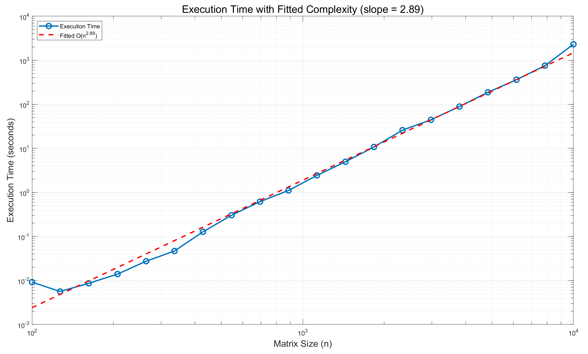
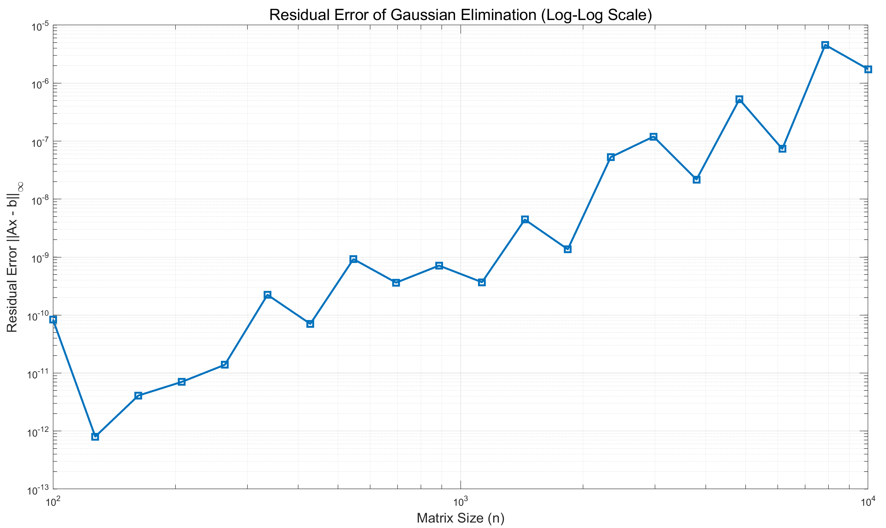
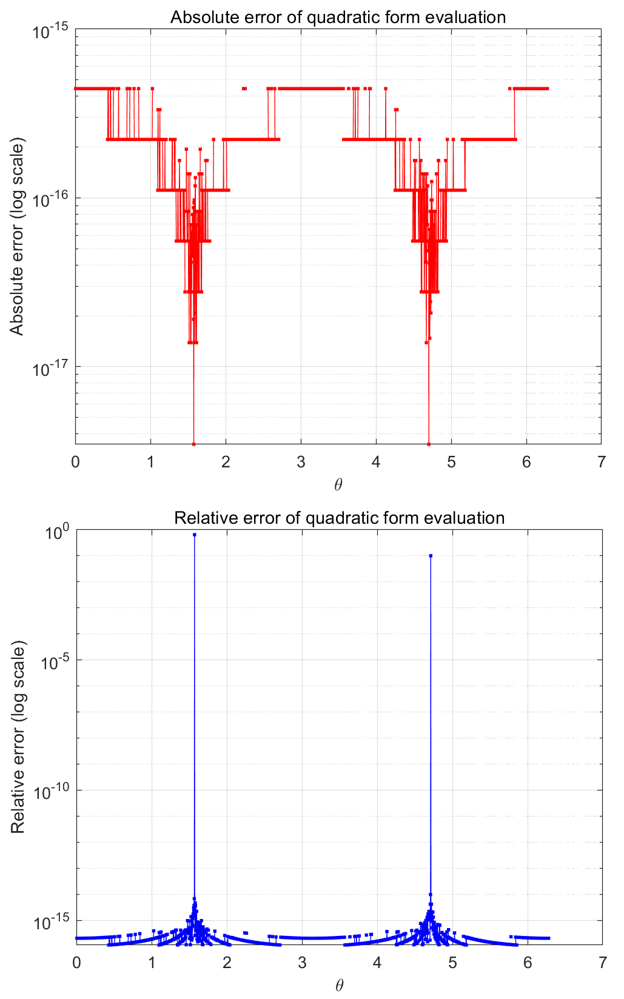

# 数值算法 Homework 01

Due: Sept. 10, 2024  
姓名: 雍崔扬  
学号: 21307140051

## Problem 1

Let $\hat{x}$ be an approximation to $x$.   
In practice, it is often much easier to estimate $\widetilde{E}_{\text{rel}}(\hat{x}) = \frac{\|x - \hat{x}\|}{\|\hat{x}\|}$ compared to $E_{\text{rel}}(\hat{x}) = \frac{\|x - \hat{x}\|}{\|x\|}$.   
What is the relationship between $E_{\text{rel}}(\hat x)$ and $\widetilde{E}_{\text{rel}}(\hat x)$?

**Solution:**  
记 $\delta x = \hat x-x$，不妨设 $E_{\text{rel}}(\hat x) = \|\delta x\|/\|x\|<1$ (因而有 $\|\delta x \|<\|x\|$)，  
则我们有:
$$
\begin{align}
|\widetilde E_{\text{rel}}(\hat x) - E_{\text{rel}}(\hat x)|
&=
\left|\frac{\|x-\hat x\|}{\|x\|} - \frac{\|x-\hat x\|}{\|\hat x\|}\right|\\
&=
\left|\frac{\|\delta x\|}{\|x\|} - \frac{\|\delta x\|}{\|x+\delta x\|}\right|\\
&=
\left|\frac{\|\delta x\|(\|x+\delta x\|-\|x\|)}{\|x\|\|x+\delta x\|}\right|\quad\  (\text{note that }\|x\|-\|\delta x\| \leq \|x+\delta x\|\leq \|x\| + \|\delta x\|)\\
&\leq
\frac{\|\delta x\| (\|x\|+\|\delta x\|-\|x\|)}{\|x\| (\|x\|-\|\delta x\|)}\\
&=
\frac{\|\delta x\|^2}{\|x\|(\|x\|-\|\delta x\|)}\\
&=
\frac{(\|\delta x\|/\|x\|)^2}{1- \|\delta x\|/\|x\|}\\
&=
\frac{(E_{\text{rel}}(\hat x))^2}{1- E_{\text{rel}}(\hat x)}.
\end{align}
$$
当 $E_{\text{rel}}(\hat x) = \|\delta x\|/\|x\| \to 0$ 时，误差上界 $\frac{(E_{\text{rel}}(\hat x))^2}{1-E_{\text{rel}}(\hat x)} = \frac{(\|\delta x\|/\|x\|)^2}{1- \|\delta x\|/\|x\|}$ 也趋近于 $0$，  
表明以 $\widetilde E_{\text{rel}}(\hat x)$ 代替 ${E}_{\text{rel}}(\hat x)$ 的做法是数值稳定的.    
展开绝对值就得到:
$$
\widetilde E_{\text{rel}}(\hat x) 
\leq 
\frac{E_{\text{rel}}(\hat x)}{1 - E_{\text{rel}}(\hat x)}\\
\Downarrow\\

\frac{\widetilde E_{\text{rel}}(\hat x)}{1 +\widetilde E_{\text{rel}}(\hat x)} 
\leq 
E_{\text{rel}}(\hat x)
$$

***

**另一种做法:**  
$$
\begin{align}
|E_{\text{rel}}(\hat x) - \widetilde E_{\text{rel}}(\hat x)|
&=
\left|\frac{\|x-\hat x\|}{\|x\|} - \frac{\|x-\hat x\|}{\|\hat x\|}\right|\\
&=
\left|\frac{\|\delta x\|}{\|\hat x - \delta x\|} - \frac{\|\delta x\|}{\|\hat x\|}\right|\\
&=
\left|\frac{\|\delta x\|(\|\hat x\|-\|\hat x-\delta x\|)}{\|\hat x - \delta x\| \|\hat x\|}\right|\quad\  (\text{note that }\|\hat x\|-\|\delta x\| \leq \|\hat x-\delta x\|\leq \|\hat x\| + \|\delta x\|)\\
&\leq
\frac{\|\delta x\| \cdot \|\delta x\|}{(\|\hat x\|-\|\delta x\|)\|\hat x\|}\\
&=
\frac{(\|\delta x\|/\|x\|)^2}{1- \|\delta x\|/\|x\|}\\
&=
\frac{(\widetilde E_{\text{rel}}(\hat x))^2}{1- \widetilde E_{\text{rel}}(\hat x)}
\end{align}
$$
展开绝对值就得到:  
$$
E_{\text{rel}}(\hat x) 
\leq 
\widetilde{E}_{\text{rel}}(\hat x) + \frac{(\widetilde E_{\text{rel}}(\hat x))^2}{1- \widetilde E_{\text{rel}}(\hat x)} =
\frac{\widetilde E_{\text{rel}}(\hat x)}{1 - \widetilde E_{\text{rel}}(\hat x)}.
$$

***

**TA:** 第一题可以分类讨论，根据 $x,\hat{x}$ 的相对大小，取消绝对值，最终得到 $E_{\text{rel}}(\hat x)$ 和 $\widetilde{E}_{\text{rel}}(\hat x)$ 的等式关系.  

**邵老师的解法:**     
不妨设 $E_{\text{rel}}(\hat x) = \frac{\|x-\hat x\|}{\|x\|}<1$ 和 $\widetilde E_{\text{rel}}(\hat x) = \frac{\| x- \hat x\|}{\|\hat x\|}<1$，则我们有:
$$
\begin{align}
E_{\text{rel}}(\hat x)
&=
\frac{\|\hat x\|}{\|x\|} \widetilde E_{\text{rel}}(\hat x)\\
&=
\frac{\|(\hat x - x) + x\|}{\|x\|} \widetilde E_{\text{rel}}(\hat x)\\
&\leq
\frac{\|\hat x- x\| + \|x\|}{\|x\|}  \widetilde E_{\text{rel}}(\hat x)\\
&=
(\frac{\|\hat x- x\|}{\|x\|} + 1)  \widetilde E_{\text{rel}}(\hat x)\\
&=
(E_{\text{rel}}(\hat x) + 1) \widetilde E_{\text{rel}}(\hat x)
\end{align}
\quad\Rightarrow\quad 
E_{\text{rel}}(\hat x) \leq \frac{\widetilde E_{\text{rel}}(\hat x)}{1-\widetilde E_{\text{rel}}(\hat x)}.
$$
类似地，我们有:
$$
\begin{align}
\widetilde E_{\text{rel}}(\hat x)
&=
\frac{\|x\|}{\|\hat x\|} E_{\text{rel}}(\hat x)\\
&=
\frac{\|(x - \hat x) + \hat x\|}{\|\hat x\|} E_{\text{rel}}(\hat x)\\
&\leq
\frac{\|x- \hat x\| + \|\hat x\|}{\|\hat x\|} E_{\text{rel}}(\hat x)\\
&= 
(\frac{\|\hat x - x\|}{\|\hat x\|} + 1) E_{\text{rel}}(\hat x)\\
&=
(\widetilde E_{\text{rel}}(\hat x) + 1) E_{\text{rel}}(\hat x)
\end{align}
\quad \Rightarrow\quad 
E_{\text{rel}}(\hat x) \geq \frac{\widetilde E_{\text{rel}}(\hat x)}{1 + \widetilde E_{\text{rel}}(\hat x)}.
$$
总之我们有:
$$
\frac{\widetilde E_{\text{rel}}(\hat x)}{1 + \widetilde E_{\text{rel}}(\hat x)} 
\leq 
E_{\text{rel}}(\hat x) 
\leq 
\frac{\widetilde E_{\text{rel}}(\hat x)}{1 - \widetilde E_{\text{rel}}(\hat x)}\\

E_{\text{rel}}(\hat x) = \widetilde E_{\text{rel}}(\hat x) + O((\widetilde E_{\text{rel}}(\hat x))^2).
$$
我的解法相当于为二阶项提供了估计:   
(可以用 $E_{\text{rel}}(\hat x)$ 也可以用 $\widetilde E_{\text{rel}}(\hat x)$ 表示)
$$
|E_{\text{rel}}(\hat x) - \widetilde E_{\text{rel}}(\hat x)| \leq \frac{(E_{\text{rel}}(\hat x))^2}{1-E_{\text{rel}}(\hat x)}\text{ or }\frac{(\widetilde E_{\text{rel}}(\hat x))^2}{1- \widetilde E_{\text{rel}}(\hat x)}.
$$


## Problem 2

How to evaluate $f(x) = \tan(x) - \sin(x)$ for $x \approx 0$ so that numerical cancellation is avoided?

**Solution:**  
$$
\begin{align}
f(x)
&=
\tan(x) - \sin(x)\\
&=
\tan(x)(1-\cos(x))\\
&=
\tan(x)\left(1-\left(1-2\left(\sin\left(\frac{x}{2}\right)\right)^2\right)\right)\\
&=
2\tan(x)\left(\sin\left(\frac{x}{2}\right)\right)^2.
\end{align}
$$


## Problem 3

Let $A$ be a square banded matrix with half-bandwidth $\beta$ (i.e., $a_{ij} = 0$ if $|i - j| > \beta$).   
Suppose that the LU factorization of $A$ (without pivoting) is $A = LU$.   
Show that both $L$ and $U$ are banded matrices with half-bandwidth $\beta$.  
What is the complexity of computing such an LU factorization?

**Solution:**  

> 以 $n=5,\beta=1$ 的情况为例:  
> $$
> \begin{align}
> \begin{bmatrix}
> * & * &  &  & \\
> * & * & * & & \\
>  & * & * & * & \\
>  &  & * & * & *\\
>  &  &  & * & *
> \end{bmatrix}
> 
> &=
> \begin{bmatrix}
> * &  &  &  & \\
> * & * &  & & \\
>  &  & * &  & \\
>  &  &  & * & \\
>  &  &  &  & *
> \end{bmatrix}
> 
> \begin{bmatrix}
> * & * &  &  & \\
>  & * & * & & \\
>  & * & * & * & \\
>  &  & * & * & *\\
>  &  &  & * & *
> \end{bmatrix}\\
> 
> &=
> \begin{bmatrix}
> * &  &  &  & \\
> * & * &  & & \\
>  &  & * &  & \\
>  &  &  & * & \\
>  &  &  &  & *
> \end{bmatrix}
> 
> \begin{bmatrix}
> * &  &  &  & \\
>  & * &  & & \\
>  & * & * &  & \\
>  &  &  & * & \\
>  &  &  &  & *
> \end{bmatrix}
> 
> \begin{bmatrix}
> * & * &  &  & \\
>  & * & * & & \\
>  &  & * & * & \\
>  &  & * & * & *\\
>  &  &  & * & *
> \end{bmatrix}\\
> 
> &=
> 
> \begin{bmatrix}
> * &  &  &  & \\
> * & * &  & & \\
>  &  & * &  & \\
>  &  &  & * & \\
>  &  &  &  & *
> \end{bmatrix}
> 
> \begin{bmatrix}
> * &  &  &  & \\
>  & * &  & & \\
>  & * & * &  & \\
>  &  &  & * & \\
>  &  &  &  & *
> \end{bmatrix}
> 
> \begin{bmatrix}
> * &  &  &  & \\
>  & * &  & & \\
>  &  & * &  & \\
>  &  & * & * & \\
>  &  &  &  & *
> \end{bmatrix}
> 
> \begin{bmatrix}
> * & * &  &  & \\
>  & * & * & & \\
>  &  & * & * & \\
>  &  &  & * & *\\
>  &  &  & * & *
> \end{bmatrix}\\
> 
> &=
> 
> \begin{bmatrix}
> * &  &  &  & \\
> * & * &  & & \\
>  &  & * &  & \\
>  &  &  & * & \\
>  &  &  &  & *
> \end{bmatrix}
> 
> \begin{bmatrix}
> * &  &  &  & \\
>  & * &  & & \\
>  & * & * &  & \\
>  &  &  & * & \\
>  &  &  &  & *
> \end{bmatrix}
> 
> \begin{bmatrix}
> * &  &  &  & \\
>  & * &  & & \\
>  &  & * &  & \\
>  &  & * & * & \\
>  &  &  &  & *
> \end{bmatrix}
> 
> \begin{bmatrix}
> * &  &  &  & \\
>  & * &  & & \\
>  &  & * &  & \\
>  &  &  & * & \\
>  &  &  & * & *
> \end{bmatrix}
> 
> \begin{bmatrix}
> * & * &  &  & \\
>  & * & * & & \\
>  &  & * & * & \\
>  &  &  & * & *\\
>  &  &  &  & *
> \end{bmatrix}\\
> 
> &=
> \begin{bmatrix}
> * &  &  &  & \\
> * & * &  & & \\
>  & * & * &  & \\
>  &  & * & * & \\
>  &  &  & * & *
> \end{bmatrix}
> 
> \begin{bmatrix}
> * & * &  &  & \\
>  & * & * & & \\
>  &  & * & * & \\
>  &  &  & * & *\\
>  &  &  &  & *
> \end{bmatrix}\\
> 
> \end{align}
> $$

设 $A$ 的阶数为 $n$，记 $\mathbb R^n$ 的第 $k$ 个标准单位基向量为 $e_k$.   
在不选主元的 Gauss 消去法中，考虑第 $k$ 步的消元个数:

- 若 $k=1,\dots,n-\beta$，则该步消元 $\beta$ 个，  
  构造的 Gauss 变换矩阵 $L_k = I_n-l_k e_k^\mathrm{T}$ 仅在第 $k$ 列可能有非零对角元，且从 $(k,k+1)$ 位置到 $(k,k+\beta)$ 位置. 
- 在其余 $\beta-1$ 步中，该步消元 $n-k\leq \beta -1$ 个  
  构造的 Gauss 变换矩阵 $L_k = I_n-l_k e_k^\mathrm{T}$ 仅在第 $k$ 列可能有非零对角元，且从 $(k,k+1)$ 位置直到 $(k,n)$ 位置.  

显然上述 $n-1$ 步消元得到的上三角阵 $U$ 和 $A$ 一样具有带宽 $\beta$.   
这是因为上方的行的严格上三角部分具有更多零元，  
向下消元时不会增加下方的行的严格上三角部分的非零元个数.

根据 Gauss 变换的性质我们有:  
$$
\begin{align}
L 
&= (L_{n-1}\dotsm L_2L_1)^{-1}\\
&= L_1^{-1} L_2^{-1} \dotsm L_{n-1}^{-1}\\
&= (I + l_1 e_1^\mathrm{T})(I + l_2 e_2^\mathrm{T})\dotsm (I+l_{n-1} e_{n-1}^\mathrm{T})\quad (\text{note that }e_j^\mathrm{T}l_i = 0 \text{ for all }j<i)\\
&= I + l_1 e_1^\mathrm{T} + l_2 e_2^\mathrm{T} + \dotsm + l_{n-1} e_{n-1}^\mathrm{T}.\end{align}
$$
因此 $L$ 的第 $k=1,\dots,n-\beta$ 列都在 $(k,k+1)$ 位置到 $(k,k+\beta)$ 可能有非零对角元，  
而在剩余列中，对角线下方的非对角元都可能非零.  
这表明 $L$ 是具有带宽 $\beta$ 的下三角带状矩阵.

****

假设采用不选主元的 Gauss 消去法.  
由于我们只需保存 $A$ 的 $2\beta+1$ 条对角线上的元素，  
且 $L$ 和 $U$ 的元素可以直接覆盖在 $A$ 的存储空间上，  
因此空间复杂度能够降低至 $O(n\beta)$.

在第 $k=1,2,\dots,n-1$ 次消去时，需要消去的元素个数为 $n_k = \min(\beta,n-k)$.  
因此计算 Gauss 变换的代价为 $n_k$，应用 Gauss 变换的代价为 $2\sum_{i=1}^{n_k}i = n_k(n_k-1)$.  
于是计算复杂度为:  
$$
\sum_{k=1}^{n-1} (n_k + n_k(n_k-1)) = \sum_{k=1}^{n-1} n_k^2 \leq \sum_{k=1}^{n-1} \beta^2 = O(n\beta^2).
$$
特殊地，当 $\beta=n-1$ (即 $A$ 为一般的方阵) 时，计算复杂度为 $O(n^3)$;  
当 $\beta=1$ (即 $A$ 为三对角阵) 时，计算复杂度为 $O(n)$.  
上述结论的延申参见 **Homework 02 Problem 10**.


## Problem 4

Find the exact LU factorization of the $n \times n$ matrix
$$
\begin{bmatrix}
1 & 0 & 0 & \cdots & 0 & 1 \\
-1 & 1 & 0 & \cdots & 0 & 1 \\
-1 & -1 & 1 & \cdots & 0 & 1 \\
\vdots & \vdots & \vdots & \ddots & \vdots & \vdots \\
-1 & -1 & -1 & \cdots & 1 & 1 \\
-1 & -1 & -1 & \cdots & -1 & 1
\end{bmatrix}.
$$

**Solution:**  
记 $\mathbb R^n$ 的第 $k$ 个标准单位基向量为 $e_k$.   
注意到第 $k=1,\dots,n-1$ 步 Gauss 变换为
$$
L_k = I_n - l_k e_k^\mathrm{T}\text{ where }l_k = -e_{k+1}-\dotsm - e_n.
$$
根据 Gauss 变换的性质我们有:
$$
\begin{align}
L 
&= (L_{n-1}\dotsm L_2L_1)^{-1}\\
&= L_1^{-1} L_2^{-1} \dotsm L_{n-1}^{-1}\\
&= (I + l_1 e_1^\mathrm{T})(I + l_2 e_2^\mathrm{T})\dotsm (I+l_{n-1} e_{n-1}^\mathrm{T})\quad (\text{note that }e_j^\mathrm{T}l_i = 0 \text{ for all }j<i)\\
&= I + l_1 e_1^\mathrm{T} + l_2 e_2^\mathrm{T} + \dotsm + l_{n-1} e_{n-1}^\mathrm{T}\\
&=
\begin{bmatrix}
1 &  &  &  &  &  \\
-1 & 1 &  &  &  &  \\
-1 & -1 & 1 &  &  &  \\
\vdots & \vdots & \vdots & \ddots &  &  \\
-1 & -1 & -1 & \cdots & 1 &  \\
-1 & -1 & -1 & \cdots & -1 & 1
\end{bmatrix}.
\end{align}
$$
注意到第 $k$ 步总是用第 $k$ 行直接加到后 $n-k$ 行上进行消元，因此得到上三角阵 
$$
U = \begin{bmatrix}
1 &  &  &  &  &  1\\
 & 1 &  &  &  &  2\\
 & & 1 &  &  &  4\\
 &  & & \ddots &  &  \vdots\\
 &  &  &  & 1 & 2^{n-2} \\
&  &  &  &  & 2^{n-1}
\end{bmatrix}.
$$
因此 $A$ 的 $\text{LU}$ 分解为
$$
A = \begin{bmatrix}
1 & 0 & 0 & \cdots & 0 & 1 \\
-1 & 1 & 0 & \cdots & 0 & 1 \\
-1 & -1 & 1 & \cdots & 0 & 1 \\
\vdots & \vdots & \vdots & \ddots & \vdots & \vdots \\
-1 & -1 & -1 & \cdots & 1 & 1 \\
-1 & -1 & -1 & \cdots & -1 & 1
\end{bmatrix}

= 

\begin{bmatrix}
1 &  &  &  &  &  \\
-1 & 1 &  &  &  &  \\
-1 & -1 & 1 &  &  &  \\
\vdots & \vdots & \vdots & \ddots &  &  \\
-1 & -1 & -1 & \cdots & 1 &  \\
-1 & -1 & -1 & \cdots & -1 & 1
\end{bmatrix}

\begin{bmatrix}
1 &  &  &  &  &  1\\
 & 1 &  &  &  &  2\\
 & & 1 &  &  &  4\\
 &  & & \ddots &  &  \vdots\\
 &  &  &  & 1 & 2^{n-2} \\
&  &  &  &  & 2^{n-1}
\end{bmatrix}

=
LU.
$$

其增长因子为
$$
\rho = \frac{\max_{i,j} |u_{i,j}|}{\|A\|_\infty} = \frac{2^{n-1}}{1} = 2^{n-1},
$$
达到了部分主元 Gauss 消去法的增长因子的上界 $2^{n-1}$.


## Problem 5

Implement Gaussian elimination (without pivoting) for solving nonsingular linear systems.   
You may assume that no divide-by-zero error is encountered.   
Measure the execution time of your program in terms of matrix dimensions and visualize the result by a log–log scale plot.   
(You may generate your test matrices with normally distributed random elements.)

### (1) Gauss 消去法

不选主元的 Gauss 消去法的算法如下:     
**(Gauss 消去法, 数值线性代数, 算法 $1.1.3$)**  
$$
\begin{align}
&\text{function: }[L,U] = \text{GaussianElimination}(A)\\
&\qquad n = \dim(A)\\
&\qquad \text{for }k=1:n-1\\
&\qquad\qquad A(k+1:n , k) = A(k+1:n,k) / A(k,k)\\
&\qquad\qquad A(k+1:n , k+1 : n) = A(k+1:n,k+1:n) - A(k+1:n,k) A(k,k+1:n)\\
&\qquad\text{end}\\
&\qquad L = I_n + A\odot (\text{strictly lower triangular matrix with all ones})\\
&\qquad U = A\odot (\text{upper triangular matrix with all ones})\\
&\qquad \text{return }[L,U]
\end{align}
$$
其中 $\odot$ 代表 Hadamard 乘积，即逐点乘积.  
总浮点运算数为
$$
\begin{align}
\sum_{i=1}^{n-1} \left((n-i) + 2(n-i)^2\right)
&= \sum_{k=1}^{n-1} (k + 2k^2)\\
&=
\frac{1}{2} (n-1)n + 2\cdot \frac{1}{6}(n-1)n(2n-1)\\
&=
\frac{2}{3}n^3 - \frac12 n^2 - \frac16 n\\
&= O\left(n^3\right).\end{align}
$$
MATLAB 代码如下:

```matlab
function [L, U] = Gaussian_Elimination(A)
    % Input:
    % A - An n x n matrix
    %
    % Output:
    % L - Lower triangular matrix
    % U - Upper triangular matrix

    % Get the size of the matrix A
    [n, ~] = size(A);

    % Perform Gaussian Elimination
    for k = 1:n-1
        % Update column elements below the diagonal
        A(k+1:n, k) = A(k+1:n, k) / A(k, k);

        % Update the remaining submatrix
        A(k+1:n, k+1:n) = A(k+1:n, k+1:n) - A(k+1:n, k) * A(k, k+1:n);
    end

    % Construct the lower triangular matrix L
    L = eye(n) + tril(A, -1);

    % Construct the upper triangular matrix U
    U = triu(A);

    % Return the results
    return;
end
```

### (2) 回代法 & 前代法

根据 Gauss 消元法得到 $A=LU$ 后，我们按如下步骤求解线性方程组 $Ax=b$:

- 用前代法求解 $Ly=b$ 得到 $y$ 
- 用回代法求解 $Ux = y$ 得到 $x$

MATLAB 代码如下:

```matlab
% 求解线性方程组 Ax = b
function x = Solve_Linear_System(A, b)
    % 使用 Gauss 消去法计算 A = LU
    [L, U] = Gaussian_Elimination(A);
    
    % 使用前代法求解 Ly = b
    y = Forward_Sweep(L, b);
    
    % 使用回代法求解 Ux = y
    x = Backward_Sweep(U, y);
end
```

***

**(前代法, 数值线性代数, 算法 $1.1.1$)**
$$
\begin{align}
&\text{function}:y = \text{ForwardSweep}[L,b]\\
&\qquad n = \text{length}(b)\\
&\qquad\text{for }i=1:n-1\\
&\qquad\qquad b(i) = b(i)/L(i,i)\\
&\qquad\qquad b(i+1:n) = b(i+1:n) - b(i) L(i+1:n,i)\\
&\qquad\text{end}\\
&\qquad b(n) = b(n)/L(n,n)\\
&\qquad\text{return }b
\end{align}
$$
最终 $Ly=b$ 的解 $y$ 存储在 $b$ 中.  
第 $1\leq i\leq n-1$ 步浮点运算次数为 $1 + (n-i) + (n-i) = 2(n-i) + 1$，
最后一步浮点运算次数为 $1$.  
总浮点运算次数为
$$
\begin{align}
\left\{\sum_{i=1}^{n-1}(2(n-i)+1)\right\} + 1 
&= \sum_{k=1}^{n-1} (2k + 1) + 1 \\
&= (n-1) \cdot \frac{3 + 2n-1}{2}  + 1 \\
&= n^2 -1 + 1\\ 
&= n^2\\
&= O(n^2).
\end{align}
$$

MATLAB 代码如下:

```matlab
function y = Forward_Sweep(L, b)
    % 前代法求解 Ly = b
    n = length(b);
    for i = 1:n-1
        b(i) = b(i) / L(i, i);  % 对角线归一化
        b(i+1:n) = b(i+1:n) - b(i) * L(i+1:n, i);  % 消去
    end
    b(n) = b(n) / L(n, n);  % 处理最后一行
    y = b;  % 返回结果
end
```

***

**(回代法, 数值线性代数, 算法 $1.1.2$)**   
$$
\begin{align}
&\text{function: }x = \text{BackwardSweep}[U,y]\\
&\qquad n = \text{length}(y)\\
&\qquad\text{for }i=n:-1:2\\
&\qquad\qquad y(i) = y(i)/U(i,i)\\
&\qquad\qquad y(1:i-1) = y(1:i-1) - y(i) U(1:i-1,i)\\
&\qquad\text{end}\\
&\qquad y(1) = y(1)/U(1,1)\\
&\qquad\text{return }y
\end{align}
$$
最终 $Ux=y$ 的解 $x$ 存储在 $y$ 中.  
第 $2\leq i\leq n$ 步浮点运算次数为 $1 + (i-1) + (i-1) = 2i - 1$，
最后一步浮点运算次数为 $1$.  
总浮点运算次数为
$$
\begin{align}
\sum_{i=2}^{n} (2i-1) + 1 
&= \sum_{k=1}^{n-1} (2k + 1) + 1 \\
&= (n-1) \cdot \frac{3+2n-1}{2} + 1 \\
&= n^2 -1 + 1\\ 
&= n^2\\
&= O(n^2).
\end{align}
$$

MATLAB 代码如下:

```matlab
function x = Backward_Sweep(U, y)
    % 回代法求解 Ux = y
    n = length(y);
    for i = n:-1:2
        y(i) = y(i) / U(i, i);  % 对角线归一化
        y(1:i-1) = y(1:i-1) - y(i) * U(1:i-1, i);  % 消去
    end
    y(1) = y(1) / U(1, 1);  % 处理第一行
    x = y;  % 返回结果
end
```


### (3) 函数调用

```matlab
% 定义不同 n 值的范围
rng(51);
n_values = round(logspace(2, 4, 20));
execution_times = zeros(size(n_values));
residual_errors = zeros(size(n_values));  % 存储误差

% 遍历每个 n 值
for i = 1:length(n_values)
    n = n_values(i);
    
    % 生成随机 nxn 矩阵和随机右侧向量 b
    A = randn(n, n);
    b = randn(n, 1);
    
    % 记录 Gauss 消去法求解线性方程组 Ax = b 的执行时间
    tic;  % 开始计时

    % 使用 Gauss 消去法结合前代法和回代法求解线性方程组 Ax = b 
    x = Solve_Linear_System(A, b);
    
    execution_times(i) = toc;  % 停止计时并记录时间
    
    % 计算残差误差 ||Ax - b||_inf
    residual_errors(i) = norm(A*x - b, inf);
    
    % 输出当前维度、执行时间和误差
    fprintf('Matrix size: %d x %d, Time: %.4f s, Residual error: %.2e\n', ...
        n, n, execution_times(i), residual_errors(i));
end

% 绘制执行时间
figure;
loglog(n_values, execution_times, '-o', 'LineWidth', 2, 'MarkerSize', 8);
hold on;

% 线性拟合
coeffs = polyfit(log(n_values), log(execution_times), 1);
p = coeffs(1);
a = coeffs(2);
fitted_line = exp(a) * n_values.^p;
loglog(n_values, fitted_line, '--r', 'LineWidth', 2);

% 添加标签和标题
xlabel('Matrix Size (n)', 'FontSize', 14);
ylabel('Execution Time (seconds)', 'FontSize', 14);
title(sprintf('Execution Time with Fitted Complexity (slope = %.2f)', p), ...
      'FontSize', 16);

legend('Execution Time', sprintf('Fitted O(n^{%.2f})', p), ...
       'Location', 'northwest');

grid on;
hold off;

% 绘制误差的 log-log 图
figure;
loglog(n_values, residual_errors, '-s', 'LineWidth', 2, 'MarkerSize', 8);
xlabel('Matrix Size (n)', 'FontSize', 14);
ylabel('Residual Error ||Ax - b||_\infty', 'FontSize', 14);
title('Residual Error of Gaussian Elimination (Log-Log Scale)', 'FontSize', 16);
grid on;
```

运行结果:

```
Matrix size: 100 x 100, Time: 0.0092 s, Residual error: 8.37e-11
Matrix size: 127 x 127, Time: 0.0056 s, Residual error: 8.02e-13
Matrix size: 162 x 162, Time: 0.0086 s, Residual error: 4.09e-12
Matrix size: 207 x 207, Time: 0.0139 s, Residual error: 7.04e-12
Matrix size: 264 x 264, Time: 0.0274 s, Residual error: 1.39e-11
Matrix size: 336 x 336, Time: 0.0467 s, Residual error: 2.24e-10
Matrix size: 428 x 428, Time: 0.1272 s, Residual error: 7.05e-11
Matrix size: 546 x 546, Time: 0.3031 s, Residual error: 9.24e-10
Matrix size: 695 x 695, Time: 0.6145 s, Residual error: 3.63e-10
Matrix size: 886 x 886, Time: 1.1055 s, Residual error: 7.13e-10
Matrix size: 1129 x 1129, Time: 2.4309 s, Residual error: 3.69e-10
Matrix size: 1438 x 1438, Time: 4.9530 s, Residual error: 4.43e-09
Matrix size: 1833 x 1833, Time: 10.7474 s, Residual error: 1.36e-09
Matrix size: 2336 x 2336, Time: 25.8469 s, Residual error: 5.29e-08
Matrix size: 2976 x 2976, Time: 44.4465 s, Residual error: 1.20e-07
Matrix size: 3793 x 3793, Time: 88.8554 s, Residual error: 2.18e-08
Matrix size: 4833 x 4833, Time: 187.4207 s, Residual error: 5.24e-07
Matrix size: 6158 x 6158, Time: 360.9349 s, Residual error: 7.34e-08
Matrix size: 7848 x 7848, Time: 753.9419 s, Residual error: 4.57e-06
Matrix size: 10000 x 10000, Time: 2307.3896 s, Residual error: 1.74e-06
```



这验证了 Gauss 消元法 $O(n^3)$ 级别的时间复杂度.




## Problem 6 (optional)

**(Accuracy and Stability of Numerical Algorithms (2nd Edition, N. Higham) Section $1.8$)**  
Write a program to solve the quadratic equation $ax^2 + bx + c = 0$ with real coefficients.   
Describe how to avoid cancellation when the equation has a tiny root.

**Solution:**  
实系数一元二次方程 $ax^2 + bx + c = 0\ (a\neq 0)$ 的解为  
$$
\begin{align}
x_1 &= \frac{-b - \sqrt{b^2 - 4ac}}{2a}\\
x_2 &= \frac{-b + \sqrt{b^2 - 4ac}}{2a}.
\end{align}
$$
当 $4ac>b^2$ 时方程具有一对共轭复根，不存在相消问题.  
当 $4ac\approx b^2$ 时相消问题并不严重 (判别式的相消问题可通过 Kahan 算法解决，这里不展开讨论).  
当 $4ac\ll b^2$ 时:

- 若 $b>0$，则 $x_2$ 的分子计算时会出现相消，因此应用 $x_2 = \frac{2c}{-b - \sqrt{b^2 - 4ac}}$ 计算 $x_2$
- 若 $b<0$，则 $x_1$ 的分子计算时会出现相消，因此应用 $x_1 = \frac{2c}{-b + \sqrt{b^2 - 4ac}}$ 计算 $x_1$

> 或者我们可以规定 $x_1$ 为:
> $$
> x_1 = -\frac{b + \text{sgn}(b)\sqrt{b^2-4ac}}{2a},
> $$
> 总是先计算 $x_1$，然后通过 $x_1x_2 = c/a$ 计算 $x_2$.

总之我们有如下 MATLAB 代码:

```matlab
function [x1, x2] = solveQuadratic(a, b, c)
    % Check if the equation is actually quadratic
    if a == 0
        error('Coefficient a cannot be zero in a quadratic equation.');
    end

    % Calculate the discriminant
    D = b^2 - 4*a*c;

    % Compute the roots
    if D >= 0
        % Real roots
        if b >= 0
            x1 = (-b - sqrt(D)) / (2*a);
            x2 = (2*c) / (-b - sqrt(D));
        else
            x1 = (-b + sqrt(D)) / (2*a);
            x2 = (2*c) / (-b + sqrt(D));
        end
    else
        % Complex roots
        realPart = -b / (2*a);
        imagPart = sqrt(-D) / (2*a);
        x1 = realPart + 1i*imagPart;
        x2 = realPart - 1i*imagPart;
    end

    % Display the results
    fprintf('The roots of the quadratic equation are:\n');
    fprintf('x1 = %.12f + %.12fi\n', real(x1), imag(x1));
    fprintf('x2 = %.12f + %.12fi\n', real(x2), imag(x2));
end
```

函数调用:  

```matlab
% Test case with large b and small discriminant
solveQuadratic(1, 1e10, 1);

% Test case with complex root
solveQuadratic(1, 2, 3);
```

输出结果:  

```tex
The roots of the quadratic equation are:
x1 = -10000000000.000000000000 + 0.000000000000i
x2 = -0.000000000100 + 0.000000000000i
The roots of the quadratic equation are:
x1 = -1.000000000000 + 1.414213562373i
x2 = -1.000000000000 + -1.414213562373i
```

简单起见，在上述 MATLAB 代码中，我们并没有处理判别式 $\Delta = b^2-4ac$ 的相消问题.  
一方面是因为在数值稳定性上，判别式问题其实不如根公式本身敏感.  
另一方面是因为 MATLAB 没有直接暴露 $\text{FMA}$ 指令，  
因此无法使用 Kahan 算法提高计算判别式 $\Delta = b^2-4ac$ 的精度.  

此外，我们也没有考虑上溢和下溢的问题.  
其中，上溢可以通过将方程系数统一除以其绝对值的最大值来加以避免;
而下溢则通常需要对变量进行适当的缩放，这里不再展开.


## Problem 7 (optional)

### (1) 论文阅读

Read the paper [*What every computer scientist should know about floating-point arithmetic*](https://pages.cs.wisc.edu/~david/courses/cs552/S12/handouts/goldberg-floating-point.pdf) by David Goldberg.

It is a tutorial that focuses on the often non‐intuitive behavior of floating‐point arithmetic,   
how errors arise, how the IEEE standard works,   
and what system designers can / should do to support predictable, reliable floating‐point computation.  
It is organized roughly in three main parts:

- Rounding Error & Basic Properties
  - why floating‐point arithmetic can behave oddly 
  - what kinds of error measures we care about

- IEEE‐754 Standard
  - formats and representations
  - rounding modes
  - special values and exceptional quantities

- Systems Aspects  
  - how floating point affects hardware, languages, compilers, and software systems


### (2) IEEE-754 浮点数

The $32$-bit floating-point format discussed in the lecture is the IEEE-754 single precision format,    
consisting of $1$ sign bit, $8$ bits of exponent, and $23$ bits of significand.   
Estimate the maximum finite floating-point number,   
the minimum positive (normal) floating-point number,   
as well as a tight upper bound on the relative representation error for the IEEE-754 single precision format.

What about the IEEE-754 double precision format, 
consisting of $1$ sign bit, $11$ bits of exponent, and $52$ bits of significand?

**Solution:**  
考虑 IEEE-754 单精度浮点数，  
它由**符号位** (Sign)、**指数位** (Exponent)、**尾数位** (Fraction) 构成:   

- 符号位: 占 $1$ 位，用于表示数值的正负;   
- 指数位: 占 $8$ 位，使用偏移量为 $2^{8}-1=127$ 的偏移表示法;   
- 尾数位: 占 $23$ 位，用于表示数值的小数部分，隐含一个前导的 $1$.

当指数位全为 $0$ 时:

- 若尾数位全为 $0$，则当符号位为 $0$ 时代表 $+0$，当符号位为 $0$ 时代表 $-0$.  
- 否则代表非规格化浮点数.

当指数位全为 $1$ 时:  

- 若尾数位全为 $0$，则当符号位为 $0$ 时代表 $+\infty$，当符号位为 $0$ 时代表 $-\infty$.  
- 否则代表 $\text{NaN}$ (Not a Number).

当指数为 $1\sim 254$ 时，代表规格化浮点数，其数值为:
$$
\text{Single Float} = (-1)^{\text{Sign}} \times 1.\text{Fraction} \times 2^{\text{Exponent} -127}
$$
其精度范围约为:
$$
\pm [1\times 2^{-126},(2-2^{-23})\times 2^{+127}] \approx \pm [1.18\times 10^{-38},3.40\times 10^{+38}]
$$
如果考虑非规格化的情况，则精度范围约为:   
$$
\pm [2^{-23}\times 2^{-126},(2-2^{-23})\times 2^{+127}] \approx \pm [1.40\times 10^{-45},3.40\times 10^{+38}]
$$
机器精度 $\text{eps} = 2^{-23} \approx 1.19\times 10^{-7}$.    
对于最邻近舍入法 (round-to-nearest)，相对舍入误差上界为:
$$
\frac{|\text{fl}(x)-x|}{|x|} \leq \text{eps}/2 = 2^{-24} \approx 5.96\times 10^{-8}.
$$

***

再考虑 IEEE-754 双精度浮点数，  
它由**符号位** (Sign)、**指数位** (Exponent)、**尾数位** (Fraction) 构成:

- 符号位: 占 $1$ 位，用于表示数值的正负;   
- 指数位: 占 $11$ 位，使用偏移量为 $2^{10}-1=1023$ 的偏移表示法;   
- 尾数位: 占 $52$ 位，用于表示数值的小数部分，隐含一个前导的 $1$.  

当指数位全为 $0$ 时:

- 若尾数位全为 $0$，则当符号位为 $0$ 时代表 $+0$，当符号位为 $0$ 时代表 $-0$.  
- 否则代表非规格化浮点数.

当指数位全为 $1$ 时:  

- 若尾数位全为 $0$，则当符号位为 $0$ 时代表 $+\infty$，当符号位为 $0$ 时代表 $-\infty$.  
- 否则代表 NaN (Not a Number).

当指数为 $1\sim 2046$ 时，代表规格化浮点数，其数值为:
$$
\text{Double Float} = (-1)^{\text{Sign}} \times 1.\text{Fraction} \times 2^{\text{Exponent} -1023}
$$
其精度范围约为:
$$
\pm [1\times 2^{-1022},(2-2^{-52})\times 2^{+1023}] \approx \pm [2.23\times 10^{-308},1.78\times 10^{+308}]
$$
如果考虑非规格化的情况，则精度范围约为:   
$$
\pm [2^{-52}\times 2^{-1022},(2-2^{-52})\times 2^{+1023}] \approx \pm [4.94\times 10^{-324},1.78\times 10^{+308}]
$$
机器精度 $\text{eps} = 2^{-52} \approx 2.22\times 10^{-16}$.  
对于最邻近舍入法 (round-to-nearest)，相对舍入误差上界为:  
$$
\frac{|\text{fl}(x)-x|}{|x|} \leq \text{eps}/2 = 2^{-53} \approx 1.11\times 10^{-16}.
$$


### (3) $3/7$ 的浮点数表示

What is the hexadecimal representation of $3/7$ in IEEE-754 single/double precision floating point format?   
Explain how the number is encoded.

What about the IEEE-754 double precision format, 
consisting of $1$ sign bit, $11$ bits of exponent, and $52$ bits of significand?

**Solution:**  
注意到 $3/7 = 0.428571...$ 是无限循环小数.   
现考虑其位表示:

- $2\times 0.428571\dots = 0.857142\dots$，得到位 $0$.
- $2\times 0.857142\dots = 1.714285\dots$，得到位 $1$. 
- $2\times 0.714285\dots = 1.428571\dots$，得到位 $1$ (又回到了刚开始的情况)

因此 $3/7$ 的位表示为 $\text{0b}0.011\_011\_011{\dots} = 2^{-2} \times \text{0b}1.101\_101\_101\dots$  

- 符号位为 $0$

- 指数为 $-2$:  
  对于单精度浮点数，指数位为 $-2 + 127 = 125 = \text{0b}0111\_1101$;  
  对于双精度浮点数，指数位为 $-2 + 1023 = 1021 = \text{0b}011\_1111\_1101$;

- 尾数为 $101\_101\_101\dots$ (去除了前导的 $1$):  
  对于单精度浮点数，截断并舍入得到的 $23$ 位尾数为:   
  (截断的第 $24$ 位为 $1$，而后续的位也出现了 $1$，因此向上舍入，第 $23$ 位原本取 $0$，截断后取 $1$)
  $$
  \text{0b}101\_1011\_0110\_1101\_1011\_0111...
  $$
  对于双精度浮点数，截断并舍入得到的 $52$ 位尾数为:  
  (截断的第 $53$ 位为 $0$，直接截断即可，第 $52$ 位取 $1$)
  $$
  \text{0b}1011\_0110\_1101\_1011\_0110\_1101\_1011\_0110\_1101\_1011\_0110\_1101\_1011
  $$

因此 $3/7$ 的单精度浮点数表示为:
$$
\begin{align}
3/7 &= \text{0b}0011\_1110\_1101\_1011\_0110\_1101\_1011\_0111\\
&= \text{0x3EDB6DB7}
\end{align}
$$
而 $3/7$ 的双精度浮点数表示为:
$$
\begin{align}
3/7 &= \text{0b}0011\_1111\_1101\_1011\_0110\_1101\_1011\_0110\_1101\_1011\_0110\_1101\_1011\_0110\_1101\_1011\\
&= \text{0x3FDB6DB6DB6DB6DB}
\end{align}
$$
Python 代码验证:

```python
import struct

x = 3/7

# 单精度 (32-bit)
single_hex = f"0x{struct.unpack('>I', struct.pack('>f', x))[0]:08X}"
print("single precision hex:", single_hex)

# 双精度 (64-bit)
double_hex = f"0x{struct.unpack('>Q', struct.pack('>d', x))[0]:016X}"
print("double precision hex:", double_hex)
```

运行结果:

```
single precision hex: 0x3EDB6DB7
double precision hex: 0x3FDB6DB6DB6DB6DB
```


### (4) 调和级数

Suppose that you are evaluating the harmonic series,  
using IEEE 754 single/double precision floating-point numbers and obtained a "converged" result.   
Make an estimate on when the computation converges, and what is the final result.

Try different programming languages or different compiler optimization flags.   
Do you always obtain the same answer?

**Solution:**  
理论上，调和级数 $\sum_{n=1}^\infty 1/n$ 是发散的 ([这又不得不提起那篇文章了](https://max.book118.com/html/2019/0327/5320131213002022.shtm))，  
而数值计算中发生的 "收敛" 是由浮点数的舍入误差造成的.

考虑以下算法: 
$$
\begin{align}
&\text{whlie }H_{n} \neq H_n + \frac{1}{n}\ \text{do}\\
&\qquad H_{n+1} = H_n + \frac1n\\
&\qquad n = n+1\\
&\text{end}
\end{align}
$$
当计算机在计算 $H_n + 1/n$ 时，  
它首先会将两个浮点数 $H_n$ 和 $1/n$ 的指数部分对齐，  
此时 $1/n$ 作为较小的数，其尾数部分会向右移动，超出的部分会被舍弃，   
当 $n$ 足够大时，$H_n$ 和 $1/n$ 的指数部分的差距会足够大，使得在对齐过程中 $1/n$ 的尾数部分全部被舍弃.   
这样 $H_n + 1/n$ 的结果就是 $H_n$，于是循环条件 $H_{n} \neq H_n + 1/n$ 判错，迭代终止.  
这就是调和级数在数值计算中产生 "收敛" 现象的原因.

**那么 $H_n$ 收敛时的 $n$ 的大致是多少呢？**  
要找 $n$ 使得单精度浮点数下 $H_n = H_n + 1/n$ 成立，  
即要找 $n$ 使得单精度浮点数 $H_n$ 和 $1/n$ 的指数部分至少相差 $23+2 = 25$ 位.  
我们知道调和级数的增长速度类似于自然对数，即 $H_n \approx \ln(n) + \gamma$   
(其中 Euler 常数 $\gamma = \lim_{n\to\infty}(H_n - \ln(n)) \approx 0.5772156649$)  

因此 $H_n$ 的指数部分 $\text{Exponent}(H_n) \approx  \text{Floor}\{\log_2(\ln(n)+\gamma)\}$，  
而 $1/n$ 的指数部分 $\text{Exponent}(1/n) = \text{Floor}\{-\log_2(n)\} = -\text{Ceil}\{\log_2(n)\}$，   
其中 $\text{Ceil}、\text{Floor}$ 分别代表上、下取整.

我们令:
$$
\begin{align}
&\text{Exponent}(H_n) - \text{Exponent}(1/n)\\
&=\text{Floor}\{\log_2(\ln(n)+\gamma)\}+\text{Ceil}\{\log_2(n)\} \\
&\geq 24
\end{align}
$$
通过数值方法解得 $n\approx 2.097\times 10^6$.   

- 对于双精度浮点数，将 $24$ 替换为 $52+2=54$，解得 $n \approx 1.407 \times 10^{14}$.

MATLAB 代码如下:


```matlab
result24 = find_min_n_converged(1e6, 1e3, 25);
H24_approx = log(result24) + 0.5772156649; % Euler 近似
fprintf('Estimation for single precision: n = %.0f, H_n ≈ %.8f\n', result24, H24_approx);

result54 = find_min_n_converged(1e14, 1e11, 54);
H54_approx = log(result54) + 0.5772156649;
fprintf('Estimation for double precision: n = %.0f, H_n ≈ %.16f\n', result54, H54_approx);

function min_n = find_min_n_converged(n_init, step, p)
    % find_min_n_converged searches for minimal n
    % n_init = 起始值 (linear search 的起点)
    % step   = 每次增加的步长 (coarse search 的步长)
    % p      = mantissa 位数 (e.g., 25 for single, 54 for double)
    
    gamma = 0.5772156649; % Euler-Mascheroni 常数
    n = n_init;
    
    % ----------- 粗搜索 (linear search) -----------
    while true
        term1 = floor(log2(log(n) + gamma));
        term2 = ceil(log2(n));
        if term1 + term2 >= p
            break;  % 找到一个上界
        end
        n = n + step;
    end
    
    % 此时 [n - step, n] 是包含解的区间
    low = max(n - step, 1);  % 避免 < 1
    high = n;
    
    % ----------- 二分搜索 (binary search) -----------
    while low < high
        mid = floor((low + high) / 2);
        term1 = floor(log2(log(mid) + gamma));
        term2 = ceil(log2(mid));
        
        if term1 + term2 >= p
            high = mid;   % 缩小到左半区间
        else
            low = mid + 1; % 缩小到右半区间
        end
    end
    
    min_n = low;  % low == high
end
```

运行结果:

```
Estimation for single precision: n = 2097153, H_n ≈ 15.13330693
Estimation for double precision: n = 281474976710657, H_n ≈ 33.8482803317773815
```

这里使用 Euler 公式的估计值 $2097153$ 对比实验值 $2097152$ 差了 $1$，是合理的.  
不过，邵老师对估计值能够达到如此精度仍持保留态度，认为在评估舍入误差上界时应当更加谨慎.

****

下面通过计算几何级数进行验证.

- **MATLAB 代码:**

  ```matlab
  % 验证调和级数在单精度浮点数运算中的"收敛"现象
  H_single = single(0.0);
  n_single = single(1.0);   % 用 single 而不是 int32
  
  while true
      if H_single == H_single + 1.0/n_single
          break;
      end
      H_single = H_single + 1.0./n_single;
      n_single = n_single + 1.0;
  end
  
  fprintf('Single precision stops at n = %.0f\n', n_single);
  fprintf('H_n = %.8f\n', H_single);
  ```

  运行结果:

  ```
  Single precision stops at n = 2097152
  H_n = 15.40368271
  ```

- **C 代码:**

  ```c
  #include <stdio.h>
  #include <float.h>
  
  void test_float() {
      float H = 1.0f;
      int n = 2;
      while (1) {
          float term = 1.0f / (float)n;
          float newH = H + term;
          if (newH == H) break;
          H = newH;
          n++;
      }
      printf("Single precision stops at n = %d\n", n);
      printf("H_n = %.8f\n", H);
  }
  
  int main() {
      test_float();
      return 0;
  }
  ```

  使用 **`-O0` 标志** (关闭所有优化) 时，程序运行结果为:

  ```
  > gcc -O0 HW01_P7_validation.c -o HW01_P7_validation_O0
  > HW01_P7_validation_O0.exe
  Single precision stops at n = 2097152
  H_n = 15.40368271
  ```

  使用 **`-O2` 标志** (常见的优化等级) 时，程序运行结果为:

  ```
  > gcc -O2 HW01_P7_validation.c -o HW01_P7_validation_O2
  > HW01_P7_validation_O2.exe
  Single precision stops at n = 1
  H_n = 1.#INF0000
  ```

  这表明编译器在高优化下可能改变了浮点运算的执行顺序或精度处理，从而破坏了结果的可靠性.


## Problem 8

Let $U\in \mathbb{R}^{n\times n}$ be upper triangular and nonsingular.  
Provide two different implementations for solving the linear system $Ux=b$, where $b\in \mathbb{R}^n$ is a given vector.

**Solution:**   

- **解法 $1$ (回代法的按行访问形式):**
  $$
  \begin{aligned}
  &\text{function: } x = \text{Backward\_Sweep\_Row}[U,b] \\
  &\qquad n \gets \text{length}(b)\\
  &\qquad b(n) \gets b(n)/U(n,n) \\
  &\qquad \text{for } i = n-1:-1:1 \\
  &\qquad\quad b(i) \gets \frac{b(i) - U(i,i+1:n) \, b(i+1:n)}{U(i,i)} \\
  &\qquad \text{end} \\
  &\qquad \text{return } b
  \end{aligned}
  $$
  最终 $Ux=b$ 的解 $x$ 存储在 $b$ 中.

- **解法 $2$ (回代法的按列访问形式, 数值线性代数, 算法 $1.1.2$):**   
  $$
  \begin{align}
  &\text{function: }x = \text{Backward\_Sweep\_Column}[U,b]\\
  &\qquad n \gets \text{length}(b)\\
  &\qquad\text{for }i=n:-1:2\\
  &\qquad\qquad b(i) \gets b(i)/U(i,i)\\
  &\qquad\qquad b(1:i-1) \gets b(1:i-1) - b(i) U(1:i-1,i)\\
  &\qquad\text{end}\\
  &\qquad b(1) \gets b(1)/U(1,1)\\
  &\qquad\text{return }b
  \end{align}
  $$
  最终 $Ux=b$ 的解 $x$ 存储在 $b$ 中.

理论上，上述两种解法是等价的 (由加法结合律保证)，  
因此理论推导出的舍入误差上界是一样的.

但在实际计算中，我们不禁要问，上述两种解法的舍入误差是否有差异呢?  
一般来说，矩阵是按列存储的，因此按列访问矩阵 $U$ 的解法 $2$ 的访存效率更高，  
但它每轮循环都需要更新 $b$ 的前若干个元素，这会将舍入误差写入 $b$ 中，并在后续的计算中累积.  
而解法 $1$ 每轮循环只需要更新 $b$ 的一个元素，  
因此我们可以只算出这个元素，而不将其写回，这样可以减少舍入误差的累积.  
此外，内积运算在某些机器上可以做得非常准，因此解法 $1$ 有机会比解法 $2$ 做得更准.  
不过在没有上述优化的情况下，解法 $1$ 的舍入误差累积通常要比解法 $2$ 的更高. 

MATLAB 代码验证:

```matlab
% 生成测试数据
rng(51);
n = 10000;
U = triu(randn(n)) +  sqrt(n) * eye(n)...
    + 1i * (triu(randn(n)) + sqrt(n) * eye(n)); % 保证随机生成的上三角阵的条件数适中
b = randn(n,1) + 1i * randn(n,1);

% 解法 1: Backward_Sweep_Row
x1 = Backward_Sweep_Row(U, b);

% 解法 2: Backward_Sweep_Column
x2 = Backward_Sweep_Column(U, b);

% 验证是否正确
fprintf('||U*x1 - b||_inf = %.2e\n', norm(U*x1 - b, "inf"));
fprintf('||U*x2 - b||_inf = %.2e\n', norm(U*x2 - b, "inf"));

% ======== 方法 1 =========
function b = Backward_Sweep_Row(U,b)
    n = length(b);
    b(n) = b(n)/U(n,n);
    for i = n-1:-1:1
        b(i) = (b(i) - U(i,i+1:n) * b(i+1:n)) / U(i,i);
    end
end

% ======== 方法 2 =========
function b = Backward_Sweep_Column(U,b)
    n = length(b);
    for i = n:-1:2
        b(i) = b(i)/U(i,i);
        b(1:i-1) = b(1:i-1) - b(i) * U(1:i-1,i);
    end
    b(1) = b(1)/U(1,1);
end
```

运行结果:

```
||U*x1 - b||_inf = 3.48e-14
||U*x2 - b||_inf = 7.25e-15
```

****

**(Variant)** Let $L\in \mathbb{R}^{n\times n}$ be Lower triangular and nonsingular.  
Provide two different implementations for solving the linear system $Lx=b$, where $b\in \mathbb{R}^n$ is a given vector.

**Solution:**

- **解法 $1$ (前代法的按行访问形式):**
  $$
  \begin{aligned}
  &\text{function: } x = \text{Forward\_Sweep\_Row}[L,b] \\
  &\qquad n \gets \text{length}(b)\\
  &\qquad b(1) \gets b(1)/L(1,1) \\
  &\qquad \text{for } i = 1:n-1 \\
  &\qquad\quad b(i) \gets \frac{b(i) - L(i,1:i-1) \, b(1:i-1)}{L(i,i)} \\
  &\qquad \text{end} \\
  &\qquad \text{return } b
  \end{aligned}
  $$
  最终 $Lx=b$ 的解 $x$ 存储在 $b$ 中.

- **解法 $2$ (前代法的按列访问形式, 数值线性代数, 算法 $1.1.1$):**
  $$
  \begin{align}
  &\text{function}:y = \text{Forward\_Sweep\_Column}[L,b]\\
  &\qquad n \gets \text{length}(b)\\
  &\qquad\text{for }i=1:n-1\\
  &\qquad\qquad b(i) \gets b(i)/L(i,i)\\
  &\qquad\qquad b(i+1:n) \gets b(i+1:n) - b(i) L(i+1:n,i)\\
  &\qquad\text{end}\\
  &\qquad b(n) \gets b(n)/L(n,n)\\
  &\qquad\text{return }b
  \end{align}
  $$
  最终 $Lx=b$ 的解 $x$ 存储在 $b$ 中.


## Problem 9

Generate a random vector $x\in\mathbb{R}^2$.   
Visualize the relative error of
$$
x^\mathrm{T}
\begin{bmatrix}
\cos(\theta_k) & \sin(\theta_k)\\
-\sin(\theta_k) & \cos(\theta_k)
\end{bmatrix}x
$$
where $\theta_k = 2k\pi/2^n$ for $k=0,1,\dots,2^n-1,2^n$.   
What do you observe?

- **Lemma:**  
  给定 $\theta\in\mathbb{R}$，我们有如下谱分解:
  $$
  \begin{align}
  A
  &=
  \begin{bmatrix}
  \cos(\theta) & \sin(\theta)\\
  -\sin(\theta) & \cos(\theta)
  \end{bmatrix}\\
  &=
  \frac{1}{\sqrt{2}}
  \begin{bmatrix}
  1 & 1\\
  \mathrm{i} & -\mathrm{i}
  \end{bmatrix}
  \cdot
  \begin{bmatrix}
  \exp(\mathrm{i}\theta)\\
  & \exp(-\mathrm{i}\theta)
  \end{bmatrix}
  \cdot
  \frac{1}{\sqrt{2}}
  \begin{bmatrix}
  1 & -\mathrm{i}\\
  1 & \mathrm{i}
  \end{bmatrix}\\
  
  &=
  U\Lambda U^{\mathrm{H}}
  \end{align}
  $$

**Solution:**   
记 $x=[a,b]^\mathrm{T}\in \mathbb{R}^n$，则我们有:  
$$
\begin{align}
x^\mathrm{T}A_kx 
&= x^\mathrm{T}
\begin{bmatrix}
\cos(\theta_k) & \sin(\theta_k)\\
-\sin(\theta_k) & \cos(\theta_k)
\end{bmatrix}x \\
&=
a^2 \cos(\theta_k) + ab\sin(\theta_k) - ab\sin(\theta_k) + b^2 \cos(\theta_k)\\
&=
(a^2+b^2) \cos(\theta_k)\\
\end{align}
$$
我们将其作为精确值，与直接计算二次型 $x^\mathrm{T}Ax$ 得到的值进行比较.   
当 $\theta_k = \pi/2\text{ or }3\pi/2$ (即 $k=2^{n-2}\text{ or }3\cdot 2^{n-2}$) 时，精确值为 $0$.  
这意味着 $x$ 和 $Ax$ 是相互正交的，计算 $x^\mathrm{T}Ax$ 时会出现严重的相消，导致相对误差较大.

MATLAB 代码验证:

```matlab
% Step 1: generate a random vector in R^2
rng(51);
x = randn(2,1);
a = x(1); b = x(2);
normsq = a^2 + b^2;   % exact factor

% Step 2: choose resolution
n = 11;
K = 0:2^n;
theta = 2*pi*K/(2^n);

% Step 3: compute quadratic forms in floating-point
qvals  = zeros(size(theta));
exact  = zeros(size(theta));
relerr = zeros(size(theta));
abserr = zeros(size(theta));

for j = 1:length(theta)
    th = theta(j);
    A = [cos(th), sin(th); -sin(th), cos(th)];
    % qvals(j) = x.' * (A * x);
    y = A * x;
    qvals(j) = x.' * y;                        % floating-point computation
    exact(j) = normsq * cos(th);               % exact expression
    
    abserr(j) = abs(qvals(j) - exact(j));      % absolute error
    
    if exact(j) ~= 0
        relerr(j) = abserr(j) / abs(exact(j)); % relative error
    else
        relerr(j) = abserr(j);                 % avoid division by zero
    end
end

% Step 4a: plot relative error
figure;
semilogy(theta, relerr, 'b.-');
xlabel('\theta'); ylabel('Relative error (log scale)');
title('Relative error of quadratic form evaluation');
grid on;

% Step 4b: plot absolute error
figure;
semilogy(theta, abserr, 'r.-');
xlabel('\theta'); ylabel('Absolute error (log scale)');
title('Absolute error of quadratic form evaluation');
grid on;

% Display maximum error
fprintf('Maximum relative error = %.3e\n', max(relerr));
fprintf('Minimum absolute error = %.3e\n', min(abserr));

% Step 5: analyze the two worst relative errors
[~, idx_sorted] = sort(relerr, 'descend');
worst_idx = idx_sorted(1:2);

fprintf('\n=== Two largest relative error cases ===\n');
for k = 1:2
    j = worst_idx(k);
    th = theta(j);
    A = [cos(th), sin(th); -sin(th), cos(th)];
    y = A * x;
    
    fprintf('\nCase %d:\n', k);
    fprintf('theta = %.15f ( = %.6f * pi )\n', th, th/pi);
    fprintf('x     = [% .15e; % .15e]\n', x(1), x(2));
    fprintf('Ax    = [% .15e; % .15e]\n', y(1), y(2));
    fprintf('x^T(Ax) = %.15e (exact = %.15e)\n', qvals(j), exact(j));
end
```

运行结果:



```
Maximum relative error = 6.510e-01
Minimum absolute error = 0.000e+00

=== Two largest relative error cases ===

Case 1:
theta = 1.570796326794897 ( = 0.500000 * pi )
x     = [ 4.354265713606518e-01; -1.416613470556485e+00]
Ax    = [-1.416613470556485e+00; -4.354265713606519e-01]
x^T(Ax) = 2.220446049250313e-16 (exact = 1.344901006290889e-16)

Case 2:
theta = 4.712388980384690 ( = 1.500000 * pi )
x     = [ 4.354265713606518e-01; -1.416613470556485e+00]
Ax    = [ 1.416613470556485e+00;  4.354265713606520e-01]
x^T(Ax) = -4.440892098500626e-16 (exact = -4.034703018872667e-16)
```


## Problem 10 (optional)

**(Accuracy and Stability of Numerical Algorithms (2nd Edition, N. Higham) Lemma $3.5$)**  
Analyze the rounding error for complex arithmetic.  
You may assume that there is no overflow or (gradual) underflow in the calculation.

- **Insight:**   
  IEEE-754 floating-point standard ensures Wilkinson's rounding model,   
  if no overflow or (gradual) underflow occurs.   
  It can be shown that complex arithmetic, if implemented properly,    
  also satisfies Wilkinson's rounding model, with a slightly larger machine epsilon.

- 在本题的解答中，我们约定用 $\delta_i$ 代表满足 $|\delta_i|\leq u$ 的实数，  
  其中 $u$ 代表**单位舍入误差** (unit roundoff)，代表浮点舍入到最近可表示数时的**最大相对误差**.   
  定义 $\gamma_n:= nu/(1-nu)$ 为 $n$ 层浮点运算的累积相对误差的上界.

**Solution:**   
设 $x=a+b\mathrm{i}$ 和 $y=c+d\mathrm{i}$ 均为复数.  
考虑复数运算:
$$
\begin{align}
x\pm y &= a\pm c + \mathrm{i}(b\pm d)\\
xy &= ac-bd + \mathrm{i}(ad+bc)\\
x/y &= \frac{ac+bd}{c^2 + d^2} + \mathrm{i} \frac{bc-ad}{c^2 + d^2}
\end{align}
$$

- **① 加/减法:**
  $$
  \begin{align}
  \text{fl}(x\pm y)
  &=
  (a\pm c)(1+\delta_1) + \mathrm{i}(b\pm d)(1+\delta_2)\\
  &=
  (a\pm c) + \mathrm{i}(b\pm d) + (a\pm c)\delta_1 + \mathrm{i}(b\pm d)\delta_2
  \end{align}
  $$
  于是我们有
  $$
  \begin{align}
  |\text{fl}(x\pm y) - (x\pm y)|^2 
  &=
  |(a\pm c)\delta_1 + \mathrm{i}(b\pm d)\delta_2|^2\\
  &\leq
  (|a\pm c|^2 + |b\pm d|^2) u^2\\
  &=
  (|x\pm y|u)^2,
  \end{align}
  $$
  即有 $|\text{fl}(x\pm y) - (x\pm y)| \leq |x\pm y|u$.  
  换言之，存在满足 $|\varepsilon|\leq u$ 的复数 $\varepsilon$ 使得 $\text{fl}(x\pm y)  = (x\pm y)(1+\varepsilon)$.

- **② 乘法:**  
  $$
  \begin{align}
  \text{fl}(xy)
  &=
  (ac(1+\delta_1) - bd(1+\delta_2)) (1+\delta_3)
  + \mathrm{i}(ad(1+\delta_4) + bc(1+\delta_5))(1+\delta_6)\\
  &=
  (ac-bd) + \mathrm{i}(ad+bc) + ac(\delta_1 + \delta_3 + \delta_1\delta_3) - bd(\delta_2 + \delta_3 + \delta_2\delta_3) \\
  &\qquad+ \mathrm{i}(ad(\delta_4 + \delta_6 + \delta_4\delta_6) + bc(\delta_5 + \delta_6 + \delta_5\delta_6))\\
  &=
  xy + ac\theta_1 - bd \theta_2 + \mathrm{i} (ad \theta_3 + bc \theta_4)
  \end{align}
  $$
  其中 $\theta_i$ 满足 $|\theta_i|\leq \gamma_2\ (i=1,2,3,4)$.
  于是我们有
  $$
  \begin{align}
  |\text{fl}(xy) - xy|^2
  &=
  |ac\theta_1 - bd \theta_2 + \mathrm{i} (ad \theta_3 + bc \theta_4)|^2\\
  &\leq
  ((|ac| + |bd|)^2 + (|ad| + |bc|)^2) \gamma_2^2\\
  &=
  ((a^2 + b^2)(c^2 + d^2) + 4|abcd|) \gamma_2^2\quad (\text{note that }4|abcd| \leq (a^2+b^2)(c^2+d^2))\\
  &\leq
  2(a^2 + b^2)(c^2 + d^2) \gamma_2^2\\
  &= 2|xy|^2 \gamma_2^2,
  \end{align}
  $$
  即有 $|\text{fl}(xy) - xy|\leq \sqrt{2}|xy|\gamma_2$.  
  换言之，存在满足 $|\varepsilon|\leq \gamma_2$ 的复数 $\varepsilon$ 使得 $\text{fl}(xy)  = (xy)(1+\varepsilon)$.

- **③ 除法:**  
  $$
  \begin{align}
  \text{fl}(\text{Re}(x/y))
  &=
  \frac{(ac(1+\delta_1) + bd(1+\delta_2)) (1+\delta_3)}{(c^2 (1+\delta_4) + d^2 (1+\delta_5))(1+\delta_6)}(1+\delta_7)\\
  &=
  \frac{ac+bd}{c^2 + d^2} + \frac{ac\theta_1 + bd\theta_2}{c^2 + d^2}\\
  &=
  \text{Re}(x/y) + \frac{ac\theta_1 + bd\theta_2}{c^2 + d^2}
  \end{align}
  $$
  同理，我们有
  $$
  \text{fl}(\text{Im}(x/y)) = \text{Im}(x/y) + \frac{bc\theta_3-ad\theta_4}{c^2+d^2},
  $$
  其中 $\theta_i$ 满足 $|\theta_i|\leq \gamma_4\ (i=1,2,3,4)$.  
  于是我们有
  $$
  \begin{align}
  |\text{fl}(x/y) - x/y|^2
  &\leq
  \frac{(|ac| + |bd|)^2 + (|bc| + |ad|)^2}{(c^2 + d^2)^2} \gamma_4^2\quad (\text{note that }4|abcd| \leq (a^2+b^2)(c^2+d^2))\\
  &\leq
  \frac{2(a^2+b^2)(c^2+d^2)}{(c^2+d^2)^2} \gamma_4^2\\
  &=
  2|x/y|^2 \gamma_4^2,
  \end{align}
  $$
  即有 $|\text{fl}(x/y) - x/y|\leq \sqrt{2}|x/y|\gamma_4$.  
  换言之，存在满足 $|\varepsilon|\leq \gamma_4$ 的复数 $\varepsilon$ 使得 $\text{fl}(x/y)  = (x/y)(1+\varepsilon)$.

**The End**
