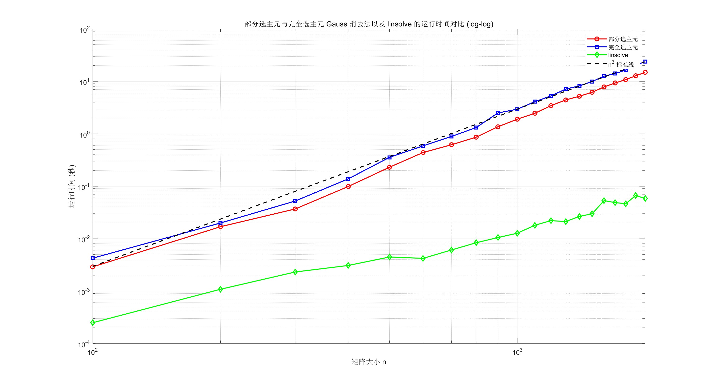
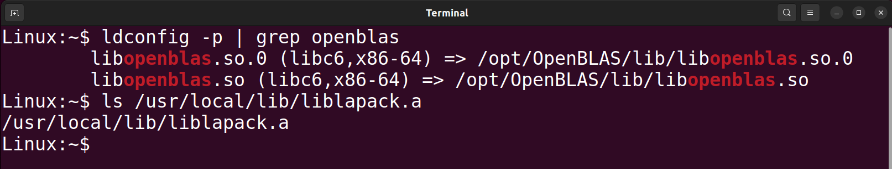
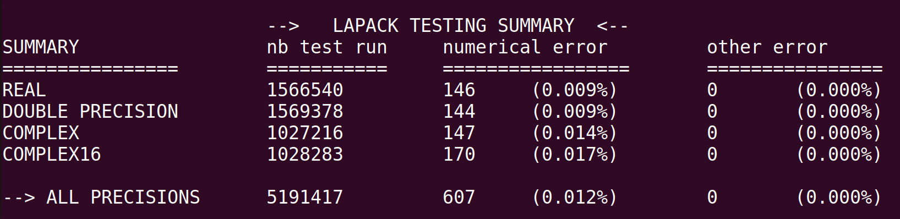
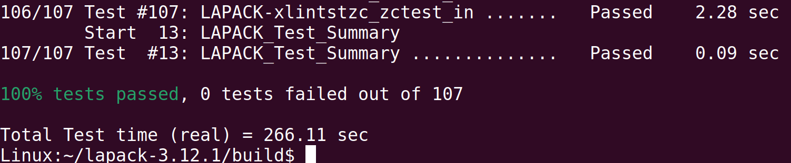

# 数值算法 Homework 02

Due: Sept. 24, 2024  
姓名: 雍崔扬  
学号: 21307140051

## Problem 1

In the lecture we have shown that many matrix operations,   
such as matrix-matrix multiplication and LU factorization,   
share the property that the number of additions/subtractions is equal to the number of multiplications.   
Does this property hold for complex matrices,   
assuming complex arithmetic has to be implemented using real arithmetic?   
Justify your answer.

**Solution:**    
在复数域 $\mathbb C=\{\alpha+\mathrm{i}\beta :\alpha,\beta \in \mathbb R\}$ 上, 我们可以定义两种最基本的运算:  

- 加法 $(\alpha_1+\mathrm{i}\beta_1)+(\alpha_2+\mathrm{i}\beta_2):=(\alpha_1+\alpha_2)+\mathrm{i}(\beta_1+\beta_2)$
- 乘法 $(\alpha_1+\mathrm{i}\beta_1)\times(\alpha_2+\mathrm{i}\beta_2) := (\alpha_1\alpha_2-\beta_1\beta_2) + \mathrm{i}(\alpha_1\beta_2+\alpha_2\beta_1)$ 

因此一次复数加/减法需要两次实数加/减法,   
一次复数乘法需要四次实数乘法和两次实数加/减法.

对于很多矩阵运算 (例如矩阵相乘和 $\text{LU}$ 分解) 来说,   
复数乘法的运算次数和复数加/减法的运算次数仍然是匹配的.  
如果用实数运算实现复数运算, 则一对复数乘法和复数加减法需要四次实数乘法和四次实数加/减法.  
因此依然是一次实数乘法匹配一次实数加/减法.


## Problem 2

A real symmetric and positive definite matrix $A$   
admits a special variant of the LU factorization $A=LL^{\mathrm{T}}$ (known as the Cholesky factorization),     
where $L$ is a lower triangular matrix (not necessarily with unit diagonal elements).   
Design two different algorithms to compute $L$ from $A$.

**Solution:**

- **Algorithm $1$:**  
  使用不选主元的 Gauss 消去法得到 $A=\tilde L U$ ($A$ 的正定性保证了 Gauss 消元过程中的主元都不为零)  
  定义 $\begin{cases}
  D:=\text{diag}(u_{11},\dots,u_{nn})\\
  D^{\frac12} := \text{diag}(\sqrt{u_{11}},\dots,\sqrt{u_{nn}})\\
  L:= \tilde L D^{\frac12}\end{cases}$  (我们有 $U= D\tilde L^{\mathrm{T}}$)      
  即得到 Cholesky 分解: $A= \tilde L D\tilde L^{\mathrm{T}} = (\tilde L D^{\frac12})(\tilde L D^{\frac12})^{\mathrm{T}} = LL^{\mathrm{T}}$ 

- **Algorithm $2$:**    
  关于 Cholesky 分解, 更简单实用的方法是逐元素比较 $A=LL^{\mathrm{T}}$ 来计算 $L$.  
  设 $L=\begin{bmatrix}
  l_{11} & & &\\
  l_{21} & l_{22} & & \\
  \vdots & \vdots & \ddots & \\
  l_{n1} & l_{n2} & \dots & l_{nn}\end{bmatrix} $   
  比较 $A=LL^{\mathrm{T}}$ 两边对应元素, 得到 $a_{ij} = \underset{p=1}{\overset{\min(i,j)}\sum}l_{ip} l_{jp}\ (1\leq i,j \leq n)$   

  - 首先由 $a_{11}=l_{11}^2$ 得到 $l_{11} = \sqrt{a_{11}}$   
    再由 $a_{i1} = l_{11}l_{i1}\ (1\leq i\leq n)$ 得到 $l_{i1} = \frac{1}{l_{11}}a_{i1}\ (1\leq i\leq n)$  
    这样便得到矩阵 $L$ 的第 $1$ 列元素.
  - 假设已经计算出 $L$ 的前 $k-1$ 列元素.  
    由 $a_{kk} = \underset{p=1}{\overset{k}\sum}l_{kp}^2$ 得到 $l_{kk} = (a_{kk}- \underset{p=1}{\overset{k-1}\sum}l_{kp}^2)^{\frac12}$   
    再由 $a_{ik} = \underset{p=1}{\overset{k}\sum} l_{ip}l_{kp}= \underset{p=1}{\overset{k-1}\sum}l_{ip}l_{kp} + l_{ik}l_{kk}\ \ (i=k+1,\dots, n)$   
    得到 $l_{ik} = \frac{1}{l_{kk}} (a_{ik}-\underset{p=1}{\overset{k-1}\sum}l_{ip}l_{kp})\ \ (i=k+1,\dots, n)$   
    这样便得到矩阵 $L$ 的第 $k$ 列元素.

  上述次序可以调整为按行计算.  
  由于 $A$ 的元素 $a_{ij}$ 被用来计算 $l_{ij}$ 后就不再使用, 故我们可将 $L$ 的元素存储在 $A$ 的对应位置上.  
  **(平方根法, 数值线性代数, 算法 $1.3.1$)**  
  $$
  \begin{align}
  &\text{for }k=1:n\\
  &\qquad A(k,k) = \sqrt{A(k,k)}\\
  &\qquad A(k+1:n,k) = A(k+1:n,k)/A(k,k)\\
  &\qquad \text{for }j=k+1:n\\
  &\qquad\qquad A(j:n,j) = A(j:n,j) - A(j:n,k)A(j,k)\\
  &\qquad \text{end}\\
  &\text{end}\\
  \end{align}
  $$


## Problem 3

Let $A\in \mathbb C^{n\times n}$ be strictly diagonally dominant, i.e., 
$$
|a_{ii}| > \sum_{j\neq i}|a_{ij}|\ \ (\forall\ 1\leq i\leq n).
$$
Show that after one step of Gauss elimination,   
the $(n-1)\times (n-1)$ trailing submatrix (Schur complement) is still strictly diagonally dominant. 

- **Insight:**   
  本题表明 Schur 补能够继承原矩阵的很多性质, 例如 Hermite 性、正定性和严格对角占优性等.  
  类似的习题还有 **Homework 02 Problem 09**.

**Solution:**  
记 $A=[a_1,\dots,a_n]\in \mathbb C^{n\times n}$, 其 $(i,j)$ 位置上的元素记为 $a_{ij}$    
根据 $A$ 的严格对角占优性可知 $a_{11}\neq 0$   

现考虑第一步 Gauss 消元:  
令 $l_1 = \frac{1}{a_{11}}a_1 - e_1 = \frac{1}{a_{11}}\begin{bmatrix}
0\\
a_{21}\\
\vdots\\
a_{n1}\end{bmatrix}$ 并定义 Gauss 变换矩阵 $L_1=I_n - l_1 e_1^{\mathrm{T}}$ (其中 $e_1$ 代表 $\mathbb C^n$ 的第 $1$ 个标准单位基向量)

将其作用到 $A$ 上, 则我们有:
$$
\begin{align}
L_1 A
&=
(I_n- l_1e_1^{\mathrm{T}}) A\\
&=
A- l_1 e_1^{\mathrm{T}}A\\
&=
A - 
\frac{1}{a_{11}}\begin{bmatrix}
0\\
a_{21}\\
\vdots\\
a_{n1}
\end{bmatrix}
[e_1^{\mathrm{T}} a_1,e_1^{\mathrm{T}}a_2,\dots,e_1^{\mathrm{T}}a_n]\\
&=
A-\frac1{a_{11}}
\begin{bmatrix}
0\\
a_{21}\\
\vdots\\
a_{n1}
\end{bmatrix}
[a_{11},a_{12},\dots,a_{1n}]\\

&=
A- \frac1{a_{11}}
\begin{bmatrix}
0 & 0 & \dotsm & 0\\
a_{21}a_{11} & a_{21}a_{12} & \dotsm & a_{21}a_{1n}\\
\vdots & \vdots &  & \vdots\\
a_{n1}a_{11} & a_{n1}a_{12} & \dotsm & a_{n1}a_{1n}
\end{bmatrix}
\end{align}
$$
若记 $A^{(1)}=L_1A= [b_{ij}]_{i,j=1}^n$ 并考虑其右下方的 $(n-1)\times (n-1)$ 子矩阵, 则我们有:
$$
\begin{align}
\begin{bmatrix}
b_{22} & b_{23} & \dotsm & b_{2n}\\
b_{32} & b_{33} & \dotsm & b_{3n}\\
\vdots & \vdots & &\vdots\\
b_{n2} & b_{n3} & \dotsm & b_{nn}
\end{bmatrix}
&=
\begin{bmatrix}
a_{22} & a_{23} & \dotsm & a_{2n}\\
a_{32} & a_{33} & \dotsm & a_{3n}\\
\vdots & \vdots & &\vdots\\
a_{n2} & a_{n3} & \dotsm & a_{nn}
\end{bmatrix}
-
\frac{1}{a_{11}}
\begin{bmatrix}
a_{21}a_{12} & a_{21}a_{13} & \dotsm & a_{21}a_{1n}\\
a_{31}a_{12} & a_{31}a_{13} & \dotsm & a_{31}a_{1n}\\
\vdots & \vdots & & \vdots\\
a_{n1}a_{12}& a_{n1}a_{13} & \dotsm & a_{n1}a_{1n}
\end{bmatrix}\\
&=
[a_{ij}-\frac{1}{a_{11}}a_{i1}a_{1j}]_{i,j=2}^n\\
\end{align}
$$
因此我们有 $b_{ij} = a_{ij} - \frac1{a_{11}}a_{i1}a_{1j}\ \ (i,j=2,\dots,n)$  
对于任意 $i=2,\dots,n$, 考虑对角元 $b_{ii}$ 与非对角元 $b_{ij}\ (j\neq i)$:  
$$
\begin{align}
|b_{ii}| - \sum_{\begin{subarray}{}j\neq i\\ 2\leq j\leq n\end{subarray}} |b_{ij}|
&=
\left|a_{ii} - \frac{1}{a_{11}}a_{i1}a_{1i}\right| - \sum_{\begin{subarray}{}j\neq i\\ 2\leq j\leq n\end{subarray}}\left|a_{ij} - \frac{1}{a_{11}}a_{i1}a_{1j}\right|\quad (\text{triangle inequality})\\
&\geq
|a_{ii}| - |a_{i1}|\frac{|a_{1i}|}{|a_{11}|} - \sum_{\begin{subarray}{}j\neq i\\ 2\leq j\leq n\end{subarray}}(|a_{ij}| + |a_{i1}|\frac{|a_{1j}|}{|a_{11}|})\\
&=
|a_{ii}| - \sum_{\begin{subarray}{}j\neq i\\ 2\leq j\leq n\end{subarray}}|a_{ij}|
 -
 |a_{i1}|\cdot \left\{\frac{1}{|a_{11}|} \sum_{\begin{subarray}{}j\neq i\\ 1\leq j\leq n\end{subarray}} |a_{i1}|\right\}\quad (\text{use strict diagonally dominantion})\\
 
&> |a_{ii}| - \sum_{\begin{subarray}{}j\neq i\\ 2\leq j\leq n\end{subarray}}|a_{ij}| - |a_{i1}|\cdot 1\\
&= |a_{ii}| - \sum_{\begin{subarray}{}j\neq i\\ 1\leq j\leq n\end{subarray}}|a_{ij}|\quad (\text{strict diagonally dominantion})\\
&> 0
\end{align}
$$
表明 $L_1A$ 的右下方的 $(n-1)\times (n-1)$ 子矩阵 $B$ 也是严格对角占优的.


## Problem 4

Implement Gaussian elimination with two pivoting strategies——partial pivoting and complete pivoting.   
Make sure the LU factorization is properly encoded by overwriting the original matrix.    
Measure the execution time and visualize the result by a log–log scale plot.     
Compare the performance of your program with a linear solver from a well-developed math library   
(e.g., `linsolve` from MATLAB/Octave, `DGESV` from LAPACK, `numpy.linalg.solve` from NumPy, etc.).

**Solution:**    
**(1) 全主元 Gauss 消去法 (数值线性代数, 算法 $1.2.1$)**  
$$
\begin{align}
&\text{function: } [P,Q,L,U]=\text{Gaussian\_Elimination\_Complete\_Pivoting}(A)\\
&\qquad n=\dim(A)\\
&\qquad P =Q=I_n\\
&\qquad\text{for }k=1:n-1\\
&\qquad\qquad (p,q) \in  \arg \underset{k\leq i,j\leq n}\max |A(i,j)|\quad (确定主元位置)\\
&\qquad\qquad A(k,1:n) \leftrightarrow A(p,1:n)\quad (交换第\ k,p\ 行)\\
&\qquad\qquad A(1:n,k) \leftrightarrow A(1:n,q)\quad (交换第\ k,q\ 列)\\
&\qquad\qquad P(k,1:n) \leftrightarrow P(p,1:n)\quad (记录置换矩阵\ P_k)\\
&\qquad\qquad Q(1:n,k) \leftrightarrow Q(1:n,q)\quad (记录置换矩阵\ Q_k)\\ 
&\qquad\qquad\text{if } A(k,k) \neq 0\\
&\qquad\qquad\qquad (进行\text{ Gauss } 消去)\\
&\qquad\qquad\qquad A(k+1:n,k) = A(k+1:n,k+1:n)/ A(k,k)\\
&\qquad\qquad\qquad A(k+1:n , k+1 : n) = A(k+1:n,k+1:n) - A(k+1:n,k) A(k,k+1:n)\\
&\qquad\qquad \text{else}\\
&\qquad\qquad\qquad \text{break}\quad (矩阵奇异)\\
&\qquad\qquad \text{end}\\
&\qquad L = I_n + A\odot (\text{strictly lower triangular matrix with all ones})\quad (\odot \text{ stands for Hadamand product})\\
&\qquad U = A\odot (\text{upper triangular matrix with all ones})\\
&\qquad \text{return }[P,Q,L,U]
\end{align}
$$

全主元 Gauss 消去法 Matlab 代码如下:

```matlab
function [P, Q, L, U] = Gaussian_Elimination_Complete_Pivoting(A)
    % 获取矩阵的维度
    [n, m] = size(A);
    if n ~= m
        error('矩阵A必须是方阵');
    end
    
    % 初始化置换矩阵 P 和 Q 为单位矩阵
    P = eye(n);
    Q = eye(n);
    
    % 高斯消去过程
    for k = 1:n-1
        % 在子矩阵 A(k:n, k:n) 中找到最大值的索引 (p, q)
        [~, idx] = max(abs(A(k:n, k:n)), [], 'all', 'linear');
        [p, q] = ind2sub([n-k+1, n-k+1], idx);
        p = p + k - 1; % 调整行索引
        q = q + k - 1; % 调整列索引
        
        % 交换第 k 行和第 p 行
        if p ~= k
            A([k, p], :) = A([p, k], :); 
            P([k, p], :) = P([p, k], :); % 记录行置换
        end
        
        % 交换第 k 列和第 q 列
        if q ~= k
            A(:, [k, q]) = A(:, [q, k]);
            Q(:, [k, q]) = Q(:, [q, k]); % 记录列置换
        end
        
        % 检查主元是否为零
        if A(k, k) == 0
            error('矩阵是奇异的');
        end
        
        % Gauss 消去过程：对 A(k+1:n, k) 进行归一化
        A(k+1:n, k) = A(k+1:n, k) / A(k, k);
        
        % 更新 A(k+1:n, k+1:n)
        A(k+1:n, k+1:n) = A(k+1:n, k+1:n) - A(k+1:n, k) * A(k, k+1:n);
    end
    
    % 计算 L 和 U 矩阵
    L = tril(A, -1) + eye(n); % L 是单位下三角矩阵
    U = triu(A); % U 是上三角矩阵
    
    % 返回置换矩阵 P、Q, 以及分解矩阵 L、U
end
```

**(2) 部分主元 Gauss 消去法 (数值线性代数, 算法 $1.2.2$)**    
$$
\begin{align}
&\text{function: }[P,L,U] = \text{Gaussian\_Elimination\_Partial\_Pivoting}(A)\\
&\qquad n = \dim(A)\\
&\qquad P = I_n\\
&\qquad\text{for }k=1:n-1\\
&\qquad\qquad p \in  \arg \underset{k\leq i\leq n}\max |A(i,k)|\quad (确定主元位置)\\
&\qquad\qquad A(k,1:n) \leftrightarrow A(p,1:n)\quad (交换第\ k,p\ 行)\\
&\qquad\qquad P(k,1:n) \leftrightarrow P(p,1:n)\quad (记录置换矩阵\ P_k)\\
&\qquad\qquad\text{if } A(k,k) \neq 0\\
&\qquad\qquad\qquad (进行\text{ Gauss } 消去)\\
&\qquad\qquad\qquad A(k+1:n,k) = A(k+1:n,k+1:n)/ A(k,k)\\
&\qquad\qquad\qquad A(k+1:n , k+1 : n) = A(k+1:n,k+1:n) - A(k+1:n,k) A(k,k+1:n)\\
&\qquad\qquad \text{else}\\
&\qquad\qquad\qquad \text{break}\quad (矩阵奇异)\\
&\qquad\qquad \text{end}\\
&\qquad L = I_n + A\odot (\text{strictly lower triangular matrix with all ones})\quad (\odot \text{ stands for Hadamand product})\\
&\qquad U = A\odot (\text{upper triangular matrix with all ones})\\
&\qquad \text{return }[P,L,U]
\end{align}
$$
部分主元 Gauss 消去法 Matlab 代码如下:

```matlab
function [P, L, U] = Gaussian_Elimination_Partial_Pivoting(A)
    % 获取矩阵的维度
    [n, m] = size(A);
    if n ~= m
        error('矩阵A必须是方阵');
    end
    
    % 初始化置换矩阵 P 为单位矩阵
    P = eye(n);
    
    % 高斯消去过程
    for k = 1:n-1
        % 在第 k 列的 A(k:n, k) 中找到最大值的行索引 p
        [~, p] = max(abs(A(k:n, k)));
        p = p + k - 1; % 调整为在整个矩阵中的行索引
        
        % 交换第 k 行和第 p 行
        if p ~= k
            A([k, p], :) = A([p, k], :); 
            P([k, p], :) = P([p, k], :); % 记录行置换
        end
        
        % 检查主元是否为零
        if A(k, k) == 0
            error('矩阵是奇异的');
        end
        
        % Gauss 消去过程：对 A(k+1:n, k) 进行归一化
        A(k+1:n, k) = A(k+1:n, k) / A(k, k);
        
        % 更新 A(k+1:n, k+1:n)
        A(k+1:n, k+1:n) = A(k+1:n, k+1:n) - A(k+1:n, k) * A(k, k+1:n);
    end
    
    % 计算 L 和 U 矩阵
    L = tril(A, -1) + eye(n); % L 是单位下三角矩阵
    U = triu(A); % U 是上三角矩阵
    
    % 返回置换矩阵 P, 以及分解矩阵 L、U
end
```

**(3) 函数调用及运行时间对比:**  
(包括 MATLAB 的 `linsolve` 函数)

```matlab
% 设置随机数种子
rng(51);

% 定义不同的矩阵大小 n_values
n_values = 100:100:2000;
num_tests = length(n_values);

% 初始化用于存储运行时间的数组
time_partial = zeros(num_tests, 1);
time_complete = zeros(num_tests, 1);
time_linsolve = zeros(num_tests, 1); % 用于存储 linsolve 的运行时间

% 对每个 n 进行测试
for i = 1:num_tests
    n = n_values(i);
    
    % 生成随机的 n x n 矩阵
    A = rand(n, n);
    b = rand(n, 1); % 生成一个随机的右端向量 b
    
    % 测试部分选主元的运行时间
    tic; % 开始计时
    [~] = Gaussian_Elimination_Partial_Pivoting(A);
    time_partial(i) = toc; % 记录时间
    fprintf('Matrix size: %d x %d\nPartial Pivoting: %.4f seconds\n', n, n, time_partial(i));
    
    % 测试完全选主元的运行时间
    tic; % 开始计时
    [~] = Gaussian_Elimination_Complete_Pivoting(A);
    time_complete(i) = toc; % 记录时间
    fprintf('Complete Pivoting: %.4f seconds\n', time_complete(i));
    
    % 测试 linsolve 的运行时间
    tic; % 开始计时
    x = linsolve(A, b);
    time_linsolve(i) = toc; % 记录时间
    fprintf('Linsolve: %.4f seconds\n', time_linsolve(i));
end

% 绘制 log-log 图表
figure;
loglog(n_values, time_partial, 'r-o', 'LineWidth', 1.5); % 部分选主元的时间
hold on;
loglog(n_values, time_complete, 'b-s', 'LineWidth', 1.5); % 完全选主元的时间
loglog(n_values, time_linsolve, 'g-d', 'LineWidth', 1.5); % linsolve 的时间

% 绘制 n^3 的标准线
n_ref = n_values; % 参考线使用相同的 n_values
time_ref = (n_ref.^3) / max(n_ref.^3) * max(time_complete); % 归一化参考线
loglog(n_ref, time_ref, 'k--', 'LineWidth', 1.5); % n^3 标准线

% 添加图例和标签
legend('部分选主元', '完全选主元', 'linsolve', 'n^3 标准线');
xlabel('矩阵大小 n');
ylabel('运行时间 (秒)');
title('部分选主元与完全选主元 Gauss 消去法以及 linsolve 的运行时间对比 (log-log)');

grid on;
hold off;
```

输出结果:

```tex
Matrix size: 100 x 100
Partial Pivoting: 0.0029 seconds
Complete Pivoting: 0.0042 seconds
Linsolve: 0.0002 seconds
Matrix size: 200 x 200
Partial Pivoting: 0.0169 seconds
Complete Pivoting: 0.0199 seconds
Linsolve: 0.0011 seconds
Matrix size: 300 x 300
Partial Pivoting: 0.0368 seconds
Complete Pivoting: 0.0522 seconds
Linsolve: 0.0023 seconds
Matrix size: 400 x 400
Partial Pivoting: 0.0988 seconds
Complete Pivoting: 0.1383 seconds
Linsolve: 0.0031 seconds
Matrix size: 500 x 500
Partial Pivoting: 0.2300 seconds
Complete Pivoting: 0.3552 seconds
Linsolve: 0.0045 seconds
Matrix size: 600 x 600
Partial Pivoting: 0.4392 seconds
Complete Pivoting: 0.5878 seconds
Linsolve: 0.0042 seconds
Matrix size: 700 x 700
Partial Pivoting: 0.6178 seconds
Complete Pivoting: 0.8892 seconds
Linsolve: 0.0061 seconds
Matrix size: 800 x 800
Partial Pivoting: 0.8615 seconds
Complete Pivoting: 1.3137 seconds
Linsolve: 0.0084 seconds
Matrix size: 900 x 900
Partial Pivoting: 1.3585 seconds
Complete Pivoting: 2.4910 seconds
Linsolve: 0.0105 seconds
Matrix size: 1000 x 1000
Partial Pivoting: 1.8964 seconds
Complete Pivoting: 2.9457 seconds
Linsolve: 0.0127 seconds
Matrix size: 1100 x 1100
Partial Pivoting: 2.4629 seconds
Complete Pivoting: 4.0937 seconds
Linsolve: 0.0180 seconds
Matrix size: 1200 x 1200
Partial Pivoting: 3.4432 seconds
Complete Pivoting: 5.2735 seconds
Linsolve: 0.0221 seconds
Matrix size: 1300 x 1300
Partial Pivoting: 4.4134 seconds
Complete Pivoting: 7.1114 seconds
Linsolve: 0.0212 seconds
Matrix size: 1400 x 1400
Partial Pivoting: 5.1982 seconds
Complete Pivoting: 8.1938 seconds
Linsolve: 0.0266 seconds
Matrix size: 1500 x 1500
Partial Pivoting: 6.1931 seconds
Complete Pivoting: 9.9005 seconds
Linsolve: 0.0298 seconds
Matrix size: 1600 x 1600
Partial Pivoting: 7.8199 seconds
Complete Pivoting: 12.5640 seconds
Linsolve: 0.0530 seconds
Matrix size: 1700 x 1700
Partial Pivoting: 9.3127 seconds
Complete Pivoting: 14.0499 seconds
Linsolve: 0.0488 seconds
Matrix size: 1800 x 1800
Partial Pivoting: 10.7923 seconds
Complete Pivoting: 16.4632 seconds
Linsolve: 0.0462 seconds
Matrix size: 1900 x 1900
Partial Pivoting: 12.7569 seconds
Complete Pivoting: 20.4236 seconds
Linsolve: 0.0667 seconds
Matrix size: 2000 x 2000
Partial Pivoting: 14.8539 seconds
Complete Pivoting: 23.6398 seconds
Linsolve: 0.0582 seconds
```

图像:




## Problem 5

You are given $A\in \mathbb R^{m\times n}$ and $x\in \mathbb R^n$, both already stored in floating-point format.   
Show that there exists a "small" matrix $E\in \mathbb R^{m\times n}$ such that  $\text{fl}(Ax) = (A + E)x$.     
Try to bound the entries of $E$ as tightly as you can.   
You may assume that there is no overflow or (gradual) underflow in the calculation.

- **Lemma (数值线性代数, 例 $2.3.1$):**  
  设 $x,y$ 是 $n$ 维浮点数向量, 试估计内积运算 $\text{fl}(x^{\mathrm T}y)$ 的绝对误差上界.  

  记 $S_k = \text{fl}(\sum_{i=1}^k x_i y_i)$, 我们有:
  $$
  \begin{cases}
  S_1 = x_1 y_1 (1+r_1)&(|r_1|\leq u)\\
  S_k = \text{fl}(S_{k-1} + \text{fl}(x_k y_k))\\
  \ \ \ \ = (S_{k-1} + x_k y_k (1+r_k))(1+\delta_k)&(|r_k|,|\delta_k|\leq u,\ k\geq 2)\end{cases}
  $$
  定义 $\delta_1=0$ 和 $S_0=0$, 则有:
  $$
  \begin{align}
  \text{fl}(x^{\mathrm T}y) 
  &= S_n\\
  &= (S_{n-1} + x_n y_n (1+r_n))(1+\delta_n)\\
  &= S_{n-1}(1+\delta_n) + x_ny_n (1+r_n)(1+\delta_n)\\
  &=\dotsm\\
  &= S_0 \prod_{i=1}^n (1+\delta_i) + \sum_{k=1}^n \left(x_ky_k (1+r_k)
  \prod_{i=k}^n(1+\delta_i)\right)\quad (\text{note that }S_0=0)\\
  &= 0 + \sum_{k=1}^n \left(x_ky_k (1+r_k)
  \prod_{i=k}^n(1+\delta_i)\right)\quad (\text{denote }\varepsilon_k := (1+r_k)\prod_{i=k}^n(1+\delta_i)-1\text{ for all }k\geq 1)\\
  &=
  \sum_{k=1}^n x_ky_k(1+\varepsilon_k),
  \end{align}
  $$
  其中 $1 + \varepsilon_k = (1+r_k)\prod_{i=k}^n (1+\delta_i)\ (k=1,\dots,n)$.  
  于是 $\text{fl}(x^{\mathrm T}y)$ 的绝对误差上界为:
  $$
  \begin{align}
  |\text{fl}(x^{\mathrm T}y) - x^{\mathrm T}y| 
  &\leq \sum_{k=1}^{n} |\varepsilon_k||x_ky_k|\\
  &\leq \gamma_{n}\sum_{k=1}^{n}|x_k y_k|\\
  &\leq \gamma_n |x|^\mathrm{T}|y|,
  \end{align}
  $$
  其中 $\gamma_n= nu/(1-nu)$ 代表 $n$ 层浮点运算的累积相对误差的上界,   
  $u$ 代表**单位舍入误差** (unit roundoff), 即浮点舍入到最近可表示数时的**最大相对误差**.

**Solution:**  
将 $A\in \mathbb{R}^{m\times n}$ 按行记作:
$$
A = 
\begin{bmatrix}
a_1^\mathrm{T}\\
a_2^\mathrm{T}\\
\vdots\\
a_m^\mathrm{T}
\end{bmatrix}
$$
将 **Lemma** 应用于 $A$ 的每一行, 可知存在 $\{\varepsilon_{i,j}\}$ 使得:  
$$
\begin{align}
\text{fl}(a_i^\mathrm{T}x) 
&= \sum_{j=1}^n a_{i,j} x_j (1+\varepsilon_{i,j})\\
&= \sum_{j=1}^n (a_{i,j} + e_{i,j}) x_j
\end{align}\quad (i=1,\dots,m)
$$
其中 $e_{i,j}:= a_{i,j} \varepsilon_{i,j}$.  
对所有 $i,j$ 把 $e_{i,j}$ 组织成矩阵 $E=[e_{i,j}]\in \mathbb{R}^{m\times n}$, 它满足恒等式 $\text{fl}(Ax) = (A+E)x$.  
根据 **Lemma** 提供的上界可知, 对于任意 $i=1,\dots,m$ 和 $j=1,\dots,n$ 都有:  
$$
|e_{i,j}| = |a_{i,j} \varepsilon_{i,j}| \leq \gamma_n |a_{ij}|
$$
其中 $\gamma_n= nu/(1-nu)$ 代表 $n$ 层浮点运算的累积相对误差的上界, $u$ 代表**单位舍入误差**.

> 若对于矩阵 $A = [a_{ij}]$, 我们定义 $|A|:= [|a_{ij}|]$ (即逐元素取绝对值),   
> 并规定 $|A|\leq |B|$ 当且仅当对于任意 $i,j$ 都有 $|a_{ij}|\leq |b_{ij}|$ 成立,    
> 则上界可以表示为 $|E|\leq \gamma_n |A|$.


## Problem 6 (optional)

Suppose that you have a BLAS library with an inefficient implementation of `STRSM`.   
Try to design an efficient `STRSM` subroutine by making use of `SGEMM`.   
You do not have to really implement it, just describe your algorithm.

- **Hint:** Search online if you do not know what `STRSM` and `SGEMM` stand for.   
  Useful information can be found at, e.g., http://www.netlib.org/blas/.

**Solution:**


## Problem 7 (optional)

Download OpenBLAS and LAPACK from the internet and compile them on your own computer.    
Run the test programs to ensure that you have successfully compiled the packages.  
You may write down the key steps and take some screenshots.  
Finally, write a program in Fortran/C/C++ to solve a linear system using `DGESV` from `LAPACK`.   
Make sure your program correctly links with LAPACK and OpenBLAS libraries you just compiled.

### (1) 下载 & 编译

我使用的是 VMware Workstation 的 Ubuntu 22.04 虚拟机.  

- ① 安装编译依赖:

  ```bash
  sudo apt update
  sudo apt install -y build-essential gfortran cmake wget unzip
  ```

  其中`build-essential` 提供 gcc/g++, `gfortran` 用于 LAPACK 编译, `cmake` 用于 LAPACK 构建.

- ② 下载 OpenBLAS 和 LAPACK:  
  访问 OpenBLAS 官方 [Source Forge](https://sourceforge.net/projects/openblas/files/) 页面下载最新版本 `OpenBLAS-0.3.30.tar.gz`;  
  访问 Netlib 官方 [LAPACK](http://www.netlib.org/lapack/) 页面下载最新版本 `lapack-3.12.1.tar.gz`.

- ③ 编译并安装 OpenBLAS:

  ```bash
  cd ~
  # 切换到当前用户的主目录, 保证源码包和编译文件都在用户目录下操作, 方便管理.
  
  tar -xvzf OpenBLAS-0.3.30.tar.gz
  # 解压 OpenBLAS 源码压缩包
  # -x : 解压
  # -v : 显示解压文件列表
  # -z : 解压 .tar.gz 压缩包
  # -f : 指定文件名
  
  cd OpenBLAS-0.3.30
  # 进入解压后的 OpenBLAS 源码目录, 准备编译
  
  make -j$(nproc)
  # 编译 OpenBLAS 源码
  # -j$(nproc) 会使用系统所有 CPU 核心并行编译, 加快速度
  # 生成动态库 (.so) 和静态库 (.a)
  
  sudo make install
  # 安装编译好的库和头文件到系统目录
  # 默认安装路径一般为 /opt/OpenBLAS 或 /usr/local
  # 安装包括：
  #   - 库文件 (libopenblas.so, libopenblas.a)
  #   - 头文件 (cblas.h, lapacke.h 等)
  #   - CMake 配置文件 (可用于其他项目 cmake 查找 OpenBLAS) 
  
  sudo sh -c "echo '/opt/OpenBLAS/lib' > /etc/ld.so.conf.d/openblas.conf"
  # 将 OpenBLAS 的动态库路径 (/opt/OpenBLAS/lib) 添加到系统动态库搜索路径
  # 创建一个配置文件 openblas.conf, ldconfig 会读取
  
  sudo ldconfig
  # 刷新系统动态库缓存, 让系统识别新的库路径和库文件
  # 之后程序运行时可以自动找到 OpenBLAS 动态库
  
  ldconfig -p | grep openblas
  # 检查系统是否正确识别 OpenBLAS 动态库
  ```

- ④ 编译并安装 LAPACK:

  ```bash
  cd ~
  # 切换到当前用户的主目录, 保证源码包和编译文件都在用户目录下操作, 方便管理.
  
  tar -xvzf lapack-3.12.1.tar.gz
  # 解压 OpenBLAS 源码压缩包
  # -x : 解压
  # -v : 显示解压文件列表
  # -z : 解压 .tar.gz 压缩包
  # -f : 指定文件名
  
  cd lapack-3.12.1
  # 进入解压后的 LAPACK 源码目录, 准备编译
  
  mkdir build && cd build
  # 创建一个单独的构建目录 build, 进入 build 目录进行编译, 保持源码目录干净
  
  cmake .. -DCMAKE_BUILD_TYPE=Release -DBUILD_TESTING=ON -DCMAKE_INSTALL_PREFIX=/usr/local
  # 使用 CMake 生成 Makefile 文件
  # .. : 指向上级源码目录
  # -DCMAKE_BUILD_TYPE=Release : 生成优化后的 Release 版本
  # -DBUILD_TESTING=ON : 编译 LAPACK 自带的测试
  # -DCMAKE_INSTALL_PREFIX=/usr/local : 安装路径为 /usr/local
  
  make -j$(nproc)
  # 编译 LAPACK 和 BLAS 库
  # -j$(nproc) : 使用系统所有 CPU 核心并行编译, 加快速度
  # 编译完成会生成静态库 liblapack.a 和 libblas.a
  
  sudo make install
  # 安装编译好的库文件和头文件到系统目录 /usr/local
  
  sudo ldconfig
  # 刷新系统动态库缓存
  
  ls /usr/local/lib/liblapack.a
  # 查看静态库是否存在
  ```

验证安装:




### (2) 运行测试

编译 OpenBLAS 的测试程序:

```bash
cd ~/OpenBLAS-0.3.30 
make -j$(nproc) tests 
make -j$(nproc) lapack-test 
make -j$(nproc) ctest
```



编译 LAPACK 的测试程序:

```bash
cd ~/lapack-3.12.1/build
ctest
```




### (3) 编写程序


## Problem 8 

Find the exact Cholesky factorization of the $n\times n$ Pascal matrix
$$
P_n = 
\begin{bmatrix}
1 & 1 & 1 & 1 & \dotsm\\
1 & 2 & 3 & 4 & \dotsm\\
1 & 3 & 6 & 10 & \dotsm\\
1 & 4 & 10 & 20 &\dotsm\\
\vdots & \vdots & \vdots & \vdots & \ddots
\end{bmatrix}\in \mathbb{R}^{n\times n}.
$$
Compare the exact solution with the computed one. What do you observe?  

- **Note:** the $(i,j)$-entry of the Pascal matrix is
  $$
  \binom{i+j-2}{i-1} = \frac{(i+j-2)!}{(i-1)!(j-1)!}.
  $$


## Problem 9

Let $A\in \mathbb{C}^{n\times n}$ be Hermitian, i.e., $A^{\mathrm{H}}=A$.  
Show that after one step of Gaussian elimination,   
the $(n-1)\times (n-1)$ trailing principal submatrix (known as the Schur complement) is still Hermitian.


## Problem 10

Implement a linear-time solver for diagonally dominant tridiagonal linear system.  

- **Hint:** Recall the conclusion of **Homework 01 Problem 03**.


**The End**
