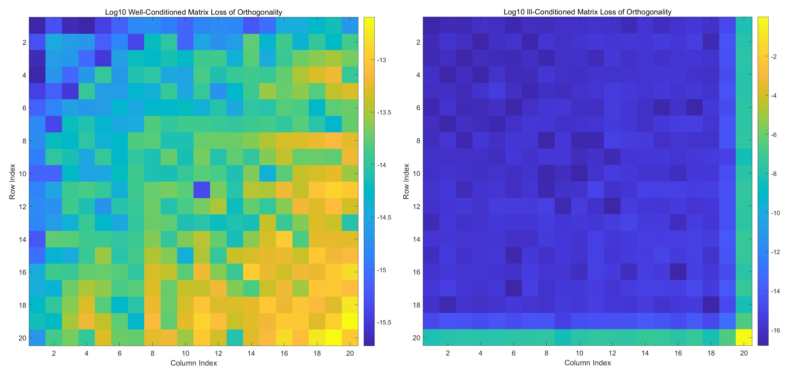
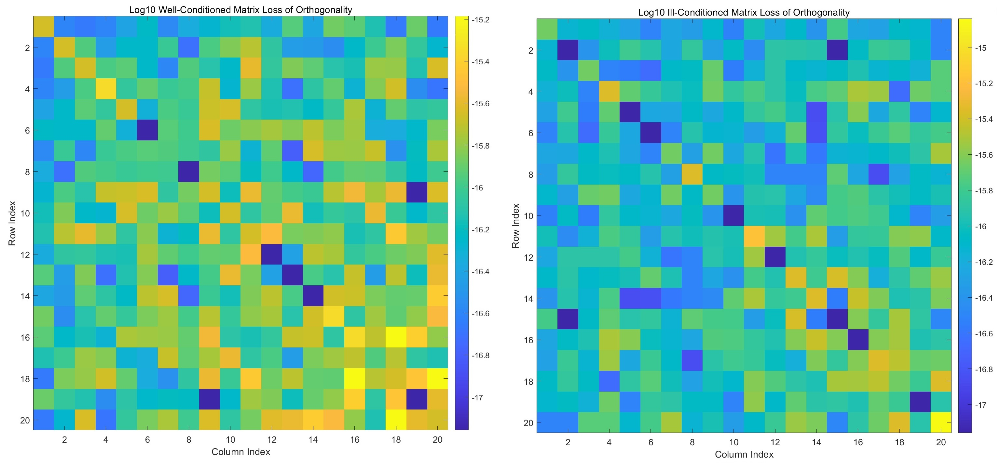
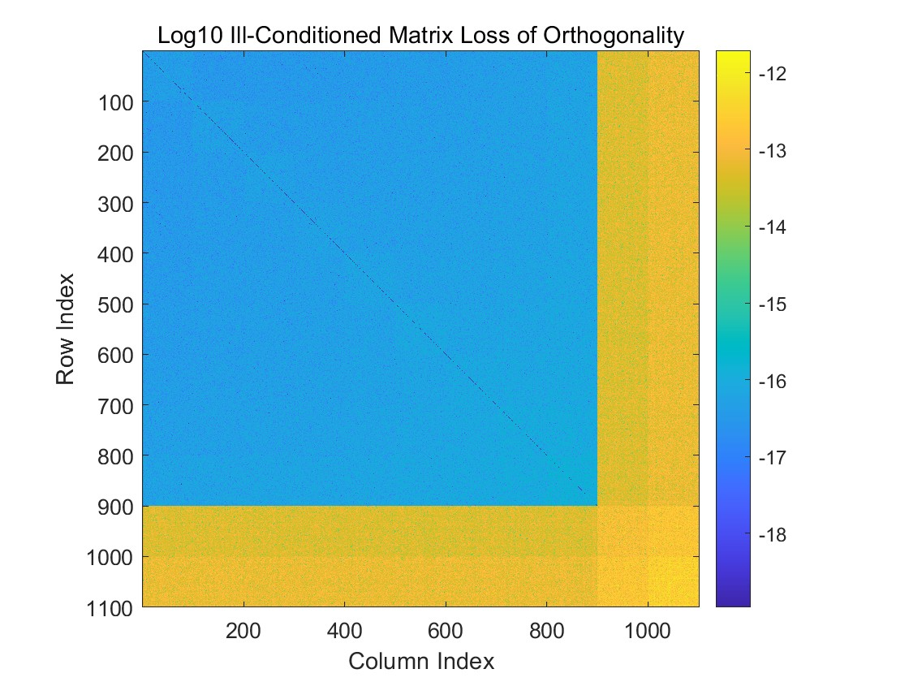

# FDU 数值算法 Homework 04

Due: Oct. 15, 2024  
姓名: 雍崔扬  
学号: 21307140051

## Problem 1

We have mentioned in the lecture that for complex vectors $x,y\in \mathbb C^n$，  
$\|x\|_2 = \|y\|_2>0$ does not guarantee that there exists a Householder reflection $H$ such that $y=Hx$    
Please propose a sufficient and necessary condition for the existence of a Householder reflection $H$ such that $y=Hx$   
Prove your claim.

**Solution:**     
当且仅当非零向量 $x,y\in \mathbb C^n$ 满足 $\begin{cases}
\|x\|_2 = \|y\|_2\\
x^Hy\in \mathbb R\end{cases}$ 时存在 Householder 矩阵 $H:= I_n-2ww^H$ 使得 $y=Hx$

- **充分性:**  
  若非零向量 $x,y\in \mathbb C^n$ 满足 $\begin{cases}
  \|x\|_2 = \|y\|_2\\
  x^Hy \in \mathbb R\end{cases}$   
  取 $w:= \frac{x-y}{\|x-y\|_2}$，则我们有:  
  $$
  \begin{align}
  Hx
  &=
  (I_n - 2ww^H) x\\
  &=
  \left\{I_n - 2\frac{(x-y)(x-y)^H}{(x-y)^H(x-y)}\right\} x\\
  &=
  x-2\frac{(x-y)^Hx}{x^Hy - y^Hx - x^Hy - y^Hy}(x-y)\quad (\text{note that }\begin{cases}
  \|y\|_2 = \|x\|_2 &\Rightarrow y^Hy = x^Hx\\
  x^Hy\in \mathbb R&\Rightarrow y^Hx = \overline{x^Hy} = x^Hy\end{cases})\\
  &=
  x-2\frac{x^Hx-x^Hy}{2(x^Hx-x^Hy)}(x-y)\\
  &=
  x-(x-y)\\
  &= 
  y
  \end{align}
  $$
  
- **必要性:**  
  若存在 Householder 矩阵 $H:= I_n-2ww^H$ 使得 $y=Hx$ (其中 $x,y\in \mathbb C^n$ 为给定的非零向量)  
  注意到 $H$ 是一个酉矩阵，则根据 $l_2$ 范数的酉不变性我们有:
  $$
  \|y\|_2 = \|Hx\|_2 = \|x\|_2
  $$
  此外，注意到 $H$ 是一个 Hermite 阵，  
  因此 $x^Hy = x^HHx$ 作为 Hermite 二次型一定是一个实数.

综上所述，命题得证.

****

**实际上我们可以推出更深刻的结论: (Matrix Analysis 定理 $2.1.13$)** 
给定非零向量 $x,y\in \mathbb C^n$ 满足 $\|x\|_2 = \|y\|_2$，则我们有如下命题成立:  
① 若 $x,y$ 线性相关，即存在 $\theta\in \mathbb R$ 使得 $y=e^{i\theta} x$ 成立，则酉矩阵 $U:= e^{i\theta} I_n$ 可使 $y=Ux$   
② 当 $x,y$ 线性无关时，设 $\phi \in \mathbb R$ 使得 $x^Hy = e^{i\phi}|x^Hy|$ (若 $x^Hy=0$，则取 $\phi = 0$)   
定义 $w:= \frac{e^{i\phi} x -y}{\|e^{i\phi}x-y\|_2}$ 和 Householder 矩阵 $H:= I_n - 2ww^H$  
则酉矩阵 $U:= e^{i\phi} H$ 可使 $y=Ux$  
显然 $U$ 是**本性 Hermite 的** (essentially Hermitian) (即存在某个 $\varphi\in \mathbb R$ 使得 $e^{i\varphi}U$ 是 Hermite 的，具体来说可取 $\varphi = -\phi$)   
且对于任意 $z\ \bot\ x$，我们都有 $Uz \ \bot\  y$ 

特殊地，若非零向量 $x,y\in \mathbb R^n$，则上述结论变为:  
① 若 $x=y$，则实正交阵 $U:=I_n$ 可使得 $y=Ux$  
② 当 $x\neq y$ 时，定义 $w:= \frac{x -y}{\|x-y\|_2}$ 和 Householder 矩阵 $H:= I_n - 2ww^T$，   
则实正交阵 $U:=H$ 可使 $y=Ux$ 

**我们只需证明非零向量 $x,y\in \mathbb C^n$ 情况下的命题 ②: (其余结论都是平凡的)**  
回忆起 Cauchy-Schwarz 不等式:  
$$
|x^Hy| \leq \|x\|_2 \|y\|_2\ (\forall\ x,y\in \mathbb C^n)  
$$
当且仅当 $x,y$ 线性相关时取等.  
当 $x,y$ 线性无关且 $\|x\|_2 = \|y\|_2$ 时，我们有:  
$$
|x^Hy|< \|x\|_2 \|y\|_2 = \|x\|_2^2 = x^Hx
$$
设 $\phi \in \mathbb R$ 使得 $x^Hy = e^{i\phi}|x^Hy|$ (若 $x^Hy=0$，则取 $\phi = 0$)    
我们定义:  
$$
w:= \frac{e^{i\phi} x -y}{\|e^{i\phi}x-y\|_2}\\
H:= I_n-2ww^H\\
U:= e^{i\phi} H
$$
则我们有:
$$
\begin{align}
Ux
&=
e^{i\phi} Hx\\
&=
e^{i\phi}(I_n-2ww^H)x\\
&=
e^{i\phi}\{I_n - 2\frac{(e^{i\phi} x-y)(e^{i\phi} x-y)^H}{(e^{i\phi} x-y)^H(e^{i\phi} x-y)}\} x\\
&=
e^{i\phi}
\{x- 2\frac{(e^{i\phi}x -y)^Hx}{x^Hx - e^{-i\phi}x^Hy - e^{i\phi}y^Hx + y^Hy}(e^{i\phi} x-y)\}
\quad (\text{note that }y^Hy=x^Hx \text{ and }x^Hy = e^{i\phi}|x^Hy|)\\
&=
e^{i\phi}
\{x-2\frac{e^{-i\phi}(x^Hx - e^{i\phi}y^Hx)}{2(x^Hx - |x^Hy|)}(e^{i\phi} x-y)\}\\
&=
e^{i\phi}x
-\frac{(x^Hx - |x^Hy|)}{(x^Hx - |x^Hy|)}(e^{i\phi} x-y)\\
&=
e^{i\phi}x - (e^{i\phi}x-y)\\
&=
y
\end{align}
$$
且对于任意 $z\ \bot\ x$，我们都有:  
$$
\begin{align}
(Uz)^Hy
&=
z^HU^HUx\\
&=
z^Hx\\
&=
0
\end{align}
\Rightarrow 
Uz\ \bot\ y
$$
命题得证.


## Problem 2

Describe how to avoid cancellation when constructing Householder reflections in the Householder triangularization algorithm for complex matrices.  
**(Matrix Computation $5.2.10$)**

**Solution:**    
Householder QR 算法中我们要实现的关键步骤是:  
给定一个向量 $x\in \mathbb R^n$，如何寻找一个 Householder 矩阵 $H:=I_n-2ww^H$ 使得 $Hx=\alpha e_1$，其中 $\alpha\in \mathbb C$ 满足 $|\alpha|=\|x\|_2$    

**Matrix Analysis 定理 $2.1.13$** (证明参见 Problem 1) 为我们提供了指引:  

- 首先，为保证该 Householder 矩阵存在，$x^H(\alpha e_1)=\bar x_1 \alpha$ 应当是一个实数，因此 $\alpha$ 与 $x_1$ 拥有相同的辐角.  
  设 $x_1 = e^{i\theta} |x_1|$ (其中 $\theta\in \mathbb R$)，则 $\alpha = e^{i\theta}\|x\|_2$   

- 其次，该 Householder 矩阵的构造如下:  
  $$
  \alpha := e^{i\theta}\|x\|_2\\
  w:= \frac{x-\alpha e_1}{\|x-\alpha e_1\|_2}\\
  H:= I_n - 2ww^H
  $$
  为避免在 $|x_1| \approx \|x\|_2$ 的情况下计算 $x-\alpha e_1$ 的第一个分量时会出现相消，我们可通过等价变形来进行规避:   
  $$
  \begin{align}
  x_1 - \alpha
  &= e^{i\theta} |x_1| - e^{i\theta}\|x\|_2\\
  &= e^{i\theta}(|x_1| - \|x\|_2)\\
  &= e^{i\theta}\frac{|x_1|^2 - \|x\|_2^2}{|x_1| + \|x\|_2}\\
  &= -e^{i\theta}\frac{|x_2|^2 + \dots + |x_n|^2}{|x_1| + \|x\|_2}
  \end{align}
  $$
  
- 再次，为简化存储，记 $\begin{cases}
  v = x-\alpha e_1\\
  w= \frac{v}{\|v\|_2}\\
  \beta = \frac{2}{v^Hv}\end{cases}$ 则我们有:
  $$
  H = I - 2ww^H = I - \frac{2}{v^Hv} vv^H = I - \beta vv^H
  $$
  因此我们没必要求出 $w$，只需求出 $v$ 和 $\beta$ 即可.  
  在实际运算中，我们可以将 $v$ 的第一个分量规格化为 $1$ (这样就无需储存了)  
  然后将 $v$ 的后 $n-1$ 个分量保存在 $x$ 的后 $n-1$ 个置为 $0$ 的分量上.

- 最后，$v^T v$ 的上溢和下溢也是计算中需要考虑的问题.  
  为避免溢出，我们可用 $\frac{x}{\|x\|_\infty}$ 代替 $x$ 来构造 $v$   
  因为理论上，正数乘是不影响向量单位化结果的，  
  即对于任意 $\gamma >0$，向量 $\gamma v$ 和 $v$ 的单位化结果是相同的.

基于上述讨论，我们得到如下算法:  
$$
\begin{align}
&\text{function: } [v,\beta] = \text{Complex\_Householder}(x)\\
&\qquad n = \text{length}(x)\\
&\qquad x = \frac{x}{\|x\|_\infty}\\
&\qquad v(2:n) = x(2:n)\\ 
&\qquad \sigma = \|x(2:n)\|_2^2\quad (\text{This is a real value})\\
&\qquad \text{if } \sigma = 0\\
&\qquad\qquad \beta = 0\\
&\qquad \text{else}\\
&\qquad\qquad \text{if }x_1 =0\\
&\qquad \qquad \qquad \gamma = 1\\
&\qquad \qquad \text{else}\\
&\qquad \qquad \qquad \gamma = \frac{x_1}{|x_1|}\quad (\text{Let } x_1=e^{i\theta}|x_1|,\text{ then we have }\gamma=\frac{x_1}{|x_1|} = e^{i\theta})\\
&\qquad \qquad \text{end}\\
&\qquad\qquad \alpha = \sqrt{|x(1)|^2 + \sigma}\quad (\text{This is a real value, which is the }l_2 \text{ norm of vector }x)\\
&\qquad\qquad v(1) = - \gamma\cdot \frac{\sigma}{|x(1)| + \alpha}\quad (\text{Avoiding cancellation when calculating }v(1))\\
&\qquad\qquad \beta = \frac{2 |v(1)|^2}{|v(1)|^2 + \sigma}\quad\ \ \  (\text{This is a real value})\\
&\qquad\qquad v = \frac{v}{v(1)}\quad (\text{Normalize }v(1)\text{ so that we don't have to store it})\\
&\qquad \text{end}
\end{align}
$$
其 Matlab 代码为:

```matlab
function [v, beta] = Complex_Householder(x)
    % This function computes the Householder vector 'v' and scalar 'beta' for
    % a given complex vector 'x'. This transformation is used to create zeros
    % below the first element of 'x' by reflecting 'x' along a specific direction.
    
    n = length(x);
    x = x / norm(x, inf); % Normalize x by its infinity norm to avoid numerical issues

    % Copy all elements of 'x' except the first into 'v'
    v = zeros(n, 1);
    v(2:n) = x(2:n); 
    
    % Compute sigma as the squared 2-norm of the elements of x starting from the second element
    sigma = norm(x(2:n), 2)^2;
    
    % Check if sigma is near zero, which would mean 'x' is already close to a scalar multiple of e_1
    if sigma < 1e-10
        beta = 0; % If sigma is close to zero, set beta to zero (no transformation needed)
    else
        % Determine gamma to account for the argument of complex number x(1)
        if abs(x(1)) < 1e-10
            gamma = 1; % If x(1) is close to zero, set gamma to 1
        else
            gamma = x(1) / abs(x(1)); % Otherwise, set gamma to x(1) divided by its magnitude
        end
        
        % Compute alpha as the Euclidean norm of x, including x(1) and sigma
        alpha = sqrt(abs(x(1))^2 + sigma);
        
        % Compute the first element of 'v' to avoid numerical cancellation
        v(1) = -gamma * sigma / (abs(x(1)) + alpha);
        
        % Calculate 'beta', the scaling factor of the Householder transformation
        beta = 2 * abs(v(1))^2 / (abs(v(1))^2 + sigma);
        
        % Normalize the vector 'v' by v(1) to ensure that the first element is 1,
        % allowing for simplified storage and computation of the transformation
        v = v / v(1);
    end
end
```

函数调用:

```matlab
% Define a complex vector x
x = [3 + 4i; 1 + 2i; -1 + 0i; 2 - 3i];

% Call the Complex_Householder function
[v, beta] = Complex_Householder(x);

% Display the results
disp('Vector x:');
disp(x);
disp('Vector v:');
disp(v);
disp('Beta:');
disp(beta);

% Verify the Householder transformation
% Form the Householder matrix
H = eye(length(x)) - beta * (v * v');
disp('Householder Matrix H:');
disp(H);

% Apply the Householder transformation to x
y = H * x;

% Display the transformed vector y
disp('Transformed vector y = H * x (should have 0s below the first element):');
disp(y);
```

输出结果:

```matlab
Vector x:
   3.0000 + 4.0000i
   1.0000 + 2.0000i
  -1.0000 + 0.0000i
   2.0000 - 3.0000i

Vector v:
   1.0000 + 0.0000i
  -1.3470 - 0.2449i
   0.3674 - 0.4898i
   0.7347 + 2.0817i

Beta:
    0.2462

Householder Matrix H:
   0.7538 + 0.0000i   0.3317 - 0.0603i  -0.0905 - 0.1206i  -0.1809 + 0.5126i
   0.3317 + 0.0603i   0.5385 + 0.0000i   0.0923 + 0.1846i   0.3692 - 0.6461i
  -0.0905 + 0.1206i   0.0923 - 0.1846i   0.9077 + 0.0000i   0.1846 + 0.2769i
  -0.1809 - 0.5126i   0.3692 + 0.6461i   0.1846 - 0.2769i  -0.2000 + 0.0000i

Transformed vector y = H * x (should have 0s below the first element):
   3.9799 + 5.3066i
  -0.0000 + 0.0000i
   0.0000 - 0.0000i
  -0.0000 + 0.0000i
```


## Problem 3

Write a program to compute the QR factorization of a complex matrix $A\in \mathbb C^{n\times n}$ with:

- ① Cholesky QR (i.e. through the Cholesky factorization of $A^HA$)
- ② Householder triangularization

Visualize the (componentwise) loss of orthogonality $|Q^HQ - I_n|$ using well-conditioned and ill-conditioned examples.  
(If you use MATLAB/Octave, you may find `imagesc()` helpful)

### (0) Preperation

构建良态复方阵的 Matlab 函数:

```matlab
function A = generate_well_conditioned_matrix(n)
    % Generates a well-conditioned random complex matrix of size n x n
    real_part = rand(n) + 1; % Ensure diagonal dominance
    imag_part = rand(n) * 1i;
    A = real_part + imag_part; % Combine to form a complex matrix
    A = (A + A') / 2; % Make it Hermitian (symmetric in real case)

    % Check the condition number
    cond_num = cond(A);
    disp(['Condition number of the well-conditioned matrix: ', num2str(cond_num)]);
end
```

构建病态复方阵的 Matlab 函数:

```matlab
function A = generate_ill_conditioned_matrix(n)
    % Generates an ill-conditioned random complex matrix of size n x n
    % Step 1: Generate specific eigenvalues
    lambda = randn(n); % Example eigenvalues
    lambda(1:2) = [1e-10, 1];

    % Step 2: Generate a random unitary matrix U
    [Q, ~] = qr(randn(n) + 1i * randn(n)); % QR decomposition to get a unitary matrix

    % Step 3: Construct the diagonal matrix of eigenvalues
    D = diag(lambda(1:n));

    % Step 4: Construct the ill-conditioned matrix A
    A = Q * D * Q'; % Ensure A is Hermitian

    % Check the condition number
    cond_num = cond(A);
    disp(['Condition number of the ill-conditioned matrix: ', num2str(cond_num)]);
end
```

使用 `imagesc()` 检查并可视化 $Q$ 正交性损失的函数:

```matlab
function visualize_orthogonality_loss(Q, titleStr)
    % Visualizes the componentwise loss of orthogonality |Q^H Q - I_n|
    loss = Q' * Q - eye(size(Q, 2)); % Compute the loss
    figure; % Create a new figure window
    imagesc(log10(abs(loss))); % Display the absolute value of the loss
    colorbar; % Add colorbar to indicate scale
    title(titleStr);
    xlabel('Column Index');
    ylabel('Row Index');
    axis square; % Make the axes square for better visualization
end
```


### (1) Cholesky QR      

关于 Hermite 阵 $A\in \mathbb C^{n\times n}$ 的 Cholesky 分解，一种简单实用的方法是逐元素比较 $A=LL^H$ 来计算 $L$.  
设 $L=\begin{bmatrix}
l_{11} & & &\\
l_{21} & l_{22} & & \\
\vdots & \vdots & \ddots & \\
l_{n1} & l_{n2} & \dots & l_{nn}\end{bmatrix}\in \mathbb C^{n\times n}$ (可以证明其主对角元都是非负实数)   
比较 $A=LL^H$ 两边对应元素，得到 $a_{ij} = \underset{p=1}{\overset{\min(i,j)}\sum}l_{ip} \bar l_{jp}\ (1\leq i,j \leq n)$   

- 首先由 $a_{11}=l_{11}^2$ 得到 $l_{11} = \sqrt{a_{11}}$   
  再由 $a_{i1} = l_{11}l_{i1}\ (1\leq i\leq n)$ 得到 $l_{i1} = \frac{1}{l_{11}} a_{i1}\ (1\leq i\leq n)$  
  这样便得到矩阵 $L$ 的第 $1$ 列元素.
- 假设已经计算出 $L$ 的前 $k-1$ 列元素.  
  由 $a_{kk} = \underset{p=1}{\overset{k}\sum}l_{kp}\bar l_{kp} = \underset{p=1}{\overset{k}\sum}|l_{kp}|^2$ 得到 $l_{kk} = (a_{kk}- \underset{p=1}{\overset{k-1}\sum}|l_{kp}|^2)^{\frac12}$   
  再由 $a_{ik} = \underset{p=1}{\overset{k}\sum} l_{ip}\bar l_{kp}= \underset{p=1}{\overset{k-1}\sum}l_{ip}\bar l_{kp} + l_{ik}l_{kk}\ \ (i=k+1,\dots, n)$   
  得到 $l_{ik} = \frac{1}{l_{kk}} (a_{ik}-\underset{p=1}{\overset{k-1}\sum}l_{ip}\bar l_{kp})\ \ (i=k+1,\dots, n)$   
  这样便得到矩阵 $L$ 的第 $k$ 列元素.

上述次序可以调整为按行计算.  
由于 $A$ 的元素 $a_{ij}$ 被用来计算 $l_{ij}$ 后就不再使用，故我们可将 $L$ 的元素存储在 $A$ 的对应位置上.  
综上所述我们得到如下算法:
$$
\begin{align}
&\text{Given Hermitian matrix }A\in \mathbb C^{n\times n}\\
\hline
&\text{function: }[L] = \text{Complex\_Cholesky}(A)\\
&\qquad\text{for }k=1:n\\
&\qquad\qquad A(k,k) = \sqrt{A(k,k)}\\
&\qquad\qquad A(k+1:n,k) = A(k+1:n,k)/A(k,k)\\
&\qquad\qquad \text{for }j=k+1:n\\
&\qquad\qquad\qquad A(j:n,j) = A(j:n,j) - A(j:n,k)\overline{A(j,k)}\\
&\qquad\qquad \text{end}\\
&\qquad\text{end}\\
&\qquad L = A\odot (\text{lower triangular matrix with all ones})\quad (\odot \text{ stands for Hadamand product})\\
&\text{end}
\end{align}
$$
其 Matlab 代码如下:

```matlab
function L = Complex_Cholesky(A)
    n = size(A, 1);  % Get the size of matrix A
    for k = 1:n
        % Compute the diagonal element (ensure it's real and positive)
        A(k,k) = sqrt(A(k,k));  % For Hermitian, take the square root of the diagonal
        
        % Update the subdiagonal using the conjugate of the diagonal element
        A(k+1:n,k) = A(k+1:n,k) / A(k,k);
        
        for j = k+1:n
            % Update the remaining elements, using conjugate for complex entries
            A(j:n,j) = A(j:n,j) - A(j:n,k) * conj(A(j,k));
        end
    end
    
    % Return the lower triangular matrix with the Hadamard product
    L = A .* tril(ones(n));  % Hadamard product with a lower triangular matrix
end
```

使用上述算法得到 $A^HA$ 的 Cholesky 分解 $A^HA=LL^H$ 后，  
可取 $R=L^H$，并求解上三角方程组 $QR=A$ 得到 $Q$:
$$
QR = 
[q_1,q_2,\dots,q_n]\begin{bmatrix}
r_{11} & r_{12} & \dots & r_{1n}\\ 
& r_{22} & \dots & r_{2n}\\
& & \ddots & \vdots\\
&&& r_{nn}\end{bmatrix} 
= 
[a_1,a_2,\dots,a_n] = A
$$
显然我们有 $a_k = \sum_{i=1}^k r_{ik}q_i\ (k=1,\dots,n)$ 成立，从而有:
$$
q_1 = \frac{1}{r_{11}} a_1\\
q_k = \frac{1}{r_{kk}} (a_k - \sum_{i=1}^{k-1} r_{ik}q_i)\ (k=2,\dots,n)
$$
在实际计算中，我们将 $Q$ 存放在 $A$ 所用的存储单元中，并调整运算次序.   
于是我们得到如下算法:
$$
\begin{align}
&\text{Given matrix }A\in \mathbb C^{m\times n}\text{ and upper triangular matrix }R\in \mathbb C^{n\times n}\text{ whose diagonal entries are non-negative}\\
\hline
&\text{function: }Q=\text{Forward\_Sweep}(A,R)\\
&\qquad \text{for }k=1:n-1\\
&\qquad \qquad A(1:m,k) = \frac{1}{R(1,1)} A(1:m,k)\\
&\qquad \qquad A(1:m,k+1:n) = A(1:m,k+1:n) - A(1:m,k) R(k,k+1:n)\\
&\qquad \text{end}\\
&\qquad A(1:m,n) = \frac{1}{R(n,n)} A(1:m,n)\\
&\qquad Q=A\\
&\text{end}
\end{align}
$$
其 Matlab 代码如下:

```matlab
function Q = Forward_Sweep(A, R)
    [m, n] = size(A);
    
    for i = 1:n-1
        % Normalize the current column
        A(1:m, i) = A(1:m, i) / R(i, i);  
        
        % Update the remaining columns
        A(1:m, i+1:n) = A(1:m, i+1:n) - A(1:m, i) * R(i, i+1:n);  
    end
    
    % Normalize the last column
    A(1:m, n) = A(1:m, n) / R(n, n);
    
    % Set Q
    Q = A;  
end
```

合并上述算法我们便得到 Cholesky QR 算法:
$$
\begin{align}
&\text{Given matrix }A\in \mathbb C^{m\times n}\\
\hline
&\text{function: }[Q,R]=\text{Complex\_Cholesky\_QR}(A)\\
&\qquad L = \text{Complex\_Cholesky}(A)\\
&\qquad R = L^H\\
&\qquad Q = \text{Forward\_Sweep}(A,R)\\
&\text{end}
\end{align}
$$
其 Matlab 代码为:

```matlab
function [Q, R] = Complex_Cholesky_QR(A)
    
    % Step 1: Compute the Cholesky decomposition of the product A' * A.
    % This yields a lower triangular matrix L.
    L = Complex_Cholesky(A' * A);

    % Step 2: Obtain R as the conjugate transpose of L.
    % R is an upper triangular matrix needed for the QR factorization.
    R = L';

    % Step 3: Use the Forward Sweep method to compute the orthogonal 
    % matrix Q based on the original matrix A and the matrix R.
    Q = Forward_Sweep(A, R);
end
```

函数调用:

```matlab
% Set the random seed for reproducibility
rng(51);
n = 20;

% Generate a well-conditioned complex matrix
A_well = generate_well_conditioned_matrix(n); % 5x5 matrix
% Perform Cholesky QR
[Q_well, R_well] = Complex_Cholesky_QR(A_well);

% Check if Q * R is close to A
disp('Frobenius norm of A - Q * R for well-conditioned example:');
disp(norm(Q_well * R_well - A_well, 'fro'))

% Visualize loss of orthogonality for well-conditioned matrix
visualize_orthogonality_loss(Q_well, 'Well-Conditioned Matrix Loss of Orthogonality');

% Generate an ill-conditioned complex matrix
A_ill = generate_ill_conditioned_matrix(n); % 5x5 matrix
% Perform Cholesky QR
[Q_ill, R_ill] = Complex_Cholesky_QR(A_ill);

% Check if Q * R is close to A
disp('Frobenius norm of A - Q * R for ill-conditioned example:');
disp(norm(Q_ill * R_ill - A_ill, 'fro'))

% Visualize loss of orthogonality for ill-conditioned matrix
visualize_orthogonality_loss(Q_ill, 'Ill-Conditioned Matrix Loss of Orthogonality');
```

输出结果:

```bash
Condition number of the well-conditioned matrix: 279.2377
Frobenius norm of A - Q * R for well-conditioned example:
   4.3332e-15

Condition number of the ill-conditioned matrix: 20693749868.9697
Frobenius norm of A - Q * R for ill-conditioned example:
   7.1736e-16
```



### (2) Householder QR

复数域上的 Householder 变换的计算算法已在 Problem 2 中给出.  
复数域上的 Householder $\text{QR}$ 算法即为:
$$
\begin{align}
&\text{function: }[Q,R] = \text{Complex\_Householder\_QR}(A)\\
&\qquad [m,n] = \text{size}(A)\\
&\qquad Q = I_m\\
&\qquad\text{for }k=1:\min(m-1,n)\\
&\qquad\qquad [v,\beta] = \text{Complex\_Householder}(A(k:m,k))\\
&\qquad\qquad A(k:m,k:n) = (I_{m-k+1} - \beta v v^H) A(k:m,k:n) = A(k:m,k:n) - (\beta v)(v^HA(k:m,k:n))\\
&\qquad\qquad Q(1:m,k:m) = Q(1:m,k:m)(I_{m-k+1} - \beta v v^H) = Q(1:m,k:m) - (Q(1:m,k:m) v)(\beta v)^H \\
&\qquad\text{end}\\
&\text{end}
\end{align}
$$
其 Matlab 代码为:

```matlab
function [Q, R] = Complex_Householder_QR(A)
    [m, n] = size(A);
    Q = eye(m); % Initialize Q as the identity matrix
    R = A; % Initialize R as A

    for k = 1:min(m-1, n)
        [v, beta] = Complex_Householder(R(k:m, k)); % Apply Complex Householder

        % Update R
        R(k:m, k:n) = R(k:m, k:n) - (beta * v) * (v' * R(k:m, k:n));

        % Update Q
        Q(1:m, k:m) = Q(1:m, k:m) - (Q(1:m, k:m) * v) * (beta * v');
    end
end
```

函数调用:

```matlab
% Set the random seed for reproducibility
rng(51);
n = 20;

% Generate a well-conditioned complex matrix
A_well = generate_well_conditioned_matrix(n); % 5x5 matrix
% Perform Householder QR
[Q_well, R_well] = Complex_Householder_QR(A_well);

% Check if Q * R is close to A
disp('Frobenius norm of A - Q * R for well-conditioned example:');
disp(norm(Q_well * R_well - A_well, 'fro'))

% Visualize loss of orthogonality for well-conditioned matrix
visualize_orthogonality_loss(Q_well, 'Log10 Well-Conditioned Matrix Loss of Orthogonality');

% Generate an ill-conditioned complex matrix
A_ill = generate_ill_conditioned_matrix(n); % 5x5 matrix
% Perform Householder QR
[Q_ill, R_ill] = Complex_Householder_QR(A_ill);

% Check if Q * R is close to A
disp('Frobenius norm of A - Q * R for ill-conditioned example:');
disp(norm(Q_ill * R_ill - A_ill, 'fro'))

% Visualize loss of orthogonality for ill-conditioned matrix
visualize_orthogonality_loss(Q_ill, 'Log10 Ill-Conditioned Matrix Loss of Orthogonality');
```

输出结果:

```bash
Condition number of the well-conditioned matrix: 279.2377
Frobenius norm of A - Q * R for well-conditioned example:
   8.7266e-15

Condition number of the ill-conditioned matrix: 20693749868.9697
Frobenius norm of A - Q * R for ill-conditioned example:
   2.3290e-15
```



对比 Cholesky QR 的结果我们发现 Householder QR 无论是数值稳定性还是正交性损失都是更优的.


## Problem 4

Design an efficient algorithm to compute the QR factorization of $A$:
$$
A=
\begin{bmatrix}
\alpha_1 & \gamma_2 & \gamma_3 & \dotsm & \gamma_{n-1} & \gamma_n\\
\beta_2 & \alpha_2\\
\beta_3 & & \alpha_3\\
\vdots & & & \ddots\\
\beta_{n-1} & & & & \alpha_{n-1}\\
\beta_n & & & & & \alpha_n
\end{bmatrix}\in \mathbb R^{n\times n}
$$

**Solution:**  
**(计算 Givens 变换, 数值线性代数, 算法 $3.2.2$)**   
$$
\begin{align}
&\text{function: }[c,s] = \text{Givens}(a,b)\\
&\qquad \text{if }b=0\\
&\qquad\qquad c=1;\ s=0\\
&\qquad \text{else}\\
&\qquad\qquad \text{if } |b| > |a|\\
&\qquad\qquad\qquad t = \frac{a}{b};\ \ s= \frac{1}{\sqrt{1+ t^2}};\ \ c=st\\
&\qquad\qquad \text{else}\\
&\qquad\qquad\qquad t = \frac{b}{a};\ \ c= \frac{1}{\sqrt{1+ t^2}};\ \ s=ct\\
&\qquad\qquad \text{end}\\
&\qquad \text{end}
\end{align}
$$

- ① 首先使用 Givens 变换将稀疏矩阵 $A$ 化为上 Hessenberg 矩阵 $H$，得到 $A=Q_1H$  
  为让讨论更加直观，考虑 $n=5$ 的情形: 
  $$
  A = 
  \begin{bmatrix}
  * & * & * & * & *\\
  * & * & & & \\
  * &  & * & & \\
  \underline* & & & * &\\
  \underline* & & & & *
  \end{bmatrix}\\
  G_{4,5} A = 
  \begin{bmatrix}
  * & * & * & * & *\\
  * & * & & & \\
  \underline* &  & * & & \\
  \underline* & & & * & *\\
   & & & * & *
  \end{bmatrix}\\
  
  G_{3,4}(G_{4,5} A) = 
  \begin{bmatrix}
  * & * & * & * & *\\
  \underline* & * & & & \\
  \underline* &  & * & * & *\\
   & & *& * & *\\
   & & & * & *
  \end{bmatrix}\\
  
  G_{2,3}(G_{3,4}G_{4,5} A) = 
  \begin{bmatrix}
  * & * & * & * & *\\
  * & * & * & * & *\\
   & * & * & * & *\\
   & & *& * & *\\
   & & & * & *
  \end{bmatrix}\\
  $$
  
  对于一般的 $n$ 阶稀疏矩阵 $A$，  
  我们可以确定 $n-2$ 个 Givens 变换 $G_{n-1,n},\dots,G_{2,3}$ 使得 $G_{2,3}\dotsm G_{n-1,n} A = H$    
  令正交阵 $Q_1 = (G_{2,3}\dotsm G_{n-1,n})^{-1} = (G_{2,3}\dotsm G_{n-1,n})^T = G_{n-1,n}^T\dotsm G_{2,3}^T$  
  即得到 $A=Q_1 H$     
  具体算法如下:
  $$
  \begin{align}
  &\text{Given Sparse matrix }A\in \mathbb R^{n\times n}\\
  \hline
  & Q = I_n\\
  &\text{for }k=n-1:-1:2\\
  &\qquad [c,s] = \text{Givens}(H(k,1),H(k+1,1))\\
  &\qquad H(k:k+1,1:n) = 
  \begin{bmatrix}
  c & s\\
  -s & c\end{bmatrix}
  H(k:k+1,1:n)\quad 
  (\begin{cases}
  H(k,1:n) = c H(k,1:n) + sH(k+1,1:n)\\
  H(k+1,1:n) = -s H(k, 1:n) + c H(k+1,1:n)
  \end{cases})\\
  
  &\qquad Q(1:n,k:k+1) = 
  Q(1:n,k:k+1) \begin{bmatrix}
  c & s\\
  -s & c\end{bmatrix}^T
  \quad 
  (\begin{cases}
  Q(1:n,k) = c Q(1:n,k) + sQ(1:n,k+1)\\
  Q(1:n,k+1) = -s Q(1:n,k) + c Q(1:n,k+1)
  \end{cases})\\
  
  &\text{end}\\
  &H=A
  \end{align}
  $$
  **Matlab 代码如下:**  
  
  ```matlab
  function [Q, H] = Upper_Hessenberg(A)
      % 将稀疏矩阵 A 上 Hessenberg 化
      [n, ~] = size(A);
      Q = eye(n);  % 初始化为单位矩阵
      for k = n-1:-1:2
          [c, s] = Givens(A(k, 1), A(k+1, 1));
          
          % 对 A 进行 Givens 变换
          G = [c s; -s c];  % 2x2 Givens 旋转矩阵
          A(k:k+1, :) = G * A(k:k+1, :);
          
          % 累积 Givens 变换到 Q
          Q(:, k:k+1) = Q(:, k:k+1) * G';
      end
      H = A;
  end
  ```
  
- ② 然后使用 Givens 变换对上 Hessenberg 矩阵 $H$ 进行上三角化，得到 $H = Q_2 R$      
  为让讨论更加直观，考虑 $n=5$ 的情形: 
  $$
  H = \left[
  \begin{array}{ccccc}
  \underline * & * & *  & * & *\\
  \underline * & * & *  & * & *\\
  0 & * & *  & * & * \\
  0 & 0 & *  & * & * \\
  0 & 0 & 0  & * & * 
  \end{array} \right]\\
  
  G_{1,2} H = 
  \left[
  \begin{array}{ccccc}
  \underline * & * & *  & * & *\\
  \underline 0 & * & *  & * & *\\
  0 & * & *  & * & * \\
  0 & 0 & *  & * & * \\
  0 & 0 & 0  & * & * 
  \end{array} \right]
  =
  \left[
  \begin{array}{ccccc}
  * & * & *  & * & *\\
  0 & \underline * & *  & * & *\\
  0 & \underline * & *  & * & * \\
  0 & 0 & *  & * & * \\
  0 & 0 & 0  & * & * 
  \end{array} \right]\\
  
  G_{2,3}(G_{1,2}H) =
  \left[
  \begin{array}{ccccc}
  * & * & *  & * & *\\
  0 & \underline * & *  & * & *\\
  0 & \underline 0 & *  & * & * \\
  0 & 0 & *  & * & * \\
  0 & 0 & 0  & * & * 
  \end{array} \right]
  =
  \left[
  \begin{array}{ccccc}
  * & * & *  & * & *\\
  0 & * & *  & * & *\\
  0 & 0 & \underline *  & * & * \\
  0 & 0 & \underline *  & * & * \\
  0 & 0 & 0  & * & * 
  \end{array} \right]\\
  
  G_{3,4}(G_{2,3}G_{1,2}H) = 
  \left[
  \begin{array}{ccccc}
  * & * & *  & * & *\\
  0 & * & *  & * & *\\
  0 & 0 & \underline *  & * & * \\
  0 & 0 & \underline 0  & * & * \\
  0 & 0 & 0  & * & * 
  \end{array} \right]
  =
  \left[
  \begin{array}{ccccc}
  * & * & *  & * & *\\
  0 & * & *  & * & *\\
  0 & 0 & *  & * & * \\
  0 & 0 & 0  & \underline * & * \\
  0 & 0 & 0  & \underline * & *
  \end{array} \right]\\
  
  G_{4,5}(G_{3,4}G_{2,3}G_{1,2}H) =
  \left[
  \begin{array}{ccccc}
  * & * & *  & * & *\\
  0 & * & *  & * & *\\
  0 & 0 & *  & * & * \\
  0 & 0 & 0  & \underline * & * \\
  0 & 0 & 0  & \underline 0 & * \\
  \end{array} \right]
  \overset{\Delta} = R
  $$
  对于一般的 $n$ 阶上 Hessenberg 矩阵 $H$，  
  我们可以确定 $n-1$ 个 Givens 变换 $G_{1,2},\dots,G_{n-1,n}$ 使得 $G_{n-1,n}\dotsm G_{1,2} H = R$    
  令正交阵 $Q_2 = (G_{n-1,n}\dotsm G_{1,2})^{-1} = (G_{n-1,n}\dotsm G_{1,2})^T = G_{1,2}^T\dotsm G_{n-1,n}^T$  
  即得到 $H$ 的 $\text{QR}$ 分解 $H=Q_2 R$     
  具体算法如下:
  $$
  \begin{align}
  &\text{Given Hessenberg matrix }H\in \mathbb R^{n\times n}\\
  \hline
  & Q = I_n\\
  &\text{for }k=1:n-1\\
  &\qquad [c,s] = \text{Givens}(H(k,k),H(k+1,k))\\
  &\qquad H(k:k+1,k:n) = 
  \begin{bmatrix}
  c & s\\
  -s & c\end{bmatrix}
  H(k:k+1,k:n)\quad 
  (\begin{cases}
  H(k,k:n) = c H(k,k:n) + sH(k+1,k:n)\\
  H(k+1:k:n) = -s H(k, k:n) + c H(k+1,k:n)
  \end{cases})\\
  
  &\qquad Q(1:n,k:k+1) = 
  Q(1:n,k:k+1) \begin{bmatrix}
  c & s\\
  -s & c\end{bmatrix}^T
  \quad 
  (\begin{cases}
  Q(1:n,k) = c Q(1:n,k) + sQ(1:n,k+1)\\
  Q(1:n,k+1) = -s Q(1:n,k) + c Q(1:n,k+1)
  \end{cases})\\
  
  &\text{end}\\
  &R=H
  \end{align}
  $$
  Matlab 代码如下:  
  
  ```matlab
  function [Q, R] = Hessenberg_QR(Q, H)
      % 对上 Hessenberg 矩阵 H 进行 QR 分解
      [n, ~] = size(H);
      for k = 1:n-1
          % 计算 Givens 旋转参数
          [c, s] = Givens(H(k, k), H(k+1, k));
          
          % 对 H 进行 Givens 变换
          G = [c s; -s c];  % 2x2 Givens 旋转矩阵
          H(k:k+1, k:n) = G * H(k:k+1, k:n);
          H(k+1, k) = 0;
          
          % 累积 Givens 变换到 Q
          Q(:, k:k+1) = Q(:, k:k+1) * G';
      end
      R = H;  % 上三角矩阵
  end
  ```
  
- ③ 最终我们得到 $A=Q_1 H =Q_1 (Q_2R) = Q_1 Q_2 R$    
  因此 $A$ 的 $\text{QR}$ 分解为 $A=QR$，其中 $Q=Q_1Q_2$，它不必显式计算，可由 $Q_1$ 直接代入步骤 ② 中累积 Givens 变换得到.  

  Matlab 代码如下:

  ```matlab
  function [Q, R] = Efficient_QR(A)
      
      % 1. 使用 Givens 变换将稀疏矩阵 A 上 Hessenberg 化为 H, 得到 A = Q1 * H
      [Q, H] = Upper_Hessenberg(A);
  
      % 2. 使用 Givens 变换对上 Hessenberg 矩阵 H 进行 QR 分解, 得到 H = Q2 * R, 累积 Q = Q1 * Q2
      [Q, R] = Hessenberg_QR(Q, H);
      
  end
  ```

  **主函数调用:**

  ```matlab
  rng(51)
  n = 1000;
  % 初始化一个全零矩阵
  A = zeros(n, n);
  
  % 填充第一列，除去第一个元素
  A(2:n, 1) = rand(n-1, 1);  % 第一列的随机数
  
  % 填充第一行，除去第一个元素
  A(1, 2:n) = rand(1, n-1);  % 第一行的随机数
  
  % 填充主对角线
  A(1:n+1:end) = rand(n, 1);  % 对角线上的随机数
  
  % 使用快速 QR 分解
  [Q, R] = Efficient_QR(A);
  
  % 计算 A 与 QR 的差异
  QR_approx = Q * R;
  F_norm_diff = norm(A - QR_approx, 'fro');
  
  % 输出误差
  disp(['Frobenius norm of the difference ||A - QR||_F = ', num2str(F_norm_diff)]);
  ```

  **输出结果:**

  ```matlab
  Frobenius norm of the difference ||A - QR||_F = 4.31e-14
  ```


****

**最开始的错误解法:**  
$$
A=
\begin{bmatrix}
\alpha_1 & \gamma_2 & \gamma_3 & \dotsm & \gamma_{n-1} & \gamma_n\\
\beta_2 & \alpha_2\\
\beta_3 & & \alpha_3\\
\vdots & & & \ddots\\
\beta_{n-1} & & & & \alpha_{n-1}\\
\beta_n & & & & & \alpha_n
\end{bmatrix}\in \mathbb R^{n\times n}
$$

- ① 首先我们使用初等置换矩阵将 $A$ 的列进行重排，得到一个上 Hessenberg 矩阵 $\tilde A$.  
  $$
  P = \begin{bmatrix}
  e_{n}^T\\
  e_1^T\\
  e_2^T\\
  \vdots\\
  e_{n-2}^T\\
  e_{n-1}^T
  \end{bmatrix} 
  =
  \begin{bmatrix}
  0 & 0 & 0 & \dotsm & 0 & 1\\
  1 & 0 &  &  &  & \\
   & 1 & 0 \\
   & & \ddots & \ddots \\
   &&& 1 & 0 \\
  &  & & & 1 & 0
  \end{bmatrix}\\
  
  \tilde A = AP =
  \begin{bmatrix}
   \gamma_2 & \gamma_3 & \dotsm & \gamma_{n-1} & \gamma_n & \alpha_1\\
   \alpha_2 & 0& & & & \beta_2\\
   & \alpha_3& 0&  & & \beta_3\\
    & & \ddots& \ddots& &  \vdots\\
   & & & \alpha_{n-1}&0 & \beta_{n-1}\\
   & & & & \alpha_n & \beta_n
  \end{bmatrix}
  $$
  其中置换矩阵 $P$ 无需显式生成，$\tilde A = PA$ 也无需显式计算  
  只需将 $A$ 的第 $1$ 列放到最后一列，其余各列往前移动一列即可得到 $\tilde A$.

- ② 然后使用 Givens 变换对上 Hessenberg 矩阵 $\tilde A$ 进行上三角化，得到 $\tilde A = Q R$      
  得到 $A = \tilde A P^T = Q R P^T$   
  但这不能化为 $\text{QR}$ 分解的形式，因为 $RP^T$ 并不是一个上三角阵.


## Problem 5

Let $Q\in \mathbb R^{n\times n}$ be an orthogonal matrix (下列的结论对一般的酉矩阵 $U\in \mathbb C^{n\times n}$ 并不一定成立)  
Show that $Q$ can be factorized as the product of finitely many Householder reflections,   
and if, in addition, $\det(Q)=1$, $Q$ can be factorized as the product of finitely many Givens rotations.

**Solution:**     
**(1) 证明正交阵 $Q\in \mathbb R^{n\times n}$ 可以分解为有限个 Householder 变换矩阵的乘积:**  

- ① 首先我们可使用 Householder $\text{QR}$ 分解，  
  找到 $n-1$ 个 Householder 矩阵 $H_1,\dots,H_{n-1}\in \mathbb R^{n\times n}$ 使得 $R=H_{n-1}\dotsm H_1 Q$    
  其中 $R$ 为上三角阵.

- ② 其次我们可以证明 $R$ 是对角阵，且对角元只可能为 $\pm 1$   
  根据 $R^TR = (H_{n-1}\dotsm H_1 Q)^T(H_{n-1}\dotsm H_1 Q) = Q^T H_1^T\dotsm H_{n-1}^T H_{n-1} \dotsm H_1 Q = I_n$ 可知 $R$ 为正交阵.  
  记 $R=[r_{ij}]_{i,j=1}^n = [r_1,\dots,r_n]$，我们希望证明 $r_i = \pm e_i\ (i=1,\dots,n)$ (其中 $e_i$ 代表 $\mathbb R^n$ 的第 $i$ 个标准单位基向量)

  **(数学归纳法)**   
  首先显然有 $r_1 = \pm e_1$ 成立  
  假设对于 $k\in \mathbb Z_+$ 有 $r_i = \pm e_i\ (i=1,\dots,k)$  
  则根据 $r_i\ \bot\ r_{k+1}\ (i=1,\dots,k)$ 可知 $r_{i,k+1}=0\ (i=1,\dots,k)$  
  再根据 $R$ 为上三角阵可知 $r_{i,k+1}=0\ (i=k+2,\dots,n)$  
  最后根据 $\|r_{k+1}\|_2 = 1$ 可知 $r_{k+1,k+1} = \pm 1$，即 $r_{k+1}=\pm e_{k+1}$   
  根据归纳原理得证 $R$ 是对角阵，且对角元只可能为 $\pm 1$

- ③ 最后我们证明 $R$ 可分解为有限个 Householder 矩阵.  
  任意给定的 $i=1,\dots,n$  
  若 $r_{i,i}=-1$，则我们可取 $w := -e_i$，定义 Householder 变换 $\tilde H_i:= I_n - 2ww^T = I_n - 2e_ie_i^T$   
  记 $E_{i,i}=e_ie_i^T$ 为 $(i,i)$ 位置为 $1$，其余位置为 $0$ 的 $n$ 阶方阵  
  于是我们有:  
  $$
  \tilde H_{i}R = (I_n-2e_ie_i^T)R = R-2r_{i,i} E_{i,i} = R+2E_{i,i}
  $$
  显然 $R+2E_{i,i}$ 在 $(i,i)$ 位置的元素为 $1$  
  换言之，Householder 变换 $\tilde H_i$ 将 $R$ 变为 $R+2E_{i,i}$，即将其 $(i,i)$ 位置的元素 $-1$ 变为了 $1$.  

  由于 $R$ 仅有有限个对角元为 $-1$ (记其个数为 $m$，指标为 $i_1,\dots,i_m$)，  
  故我们可找到有限个 Householder 变换 $\tilde H_{i_1},\dots,\tilde H_{i_m}$ 使得 $\tilde H_{i_m}\dotsm \tilde H_{i_1} R = I_n$ 

综上所述，我们有:
$$
R=H_{n-1}\dotsm H_1 Q\\
\tilde H_{i_m}\dotsm \tilde H_{i_1} R = I_n\\
\Rightarrow\\
\begin{align}
Q
&=
(H_{n-1}\dotsm H_1)^T R\\
&=
H_1 \dotsm H_{n-1} (\tilde H_{i_m}\dotsm \tilde H_{i_1})^T I_n\\
&=
H_1 \dotsm H_{n-1} \tilde H_{i_1}\dotsm \tilde H_{i_m} \\
\end{align}
$$
其中 $m$ 是 $R$ 的对角元中 $-1$ 的个数.  
这样就将正交阵 $Q$ 表示为有限个 Householder 变换的乘积.

****

**(2) 证明满足 $\det(Q)=1$ 的正交阵 $Q\in \mathbb R^{n\times n}$ 可以分解为有限个 Givens 变换矩阵的乘积:** 

- ① 首先我们可使用 Givens $\text{QR}$ 分解，  
  找到 $(n-1) + \dots + 1 = \frac{n(n-1)}{2}$ 个 Givens 变换 $G_1,\dots,G_{\frac12n(n-1)}\in \mathbb R^{n\times n}$ 使得 $R=G_{\frac12n(n-1)}\dotsm G_1 Q$    
  其中 $R$ 为上三角阵.  
  由于 Givens 变换的行列式为 $1$，故我们有 $\det(R)=\det(Q)=1$ 

- ② 其次我们可以证明 $R$ 是对角阵，且对角元只可能为 $\pm 1$  
  证明过程同 (1) ②

- ③ 最后根据 $\det(R)=1$ 可知 $R$ 仅有偶数个对角元为 $-1$  
  任意给定的 $i,j\in \{1,\dots,n\}$ 满足 $i\neq j$ (不妨设 $i<j$)  
  若 $r_{i,i} = r_{j,j} = -1$，则我们可取 $\theta = \pi$  
  定义 Givens 变换:
  $$
  \begin{align}
  \tilde G_{i,j}
  &=
  I_n + [\cos(\theta)-1](e_ie_i^T+e_je_j^T) + \sin(\theta) e_ie_j^T -\sin(\theta)e_je_i^T\quad (\text{note that }\theta = \pi)\\
  &=
  I_n - 2(e_ie_i^T+e_je_j^T)
  \end{align}
  $$
  记 $E_{i,i}=e_ie_i^T$ 为 $(i,i)$ 位置为 $1$，其余位置为 $0$ 的 $n$ 阶方阵  
  则我们有:  
  $$
  \begin{align}
  \tilde G_{i,j} R 
  &= [I_n - 2(e_ie_i^T+e_je_j^T)] R \\
  &= R - 2r_{i,i} E_{i,i} - 2r_{j,j}E_{j,j}\\
  &= R + 2E_{i,i} + 2E_{j,j}
  \end{align}
  $$
  
  显然 $R + 2E_{i,i} + 2E_{j,j}$ 在 $(i,i)$ 和 $(j,j)$ 位置的元素为 $1$  
  换言之，Givens 变换 $\tilde G_{i,j}$ 将 $R$ 变为 $R+2E_{i,i}+2E_{j,j}$，即将其 $(i,i)$ 和 $(j,j)$ 位置的元素 $-1$ 变为了 $1$. 
  
  由于 $R$ 仅有有限偶数个对角元为 $-1$ (记其个数为 $2m$，指标为 $i_1,\dots,i_m,j_1,\dots,j_m$)，  
  故我们可找到有限个 Givens 变换 $\tilde G_{i_1,j_1},\dots,\tilde G_{i_m,j_m}$ 使得 $\tilde G_{i_m,j_m}\dotsm \tilde G_{i_1,j_1} R = I_n$ 

综上所述，我们有:
$$
R=G_{\frac12n(n-1)}\dotsm G_1 Q\\
\tilde G_{i_m,j_m}\dotsm \tilde G_{i_1,j_1} R = I_n\\
\Rightarrow\\
\begin{align}
Q
&=
(G_{\frac12n(n-1)}\dotsm G_1)^T R\\
&=
G_1 \dotsm G_{\frac12 n(n-1)} (\tilde G_{i_m,j_m}\dotsm \tilde G_{i_1,j_1})^T I_n\\
&=
G_1 \dotsm G_{\frac12 n(n-1)} \tilde G_{i_1,j_1}\dotsm \tilde G_{i_m,j_m} \\
\end{align}
$$
其中 $2m$ 是 $R$ 的对角元中 $-1$ 的个数.  
这样就将正交阵 $Q$ 表示为有限个 Givens 变换的乘积.


## Problem 6 (optional)

本题可参考文章 **A Storage-Efficient WY Representation for Products of Householder Transformations** 的算法 $2$  
而 Problem 7 可参考上述文章的 Compact WY 表示.  
([Block Householder Triangularization](https://pages.mtu.edu/~struther/Courses/OLD/Other/Sp2012/5627/ClassSamples/QR/Househol.pdf))  
Design a block algorithm (either left-looking or right-looking) for Householder triangularization.  
For simplicity, you may assume that the number of columns of the matrix is a multiple of the block size.

- **Background:**  
  给定矩阵 $V\in \mathbb C^{n\times r}$  
  定义推广形式的 Householder 变换 $H:= I_n - 2VV^\dagger$       
  根据 Moore-Penrose 逆的性质容易验证 $H$ 是 **Hermite 酉矩阵**.

  特殊地，若 $V$ 列满秩，则 Moore-Penrose 逆 $V^\dagger = (V^HV)^{-1}V^H$  
  此时 $H = I_n - 2 V(V^HV)^{-1}V^H$ 

- **Lemma:**  
  考虑列满秩矩阵 $X=\begin{bmatrix}
  X_1\\
  X_2\end{bmatrix}\in \mathbb C^{m\times r}$ (其中 $X_1$ 为 $r$ 阶复方阵)  
  若定义:
  $$
  Y:= I_r + (X_2X_1^{-1})^H(X_2X_1^{-1})\\
  \text{Denote } Y=Q\Lambda Q^H\text{ as the  spectral decomposition, define }Y^{\frac12} = Q\Lambda^{\frac12} Q^H\\
  R:= Y^{\frac12} A_1\\ 
  V := \begin{bmatrix}
  X_1 + R\\
  X_2
  \end{bmatrix}\\
  H := I_n - 2 V(V^HV)^{-1}V^H
  $$
  则我们有:  
  $$
  HA= \begin{bmatrix}
  -R\\
  0_{(m-r)\times r}
  \end{bmatrix}
  $$

**Solution:**   
基于 **Lemma** 的分块 Householder 变换的 Matlab 代码如下:

```matlab
function [V, beta] = Block_Complex_Householder(X)
    % Block_Complex_Householder computes a block Householder transformation
    % for a given complex matrix X. The transformation aims to introduce zeros 
    % below the diagonal of the upper-left r x r block of the matrix.

    [m, r] = size(X);  % Get the dimensions of the matrix X
    % Compute the matrix Z which is used to define the Householder transformation
    Z = X(r+1:m, 1:r) / X(1:r, 1:r);  
    
    % Construct the symmetric matrix Y, which is used to calculate the Householder vector
    Y = eye(r, r) + Z' * Z; 
    
    % Compute the eigenvectors (Q) and eigenvalues (Lambda) of Y
    [Q, Lambda] = eig(Y);
    
    % Calculate the square root of the matrix Y
    Y_sqrt = Q * sqrt(Lambda) * Q';  
    
    % Compute the upper triangular matrix R that will be used for the transformation
    R = Y_sqrt * X(1:r, 1:r);  
    
    % Initialize V as a copy of X
    V = X;  
    
    % Update the upper-left r x r block of V by subtracting R, introducing zeros below the diagonal
    V(1:r, 1:r) = V(1:r, 1:r) - R;  
    
    % Compute the scaling factor beta for the Householder transformation
    beta = 2 * eye(r, r) / (V' * V); 
end
```

复数域上的 Householder 变换的计算算法已在 Problem 2 中给出.   
最终的分块 Householder QR 算法的 Matlab 代码如下:

```matlab
function [Q, R] = Block_Complex_Householder_QR(A, r)
    % Block_Complex_Householder_QR computes the QR decomposition of a 
    % complex matrix A using a block-wise approach with complex Householder 
    % reflections.
    %
    % Inputs:
    %   A - An m x n complex matrix to be decomposed.
    %   r - The block size for the Householder transformation.
    %
    % Outputs:
    %   Q - An m x m unitary matrix such that Q*R = A.
    %   R - An m x n upper triangular matrix.

    [m, n] = size(A);  % Get the dimensions of matrix A
    Q = eye(m);       % Initialize Q as the identity matrix of size m
    R = A;            % Start with R equal to A
    m_block = floor(m / r);  % Calculate the number of complete blocks in m
    n_block = floor(n / r);  % Calculate the number of complete blocks in n

    % Loop over the blocks
    for k = 1:min(m_block-1, n_block) 
        index1 = (k-1) * r + 1;  % Starting index for the current block in R
        index2 = k * r;          % Ending index for the current block in R

        % Apply the Block Complex Householder transformation to the current block
        [V, beta] = Block_Complex_Householder(R(index1 : m, index1 : index2));

        % Update the R matrix using the Householder transformation
        R(index1:m, index1:n) = R(index1:m, index1:n) - V * (beta * (V' * R(index1:m, index1:n)));

        % Update the Q matrix to reflect the transformations applied to R
        Q(1:m, index1:m) = Q(1:m, index1:m) - ((Q(1:m, index1:m) * V) * beta) * V';
    end

    % Process the leftover elements that do not fit into a complete block
    leftover_index = min(m_block-1, n_block) * r + 1;
    for k = leftover_index : min(m-1, n)
        % Apply Complex Householder transformation for the remaining elements
        [v, beta] = Complex_Householder(R(k:m, k));

        % Update R for the last elements
        R(k:m, k:n) = R(k:m, k:n) - (beta * v) * (v' * R(k:m, k:n));

        % Update Q for the last elements
        Q(1:m, k:m) = Q(1:m, k:m) - (Q(1:m, k:m) * v) * (beta * v');
    end
end
```

复述 Problem 3 中使用 `imagesc()` 检查并可视化 $Q$ 正交性损失的函数:

```matlab
function visualize_orthogonality_loss(Q, titleStr)
    % Visualizes the componentwise loss of orthogonality |Q^H Q - I_n|
    loss = Q' * Q - eye(size(Q, 2)); % Compute the loss
    figure; % Create a new figure window
    imagesc(log10(abs(loss))); % Display the absolute value of the loss
    colorbar; % Add colorbar to indicate scale
    title(titleStr);
    xlabel('Column Index');
    ylabel('Row Index');
    axis square; % Make the axes square for better visualization
end
```

函数调用:

```matlab
rng(51);
m = 1100;
n = 1000;
r = 100; % Block zize
A = randn(m, n) + 1i * randn(m, n);

% Apply Block Householder QR algorithm
[Q, R] = Block_Complex_Householder_QR(A, r);

% Check if Q * R is close to A
disp('Frobenius norm of A - Q * R:');
disp(norm(Q * R - A, 'fro'))

% Visualize loss of orthogonality for ill-conditioned matrix
visualize_orthogonality_loss(Q, 'Log1Ill-Conditioned Matrix Loss of Orthogonality');
```

输出结果:

```bash
Frobenius norm of A - Q * R:
   6.6750e-09
```



****

**一开始错误的做法:**    
考虑列满秩矩阵 $X=\begin{bmatrix}
X_1\\
X_2\end{bmatrix}\in \mathbb R^{m\times r}$ (其中 $X_1$ 为 $r$ 阶实方阵)  
若定义:
$$
L:= \text{Cholesky}(X^TX)\\
(\text{so that }LL^T=X^TX = X_1^TX_1 + X_2^TX_2\text{ and }L\text{ is a lower triangle matrix})\\
V := \begin{bmatrix}
X_1 + L^T\\
X_2
\end{bmatrix}\\
H := I_n - 2 V(V^TV)^{-1}V^T
$$
则我们有:  
$$
HA= \begin{bmatrix}
-L^T\\
0_{(m-r)\times r}
\end{bmatrix}
$$
但上述命题并不成立.

*****

**Matrix Computation Section $5.2.3$** 似乎有相关内容.  
但邵老师的提示是使用 Problem 7 的结论，得到多个 Householder 变换后复合.


## Problem 7 (optional)

Let $w_1,\dots,w_k\in \mathbb C^n$ be unit vectors.  
Try to find a matrix $T\in \mathbb C^{k\times k}$ such that:  
$$
(I_n - 2w_1w_1^H)\dotsm (I_n-2w_kw_k^H) = I_n - [w_1,\dots,w_k]T[w_1,\dots,w_k]^H
$$

**Solution:**    
$$
\begin{align}
&(I_n - 2w_1w_1^H)\dotsm (I_n-2w_kw_k^H)\\
&=
I_n 
- \sum_{i=1}^k 2w_iw_i^H 
-\sum_{m=2}^k
\sum_{1\leq i_1 <\dots < i_m \leq k} (2w_{i_1}w_{i_1}^H)\dotsm (2w_{i_m}w_{i_m}^H)\\
&=
I_n - \sum_{i=1}^k 2w_iw_i^H 
-\sum_{m=2}^k 2^m \sum_{1\leq i_1 <\dots <i_m\leq k}[(w_{i_1}^Hw_{i_2})\dotsm (w_{i_{m-1}}^Hw_{i_m})] (w_{i_1}w_{i_m}^H)\\
&=
I_n - \sum_{i=1}^k 2w_iw_i^H - 
\sum_{1\leq i<j\leq k} 
2^2\left\{
w_i^H w_j + \sum_{p=1}^{j-i-1} 2^p \sum_{i<i_2 < \dots < i_{p+1} < j} (w_i^Hw_{i_2})(w_{i_2}^Hw_{i_3})\dotsm (w_{i_{p}}^H w_{i_{p+1}})(w_{i_{p+1}}^H w_{j})
\right\} (w_iw_j^H)
\end{align}
$$
因此 $T=[t_{ij}]\in \mathbb C^{k\times k}$ 是一个上三角阵，其元素满足:
$$
t_{ij}:=
\begin{cases}
0 & \text{if }i>j\\
2 & \text{if }i=j\\
4w_i^Hw_j & \text{if }j=i+1\\
4w_i^H w_j + 4 \underset{p=1}{\overset{j-i-1}{\sum}} 2^p \underset{i<i_2 < \dots < i_{p+1}< j}{\sum}
(w_i^Hw_{i_2})(w_{i_2}^Hw_{i_3})\dotsm (w_{i_{p}}^H w_{i_{p+1}})(w_{i_{p+1}}^H w_{j})
& \text{if }j\geq i+2
\end{cases}
$$

****

**(Matrix Computation 算法 $5.1.2$)**  
设有 $r\leq n$ 个 Householder 变换 $H_1,\dots,H_r$，其中:  
$$
H_j = I_n - \beta_j v^{(j)}(v^{(j)})^H\\
v^{(j)} = [\underset{j-1}{\underbrace{0,\dots,0}}, 1, v_{j+1}^{(j)},\dots, v_n^{(j)}]^T
$$
我们可以计算得到 $W,Y\in \mathbb C^{n\times r}$ 满足 $H_1\dotsm H_r = I_n + WY^H$:  
$$
\begin{align}
&Y = v^{(1)}\\
&W = -\beta_1 v^{(1)}\\
&\text{for }j= 2:r\\
&\qquad z = -\beta_j (I_n + WY^H) v^{(j)} = -\beta_j [v^{(j)} + W (Y^H v^{(j)})]\\
&\qquad W = [W, z]\\
&\qquad Y = [Y, v^{(j)}]\\
&\text{end}
\end{align}
$$


## Problem 8 (optional)

**(Matrix Computation, Golub & Van Loan, 3rd Edition Section $12.5.1$)**  
Design an efficient algorithm to compute the QR factorization of $QR+uv^T$,   
where $Q\in \mathbb R^{m\times m}$ is an orthogonal matrix, $R\in \mathbb R^{m\times n}$ is an upper triangular matrix and $u\in \mathbb R^m,v\in \mathbb R^n$ are column vectors.

- $uv^T$ 的精简 $\text{QR}$ 分解为 $uv^T = \frac{u}{\|u\|_2}\cdot (\|u\|_2 v^T)$，尽管这没什么用.
- 此算法在 Matlab 有内置函数: [(qrupdate: QR 分解的秩 1 更新)](https://ww2.mathworks.cn/help/matlab/ref/qrupdate.html)

**Solution:**  
假设我们已有 $A\in \mathbb R^{m\times n}$ 的 $\text{QR}$ 分解 $A=QR$   
现要求 $A+uv^T$ 的 $\text{QR}$ 分解 $A+uv^T = \tilde Q \tilde R$ (其中 $u\in \mathbb R^m,v\in \mathbb R^n$ 为给定向量)

记 $w = Q^Tu\in \mathbb R^{m\times m}$，则我们有:  
$$
A+uv^T = Q(R+Q^Tuv^T) = Q(R+wv^T)
$$
我们计算 $m-1$ 个 Givens 变换 $G_{m-1},\dots,G_{1}$ (其中 $G_k$ 是作用在第 $k,k+1$ 列的 Givens 变换) 使得:  
$$
G_1\dotsm G_{m-1} w = \pm\|w\|_2 e_1
$$
其中 $e_1$ 是 $\mathbb R^m$ 的第 $1$ 个标准单位基向量. 
容易看出 $H=G_1\dotsm G_{m-1} R$ 是一个上 Hessenberg 矩阵  
为直观地展示这一事实，我们考虑 $\begin{cases}
m=5\\
n=4
\end{cases}$ 的例子:
$$
w = \begin{bmatrix}
*\\
*\\
*\\
*\\
*
\end{bmatrix}
\quad
R = \begin{bmatrix}
* & * & * & * \\
& * & *  &*\\
& & * & * \\
& & & *\\
& & & 0
\end{bmatrix}\\
G_4w = \begin{bmatrix}
*\\
*\\
*\\
*\\
0
\end{bmatrix}
\quad
G_4 R =
\begin{bmatrix}
* & * & * & * \\
& * & *  &*\\
& & * & * \\
& &  & *\\
& & & *
\end{bmatrix}\\
G_3(G_4w) = \begin{bmatrix}
*\\
*\\
*\\
0\\
0
\end{bmatrix}
\quad
G_3(G_4 R) =
\begin{bmatrix}
* & * & * & * \\
& * & *  &*\\
&  & * & * \\
& & * & *\\
& & & *
\end{bmatrix}\\

G_2(G_3G_4w) = \begin{bmatrix}
*\\
*\\
0\\
0\\
0
\end{bmatrix}
\quad
G_2(G_3G_4 R) =
\begin{bmatrix}
* & * & * & * \\
& * & *  &*\\
&* & * & * \\
& & * & *\\
& & & *
\end{bmatrix}\\

G_1(G_2G_3G_4w) = \begin{bmatrix}
*\\
0\\
0\\
0\\
0
\end{bmatrix}
\quad
G_1(G_2G_3G_4 R) =
\begin{bmatrix}
* & * & * & * \\
*& * & *  &*\\
&* & * & * \\
& & * & *\\
& & & *
\end{bmatrix}\\
$$
现考虑:
$$
\begin{align}
\tilde H
&=
G_1\dotsm G_{m-1} (R+wv^T)\\
&=
G_1\dotsm G_{m-1} R + (G_1\dotsm G_{m-1}w)v^T\\
&=
H + (\pm \|w\|_2 e_1) v^T


\end{align}
$$
由于 $H\in \mathbb R^{m\times n}$ 是上 Hessenberg 矩阵，$\pm \|w\|_2 e_1 v^T$ 是仅第一行有非零元素的 $m\times n$ 矩阵  
因此 $\tilde H = H \pm \|w\|_2 e_1 v^T$ 也是上 Hessenberg 矩阵.  
我们可以构造 $m-1$ 个 Givens 变换 $G_{1,2},\dots,G_{m-1,m}$ 将 $\tilde H$ 上三角化:  
$$
G_{m-1,m}\dotsm G_{1,2} \tilde H = \tilde R
$$
于是我们有:  
$$
\begin{align}
A+uv^T
&= Q(R+Q^Tuv^T)\quad (\text{note that }w:= Q^Tu)\\
&= Q(R+wv^T)\\
&= Q(G_1\dotsm G_{m-1})^T \tilde H\\
&= QG_{m-1}^T\dotsm G_1^T (G_{m-1,m},\dots,G_{1,2})^T \tilde R\\
&= QG_{m-1}^T\dotsm G_1^T G_{1,2}^T \dotsm G_{m-1,m}^T\tilde R\\
&= \tilde Q \tilde R\quad (\tilde Q:= QG_{m-1}^T\dotsm G_1^T G_{1,2}^T)\\
\end{align}
$$

****

基于上述讨论，我们给出 $\text{QR}$ 分解的秩 $1$ 更新算法:  
$$
\begin{align}
&\text{Given }Q\in \mathbb R^{m\times m},R\in \mathbb R^{m \times n},u\in \mathbb R^m, v\in \mathbb R^n\\
\hline
&\text{function: }[Q,R] = \text{QR\_rank\_one\_update}(Q,R,u,v)\\
&\qquad w = Q^T u\\
&\qquad \text{for }k=m-1:-1:1\\
&\qquad \qquad [c,s] = \text{Givens}(w(k),w(k+1))\\
&\qquad \qquad w(k:k+1)= \begin{bmatrix} c & s\\ -s & c\end{bmatrix} 
w(k:k+1)\\
&\qquad \qquad R(k:k+1,\min(k,n):n) = \begin{bmatrix} c & s\\ -s & c\end{bmatrix} R(k:k+1,\min(k,n):n)\\
&\qquad \qquad Q(1:m,k:k+1) = Q(1:m,k:k+1) \begin{bmatrix} c & s\\ -s & c\end{bmatrix} ^T\\
&\qquad \text{end}\\
&\qquad R = R + wv^T\quad (\text{This is a upper Hessenberg matrix})\\
&\qquad \text{for }k=1:\min(m-1,n)\\
&\qquad \qquad [c,s] = \text{Givens}(R(k,k),R(k+1,k))\\
&\qquad \qquad R(k:k+1,\min(k,n):n) = \begin{bmatrix} c & s\\ -s & c\end{bmatrix} R(k:k+1,\min(k,n):n)\\
&\qquad \qquad Q(1:m,k:k+1) = Q(1:m,k:k+1)\begin{bmatrix} c & s\\ -s & c\end{bmatrix}^T\\
&\qquad \text{end}\\
&\text{end}
\end{align}
$$

简单起见，假设 $m\approx n$  
那么这个算法将 $O(n^3)$ 级别的时间复杂度降为 $O(n^2)$ 级别.  
其 Matlab 代码为:

```matlab
function [Q, R] = QR_rank_one_update(Q, R, u, v)
    % Inputs:
    % Q - Orthogonal matrix (m x m)
    % R - Upper triangular matrix (m x n)
    % u - Vector (m x 1)
    % v - Vector (n x 1)
    %
    % Outputs:
    % Q - Updated orthogonal matrix
    % R - Updated upper triangular matrix (Hessenberg form)
    
    m = size(Q, 1);
    n = size(R, 2);
    
    % Step 1: Compute w = Q' * u
    w = Q' * u;
    
    % Step 2: Apply Givens rotations to zero out elements in w
    for k = m-1:-1:1
        % Apply Givens rotation to elements w(k) and w(k+1)
        [c, s] = Givens(w(k), w(k+1));
        
        % Update w(k:k+1) using Givens rotation
        G = [c s; -s c];  % Givens matrix
        w(k:k+1) = G * w(k:k+1);
        
        % Update R(k:k+1, min(k,n):n) using Givens rotation
        R(k:k+1, min(k,n):n) = G * R(k:k+1, min(k,n):n);
        
        % Update Q(1:m, k:k+1) using Givens rotation
        Q(1:m, k:k+1) = Q(1:m, k:k+1) * G';
    end
    
    % Step 3: Update R with rank-one update
    R = R + w * v';
    
    % Step 4: Apply Givens rotations to restore upper triangular form
    for k = 1:min(m-1, n)
        % Apply Givens rotation to elements R(k, k) and R(k+1, k)
        [c, s] = Givens(R(k, k), R(k+1, k));
        
        % Update R(k:k+1, min(k,n):n) using Givens rotation
        R(k:k+1, min(k,n):n) = [c s; -s c] * R(k:k+1, min(k,n):n);
        
        % Update Q(1:m, k:k+1) using Givens rotation
        Q(1:m, k:k+1) = Q(1:m, k:k+1) * [c s; -s c]';
    end
end
```

其中计算 Givens 变换的算法为:    
$$
\begin{align}
&\text{function: }[c,s] = \text{Givens}(a,b)\\
&\qquad \text{if }b=0\\
&\qquad\qquad c=1;\ s=0\\
&\qquad \text{else}\\
&\qquad\qquad \text{if } |b| > |a|\\
&\qquad\qquad\qquad t = \frac{a}{b};\ \ s= \frac{1}{\sqrt{1+ t^2}};\ \ c=st\\
&\qquad\qquad \text{else}\\
&\qquad\qquad\qquad t = \frac{b}{a};\ \ c= \frac{1}{\sqrt{1+ t^2}};\ \ s=ct\\
&\qquad\qquad \text{end}\\
&\qquad \text{end}
\end{align}
$$

其 Matlab 代码如下:  

```matlab
function [c, s] = Givens(a, b)
    % Givens 旋转，计算 cos 和 sin
    if b == 0
        c = 1;
        s = 0;
    else
        if abs(b) > abs(a)
            t = a / b;
            s = 1 / sqrt(1 + t^2);
            c = s * t;
        else
            t = b / a;
            c = 1 / sqrt(1 + t^2);
            s = c * t;
        end
    end
end
```

函数调用:

```matlab
rng(51);
m = 800;
n = 1000;
A = randn(m, n);
u = randn(m, 1);
v = randn(n, 1);

% 计算 A 的 QR 分解
[Q, R] = qr(A);

% 使用快速算法计算秩一更新后的矩阵 A + u * v' 的 QR 分解
[Q1, R1] = QR_rank_one_update(Q, R, u, v);

% Check if Q * R is close to A
disp('Frobenius norm:');
disp(norm(Q1 * R1 - (A + u * v'), 'fro'))
```

输出结果:

```bash
Frobenius norm:
   4.0786e-12
```

