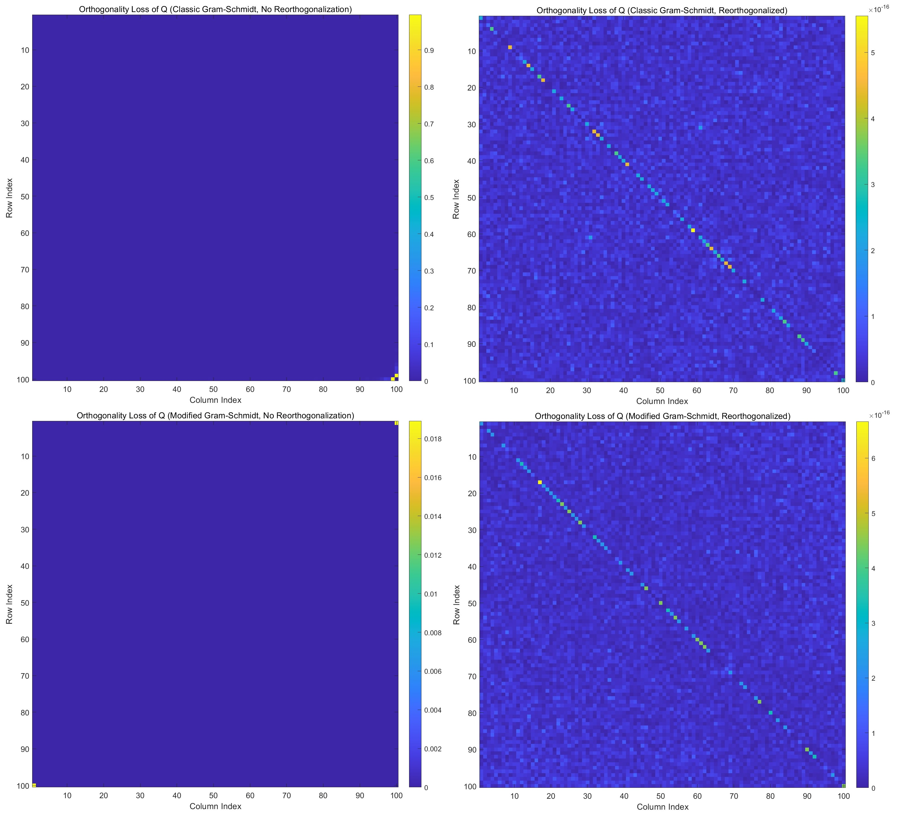
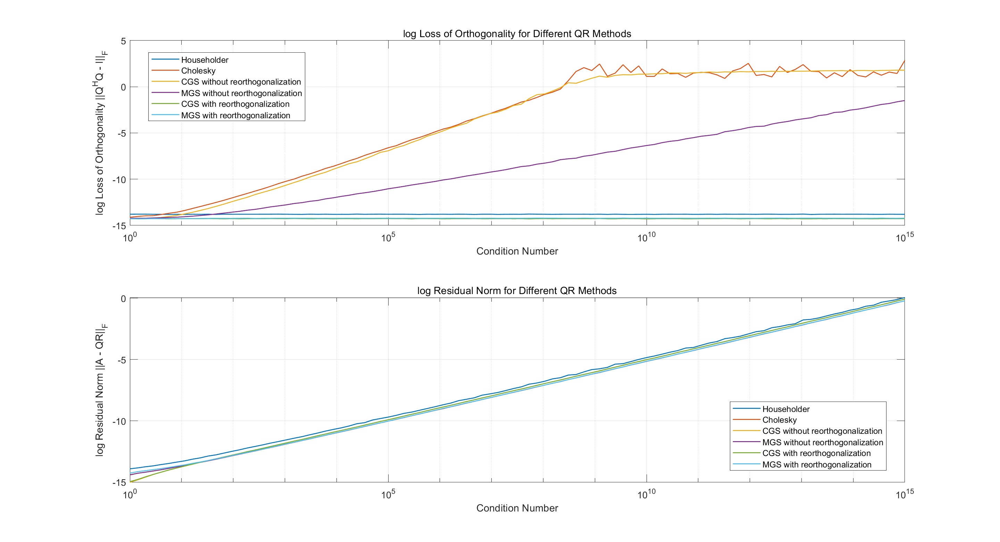
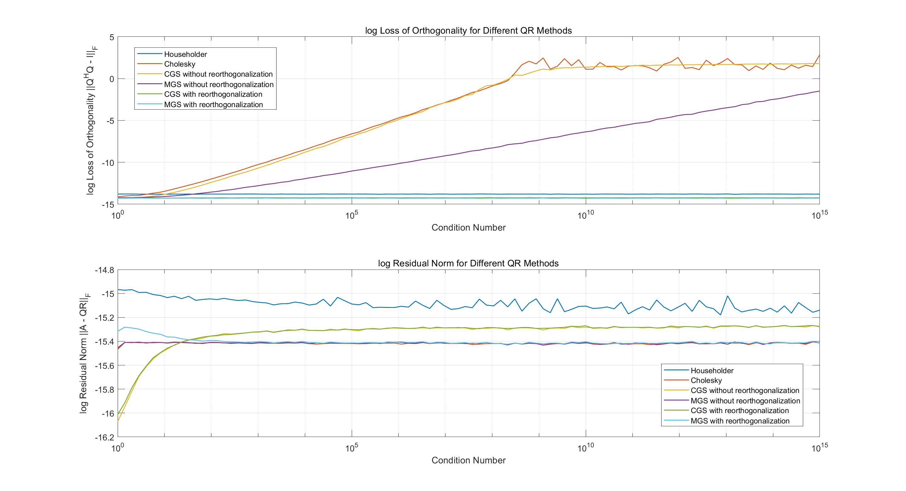
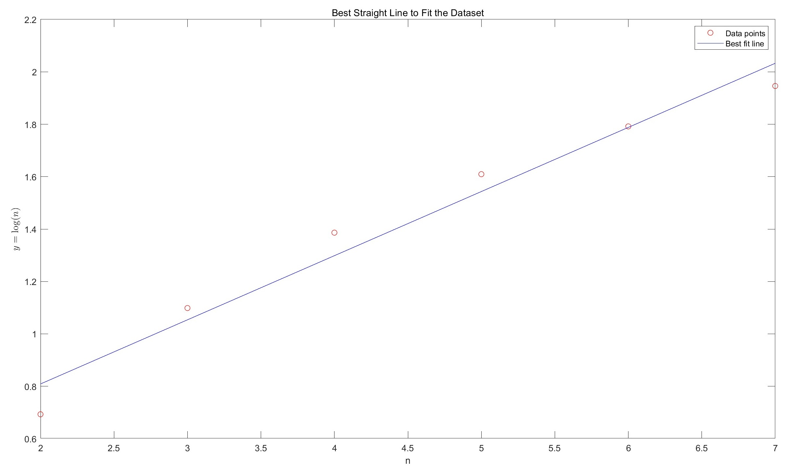
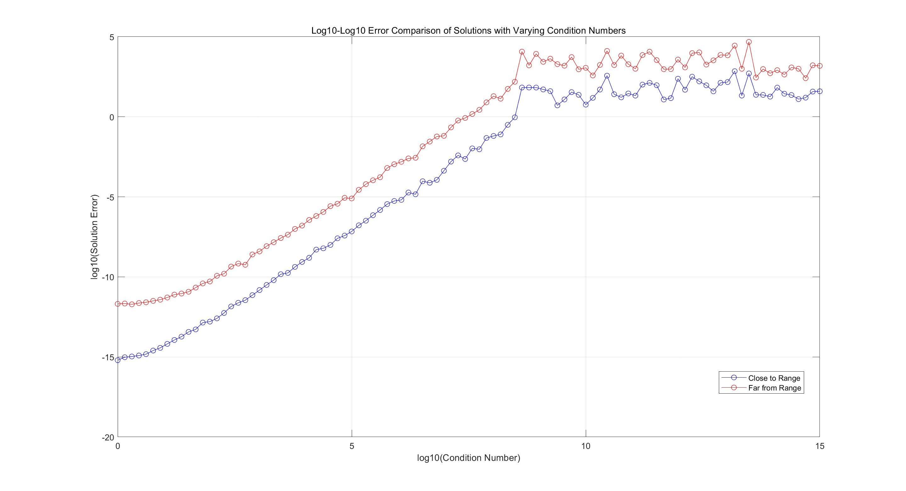
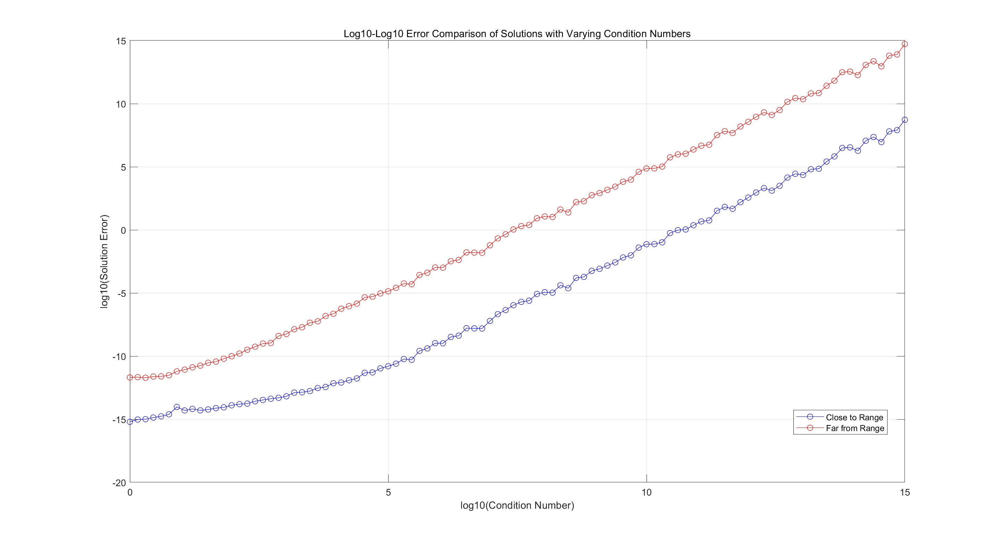
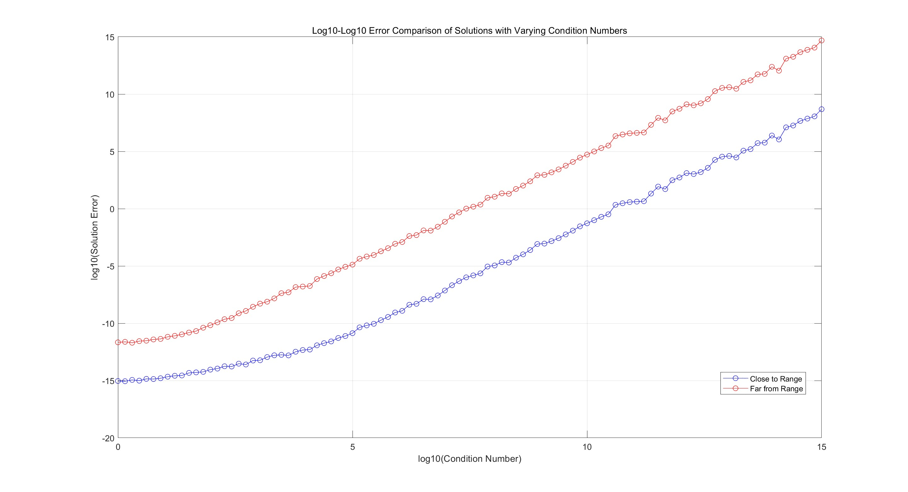
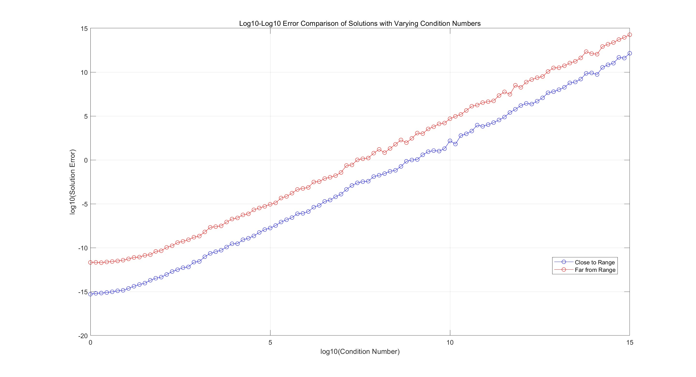

# 数值算法 Homework 05

Due: Oct. 22, 2024  
姓名: 雍崔扬   
学号: 21307140051

## Problem 1

Write a program to compute the $\text{QR}$ factorization of a general complex matrix $A\in \mathbb C^{m\times n}$ with $m\geq n$ using $\text{CGS}$ and $\text{MGS}$, with and without reorthogonalization.   
Visualize the loss of orthogonality $|Q^HQ-I_n|$ with a few examples.

**Solution:**     
对于任意给定的矩阵 $A=[a_1,\dots,a_n]\in \mathbb C^{m\times n}$，记其秩为 $r:=\rank(A)\leq \min(m,n)$    
以下算法可用于计算 $A$ 的精简 $\text{QR}$ 分解 $A=QR$   
(其中 $Q\in \mathbb C^{m\times r}$ 列标准正交，而 $R\in \mathbb C^{r\times n}$ 的左 $r\times r$ 分块为对角元非负的上三角阵)
$$
\begin{align}
&\text{function: }[Q,R] = \text{Gram\_Schmidt\_QR}(A,\text{tolerance},\text{modified},\text{reorthogonalized})\\
&\qquad [m,n] = \text{size}(A)\\
&\qquad r = 0\quad (r\text{ stands for rank of matrix }A)\\
&\qquad Q = \text{zeros}(m,m)\\
&\qquad R = \text{zeros}(m,n)\\
&\qquad \delta = \text{zeros}(m,1)\\
\hline
&\qquad \text{if reorthogonalized == TRUE}\\
&\qquad \qquad \text{max\_iter} = 2\\
&\qquad \text{else}\\
&\qquad \qquad \text{max\_iter} = 1\\
&\qquad \text{end}\\
\hline
&\qquad \text{for }k=1:\min(m,n)\\
&\qquad \qquad Q(1:m,r+1) = A(1:m,k)\\
&\qquad \qquad \text{if modified == TRUE (MGS: Modified Gram-schmidt)}\\
&\qquad \qquad\qquad \text{for iter = 1:max\_iter}\\
&\qquad \qquad\qquad\qquad \text{for }i=1:r\\
&\qquad\qquad\qquad\qquad\qquad  \delta(i) = Q(1:m,i)^TQ(1:m,r+1)\\
&\qquad\qquad\qquad\qquad\qquad  R(i, k) = R(i, k) + \delta(i)\\
&\qquad\qquad\qquad\qquad\qquad  Q(1:m,r+1) = Q(1:m,r+1) - \delta(i) Q(1:m,i)\\
&\qquad\qquad\qquad\qquad \text{end}\\
&\qquad \qquad \qquad \text{end}\\
&\qquad\qquad\text{else (CGS: Classic Gram-Schmidt)}\\
&\qquad\qquad \qquad \text{for iter = 1:max\_iter}\\
&\qquad\qquad\qquad\qquad \delta(1:r) = Q(1:m,1:r)^TQ(1:m,r+1)\\
&\qquad\qquad\qquad\qquad R(1:r, k) = R(1:r, k) + \delta(1:r)\\
&\qquad\qquad\qquad\qquad Q(1:m, r+1) = Q(1:m, r+1) - Q(1:m,1:r) \delta(1:r)\\
&\qquad\qquad\qquad \text{end}\\
&\qquad\qquad \text{end}\\
&\qquad\qquad R(r+1, k) = \|Q(1:m,r+1)\|_2\\
&\qquad\qquad \text{if }R(r+1,k) < \text{tolerance}\quad (\text{indicates linear dependence})\\
&\qquad\qquad\qquad R(r+1,k) = 0\\
&\qquad\qquad \text{else}\\
&\qquad\qquad\qquad Q(1:m,r+1) = \frac{1}{R(r+1,k)} Q(1:m,r+1)\\
&\qquad\qquad\qquad r = r + 1\quad (\text{increment rank})\\
&\qquad\qquad \text{end}\\
&\qquad \text{end}\\
\hline
&\qquad \text{if }n > m\quad (\text{fill remaining R})\\
&\qquad \qquad \text{for }k=m+1:n\\
&\qquad\qquad \qquad R(1:r,k) = Q(1:m,1:r)^H A(1:m,k)\\
&\qquad\qquad \text{end}\\
&\qquad\text{end}\\
\hline
&\qquad Q = Q(1:m,1:r)\\
&\qquad R = R(1:r,1:n)\\
&\text{end}
\end{align}
$$

其 Matlab 代码为:

```matlab
function [Q, R] = Gram_Schmidt_QR(A, tolerance, modified, reorthogonalized)
    % This function performs the Gram-Schmidt QR factorization of a matrix A
    % It supports both classical and modified versions of the GS algorithm,
    % and it allows for reorthogonalization to improve numerical stability.
    %
    % Inputs:
    %   - A: The m x n matrix to be factorized
    %   - tolerance: The threshold below which a vector is considered linearly dependent
    %   - modified: Boolean flag to choose between Classical Gram-Schmidt (CGS) 
    %               or Modified Gram-Schmidt (MGS)
    %   - reorthogonalized: Boolean flag to perform reorthogonalization (improves numerical stability)
    %
    % Outputs:
    %   - Q: An m x r orthonormal matrix (r is the rank of A, or the number of orthogonal vectors)
    %   - R: An r x n upper triangular matrix

    [m, n] = size(A);  % Get the size of matrix A (m rows, n columns)
    r = 0;  % Initialize rank of A
    Q = zeros(m, m);  % Preallocate Q as an m x m zero matrix
    R = zeros(m, n);  % Preallocate R as an m x n zero matrix
    delta = zeros(m, 1);  % Temporary vector for storing projection coefficients

    % Set the number of orthogonalization iterations based on the reorthogonalized flag
    if reorthogonalized
        max_iter = 2;  % If reorthogonalization is enabled, perform two passes
    else
        max_iter = 1;  % Otherwise, perform only one pass
    end
    
    % Main loop over each column of matrix A (for each column k)
    for k = 1:min(m,n)
        % Initialize the k-th column of Q as the k-th column of A
        Q(1:m, r+1) = A(1:m, k);
        
        % If modified Gram-Schmidt (MGS) is selected
        if modified
            for iter = 1:max_iter  % Repeat orthogonalization based on max_iter
                for i = 1:r  % Loop over previously computed columns of Q
                    delta(i) = Q(1:m, i)' * Q(1:m, r+1);  % Compute projection of Q_k on Q_i
                    R(i, k) = R(i, k) + delta(i);  % Update the corresponding entry in R
                    Q(1:m, r+1) = Q(1:m, r+1) - delta(i) * Q(1:m, i);  % Subtract projection from Q_k
                end
            end
        else  % Classical Gram-Schmidt (CGS)
            for iter = 1:max_iter
                delta(1:r) = Q(1:m, 1:r)' * Q(1:m,r+1);  % Compute projections in one step
                R(1:r, k) = R(1:r, k) + delta(1:r);  % Update R
                Q(1:m, r+1) = Q(1:m, r+1) - Q(1:m, 1:r) * delta(1:r);  % Subtract the projection from Q_k
            end
        end
        
        % Compute the 2-norm of the current column of Q (for normalization)
        R(r+1, k) = norm(Q(1:m, r+1), 2);
        
        % Check if the norm is smaller than the tolerance, indicating linear dependence
        if R(r+1, k) < tolerance
            R(r+1, k) = 0;  % Set R entry to zero if linearly dependent
        else
            Q(1:m, r+1) = Q(1:m, r+1) / R(r+1, k);  % Normalize the vector
            r = r + 1;  % Increment the rank
        end
       
    end

    % Additional step: if the number of columns n is greater than m,
    % compute the remaining upper triangular part of R using the orthonormal Q matrix
    if n > m
        for k = m+1:n
            % Compute the projections of columns of A onto the previously computed orthonormal columns of Q
            R(1:r, k) = Q(1:m, 1:r)' * A(1:m, k);
        end
    end
    
    % Reduce the size of Q and R to the actual rank r of A
    Q = Q(1:m, 1:r);  % Return the first r columns of Q
    R = R(1:r, 1:n);  % Return the first r rows of R
end
```

产生病态矩阵 $A$ 的函数:

```matlab
function A = generate_ill_conditioned_matrix(m, n)
    % Generates an ill-conditioned random complex matrix of size m x n
    % 
    % Inputs:
    %   - m: Number of rows
    %   - n: Number of columns
    %
    % Outputs:
    %   - A: Ill-conditioned complex matrix of size m x n

    % Step 1: Generate specific eigenvalues (sigma)
    sigma = randn(min(m, n), 1);  % Generate min(m,n) random eigenvalues
    sigma(1:2) = [1e-10, 1e5];    % Set two extreme eigenvalues for ill-conditioning

    % Step 2: Generate random unitary matrices U (m x m) and V (n x n)
    [U, ~] = qr(randn(m) + 1i * randn(m)); % QR decomposition for unitary matrix U
    [V, ~] = qr(randn(n) + 1i * randn(n)); % QR decomposition for unitary matrix V

    % Step 3: Construct the diagonal matrix of eigenvalues (D)
    D = zeros(m, n);  % Create an m x n matrix filled with zeros
    D(1:min(m, n), 1:min(m, n)) = diag(sigma);  % Place sigma on the diagonal

    % Step 4: Construct the ill-conditioned matrix A
    A = U * D * V';   % U is m x m, D is m x n, and V' is n x n
    
    % Step 5: Calculate the condition number
    cond_num = cond(A);  % Compute the condition number
    disp(['Condition number of the ill-conditioned matrix: ', num2str(cond_num, '%.2e')]);
end
```

可视化正交性损失的函数:

```matlab

function visualize_orthogonality_loss(Q, titleStr)
    % Visualizes the componentwise loss of orthogonality |Q^H Q - I_n|
    loss = Q' * Q - eye(size(Q, 2)); % Compute the loss
    figure; % Create a new figure window
    imagesc(abs(loss)); % Display the absolute value of the loss
    colorbar; % Add colorbar to indicate scale
    title(titleStr);
    xlabel('Column Index');
    ylabel('Row Index');
    axis square; % Make the axes square for better visualization
end
```

函数调用:

```matlab
% Generate random ill-conditioned matrix A
rng(51);  % Seed for reproducibility
m = 120;  % Number of rows
n = 100;  % Number of columns
tolerance = 1e-10;
option = 3; % Option for matrix generation (1: random, 2: low-rank, 3: predefined)

% Matrix generation based on selected option
if option == 1
    % Generate a random ill-conditioned matrix using the specified function
    A = generate_ill_conditioned_matrix(m, n);
elseif option == 2
    r = 5; % Define the rank of the matrix to be generated
    % Generate a low-rank matrix A by multiplying two random matrices:
    % The first matrix is m x r (complex), and the second is r x n (complex),
    % resulting in a matrix A of size m x n.
    A = (rand(m, r) + 1i * rand(m, r)) * (rand(r, n) + 1i * rand(r, n));
else 
    % Predefined matrix A for testing purposes
    A = [0, 1, 2, 2, 3, 4;
         0, 2, 4, 3, 4, 8;
         0, 3, 6, 4, 5, 12;
         0, 4, 8, 5, 6, 16;];  % Example matrix with specific values
end

% Test 1: Classical Gram-Schmidt (CGS) without reorthogonalization
reorthogonalized = false;
modified = false;
[Q_CGS_no_re, R_CGS_no_re] = Gram_Schmidt_QR(A, tolerance, modified, reorthogonalized);

% Compute Frobenius norm of A - QR for CGS without reorthogonalization
disp('(CGS, No Reorthogonalization) Frobenius norm of A - QR:');
disp(norm(A - Q_CGS_no_re * R_CGS_no_re, 'fro'));

% Visualize orthogonality loss of Q for CGS without reorthogonalization
visualize_orthogonality_loss(Q_CGS_no_re, 'Orthogonality Loss of Q (Classic Gram-Schmidt, No Reorthogonalization)');

% Test 2: Classical Gram-Schmidt (CGS) with reorthogonalization
reorthogonalized = true;
modified = false;
[Q_CGS_re, R_CGS_re] = Gram_Schmidt_QR(A, tolerance, modified, reorthogonalized);

% Compute Frobenius norm of A - QR for CGS with reorthogonalization
disp('(CGS, Reorthogonalized) Frobenius norm of A - QR:');
disp(norm(A - Q_CGS_re * R_CGS_re, 'fro'));

% Visualize orthogonality loss of Q for CGS with reorthogonalization
visualize_orthogonality_loss(Q_CGS_re, 'Orthogonality Loss of Q (Classic Gram-Schmidt, Reorthogonalized)');

% Test 3: Modified Gram-Schmidt (MGS) without reorthogonalization
reorthogonalized = false;
modified = true;
[Q_MGS_no_re, R_MGS_no_re] = Gram_Schmidt_QR(A, tolerance, modified, reorthogonalized);

% Compute Frobenius norm of A - QR for MGS without reorthogonalization
disp('(MGS, No Reorthogonalization) Frobenius norm of A - QR:');
disp(norm(A - Q_MGS_no_re * R_MGS_no_re, 'fro'));

% Visualize orthogonality loss of Q for MGS without reorthogonalization
visualize_orthogonality_loss(Q_MGS_no_re, 'Orthogonality Loss of Q (Modified Gram-Schmidt, No Reorthogonalization)');

% Test 4: Modified Gram-Schmidt (MGS) with reorthogonalization
reorthogonalized = true;
modified = true;
[Q_MGS_re, R_MGS_re] = Gram_Schmidt_QR(A, tolerance, modified, reorthogonalized);

% Compute Frobenius norm of A - QR for MGS with reorthogonalization
disp('(MGS, Reorthogonalized) Frobenius norm of A - QR:');
disp(norm(A - Q_MGS_re * R_MGS_re, 'fro'));

% Visualize orthogonality loss of Q for MGS with reorthogonalization
visualize_orthogonality_loss(Q_MGS_re, 'Orthogonality Loss of Q (Modified Gram-Schmidt, Reorthogonalized)');
```

输出结果:

```matlab
Condition number of the ill-conditioned matrix: 9.93e+14
(CGS, No Reorthogonalization) Frobenius norm of A - QR:
   4.4073e-11

(CGS, Reorthogonalized) Frobenius norm of A - QR:
   4.6032e-11

(MGS, No Reorthogonalization) Frobenius norm of A - QR:
   3.2537e-11

(MGS, Reorthogonalized) Frobenius norm of A - QR:
   3.3402e-11
```

**(图像待取 log10)**




## Problem 2

Generate a few tall-skinny matrices with condition numbers varying from $10^0$ to $10^{15}$.   
Visualize the loss of orthogonality $\|Q^HQ-I_n\|_F$   
and the residual norm $\frac{\|A-QR\|_F}{\|A\|_F}$ for Householder-QR, Cholesky-QR, CGS, MGS, etc.

### (1) CGS & MGS

Gram-Schmidt 方法的实现已由 Homework 5 Problem 1 给出.

### (2) Householder QR

复数域上的 Householder 变换的计算算法已在 Homework 4 Problem 2 中给出:

```matlab
function [v, beta] = Complex_Householder(x)
    % This function computes the Householder vector 'v' and scalar 'beta' for
    % a given complex vector 'x'. This transformation is used to create zeros
    % below the first element of 'x' by reflecting 'x' along a specific direction.
    
    n = length(x);
    x = x / norm(x, inf); % Normalize x by its infinity norm to avoid numerical issues

    % Copy all elements of 'x' except the first into 'v'
    v = zeros(n, 1);
    v(2:n) = x(2:n); 
    
    % Compute sigma as the squared 2-norm of the elements of x starting from the second element
    sigma = norm(x(2:n), 2)^2;
    
    % Check if sigma is near zero, which would mean 'x' is already close to a scalar multiple of e_1
    if sigma < 1e-10
        beta = 0; % If sigma is close to zero, set beta to zero (no transformation needed)
    else
        % Determine gamma to account for the argument of complex number x(1)
        if abs(x(1)) < 1e-10
            gamma = 1; % If x(1) is close to zero, set gamma to 1
        else
            gamma = x(1) / abs(x(1)); % Otherwise, set gamma to x(1) divided by its magnitude
        end
        
        % Compute alpha as the Euclidean norm of x, including x(1) and sigma
        alpha = sqrt(abs(x(1))^2 + sigma);
        
        % Compute the first element of 'v' to avoid numerical cancellation
        v(1) = -gamma * sigma / (abs(x(1)) + alpha);
        
        % Calculate 'beta', the scaling factor of the Householder transformation
        beta = 2 * abs(v(1))^2 / (abs(v(1))^2 + sigma);
        
        % Normalize the vector 'v' by v(1) to ensure that the first element is 1,
        % allowing for simplified storage and computation of the transformation
        v = v / v(1);
    end
end
```

复数域上的 Householder $\text{QR}$ 算法已在 Homework 4 Problem 3 中给出:

```matlab
function [Q, R] = Complex_Householder_QR(A)
    [m, n] = size(A);
    Q = eye(m); % Initialize Q as the identity matrix
    R = A; % Initialize R as A

    for k = 1:min(m-1, n)
        [v, beta] = Complex_Householder(R(k:m, k)); % Apply Complex Householder

        % Update R
        R(k:m, k:n) = R(k:m, k:n) - (beta * v) * (v' * R(k:m, k:n));

        % Update Q
        Q(1:m, k:m) = Q(1:m, k:m) - (Q(1:m, k:m) * v) * (beta * v');
    end
end
```

### (3) Cholesky QR

Hermite 阵 $A\in \mathbb C^{n\times n}$ 的 Cholesky 分解算法已由 Homework 4 Problem 3 给出:

```matlab
function L = Complex_Cholesky(A)
    n = size(A, 1);  % Get the size of matrix A
    for k = 1:n
        % Compute the diagonal element (ensure it's real and positive)
        A(k,k) = sqrt(A(k,k));  % For Hermitian, take the square root of the diagonal
        
        % Update the subdiagonal using the conjugate of the diagonal element
        A(k+1:n,k) = A(k+1:n,k) / A(k,k);
        
        for j = k+1:n
            % Update the remaining elements, using conjugate for complex entries
            A(j:n,j) = A(j:n,j) - A(j:n,k) * conj(A(j,k));
        end
    end
    
    % Return the lower triangular matrix with the Hadamard product
    L = A .* tril(ones(n));  % Hadamard product with a lower triangular matrix
end
```

使用上述算法得到 $A^HA$ 的 Cholesky 分解 $A^HA=LL^H$ 后，  
可取 $R=L^H$，并使用前代法求解三角方程组 $QR=A$ 得到 $Q$:

```matlab
function Q = Forward_Sweep(A, R)
    [m, n] = size(A);
    
    for i = 1:n-1
        % Normalize the current column
        A(1:m, i) = A(1:m, i) / R(i, i);  
        
        % Update the remaining columns
        A(1:m, i+1:n) = A(1:m, i+1:n) - A(1:m, i) * R(i, i+1:n);  
    end
    
    % Normalize the last column
    A(1:m, n) = A(1:m, n) / R(n, n);
    
    % Set Q
    Q = A;  
end
```

合并上述算法我们便得到 Cholesky QR 算法:

```matlab
function [Q, R] = Complex_Cholesky_QR(A)
    
    % Step 1: Compute the Cholesky decomposition of the product A' * A.
    % This yields a lower triangular matrix L.
    L = Complex_Cholesky(A' * A);

    % Step 2: Obtain R as the conjugate transpose of L.
    % R is an upper triangular matrix needed for the QR factorization.
    R = L';

    % Step 3: Use the Forward Sweep method to compute the orthogonal 
    % matrix Q based on the original matrix A and the matrix R.
    Q = Forward_Sweep(A, R);
end
```

### (4) 输出结果

生成指定条件数的矩阵的函数:

```matlab
function A = generate_matrix(m, n, r, desired_cond_num)
    % Generates random complex matrix of size m x n 
    % with desired condition number
    %
    % Inputs:
    %   - m: Number of rows
    %   - n: Number of columns
    %   - r: Number of non-zero singular values to consider
    %   - desired_cond_num: Desired condition number for the matrix
    %
    % Outputs:
    %   - A: complex matrix of size m x n with desired condition number

    % Step 1: Limit the number of singular values (r) to be within valid range
    r = max(0, min(r, min(m, n)));  % Ensure r does not exceed matrix dimensions
    % logspace creates values evenly spaced on a logarithmic scale
    % 1 is the lower limit (10^0), and desired_cond_num is the upper limit (10^log10(desired_cond_num))
    % This results in r values ranging from 1 to desired_cond_num, distributed exponentially
    sigma = logspace(0, log10(desired_cond_num), r);  % Generate r singular values

    % Step 2: Generate random unitary matrices U (m x m) and V (n x n)
    % Use QR decomposition on random complex matrices to create unitary matrices.
    % The random matrices are formed by adding real and imaginary parts.
    [U, ~] = qr(randn(m) + 1i * randn(m)); % QR decomposition for U
    [V, ~] = qr(randn(n) + 1i * randn(n)); % QR decomposition for V

    % Step 3: Construct the diagonal matrix of eigenvalues (D)
    % Initialize an m x n zero matrix and place the eigenvalues 
    % (from the sigma vector) on the diagonal.
    D = zeros(m, n);  % Create an m x n matrix filled with zeros
    D(1:min(m,n), 1:min(m,n)) = diag(sigma);  % Place sigma on the diagonal

    % Step 4: Construct the ill-conditioned matrix A
    A = U * D * V';   % U is m x m, D is m x n, and V' is n x n

    % Step 5: Calculate the condition number
    cond_num = cond(A);  % Compute the condition number
    disp(['Condition number of the generated matrix: ', num2str(cond_num, '%.2e')]);
end
```

函数调用:

```matlab
rng(51);
m = 150; % Number of rows
n = 130; % Number of columns
cond_nums = logspace(0, 15, 100); % Condition numbers from 10^0 to 10^15
methods = {'Householder', 'Cholesky', ...
            'CGS without reorthogonalization', 'MGS without reorthogonalization', ...
            'CGS with reorthogonalization', 'MGS with reorthogonalization'};

losses = zeros(length(cond_nums), length(methods));
residuals = zeros(length(cond_nums), length(methods));

for i = 1:length(cond_nums)
    desired_cond_num = cond_nums(i);
    A = generate_matrix(m, n, min(m,n), desired_cond_num);
    
    for j = 1:length(methods)
        if strcmp(methods{j}, 'Householder')
            [Q, R] = Complex_Householder_QR(A);
        elseif strcmp(methods{j}, 'Cholesky')
            [Q, R] = Complex_Cholesky_QR(A);
        elseif strcmp(methods{j}, 'CGS without reorthogonalization')
            [Q, R] = Gram_Schmidt_QR(A, 1e-10, false, false);
        elseif strcmp(methods{j}, 'MGS without reorthogonalization')
            [Q, R] = Gram_Schmidt_QR(A, 1e-10, true, false);
        elseif strcmp(methods{j}, 'CGS with reorthogonalization')
            [Q, R] = Gram_Schmidt_QR(A, 1e-10, false, true);
        elseif strcmp(methods{j}, 'MGS with reorthogonalization')
            [Q, R] = Gram_Schmidt_QR(A, 1e-10, true, true);
        end
        
        % Calculate the loss of orthogonality
        losses(i, j) = norm(Q' * Q - eye(size(Q, 2)), 'fro');
        % Calculate the residual norm
        residuals(i, j) = norm(A - Q * R, 'fro') / norm(A, 'fro');
    end
end

% Visualization
figure;
subplot(2, 1, 1);
semilogx(cond_nums, losses, 'LineWidth', 1);
xlabel('Condition Number');
ylabel('Loss of Orthogonality ||Q^HQ - I||_F');
legend(methods, 'Location', 'best');
title('Loss of Orthogonality for Different QR Methods');
grid on;

subplot(2, 1, 2);
semilogx(cond_nums, residuals, 'LineWidth', 1);
xlabel('Condition Number');
ylabel('Residual Norm ||A - QR||_F');
legend(methods, 'Location', 'best');
title('Residual Norm for Different QR Methods');
grid on;

figure;
subplot(2, 1, 1);
semilogx(cond_nums, log10(losses), 'LineWidth', 1);
xlabel('Condition Number');
ylabel('log Loss of Orthogonality ||Q^HQ - I||_F');
legend(methods, 'Location', 'best');
title('log Loss of Orthogonality for Different QR Methods');
grid on;

subplot(2, 1, 2);
semilogx(cond_nums, log10(residuals), 'LineWidth', 1);
xlabel('Condition Number');
ylabel('log Residual Norm ||A - QR||_F');
legend(methods, 'Location', 'best');
title('log Residual Norm for Different QR Methods');
grid on;
```

输出结果:  
按邵老师的说法，我的正交性损失的图像是合理的  
但误差的图像是不合理的，这是因为我生成的矩阵 $A$ 的 Frobenius 范数在增长.



保险起见，我觉得 Residual 应该使用 $\frac{\|A-QR\|_F}{\|A\|_F}$，这样得到的图像似乎是平的:    
Householder 确实在上方，而 Cholesky 也的确会很准.



## Problem 3

Let $A\in \mathbb C^{m\times n}$  
Show that $AA^\dagger$ and $I_n-A^\dagger A$, respectively, are the orthogonal projections with respect to $\text{Range}(A)$ and $\text{Ker}(A)$.

**Proof:**  
设 $A\in \mathbb C^{m\times n}$ 的精简奇异值分解为 $A=U\Sigma V^H$  
其中 $r:= \rank(A)\leq \min(m,n)$，$U\in \mathbb C^{m\times r}$ 和 $V\in \mathbb C^{n\times r}$ 列标准正交，$\Sigma\in \mathbb C^{r\times r}$ 为对角元均为正实数的对角阵.  
可以证明 $X:= V\Sigma^{-1} U^H$ 满足 Penrose 方程组:
$$
AXA = U\Sigma V^H (V\Sigma^{-1} U^H) U\Sigma V^H = U\Sigma V^H = A\\
XAX = V\Sigma^{-1} U^H (U\Sigma V^H) V\Sigma^{-1} U^H = V\Sigma^{-1} U^H = X\\
(AX)^H = (U\Sigma V^H V\Sigma^{-1} U^H)^H = (UU^H)^H = UU^H = U\Sigma V^H V\Sigma^{-1} U^H = AX\\
(XA)^H = (V\Sigma^{-1} U^H U\Sigma V^H)^H = (VV^H)^H = VV^H = V\Sigma^{-1} U^H U\Sigma V^H = XA
$$
因此 $A^\dagger := V\Sigma^{-1} U^H $

- ① 根据 $\begin{cases}
  (A A^\dagger)^H = AA^\dagger\\
  (A^\dagger A)^H = A^\dagger A\end{cases}$ 可知 $AA^\dagger$ 和 $I_n-A^\dagger A$ 是自伴算子

- ② 可以证明 $AA^\dagger$ 和 $I_n-A^\dagger A$ 是幂等算子:
  $$
  (AA^\dagger)^2 = (U\Sigma V^H V\Sigma^{-1} U^H)^2 = (UU^H)^2 = UU^H  = U\Sigma V^H V\Sigma^{-1} U^H = AA^\dagger\\
  \hline
  (A^\dagger A)^2 = (V\Sigma^{-1} U^HU\Sigma V^H )^2 = (VV^H)^2 = VV^H = V\Sigma^{-1} U^HU\Sigma V^H = A^\dagger A\\
  (I_n - A^\dagger A)^2 = I_n - 2A^\dagger A + (A^\dagger A)^2 = I_n - 2A^\dagger A + A^\dagger A=
  I_n - A^\dagger A
  $$

- ③ 根据 G. Strang 提出的线性代数基本定理可知:  
  $$
  \text{Range}(AA^\dagger) = \text{Range}(UU^H) = \text{Range}(A)\\
  \text{Range}(A^\dagger A) = \text{Range}(VV^H) = \text{Range}(A^H)\\
  \text{Range}(I_n - A^\dagger A) = \text{Range}(A^\dagger A)^\bot = \text{Range}(A^H)^\bot = \text{Ker}(A)
  $$

综上所述，$AA^\dagger$ 和 $I_n-A^\dagger A$ 分别是 $\mathbb C^m \mapsto \text{Range}(A)$ 和 $\mathbb C^n\mapsto \text{Ker}(A)$ 的正交投影算子.


## Problem 4

Let $A\in \mathbb C^{m\times n}$ and $X\in \mathbb C^{n\times m}$.   
Suppose that for any $b\in \mathbb C^m$, $x=Xb$ is **always** a minimizer of the least squares problem $\min_x \|Ax-b\|_2$.    
Show that $AXA = A$ and $(AX)^H= AX$.

**Proof:**   
任意给定 $b\in \mathbb C^m$  
显然 $\min_x \|Ax-b\|_2$ 是无约束凸优化问题，因此最小值点即为驻点.  
因此 $x=Xb$ 是 $\nabla_x \|Ax-b\|^2_2 = 2A^H(Ax-b)=0_n$ 的一个解.  
代入可知 $A^HA Xb = A^Hb$   
根据 $b$ 的任意性可知 $A^HAX=A^H$ 

设 $A\in \mathbb C^{m\times n}$ 的精简奇异值分解为 $A=U\Sigma V^H$  
其中 $r:= \rank(A)\leq \min(m,n)$，$U\in \mathbb C^{m\times r}$ 和 $V\in \mathbb C^{n\times r}$ 列标准正交，$\Sigma\in \mathbb C^{r\times r}$ 为对角元均为正实数的对角阵.  
则我们有:
$$
A^HAX  = A^H\\
\Leftrightarrow\\
(U\Sigma V^H)^H U\Sigma V^H X = V\Sigma U^H\\
\Leftrightarrow\\
V\Sigma^2 V^H X = V\Sigma U^H\\
\Leftrightarrow\\
X= V\Sigma^{-2}V^H V\Sigma U^H = V\Sigma^{-1}U^H
$$
可以证明 $X= V\Sigma^{-1} U^H$ 满足 Penrose 方程组:
$$
AXA = U\Sigma V^H (V\Sigma^{-1} U^H) U\Sigma V^H = U\Sigma V^H = A\\
XAX = V\Sigma^{-1} U^H (U\Sigma V^H) V\Sigma^{-1} U^H = V\Sigma^{-1} U^H = X\\
(AX)^H = (U\Sigma V^H V\Sigma^{-1} U^H)^H = (UU^H)^H = UU^H = U\Sigma V^H V\Sigma^{-1} U^H = AX\\
(XA)^H = (V\Sigma^{-1} U^H U\Sigma V^H)^H = (VV^H)^H = VV^H = V\Sigma^{-1} U^H U\Sigma V^H = XA
$$

*****

也可以这样根据 $A^HAX=A^H$ 推出 $\begin{cases}
AXA=A\\
(AX)^H = AX\end{cases}$ 
$$
X^HA^HAX=X^HA^H\\
\Leftrightarrow\\
(AX)^H(AX) = (AX)^H\\
\Leftrightarrow\\
(AX)^H = [(AX)^H(AX)]^H = (AX)^H(AX) = AX\\
\hline
A^H = A^HAX = A^H(AX)^H = A^HX^HA^H\\
\Leftrightarrow\\
A=(A^HX^HA^H)^H = AXA
$$


## Problem 5

Find the "best" straight line that approximately passes through the data set $\{(n,\log(n))\in \mathbb R^2:n\in \{2,3,4,5,6,7\}\}$.   
Visualize your result and clarify in what sense your solution is the best.

**Solution:**   
以下代码得到的拟合结果在均方误差意义下是最优解:

```matlab
% Define the dataset
x = 2:7;
y = log(x);

% Design matrix A (for the linear system Ax = b)
A = [ones(length(x), 1), x']; % A is [1, n] for each n

% Solve the linear least squares problem to find coefficients
x_LSE = A \ y'; % Equivalent to (A'*A) \ (A'*y')

% Generate points for the best fit line
y_fit = x_LSE(2) * x + x_LSE(1); % y = mx + b

% Visualization
figure;
% Points of Dataset
plot(x, y, 'ro', 'DisplayName', 'Data points');
hold on;
% Best straight line to fit the dataset
plot(x, y_fit, 'b-', 'DisplayName', 'Best fit line');
xlabel('n');
ylabel('$$y = \log(n)$$', 'Interpreter', 'latex');
legend('show');
title('Best Straight Line to Fit the Dataset');
% Display the equation of the line
fprintf('The best fit line is: y = %.4f * n + %.4f\n', x_LSE(2), x_LSE(1));
```

输出结果:

```matlab
The best fit line is: y = 0.2448 * n + 0.3195
```




## Problem 6

Generate a few least squares problems with condition numbers varying from $10^0$ to $10^{15}$.   
Choose two different kinds of right-hand sides:

- ① $b$ is close to $\text{Range}(A)$
- ② $b$ is far away from $\text{Range}(A)$. 

Compare the accuracy of the solutions produced by the following methods: 

### Preparation

生成指定条件数的矩阵 $A$ 和两个向量 $b$ (一个接近 $\text{Range}(A)$，另一个远离 $\text{Range}(A)$) 的函数:  
(同时返回相应最小二乘问题的精确解)

```matlab
function [A, b_close, b_far, x_exact] = generate_system(m, n, r, desired_cond_num)
    % Generates a random complex matrix of size m x n 
    % with a specified condition number, along with two right-hand side vectors
    % that are close and far from the range of the matrix A.
    %
    % Inputs:
    %   - m: Number of rows in matrix A
    %   - n: Number of columns in matrix A
    %   - r: Number of non-zero singular values to consider
    %   - desired_cond_num: Desired condition number for the generated matrix
    %
    % Outputs:
    %   - A: Complex matrix of size m x n with the specified condition number
    %   - b_close: Vector close to the range of A
    %   - b_far: Vector far from the range of A
    %   - x_exact: The exact least-squares solution

    % Step 1: Limit the number of singular values (r) to be within valid range
    r = max(0, min(r, min(m, n)));  % Ensure r does not exceed matrix dimensions
    % logspace creates values evenly spaced on a logarithmic scale
    % 1 is the lower limit (10^0), and desired_cond_num is the upper limit (10^log10(desired_cond_num))
    % This results in r values ranging from 1 to desired_cond_num, distributed exponentially
    sigma = logspace(0, log10(desired_cond_num), r);  % Generate r singular values

    % Step 2: Generate random unitary matrices U (m x m) and V (n x n)
    % Use QR decomposition on random complex matrices to create unitary matrices.
    [U, ~] = qr(randn(m) + 1i * randn(m));  % Create unitary matrix U
    [V, ~] = qr(randn(n) + 1i * randn(n));  % Create unitary matrix V

    % Step 3: Construct the diagonal matrix of eigenvalues (D)
    D = zeros(m, n);  % Initialize an m x n matrix filled with zeros
    D(1:r, 1:r) = diag(sigma);  % Place the eigenvalues from sigma on the diagonal

    % Step 4: Construct the ill-conditioned matrix A using the generated matrices
    A = U * D * V';  % Matrix multiplication to form the final matrix A

    % Step 5: Calculate and display the condition number of the generated matrix
    cond_num = cond(A);  % Compute the condition number
    disp(['Condition number of the generated matrix: ', num2str(cond_num, '%.2e')]);

    % Step 6: Generate a random vector and project it onto the null space of A
    null_space_vector = rand(m, 1);  % Create a random vector in R^m
    null_space_vector = null_space_vector - U(1:m, 1:r) * (U(1:m, 1:r)' * null_space_vector);
    null_space_vector = null_space_vector / norm(null_space_vector, 2);

    % Step 7: Create a vector close to the range of A
    x_exact = rand(n, 1);
    base = A * x_exact;  % Generate a random vector in the range of A
    scale_1 = 1e-3 * norm(base, 2);
    b_close = base + scale_1 * null_space_vector;

    % Step 8: Create a vector far from the range of A
    scale_2 = 1e3 * norm(base, 2);
    b_far = base + scale_2 * null_space_vector;
end
```

### Part (1)

Solve the normal equation $A^HAx=A^Hb$ through the Cholesky factorization of $A^HA$

**Solution:**     
Hermite 阵 $A\in \mathbb C^{n\times n}$ 的 Cholesky 分解算法已由 Homework 4 Problem 3 给出:

```matlab
function L = Complex_Cholesky(A)
    n = size(A, 1);  % Get the size of matrix A
    for k = 1:n
        % Compute the diagonal element (ensure it's real and positive)
        A(k,k) = sqrt(A(k,k));  % For Hermitian, take the square root of the diagonal
        
        % Update the subdiagonal using the conjugate of the diagonal element
        A(k+1:n,k) = A(k+1:n,k) / A(k,k);
        
        for j = k+1:n
            % Update the remaining elements, using conjugate for complex entries
            A(j:n,j) = A(j:n,j) - A(j:n,k) * conj(A(j,k));
        end
    end
    
    % Return the lower triangular matrix with the Hadamard product
    L = A .* tril(ones(n));  % Hadamard product with a lower triangular matrix
end
```

使用上述算法得到 $A^HA$ 的 Cholesky 分解 $A^HA=LL^H$ 后  
求解法方程 $A^HAx = LL^Hx =  A^Hb$ 就等价于求解 $\begin{cases}
Ly = A^Hb\\
L^Hx = y\end{cases}$ (分别由前代法和回代法求解)

前代法的 Matlab 代码如下:

```matlab
function y = Forward_Sweep(L, b)
    % 前代法求解 Ly = b
    n = length(b);
    for i = 1:n-1
        b(i) = b(i) / L(i, i);  % 对角线归一化
        b(i+1:n) = b(i+1:n) - b(i) * L(i+1:n, i);  % 消去
    end
    b(n) = b(n) / L(n, n);  % 处理最后一行
    y = b;  % 返回结果
end
```

回代法的 Matlab 代码如下:

```matlab
function x = Backward_Sweep(U, y)
    % 回代法求解 Ux = y
    n = length(y);
    for i = n:-1:2
        y(i) = y(i) / U(i, i);  % 对角线归一化
        y(1:i-1) = y(1:i-1) - y(i) * U(1:i-1, i);  % 消去
    end
    y(1) = y(1) / U(1, 1);  % 处理第一行
    x = y;  % 返回结果
end
```

最终合并为函数:

```matlab
function x = Cholesky_Solution(A, b)
    % Cholesky_Solution solves the linear system Ax = b using the Cholesky decomposition.
    % Step 1: Compute the Cholesky decomposition of A' * A
    L = Complex_Cholesky(A' * A);  

    % Step 2: Solve the intermediate system Ly = A' * b
    y = Forward_Sweep(L, A' * b);

    % Step 3: Solve the final system L' * x = y
    x = Backward_Sweep(L', y);  
end
```

函数调用:

```matlab
rng(51);  % Set the random seed for reproducibility
m = 120;  % Number of rows
n = 100;   % Number of columns
r = min(m,n);
cond_nums = logspace(0, 15, 100);  % Condition numbers from 10^0 to 10^15

% Preallocate arrays to store results
b_close_solutions = zeros(length(cond_nums), 1);
b_far_solutions = zeros(length(cond_nums), 1);
errors_close = zeros(length(cond_nums), 1);
errors_far = zeros(length(cond_nums), 1);

for i = 1:length(cond_nums)
    desired_cond_num = cond_nums(i);
    
    % Step 1: Generate the matrix A and right-hand sides b_close and b_far
    [A, b_close, b_far, x_exact] = generate_system(m, n, r, desired_cond_num);
    
    % Step 2: Solve the least squares problems using Cholesky decomposition
    x_close = Cholesky_Solution(A, b_close);
    x_far = Cholesky_Solution(A, b_far);
    
for i = 1:length(cond_nums)
    desired_cond_num = cond_nums(i);
    
    % Step 1: Generate the matrix A and right-hand sides b_close and b_far
    [A, b_close, b_far, x_exact] = generate_system(m, n, r, desired_cond_num);
    
    % Step 2: Solve the least squares problems using augmented system
    x_close = Augmented_Solution(A, b_close);
    x_far = Augmented_Solution(A, b_far);
    
    % Compute the errors
    errors_close(i) = norm(x_exact - x_close, 'fro') / norm(x_exact, 'fro');
    errors_far(i) = norm(x_exact - x_far, 'fro') / norm(x_exact, 'fro');
end

% Visualization of errors
figure;
plot(log10(cond_nums), log10(errors_close), 'b-o', 'DisplayName', 'Close to Range');
hold on;
plot(log10(cond_nums), log10(errors_far), 'r-o', 'DisplayName', 'Far from Range');
xlabel('log10(Condition Number)');
ylabel('log10(Solution Error)');
legend('show', 'Location', 'best');
title('Log10-Log10 Error Comparison of Solutions with Varying Condition Numbers');
grid on;
```

输出结果:



### Part (2)

Solve the augmented system:  
$$
\begin{bmatrix}
I_m & A\\
A^H & 0_{n\times n}
\end{bmatrix} 
\begin{bmatrix}
r\\
x
\end{bmatrix}
=
\begin{bmatrix}
b\\
0_n
\end{bmatrix}
$$

实际应该使用 $LDL^T$ 分解求解这个 Hermite 不定线性系统.

**Solution:**     
部分选主元的 Gauss 消去法:

```matlab
function [P, L, U] = Gaussian_Elimination_Partial_Pivoting(A)
    % 获取矩阵的维度
    [n, m] = size(A);
    if n ~= m
        error('矩阵A必须是方阵');
    end
    
    % 初始化置换矩阵 P 为单位矩阵
    P = eye(n);
    
    % 高斯消去过程
    for k = 1:n-1
        % 在第 k 列的 A(k:n, k) 中找到最大值的行索引 p
        [~, p] = max(abs(A(k:n, k)));
        p = p + k - 1; % 调整为在整个矩阵中的行索引
        
        % 交换第 k 行和第 p 行
        if p ~= k
            A([k, p], :) = A([p, k], :); 
            P([k, p], :) = P([p, k], :); % 记录行置换
        end
        
        % 检查主元是否为零
        if A(k, k) == 0
            error('矩阵是奇异的');
        end
        
        % Gauss 消去过程：对 A(k+1:n, k) 进行归一化
        A(k+1:n, k) = A(k+1:n, k) / A(k, k);
        
        % 更新 A(k+1:n, k+1:n)
        A(k+1:n, k+1:n) = A(k+1:n, k+1:n) - A(k+1:n, k) * A(k, k+1:n);
    end
    
    % 计算 L 和 U 矩阵
    L = tril(A, -1) + eye(n); % L 是单位下三角矩阵
    U = triu(A); % U 是上三角矩阵
    
    % 返回置换矩阵 P，以及分解矩阵 L、U
end
```

构建增广线性系统并求解的函数:

```matlab
function x = Augmented_Solution(A, b)
    % Augmented_Solution solves the linear system Ax = b using an augmented approach.
    %
    % Inputs:
    %   - A: Coefficient matrix (m x n)
    %   - b: Right-hand side vector (m x 1)
    %
    % Outputs:
    %   - x: Solution vector (n x 1) that satisfies the equation Ax = b

    [m, n] = size(A);  % Get the number of rows (m) and columns (n) of matrix A

    % Step 1: Construct the augmented matrix A_tilde
    A_tilde = [eye(m,m), A;   
               A', zeros(n,n)];

    % Step 2: Construct the augmented vector b_tilde
    b_tilde = [b; zeros(n,1)];

    % Step 3: Perform Gaussian elimination with partial pivoting
    % This decomposes A_tilde into its LU components while handling pivoting
    [P, L, U] = Gaussian_Elimination_Partial_Pivoting(A_tilde);

    % Step 4: Solve the system L*y = P*b_tilde using forward substitution
    y = Forward_Sweep(L, P * b_tilde);

    % Step 5: Solve the upper triangular system U*x_tilde = y using backward substitution
    x_tilde = Backward_Sweep(U, y); 

    % Step 6: Extract the solution vector x from the augmented solution
    x = x_tilde(m+1:m+n);
end
```

函数调用:

```matlab
rng(51);  % Set the random seed for reproducibility
m = 120;  % Number of rows
n = 100;   % Number of columns
r = min(m,n);
cond_nums = logspace(0, 15, 100);  % Condition numbers from 10^0 to 10^15

% Preallocate arrays to store results
b_close_solutions = zeros(length(cond_nums), 1);
b_far_solutions = zeros(length(cond_nums), 1);
errors_close = zeros(length(cond_nums), 1);
errors_far = zeros(length(cond_nums), 1);

for i = 1:length(cond_nums)
    desired_cond_num = cond_nums(i);
    
    % Step 1: Generate the matrix A and right-hand sides b_close and b_far
    [A, b_close, b_far, x_exact] = generate_system(m, n, r, desired_cond_num);
    
    % Step 2: Solve the least squares problems using augmented system
    x_close = Augmented_Solution(A, b_close);
    x_far = Augmented_Solution(A, b_far);
    
for i = 1:length(cond_nums)
    desired_cond_num = cond_nums(i);
    
    % Step 1: Generate the matrix A and right-hand sides b_close and b_far
    [A, b_close, b_far, x_exact] = generate_system(m, n, r, desired_cond_num);
    
    % Step 2: Solve the least squares problems using augmented system
    x_close = Augmented_Solution(A, b_close);
    x_far = Augmented_Solution(A, b_far);
    
    % Compute the errors
    errors_close(i) = norm(x_exact - x_close, 'fro') / norm(x_exact, 'fro');
    errors_far(i) = norm(x_exact - x_far, 'fro') / norm(x_exact, 'fro');
end

% Visualization of errors
figure;
plot(log10(cond_nums), log10(errors_close), 'b-o', 'DisplayName', 'Close to Range');
hold on;
plot(log10(cond_nums), log10(errors_far), 'r-o', 'DisplayName', 'Far from Range');
xlabel('log10(Condition Number)');
ylabel('log10(Solution Error)');
legend('show', 'Location', 'best');
title('Log10-Log10 Error Comparison of Solutions with Varying Condition Numbers');
grid on;
```

输出结果:  




### Part (3)

Solve the normal equation $A^HAx=A^Hb$ through Householder-$\text{QR}$ 

**Solution:**    
复数域上的 Householder 变换的计算算法已在 Homework 4 Problem 2 中给出:

```matlab
function [v, beta] = Complex_Householder(x)
    % This function computes the Householder vector 'v' and scalar 'beta' for
    % a given complex vector 'x'. This transformation is used to create zeros
    % below the first element of 'x' by reflecting 'x' along a specific direction.
    
    n = length(x);
    x = x / norm(x, inf); % Normalize x by its infinity norm to avoid numerical issues

    % Copy all elements of 'x' except the first into 'v'
    v = zeros(n, 1);
    v(2:n) = x(2:n); 
    
    % Compute sigma as the squared 2-norm of the elements of x starting from the second element
    sigma = norm(x(2:n), 2)^2;
    
    % Check if sigma is near zero, which would mean 'x' is already close to a scalar multiple of e_1
    if sigma < 1e-10
        beta = 0; % If sigma is close to zero, set beta to zero (no transformation needed)
    else
        % Determine gamma to account for the argument of complex number x(1)
        if abs(x(1)) < 1e-10
            gamma = 1; % If x(1) is close to zero, set gamma to 1
        else
            gamma = x(1) / abs(x(1)); % Otherwise, set gamma to x(1) divided by its magnitude
        end
        
        % Compute alpha as the Euclidean norm of x, including x(1) and sigma
        alpha = sqrt(abs(x(1))^2 + sigma);
        
        % Compute the first element of 'v' to avoid numerical cancellation
        v(1) = -gamma * sigma / (abs(x(1)) + alpha);
        
        % Calculate 'beta', the scaling factor of the Householder transformation
        beta = 2 * abs(v(1))^2 / (abs(v(1))^2 + sigma);
        
        % Normalize the vector 'v' by v(1) to ensure that the first element is 1,
        % allowing for simplified storage and computation of the transformation
        v = v / v(1);
    end
end
```

复数域上的 Householder $\text{QR}$ 算法已在 Homework 4 Problem 3 中给出:

```matlab
function [Q, R] = Complex_Householder_QR(A)
    [m, n] = size(A);
    Q = eye(m); % Initialize Q as the identity matrix
    R = A; % Initialize R as A

    for k = 1:min(m-1, n)
        [v, beta] = Complex_Householder(R(k:m, k)); % Apply Complex Householder

        % Update R
        R(k:m, k:n) = R(k:m, k:n) - (beta * v) * (v' * R(k:m, k:n));

        % Update Q
        Q(1:m, k:m) = Q(1:m, k:m) - (Q(1:m, k:m) * v) * (beta * v');
    end
end
```

计算得到 $A\in \mathbb C^{m\times n}$ 的 $\text{QR}$ 分解 $A=QR$ 之后 (其中 $Q\in \mathbb C^{m\times m}$ 为酉矩阵，$R\in \mathbb C^{m\times n}$ 的上 $n\times n$ 分块 $R_1$ 为上三角阵)  
求解法方程 $A^HAx = R^HRx =  A^Hb$ 就等价于求解 $\begin{cases}
R^Hy = A^Hb\\
Rx = y\end{cases}$ (分别由前代法和回代法求解)  
或者也可考虑精简 $\text{QR}$ 分解 $A=Q_1R_1$ (其中 $Q_1\in \mathbb C^{m\times n}$ 由 $Q$ 的前 $n$ 列构成)  
则求解法方程 $A^HAx = R_1^HR_1x =  R^H_1Q^H_1b=A^Hb$ 就等价于求解 $R_1x = Q_1^Hb$ (由回代法求解) 

```matlab
function x = Householder_Solution(A, b)
    [m, n] = size(A);

    % Step 1: Compute the QR decomposition of A using Householder reflections
    [Q, R] = Complex_Householder_QR(A);

    % Step 2: Solve the system Rx = Q' * b using backward substitution
    x = Backward_Sweep(R(1:n, 1:n), Q(1:m, 1:n)' * b);
end
```

函数调用:

```matlab
rng(51);  % Set the random seed for reproducibility
m = 120;  % Number of rows
n = 100;   % Number of columns
r = min(m,n);
cond_nums = logspace(0, 15, 100);  % Condition numbers from 10^0 to 10^15

% Preallocate arrays to store results
b_close_solutions = zeros(length(cond_nums), 1);
b_far_solutions = zeros(length(cond_nums), 1);
errors_close = zeros(length(cond_nums), 1);
errors_far = zeros(length(cond_nums), 1);

for i = 1:length(cond_nums)
    desired_cond_num = cond_nums(i);
    
    % Step 1: Generate the matrix A and right-hand sides b_close and b_far
    [A, b_close, b_far, x_exact] = generate_system(m, n, r, desired_cond_num);
    
    % Step 2: Solve the least squares problems using Householder QR method
    x_close = Householder_Solution(A, b_close);
    x_far = Householder_Solution(A, b_far);
    
for i = 1:length(cond_nums)
    desired_cond_num = cond_nums(i);
    
    % Step 1: Generate the matrix A and right-hand sides b_close and b_far
    [A, b_close, b_far, x_exact] = generate_system(m, n, r, desired_cond_num);
    
    % Step 2: Solve the least squares problems using augmented system
    x_close = Augmented_Solution(A, b_close);
    x_far = Augmented_Solution(A, b_far);
    
    % Compute the errors
    errors_close(i) = norm(x_exact - x_close, 'fro') / norm(x_exact, 'fro');
    errors_far(i) = norm(x_exact - x_far, 'fro') / norm(x_exact, 'fro');
end

% Visualization of errors
figure;
plot(log10(cond_nums), log10(errors_close), 'b-o', 'DisplayName', 'Close to Range');
hold on;
plot(log10(cond_nums), log10(errors_far), 'r-o', 'DisplayName', 'Far from Range');
xlabel('log10(Condition Number)');
ylabel('log10(Solution Error)');
legend('show', 'Location', 'best');
title('Log10-Log10 Error Comparison of Solutions with Varying Condition Numbers');
grid on;
```

输出结果:



### Part (4)

Solve the normal equation $A^HAx=A^Hb$ through $\text{MGS}$ 

**Solution:**   
Gram-Schmidt 方法的实现已由 Homework 5 Problem 1 给出.  
计算得到 $A\in \mathbb C^{m\times n}$ 的精简 $\text{QR}$ 分解 $A=Q_1R_1$ (其中 $r=\rank(A)$，$Q_1\in \mathbb C^{m\times r}$ 列标准正交，$R\in \mathbb C^{r\times n}$ 为)  
则求解法方程 $A^HAx = R_1^HR_1x =  R^H_1Q^H_1b=A^Hb$ 就等价于求解 $R_1x = Q_1^Hb$ (由回代法求解) 

```matlab
function x = MGS_Solution(A, b)
    % MGS_Solution solves the linear system Ax = b using Modified Gram-Schmidt QR decomposition.

    % Step 1: Compute the QR decomposition of A using Modified Gram-Schmidt process
    [Q, R] = Gram_Schmidt_QR(A, 1e-10, true, false);

    % Step 2: Solve the system Rx = Q' * b using backward substitution
    x = Backward_Sweep(R, Q' * b);
end
```

函数调用:

```matlab
rng(51);  % Set the random seed for reproducibility
m = 120;  % Number of rows
n = 100;   % Number of columns
r = min(m,n);
cond_nums = logspace(0, 15, 100);  % Condition numbers from 10^0 to 10^15

% Preallocate arrays to store results
b_close_solutions = zeros(length(cond_nums), 1);
b_far_solutions = zeros(length(cond_nums), 1);
errors_close = zeros(length(cond_nums), 1);
errors_far = zeros(length(cond_nums), 1);

for i = 1:length(cond_nums)
    desired_cond_num = cond_nums(i);
    
    % Step 1: Generate the matrix A and right-hand sides b_close and b_far
    [A, b_close, b_far, x_exact] = generate_system(m, n, r, desired_cond_num);
    
    % Step 2: Solve the least squares problems using Gram-Schm QR method
    x_close = MGS_Solution(A, b_close);
    x_far = MGS_Solution(A, b_far);
    
for i = 1:length(cond_nums)
    desired_cond_num = cond_nums(i);
    
    % Step 1: Generate the matrix A and right-hand sides b_close and b_far
    [A, b_close, b_far, x_exact] = generate_system(m, n, r, desired_cond_num);
    
    % Step 2: Solve the least squares problems using augmented system
    x_close = Augmented_Solution(A, b_close);
    x_far = Augmented_Solution(A, b_far);
    
    % Compute the errors
    errors_close(i) = norm(x_exact - x_close, 'fro') / norm(x_exact, 'fro');
    errors_far(i) = norm(x_exact - x_far, 'fro') / norm(x_exact, 'fro');
end

% Visualization of errors
figure;
plot(log10(cond_nums), log10(errors_close), 'b-o', 'DisplayName', 'Close to Range');
hold on;
plot(log10(cond_nums), log10(errors_far), 'r-o', 'DisplayName', 'Far from Range');
xlabel('log10(Condition Number)');
ylabel('log10(Solution Error)');
legend('show', 'Location', 'best');
title('Log10-Log10 Error Comparison of Solutions with Varying Condition Numbers');
grid on;
```

输出结果:  
(存疑: 为什么 $\text{CGS}$ 和 $\text{MGS}$ 效果相近? 而且使用重正交化的效果也不好?)




## Problem 7 (optional, 存疑)

Let $A\in \mathbb R^{m\times n}$ with full column rank.  
Establish the connection between the Householder-$\text{QR}$ algorithm applied to the matrix $\begin{bmatrix}
0_{n\times n}\\
A\end{bmatrix}\in \mathbb R^{(m+n)\times n}$   
and the $\text{MGS}$ algorithm applied to $A$.  
(这一理论结果可用于将两者的误差分析等价起来)

**Solution:**  
$$
[Q_1, R_1] = \text{Householder\_QR}\left(
\begin{bmatrix}
0_{n\times n}\\
A
\end{bmatrix}\right)\text{ where }Q_1\in \mathbb R^{(m+n)\times (m+n)}, R_1\in \mathbb R^{(m+n)\times n}\\

[Q_2, R_2] = \text{MGS}(A) \text{ where }Q_2\in \mathbb R^{m\times n}, R_2\in \mathbb R^{n\times n}
$$

(邵老师说: 对 $A$ 应用 Householder QR 的结果在矩阵病态时会和 MGS 的效果不一样)  
代码测试表明: 

- $Q_2\in \mathbb R^{m\times n}$ 即 $Q_1(n+1:n+m, 1:n)$
- $R_2\in \mathbb R^{n\times n}$ 即 $R_1(1:n,1:n)$

实数域上的 Householder 变换:

```matlab
function [v, beta] = Householder(x)
    % Householder computes the Householder vector and the scaling factor beta
    % from the input vector x.
    %
    % Inputs:
    %   - x: A column vector
    %
    % Outputs:
    %   - v: The Householder vector
    %   - beta: The scaling factor

    n = length(x);          % Get the length of the input vector
    x = x / norm(x, inf);   % Normalize x using the infinity norm
    v = zeros(n, 1);        % Initialize the Householder vector v
    v(2:n) = x(2:n);        % Set the elements of v from x

    sigma = x(2:n)' * x(2:n);  % Compute the squared norm of x(2:n)

    if sigma == 0
        beta = 0;  % If sigma is zero, set beta to zero
    else
        alpha = sqrt(x(1)^2 + sigma);  % Compute alpha
        if x(1) > 0
            v(1) = -sigma / (x(1) + alpha);  % Avoid cancellation if x(1) > 0
        else
            v(1) = x(1) - alpha;  % No need to avoid cancellation if x(1) <= 0
        end
        beta = 2 * v(1)^2 / (v(1)^2 + sigma);  % Compute beta
        v = v / v(1);  % Normalize v
    end
end
```

实数域上的 Householder QR 算法:

```matlab
function [Q, R] = Householder_QR(A)
    [m, n] = size(A);
    Q = eye(m); % Initialize Q as the identity matrix
    R = A; % Initialize R as A

    for k = 1:min(m-1, n)
        [v, beta] = Householder(R(k:m, k)); % Apply Complex Householder

        % Update R
        R(k:m, k:n) = R(k:m, k:n) - (beta * v) * (v' * R(k:m, k:n));

        % Update Q
        Q(1:m, k:m) = Q(1:m, k:m) - (Q(1:m, k:m) * v) * (beta * v');
    end
end
```

Gram-Schmidt 方法的实现已由 Homework 5 Problem 1 给出.  
函数调用:

```matlab
rng(51);
m = 100;
n = 80;
A = rand(m, n);
[Q1, R1] = Householder_QR([zeros(n,n);A]);
[Q2, R2] = Gram_Schmidt_QR(A, 1e-10, true, false);
disp(norm(Q1(n+1:n+m, 1:n)-Q2, "fro"));
disp(norm(R1(1:n,1:n)-R2, "fro"));
```

输出结果:

```bash
8.1856e-15
1.1683e-14
```

这印证了我们的结果.
