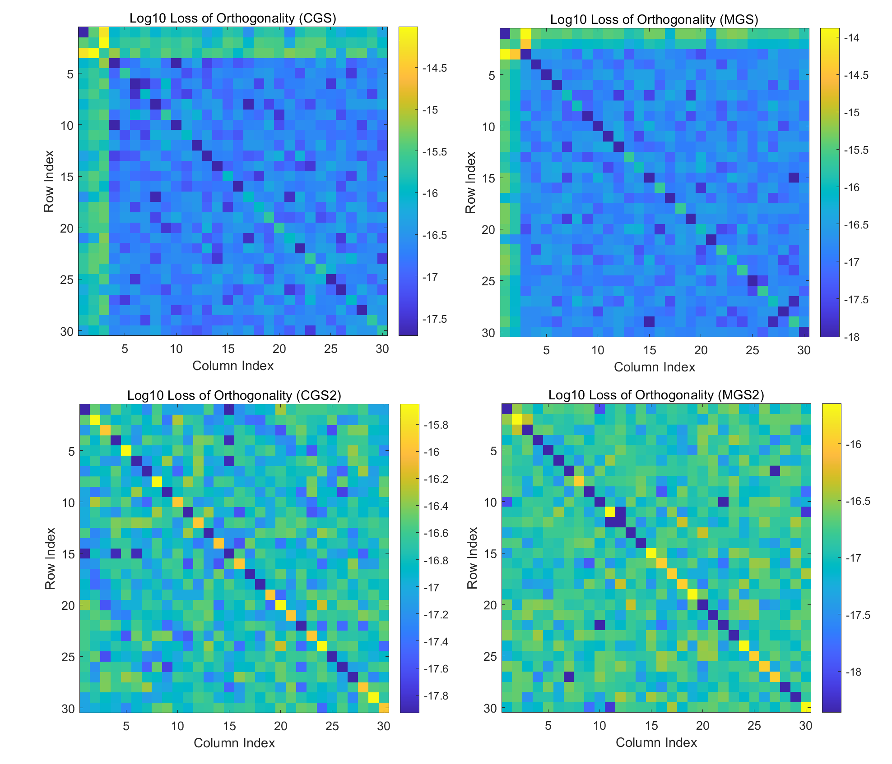
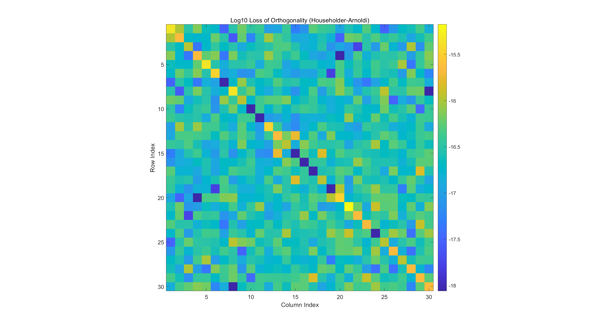
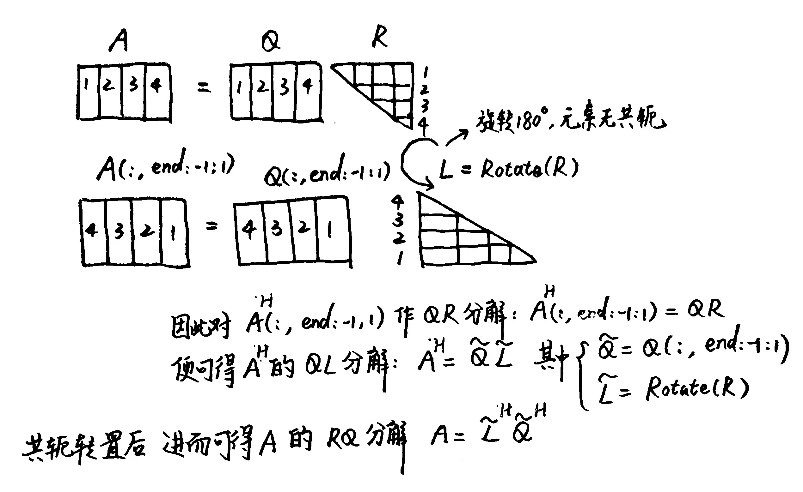
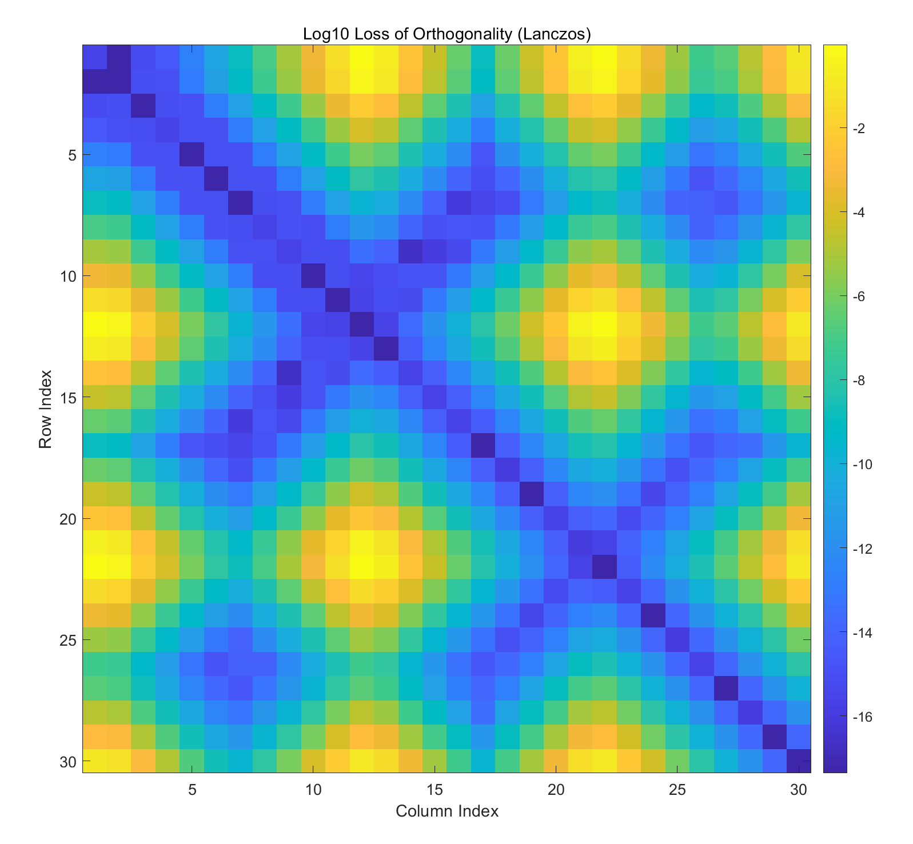

# 数值算法 Homework 06

Due: Oct. 29, 2024  
姓名: 雍崔扬   
学号: 21307140051

## Problem 01

Suppose that a tall-skinny matrix $A\in \mathbb R^{m\times n}$ is upper bidiagonal (i.e., $a_{ij}\neq 0$ if and only if $i-j\in \{-1,0\}$)   
Design an algorithm based on Givens rotations to solve the ridge regression problem $\min \|Ax-b\|_2^2 + \lambda \|x\|_2^2$  
where $\lambda$ is a given positive number.

- **观察:** 之所以设置 $A\in \mathbb R^{m\times n}$，可能是因为我们目前掌握的仅仅是实数域上的 Givens 变换.

**Solution:**    
岭回归问题，即带 $l_2$ 惩罚项的最小二乘问题，本质上是标准的最小二乘问题:  
$$
\min_x \|Ax-b\|_2^2 + \lambda \|x\|_2^2\\
\Leftrightarrow\\
\min_x 
\left\|
\begin{bmatrix}
A\\
\sqrt{\lambda} I_n
\end{bmatrix}
x
-
\begin{bmatrix}
b\\
0_n
\end{bmatrix}
\right\|_2^2\\
\Leftrightarrow\\
\min_x \|\tilde A x - \tilde b\|_2^2\\
\text{where }
\tilde A 
= 
\begin{bmatrix}
A\\
\sqrt{\lambda} I_n
\end{bmatrix} \in \mathbb R^{(m+n)\times n}
\text{ and }
\tilde b = 
\begin{bmatrix}
b\\
0_n
\end{bmatrix} \in \mathbb R^{m+n}
$$
等价问题的法方程为:  
$$
{\begin{bmatrix}
A\\
\sqrt{\lambda} I_n
\end{bmatrix}^H
\begin{bmatrix}
A\\
\sqrt{\lambda} I_n
\end{bmatrix} x =
\begin{bmatrix}
A\\
\sqrt{\lambda} I_n
\end{bmatrix}^H 
\begin{bmatrix}
b\\
0_n
\end{bmatrix}}\\
\Leftrightarrow\\
(A^HA + \lambda I_n) x = A^Hb
$$
因此岭回归解 $x_{\text{Ridge}}:= (A^HA + \lambda I_n)^{-1} A^Hb$ 

### Algorithm 1

考虑到 $\tilde A$ 的特殊结构，我们可以很方便地通过 Givens 变换得到其 $\text{QR}$ 分解.   
为直观地展示这一事实，我们考虑 $\begin{cases}
m=4\\
n=3
\end{cases}$ 的例子:
$$
\tilde A 
= 
\begin{bmatrix}
A\\
\sqrt{\lambda} I_n
\end{bmatrix} 
=
\begin{bmatrix}
* & * & \\
& * & * \\
& & *\\
0& 0& 0\\
\hline
* & &\\
& * & \\
& & *
\end{bmatrix}\\
\Rightarrow 
G_{1,5} \tilde A = 
\begin{bmatrix}
* & * & \\
& * & * \\
& & *\\
0& 0& 0\\
\hline
0 & * &\\
& * & \\
& & *
\end{bmatrix}
\Rightarrow
G_{2,6}G_{2,5}(G_{1,5}\tilde A) = 
\begin{bmatrix}
* & * & \\
& * & * \\
& & *\\
0& 0& 0\\
\hline
0 & 0 & *\\
& 0 & *\\
& & *
\end{bmatrix}
\Rightarrow
G_{3,7}G_{3,6}G_{3,5}(G_{2,6}G_{2,5}G_{1,5}\tilde A)
=
\begin{bmatrix}
* & * & \\
& * & * \\
& & *\\
0& 0& 0\\
\hline
0 & 0& 0\\
& 0 & 0\\
& & 0
\end{bmatrix}
$$
这样我们就得到 $\tilde A$ 的 $\text{QR}$ 分解为:  
$$
\tilde A = \tilde Q \tilde R\text{ where }
\begin{cases}
\tilde R = G_{3,7}G_{3,6}G_{3,5}(G_{2,6}G_{2,5}G_{1,5}\tilde A) \in \mathbb R^{(m+n)\times n} \\
\tilde Q = G_{1,5}^T G_{2,5}^T G_{2,6}^TG_{3,5}^T G_{3,6}^T G_{3,7}^T \in \mathbb R^{(m+n)\times (m+n)}
\end{cases}
$$
我们取 $\begin{cases}
Q=\tilde Q(1:m+n, 1:n)\in \mathbb R^{(m+n)\times n}\\
R=\tilde R(1:n,1:n)\in \mathbb R^{n\times n}\end{cases}$  便得到 $\tilde A$ 的精简 $\text{QR}$ 分解.  
使用回代法求解上三角方程组 $Rx=Q^T\tilde b$ 即可得到 $\min_x \|\tilde A x - \tilde b\|_2^2$ 问题的解.

#### (1) Helper Functions

生成尺寸为 $m\times n\ (m\geq n)$ 的上双对角矩阵 $A$ 的函数:

```matlab
function A = Upper_Bidiagonal(m, n)
    % Generates an upper bidiagonal matrix of size m x n
    % where m >= n. The main diagonal and the upper diagonal 
    % contain random elements, and the remaining elements are zeros.
    %
    % Inputs:
    %   m - number of rows
    %   n - number of columns
    %
    % Output:
    %   A - resulting m x n upper bidiagonal matrix

    % Check if m is greater than or equal to n
    if m < n
        error('m must be greater than or equal to n');
    end
    
    % Construct the upper bidiagonal matrix
    A = diag(rand(n, 1)) + diag(rand(n-1, 1), 1);

    % Add rows of zeros to make it m x n
    A = [A; zeros(m - n, n)];
end
```

Givens 变换的算法为:    
$$
\begin{align}
&\text{function: }[c,s] = \text{Givens}(a,b)\\
&\qquad \text{if }b=0\\
&\qquad\qquad c=1;\ s=0\\
&\qquad \text{else}\\
&\qquad\qquad \text{if } |b| > |a|\\
&\qquad\qquad\qquad t = \frac{a}{b};\ \ s= \frac{1}{\sqrt{1+ t^2}};\ \ c=st\\
&\qquad\qquad \text{else}\\
&\qquad\qquad\qquad t = \frac{b}{a};\ \ c= \frac{1}{\sqrt{1+ t^2}};\ \ s=ct\\
&\qquad\qquad \text{end}\\
&\qquad \text{end}
\end{align}
$$

其 Matlab 代码如下:  

```matlab
function [c, s] = Givens(a, b)
    % Givens 旋转，计算 cos 和 sin
    if b == 0
        c = 1;
        s = 0;
    else
        if abs(b) > abs(a)
            t = a / b;
            s = 1 / sqrt(1 + t^2);
            c = s * t;
        else
            t = b / a;
            c = 1 / sqrt(1 + t^2);
            s = c * t;
        end
    end
end
```

回代法的 Matlab 代码如下:

```matlab
function x = Backward_Sweep(U, y)
    % 回代法求解 Ux = y
    n = length(y);
    for i = n:-1:2
        y(i) = y(i) / U(i, i);  % 对角线归一化
        y(1:i-1) = y(1:i-1) - y(i) * U(1:i-1, i);  % 消去
    end
    y(1) = y(1) / U(1, 1);  % 处理第一行
    x = y;  % 返回结果
end
```

#### (2) 核心算法

生成增广矩阵 $\tilde A 
= 
\begin{bmatrix}
A\\
\sqrt{\lambda} I_n
\end{bmatrix}$ 并使用 Givens 变换计算其精简 $\text{QR}$ 分解的函数 `Augmented_System_Fast_QR`:
$$
\begin{align}
&A\in \mathbb R^{m\times n} \text{ is an upper bidiagonal matrix where }m\geq n,\ \lambda\in \mathbb R\text{ is a positive number}\\
\hline
&\text{function: }[Q,R] = \text{Augmented\_System\_Fast\_QR}(A,\lambda)\\
&\qquad \tilde A = 
\begin{bmatrix}
A\\
\sqrt{\lambda} I_n
\end{bmatrix}\\
&\qquad \tilde Q= I_n\\
\hline
&\qquad \text{for }j=1:n-1\\
&\qquad \qquad \text{for }i = 1 : j\\
&\qquad \qquad \qquad [c,s] = \text{Givens}(\tilde A(j,j), \tilde A(m+i,j))\\
&\qquad \qquad \qquad \tilde A([j,m+i],j:j+1) = \begin{bmatrix} c & s\\ -s & c\end{bmatrix} \tilde A([j,m+i],j:j+1)\\
&\qquad \qquad \qquad \tilde Q(1:m+n,[j,m+i]) = \tilde Q (1:m+n,[j,m+i]) \begin{bmatrix} c & s\\ -s & c\end{bmatrix}^T\\
&\qquad\qquad \text{end}\\
&\qquad \text{end}\\
\hline
&\qquad \text{for }i=1:n\ (\text{Handling the case of }j=n)\\
&\qquad \qquad  [c,s] = \text{Givens}(\tilde A(n,n), \tilde A(m+i,n))\\
&\qquad \qquad  \tilde A([n,m+i],n) = \begin{bmatrix} c & s\\ -s & c\end{bmatrix} \tilde A([n,m+i],n)\\
&\qquad \qquad  \tilde Q(1:m+n,[n,m+i]) = \tilde Q (1:m+n,[n,m+i]) \begin{bmatrix} c & s\\ -s & c\end{bmatrix}^T\\
&\qquad \text{end}\\
\hline
&\qquad Q = \tilde Q(1:m+n,1:n)\\
&\qquad R = \tilde A (1:n,1:n)\\
&\text{end}
\end{align}
$$
其 Matlab 代码为:

```matlab
function [Q, R] = Augmented_System_Fast_QR(A, lambda)
    % Augmented_System_Fast_QR performs QR decomposition using Givens rotations.
    %
    % Inputs:
    %   A     - An upper bidiagonal matrix of size m x n (m >= n).
    %   lambda - A positive scalar value.
    %
    % Outputs:
    %   Q - Orthogonal matrix of size (m+n) x n resulting from the QR decomposition.
    %   R - Upper triangular matrix of size n x n.

    [m, n] = size(A); % Get dimensions of matrix A

    % Check if m is greater than or equal to n
    if m < n
        error('Matrix A must have m >= n.');
    end

    % Construct the augmented matrix
    % \tilde{A} = [A; sqrt(lambda) * I_n]
    I_n = eye(n); % Identity matrix of size n
    A_tilde = [A; sqrt(lambda) * I_n]; % Augmented matrix

    % Initialize \tilde{Q} as the identity matrix of size (m + n) x (m + n)
    Q_tilde = eye(m + n);

    % Perform Givens rotations for j = 1 to n-1
    for j = 1:n-1
        for i = 1:j
            % Compute Givens rotation parameters
            [c, s] = Givens(A_tilde(j, j), A_tilde(m + i, j));
            
            % Apply the Givens rotation to the augmented matrix
            A_tilde([j, m + i], j:j + 1) = [c, s; -s, c] * A_tilde([j, m + i], j:j + 1);
            
            % Apply the Givens rotation to the orthogonal matrix \tilde{Q}
            Q_tilde(1:m + n, [j, m + i]) = Q_tilde(1:m + n, [j, m + i]) * [c, s; -s, c]';
        end
    end

    % Handle the case for j = n
    for i = 1:n
        % Compute Givens rotation parameters
        [c, s] = Givens(A_tilde(n, n), A_tilde(m + i, n));
        
        % Apply the Givens rotation to the augmented matrix
        A_tilde([n, m + i], n) = [c, s; -s, c] * A_tilde([n, m + i], n);
        
        % Apply the Givens rotation to the orthogonal matrix \tilde{Q}
        Q_tilde(1:m + n, [n, m + i]) = Q_tilde(1:m + n, [n, m + i]) * [c, s; -s, c]';
    end

    % Extract Q from \tilde{Q}
    Q = Q_tilde(1:m + n, 1:n);
    
    % Extract R from the upper triangular portion of \tilde{A}
    R = A_tilde(1:n, 1:n);
end
```

**计算岭回归解的函数 `Solve_Upper_Bidiagonal_Ridge_Regression`:**

```matlab
function x = Solve_Upper_Bidiagonal_Ridge_Regression(A, b, lambda)
    % Solve_Upper_Bidiagonal_Ridge_Regression solves the ridge regression problem
    % for an upper bidiagonal matrix A using QR decomposition.
    %
    % Inputs:
    %   A     - An upper bidiagonal matrix of size m x n (m >= n).
    %   b     - A column vector of size m x 1 representing the dependent variable.
    %   lambda - A positive scalar for regularization.
    %
    % Outputs:
    %   x     - The estimated coefficients for the ridge regression.

    [m, n] = size(A); % Get dimensions of matrix A

    % Check if m is greater than or equal to n
    if m < n
        error('Matrix A must have m >= n.'); % Ensure the matrix A has more rows than columns
    end
    
    % Augment the response vector b with zeros to match the size of A
    b_tilde = [b; zeros(n, 1)];

    % Perform reduced QR decomposition using the Augmented System approach
    [Q, R] = Augmented_System_Fast_QR(A, lambda);

    % Solve the upper triangular system using backward substitution
    x = Backward_Sweep(R, Q' * b_tilde); % Calculate the coefficients

end
```

#### (3) 运行结果

我们将 $x_{\text{Ridge}} = (A^TA+\lambda I_n)^{-1}A^Tb$ 作为精确解，  
与 `Solve_Upper_Bidiagonal_Ridge_Regression` 得到的计算解进行对比.  
函数调用如下:

```matlab
rng(51); 
m = 1000;
n = 500;
lambda = 1;     % Regularization parameter for ridge regression

% Generate an upper bidiagonal matrix A of size m x n
A = Upper_Bidiagonal(m, n);

% Generate random dependent variable vector b of size m x 1
b = rand(m, 1);

% Solve ridge regression using the custom function
x = Solve_Upper_Bidiagonal_Ridge_Regression(A, b, lambda);

% Calculate the exact solution for comparison (using explicit inversion)
x_exact = (A' * A + lambda * eye(n, n)) \ (A' * b);

% Display the norm of the difference between x and x_exact (Frobenius norm)
disp("计算解与精确解之差的 Frobenius 范数:")
disp(norm(x - x_exact, "fro"));
```

运行结果:

```bash
计算解与精确解之差的 Frobenius 范数:
   2.3420e-14
```

将 `lambda` 的值从 `1` 改到 `0.1`，再次运行得到:

```bash
计算解与精确解之差的 Frobenius 范数:
   3.0359e-14
```

这验证了上述算法的正确性.

### 对比: Algorithm 2

回忆起等价问题的法方程为:  
$$
(A^TA + \lambda I_n) x = A^Tb
$$
注意到 $A$ 作为一个实上双对角矩阵，能够保证 $A^TA+\lambda I_n$ 是一个对称正定三对角阵.  
我们可以利用 Givens 变换方便地得到 $A^TA+\lambda I_n$ 的 $\text{QR}$ 分解.

为直观地展示这一事实，我们考虑 $\begin{cases}
m\geq n\\
n=4
\end{cases}$ 的例子: 
$$
A^TA+\lambda I_n = 
\begin{bmatrix}
* & * \\
* & * & * \\
& * & * & * \\
& & * & *
\end{bmatrix}\\
G_{1,2}(A^TA+\lambda I_n) =
\begin{bmatrix}
* & * & *\\
0 & * & * \\
& * & * & * \\
& & * & *
\end{bmatrix}\\
G_{2,3}[G_{1,2}(A^TA+\lambda I_n)] =
\begin{bmatrix}
* & * & *\\
0 & * & * & *\\
& 0 & * & * \\
& & * & *
\end{bmatrix}\\
G_{3,4}[G_{2,3}G_{1,2}(A^TA+\lambda I_n)] =
\begin{bmatrix}
* & * & *\\
0 & * & * & * \\
& 0 & * & * \\
& & 0 & *
\end{bmatrix}\\
\hline
A^TA+\lambda I_n = QR\text{ where }\begin{cases}
R = G_{3,4}[G_{2,3}G_{1,2}(A^TA+\lambda I_n)]\\
Q = G_{1,2}^T G_{2,3}^T G_{3,4}^T 
\end{cases}
$$

#### (1) 核心算法

求解法方程系数矩阵 $A^TA+\lambda I_n$ 的 $\text{QR}$ 分解的函数 `Normal_Equation_Fast_QR`:

```matlab
function [Q, R] = Normal_Equation_Fast_QR(A, lambda)
    % Normal_Equation_Fast_QR performs QR decomposition on the normal equation 
    % matrix of a linearly constrained least squares problem using Givens rotations.
    %
    % Inputs:
    %   A      - An upper bidiagonal matrix of size m x n, where m >= n.
    %   lambda - A positive scalar regularization parameter for ridge regression.
    %
    % Outputs:
    %   Q - An orthogonal matrix of size n x n resulting from the QR decomposition.
    %   R - An upper triangular matrix of size n x n, representing the R factor
    %       in the QR decomposition of the regularized normal equation matrix.
    
    % Get the dimensions of matrix A
    [~, n] = size(A);
    
    % Construct the regularized normal equation matrix for ridge regression
    % R starts as (A' * A + lambda * I), where I is the n x n identity matrix
    R = A' * A + lambda * eye(n);
    
    % Initialize Q as the identity matrix of size n x n
    Q = eye(n);
    
    % Apply Givens rotations to create an upper triangular matrix R
    % Iterate over each column up to n-1 to zero out sub-diagonal elements
    for j = 1:n-1
        % Compute the Givens rotation parameters (c, s) to zero out R(j+1, j)
        [c, s] = Givens(R(j, j), R(j+1, j));
        
        % Apply the Givens rotation to the submatrix R(j:j+1, j:j+1)
        % This operation zeros out the (j+1, j) entry of R
        R(j:j+1, j:j+1) = [c, s; -s, c] * R(j:j+1, j:j+1);
        
        % Update Q with the transpose of the Givens rotation to maintain orthogonality
        Q(1:n, j:j+1) = Q(1:n, j:j+1) * [c, s; -s, c]';
    end
end
```

**计算岭回归解的函数 `Solve_Upper_Bidiagonal_Ridge_Regression`:**

```matlab
function x = Solve_Upper_Bidiagonal_Ridge_Regression(A, b, lambda)
    % Solve_Upper_Bidiagonal_Ridge_Regression solves the ridge regression problem
    % for an upper bidiagonal matrix A using QR decomposition.
    %
    % Inputs:
    %   A     - An upper bidiagonal matrix of size m x n (m >= n).
    %   b     - A column vector of size m x 1 representing the dependent variable.
    %   lambda - A positive scalar for regularization.
    %
    % Outputs:
    %   x     - The estimated coefficients for the ridge regression.

    [m, n] = size(A); % Get dimensions of matrix A

    % Check if m is greater than or equal to n
    if m < n
        error('Matrix A must have m >= n.'); % Ensure the matrix A has more rows than columns
    end

    % Perform reduced QR decomposition using the Augmented System approach
    [Q, R] = Normal_Equation_Fast_QR(A, lambda);

    % Solve the upper triangular system using backward substitution
    x = Backward_Sweep(R, Q' * (A' * b)); % Calculate the coefficients

end
```

#### (2) 运行结果

我们将 $x_{\text{Ridge}} = (A^TA+\lambda I_n)^{-1}A^Tb$ 作为精确解，  
与 `Solve_Upper_Bidiagonal_Ridge_Regression` 得到的计算解进行对比.    
函数调用:

```matlab
rng(51); 
m = 1000;
n = 500;
lambda = 1;     % Regularization parameter for ridge regression

% Generate an upper bidiagonal matrix A of size m x n
A = Upper_Bidiagonal(m, n);

% Generate random dependent variable vector b of size m x 1
b = rand(m, 1);

% Solve ridge regression using the custom function
x = Solve_Upper_Bidiagonal_Ridge_Regression(A, b, lambda);

% Calculate the exact solution for comparison (using explicit inversion)
x_exact = (A' * A + lambda * eye(n, n)) \ (A' * b);

% Display the norm of the difference between x and x_exact (Frobenius norm)
disp("计算解与精确解之差的 Frobenius 范数:")
disp(norm(x - x_exact, "fro"));
```

运行结果:

```bash
计算解与精确解之差的 Frobenius 范数:
    0.1680
```

将 `lambda` 的值从 `1` 改到 `0.1`，再次运行得到:

```bash
计算解与精确解之差的 Frobenius 范数:
   45.5396
```

这说明算法 $2$ 的数值稳定性较差，即法方程不适合直接进行数值求解.


## Problem 02 (第一个算法有误)

Consider the linearly constrained least squares problem $\min\{\|Ax-b\|_2^2 : Cx=d\}$  
In the lecture we use the $\text{QR}$ factorization of $C^H$ to eliminate the linear constraint $Cx = d$   
and reduce the problem to a standard least squares one.   
Design an algorithm based on Gaussian elimination to eliminate the linear constraint.

**Solution:**    
考虑线性等式约束的最小二乘问题:  
$$
\min_{Cx=d} \|Ax-b\|_2^2\text{ where }\begin{cases}
A\in \mathbb C^{m\times n}\text{ and }\rank(A) = n \leq m\\
b \in \mathbb C^m\\
C \in \mathbb C^{p\times n}\text{ and }\rank(C) = p<n\\
d \in \mathbb C^p
\end{cases}
$$
设根据 Gauss 消元法得到 $C\in \mathbb C^{p\times n}$ 的 $\text{LU}$ 分解为:  
$$
C=LU\text{ where }\begin{cases}
L \in \mathbb C^{p\times p}\\
U = [U_1, U_2]\in \mathbb C^{p\times n}\\
U_1 \in \mathbb C^{p\times p}\text{ is a upper triangular matrix}\\
U_2 \in \mathbb C^{p\times(n-p)}
\end{cases}
$$
对应地将 $A,x$ 分块为:  
$$
\begin{cases}
A=[A_1,A_2]\in \mathbb C^{m\times n}\\
x = \begin{bmatrix}
x_1\\
x_2
\end{bmatrix} \in \mathbb C^n
\end{cases} 
\text{ where }
\begin{cases}
A_1 \in \mathbb C^{m\times p}\\
A_2 \in \mathbb C^{m\times (n-p)}\\
x_1 \in \mathbb C^{p}\\
x_2 \in \mathbb C^{n-p}
\end{cases}
$$
则我们有:  
$$
Cx = LUx = L[U_1,U_2] 
\begin{bmatrix}
x_1\\
x_2
\end{bmatrix}
=
L(U_1 x_1 + U_2 x_2) = d\\
\Leftrightarrow\\
x_1 = U_1^{-1}(L^{-1}d - U_2 x_2)
$$
于是我们有:  
$$
\begin{align}
\min_{Cx=d} \|Ax-b\|_2^2 
&\Leftrightarrow \min_{Cx=d} \left\|[A_1,A_2]\begin{bmatrix} x_1\\ x_2 \end{bmatrix} - b\right\|_2^2\\
&\Leftrightarrow \min_{Cx=d} \|A_1x_1 + A_2x_2 - b\|_2^2\\
&\Leftrightarrow \min_{x_2\in \mathbb R^{n-p}} \|A_1 U_1^{-1}(L^{-1}d - U_2 x_2) + A_2 x_2 - b\|_2^2\\
&\Leftrightarrow \min_{x_2\in \mathbb R^{n-p}} \|(A_2 - A_1 U_1^{-1}U_2 )x_2 - (b - A_1 U_1^{-1}L^{-1}d)\|_2^2\\
&\Leftrightarrow \min_{x_2\in \mathbb R^{n-p}}  \|\tilde A x_2 - \tilde b\|_2^2\\
&\text{where }
\begin{cases}
\tilde A = A_2 - A_1 U_1^{-1}U_2 \in \mathbb C^{m\times (n-p)}\\
\tilde b = b - A_1 U_1^{-1}L^{-1}d \in \mathbb C^{m}
\end{cases}
\end{align}
$$

### (1) Helper Functions

生成线性等式约束的最小二乘问题的函数:

```matlab
function [A, b, C, d] = Linearly_Constrained_Least_Squares(n, m, p)
    % Linearly_Constrained_Least_Squares creates a constrained least squares problem.
    %
    % Inputs:
    %   n - Number of variables (size of x).
    %   m - Number of observations (size of b).
    %   p - Number of constraints (size of d).
    %
    % Outputs:
    %   A - A full-rank matrix of size m x n.
    %   b - A vector of size m x 1.
    %   C - A rank-deficient matrix of size p x n.
    %   d - A vector of size p x 1.
    
    % Check input constraints
    if n > m
        error('Condition n <= m is violated: n must be less than or equal to m.');
    end
    if p >= n
        error('Condition p < n is violated: p must be less than n.');
    end
    
    % Generate a random full-rank matrix A (m x n)
    A = rand(m, n) + 1i * rand(m, n); % Adding complex components
    A = A * rand(n, n); % Ensure full rank by multiplying with a full-rank matrix
    
    % Check the rank of A
    if rank(A) ~= n
        error('Rank of A must be n.');
    end
    
    % Generate a random vector b (m x 1)
    b = rand(m, 1) + 1i * rand(m, 1); % Complex vector

    % Generate a random rank-deficient matrix C (p x n)
    % We can ensure C has rank p < n by making the last (n - p) columns zero
    C_temp = rand(p, p) + 1i * rand(p, p); % Create a random full-rank matrix
    C = [C_temp, zeros(p, n - p)]; % Append zero columns to make it p x n

    % Check the rank of C
    if rank(C) ~= p
        error('Rank of C must be p.');
    end
    
    % Generate a random vector d (p x 1)
    d = rand(p, 1) + 1i * rand(p, 1); % Complex vector
end
```

**长方矩阵的 Gauss 消去法:**  
$$
\begin{align}
&\text{function: }A = \text{Gaussian\_Elimination}(A)\\
&\qquad [m,n]=\text{size}(A)\\
&\qquad \text{for }k=1:\min \{m-1,n-1\}\\
&\qquad\qquad A(k+1:m , k) \leftarrow A(k+1:m,k) / A(k,k)\\
&\qquad\qquad A(k+1:m , k+1 : n) \leftarrow A(k+1:m,k+1:n) - A(k+1:m,k) A(k,k+1:n)\\
&\qquad\text{end}\\
&\text{end}
\end{align}
$$
长方矩阵 Gauss 消去法的 Matlab 代码如下:  

```matlab
function A = Gaussian_Elimination(A)
    % Gaussian_Elimination performs Gaussian elimination on matrix A
    %
    % Inputs:
    %   A - An m x n matrix to be transformed into an upper triangular form.
    %
    % Outputs:
    %   A - The matrix after Gaussian elimination, with zeros below the main diagonal.

    % Get dimensions of A
    [m, n] = size(A);

    % Perform Gaussian elimination
    for k = 1:min(m-1, n-1)
        % Scale the column below the diagonal in the k-th column
        A(k+1:m, k) = A(k+1:m, k) / A(k, k);
        
        % Update the submatrix to eliminate entries in the k-th column
        A(k+1:m, k+1:n) = A(k+1:m, k+1:n) - A(k+1:m, k) * A(k, k+1:n);
    end
end
```

前代法:

```matlab
function y = Forward_Sweep(L, b)
    % 前代法求解 Ly = b
    n = length(b);
    for i = 1:n-1
        b(i) = b(i) / L(i, i);  % 对角线归一化
        b(i+1:n) = b(i+1:n) - b(i) * L(i+1:n, i);  % 消去
    end
    b(n) = b(n) / L(n, n);  % 处理最后一行
    y = b;  % 返回结果
end
```

回代法:

```matlab
function X = Backward_Sweep(U, Y)
    % 回代法求解 UX = Y
    [n, ~] = size(Y);
    for i = n:-1:2
        Y(i,:) = Y(i,:) / U(i, i);  % 对角线归一化
        Y(1:i-1,:) = Y(1:i-1,:) - U(1:i-1, i) * Y(i,:);  % 消去
    end
    Y(1,:) = Y(1,:) / U(1, 1);  % 处理第一行
    X = Y;  % 返回结果
end
```

****

以下是基于复数域上的 Householder $\text{QR}$ 分解的求解最小二乘问题的函数:    
复数域上的 Householder 变换的计算算法已在 Homework 4 Problem 2 中给出:

```matlab
function [v, beta] = Complex_Householder(x)
    % This function computes the Householder vector 'v' and scalar 'beta' for
    % a given complex vector 'x'. This transformation is used to create zeros
    % below the first element of 'x' by reflecting 'x' along a specific direction.
    
    n = length(x);
    x = x / norm(x, inf); % Normalize x by its infinity norm to avoid numerical issues

    % Copy all elements of 'x' except the first into 'v'
    v = zeros(n, 1);
    v(2:n) = x(2:n); 
    
    % Compute sigma as the squared 2-norm of the elements of x starting from the second element
    sigma = norm(x(2:n), 2)^2;
    
    % Check if sigma is near zero, which would mean 'x' is already close to a scalar multiple of e_1
    if sigma < 1e-10
        beta = 0; % If sigma is close to zero, set beta to zero (no transformation needed)
    else
        % Determine gamma to account for the argument of complex number x(1)
        if abs(x(1)) < 1e-10
            gamma = 1; % If x(1) is close to zero, set gamma to 1
        else
            gamma = x(1) / abs(x(1)); % Otherwise, set gamma to x(1) divided by its magnitude
        end
        
        % Compute alpha as the Euclidean norm of x, including x(1) and sigma
        alpha = sqrt(abs(x(1))^2 + sigma);
        
        % Compute the first element of 'v' to avoid numerical cancellation
        v(1) = -gamma * sigma / (abs(x(1)) + alpha);
        
        % Calculate 'beta', the scaling factor of the Householder transformation
        beta = 2 * abs(v(1))^2 / (abs(v(1))^2 + sigma);
        
        % Normalize the vector 'v' by v(1) to ensure that the first element is 1,
        % allowing for simplified storage and computation of the transformation
        v = v / v(1);
    end
end
```

复数域上的 Householder $\text{QR}$ 算法已在 Homework 4 Problem 3 中给出:

```matlab
function [Q, R] = Complex_Householder_QR(A)
    [m, n] = size(A);
    Q = eye(m); % Initialize Q as the identity matrix
    R = A; % Initialize R as A

    for k = 1:min(m-1, n)
        [v, beta] = Complex_Householder(R(k:m, k)); % Apply Complex Householder

        % Update R
        R(k:m, k:n) = R(k:m, k:n) - (beta * v) * (v' * R(k:m, k:n));

        % Update Q
        Q(1:m, k:m) = Q(1:m, k:m) - (Q(1:m, k:m) * v) * (beta * v');
    end
end
```

计算得到 $A\in \mathbb C^{m\times n}$ 的 $\text{QR}$ 分解 $A=QR$ 之后 (其中 $Q\in \mathbb C^{m\times m}$ 为酉矩阵，$R\in \mathbb C^{m\times n}$ 的上 $n\times n$ 分块 $R_1$ 为上三角阵)  
求解法方程 $A^HAx = R^HRx =  A^Hb$ 就等价于求解 $\begin{cases}
R^Hy = A^Hb\\
Rx = y\end{cases}$ (分别由前代法和回代法求解)  
或者也可考虑精简 $\text{QR}$ 分解 $A=Q_1R_1$ (其中 $Q_1\in \mathbb C^{m\times n}$ 由 $Q$ 的前 $n$ 列构成)  
则求解法方程 $A^HAx = R_1^HR_1x =  R^H_1Q^H_1b=A^Hb$ 就等价于求解 $R_1x = Q_1^Hb$ (由回代法求解) 

```matlab
function x = Householder_Solution(A, b)
    [m, n] = size(A);

    % Step 1: Compute the QR decomposition of A using Householder reflections
    [Q, R] = Complex_Householder_QR(A);

    % Step 2: Solve the system Rx = Q' * b using backward substitution
    x = Backward_Sweep(R(1:n, 1:n), Q(1:m, 1:n)' * b);
end
```

### (2) 核心算法

基于 Gauss 消去法的解法:

- ① 计算 $C\in \mathbb C^{p\times n}\ (p<n)$ 的 $\text{LU}$​ 分解 $C=LU\text{ where }\begin{cases}
  L \in \mathbb C^{p\times p}\\
  U = [U_1, U_2]\in \mathbb C^{p\times n}\\
  U_1 \in \mathbb C^{p\times p}\text{ is a upper triangular matrix}\\
  U_2 \in \mathbb C^{p\times(n-p)}
  \end{cases}$
- ② 计算 $\begin{cases}
  \tilde A = A_2 - A_1 U_1^{-1}U_2 \in \mathbb C^{m\times (n-p)}\\
  \tilde b = b - A_1 U_1^{-1}L^{-1}d \in \mathbb C^{m}
  \end{cases}$ 
- ③ 计算 $x_2 = \text{Householder\_Solution}(\tilde A ,\tilde b)$   
  (这里通过调用 Homework 5 Problem 6 的 `Householder_Solution` 函数得到消元后的最小二乘问题的解)
- ④ 计算 $x_1 = U_1^{-1}(L^{-1}d - U_2 x_2)$，得到 $x_{\text{Gauss}} = \begin{bmatrix}
  x_1\\
  x_2\end{bmatrix}$

```matlab
function [x_Gauss, b_tilde, A_tilde] = Gaussian_Method(A, b, C, d)
    % Gaussian_Method eliminates constrained variables in a linearly constrained
    % least squares problem using Gaussian elimination.
    %
    % Inputs:
    %   A - The original matrix of size m x n, representing the coefficients of the least squares problem.
    %   b - The original vector of size m x 1, representing the observed values.
    %   C - The constraint matrix of size p x n, representing the constraints on the variables.
    %   d - The constraint vector of size p x 1, representing the values of the constraints.
    %
    % Outputs:
    %   x_Gauss - The solution vector after eliminating variables.
    %   b_tilde - The modified vector after eliminating constrained variables.
    %   A_tilde - The modified matrix after eliminating constrained variables.

    % Get dimensions of A and C
    [m, n] = size(A); % m: number of observations, n: number of variables
    [p, ~] = size(C); % p: number of constraints

    % Step 1: Perform Gaussian elimination on C
    C = Gaussian_Elimination(C); % Transform C into an upper triangular matrix

    % Step 2: Extract L and U from the Gaussian elimination of C
    L = eye(p) + tril(C(1:p, 1:p), -1); % Construct the lower triangular matrix L with elimination factors
    U = triu(C(1:p, 1:n));              % Extract the upper triangular matrix U

    % Step 3: Compute the modified vector b_tilde based on the elimination
    % d_tilde = U(1:p, 1:p) \ (L \ d);
    d_tilde = Forward_Sweep(L, d);
    d_tilde = Backward_Sweep(U(1:p, 1:p), d_tilde);
    b_tilde = b - A(1:m, 1:p) * d_tilde; % Adjust b by removing the effect of the constraints

    % Step 4: Compute the modified matrix A_tilde to reflect the elimination
    % U_tilde = U(1:p, 1:p) \ U(1:p, p+1:n);
    U_tilde = Backward_Sweep(U(1:p, 1:p), U(1:p, p+1:n));
    A_tilde = A(1:m, p+1:n) - A(1:m, 1:p) * U_tilde; % Adjust A to eliminate variables according to constraints

    % Step 5: Solve for x2 using the modified A_tilde and b_tilde
    x2 = Householder_Solution(A_tilde, b_tilde); % Solve the least squares problem for the remaining variables

    % Step 6: Compute x1 from d_tilde and U_tilde
    x1 = d_tilde - U_tilde * x2; % Calculate x1 based on the relationship with x2

    % Combine x1 and x2 into the final solution vector
    x_Gauss = [x1; x2]; % Concatenate x1 and x2 to form the complete solution vector
end
```

### (3) 对比: Lagrange 乘子法

考虑线性等式约束的最小二乘问题:
$$
\min_{Cx=d} \|Ax-b\|_2^2\text{ where }\begin{cases}
A\in \mathbb C^{m\times n}\text{ and }\rank(A) = n \leq m\\
b \in \mathbb C^m\\
C \in \mathbb C^{p\times n}\text{ and }\rank(C) = p<n\\
d \in \mathbb C^p
\end{cases}
$$
注意到目标函数 $f(x)=\|Ax-b\|_2^2$ 是关于 $x$ 的凸函数，而问题只有线性等式约束 $Cx=d$   
因此这是一个标准形式的凸优化问题，其最优解即为 KKT 点.  

定义其 Lagrange 函数 $L(x,\lambda)$ 为:  
$$
\begin{align}
L(x,\lambda)
&=
f(x) - \lambda^H(Cx - d)\\
&=
\|Ax-b\|_2^2 - \lambda^H(Cx - d)\\
\hline
\text{dom} \{L\} &= \mathbb C^{n}\times \mathbb C^p
\end{align}
$$
 Lagrange 函数 $L(x,\lambda)$ 关于 $x$ 的梯度为:  
$$
\begin{align}
\nabla_x L(x, \lambda)
&=
\nabla_x \{\|Ax-b\|_2^2 - \lambda^H(C\beta - h)\}\\
&=
-A^H\cdot 2(b-Ax) - (\lambda^HC)^H\\
&=
-2A^Hb + 2A^HAx - C^H\lambda
\end{align}
$$
KKT 条件为:  
$$
\begin{cases}
\nabla_x L(x,\lambda) = -2A^Hb + 2A^HAx - C^H\lambda = 0_{n} & ①\\
Cx = d & ②
\end{cases}
$$
① 式左乘 $(A^HA)^{-1}$ 可得 $-2(A^HA)^{-1}A^Hb + 2x - (A^HA)^{-1}C^H\lambda = 0_n$   
于是有 $x = (A^HA)^{-1}A^Hb + \frac12 (A^HA)^{-1}C^H\lambda$   
代入 ② 式即得 $Cx = C(A^HA)^{-1}A^Hb + \frac12 C(A^HA)^{-1}C^H\lambda = d$   
解得 $\lambda_{\text{KKT}} = 2[C(A^HA)^{-1}C^H]^{-1}[d-C(A^HA)^{-1}A^Hb]$   
因此我们有:
$$
\begin{align}
x_{\text{Lagrange}}
&= x_{\text{KKT}}\\
&= (A^HA)^{-1}A^Hb + \frac12 (A^HA)^{-1}C^H\lambda_{\text{KKT}}\\
&= (A^HA)^{-1}A^Hb + \frac12 (A^HA)^{-1}C^H\cdot 2[C(A^HA)^{-1}C^H]^{-1}[d-C(A^HA)^{-1}A^Hb]\\
&= x_{\text{ls}}  - (A^HA)^{-1}C^H [C(A^HA)^{-1}C^H]^{-1} (Cx_{\text{ls}}-d)
\end{align}
$$
其中 $x_{\text{ls}} := (A^HA)^{-1}A^Hb$   
我们将 $x_{\text{Lagrange}}$ 视为问题的精确解，与计算解 $x_{\text{Gauss}}$ 进行比较.

以下是基于 Lagrange 乘子法的解法:  
(简单起见，我们直接使用 Matlab 内置的 `\` 运算来求逆)

```matlab
% Function to solve the constrained least squares problem using the Lagrangian method
function x_Lagrange = Lagrangian_Method(A, b, C, d)
    % Calculate the least squares solution without constraints
    x_ls = (A' * A) \ (A' * b); % Normal equation solution for least squares

    % Intermediate calculation to prepare for the constrained adjustment
    tmp = C * ((A' * A) \ C'); % Project the constraints into the least squares space

    % Adjust the least squares solution for the constraints
    x_Lagrange = x_ls - (A' * A) \ (C' * (tmp \ (C * x_ls - d))); 
    % Apply the Lagrangian adjustment based on the constraints
end
```

### (4) 运行结果

我们通过对比基于 Gauss 消去法的解 $x_{\text{Gauss}}$ 和基于 Lagrange 乘子法的解 $x_{\text{Lagrange}}$ (视为精确解) 来检验我们结果的正确性.  
函数调用:

```matlab
rng(51);
m = 500; % Number of observations
n = 50;  % Number of variables
p = 10;  % Number of constraints

% Generate the linearly constrained least squares problem
[A, b, C, d] = Linearly_Constrained_Least_Squares(n, m, p);

% Apply Gaussian elimination method to eliminate constraints
[x_Gauss, b_tilde, A_tilde] = Gaussian_Method(A, b, C, d);

% Apply Lagrangian method to solve the same constrained problem
x_Lagrange = Lagrangian_Method(A, b, C, d);

% Display the Frobenius norm of the difference between the two solutions
disp("Gauss 消去法得到的解和精确解 (Lagrange 乘子法得到的解) 之差的 Frobenius 范数:");
disp(norm(x_Gauss - x_Lagrange, "fro"));
```

运行结果:

```matlab
Gauss 消去法得到的解和精确解 (Lagrange 乘子法得到的解) 之差的 Frobenius 范数:
   2.5071e-10
```

这验证了上述算法的正确性.


## Problem 03

The least squares problem $\min\|Ax-b\|_2^2$ is equivalent to an augmented linear system:
$$
\begin{bmatrix}
I_{m\times m} & A\\
A^H & 0_{n\times n}
\end{bmatrix} 
\begin{bmatrix}
r\\
x
\end{bmatrix} = 
\begin{bmatrix}
b\\
0_n
\end{bmatrix}
$$
which is Hermitian and indefinite.   
Similar augmented linear systems exist for the linearly constrained least squares problem $\min\{\|Ax-b\|_2^2:Cx=d\}$  
Can you figure it out?

- **TA:** 第三题增广系统可以进一步改写到不含有 $A^HA$: (也是由 **KKT 条件**导出的)
  $$
  {\begin{cases}
  \nabla_x L(x,\lambda) = -2A^Hb + 2A^HAx + C^H\lambda = 0_{n}\\
  Cx = d
  \end{cases}}\\
  
  \Rightarrow\\
  
  \begin{cases}
  r + Ax = b\\ 
  A^H r + C^H\lambda = 0_n\\
  Cx = d
  \end{cases}\\
  
  \Rightarrow\\
  
  \begin{bmatrix}
  I_{m\times m} & A & \\
  A^H & 0_{n\times n} & C^H\\
  & C & 0_{p\times p} \end{bmatrix} 
  \begin{bmatrix}
  r\\
  x\\
  \lambda
  \end{bmatrix} = 
  \begin{bmatrix}
  b\\
  0_n\\
  d
  \end{bmatrix}
  $$

**Solution:**  
考虑线性等式约束的最小二乘问题:
$$
\min_{Cx=d} \|Ax-b\|_2^2\text{ where }\begin{cases}
A\in \mathbb C^{m\times n}\text{ and }\rank(A) = n \leq m\\
b \in \mathbb C^m\\
C \in \mathbb C^{p\times n}\text{ and }\rank(C) = p<n\\
d \in \mathbb C^p
\end{cases}
$$
注意到目标函数 $f(x)=\|Ax-b\|_2^2$ 是关于 $x$ 的凸函数，而问题只有线性等式约束 $Cx=d$   
因此这是一个标准形式的凸优化问题，其最优解即为 KKT 点.  

定义其 Lagrange 函数 $L(x,\lambda)$ 为:  
$$
\begin{align}
L(x,\lambda)
&=
f(x) + \lambda^H(Cx - d)\\
&=
\|Ax-b\|_2^2 + \lambda^H(Cx - d)\\
\hline
\text{dom} \{L\} &= \mathbb C^{n}\times \mathbb C^p
\end{align}
$$
 Lagrange 函数 $L(x,\lambda)$ 关于 $x$ 的梯度为:  
$$
\begin{align}
\nabla_x L(x, \lambda)
&=
\nabla_x \{\|Ax-b\|_2^2 + \lambda^H(C\beta - h)\}\\
&=
-A^H\cdot 2(b-Ax) + (\lambda^HC)^H\\
&=
-2A^Hb + 2A^HAx + C^H\lambda
\end{align}
$$
KKT 条件为:  
$$
\begin{cases}
\nabla_x L(x,\lambda) = -2A^Hb + 2A^HAx + C^H\lambda = 0_{n} & ①\\
Cx = d & ②
\end{cases}
$$
我们便可得到**增广线性系统**:  
$$
\begin{bmatrix}
2A^HA & C^H\\
C & 0_{p\times p}
\end{bmatrix}
\begin{bmatrix}
x\\
\lambda
\end{bmatrix}
=
\begin{bmatrix}
2A^Hb\\
d
\end{bmatrix}
$$

****

更进一步，我们可以求解上述方程组:    
① 式左乘 $(A^HA)^{-1}$ 可得 $-2(A^HA)^{-1}A^Hb + 2x + (A^HA)^{-1}C^H\lambda = 0_n$   
于是有 $x = (A^HA)^{-1}A^Hb - \frac12 (A^HA)^{-1}C^H\lambda$   
代入 ② 式即得 $Cx = C(A^HA)^{-1}A^Hb - \frac12 C(A^HA)^{-1}C^H\lambda = d$   
解得 $\lambda_{\text{KKT}} = 2[C(A^HA)^{-1}C^H]^{-1}[C(A^HA)^{-1}A^Hb-d]$   
因此我们有:
$$
\begin{align}
x_{\text{Lagrange}}
&= x_{\text{KKT}}\\
&= (A^HA)^{-1}A^Hb - \frac12 (A^HA)^{-1}C^H\lambda_{\text{KKT}}\\
&= (A^HA)^{-1}A^Hb - \frac12 (A^HA)^{-1}C^H\cdot 2[C(A^HA)^{-1}C^H]^{-1}[C(A^HA)^{-1}A^Hb-d]\\
&= x_{\text{ls}}  - (A^HA)^{-1}C^H [C(A^HA)^{-1}C^H]^{-1} (Cx_{\text{ls}}-d)
\end{align}
$$
其中 $x_{\text{ls}} := (A^HA)^{-1}A^Hb$   

即上述增广线性系统的解为:  
$$
\begin{bmatrix}
x_{\text{KKT}}\\
\lambda_{\text{KKT}}
\end{bmatrix}
=
\begin{bmatrix}
x_{\text{ls}}  - (A^HA)^{-1}C^H [C(A^HA)^{-1}C^H]^{-1} (Cx_{\text{ls}}-d)\\
2[C(A^HA)^{-1}C^H]^{-1}[C(A^HA)^{-1}A^Hb-d]
\end{bmatrix}
$$


## Problem 04

Implement the Arnoldi process based on CGS/CGS2/MGS/MGS2 and visualize the loss of orthogonality.   
You can randomly generate a $1000 × 1000$ matrix and generate a $30$-dimensional Krylov subspace.  
**(Optional)** Design an algorithm to perform the Arnoldi process based on Householder orthogonalization.  
**Hint:** use the left-looking variant.

### Algorithm 1

记 $Q:=[q_1,\dots,q_r]$ (其中 $1\leq r \leq \rank(Y)$)  
根据 $AQ=QH$ (其中 $H\in \mathbb C^{r\times r}$ 为 Hessenberg 阵)，因而有 $Aq_j = \sum_{i=1}^{j+1}h_{i,j}q_i$   
由于 $Q$ 列标准正交，故我们有 $q_k^HAq_j = \sum_{i=1}^{j+1} h_{i,j} q_k^H q_i = 0 + h_{k,j}\cdot 1 = h_{k,j}\ (1\leq k\leq j)$   
最后有 $h_{j+1,j} q_{j+1} = Aq_{j}- \sum_{i=1}^j h_{i,j} q_i$     
得到 $AQ=QH + \text{rank-one}$   
其中 $\text{rank-one}$ 代表遗留的秩一矩阵，仅在最后一列有非零元素.  
它的存在是因为 $Aq_r$ 不一定能完全表示为 $q_1,\dots,q_r$ 的线性组合.
$$
A[q_1,q_2,\dots, q_r] = [Aq_1,Aq_2,\dots,A q_r] = [q_1,q_2,\dots, q_r]
\begin{bmatrix}
h_{11} & h_{21} &\dotsm & h_{1r}\\
h_{21} & h_{22} & \dotsm & h_{2r}\\
& \ddots & \ddots & \vdots \\
& & h_{r,r-1} & h_{r,r}
\end{bmatrix} + \text{rank-one}
$$
基于 Gram-Schmidt 正交化的 Arnoldi 过程:
$$
\begin{align}
&\text{Given square matrix }A\in \mathbb C^{n\times n}\text{, vector }b\in \mathbb C^n
\text{ and integer } 1\leq r\leq n\\
\hline
&\text{function: }[Q,H] = \text{Gram\_Schmidt\_Arnoldi}(A, b,\text{tolerance},\text{modified},\text{reorthogonalized})\\
&\qquad n = \dim(A)\\
&\qquad Q = \text{zeros}(n,n)\\
&\qquad Q(1:n, 1) = \frac{b}{\|b\|_2}\\
&\qquad H = \text{zeros}(n,n)\\
&\qquad \delta = \text{zeros}(n,1)\\
\hline
&\qquad \text{if reorthogonalized == TRUE}\\
&\qquad \qquad \text{max\_iter} = 2\\
&\qquad \text{else}\\
&\qquad \qquad \text{max\_iter} = 1\\
&\qquad \text{end}\\
\hline
&\qquad \text{for }k=1:r-1\\
&\qquad \qquad Q(1:n,k+1) = A Q(1:n,k)\\
&\qquad \qquad \text{if modified == TRUE (MGS: Modified Gram-schmidt)}\\
&\qquad \qquad\qquad \text{for iter = 1:max\_iter}\\
&\qquad \qquad\qquad\qquad \text{for }i=1:k\\
&\qquad\qquad\qquad\qquad\qquad  \delta(i) = Q(1:n,i)^HQ(1:n,k+1)\\
&\qquad\qquad\qquad\qquad\qquad  H(i, k) = H(i, k) + \delta(i)\\
&\qquad\qquad\qquad\qquad\qquad  Q(1:n,k+1) = Q(1:n,k+1) - \delta(i) Q(1:n,i)\\
&\qquad\qquad\qquad\qquad \text{end}\\
&\qquad \qquad \qquad \text{end}\\
&\qquad\qquad\text{else (CGS: Classic Gram-Schmidt)}\\
&\qquad\qquad \qquad \text{for iter = 1:max\_iter}\\
&\qquad\qquad\qquad\qquad \delta(1:k) = Q(1:n,1:k)^HQ(1:n,k+1)\\
&\qquad\qquad\qquad\qquad H(1:k, k) = H(1:k, k) + \delta(1:k)\\
&\qquad\qquad\qquad\qquad Q(1:n, k+1) = Q(1:n, k+1) - Q(1:n,1:k) \delta(1:k)\\
&\qquad\qquad\qquad \text{end}\\
&\qquad\qquad \text{end}\\
&\qquad\qquad H(k+1, k) = \|Q(1:n,k+1)\|_2\\
&\qquad\qquad \text{if }H(k+1,k) < \text{tolerance}\quad (\text{indicates linear dependence})\\
&\qquad\qquad\qquad r = k\\
&\qquad \qquad \qquad \text{break}\\
&\qquad\qquad \text{else}\\
&\qquad\qquad\qquad Q(1:n,k+1) = \frac{1}{H(k+1,k)} Q(1:n,k+1)\\
&\qquad\qquad \text{end}\\
&\qquad \text{end}\\
\hline
&\qquad H(1:r,r) = Q(1:n,1:r)^H (AQ(1:n, r))\quad (\text{fill the last column})\\
\hline
&\qquad Q = Q(1:n,1:r)\\
&\qquad H = H(1:r,1:r)\\
&\text{end}
\end{align}
$$
其 Matlab 代码为:

```matlab
function [Q, H] = Gram_Schmidt_Arnoldi(A, b, r, tolerance, modified, reorthogonalized)
    % Gram_Schmidt_Arnoldi computes an orthonormal basis Q and a Hessenberg matrix H
    % using the Arnoldi process with either Classical or Modified Gram-Schmidt.
    %
    % Inputs:
    %   A - Square matrix of size n x n.
    %   b - Initial vector of size n x 1.
    %   r - Desired rank of the output.
    %   tolerance - Threshold for detecting linear dependence (default: 1e-10).
    %   modified - Flag for using Modified Gram-Schmidt (default: false).
    %   reorthogonalized - Flag for reorthogonalization (default: false).
    %
    % Outputs:
    %   Q - Orthonormal basis of size n x r.
    %   H - Upper Hessenberg matrix of size r x r.

    % Validate inputs and set default values if not provided
    if nargin < 6
        reorthogonalized = false; % Default to not reorthogonalizing
    end
    if nargin < 5
        modified = false; % Default to Classical Gram-Schmidt
    end
    if nargin < 4
        tolerance = 1e-10; % Default tolerance for linear dependence
    end

    % Get the size of the matrix A
    n = size(A, 1);

    % Check if the desired rank is valid
    if r < 1 || r > n
        error("r should be an integer in [1, n]");
    end
    
    % Initialize matrices Q and H
    Q = zeros(n, n); 
    Q(:, 1) = b / norm(b); % Normalize the initial vector b
    H = zeros(n, n); % Initialize H to zeros
    delta = zeros(n, 1); % Temporary variable for inner products
    
    % Set max iterations based on reorthogonalization flag
    if reorthogonalized
        max_iter = 2; % More iterations for reorthogonalization
    else
        max_iter = 1; % Standard iteration count
    end

    % Loop to build the orthonormal basis up to r-1 or n-1
    for k = 1:r-1
        % Apply the matrix A to the last basis vector
        Q(:, k + 1) = A * Q(:, k); 

        if modified
            % Modified Gram-Schmidt process
            for iter = 1:max_iter
                for i = 1:k
                    % Compute inner product
                    delta(i) = Q(:, i)' * Q(:, k + 1); 
                    % Update H matrix
                    H(i, k) = H(i, k) + delta(i); 
                    % Orthogonalize the k+1 vector
                    Q(:, k + 1) = Q(:, k + 1) - delta(i) * Q(:, i); 
                end
            end
        else
            % Classical Gram-Schmidt process
            for iter = 1:max_iter
                % Compute inner products for all previous basis vectors
                delta(1:k) = Q(:, 1:k)' * Q(:, k + 1); 
                % Update H matrix
                H(1:k, k) = H(1:k, k) + delta(1:k); 
                % Orthogonalize the k+1 vector
                Q(:, k + 1) = Q(:, k + 1) - Q(:, 1:k) * delta(1:k); 
            end
        end

        % Compute the norm for the current basis vector
        H(k + 1, k) = norm(Q(:, k + 1));

        % Check for linear dependence by comparing the norm with the tolerance
        if H(k + 1, k) < tolerance 
            fprintf("The rank %d is lesser than %d\n", k, r);
            r = k; % Update the rank if linear dependence is detected
            break; % Exit the loop early
        else
            % Normalize the current basis vector
            Q(:, k + 1) = Q(:, k + 1) / H(k + 1, k); 
        end
    end

    % If the rank is full, fill the last column of H
    H(1:r, r) = Q(:, 1:r)' * (A * Q(:, r));

    % Trim Q and H to the computed effective rank
    Q = Q(:, 1:r);
    H = H(1:r, 1:r);
end
```

可视化正交性损失的函数 `visualize_orthogonality_loss`:

```matlab
function visualize_orthogonality_loss(Q, titleStr)
    % Visualizes the componentwise loss of orthogonality |Q^H Q - I_n|
    loss = Q' * Q - eye(size(Q, 2)); % Compute the loss
    figure; % Create a new figure window
    imagesc(log10(abs(loss))); % Display the absolute value of the loss
    colorbar; % Add colorbar to indicate scale
    title(titleStr);
    xlabel('Column Index');
    ylabel('Row Index');
    axis square; % Make the axes square for better visualization
end
```

函数调用:

```matlab
rng(51);
n = 1000; % Size of the square matrix
r = 30;   % Dimension of the Krylov subspace

% Generate a random complex matrix A and vector b
A = rand(n, n) + 1i * rand(n, n);
b = rand(n, 1) + 1i * rand(n, 1);

% Apply the Arnoldi process with different methods
[Q_CGS, H_CGS] = Gram_Schmidt_Arnoldi(A, b, r, 1e-10, false, false);
visualize_orthogonality_loss(Q_CGS, 'Log10 Loss of Orthogonality (CGS)');
disp("CGS:")
leftover_CGS = A * Q_CGS(:, end) - Q_CGS(:, 1:end) * H_CGS(1:end, end);
residual_CGS = A * Q_CGS - Q_CGS * H_CGS;
residual_CGS(:, end) = residual_CGS(:, end) - leftover_CGS;
disp(norm(residual_CGS, "fro") / norm(A, "fro")); 

[Q_CGS2, H_CGS2] = Gram_Schmidt_Arnoldi(A, b, r, 1e-10, false, true);
visualize_orthogonality_loss(Q_CGS2, 'Log10 Loss of Orthogonality (CGS2)');
disp("CGS2:")
leftover_CGS2 = A * Q_CGS2(:, end) - Q_CGS2(:, 1:end) * H_CGS2(1:end, end);
residual_CGS2 = A * Q_CGS2 - Q_CGS2 * H_CGS2;
residual_CGS2(:, end) = residual_CGS2(:, end) - leftover_CGS2;
disp(norm(residual_CGS2, "fro") / norm(A, "fro")); 

[Q_MGS, H_MGS] = Gram_Schmidt_Arnoldi(A, b, r, 1e-10, true, false);
visualize_orthogonality_loss(Q_MGS, 'Log10 Loss of Orthogonality (MGS)');
disp("MGS:")
leftover_MGS = A * Q_MGS(:, end) - Q_MGS(:, 1:end) * H_MGS(1:end, end);
residual_MGS = A * Q_MGS - Q_MGS * H_MGS;
residual_MGS(:, end) = residual_MGS(:, end) - leftover_MGS;
disp(norm(residual_MGS, "fro") / norm(A, "fro")); 

[Q_MGS2, H_MGS2] = Gram_Schmidt_Arnoldi(A, b, r, 1e-10, true, true);
visualize_orthogonality_loss(Q_MGS2, 'Log10 Loss of Orthogonality (MGS2)');
disp("MGS2:")
leftover_MGS2 = A * Q_MGS2(:, end) - Q_MGS2(:, 1:end) * H_MGS2(1:end, end);
residual_MGS2 = A * Q_MGS2 - Q_MGS2 * H_MGS2;
residual_MGS2(:, end) = residual_MGS2(:, end) - leftover_MGS2;
disp(norm(residual_MGS2, "fro") / norm(A, "fro")); 
```



### Algorithm 2

记 $Q:=[q_1,\dots,q_r]$ (其中 $1\leq r \leq \rank(Y)$)  
Arnoldi 过程的基本框架是 $AQ=QH + \text{rank-one}$   
其中 $H\in \mathbb C^{r\times r}$ 为 Hessenberg 阵，而 $\text{rank-one}$ 代表遗留的秩一矩阵，仅在最后一列有非零元素.  
它的存在是因为 $Aq_r$ 不一定能完全表示为 $q_1,\dots,q_r$ 的线性组合.

我们可以通过扩充一列，将 $H$ 扩充为上三角阵，使用 Householder QR 去做:  
$$
\begin{align}
A[q_1,q_2,\dots, q_r] = [Aq_1,Aq_2,\dots,A q_r] 
&= [q_1,q_2,\dots, q_r]
\begin{bmatrix}
h_{11} & h_{21} &\dotsm & h_{1r}\\
h_{21} & h_{22} & \dotsm & h_{2r}\\
& \ddots & \ddots & \vdots \\
& & h_{r,r-1} & h_{r,r}
\end{bmatrix} + \text{rank-one}\\

[q_1,Aq_1,Aq_2,\dots,Aq_r]
&=
[q_1,q_2\dots,q_r]
\begin{bmatrix}
1 & h_{11} & h_{21} &\dotsm & h_{1r}\\
&h_{21} & h_{22} & \dotsm & h_{2r}\\
&& \ddots & \ddots & \vdots \\
&& & h_{r,r-1} & h_{r,r}\\
\end{bmatrix} + \text{rank-one}

\end{align}
$$
值得注意的是，我们并不是直接生成 $[q_1,Aq_1,Aq_2,\dots,Aq_r]$ 然后应用 Householder QR  
而是使用 **left-looking** 的变体，即存储每步的 Householder 变换   
(具体来说可使用 **Matrix Computation 算法 $5.1.2$**,   
但注意其 Householder 变换的计算顺序与实际作用在新加入的向量的顺序相反)  
当添加新的向量时，对其应用之前的 Householder 变换，再计算该步需要进行的 Householder 变换.

> **(Matrix Computation 算法 $5.1.2$)**  
> 设有 $r\leq n$ 个 Householder 变换 $H_1,\dots,H_r$，其中:  
> $$
> H_j = I_n - \beta_j v^{(j)}(v^{(j)})^H\\
> v^{(j)} = [\underset{j-1}{\underbrace{0,\dots,0}}, 1, v_{j+1}^{(j)},\dots, v_n^{(j)}]^T
> $$
> 我们可以计算得到 $W,Y\in \mathbb C^{n\times r}$ 满足 $H_1\dotsm H_r = I_n + WY^H$:  
> $$
> \begin{align}
> &Y = v^{(1)}\\
> &W = -\beta_1 v^{(1)}\\
> &\text{for }j= 2:r\\
> &\qquad z = -\beta_j (I_n + WY^H) v^{(j)} = -\beta_j [v^{(j)} + W (Y^H v^{(j)})]\\
> &\qquad W = [W, z]\\
> &\qquad Y = [Y, v^{(j)}]\\
> &\text{end}
> \end{align}
> $$
>

***

复数域上使用 Householder 变换计算 Arnoldi 过程的函数:   
(注意其中应用 $(I-WY^H)^H = I-YW^H$ 左乘新加入的向量，而不是用 $I-WY$ 左乘新加入的向量，这个 bug 找了很久)

```matlab
function [Q, H] = Complex_Householder_Arnoldi(A, b, r, tolerance)
    % This function performs the Complex Householder Arnoldi process.
    % Input:
    %   A         : The input matrix (n x n)
    %   b         : The input vector (n x 1)
    %   r         : The number of desired orthonormal vectors
    %   tolerance : Tolerance for stopping criterion
    % Output:
    %   Q         : Orthonormal basis of the Krylov subspace (n x r)
    %   H         : Upper Hessenberg matrix (r x (r+1))

    n = size(A, 1); % Get the size of matrix A (assumes A is square)
    
    % Initialize matrices
    Y = zeros(n, r); % Matrix to store Householder vectors
    W = zeros(n, r); % Matrix to store Householder weights
    H = zeros(n, r + 1); % Matrix to store the upper Hessenberg matrix
    Q = zeros(n, r);     % Matrix to store the orthonormal basis vectors

    % Main loop to construct the Arnoldi process
    for k = 1:r
        if k == 1
            % First iteration: Apply Householder transformation to b
            [v, beta] = Complex_Householder(b); % Get the Householder vector and scalar beta
            Y(:, 1) = v;                        % Store the Householder vector in Y
            W(:, 1) = -beta * v;                % Store the modified vector W
            v = zeros(n, 1);                    % Reset v for future use
            
            H(1, 1) = norm(b, 2) * b(1) / abs(b(1)); % Store the norm of b in H(1,1)
            Q(:, 1) = W(:, 1) * Y(1, 1)';       % Compute the first orthonormal vector for Q
            Q(1, 1) = Q(1, 1) + 1;              % Adjust the first element of Q to maintain orthonormality

        else
            % Subsequent iterations
            z = A * Q(:, k-1);                % Matrix-vector product for the next Krylov subspace vector
            z = z + Y(:, 1:k-1) * (W(:, 1:k-1)' * z); % Adjust z with contributions from W and Y
            
            % Store the computed values in H
            H(1:k-1, k) = z(1:k-1);           % Fill the upper part of the current column in H
            H(k, k) = norm(z(k:n), 2) * z(k) / abs(z(k)); % Compute the norm of the remainder of z and store in H
            
            % Check for convergence based on the tolerance
            if abs(H(k, k)) < tolerance
                r = k - 1;                      % Adjust the rank if the value is below tolerance
                break                           % Exit the loop if convergence is achieved
            end

            % Apply Householder transformation to the part of z
            [v(k:n), beta] = Complex_Householder(z(k:n)); % Generate the Householder vector and beta for z(k:n)
            Y(:, k) = v;                           % Store the Householder vector in Y
            W(:, k) = -beta * (v + W(:, 1:k-1) * (Y(:, 1:k-1)' * v)); % Update W based on the new Householder vector
            v = zeros(n, 1);                       % Reset v after use
            Q(:, k) = W(:, 1:k) * Y(k, 1:k)';     % Compute the k-th orthonormal vector for Q
            Q(k, k) = Q(k, k) + 1;                % Adjust the diagonal of Q to maintain orthonormality
        end
    end

    % If the rank r is full, compute the last column of H
    z = A * Q(:, r);                % Matrix-vector product for the last vector in Q
    z = z + W(:, 1:r) * (Y(:, 1:r)' * z); % Adjust z with contributions from W and Y
    H(1:r, r+1) = Q(:, 1:r)' * z;   % Store the last column in H by projecting z onto Q

    % Trim H and Q to their final sizes based on the computed rank
    H = H(1:r, 2:r + 1);            % Keep only the relevant portion of H
    Q = Q(:, 1:r);                  % Keep only the relevant portion of Q
end
```

复数域上的 Householder 变换的计算算法已在 Homework 4 Problem 2 中给出:

```matlab
function [v, beta] = Complex_Householder(x)
    % This function computes the Householder vector 'v' and scalar 'beta' for
    % a given complex vector 'x'. This transformation is used to create zeros
    % below the first element of 'x' by reflecting 'x' along a specific direction.
    
    n = length(x);
    x = x / norm(x, inf); % Normalize x by its infinity norm to avoid numerical issues

    % Copy all elements of 'x' except the first into 'v'
    v = zeros(n, 1);
    v(2:n) = x(2:n); 
    
    % Compute sigma as the squared 2-norm of the elements of x starting from the second element
    sigma = norm(x(2:n), 2)^2;
    
    % Check if sigma is near zero, which would mean 'x' is already close to a scalar multiple of e_1
    if sigma < 1e-10
        beta = 0; % If sigma is close to zero, set beta to zero (no transformation needed)
    else
        % Determine gamma to account for the argument of complex number x(1)
        if abs(x(1)) < 1e-10
            gamma = 1; % If x(1) is close to zero, set gamma to 1
        else
            gamma = x(1) / abs(x(1)); % Otherwise, set gamma to x(1) divided by its magnitude
        end
        
        % Compute alpha as the Euclidean norm of x, including x(1) and sigma
        alpha = sqrt(abs(x(1))^2 + sigma);
        
        % Compute the first element of 'v' to avoid numerical cancellation
        v(1) = -gamma * sigma / (abs(x(1)) + alpha);
        
        % Calculate 'beta', the scaling factor of the Householder transformation
        beta = 2 * abs(v(1))^2 / (abs(v(1))^2 + sigma);
        
        % Normalize the vector 'v' by v(1) to ensure that the first element is 1,
        % allowing for simplified storage and computation of the transformation
        v = v / v(1);
    end
end
```

函数调用:

```matlab
rng(51);
n = 1000; % Size of the square matrix
r = 30;   % Dimension of the Krylov subspace
tolerance = 1e-10;

% Generate a random complex matrix A (n x n) and vector b (n x 1)
A = rand(n, n) + 1i * rand(n, n); % Create a random complex matrix with real and imaginary parts
b = rand(n, 1) + 1i * rand(n, 1); % Create a random complex vector with real and imaginary parts

% Call the Complex Householder Arnoldi process to compute Q and H
[Q, H] = Complex_Householder_Arnoldi(A, b, r, tolerance);

% Visualize the loss of orthogonality in the Q matrix
visualize_orthogonality_loss(Q, 'Log10 Loss of Orthogonality (Householder-Arnoldi)');

% Compute the "leftover" term for the last column of the residual
leftover = A * Q(:, end) - Q(:, 1:end) * H(1:end, end);

% Calculate the residual matrix between AQ and QH, ensuring the last column accounts for the leftover term
residual = A * Q - Q * H;
residual(:, end) = residual(:, end) - leftover; % Adjust the last column with the leftover term

% Display the Frobenius norm of the residual matrix, normalized by the Frobenius norm of A
disp("Householder (left-looking):")
disp(norm(residual, "fro") / norm(A, "fro"));
```

运行结果:

```bash
Householder (left-looking):
   9.4769e-16
```




## Problem 05

Write a program to solve rank deficient least squares problems.   
You may assume that the rank is given.   
Test your program with a low-rank least squares problem.   
Try it with a general full-rank least squares solver and compare the results.

- **TA:** 第五题也可以用选主元的 QR 分解求解秩亏损的最小二乘问题

**Solution:**    

### (1) Helper Functions

Gram-Schmidt QR 分解算法已经在 Homework 5 Problem 1 中给出了:

```matlab
function [Q, R] = Gram_Schmidt_QR(A, tolerance, modified, reorthogonalized)
    % This function performs the Gram-Schmidt QR factorization of a matrix A
    % It supports both classical and modified versions of the GS algorithm,
    % and it allows for reorthogonalization to improve numerical stability.
    %
    % Inputs:
    %   - A: The m x n matrix to be factorized
    %   - tolerance: The threshold below which a vector is considered linearly dependent
    %   - modified: Boolean flag to choose between Classical Gram-Schmidt (CGS) 
    %               or Modified Gram-Schmidt (MGS)
    %   - reorthogonalized: Boolean flag to perform reorthogonalization (improves numerical stability)
    %
    % Outputs:
    %   - Q: An m x r orthonormal matrix (r is the rank of A, or the number of orthogonal vectors)
    %   - R: An r x n upper triangular matrix

    [m, n] = size(A);  % Get the size of matrix A (m rows, n columns)
    r = 0;  % Initialize rank of A
    Q = zeros(m, m);  % Preallocate Q as an m x m zero matrix
    R = zeros(m, n);  % Preallocate R as an m x n zero matrix
    delta = zeros(m, 1);  % Temporary vector for storing projection coefficients

    % Set the number of orthogonalization iterations based on the reorthogonalized flag
    if reorthogonalized
        max_iter = 2;  % If reorthogonalization is enabled, perform two passes
    else
        max_iter = 1;  % Otherwise, perform only one pass
    end
    
    % Main loop over each column of matrix A (for each column k)
    for k = 1:min(m,n)
        % Initialize the k-th column of Q as the k-th column of A
        Q(1:m, r+1) = A(1:m, k);
        
        % If modified Gram-Schmidt (MGS) is selected
        if modified
            for iter = 1:max_iter  % Repeat orthogonalization based on max_iter
                for i = 1:r  % Loop over previously computed columns of Q
                    delta(i) = Q(1:m, i)' * Q(1:m, r+1);  % Compute projection of Q_k on Q_i
                    R(i, k) = R(i, k) + delta(i);  % Update the corresponding entry in R
                    Q(1:m, r+1) = Q(1:m, r+1) - delta(i) * Q(1:m, i);  % Subtract projection from Q_k
                end
            end
        else  % Classical Gram-Schmidt (CGS)
            for iter = 1:max_iter
                delta(1:r) = Q(1:m, 1:r)' * Q(1:m,r+1);  % Compute projections in one step
                R(1:r, k) = R(1:r, k) + delta(1:r);  % Update R
                Q(1:m, r+1) = Q(1:m, r+1) - Q(1:m, 1:r) * delta(1:r);  % Subtract the projection from Q_k
            end
        end
        
        % Compute the 2-norm of the current column of Q (for normalization)
        R(r+1, k) = norm(Q(1:m, r+1), 2);
        
        % Check if the norm is smaller than the tolerance, indicating linear dependence
        if R(r+1, k) < tolerance
            R(r+1, k) = 0;  % Set R entry to zero if linearly dependent
        else
            Q(1:m, r+1) = Q(1:m, r+1) / R(r+1, k);  % Normalize the vector
            r = r + 1;  % Increment the rank
        end
       
    end

    % Additional step: if the number of columns n is greater than m,
    % compute the remaining upper triangular part of R using the orthonormal Q matrix
    if n > m
        for k = m+1:n
            % Compute the projections of columns of A onto the previously computed orthonormal columns of Q
            R(1:r, k) = Q(1:m, 1:r)' * A(1:m, k);
        end
    end
    
    % Reduce the size of Q and R to the actual rank r of A
    Q = Q(1:m, 1:r);  % Return the first r columns of Q
    R = R(1:r, 1:n);  % Return the first r rows of R
end
```

`Rotate()` 函数用于将一个矩阵绕矩阵中心旋转 $180\degree$，最后再进行简单转置 (即不取复共轭):

```matlab
function B = Rotate(A)
    % Rotate computes the 90-degree counterclockwise rotation of a matrix A.
    %
    % Inputs:
    %   A - The input matrix to be rotated (size m x n).
    %
    % Outputs:
    %   B - The rotated matrix (size n x m).

    [m, n] = size(A);  % Get the dimensions of the input matrix A

    B = zeros(n, m);  % Initialize the output matrix B with zeros (size n x m)

    % Loop through each element of A to fill in the rotated matrix B
    for i = 1:m
        for j = 1:n
            % Place the element from A into its new position in B
            B(n - j + 1, m - i + 1) = A(i, j);
        end
    end

    % Note: In MATLAB, the operation A' is the complex conjugate transpose,
    % while A.' is the simple transpose. 
    % In this function, B = B.'; 
    % ensures we only transpose the matrix without taking the complex conjugate.
    B = B.';  % Transpose the resulting matrix to correct the orientation

end
```

回代法:

```matlab
function X = Backward_Sweep(U, Y)
    % 回代法求解 UX = Y
    [n, ~] = size(Y);
    for i = n:-1:2
        Y(i,:) = Y(i,:) / U(i, i);  % 对角线归一化
        Y(1:i-1,:) = Y(1:i-1,:) - U(1:i-1, i) * Y(i,:);  % 消去
    end
    Y(1,:) = Y(1,:) / U(1, 1);  % 处理第一行
    X = Y;  % 返回结果
end
```

### (2) 基于 $\text{QR}$ 的 $\text{RQ}$ 算法

基于已有的 $\text{QR}$ 算法，我们可以方便地得到 $\text{QL}$ 分解，进而得到 $\text{RQ}$ 分解:



上述算法的 Matlab 代码为:

```matlab
function [R, Q] = Gram_Schmidt_RQ(A, tolerance, modified, reorthogonalized)
    % Gram_Schmidt_RQ computes the RQ factorization of matrix A using
    % the Gram-Schmidt process.
    %
    % Inputs:
    %   A - The input matrix to be factorized (size m x n).
    %   tolerance - Threshold for the modified Gram-Schmidt process.
    %   modified - Boolean indicating whether to use modified Gram-Schmidt.
    %   reorthogonalized - Boolean indicating whether to reorthogonalize.
    %
    % Outputs:
    %   R - Upper triangular matrix (size n x n).
    %   Q - Orthogonal matrix (size m x n).

    A = A';  % Transpose A to prepare for RQ factorization

    % Call the Gram-Schmidt QR function on the reversed matrix
    [Q, R] = Gram_Schmidt_QR(A(:, end:-1:1), tolerance, modified, reorthogonalized);

    Q = Q(:, end:-1:1);  % Reverse the columns of Q to match RQ format
    R = Rotate(R);       % Apply rotation to R for final format

    Q = Q';  % Transpose Q back to original dimensions
    R = R';  % Transpose R back to original dimensions
end
```

### (3) 亏秩最小二乘问题的求解

考虑亏秩最小二乘问题 $\min_x\|Ax-b\|_2^2$  
其中 $b\in \mathbb C^{m}$ 为给定向量，而 $A\in \mathbb C^{m\times n}$ 为秩 $r < \min(m,n)$ 的矩阵.

假设我们已通过一次 $\text{QR}$ 分解和一次 $\text{RQ}$ 分解得到了秩 $r$ 矩阵 $A\in \mathbb C^{m\times n}$ 的分解 $A = Q_1 R Q_2$  
其中 $Q_1\in \mathbb C^{m\times r}$ 为列标准正交的矩阵，$R\in \mathbb C^{r\times r}$ 为满秩的上三角阵，$Q_2\in \mathbb C^{r\times n}$ 为行标准正交的矩阵.  
则我们有:
$$
\begin{align}
\min_x\|Ax-b\|_2^2
&\Leftrightarrow
\min_x \|Q_1 RQ_2 x - b\|_2^2\\
&\Leftrightarrow
\min_x \left\|
\begin{bmatrix}
Q_1 & Q_1^\bot
\end{bmatrix}
\begin{bmatrix}
R\\
0_{(m-r)\times r}
\end{bmatrix} Q_2 x - b
\right\|_2^2\\
&\Leftrightarrow
\min_x \left\|
\begin{bmatrix}
R\\
0_{(m-r)\times r}
\end{bmatrix}Q_2 x
-
\begin{bmatrix}
Q_1^Hb\\
(Q_1^\bot)^H b
\end{bmatrix}
\right\|_2^2\\
&\Leftrightarrow
\min_x \|RQ_2x - Q_1^Hb\|_2^2\\
&\Leftrightarrow
\min_x \|Q_2 x - R^{-1} Q_1^Hb\|_2^2\\
\end{align}
$$
因此 $x = Q_2^H R^{-1} Q_1^Hb$ 是亏秩最小二乘问题 $\min_x\|Ax-b\|_2^2$ 的一个特解.  
下面我们给出求解亏秩最小二乘问题 $\min_x\|Ax-b\|_2^2$ 的特解 $x = Q_2^H R^{-1} Q_1^Hb$ 的 Matlab 函数:

```matlab
function [x, r] = Rank_Deficient_Solver(A, b)
    % Solve_Rank_Deficient_Least_Squares computes the least squares solution
    % for a potentially rank-deficient matrix A using the Gram-Schmidt process.
    %
    % Inputs:
    %   A - The input matrix (size m x n), which may be rank deficient.
    %   b - The right-hand side vector (size m x 1).
    %
    % Outputs:
    %   x - The least squares solution vector (size n x 1).
    %   r - The rank of the matrix R obtained during the process.

    % Step 1: Perform QR factorization of A using the Gram-Schmidt process
    [Q1, R_tmp] = Gram_Schmidt_QR(A, 1e-10, true, true);

    % Step 2: Get the size of R_tmp to determine the effective rank
    [r, ~] = size(R_tmp);  % r will be the number of rows in R_tmp

    % Step 3: Perform RQ factorization on R_tmp
    [R, Q2] = Gram_Schmidt_RQ(R_tmp, 1e-10, true, true);

    % Step 4: Solve the triangular system R * b_tilde = Q1' * b
    b_tilde = Backward_Sweep(R, Q1' * b);  % Backward substitution

    % Step 5: Compute the final solution x using Q2
    x = Q2' * b_tilde;  % Project the solution back

end
```

### (4) 满秩求解器

复数域上的 Householder 变换的计算算法已在 Homework 4 Problem 2 中给出:

```matlab
function [v, beta] = Complex_Householder(x)
    % This function computes the Householder vector 'v' and scalar 'beta' for
    % a given complex vector 'x'. This transformation is used to create zeros
    % below the first element of 'x' by reflecting 'x' along a specific direction.
    
    n = length(x);
    x = x / norm(x, inf); % Normalize x by its infinity norm to avoid numerical issues

    % Copy all elements of 'x' except the first into 'v'
    v = zeros(n, 1);
    v(2:n) = x(2:n); 
    
    % Compute sigma as the squared 2-norm of the elements of x starting from the second element
    sigma = norm(x(2:n), 2)^2;
    
    % Check if sigma is near zero, which would mean 'x' is already close to a scalar multiple of e_1
    if sigma < 1e-10
        beta = 0; % If sigma is close to zero, set beta to zero (no transformation needed)
    else
        % Determine gamma to account for the argument of complex number x(1)
        if abs(x(1)) < 1e-10
            gamma = 1; % If x(1) is close to zero, set gamma to 1
        else
            gamma = x(1) / abs(x(1)); % Otherwise, set gamma to x(1) divided by its magnitude
        end
        
        % Compute alpha as the Euclidean norm of x, including x(1) and sigma
        alpha = sqrt(abs(x(1))^2 + sigma);
        
        % Compute the first element of 'v' to avoid numerical cancellation
        v(1) = -gamma * sigma / (abs(x(1)) + alpha);
        
        % Calculate 'beta', the scaling factor of the Householder transformation
        beta = 2 * abs(v(1))^2 / (abs(v(1))^2 + sigma);
        
        % Normalize the vector 'v' by v(1) to ensure that the first element is 1,
        % allowing for simplified storage and computation of the transformation
        v = v / v(1);
    end
end
```

复数域上的 Householder $\text{QR}$ 算法已在 Homework 4 Problem 3 中给出:

```matlab
function [Q, R] = Complex_Householder_QR(A)
    [m, n] = size(A);
    Q = eye(m); % Initialize Q as the identity matrix
    R = A; % Initialize R as A

    for k = 1:min(m-1, n)
        [v, beta] = Complex_Householder(R(k:m, k)); % Apply Complex Householder

        % Update R
        R(k:m, k:n) = R(k:m, k:n) - (beta * v) * (v' * R(k:m, k:n));

        % Update Q
        Q(1:m, k:m) = Q(1:m, k:m) - (Q(1:m, k:m) * v) * (beta * v');
    end
end
```

计算得到 $A\in \mathbb C^{m\times n}$ 的 $\text{QR}$ 分解 $A=QR$ 之后 (其中 $Q\in \mathbb C^{m\times m}$ 为酉矩阵，$R\in \mathbb C^{m\times n}$ 的上 $n\times n$ 分块 $R_1$ 为上三角阵)  
求解法方程 $A^HAx = R^HRx =  A^Hb$ 就等价于求解 $\begin{cases}
R^Hy = A^Hb\\
Rx = y\end{cases}$ (分别由前代法和回代法求解)  
或者也可考虑精简 $\text{QR}$ 分解 $A=Q_1R_1$ (其中 $Q_1\in \mathbb C^{m\times n}$ 由 $Q$ 的前 $n$ 列构成)  
则求解法方程 $A^HAx = R_1^HR_1x =  R^H_1Q^H_1b=A^Hb$ 就等价于求解 $R_1x = Q_1^Hb$ (由回代法求解) 

```matlab
function x = Householder_Full_Rank_Solver(A, b)
    [m, n] = size(A);

    % Step 1: Compute the QR decomposition of A using Householder reflections
    [Q, R] = Complex_Householder_QR(A);

    % Step 2: Solve the system Rx = Q' * b using backward substitution
    x = Backward_Sweep(R(1:n, 1:n), Q(1:m, 1:n)' * b);
end
```

### (5) 运行结果

我们比较 Matlab 内置求解器、亏秩求解器和满秩求解器应用于亏秩最小二乘问题的效果.  
函数调用:

```matlab
rng(51);  % Set the random seed for reproducibility

% Define dimensions
m = 300;  % Number of rows in matrix A
n = 50;   % Number of columns in matrix A
r = 25;   % Rank of matrix A

% Generate a rank-r complex matrix A
A = (rand(m, r) + 1i * rand(m, r)) * (rand(r, n) + 1i * rand(r, n));
b = rand(m, 1) + 1i * rand(m, 1);  % Generate a random complex vector b

% Ensure the rank of A is exactly r
assert(rank(A) == r);

% Solve the linear system Ax = b for the exact solution
x_exact = A \ b;  % Use MATLAB's backslash operator for solving
object_value_exact = norm(A * x_exact - b, 2);  % Calculate the exact objective value
disp('Exact solution objective value:');
disp(object_value_exact);

% Solve for the rank-deficient case
[x_deficient, r_deficient] = Rank_Deficient_Solver(A, b);  % Custom solver for rank-deficient case
object_value_deficient = norm(A * x_deficient - b, 2);  % Calculate the objective value for deficient case
disp('Rank-deficient solution objective value:');
disp(object_value_deficient);

% Solve for the full rank case using Householder transformations
x_full_rank = Householder_Full_Rank_Solver(A, b);  % Custom solver for full rank case
object_value_full_rank = norm(A * x_full_rank - b, 2);  % Calculate the objective value for full rank case
disp('Full rank solution objective value:');
disp(object_value_full_rank);
```

运行结果:

```bash
警告: 秩亏，秩 = 25，tol =  1.703841e-10。 
Exact solution objective value:
    6.7824

Rank-deficient solution objective value:
    6.7824

Full rank solution objective value:
    7.4224
```


## Problem 06 (optional)

Implement the Lanczos process.   
Make sure you are using a short recurrence instead of using the naive Arnoldi process.

**Solution:**     
当 $A$ 是对称阵时，Arnoldi 过程得到的 $T:=Q^TAQ$ 是一个对称三对角阵.   
理论上，我们可将 Arnoldi 过程简化为 **Lanczos 过程** (考虑到 $T$ 的很多上三角元为零)   
给定对称阵 $A\in \mathbb R^{n\times n}$ 和单位向量 $q_1\in \mathbb R^n$   
我们记:  
$$
\widetilde T_k = \begin{bmatrix}
\alpha_1 & \beta_1 &  & & \\
\beta_1 & \alpha_{2} & \beta_{2} &  & \\
  & \beta_2 & \alpha_{3} & \ddots & \\
  & & \ddots & \ddots & \beta_{k-1} \\
  & & & \beta_{k-1} & \alpha_{k} \\
  & & & & \beta_k
\end{bmatrix}
$$
记 $Q_k:=[q_1,\dots,q_k]$ (其中 $1\leq k \leq \rank(\mathcal K(A,q_1,n))$)  
(其中 Krylov 子空间 $\mathcal K(A,q_1,n) = \text{span}\{q_1,Aq_1,\dots,A^{n-1}q_1\}$)  
根据 $AQ_k=Q_{k+1}\widetilde T_k$ 可知 $Aq_k = \beta_{k-1} q_{k-1} + \alpha_k q_k + \beta_k q_{k+1}$   
由于 $q_1,\dots,q_{k+1}$ 标准正交，故我们有 $q_k^TAq_k = \alpha_k$   
最后有 $\beta_k q_{k+1} = Aq_{k}- \alpha_k q_k - \beta_{k-1} q_{k-1}$  

Matlab 代码如下:

```matlab
function [Q, T] = Lanczos(A, b, r, tolerance)
    % Lanczos Algorithm to compute the tridiagonal matrix T and orthonormal basis Q
    %
    % Input:
    %   A   - A symmetric matrix (n x n)
    %   b   - A vector (n x 1)
    %   r   - Number of Lanczos iterations
    %
    % Output:
    %   Q   - Orthogonal basis vectors (n x m)
    %   T   - Tridiagonal matrix (m x m)

    % Initialize variables
    n = size(A, 1);  % Get the size of matrix A
    Q = zeros(n, r);  % Initialize orthogonal basis matrix Q with zeros (n x r)
    T = zeros(r, r);  % Initialize tridiagonal matrix T with zeros (r x r)

    % Normalize the initial vector b to create the first orthogonal basis vector
    Q(:, 1) = b / norm(b);

    % Start the Lanczos iterations
    for j = 1:r
        % Compute the matrix-vector product of A and the j-th basis vector
        z = A * Q(:, j);

        % Compute the diagonal entry of T (the Rayleigh quotient)
        T(j, j) = Q(:, j)' * z;

        if j == 1
            % For the first iteration, adjust z by subtracting the first term
            z = z - T(j, j) * Q(:, j);
        else
            % For subsequent iterations, subtract the contributions from the last two basis vectors
            z = z - T(j, j) * Q(:, j) - T(j-1, j) * Q(:, j-1);
        end

        % Compute the off-diagonal entry of T and check for convergence
        T(j, j+1) = norm(z, 2);  % Norm of the vector z is the off-diagonal element
        T(j+1,j) = T(j, j+1);    % Since T is symmetric

        if norm(z, 2) < tolerance
            % If the norm of z is below the tolerance, reduce the number of iterations
            r = j-1;
            break;  % Exit the loop if convergence is achieved
        else
            % If not converged, normalize z to create the next basis vector
            Q(:, j+1) = z / T(j, j+1);
        end
    end

    % Return results by truncating Q and T to the size of the computed basis
    Q = Q(:, 1:r);  % Truncate Q to include only the computed basis vectors
    T = T(1:r, 1:r);  % Truncate T to the size of the computed matrix
end
```

函数调用:

```matlab
rng(51);
n = 1000;
r = 30;
A = rand(n, n);
A = (A + A') / 2;
b = rand(n, 1);

% Perform the Lanczos algorithm on matrix A with vector b
% r specifies the number of iterations, and 1e-10 is the tolerance for convergence
[Q, T] = Lanczos(A, b, r, 1e-10);

% Visualize the loss of orthogonality of the vectors in Q
visualize_orthogonality_loss(Q, 'Log10 Loss of Orthogonality (Lanczos)');
```

可视化正交性损失:




## Problem 07 (optional)

Implement the GTH algorithm and verify its componentwise accuracy by some examples.

**Solution:**   
给定实方阵 $A\in \mathbb R^{n\times n}$，其列和均为 $1$，即 $1_n^TA = 1_n^T$   
我们的目标是对 $A$ 进行 $\text{LU}$ 分解.

首先对 $A^T-I_n$ 进行 Gauss 消元，得到 $A^T-I_n = L U$        
直观起见，考虑 $n=4$ 的例子:    
(注意到 $A^T-I_n$ 的行和均为 $0$，非对角元均为正值，对角元均为负值)
$$
\begin{align}
A^T-I_n 
&=
\begin{bmatrix}
- & + & + & +\\
+ & - & + & +\\
+ & + & - & +\\
+ & + & + & -
\end{bmatrix}\\

&=
\begin{bmatrix}
1 &  &  & \\
- & 1 &  & \\
- &  & 1 & \\
- &  &  & 1
\end{bmatrix}

\begin{bmatrix}
- & + & + & +\\
 & - & + & +\\
 & + & - & +\\
 & + & + & +
\end{bmatrix}\\

&=

\begin{bmatrix}
1 &  &  & \\
- & 1 &  & \\
- &  & 1 & \\
- &  &  & 1
\end{bmatrix}

\begin{bmatrix}
1 &  &  & \\
 & 1 &  & \\
 & -  & 1 & \\
 & -  &  & 1
\end{bmatrix}

\begin{bmatrix}
- & + & + & +\\
 & - & + & +\\
 &  & - & +\\
 &  & + & -
\end{bmatrix}\\

&=
\begin{bmatrix}
1 &  &  & \\
- & 1 &  & \\
- &  & 1 & \\
- &  &  & 1
\end{bmatrix}

\begin{bmatrix}
1 &  &  & \\
 & 1 &  & \\
 & -  & 1 & \\
 & -  &  & 1
\end{bmatrix}

\begin{bmatrix}
1 &  &  & \\
 & 1 &  & \\
 &   & 1 & \\
 &   & - & 1
\end{bmatrix}

\begin{bmatrix}
- & + & + & +\\
 & - & + & +\\
 &  & - & +\\
 &  &  & 0
\end{bmatrix}\\

&=

L_3^{-1} L_2^{-1} L_1^{-1} U\\

&=

LU

\end{align}
$$
(消元结束时，上三角阵最后一行全为零，这是显然的，因为行和为零)  
我们发现只有对角元位置会发生相消，而且这个相消是可以避免的.  
注意到 $A^T-I_n$ 的行和均为 $0$，且列 Gauss 消元会保留 "行和均为 $0$" 的性质.  
因此我们每步 Gauss 消元结束后都要修正对角元，  
即将同一行的正元素加起来再取负，便得到对角元的更精确的计算结果.  

上述算法的 Matlab 代码为:

```matlab
function [L, U] = GTH(A)
    % GTH performs Gaussian elimination to decompose a matrix A into lower 
    % triangular matrix L and upper triangular matrix U.
    %
    % Input:
    %   A - A square matrix to be decomposed.
    %
    % Output:
    %   L - Lower triangular matrix with ones on the diagonal.
    %   U - Upper triangular matrix.
    
    % Get the size of matrix A
    [n, ~] = size(A);
    
    % Perform Gaussian elimination
    for i = 1:n-1

        % Normalize the column below the pivot element
        A(i+1:n, i) = A(i+1:n, i) / A(i, i);
        
        % Update the submatrix to eliminate elements below the pivot
        A(i+1:n, i+1:n) = A(i+1:n, i+1:n) - A(i+1:n, i) * A(i, i+1:n);

        % Computation for the diagonal elements
        for k = i+1:n
            % Update the diagonal element in the k-th row
            A(k, k) = 0;
            A(k, k) = - sum(A(k, i+1:n));
        end
        
        % Output every 100 iterations
        if mod(i, 100) == 0
            fprintf('Iteration %d completed\n', i);
        end

    end

    % Extract L and U
    L = tril(A, -1) + eye(n);  
    U = triu(A);

end
```

得到 $A^T-I_n = L U$ 后，我们有:    
(注意到 $L$ 是单位下三角阵，因而是满秩的)
$$
A^T-I_n = LU\\
\Leftrightarrow\\
A - I_n = U^TL^T\\
\Leftrightarrow\\
A=(U^T + L^{-T}) L^T = \tilde L \tilde U
\text{ where }\begin{cases}
\tilde L := U^T + L^{-T}\\
\tilde U := L^T
\end{cases}
$$
这样我们就得到了 $A$ 的 $\text{LU}$ 分解 $A = \tilde L \tilde U$，可以验证其逐元素绝对误差接近机器精度.   
函数调用:

```matlab
rng(51);
n = 2000;
A = rand(n, n);

% Normalize each row of the matrix A using L1 norm
for j = 1:n
    A(:, j) = A(:, j) / norm(A(:, j), 1); 
end

% Perform Gaussian elimination using the GTH function
[U_GTH, L_GTH] = GTH(A' - eye(n));
U_GTH = U_GTH';
L_GTH = L_GTH' + U_GTH \ eye(n);

% Calculate the difference between the reconstructed matrix and A
difference_GTH = L_GTH * U_GTH - A;

% Display the maximum absolute error from the reconstruction
disp("Maximum pointwise absolute residual:")
disp(max(abs(difference_GTH(:))));
```

运行结果:

```bash
Maximum pointwise absolute residual:
   8.9214e-16
```
