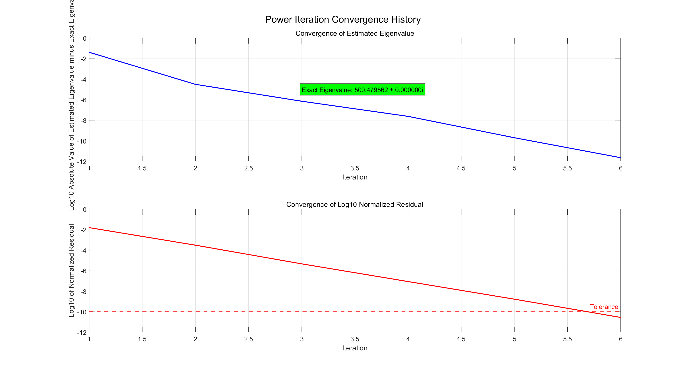
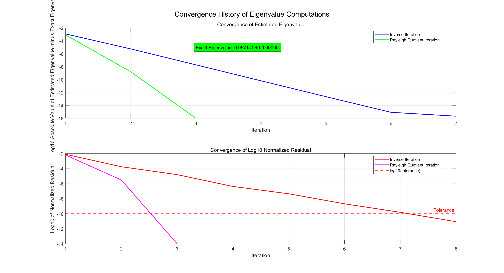
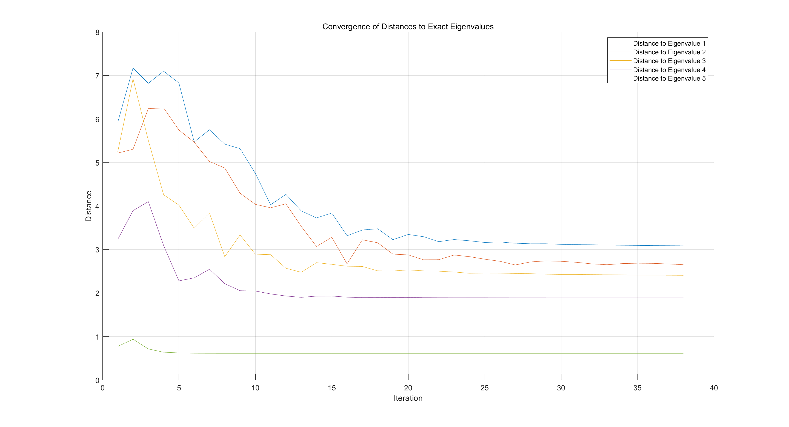
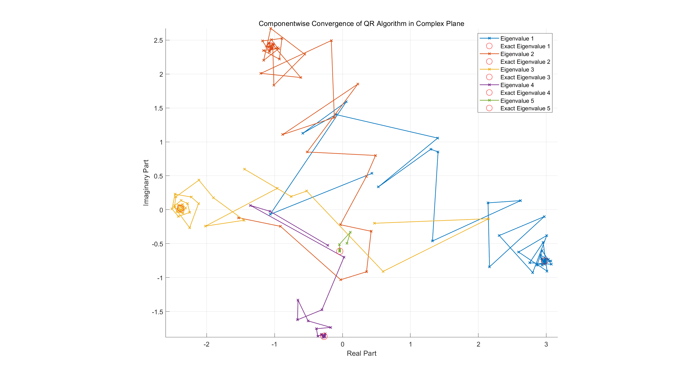

# 数值算法 Homework 07

Due: Nov. 5, 2024  
姓名: 雍崔扬   
学号: 21307140051

## Problem 1

[(Perturbation results for eigenvalue problems)](https://tbetcke.github.io/math0058_lecture_notes/eigenvalues_perturbation_theory.html)  
Let $(\hat \lambda,\hat x)$ be an approximate eigenpair of $A\in \mathbb C^{n\times n}$, and $r = A\hat x − \hat x \hat \lambda$  be the residual.   
Suppose that $\|\hat x\|=1$, show that there exists $E\in \mathbb C^{n\times n}$ such that:  
$$
(A+E)\hat x = \hat x \hat \lambda\\
\|E\|_2 \leq \|r\|_2
$$
**Solution:**   
取 $E:= -r\hat x^H$   
它满足: 
$$
\begin{align}
(A+E)\hat x 
&=
(A-r\hat x^H) \hat x\\
&=
A\hat x - r \hat x^H\hat x\quad (\text{note that }\hat x^H\hat x = \|\hat x\|_2^2 = 1)\\
&=
A\hat x - r\quad (\text{note that }r = A\hat x - \hat x \hat \lambda)\\
&=
\hat x \hat\lambda
\end{align}
$$
注意到 $E^HE = (-r\hat x^H)^H (-r\hat x^H) = \hat x r^H r\hat x^H = \|r\|_2^2 \hat x \hat x^H$   
其特征值为 $\|r\|_2^2 \hat x^H \hat x = \|r\|_2^2$ (代数重数和几何重数均为 $1$) 与 $0$ (代数重数和几何重数均为 $n-1$)  
因此我们有: 
$$
\begin{align}
\|E\|_2 
&=
\sigma_{\max}(E)\\
&=
\sqrt{\lambda_{\max}(E^HE)}\\
&=
\sqrt{\|r\|_2^2}\\
&=
\|r\|_2
\end{align}
$$
(更深刻地，$E=-r\hat x^H$ 的精简 SVD 分解即为 $E = -r\hat x^H = \|r\|_2 (\frac{-r}{\|r\|_2} \hat x^H)$)  
这说明一定存在 $E\in \mathbb C^{n\times n}$ 使得 $\begin{cases}
(A+E)\hat x = \hat x \hat \lambda\\
\|E\|_2 \leq \|r\|_2\end{cases}$

****

**错误的做法:**

- 若 $r=0_n$，则我们有 $A\hat x = \hat x \hat \lambda$   
  于是可取 $E=0_{n\times n}$，显然满足命题.

- 若 $r\neq 0_n$，则可取 $E:= \hat \lambda I_n - A\hat x \hat x^H$  
  它满足:  
  $$
  \begin{align}
  (A+E)\hat x 
  &=
  (A + \hat \lambda I_n -A\hat x \hat x^H) \hat x\\
  &=
  A\hat x + \hat \lambda \hat x - A \hat x \hat x^H\hat x\quad (\text{note that }\hat x^H\hat x = \|\hat x\|_2^2 = 1)\\
  &=
  A\hat x + \hat x \hat \lambda - A\hat x\\
  &=
  \hat x \hat\lambda
  \end{align}
  $$
  根据 $r=A\hat x - \hat x\hat \lambda$ 可知: 
  $$
  \begin{align}
  E
  &= \hat \lambda I_n - A\hat x \hat x^H\\
  &= \hat \lambda I_n - (\hat x \hat \lambda + r)\hat x^H\\
  &= \hat \lambda (I_n -\hat x\hat x^H) - r\hat x^H
  \end{align}
  $$
  注意到:  
  $$
  \begin{align}
  E\hat x
  &=
  [\hat \lambda (I_n -\hat x\hat x^H) - r\hat x^H] \hat x\\
  &=
  \hat \lambda (\hat x - \hat x \hat x^H\hat x) - r \hat x^H\hat x\quad (\text{note that }\hat x^H\hat x = \|\hat x\|_2^2 = 1)\\
  &=
  \hat \lambda(\hat x - \hat x) - r\\
  &=
  -r
  \end{align}
  $$
  根据矩阵 $2$-范数的相容性我们有 $\|r\|_2 = \|-r\|_2 =\|E\hat x\|_2 \leq \|E\|_2 \|\hat x\|_2 = \|E\|_2$   
  但我们证明不了相容性不等式是取等的 (事实上，可使用 Matlab 代码验证 $\|E\|_2 = \|r\|_2$ 并不总是成立)  
  不过上述错误的做法让我们发现 $E:= -r\hat x^H$ 的取法更加适合   
  (因为在 $E$ 的错误的取法中，$I_n- \hat x \hat x^H$ 对恒等式 $(A+E)\hat x = \hat x \hat \lambda$ 没有贡献)


## Problem 2

Let $A_0\in \mathbb C^{n\times n}$ and $\mu_0,\mu_1,\dots,\mu_m\in \mathbb C$  
Define $A_1,A_2,\dots,A_{m+1}$ by:  
$$
\begin{cases}
A_k-\mu_k I_n = Q_k R_k\\
A_{k+1} = R_k Q_k + \mu_k I_n
\end{cases}\ (k=0,1,\dots,m)
$$
where $Q_k$ are unitary matrices.  
Show that:  
$$
(A_0-\mu_0I_n)(A_0-\mu_1 I_n)\dotsm (A_0-\mu_m I_n) = (Q_0Q_1\dotsm Q_m)(R_m\dotsm R_1 R_0)
$$
**Solution:**  
由迭代格式容易推出 $A_{k+1}-\mu_k I_n = R_k Q_k = Q_k^H (A_{k}- \mu_k I_n)Q_k\ (k=0,1,\dots,m)$  
因此 $A_{k+1} = Q_k^HA_k Q_k\ (k=0,1,\dots,m)$  
于是我们有:  
$$
\begin{align}
A_{k+1}
&=
Q_{k}^H A_k Q_k\\
&=
Q_k^H(Q_{k-1}^HA_{k-1}Q_{k-1})Q_k\\
&=
\dotsm\\
&=
Q_k^H Q_{k-1}^H \dotsm Q_{0}^H A_0 Q_0 \dotsm Q_{k-1}Q_k
\end{align}\ (k=0,1,\dots,m)
$$
因此 $A_0=Q_0Q_1\dotsm Q_k A_{k+1}Q_k^H \dotsm Q_1^H Q_0^H\ (k=0,1,\dots,m)$   
于是我们有: 
$$
\begin{align}
A_0 - \mu_k I_n 
&=
Q_0Q_1\dotsm Q_k A_{k+1}Q_k^H \dotsm Q_1^H Q_0^H - \mu_k I_n\\
&=
Q_0Q_1\dotsm Q_k (A_{k+1} - \mu_k I_n) Q_k^H \dotsm Q_1^H Q_0^H\\
&=
Q_0Q_1\dotsm Q_k (R_kQ_k) Q_k^H \dotsm Q_1^H Q_0^H\\
&=
Q_0Q_1\dotsm Q_k R_k Q_{k-1}^H \dotsm Q_1^H Q_0^H\\
\end{align}\ (k=0,1,\dots,m)
$$
从而得到:  
$$
\begin{align}
&(\text{note that }A_0 I_n = I_n A_0\text{, so the multiplication is commutative})\\
&(A_0-\mu_0I_n)(A_0-\mu_1 I_n)\dotsm (A_0 - \mu_{m-1}I_n) (A_0-\mu_m I_n)\\
&= (A_0-\mu_mI_n)(A_0-\mu_{m-1} I_n)\dotsm (A_0-\mu_1 I_n) (A_0-\mu_0 I_n)\\
&=
(Q_0Q_1\dotsm Q_m R_m Q_{m-1}^H \dotsm Q_1^H Q_0^H)(Q_0Q_1\dotsm Q_{m-1} R_{m-1} Q_{m-2}^H \dotsm Q_1^H Q_0^H)\dotsm(Q_0 Q_1 R_1 Q_0^H) (Q_0R_0)\\
&=
(Q_0 Q_1\dotsm Q_m) (R_m R_{m-1}\dotsm R_1 R_0)
\end{align}
$$
命题得证.

****

**另一解法 (数学归纳法):**   

- ① $m=1$ 时，我们有 $A_0-\mu_0 I_n = Q_0R_0$，命题成立.

- ② 假设命题对 $m=m_0$ 的情况成立.  
  现考虑 $m=m_0+1$ 的情况，对 $A_1$ 应用归纳假设，即有:  
  $$
  (A_1-\mu_1I_n)(A_1-\mu_2 I_n)\dotsm (A_1-\mu_{m_0+1} I_n) = (Q_1Q_2\dotsm Q_{m_0+1})(R_{m_0+1}\dotsm R_2 R_1)
  $$
  注意到 $A_1 = Q_0^HA_0 Q_0$ (参考第一种解法)，故我们有 $(A_1 - \mu I_n) = Q_0^H(A_0-\mu I_n) Q_0\ (\forall\ \mu \in \mathbb C)$ 成立.  
  因此我们有:  
  $$
  \begin{align}
  &(\text{note that }A_0 I_n = I_n A_0\text{, so the multiplication is commutative})\\
  &(A_0-\mu_0I_n)\{(A_0-\mu_1 I_n)\dotsm (A_0 - \mu_{m_0}I_n) (A_0-\mu_{m_0+1} I_n)\}\\
  &=\{(A_0-\mu_1 I_n)\dotsm (A_0 - \mu_{m_0}I_n) (A_0-\mu_{m_0+1} I_n)\}(A_0-\mu_0I_n)\\
  &=
  \{[Q_0(A_1-\mu_1 I_n) Q_0^H] \dotsm [Q_0(A_1-\mu_{m_0} I_n) Q_0^H][Q_0(A_1-\mu_{m_0+1} I_n) Q_0^H]\}(Q_0R_0) \\
  &=
  \{Q_0 (A_1-\mu_1I_n)\dotsm (A_1-\mu_{m_0} I_n)(A_1-\mu_{m_0+1} I_n) Q_0^H \} (Q_0 R_0)\quad (\text{use inductive assumption})\\
  &=
  \{Q_0 (Q_1Q_2\dotsm Q_{m_0+1})(R_{m_0+1}\dotsm R_2 R_1) Q_0^H \} (Q_0 R_0)\\
  &=
  (Q_0 Q_1Q_2\dotsm Q_{m_0+1})(R_{m_0+1}\dotsm R_2 R_1R_0)\\
  \end{align}
  $$
  因此命题对 $m=m_0+1$ 的情况也成立.

综上所述，命题得证.


## Problem 3

Randomly generate a $1000\times 1000$ matrix $A$ with positive entries.  
Use the power method to compute $\rho(A)$  
Visualize the convergence history.

**Solution:**  
幂法的迭代格式如下:
$$
\text{Given initial vector }u^{(0)}\ \text{such that }\|u^{(0)}\|_\infty = 1\\
\hline
y^{(k)} = A u^{(k-1)}\\
\rho_k = \|y^{(k)}\|_\infty\\
u^{(k)} = \frac{1}{\rho_k} y^{(k)}\\
\lambda^{(k)} = \frac{(u^{(k)})^T A u^{(k)}}{(u^{(k)})^T(u^{(k)})}\text{ (Rayleigh Quotient)}\\
r^{(k)} = A u^{(k)} - u^{(k)} \lambda^{(k)}\text{ (Residual)}\\
\text{Converge if }\|r^{(k)}\|_\infty \leq \tau \cdot (\|A\|_\infty \|u^{(k)}\|_\infty  + \|u^{(k)}\|_\infty |\lambda^{(k)}|)\text{ where }\tau >0 \text{ if predefined tolerance}
$$
其 Matlab 代码为:

```matlab
function [lambda, u, lambda_history, residual_history] = Power_Iteration(A, max_iter, tolerance)
    % Computes the dominant eigenvalue and eigenvector of matrix A using the power iteration method.
    %
    % Inputs:
    %   A - The input matrix (n x n)
    %   max_iter - Maximum number of iterations
    %   tolerance - Convergence tolerance
    %
    % Outputs:
    %   lambda - Estimated dominant eigenvalue
    %   u - Corresponding dominant eigenvector
    %   lambda_history - History of estimated eigenvalues
    %   residual_history - History of normalized residuals

    % Initialize a random vector u
    n = size(A, 1); % Get the dimension of the matrix A
    u = rand(n, 1); % Random initial vector
    u = u / norm(u, inf); % Normalize u such that ||u^(0)||_∞ = 1

    % Initialize histories
    lambda_history = zeros(max_iter, 1);
    residual_history = zeros(max_iter, 1);

    % Power iteration loop
    for k = 1:max_iter
        % Compute y^(k)
        y = A * u; 
        
        % Compute rho_k (the infinity norm of y)
        rho = norm(y, "inf");
        
        % Update u^(k)
        u = y / rho; % Normalize y to update u
        
        % Compute the Rayleigh quotient (to estimate the eigenvalue)
        lambda = (u' * A * u) / (u' * u); 
        
        % Compute the residual
        r = A * u - u * lambda; 
        
        % Store histories of current estimate of lambda and normalized residual
        lambda_history(k) = lambda;
        residual_history(k) = norm(r, inf) / (norm(A, inf) * norm(u, inf) + norm(u, inf) * abs(lambda));
        
        % Check for convergence
        if residual_history(k) <= tolerance 
            fprintf('Power Iteration converged in %d iterations.\n', k);
            break;
        end
    end

    % Trim histories to the actual number of iterations performed
    lambda_history = lambda_history(1:k);
    residual_history = residual_history(1:k);
end
```

函数调用:

```matlab
% Set the random seed for reproducibility
rng(51);

% Define matrix A
n = 1000;
A = rand(n, n);

% Parameters for power iteration
max_iter = 100; % Maximum number of iterations
tolerance = 1e-10; % Convergence tolerance

% Call the power iteration function
[lambda, u, lambda_history, residual_history] = Power_Iteration(A, max_iter, tolerance);
fprintf('Estimated dominant eigenvalue (Power Iteration): %f + %fi\n', real(lambda), imag(lambda));

% Use MATLAB's eig() function to compute eigenvalues and eigenvectors
[V, D] = eig(A); % V is the eigenvector matrix, D is the diagonal eigenvalue matrix

% Get the dominant eigenvalue and corresponding eigenvector
[lambda_exact, idx] = max(diag(D)); % Find the maximum eigenvalue
fprintf('Estimated dominant eigenvalue (MATLAB eig): %f + %fi\n', real(lambda_exact), imag(lambda_exact));

% Plot convergence history
figure;

% Plot estimated eigenvalue history
subplot(2, 1, 1);
plot(1:size(lambda_history), log10(abs(lambda_history - lambda_exact)), 'b-', 'LineWidth', 1.5);
hold on;
title('Convergence of Estimated Eigenvalue');
xlabel('Iteration');
ylabel('Log10 Absolute Value of Estimated Eigenvalue minus Exact Eigenvalue');
grid on;

% Add text box with lambda_exact at a calculated position
text(3, -5, ...
    sprintf('Exact Eigenvalue: %f + %fi', real(lambda_exact), imag(lambda_exact)), ...
    'BackgroundColor', 'green', 'EdgeColor', 'black');

% Plot normalized residual history
subplot(2, 1, 2);
plot(1:size(residual_history), log10(residual_history), 'r-', 'LineWidth', 1.5);
title('Convergence of Log10 Normalized Residual');
xlabel('Iteration');
ylabel('Log10 of Normalized Residual');
grid on;

% Plot tolerance line
yline(log10(tolerance), 'r--', 'Tolerance', 'LineWidth', 1.5); % Tolerance line

% Adjust layout
sgtitle('Power Iteration Convergence History');
```

运行结果:

```bash
Power Iteration converged in 6 iterations.
Estimated dominant eigenvalue (Power Iteration): 500.479562 + 0.000000i
Estimated dominant eigenvalue (MATLAB eig): 500.479562 + 0.000000i
```



## Problem 4

Let $A$ be the $200\times 200$ Hilbert matrix (the $(i,j)$-entry of $A$ is $a_{ij}:= (i+j-1)^{-1}$)  
Compute the eigenvalue of $A$ that is closest to $1$ using inverse iteration and Rayleigh quotient iteration.  
Visualize the convergence history and report the execution time (preferably with detailed profiling)

**Solution:**  

### (1) Helper Funtions

构建 Hilbert 矩阵的函数:

```matlab
function A = Generate_Hilbert_Matrix(n)
    % Generate the Hilbert matrix
    A = zeros(n, n);
    for i = 1:n
        for j = 1:n
            A(i, j) = 1 / (i + j - 1);
        end
    end
end
```

部分选主元 Gauss 消去法:

```matlab
function [P, L, U] = Gaussian_Elimination_Partial_Pivoting(A)
    % 获取矩阵的维度
    [n, m] = size(A);
    if n ~= m
        error('矩阵A必须是方阵');
    end
    
    % 初始化置换矩阵 P 为单位矩阵
    P = eye(n);
    
    % 高斯消去过程
    for k = 1:n-1
        % 在第 k 列的 A(k:n, k) 中找到最大值的行索引 p
        [~, p] = max(abs(A(k:n, k)));
        p = p + k - 1; % 调整为在整个矩阵中的行索引
        
        % 交换第 k 行和第 p 行
        if p ~= k
            A([k, p], :) = A([p, k], :); 
            P([k, p], :) = P([p, k], :); % 记录行置换
        end
        
        % 检查主元是否为零
        if A(k, k) == 0
            error('矩阵是奇异的');
        end
        
        % Gauss 消去过程：对 A(k+1:n, k) 进行归一化
        A(k+1:n, k) = A(k+1:n, k) / A(k, k);
        
        % 更新 A(k+1:n, k+1:n)
        A(k+1:n, k+1:n) = A(k+1:n, k+1:n) - A(k+1:n, k) * A(k, k+1:n);
    end
    
    % 计算 L 和 U 矩阵
    L = tril(A, -1) + eye(n); % L 是单位下三角矩阵
    U = triu(A); % U 是上三角矩阵
end
```

前代法:

```matlab
function y = Forward_Sweep(L, b)
    % 前代法求解 Ly = b
    n = length(b);
    for i = 1:n-1
        b(i) = b(i) / L(i, i);  % 对角线归一化
        b(i+1:n) = b(i+1:n) - b(i) * L(i+1:n, i);  % 消去
    end
    b(n) = b(n) / L(n, n);  % 处理最后一行
    y = b;  % 返回结果
end
```

回代法:

```matlab
function x = Backward_Sweep(U, y)
    % 回代法求解 Ux = y
    n = length(y);
    for i = n:-1:2
        y(i) = y(i) / U(i, i);  % 对角线归一化
        y(1:i-1) = y(1:i-1) - y(i) * U(1:i-1, i);  % 消去
    end
    y(1) = y(1) / U(1, 1);  % 处理第一行
    x = y;  % 返回结果
end
```

基于部分选主元 Gauss 消去法求解非奇异线性方程组的函数:

```matlab
% 求解线性方程组 Ax = b
function x = Solve_Linear_System(A, b)
    
    % 使用部分主元的 Gaussian 消去法计算 PA = LU
    [P, L, U] = Gaussian_Elimination_Partial_Pivoting(A);

    % 使用前代法求解 Ly = Pb
    y = Forward_Sweep(L, P * b);
    
    % 使用回代法求解 Ux = y
    x = Backward_Sweep(U, y);
end
```


### (2) 反幂法

带位移 $\mu$ 的反幂法的迭代格式如下:  
$$
\text{Given initial vector }z^{(0)}\ \text{such that }\|z^{(0)}\|_\infty = 1\\
\hline
\text{solve }(A-\mu I)y^{(k)} = z^{(k-1)}\\
\rho_k = \|y^{(k)}\|_\infty\\
z^{(k)} = \frac{1}{\rho_k} y^{(k)}\\
\lambda^{(k)} = \frac{(z^{(k)})^T A z^{(k)}}{(z^{(k)})^T(z^{(k)})}\text{ (Rayleigh Quotient)}\\
r^{(k)} = A z^{(k)} - z^{(k)} \lambda^{(k)}\text{ (Residual)}\\
\text{Converge if }\|r^{(k)}\|_\infty \leq \tau \cdot (\|A\|_\infty \|z^{(k)}\|_\infty  + \|z^{(k)}\|_\infty |\lambda^{(k)}|)\text{ where }\tau >0 \text{ if predefined tolerance}
$$
其中线性方程组 $(A-\mu I)y^{(k)} = z^{(k-1)}$ 的求解可通过事先使用部分选主元的 Gauss 消元法计算 $A-\mu I$ 的 $\text{LU}$ 分解，  
然后通过前代法和回代法求解两个三角方程组来得到 $y^{(k)}$   
其 Matlab 代码为:

```matlab
function [lambda, z, lambda_history, residual_history] = Inverse_Iteration(A, mu, max_iter, tolerance)
    % Computes the dominant eigenvalue and eigenvector of matrix A using inverse iteration with a shift.
    %
    % Inputs:
    %   A - The input matrix (n x n)
    %   mu - Shift for inverse iteration
    %   max_iter - Maximum number of iterations
    %   tolerance - Convergence tolerance
    %
    % Outputs:
    %   lambda - Estimated dominant eigenvalue
    %   z - Corresponding dominant eigenvector
    %   lambda_history - History of estimated eigenvalues
    %   residual_history - History of normalized residuals

    n = size(A, 1); % Get the dimension of the matrix A
    z = rand(n, 1); % Random initial vector
    z = z / norm(z, inf); % Normalize to satisfy ||z^(0)||_∞ = 1

    % Initialize histories
    lambda_history = zeros(max_iter, 1);
    residual_history = zeros(max_iter, 1);

    % Obtain the partial pivoted LU decomposition of (A - mu * I)
    [P, L, U] = Gaussian_Elimination_Partial_Pivoting(A - mu * eye(n));

    % Inverse iteration loop
    for k = 1:max_iter
        % Solve (A - mu * I)y^{(k)} = z^{(k-1)}
        y = Forward_Sweep(L, P * z);
        y = Backward_Sweep(U, y);

        % Compute rho_k (the infinity norm of y)
        rho = norm(y, "inf");

        % Update z^(k)
        z = y / rho; % Normalize y to update z
        
        % Compute the Rayleigh quotient to estimate the eigenvalue
        lambda = (z' * A * z) / (z' * z); 
        
        % Compute the residual
        r = A * z - z * lambda; 

        % Store histories of current estimate of lambda and normalized residual
        lambda_history(k) = lambda;
        residual_history(k) = norm(r, inf) / (norm(A, inf) * norm(z, inf) + norm(z, inf) * abs(lambda));
        
        % Check for convergence
        if residual_history(k) <= tolerance 
            fprintf('Inverse Iteration converged in %d iterations.\n', k);
            break;
        end
    end

    % Trim histories to the actual number of iterations performed
    lambda_history = lambda_history(1:k);
    residual_history = residual_history(1:k);
end
```


### (3) Rayleigh 商迭代

$$
\text{Given initial vector }z^{(0)}\ \text{such that }\|z^{(0)}\|_\infty = 1\text{, and }\mu_0 \in \mathbb C\\
\hline
\text{solve }(A-\mu_{k-1} I)y^{(k)} = z^{(k-1)}\\
\rho_k = \|y^{(k)}\|_\infty\\
z^{(k)} = \frac{1}{\rho_k} y^{(k)}\\
\lambda^{(k)} = \frac{(z^{(k)})^T A z^{(k)}}{(z^{(k)})^T(z^{(k)})}\text{ (Rayleigh Quotient)}\\
r^{(k)} = A z^{(k)} - z^{(k)} \lambda^{(k)}\text{ (Residual)}\\
\text{Converge if }\|r^{(k)}\|_\infty \leq \tau \cdot (\|A\|_\infty \|z^{(k)}\|_\infty  + \|z^{(k)}\|_\infty |\lambda^{(k)}|)\text{ where }\tau >0 \text{ if predefined tolerance}\\
\mu_k = \lambda^{(k)}
$$

其中线性方程组 $(A-\mu_{k-1} I)y^{(k)} = z^{(k-1)}$ 的求解可通过部分选主元的 Gauss 消元法计算 $A-\mu_{k-1} I$ 的 $\text{LU}$ 分解，  
然后通过前代法和回代法求解两个三角方程组来得到 $y^{(k)}$   

```matlab
function [lambda, z, lambda_history, residual_history] = Rayleigh_Quotient_Iteration(A, mu0, max_iter, tolerance)
    % Computes the dominant eigenvalue and eigenvector of matrix A using Rayleigh Quotient Iteration.
    %
    % Inputs:
    %   A - The input matrix (n x n)
    %   mu0 - Initial shift for the first iteration
    %   max_iter - Maximum number of iterations
    %   tolerance - Convergence tolerance
    %
    % Outputs:
    %   lambda - Estimated dominant eigenvalue
    %   z - Corresponding dominant eigenvector
    %   lambda_history - History of estimated eigenvalues
    %   residual_history - History of normalized residuals

    n = size(A, 1); % Get the dimension of the matrix A
    z = rand(n, 1); % Random initial vector
    z = z / norm(z, inf); % Normalize to satisfy ||z^(0)||_∞ = 1

    % Initialize histories
    lambda_history = zeros(max_iter, 1);
    residual_history = zeros(max_iter, 1);

    % Set initial shift
    mu = mu0;

    % Rayleigh Quotient Iteration loop
    for k = 1:max_iter
        % Solve (A - mu * I)y^{(k)} = z^{(k-1)}
        [P, L, U] = Gaussian_Elimination_Partial_Pivoting(A - mu * eye(n));
        y = Forward_Sweep(L, P * z);
        y = Backward_Sweep(U, y);

        % Compute rho_k (the infinity norm of y)
        rho = norm(y, "inf");

        % Update z^(k)
        z = y / rho; % Normalize y to update z
        
        % Compute the Rayleigh quotient to estimate the eigenvalue
        lambda = (z' * A * z) / (z' * z); 
        
        % Compute the residual
        r = A * z - z * lambda; 

        % Store histories of current estimate of lambda and normalized residual
        lambda_history(k) = lambda;
        residual_history(k) = norm(r, inf) / (norm(A, inf) * norm(z, inf) + norm(z, inf) * abs(lambda));
        
        % Check for convergence
        if residual_history(k) <= tolerance 
            fprintf('Rayleigh Quotient Iteration converged in %d iterations.\n', k);
            break;
        end
        
        % Update mu for the next iteration
        mu = lambda; % Set mu to the last estimated eigenvalue
    end

    % Trim histories to the actual number of iterations performed
    lambda_history = lambda_history(1:k);
    residual_history = residual_history(1:k);
end
```


### (4) 函数调用

我们对 $200$ 阶的 Hilbert 矩阵应用位移为 $\mu=1$ 的反幂法和初始位移为 $\mu_0=1$ 的 Rayleigh 商迭代法，  
期望能够找到与 $1$ 最接近的特征值.  
作为对比，我们使用 Matlab 的 `eig()` 函数的计算结果作为精确解.  
函数调用:

```matlab
% Define parameters
n = 200; % Size of the Hilbert matrix
mu = 1;  % Shift for inverse iteration
max_iter = 100; % Maximum number of iterations
tolerance = 1e-10; % Convergence tolerance

% Generate the Hilbert matrix
A = Generate_Hilbert_Matrix(n);

% Use MATLAB's eig() function to find the closest eigenvalue to mu
[V, D] = eig(A);
[~, idx] = min(abs(diag(D - mu * eye(size(D, 1)))));
lambda_exact = D(idx, idx);
fprintf('Estimated dominant eigenvalue (MATLAB eig): %f + %fi\n', real(lambda_exact), imag(lambda_exact));

% Run inverse iteration
[lambda_inverse, z_inverse, lambda_history_inverse, residual_history_inverse] = Inverse_Iteration(A, mu, max_iter, tolerance);
fprintf('Estimated dominant eigenvalue (Inverse Iteration): %f + %fi\n', ...
         real(lambda_inverse), imag(lambda_inverse));

% Run Rayleigh Quotient iteration
[lambda_Rayleigh, z_Rayleigh, lambda_history_Rayleigh, residual_history_Rayleigh] = Rayleigh_Quotient_Iteration(A, mu, max_iter, tolerance);
fprintf('Estimated dominant eigenvalue (Inverse Iteration): %f + %fi\n', ...
         real(lambda_Rayleigh), imag(lambda_Rayleigh));

% Plot convergence history
figure;

% Plot estimated eigenvalue history for Inverse Iteration
subplot(2, 1, 1);
plot(1:length(lambda_history_inverse), log10(abs(lambda_history_inverse - lambda_exact)), 'b-', 'LineWidth', 1.5);
hold on;
plot(1:length(lambda_history_Rayleigh), log10(abs(lambda_history_Rayleigh - lambda_exact)), 'g-', 'LineWidth', 1.5);
title('Convergence of Estimated Eigenvalue');
xlabel('Iteration');
ylabel('Log10 Absolute Value of Estimated Eigenvalue minus Exact Eigenvalue');
grid on;
legend('Inverse Iteration', 'Rayleigh Quotient Iteration', 'Location', 'best');

% Add text box with lambda_exact at a calculated position
text(3, -5, ...
    sprintf('Exact Eigenvalue: %f + %fi', real(lambda_exact), imag(lambda_exact)), ...
    'BackgroundColor', 'green', 'EdgeColor', 'black');

% Plot normalized residual history for Inverse Iteration
subplot(2, 1, 2);
plot(1:length(residual_history_inverse), log10(residual_history_inverse), 'r-', 'LineWidth', 1.5);
hold on;
plot(1:length(residual_history_Rayleigh), log10(residual_history_Rayleigh), 'm-', 'LineWidth', 1.5);
title('Convergence of Log10 Normalized Residual');
xlabel('Iteration');
ylabel('Log10 of Normalized Residual');
grid on;

% Plot tolerance line
yline(log10(tolerance), 'r--', 'Tolerance', 'LineWidth', 1.5); % Tolerance line
legend('Inverse Iteration', 'Rayleigh Quotient Iteration', 'log10(tolerance)' , 'Location', 'best');

% Adjust layout
sgtitle('Convergence History of Eigenvalue Computations');
```

运行结果:

```bash
Estimated dominant eigenvalue (MATLAB eig): 0.957141 + 0.000000i
Inverse Iteration converged in 8 iterations.
Estimated dominant eigenvalue (Inverse Iteration): 0.957141 + 0.000000i
Rayleigh Quotient Iteration converged in 3 iterations.
Estimated dominant eigenvalue (Inverse Iteration): 0.957141 + 0.000000i
```

从收敛历史图像中可以看出:  
反幂法全局线性收敛，而 Rayleigh 商迭代局部超线性收敛 (具体来说是三次收敛，因为 Hilbert 阵是对称阵)




## Problem 5

Write a program to compute all eigenvectors of an upper triangular matrix with distinct diagonal entries.  
Compare your result with the one produced by a math library (e.g., `eig()` in MATLAB/Octave)

**Solution:**       
考虑 $n=4$ 的情况，假设我们想计算 $(2,2)$ 位置的特征值 $\lambda_2 = T(2,2)$ 的特征向量，则我们可以这样做:  
$$
\begin{align}
\text{Solve} &\ (T-\lambda_2 I) x = 0_n\\
\hline
x&=
(T - \lambda_2 I)^{-1} 0_n\\ 
&= 
\begin{bmatrix}
* & * & * & *\\
& 0 &* & * \\
& & * & * \\
& & & *
\end{bmatrix}^{-1}
\begin{bmatrix}
0\\
0\\
0\\
0\\
\end{bmatrix}\\
&=
\begin{bmatrix}
\infty\\
\infty\\
0\\
0\\
\end{bmatrix}
(\text{normalize})\propto 
\begin{bmatrix}
*\\
1\\
0\\
0\\
\end{bmatrix}
\end{align}
$$
根据这个思路我们可以将右端的零向量的第二个元素置为 $1$，将 $T(2,2)$ 置为 $1$，即求解:    
$$
x = \begin{bmatrix}
* & * & * & *\\
& 1 &* & * \\
& & * & * \\
& & & *
\end{bmatrix}^{-1}
\begin{bmatrix}
0\\
1\\
0\\
0\\
\end{bmatrix} = \begin{bmatrix}
*\\
1\\
0\\
0\\
\end{bmatrix}
$$
注意到这实际上相当于求解一个更小阶数的上三角方程组，最后在解的后面补 $0$ 得到原三角方程组的解:  
$$
\tilde x = \begin{bmatrix}
* & *\\
& 1 \\
\end{bmatrix}^{-1}
\begin{bmatrix}
0\\
1\\
\end{bmatrix} = \begin{bmatrix}
*\\
1
\end{bmatrix}\\

x = \begin{bmatrix} \tilde x\\ 0_2\end{bmatrix} = 
\begin{bmatrix} * \\ 1 \\ 0\\ 0\end{bmatrix}
$$

***

将上述思路一般化，我们便得到如下算法:

```matlab
function [eigenvectors, eigenvalues] = Upper_Triangular_Eigenvectors(T)
    % Upper_Triangular_Eigenvectors computes the eigenvectors of an upper triangular matrix T.
    %
    % Inputs:
    %   T - an n x n upper triangular matrix
    %
    % Outputs:
    %   eigenvector - a matrix containing the normalized eigenvectors as columns
    %   eigenvalue - a vector containing the eigenvalues on the diagonal of T

    n = size(T, 1); % Get the size of the matrix (number of rows)
    eigenvalues = diag(T); % Extract the eigenvalues from the diagonal of T
    eigenvectors = zeros(n, n); % Initialize the matrix to store eigenvectors
    eigenvectors(1, 1) = 1; % Set the first entry of the first eigenvector

    for i = 2:n
        % Create the matrix U by subtracting the eigenvalue from T
        U = T(1:i, 1:i) - eigenvalues(i) * eye(i);
        U(i, i) = 1; % Set the pivot element to 1 to facilitate back substitution
        
        % Create the right-hand side vector b with random values and set the last entry to 1
        b = [zeros(i-1, 1); 1];
        
        % Solve the linear system U * x = b using backward substitution
        x = Backward_Sweep(U, b);
        
        % Normalize the eigenvector and store it
        eigenvectors(1:i, i) = x / norm(x);
    end
end
```

函数调用:

```matlab
rng(51);
n = 100;
T = triu(rand(n, n) + 1i * rand(n, n));

% Call the function to compute eigenvalues and eigenvectors
[eigenvectors, eigenvalues] = Upper_Triangular_Eigenvectors(T);

% Display the results
disp('Frobenius norm of T * eigenvectors - eigenvectors * eigenvalues')
residual = T * eigenvectors - eigenvectors * diag(eigenvalues);
disp(norm(residual, "fro"));
```

运行结果:

```matlab
Frobenius norm of T * eigenvectors - eigenvectors * eigenvalues
   2.6505e-15
```


## Problem 6 (optional)

Investigate the behavior of the power method applied to the following matrices:  
(where $\lambda\in \mathbb C$ is a given constant)  
$$
A = \begin{bmatrix}
\lambda & 1\\
& \lambda
\end{bmatrix}
\quad
B = \begin{bmatrix}
\lambda & 1\\
& -\lambda
\end{bmatrix}
$$

**Solution:**   
首先我们观察到:  
**(特征向量的求解可以利用 Problem 5 的算法)**

- $A = \begin{bmatrix}
  \lambda & 1\\
  & \lambda
  \end{bmatrix}$ 作为一个 $2$ 阶 Jordan 块，其特征值为 $\lambda$，代数重数为 $2$，几何重数为 $1$，特征向量为 $\begin{bmatrix}
  1\\ 0\end{bmatrix}$ 
- $B = \begin{bmatrix}
  \lambda & 1\\
  & -\lambda
  \end{bmatrix}$​​ 作为一个上三角阵，其特征值为 $\lambda$​​ 和 $-\lambda$​​   
  当 $\lambda= 0$​​ 时，就归结为 $A$​​ 的情况，我们不赘述了;  
  当 $\lambda\neq 0$​​ 时，其特征值 $\lambda$​​ 和 $-\lambda$​​ 都是单重的，特征向量分别为 $\begin{bmatrix}
  1\\ 0\end{bmatrix}$​ 和 $\begin{bmatrix}
  -\frac{1}{\lambda}\\ 1\end{bmatrix}$​(或者说 $\begin{bmatrix}
  1\\ -\lambda\end{bmatrix}$) 

容易归纳证明 $A^k = \begin{bmatrix}
\lambda^k & k \lambda^{k-1}\\
& \lambda^k \end{bmatrix}\ (\forall\ k\in \mathbb Z_+)$:  
$$
A = \begin{bmatrix}
\lambda & 1\\
& \lambda
\end{bmatrix}\\
\hline
A^k = \begin{bmatrix}
\lambda^k & k \lambda^{k-1}\\
& \lambda^k \end{bmatrix}
\Rightarrow 
A^{k+1} = \begin{bmatrix}
\lambda^k & k \lambda^{k-1}\\
& \lambda^k \end{bmatrix}
\begin{bmatrix}
\lambda & 1\\
& \lambda
\end{bmatrix}
=
\begin{bmatrix}
\lambda^{k+1} & (k+1)\lambda^k\\
& \lambda^{k+1}
\end{bmatrix}
$$
任意给定的非零初始向量 $u^{(0)} = [a,b]^T\ (a,b\in \mathbb C)$ 我们都有:  
$$
A^k u^{(0)} = \begin{bmatrix}
\lambda^k & k \lambda^{k-1}\\
& \lambda^k \end{bmatrix} 
\begin{bmatrix} a\\ b\end{bmatrix} = 
\begin{bmatrix} \lambda^k a + k\lambda^{k-1} b\\ \lambda^k b\end{bmatrix}
=
\lambda^k\begin{bmatrix}  a + \frac{k}{\lambda} b\\ b\end{bmatrix}\ (\forall\ k\in \mathbb Z_+)
$$
若 $b=0$ (根据初始向量非零的假设我们有 $a\neq 0$)，则初始向量天然就是 $A$ 关于特征值 $\lambda$ 的特征向量.   
若 $b\neq 0$，则当 $k\to \infty$ 时，$\frac{1}{\lambda^k}A^k u^{(0)}\to \begin{bmatrix} \infty \\ b \end{bmatrix}$，即方向趋近于与 $\begin{bmatrix}
1\\ 0\end{bmatrix}$ 平行.   
因此对 $A$ 应用幂法，无论使用什么非零初始向量，在方向上都是收敛的.

*****

下面考虑 $B = \begin{bmatrix}
\lambda & 1\\
& -\lambda
\end{bmatrix}\ (\lambda\neq 0)$ 的情况:  
$$
B = \begin{bmatrix}
\lambda & 1\\
& -\lambda
\end{bmatrix} \quad 
B^2 = \begin{bmatrix}
\lambda^2 & 0\\
& \lambda^2
\end{bmatrix}\\
\hline
B^{2k-1} = 
\begin{bmatrix}
\lambda^{2k-1} & \lambda^{2k-2}\\
& -\lambda^{2k-1}
\end{bmatrix}\\
\Rightarrow\\
B^{2k} = \begin{bmatrix}
\lambda^{2k-1} & \lambda^{2k-2}\\
& -\lambda^{2k-1}
\end{bmatrix} 
\begin{bmatrix}
\lambda & 1\\
& -\lambda
\end{bmatrix}
=
\begin{bmatrix}
\lambda^{2k} & 0\\
& \lambda^{2k}\\
\end{bmatrix}\\

\Rightarrow\\

B^{2k+1} = 
\begin{bmatrix}
\lambda^{2k} & 0\\
& \lambda^{2k}
\end{bmatrix}
\begin{bmatrix}
\lambda & 1\\
& -\lambda
\end{bmatrix}
=
\begin{bmatrix}
\lambda^{2k+1} & \lambda^{2k}\\
& -\lambda^{2k+1}
\end{bmatrix}
$$
容易归纳得到 $B^{m} = \begin{bmatrix}
\lambda^m & \frac12 [1 - (-1)^{m}] \lambda^{m-1}\\
& (-1)^m\lambda^m
\end{bmatrix}\ (\forall\ m\in \mathbb Z_+)$   
我们将其分为两个子列讨论，分别是 $\{B^{2k-1}:= \begin{bmatrix}
\lambda^{2k-1} & \lambda^{2k-2}\\
& -\lambda^{2k-1}
\end{bmatrix}\}$ 和 $\{B^{2k}:= \begin{bmatrix}\lambda^{2k} & 0\\
& \lambda^{2k}
\end{bmatrix}\}$  
任意给定的初始向量 $u^{(0)} = [a,b]^T\ (a,b\in \mathbb C)$，则我们有: 

- 对于第一个子列:  
  $$
  B^{2k-1} u^{(0)} =\begin{bmatrix}
  \lambda^{2k-1} & \lambda^{2k-2}\\
  & -\lambda^{2k-1}
  \end{bmatrix} 
  \begin{bmatrix} a\\ b \end{bmatrix} 
  =
  \begin{bmatrix} \lambda^{2k-1} a + \lambda^{2k-2} b\\ -\lambda^{2k-1}b \end{bmatrix}
  =
  \lambda^{2k-2}\begin{bmatrix} \lambda a + b\\ -\lambda b \end{bmatrix}
  $$
  我们发现对于任意 $k\in \mathbb Z_+$​​，向量 $B^{2k-1} u^{(0)}$​​ 都平行于 $\begin{bmatrix} \lambda a + b\\ -\lambda b \end{bmatrix}$​​ (特征向量 $\begin{bmatrix}
  1\\ 0\end{bmatrix}$​ 和 $\begin{bmatrix}
  1\\ -\lambda\end{bmatrix}$ 的线性组合)

- 对于第二个子列:   
  $$
  B^{2k} u^{(0)} =\begin{bmatrix}
  \lambda^{2k} & 0\\
  & \lambda^{2k}
  \end{bmatrix} 
  \begin{bmatrix} a\\ b \end{bmatrix} 
  =
  \begin{bmatrix} \lambda^{2k} a\\ \lambda^{2k}b \end{bmatrix}
  =
  \lambda^{2k}\begin{bmatrix} a \\ b \end{bmatrix}
  $$
  我们发现对于任意 $k\in \mathbb Z_+$，向量 $B^{2k} u^{(0)}$ 都平行于 $\begin{bmatrix} a\\ b \end{bmatrix}$ (特征向量 $\begin{bmatrix}
  1\\ 0\end{bmatrix}$ 和 $\begin{bmatrix}
  1\\ -\lambda\end{bmatrix}$ 的线性组合)

容易验证 $\begin{bmatrix} \lambda a + b\\ -\lambda b \end{bmatrix} = c\begin{bmatrix} a\\ b \end{bmatrix}$ 在 $a\neq 0$ 的情况下是有解的，其解是 $\begin{cases}
c = \frac{b}{2a}\\
\lambda = -\frac{b}{2a}\end{cases}$  
因此如果我们选取的初始向量 $u^{(0)} = [a,b]^T\ (a,b\in \mathbb C)$ 满足 $b=-2a \lambda$，  
那么两个子列的极限向量是平行的，此时幂法的序列在方向上是收敛的.  

但在其他情况下，这两个子列的极限向量不平行，导致幂法的序列在方向上发散.  
此时我们可以使用**子空间迭代法**，使用 $X^{(0)}=[u^{(0)}, Bu^{(0)}]$ 作为初始向量组  
最终收敛得到的 $X_\text{converge}\in \mathbb C^{n\times 2}$ 满足 $\text{span}\{X_{\text{converge}}\}\approx \text{span}\{p_1,p_2\}$   
其中特征向量 $p_1 = \begin{bmatrix}
1\\ 0\end{bmatrix}$ 和 $p_2 = \begin{bmatrix}
1\\ -\lambda\end{bmatrix}$   
我们最终可以从 $X_\text{converge}$ 的列空间中分离出特征向量 $p_1,p_2$，这里不赘述了. 


## Problem 7 (optional)

Implement the naive $\text{QR}$ algorithm and visualize the componentwise convergence of a small example.

**Solution:**  
显式 $\text{QR}$ 迭代格式为:  
$$
\text{Given }A_0 = A\in \mathbb C^{n\times n}\\
\hline
A_{k-1} = Q_k R_k\\
A_k = R_k Q_k
$$
我们将收敛准则设为 $A$ 的对角元的变化幅度小于某一阈值时停止迭代，就得到如下算法:

```matlab
function [A_history, Q_history, R_history] = naive_QR(A, max_iter, tolerance)
    % naive_QR performs the naive QR iteration on matrix A
    %
    % Inputs:
    %   A - an n x n matrix
    %   max_iter - maximum number of iterations
    %
    % Outputs:
    %   A - the final matrix after max_iter iterations
    %   Q_history - history of Q matrices
    %   R_history - history of R matrices

    % Initialize
    n = size(A, 1);
    A_history = zeros(n, n, max_iter); % To store R matrices
    Q_history = zeros(n, n, max_iter); % To store Q matrices
    R_history = zeros(n, n, max_iter); % To store R matrices

    A_history(:, :, 1) = A;

    for k = 1:max_iter
        % Perform QR factorization
        [Q, R] = qr(A_history(:, :, k)); 
        
        % Store Q and R
        Q_history(:, :, k) = Q; 
        R_history(:, :, k) = R; 
        
        % Update A_k for the next iteration
        A_history(:, :, k+1) = R * Q;

        if norm(diag(A_history(:, :, k+1)) - diag(A_history(:, :, k)), "fro") / norm(diag(A_history(:, :, k+1)), "fro") < tolerance
            fprintf("naive QR converge at %d-th iteration\n", k);
            break;
        end
    end

    A_history = A_history(:, :, 1:k+1);
    Q_history = Q_history(:, :, 1:k);
    R_history = R_history(:, :, 1:k);
end
```

函数调用:

```matlab
rng(51);
n = 5;
A = randn(n, n) + 1i * randn(n, n);
max_iter = 50; % Maximum number of iterations
tolerance = 1e-2;

% Perform naive QR iteration
[A_history, Q_history, R_history] = naive_QR(A, max_iter, tolerance);

% Prepare for visualization of convergence
n = size(A, 1);
convergence_history = zeros(size(A_history, 3), n);

% Store the diagonal elements of A_k at each iteration
for k = 1:size(A_history, 3)
    convergence_history(k, :) = diag(A_history(:, :, k)); % Diagonal of A_k
end

% Compute exact eigenvalues
exact_eigenvalues = eig(A);
sorted_exact_eigenvalues = zeros(size(exact_eigenvalues, 1), 1);
for i = 1:size(exact_eigenvalues)
    [~, idx] = min(abs(convergence_history(end, :) - exact_eigenvalues(i)));
    sorted_exact_eigenvalues(idx) = exact_eigenvalues(i);
end

% Plotting the convergence of eigenvalues in the complex plane
figure;
hold on;
colors = lines(n); % Generate distinct colors for each eigenvalue

for i = 1:n
    % Plot the convergence path for each eigenvalue
    plot(real(convergence_history(:, i)), imag(convergence_history(:, i)), 'x-', ...
        'DisplayName', sprintf('Eigenvalue %d', i), 'Color', colors(i, :), ...
        'LineWidth', 1, 'MarkerSize', 5);
    
    % Plot the exact eigenvalue
    plot(real(sorted_exact_eigenvalues(i)), imag(sorted_exact_eigenvalues(i)), 'ro', 'MarkerSize', 10, ...
        'DisplayName', sprintf('Exact Eigenvalue %d', i));
end

hold off;
xlabel('Real Part');
ylabel('Imaginary Part');
title('Componentwise Convergence of QR Algorithm in Complex Plane');
legend show;
grid on;
axis equal; % Equal scaling for both axes

% Calculate the distance to exact eigenvalues
distance_history = zeros(size(convergence_history));

for k = 1:size(convergence_history, 1)
    distance_history(k, :) = abs(convergence_history(k, :) - sorted_exact_eigenvalues.') + abs(sorted_exact_eigenvalues.');
end

% Plotting the distance convergence
figure;
hold on;
for i = 1:n
    plot(1:size(A_history, 3), distance_history(:, i), 'DisplayName', sprintf('Distance to Eigenvalue %d', i), 'Color', colors(i, :));
end

hold off;
xlabel('Iteration');
ylabel('Distance');
title('Convergence of Distances to Exact Eigenvalues');
legend show;
grid on;
```

运行结果:  
**(存疑: 似乎与 "QR 迭代更倾向于优先收敛于模最大特征值" 的事实不符)**  
(可能是跟特征值分离度有关，模最小的特征值和模第二小的特征值分离度最大)

```bash
naive QR converge at 37-th iteration
```




