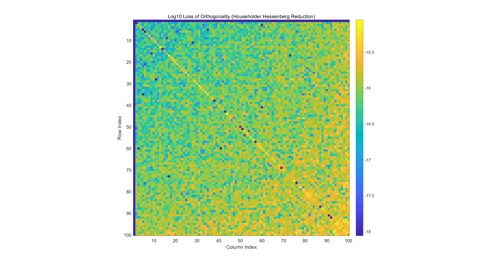
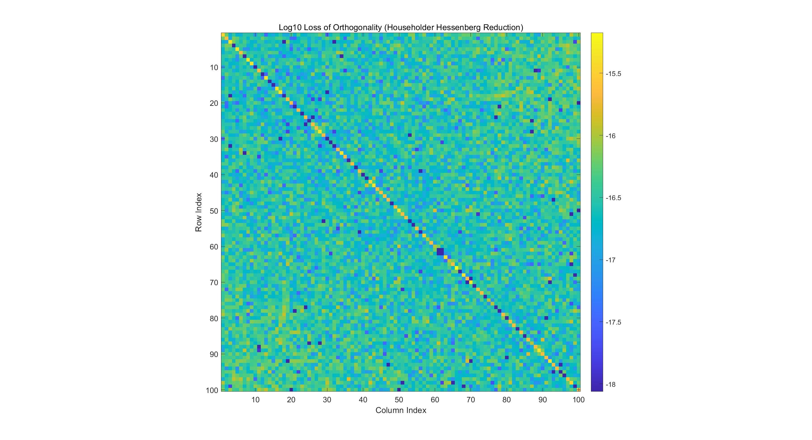

# 数值算法 Homework 08

Due: Nov. 12, 2024  
姓名: 雍崔扬   
学号: 21307140051

## Problem 1

Let $A\in \mathbb C^{n\times n},x\in \mathbb C^n$  
Suppose that $X=[x,Ax,\dots,A^{n-1}x]\in \mathbb C^{n\times n}$ is nonsingular.  
Show that $X^{-1}AX$ is upper Hessenberg.

**Proof:**    
给定 $A\in \mathbb C^{n\times n}$ 和 $x\in \mathbb C^n$，我们便可以计算序列:  
$$
x_1 = x\\
x_2 = Ax_1 = Ax\\
x_3 = Ax_2 = A^2 x\\
\dotsm\\
x_n = Ax_{n-1} = A^{n-1}x
$$
我们只需计算至 $x_n = A^{n-1}x$ 即可  
这是因为 Cayley-Hamilton 定理保证了 $A^k\ (k\geq n)$ 可以表示为 $I_n,A,\dots,A^{n-1}$ 的线性组合.

> **(Cayley-Hamilton 定理, Matrix Analysis 定理 $2.4.3.2$)**    
> 设 $p_A(t):=\det(tI_n- A)$ 是 $A\in \mathbb C^{n\times n}$ 的特征多项式，则我们有 $p_A(A) = 0_{n\times n}$ 成立.  
> 换言之，任意复方阵都满足其特征方程. 


我们记: 
$$
X:= [x_1,x_2,\dots,x_{n-1},x_n] = [x,Ax,\dots,A^{n-1}x]\\
c:= -X^{-1}A^n x_1 = [c_1,\dots,c_n]^T\\
H:= [e_2,e_3,\dots,e_n,-c]= 
\begin{bmatrix}
0 & & & & -c_1\\
1 & 0 & & & -c_2\\
& 1 & \ddots & & \vdots\\
& & \ddots & 0 & -c_{n-1}\\
& & & 1 & -c_n
\end{bmatrix}\\
$$

(其中我们假设 $X$ 非奇异)  
则我们有:  
$$
\begin{align}
AX 
&= [Ax_1,Ax_2,\dots,Ax_{n-1},A x_n]\\
&= [x_2,x_3,\dots,x_n,A^n x_1]\\
&= [Xe_2,Xe_3,\dots,Xe_{n},X(-X^{-1}A^n x_1)]\quad (\text{note that }c:= X^{-1}A^n x_1)\\
&= X [e_2,e_3,\dots,e_n,-c]\\
&= XH
\end{align}
$$
于是我们有 $X^{-1}AX = H$，而 $H$ 是一个上 Hessenberg 矩阵 (具体来说是一个 Frobenius 酉型)


## Problem 2

Let $A\in \mathbb C^{n\times n}$ be an unreduced upper Hessenberg matrix.  
(By "unreduced", we mean $A_{i+1,i}\neq 0\ (\forall\ 1\leq i\leq n-1)$)  
Suppose that $A$ is singular.  
Show that the zero eigenvalue appears at the bottom right corner after one QR sweep.  
What happens if $A$ is a singular upper Hessenberg matrix with some $A_{i+1,i}=0$?

**Solution:**   
首先我们注意到奇异的不可约上 Hessenberg 矩阵 $A\in \mathbb C^{n\times n}$ 的秩 $\rank(A)$ 一定为 $n-1$   
因此 $A$ 的 $\text{QR}$ 分解形如:  
$$
A = Q R\\
\begin{cases}
Q = G_{n-1,n} \dotsm G_{1,2}\in \mathbb C^{n\times n}\text{ where }G_{1,2},\dots,G_{n-1,n}\text{ are Givens matrices}\\
R = \begin{bmatrix}
R_1 & r\\
& 0
\end{bmatrix}\in \mathbb C^{n\times n}\text{ where }R_1 \in \mathbb C^{(n-1)\times (n-1)} \text{ is a non-singular upper triangle matrix}
\end{cases}
$$
于是我们在计算 $\tilde A = RQ = R G_{1,2}^H \dotsm G_{n-1,n}^H$ 时，其第 $n$ 行的所有元素必然全为零.  
这是因为 $R$ 的第 $n$ 行的所有元素全为零，所以无论怎么做列线性组合，第 $n$ 行的所有元素必然全为零.  
因此一次 $\text{QR}$ 迭代得到的 $\tilde A = RQ = Q^HAQ$ 的零特征值将位于 $(n,n)$ 位置.

*****

以 $n=4$ 的情况为例，$A$ 的 Givens $\text{QR}$ 分解过程如下:  
$$
A = \begin{bmatrix}
* & * & * & *\\
* & * & * & *\\
& * & *  & *\\
& & * & *
\end{bmatrix}\\

G_{1,2} A = \begin{bmatrix}
* & * & * & *\\
0 & * & * & *\\
& * & *  & *\\
& & * & *
\end{bmatrix}\\

G_{2,3}(G_{1,2}A) = 
\begin{bmatrix}
* & * & * & *\\
0 & * & * & *\\
& 0 & *  & *\\
& & * & *
\end{bmatrix}\\

G_{3,4}(G_{2,3}G_{1,2}A) = 
\begin{bmatrix}
* & * & * & *\\
0 & * & * & *\\
& 0 & *  & *\\
& & 0 & 0
\end{bmatrix}
$$
下面我们计算 $\tilde A = RQ$:  
$$
R = \begin{bmatrix}
* & * & * & *\\
0 & * & * & *\\
& 0 & *  & *\\
& & 0 & 0
\end{bmatrix}\\

RG_{1,2}^H = 
\begin{bmatrix}
* & * & * & *\\
* & * & * & *\\
& 0 & *  & *\\
& & 0 & 0
\end{bmatrix}\\

(RG_{1,2}^H )G_{2,3}^H =
\begin{bmatrix}
* & * & * & *\\
* & * & * & *\\
& * & *  & *\\
& & 0 & 0
\end{bmatrix}\\

(RG_{1,2}^HG_{2,3}^H)G_{3,4}^H = 
\begin{bmatrix}
* & * & * & *\\
* & * & * & *\\
& * & *  & *\\
& & 0 & 0
\end{bmatrix}
$$

*****

What happens if $A$ is a singular upper Hessenberg matrix with some $A_{i+1,i}=0$?  
那么一步 $\text{QR}$ 后，零特征值会落到第一个不可约 Hessenberg 矩阵的底部.  
(如果上三角阵 $R$ 可以是阶梯形式的话，那么也可以把零特征值落到整个 Hessenberg 矩阵的底部)


## Problem 3

Let:
$$
A = \begin{bmatrix}
0 & & & & 1\\
1 & 0 \\
& \ddots & \ddots\\
& & 1 & 0\\
& & & 1 & 0
\end{bmatrix}
$$
What can you say about the convergence of:

- ① the naive QR algorithm
- ② Francis' double-shift QR algorithm

### (0) Helper Funtions

计算 Givens 变换的算法为:    
$$
\begin{align}
&\text{function: }[c,s] = \text{Givens}(a,b)\\
&\qquad \text{if }b=0\\
&\qquad\qquad c=1;\ s=0\\
&\qquad \text{else}\\
&\qquad\qquad \text{if } |b| > |a|\\
&\qquad\qquad\qquad t = \frac{a}{b};\ \ s= \frac{1}{\sqrt{1+ t^2}};\ \ c=st\\
&\qquad\qquad \text{else}\\
&\qquad\qquad\qquad t = \frac{b}{a};\ \ c= \frac{1}{\sqrt{1+ t^2}};\ \ s=ct\\
&\qquad\qquad \text{end}\\
&\qquad \text{end}
\end{align}
$$

其 Matlab 代码如下:  

```matlab
function [c, s] = Givens(a, b)
    % Givens 旋转，计算 cos 和 sin
    if b == 0
        c = 1;
        s = 0;
    else
        if abs(b) > abs(a)
            t = a / b;
            s = 1 / sqrt(1 + t^2);
            c = s * t;
        else
            t = b / a;
            c = 1 / sqrt(1 + t^2);
            s = c * t;
        end
    end
end
```

复数域上的 Householder 变换已于 Homework 02 Problem 02 给出:

```matlab
function [v, beta] = Complex_Householder(x)
    % This function computes the Householder vector 'v' and scalar 'beta' for
    % a given complex vector 'x'. This transformation is used to create zeros
    % below the first element of 'x' by reflecting 'x' along a specific direction.
    
    n = length(x);
    x = x / norm(x, inf); % Normalize x by its infinity norm to avoid numerical issues

    % Copy all elements of 'x' except the first into 'v'
    v = zeros(n, 1);
    v(2:n) = x(2:n); 
    
    % Compute sigma as the squared 2-norm of the elements of x starting from the second element
    sigma = norm(x(2:n), 2)^2;
    
    % Check if sigma is near zero, which would mean 'x' is already close to a scalar multiple of e_1
    if sigma < 1e-10
        beta = 0; % If sigma is close to zero, set beta to zero (no transformation needed)
    else
        % Determine gamma to account for the argument of complex number x(1)
        if abs(x(1)) < 1e-10
            gamma = 1; % If x(1) is close to zero, set gamma to 1
        else
            gamma = x(1) / abs(x(1)); % Otherwise, set gamma to x(1) divided by its magnitude
        end
        
        % Compute alpha as the Euclidean norm of x, including x(1) and sigma
        alpha = sqrt(abs(x(1))^2 + sigma);
        
        % Compute the first element of 'v' to avoid numerical cancellation
        v(1) = -gamma * sigma / (abs(x(1)) + alpha);
        
        % Calculate 'beta', the scaling factor of the Householder transformation
        beta = 2 * abs(v(1))^2 / (abs(v(1))^2 + sigma);
        
        % Normalize the vector 'v' by v(1) to ensure that the first element is 1,
        % allowing for simplified storage and computation of the transformation
        v = v / v(1);
    end
end
```


### (1) Algorithm 1

上 Hessenberg 矩阵的显式 $\text{QR}$ 迭代:
$$
\begin{align}
&\text{Given Hessenberg matrix }H\in \mathbb R^{n\times n}\\
\hline
&Q = I_n\\
&G = \text{Zeros}(n-1,2)\\

&\text{for }k=1:n-1\\
&\qquad [c,s] = \text{Givens}(H(k,k),H(k+1,k))\\
&\qquad G(k,1:2) = [c,s]\\
&\qquad H(k:k+1,k:n) = 
\begin{bmatrix}
c & s\\
-s & c\end{bmatrix}
H(k:k+1,k:n)\\

&\qquad Q(1:n,k:k+1) = 
Q(1:n,k:k+1) \begin{bmatrix}
c & s\\
-s & c\end{bmatrix}^T\\

&\text{end}\\
&R=H\\

\hline
&\text{for }k=1:n-1\\
&\qquad [c,s] = G(k,1:2)\\
&\qquad H(1:k+1,k:k+1) = 
H(1:k+1,k:k+1) \begin{bmatrix}
c & s\\
-s & c\end{bmatrix}^T\\
&\text{end}\\
&\tilde H = H
\end{align}
$$
Matlab 代码为:

```matlab
function [Q, R, H_tilde] = Hessenberg_Givens_Reduction(H)
    % Given Hessenberg matrix H, apply Givens rotations to reduce it.
    % Outputs:
    %   Q       : Orthogonal matrix obtained from applying Givens rotations.
    %   R       : Resulting Hessenberg matrix after reduction.
    %   H_tilde : Modified Hessenberg matrix after applying additional Givens rotations.

    % Initialize the size of the matrix
    n = size(H, 1);

    % Step 1: Initialize Q as the identity matrix, and G to store Givens rotations
    Q = eye(n);
    G = zeros(n-1, 2); % Each row will store [c, s] values for each rotation

    % Step 2: Apply Givens rotations to H
    for k = 1:n-1
        % Compute Givens rotation parameters [c, s] for H(k, k) and H(k, k+1)
        [c, s] = Givens(H(k, k), H(k+1, k));
        
        % Store the Givens rotation parameters in G
        G(k, :) = [c, s];
        
        % Apply Givens rotation to H in rows k and k+1 from column k to end
        H(k:k+1, k:n) = [c, s; -s, c] * H(k:k+1, k:n);
        
        % Apply the transpose of the Givens rotation to Q in columns k and k+1
        Q(:, k:k+1) = Q(:, k:k+1) * [c, s; -s, c]';
    end

    % Store the result of H as R after the first Givens reduction phase
    R = H;

    % Step 3: Apply stored Givens rotations to update H
    for k = 1:n-1
        % Retrieve the Givens rotation parameters [c, s] from G
        c = G(k, 1);
        s = G(k, 2);
        
        % Apply the transpose of the Givens rotation to H in rows 1:k+1 and columns k:k+1
        H(1:k+1, k:k+1) = H(1:k+1, k:k+1) * [c, s; -s, c]';
    end

    % Store the modified Hessenberg matrix after the second phase as H_tilde
    H_tilde = H;
end
```

应用上述算法我们发现每步得到的正交矩阵 $Q_k$ 均为:  
$$
Q_k \equiv Q := \begin{bmatrix}
0 & & & & -1\\
1 & 0 \\
& \ddots & \ddots\\
& & 1 & 0\\
& & & 1 & 0
\end{bmatrix}\ (\forall\ k\in \mathbb Z_+)
$$
可以验证 $A_n = (Q^n)^T A (Q^n) = A$，因此对上 Hessenberg 矩阵 $A$ 的显式 $\text{QR}$ 迭代不收敛.  
以 $n=4$ 为例:  

```matlab
n = 4;
% Set the subdiagonal to 1
A = diag(ones(n-1, 1), -1);

% Set the top right element to 1
A(1, n) = 1;

[Q1, R1, A1] = Hessenberg_Givens_Reduction(A);
[Q2, R2, A2] = Hessenberg_Givens_Reduction(A1);
[Q3, R3, A3] = Hessenberg_Givens_Reduction(A2);
[Q4, R4, A4] = Hessenberg_Givens_Reduction(A3);

% Display results in a formatted way
disp("Results of Hessenberg_Givens_Reduction:")

% Display Q1, R1, A1 side by side
disp("Round 1: [Q1, R1, A1]")
disp([Q1, R1, A1])

% Display Q2, R2, A2 side by side
disp("Round 2: [Q2, R2, A2]")
disp([Q2, R2, A2])

% Display Q3, R3, A3 side by side
disp("Round 3: [Q3, R3, A3]")
disp([Q3, R3, A3])

% Display Q4, R4, A4 side by side
disp("Round 4: [Q4, R4, A4]")
disp([Q4, R4, A4])
```

运行结果:

```matlab
Results of Hessenberg_Givens_Reduction:
Round 1: [Q1, R1, A1]
     0     0     0    -1     1     0     0     0     0     0     0    -1
     1     0     0     0     0     1     0     0     1     0     0     0
     0     1     0     0     0     0     1     0     0     1     0     0
     0     0     1     0     0     0     0    -1     0     0    -1     0

Round 2: [Q2, R2, A2]
     0     0     0    -1     1     0     0     0     0     0     0    -1
     1     0     0     0     0     1     0     0     1     0     0     0
     0     1     0     0     0     0    -1     0     0    -1     0     0
     0     0     1     0     0     0     0     1     0     0     1     0

Round 3: [Q3, R3, A3]
     0     0     0    -1     1     0     0     0     0     0     0    -1
     1     0     0     0     0    -1     0     0    -1     0     0     0
     0     1     0     0     0     0     1     0     0     1     0     0
     0     0     1     0     0     0     0     1     0     0     1     0

Round 4: [Q4, R4, A4]
     0     0     0    -1    -1     0     0     0     0     0     0     1
     1     0     0     0     0     1     0     0     1     0     0     0
     0     1     0     0     0     0     1     0     0     1     0     0
     0     0     1     0     0     0     0     1     0     0     1     0
```


### (2) Algorithm 2

**(Francis 双位移的 $\text{QR}$ 迭代算法, 数值线性代数, 算法 $6.4.2$)**
$$
\begin{align}
&\text{Given Hessenberg matrix }H \in \mathbb R^{n\times n}\\
\hline

& t = \tr(\begin{bmatrix}
h_{n-1,n-1} & h_{n-1,n}\\
h_{n,n-1} & h_{n,n}\end{bmatrix})
=  h_{n-1,n-1} + h_{n,n}\\

& s = \det(\begin{bmatrix}
h_{n-1,n-1} & h_{n-1,n}\\
h_{n,n-1} & h_{n,n}\end{bmatrix})
=  h_{n-1,n-1} h_{n,n} - h_{n-1,n} h_{n,n-1}\\

& \begin{cases}
m_{11} = h_{11}^2 + h_{12} h_{21} - t h_{11} + s\\
m_{21} = h_{21}(h_{11} + h_{22} - t)\\
m_{31} = h_{21}h_{32}
\end{cases}

\quad (\text{note that }Me_1 = \begin{bmatrix}
m_{11}\\
m_{21}\\
m_{31}\\
0\\
\vdots\\
0
\end{bmatrix}
=
\begin{bmatrix}
h_{11}^2 + h_{12} h_{21} - t h_{11} + s\\
h_{21}(h_{11} + h_{22} - t)\\
h_{21}h_{32}\\
0\\
\vdots\\
0
\end{bmatrix}\ \text{where }M=H^2 - tH + sI)\\

&[v,\beta] = \text{Householder}\left(\begin{bmatrix}
m_{11}\\
m_{21}\\
m_{31}
\end{bmatrix}\right)\quad (\text{case of }k=0)\\

& H(1:3,1:n) = (I_{3}-\beta vv^T) H(1:3,1:n) = H(1:3,1:n) - (\beta v) (v^T H(1:3,1:n))\\
& H(1:4,1:3) = H(1:4,1:3) (I_{3}-\beta vv^T) = H(1:4,1:3) - (H(1:4,1:3)v) (\beta v)^T\\

\hline
& \text{for }k = 1:n-4\\
&\qquad [v,\beta] = \text{Householder}(H(k+1:k+3,k))\\
&\qquad H(k+1:k+3,k:n) = (I_{3}-\beta vv^T) H(k+1:k+3,k:n) = H(k+1:k+3,k:n) - (\beta v) (v^T H(k+1:k+3,k:n))\\
&\qquad H(1:k+4,k+1:k+3) = H(1:k+4,k+1:k+3) (I_{3}-\beta vv^T) = H(1:k+4,k+1:k+3) - (H(1:k+4,k+1:k+3)v) (\beta v)^T\\
&\text{end}\\

\hline
&[v,\beta] = \text{Householder}(H(n-2:n,n-3))\quad (\text{case of }k=n-3)\\
&H(n-2:n,n-3:n) = (I_{3}-\beta vv^T) H(n-2:n,n-3:n) = H(n-2:n,n-3:n) - (\beta v)(v^T H(n-2:n,n-3:n))\\
&H(1:n,n-2:n) = H(1:n,n-2:n) (I_{3}-\beta vv^T) = H(1:n,n-2:n) - (H(1:n,n-2:n)v) (\beta v)^T\\

\hline
&[v,\beta] = \text{Householder}(H(n-1:n,n-2))\quad (\text{case of }k=n-2)\\
&H(n-1:n,n-2:n) = (I_{2}-\beta vv^T) H(n-1:n,n-2:n)  = H(n-1:n,n-2:n)  - (\beta v) (v^T H(n-1:n,n-2:n) )\\
&H(1:n,n-1:n) = H(1:n,n-1:n) (I_{2}-\beta vv^T) = H(1:n,n-1:n) - (H(1:n,n-1:n)v) (\beta v)^T\\
\end{align}
$$

其 Matlab 代码为: (加入了调试信息)

```matlab
function H_tilde = Francis_Double_Shift_QR_Iteration(H)
    % Given a Hessenberg matrix H, apply Francis Double Shift QR Iteration
    % and return the modified Hessenberg matrix H_tilde.

    n = size(H, 1); % Dimension of H
    disp("Original H:")
    disp(H);

    % Step 1: Compute the trace and determinant for the 2x2 bottom right submatrix
    t = H(n-1, n-1) + H(n, n); % Trace of bottom-right 2x2 block
    s = H(n-1, n-1) * H(n, n) - H(n-1, n) * H(n, n-1); % Determinant

    % Step 2: Define the components of Me_1 vector
    m11 = H(1, 1)^2 + H(1, 2) * H(2, 1) - t * H(1, 1) + s;
    m21 = H(2, 1) * (H(1, 1) + H(2, 2) - t);
    m31 = H(2, 1) * H(3, 2);
    Me1 = [m11; m21; m31];

    % Step 3: Apply Householder transformation to Me1 (initial case k=0)
    [v, beta] = Complex_Householder(Me1); % Compute Householder vector and scalar
    % Apply transformation to H
    H(1:3, 1:n) = H(1:3, 1:n) - beta * (v * (v' * H(1:3, 1:n)));
    H(1:4, 1:3) = H(1:4, 1:3) - (H(1:4, 1:3) * v) * (beta * v)';
    disp("After applying Householder of Me1:")
    disp(H);

    % Step 4: Iterate for k = 1 to n-4
    for k = 1:n-4
        [v, beta] = Complex_Householder(H(k+1:k+3, k)); % Compute Householder for each block
        H(k+1:k+3, k:n) = H(k+1:k+3, k:n) - beta * (v * (v' * H(k+1:k+3, k:n)));
        H(1:k+4, k+1:k+3) = H(1:k+4, k+1:k+3) - (H(1:k+4, k+1:k+3) * v) * (beta * v)';
        fprintf("After applying the %d-th Householder:\n", k);
        disp(H);
    end

    % Step 5: Handle case for k = n-3
    [v, beta] = Complex_Householder(H(n-2:n, n-3));
    H(n-2:n, n-3:n) = H(n-2:n, n-3:n) - beta * (v * (v' * H(n-2:n, n-3:n)));
    H(1:n, n-2:n) = H(1:n, n-2:n) - (H(1:n, n-2:n) * v) * (beta * v)';
    fprintf("After applying the %d-th Householder:\n", n-3);
    disp(H);

    % Step 6: Handle case for k = n-2
    [v, beta] = Complex_Householder(H(n-1:n, n-2));
    H(n-1:n, n-2:n) = H(n-1:n, n-2:n) - beta * (v * (v' * H(n-1:n, n-2:n)));
    H(1:n, n-1:n) = H(1:n, n-1:n) - (H(1:n, n-1:n) * v) * (beta * v)';
    fprintf("After applying the %d-th Householder: (Final matrix)\n", n-2);
    disp(H);

    % Output the modified Hessenberg matrix
    H_tilde = H;
end
```

函数调用:

```matlab
n = 5;
% Set the subdiagonal to 1
A = diag(ones(n-1, 1), -1);

% Set the top right element to 1
A(1, n) = 1;

A1 = Francis_Double_Shift_QR_Iteration(A);
```

运行结果:

```bash
Original H:
     0     0     0     0     1
     1     0     0     0     0
     0     1     0     0     0
     0     0     1     0     0
     0     0     0     1     0

After applying Householder of Me1:
     0     1     0     0     0
     0     0     1     0     0
     0     0     0     0     1
     1     0     0     0     0
     0     0     0     1     0

After applying the 1-th Householder:
     0     0     0     1     0
     1     0     0     0     0
     0     0     0     0     1
     0     0     1     0     0
     0     1     0     0     0

After applying the 2-th Householder:
     0     0     0     1     0
     1     0     0     0     0
     0     1     0     0     0
     0     0     0     0     1
     0     0     1     0     0

After applying the 3-th Householder: (Final matrix)
     0     0     0     0     1
     1     0     0     0     0
     0     1     0     0     0
     0     0     1     0     0
     0     0     0     1     0
```

我们发现经过一轮 Francis 双步位移隐式 QR 迭代，矩阵 $A$ 并无变化，因此算法不收敛.


## Problem 4

Let $A=\begin{bmatrix} a & d\\  & b \end{bmatrix}\in \mathbb R^{2\times 2}$  
Design an algorithm to compute an orthogonal matrix $Q\in \mathbb R^{2\times 2}$ such that $Q^TAQ = \begin{bmatrix}
b & d\\ & a\end{bmatrix}$  
(optional) What happens if the matrix $A$ is complex?  
(optional) Write a subprogram to perform diagonal swapping of the real Schur form:  
$$
A = \begin{bmatrix}
A_{11} & A_{12}\\
& A_{22}
\end{bmatrix}
$$
where $A_{11}$ and $A_{22}$ are either $1\times 1$ or $2\times 2$

### Part (1)

Let $A=\begin{bmatrix} a & d\\  & b \end{bmatrix}\in \mathbb R^{2\times 2}$  
Design an algorithm to compute an orthogonal matrix $Q\in \mathbb R^{2\times 2}$ such that $Q^TAQ = \begin{bmatrix}
b & d\\ & a\end{bmatrix}$  

**Solution:**   
记 $Q=\begin{bmatrix}
c & s\\
-s & c\end{bmatrix}\in \mathbb R^{2\times 2}$ (满足 $c^2+s^2 =1$)  
于是我们有:  
$$
\begin{align}
Q^TAQ
&=
\begin{bmatrix}
c & s\\
-s & c\end{bmatrix}^T 
\begin{bmatrix}
a & d\\ & b\end{bmatrix}
\begin{bmatrix}
c & s\\
-s & c\end{bmatrix}\\

&=
\begin{bmatrix}
c & -s\\
s & c\end{bmatrix}
\begin{bmatrix}
ac-ds & as + dc\\
-bs & bc
\end{bmatrix}\\

&=
\begin{bmatrix}
ac^2 - dsc + bs^2 & asc + dc^2 - bsc\\
asc - ds^2 - bsc & as^2 +dsc + bc^2
\end{bmatrix}\\
&=
\begin{bmatrix}
b & d\\
0& a
\end{bmatrix}
\end{align}
$$
问题归结为求解方程组:  
$$
\begin{cases}
ac^2 - dsc + bs^2 = b\\
asc + dc^2 - bsc = d\\
asc -ds^2 - bsc = 0\\
as^2 + dsc + bc^2 = a\\
c^2 + s^2 =1
\end{cases}
$$
根据第三个等式我们有 $s[(a-b)c - ds] = 0$   

- 若 $s=0$，则 $c=\pm 1$，根据第四个等式我们有 $a=b$ (因此这种取法可以应对 $a=b$ 的情况)
- 若 $s\neq 0$ (此情况默认 $a\neq b$)，则我们有 $(a-b)c - ds = 0$ 
  - 若 $d=0$，则我们可取 $\begin{cases}
    c = 0\\
    s = 1\end{cases}$ (这个情况可以合并入下面的情况)
  - 若 $d\neq 0$，则我们有 $t = \frac{s}{c} = \frac{a-b}{d}$，可取 $\begin{cases}
    c = \frac{d}{\sqrt{(a-b)^2 + d^2}}\\
    s = \frac{a-b}{\sqrt{(a-b)^2 + d^2}}\end{cases}$ 

综上所述，我们得到如下算法:

```matlab
function [c, s] = swap_diagnal(A)
    % Extract elements from matrix A
    a = A(1,1);
    d = A(1,2);
    b = A(2,2);
    
    % Initialize values of c and s based on conditions
    if abs(a-b) / (abs(a) + abs(b)) < 1e-10
        % Case of a = b
        c = 1;
        s = 0;
    else
        % General case: a ≠ b
        % Calculate c and s based on derived t value
        c = d / sqrt((a - b)^2 + d^2);
        s = (a - b) / sqrt((a - b)^2 + d^2);
    end
end
```

函数调用:

```matlab
rng(51);
A = triu(rand(2, 2));
disp("Original A:");
disp(A);

[c, s] = swap_diagnal(A);
Q = [c, s; -s, c];
A_tilde = Q' * A * Q;
disp("Swapped A:");
disp(A_tilde);
```

运行结果:

```matlab
Original A:
    0.6757    0.3433
         0    0.6440

Swapped A:
    0.6440    0.3433
         0    0.6757
```


### Part (2)

What happens if the matrix $A$ is complex?   
Let $A=\begin{bmatrix} a & d\\  & b \end{bmatrix}\in \mathbb C^{2\times 2}$  
Design an algorithm to compute an unitary matrix $Q\in \mathbb C^{2\times 2}$ such that $Q^HAQ = \begin{bmatrix}
b & d\\ & a\end{bmatrix}$ 

**Solution:**    
记 $Q=\begin{bmatrix}
c & s\\
-\bar s & c\end{bmatrix}\in \mathbb C^{2\times 2}$ (满足 $\begin{cases}
c^2+|s|^2 =1\\
c\in \mathbb R\\
s \in \mathbb C\end{cases}$)  
于是我们有:  
$$
\begin{align}
Q^HAQ
&=
\begin{bmatrix}
c & s\\
-\bar s & c\end{bmatrix}^H
\begin{bmatrix}
a & d\\ & b\end{bmatrix}
\begin{bmatrix}
c & s\\
-\bar s & c\end{bmatrix}\\

&=
\begin{bmatrix}
c & -s\\
\bar s & c\end{bmatrix}
\begin{bmatrix}
ac-d\bar s & as + dc\\
-b\bar s & bc
\end{bmatrix}\\

&=
\begin{bmatrix}
ac^2 - d\bar sc + b|s|^2 & asc + dc^2 - bsc\\
a\bar sc - d\bar s^2 - b\bar sc & a|s|^2 +d\bar sc + bc^2
\end{bmatrix}\\
&=
\begin{bmatrix}
b & d\\
0& a
\end{bmatrix}
\end{align}
$$
问题归结为求解方程组:  
$$
\begin{cases}
ac^2 - d\bar sc + b|s|^2 = b\\
asc + dc^2 - bsc = d\\
a\bar sc - d\bar s^2 - b\bar sc = 0\\
a|s|^2 + d\bar sc + bc^2 = a\\
c^2 + s^2 =1
\end{cases}
$$
根据第三个等式我们有 $\bar s[(a-b)c - d\bar s] = 0$   

- 若 $\bar s=0$，则 $c=\pm 1$，根据第四个等式我们有 $a=b$ (因此这种取法可以应对 $a=b$ 的情况)
- 若 $\bar s \neq 0$ (此情况默认 $a\neq b$)，则我们有 $(a-b)c - d\bar s = 0$ 
  - 若 $d=0$，则我们可取 $\begin{cases}
    c = 0\\
    s = 1\end{cases}$ (这个情况可以合并入下面的情况)
  - 若 $d\neq 0$，则我们有 $t = \frac{\bar s}{c} = \frac{a-b}{d} = \frac{(a-b)\bar d}{|d|^2}$，可取 $\begin{cases}
    c = \frac{|d|^2}{\sqrt{|a-b|^2|d|^2 + |d|^4}} = \frac{|d|}{\sqrt{|a-b| + |d|^2}}\\
    \bar s = \frac{(a-b)\bar d}{|d|\sqrt{(a-b)^2 + d^2}}\\
    s = \frac{(\bar a- \bar b) d}{|d|\sqrt{(a-b)^2 + d^2}}\end{cases}$   
    (可以放心，Wilkinson 模型保证两个浮点数 $a-b$ 的运算不会相消)

综上所述，我们得到如下算法:

```matlab
function [c, s] = swap_complex(A)
    % Extract elements from the Hermitian matrix A
    a = A(1,1);
    d = A(1,2);
    b = A(2,2);

    % Initialize values of c and s based on conditions
    if abs(a - b) < 1e-10 * (abs(a) + abs(b))
        % Case of a = b (small difference, considering floating point precision)
        c = 1;    % c = 1 for identity-like rotation
        s = 0;    % s = 0 implies no rotation needed
    else
        % General case: a ≠ b
        % Calculate the magnitude of d and the rotation terms
        norm_factor = sqrt(abs(a - b)^2 + abs(d)^2);
        
        % Compute c and s
        c = abs(d) / norm_factor;
        s = (conj(a) - conj(b)) * d / (abs(d) * norm_factor); % s is a complex number
    end
end
```

函数调用:

```matlab
rng(51);
A = triu(rand(2, 2) + 1i * rand(2, 2));
disp("Original A:");
disp(A);

[c, s] = swap_complex(A);
Q = [c, s; -conj(s), c];
A_tilde = Q' * A * Q;
disp("Swapped A:");
disp(A_tilde);
```

运行结果:

```matlab
Original A:
   0.6757 + 0.2842i   0.3433 + 0.1577i
   0.0000 + 0.0000i   0.6440 + 0.3880i

Swapped A:
   0.6440 + 0.3880i   0.3433 + 0.1577i
   0.0000 + 0.0000i   0.6757 + 0.2842i
```


### Part (3)

Write a subprogram to perform diagonal swapping of the real Schur form:  
$$
A = \begin{bmatrix}
A_{11} & A_{12}\\
& A_{22}
\end{bmatrix}
$$
where $A_{11}$ and $A_{22}$ are either $1\times 1$ or $2\times 2$   
(参考论文: On Swapping Diagonal Blocks in Real Schur Form (Z. Bai & J. Demmel))

**Solution:**    
设 $A_{11}\in \mathbb R^{p\times p}$，$A_{22}\in \mathbb R^{q\times q}$

- ① 使用全选主元 Gauss 消去法求解:  
  $$
  A_{11} X - XA_{22} = \gamma A_{12}\\
  \Leftrightarrow\\
  (I_q \otimes A_{11} - A_{22}^T \otimes I_p) \text{vec}(X) = \gamma \text{vec}(A_{12})
  $$
  其中我们假设 $A_{11}$ 和 $A_{22}$ 没有公共特征值 (这样 Sylvester 定理保证了上述方程组有唯一解)  
  而 $\gamma\leq 1$ 是一个预设的防止上溢的缩放因子.   
  全选主元 Gauss 消去法过程中，若有对角元非常小，则设置其为 $\text{eps}\cdot \|I_q \otimes A_{11} - A_{22}^T \otimes I_p\|_F$   

- ② 使用 Householder 变换计算 $\begin{bmatrix}
  -X\\ \gamma I_q\end{bmatrix}$ 的 $\text{QR}$ 分解

- ③ 计算 $Q^TAQ$:  
  $$
  Q^TAQ = 
  \begin{bmatrix}
  \tilde A_{22} & \tilde A_{12}\\
  \tilde A_{21}& \tilde A_{11}
  \end{bmatrix}
  $$
  可以证明 $\tilde A_{11}$ 和 $A_{11}$ 具有相同的特征值，而 $\tilde A_{22}$ 和 $A_{22}$ 具有相同的特征值.  

- ④ 若 $\|\tilde A_{21}\|_F \leq \text{eps}\cdot \|A\|_F$，则我们记录 $\tilde A = Q^TAQ$ (并将 $\tilde A_{21}$ 设为 $0_{p\times q}$)  
  否则报错并退出 (这表明向后不稳定，结果不被接受)
- ⑤ 标准化 $2\times 2$ 对角块 (如果有的话)

**粗略的 Matlab 实现:**  

```matlab
function A_swapped = diagonal_swap(A, gamma)
    % This function performs the diagonal swapping of the real Schur form
    % A is the matrix in real Schur form (block diagonal matrix)
    % gamma is a scaling factor to prevent overflow

    % Step 1: Determine p and q based on the size of A
    n = size(A, 1);
    if n == 2
        p = 1;
        q = 1;
    elseif n == 4
        p = 2;
        q = 2;
    elseif n == 3
        % If n = 3, check the off-diagonal elements to determine p and q
        if A(2,1) == 0  % If A12 is zero, then p = 1, q = 2
            p = 1;
            q = 2;
        else  % Otherwise, p = 2, q = 1
            p = 2;
            q = 1;
        end
    else
        error('Matrix size n should be 2, 3, or 4.');
    end

    % Step 2: Extract the block components A11, A12, and A22
    A11 = A(1:p, 1:p);  % Top-left block
    A12 = A(1:p, p+1:end);  % Top-right block
    A22 = A(p+1:end, p+1:end);  % Bottom-right block

    % Step 3: Solve the system of equations: A11*X - X*A22 = gamma*A12
    % Construct the system (I_q ⊗ A11 - A22^T ⊗ I_p) * vec(X) = gamma * vec(A12)   
    X_vec = solve_system(A11, A22, A12, gamma);
    
    % Reshape X_vec back to matrix form
    X = reshape(X_vec, [p, q]);

    % Step 4: Apply Householder transformation
    % Form the vector [-X; gamma*I_q]
    [Q, ~] = qr([-X; gamma * eye(q)]);

    % Step 5: Compute Q^T * A * Q
    A_swapped = Q' * A * Q;

    % Extract the (2, 1) blocks from A_swapped
    A21_tilde = A_swapped(q+1:end, 1:q);
    
    % Step 6: Check if the off-diagonal block A12_tilde is small enough
    if norm(A21_tilde, 'fro') <= eps * norm(A_swapped, 'fro')
        % Set the off-diagonal block to zero
        A_swapped(q+1:end, 1:q) = zeros(p, q);
    else
        error('fatal: the (2,1) block of A_swapped is non-zero!')
    end
end

function X_vec = solve_system(A11, A22, A12, gamma)
    % Solve the system (I_q ⊗ A11 - A22^T ⊗ I_p) * vec(X) = gamma * vec(A12)
    % Use a direct solution or an iterative solver depending on the structure
    % of the system (simplified here as a dense solver for illustrative purposes)
    
    [p, q] = size(A12);
    
    % Construct the Kronecker product matrix (I_q ⊗ A11 - A22^T ⊗ I_p)
    K = kron(eye(q), A11) - kron(A22', eye(p));
    
    % Vectorize the right-hand side (gamma * A12)
    rhs = gamma * A12(:);
    
    % Solve the linear system
    X_vec = K \ rhs;  % This uses the backslash operator, which is efficient in MATLAB
end
```

函数调用:

```matlab
A = [1, 1, 1;
     0, 2, 3;
     0,-3, 2];
gamma = 1;
A_swapped = diagonal_swap(A, gamma);

disp("Original A:")
disp(A);
disp(eig(A));

disp("A_swapped:");
disp(A_swapped);
disp(eig(A_swapped));
```

运行结果:

```matlab
Original A:
     1     1     1
     0     2     3
     0    -3     2

   1.0000 + 0.0000i
   2.0000 + 3.0000i
   2.0000 - 3.0000i

A_swapped:
    2.2069    3.1919   -0.1017
   -2.8330    1.7931   -1.2999
         0         0    1.0000

   2.0000 + 3.0000i
   2.0000 - 3.0000i
   1.0000 + 0.0000i
```


## Problem 5

Implement the following algorithms for Hessenberg reduction:  
(a) using Householder reflections;  
(b) using Arnoldi process based on modified Gram-Schmidt orthogonalization.  

Randomly generate a few matrices and compute the corresponding Hessenberg decomposition $A=QHQ^H$   
Check the accuracy in terms of $\|Q^HAQ-H\|_F$ and $\|Q^HQ-I\|_F$ for your Hessenberg reduction implementations.  
What do you observe?  
(optional) Perturb the matrix $A$ a little bit. How do $Q$ and $H$ change accordingly?

### Part (1)

Implement Hessenberg reduction for $A\in \mathbb C^{n\times n}$ by Householder reflections.  
Check the accuracy in terms of $\|Q^HAQ-H\|_F$ and $\|Q^HQ-I\|_F$ for your Hessenberg reduction implementations.  
Perturb the matrix $A$ a little bit.   
How do $Q$ and $H$ change accordingly?

**Solution:**   
使用 Householder 变换进行上 Hessenberg 化的算法:
$$
\begin{align}
&\text{Given }A \in \mathbb C^{n\times n}\\
\hline
&W=0_{n-1,n-2}\\
&Y=0_{n-1,n-2}\\
&b = 0_{n-2}\\
&\text{for }k=1:n-2\\
&\qquad [v,\beta] = \text{Householder}(A(k+1:n,k))\\
&\qquad A(k+1:n,k:n) = (I_{n-k}-\beta vv^H) A(k+1:n,k:n) = A(k+1:n,k:n) - (\beta v) (v^H A(k+1:n,k:n))\\
&\qquad A(1:n,k+1:n) = A(1:n,k+1:n)(I_{n-k}-\beta vv^H) = A(1:n,k+1:n) - (A(1:n,k+1:n)v) (\beta v)^H\\
&\qquad Y(k:n-1,k)=v\\
&\qquad b(k) = \beta\\
&\text{end}\\
&\text{for }k=1:n-2\\
&\qquad v = Y(k:n-1,k)\\
&\qquad \beta = b(k)\\
&\qquad \text{if }k=1\\
&\qquad\qquad W(1:n-1,1) = -\beta v\\
&\qquad \text{else}\\
&\qquad\qquad W(1:n-1,k) = W(1:n-1,1:k-1) [Y(k:n-1,1:k-1)^H v]\\
&\qquad\qquad W(k:n-1,k) = W(k:n-1,k) + v\\
&\qquad \qquad W(1:n-1,k) = -\beta W(1:n-1,k)\\
&\qquad \text{end}\\
&\text{end}\\
&H = A\\
&Q = \begin{bmatrix}
1 & \\
& I_{n-1}+WY^H
\end{bmatrix}
\end{align}
$$

其中使用 $WY$ 迭代来累积 Householder 变换的思想来源于以下算法:  

> **(Matrix Computation 算法 $5.1.2$)**  
> 设有 $r\leq n$ 个 Householder 变换 $H_1,\dots,H_r$，其中:  
> $$
> H_j = I_n - \beta_j v^{(j)}(v^{(j)})^H\\
> v^{(j)} = [\underset{j-1}{\underbrace{0,\dots,0}}, 1, v_{j+1}^{(j)},\dots, v_n^{(j)}]^T
> $$
> 我们可以计算得到 $W,Y\in \mathbb C^{n\times r}$ 满足 $H_1\dotsm H_r = I_n + WY^H$:  
> $$
> \begin{align}
> &Y = v^{(1)}\\
> &W = -\beta_1 v^{(1)}\\
> &\text{for }j= 2:r\\
> &\qquad z = -\beta_j (I_n + WY^H) v^{(j)} = -\beta_j [v^{(j)} + W (Y^H v^{(j)})]\\
> &\qquad W = [W, z]\\
> &\qquad Y = [Y, v^{(j)}]\\
> &\text{end}
> \end{align}
> $$

$WY$ 迭代累积 $n-2$ 个 Householder 变换相比直接累积 $n-2$ 个 Householder 变换并不会减少计算复杂度.  
但是可以增加 BLAS3 运算的比例，降低通讯开销，从而减少运行时间.

Matlab 代码为:

```matlab
function [H, Q] = Hessenberg_Reduction_Householder_WY(A)
    % Hessenberg form using WY accumulation of Householder transformations
    % Input: 
    % - A: Complex matrix of size n x n
    % Output: 
    % - H: Upper Hessenberg form of A
    % - Q: Orthogonal matrix such that A = Q * H * Q'
    
    % Initialize matrices W and Y for WY accumulation, and vector b for storing betas
    [n, ~] = size(A);
    W = zeros(n-1, n-2);  % Matrix to accumulate transformations for Q
    Y = zeros(n-1, n-2);  % Matrix to store Householder vectors
    b = zeros(1, n-2);    % Vector to store betas
    
    % Loop through each column (except the last two) for Householder reduction
    for k = 1:n-2
        % Step 1: Compute the Householder vector 'v' and scalar 'beta' for the current column
        [v, beta] = Complex_Householder(A(k+1:n, k));
        
        % Step 2: Apply the Householder transformation to zero out entries below the subdiagonal
        A(k+1:n, k:n) = A(k+1:n, k:n) - beta * v * (v' * A(k+1:n, k:n));
        A(1:n, k+1:n) = A(1:n, k+1:n) - (A(1:n, k+1:n) * v) * (beta * v)';
        
        % Step 3: Store the Householder vector in Y and the scalar beta in b
        Y(k:n-1, k) = v;  % Store the Householder vector for later use
        b(k) = beta;      % Store the scalar beta for the Householder transformation
    end
    
    % Loop to compute the W matrix, which accumulates the Householder transformations
    for k = 1:n-2
        % Step 4: Compute the W matrix for WY transformation
        if k == 1
            % For the first iteration, directly compute W
            W(1:n-1, 1) = -b(1) * Y(1:n-1, 1);
        else
            W(1:n-1, k) = W(1:n-1, 1:k-1) * (Y(k:n-1, 1:k-1)' * Y(k:n-1, k));
            W(k:n-1, k) = W(k:n-1, k) + Y(k:n-1, k);
            W(1:n-1, k) = -b(k) * W(1:n-1, k);
        end
    end
    
    % Step 5: Extract the upper Hessenberg matrix H from the modified matrix A
    H = A;  % The matrix A is now in upper Hessenberg form after applying Householder
    
    % Step 6: Compute the orthogonal matrix Q as per WY transformation
    Q = eye(n, n);
    Q(2:n, 2:n) = Q(2:n, 2:n) + W * Y';
end
```

复数域上的 Householder 变换已于 Homework 02 Problem 02 给出:

```matlab
function [v, beta] = Complex_Householder(x)
    % This function computes the Householder vector 'v' and scalar 'beta' for
    % a given complex vector 'x'. This transformation is used to create zeros
    % below the first element of 'x' by reflecting 'x' along a specific direction.
    
    n = length(x);
    x = x / norm(x, inf); % Normalize x by its infinity norm to avoid numerical issues

    % Copy all elements of 'x' except the first into 'v'
    v = zeros(n, 1);
    v(2:n) = x(2:n); 
    
    % Compute sigma as the squared 2-norm of the elements of x starting from the second element
    sigma = norm(x(2:n), 2)^2;
    
    % Check if sigma is near zero, which would mean 'x' is already close to a scalar multiple of e_1
    if sigma < 1e-10
        beta = 0; % If sigma is close to zero, set beta to zero (no transformation needed)
    else
        % Determine gamma to account for the argument of complex number x(1)
        if abs(x(1)) < 1e-10
            gamma = 1; % If x(1) is close to zero, set gamma to 1
        else
            gamma = x(1) / abs(x(1)); % Otherwise, set gamma to x(1) divided by its magnitude
        end
        
        % Compute alpha as the Euclidean norm of x, including x(1) and sigma
        alpha = sqrt(abs(x(1))^2 + sigma);
        
        % Compute the first element of 'v' to avoid numerical cancellation
        v(1) = -gamma * sigma / (abs(x(1)) + alpha);
        
        % Calculate 'beta', the scaling factor of the Householder transformation
        beta = 2 * abs(v(1))^2 / (abs(v(1))^2 + sigma);
        
        % Normalize the vector 'v' by v(1) to ensure that the first element is 1,
        % allowing for simplified storage and computation of the transformation
        v = v / v(1);
    end
end
```

可视化正交性损失的函数:

```matlab
function visualize_orthogonality_loss(Q, titleStr)
    % Visualizes the componentwise loss of orthogonality |Q^H Q - I_n|
    loss = Q' * Q - eye(size(Q, 2)); % Compute the loss
    figure; % Create a new figure window
    imagesc(log10(abs(loss))); % Display the absolute value of the loss
    colorbar; % Add colorbar to indicate scale
    title(titleStr);
    xlabel('Column Index');
    ylabel('Row Index');
    axis square; % Make the axes square for better visualization
end
```

函数调用:

```matlab
rng(51);
n = 100;
A = rand(n, n) + 1i* rand(n, n);

% Apply the Hessenberg reduction
[H, Q] = Hessenberg_Reduction_Householder_WY(A);

% Display the Frobenius norm of Q' * A * Q - H
disp("Frobenius norm of Q' * A * Q - H:");
disp(norm(Q' * A * Q - H, 'fro'));  % Compute Frobenius norm for forward error

% Display the Frobenius norm of Q' * Q - In
disp("Frobenius norm of Q' * Q - In:");
disp(norm(Q' * Q - eye(n), 'fro'));

% Visualize the loss of orthogonality for Q
visualize_orthogonality_loss(Q, 'Log10 Loss of Orthogonality (Householder Hessenberg Reduction)');

% Perturb the matrix A slightly and repeat the check
% A_perturbed is a slightly perturbed version of A, with a small random perturbation added to each element.
A_perturbed = A + 1e-5 * (randn(n, n) + 1i * randn(n, n));  % Perturb A by a small amount

% Apply the Hessenberg reduction to the perturbed matrix
[H_perturbed, Q_perturbed] = Hessenberg_Reduction_Householder_WY(A_perturbed);

% Check the accuracy for the perturbed case
% Compute and display the forward error between the perturbed and original Hessenberg matrices.
% This tells us how much the Hessenberg matrix changes due to the perturbation in A.
disp("Frobenius norm of H_perturbed - H: (Forward Error)");
disp(norm(H_perturbed - H, 'fro') / norm(A_perturbed - A, 'fro'));  % Forward error for Hessenberg matrix

% Compute and display the forward error for the orthogonal matrix Q
% This tells us how much the orthogonal matrix Q changes due to the perturbation in A.
disp("Frobenius norm of Q_perturbed - Q: (Forward Error)");
disp(norm(Q_perturbed - Q, 'fro') / norm(A_perturbed - A, 'fro'));  % Forward error for Q

% Compute and display the backward error
% This checks how well the perturbed matrix Q_perturbed and H_perturbed approximate the original matrix A.
% It is a backward error computation that checks the closeness of Q_perturbed * H_perturbed * Q_perturbed' to A.
disp("Frobenius norm of Q' * A * Q - H: (Backward Error)");
disp(norm(Q_perturbed * H_perturbed * Q_perturbed' - A, 'fro') / norm(A_perturbed - A, 'fro'));  % Backward error for Hessenberg matrix approximation
```

运行结果:

```bash
Frobenius norm of Q' * A * Q - H:
   1.0942e-13

Frobenius norm of Q' * Q - In:
   1.3307e-14

Frobenius norm of H_perturbed - H: (Forward Error)
   1.0585e+03

Frobenius norm of Q_perturbed - Q: (Forward Error)
  248.1138

Frobenius norm of Q' * A * Q - H: (Backward Error)
    1.0000
```




### Part (2)

基于 Gram-Schmidt 正交化实现 Arnoldi 过程的函数已于 Homework 6 Problem 4 给出:  
(我们只需将 $r$ 设为 $n$ 即可对 $A$ 进行上 Hessenberg 化)

```matlab
function [Q, H] = Gram_Schmidt_Arnoldi(A, b, r, tolerance, modified, reorthogonalized)
    % Gram_Schmidt_Arnoldi computes an orthonormal basis Q and a Hessenberg matrix H
    % using the Arnoldi process with either Classical or Modified Gram-Schmidt.
    %
    % Inputs:
    %   A - Square matrix of size n x n.
    %   b - Initial vector of size n x 1.
    %   r - Desired rank of the output.
    %   tolerance - Threshold for detecting linear dependence (default: 1e-10).
    %   modified - Flag for using Modified Gram-Schmidt (default: false).
    %   reorthogonalized - Flag for reorthogonalization (default: false).
    %
    % Outputs:
    %   Q - Orthonormal basis of size n x r.
    %   H - Upper Hessenberg matrix of size r x r.

    % Validate inputs and set default values if not provided
    if nargin < 6
        reorthogonalized = false; % Default to not reorthogonalizing
    end
    if nargin < 5
        modified = false; % Default to Classical Gram-Schmidt
    end
    if nargin < 4
        tolerance = 1e-10; % Default tolerance for linear dependence
    end

    % Get the size of the matrix A
    n = size(A, 1);

    % Check if the desired rank is valid
    if r < 1 || r > n
        error("r should be an integer in [1, n]");
    end
    
    % Initialize matrices Q and H
    Q = zeros(n, n); 
    Q(:, 1) = b / norm(b); % Normalize the initial vector b
    H = zeros(r, r); % Initialize H to zeros
    delta = zeros(n, 1); % Temporary variable for inner products
    
    % Set max iterations based on reorthogonalization flag
    if reorthogonalized
        max_iter = 2; % More iterations for reorthogonalization
    else
        max_iter = 1; % Standard iteration count
    end

    % Loop to build the orthonormal basis up to r-1 or n-1
    for k = 1:r-1
        % Apply the matrix A to the last basis vector
        Q(:, k + 1) = A * Q(:, k); 

        if modified
            % Modified Gram-Schmidt process
            for iter = 1:max_iter
                for i = 1:k
                    % Compute inner product
                    delta(i) = Q(:, i)' * Q(:, k + 1); 
                    % Update H matrix
                    H(i, k) = H(i, k) + delta(i); 
                    % Orthogonalize the k+1 vector
                    Q(:, k + 1) = Q(:, k + 1) - delta(i) * Q(:, i); 
                end
            end
        else
            % Classical Gram-Schmidt process
            for iter = 1:max_iter
                % Compute inner products for all previous basis vectors
                delta(1:k) = Q(:, 1:k)' * Q(:, k + 1); 
                % Update H matrix
                H(1:k, k) = H(1:k, k) + delta(1:k); 
                % Orthogonalize the k+1 vector
                Q(:, k + 1) = Q(:, k + 1) - Q(:, 1:k) * delta(1:k); 
            end
        end

        % Compute the norm for the current basis vector
        H(k + 1, k) = norm(Q(:, k + 1));

        % Check for linear dependence by comparing the norm with the tolerance
        if H(k + 1, k) < tolerance 
            fprintf("The rank %d is lesser than %d\n", k, r);
            r = k; % Update the rank if linear dependence is detected
            break; % Exit the loop early
        else
            % Normalize the current basis vector
            Q(:, k + 1) = Q(:, k + 1) / H(k + 1, k); 
        end
    end

    % Fill the last column of H
    H(1:r, r) = Q(:, 1:r)' * (A * Q(:, r));

    % Trim Q and H to the computed effective rank
    Q = Q(:, 1:r);
    H = H(1:r, 1:r);
end
```

函数调用:

```matlab
rng(51);
n = 100;
A = rand(n, n) + 1i* rand(n, n);
b = rand(n, 1) + 1i* rand(n, 1);

% Apply the Hessenberg reduction
% [Q, H] = Gram_Schmidt_Arnoldi(A, b, r, tolerance, modified, reorthogonalized)
[Q, H] = Gram_Schmidt_Arnoldi(A, b, n, 1e-10, true, true);

% Display the Frobenius norm of Q' * A * Q - H
disp("Frobenius norm of Q' * A * Q - H:");
disp(norm(Q' * A * Q - H, 'fro'));  % Compute Frobenius norm for forward error

% Display the Frobenius norm of Q' * Q - In
disp("Frobenius norm of Q' * Q - In:");
disp(norm(Q' * Q - eye(n), 'fro'));

% Visualize the loss of orthogonality for Q
visualize_orthogonality_loss(Q, 'Log10 Loss of Orthogonality (Householder Hessenberg Reduction)');

% Perturb the matrix A slightly and repeat the check
% A_perturbed is a slightly perturbed version of A, with a small random perturbation added to each element.
A_perturbed = A + 1e-5 * (randn(n, n) + 1i * randn(n, n));  % Perturb A by a small amount

% Apply the Hessenberg reduction to the perturbed matrix
% [Q, H] = Gram_Schmidt_Arnoldi(A, b, r, tolerance, modified, reorthogonalized)
[Q_perturbed, H_perturbed] = Gram_Schmidt_Arnoldi(A_perturbed, b, n, 1e-10, true, true);

% Check the accuracy for the perturbed case
% Compute and display the forward error between the perturbed and original Hessenberg matrices.
% This tells us how much the Hessenberg matrix changes due to the perturbation in A.
disp("Frobenius norm of H_perturbed - H: (Forward Error)");
disp(norm(H_perturbed - H, 'fro') / norm(A_perturbed - A, 'fro'));  % Forward error for Hessenberg matrix

% Compute and display the forward error for the orthogonal matrix Q
% This tells us how much the orthogonal matrix Q changes due to the perturbation in A.
disp("Frobenius norm of Q_perturbed - Q: (Forward Error)");
disp(norm(Q_perturbed - Q, 'fro') / norm(A_perturbed - A, 'fro'));  % Forward error for Q

% Compute and display the backward error
% This checks how well the perturbed matrix Q_perturbed and H_perturbed approximate the original matrix A.
% It is a backward error computation that checks the closeness of Q_perturbed * H_perturbed * Q_perturbed' to A.
disp("Frobenius norm of Q' * A * Q - H: (Backward Error)");
disp(norm(Q_perturbed * H_perturbed * Q_perturbed' - A, 'fro') / norm(A_perturbed - A, 'fro'));  % Backward error for Hessenberg matrix approximation
```

运行结果:

```matlab
Frobenius norm of Q' * A * Q - H:
   5.3483e-14

Frobenius norm of Q' * Q - In:
   4.5518e-15

Frobenius norm of H_perturbed - H: (Forward Error)
   34.0533

Frobenius norm of Q_perturbed - Q: (Forward Error)
    8.0111

Frobenius norm of Q' * A * Q - H: (Backward Error)
    1.0000
```



