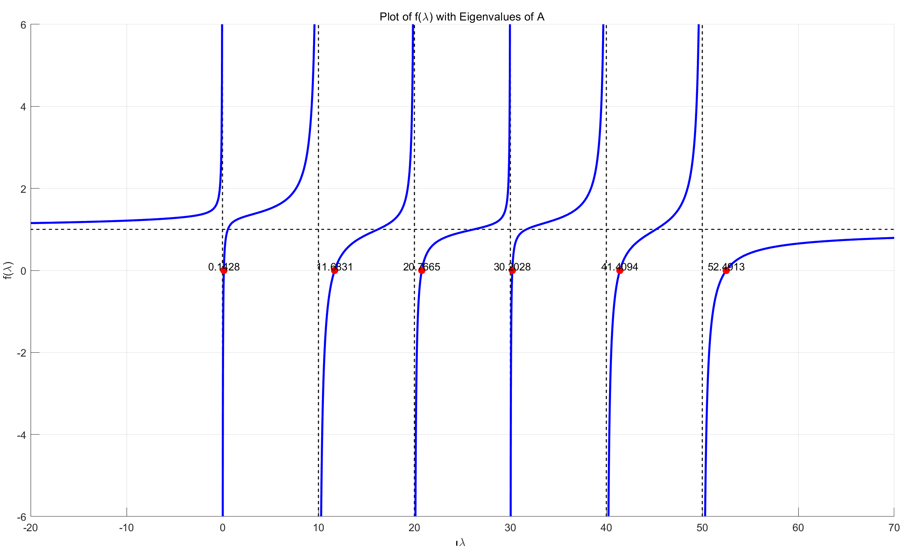
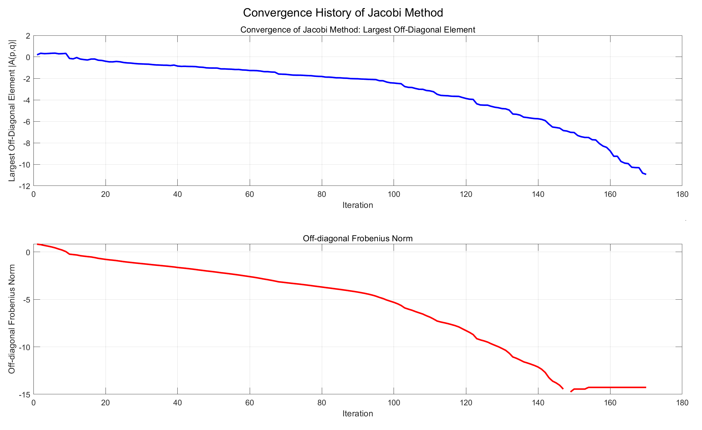
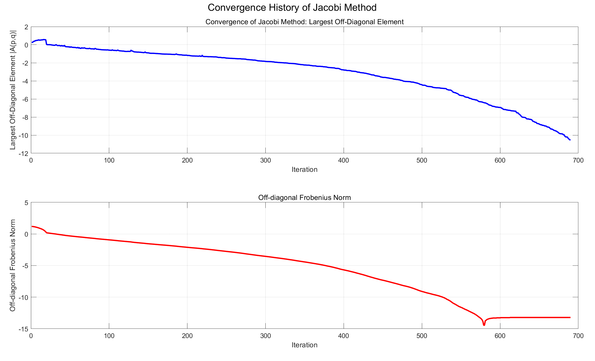
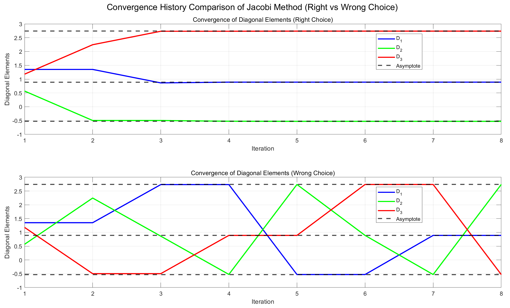

# 数值算法 Homework 09

Due: Nov. 19, 2024  
姓名: 雍崔扬   
学号: 21307140051

## Problem 1

Let $\hat x\in \mathbb R^n$ be an approximate eigenvalue of a real symmetric matrix $A$ such that $\|\hat x\|_2 = 1$  
Show that there exists a real symmetric matrix $\Delta A$ such that:  
$$
(A+\Delta A)\hat x = \hat x \hat \lambda\\
\|\Delta A\|_2 \leq \|A\hat x - \hat x \hat \lambda\|_2
$$
where $\hat \lambda = \hat x^T A \hat x$ 

- 这道题和 Homework 07 的 Problem 01 很相似，但结论无法照搬过来.

**Proof:**  
注意到:  
$$
\begin{align}
\Delta A \hat x 
&= \hat x \hat \lambda -A\hat x\\
\hat x^T\Delta A \hat x 
&=
\hat x^T(\hat x \hat \lambda - A\hat x)\quad (\text{note that }\|\hat x\|_2 = 1\text{ and }\hat \lambda = \hat x^TA\hat x)\\
&=
\hat \lambda - \hat x^TA\hat x\\
&=
0
\end{align}
$$
因此 $\hat x$ 与 $\Delta A \hat x = \hat x \hat \lambda -A\hat x$ 是正交的.  
于是我们可以构造如下的 Householder 矩阵:  
$$
\begin{align}
w &:= \frac{\hat x \hat \lambda - A \hat x}{\|\hat x \hat \lambda - A \hat x\|_2} - \hat x\\
\hline
\|w\|_2 
&=
\left\| \frac{\hat x \hat \lambda - A \hat x}{\|\hat x \hat \lambda - A \hat x\|_2} - \hat x \right\|_2
\quad (\text{note that }\hat x \ \bot\ (\hat x \hat \lambda - A\hat x))\\
&=
\sqrt{\left(\frac{\|\hat x \hat \lambda - A\hat x\|_2}{\|\hat x \hat \lambda - A\hat x\|_2}\right)^2 + \|\hat x\|_2^2}\quad (\text{note that }\|\hat x\|_2 = 1)\\
&=
\sqrt{1^2+1^2}\\
&=
\sqrt{2}\\
\hline
H &:=
I_n - 2\frac{ww^T}{\|w\|_2^2}\\
&=
I_n - ww^T
\end{align}
$$
容易验证 $H$ 是实对称阵，满足 $H\hat x = \frac{\hat x \hat \lambda - A \hat x}{\|\hat x \hat \lambda - A \hat x\|_2}$ 和 $\|H\|_2 = 1$ (注意到 $H$ 的特征值为 $-1$ 或 $1$)  
因此我们可以定义 $\Delta A:= \|\hat x\hat \lambda - A\hat x\|_2 H$，它是实对称阵，且满足:  
$$
\begin{align}
(A+\Delta A)\hat x 
&= A\hat x + \Delta A \hat x\\
&= A\hat x + \|\hat x \hat \lambda - A \hat x\|_2 H\hat x\\
&= A\hat x + \|\hat x \hat \lambda - A \hat x\|_2 \cdot \frac{\hat x \hat \lambda - A \hat x}{\|\hat x \hat \lambda - A \hat x\|_2}\\
&= A\hat x + \hat x \hat \lambda - A \hat x\\
&= \hat x \hat \lambda\\
\hline
\|\Delta A\|_2 
&= \|\|\hat x\hat \lambda - A\hat x\|_2 H\|_2\\
&= \|\hat x\hat \lambda - A\hat x\|_2 \|H\|_2\\
&= \|\hat x\hat \lambda - A\hat x\|_2\cdot 1\\
&= \|\hat x\hat \lambda - A\hat x\|_2
\end{align}
$$
这表明存在实对称阵 $\Delta A$ 满足: 
$$
(A+\Delta A)\hat x = \hat x \hat \lambda\\
\|\Delta A\|_2 \leq \|A\hat x - \hat x \hat \lambda\|_2
$$


## Problem 2

**(单边 Jacobi 方法的 Jacobi 变换矩阵)**  
Given $x,y\in \mathbb R^n$.  
Describe how to construct a rotation matrix $Q$ such that the columns of $[x,y]Q$ are orthogonal to each other.

**Solution:**  
旋转矩阵 $Q$ 具有如下形式:  
$$
Q=\begin{bmatrix}
c & s\\ -s & c\end{bmatrix}\text{ where }c,s\in \mathbb R\text{ such that }c^2 + s^2 =1 
$$
则我们有 $[x,y]Q = [cx -sy, sx + cy]$   
令 $cx -sy$ 和 $sx - cy$ 正交，则我们有:  
$$
\begin{align}
(cx -sy^T)(sx - cy)
&=
cs \|x\|^2 - s^2 y^Tx  + c^2 x^Ty - cs \|y\|^2\\
&=
cs(\|x\|^2 - \|y\|^2) - (s^2 - c^2) x^Ty\\
&=0
\end{align}
$$
即有 $cs(\|x\|^2 - \|y\|^2) - (s^2 - c^2) x^Ty=0$ 成立.  

- **(1)** 若 $x^Ty=0$，则 $x,y$ 已经正交了，此时可取 $\begin{cases}
  c=1\\
  s=0\end{cases}$ 

- **(2)** 当 $x^Ty\neq 0$ 时

  - ① 若 $x,y$ 线性相关 (即 $|x^Ty|=\|x\|\|y\|$)，则我们需要将其中一个置为零.   
    我们可以这样将两个线性相关的向量 $x,y\in \mathbb R^n$ 正交化: 
    $$
    \alpha = \frac{x^Ty}{\|x\|}\quad (\text{so that }y=\alpha x)\\
    \begin{bmatrix}
    x & \alpha x
    \end{bmatrix}
    \begin{bmatrix}
    c & s\\
    -s & c
    \end{bmatrix}=
    \begin{bmatrix}
    \sqrt{\alpha^2+1}x & 0_n
    \end{bmatrix}\text{ where }\begin{cases}
    c = \frac{1}{\sqrt{\alpha^2 + 1}}\\
    s = \frac{-\alpha}{\sqrt{\alpha^2+1}}
    \end{cases}
    $$
  
  - ② 若 $x,y$ 线性无关 (即 $|x^Ty|<\|x\|\|y\|$)，则我们有:  
    $$
    \frac{\|x\|^2 - \|y\|^2}{x^Ty} = \frac{s^2-c^2}{cs} = \frac{s}{c} - \frac{c}{s}
    $$
    记 $\begin{cases}
    t := \frac{s}{c}\\
    \tau:= \frac{\|y\|^2 - \|x\|^2}{2x^Ty} \end{cases}$ 则上式化为:  
    $$
    -2\tau = t - \frac{1}{t}\\
    \Leftrightarrow\\
    t^2 +2\tau t -1=0
    $$
    解得 $t = -\tau \pm \sqrt{1+\tau^2}$     
    我们选择模长较小的根，即 $t=\frac{\text{sgn}(\tau)}{|\tau| + \sqrt{1+\tau^2}}$，以保证旋转角 $\theta$ 满足 $|\theta|\leq \frac{\pi}{4}$  
    这对单边 Jacobi 方法的收敛性是至关重要的.  
    因为 $|\theta|\leq \frac{\pi}{4}$ 可以保证余弦占优，使得 Jacobi 变换矩阵更接近于单位阵，使得列次序不会变.


综上所述，我们有如下计算公式:  
$$
\begin{align}
&\text{if }x^Ty = 0\quad (\text{already orthogonal})\\
&\qquad c=1\\
&\qquad s=0\\
&\text{else}\\
&\qquad\text{if }|x^Ty|=\|x\|\|y\|\quad (\text{linear independent})\\
&\qquad\qquad \alpha = \frac{x^Ty}{\|x\|}\\
&\qquad\qquad c= \frac{1}{\sqrt{\alpha^2+1}}\\
&\qquad\qquad s= \frac{-\alpha}{\sqrt{\alpha^2+1}}\\
&\qquad\text{else}\\
&\qquad\qquad \tau = \frac{\|y\|^2 - \|x\|^2}{2x^Ty}\\
&\qquad\qquad t = \frac{\text{sgn}(\tau)}{|\tau| + \sqrt{1+\tau^2}}\\
&\qquad\qquad c = \frac{1}{\sqrt{1+t^2}}\\
&\qquad\qquad s = ct\\
&\qquad\text{end}\\
&\text{end}
\end{align}
$$

****

Matlab 代码为:

```matlab
function [c, s] = Jacobi_rotation(x, y)
    % Jacobi_rotation computes the rotation coefficients c and s
    % for the Jacobi rotation applied to the vectors x and y.
    
    % Compute the dot product of x and y
    x_dot_y = dot(x, y);
    
    % Case 1: x and y are orthogonal (dot product is close to zero)
    if abs(x_dot_y) < eps
        c = 1;
        s = 0;
        return;
    end
    
    % Case 2: x and y are linearly dependent
    if abs(x_dot_y) == norm(x) * norm(y)
        % Compute the scaling factor alpha
        alpha = x_dot_y / norm(x);
        
        % Compute c and s for the rotation
        c = 1 / sqrt(alpha^2 + 1);
        s = -alpha / sqrt(alpha^2 + 1);
        return;
    end
    
    % Case 3: x and y are linearly independent
    % Compute tau
    tau = (norm(y)^2 - norm(x)^2) / (2 * x_dot_y);
    
    % Compute t using the chosen root
    t = sign(tau) / (abs(tau) + sqrt(1 + tau^2));
    
    % Compute c and s
    c = 1 / sqrt(1 + t^2);
    s = c * t;
end
```

函数调用:

```matlab
n = 100;
x = rand(n, 1);
y = rand(n, 1);
A = [x, y];

disp("Check orthogonality of A:");
disp(A(:, 1)' * A(:, 2));

[c1, s1] = Jacobi_rotation(A(:, 1), A(:, 2));
A1 = A * [c1, s1; -s1, c1];
disp("Check orthogonality of A1:");
disp(A1(:, 1)' * A1(:, 2));

[c2, s2] = Jacobi_rotation(A1(:, 1), A1(:, 2));
A2 = A1 * [c2, s2; -s2, c2];
disp("Check orthogonality of A2:");
disp(A2(:, 1)' * A2(:, 2));

[c3, s3] = Jacobi_rotation(A2(:, 1), A2(:, 2));
A3 = A2 * [c3, s3; -s3, c3];
disp("Check orthogonality of A3:");
disp(A3(:, 1)' * A3(:, 2));

[c4, s4] = Jacobi_rotation(A3(:, 1), A3(:, 2));
A4 = A3 * [c4, s4; -s4, c4];
disp("Check orthogonality of A4:");
disp(A4(:, 1)' * A4(:, 2));
```

运行结果:

```matlab
Check orthogonality of A:
   22.3351

Check orthogonality of A1:
   5.0515e-15

Check orthogonality of A2:
  -5.5511e-16

Check orthogonality of A3:
  -1.1102e-16

Check orthogonality of A4:
  -1.1102e-16
```


## Problem 3

**(数值线性代数 引理 $7.5.1$ & 定理 $7.5.1$)**  
Let $D\in \mathbb R^{n\times n}$ be diagonal with distinct eigenvalues, $z\in \mathbb R^n$ be a vector with no zero entries, and $\rho\in \mathbb R\backslash \{0\}$   
Suppose that $(\lambda,u)$ is an eigenpair of $D+\rho zz^T$, show that:  

- ① $z^Tu\neq 0$ 
- ② $\lambda I_n - D$ is nonsingular
- ③ $(\lambda I_n - D)^{-1}z$ is an eigenvector of $D+\rho zz^T$

**Proof:**    
设 $(\lambda,u)$ 是 $D+\rho zz^T$ 的任意特征对，即满足 $(D+\rho zz^T)u = u\lambda$ (因而有 $(\lambda I_n - D)u = \rho zz^Tu$)

- **① 反证法证明 $z^Tu\neq 0$:**   
  假设 $z^Tu=0$，则 $(D+\rho zz^T) u = Du + \rho z (z^Tu) = Du = \lambda u$   
  这表明 $(\lambda,u)$ 是 $D$ 的特征对，  
  则必然存在某个 $i\in \{1,\dots,n\}$ 和 $\alpha\neq 0$ 使得 $d_i = \lambda$ 且 $u = \alpha e_i$   
  (这是因为 $I^T_n DI_n = D$ 即是 $D$ 的谱分解，而且 $D$ 的对角元 (即特征值) 互不相同)  
  于是有 $0 = z^Tu = z^T(\alpha e_i) = \alpha z^Te_i$   
  这与 "$z\in \mathbb R^n$ 的分量均不为零" 的假设矛盾，因此 $z^Tu \neq 0$

- **② 反证法证明 $\lambda I_n - D$ 非奇异:**  
  假设 $\lambda I_n - D$ 奇异，则必然存在某个 $i\in \{1,\dots,n\}$ 使得 $(\lambda I_n- D)e_i = 0_n$  
  从而有 $0 = [(\lambda I_n - D)e_i]^T u = e_i^T (\lambda I_n - D)u = e_i^T(\rho zz^Tu)= \rho (e_i^Tz)(z^Tu)$   
  由于 $z^Tu\neq 0$ 和 $\rho\neq 0$，故一定有 $e_i^Tz = 0$   
  这与 "$z\in \mathbb R^n$ 的分量均不为零" 的假设矛盾，因此 $\lambda I_n - D$ 非奇异.

- **③ 证明 $(\lambda I_n - D)^{-1}z$ 是 $D+\rho zz^T$ 的特征向量:**  
  根据①②可知 $z^Tu\neq 0$ 且 $\lambda I_n - D$ 非奇异，从而有:  
  $$
  (D+\rho zz^T) u = \lambda u\\
  \Leftrightarrow\\
  (\lambda I_n - D) u = \rho zz^T u  = \rho z^Tu \cdot z\\
  \Leftrightarrow\\
  (\lambda I_n - D)^{-1}z = \frac{1}{\rho z^Tu} u
  $$
  注意到 $u$ 是 $D+\rho zz^T$ 的特征向量，因此 $(\lambda I_n - D)^{-1}z$ 也是 $D+\rho zz^T$ 的特征向量.


## Problem 4

**(分而治之法特征值的胶合)**  
Randomly generate a relatively small (eg. $6\times 6$) real symmetric matrix of the form $A=\text{diag}\{d_1,\dots,d_n\}+zz^T$   
where $d_i$ are distinct, and $z$ does not have any zero entry.  
Visualize the funtion $f(\lambda) = 1-\sum_{i=1}^n \frac{z_i^2}{\lambda - d_i}$    
Hightlight the eigenvalues of $A$ in the plot and make sure they match the roots of $f(\lambda)$   
For simplicity, you may compute the eigenvalues of $A$ by `eig()` from MATLAB/Octave.

**Solution:**   
我们设 $D=\text{diag}\{0,10,20,30,40,50\}$，并随机生成 $z\in \mathbb R^6$   
分段绘制 $f(\lambda) = 1-\sum_{i=1}^n \frac{z_i^2}{\lambda - d_i}$ 图像，同时绘制渐近线 $y=1$ 和 $x=d_i\ (i=1,\dots,6)$  
最后标注 $A = D+zz^T$ 的 $6$ 个特征值.  
Matlab 代码如下:

```matlab
% Step 1: Generate the matrix A
rng(51);  % Set the random seed for reproducibility
n = 6;  % Dimension of the matrix (6x6)
d = 10*(0:n-1)';  % Set distinct diagonal entries
z = randn(n, 1);  % Generate random vector z with non-zero entries (n x 1)
A = diag(d) + z * z';

% Step 2: Compute eigenvalues of A
eigenvalues = eig(A);

% Step 3: Define the function f(lambda)
f = @(lambda) 1 - sum((z.^2)./(lambda - d));

% Step 4: Plot the function f(lambda)
figure;  % Create a new figure
hold on;  % Hold the current plot to overlay multiple elements

% Add the asymptote y = 1
lambda_min = min(d) - 20;  % Set the minimum value of lambda for the x-axis
lambda_max = max(d) + 20;  % Set the maximum value of lambda for the x-axis
lambda_range = linspace(lambda_min, lambda_max, 5000);  % Generate a range of lambda values
plot(lambda_range, ones(size(lambda_range)), 'k--', 'LineWidth', 1);  % Plot the horizontal asymptote y=1

% Highlight the vertical asymptotes at x = d_i
for i = 1:n
    plot([d(i), d(i)], [-10, 10], 'k--', 'LineWidth', 1);  % Plot vertical asymptotes at each d_i
end

% Plot the function in segments (based on the values of d_i)
for i = 1:n+1
    % Define the segment range
    if i == 1
        lambda_segment = linspace(lambda_min, d(1) - 1e-2, 1000);  % Left of d_1
    elseif i == n+1
        lambda_segment = linspace(d(n) + 1e-2, lambda_max, 1000);  % Right of d_n
    else
        lambda_segment = linspace(d(i-1) + 1e-2, d(i) - 1e-2, 1000);  % Between d_{i-1} and d_i
    end
    % Compute f(lambda) for this segment using arrayfun
    f_segment = arrayfun(f, lambda_segment, UniformOutput=false);
    f_segment = cell2mat(f_segment);  % Convert the cell array into a numeric array for plotting

    % Plot the function for this segment
    plot(lambda_segment, f_segment, 'LineWidth', 2, 'Color', "b");
end

% Plot the eigenvalues as points on the x-axis and label them
for i = 1:n
    scatter(eigenvalues(i), 0, 50, 'ro', 'filled');  % Plot eigenvalues as red circles
    text(eigenvalues(i), 0.1, num2str(eigenvalues(i), '%.4f'), 'HorizontalAlignment', 'center');
end

% Set axis limits and labels
ylim([-6, 6]);  % Limit y-axis for better visibility of the function
xlabel('\lambda');  % Label the x-axis
ylabel('f(\lambda)');  % Label the y-axis
title('Plot of f(\lambda) with Eigenvalues of A');  % Title for the plot
grid on;  % Enable grid on the plot

hold off;  % Release the hold to stop overlaying additional elements
```

运行结果:




## Problem 5

Implement the Jacobi diagonalization algorithm for real symmetric matrices.  
Visualize the performance for a few matrices with different sizes.  
Visualize the convergence history for one example.  
You are encouraged to make observations of componentwise convergence.  
You are also encouraged to try the "wrong" choice of Jacobi rotations for the cyclic Jacobi algorithm.

**Solution:**    
**经典 Jacobi 方法**的迭代格式为:  
$$
\text{Given symmetric matrix }A_0 = A\in \mathbb R^{n\times n}\\
\hline
(p,q) = \arg \max_{1\leq i<j\leq n} |a_{ij}^{(k)}|\\
\tau = \frac{a_{pp}^{(k)} - a_{qq}^{(k)}}{2a_{pq}^{(k)}}\\
t = \frac{\text{sgn}(\tau)}{|\tau| + \sqrt{1+\tau^2}}\\
c = \frac{1}{\sqrt{1+t^2}}\\
s = tc\\
J_k = I_n + (c-1) (e_pe_p^T + e_qe_q^T) + s (e_pe_q^T - e_qe_p^T) = \begin{array}{cl}
\begin{bmatrix}
  1 &  &  &  &  &  &  \\
   & \ddots &  &  &  &  &  \\
   &  & c & \cdots & s &  &  \\
   &  & \vdots & \ddots & \vdots &  &  \\
   &  & -s & \cdots & c &  &  \\
   &  &  &  &  & \ddots &  \\
   &  &  &  &  &  & 1 \\
\end{bmatrix} 
&
\begin{array}{}
\\
\\
p\\
\\
q\\
\\
\\
\end{array} \\
\begin{array}{}
&& \ \ p &\qquad& q &&\\
\end{array}
\end{array}\\

A^{(k+1)} = J_k A^{(k)} J_k^T
$$

注意在实际计算中我们无需计算出 Jacobi 变换 $J_k$ 的显式形式，只需计算其参数 $[c,s]$ 即可  
而应用该 Jacobi 变换只需对 $A^{(k)}$ 的第 $p,q$ 行左乘 $\begin{bmatrix}
c& s\\
-s & c\end{bmatrix}$ 再对第 $p,q$ 列右乘 $\begin{bmatrix}
c& s\\
-s & c\end{bmatrix}^T$(这样只需 $O(n)$ 级别的运算量)

*****

Matlab 代码:

```matlab
function [A, Q, history] = Classic_Jacobi(A, tolerance)
    % Jacobi method for diagonalizing a symmetric matrix A.
    % This method iteratively diagonalizes the matrix A by applying 
    % Jacobi rotations to its off-diagonal elements.
    % 
    % Input:
    %   A       - Symmetric matrix (n x n) that we want to diagonalize
    %   tolerance - Tolerance for stopping criterion. The iterations 
    %               stop when the largest off-diagonal element is 
    %               smaller than tolerance * Frobenius norm of A.
    %               (optional, default = 1e-6)
    %
    % Output:
    %   A       - Diagonalized matrix (eigenvalues of A) after the 
    %             Jacobi method
    %   Q       - Matrix containing the eigenvectors of A (i.e., Q is 
    %             the product of all the Jacobi rotation matrices)
    %   history - History of convergence metrics during the iterations, 
    %             where:
    %             - history(:, 1) contains the largest off-diagonal 
    %               element |A(p,q)|
    %             - history(:, 2) contains the difference 
    %               norm_A - norm(diag(A)) (how far A is from being diagonal)

    % Initialize variables
    n = size(A, 1);  % Size of the matrix (n x n)
    Q = eye(n);  % Initialize Q as the identity matrix (eigenvectors)
    num_iter = 0;  % Initialize the iteration count
    max_iter = 1e5;  % Maximum number of iterations allowed
    norm_A = norm(A, 'fro');  % Frobenius norm of A (used for convergence check)
    history = zeros(max_iter, 2);  % Pre-allocate history matrix to store convergence data
    
    % If tolerance is not provided, set default value
    if nargin < 2
        tolerance = 1e-6;  % Default tolerance if not specified
    end

    % Perform Jacobi iterations
    while num_iter < max_iter
        % Step 1: Find the largest off-diagonal element
        % tril(A, -1) extracts the lower triangular part of A excluding diagonal
        [~, idx] = max(abs(tril(A, -1)), [], 'all', 'linear');  % Find the index of largest off-diagonal element
        [p, q] = ind2sub([n, n], idx);  % Convert linear index to row-column indices
        
        % Step 2: Convergence check
        % If the largest off-diagonal element is small enough, stop the iterations
        if abs(A(p, q)) < tolerance * norm_A
            break;  % Convergence reached, exit the loop
        end

        % Step 3: Record the convergence history
        num_iter = num_iter + 1;    % Increment the iteration count
        history(num_iter, 1) = abs(A(p, q));
        history(num_iter, 2) = abs(norm_A - norm(diag(A)));
        
        % Step 4: Compute the Jacobi rotation parameters
        tau = (A(p, p) - A(q, q)) / (2 * A(p, q));  
        t = sign(tau) / (abs(tau) + sqrt(1 + tau^2));  
        c = 1 / sqrt(1 + t^2);
        s = c * t;
        G = [c, s; -s, c];
        
        % Step 5: Apply the Jacobi transformation
        A([p, q], :) = G * A([p, q], :);  
        A(:, [p, q]) = A(:, [p, q]) * G';  
        Q([p, q], :) = G * Q([p, q], :);

    end

    % If the loop finishes due to exceeding max iterations, show a warning
    if num_iter == max_iter
        fprintf("Warning: Max number of iterations (%d) reached!\n", max_iter);
    end

    % Trim the history array to the actual number of iterations performed
    history = history(1:num_iter, :);  % Keep only the used part of the history matrix
end
```

函数调用:

```matlab
% Set up the random matrix and tolerance
rng(51);
n = 10;  % Size of the matrix
A = rand(n, n);
A = A + A';  % Make A symmetric

tolerance = 1e-12;  % Convergence tolerance

% Call the Jacobi method to diagonalize A
[D, Q, history] = Classic_Jacobi(A, tolerance);

% Display the results
disp("Frobenius norm of (Q'*D*Q - A):");
disp(norm(Q' * D * Q - A, "fro"));  % Check the residual norm
disp('Diagonal values of D:');
disp(sort(diag(D))');  % Eigenvalues (diagonal elements of D)
disp('Eigenvalues using MATLAB eig function:');
disp(sort(eig(A))');  % Compare with MATLAB's built-in eig function

% Now visualize the convergence history
% Plot the largest off-diagonal element |A(p,q)|
figure;
subplot(2, 1, 1);  % First subplot (top)
plot(1:size(history, 1), log10(history(:, 1)), 'LineWidth', 2, 'Color', 'b');
xlabel('Iteration');
ylabel('Largest Off-Diagonal Element |A(p,q)|');
title('Convergence of Jacobi Method: Largest Off-Diagonal Element');
grid on;

% Plot the difference between Frobenius norm and diagonal norm
subplot(2, 1, 2);  % Second subplot (bottom)
plot(1:size(history, 1),log10(history(:, 2)), 'LineWidth', 2, 'Color', 'r');
xlabel('Iteration');
ylabel('Off-diagonal Frobenius Norm');
title('Off-diagonal Frobenius Norm');
grid on;

% Display the figure
sgtitle('Convergence History of Jacobi Method');
```

**运行结果:**  
非对角部分的 Frobenius 范数的迭代历史符合 "全局线性收敛，局部二次收敛" 的特征.

- $n=10$ 的情况:

  ```
  Frobenius norm of (Q'*D*Q - A):
     1.5997e-14
  
  Diagonal values of D:
     -1.4696   -1.1807   -1.0069   -0.4053   -0.1221    0.0246    1.3734    1.4301    1.8086    9.2475
  
  Eigenvalues using MATLAB eig function:
     -1.4696   -1.1807   -1.0069   -0.4053   -0.1221    0.0246    1.3734    1.4301    1.8086    9.2475
  ```

  

- $n=20$ 的情况:

  ```
  Frobenius norm of (Q'*D*Q - A):
     1.5066e-13
  
  Diagonal values of D:
     -2.9637   -2.6540   -2.4471   -1.8129   -1.4256   -1.3532   -1.1253   -0.7604   -0.4077   -0.2951        0.0304	  0.4827    0.7717    1.2391    1.7859    1.9791    2.4185    2.9331    3.7000   19.6120
  
  Eigenvalues using MATLAB eig function:
     -2.9637   -2.6540   -2.4471   -1.8129   -1.4256   -1.3532   -1.1253   -0.7604   -0.4077   -0.2951        0.0304	  0.4827    0.7717    1.2391    1.7859    1.9791    2.4185    2.9331    3.7000   19.6120
  ```

  

*****

要选取错误的 $t$，我们只需简单地将 $t=\frac{\text{sgn}(\tau)}{|\tau| + \sqrt{1+\tau^2}}$ 改成 $t=-\tau - \text{sgn}(\tau) \sqrt{1+\tau^2}$ 即可.  
具体来说，要将 `Classic_Jacobi()` 函数中的 `t = sign(tau) / (abs(tau) + sqrt(1 + tau^2)); ` 语句  
改成 `t = -tau - sign(tau) * sqrt(1 + tau^2);` 语句.  
我们引入新的参数 `choice` 指明使用正确的 $t$ 还是错误的 $t$，并记录 $A$ 的对角元迭代历史:

```matlab
function [A, Q, history] = Classic_Jacobi(A, tolerance, choice)
    % Jacobi method for diagonalizing a symmetric matrix A.
    % This method iteratively diagonalizes the matrix A by applying 
    % Jacobi rotations to its off-diagonal elements.
    % 
    % Input:
    %   A       - Symmetric matrix (n x n) that we want to diagonalize
    %   tolerance - Tolerance for stopping criterion. The iterations 
    %               stop when the largest off-diagonal element is 
    %               smaller than tolerance * Frobenius norm of A.
    %               (optional, default = 1e-6)
    %
    % Output:
    %   A       - Diagonalized matrix (eigenvalues of A) after the 
    %             Jacobi method
    %   Q       - Matrix containing the eigenvectors of A (i.e., Q is 
    %             the product of all the Jacobi rotation matrices)
    %   history - History of convergence metrics during the iterations, 
    %             where:
    %             - history(:, 1) contains the largest off-diagonal 
    %               element |A(p,q)|
    %             - history(:, 2) contains the difference 
    %               norm_A - norm(diag(A)) (how far A is from being diagonal)

    % Initialize variables
    n = size(A, 1);  % Size of the matrix (n x n)
    Q = eye(n);  % Initialize Q as the identity matrix (eigenvectors)
    num_iter = 0;  % Initialize the iteration count
    max_iter = 1e5;  % Maximum number of iterations allowed
    norm_A = norm(A, 'fro');  % Frobenius norm of A (used for convergence check)
    history = zeros(max_iter, n+2);  % Pre-allocate history matrix to store convergence data
    
    % If tolerance is not provided, set default value
    if nargin < 2
        tolerance = 1e-6;  % Default tolerance if not specified
    end

    % Perform Jacobi iterations
    while num_iter < max_iter
        % Step 1: Find the largest off-diagonal element
        % tril(A, -1) extracts the lower triangular part of A excluding diagonal
        [~, idx] = max(abs(tril(A, -1)), [], 'all', 'linear');  % Find the index of largest off-diagonal element
        [p, q] = ind2sub([n, n], idx);  % Convert linear index to row-column indices
        
        % Step 2: Convergence check
        % If the largest off-diagonal element is small enough, stop the iterations
        if abs(A(p, q)) < tolerance * norm_A
            break;  % Convergence reached, exit the loop
        end

        % Step 3: Record the convergence history
        num_iter = num_iter + 1;    % Increment the iteration count
        history(num_iter, 1) = abs(A(p, q));
        history(num_iter, 2) = abs(norm_A - norm(diag(A)));
        for i = 1:n
            history(num_iter, i+2) = A(i, i);
        end
        
        % Step 4: Compute the Jacobi rotation parameters
        tau = (A(p, p) - A(q, q)) / (2 * A(p, q));  
        if choice == 1
            t = sign(tau) / (abs(tau) + sqrt(1 + tau^2)); % right choice of t
        else
            t = -tau - sign(tau) * sqrt(1 + tau^2); % wrong choice of t
        end
        c = 1 / sqrt(1 + t^2);
        s = c * t;
        G = [c, s; -s, c];
        
        % Step 5: Apply the Jacobi transformation
        A([p, q], :) = G * A([p, q], :);  
        A(:, [p, q]) = A(:, [p, q]) * G';  
        Q([p, q], :) = G * Q([p, q], :);

    end

    % If the loop finishes due to exceeding max iterations, show a warning
    if num_iter == max_iter
        fprintf("Warning: Max number of iterations (%d) reached!\n", max_iter);
    end

    % Trim the history array to the actual number of iterations performed
    history = history(1:num_iter, :);  % Keep only the used part of the history matrix
end
```

以 $n=3$ 的情况为例:

```matlab
% Set up the random matrix and tolerance
rng(51);
n = 3;  % Matrix size
A = rand(n, n);
A = A + A';  % Make A symmetric
tolerance = 1e-12;  % Convergence tolerance

% Call the Jacobi method to diagonalize A for both choices
[D_right, Q_right, history_right] = Classic_Jacobi(A, tolerance, 1);  % Right choice of t
[D_wrong, Q_wrong, history_wrong] = Classic_Jacobi(A, tolerance, 0);  % Wrong choice of t

% Plot the convergence history for diagonal elements
figure;

% Plot diagonal convergence for right choice
subplot(2, 1, 1);
plot(1:size(history_right, 1), history_right(:, 3), 'LineWidth', 2, 'Color', 'b');
hold on;
plot(1:size(history_right, 1), history_right(:, 4), 'LineWidth', 2, 'Color', 'g');
plot(1:size(history_right, 1), history_right(:, 5), 'LineWidth', 2, 'Color', 'r');

% Add asymptotic lines (final eigenvalues for D_right)
final_eigenvalues_right = sort(diag(D_right));
yline(final_eigenvalues_right(1), '--k', 'LineWidth', 2);  % Asymptote for D1
yline(final_eigenvalues_right(2), '--k', 'LineWidth', 2);  % Asymptote for D2
yline(final_eigenvalues_right(3), '--k', 'LineWidth', 2);  % Asymptote for D3

xlabel('Iteration');
ylabel('Diagonal Elements');
title('Convergence of Diagonal Elements (Right Choice)');
grid on;
legend('D_{1}', 'D_{2}', 'D_{3}', 'Asymptote', 'Location', 'best');

% Plot diagonal convergence for wrong choice
subplot(2, 1, 2);
plot(1:size(history_wrong, 1), history_wrong(:, 3), 'LineWidth', 2, 'Color', 'b');
hold on;
plot(1:size(history_wrong, 1), history_wrong(:, 4), 'LineWidth', 2, 'Color', 'g');
plot(1:size(history_wrong, 1), history_wrong(:, 5), 'LineWidth', 2, 'Color', 'r');

% Add asymptotic lines (final eigenvalues for D_wrong)
final_eigenvalues_wrong = sort(diag(D_wrong));
yline(final_eigenvalues_wrong(1), '--k', 'LineWidth', 2);  % Asymptote for D1
yline(final_eigenvalues_wrong(2), '--k', 'LineWidth', 2);  % Asymptote for D2
yline(final_eigenvalues_wrong(3), '--k', 'LineWidth', 2);  % Asymptote for D3

xlabel('Iteration');
ylabel('Diagonal Elements');
title('Convergence of Diagonal Elements (Wrong Choice)');
grid on;
legend('D_{1}', 'D_{2}', 'D_{3}', 'Asymptote', 'Location', 'best');

% Display the figure title
sgtitle('Convergence History Comparison of Jacobi Method (Right vs Wrong Choice)');
```

**运行结果:**  
我们发现当使用正确的 $t$ 时，对角元会各自目标一致地收敛到对应的特征值.  
而当经典 Jacobi 算法使用错误的 $t$ 时，尽管从整体上来说对角元是收敛的，但它们会发生次序交换.  
(当我们从经典 Jacobi 算法改进到循环 Jacobi 算法时，使用错误的 $t$ 可能会导致不收敛)  




## Problem 6 (optional)

**(Lowner 定理, Applied Numerical Linear Algebra, J. W. Demmel, 定理 $5.10$)**  
Let $D=\text{diag}\{d_1,\dots,d_n\}$ be a real diagonal matrix.  
Let $\alpha_1,\dots,\alpha_n$ be real scalars that satisfy:  
$$
d_n<\alpha_n <\dots < d_i < \alpha_i < d_{i-1}<\alpha_{i-1} < \dotsm < d_1 < \alpha_1
$$
Define:  
$$
u_i = \left(\frac{\prod_{1\leq j\leq n} (\alpha_j-d_i)}{\prod_{1\leq j\leq n,j\neq i}(d_j-d_i)}\right)^{\frac12}\ (i=1,\dots,n)
$$
Show that $\alpha_i\ (i=1,\dots,n)$ are exact eigenvalues of $D+uu^T$

- **邵老师:** 这个结论是证明分而治之法数值稳定性的基础.
- **Lemma 1: (数值线性代数, 定理 $7.5.1$)**  
  设 $D=\text{diag}(d_1,\dots,d_n)\in \mathbb R^{n\times n}$ 满足 $d_1>\dotsm > d_n$，而 $\rho$ 是非零实数，$z\in \mathbb R^n$ 的分量均不为零.    
  若 $D+\rho zz^T$ 的谱分解为 $V^T(D+\rho zz^T) V = \text{diag}(\lambda_1,\dots,\lambda_n)$  
  其中 $V=[v_1,\dots,v_n]\in \mathbb R^{n\times n}$ 为正交阵且 $\lambda_1 \geq \dotsm \geq \lambda_n$   
  则我们有:  
  - 存在常数 $\alpha_i \neq 0$ 使得 $v_i = \alpha_i (D-\lambda_i I)^{-1} z\ \ (i=1,\dots,n)$ 
  - 多项式 $f(\lambda) = 1 + \rho z^T(D-\lambda I)^{-1} z$ 恰好有 $n$ 个根，具体来说是 $n$ 个单重实根 $\lambda_1,\dots,\lambda_n$ (即互不相同)   
    当 $\rho>0$ 时有 $\lambda_1>d_1>\dotsm > \lambda_n > d_n$   
    当 $\rho<0$ 时有 $d_1>\lambda_1 > \dots > d_n > \lambda_n$ 

**Proof:**     
当 $D-\lambda I$ 可逆时，$D+uu^T$ 的特征多项式可以写成:  
$$
\begin{align}
\det(D+uu^T-\lambda I)
&=
\det((D-\lambda I) (I-(D-\lambda I)^{-1}uu^T))\\
&=
\det(D-\lambda I) \det(I-(D-\lambda I)^{-1}uu^T)\\
&=
\det(D-\lambda I) (1 + u^T(D-\lambda I)^{-1}u)\\
&=
\left[
\prod_{j=1}^n (d_j-\lambda)
\right]
\cdot
\left[
1 + \sum_{j=1}^n \frac{u_j^2}{d_j-\lambda}
\right]\\
&=
\left[
\prod_{j=1}^n (d_j-\lambda)
\right]
\cdot
\left[
1 + \sum_{j=1,j\neq i}^n \frac{u_j^2}{d_j-\lambda}
\right]
+
\left[
\prod_{j=1,j\neq i}^n (d_j-\lambda)
\right]
\cdot 
u_i^2
\end{align}\ (\forall\ i=1,\dots,n)
$$
注意到 $D+uu^T$ 的特征多项式同时还可以写成 $\det(D+uu^T-\lambda I)=\prod_{j=1}^n (\alpha_j-\lambda)$   
令 $\lambda= d_i$ 我们即有:
$$
\prod_{j=1}^n (\alpha_j-d_i) =  0+\left[ \prod_{j=1,j\neq i}^n (d_j-d_i) \right]\cdot u_i^2\\
\Leftrightarrow\\
u_i^2 = \frac{\prod_{1\leq j\leq n} (\alpha_j-d_i)}{\prod_{1\leq j\leq n,j\neq i}(d_j-d_i)}\ (i=1,\dots,n)
$$
利用交错性质 $d_n<\alpha_n <\dots < d_i < \alpha_i < d_{i-1}<\alpha_{i-1} < \dotsm < d_1 < \alpha_1$   
可以证明 $\frac{\prod_{1\leq j\leq n} (\alpha_j-d_i)}{\prod_{1\leq j\leq n,j\neq i}(d_j-d_i)}$ 是正值，因此 $u_i$ 可取其平方根，具体来说:  
$$
u_i = \left(\frac{\prod_{1\leq j\leq n} (\alpha_j-d_i)}{\prod_{1\leq j\leq n,j\neq i}(d_j-d_i)}\right)^{\frac12}\ (i=1,\dots,n)
$$
命题得证.

****

**(失败的尝试)**  
要证明 $\alpha_i\ (i=1,\dots,n)$ 是 $D+uu^T$ 的特征值，  
只需证明它们是函数 $f(\lambda)=1 + u^T(D-\lambda I)^{-1} u$ 的根.

注意到:  
$$
\begin{align}
f(\lambda) 
&= 1 + u^T(D-\lambda I)^{-1} u\\
&= 1 + \sum_{i=1}^n \frac{u_i^2}{d_i-\lambda}\\
&= 1 + \sum_{i=1}^n \left\{\frac{1}{d_i-\lambda} \frac{\prod_{1\leq j\leq n} (\alpha_j-d_i)}{\prod_{1\leq j\leq n,j\neq i}(d_j-d_i)} \right\}\\
&= 1 - \sum_{i=1}^n \left\{\frac{1}{\lambda - d_i} \frac{\prod_{1\leq j\leq n} (\alpha_j-d_i)}{\prod_{1\leq j\leq n,j\neq i}(d_j-d_i)} \right\}
\end{align}
$$
对于任意 $k=1,\dots,n$，我们都有:  
$$
\begin{align}
f(\alpha_k) 
&=
1 - \sum_{i=1}^n \left\{\frac{1}{\alpha_k - d_i} \frac{\prod_{1\leq j\leq n} (\alpha_j-d_i)}{\prod_{1\leq j\leq n,j\neq i}(d_j-d_i)} \right\}\\
&=
1- \frac{1}{\prod_{i=1}^n (\alpha_k - d_i) \prod_{1\leq i<j\leq n} (d_j-d_i)}\sum_{i=1}^n  
\left\{ 
(-1)^{i-1}\prod_{1\leq j\leq n} (\alpha_j-d_i) \prod_{1\leq j\leq n,j\neq i}(\alpha_k - d_j) \prod_{\begin{subarray}{} 
1\leq p<j\leq n\\
p,j\neq i\end{subarray}}(d_j-d_p)
\right\}\\
\end{align}
$$

**数学归纳法:**

- 当 $n=2$ 时，我们有:  
  $$
  \begin{align}
  f(\alpha_k)
  &=
  1-\frac{1}{(\alpha_k-d_1)(\alpha_k-d_2) (d_2-d_1)}
  \left\{ 
  (\alpha_1 - d_1)(\alpha_2 - d_1)(\alpha_k- d_2) - (\alpha_1-d_2)(\alpha_2 -d_2)(\alpha_k - d_1)
  \right\}\\
  &=
  1-\frac{1}{(\alpha_k-d_1)(\alpha_k-d_2) (d_2-d_1)}
  \left\{ 
  (\alpha_1 - d_1)(\alpha_2 - d_1)(\alpha_k- d_2) - (\alpha_1-d_2)(\alpha_2 -d_2)(\alpha_k - d_1)
  \right\}\\
  \hline
  f(\alpha_1)
  &=
  1-\frac{1}{(\alpha_1-d_1)(\alpha_1-d_2) (d_2-d_1)}
  \left\{ 
  (\alpha_1 - d_1)(\alpha_2 - d_1)(\alpha_1- d_2) - (\alpha_1-d_2)(\alpha_2 -d_2)(\alpha_1 - d_1)
  \right\}\\
  &=
  1 - \frac{1}{(\alpha_1-d_1)(\alpha_1-d_2) (d_2-d_1)}(\alpha_1-d_1)(\alpha_1-d_2)[(\alpha_2 -d_1)-(\alpha_2 -d_2)]\\
  &=
  1 - \frac{1}{(\alpha_1-d_1)(\alpha_1-d_2) (d_2-d_1)}(\alpha_1-d_1)(\alpha_1-d_2) (d_2-d_1)\\
  &=
  0\\
  \hline
  f(\alpha_2)
  &=
  1-\frac{1}{(\alpha_2-d_1)(\alpha_2-d_2) (d_2-d_1)}
  \left\{ 
  (\alpha_1 - d_1)(\alpha_2 - d_1)(\alpha_2- d_2) - (\alpha_1-d_2)(\alpha_2 -d_2)(\alpha_2 - d_1)
  \right\}\\
  &=
  1-\frac{1}{(\alpha_2-d_1)(\alpha_2-d_2) (d_2-d_1)}(\alpha_2-d_1)(\alpha_2-d_2) [(\alpha_1-d_1)-(\alpha_1-d_2)]\\
  &=
  1- \frac{1}{(\alpha_2-d_1)(\alpha_2-d_2)(d_2-d_1)}(\alpha_2-d_1)(\alpha_2-d_2)(d_2-d_1)\\
  &=
  0
  \end{align}
  $$
  因此 $n=2$ 时命题成立.

- 假设 $n-1$ 阶的情况命题成立，下面考虑 $n$ 阶的情况.  
  我们记:
  $$
  v_i = \left(\frac{\prod_{1\leq j\leq n-1} (\alpha_j-d_i)}{\prod_{1\leq j\leq n-1,j\neq i}(d_j-d_i)}\right)^{\frac12}\ (i=1,\dots,n-1)\\
  
  g(\lambda) = 1 + \sum_{i=1}^{n-1} \frac{v_i^2}{d_i-\lambda}
  $$
  则我们有:  
  $$
  g(\alpha_k) = 1 + \sum_{i=1}^{n-1} \frac{v_i^2}{d_i - \alpha_k}\ (k=1,\dots,n-1)\\
  u_i^2 = 
  \begin{cases}
  v_i^2\cdot \frac{\alpha_n - d_i}{d_n-d_i} & \text{if }i=1,\dots,n-1\\
  \frac{\prod_{1\leq j\leq n}(\alpha_j - d_n)}{\prod_{1\leq j\leq n-1}(d_j-d_n)}&\text{if }i=n
  \end{cases}
  $$
  于是当 $k=1,\dots,n-1$ 时我们有:
  $$
  \begin{align}
  f(\alpha_k)
  &=
   1 + \sum_{i=1}^n \frac{u_i^2}{d_i-\alpha_k}\\
  &=
   1 + \sum_{i=1}^{n-1} \frac{v_i^2}{d_i-\alpha_k}\frac{\alpha_n - d_i}{d_n-d_i} + 
  \frac{1}{d_n-\alpha_k}\frac{\prod_{1\leq j\leq n}(\alpha_j - d_n)}{\prod_{1\leq j\leq n-1}(d_j-d_n)}\\
  &=
  1 + \sum_{i=1}^{n-1} \frac{v_i^2}{d_i-\alpha_k} + \sum_{i=1}^n \frac{v_i^2}{ d_i- \alpha_k}\frac{\alpha_n-d_n}{d_n-d_i} + \frac{1}{d_n-\alpha_k}\frac{\prod_{1\leq j\leq n}(\alpha_j - d_n)}{\prod_{1\leq j\leq n-1}(d_j-d_n)}\\
  &=
  0 + ()
  
  \end{align}
  $$
  (此路不通…)


## Problem 7 (optional)

When bidiagonalizing an $m\times n$ matrix with $m>n$, there are two common options:  
bidiagonalization after $\text{QR}$ decomposition versus direct bidiagonalization.  
Suppose that both left and right orthogonal transformations need to be accumulated.  
Calculate the cost in terms of number of floating-point operations for these options,  
determine the crossover point.  
Will the crossover point change if orthogonal transformations are not accumulated?

**Solution:**     
不失一般性，考虑 $m\geq n$ 的情况.  
直观来看，当 $m\gg n$ 时，先进行 $\text{QR}$ 分解再对 $R$ 的分块进行二对角化更加高效.

**(Householder 方法计算 $\text{QR}$ 分解, 数值线性代数, 算法 $3.3.1$)**  
$$
\begin{align}
&\text{function: }[Q,R] = \text{Householder\_QR}(A)\\
&\qquad [m,n] = \text{size}(A)\\
&\qquad Q = I_m\\
&\qquad\text{for }k=1:\min(m-1,n)\\
&\qquad\qquad [v,\beta] = \text{Householder}(A(k:m,k))\\
&\qquad\qquad A(k:m,k:n) = A(k:m,k:n) - (\beta v)(v^TA(k:m,k:n))\\
&\qquad\qquad Q(1:m,k:m) = Q(1:m,k:m) - (Q(1:m,k:m) v)(\beta v)^T \\
&\qquad\text{end}\\
&\text{end}
\end{align}
$$
如果不计算正交矩阵 $Q$ 的话，总浮点运算量为 $2n^2(m-\frac{n}{3})$  
如果需要累积 $Q$，总浮点运算量为 $4(m^2n-mn^2 + \frac{n^3}{3})$
尽管我们的算法中使用的是向前累积，但我们实际计算时选用更加经济的向后累积 (Matrix Computation $5.1.6$ 节)  
即从最后一个 Householder 变换开始累积，这样利用稀疏性 (从第一个 Householder 变换开始累积会直接变成满矩阵)   

**(Householder 变换法实现二对角化, 数值线性代数, 算法 $7.6.1$)**  
$$
\begin{align}
&\text{Given matrix }A\in \mathbb R^{m\times n}\ (m\geq n)\\
& U = I_m\\
& V = I_n\\
\hline
&\text{for }k=1:n-2\\
&\qquad [v,\beta] = \text{Householder}(A(k:m,k))\\
&\qquad A(k:m,k:n) = A(k:m,k:n) - (\beta v)[v^TA(k:m,k:n)]\\
&\qquad U(1:m,k:m) = U(1:m,k:m) - [U(1:m,k:m)v](\beta v)^T\\
&\qquad [v,\beta] = \text{Householder}(A(k,k+1:n)^T)\\
&\qquad A(k:m,k+1:n) = A(k:m,k+1:n) -[A(k:m,k+1:n)v](\beta v)^T\\
&\qquad V(1:n,k+1:n) = V(1:n,k+1:n) -[V(1:n,k+1:n)v](\beta v)^T\\
&\text{end}\\

\hline
&[v,\beta] = \text{Householder}(A(n-1:m,n-1))\quad (\text{case of }k=n-1)\\
&A(n-1:m,n-1:n) = A(n-1:m,n-1:n) - (\beta v)[v^TA(n-1:m,n-1:n)]\\
&U(1:m,n-1:m) = U(1:m,n-1:m) - [U(1:m,n-1:m)v](\beta v)^T\\

\hline
&[v,\beta] = \text{Householder}(A(n:m,n))\qquad \qquad\ \  (\text{case of }k=n)\\
&A(n:m,n) = A(n:m,n) - (\beta v)[v^TA(n:m,n)]\\
&U(1:m,n:m) = U(1:m,n:m)-[U(1:m,n:m) v](\beta v)^T
\end{align}
$$
最终二对角阵 $B\in \mathbb R^{n\times n}$ 存储在 $A(1:n,1:n)$   
我们得到 $A^TA$ 的隐式的对称三对角分解 $V^TA^TAV = B^TB = T$ 

上述算法 (不考虑累积 $U$ 和 $V$) 所需的运算量为 $4mn^2 - \frac43 n^3$   
若需要累积 $U$ 和 $V$，则需要额外增加 $4m^2n-\frac43 n^3$ 和 $\frac43 n^3$ 的计算量.

*****

不需累积正交变换时:

- 直接双对角化: $4mn^2 - \frac43 n^3 = 4n^2(m-\frac{n}{3})$ 
- 先 QR 分解再双对角化: $2n^2(m-\frac{n}{3}) + 4n^2(n-\frac{n}{3}) = 2n^2(m+n)$
- 临界点 $m=\frac{5}{3}n$

需要累积正交变换时:

- 直接双对角化: $(4mn^2 - \frac43 n^3) + (4m^2n-\frac43 n^3) + \frac{4}{3}n^3 = 4m^2n +4mn^2 - \frac{4}{3}n^3$ 
- 先 QR 分解再双对角化: $4(m^2n-mn^2 + \frac{n^3}{3}) + 4n^2(2n-\frac{n}{3}) + mn^2 = 4m^2n - 3mn^2 + 8n^3$   
  (假设 $Q$ 与 $U$ 的累积代价为 $mn^2$) 
- 临界点 $m=\frac{4}{3}n$

实际计算时还会有通讯的开销，所以上述结果只是参考.
