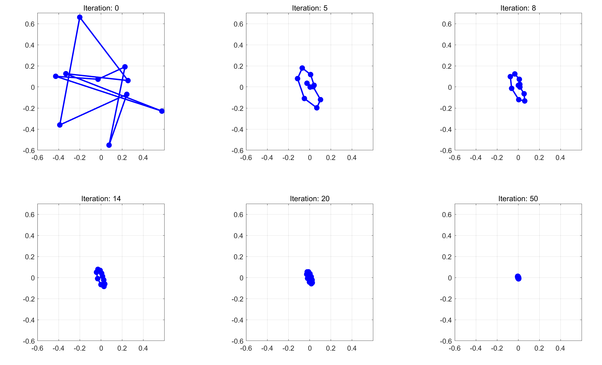
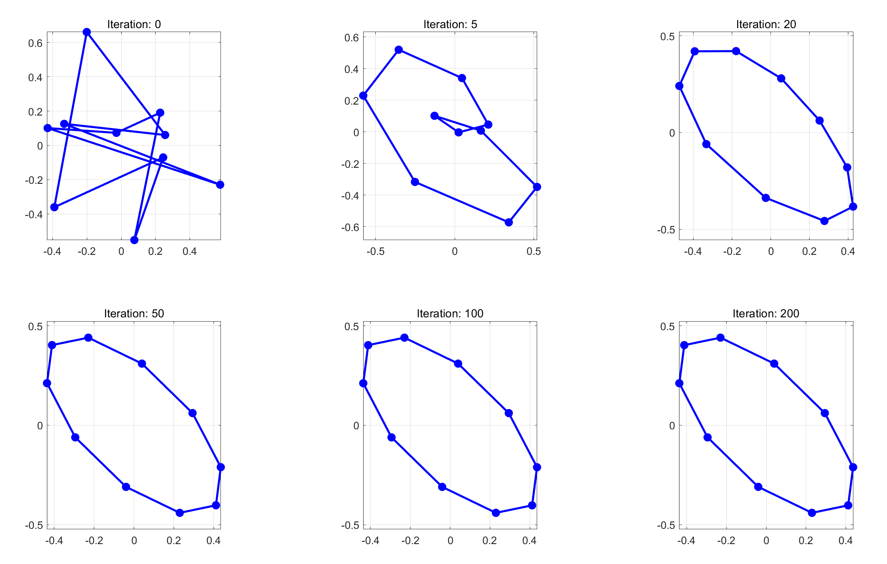
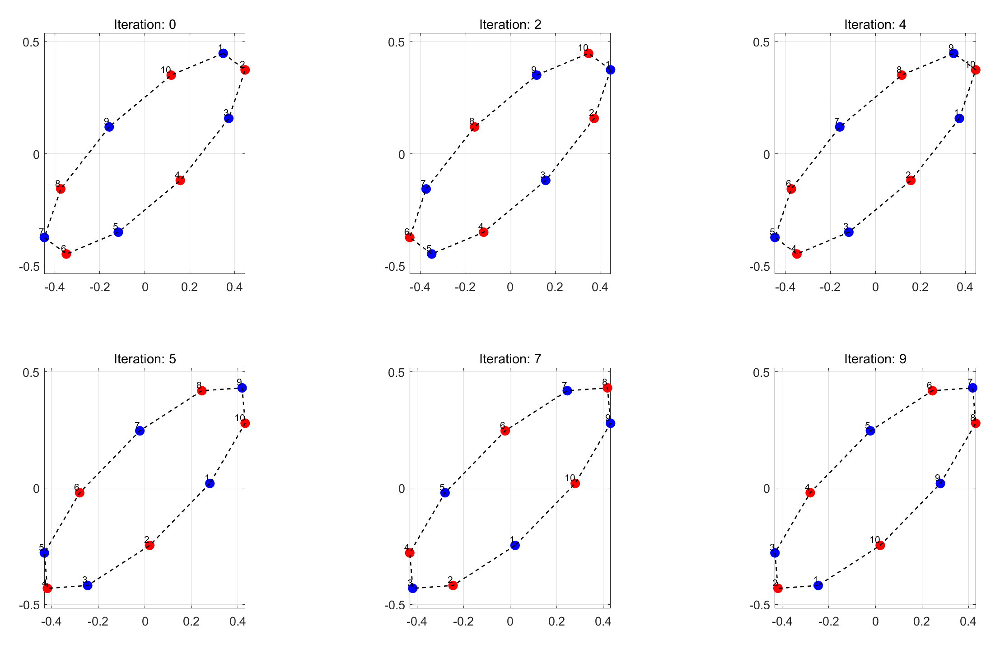
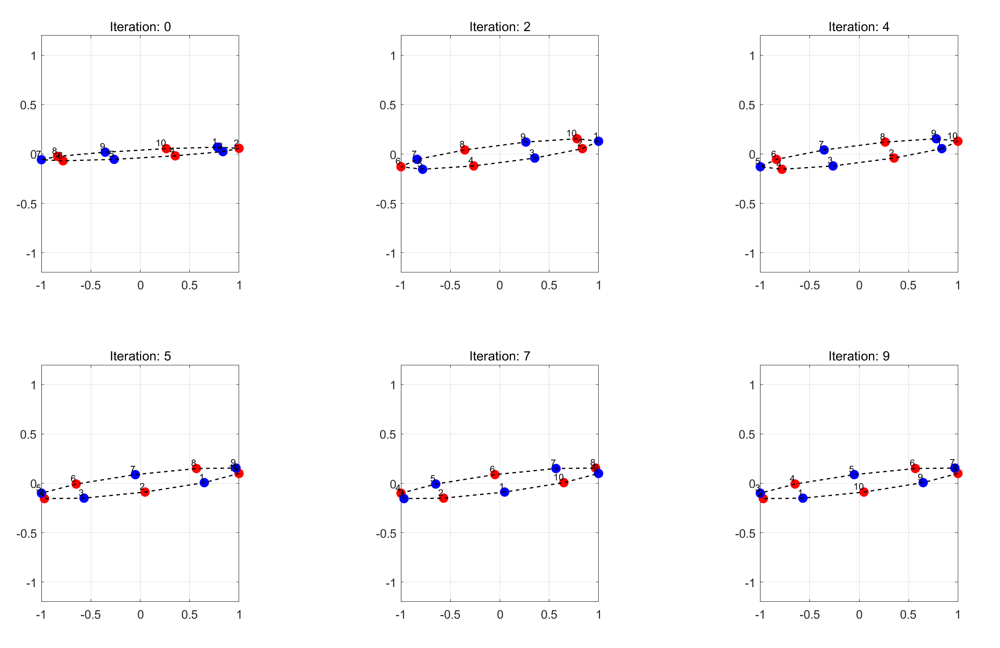
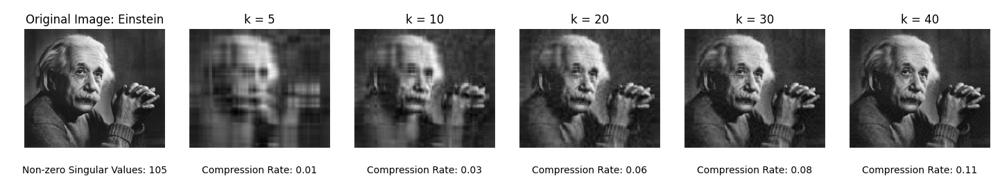
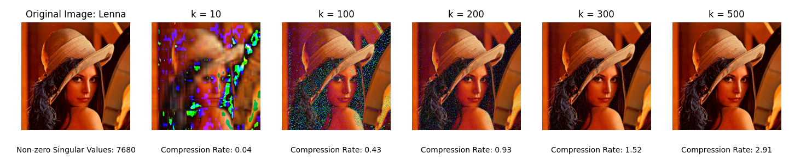

# 数值算法 Homework 10

Due: Nov. 26, 2024  
姓名: 雍崔扬   
学号: 21307140051

## Problem 1

([Reference 1](https://math.stackexchange.com/questions/4611493/reducing-a-hermitian-tridiagonal-matrix-to-real-symmetric-tridiagonal-form)) & ([Reference 2](https://math.stackexchange.com/questions/3069212/calculating-the-real-triagonal-form-from-a-complex-triagonal-matrix?rq=1))  
Let $A$ be a Hermitian matrix.   
Describe how to transform $A$ to a real tridiagonal matrix by unitary similarity,   
before applying the implicit QR algorithm.

**Proof:**   
我们首先使用 Householder 变换将 $A$ 约化为一个 Hermite 三对角阵.  
要设计算法将 Hermite 三对角阵约化为对称三对角阵，  
首先考虑如何将形如 $\begin{bmatrix}
a_1 & b\\
\bar b & a_2\end{bmatrix}\ (\text{where }a_1,a_2\in \mathbb R,\ b\in \mathbb C)$ 的 $2$ 阶 Hermite 阵化为实对称阵.

设 $b= re^{i\theta}$ (对应地 $b=re^{-i\theta}$)，则我们可以构造如下的酉相似变换:  
$$
\begin{align}
\begin{bmatrix}
e^{-i\theta} & \\
& 1
\end{bmatrix}
\begin{bmatrix}
a_1 & b\\
\bar b & a_2\end{bmatrix}
\begin{bmatrix}
e^{i\theta} & \\
& 1
\end{bmatrix}
&=
\begin{bmatrix}
e^{-i\theta}\cdot a_1 \cdot e^{i\theta} & e^{-i\theta}\cdot b \cdot 1\\
1\cdot \bar b \cdot e^{i\theta} & 1\cdot a_2\cdot 1
 \end{bmatrix} \quad (\text{note that }\begin{cases}
b= re^{i\theta}\\
\bar b= re^{-i\theta}
\end{cases})\\
 
&=
 \begin{bmatrix}
a_1 & r\\
r & a_2
\end{bmatrix}\\
&=
 \begin{bmatrix}
a_1 & |b|\\
|b| & a_2
\end{bmatrix}
\end{align}
$$
注意到 $e^{i\theta} = \frac{b}{r} = \frac{b}{|b|}$  
因此我们只需取 $D = \text{diag}\{\frac{b}{|b|},1\}$ 即有 $D^{-1}\begin{bmatrix}
a_1 & b\\
\bar b & a_2\end{bmatrix} D = \begin{bmatrix}
a_1 & |b|\\
|b| & a_2\end{bmatrix}$

****

Matlab 代码:

```matlab
rng(51);
A = diag(rand(2, 1));
A(1,2) = rand(1, 1) + 1i * rand(1, 1);
A(2,1) = A(1,2)';

disp("A:");
disp(A);

D = diag([A(1,2) / abs(A(1,2)), 1]);

disp("D_inv * A * D:");
disp((D \ A) * D);
```

运行结果:

```
A:
   0.6757 + 0.0000i   0.3433 + 0.6440i
   0.3433 - 0.6440i   0.0447 + 0.0000i

D_inv * A * D:
   0.6757 - 0.0000i   0.7298 + 0.0000i
   0.7298 - 0.0000i   0.0447 + 0.0000i
```

****

**推广到 $n$ 维情况:**   
我们可以将 Hermite 三对角阵 $A$ 的超对角线提取出来得到 $b\in \mathbb R^{n-1}$  
逐元素除以模长: `d = b ./ abs(b)`  
为一次性构建对角矩阵 $D$，我们需要不断将 $d$ 中靠后的元素累乘到靠前的元素.  
最终 $D=\text{diag}([d^{\mathrm T},1])\in \mathbb C^{n\times n}$，使得 $D^{-1}AD$ 为对称三对角阵.  
Matlab 代码为:

```matlab
% Construct a Hermitian tridiagonal matrix `A`:
rng(51);
n = 5;
A = diag(rand(n, 1)) + diag( ...
    rand(n-1, 1) + 1i * rand(n-1, 1), 1) + diag( ...
    rand(n-1, 1) + 1i * rand(n-1, 1), -1);
A = 0.5 * (A + A');
disp("A:");
disp(A);

% Extract the superdiagonal elements of A
b = diag(A, 1);

% Compute "phase" information
d = b ./ abs(b);

% Loop over the vector `d` to accumulate the "phase" information
for i = n-2:-1:1
    d(i) = d(i) * d(i+1);
end

% Create a diagonal matrix `D` from the modified vector `d`
D = diag([d; 1]);

% Perform the unitary transformation `D_inv * A * D`
% changing the matrix `A` into a real and symmetric matrix `A_tilde`
A_tilde = (D \ A) * D;

% Display the transformed matrix `A_tilde`
disp("D_inv * A * D:");
disp(A_tilde);
```

运行结果:

```
A:
   0.6757 + 0.0000i   0.5996 + 0.0978i   0.0000 + 0.0000i   0.0000 + 0.0000i   0.0000 + 0.0000i
   0.5996 - 0.0978i   0.0447 + 0.0000i   0.2840 - 0.1355i   0.0000 + 0.0000i   0.0000 + 0.0000i
   0.0000 + 0.0000i   0.2840 + 0.1355i   0.3433 + 0.0000i   0.2178 + 0.0790i   0.0000 + 0.0000i
   0.0000 + 0.0000i   0.0000 + 0.0000i   0.2178 - 0.0790i   0.6440 + 0.0000i   0.4568 - 0.0539i
   0.0000 + 0.0000i   0.0000 + 0.0000i   0.0000 + 0.0000i   0.4568 + 0.0539i   0.2842 + 0.0000i

D_inv * A * D:
   0.6757 + 0.0000i   0.6075 + 0.0000i   0.0000 + 0.0000i   0.0000 + 0.0000i   0.0000 + 0.0000i
   0.6075 - 0.0000i   0.0447 + 0.0000i   0.3146 - 0.0000i   0.0000 + 0.0000i   0.0000 + 0.0000i
   0.0000 + 0.0000i   0.3146 - 0.0000i   0.3433 + 0.0000i   0.2317 - 0.0000i   0.0000 + 0.0000i
   0.0000 + 0.0000i   0.0000 + 0.0000i   0.2317 + 0.0000i   0.6440 + 0.0000i   0.4599 - 0.0000i
   0.0000 + 0.0000i   0.0000 + 0.0000i   0.0000 + 0.0000i   0.4599 + 0.0000i   0.2842 + 0.0000i
```


## Problem 2

Let $A$ and $B$ be $n\times n$ real symmetric matrices.   
Suppose that $B$ is positive definite.   
Show that $AB$ is diagonalizable, and design an algorithm to compute all eigenvalues and eigenvectors of $AB$.

**Solution:**  
注意到 $B$ 是对称正定阵，故存在 Cholesky 分解 $B=LL^{\mathrm T}$   
其中 $L\in \mathbb R^{n\times n}$ 为具有正实数对角元的下三角阵 (因为是非奇异矩阵)  
因此 $AB=ALL^{\mathrm T} = L^{-\mathrm T}(L^{\mathrm T} AL)L^{\mathrm T}$，相似于实对称阵 $L^{\mathrm T}AL$   
而 $L^{\mathrm T}AL$ 作为实对称阵 (自然是正规矩阵) 可正交相似对角化，于是 $AB$ 可相似对角化.

欲计算 $AB$ 的特征值和特征向量，只需先对 $B$ 做 Cholesky 分解得到 $B=LL^{\mathrm T}$   
并对实对称阵 $L^{\mathrm T}AL$ 应用 Wilkinson 位移的对称隐式 $\text{QR}$ 算法得到谱分解 $L^{\mathrm T}AL = Q\Lambda Q^{\mathrm T}$   
最后使用回代法求解三角方程组 $L^{\mathrm T}X=Q$ 得到 $X=L^{-\mathrm T}Q$   
根据 $AB= L^{-\mathrm T}(L^{\mathrm T} AL)L^{\mathrm T} = L^{-\mathrm T}Q\Lambda Q^{\mathrm T} L^{\mathrm T} = (L^{-\mathrm T}Q)\Lambda (L^{-\mathrm T}Q)^{-1}$   
可知 $\Lambda$ 的对角元即为 $AB$ 的特征值，$X=L^{-T}Q$ 的列向量即为对应的特征向量.


## Problem 3

Implement the scaling-and-squaring algorithm (with truncated Taylor series) for computing the matrix exponential.   
Test the accuracy of your algorithm by a few diagonalizable matrices with known spectral decomposition. 

- **(optional)** Implement the Schur–Parlett algorithm and compare the accuracy. 
- **(H, optional)** Replace truncated Taylor series by Pade approximants and compare the accuracy.

### (1) 秦九韶算法

在超越矩阵函数的逼近中经常涉及计算多项式.  
考虑以下矩阵多项式:  
$$
p(A) = c_d A^d + c_{d-1} A^{d-1} + \dotsm + c_1 A + c_0 I
$$
其中 $c_0,c_1,\dots,c_{d-1},c_d\ (c_d\neq 0)$ 是给定的实数.  

**(秦九韶算法/Horner 技巧, Matrix Computation 算法 $11.2.1$)**  
给定 $A\in \mathbb R^{n\times n}$ 和 $c_0,c_1,\dots,c_{d-1},c_d$ (用向量 $c\in \mathbb R^{d+1}$ 传入)  
此算法计算多项式 $F=p(A) = c_d A^d + c_{d-1} A^{d-1} + \dotsm + c_1 A + c_0 I$:
$$
\begin{align}
&\text{function: }F = \text{Qin\_Jiushao}(A,c)\\
&\qquad F = c_d A + c_{d-1}I\\
&\qquad \text{for }k=d-2:-1:0\\
&\qquad\qquad F = AF + c_k I\\
&\qquad\text{end}\\
&\text{end}
\end{align}
$$
上述算法需要 $d-1$ 次矩阵乘法.  
但和标量的情形不同的是，上述求和过程并不是最优的，我们可以适当增加 "步长".  
以 $d=4$ 为例 (只需要 $2$ 次矩阵乘法):  
$$
\begin{align}
p(A) 
&= c_4 A^4 + c_3 A^3 + c_2 A^2 + c_1 A + c_0 I_n\\
&= A^2(c_4 A^2 + c_3 A + c_2 I_n) + c_1 A + c_0 I_n\\
\hline
A_1 &= A\\
A_2 & = A^2\\
F_1 &= c_4 A_2 + c_3 A_1 + c_2 I_n\\
F &= A_2F_1 + c_1 A_1 + c_0 I_n
\end{align}
$$

*****

一般来说，考虑计算 $d$ 次矩阵多项式:
$$
p(A) = c_d A^d + c_{d-1} A^{d-1} + \dotsm + c_1 A + c_0 I
$$
可取最优步长 $t=\lfloor \sqrt{d}\rfloor$ 并计算:  
$$
\begin{align}
A_1 &= A\\ 
A_2 &= AA_1\\
A_3 &= AA_2\\
&\dotsm\\
A_t &= AA_{t-1}
\end{align}
$$
这需要 $t-1$ 次矩阵乘法.  
记 $r = \lfloor \frac{d}{t}\rfloor$ 并执行以下迭代:  
$$
\begin{align}
&F=c_d A_{d-rt} + c_{d-1} A_{d-rt-1} + \dotsm + c_{rt+1} A_1 + c_{rt} I\\
&\text{for }k=r-1:-1:0\\
&\qquad F = A_t F + (c_{kt + t-1} A_{t-1} + \dotsm + c_{kt+1}A_1 + c_{kt}I)\\
&\text{end}
\end{align}
$$
这需要 $r$ 次矩阵乘法.  
因此总共需要 $r+t-1$ 次矩阵乘法.

***

Matlab 代码为:

```mathematica
function F = Qin_Jiushao(A, c)
    % A: Input matrix
    % c: A vector of coefficients for the polynomial, where c(i) corresponds to the coefficient for A^(d-i)

    d = length(c) - 1;  % Degree of the polynomial
    t = floor(sqrt(d)); % Optimal step length based on the square root of the degree
    r = floor(d / t);   % Number of iterations required
    
    % Step 1: Precompute the powers of A, namely A1, A2, ..., At
    A_powers = cell(t, 1);  % Cell array to store powers of A
    A_powers{1} = A;  % A1 = A
    for i = 2:t
        A_powers{i} = A_powers{i-1} * A;  % Ai = A^i, iteratively calculate powers of A
    end
    
    % Step 2: Compute the polynomial value using the precomputed powers of A
    % Start by initializing F with the highest degree term
    % F=c_d A_{d-rt} + c_{d-1} A_{d-rt-1} + \dotsm + c_{rt+1} A_1 + c_{rt} I
    n = size(A, 1);
    F = zeros(n, n);
    for j = d-r*t:-1:1
        F = F + c(r*t+j+1) * A_powers{j};
    end
    F = F + c(r*t+1) * eye(n);
    
    % Iterate backwards to calculate the polynomial
    for k = r-1:-1:0
        % F = A_t F + (c_{kt + t-1} A_{t-1} + \dotsm + c_{kt+1}A_1 + c_{kt}I)
        % Compute the sum term for the current iteration
        sum_term = zeros(n, n);
        for j = t-1:-1:1
            sum_term = sum_term + c(k*t+j+1) * A_powers{j};  % Add each term to the sum
        end
        sum_term = sum_term + c(k*t+1) * eye(n);
        % Update F using the sum of the current terms and the previous result
        F = A_powers{t} * F + sum_term;
    end
end
```

函数调用:

```matlab
rng(51);
n = 100;
A = randn(n);
A = A / norm(A, 'inf');

% Define random polynomial coefficients
d = 50;
c = rand(1, d+1);

% Direct computation of the polynomial p(A) = c_d A^d + ... + c_0 I
direct_result = zeros(n, n);
A_powers = cell(d, 1);  % Cell array to store powers of A
A_powers{1} = A;  % A1 = A
for i = 2:d
    A_powers{i} = A_powers{i-1} * A;  % Ai = A^i, iteratively calculate powers of A
end
for i = d:-1:1
    direct_result = direct_result + c(i+1) * A_powers{i};
end
direct_result = direct_result + c(1) * eye(n);

% Call the Qin_Jiushao function
qin_jiushao_result = Qin_Jiushao(A, c);

% Compare the results
disp('Difference (in Frobenius norm):');
disp(norm(direct_result - qin_jiushao_result, 'fro'));
```

运行结果:

```
Difference (in Frobenius norm):
   5.3512e-16
```


### (2) Taylor 逼近

计算 $\exp(A)$ 的**缩放平方算法** (Scaling and Squaring)  
$$
\begin{align}
&m = \max(0, 1+\lfloor \log_2(\|A\|_\infty)\rfloor)\\
&E_0 = \text{the Taylor approximation of }\exp(A/2^m)\\
&\text{for }j=1:m\\
&\qquad E_j = E_{j-1}^2\\
&\text{end}
\end{align}
$$
Matlab 代码为:

```matlab
function E = scaling_and_squaring_Taylor(A, d)
    % Scaling and Squaring Algorithm to compute exp(A)
    % A: input matrix
    
    % Step 1: Compute m
    m = max(0, 1 + floor(log2(norm(A, 'inf'))));  % Compute m based on the infinity norm of A

    % Step 2: Compute the Taylor approximation of exp(A / 2^m)
    % The coefficients for the Taylor expansion of exp(z) are 1, 1, 1/2!, 1/3!, ...
    c = zeros(d+1, 1);  % Coefficients for Taylor expansion
    c(1) = 1;
    for k = 2:d+1
        c(k) = c(k-1) / (k-1);  % Compute the Taylor coefficients
    end

    % Use Qin_Jiushao to compute the Taylor approximation of exp(A / 2^m)
    E_0 = Qin_Jiushao(A / 2^m, c);  % Apply Qin_Jiushao to compute the polynomial approximation
    
    % Step 3: Squaring E_0, m times
    E = E_0;
    for j = 1:m
        E = E * E;  % Square E_0 for m times to get exp(A)
    end
end
```

函数调用:

```matlab
rng(51);
n = 5;

% Generate diagonalizable matrix with known spectral decomposition
[Q, ~] = qr(rand(n, n));
Lambda = randn(n, 1);
A = Q * diag(Lambda) * Q';
disp("Max eigenvalue absolute value:");
disp(max(abs(Lambda)));

% Exact solution
% exact_solution = expm(A);
exact_solution = Q * diag(exp(Lambda)) * Q'; 
disp("Exact solution:");
disp(exact_solution);

% Taylor approximation
d = 10;
Taylor_approximation = scaling_and_squaring_Taylor(A, d);
disp("Taylor approximation:");
disp(Taylor_approximation);

% Display Difference
disp('Difference (in Frobenius norm):');
disp(norm(exact_solution - Taylor_approximation, 'fro'));
```

运行结果:

```
Max eigenvalue absolute value:
    1.0947

Exact solution:
    2.0455    0.1010   -0.7774   -0.1252    0.4095
    0.1010    1.0922    0.3790   -0.5317    0.6041
   -0.7774    0.3790    2.1706    0.2647    0.6328
   -0.1252   -0.5317    0.2647    2.0280   -0.6589
    0.4095    0.6041    0.6328   -0.6589    1.3701

Taylor approximation:
    2.0455    0.1010   -0.7774   -0.1252    0.4095
    0.1010    1.0922    0.3790   -0.5317    0.6041
   -0.7774    0.3790    2.1706    0.2647    0.6328
   -0.1252   -0.5317    0.2647    2.0280   -0.6589
    0.4095    0.6041    0.6328   -0.6589    1.3701

Difference (in Frobenius norm):
   1.9342e-13
```


### (3) Padé 逼近

考虑矩阵指数函数 $e^A$ 的计算.  
若 $g(z)\approx e^z$，则 $g(A)\approx e^A$   
为达到这一目的，有一类非常有用的逼近函数——Padé 函数:  
$$
R_{p,q}(z) := (D_{p,q}(z))^{-1} N_{p,q}(z)
$$
其中:  
$$
N_{p,q}(z) = \sum_{k=0}^p \frac{(p+q-k)!}{(p+q)!}\binom {p}{k}z^k =\sum_{k=0}^p \frac{(p+q-k)!p!}{(p+q)! k!(p-k)!}z^k\\
D_{p,q}(z) = \sum_{k=0}^q \frac{(p+q-k)!}{(p+q)!}\binom{q}{k} (-z)^k =\sum_{k=0}^q \frac{(p+q-k)!q!}{(p+q)! k! (q-k)!} (-z)^k 
$$
特殊地，当 $q=0$ 时即为 $p$ 阶 Taylor 多项式:  
$$
R_{p,0}(z) = \sum_{k=0}^p\frac{z^k}{k!}
$$

*****

不幸的是，Padé 逼近仅在原点附近才非常好，下面的等式说明了这一点:  
$$
e^A= R_{p,q}(A) + \frac{(-1)^q}{(p+q)!}A^{p+q+1}(D_{p,q}(A))^{-1} \int_0^1 u^p(1-u)^q e^{A(1-u)}du
$$
不过我们可以利用缩放平方算法 $e^A = (e^{\frac{A}{2^m}})^{2^m}$ 来克服这一困难.   
整个算法的好坏取决于以下逼近的精度:  
$$
F_{p,q} = \left(R_{p,q}\left(\frac{A}{2^m} \right)\right)^{2^m} 
$$
可以证明:   
若 $\frac{\|A\|_\infty}{2^m}\leq \frac{1}{2}$，则存在矩阵 $\Delta A\in \mathbb R^{n\times n}$ 使得:  
$$
\begin{align}
F_{p,q} &= e^{A+\Delta A}\\
A\Delta A &= \Delta A A\\
\|\Delta A\|_\infty &\leq \varepsilon(p,q) \|A\|_\infty\\
\varepsilon(p,q) 
&=
2^{3-(p+q)}\frac{p!q!}{(p+q)!(p+q+1)!}
\end{align}
$$
进而可以证明不等式:  
$$
\frac{\|e^A-F_{p,q}\|_\infty}{\|e^A\|_\infty} \leq \varepsilon(p,q) \|A\|_\infty \exp\{\varepsilon(p,q) \|A\|_\infty\}
$$
参数 $p,q$ 可根据所需的相对精度来确定.  
鉴于计算 $F_{p,q}$ 大约需要 $m + \max(p,q)$ 次矩阵乘法，故我们最好令 $p=q$  
上述结果构成了有效计算 $e^A$ 并控制误差的方法的基础.

****

**(Matrix Computation 算法 $11.3.1$)**  
给定矩阵 $A\in \mathbb R^{n\times n}$ 和 $\tau>0$，此算法计算 $F=e^{A+\Delta A}$ (其中 $\|\Delta A\|_\infty \leq \tau \|A\|_\infty$)  
$$
\begin{align}
&m = \max(0, 1+\lfloor \log_2(\|A\|_\infty)\rfloor)\\
&A = A/2^m\\
&\text{Let }q \text{ be the smallest nonnegative integer such that }\varepsilon(q,q) \leq \tau\\
&N=I\\
&D=I\\
&X=I\\
&c = 1\\
&\text{for }k=1:q\\
&\qquad c = c(q-k+1)/[(2q-k+1)k]\\
&\qquad X=AX\\
&\qquad N=N+cX\\
&\qquad D=D+(-1)^k cX\\
&\text{end}\\
&\text{solve }DF=N\text{ for }F=D^{-1}N\text{ using Gaussian elimination}\\
&\text{for }k=1:m\\
&\qquad F=F^2\\
&\text{end}
\end{align}
$$
上述算法大约需要 $2(q+m + \frac13)n^3$ 的计算量.  
此外我们还可利用**秦九韶算法**来加快矩阵多项式 $D=D_{q,q}(A)$ 和 $N=N_{q,q}(A)$ 的计算.

***

Matlab 代码:

```matlab
function F = scaling_and_squaring_Pade(A, q)
    % Calculate the matrix exponential exp(A) using scaling and squaring method.
    % A: input matrix (n x n)
    % q: number of terms for the Pade series
    
    % Step 1: Compute m based on the infinity norm of A
    m = max(0, 1 + floor(log2(norm(A, 'inf'))));  % Compute m based on the infinity norm of A
    A = A / 2^m;  % Scale A by 2^m
    
    % Step 2: Initialize N, D, X, and c
    n = size(A, 1);  % Size of matrix A
    N = eye(n);      % Identity matrix for N
    D = eye(n);      % Identity matrix for D
    X = eye(n);      % Identity matrix for X
    c = 1;           % Initial coefficient for Pade expansion
    
    % Step 3: Iterate q times to compute N and D
    for k = 1:q
        % Update coefficient c
        c = c * (q - k + 1) / ((2 * q - k + 1) * k);
        
        % Update X = A * X
        X = A * X;
        
        % Update N = N + c * X
        N = N + c * X;
        
        % Update D = D + (-1)^k * c * X
        D = D + (-1)^k * c * X;
    end
    
    % Step 4: Solve D * F = N for F, using Gaussian elimination
    F = D \ N;  % Use MATLAB's backslash operator for solving the system
    
    % Step 5: Square F m times to apply the scaling and squaring
    for k = 1:m
        F = F * F;  % Square F m times
    end
end
```

函数调用:

```matlab
rng(51);
n = 5;

% Generate diagonalizable matrix with known spectral decomposition
[Q, ~] = qr(rand(n, n));
Lambda = randn(n, 1);
A = Q * diag(Lambda) * Q';
disp("Max eigenvalue absolute value:");
disp(max(abs(Lambda)));

% Exact solution
% exact_solution = expm(A);
exact_solution = Q * diag(exp(Lambda)) * Q'; 
disp("Exact solution:");
disp(exact_solution);

% Taylor approximation
q = 13;
Pade_approximation = scaling_and_squaring_Pade(A, q);
disp("Pade approximation:");
disp(Pade_approximation);

% Display Difference
disp('Difference (in Frobenius norm):');
disp(norm(exact_solution - Pade_approximation, 'fro'));
```

运行结果:

```
Max eigenvalue absolute value:
    1.0947

Exact solution:
    2.0455    0.1010   -0.7774   -0.1252    0.4095
    0.1010    1.0922    0.3790   -0.5317    0.6041
   -0.7774    0.3790    2.1706    0.2647    0.6328
   -0.1252   -0.5317    0.2647    2.0280   -0.6589
    0.4095    0.6041    0.6328   -0.6589    1.3701

Pade approximation:
    2.0455    0.1010   -0.7774   -0.1252    0.4095
    0.1010    1.0922    0.3790   -0.5317    0.6041
   -0.7774    0.3790    2.1706    0.2647    0.6328
   -0.1252   -0.5317    0.2647    2.0280   -0.6589
    0.4095    0.6041    0.6328   -0.6589    1.3701

Difference (in Frobenius norm):
   2.8114e-15
```


### (4) Schur-Parlett 递推

**(Parlett 递推, Matrix Computation 算法 $11.1.1$)**     
给定对角元互不相同的上三角阵 $T\in \mathbb C^{n\times n}$，计算 $F=f(T)$:  
$$
\begin{align}
&\text{function: }F=\text{Parlett\_Recursion}(T)\\
&\qquad \text{for }i=1:n\quad (\text{diagonal})\\
&\qquad \qquad f_{ii} = f(t_{ii})\\
&\qquad \text{end}\\
&\qquad \text{for }p=1:n-1\quad (p\text{-th superdiagonal})\\
&\qquad \qquad \text{for }i:n-p\quad (\text{from bottom to top})\\
&\qquad\qquad \qquad j = i+p\\
&\qquad\qquad \qquad \text{sum} = (f_{ii}-f_{ij})t_{ij}\\
&\qquad\qquad \qquad \text{for }k = i+1:j-1\quad (\text{from left to right})\\
&\qquad\qquad \qquad\qquad \text{sum}= \text{sum} + f_{ik}t_{kj}-t_{ik}f_{kj}\\
&\qquad\qquad\qquad \text{end}\\
&\qquad\qquad\qquad f_{ij} = \frac{1}{t_{ii}-t_{jj}} \text{sum}\\
&\qquad\qquad \text{end}\\
&\qquad \text{end}\\
&\text{end}
\end{align}
$$
上述算法所需的计算量为 $\frac23n^3$  

*****

Matlab 代码:

```matlab
function F = Parlett_Recursion(T)
    % Given upper triangular matrix T, compute F = exp(T) using Parlett Recursion
    
    n = size(T, 1); % Size of the matrix T
    F = zeros(n, n); % Initialize the result matrix F
    
    % Step 1: Compute the diagonal elements of F
    for i = 1:n
        F(i, i) = exp(T(i, i));  % Apply f to each diagonal element
    end
    
    % Step 2: Compute the off-diagonal elements of F using the recursion
    for p = 1:n-1 % Iterate over superdiagonals
        for i = 1:n-p % Iterate over rows for the p-th superdiagonal
            j = i + p;  % j is the column index in the p-th superdiagonal
            
            % Start computing the sum for f_{ij}
            sum = (F(i, i) - F(i, j)) * T(i, j);
            
            % Sum over the elements in between (i+1 to j-1)
            for k = i+1:j-1
                sum = sum + F(i, k) * T(k, j) - T(i, k) * F(k, j);
            end
            
            % Compute the final off-diagonal element f_{ij}
            F(i, j) = sum / (T(i, i) - T(j, j));
        end
    end
end
```

函数调用:

```matlab
rng(51);
n = 5;

% Generate diagonalizable matrix with known spectral decomposition
[Q, ~] = qr(rand(n, n));
Lambda = randn(n, 1);
A = Q * diag(Lambda) * Q';

% Minimum difference between eigenvalues
sorted_Lambda = sort(Lambda);
differences = diff(sorted_Lambda);
min_diff = min(differences);
disp("Minimum difference between eigenvalues:");
disp(min_diff);

% Exact solution
% exact_solution = expm(A);
exact_solution = Q * diag(exp(Lambda)) * Q'; 
disp("Exact solution:");
disp(exact_solution);

% Calculate Schur decomposition
[Q_schur, T] = schur(A);
exp_T = Parlett_Recursion(T);
parlett_solution = Q_schur * exp_T * Q_schur';
disp("Schur-Parlett solution:");
disp(parlett_solution);

% Display Difference
disp('Difference (in Frobenius norm):');
disp(norm(exact_solution - parlett_solution, 'fro'));
```

运行结果:

```
Minimum difference between eigenvalues:
    0.0187

Exact solution:
    2.0455    0.1010   -0.7774   -0.1252    0.4095
    0.1010    1.0922    0.3790   -0.5317    0.6041
   -0.7774    0.3790    2.1706    0.2647    0.6328
   -0.1252   -0.5317    0.2647    2.0280   -0.6589
    0.4095    0.6041    0.6328   -0.6589    1.3701

Schur-Parlett solution:
    2.0455    0.1010   -0.7774   -0.1252    0.4095
    0.1010    1.0922    0.3790   -0.5317    0.6041
   -0.7774    0.3790    2.1706    0.2647    0.6328
   -0.1252   -0.5317    0.2647    2.0280   -0.6589
    0.4095    0.6041    0.6328   -0.6589    1.3701

Difference (in Frobenius norm):
   1.0243e-14
```


## Problem 4

Let $A$ and $E$ be Hermitian matrices with $AE = EA$.   
Try to give an upper bound on $\|\exp(A+E)-\exp(A)\|_2$  
Make sure your upper bound tends to zero when $\|E\|_2 \to 0$ 

**Solution:**  
考虑初值问题:  
$$
\dot X(t) = AX(t)\\
X(0) = I
$$
其中 $A,X(t)\in \mathbb R^{n\times n}$  
它具有唯一解 $X(t)=e^{At}$   
于是我们有:
$$
\begin{align}
e^{(A+E)t} - e^{At}
&=
e^{At} (e^{Et} - 1)\\
&=
e^{At}\int_0^{t} Ee^{Es}ds\\
&=
\int_0^{t} e^{A(t-s)}Ee^{(A+E)s}ds
\end{align}
$$
根据上式可知:  
$$
\|e^{(A+E)t} - e^{At}\|_2 \leq \|E\|_2 \int_0^{t} \|e^{A(t-s)}\|_2
\|e^{(A+E)s}\|_2ds
$$
注意到 $A\in \mathbb C^{n\times n}$ 为 Hermite 阵 (自然是正规矩阵)，因而存在谱分解 $A=U\Lambda U^{\mathrm H}$   
其中 $U\in \mathbb C^{n\times n}$ 为酉矩阵，$\Lambda:=\text{diag}\{\lambda_1,\dots,\lambda_n\}$ 为对角阵.  
于是我们有:  
$$
\begin{align}
e^{At} 
&= e^{U\Lambda U^{\mathrm H}t}\\
&= Ue^{\Lambda t} U^{\mathrm H}\\
&= U\text{diag}\{e^{\lambda_1 t},\dots, e^{\lambda_n t}\} U^{\mathrm H}\\
\end{align}
$$
进而有:  
$$
\begin{align}
\|e^{At}\|_2 
&=
\|U\text{diag}\{e^{\lambda_1 t},\dots, e^{\lambda_n t}\} U^{\mathrm H}\|_2\\
&=
\|\text{diag}\{e^{\lambda_1 t},\dots, e^{\lambda_n t}\}\|_2\\
&\leq
\exp\{\max\{\text{Re}(\lambda_i):1\leq i\leq n\}\cdot t\}\\
&\leq
e^{\rho(A)t}\quad (\text{note that }A\text{ is Hermitian, so that }\|A\|_2 = \sigma_\max(A) = \rho(A))\\
&=
e^{\|A\|_2 t}
\end{align}
$$
其中 $\rho(A) = \max_{1\leq i\leq n}|\lambda_i|$ 代表 $A$ 的谱半径.   
注意到 $E$ 也为 Hermite 阵，且 $AE=EA$，因此它们可以同时酉对角化.  
类似地，可推得 $\|e^{(A+E)t}\|_2 \leq e^{\|A+E\|_2 t} \leq e^{(\|A\|_2+\|E\|_2) t}$

因此我们有:  
$$
\begin{align}
\|e^{(A+E)t} - e^{At}\|_2
&\leq \|E\|_2 \int_0^{t} \|e^{A(t-s)}\|_2
\|e^{(A+E)s}\|_2ds\\
&\leq
\|E\|_2 \int_0^{t} e^{\|A\|_2(t-s)} e^{(\|A\|_2+\|E\|_2) s}ds\\
&=
\|E\|_2 e^{\|A\|_2 t}\int_0^{t} e^{\|E\|_2 s}ds\\
&=
\|E\|_2 e^{\|A\|_2 t}\frac{1}{\|E\|_2}(e^{\|E\|_2 t} - 1
)\\
&=
e^{\|A\|_2 t} (e^{\|E\|_2 t}-1)
\end{align}
$$
取 $t=1$ 即有:  
$$
\|e^{(A+E)} - e^{A}\|_2 \leq e^{\|A\|_2} (e^{\|E\|_2}-1)
$$
当 $\|E\|_2\to 0$ 时，上界 $e^{\|A\|_2} (e^{\|E\|_2}-1)$ 趋于 $0$ 


## Problem 5

Have a quick glance at the paper "From Random Polygon to Ellipse: An Eigenanalysis"   
by A. N. Elmachtoub and C. F. Van Loan (available on eLearning).   
Reproduce the experiments in this paper.

### (0) Helper Functions

生成元素和分别为 $0$ 的单位向量 $x,y\in \mathbb R^n$ 的函数:

```matlab
function [x, y] = generate_unit_vectors(n)
    % Step 1: Generate two random vectors of length n
    x_raw = randn(n, 1); % Random vector for x
    y_raw = randn(n, 1); % Random vector for y
    
    % Step 2: Adjust to make the sum of components zero
    x_raw = x_raw - mean(x_raw); % Ensure sum(x) = 0
    y_raw = y_raw - mean(y_raw); % Ensure sum(y) = 0
    
    % Step 3: Normalize the vectors to have unit 2-norm
    x = x_raw / norm(x_raw); % Normalize x
    y = y_raw / norm(y_raw); % Normalize y
end
```

生成平均矩阵的函数:

```matlab
% Function to create the Averaging Matrix M_n
function M = averaging_matrix(n)
    % Create an n x n matrix of zeros
    M = 0.5 * (diag(ones(n,1), 0) + diag(ones(n-1,1), 1));
    M(n, 1) = 0.5;
end
```

绘制多边形的函数:

```matlab
% Function to display the polygon given two vectors
function display_polygon(x, y, k, ax)
    % Ensure the polygon is closed by connecting the first and last points
    x = [x; x(1)];
    y = [y; y(1)];
    
    % Plot the polygon in the specified subplot axis
    plot(ax, x, y, 'b-o', 'LineWidth', 2, 'MarkerFaceColor', 'b');
    title(ax, ['Iteration: ', num2str(k)]);
    axis(ax, 'equal');
    grid(ax, 'on');
end
```


### (1) A First Try

Averaging matrix $M_n$ is defined as:  
$$
M_n := \frac12 
\begin{bmatrix}
1 & 1 & 0 & \dotsm & 0 & 0\\
0 & 1 & 1 & \dotsm & 0 & 0\\
\vdots & \vdots & \ddots & \ddots&  & \vdots\\
\vdots & \vdots &  & \ddots & 1 & \vdots\\
0 & 0 & \dotsm & \dotsm & 1 & 1 \\
1 & 0 & \dotsm & \dotsm & 0 & 1
\end{bmatrix}_{n\times n}
$$
Denote $\mathcal P(x,y)$ as the initial polygon, where $x,y\in \mathbb R^n$ are unit $l_2$-norm vectors.  
After $k$ averaging steps we have the polygon $\mathcal P(M_n^k x, M_n^k y)$    
**Algorithm 1:**
$$
\begin{align}
&\text{Input: unit vectors }x^{(0)},y^{(0)}\in \mathbb R^n \text{ whose components sum to zero}\\
&\text{Display }\mathcal P(x^{(0)},y^{(0)})\\
&\text{for }k = 1:\text{max\_iter}\\
&\qquad x^{(k)} = M_n x^{(k-1)}\\
&\qquad y^{(k)} = M_n y^{(k-1)}\\
&\qquad \text{Display }\mathcal P(x^{(k)},y^{(k)})\text{ for some }k \text{ that we are interested in}\\
&\text{end}
\end{align}
$$
Matlab 代码:

```matlab
% Implementing Algorithm 1
function averaging_algorithm(x, y, max_iter)
    % Step 1: Create the averaging matrix M_n
    n = size(x, 1);
    M = averaging_matrix(n);
    
    % Create a figure for the subplots
    figure;
    subplot(2, 3, 1);
    display_polygon(x, y, 0, gca);
    
    % Define the set of iterations where we are interested in displaying the polygon
    interested_set = [5, 8, 14, 20, 50];
    plot_index = 2;
    
    % Step 2: Iterate through the algorithm
    for k = 1:max_iter
        % Apply the averaging matrix to x and y
        x = M * x;
        y = M * y;

        % Check if the current iteration is in the interested set
        if ismember(k, interested_set)
            subplot(2, 3, plot_index); % Create a subplot (2x3 grid)
            display_polygon(x, y, k, gca); % Plot in the current axis
            plot_index = plot_index + 1;
        end
    end
end
```

函数调用:

```matlab
rng(51);
n = 10; % Size of the averaging matrix
max_iter = 200; % Number of iterations

% Generate initial unit vectors
[x, y] = generate_unit_vectors(n);

% Run the averaging algorithm
averaging_algorithm(x, y, max_iter);
```

**运行结果:**  
可以观察到多边形的各个顶点趋近于中心点 (即原点，因为 $x,y\in \mathbb R^n$ 做了中心化)  




### (2) A Second Try

We introduce a normalization step to keep the polygon $\mathcal P(x^{(k)},y^{(k)})$ from collapsing down to a point,   
Specifically, at each iteration $k$, we rescale the vectors $x^{(k)}$ and $y^{(k)}$ to ensure that they remain unit vectors.   
**Algorithm 2:**  
$$
\begin{align}
&\text{Input: unit vectors }x^{(0)},y^{(0)}\in \mathbb R^n \text{ whose components sum to zero}\\
&\text{Display }\mathcal P(x^{(0)},y^{(0)})\\
&\text{for }k = 1:\text{max\_iter}\\
&\qquad u = M_n x^{(k-1)}\\
&\qquad x^{(k)} = u/\|u\|_2\\
&\qquad v = M_n y^{(k-1)}\\
&\qquad y^{(k)} = v/\|v\|_2\\
&\qquad \text{Display }\mathcal P(x^{(k)},y^{(k)})\text{ for some }k \text{ that we are interested in}\\
&\text{end}
\end{align}
$$

```matlab
% Implementing Algorithm 2 (i.e. Algorithm 1 with normalization)
function averaging_algorithm(x, y, max_iter)
    % Step 1: Create the averaging matrix M_n
    n = size(x, 1);
    M = averaging_matrix(n);
    
    % Create a figure for the subplots
    figure;
    subplot(2, 3, 1);
    display_polygon(x, y, 0, gca);
    
    % Define the set of iterations where we are interested in displaying the polygon
    interested_set = [5, 20, 50, 100, 200];
    plot_index = 2;
    
    % Step 2: Iterate through the algorithm
    for k = 1:max_iter
        % Apply the averaging matrix to x and y, and normalize them
        x = M * x;
        x = x / norm(x);
        y = M * y;
        y = y / norm(y);

        % Check if the current iteration is in the interested set
        if ismember(k, interested_set)
            subplot(2, 3, plot_index); % Create a subplot (2x3 grid)
            display_polygon(x, y, k, gca); % Plot in the current axis
            plot_index = plot_index + 1;
        end
    end
end
```

函数调用:

```matlab
rng(51);
n = 10; % Size of the averaging matrix
max_iter = 200; % Number of iterations

% Generate initial unit vectors
[x, y] = generate_unit_vectors(n);

% Run the averaging algorithm
averaging_algorithm(x, y, max_iter);
```

**运行结果:**  



**猜想 (Conjecture):**  
No matter how random the initial $\mathcal P(x^{(0)},y^{(0)})$, the edges of the $\mathcal P(x^{(k)},y^{(k)})$ eventually "uncross",   
and in the limit the vertices appear to arrange themselves around an ellipse   
that is tilted $45$ degrees from the coordinate axes.


### (3) A Third Try

Consider the eigenvalues and eigenvectors of $M_n$:  
$$
M_n := \frac12 
\begin{bmatrix}
1 & 1 & 0 & \dotsm & 0 & 0\\
0 & 1 & 1 & \dotsm & 0 & 0\\
\vdots & \vdots & \ddots & \ddots&  & \vdots\\
\vdots & \vdots &  & \ddots & 1 & \vdots\\
0 & 0 & \dotsm & \dotsm & 1 & 1 \\
1 & 0 & \dotsm & \dotsm & 0 & 1
\end{bmatrix}_{n\times n}
$$
(注意到 $M_n$ 是一个 Frobenius 友阵加上单位阵最后乘以 $\frac12$，而这个 Frobenius 友阵的特征值和特征向量我们是知道的)   
记 $\omega = \exp(\frac{2\pi}{n})$，则 $M_n$ 的特征值和特征向量为:
$$
\begin{align}
\lambda_k 
&= \frac{1}{2}\left(1+\omega^{k-1} \right)\\
x_k
&= 
\begin{bmatrix}
1\\
\omega^{k-1}\\
\omega^{2(k-1)}\\
\vdots\\
\omega^{(n-1)(k-1)}
\end{bmatrix}
\end{align}\quad (k=1,\dots,n)
$$
**Algorithm 3:**  
$$
\begin{align}
&\text{Input: }\theta_x,\theta_y\in \mathbb R\\
&\tau = \begin{bmatrix}
0\\
2\pi/n\\
4\pi/n\\
\vdots\\
2(n-1)\pi/n
\end{bmatrix},\quad c=\sqrt{2/n}\cos(\tau),\quad s=\sqrt{2/n}\sin(\tau)\\
&x^{(0)} = \cos(\theta_x)c + \sin(\theta_x)s\\
&y^{(0)} = \cos(\theta_y)c + \sin(\theta_y)s\\
&\text{Display }\mathcal P(x^{(0)},y^{(0)})\\
&\text{for }k = 1:\text{max\_iter}\\
&\qquad u = M_n x^{(k-1)}\\
&\qquad x^{(k)} = u/\|u\|_2\\
&\qquad v = M_n y^{(k-1)}\\
&\qquad y^{(k)} = v/\|v\|_2\\
&\qquad \text{Display }\mathcal P(x^{(k)},y^{(k)})\text{ for some }k \text{ that we are interested in}\\
&\text{end}
\end{align}
$$

```matlab
% Implementing Algorithm 3
function averaging_algorithm(x, y, max_iter)
    % Step 1: Create the averaging matrix M_n
    n = size(x, 1);
    M = averaging_matrix(n);
    
    % Create a figure for the subplots
    figure;
    subplot(2, 3, 1);
    display_polygon(x, y, 0, gca);
    
    % Define the set of iterations where we are interested in displaying the polygon
    interested_set = [2, 4, 5, 7, 9];
    plot_index = 2;
    
    % Step 2: Iterate through the algorithm
    for k = 1:max_iter
        % Apply the averaging matrix to x and y, and normalize them
        x = M * x;
        x = x / norm(x);
        y = M * y;
        y = y / norm(y);

        % Check if the current iteration is in the interested set
        if ismember(k, interested_set)
            subplot(2, 3, plot_index); % Create a subplot (2x3 grid)
            display_polygon(x, y, k, gca); % Plot in the current axis
            plot_index = plot_index + 1;
        end
    end
end
```

绘制多边形的函数修改为:

```matlab
function display_polygon(x, y, k, ax)
    % Ensure the polygon is closed by connecting the first and last points
    x = [x; x(1)];
    y = [y; y(1)];
    
    % Identify even and odd indices
    even_indices = 2:2:length(x);  % Even indices (2, 4, 6, ...)
    odd_indices = 1:2:length(x);   % Odd indices (1, 3, 5, ...)
    
    % Plot even-indexed points in red
    plot(ax, x(even_indices), y(even_indices), 'ro', 'LineWidth', 2, 'MarkerFaceColor', 'r');
    hold(ax, 'on');  % Hold on to the current plot
    
    % Plot odd-indexed points in blue
    plot(ax, x(odd_indices), y(odd_indices), 'bo', 'LineWidth', 2, 'MarkerFaceColor', 'b');
    
    % Connect the points with a dashed line
    plot(ax, x, y, 'k--', 'LineWidth', 1);  % Dashed line (k-- for black dashed)
    
    % Add the title and adjust the grid and axis
    title(ax, ['Iteration: ', num2str(k)]);
    axis(ax, 'equal');
    grid(ax, 'on');
    
    % Add index labels next to each point
    for i = 1:length(x)-1  % Exclude the last repeated point for closing the polygon
        text(ax, x(i), y(i), num2str(i), 'VerticalAlignment', 'bottom', 'HorizontalAlignment', 'right', 'FontSize', 8);
    end
    
    hold(ax, 'off');  % Release the hold
end
```

函数调用:

```matlab
rng(51);
n = 10; % Size of the averaging matrix
max_iter = 200; % Number of iterations

% Generate initial unit vectors
tau = 0:n-1;
tau = (2 * pi / n) * tau';
c = sqrt(2/n) * cos(tau);
s = sqrt(2/n) * sin(tau);

theta_x = rand(1);
theta_y = rand(1);
x = cos(theta_x) * c + sin(theta_x) * s;
y = cos(theta_y) * c + sin(theta_y) * s;

% Run the averaging algorithm
averaging_algorithm(x, y, max_iter);
```

**运行结果:**



**猜想 (Conjecture):**  
For any input values $\theta_x,\theta_y\in \mathbb R$ in Algorithm 3,   
the even indexed polygons $\mathcal P(x^{(2k)},y^{(2k)})$ are all the same   
and the odd-indexed polygons $\mathcal P(x^{(2k+1)},y^{(2k+1)})$ are all the same.


### (4) A Fourth Try

It is natural to ask what happens to the normalized polygon averaging process,   
if we use analternative to the $l_2$-norm for normalization.   
A change in norm will only affect the size of the vertex vectors, not their direction.  
**Algorithm 4:** 

```matlab
% Implementing Algorithm 4
function averaging_algorithm(x, y, max_iter, p, q)
    % Step 1: Create the averaging matrix M_n
    n = size(x, 1);
    M = averaging_matrix(n);
    
    % Create a figure for the subplots
    figure;
    subplot(2, 3, 1);
    display_polygon(x, y, 0, gca);
    
    % Define the set of iterations where we are interested in displaying the polygon
    interested_set = [2, 4, 5, 7, 9];
    plot_index = 2;
    
    % Step 2: Iterate through the algorithm
    for k = 1:max_iter
        % Apply the averaging matrix to x and y, and normalize them
        x = M * x;
        x = x / norm(x, p);
        y = M * y;
        y = y / norm(y, q);

        % Check if the current iteration is in the interested set
        if ismember(k, interested_set)
            subplot(2, 3, plot_index); % Create a subplot (2x3 grid)
            display_polygon(x, y, k, gca); % Plot in the current axis
            plot_index = plot_index + 1;
        end
    end
end
```

函数调用:

```matlab
rng(51);
n = 10; % Size of the averaging matrix
max_iter = 200; % Number of iterations
p = 'inf';
q = 1;

% Generate initial unit vectors
tau = 0:n-1;
tau = (2 * pi / n) * tau';
c = sqrt(2/n) * cos(tau);
s = sqrt(2/n) * sin(tau);

theta_x = rand(1);
theta_y = rand(1);
x = cos(theta_x) * c + sin(theta_x) * s;
x = x / norm(x, p);
y = cos(theta_y) * c + sin(theta_y) * s;
y = y / norm(x, q);

% Run the averaging algorithm
averaging_algorithm(x, y, max_iter, p, q);
```

运行结果: A more "rapid" look   
(对 $x$ 使用 $\|\cdot\|_\infty$ 范数标准化，对 $y$ 使用 $\|\cdot\|_1$ 范数标准化)




## Problem 6 (optional)

In the lecture we have discussed how to solve Sylvester matrix equation $AX−XB =C$   
using the Bartels–Stewart algorithm (through Schur decompositions).   
What happens the matrices are real, and if only real Schur decompositions are permitted?

**Solution:**   
给定 $A\in \mathbb C^{m\times m},B\in \mathbb C^{n\times n},C\in \mathbb C^{m\times n}$  
Sylvester 方程组 $AX-XB=C$ 可以等价表示为 $\text{vec}(X)=(I_n\otimes A - B^{\mathrm T}\otimes I_m)^{-1} \text{vec}(C)$ 
$$
AX-XB=C\\
\Leftrightarrow\\
(I_n\otimes A - B^{\mathrm T}\otimes I_m) \text{vec}(X) = \text{vec}(C)
$$

**(Sylvester 定理, Matrix Analysis 定理 $2.4.4.1$)**     
Sylvester 方程组有唯一解，当且仅当系数矩阵 $(I_n\otimes A - B^{\mathrm T}\otimes I_m)$ 非奇异，即当且仅当 $A,B$ 没有公共特征值.

***

假设 $A\in \mathbb C^{m,m}$ 和 $B\in \mathbb C^{n\times n}$ 没有公共特征值.  
直接求解 $(I_n\otimes A - B^{\mathrm T}\otimes I_m) \text{vec}(X) = \text{vec}(C)$ 的代价是 $O(m^3n^3)$，难以接受.    
我们可以对 $A$ 做 Schur 分解 $A=U_1T_1U_1^{\mathrm H}$ (代价为 $O(m^3)$)，得到:
$$
AX-XB= U_1T_1U_1^{\mathrm H} X - XB=C\\
\Leftrightarrow\\
T_1(U_1^{\mathrm H}X) - (U_1^{\mathrm H}X)B=U_1^{\mathrm H}C\\
\Leftrightarrow\\
T_1Y - YB = \tilde C\text{ where }\begin{cases}
Y=U_1^{\mathrm H}X\in \mathbb C^{m\times n}\\
\tilde C = U_1^{\mathrm H}C\in \mathbb C^{m\times n}
\end{cases}
$$
我们也可以对 $B$ 做 Schur 分解 $B=U_2T_2U_2^{\mathrm H}$ (代价为 $O(n^3)$)，得到:
$$
AX-XB= AX - XU_2T_2U_2^{\mathrm H}=C\\
\Leftrightarrow\\
A(XU_2) - (XU_2)T_2 = CU_2\\
\Leftrightarrow\\
AY - YT_2 = \tilde C\text{ where }\begin{cases}
Y=XU_2\in \mathbb C^{m\times n}\\
\tilde C = CU_2\in \mathbb C^{m\times n}
\end{cases}
$$
因此 Schur 分解预处理代价是 $O(\min(m^3,n^3))$   
我们可以比较 $A,B$ 的阶数，哪个阶数小就对哪个做 Schur 分解.

***

不失一般性，假设 $m>n$，对 $B\in \mathbb C^{n\times n}$ 做 Schur 分解 $B=UTU^{\mathrm H}$:  
$$
AX-XB= AX - XUTU^{\mathrm H}=C\\
\Leftrightarrow\\
A(XU) - (XU)T = CU\\
\Leftrightarrow\\
AY - YT = \tilde C\text{ where }\begin{cases}
Y=XU\in \mathbb C^{m\times n}\\
\tilde C = CU\in \mathbb C^{m\times n}
\end{cases}
$$
我们可以首先解出 $Y$ 的第 $1$ 列 $Ye_1$:   
(记 $T=[t_{ij}]_{i,j=1}^n$，则 $Te_1 = t_{11}e_1$)
$$
A Ye_1 - Y T{e_1} = \tilde C e_1\\
\Leftrightarrow\\
A(Ye_1) - t_{11}Ye_1 = \tilde C e_1\\
$$
这相当于求解一个线性方程组，得到 $Y$ 的第 $1$ 列 $(Ye_1)$  
然后利用回代法的思想求解 $Y$ 的剩余各列即可.  
上述算法称为 **Bartels-Stewart 算法**  

**(Bartels-Stewart 算法, Matrix Computation 算法 $7.6.2$)**  
给定矩阵 $A\in \mathbb C^{m\times m},C\in \mathbb C^{m\times n}$ 和上三角阵 $T\in \mathbb C^{n\times n}$ (其中 $m<n$，且 $A,T$ 没有公共特征值)  
本算法用方程 $AY-YT=C$ 的解覆盖 $C$:  
$$
\begin{align}
&\text{function: }Y=\text{Bartels-Stewart}(T,B,C)\\
&\qquad \text{for }k=1:n\\
&\qquad\qquad C(1:m,k) = C(1:m,k) + C(1:p,1:k-1) T(1:k-1,k)\\
&\qquad\qquad \text{solve }(A-T(k,k)I_m) y = C(1:m,k)\text{ to get }y\\
&\qquad\qquad C(1:m,k)=y\\
&\qquad\text{end}\\
&\qquad Y=C\\
&\text{end}
\end{align}
$$

对于实 Schur 型，要解决 $2\times 2$ 对角块的问题只需使用 Gauss 消去法将两列放在一起解.  
(或者使用复运算，它可以拆成实部和虚部的实运算)


## Problem 7 (optional)

Use truncated SVD to compress some grayscale images.   
If you only have colored images, you can convert them to grayscale using:  
$$
\text{gray} = \alpha \cdot \text{red} + \beta \cdot \text{green} + \gamma \cdot \text{blue}
$$
Common choices of the constants are $(\alpha,\beta,\gamma) = (0.299,0.587,0.114)$ and $(\alpha,\beta,\gamma) = (0.2126,0.7152,0.0722)$.   
You are also encouraged to think about how to compress colored images.

### (1) Grayscale Image

SVD 压缩灰度图像的函数:

```python
def svd_compress(image, k):
    """
    Compress an image using Singular Value Decomposition (SVD).
    Only the first `k` singular values are kept.

    Parameters:
    - image: 2D numpy array representing the grayscale image.
    - k: The number of singular values to retain for compression.

    Returns:
    - compressed_image: The compressed image as a 2D numpy array.
    - num_singular_values: The number of singular values used.
    - compression_rate: The compression rate for the compressed image.
    """
    # Perform SVD decomposition
    U, S, Vt = np.linalg.svd(image, full_matrices=False)
    
    # Keep only the first k singular values
    U_k = U[:, :k]
    S_k = np.diag(S[:k])  # Create a diagonal matrix with the first k singular values
    Vt_k = Vt[:k, :]
    
    # Reconstruct the compressed image using the reduced SVD matrices
    compressed_image = np.dot(U_k, np.dot(S_k, Vt_k))
    
    # Calculate compression rate
    m, n = image.shape
    compression_rate = (k * (m + n + k)) / (m * n)

    # Return the compressed image, number of singular values used, and the compression rate
    return compressed_image, k, compression_rate
```

函数调用:

```python
if __name__ == "__main__":
    # Open the image, convert it to grayscale, and then convert it to a numpy array
    image_path = 'DIP_Fig02.41(c)(einstein high contrast).tif'
    image_name = 'Einstein' 
    image = Image.open(image_path).convert('L')  # Convert the image to grayscale ('L' mode)
    image = np.array(image)  # Convert the grayscale image to a numpy array

    # Choose the number of singular values to use for compression
    k_values = [5, 10, 20, 30, 40]  # Example k-values to test
    compressed_images = []
    singular_values_list = []
    compression_rates_list = []

    # Generate compressed images for each k value
    for k in k_values:
        compressed_image, num_singular_values, compression_rate = svd_compress(image, k)
        compressed_images.append(compressed_image)
        singular_values_list.append(num_singular_values)
        compression_rates_list.append(compression_rate)
        print(f"Number of singular values used for k={k}: {num_singular_values}")
        print(f"Compression rate for k={k}: {compression_rate:.2f}")

    # Plot the original image and all compressed images
    plot_compressed_images(image, compressed_images, k_values, image_name, sum(singular_values_list), compression_rates_list)
```

运行结果:  
(图片来源: Digital Image Process (3rd Edition, R. Gonzalez) Figure 2.41)




### (2) RGB Image

SVD 压缩彩色图像的函数:

```python
def svd_compress_color(image, k):
    """
    Compress a color image using Singular Value Decomposition (SVD).
    Only the first `k` singular values are kept for each RGB channel.

    Parameters:
    - image: 3D numpy array representing the color image (height, width, 3).
    - k: The number of singular values to retain for compression.

    Returns:
    - compressed_image: The compressed color image as a 3D numpy array.
    - num_singular_values: The number of non-zero singular values used for each channel.
    - compression_rate: The compression rate for each channel.
    """
    # Get image dimensions
    m, n, _ = image.shape

    # Initialize the compressed image
    compressed_image = np.zeros_like(image)

    # List to store compression rates for each channel
    compression_rates = []
    total_non_zero_singular_values = 0

    # Apply SVD compression on each RGB channel
    for i in range(3):  # Loop through each channel (0 = Red, 1 = Green, 2 = Blue)
        channel = image[:, :, i]
        U, S, Vt = np.linalg.svd(channel, full_matrices=False)

        # Number of non-zero singular values
        num_singular_values = np.sum(S > 1e-10)  # Consider values larger than a small threshold as non-zero

        # Keep only the first k singular values
        U_k = U[:, :k]
        S_k = np.diag(S[:k])  # Create a diagonal matrix with the first k singular values
        Vt_k = Vt[:k, :]

        # Reconstruct the compressed channel using the reduced SVD matrices
        compressed_channel = np.dot(U_k, np.dot(S_k, Vt_k))

        # Store the compressed channel back into the image
        compressed_image[:, :, i] = compressed_channel

        # Update total number of non-zero singular values
        total_non_zero_singular_values += num_singular_values

        # Calculate the compression rate for this channel
        compression_rate = (k * (m + n + k)) / (m * n)
        compression_rates.append(compression_rate)

    # Return the compressed image, number of singular values, and compression rates
    return compressed_image, total_non_zero_singular_values, compression_rates
```

函数调用:

```python
if __name__ == "__main__":
    # Open the image, convert it to RGB, and then convert it to a numpy array
    image_path = 'DIP_Fig06.46(a)(lenna_original_RGB).tif'
    image_name = 'Lenna' 
    image = Image.open(image_path).convert('RGB')  # Ensure the image is in RGB mode
    image = np.array(image)  # Convert the image to a numpy array

    # Choose the number of singular values to use for compression
    k_values = [10, 100, 200, 300, 500]  # Example k-values to test
    compressed_images = []
    singular_values_list = []
    compression_rates_list = []

    # Generate compressed images for each k value
    for k in k_values:
        compressed_image, num_singular_values, compression_rates = svd_compress_color(image, k)
        compressed_images.append(compressed_image)
        singular_values_list.append(num_singular_values)
        compression_rates_list.append(np.mean(compression_rates))  # Mean compression rate for all channels
        print(f"Number of singular values used for k={k}: {num_singular_values}")
        print(f"Average compression rate for k={k}: {np.mean(compression_rates):.2f}")

    # Plot the original image and all compressed images
    plot_compressed_images_color(image, compressed_images, k_values, image_name, sum(singular_values_list), compression_rates_list)
```

运行结果:  
(图片来源: Digital Image Process (3rd Edition, R. Gonzalez) Figure 6.46)



Poor girl.
