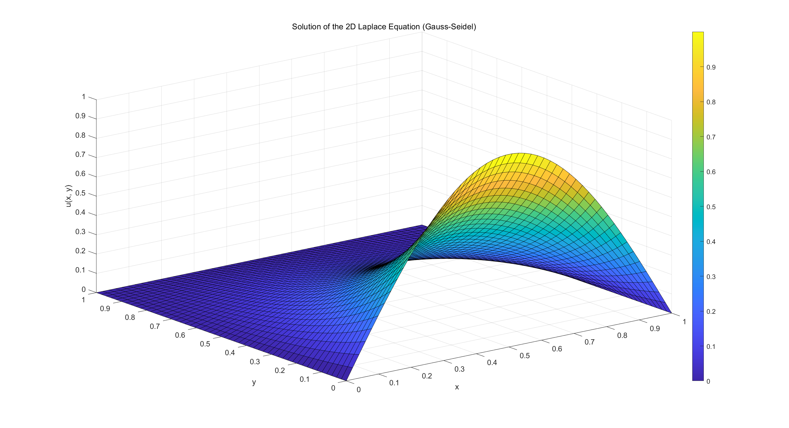
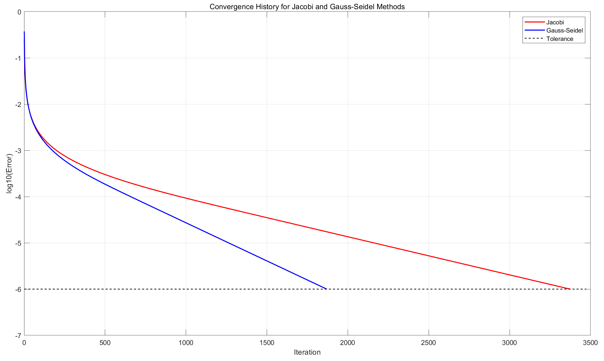

# 数值算法 Homework 11

Due: Dec. 3, 2024  
姓名: 雍崔扬   
学号: 21307140051

## Problem 1

Find an example of linear system such that the Jacobi method converges while the Gauss–Seidel method diverges.   
Justify your claim.

**Solution:**    
考虑以下方阵:
$$
A= \begin{bmatrix}
1 & 2 & -2\\
1 & 1 & 1\\
2 & 2 & 1\end{bmatrix}
$$
此时我们有:   
$$
D=\begin{bmatrix}
1 &  & \\
 & 1 & \\
 &  & 1\end{bmatrix}
\qquad
L = 
\begin{bmatrix}
 0 &  & \\
-1 & 0 & \\
-2 & -2 & 0\end{bmatrix}
\qquad
U =
\begin{bmatrix}
0 & -2 & 2\\
 & 0 & -1\\
 &  & 0\end{bmatrix}\\
$$
Jacobi 迭代矩阵为: 
$$
B_{\text{Jacobi}}:=D^{-1}(L+U) = \begin{bmatrix}
1 &  & \\
 & 1 & \\
 &  & 1\end{bmatrix}^{-1} \begin{bmatrix}
0 & -2 & 2\\
-1 & 0 & -1\\
-2 & -2 & 0\end{bmatrix} = \begin{bmatrix}
0 & -2 & 2\\
-1 & 0 & -1\\
-2 & -2 & 0\end{bmatrix}
$$
其特征多项式为 $\lambda^3$，特征值为 $0,0,0$，谱半径 $\rho(B_{\text{Jacobi}}) = 0<1$  
因此 Jacobi 迭代法收敛.

Gauss-Seidel 迭代矩阵为:
$$
B_{\text{G-S}}:=(D-L)^{-1} U = \begin{bmatrix}
1 &  & \\
1 & 1 & \\
2 & 2 & 1\end{bmatrix}^{-1} \begin{bmatrix}
0 & -2 & 2\\
 & 0 & -1\\
 &  & 0\end{bmatrix} 
= \begin{bmatrix}
1 &  & \\
-1 & 1 & \\
 & -2 & 1\end{bmatrix} \begin{bmatrix}
0 & -2 & 2\\
 & 0 & -1\\
 &  & 0\end{bmatrix} = \begin{bmatrix}
0 & -2 & 2\\
 & 2 & -3 \\
 &  & 2\end{bmatrix}
$$
其特征多项式为 $\lambda(\lambda-2)^2$，特征值为 $0,2,2$，谱半径 $\rho(B_{\text{G-S}}) = 2\geq 1$  
因此 Gauss-Seidel 迭代发散.


## Problem 2

Find an example of positive definite linear system such that the Gauss–Seidel method converges   
while the Jacobi method diverges.   
Justify your claim.

**Solution:**   
考虑以下对称方阵:
$$
A= \begin{bmatrix}
2 & 1 & 1\\
1 & 2 & 1\\
1 & 1 & 2\end{bmatrix}
$$
其特征多项式为 $(\lambda-1)^2(\lambda-4)$，特征值为 $1,1,4$，因此是对称正定阵.  
此时我们有:   
$$
D=\begin{bmatrix}
2 &  & \\
 & 2 & \\
 &  & 2\end{bmatrix}
\qquad
L = 
\begin{bmatrix}
 0 &  & \\
-1 & 0 & \\
-1 & -1 & 0\end{bmatrix}
\qquad
U =
\begin{bmatrix}
0 & -1 & -1\\
 & 0 & -1\\
 &  & 0\end{bmatrix}\\
$$
Jacobi 迭代矩阵为: 
$$
B_{\text{Jacobi}}:=D^{-1}(L+U) = \begin{bmatrix}
2 &  & \\
 & 2 & \\
 &  & 2\end{bmatrix}^{-1} \begin{bmatrix}
0 & -1 & -1\\
-1 & 0 & -1\\
-1 & -1 & 0\end{bmatrix} = \begin{bmatrix}
0 & -\frac12 & -\frac12\\
-\frac12 & 0 & -\frac12\\
-\frac12 & -\frac12 & 0\end{bmatrix}
$$
其特征多项式为 $(\lambda-0.5)^2(\lambda+1)$，特征值为 $0.5,0.5,-1$，谱半径 $\rho(B_{\text{Jacobi}}) = 1$  
因此 Jacobi 迭代法发散.

Gauss-Seidel 迭代矩阵为:
$$
B_{\text{G-S}}:=(D-L)^{-1} U = \begin{bmatrix}
2 &  & \\
1 & 2 & \\
1 & 1 & 2\end{bmatrix}^{-1} \begin{bmatrix}
0 & -1 & -1\\
 & 0 & -1\\
 &  & 0\end{bmatrix} 
= \begin{bmatrix}
\frac12 &  & \\
-\frac14 & \frac12 & \\
-\frac18 & -\frac14 & \frac12\end{bmatrix} \begin{bmatrix}
0 & -1 & -1\\
 & 0 & -1\\
 &  & 0\end{bmatrix} = \begin{bmatrix}
0 & -\frac12 & -\frac12\\
 & \frac14 & -\frac14 \\
 & \frac18 & \frac38\end{bmatrix}
$$
其特征多项式为 $\lambda(\lambda^2-\frac{5}{8}\lambda+\frac{1}{8})$，特征值为 $0,\frac{5}{16}\pm \frac{\sqrt{7}}{16}i$，谱半径 $\rho(B_{\text{G-S}}) = \frac{\sqrt 2}{4}< 1$  
因此 Gauss-Seidel 迭代收敛.

****

事实上，对于对称正定线性系统，Gauss-Seidel 迭代法总是收敛的.   
**(数值线性代数, 定理 $4.2.7$)**  
若 $A$ 对称正定，则 Gauss-Seidel 迭代法收敛.  
或者更一般地，Hermite 正定矩阵 $A\in \mathbb C^{n\times n}$ 的 Gauss-Seidel 迭代法一定收敛.  
(从这个意义来说，Gauss-Seidel 迭代法要优于 Jacobi 迭代法)

- **邵老师提供的证明:**   
  考虑 Hermite 正定线性方程组 $Ax=b$     
  回顾之前的记号:  
  $$
  A = D-L-U\\
  D=
  \begin{bmatrix}
  a_{11} & & & \\
  & a_{22} & & \\
  &&\ddots &\\
  &&& a_{nn}\end{bmatrix}
  \qquad
  L
  = 
  \begin{bmatrix}
  0 & & &\\
  -a_{21} & 0 &&\\
  \vdots & \ddots & \ddots &\\
  -a_{n1} & \dotsm & -a_{n,n-1} & 0
  \end{bmatrix}
  \qquad
  U
  =
  \begin{bmatrix}
  0 & -a_{12} & \dotsm & -a_{1n}\\
  & 0 &\ddots& \vdots\\
  &&\ddots &-a_{n-1,n}\\
  &&& 0 
  \end{bmatrix}
  $$
  $A$ 的 Hermite 性保证了 $U=L^H$  
  于是 $B = (D-L)^{-1}U = (D-L)^{-1}L^H$ 

  对于 $B$ 的任意特征对 $(\lambda,x)$，我们都有:  
  $$
  Bx= (D-L)^{-1}L^H x = x\lambda\\
  \Leftrightarrow\\
  L^Hx = (D-L)x\lambda\\
  $$
  左乘 $x^H$ 即得:  
  $$
  x^HL^Hx = x^HDx \lambda - x^HLx \lambda\\
  \Leftrightarrow\\
  \bar \beta = \alpha \lambda - \beta \lambda\text{ where }\begin{cases}
  \alpha = x^HDx\\
  \beta = x^HLx
  \end{cases}
  $$
  因此我们有:  
  $$
  \begin{align}
  \lambda 
  &=
  \frac{\bar \beta}{\alpha -\beta}\\
  &=
  \frac{\text{Re}(\beta) - i\cdot\text{Im}(\beta)}{\alpha - \text{Re}(\beta) - i\cdot\text{Im}(\beta)}
  \end{align}
  $$
  注意到 $A$ 是 Hermite 正定阵，因此对角阵 $D$ 的对角元均为正实数.  
  于是我们有 $\alpha = x^HDx>0$   
  此外我们有:  
  $$
  \begin{align}
  0&<
  x^HAx\\
  &=
  x^H(D-L-L^H)x\\
  &=
  x^HDx - x^HLx -x^HL^Hx\\
  &=
  \alpha - \beta - \bar \beta\\
  &=
  \alpha - 2\text{Re}(\beta)
  \end{align}
  $$
  要证明 $|\lambda|<1$，只需证明 $(\text{Re}(\beta))^2 < (\alpha - \text{Re}(\beta))^2=\alpha^2 - 2\alpha \text{Re}(\beta) + (\text{Re}(\beta))^2$   
  即只需证明 $\alpha(\alpha - 2\text{Re}(\beta))>0$   
  而这根据前面 $\alpha>0$ 和 $\alpha - 2\text{Re}(\beta)>0$ 的结论可知是成立的.  
  因此 Gauss-Seidel 迭代格式的系数矩阵 $B=(D-L)^{-1}L^H$ 的任意特征值 $\lambda$ 都满足 $|\lambda|<1$  
  这说明 $\rho(B)<1$，因此 Gauss-Seidel 迭代法收敛.


## Problem 3

Let $B\in \mathbb C^{n\times n},c\in \mathbb C^{n}$  
Suppose that $\rho(B)=0$   
Show that the iterative scheme $x^{(k+1)} = Bx^{(k)}+c$ converges to the solution of $x=Bx+c$   
for any initial guess $x^{(0)}$ within at most $n$ iterations.

- **(幂零 Jordan 块的性质, Matrix Analysis 引理 $3.1.4$)**  
  给定正整数 $n\geq 2$ 和 $x\in \mathbb{C}^n$，记 $\mathbb C^n$ 的第 $i$ 个标准单位基向量为 $e_i$，则我们有:
  * $J_n(0)e_{i+1} = e_i\ (\forall\ i=1,\dots,n-1)$
  * $J_n(0)^TJ_n(0) = \begin{bmatrix} 0 &\\ & I_{n-1} \end{bmatrix}$  
  * $[I_n - J_n(0)^TJ_n(0)]x = (x^Te_1)e_1$
  * $J_n(0)^k = \begin{cases} 
    I_n & \text{if }k=0\\
    \begin{bmatrix}  & I_{n-k}\\ 0_{k\times k} &  \end{bmatrix} 
    &\text{if }1 \leq k < n\\ 
    0_{n\times n} & \text{if }k\geq n\end{cases}$ 

**Solution:**  
根据 $\rho(B)=0$ 可知 $B$ 的 $n$ 个特征值均为零.  
因此可设其 Jordan 标准型为:
$$
S^{-1}BS
= J = 
\begin{bmatrix}
J_{n_1}(0)\\
& J_{n_2}(0) \\
& & \ddots \\
& & & J_{n_d}(0)
\end{bmatrix}
$$
其中 $S\in \mathbb C^{n\times n}$ 为非奇异矩阵，$d\leq 1$ 且 $n_1+\dots+n_d=n$   
记 $n_\max := \max_{1\leq i\leq d} n_i$ (显然 $n_\max\leq n$，当且仅当 $d=1$ 时取等)  
对于任意 $i=1,\dots,d$ 我们都有:  
$$
(J_{n_i}(0))^k = 0_{n_i\times n_i}\quad (\forall\ k\geq n_\max\geq n_i)
$$
于是我们有:  
$$
\begin{align}
B^k 
&=
(SJS^{-1})^k\\
&=
SJ^k S^{-1}\\
&=
S\begin{bmatrix}
(J_{n_1}(0))^k\\
& (J_{n_2}(0))^k \\
& & \ddots \\
& & & (J_{n_d}(0))^k
\end{bmatrix}S^{-1}\\
&=
S\begin{bmatrix}
0_{n_1\times n_1}\\
& 0_{n_2\times n_2} \\
& & \ddots \\
& & & 0_{n_d\times n_d}
\end{bmatrix}S^{-1}\\
&=
0_{n\times n}
\end{align}\quad (\forall\ k\geq n_\max)
$$
设 $x=Bx+c$ 的精确解为 $x_\star$   
记 $e^{(k)}:= x^{(k)}-x_\star\quad (\forall\ k\in \mathbb N)$  
则我们有:
$$
\begin{align}
e^{(k+1)}
&=
x^{(k+1)}-x_\star\\
&=
(Bx^{(k)}+c) - (Bx_\star+c)\\
&=
B(x^{(k)}-x_\star)\\
&=
Be^{(k)}
\end{align}\quad (\forall\ k\in \mathbb N)
$$
于是我们有:  
$$
\begin{align}
e^{(k)}
&=
Be^{(k-1)}\\
&=
B^2e^{(k-2)}\\
&=
\dotsm\\
&=
B^{k}e^{(0)}
\end{align}\quad (\forall\ k\in \mathbb Z_+)
$$
根据 $B^k=0_{n\times n}\ (\forall\ k\geq n_\max)$ 可知: 
$$
\begin{align}
x^{(k)} - x_\star 
& = e^{(k)}\\
& = B^k e^{(0)}\\
&= 0_{n\times n} e^{(0)}\\
&= 0_n
\end{align}\quad (\forall\ k\geq n_\max)
$$
因此 $x^{(k)}=x_\star\ (\forall\ k\geq n_\max)$  
说明单步线性定常迭代法 $x^{(k+1)}=Bx^{(k)}+c$ 在第 $n_\max\leq n$ 步收敛于 $x=Bx+c$ 的精确解.  
命题得证.


## Problem 4

Let $B,M\in \mathbb C^{n\times n},c\in \mathbb C^{n}$  
Suppose that both $M$ and $M-B^HMB$ are positive definite.  
Show that the iterative scheme $x^{(k+1)}=Bx^{(k)}+c$ converges to the solution of $x=Bx+c$ for any initial guess $x^{(0)}$

**Solution:**    
设 $x=Bx+c$ 的精确解为 $x_\star$   
记 $e^{(k)}:= x^{(k)}-x_\star\quad (\forall\ k\in \mathbb N)$  
则我们有:
$$
\begin{align}
e^{(k+1)}
&=
x^{(k+1)}-x_\star\\
&=
(Bx^{(k)}+c) - (Bx_\star+c)\\
&=
B(x^{(k)}-x_\star)\\
&=
Be^{(k)}
\end{align}\quad (\forall\ k\in \mathbb N)
$$
于是我们有:  
$$
\begin{align}
e^{(k)}
&=
Be^{(k-1)}\\
&=
B^2e^{(k-2)}\\
&=
\dotsm\\
&=
B^{k}e^{(0)}
\end{align}\quad (\forall\ k\in \mathbb Z_+)
$$
因此单步线性定常迭代法 $x^{(k+1)}=Bx^{(k)}+c$ 收敛 (即 $x^{(k)}\to x_\star\ (n\to\infty)$) 当且仅当 $\lim_{k\to\infty} B^{k} = 0_{n\times n}$，  
即当且仅当 $\rho(B)<1$ 

****

注意到 $M,M-B^HMB$ 都是 Hermite 正定阵.  
因此对于 $B$ 的任意特征对 $(\lambda,u)$ 都有:  
$$
\begin{align}
u^HMu &>0\\
\hline
u^H(M-B^HMB)u
&=
u^HMu - (Bu)^HM(Bu)\\
&=
u^HMu - (u\lambda)^HM(u\lambda)\\
&=
u^HMu (1-|\lambda|^2) \\
&>0
\end{align}
$$
于是我们有 $|\lambda|<1$ 成立.  
根据 $\lambda$ 的任意性可知 $\rho(B) = \max_{\lambda\in \text{eig}(B)} |\lambda| <1$   
因此单步线性定常迭代法 $x^{(k+1)}=Bx^{(k)}+c$ 收敛


## Problem 5 

Numerically solve the $\text{2D}$ Laplace equation:  
$$
\frac{\partial^2}{\partial x^2}u(x,y) + \frac{\partial^2}{\partial x^2}u(x,y) =0
$$
over the unit square $[0,1]^2$ with boundary conditions:  
$$
\begin{align}
u(0,y)&\equiv 0\\
u(1,y)&\equiv 0\\
u(x,0)&= \sin(\pi x)\quad (\forall\ x\in [0,1])\\
u(x,1)&\equiv 0
\end{align}
$$
Use the Jacobi method or the Gauss-Seidel method to solve the discretized system.  
Visualize the solution and the convergence history.

**Solution:**    

### (1) 理论推导

考虑二维 Poisson 方程:  
$$
-\frac{\partial^2}{\partial x^2}u(x,y) - \frac{\partial^2}{\partial x^2}u(x,y)= f(x,y)\quad (0<x,y<1)
$$
(本题中函数 $f(x,y)\equiv 0$)  
我们可以使用有限差分去逼近上述方程:  
$$
\begin{align}
h &:= \frac{1}{n+1}\\
-\frac{\partial^2}{\partial x^2}u(x,y){\Large|}_{x=x_i,y=y_j} &\approx \frac{2u_{ij}-u_{i-1,j} - u_{i+1,j}}{h^2}\quad (i,j=1,\dots,n)\\
-\frac{\partial^2}{\partial y^2}u(x,y){\Large|}_{x=x_i,y=y_j} &\approx \frac{2u_{ij}-u_{i,j-1} - u_{i,j+1}}{h^2}\quad (i,j=1,\dots,n)\\
\end{align}
$$
将上述近似相加得到:  
$$
-\left\{
\frac{\partial^2}{\partial x^2}u(x,y) + 
\frac{\partial^2}{\partial y^2}u(x,y)
\right\}{\Large|}_{x=x_i,y=y_j} \approx \frac{4u_{ij} - u_{i-1,j}-u_{i+1,j} - u_{i,j-1}-u_{i,j+1}}{h^2}
$$
其中截断误差是 $O(h^2)$ 级别的.  
于是我们得到一组具有 $n$ 个未知量 $u_{ij}\ (1\leq i,j\leq n)$ 的 $n^2$ 维线性方程组:
$$
4u_{ij} - u_{i-1,j} - u_{i+1,j} - u_{i,j-1}- u_{i,j+1} = h^2 f_{ij}\quad (1\leq i,j\leq n)
$$


### (2) Jacobi 迭代

**(二维 Poisson 方程 Jacobi 法单步, 应用数值线性代数, 算法 $6.2$)**  
$$
\begin{align}
&\text{for }i=1:n\\
&\qquad \text{for }j=1:n\\
&\qquad\qquad u^{(k+1)}_{i,j} = \frac14(u^{(k)}_{i-1,j} + u_{i+1,j}^{(k)} + u_{i,j-1}^{(k)} + u_{i,j+1}^{(k)} + h^2 f_{ij})\\
&\qquad \text{end}\\
&\text{end}
\end{align}
$$
注意到所有的新值 $u_{i,j}^{(k+1)}$ 都可以彼此独立的计算.  
因此当 $u_{i,j}^{(k+1)}$ 被存放在一个 $n+2$ 阶矩阵 $U$ 中 (这个矩阵补全了边界值) 时，  
我们可以只用一条 Matlab 语句来实现上述算法.

```matlab
U(2:n+1, 2:n+1) = 0.25 * (U(1:n,2:n+1) + U(3:n+2,2:n+1) + U(2:n+1,1:n) + U(2:n+1,3:n+2) + h^2 * F);
```

其中 $h = \frac{1}{n+1}$，而 $f_{i,j}$ 的值存储在 $n$ 阶矩阵 $F$ 中 (本题中函数 $f(x,y)\equiv 0$) 

****

Matlab 代码为:

```matlab
% Jacobi Iteration to solve 2D Poisson Problem
function [U, errorHistory] = Poisson_Jacobi(U, F, maxIter, tolerance)
    
    n = size(U, 1) - 2; % Get the grid size excluding the boundary points (n x n grid)
    h = 1 / (n + 1); % Grid spacing
    h_square_times_F = h^2 * F; % Precompute h^2 * F for efficiency in the Jacobi update

    % Initialize error history array
    errorHistory = zeros(maxIter, 1);
    
    for iter = 1:maxIter
        % Update interior points using the Jacobi method
        U_new = 0.25 * (U(1:n,2:n+1) + U(3:n+2,2:n+1) + U(2:n+1,1:n) + U(2:n+1,3:n+2) + h_square_times_F);
        
        % Calculate the error (difference between new and old solution)
        error = max(max(abs(U_new - U(2:n+1, 2:n+1))));
        
        % Store the error in the error history array
        errorHistory(iter) = error;
        
        % Update U for the next iteration
        U(2:n+1, 2:n+1) = U_new;
        
        % Check for convergence
        if error < tolerance
            fprintf('Jacobi: Convergence reached after %d iterations.\n', iter);
            errorHistory = errorHistory(1:iter); % Trim the error history to the actual number of iterations
            break;
        end
    end
end
```


### (3) Gauss-Seidel 迭代

**红黑序: **   
(红节点的坐标之和为偶数，黑节点的坐标之和为奇数)
我们首先使用来自黑节点的旧数据更新所有的红节点，  
再使用来自红节点的新数据更新所有的黑节点.


于是得到如下算法:  
**(二维 Poisson 方程红黑序 Gauss-Seidel 法单步, 应用数值线性代数, 算法 $6.4$)**   
$$
\begin{align}
&\text{for all nodes }(i,j)\text{ that are red (i.e. }i+j \text{ is even})\\
&\qquad u^{(k+1)}_{i,j} = \frac14 (u^{(k)}_{i-1,j} + u^{(k)}_{i+1,j} + u^{(k)}_{i,j-1}+u^{(k)}_{i,j+1}
+ h^2 f_{ij})\\
&\text{end}\\
&\text{for all nodes }(i,j)\text{ that are black (i.e. }i+j \text{ is odd})\\
&\qquad u^{(k+1)_{i,j}} = \frac14 (u_{i-1,j}^{(k+1)} + u_{i+1,j}^{(k+1)} + u_{i,j-1}^{(k+1)} 
+ u_{i,j+1}^{(k+1)} + h^2 f_{ij})\\
&\text{end}
\end{align}
$$

****

Matlab 代码为:

```matlab
% Red-Black Gauss-Seidel Iteration to solve 2D Poisson Problem
function [U, errorHistory] = Poisson_RedBlack_GaussSeidel(U, F, maxIter, tolerance)
    
    n = size(U, 1) - 2; % Get the grid size excluding the boundary points (n x n grid)
    h = 1 / (n + 1); % Grid spacing
    h_square_times_F = h^2 * F; % Precompute h^2 * F for efficiency in the Gauss-Seidel update

    % Initialize error history array
    errorHistory = zeros(maxIter, 1); % Store the error at each iteration
    
    for iter = 1:maxIter
        % Save the old version for convergence check
        U_old = U;
        
        % Update red nodes (i + j is even)
        for i = 2:n+1
            for j = 2:n+1
                if mod(i + j, 2) == 0 % Red node (i+j is even)
                    U(i,j) = 0.25 * (U(i-1,j) + U(i+1,j) + U(i,j-1) + U(i,j+1) + h_square_times_F(i-1,j-1));
                end
            end
        end
        
        % Update black nodes (i + j is odd)
        for i = 2:n+1
            for j = 2:n+1
                if mod(i + j, 2) == 1 % Black node (i+j is odd)
                    U(i,j) = 0.25 * (U(i-1,j) + U(i+1,j) + U(i,j-1) + U(i,j+1) + h_square_times_F(i-1,j-1));
                end
            end
        end
        
        % Calculate the error (difference between new and old solution)
        error = max(max(abs(U(2:n+1, 2:n+1) - U_old(2:n+1, 2:n+1))));
        
        % Store the error in the error history array for convergence tracking
        errorHistory(iter) = error;
        
        % Check for convergence: If error is below tolerance, break the loop
        if error < tolerance
            fprintf('Gauss-Seidel: Convergence reached after %d iterations.\n', iter);
            errorHistory = errorHistory(1:iter); % Trim the error history to the actual number of iterations
            break; % Exit the loop if convergence is reached
        end
    end
end
```


### (4) 运行结果

函数调用:

```matlab
% Parameters
n = 50; % Number of grid points in each direction
maxIter = 5000; % Maximum number of iterations
tolerance = 1e-6; % Convergence tolerance

% Grid spacing
h = 1 / (n + 1);

% The source term (right-hand side of Poisson equation)
F = zeros(n, n);

% Create the grid (including boundary)
U = zeros(n+2, n+2); % Solution grid (with boundaries included)

% Set initial condition at y = 0
x = linspace(0, 1, n+2); % x grid points, including boundary points
U(2:n+1, 1) = sin(pi * x(2:n+1)); % Set u(x, 0) = sin(pi * x)

% Use Jacobi iteration to solve 2D Poisson problem
[U_Jacobi, errorHistory_Jacobi] = Poisson_Jacobi(U, F, maxIter, tolerance);

% Visualization of the solution
[X, Y] = meshgrid(0:h:1, 0:h:1); % Create meshgrid for plotting
surf(X, Y, U_Jacobi); % Plot the solution
title('Solution of the 2D Laplace Equation (Jacobi)');
xlabel('x');
ylabel('y');
zlabel('u(x, y)');
colorbar;

% Use Gauss-Seidel iteration to solve 2D Poisson problem
[U_GS, errorHistory_GS] = Poisson_RedBlack_GaussSeidel(U, F, maxIter, tolerance);

% Visualization of the solution
[X, Y] = meshgrid(0:h:1, 0:h:1); % Create meshgrid for plotting
surf(X, Y, U_GS); % Plot the solution
title('Solution of the 2D Laplace Equation (Gauss-Seidel)');
xlabel('x');
ylabel('y');
zlabel('u(x, y)');
colorbar;

% Plot the error history
figure;
plot(1:length(errorHistory_Jacobi), log10(errorHistory_Jacobi), 'r-', 'LineWidth', 1.5);
hold on;
plot(1:length(errorHistory_GS), log10(errorHistory_GS), 'b-', 'LineWidth', 1.5);

% Plot the tolerance line
tolerance_line = log10(tolerance);
plot([1, max(length(errorHistory_Jacobi), length(errorHistory_GS)) + 100], [tolerance_line, tolerance_line], ...
            'k--', 'LineWidth', 1);
xlabel('Iteration');
ylabel('log10(Error)');
title('Convergence History for Jacobi and Gauss-Seidel Methods');
legend({'Jacobi', 'Gauss-Seidel', 'Tolerance'}, 'Location', 'northeast');
grid on;
```

**运行结果:**

```
Jacobi: Convergence reached after 3374 iterations.
Gauss-Seidel: Convergence reached after 1870 iterations.
```

这验证了一个重要的结论:   
求解二维 Poisson 问题时 Gauss-Seidel 迭代每步的效果相当于 Jacobi 迭代的两步.

- **① Jacobi 迭代:**

  

- **② Gauss-Seidel 迭代:**  

  

- **③ 对比:**  
  这验证了一个重要的结论:   
  求解二维 Poisson 问题时 Gauss-Seidel 迭代每步的效果相当于 Jacobi 迭代的两步.

  


## Problem 6 (optional)

Let $A$ be a real symmetric nonsingular matrix with positive diagonal entries.  
Suppose that the Gauss-Seidel method for solving $Ax=b$ converges for any initial guess.  
Show that $A$ is positive definite.  
(Hint: Show that $C=A-B^TAB$ is positive definite, where $B=I-(D-L)^{-1}A$)

**Proof:**  
将 $A$ 拆分为 $A=D-L-U$ (分别是对角部分、严格下三角部分和严格上三角部分)  
根据 $A$ 的对称性可知 $U=L^T$  
因此 Gauss-Seidel 迭代矩阵为:
$$
\begin{align}
B
&:=(D-L)^{-1}U\\
&= (D-L)^{-1}(D-L-A)\\
&= I - (D-L)^{-1}A
\end{align}
$$
根据题设可知无论起始点如何选取，Gauss-Seidel 迭代法总是收敛的，这意味着 $\rho(B)<1$  
即对于 $B$ 的任意特征值 $\lambda$ 都有 $|\lambda|<1$ 成立.

***

我们定义:  
$$
\begin{align}
C
&:=
A-B^TAB\\
&=
A - (I - (D-L)^{-1}A)^T A (I - (D-L)^{-1}A)\\
&=
A - A + A^T(D-L)^{-T}A + A (D-L)^{-1}A - A^T(D-L)^{-T} A (D-L)^{-1}A\\
&=
A^T[(D-L)^{-T} + (D-L)^{-1} - (D-L)^{-T}A(D-L)^{-1}]A\\
&=
A^T(D-L)^{-T} [(D-L) + (D-L)^T - A] (D-L)^{-1}A\\
&=
[(D-L)^{-1}A]^T [D + (D-L-L^T) - A] (D-L)^{-1}A \quad (\text{note that }A=D-L-U=D-L-L^T)\\
&=
[(D-L)^{-1}A]^T D (D-L)^{-1}A
\end{align}
$$
根据题设可知 $A$ 的对角元均为正实数，因此 $D$ 为正定的对角阵  
进而得到 $C = [(D-L)^{-1}A]^T D (D-L)^{-1}A$ 对称正定.  
即对于任意 $x\neq 0_n\in \mathbb R^n$ 都有 $x^TCx >0$ 成立.

***

下面我们证明 $A$ 的正定性:  
$$
\begin{align}
A 
&= C + B^TAB\\
&=
C+B^T(C+B^TAB)B\\
&=
C + B^TCB + (B^2)^T A (B^2)\\
&=
C + B^TCB + (B^2)^T (C+B^TAB) (B^2)\\
&=
\dotsm\\
&=
C + \sum_{k=1}^\infty (B^k)^T C(B^k)
\end{align}
$$
由于 $C$ 是对称正定的，且对于任意 $k\in \mathbb Z_+$，合同变换后的矩阵 $(B^k)^TC(B^k)$ 都是对称正定的，  
故 $A$ 也是对称正定的.  
命题得证.

> **失败的尝试:**  
> 对于 $B$ 的任意特征对 $(\lambda,x)$ 我们都有:  
> $$
> \begin{align}
> x^TCx
> &=
> x^T(A-B^TAB)x\\
> &=
> x^TAx - (Bx)^TA(Bx)\\
> &=
> x^TAx - (x\lambda)^TA(x\lambda)\\
> &=
> x^TAx (1-\lambda^2)\\
> &>0
> \end{align}
> $$
> 根据 $|\lambda|<1$ 可知 $x^TAx>0$  
> **(存疑: 但是如何推广到一般的 $x$?)**
