# 数值算法 Homework 12

Due: Dec. 10, 2024  
姓名: 雍崔扬   
学号: 21307140051

## Problem 1

Implement your own GMRES solver.   
Test it with at least two systems of sparse linear equations (for symmetric and nonsymmetric coefficient matrices)   
with $1000+$ unknowns and plot the residual history.

### (1) 基础算法

给定 $A\in \mathbb R^{n\times n}$ 和 $b\in \mathbb R^n$    
设初始向量为 $x_0\in \mathbb R^n$，记初始残差向量为 $r_0:=b-Ax_0$  
假设已经通过 Arnoldi 过程得到了 $k$ 阶 Krylov 子空间 $\mathcal K(A,r^{(0)},x)$ 的一组标准正交基 $Q_k=[q_1,\dots,q_k]$，满足: 
$$
\begin{align}
A Q_k 
&= A[q_1,\dots,q_k]\\
&= [q_1,\dots,q_k,q_{k+1}]
\begin{bmatrix}
h_{11} & h_{12} &\dotsm  & h_{1k}\\
h_{21} & h_{22} & \dotsm & h_{2k}\\
& \ddots & \ddots & \vdots\\
& & h_{k,k-1} & h_{k,k}\\
& & & h_{k+1,k}
\end{bmatrix}\\
&= Q_{k+1} \tilde H_{k}\\
&=
[q_1,\dots,q_k]
\begin{bmatrix}
h_{11} & h_{12} &\dotsm  & h_{1k}\\
h_{21} & h_{22} & \dotsm & h_{2k}\\
& \ddots & \ddots & \vdots\\
& & h_{k,k-1} & h_{k,k}\\
\end{bmatrix}
+
q_{k+1} h_{k+1,k}\\
&=
Q_k H_k + \text{rank-one}\quad (\text{where rank-one}:= q_{k+1} h_{k+1,k})
\end{align}
$$
我们的目标是将残量最小化:  
$$
\begin{align}
x_k 
&:= \arg\min_{x\in x_0 + \mathcal K(A,b,k)} \|b-Ax\|_2\quad (\text{denote }x = x_0 + Q_k y\text{ where }y\in \mathbb R^k)\\
&= 
x_0 + Q_k \cdot\arg\min_{y\in \mathbb R^k} \|b-A(x_0+Q_k y)\|_2\\
&=
x_0 + Q_k \cdot\arg\min_{y\in \mathbb R^k} \|r_0 - AQ_k y\|_2\\
&=
x_0 + Q_k \cdot\arg\min_{y\in \mathbb R^k} \|r_0 - Q_{k+1}\tilde H_k y \|_2\quad (\text{note that }\|\cdot\|_2 
\text{ is unitary invariant})\\
&=
x_0 + Q_k \cdot\arg\min_{y\in \mathbb R^k} \|Q_{k+1}^Hr_0 - \tilde H_k y\|_2\quad (\text{note that }q_1 = \frac{r_0}{\|r_0\|_2}\text{, while }q_2,\dots,q_{k+1}\text{ are orthogonal to }r_0)\\
&=
x_0 + Q_k \cdot\arg\min_{y\in \mathbb R^k} \|\|r_0\|_2e_1 - \tilde H_k y\|_2
\end{align}
$$
其中 $e_1$ 代表 $\mathbb R^{k+1}$ 的第一个标准基向量.  
因此 GMRES 算法每一步的近似解都等价于求解一个最小二乘问题:   
$$
y_k:=\arg\min_{y\in \mathbb R^k} \|\|r_0\|_2e_1 - \tilde H_k y\|_2\\
x_k:= x_0 + Q_k y_k
$$
注意到 $\tilde H_k\in \mathbb R^{(k+1)\times k}$ 是一个上 Hessenberg 矩阵，  
因此这个最小二乘问题可以使用 Givens $\text{QR}$ 分解来求解.   


### (2) 子问题求解

记 $\tilde H_k\in \mathbb R^{(k+1)\times k}$ 通过 Givens 变换得到的 $\text{QR}$ 分解为:  
$$
\tilde H_k = G_k^T \begin{bmatrix}
R_k\\
0_k^T\end{bmatrix}
$$
其中 $G_k\in \mathbb R^{(k+1)\times (k+1)}$ 是累积的 $k$ 个 Givens 变换，而 $R_k\in \mathbb R^{k\times k}$ 是上三角阵.  
将经过 Givens 变换的残差向量 $G_k \|r_0\|_2 e_1$ 划分为:
$$
G_k \|r_0\|_2 e_1 = 
\begin{bmatrix}
\eta_k\\
\varepsilon_k
\end{bmatrix}
\text{ where }
\begin{cases}
\eta_k \in \mathbb R^k\\
\varepsilon_k \in \mathbb R
\end{cases}
$$
其中 $e_1$ 代表 $\mathbb R^{k+1}$ 的第一个标准基向量.  
于是我们有:  
$$
\begin{align}
y_k
&:=
\arg\min_{y\in \mathbb R^k}\|\|r_0\|_2 e_1 - \tilde H_k y\|_2\\
&=
\arg\min_{y\in \mathbb R^k}\|G_k \|r_0\|_2 e_1 - G_k\tilde H_k y\|_2\\
&=
\arg\min_{y\in \mathbb R^k} 
\left\|\begin{bmatrix}
\eta_k\\
\varepsilon_k
\end{bmatrix} - \begin{bmatrix}
R_k\\
0_k^T\end{bmatrix}y\right\|_2\\
&=
\arg\min_{y\in \mathbb R^k} \left\|\begin{bmatrix}
\eta_k - R_k y\\
\varepsilon_k
\end{bmatrix}\right\|_2\\
&=
\text{solution of }\{R_k y = \eta_k\}
\end{align}
$$
通过回代法即可得到最小二乘解 $y_k\in \mathbb R^k$  
进而得到第 $k$ 轮迭代的近似解 $x_k = x_0 + Q_k y_k$   

记第 $k$ 轮迭代的残差向量为 $r_k := b-Ax_k$  
可以证明 $\|r_k\|_2 = |\varepsilon_k|$:  
$$
\begin{align}
\|r_k\|_2
&=
\|b-Ax_k\|_2\\
&=
\|b-A(x_0 + Q_k y_k)\|_2\\
&=
\|r_0 - AQ_k y_k\|_2\\
&=
\|r_0 - Q_{k+1}\tilde H_k y_k\|_2\quad (\text{note that }\|\cdot\|_2 
\text{ is unitary invariant})\\
&=
\|Q_{k+1}^H r_0 - \tilde H_k y_k\|_2\quad (\text{note that }q_1 = \frac{r_0}{\|r_0\|_2}\text{, while }q_2,\dots,q_{k+1}\text{ are orthogonal to }r_0)\\
&=
\|\|r_0\|_2 e_1 - \tilde H_k y_k\|_2\\
&=
\|G_k \|r_0\|_2 e_1 - G_k\tilde H_k y_k\|_2\\
&=
\left\|\begin{bmatrix}
\eta_k\\
\varepsilon_k
\end{bmatrix} - \begin{bmatrix}
R_k\\
0_k^T\end{bmatrix}y_k\right\|_2\\
&=
\left\|\begin{bmatrix}
\eta_k - R_k y_k\\
\varepsilon_k
\end{bmatrix}\right\|_2\quad (\text{note that }y_k = R_k^{-1}\eta_k)\\
&=
\left\|\begin{bmatrix}
0_k\\
\varepsilon_k
\end{bmatrix}\right\|_2\\
&=
|\varepsilon_k|
\end{align}
$$
因此迭代过程中我们无需显式地计算残差 $r_k$，  
可以直接将 $|\varepsilon_k|$ 作为 $\|r_k\|_2$ 的替代来进行收敛条件的判断.


### (3) Lucky Breakdown

注意到当且仅当 Arnoldi 过程提前中止时，GMRES 算法会出现提前中止.  
设第 $k$ 步 Arnoldi 过程提前中止了，  
即 $Aq_k = A^k q_1 = A^k \frac{r_0}{\|r_0\|_2}$ 可以表示为 $q_1,q_2,\dots,q_k$ 的线性组合 (即 $Aq_k\in \mathcal K(A,r_0,k)$)   
因此 $q_{k+1}$ 生成不出来，同时 $H_{k+1,k}=0$  
于是我们有:  
$$
\tilde H_k = \begin{bmatrix}
H_k\\
0_k^T\end{bmatrix}
$$
此时子问题 (一个最小二乘问题) 就等价于一个线性方程组的求解问题:  
$$
\begin{align}
y_k
&:=\arg\min_{y\in \mathbb R^k} \|\|r_0\|_2e_1 - \tilde H_k y\|_2\\
&=
\text{solution of }\{H_k y = \|r_0\|_2 e_1\}
\end{align}
$$
注意第二个式子中的 $e_1\in \mathbb R^k$ 要比第一个式子中的 $e_1\in \mathbb R^{k+1}$ 少一维.    
由于 $H_k\in \mathbb R^{k\times k}$ 仍是上 Hessenberg 矩阵，  
因此我们依然按照 Givens $\text{QR}$ 的方法来求解子问题.   
记 $H_k y = \|r_0\|_2e_1$ 的解为 $y_k\in \mathbb R^{k\times k}$

值得注意的是，从上一节的观点来看，  
由于 $H_{k+1,k}=0$，因此我们不需要第 $k$ 个 Givens 变换 (或者说它可以取成单位阵的形式)  
这说明残差向量 $\|r_0\|_2e_1$ 只接受 $k-1$ 次 Givens 变换的分裂，  
所以其第 $k+1$ 个分量 (也就是我们之前管不了的那个分量, 记号为 $\varepsilon_k$) 为零.  
理论上，此时仍然有 $\|r_k\|_2=|\varepsilon_k|=0$ 成立.  
这说明第 $k$ 步的近似解 $x_k = x_0 + Q_k y_k$ 就是 $Ax=b$ 的精确解.  
因此我们可以提前中止 GMRES 算法.  
所以能发生这样的提前中止是幸运的，我们称之为 lucky breakdown.   


### (4) 实用形式

注意到无论是否发生 lucky breakdown，  
我们都需要通过 Givens 变换求解子问题，即涉及 $\tilde H_k$ 的 Givens $\text{QR}$ 分解.  
注意到第 $k$ 步迭代的子问题中，前 $k-1$ 个 Givens 变换与上一轮迭代相同.  
因此我们不妨将这些 Givens 变换记录下来，每步求解子问题只需计算一个 Givens 变换即可.  
这能使得求解一次子问题的计算复杂度从 $O(k^2)$ 降到 $O(k)$  
即使加上一次使用回代法计算 $y_k$ 的计算复杂度 $O(k^2)$，  
在 $k$ 步 GMRES 迭代中求解子问题的计算复杂度依然是 $O(k^2)$ 级别.

因此 $k$ 步 GMRES 迭代的计算复杂度为 $O(nk^2)$ (主要是 Arnoldi 过程的代价)  
存储复杂度为 $O(nk)$ (主要是 $Q_k\in \mathbb R^{n\times k}$ 的存储)  
这说明通过记录并复用 Givens 变换，我们成功让求解子问题的代价被主问题的代价 "吃" 掉了.
$$
\begin{align}
&\text{function: }x = \text{GMRES}(A, b, \text{max\_iter}, \text{tolerance})\\
&\qquad n = \dim(A)\\
&\qquad Q = \text{zeros}(n, \text{max\_iter}+1)\quad (\text{orthonormal basis vectors})\\
&\qquad Q(:, 1) = \frac{b}{\|b\|_2}\\
&\qquad H = \text{zeros}(\text{max\_iter}+1, \text{max\_iter})\quad (\text{Hessenberg matrix})\\
&\qquad \delta = \text{zeros}(n, 1)\quad (\text{temporary storage for orthogonalization})\\
&\qquad \text{reorthogonalization\_loop} = 2\\
&\qquad G = \text{zeros}(\text{max\_iter}, 2)\quad (\text{Givens rotation coefficients storage})\\
&\qquad r = \text{zeros}(\text{max\_iter}+1, 1)\quad (\text{residuals in Givens-rotated space})\\
&\qquad r(1) = \|b\|_2\\
\hline
&\qquad \text{for }k = 1:\text{max\_iter}\\
&\qquad\qquad Q(:, k+1) = A \cdot Q(:, k) \quad (\text{expand Krylov subspace})\\
&\qquad\qquad \text{for iter} = 1:\text{reorthogonalization\_loop}\\
&\qquad\qquad\qquad \text{for }i = 1:k \quad (\text{Modified Gram-Schmidt orthogonalization})\\
&\qquad\qquad\qquad\qquad \delta(i) = Q(:, i)^T Q(:, k+1)\\
&\qquad\qquad\qquad\qquad H(i, k) = H(i, k) + \delta(i)\\
&\qquad\qquad\qquad\qquad Q(:, k+1) = Q(:, k+1) - \delta(i) Q(:, i)\\
&\qquad\qquad\qquad \text{end}\\
&\qquad\qquad \text{end}\\
&\qquad\qquad \text{for }j = 1:k-1 \quad (\text{apply Givens rotations to new column})\\
&\qquad\qquad\qquad [c,s] = G(j, 1:2)\\
&\qquad\qquad\qquad H(j:j+1, k) = \begin{bmatrix} c & s \\ -s & c \end{bmatrix} H(j:j+1, k)\\
&\qquad\qquad \text{end}\\
&\qquad\qquad H(k+1, k) = \|Q(:, k+1)\|_2\quad (\text{compute norm of } Q(:, k+1))\\
&\qquad\qquad \text{if } H(k+1, k) < 10^{-10} \quad (\text{lucky breakdown})\\
&\qquad\qquad\qquad \text{break}\\
&\qquad\qquad \text{else}\\
&\qquad\qquad\qquad Q(:, k+1) = Q(:, k+1) / H(k+1, k) \quad (\text{normalize basis vector})\\
&\qquad\qquad\qquad [c, s] = \text{Givens}(H(k, k), H(k+1, k)) \quad (\text{compute Givens rotation coefficients})\\
&\qquad\qquad\qquad G(k, 1:2) = [c, s]\\
&\qquad\qquad\qquad H(k:k+1, k) = \begin{bmatrix} c & s \\ -s & c \end{bmatrix} H(k:k+1, k)\\
&\qquad\qquad\qquad r(k:k+1) = \begin{bmatrix} c & s \\ -s & c \end{bmatrix} r(k:k+1)\\
&\qquad\qquad\qquad \text{if } |r(k+1)| < \text{tolerance} \quad (\text{check for convergence})\\
&\qquad\qquad\qquad\qquad \text{break}\\
&\qquad\qquad\qquad \text{end}\\
&\qquad\qquad \text{end}\\
&\qquad \text{end}\\
\hline
&\qquad y = \text{Backward\_Sweep}(H(1:k, 1:k), r(1:k)) \quad (\text{solve reduced system})\\
&\qquad x = Q(:, 1:k) y \quad (\text{compute final solution})\\
&\text{end}
\end{align}
$$
Matlab 代码如下:

```matlab
function [x, history, Q] = GMRES(A, b, max_iter, tolerance)
    % GMRES: Generalized Minimal Residual method for solving Ax = b
    % Inputs:
    %   A: Coefficient matrix (n x n)
    %   b: Right-hand side vector (n x 1)
    %   max_iter: Maximum number of iterations
    %   tolerance: Convergence tolerance for residual norm
    % Outputs:
    %   x: Approximate solution to Ax = b
    %   history: Residual norms at each iteration
    %   Q: Orthonormal basis vectors

    n = size(A, 1); % Dimension of the matrix
    Q = zeros(n, max_iter+1); % Orthonormal basis vectors
    Q(:, 1) = b / norm(b); % Initialize the first basis vector
    H = zeros(max_iter+1, max_iter); % Upper Hessenberg matrix
    delta = zeros(n, 1); % Temporary storage for orthogonalization
    reorthogonalization_loop = 2; % Number of orthogonalization loops
    Givens_cs = zeros(max_iter, 2); % Givens rotation coefficients
    r = zeros(max_iter+1, 1); % Residuals in Givens-rotated space
    r(1) = norm(b); % Initial residual norm
    history = zeros(max_iter+1, 1); % History of residual norms
    history(1) = r(1); % Store the initial residual norm
    
    % GMRES iterations
    for k = 1:max_iter
        % Arnoldi Process: Expand the Krylov subspace
        Q(:, k + 1) = A * Q(:, k);
        % Perform Gram-Schmidt with reorthogonalization
        for iter = 1:reorthogonalization_loop 
            for i = 1:k
                % Compute inner product for orthogonalization
                delta(i) = Q(:, i)' * Q(:, k + 1); 
                % Accumulate values into H (Hessenberg matrix)
                H(i, k) = H(i, k) + delta(i); 
                % Orthogonalize the k+1-th vector
                Q(:, k+1) = Q(:, k+1) - delta(i) * Q(:, i); 
            end
        end

        % Apply Givens rotations for the new column
        for j = 1:k-1
            c = Givens_cs(j, 1);
            s = Givens_cs(j, 2);
            G = [c, s;
                -s, c];
            H(j:j+1, k) = G * H(j:j+1, k);
        end
    
        % Compute the norm for the current basis vector
        H(k+1, k) = norm(Q(:, k+1));
        % Check for lucky breakdown
        if H(k+1, k) < 1e-10 
            fprintf("Lucky breakdown on %d-th iteration!\n", k);
            break
        else
            % Normalize the k+1-th basis vector
            Q(:, k+1) = Q(:, k+1) / H(k+1, k);
            % Compute Givens rotation coefficients for new column of H
            [c, s] = Givens(H(k, k), H(k+1, k));
            Givens_cs(k, 1:2) = [c, s]; % Store the coefficients
            % Apply Givens rotation to H and r
            G = [c, s;
                -s, c];
            H(k:k+1, k) = G * H(k:k+1, k);
            r(k:k+1) = G * r(k:k+1);
            % Update residual norm history
            history(k+1) = abs(r(k+1));
            % Check for convergence
            if history(k+1) < tolerance
                fprintf("Converged on %d-th iteration!\n", k);
                break
            end
        end
    end

    % Solve for y using the reduced H matrix and compute x
    y = Backward_Sweep(H(1:k, 1:k), r(1:k));
    x = Q(:, 1:k) * y;
    Q = Q(:, 1:k);
end
```


### (5) Helper Functions

计算实 Givens 变换的函数:

```matlab
function [c, s] = Givens(a, b)
    % Givens 旋转，计算 cos 和 sin
    if b == 0
        c = 1;
        s = 0;
    else
        if abs(b) > abs(a)
            t = a / b;
            s = 1 / sqrt(1 + t^2);
            c = s * t;
        else
            t = b / a;
            c = 1 / sqrt(1 + t^2);
            s = c * t;
        end
    end
end
```

回代法求解上三角方程组的函数:

```matlab
function x = Backward_Sweep(U, y)
    % 回代法求解 Ux = y
    n = length(y);
    for i = n:-1:2
        y(i) = y(i) / U(i, i);  % 对角线归一化
        y(1:i-1) = y(1:i-1) - y(i) * U(1:i-1, i);  % 消去
    end
    y(1) = y(1) / U(1, 1);  % 处理第一行
    x = y;  % 返回结果
end
```

可视化正交性损失的函数:

```matlab
function visualize_orthogonality_loss(Q, titleStr)
    % Visualizes the componentwise loss of orthogonality |Q^H Q - I_n|
    loss = Q' * Q - eye(size(Q, 2)); % Compute the loss
    figure; % Create a new figure window
    imagesc(log10(abs(loss))); % Display the absolute value of the loss
    colorbar; % Add colorbar to indicate scale
    title(titleStr);
    xlabel('Column Index');
    ylabel('Row Index');
    axis square; % Make the axes square for better visualization
end
```


### (6) 函数调用

```matlab
rng(51);
option = 6;
% Switch case to handle different options
switch option
    case 1
        % Generate random sparse matrix
        n = 1000;
        density = 0.1;
        A = sprand(n, n, density);
    case 2
        % Generate random symmetric sparse matrix
        n = 1000;
        density = 0.1;
        A = sprandsym(n, density);
    case 3
        data = load('rdb200l.mat'); % non-symmetric
        A = data.Problem.A;
    case 4
        data = load('gre_343.mat'); % non-symmetric
        A = data.Problem.A;
    case 5
        data = load('bcsstm09.mat'); % symmetric 
        A = data.Problem.A;
    case 6
        data = load('nos1.mat'); % symmetric
        A = data.Problem.A;
    otherwise
        error('Invalid option. Please select option between 1-6.');
end

% Ensure matrix dimensions match
n = size(A, 1);
if size(A, 2) ~= n
    error('Not a square matrix!');
end
b = randn(n,1);
x0 = randn(n,1);

% GMRES computation
[x, history, Q] = GMRES(A, b - A*x0, n, 1e-6);
x = x0 + x;
history(end) = norm(b - A*x);

% Plot residual history
iterations = 0:length(history)-1;
plot(iterations, log10(history), 'LineWidth', 1.5);
grid on;
xlabel('Iteration Number');
ylabel('Log10 Residual Norm');
title('GMRES Log10 Residual History');

% Visualize orthogonality loss
visualize_orthogonality_loss(Q, "GMRES Log10 Loss of Orthogonality");
```


### (7) 运行结果

① (非对称稀疏矩阵) [Bai/rdb200l | SuiteSparse Matrix Collection](https://sparse.tamu.edu/Bai/rdb200l) 

```
Converged on 67-th iteration!
```

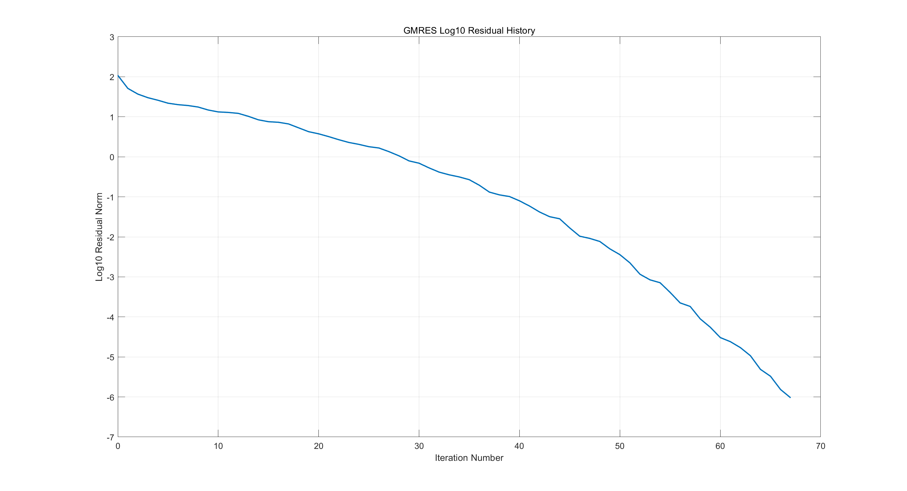

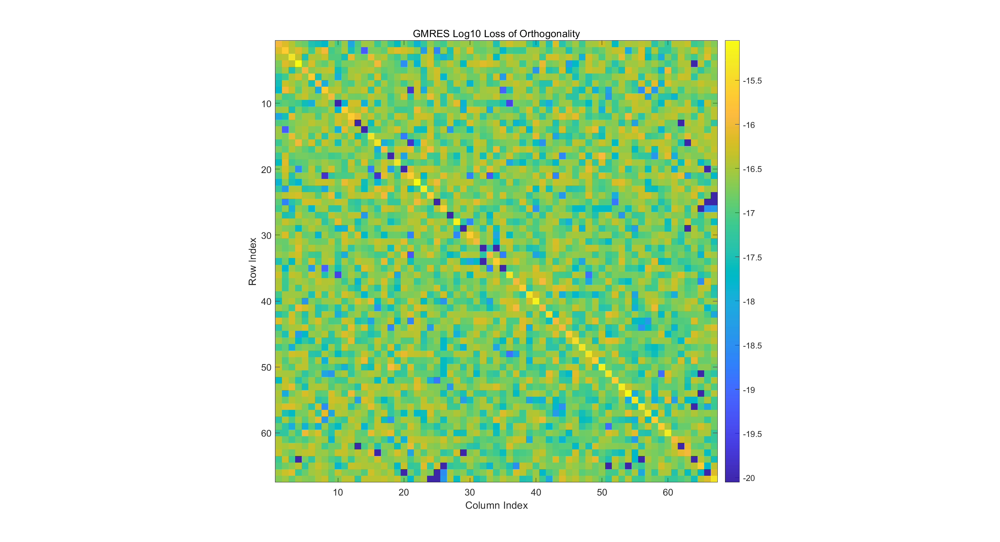

② (非对称稀疏矩阵) [HB/gre_343 | SuiteSparse Matrix Collection](https://sparse.tamu.edu/HB/gre_343)

```
Converged on 317-th iteration!
```

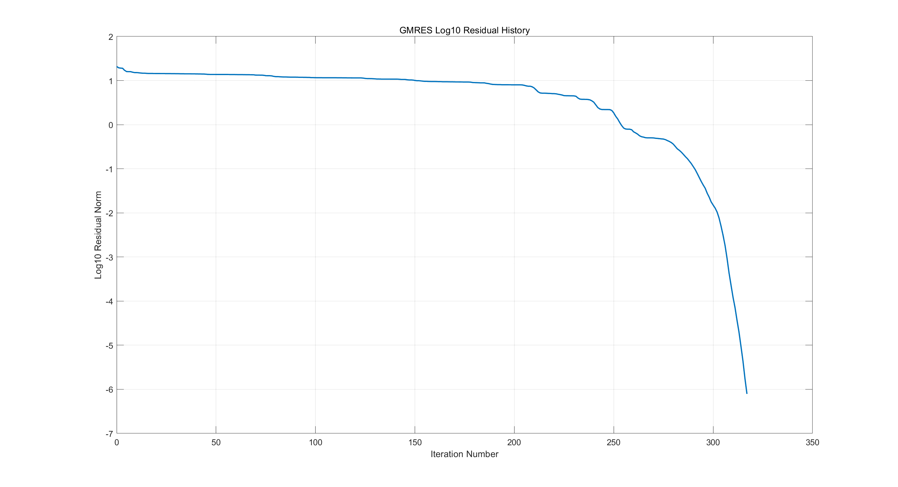

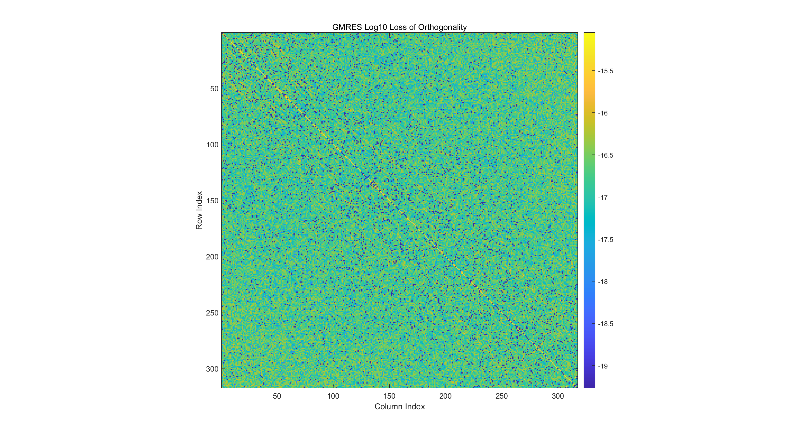

③ (对称稀疏矩阵) [HB/bcsstm09 | SuiteSparse Matrix Collection](https://sparse.tamu.edu/HB/bcsstm09)

```
Lucky breakdown on 2-th iteration!
```

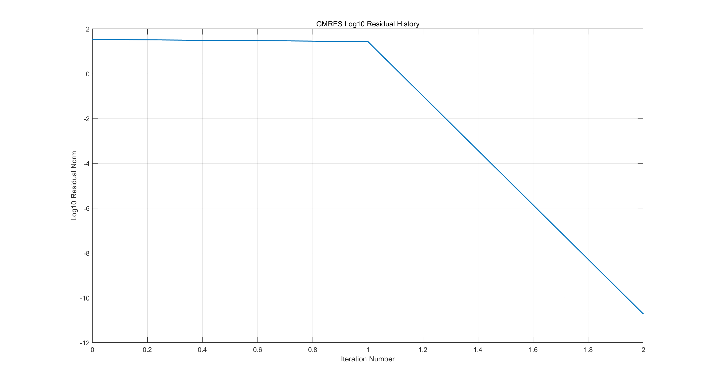

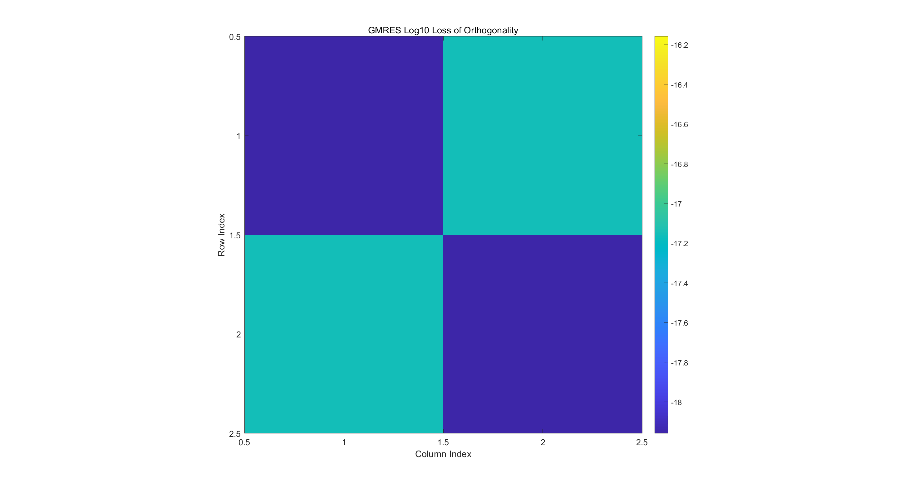

④ (对称稀疏矩阵) [HB/nos1 | SuiteSparse Matrix Collection](https://sparse.tamu.edu/HB/nos1)

```
Lucky breakdown on 237-th iteration!
```

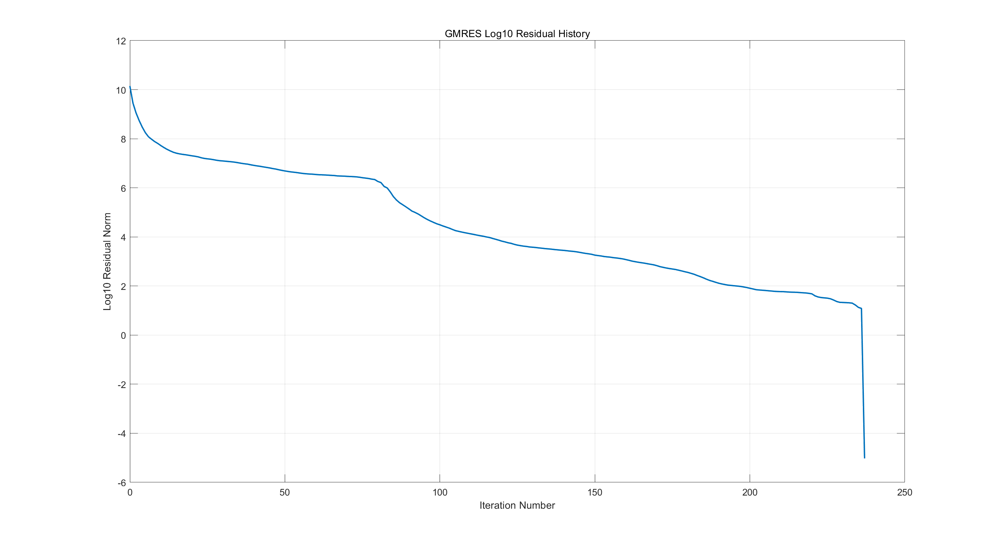

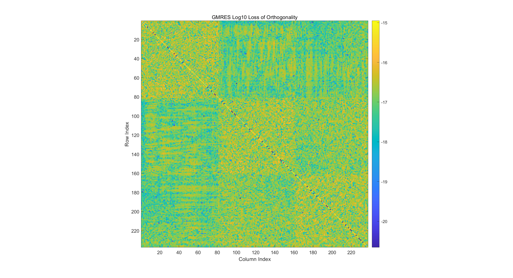


## Problem 2

Suppose that $A\in \mathbb R^{n\times n}$ is symmetric and positive definite.   
Let $r_k$ be the residual vector at $k$-th iteration produced by the steepest descent (SD) method   
when solving the linear system $Ax = b$.   
Show that if $r_{k+1} = 0_n$, then $r_k$ is an eigenvector of $A$.

**Proof:**    
定义二次函数 $\varphi(x) = x^TAx - 2b^Tx$ 

- 固定下降方向 $d^{(k)}$，考虑确定步长 $t_k$:  
  $$
  \begin{align}
  t_k &= \arg \min_{t>0} \varphi(x^{(k)} + t d^{(k)})\\
  &= \arg \{\frac{d}{dt} \varphi(x^{(k)} + td^{(k)})=0\}\quad (\text{note that }\varphi(x^{(k)} + t d^{(k)})\text{ is convex with respect to }t)\\
  &= \arg \{(d^{(k)})^T \nabla\varphi(x^{(k)} + td^{(k)}) = 0\}\\
  &= \arg \{(d^{(k)})^T [2A(x^{(k)}+td^{(k)})-2b] = 0\}\quad (\text{note that }\nabla\varphi(x) = 2Ax-2b)\\
  &= \arg \{2t (d^{(k)})^T A d^{(k)} + 2(d^{(k)})^T (Ax^{(k)}-b)=0\}\\
  &= \arg \{2t (d^{(k)})^T A d^{(k)} - 2(d^{(k)})^T r^{(k)} = 0\}\quad (\text{denote residual vector }r^{(k)} = b-Ax^{(k)})\\
  &= \frac{(d^{(k)})^T r^{(k)}}{(d^{(k)})^T A d^{(k)}}
  \end{align}
  $$
  因此步长 $t_k = \frac{(r^{(k)})^T d^{(k)}}{(d^{(k)})^T A d^{(k)}}$ (其中残差向量 $r^{(k)} = b-Ax^{(k)}$)   

- 再考虑确定下降方向 $d^{(k)}$:  
  根据 $\varphi(x)$ 在 $x^{(k)}$ 的一阶 Taylor 展开式 $\varphi(x) = \varphi(x^{(k)}) + \nabla \varphi(x^{(k)})^T (x-x^{(k)}) + O(\|x-x^{(k)}\|)$ 可知，  
  在 $x^{(k)}$ 的足够小的邻域内，位移 $x-x^{(k)}$ 沿负梯度方向 $-\nabla \varphi(x^{(k)})$ 时下降最快  
  因此我们可取 $d^{(k)}=-\nabla \varphi(x^{(k)}) = -(2Ax^{(k)}-2b) = 2r^{(k)}$   
  (我们丢弃系数 $2$，取 $d^{(k)}=r^{(k)}$)

  根据之前的结论，对应的步长 $t_k = \frac{(r^{(k)})^T d^{(k)}}{(d^{(k)})^T A d^{(k)}} = \frac{(r^{(k)})^T r^{(k)}}{(r^{(k)})^T A r^{(k)}}$   
  只要 $(r^{(k)})^T d^{(k)} = (r^{(k)})^T r^{(k)} = \|r^{(k)}\|_2^2\neq 0$，就有 $\varphi(x^{(k+1)}) < \varphi(x^{(k)})$ 成立.

设 $r^{(k+1)}=0_n$，则我们有:
$$
\begin{align}
0_n 
&=r^{(k+1)}\\
&=
b-Ax^{(k+1)}\\
&=
b - A (x^{(k)} + t_k d^{(k)})\\
&=
b - A(x^{(k)} + \frac{(r^{(k)})^T r^{(k)}}{(r^{(k)})^T A r^{(k)}} r^{(k)})\\
&=
r^{(k)} - \frac{(r^{(k)})^T r^{(k)}}{(r^{(k)})^T A r^{(k)}} A r^{(k)}\\
\end{align}
$$
于是我们有:  
$$
A r^{(k)} = \frac{(r^{(k)})^T Ar^{(k)}}{(r^{(k)})^T r^{(k)}} r^{(k)}
$$
表明 $r^{(k)}$ 是 $A$ 的特征向量，相伴的特征值为 $\frac{(r^{(k)})^T Ar^{(k)}}{(r^{(k)})^T r^{(k)}}$


## Problem 3

**(待纠错)**  
Suppose that $A\in \mathbb R^{n\times n}$ is symmetric and positive definite.   
Let $x_k$ be the approximate solution at $k$-th iteration   
when applying the steepest descent (SD) method to the linear system $Ax = b$.   
Show that:
$$
f(x_{k+1}) \leq (1-\kappa^{-1})f(x_{k})
$$
where $f(x)=x^TAx-2b^Tx$ and $\kappa = \|A\|_2 \|A^{-1}\|_2$

- **Lemma 1: (数值线性代数, 引理 $5.1.1$)**  
  设 Hermite 正定阵 $A\in \mathbb C^{n\times n}$ 的特征值为 $0<\lambda_1\leq \dotsm\leq \lambda_n$  
  对于任意复系数多项式 $p(t)$ 我们都有:  
  $$
  \|p(A) x\|_A \leq \max_{1\leq i\leq n} |p(\lambda_i)|\|x\|_A\quad (\forall\ x\in \mathbb C^n)
  $$

  - **证明:**  
    设 $A$ 的谱分解为 $A=U\Lambda U^H$  
    其中 $U\in \mathbb C^{n\times n}$ 为酉矩阵，$\Lambda := \text{diag}\{\lambda_1,\dots,\lambda_n\}$  
    对于任意 $x\in \mathbb C^n$，我们都有:  
    $$
    \begin{align}
    \|p(A)x\|_A^2
    &=
    \|A^{\frac12}p(A)x\|_2^2\\
    &=
    \|U\Lambda^{\frac12} U^H Up(\Lambda) U^H x\|_2^2\quad (\text{note that }\|\cdot\|_2\text{ is unitary invariant})\\
    &=
    \|\Lambda^{\frac12}p(\Lambda) U^Hx\|_2^2\\
    &=
    x^HU \overline{p(\Lambda)} \Lambda^{\frac12}\Lambda^{\frac12} p(\Lambda) U^Hx\\
    &=
    x^HU|p(\Lambda)|^2 \Lambda U^Hx\\
    &=
    \max_{1\leq i\leq n}|p(\lambda_i)|^2 \cdot x^HU\Lambda U^Hx\\
    &=
    \max_{1\leq i\leq n}|p(\lambda_i)|^2 \cdot x^HAx\\
    &=
    \max_{1\leq i\leq n}|p(\lambda_i)|^2 \|x\|_A^2
    \end{align}
    $$
    于是我们有:  
    $$
    \|p(A) x\|_A \leq \max_{1\leq i\leq n} |p(\lambda_i)|\|x\|_A\quad (\forall\ x\in \mathbb C^n)
    $$

- **Lemma 2: (Chebyshev 极小化引理)**   
  任意给定 $b>a>0$，我们有:  
  $$
  \min_{\alpha \in \mathbb R} \max_{a\leq t\leq b} |1-\alpha t| = \min_{\alpha > 0} \max_{a\leq t\leq b} |1-\alpha t| = \frac{b-a}{b+a}
  $$
  **证明:**  
  为使 $\max_{a\leq t\leq b} |1-\alpha t|$ 最小化，我们令 $\alpha \geq 0$ 且端点值 $|1-\alpha a| = |1-\alpha b|$  

  - ① 若 $1-\alpha a \geq 0$ 且 $1-\alpha b\geq 0$，则我们有 $1-\alpha a = 1-\alpha b$  
    解得 $\alpha=0$，对应的目标函数值为 $1$ 

  - ② 若 $1-\alpha a \geq 0$ 且 $1-\alpha b\leq 0$，则我们有 $1-\alpha a = -(1-\alpha b)$  
    解得 $\alpha = \frac{2}{a+b}$，对应的目标函数值为 $\frac{b-a}{b+a}$ 

  注意到 $\frac{b-a}{b+a}<1$，因此我们有:    
  $$
  \min_{\alpha \in \mathbb R} \max_{a\leq t\leq b} |1-\alpha t| = \min_{\alpha > 0} \max_{a\leq t\leq b} |1-\alpha t| = \frac{b-a}{b+a}
  $$

**Proof:**   
对于任意 $\alpha >0$ 我们都有:  
$$
\begin{align}
\|x^{(k)}-x_\star\|_A^2
&=
\|x^{(k-1)} + \alpha r^{(k-1)} - x_\star\|_A^2\quad (\text{note that }r^{(k-1)}=b-Ax^{(k-1)}=A(x_\star- x^{(k-1)}))\\
&=
\|(I-\alpha A)(x^{(k-1)}-x_\star)\|_A^2\quad (\text{use lemma 1})\\
&\leq
\max_{1\leq i\leq n} |1-\alpha \lambda_i|^2 \|x^{(k-1)}-x_\star\|_A^2\\
&\leq
\max_{\lambda_1\leq t\leq \lambda_n} |1-\alpha t|^2 \|x^{(k-1)}-x_\star\|_A^2
\end{align}
$$
因此我们有:  
$$
\begin{align}
\|x^{(k)}-x_\star\|_A
&\leq
\min_{\alpha>0}\max_{\lambda_1\leq t\leq \lambda_n} |1-\alpha t| \cdot \|x^{(k-1)}-x_\star\|_A\quad (\text{use lemma 2})\\
&=
\frac{\lambda_n-\lambda_1}{\lambda_n+\lambda_1} \|x^{(k-1)}-x_\star\|_A\\
&<
\frac{\lambda_n-\lambda_1}{\lambda_n} \|x^{(k-1)}-x_\star\|_A\\
&=
\left(1-\frac{\lambda_1}{\lambda_n}\right)\|x^{(k-1)}-x_\star\|_A\\
&=
\left(1-\kappa^{-1}\right) \|x^{(k-1)}-x_\star\|_A\\
&\text{where }\kappa :=\kappa_2(A) = \|A\|_2\|A^{-1}\|_2 = \frac{\sigma_\max(A)}{\sigma_\min(A)} = \frac{\lambda_n}{\lambda_1}
\end{align}
$$
不断递推可得:  
$$
\begin{align}
\|x^{(k)}-x^\star\|_A 
&\leq \left(\frac{\lambda_n - \lambda_1}{\lambda_n + \lambda_1} \right)^k \|x^{(0)}-x^\star\|_A\\
&= 
\left(1-\kappa^{-1}\right)^k \|x^{(0)}-x^\star\|_A
\end{align}
$$
其中初始点 $x^{(0)}$ 是任意的.


## Problem 4

Use the steepest descent (SD) to solve the linear system:  
$$
\begin{bmatrix}
20 & \\
& 1
\end{bmatrix}x = 
\begin{bmatrix}
0\\
0
\end{bmatrix}
$$
with the initial guess $x^{(0)} = [1,5]^T$  
Plot the intermediate approximations $x_k$ for $0\leq k\leq 10$

**Solution:**    
**(最速下降法, 数值线性代数, 算法 $5.1.1$)**  
$$
\begin{align}
&\text{Given positive definite matrix }A,\text{ vector } b \text{ and initial point }x^{(0)}\\
& r^{(0)} = b-Ax^{(0)}\\
&\text{for }k=0:\text{max\_iter}-1\\
&\qquad t_{k} = \frac{(r^{(k)})^T r^{(k)}}{(r^{(k)})^T A r^{(k)}}\\
&\qquad x^{(k+1)} = x^{(k)} + t_{k} r^{(k)}\\
&\qquad r^{(k+1)} = b - Ax^{(k+1)} = b - A(x^{(k)}+t_k r^{(k)}) = r^{(k)}-t_k (Ar^{(k)})\quad (复用\ Ar^{(k)}\ 以规避一次矩阵乘法)\\
&\qquad k=k+1\\
&\qquad \text{if }\|r^{(k)}\|_2 < \text{tolerance}\quad \text{(终止条件)}\\
&\qquad\qquad \text{break}\\
&\qquad \text{end}\\
&\text{end}\\
& x= x^{(k)}
\end{align}
$$
Matlab 代码:

```matlab
function [x, history] = steepest_descent(A, b, x0, max_iter, tolerance)
    % Input:
    % A - positive definite matrix
    % b - vector
    % x0 - initial guess for the solution
    % max_iter - maximum number of iterations
    % tolerance - convergence criterion
    %
    % Output:
    % x - solution vector

    % Initialize variables
    n = size(A, 1);
    x = x0; % initial point
    r = b - A * x; % initial residual
    history = zeros(max_iter+1, n+1);
    history(1, 1) = norm(r);
    history(1, 2:n+1) = x';

    for k = 1:max_iter
        % Compute step size t_{k-1}
        Ar = A * r; % reuse A*r to save computation later
        t = (r' * r) / (r' * Ar);

        % Update x^(k) and r^(k)
        x = x + t * r;
        r = r - t * Ar; % avoid redundant computation of A*r^(k)

        % Store the current approximation
        history(k+1, 1) = norm(r);
        history(k+1, 2:n+1) = x';

        % Check for convergence
        if history(k+1, 1) < tolerance
            history = history(1:k+1, 1:n+1);
            fprintf('Converged in %d iterations!\n', k);
            return;
        end
    end

    fprintf('Reached maximum iterations (%d)!\n', max_iter);
end
```

函数调用:

```matlab
n = 2;
A = [20, 0;
     0, 1];
b = [0, 0]';
x_exact = A \ b;
x0 = [1, 5]';
max_iter = 100;
tolerance = 1e-6;
[x, history] = steepest_descent(A, b, x0, max_iter, tolerance);

% Extract residual norms and x history from the history
residual_norms = history(:, 1);
x_history = history(:, 2:n+1);

% Compute the Euclidean norm of the difference between x_history and x_exact
approximation_error = vecnorm(x_history - x_exact', 2, 2);

% Plot the Log10 residual norm over iterations
figure;
subplot(1, 2, 1);
plot(0:length(residual_norms)-1, log10(residual_norms), 'o-', 'LineWidth', 2);
xlabel('Iteration (k)');
ylabel('Log10 Residual Norm ||r^{(k)}||_2');
title('Log10 Residual Norm');
grid on;

% Plot the Log10 approximation error over iterations
subplot(1, 2, 2);
plot(0:size(x_history, 1)-1, log10(approximation_error), 'o-', 'LineWidth', 2);
xlabel('Iteration (k)');
ylabel('Log10 Approximation Error ||x^{(k)} - x_{exact}||_2');
title('Log10 Approximation Error');
grid on;

% Plot the first 10 approximations in 2D to show zig-zag motion
figure;
plot(x_history(1:11, 1), x_history(1:11, 2), 'o-', 'LineWidth', 2);
hold on;
plot(x_exact(1), x_exact(2), 'rx', 'MarkerSize', 10, 'LineWidth', 2); % Mark the exact solution
xlabel('x_1');
ylabel('x_2');
title('First 10 Iterations (2D Zig-Zag)');
legend({'$x_k$', '$x_{exact}$'}, 'Interpreter', 'latex', 'Location', 'best');
axis equal;
grid on;

% Check orthogonality between neighboring residuals
orthogonality_check = zeros(size(x_history, 1)-1, 1);
for k = 1:size(orthogonality_check, 1)
    orthogonality_check(k) = dot(b - A * x_history(k, :)', b - A * x_history(k+1, :)');
    orthogonality_check(k) = orthogonality_check(k) / norm(b - A * x_history(k, :)');
end

% Plot the orthogonality of neighboring residuals
figure;
plot(1:size(orthogonality_check, 1), log10(orthogonality_check), 'o-', 'LineWidth', 2);
xlabel('Iteration (k)');
ylabel('Log10 Relative Dot product between r^{(k)} and r^{(k+1)}');
title('Orthogonality Check of Neighboring Residuals');
grid on;
```

**运行结果:**  
这验证了最速下降法的迭代路径呈锯齿状 (zig-zag) (参见图二)，  
而且相邻的下降方向 (即残差向量) 相互正交 (参见图三)

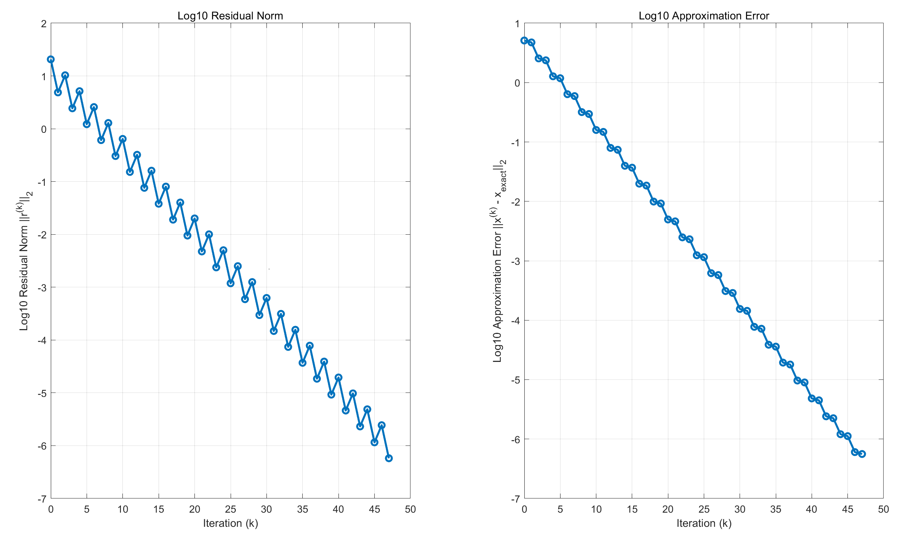

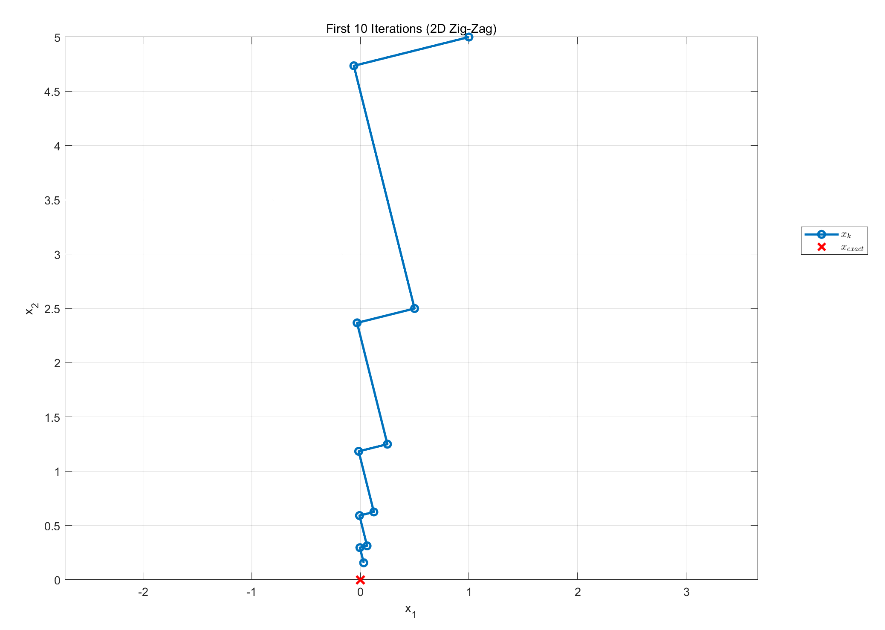

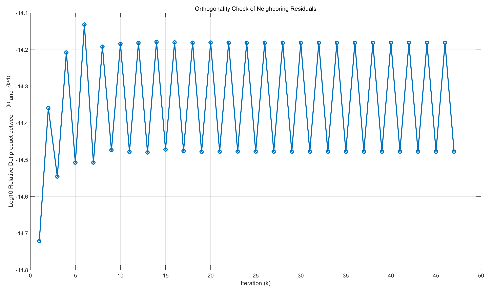


## Problem 6 (optional)

Implement GMRES and FOM, with right preconditioning.   
Use an artificial example to test the convergence of GMRES and FOM, with and without preconditioning.   
One possible way to construct an artificial example for preconditioning is as follows:   
Create random lower and upper bidiagonal matrices $L_0$ and $U_0$, respectively.   
Perturb $L_0$ and $U_0$ a little bit (with fillins) to obtain denser triangular matrices $L$ and $U$.   
Then you can test GMRES and FOM with $A = LU$ and $M = L_0U_0$.   
You are certainly free to try other examples.

**Solution:**  
$$
Ax=b\\
\Leftrightarrow\\
(M^{-1}A)x = M^{-1}b\\
\Leftrightarrow\\
U_0^{-1}L_0^{-1}Ax = M^{-1}b
$$
唯一的区别是 Arnoldi 过程中 $q_k$ 先作用 $A$，再作用 $L_0^{-1}$ 和 $U_0^{-1}$  

