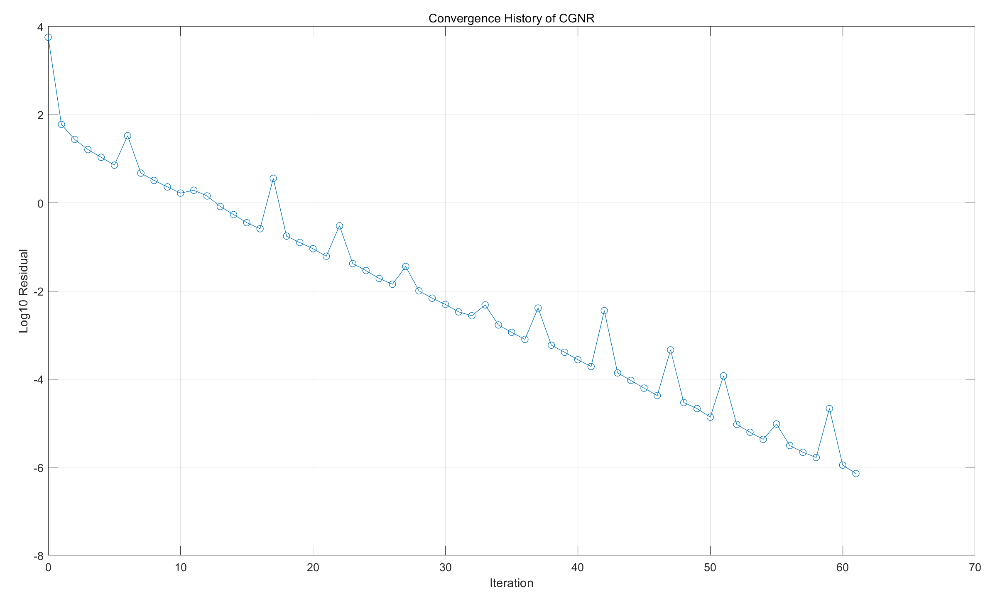
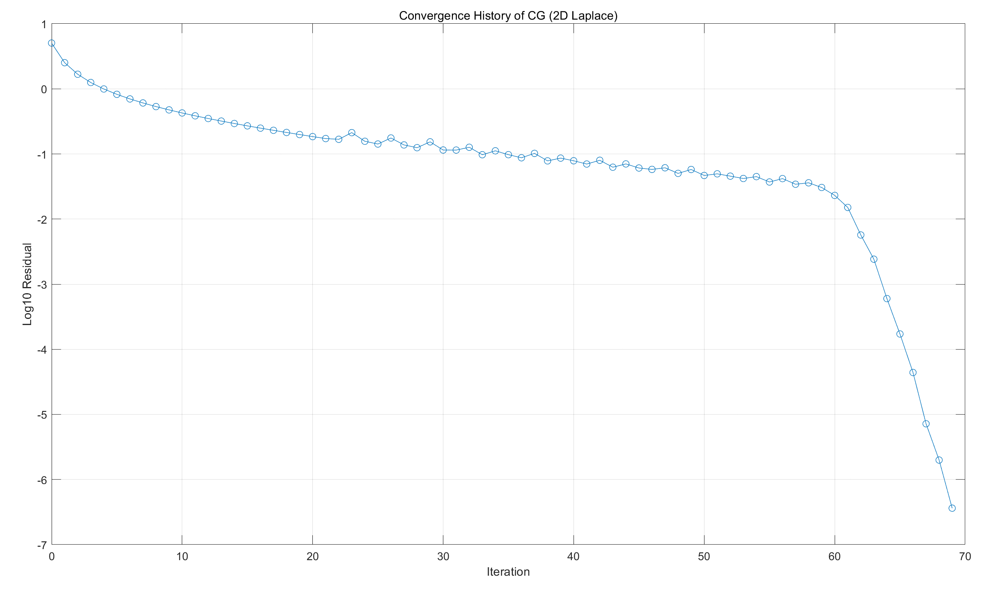
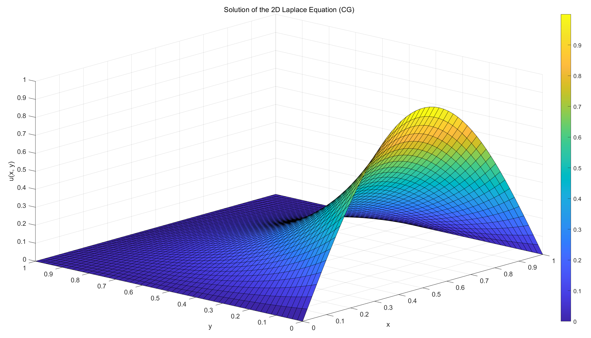
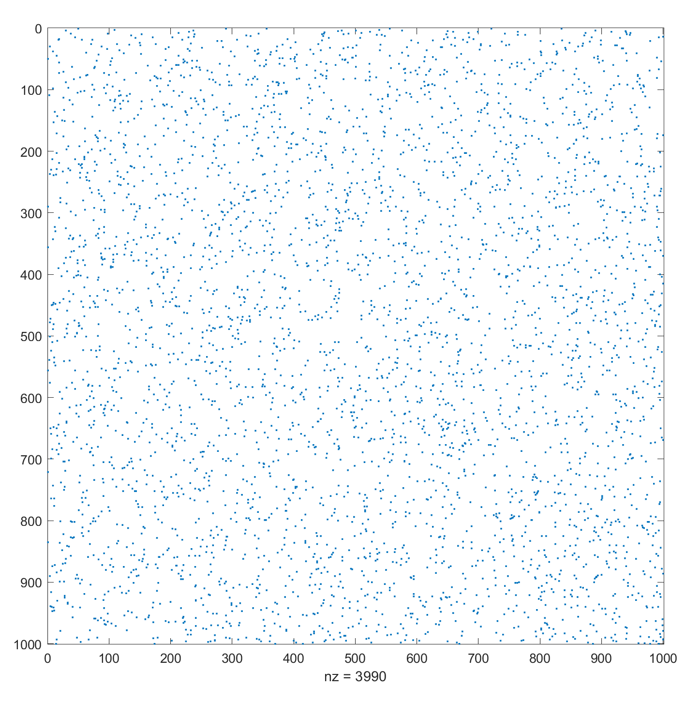
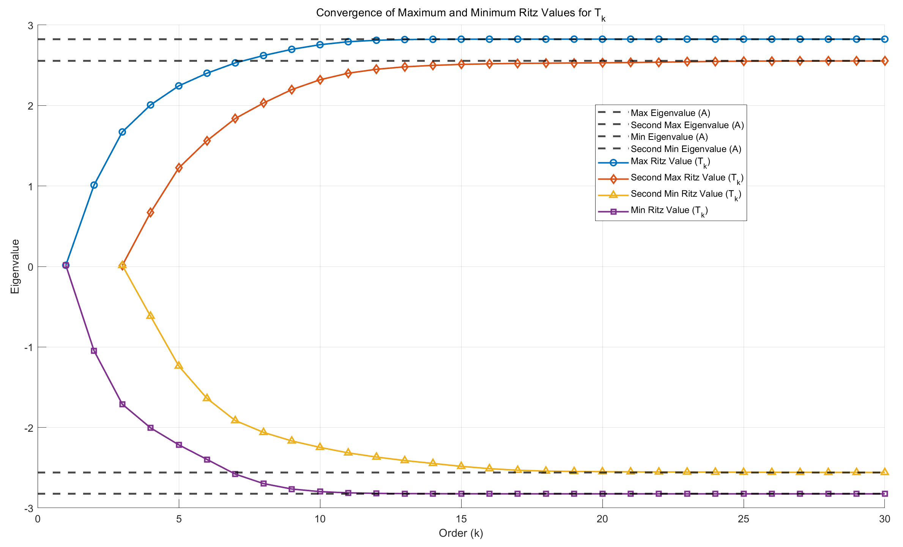
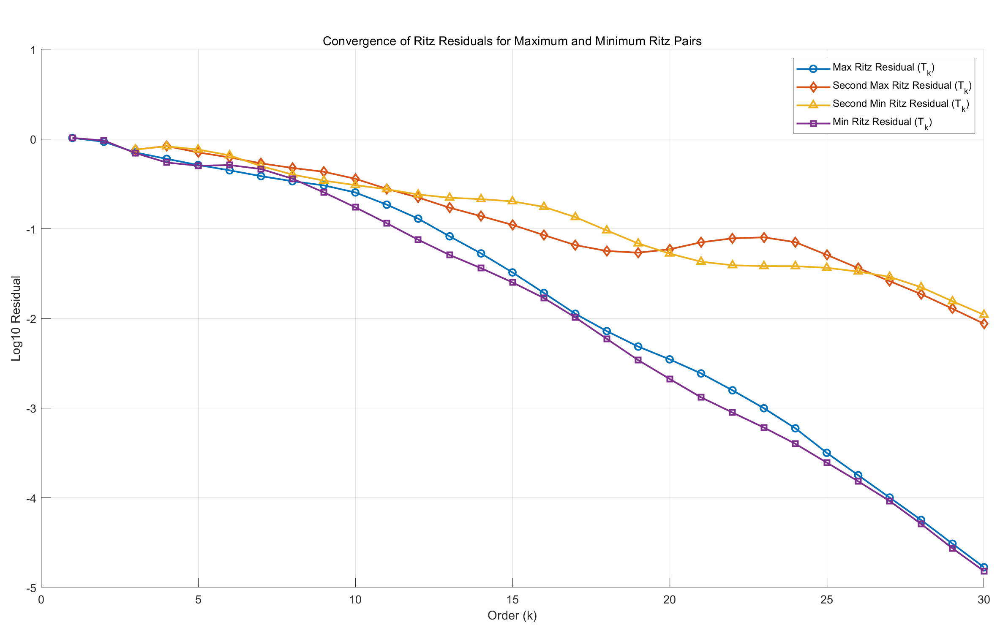
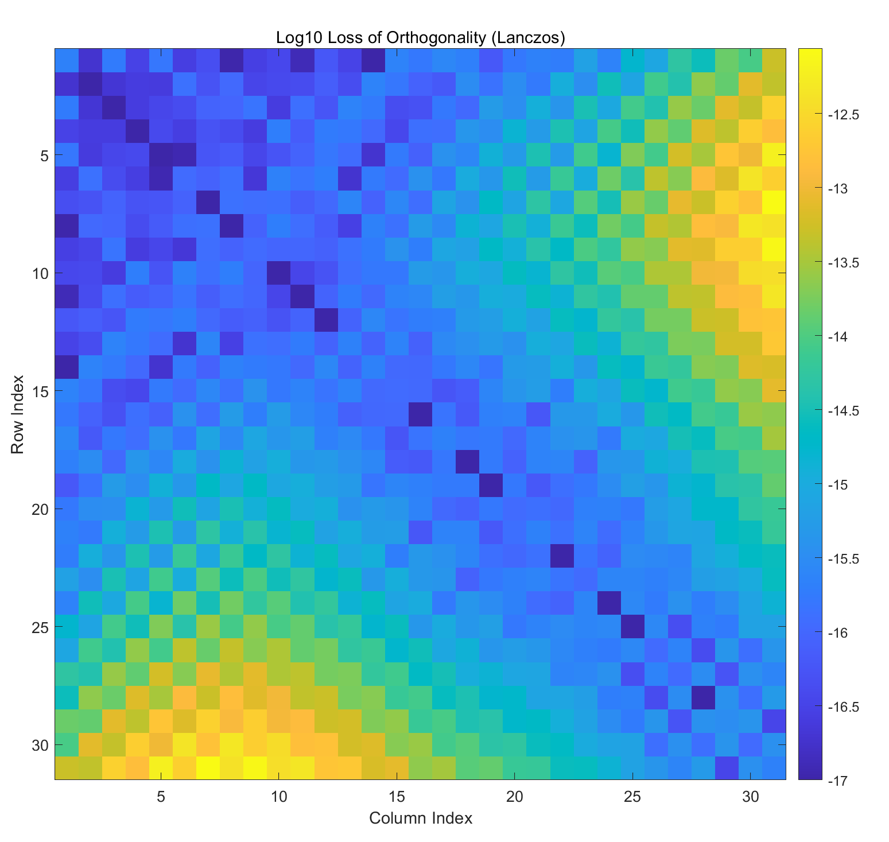

# 数值算法 Homework 13

Due: Dec. 17, 2024  
姓名: 雍崔扬   
学号: 21307140051

## Problem 1

Let $A\in \mathbb R^{n\times n}$ be symmetric and positive definite, and $b\in \mathbb R^n$.   
Suppose that $\mathcal V$ is a subspace of $\mathbb R^n$.   
Show that:
$$
x_0 = \arg\min_{x\in \mathcal V} \|x-A^{-1}b\|_A\quad \Leftrightarrow\quad
b-Ax_0 \in \mathcal V^\bot
$$
where the orthogonal complement $\mathcal V$ is defined using the standard inner product.

**Solution:**    
设 $k$ 维子空间 $\mathcal V$ 的一组标准正交基构成的基矩阵为 $Q\in \mathbb R^{n\times k}$   
于是我们有:  
$$
\begin{align}
x_0
&=
\arg\min_{x\in \mathcal V} \|x-A^{-1}b\|_A\\
&=
\arg\min_{x\in \mathcal V} \|x-A^{-1}b\|_A^2\\
&=
\arg \min_{x\in \mathcal V} \{x^TAx - 2b^Tx -b^TA^{-1}b\}\\
&=
\arg \min_{\{x = Qy:y\in \mathbb R^k\}} \{x^TAx-2b^Tx\}
\end{align}
$$
设 $x_0 = Qy_0$ (其中 $y_0\in \mathbb R^{k}$)，则我们有:  
$$
\begin{align}
y_0
&=
\arg \min_{y\in \mathbb R^k} \{y^TQ^TAQy - 2b^TQy\}\\
&=
\text{solution of }\{2Q^TAQ y - 2Q^Tb = 0_{k}\}\\
&=
\text{solution of }\{Q^T(b-AQy) = 0_k\}
\end{align}
$$
这等价表明:  
$$
Q^T(b-Ax_0) = Q^T(b-AQy_0) = 0_k\\
\Leftrightarrow\\
(b-Ax_0)\perp \text{Range}(Q) = \mathcal V\\
\Leftrightarrow\\
(b-Ax_0)\in \mathcal V^\bot
$$
命题得证.


## Problem 2

Suppose you are given a matrix $A\in \mathbb R^{m\times n}$ with full column rank (i.e., $\rank(A) = n$), and a vector $b\in \mathbb R^m$.    
To solve the least squares problem $\min_x\|Ax-b\|_2$,   
the CG method can be applied to solve the normal equation $A^TAx = A^Tb$.   
Provide a detailed iterative scheme for this method.   
Make sure that the operation $v\mapsto A^TAv$ is avoided.

**Solution:**  
**Conjugate Gradient Normal equation Residual (CGNR) method:**
$$
\begin{align}
&\text{Given }A\in \mathbb R^{m\times n}\text{ with full column rank},\text{ vector } b\in \mathbb R^m \text{ and initial point }x^{(0)}\in \mathbb R^n\\
\hline
& r^{(0)} = b-Ax^{(0)}\\
& z^{(0)} = A^Tr^{(0)}\\
& d^{(0)} = z^{(0)}\\
& k=0\\
&\text{while }z^{(k)}\neq 0_n\qquad (\rho^{(k)}\neq 0)\\

&\qquad t_k = \frac{(z^{(k)})^T z^{(k)}}{(Ad^{(k)})^T(A d^{(k)})}
\qquad\quad\  
\left(\begin{cases}
\rho^{(k)} = (z^{(k)})^T z^{(k)}\\
u^{(k)}=Ad^{(k)}\\
\end{cases};\ t_k = \frac{\rho^{(k)}}{(u^{(k)})^Tu^{(k)}} \right)\\

&\qquad x^{(k+1)} = x^{(k)} + t_k d^{(k)}\\

&\qquad r^{(k+1)}=r^{(k)} - t_k A d^{(k)}\qquad (r^{(k+1)}=r^{(k)} - t_k u^{(k)})\\
&\qquad z^{(k+1)}=A^Tr^{(k+1)}\\

&\qquad \beta_k = \frac{(z^{(k+1)})^T z^{(k+1)}}{(z^{(k)})^T z^{(k)}} 
\qquad\ \ \  (\beta_k = \frac{\rho^{(k+1)}}{\rho^{(k)}})\\

&\qquad d^{(k+1)} = z^{(k+1)} + \beta_k d^{(k)}\\
&\qquad k=k+1\\
&\text{end}\\
&x=x^{(k)}
\end{align}
$$
Matlab 代码:

```matlab
function [x, history] = CGNR(A, b, x0, tol, maxIter)
    % A: Matrix of size m x n (m >= n)
    % b: Vector of size m x 1
    % x0: Initial guess for x (n x 1)
    % tol: Tolerance for stopping criterion
    % maxIter: Maximum number of iterations

    % Initialization
    x = x0;  % Initial guess
    r = b - A*x;
    z = A' * r;
    d = z;  % Initial direction
    history = zeros(maxIter, 1);

    % Main iteration loop
    for k = 1:maxIter
        % rho^{(k)} = z^{(k)}' * z^{(k)}
        rho = z' * z;
        history(k) = sqrt(rho);
        
        % Check for convergence
        if history(k) < tol
            history = history(1:k);
            fprintf('Converged in %d iterations\n', k-1);
            return;
        end

        % Compute the step size t_k
        u = A * d;    % u^{(k)} = A * d^{(k)}
        t = rho / (u' * u);  % t_k = rho^{(k)} / (u^{(k)}' * u^{(k)})

        % Update solution x^{(k+1)}
        x = x + t * d;

        % Update residual r^{(k+1)}
        r = r - t * u;  % r^{(k+1)} = r^{(k)} - t_k * u^{(k)}

        % Compute the scaling factor beta_k
        z_new = A' * r;
        beta = (z_new' * z_new) / (z' * z);  % beta_k = (z^{(k+1)}' * z^{(k+1)}) / (z^{(k)}' * z^{(k)})

        % Update direction d^{(k+1)} = z^{(k+1)} + beta_k * d^{(k)}
        d = z_new + beta * d;

        % Update z for next iteration
        z = z_new;
    end

    % If maxIter is reached, print a message
    fprintf('Warning: Maximum number of iterations reached!\n');
end
```

函数调用:

```matlab
rng(51);
m = 1000; % Number of rows
n = 500;  % Number of columns
A = rand(m, n); % Random matrix A of size m x n
b = rand(m, 1); % Random vector b of size m x 1
x0 = zeros(n, 1); % Initial guess for x

% Call the CGNR function to solve Ax = b
[x, history] = CGNR(A, b, x0, 1e-6, 1000);
residual = norm(A'* (b - A * x));
fprintf("residual: %.4e\n", residual);

% Plot the convergence history
figure;
plot(0:length(history)-1, log10(history), '-o');
xlabel('Iteration');
ylabel('Log10 Residual');
title('Convergence History of CGNR');
grid on;
```

运行结果:

```
Converged in 61 iterations
residual: 7.2075e-07
```

**(共轭梯度法在残量的 $l_2$ 范数意义下不是严格单调下降的)**




## Problem 3

Use the conjugate gradient method to solve the 2D Laplace equation:  
$$
\frac{\partial^2}{\partial x^2}u(x,y) + \frac{\partial^2}{\partial x^2}u(x,y) =0
$$
over the unit square $[0,1]^2$ with boundary conditions:  
$$
\begin{align}
u(0,y)&\equiv 0\\
u(1,y)&\equiv 0\\
u(x,0)&= \sin(\pi x)\quad (\forall\ x\in [0,1])\\
u(x,1)&\equiv 0
\end{align}
$$
Visualize the solution and the convergence history.  

- **(optional)** Use IChol-based preconditioning to accelerate the convergence of CG.   
  (IChol means incomplete Cholesky factorization.)  
  **(存疑)** 2D Laplace 方程的系数矩阵的 Cholesky 分解的元素的通项公式 (参见 Demmel 的应用数值线性代数)，  
  那么这里的 IChol 就之是填入部分元素吗?  
  不是，是设置一定的规则部分填入 Cholesky 分解的结果.

**Solution:**   

### (1) 转化为对称正定方程组

二维 Poisson 方程离散化得到的方程为:
$$
h= \frac{1}{n+1}\\
4u_{ij} - u_{i-1,j} - u_{i+1,j} - u_{i,j-1}- u_{i,j+1} = h^2 f_{ij}\quad (1\leq i,j\leq n)\\
\Leftrightarrow\\
T_n U + UT_n  = h^2 F + B\\
T_{n} 
=
\begin{bmatrix}
2 & -1 & & \\
-1 & \ddots & \ddots & \\
& \ddots & \ddots & -1\\
& & -1 & 2
\end{bmatrix} 
\qquad

U = \begin{bmatrix}
u_{1,1} & u_{1,2} &\dotsm  & u_{1,n}\\
u_{2,1} & u_{2,2} & \dotsm & u_{2,n}\\
\vdots & \vdots & & \vdots\\
u_{n,1} & u_{n,2} & \dotsm & u_{n,n}
\end{bmatrix}
\qquad
F = \begin{bmatrix}
f_{1,1} & f_{1,2} &\dotsm  & f_{1,n}\\
f_{2,1} & f_{2,2} & \dotsm & f_{2,n}\\
\vdots & \vdots & & \vdots\\
f_{n,1} & f_{n,2} & \dotsm & f_{n,n}
\end{bmatrix}\\ 
B = 
\begin{bmatrix}
u_{1,0} + u_{0,1} & u_{0,2} & \dotsm & u_{0,n-1} & u_{0,n} + u_{1,n+1}\\
u_{2,0} & 0 & \dotsm & 0 & u_{2,n+1}\\
\vdots & \vdots & & \vdots & \vdots\\
u_{n-1,0} & 0 & \dotsm & 0 & u_{n-1,n+1}\\
u_{n,0} + u_{n+1,1} & u_{n+1,2} & \dotsm & u_{n+1,n-1} & u_{n+1,n} + u_{n,n+1} 
\end{bmatrix}\\
\Leftrightarrow\\
T_{n\times n} \text{vec}(U) = h^2 \text{vec}(F) + \text{vec} (B)\\

\text{where }T_{n\times n}:=(I_n \otimes T_n + T_n\otimes I_n) = 
\begin{bmatrix}
T_n\\
& \ddots\\
& & \ddots\\
& & & T_n
\end{bmatrix}
+
\begin{bmatrix}
2I_n & -I_n & & \\
-I_n & \ddots & \ddots & \\
& \ddots & \ddots & -I_n\\
& & -I_n & 2I_n
\end{bmatrix}
$$
在本题的假设下，函数 $f(\cdot)$ 为零函数，因此 $f_{ij}=0\ (1\leq i,j\leq n)$，即 $F=0_{n\times n}$   
而有一个边界条件 $u(x,0)= \sin(\pi x)\ (\forall\ x\in [0,1])$ 不为零，即 $u_{0,j}=0\ (1\leq j\leq n)$    
因此上述线性方程组简化为:
$$
T_n U + UT_n  = B\\
T_{n} 
=
\begin{bmatrix}
2 & -1 & & \\
-1 & \ddots & \ddots & \\
& \ddots & \ddots & -1\\
& & -1 & 2
\end{bmatrix} 
\qquad

U = \begin{bmatrix}
u_{1,1} & u_{1,2} &\dotsm  & u_{1,n}\\
u_{2,1} & u_{2,2} & \dotsm & u_{2,n}\\
\vdots & \vdots & & \vdots\\
u_{n,1} & u_{n,2} & \dotsm & u_{n,n}
\end{bmatrix}
\qquad

B = \begin{bmatrix}
u_{0,1} & u_{0,2} &\dotsm  & u_{0,n}\\
0 & 0 & \dotsm & 0\\
\vdots & \vdots & & \vdots\\
0 & 0 & \dotsm & 0
\end{bmatrix}\\

\Leftrightarrow\\
T_{n\times n} \text{vec}(U) = \text{vec}(B)\\

\text{where }T_{n\times n}:=(I_n \otimes T_n + T_n\otimes I_n) = 
\begin{bmatrix}
T_n\\
& \ddots\\
& & \ddots\\
& & & T_n
\end{bmatrix}
+
\begin{bmatrix}
2I_n & -I_n & & \\
-I_n & \ddots & \ddots & \\
& \ddots & \ddots & -I_n\\
& & -I_n & 2I_n
\end{bmatrix}
$$
Matlab 代码:

```matlab
% Create the sparse matrix T and identity matrix I
n = 50; % grid size
h = 1 / (n+1); % grid spacing
T = sparse(2 * eye(n) - diag(ones(n-1, 1), 1) - diag(ones(n-1, 1), -1));
I = speye(n);

% Using Kronecker product to create the 2D Laplace operator A
A = kron(I, T) + kron(T, I);

% Initialize the matrix B, which will store the boundary conditions
B = zeros(n, n);
x = linspace(0, 1, n+2); % Non-zero boundary conditions
B(1, :) = sin(pi * x(2:end-1));
b = B(:); % vectorize B
```

接下来我们使用共轭梯度法 (CG) 求解这个对称正定方程组即可.


### (2) 共轭梯度法

**(共轭梯度法, 数值线性代数, 算法 $5.2.1$)**  
$$
\begin{align}
&\text{Given positive definite matrix }A,\text{ vector } b \text{ and initial point }x^{(0)}\\
& r^{(0)} = b-Ax^{(0)}\\
& d^{(0)} = r^{(0)}\\
& k=0\\
&\text{while }r^{(k)}\neq 0_n\qquad (\rho^{(k)}\neq 0)\\

&\qquad t_k = \frac{(r^{(k)})^T r^{(k)}}{(d^{(k)})^TA d^{(k)}}
\qquad\quad\ \ \left(\begin{cases}
\rho^{(k)} = (r^{(k)})^T r^{(k)}\\
u^{(k)}=Ad^{(k)}\\
\end{cases};\ t_k = \frac{\rho^{(k)}}{(d^{(k)})^Tu^{(k)}}\right)\\

&\qquad x^{(k+1)} = x^{(k)} + t_k d^{(k)}\\

&\qquad r^{(k+1)}=r^{(k)} - t_k A d^{(k)}\qquad (r^{(k+1)}=r^{(k)} - t_k u^{(k)})\\

&\qquad \beta_k = \frac{(r^{(k+1)})^T r^{(k+1)}}{(r^{(k)})^T r^{(k)}} 
\qquad\ \ \  (\beta_k = \frac{\rho^{(k+1)}}{\rho^{(k)}})\\

&\qquad d^{(k+1)} = r^{(k+1)} + \beta_k d^{(k)}\\
&\qquad k=k+1\\
&\text{end}\\
&x=x^{(k)}
\end{align}
$$
Matlab 代码:

```matlab
function [x, history] = CG(A, b, x0, tol, maxIter)
    % A: Positive definite matrix (n x n)
    % b: Right-hand side vector (n x 1)
    % x0: Initial guess for x (n x 1)
    % tol: Tolerance for stopping criterion
    % maxIter: Maximum number of iterations
    
    % Initialization
    x = x0;  % Initial guess
    r = b - A * x;  % Initial residual
    d = r;  % Initial direction
    history = zeros(maxIter, 1);  % To store the history of sqrt(rho)
    
    % Main iteration loop
    for k = 1:maxIter
        % Compute rho^{(k)} = r^{(k)}' * r^{(k)}
        rho = r' * r;  
        history(k) = sqrt(rho);  % Store sqrt(rho) in history
        
        % Check for convergence
        if history(k) < tol
            history = history(1:k);  % Trim the history to the current iteration
            fprintf('Converged in %d iterations\n', k);
            return;
        end

        % Compute the step size t_k = rho^{(k)} / (d^{(k)}' * u^{(k)})
        u = A * d; % u^{(k)} = A * d^{(k)}
        t = rho / (d' * u);  
        
        % Update solution: x^{(k+1)} = x^{(k)} + t_k * d^{(k)}
        x = x + t * d;
        
        % Update residual: r^{(k+1)} = r^{(k)} - t_k * u^{(k)}
        r = r - t * u;
        
        % Compute the scaling factor beta_k = (r^{(k+1)}' * r^{(k+1)}) / (r^{(k)}' * r^{(k)})
        rho_new = r' * r;  
        beta = rho_new / rho;  % Beta_k = rho^{(k+1)} / rho^{(k)}
        
        % Update direction: d^{(k+1)} = r^{(k+1)} + beta_k * d^{(k)}
        d = r + beta * d;
    end
    
    % If maximum number of iterations is reached, print a message
    fprintf('Warning: Maximum number of iterations reached!\n');
end
```


### (3) 函数调用

```matlab
% Create the sparse matrix T and identity matrix I
n = 50; % grid size
h = 1 / (n+1); % grid spacing
T = sparse(2 * eye(n) - diag(ones(n-1, 1), 1) - diag(ones(n-1, 1), -1));
I = speye(n);

% Using Kronecker product to create the 2D Laplace operator A
A = kron(I, T) + kron(T, I);

% Initialize the matrix B, which will store the boundary conditions
B = zeros(n, n);
x = linspace(0, 1, n+2); % Non-zero boundary conditions
B(1, :) = sin(pi * x(2:end-1));
b = B(:); % vectorize B

% Call the CG function to solve Ax = b
u0 = zeros(size(A, 1), 1);
[u, history] = CG(A, b, u0, 1e-6, 1000);
residual = norm(A'* (b - A * u));
fprintf("residual: %.4e\n", residual);

% Plot the convergence history
figure;
plot(0:length(history)-1, log10(history), '-o');
xlabel('Iteration');
ylabel('Log10 Residual');
title('Convergence History of CG (2D Laplace)');
grid on;

% Plot the solution matrix U using surf
U = zeros(n+2, n+2);
x = linspace(0, 1, n+2); % Non-zero boundary conditions
U(1, 2:end-1) = sin(pi * x(2:end-1));
U(2:end-1, 2:end-1)= reshape(u, n, n);
figure;
[X, Y] = meshgrid(0:h:1, 0:h:1); % Create meshgrid for plotting
surf(X, Y, U); % Plot the solution
title('Solution of the 2D Laplace Equation (CG)');
xlabel('x');
ylabel('y');
zlabel('u(x, y)');
colorbar;
```

**运行结果:**

```
Converged in 70 iterations
residual: 2.3646e-06
```






## Problem 4 

Implement the Lanczos algorithm for symmetric eigenvalue problems.   
Test it with some sparse Hermitian matrices.   
What do you observe for the convergence of Ritz pairs and the orthogonality of the Lanczos vectors?

**Solution:**    

### (1) Lanczos 过程

给定 Hermite 阵 $A\in \mathbb C^{n\times n}$ 和单位向量 $q_1\in \mathbb C^n$  
我们记:  
$$
\widetilde T_k = \begin{bmatrix}
\alpha_1 & \beta_1 &  & & \\
\beta_1 & \alpha_{2} & \beta_{2} &  & \\
  & \beta_2 & \alpha_{3} & \ddots & \\
  & & \ddots & \ddots & \beta_{k-1} \\
  & & & \beta_{k-1} & \alpha_{k} \\
  & & & & \beta_k
\end{bmatrix}
$$
记 $Q_k:=[q_1,\dots,q_k]$ (其中 $1\leq k \leq \rank(\mathcal K(A,q_1,n))$)  
根据 $AQ_k=Q_{k+1}\widetilde T_k$ 可知 $Aq_k = \beta_{k-1} q_{k-1} + \alpha_k q_k + \beta_k q_{k+1}$   
由于 $q_1,\dots,q_{k+1}$ 标准正交，故我们有 $q_k^HAq_k = \alpha_k$   
最后有 $\beta_k q_{k+1} = Aq_{k}- \alpha_k q_k - \beta_{k-1} q_{k-1}$  

**(Hermite 阵的 Lanczos 过程)** 
$$
\begin{align}
&\text{Given Hermitian matrix } A\in \mathbb C^{n\times n}\text{ and }q_1\in \mathbb C^n\text{ such that }\|q_1\|_2 = 1\\
\hline
&k=0;\ \beta_0 = 1;\ q_0=0_n;\ r_0 = q_1\\
&\text{while }\beta_k \neq 0\\
&\qquad q_{k+1} = \frac{r_k}{\beta_k}\\
&\qquad k=k+1\\
&\qquad \alpha_k = q_k^HAq_k\\
&\qquad r_k = A q_k - \alpha_k q_k - \beta_{k-1} q_{k-1}\\
&\qquad \beta_k = \|r_k\|_2\\
&\text{end}
\end{align}
$$
**Matlab 代码:**

```matlab
function [Q, T] = Lanczos(A, b, r, tolerance)
    % Lanczos Algorithm to compute the tridiagonal matrix T and orthonormal basis Q
    %
    % Input:
    %   A   - A Hermitian matrix (n x n)
    %   b   - A vector (n x 1)
    %   r   - Number of Lanczos iterations
    %
    % Output:
    %   Q   - Orthogonal basis vectors (n x m)
    %   T   - Tridiagonal matrix (m x m)

    % Initialize variables
    n = size(A, 1);  % Get the size of matrix A
    Q = zeros(n, r);  % Initialize orthogonal basis matrix Q with zeros (n x r)
    T = zeros(r, r);  % Initialize tridiagonal matrix T with zeros (r x r)

    % Normalize the initial vector b to create the first orthogonal basis vector
    Q(:, 1) = b / norm(b);

    % Start the Lanczos iterations
    for k = 1:r
        % Compute the matrix-vector product of A and the j-th basis vector
        z = A * Q(:, k);

        % Compute the diagonal entry of T (the Rayleigh quotient)
        T(k, k) = Q(:, k)' * z;

        if k == 1
            % For the first iteration, adjust z by subtracting the first term
            z = z - T(k, k) * Q(:, k);
        else
            % For subsequent iterations, subtract the contributions from the last two basis vectors
            z = z - T(k, k) * Q(:, k) - T(k-1, k) * Q(:, k-1);
        end

        % Compute the off-diagonal entry of T and check for convergence
        T(k, k+1) = norm(z, 2);  % Norm of the vector z is the off-diagonal element
        T(k+1,k) = T(k, k+1);    % Since T is symmetric

        if norm(z, 2) < tolerance
            % If the norm of z is below the tolerance, reduce the number of iterations
            r = k-1;
            break;  % Exit the loop if convergence is achieved
        else
            % If not converged, normalize z to create the next basis vector
            Q(:, k+1) = z / T(k, k+1);
        end
    end
    % Return results by truncating Q and T to the size of the computed basis
    Q = Q(:, 1:r+1);  % Truncate Q to include only the computed basis vectors
    T = T(1:r+1, 1:r);  % Truncate T to the size of the computed matrix
end
```


### (2) 子问题

理论上，Lanczos 迭代进行到第 $k=\rank(\mathcal K(A,q_1,n))$ 步终止.  
此外，对于任意 $k=1,\dots,\rank(\mathcal K(A,q_1,n))$ 我们都有:  
$$
\begin{align}
A Q_k
&=
A [q_1,\dots,q_k]\\
&=
[q_1,\dots,q_k,q_{k+1}] 
\begin{bmatrix}
\alpha_{1} & \beta_{1} \\
\beta_{1} & \alpha_2 & \ddots\\
& \ddots & \ddots & \beta_{k-1}\\
& & \beta_{k-1} & \alpha_k\\
& & & \beta_{k}
\end{bmatrix}\\
&=
Q_{k+1}\widetilde T_k\\
&=
[Q_k, q_{k+1}] 
\begin{bmatrix}
T_k\\
\beta_{k}e_k^T
\end{bmatrix}\\
&=
Q_k T_k + \beta_{k} q_{k+1}e_k^T\\
&=
Q_k T_k + r_k e_k^T
\end{align}
$$
其中 $q_1,\dots,q_{k},q_{k+1}$ 标准正交，且 $\text{Range}(Q_k) = \mathcal K(A,q_1,k)=\text{span}\{q_1,Aq_1,\dots,A^{k-1}q_1\}$  
而 $e_k\in \mathbb R^k$ 代表 $\mathbb R^k$ 的第 $k$ 个标准正交基向量.

在 Lanczos 过程中，$\beta_k=0$ 是最受欢迎的，因为这说明找到一个不变子空间.  
但在实际计算中，上述情况很少发生.  
幸运的是，我们可以证明 $T_k$ 的最大、最小特征值是 $A$ 的最大、最小特征值的极好的近似.

**(Matrix Computation 定理 $9.1.2$)**   
设 Lanczos 迭代已经进行了 $k$ 步，得到了 $AQ_k=Q_k T_k + r_k e_k^T$  
设对称三对角阵 $T_k\in \mathbb R^{k\times k}$ 的谱分解为 $T_k = S_k\Mu_k S_k^{T}$  
其中 $S_k=[s_{ki}]\in \mathbb R^{k\times k}$ 为实正交阵，$\Mu_k = \text{diag}\{\mu_1,\dots,\mu_k\}$ (特征值按非增次序排列 $\mu_1\geq \dots \geq \mu_k$)  
记 $Y_k = [y_1,\dots,y_k] = Q_k S_k\in \mathbb R^{n\times k}$ (显然列标准正交)  
则我们有:  
$$
\|Ay_i - y_i\mu_i\|_2 = |\beta_k| \cdot |s_{ki}|\quad (i=1,\dots,k)
$$
我们称 $(\mu_i,y_i)$ 是 Krylov 子空间 $\text{Range}(Q_k) = \mathcal K(A,q_1,k)$ 的 Ritz 对.

****

可视化正交性损失的函数:

```matlab
function visualize_orthogonality_loss(Q, titleStr)
    % Visualizes the componentwise loss of orthogonality |Q^H Q - I_n|
    loss = Q' * Q - eye(size(Q, 2)); % Compute the loss
    figure; % Create a new figure window
    imagesc(log10(abs(loss))); % Display the absolute value of the loss
    colorbar; % Add colorbar to indicate scale
    title(titleStr);
    xlabel('Column Index');
    ylabel('Row Index');
    axis square; % Make the axes square for better visualization
end
```

函数调用:  

```matlab
rng(51);
n = 1000;
r = 30;
% A = sprandsym(n, 0.01);
% A = sprandsym(n, 0.01) + 1i * sprandsym(n, 0.01);
A = sprandn(n, n, 0.001) + 1i * sprandn(n,n, 0.001);
A = (A + A') / 2;
b = rand(n, 1);
spy(A);

% Perform the Lanczos algorithm on matrix A with vector b
% r specifies
the number of iterations, and 1e-10 is the tolerance for convergence
[Q, T] = Lanczos(A, b, r, 1e-10);

disp("Backward Error:");
disp(norm(A * Q(:, 1:end-1) - Q(:, 1:end) * T, 'fro'));

% Visualize the loss of orthogonality of the vectors in Q
visualize_orthogonality_loss(Q, 'Log10 Loss of Orthogonality (Lanczos)');

% Compute true eigenvalues of A
eig_A = sort(eig(full(A)), 'descend');

% Initialize containers for Ritz values and residuals
ritz_values_all = zeros(r, r); % Container for Ritz values for each T_k
ritz_residuals = zeros(r, r); % Container for residual norms

% Loop over all submatrices T_k of T
for k = 1:r
    T_k = T(1:k, 1:k); % Extract the k-th leading principal submatrix
    [V, D] = eig(T_k); % Eigen decomposition of T_k
    ritz_values = diag(D); % Ritz values for T_k
    [ritz_values, sort_idx] = sort(ritz_values, 'descend'); % Sort in descending order
    V = V(:, sort_idx);
    ritz_values_all(1:k, k) = ritz_values; % Store Ritz values
    
    % Compute Ritz vectors Y_k = Q_k * V
    Q_k = Q(:, 1:k); % Basis for the k-th Krylov subspace
    ritz_vectors = Q_k * V; % Ritz vectors corresponding to T_k
    
    % Compute residuals for the Ritz pairs
    for i = 1:k
        ritz_residuals(i, k) = norm(A * ritz_vectors(:, i) - ritz_vectors(:, i) * ritz_values(i));
    end
end

% Plot the Ritz values for the maximum and minimum eigenvalues of A and T_k
figure;
hold on;

% Plot horizontal lines for the maximum and minimum eigenvalues of A
max_eig_A = eig_A(1);    % Maximum eigenvalue of A
second_max_eig_A = eig_A(2);  % Second largest eigenvalue of A
min_eig_A = eig_A(n);    % Minimum eigenvalue of A
second_min_eig_A = eig_A(n-1);  % Second smallest eigenvalue of A

yline(max_eig_A, 'k--', 'LineWidth', 2, 'DisplayName', 'Max Eigenvalue (A)');
yline(second_max_eig_A, 'k--', 'LineWidth', 2, 'DisplayName', 'Second Max Eigenvalue (A)');
yline(min_eig_A, 'k--', 'LineWidth', 2, 'DisplayName', 'Min Eigenvalue (A)');
yline(second_min_eig_A, 'k--', 'LineWidth', 2, 'DisplayName', 'Second Min Eigenvalue (A)');

% Extract the top 2 largest and 2 smallest Ritz eigenvalues for each T_k
max_ritz_values = ritz_values_all(1:2, :); % Top 2 largest Ritz values
min_ritz_values = zeros(2, r); % Top 2 smallest Ritz values
min_ritz_values(1, :) = diag(ritz_values_all);
min_ritz_values(2, 2:r) = diag(ritz_values_all, 1);

% Plot the maximum and minimum Ritz values for each T_k
plot(1:r, max_ritz_values(1, :), 'o-', 'LineWidth', 1.5, 'DisplayName', 'Max Ritz Value (T_k)');
plot(3:r, max_ritz_values(2, 3:r), 'd-', 'LineWidth', 1.5, 'DisplayName', 'Second Max Ritz Value (T_k)');
plot(3:r, min_ritz_values(2, 3:r), '^-', 'LineWidth', 1.5, 'DisplayName', 'Second Min Ritz Value (T_k)');
plot(1:r, min_ritz_values(1, :), 's-', 'LineWidth', 1.5, 'DisplayName', 'Min Ritz Value (T_k)');

% Set plot labels and title
xlabel('Order (k)');
ylabel('Eigenvalue');
title('Convergence of Maximum and Minimum Ritz Values for T_k');
legend('show');
grid on;
hold off;

% Plot the residuals of the Ritz pairs for the top 2 largest and 2 smallest Ritz eigenvalues
figure;
hold on;

% Extract the residuals corresponding to the top 2 largest and 2 smallest Ritz values
max_ritz_residuals = ritz_residuals(1:2, :); % Residuals for the top 2 largest Ritz values
min_ritz_residuals = zeros(2, r); % Residuals for the top 2 smallest Ritz values
min_ritz_residuals(1, :) = diag(ritz_residuals);
min_ritz_residuals(2, 2:r) = diag(ritz_residuals, 1);

% Plot the residuals for the Ritz values
plot(1:r, log10(max_ritz_residuals(1, :)), 'o-', 'LineWidth', 1.5, 'DisplayName', 'Max Ritz Residual (T_k)');
plot(3:r, log10(max_ritz_residuals(2, 3:r)), 'd-', 'LineWidth', 1.5, 'DisplayName', 'Second Max Ritz Residual (T_k)');
plot(3:r, log10(min_ritz_residuals(2, 3:r)), '^-', 'LineWidth', 1.5, 'DisplayName', 'Second Min Ritz Residual (T_k)');
plot(1:r, log10(min_ritz_residuals(1, :)), 's-', 'LineWidth', 1.5, 'DisplayName', 'Min Ritz Residual (T_k)');

% Set plot labels and title
xlabel('Order (k)');
ylabel('Log10 Residual');
title('Convergence of Ritz Residuals for Maximum and Minimum Ritz Pairs');
legend('show');
grid on;
hold off;
```

**运行结果:**

```
Backward Error: (A * Q_k - Q_{k+1} * T_k)
   9.2346e-16
```

- ① `spy(A)`: (展示稀疏特征)



- ② 前 $2$ 大和前 $2$ 小 Ritz 特征值的收敛性:



- ③ 前 $2$ 大和前 $2$ 小 Ritz 对的收敛性:

  

- ④ 正交性损失:

  


## Problem 5 (optional) 

**(Chebyshev polynomials of the first kind)**    
第一类 Chebyshev 多项式 $T_n(x)=\cos(n \arccos(x))$ 
$$
T_1(x) = \cos(\arccos(x))=x\\
T_2(x)=\cos(2\arccos(x)) = 2\cos^2(\arccos(x))-1 = 2x^2-1\\
T_3(x) = \cos(3\arccos(x)) = 4\cos^3(\arccos(x))-3\cos(\arccos(x)) = 4x^3 - 3x\\
\hline
2\cos(x)\cos(nx) = \cos((n+1)x) + \cos((n-1)x)\\
2xT_n(x) = T_{n+1}(x) + T_{n-1}(x)
$$
$k$ 次 Chebyshev 多项式能在 $[-1,1]$ 上最小化最大误差，  
而在 $(-\infty,-1)\cup (1,\infty)$ 上的值超过任意一个次数不超过 $k$ 的多项式.  
(在 $[-1,1]$ 上压缩程度最高，在 $(-\infty,-1)\cup (1,\infty)$ 上增长速度最快)

- ① Let $p(\lambda) = \sum_{k=0}^n a_k \lambda^k$ be a real polynomial such that:  
  $$
  \max_{-1\leq \lambda\leq 1}|p(\lambda)| \leq 1
  $$
  Show that $|a_n|\leq 2^{n-1}$ 

  **Proof:**  
  The Chebyshev polynomials $T_n(\lambda)$ are known to have the smallest possible maximum value   
  for a polynomial of degree $n$ that satisfies the bound $\max_{-1\leq \lambda\leq 1}|p(\lambda)| \leq 1$.   
  根据 Chebyshev 多项式的递推公式可知 $T_n(\lambda)$ 的 $n$ 次项系数为 $2^{n-1}$  
  因此对于任意满足 $\max_{-1\leq \lambda\leq 1}|p(\lambda)| \leq 1$ 的多项式 $p(\lambda) = \sum_{k=0}^n a_k \lambda^k$ 都有 $|a_n|\leq 2^{n-1}$ 成立.
  
- ② Let $p(\lambda)$ be a real polynomial such that $\deg(p(\lambda)) \leq n$ and
  $$
  \max_{-1\leq \lambda\leq 1}|p(\lambda)| \leq 1
  $$
  Show that $|p(\mu)|\leq |T_n(\mu)|$ for any $\mu\in \mathbb R\backslash [-1,1]$
  
  **Proof:**  
  $\deg(p(\lambda)) < n$ 的情况可以通过乘以 $\lambda$ 的幂转化为 $n$ 次多项式 $p(\lambda) \lambda^{n-\deg(p(\lambda))}$  
  这个新的多项式依然满足约束 $\max_{-1\leq \lambda\leq 1}|p(\lambda)\lambda^{n-\deg(p(\lambda))}| \leq 1$ 且在 $[-1,1]$ 外部增长得更快.  
  因此我们只需考虑 $\deg(p(\lambda)) = n$ 的情况即可.  
  
  根据 ① 的结论可知 $p(\lambda)$ 的 $n$ 次项系数 $a_n$ 满足 $|a_n|\leq 2^{n-1}$，  
  即小于等于 $T_n(\lambda)$ 的 $n$ 次项系数 $2^{n-1}$  
  因此只要 $\mu\in \mathbb R\backslash [-1,1]$ 的绝对值足够大，就有 $|p(\mu)|\leq |T_n(\mu)|$ 成立.
  
  **(存疑: 如何说明对于所有 $\mu\in \mathbb R\backslash [-1,1]$ 都有 $|p(\mu)|\leq |T_n(\mu)|$ 成立?)** 


