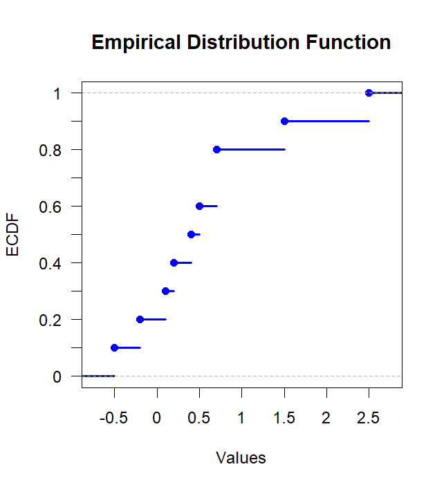
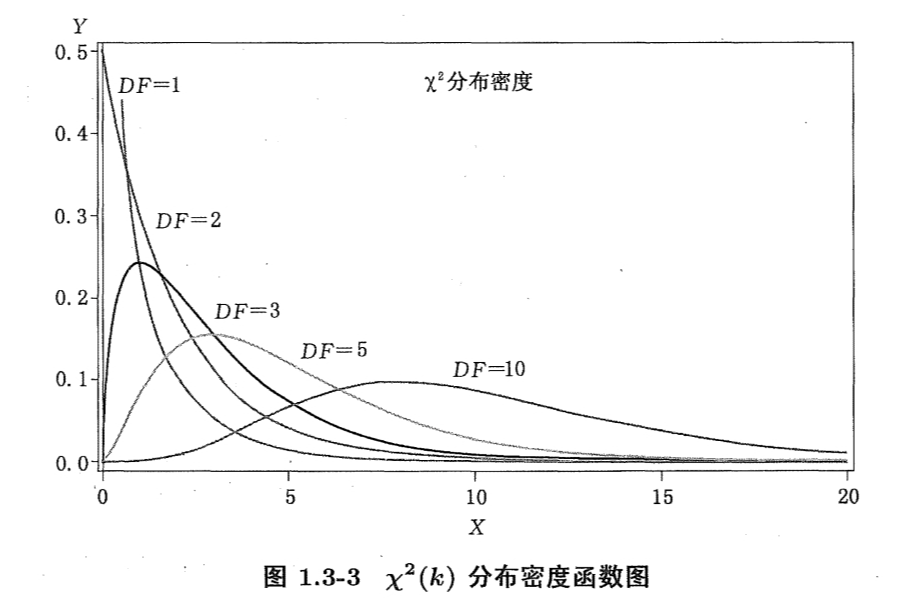

# FDU 数理统计 1. 基本知识

本文参考以下教材: 

- 《数理统计讲义》(郑明, 陈子毅, 汪嘉冈) 第 $1$ 章
- Introduction to Probability Models: Applied Stochastic Processes (S. Ross) Chapter $1,2$

欢迎批评指正!

## 1.1 统计学的基本概念

### 1.1.1 总体

广义上，常把研究问题中所关心的对象全体称为**总体** (population).  
在一个具体的研究问题中，我们所关心的往往只是总体中每个对象的某些指标 $\xi = (\xi_1,\dots,\xi_m)$.    
因此在数理统计中，**总体**就是研究问题中所关心对象的某些指标 $\xi = (\xi_1,\dots,\xi_m)$ 取值的全体. 

要了解总体就是要了解这些指标 $\xi = (\xi_1,\dots,\xi_m)$ 的分布 $F_\xi$.  
统计学中为了确定总体的分布 $F_\xi$，  
往往假定 $F_\xi$ 是**参数分布族** $\mathscr F_\xi = \{F_\xi (\theta):\theta \in \Theta\}$ 中的某一个分布 $F_{\xi}(\theta_\text{true})$ (**真分布**)，  
即包含有限个参数的同类型分布族，其中 $\Theta$ 称为**参数空间** (parameter space).  
例如正态分布族 $\{\text{N}(\mu,\sigma^2):\mu\in\mathbb R, \sigma^2>0\}$ 和 Bernoulli 分布族 $\{\text{B}(1,p):p\in [0,1]\}$.   
有时我们也可以假定 $F_\xi$ 是**非参数分布族**中的某一个分布，  
例如 $\{$所有对称的分布$\}$、$\{$所有具有连续分布函数的分布$\}$.    

### 1.1.2 样本

总体中的若干个体在指标 $\xi = (\xi_1,\dots,\xi_m)$ 上的取值集合称为**样本** (sample)，  
记为 $X = (X_1,\dots,X_n)$ (其中 $X_i = (\xi_1^{(i)},\dots,\xi_m^{(i)})$).   
这些个体的个数 $n$ 称为**样本量** (sample size).  
从总体抽取样本的过程就称为**抽样** (sampling).  
样本可能取值的全体 $\Omega = \{\text{all }(x_1,\dots,x_n)\}$ 称为**样本空间** (sample space)，  
本课程中涉及的样本空间通常是 $\mathbb R^n$ 及其子集.

在评价一个基于样本的统计方法时，就必须考虑到样本的随机性，而不能仅仅考虑它的某一次观测值.  
因此我们记样本为随机变量 $X=(X_1,\dots,X_n)$，  
记具体的一次抽样得到的观测 $x = (x_1,\dots,x_n)$，以示区分.  
其中 $x_i = (x_{i1},\dots,x_{im})\ \ (\forall\ i=1,\dots,n)$  

要利用样本来推断总体，就必须要求样本对总体有某种代表性.  
通常要求样本 $X=(X_1,\dots,X_n)$ 为**简单随机样本**，即要求:   

- $X_1,\dots,X_n$ 相互独立
- $X_i(\forall\ i=1,\dots,n)$ 与总体的 $\xi$ 具有相同的分布

也就是说，对于任意 $\theta \in \Theta$ 都有:
$$
F_X^\theta(x_1,\dots,x_n) = \prod_{i=1}^n F_{X_i}^\theta(x_i) = \prod_{i=1}^n F_{\xi}^\theta(x_i)\ \ (\forall\ (x_1,\dots,x_n)\in \Omega)
$$
若记描述与样本 $X$ 相关的事件 Borel-$\sigma$ 域为 $\mathcal B$，  
则称 $(\Omega,\mathcal B,\mathscr F_X)$ 为统计空间，它将是进行统计推断的基本模型.

### 1.1.3 统计量

样本 $X=(X_1,\dots,X_n)$ 的任意函数 $T(X)=(T_1(X),\dots,T_m(X))$ 都称为**统计量** (statistic)，  
它也是随机变量.  
因为样本 $X$ 有可能分布族 $\mathscr F_X = \{F_X(\theta):\theta\in \Theta\}$，  
所以统计量 $T(X)$ 也有可能分布族 $\mathscr F_T = \{F_T(\theta):\theta\in \Theta\}$，  
其参数由样本 $X$ 确定，即统计量 $T(X)$ 作为样本 $X$ 的函数不能有未知的参数.  
统计量 $T(X)$ 的真实分布 $F_T(\theta_\text{true})$ 称为**抽样分布** (sampling distribution)  

在一次具体观测中，  
指标 $\xi=(\xi_1,\dots,\xi_m)$ 在 $X=(X_1,\dots,X_n)$ 的观测值为 $x = (x_1,\dots,x_n)$，   
其中 $x_i = (x_{i1},\dots,x_{im})\ \ (\forall\ i=1,\dots,n)$.     
我们称 $T(x)$ 为**统计量的观测值**.

我们可以使用不同统计量来描述样本的各方面特征.  
依据生成方法，我们可以大致将统计量分为两类: 

- 基于观测值矩的统计量: 样本均值、样本方差等
- 基于观测值的次序统计量的各种量: 中位数、极差、分位数等

#### 1.1.3.1 矩型统计量

矩型统计量 (moment-type statistics) 是指以样本矩作为核心构造的一类统计量.

- **(1) 样本均值 (sample mean)**   
  总体 $(\mu,\sigma^2)$ 的简单随机样本 $X=(X_1,\dots,X_n)$ 的**样本均值**记为 $\overline{X} = \frac{1}{n}\sum_{i=1}^n X_i$   
  它是**总体一阶原点矩** $\mu:=\mathbb{E}[X]$ 的无偏估计量，反映了这组观测的平均水平.     

  **定理 $1.1.1$ (S. Ross 命题 $2.4$)**   
  若 $X_1,\dots,X_n$ 独立同分布，且具有期望 $\mu$ 和方差 $\sigma^2$，则有:   

    - ① $\mathbb{E}(\overline{X})=\mu$

    - ② $\text{Var}(\overline{X})= \sigma^2 / n$

    - ③ $\text{Cov}(\overline{X},X_i-\overline{X})=0\ \ (\forall\ i=1,2,\dots,n)$   

  **证明: **

    - ① 证明 $\mathbb{E}(\overline{X})=\mu$:  
      $$
      \begin{align}  
      \mathbb{E}(\overline{X}) 
      &=\frac1{n}\sum_{i=1}^n \mathbb{E}(X_i)\\
      &=\frac1{n}\cdot n\mu\\
      &=\mu
      \end{align}
      $$
      
    - ② 证明 $\text{Var}(\overline{X})= \sigma^2 / n$:  
      $$
      \begin{align}
      \text{Var}(\overline{X})
      &=(\frac{1}{n})^2\cdot\text{Var}(\sum_{i=1}^nX_i)\\
      &=\frac{1}{n^2}\cdot\sum_{i=1}^n\text{Var}(X_i)\\
      &=\frac{1}{n^2}\cdot n\sigma^2\\
      &=\frac{\sigma^2}{n}
      \end{align}
      $$
      
    - ③ 证明 $\text{Cov}(\overline{X},X_i-\overline{X})=0\ \ (\forall\ i=1,2,\dots,n)$:  
      对于任意 $i=1,2,\dots,n$  
      $$
      \begin{align}
      \text{Cov}(\overline{X},X_i-\overline{X}) 
      &= \text{Cov}(\overline{X},X_i)-\text{Cov}(\overline{X},\overline{X})\\
      &= \frac{1}{n}\text{Cov}(X_i+\sum_{j\neq i}X_j,X_i) - \text{Var}(\overline{X})\\
      &= \frac{1}{n}\text{Cov}(X_i,X_i) + \frac{1}{n}\text{Cov}(\sum_{j\neq i} X_j,X_i) - \frac{\sigma^2}{n}\\
      &= \frac{\sigma^2}{n}+0-\frac{\sigma^2}{n}\\
      &= 0
      \end{align}
      $$
      这说明样本均值与任一样本偏差之间的协方差为零，即二者之间不存在线性依赖.  
      这也暗示着样本均值是理论均值的**无偏估计量** (unbiased estimator).  
  
- **(2) 样本方差 (sample variance)**  
  样本 $X=(X_1,\dots,X_n)$ 的**未修偏样本方差**记为 $S_n^2 = \frac{1}{n}\sum_{i=1}^n(X_i-\overline{X})^2$.      
  定义**已修偏样本方差**为 ${S_n^*}^2 = \frac{1}{n-1}\sum_{i=1}^n(X_i-\overline{X})^2$，  
  它是**总体二阶中心矩** $\sigma^2 = \mathbb{E}[(X-\mu)^2]$ 的无偏估计量，反映了这组观测的分散程度.    
  
  - **样本标准差** (standard deviation): $\text{SD}(X)=S_n^* = \sqrt{\frac{1}{n-1}\sum_{i=1}^n(X_i-\overline{X})^2}$    
    (值得注意的是，它并不是 $\sigma$ 的无偏估计量，后续课程会涉及这点)
  - **样本均值的标准误差** (standard error of mean): $\text{SE}(X)=S_n/\sqrt{n}$   
    (用于近似衡量样本均值 $\overline{X}$ 作为总体均值 $\mu$ 的估计量的可靠性，考虑到 $\text{Var}(\overline{X}) = \sigma^2 / n$)
  - **样本变异系数** (coefficient of variation): $\text{CV}(X) = S_n / {\overline{X}}\times 100\%$   
    (用于衡量样本扰动相对于样本均值的重要程度)
  - **注: **我们在上述记号里标注 $(X)$ 是为了强调它们是样本 $X$ 的函数，即统计量.  
    实际应用时可简化上述记号.
  
  对于样本 $X=(X_1,\dots,X_n)$   
  我们记 $X$ 的标准化为 $Y_i = (X_i-\overline{X}) / S_n\ \ (1\leq i\leq n)$，也称 $Y_i$ 为 $X_i$ 的**标准得分** (standard score).    
  这样处理可以避免量纲对数据分析的影响.
  
  **定理 $1.1.2$ (S. Ross Section $2.6.1$)**  
  若 $X_1,\dots,X_n$ 独立同分布，且具有期望 $\mu$ 和方差 $\sigma^2$.  
  记已修偏的样本方差为 ${S_n^*}^2 = \frac{1}{n}\sum_{i=1}^n(X_i-\overline{X})^2$，则有 $\mathbb{E}({S_n^*}^2) = \sigma^2$ 成立. 
  
  - **证明: **
    $$
    \begin{align}
    \sum_{i=1}^n (X_i - \overline{X})^2 
    &= \sum_{i=1}^n \left( X_i - \mu + \mu - \overline{X} \right)^2 \\
    &= \sum_{i=1}^n (X_i - \mu)^2 + n(\mu - \overline{X})^2 + 2(\mu - \overline{X})\sum_{i=1}^n (X_i - \mu) \\
    &= \sum_{i=1}^n (X_i - \mu)^2 + n(\mu - \overline{X})^2 + 2(\mu - \overline{X})(n\overline{X} - n\mu) \\
    &= \sum_{i=1}^n (X_i - \mu)^2 + n(\mu - \overline{X})^2 - 2n(\mu - \overline{X})^2\\
    &= \sum_{i=1}^n (X_i - \mu)^2 - n(\mu - \overline{X})^2
    \end{align}
    $$
    (这是一个相当重要的恒等式: $(n-1){S_n^*}^2 = \sum_{i=1}^n (X_i - \overline{X})^2 = \sum_{i=1}^n (X_i - \mu)^2 - n(\mu - \overline{X})^2$)  
    因此有:
    $$
    \begin{align}
    \mathbb{E}[(n-1){S_n^*}^2] 
    &= \mathbb{E}[\sum_{i=1}^n (X_i - \mu)^2 - n(\mu - \overline{X})^2]\\
    &= \sum_{i=1}^n \mathbb{E}[(X_i - \mu)^2] - n\mathbb{E}[(\overline{X}-\mu)^2]\\
    &= n\sigma^2 - n \text{Var}(\overline{X})\quad (\text{use Theorem } 1.1.1(b))\\
    &= n\sigma^2 - n\cdot \frac{\sigma^2}{n}\\
    &= (n-1)\sigma^2\end{align}
    $$
    
    于是有 $\mathbb{E}({S_n^*}^2) = \sigma^2$.
  
- **(3) 样本偏度 (sample skewness)**  
  样本 $X=(X_1,\dots,X_n)$ 的**已修偏样本偏度**记为 $g_1 = \frac{n}{(n-1)(n-2)}\sum_{i=1}^n(\frac{X_i-\overline{X}}{S_n})^3$  
  它是**总体三阶标准化中心矩** $\mathbb{E}[(\frac{X-\mu}{\sigma})^3]$ 的无偏估计量，反映了这组观测的对称性.   

  - 负偏度代表**左偏** (left-skewed)，表示数据分布在**左侧**有较长的尾巴
  - 正偏度代表**右偏** (right-skewed)，表示数据分布在**右侧**有较长的尾巴

  

- **(4) 样本峰度 (sample kurtosis)**  
  样本 $X=(X_1,\dots,X_n)$ 的**已修偏样本峰度**记为 $g_2 = \frac{n(n+1)}{(n-1)(n-2)(n-3)}\sum_{i=1}^n(\frac{X_i-\overline{X}}{S_n})^4 - \frac{3(n-1)^2}{(n-2)(n-3)}$  
  它是**总体四阶标准化中心矩** $\mathbb{E}[(\frac{X-\mu}{\sigma})^4]$ 的无偏估计量，  
  反映了这组观测的尖峭程度 (与标准正态分布 $N(0,1)$ 比较).   

  - **高(正)峰度** (leptokurtic) 代表其拥有比标准正态分布更尖锐的峰和更厚重的尾部;
    (中心区域更集中，尾部区域容易出现极端值)
  - **中(零)峰度** (mesokurtic) 代表其峰度特征类似于标准正态分布;
  - **低(负)峰度** (platykurtic) 代表其拥有比标准正态分布更平坦的峰和更轻薄的尾部;
    (中心区域更分散，尾部区域不容易出现极端值)

  

#### 1.1.3.2 次序统计量

我们将样本 $X=(X_1,\dots,X_n)$ 从小到大排列并记为 $X_{(1)},\dots,X_{(n)}$，  
称为观测值的**次序统计量** (order statistics).    
更严谨的记号为 $X_{(1),n},\dots,X_{(n),n}$   

- **(1) 中位数 (median)**  
  $$
  \text{med}(X) := \begin{cases}
  X_{(\frac{n+1}{2})}, &\text{if }n \text{ is odd}\\
  \frac{1}{2}[X_{(\frac{n}{2})} + X_{(\frac{n}{2}+1)}], &\text{if }n \text{ is even}\end{cases}
  $$
  与样本均值 $\overline{X}$ 类似，中位数 $\text{med}(X)$ 描述了这组观测的中心水平，  
  但它只基于观测量的排序，计算更为简单，且不受极端数据的影响，即具有**稳健性** (robustness).
  
- **(2) 极差 (range)**  
  $$
  \text{ran}(X) := X_{(n)}-X_{(1)} = \underset{1\leq i\leq n}\max X_i - \underset{1\leq i\leq n}{\min} X_i
  $$
  
  它描述的是这组观测的分散程度，但对极端数据非常敏感.  
  
- **(3) 经验分布函数 (Empirical Distribution Function)**  
  $$
  \hat F_n(x) := \frac{1}{n}\sum_{i=1}^n I_{x\geq X_i}(x) = 
  \begin{cases} 
  0, & x<X_{(1)}\\ 
  k/n, & X_{(k)}\leq n< X_{(k+1)}\ \ (1\leq k\leq n-1)\\ 
  1, & x\geq X_{(n)} 
  \end{cases}
  $$
  其中 $I_{x\geq X_i}(x) = I_{[X_i,\infty)}(x)$ 为集合 $[X_i,\infty)$ 的 $\text{0-1}$ 指示函数.  
  它是 Bernoulli 随机变量序列 $\{Y_i = I(X_i\leq x)\}$ 前 $n$ 项的算术平均.      
  (请读者注意，本课程 $2024$ 年春季学期期中考试考察了经验分布函数的定义)
  
  **(数理统计讲义 例 $2.4.18$, 经验分布函数的渐近正态性)**   
  假设真实分布函数为 $F$，则对于任意 $x\in \mathbb R$ 都有 $\sqrt{n}(\hat F_n(x)-F(x)) \overset{\mathrm{d}}\to N(0,F(x)(1-F(x)))\ \ (n\to\infty)$ 成立.   
  这是对 Bernoulli 随机变量序列 $\{Y_i = I(X_i\leq x)\}$ 应用 **Feller-Lévy 中心极限定理**得到的.  
  后续课程会详细说明.
  
  下面是基于**数理统计讲义习题 $1.5$** 绘制的经验分布函数图像:   
  (其间断点处不应有竖线，否则它将不是一个函数，数理统计讲义图 $1.1\text{-}9$ 就犯了这个错误) 
  
  
  
- **(4) 样本分位数 (sample quantiles)**    
  对于 $p\in (0,1)$，总体分布 $F$ 的总体 $p$ 分位数 $\zeta_p$ 是方程 $F(x)=p$ 的一个解.  
  由于样本的经验分布函数 $\hat F_n$ 不是严格单调也不是连续的，  
  因此方程 $\hat F_n(x) = p$ 可能无解，即使有解也不一定唯一.  

  对于样本 $X=(X_1,\dots,X_n)$ 的样本 $p$ 分位数 $\hat \zeta_p$ 将取这样的数值:   
  小于 $\hat \zeta_p$ 的观测值的个数约为 $np$，大于 $\hat \zeta_p$ 的观测值的个数约为 $n(1-p)$，  
  即次序统计量 $X_{(\lfloor np\rfloor)}\sim X_{(\lceil np \rceil)}$ 范围附近的一个值.

  在各个分位数中，较常用的是**百分位数** (percentile) 和**四分位数** (quartile)

  - $\frac{i}{100}$-分位数称为**样本第 $i$ 个百分位数**
  - $\frac{i}{4}$-分位数称为**样本第 $i$ 个四分位数**，记为 $q_i$  
    其中 $q_1,q_3$ 分别称为 **下四分位数**和**上四分位数**.  
    用分位数也可描述数据分布的离散程度，   
    常用的是**样本四分位距** (inter-quartile range)，记为 $\text{IQR} = q_3-q_1$.   
    在对总体分布没有先验信息时，次序统计量或分位数有更加适用.

- **(5) 盒形图 (box plot)**   
  水平盒形图由一个矩形盒和盒子两侧的须构成: 

  - 矩形盒的左、右两侧分布位于下、上四分位数 $q_1,q_3$ 的位置，  
    因此其宽度为四分位距 $\text{IQR} = q_3-q_1$   
    矩形盒的内部在中位数 $\text{med}$ 和均值 $\bar x$ 处各有一条竖直线段.  
  - 盒子两侧的须分别延伸至 $[q_1-1.5\text{IQR},q_1]$ 和 $[q_3,q_3+1.5\text{IQR}]$ 范围内最远数据点的位置，  
    须端点以外的每个数据点用点标出，它们称为**异常值**或**极端值** (outlier)   
    (有时还区分 $3\text{IQR}$ 内外的数据，将 $1.5\text{IQR}\sim 3\text{IQR}$ 和 $\geq 3\text{IQR}$ 的数据点用不同符号标出) 

  从盒形图上可以大体看出数据集中在什么范围，左右两侧是否对称.  
  (FDU elearning 上作业评分分布的描述就使用了盒形图，但细看又不是真正的盒形图)

  

#### 1.1.3.3 其他统计量

- **(1) 众数 (mode)**  
  频数最大的观测值 (如果不唯一，则按某种约定从多个可能值中间选定一个)  
  它对连续型和分类型的数据都可定义，用于描述数据的中心位置.  
  (对于连续型数据可以通过**众数区间**的中点定义众数)
  
- **(2) 样本相关系数 (coefficient of correlation)**  
  对于连续随机变量，最常用的是描述变量间线性相关性的**样本 Pearson 相关系数**.  
  考虑连续随机变量 $\xi^{(1)}$ 和 $\xi^{(2)}$ 的简单随机样本 $(X,Y)=((X_1,Y_1),\dots,(X_n,Y_n))$ 
  $$
  \begin{align}
  r_n(X,Y)
  &=\frac{S_{XY}}{\sqrt{S_{XX}S_{YY}}}\\
  &=\frac{\frac{1}{n}\sum_{i=1}^n(X_i-\overline{X})(Y_i-\overline{Y})}{\sqrt{\frac{1}{n}\sum_{i=1}^n(X_i-\overline{X})^2\cdot \frac{1}{n}\sum_{i=1}^n(Y_i-\overline{Y})^2}}\\
  &=
  \frac{\sum_{i=1}^n(X_i-\overline{X})(Y_i-\overline{Y})}{\sqrt{\sum_{i=1}^n(X_i-\overline{X})^2\sum_{i=1}^n(Y_i-\overline Y)^2}} \in [-1,1]
  \end{align}
  $$
  其中 $S_{XY}= \frac{1}{n}\sum_{i=1}^n(X_i-\overline{X})(Y_i-\overline Y)$ 称为**样本协方差** (sample covariance)    
  可以对比**总体的 Pearson 相关系数**理解: 
  $$
  \begin{align}
  \rho(\xi^{(1)},\xi^{(2)}) 
  &= \frac{\text{Cov}(\xi^{(1)},\xi^{(2)})}{\sqrt{\text{Var}(\xi^{(1)})\text{Var}(\xi^{(2)})}}\\
  &= \frac{\mathbb{E}[(\xi^{(1)}-\mathbb{E}[\xi^{(1)}])(\xi^{(2)}-\mathbb{E}[\xi^{(2)}])]}{\sqrt{\mathbb{E}[(\xi^{(1)}-\mathbb{E}[\xi^{(1)}])^2]\mathbb{E}[(\xi^{(2)}-\mathbb{E}[\xi^{(2)}])^2]}} \in [-1,1]
  \end{align}
  $$
  
  - 若 $r_n\in (0,1]$，则称样本 $(X,Y)$ 正线性相关;
  - 若 $r_n\in [-1,0)$，则称样本 $(X,Y)$ 负线性相关;
  - 绝对值 $|r_n|$ 越大，表明样本 $(X,Y)$ 线性相关性越强;
  - 线性变换不改变样本相关系数:   
    即对于任意线性变换 $\begin{cases}
    \widetilde X = AX + b\\
    \widetilde Y = Cx + d\end{cases}$ 都有 $r_n(\widetilde X,\widetilde Y) = r_n(X,Y)$ 成立.

## 1.2 常用分布

如何使用**矩母函数** $M_X(t)=\mathbb{E}[\mathrm{e}^{tX}]$ 和**特征函数** $\varphi_X(t)=\mathbb{E}[\mathrm{e}^{\mathrm{i}tX}]$ 计算 $X$ 的均值和方差:   

- $k$ 阶原点矩: $\begin{cases}
  \mathbb{E}[X^k] = \frac{\mathrm{d}^k}{\mathrm{d}t^k}M_X(t)|_{t=0}\\
  \mathrm{i}^k\mathbb{E}[X^k] = \frac{\mathrm{d}^k}{\mathrm{d}t^k}\varphi_X(t)|_{t=0}\end{cases}$
- $\mathbb{E}[X] = M_X'(0) = \frac{1}{\mathrm{i}}\varphi_X'(0) = -\mathrm{i}\varphi_X'(0)$
- $\mathbb{E}[X^2] = M_X''(0) = \frac{1}{\mathrm{i}^2}\varphi_X''(0) = -\varphi_X''(0)$
- $\text{Var}[X] = \mathbb{E}[X^2]-[\mathbb{E}[X]]^2 = M_X''(0) - (M_X'(0))^2 = -\varphi_X''(0) + (\varphi_X'(0))^2$ 

### 1.2.1 离散分布

#### (1) 单点分布

$a\in\mathbb R$ 处的单点分布 (退化分布) 满足 $\begin{cases}
\text{P}\{X=a\}=1\\
\mathbb{E}[X] = a\\
\text{Var}[X]=0\\
M_X(t) = \mathrm{e}^{ta}\\
\varphi_X(t)= \mathrm{e}^{\mathrm{i}ta}\\
\mathbb{E}[X^k]=a^k\end{cases}$

 

#### (2) Bernoulli 分布

Bernoulli 分布 $B(1,p)$，即 $0,1$ 两点分布，满足 $\begin{cases}
\text{P}\{X=k\} =  p^k(1-p)^{1-k}\quad\ (k=0,1)\\
\mathbb{E}[X]=p\\
\text{Var}[X]=p(1-p)\\
M_X(t) = p\mathrm{e}^t + (1-p)\\
\varphi_X(t)= p\mathrm{e}^{\mathrm{i}t} + (1-p)\\
\mathbb{E}[X^k] = p\qquad\qquad\qquad\qquad(\forall\ k=1,2,\dots)\end{cases}$

#### (3) 几何分布

几何分布 (geometric distribution) $\text{Geo}(p)$，  
是 Bernoulli 试验出现首次成功结果所需的试验次数的分布.  
$X\sim \text{Geo}(p)$ 满足 $\begin{cases}
\text{P}\{X=k\} = p(1-p)^{k-1},\quad k=1,2,\dots\\
\mathbb{E}[X]=\frac{1}{p}\\
\mathbb{E}[X^2] = \frac 2{p^2}- \frac1p\\
\text{Var}[X] = \frac{1-p}{p^2}\\
M_X(t) = \frac{p}{1-q\mathrm{e}^{t}}\quad (q=1-p,\ t<-\log(q))\\
\varphi_X(t) = \frac{p}{1-q\mathrm{e}^{\mathrm{i}t}}\end{cases}$   

几何分布具有无记忆性 (另一个具有无记忆性的分布是指数分布)，这很好理解，  
因为每次 Bernoulli 试验都是一次独立的尝试，不受先前试验结果的影响.    
这意味着无论之前失败了多少次，  
对于 "还需进行多少次试验才能首次成功" 的问题来说都没有影响.

#### (4) 二项分布

二项分布 (binomial distribution) $B(n,p)$，即 $n$ 个独立同分布的 Bernoulli 随机变量之和的分布.  
记 $X=(X_1,\dots,X_n)$ 为取自 Bernoulli 分布 $B(1,p)$ 的简单随机样本，其样本量为 $n$，   
则 $Y = 1_n^{\mathrm T}X=\sum_{i=1}^nx_i\sim B(n,p)$ 满足 $\begin{cases}
\text{P}\{X=k\} = \binom{n}{k} p^k(1-p)^{n-k},\quad k=0,1,\dots,n\\
\mathbb{E}[X]=np\\
\text{Var}[X]= np(1-p)\\
M_X(t) = [p\mathrm{e}^t + (1-p)]^n\\
\varphi_X(t) = [p\mathrm{e}^{\mathrm{i}t} + (1-p)]^n\end{cases}$  

#### (5) Poisson 分布

Poisson 分布 $\text{Poisson}(\lambda)$，是二项分布 $B(n,p)$ 在 $n$ 很大而 $p$ 很小时的近似分布，参数 $\lambda \approx np>0$   
满足 $\begin{cases}
\text{P}\{X=k\}= \frac{\lambda^k}{k!}\mathrm{e}^{-\lambda},\quad k=0,1,\dots\\
M_X(t) = \mathrm{e}^{\lambda (\mathrm{e}^t-1)}\\
\varphi_X(t)= \mathrm{e}^{\lambda(\mathrm{e}^{\mathrm{i}t}-1)}\\
\mathbb{E}[X]=\lambda\\
\text{Var}[X]=\lambda\\
\mathbb{E}[X(X-1)\dotsm (X-k+1)] = \lambda^k\ \ (\forall\ k=1,2,\dots)\end{cases}$  
**二级结论: **对于常数 $s$ 和 $X\sim \text{Poisson}(\lambda)$ 有 $\mathbb{E}[s^X] = \mathbb{E}[\mathrm{e}^{\log(s) X}] = M_X(\log(s)) = \mathrm{e}^{\lambda (s-1)}$ 

#### (6) $k$ 类别分布

设事件 $E_1,\dots,E_k$ 为样本空间 $\Omega$ 的一个分割，即满足 $\begin{cases}
E_i\cap E_j = \emptyset,&\forall\ i\neq j\\
\bigcup_{i=1}^k E_i = \Omega\end{cases}$    
对任意 $i=1,\dots,k$ 记 $\begin{cases}
\xi_i = {\large\mathbb 1}_{E_i} \\ 
\pi_i = \text{P}\{E_i\} = \text{P}\{\xi_i=1\}
\end{cases}$ 并记 $k$ 维向量 $\begin{cases}
\xi = (\xi_1,\dots,\xi_k)\\
\pi = (\pi_1,\dots,\pi_k)\end{cases}$   
我们称随机向量 $\xi$ 服从为 **$k$ 类别分布** ($k$-categorical distribution)，记为 $M_k(1,\pi)$，  
满足 $\begin{cases}
\text{P}\{\xi = e_1\} = \text{P}\{\xi_1=1\} = \pi_1\\
\qquad\vdots\\
\text{P}\{\xi = e_k\} = \text{P}\{\xi_k=1\} = \pi_k\end{cases}$  (其中 $e_1,\dots,e_k$ 为 $\mathbb R^k$ 的标准单位基向量)   
它可以视为 Bernoulli 分布 (只有 $0,1$ 两个类别) 推广到 $k$ 个类别的情况，  
每次试验结果只能是 $k$ 个类别中的一个.   

容易验证 $\xi \sim M_k(1,\pi)$ 的**均值向量**和**协方差矩阵**为:    
$$
\begin{cases}
\mathbb{E}[\xi] = \pi = (\pi_1,\dots,\pi_k)\\
\text{Cov}[\xi] = \text{diag}(\pi) - \pi\pi^{\mathrm T} = \begin{bmatrix}
\pi_1(1-\pi_1) & -\pi_1\pi_2 &\dots &-\pi_1\pi_k\\
-\pi_2\pi_1 & \pi_2(1-\pi_2) &\dots &-\pi_2\pi_k\\
\vdots & \vdots &\ddots &\vdots\\
-\pi_k\pi_1 & -\pi_k\pi_2 &\dots & \pi_k(1-\pi_k)\end{bmatrix}\end{cases}
$$

#### (7) 多项分布

多项分布 (multinomial distribution) $M_k(n,\pi)$，即 $n$ 个独立同分布的 **$k$ 类别随机变量之和**的分布.   
记 $X=(X_1,\dots,X_n) \in \mathbb R^{k\times n}$ 为取自 $k$ 维类比分布 $M_k(1,\pi)$ 的简单随机样本，样本量为 $n$   
则 $Y = 1_n^{\mathrm T}X^{\mathrm T} = \sum_{i=1}^nX_i^{\mathrm T} = (\sum_{i=1}^n X_{1i},\dots,\sum_{i=1}^nX_{ki})^{\mathrm T}\sim M_k(n,\pi)$   
(其中分量 $Y_j = \sum_{i=1}^nX_{ji}$ 表示样本 $X$ 中事件 $E_j$ 发生的频数)   
满足 $\text{P}\{Y_{1} = n_1,\dots,Y_k=n_k\} = \frac{n!}{n_1!\dotsm n_k!}\pi_1^{n_1}\dots \pi_k^{n_k}$, 其中 $\begin{cases}
n_i\geq 0,\quad(\forall\ i=1,\dots,k)\\
\sum_{i=1}^nn_i = n\end{cases}$     
容易验证 $Y \sim M_k(n,\pi)$ 的**均值向量**和**协方差矩阵**为:    
$$
\begin{cases}
\mathbb{E}[Y] = n\pi = n(\pi_1,\dots,\pi_k)\\
\text{Cov}[Y] = n[\text{diag}(\pi) - \pi\pi^{\mathrm T}] = n\begin{bmatrix}
\pi_1(1-\pi_1) & -\pi_1\pi_2 &\dots &-\pi_1\pi_k\\
-\pi_2\pi_1 & \pi_2(1-\pi_2) &\dots &-\pi_2\pi_k\\
\vdots & \vdots &\ddots &\vdots\\
-\pi_k\pi_1 & -\pi_k\pi_2 &\dots & \pi_k(1-\pi_k)\end{bmatrix}\end{cases}
$$

### 1.2.2 连续分布

#### (1) 正态分布

一元正态随机向量 $X\sim \text{N}(\mu,\sigma^2)$ 满足 $\begin{cases}
f_X(x) = \frac{1}{\sqrt{2\pi\sigma^2}}\exp\{-\frac{(x-\mu)^2}{2\sigma^2}\}\\
M_X(t) = \exp\{\frac{\sigma^2t^2}{2} + \mu t\}\\
\varphi_X(t) = \exp\{-\frac{\sigma^2t^2}{2} + \mathrm{i}\mu t\}\\
\mathbb{E}[(\frac{X-\mu}{\sigma})^m] = \begin{cases}
0&m=2k-1\\
(2k-1)!!&m=2k\end{cases}\\
\mathbb{E}[X] = \mu\\
\text{Var}[X]=\sigma^2>0\end{cases}$     

多元正态随机变量 $X\sim \text{N}_k(\mu,\Sigma)$ 满足 $\begin{cases}
f_X(x) = \frac{1}{\sqrt{(2\pi)^k\det(\Sigma)}}\exp\{-\frac12 (x-\mu)^{\mathrm T}\Sigma^{-1}(x-\mu)\}\\
M_X(t) = \exp\{\frac{1}{2}t^{\mathrm T}\Sigma t + \mu^{\mathrm T}t\}\\
\varphi_X(t) = \exp\{-\frac{1}{2}t^{\mathrm T}\Sigma t + \mathrm{i}\mu^{\mathrm T}t\}\\
\mathbb{E}[X]=\mu\\
\text{Cov}[X]= \Sigma \succ 0\end{cases}$    

**定理 $1.2.1$: (正态分布的性质, 根据王勤文老师随机过程导论笔记 & S. Ross 整理)**

- **① 正态随机变量的分布由其均值向量和协方差矩阵唯一确定**   
  这一点可由 $M_X(t) = \exp\{\frac{1}{2}t^{\mathrm T}\Sigma t + \mu^{\mathrm T}t\}$ 直接得到 (矩母函数能够唯一确定分布).  

- **② Isserlis 定理: **    
  考虑一系列联合正态的零均值随机变量 $\{X_n\}$，我们有:     

  - 任意**奇数**个联合正态的零均值随机变量的乘积的期望值为 $0$   
    即对于任意正整数 $k\geq 1$ 都有 $\mathbb{E}[\prod_{i=1}^{2k-1}X_i] = 0$ 
  - 任意**偶数**个联合正态的零均值随机变量的乘积的期望值为所有可能的不重复配对的期望值的乘积之和.  
    即对于任意正整数 $k\geq 1$ 都有 $\mathbb{E}[\prod_{i=1}^{2k}X_i] = \sum(\prod_{\text{pairs}(i,j)} \mathbb{E}[X_iX_j])$ 

  特别地，对于联合正态的 $4$ 个零均值随机变量 $X_1,X_2,X_3,X_4$，我们有:   
  $$
  \mathbb{E}[X_1X_2X_3X_4] = \mathbb{E}[X_1X_2]\mathbb{E}[X_3X_4] + \mathbb{E}[X_1X_3]\mathbb{E}[X_2X_4] + \mathbb{E}[X_1X_4]\mathbb{E}[X_2X_3]
  $$
  
- **③ 多元正态随机变量做线性映射后仍是多元正态的**  
  具体来说，若 $X\sim \text{N}(\mu,\Sigma)$，则 $Ax+b \sim \text{N}(A\mu+b,A\Sigma A^{\mathrm T})$.  
  **证明: **  
  $$
  \begin{align}
  M_{AX+b}(t) &= \mathbb{E}[\mathrm{e}^{t^\mathrm{T}(AX+b)}]\\
  &= \mathrm{e}^{b^\mathrm{T}t}\cdot \mathbb{E}[\mathrm{e}^{(A^\mathrm{T}t)^\mathrm{T}X}]\\
  &= \mathrm{e}^{b^\mathrm{T}t}\cdot M_X(A^{\mathrm{T}}t)\\
  &= \mathrm{e}^{b^\mathrm{T}t}\cdot \exp\left\{\frac12 (A^{\mathrm{T}}t)^\mathrm{T}\Sigma (A^{\mathrm{T}}t) + (A^{\mathrm{T}}t)^\mathrm{T}\mu\right\}\quad (X\sim \text{N}(\mu,\Sigma))\\
  &= \exp\{\frac12 t^\mathrm{T}(A\Sigma A^\mathrm{T})t +t^\mathrm{T}(A\mu+b)\}\\
  &= M_{\text{N}(A\mu+b,A\Sigma A^\mathrm{T})}(t)\end{align}
  $$
  
  得证 $AX+b \sim \text{N}(A\mu+b,A\Sigma A^{\mathrm T})$. 
  
  **推论: **
  
  - 多元正态随机向量的任意分量都是正态随机向量.
  
  - $n$ 维随机变量 $X\sim \text{N}(\mu,\Sigma)$ 当且仅当对于任意 $\alpha \in \mathbb R^n$ 都有 $\alpha^{\mathrm T}X\sim \text{N}(\alpha^{\mathrm T}\mu,\alpha^{\mathrm T}\Sigma\alpha)$ 成立.  
    **证明: **  
    必要性显然成立，下面验证充分性:   
    $$
    \begin{align} 
    M_{\alpha^\mathrm{T}X}(t) 
    &=\mathbb{E}[\mathrm{e}^{t\alpha^\mathrm{T}X}]\\ 
    &= \exp\{\frac12\alpha^\mathrm{T}\Sigma\alpha\cdot t^2 + \alpha^\mathrm{T}\mu\cdot t\}\\
    &= \exp\{\frac12(t\alpha)^\mathrm{T}\Sigma (t\alpha) + (t\alpha)^\mathrm{T}\mu\}\\
    &= M_{\text{N}(\mu,\Sigma)}(t\alpha)\end{align}
    $$
    根据 $\alpha\in \mathbb R^n$ 的任意性，我们知道 $t\alpha$ 可以取到 $\mathbb R^n$ 中的任意一点，  
    由于矩母函数唯一确定分布，故有 $X\sim \text{N}(\mu,\Sigma)$ 成立.  
    
  - 若 $n$ 维随机变量 $X\sim \text{N}\left(\begin{bmatrix}\mu_1\\
    \vdots\\
    \mu_n\end{bmatrix},\begin{bmatrix}\sigma^2_1 & &\\
    &\ddots&\\
    &&\sigma^2_n \end{bmatrix}\right)$   
    则有 $\begin{cases}
    X_i \sim \text{N}(\mu_i,\sigma_i^2)\ \ (i=1,\dots,n)\\
    X_1,\dots,X_n \text{ are uncorrelated/independent}\end{cases}$ 成立.  
    这个结论可由上一个推论直接得到，也可通过矩母函数证明.  
    它也说明联合多元正态的随机向量之间，**不相关**和**独立**是等价的.  
  
    注意，上述结论必须在联合多元正态的前提条件下，考虑以下反例:   
    给定 $\begin{cases}
    X\sim \text{N}(0,1)\\
    \varepsilon = \begin{cases}
    1, &\frac12\\
    -1, & \frac12\end{cases}\\
    \varepsilon\ \bot\ X\end{cases}$，记 $Y=\varepsilon X$，显然有 $\begin{cases}
    Y\sim \text{N}(0,1)\\
    Y\ \not\bot\ X\end{cases}$ 成立.  
    然而我们可以证明 $X,Y$ 不相关:   
    $$
    \begin{align}
    \text{Cov}(X,Y) 
    &= \mathbb{E}(XY)-\mathbb{E}(X)\mathbb{E}(Y)\\
    &= \mathbb{E}(X^2\varepsilon) - 0\cdot 0\\
    &= \mathbb{E}(X^2)\cdot \mathbb{E}(\varepsilon)\\
    &= (0^2+1)\cdot 0\\
    &= 0\end{align}
    $$
  
- **④ 正态总体的样本均值与样本方差的联合分布: (S. Ross 命题 $2.5$)**     
  若 $X=(X_1,\dots,X_n)$ 为取自 $\text{N}(\mu,\sigma^2)$ 的简单随机样本，样本量为 $n$，  
  定义样本均值 $\overline{X}=\frac{1}{n}\sum_{i=1}^nx_i$ 和已修偏样本方差 ${S_n^*}^2 = \frac{1}{n-1}\sum_{i=1}^n(x_i-\overline{X})^2$，  
  则有 $\begin{cases}
  \overline{X} \ \bot\ {S_n^*}^2\\
  \overline{X} \sim \text{N}(\mu,\frac{\sigma^2}{n})\\
  {S_n^*}^2 \sim \sigma^2 \frac{\chi^2(n-1)}{n-1}
  \end{cases}$ 成立.  
  **证明: **  

  - **证明 $\overline{X} \ \bot\ {S_n^*}^2$:**  
    **在正态假设下，独立性等价于线性无关性.**   
    根据**定理 $1.1.1$ ③** 的结论 $\text{Cov}(\overline{X},X_i-\overline{X})=0\ \ (\forall\ i=1,2,\dots,n)$  
    可知 $\overline{X}$ 与偏差序列 $X_i-\overline{X}\ \ (i=1,\dots,n)$ 是线性无关的，因而是独立的.  
    由此推出 $\overline{X}$ 独立于样本方差 ${S_n^*}^2=\frac1{n-1}\sum_{i=1}^n(X_i - \overline{X})^2$ 
    (对于一般情况，$\overline{X}$ 与 ${S_n^*}^2$ 一定线性无关，但不一定相互独立)
  - **证明 $\overline{X} \sim \text{N}(\mu,\frac{\sigma^2}{n})$: **  
    由于 $\overline{X}=\frac1{n}\sum_{i=1}^nX_i$ 是正态随机向量 $X_1,\dots,X_n$ 的线性组合，故也是正态随机向量.  
    根据**定理 $1.1.1$ ①②** 的结论 $\begin{cases}
    \mathbb{E}(\overline{X})=\mu\\
    \text{Var}(\overline{X})=\frac{\sigma^2}{n}
    \end{cases}$ 可知 $\overline{X} \sim \text{N}(\mu,\frac{\sigma^2}{n})$    
    (正态随机变量的分布由其均值向量和协方差矩阵唯一确定)
  - **证明 ${S_n^*}^2 \sim \sigma^2 \frac{\chi^2(n-1)}{n-1}$:**  
    利用恒等式 $(n-1){S_n^*}^2 = \sum_{i=1}^n (X_i - \overline{X})^2 = \sum_{i=1}^n (X_i - \mu)^2 - n(\mu - \overline{X})^2$    
    可知 $\frac{(n-1){S_n^*}^2}{\sigma^2} + (\frac{\overline{X}-\mu}{\sigma/\sqrt{n}})^2 = \sum_{i=1}^n (\frac{X_i-\mu}{\sigma})^2$    
    由于 $\begin{cases}
    (\frac{\overline{X}-\mu}{\sigma/\sqrt{n}})^2\sim (\text{N}(0,1))^2 = \chi^2(1)\\
    \sum_{i=1}^n (\frac{X_i-\mu}{\sigma})^2 \sim \chi^2(n)\\
    (\frac{\overline{X}-\mu}{\sigma/\sqrt{n}})^2\ \bot\ \sum_{i=1}^n (\frac{X_i-\mu}{\sigma})^2\end{cases}$  
    因此 $\frac{(n-1){S_n^*}^2}{\sigma^2}\sim \chi^2(n-1)$   
    即 ${S_n^*}^2 \sim \sigma^2 \frac{\chi^2(n-1)}{n-1}$  

- **⑤ Assignment $2$ Problem $5$ (数理统计讲义 习题 $1.18$)**    
  若 $\begin{cases}
  X_1,X_2\sim N(0,\sigma^2)\\
  X_1\ \bot\ X_2\end{cases}$, 则 $\begin{cases}
  Y_1 = \frac{X_1}{X_2} \sim \text{Cauchy}(0,1)\\
  Y_2 = \sqrt{X_1^2 + X_2^2}\sim \text{Rayleigh}(\sigma^2)\\
  Y_2^2 = X_1^2+X_2^2 \sim \sigma \chi^2(2)\\
  Y_1\ \bot\ Y_2\end{cases}$     
  Man, what can I say? I was forbidden by Prof. Hou to upload homework solutions.  
  关于这道题，李贤平老师的《概率论基础》第 $175$ 页例 $9$ 提供了一个巧妙的证明.

#### (2) Cauchy 分布

Cauchy 随机变量 $X\sim \text{Cauchy}(u,\sigma)$ 满足 $\begin{cases}
f_X(x) = \frac{1}{\pi}\cdot \frac{\sigma}{(x-\mu)^2 +\sigma^2} = \frac{1}{\pi\sigma[1+(\frac{x-\mu}{\sigma})^2]}\\
F_X(x) = \frac{1}{\pi}\text{arctan}(\frac{x-\mu}{\sigma})+\frac12\\
\mathbb{E}[|X|] = \infty\\
\mathbb{E}[X]\text{ and } \mathbb{E}[X^2]\text{ are undefined}\\
 \end{cases}$    
其中 $\mu\in\mathbb R$ 是**位置参数**，刻画 Cauchy 分布的中心位置 (注意它不是均值);    
而 $\sigma>0$ 是**尺度参数**，控制 Cauchy 分布的 "宽度"，尺度参数越大，分布越宽 (注意它不是方差).    
Cauchy 分布的性质:   

- **无限分割性 & 稳定性: **  
  意味着若干个独立的相同 Cauchy 分布的随机变量之和，仍是一个 Cauchy 分布.   
  也就是说，若 $X_1,\dots,X_n\overset{\text{i.i.d.}}{\sim} \text{Cauchy}(\mu,\sigma)$，则有 $\begin{cases}
  \sum_{i=1}^n X_i \sim \text{Cauchy}(n\mu,n\sigma)\\
  \overline{X} = \frac{1}{n}\sum_{i=1}^n X_i \sim \text{Cauchy}(\mu,\sigma)\end{cases}$  
- **标准 Cauchy 分布的定义: **  
  设 $\begin{cases}
  X_1,X_2\sim N(0,1)\\
  X_1\ \bot\ X_2\end{cases}$，则 $\text{Cauchy}(0,1)\overset{\mathrm{d}}= \frac{X_1}{|X_2|}\overset{\mathrm{d}}= \frac{X_1}{X_2} \overset{\mathrm{d}}= t(1)$    
  证明参见 Assignment $2$ 第 $6$ 题 (即数理统计讲义习题 $1.23$) 第 $(2)$ 问.  
  $\text{Cauchy}(0,1)$ 分布的特征函数为 $\varphi(t) = \mathrm{e}^{-|t|}$.
- 实际上它是 $t_{(1)}$ 分布，其总体矩从一阶开始便不存在.

#### (3) 指数分布

指数随机变量 $X\sim \exp(\lambda)$ 满足 $\begin{cases}
f_X(x) = \lambda \mathrm{e}^{-\lambda x} I_{(0,\infty)}(x)\\
F_X(x) = 1-\mathrm{e}^{-\lambda x}\\
M_X(t) = \frac{\lambda}{\lambda - t}\quad (t<\lambda)\\
\varphi_X(t) = \frac{\lambda}{\lambda-{\mathrm i}t}\\
\mathbb{E}[X^k] = \frac{k!}{\lambda ^k}\\
\mathbb{E}[X]=\frac{1}{\lambda}\\
\text{Var}[X]=\frac{1}{\lambda^2}\end{cases}$      
参数 $\lambda>0$ 的含义是平均等待时间 (这样的意义是在随机过程范畴下的, 本课程不做过多讨论).  

我们称随机变量 $X$ 具有**无记忆性 **(memoryless property)，  
当且仅当对于一切 $s,t\geq 0$ 都有 $\text{P}\{X>s+t|X>t\} = \text{P}\{X>s\}$ 成立，  
或者等价地，都有 $\frac{\text{P}\{X>s+t,X>t\}}{\text{P}\{X>t\}} =\frac{\text{P}\{X>s+t\}}{\text{P}\{X>t\}}= \text{P}\{X>s\}$ 成立，  
或者等价地，都有 $\text{P}\{X>s+t\} = \text{P}\{X>s\}\text{P}\{X>t\}$ 成立.  

**指数分布具有无记忆性 (实际上它是唯一具有无记忆性的连续分布): **  
对于任意给定的 $\lambda> 0$，设随机变量 $X\sim \exp(\lambda)$，则有:   
$$
\text{P}\{X>s+t\} - \text{P}\{X>s\}\text{P}\{X>t\}
= \mathrm{e}^{-\lambda (s+t)} - \mathrm{e}^{-\lambda s}\cdot \mathrm{e}^{-\lambda t}
= 0
$$
因此有 $\text{P}\{X>s+t\} = \text{P}\{X>s\}\text{P}\{X>t\}$ 成立，  
说明指数分布 $\exp(\lambda)$ 具有无记忆性.

#### (4) Gamma 分布

定义 **Gamma 函数**为 $\begin{cases}
\Gamma (\alpha) = \int_0^{+\infty} \mathrm{e}^{-t}t^{\alpha-1}{\mathrm d}t\\ 
\text{dom}(\Gamma) = \{\alpha\in \mathbb C:\text{Re}(\alpha)>0\}
\end{cases}$  
特殊地，对于任意整数 $n$ 有 $\Gamma(n) = (n-1)!$ 成立，  
实际上 $\Gamma$ 函数是阶乘函数在实数域和复数域上的推广.  
它还具有性质 $\begin{cases}
\Gamma(\frac12)=\sqrt{\pi}\\
\Gamma(1) =1\\
\Gamma(\alpha+1)=\alpha\Gamma(\alpha)\end{cases}$  

若对于某对 $\begin{cases} \alpha>0\\ \lambda>0 \end{cases}$ 有 $f(x) = \frac{\lambda^\alpha}{\Gamma(\alpha)}x^{\alpha-1} \mathrm{e}^{-\lambda x}I_{(0,\infty)}(x) = \begin{cases} 
\frac{\lambda \mathrm{e}^{-\lambda x}(\lambda x)^{\alpha-1}}{\Gamma(\alpha)},&x> 0\\ 0,&\text{otherwise}  \end{cases}$ 成立，  
则称 $X$ 为具有参数 $(\alpha,\lambda)$ 的 **Gamma 随机变量**，记为 $X\sim \text{Gamma}(\alpha,\lambda)$  
它没有解析形式的累积分布函数.  
它满足 $\begin{cases}
M_X(t) = (\frac{\lambda}{\lambda-t})^\alpha\quad (t<\lambda)\\
\varphi_X(t) = (\frac{\lambda}{\lambda-{\mathrm i}t})^\alpha\\  
\mathbb{E}[X^k] = \frac{\Gamma (\alpha + k)}{\lambda^k \Gamma(\alpha)}\ \ (\forall\ k = 1,2,\dots)\\
\mathbb{E}[X] = \frac{\alpha}{\lambda}\\
\mathbb{E}[X^2] = \frac{\alpha(\alpha+1)}{\lambda^2}\\
\mu_2 =\text{Var}[X] = \frac{\alpha}{\lambda^2}\\
\mu_3 = \mathbb{E}[(X-\mathbb{E}[X])^3] = \frac{2\alpha}{\lambda^3}\\
\mu_4 = \mathbb{E}[(X-\mathbb{E}[X])^4] = \frac{3\alpha^2 + 6\alpha}{\lambda^4}\\
\end{cases}$  

Gamma 分布具有**再生性**:   
即对于任意 $\begin{cases}
X_1\sim \text{Gamma}(\alpha_1,\lambda)\\
X_2\sim \text{Gamma}(\alpha_2,\lambda)\\
X_1\ \bot\ X_2\end{cases}$ 都有 $X_1+X_2\sim \text{Gamma}(\alpha_1+\alpha_2,\lambda)$   
我们在后面会证明这个性质 (**定理 $1.2.2$**)  
特殊地，指数分布 $\exp(\lambda)=\text{Gamma}(1,\lambda)$  

#### (5) 均匀分布

均匀随机变量 $X \sim \text{Uniform}(a,b)$ 满足 $\begin{cases}
f_X(x) = \frac{1}{b-a}I_{(a,b)}(x)\\
F_X(x) = \begin{cases}0,&x\leq a\\
\frac{x-a}{b-a}, & a<x<b\\
1, & x\geq b\end{cases}\\
\text{M}_X(t) = \frac{\mathrm{e}^{bt}-\mathrm{e}^{at}}{(b-a)t}\\
\varphi_X(t) = \frac{\mathrm{e}^{{\mathrm i}bt}-\mathrm{e}^{{\mathrm i}at}}{(b-a){\mathrm i}t}\\
\mathbb{E}[X^k]=  \frac{b^{k+1} - a^{k+1}}{(k+1)(b-a)}\\
\mathbb{E}[X]= \frac{a+b}{2}\\
\text{Var}[X]= \frac{(b-a)^2}{12}\end{cases}$ 

#### (6) 第一类 Beta 分布

定义 **Beta 函数**为 $\begin{cases} \beta(a,b) = \int_0^1 x^{a-1}(1-x)^{b-1}{\mathrm d}x = \frac{\Gamma(a)\Gamma(b)}{\Gamma(a+b)}\\
\text{dom}(\beta) = \{a,b\in \mathbb C:\text{Re}(a)>0,\text{Re}(b)>0\}\end{cases}$    
若对于某对 $a,b>0$   
有 $f(x) = \frac{1}{\beta(a,b)}x^{a-1}(1-x)^{b-1} I_{(0,1)}(x) =\begin{cases} 
\frac{\Gamma(a+b)}{\Gamma(a)\Gamma(b)}x^{a-1}(1-x)^{b-1},&0<x<1\\ 0,&\text{otherwise}  \end{cases}$ 成立  
则称 $X$ 为具有参数 $(a,b)$ 的 **Beta 随机变量**，记为 $X\sim \text{Beta}(a,b)$  
它没有解析形式的累积分布函数.    
它满足 $\begin{cases}
M_X(t) = \sum_{k=0}^{\infty} \frac{\beta(a+k,b)}{\beta(a,b)} \frac{t^k}{k!} = \frac{\Gamma(a+b)}{\Gamma(a)}\sum_{k=0}^{\infty} \frac{\Gamma(a+k)}{\Gamma(a+b +k)}\frac{t^k}{k!}\\
\varphi_X(t) = \sum_{k=0}^{\infty} \frac{\beta(a+k,b)}{\beta(a,b)} \frac{({\mathrm i}t)^k}{k!} = \frac{\Gamma(a+b)}{\Gamma(a)}\sum_{k=0}^{\infty} \frac{\Gamma(a+k)}{\Gamma(a+b+k)}\frac{({\mathrm i}t)^k}{k!}\\
\mathbb{E}[X^k] = \frac{\beta(a+k,b)}{\beta(a,b)} = \frac{\Gamma(a+b)}{\Gamma(a)}\frac{\Gamma(a+k)}{\Gamma(a+b+k)}\\
\mathbb{E}[X] = \frac{a}{a+b}\\  
\mathbb{E}[X^2] = \frac{a(a+1)}{(a+b)(a+b+1)}\\
\text{Var}[X] = \frac{ab}{(a+b)^2(a+b+1)}\end{cases}$  
特殊地，$\text{Beta}(1,1)\overset{\mathrm{d}}=\text{Uniform}(0,1)$ 

#### (7) 第二类 Beta 分布

定义 **Beta 函数**为 $\begin{cases} \beta(a,b) = \int_0^1 x^{a-1}(1-x)^{b-1}{\mathrm d}x = \frac{\Gamma(a)\Gamma(b)}{\Gamma(a+b)}\\
\text{dom}(\beta) = \{a,b\in \mathbb C:\text{Re}(a)>0,\text{Re}(b)>0\}\end{cases}$    
若对于某对 $a,b>0$   
有 $f(x) = \frac{1}{\beta(a,b)}\frac{x^{a-1}}{(1+x)^{a+b}} I_{(0,\infty)}(x) =\begin{cases} 
\frac{\Gamma(a+b)}{\Gamma(a)\Gamma(b)}\frac{x^{a-1}}{(1+x)^{a+b}},&x>0\\ 0,&\text{otherwise}  \end{cases}$ 成立  
则称 $X$ 为具有参数 $(a,b)$ 的 **Beta Prime 随机变量**，记为 $X\sim \text{Beta Prime}(a,b)$  
它没有解析形式的累积分布函数 [(More on The Beta Prime Distribution)](https://www.randomservices.org/random/special/BetaPrime.html).

容易验证: 

- 若 $X \sim \text{Beta}(a,b)$，则 $Y = \frac{X}{1-X} \sim \text{Beta Prime}(a,b)$ 
- 若 $Y \sim \text{Beta Prime}(a,b)$，则 $X = \frac{Y}{1+Y} \sim \text{Beta}(a,b)$

**定理 $1.2.2$: (数理统计讲义 命题 $1.3.15$)**  
给定 $\begin{cases}
X_1\sim \text{Gamma}(\alpha_1,\lambda)\\
X_2\sim \text{Gamma}(\alpha_2,\lambda)\\
X_1\ \bot\ X_2\end{cases}$ 则有 $\begin{cases}
Y_1 = X_1+X_2 \sim \text{Gamma}(\alpha_1+\alpha_2,\lambda)\\
Y_2 = \frac{X_1}{X_2} \sim \text{Beta Prime}(\alpha_1,\alpha_2)\\
Y_1\ \bot\ Y_2\end{cases}$  

- **推论 $1$: **  
  给定 $\begin{cases}
  X_1\sim \text{Gamma}(\alpha_1,\lambda)\\
  X_2\sim \text{Gamma}(\alpha_2,\lambda)\\
  X_1\ \bot\ X_2\end{cases}$ 则有 $\begin{cases}
  Y_1 = X_1+X_2 \sim \text{Gamma}(\alpha_1+\alpha_2,\lambda)\\
  Y_2 = \frac{X_1}{X_1+X_2} \sim \text{Beta}(\alpha_1,\alpha_2)\\
  Y_1\ \bot\ Y_2\end{cases}$
- **推论 $2$: **  
  根据 **Gamma 分布的再生性**以及 $\begin{cases}
  \exp(\lambda) = \text{Gamma}(1,\lambda)\\
  \chi^2(k) = \text{Gamma}(\frac{k}2,\frac12)\end{cases}$​ 可知:   
  若 $X_1,\dots,X_k\overset{\mathrm{i.i.d.}}\sim \exp(1,\lambda)$​，则有 $Z= \sum_{i=1}^{k}X_i\sim \text{Gamma}(k,\lambda)$​   
  若 $\begin{cases}
  X_1\sim \chi^2(k_1)\\
  X_2\sim \chi^2(k_2)\\
  X_1\ \bot\ X_2\end{cases}$，则有 $X_1+X_2\sim \chi^2(k_1+k_2)$​

**证明: **   

- **引理 (联合概率密度在双射下的变换规则, S. Ross Section $2.5.4$): **    
  假设 $X$ 是 $k$ 维连续随机变量，具有概率密度函数 $f_X(\cdot)$   
  给定变换 $g:\mathbb R^k \to \mathbb R^k$，记 $Y=g(X)$   
  若 $g$ 满足:   

  - $g$ 存在逆变换 $h=g^{-1}$ 
  - $g$ 一阶连续可求偏导，即在所有 $x$ 上有连续的偏导数.  
    且对于任意 $x$ 都有 Jacobi 行列式 $J(x) = \begin{vmatrix}\frac{\partial g_1}{\partial x_1}&\dots & \frac{\partial g_1}{\partial x_k}\\
    \vdots & &\vdots\\
    \frac{\partial g_k}{\partial x_1} & \dots & \frac{\partial g_k}{\partial x_k}\end{vmatrix}\neq 0$   

  在这两个条件下，可以证明 $Y=(Y_1,Y_2,\dots,Y_k)$ **联合地连续**，且联合密度函数为:   
  $f_{Y}(y) = f_{X}(x)|J(x)|^{-1} = f_X(h(y))|J(h(y))|^{-1}$ 

  - 特殊地，假设 $X$ 是 $k$ 维连续随机变量，具有概率密度函数 $f_X(\cdot)$   
    给定可逆矩阵 $A\in \mathbb R^{k\times k}$ 和向量 $b\in \mathbb R^k$，记 $Y=AX+b$  
    则 $f_Y(y) = \frac{1}{|\det(A)|}f_X(A^{-1}(y-b))$ 
  
- **应用引理: **
  现在 $\begin{cases}
  Y_1 = g_1(X_1,X_2) =X_1+X_2\\
  Y_2 = g_2(X_1,X_2) =\frac{X_1}{X_2}\end{cases}$      
  我们有 $\begin{cases}
  X_1 = h_1(Y_1,Y_2) = \frac{Y_1Y_2}{1+Y_2}\\
  X_2 = h_2(Y_1,Y_2) = \frac{Y_1}{1+Y_2}\end{cases}$   
  且具有联合概率密度:   
  $$
  \begin{align}f_{X_1,X_2}(x_1,x_2) 
  &=  f_{X_1}(x_1)\cdot f_{X_2}(x_2)\\
  &= \frac{\lambda^{\alpha_1}}{\Gamma(\alpha_1)}x_1^{\alpha_1-1} \mathrm{e}^{-\lambda x_1}\cdot\frac{\lambda^{\alpha_2}}{\Gamma(\alpha_2)}x_2^{\alpha_2-1} \mathrm{e}^{-\lambda x_2}\\
  &= \frac{\lambda^{\alpha_1+\alpha_2}}{\Gamma(\alpha_1)\Gamma(\alpha_2)} x_1^{\alpha_1-1}x_2^{\alpha_2-1}\mathrm{e}^{-\lambda(x_1+x_2)}\end{align}
  $$
  而 $J(x_1,x_2) = \begin{vmatrix}
  \frac{\partial g_1}{\partial x_1} & \frac{\partial g_1}{\partial x_2}\\
  \frac{\partial g_2}{\partial x_1} & \frac{\partial g_2}{\partial x_2}
  \end{vmatrix} = 
  \begin{vmatrix}
  1 & 1\\
  \frac{1}{x_2} & -\frac{x_1}{x_2^2}\end{vmatrix}
  = -\frac{x_1+x_2}{x_2^2}\neq 0\ \ (\forall\ x_1,x_2>0)$   
  
  因此 $Y_1,Y_2$ 联合地连续，且联合概率密度函数为:     
  $$
  \begin{align}
  f_{Y_1,Y_2}(y_1,y_2)    
  & = f_{X_1,X_2}(h_1(y_1,y_2),h_2(y_1,y_2))\cdot |J(h_1(y_1,y_2),h_2(y_1,y_2))|^{-1}\\
  & = \frac{\lambda^{\alpha_1+\alpha_2}}{\Gamma(\alpha_1)\Gamma(\alpha_2)} \left(\frac{y_1y_2}{1+y_2}\right)^{\alpha_1-1} \left(\frac{y_1}{1+y_2}\right)^{\alpha_2-1}\mathrm{e}^{-\lambda(\frac{y_1y_2}{1+y_2}+\frac{y_1}{1+y_2})}\cdot \left|-\frac{\frac{y_1y_2}{1+y_2}+\frac{y_1}{1+y_2}}{(\frac{y_1}{1+y_2})^2}\right|^{-1}\\
  &= \lambda^{\alpha_1+\alpha_2}y_1^{\alpha_1-1+\alpha_2-1+1}
  \mathrm{e}^{-\lambda y_1}\cdot \frac{1}{\Gamma(\alpha_1)\Gamma(\alpha_2)}\frac{y_2^{\alpha_1-1}}{(1+y_2)^{\alpha_1-1+\alpha_2-1 +2}}\\
  &= \frac{\lambda^{\alpha_1+\alpha_2}}{\Gamma(\alpha_1+\alpha_2)}y_1^{\alpha_1+\alpha_2-1}
  \mathrm{e}^{-\lambda y_1}\cdot \frac{\Gamma(\alpha_1+\alpha_2)}{\Gamma(\alpha_1)\Gamma(\alpha_2)}\frac{y_2^{\alpha_1-1}}{(1+y_2)^{\alpha_1+\alpha_2}}\\  
  &= \text{P}\{\text{Gamma}(\alpha_1+\alpha_2) = y_1\}\cdot 
  \text{P}\{\text{Beta Prime}(\alpha_1,\alpha_2)=y_2\}\end{align}
  $$
  表明 $\begin{cases}
  Y_1 = X_1+X_2 \sim \text{Gamma}(\alpha_1+\alpha_2,\lambda)\\
  Y_2 = \frac{X_1}{X_2} \sim \text{Beta Prime}(\alpha_1,\alpha_2)\\
  Y_1\ \bot\ Y_2\end{cases}$ 

#### (8) 卡方分布

若 $X\sim N(0,1)$ (即 $f_X(x) = \frac{1}{\sqrt{2\pi}\sigma}\exp\{-\frac{x^2}{2\sigma^2}\}$)，   
则 $Y=g(X) =X^2$ 的概率密度函数为:   
(我们记 $x=h(y) = \sqrt y$，注意这只相当于 "一半的反函数"，所以要乘 $2$; 而 $J(x) = \frac{\partial}{\partial x}g(x) = 2x$)   
$$
\begin{align}
f_Y(y) 
&= 2\cdot f_X(h(y))|J(h(y))|^{-1}\\
&= 2f_X(\sqrt{y})\cdot |2\sqrt y|^{-1} \\
&= 2\frac{1}{\sqrt{2\pi}}\exp\{-\frac{(\sqrt y)^2}{2}\}\cdot \frac{1}{2\sqrt y}\\
&= \frac{1}{\sqrt{2\pi y}}\exp\{-\frac{y}{2}\}\\
&= \frac{(\frac{1}{2})^{\frac12}}{\Gamma(\frac12)}y^{\frac12 -1} \mathrm{e}^{-\frac12 y} \\
&= \text{P}\{\text{Gamma}(\frac12,\frac12) = y\}\quad (y\geq 0)
\end{align}
$$
于是我们有:   
$$
Y=X^2 \sim \text{Gamma}(\frac12,\frac12)\overset{\mathrm d}=\chi^2(1)
$$

我们称 $Y$ 服从自由度为 $1$ 的卡方分布 $\chi^2(1)$.

根据 **Gamma 分布的再生性 (定理 $1.2.2$): **  
若 $X_1,\dots,X_k\overset{\mathrm{i.i.d.}}\sim N(0,1)$，  
记 $Y_i = X_i^2\sim \text{Gamma}(\frac12,\frac12)\overset{\mathrm{d}}=\chi^2(1)\ (\forall\ i=1,\dots,k)$  
则 $Z = \sum_{i=1}^k Y_i \sim \text{Gamma}(\frac{k}{2},\frac12) \overset{\mathrm{d}}= \chi^2(k)$   
**换言之，$k$ 个相互独立的标准正态随机变量的平方和 $Z$ 服从自由度为 $k$ 的卡方分布 $\chi^2(k)$**   

卡方随机变量 $X\sim \chi^2(n)=\text{Gamma}(\frac{n}2,\frac12)$ 满足 $\begin{cases}
f_X(x) = \frac{x^{n/2-1}}{2^{n/2}\Gamma(n/2)}\mathrm{e}^{-\frac12 x}I_{(0,\infty)}\\
\mathbb{E}[X^k] = \frac{\Gamma (\frac{n}{2} + k)}{(\frac12)^k \Gamma(\frac{n}{2})}\\ \mathbb{E}[X]=n\\
\mathbb{E}[X^2]=n(n+2)\\
\text{Var}[X]=2n\end{cases}$

#### (9) F 分布 

若 $\begin{cases}
X_1\sim \chi^2(k_1)\\
X_2\sim \chi^2(k_2)\\
X_1\ \bot\ X_2\end{cases}$，则称 $Y= \frac{X_1/k_1}{X_2/k_2}$ 的分布为 **F 分布**，记为 $F(k_1,k_2)$   
其中 $k_1$称为**分子自由度** (ndf, numerator degrees of freedom)  
而 $k_2$ 称为**分母自由度** (ddf, denominator degrees of freedom).  
根据定理 $1.2.2$ 可知:   
若 $\begin{cases}
X_1\sim \chi^2(k_1)= \text{Gamma}(\frac{k_1}2,\frac12)\\
X_2\sim \chi^2(k_2)= \text{Gamma}(\frac{k_2}2,\frac12)\\
X_1\ \bot\ X_2\end{cases}$，则 $\frac{X_1}{X_2}\sim \text{Beta Prime}(\frac{k_1}{2},\frac{k_2}{2})$   
因此我们知道 $F(k_1,k_2)\overset{\mathrm{d}}= \frac{k_2}{k_1} \text{Beta Prime}(\frac{k_1}{2},\frac{k_2}{2})$ 

$F$ 随机变量 $X\sim F(k_1,k_2)$ 满足: $\begin{cases}
f_X(x) = \frac{(k_1/k_2)^{k_1/2}}{\beta(k_1/2,k_2/2)}\frac{x^{k_1/2 - 1}}{(1+(k_1/k_2)x)^{(k_1+k_2)/2}} I_{(0,\infty)}(x)\\   
\qquad\ \ = \frac{k_1^{k_1/2}k_2^{k_2/2}}{\beta(k_1/2,k_2/2)}   
\frac{x^{k_1/2-1}}{(k_2+k_1x)^{(k_1+k_2)/2}}I_{(0,\infty)}(x)\\  
\mathbb{E}[X] = \frac{k_2}{k_2-2}\quad (k_2>3)\\
\text{Var}[X]= \frac{2k_2^2(k_1+k_2-2)}{k_1(k_2-2)^2(k_2-4)}\quad (k_2>4)\end{cases}$  

#### (10) t 分布 

若 $\begin{cases}
Z\sim N(0,1)\\
X\sim \chi^2(k)\\
Z\ \bot\ X\end{cases}$，则称 $Y= \frac{Z}{\sqrt{X/k}}$ 的分布为自由度为 $k$ 的 **$t$ 分布**，记为 $t(k)$   
容易验证: $(t(k))^2 \overset{\mathrm{d}}= F(1,k)$      
**非中心 t 分布: **  
若 $\begin{cases}
Z\sim N(\mu,1)\\
X\sim \chi^2(k)\\
Z\ \bot\ X\end{cases}$，则记 $Y = \frac{Z}{\sqrt{X/k}}\sim t(k,\mu)$  
其中 $\mu$ 为位置参数，显然 $t(k)\overset{\mathrm{d}}=t(k,0)$ 

$t$ 分布随机变量 $X\sim t(k)$ 满足 $\begin{cases}
f_X(x) = \frac12 \cdot \text{P}\{F(1,k)=y\}\cdot |\frac{\partial y}{\partial x}|\\
\qquad \ \ =\frac12\cdot\frac{1^{1/2}k^{k/2}}{\beta(1/2,k/2)}   
\frac{y^{1/2-1}}{(k+y)^{(1+k)/2}}I_{(0,\infty)}(y)\cdot 2|x|\\
\qquad \ \ = \frac12\cdot k^{k/2}\cdot \frac{\Gamma(\frac{k+1}{2})}{\Gamma(\frac12)\Gamma(\frac{k}{2})}\cdot \frac{(x^2)^{-1/2}}{(k+x^2)^{(k+1)/2}}I_{(0,\infty)}(x^2)\cdot 2|x|\\
\qquad \ \ = \frac{\Gamma(\frac{k+1}{2})}{\sqrt{\pi}\Gamma(\frac{k}{2})}\cdot \frac{k^{k/2}}{(k+x^2)^{(k+1)/2}}\\
\qquad \ \ = \frac{\Gamma(\frac{k+1}{2})}{\sqrt{k\pi}\Gamma(\frac{k}{2})}(1+\frac{x^2}{k})^{-\frac{k+1}{2}}\\ 
\mathbb{E}[X] = 0\quad (k>1)\\
\text{Var}[X] = \frac{k}{k-2}\quad (k>2)\end{cases}$ 

**Note:** $t_{(k)}$ 分布的总体矩从第 $k$ 阶开始不存在，$t_{(\infty)}$ 即为正态分布.

#### (11) 指数型分布族

考虑含参数 $\theta$ 的分布族 $\mathscr F_X = \{F_X(\theta):\theta\in \Theta\}$.   
若其概率质量函数 (或概率密度函数) 可表示为:   
$$
p(x;\theta) = C(\theta)\exp\left\{\sum_{i=1}^k Q_i(\theta)T_i(x) \right\} h(x)\quad (\forall\ \theta \in \Theta),
$$
其中 $\{T_i(x)\}^k_{i=1}$ 和 $h(x)$ 仅为 $x$ 的函数，而 $C(\theta)$ 和 $\{Q_i(\theta)\}_{i=1}^k$ 仅为 $\theta$ 的函数，  
则我们称分布族 $\mathscr F_X$ 为**指数型分布族** (简称指数族).  
特殊地，如果 $Q_i(\theta) = \theta_i,\ 1\leq i\leq k$，则称其为**指数族的标准形式**.

我们规定 $C(\theta)>0$ 且 $\begin{cases}
0<\underset{x}\sum \exp\{\sum_{i=1}^k Q_i(\theta)T_i(x)\} h(x) = \frac{1}{C(\theta)}<\infty,&\text{Discrete Case}\\
0<\int \exp\{\sum_{i=1}^k Q_i(\theta)T_i(x)\}h(x){\mathrm d}x = \frac{1}{C(\theta)}<\infty,&\text{Continuous Case}\end{cases}$   
并称 $\{x:p(x;\theta)>0\} = \{x:h(x)>0\}$ 为指数型分布族的**支撑集**，  
我们可以看出指数型分布族的支撑集与参数 $\theta$ 无关.  
这一点可以用于说明一些分布 (例如均匀分布) 不是指数型分布族.

**指数族的性质: ($2024$ 春季学期期中考试压轴题有考察)**

- ① 若指数族具有标准形式 $p(x;\theta) = C(\theta)\exp[\sum_{i=1}^{k}\theta_iT_i(x)]h(x)$  
  则我们称 $\begin{cases}
  \{\theta=(\theta_1,\dots,\theta_k): \sum_x\exp\{\sum_{i=1}^k \theta_iT_i(x)\}h(x)<\infty\},&\text{Discrete Case}\\
  \{\theta=(\theta_1,\dots,\theta_k): \int\exp\{\sum_{i=1}^k\theta_iT_i(x)\} h(x)\mathrm{d}x<\infty\},&\text{Continuous Case}\end{cases}$    
  为指数族的**自然参数空间**.  
  可以证明，指数族的自然参数空间必定是**凸集**.
  
- ② 对形如 $H(\theta) = \int\exp\{\sum_{i=1}^k\theta_iT_i(x)\} h(x)\mathrm{d}x$ 的 (标准形式) 积分，以后常用到它的如下特性:   
  若 $\theta$ 为 (连续情形) 自然参数空间 $\{\theta=(\theta_1,\dots,\theta_k): \int\exp\{\sum_{i=1}^k\theta_iT_i(x)\}h(x)\mathrm{d}x<\infty\}$ 的**内点**，  
  则 $H(\theta) = \int\exp[\sum_{i=1}^k\theta_iT_i(x)]h(x)\mathrm{d}x$ 在 $\theta$ 处存在**任意阶偏导数**，且满足:   
  $$
  \begin{align}
  \frac{\partial^{i_1+\dotsm i_k}}{\partial \theta_1^{i_1}\dotsm \partial \theta_k^{i_k}} H(\theta)
  &= \int \frac{\partial^{i_1+\dotsm i_k}}{\partial \theta_1^{i_1}\dotsm \partial \theta_k^{i_k}} \exp\left\{\sum_{i=1}^k\theta_iT_i(x)\right\}h(x)\mathrm{d}x\\
  &= \int T_1^{i_1}(x)\dotsm T_k^{i_k}(x) \exp\left\{\sum_{i=1}^k \theta_iT_i(x)\right\} h(x)\mathrm{d}x\end{align}
  $$
  
  根据上述特性，我们知道对于**标准形式的指数族的自然参数空间**的任意内点 $\theta$ 都有:   
  
  - 对于 $1\leq i\leq k$: 
    $$
    \begin{align}
    \mathbb{E}[T_i(X)] 
    &= C(\theta)\int T_i(x)\exp\left\{\sum_{i=1}^{k}\theta_iT_i(x)\right\} h(x)\mathrm{d}x\\
    &= C(\theta)\frac{\partial}{\partial \theta_i}H(\theta)\\
    &= C(\theta)\frac{\partial}{\partial \theta_i}\frac{1}{C(\theta)}\\
    &= C(\theta)\cdot \left(-\frac{1}{C^2(\theta)}\right)\frac{\partial}{\partial \theta_i}C(\theta)\\
    &= -\frac{1}{C(\theta)}\frac{\partial}{\partial \theta_i}C(\theta)\\
    &= -\frac{\partial}{\partial \theta_i}\log(C(\theta))\end{align}
    $$
    
  - 对于 $1\leq i,j\leq k$:
    $$
    \begin{align}
    \text{Cov}(T_i(X),T_j(X))
    &= \mathbb{E}[T_i(X)T_j(X)]-\mathbb{E}[T_i(X)]\mathbb{E}[T_j(X)]\\
    &= C(\theta)\int T_i(x)T_j(x)\exp\left\{\sum_{i=1}^{k}\theta_iT_i(x)\right\} h(x)\mathrm{d}x - \left[ -\frac{\partial}{\partial \theta_i}\log(C(\theta))\right]\left[ -\frac{\partial}{\partial \theta_j}\log(C(\theta))\right]\\
    &= C(\theta)\frac{\partial^2}{\partial \theta_i\partial \theta_j}H(\theta) -
    \frac{\partial}{\partial \theta_i}\log(C(\theta))\frac{\partial}{\partial \theta_j}\log(C(\theta))\\
    &= C(\theta)\left[\frac{2}{C^3(\theta)}\frac{\partial}{\partial \theta_i}C(\theta)\frac{\partial}{\partial \theta_j}C(\theta)-\frac{1}{C^2(\theta)}\frac{\partial^2}{\partial \theta_i\partial \theta_j}C(\theta)\right] - \frac{1}{C(\theta)}\frac{\partial}{\partial \theta_i}C(\theta)\frac{1}{C(\theta)}\frac{\partial}{\partial \theta_j}C(\theta)\\
    &= \frac{1}{C^2(\theta)}\frac{\partial}{\partial \theta_i}C(\theta)\frac{\partial}{\partial \theta_j}C(\theta)- \frac{1}{C(\theta)}\frac{\partial^2}{\partial \theta_i\partial \theta_j}C(\theta) \\
    &= -\frac{\partial^2}{\partial \theta_i\partial \theta_j}\log(C(\theta))\end{align}
    $$
    
  - 对于 $1\leq i\leq k$:
    $$
    \text{Var}(T_i(X)) = \text{Cov}(T_i(X),T_i(X)) = -\frac{\partial^2}{\partial \theta_i^2}\log(C(\theta))
    $$

$T_i(X)$ 后面是很有用的统计量.

一些具体的例子:   

- ① 均匀分布族 $\{U(a,b):-\infty < a<b<\infty\}$   
  因为其支撑集 $(a,b)$ 与参数 $a,b$ 有关，所以它不是指数族.
  
- ② 二项分布族 $\{B(n,p):0<p<1\}$   
  其概率质量函数 $p(x;p)$ 可写为:   
  $$
  \begin{align}
  p(x;p) 
  &= 
  \binom{n}{x} p^x (1-p)^{n-x}I(x\in \{1,2,\dots,n\})\\
  &=
  (1-p)^n \exp\left\{x\log(\frac{p}{1-p})\right\}\binom{n}{x}I(x\in \{1,2,\dots,n\})\end{align}
  $$
  通过定义 $\theta := \log(\frac{p}{1-p})$ 可将其转为标准形式:  
  $$
  \begin{align}
  p(x;p) 
  &= 
  (1-p)^n \exp\left\{x\log(\frac{p}{1-p})\right\}\binom{n}{x}I(x\in \{1,2,\dots,n\})\quad \left(\theta = \log(\frac{p}{1-p})\ \Leftrightarrow\ p = \frac{\mathrm{e}^\theta}{1+ \mathrm{e}^\theta}\right)\\
  &= 
  (1+\mathrm{e}^\theta)^{-n} \exp\{\theta\cdot x\} \binom{n}{x} I(x\in \{1,2,\dots,n\})\\
  &= 
  C(\theta)\exp\{\theta\cdot T(x)\} h(x)
  \end{align}
  $$
  可知它是指数族，其中 $\begin{cases}
  C(\theta) = (1+\mathrm{e}^\theta)^{-n}\\
  k=1\\
  T(x) = x\\
  h(x) = \binom{n}{x}I(x\in \{1,2,\dots,n\})\end{cases}$   
  
  - 计算统计量 $T$ 的均值:
    $$
    \begin{align}
    \mathbb{E}[T(X)]
    &= \mathbb{E}[X]\\
    &= -\frac{\mathrm{d}}{\mathrm{d}\theta}\log(C(\theta))\\
    &= -\frac{\mathrm{d}}{\mathrm{d}\theta}\log((1+\mathrm{e}^\theta)^{-n})\\
    &= n \cdot \frac{\mathrm{d}}{\mathrm{d}\theta} \log(1+\mathrm{e}^\theta)\\
    &= n\cdot\frac{\mathrm{e}^\theta}{1+\mathrm{e}^\theta}\quad (\text{note that }p=\frac{\mathrm{e}^\theta}{1+\mathrm{e}^\theta})\\
    &= np\end{align}
    $$
  
- ③ 正态分布族 $\{N(\mu,\sigma^2):\mu\in \mathbb R,\sigma^2>0\}$  
  其概率密度函数 $p(x;\mu,\sigma^2)$ 可以写作:   
  $$
  \begin{align}
  p(x;\mu,\sigma^2)
  &=
  \frac{1}{\sqrt{2\pi}\sigma}\exp\left\{-\frac{(x-\mu)^2}{2\sigma^2}\right\}\\
  &=
  \frac{1}{\sqrt{2\pi}\sigma}\exp\left\{-\frac{\mu^2}{2\sigma^2}\right\}\cdot \exp\left\{\frac{\mu}{\sigma^2}x - \frac{1}{2\sigma^2}x^2\right\}\\
  &=
  C(\mu,\sigma^2)\exp\{Q_1(\mu,\sigma^2)T_1(x)+Q_2(\mu,\sigma^2)T_2(x)\}h(x)\end{align}
  $$
  可知它是指数族，其中 $\begin{cases}
  C(\mu,\sigma^2) = \frac{1}{\sqrt{2\pi}\sigma}\exp\{-\frac{\mu^2}{2\sigma^2}\}\\
  k=2\\
  T_1(x) = x\\
  Q_1(\mu,\sigma^2) = \frac{\mu}{\sigma^2}\\
  T_2(x) = x^2\\
  Q_2(\mu,\sigma^2) = -\frac{1}{2\sigma^2}\\  
  h(x) \equiv 1\end{cases}$

## 1.3 统计量与抽样分布

### 1.3.1 常用统计量

在 $1.1.3$ 节介绍的常用统计量复述如下:   
考虑取自总体 $\xi$ 的样本量为 $n$ 的简单随机样本 $(X_1,\dots,X_n)$，  
假设总体 $\xi$ 分布的任意阶矩有限，  
并使用 $\to$ 代表 $n\to\infty$ 的渐近分布, which will be fully discussed later (数理统计讲义 命题 $2.4.26$).

- 样本均值 $\overline{X} = \frac{1}{n} \sum_{i=1}^nX_i\to \mathbb{E}[\xi]$ 
- 样本方差 $S_n^2 = \frac{1}{n}\sum_{i=1}^n(X_i-\overline{X})^2\to \text{Var}[\xi]$
- 样本 $k$ 阶原点矩 $A_k = \frac1n \sum_{i=1}^nX_i^k\to \alpha_k = \mathbb{E}[\xi^k]$ 
- 样本 $k$ 阶中心矩 $M_k = \frac{1}{n}\sum_{i=1}^n (X_i-\overline{X}_n)^k \to \mu_k = \mathbb{E}[(\xi-\mathbb{E}[\xi])^k]\ \ (k\geq 2)$ 
- 样本 $k$ 阶绝对值原点矩 $\overline A_k = \frac1n \sum_{i=1}^n|X_i|^k\to \bar\alpha_k = \mathbb{E}[|\xi|^k]$
- 样本 $k$ 阶绝对值中心矩 $\overline M_k = \frac{1}{n}\sum_{i=1}^n |X_i-\overline{X}_n|^k \to \bar\mu_k = \mathbb{E}[|\xi-\mathbb{E}[\xi]|^k]\ \ (k\geq 2)$  
- 次序统计量: $X_{(1)},X_{(2)},\dots,X_{(n)}$ (其中 $X_{(k)}$ 代表第 $k$ 小的观测值)
- 经验分布函数: $\hat F_n(x) = \frac1n \sum_{i=1}^n I_{[X_i,\infty)}(x)= \begin{cases}
  0,& x<X_{(1)}\\
  \frac{k}{n}, & X_{(k)}\leq n< X_{(k+1)}\ \ (1\leq k\leq n-1)\\
  1, & x\geq X_{(n)}
  \end{cases}$​  
- 样本中位数: $\text{med}(X) = \begin{cases}
  X_{(\frac{n+1}{2})}, &\text{if }n \text{ is odd}\\
  \frac{1}{2}[X_{(\frac{n}{2})} + X_{(\frac{n}{2}+1)}], &\text{if }n \text{ is even}\end{cases}$
- 样本极差: $\text{ran}(X) = X_{(n)}-X_{(1)} = \underset{1\leq i\leq n}\max X_i - \underset{1\leq i\leq n}{\min} X_i$ 

### 1.3.2 一些特殊情况下的抽样分布

统计量的抽样分布虽然是随机变量函数的分布，  
但对一般的总体分布和样本分布要推导其显式形式并不容易，  
只有在一些特殊情况下才可得到统计量抽样分布的显式表达.

首先我们复述定理 $1.2.1$ ④ 的结论:   
**定理 $1.3.1$: (正态总体的样本均值与样本方差的联合分布, S. Ross 命题 $2.5$)**     
若 $X=(X_1,\dots,X_n)$ 为取自 $\text{N}(\mu,\sigma^2)$ 的简单随机样本，样本量为 $n$，  
定义样本均值 $\overline{X}=\frac{1}{n}\sum_{i=1}^nx_i$ 和已修偏样本方差 ${S_n^*}^2 = \frac{1}{n-1}\sum_{i=1}^n(x_i-\overline{X})^2$，  
则有 $\begin{cases}
\overline{X} \ \bot\ {S_n^*}^2\\
\overline{X} \sim \text{N}(\mu,\frac{\sigma^2}{n})\\
{S_n^*}^2 \sim \sigma^2 \frac{\chi^2(n-1)}{n-1}
\end{cases}$ 成立.  

- **这个结论我们给出过证明，现在提供另一个构造式的证明 (数理统计讲义 命题 $1.4.4$): **  
  取 $Y = \begin{bmatrix}
  Y_1\\
  Y_2\\
  Y_3\\
  \vdots\\
  Y_n\end{bmatrix}
  = \begin{bmatrix}
  \frac{1}{\sqrt n} &\frac{1}{\sqrt n}&\frac{1}{\sqrt n}&\dots &\frac{1}{\sqrt n}\\
  \frac{1}{\sqrt{2\cdot 1}} & -\frac{1}{\sqrt{2\cdot 1}} &&&\\
  \frac{1}{\sqrt{3\cdot 2}} & \frac{1}{\sqrt{3\cdot 2}} & -\frac{2}{\sqrt{3\cdot 2}} &&\\
  \vdots &\vdots &\vdots &\ddots & \\
  \frac{1}{\sqrt{n(n-1)}} & \frac{1}{\sqrt{n(n-1)}} & \frac{1}{\sqrt{n(n-1)}} &\dots & \frac{-(n-1)}{\sqrt{n(n-1)}}\end{bmatrix}\begin{bmatrix}
  X_1\\
  X_2\\
  X_3\\
  \vdots\\
  X_n\end{bmatrix} = QX$   
  
  容易验证 $Q$ 是一个正交阵，  
  于是有 $\begin{cases}
  \mathbb{E}[Y] = \mathbb{E}[QX] = Q\mathbb{E}[X] = \begin{bmatrix}\sqrt n \mu\\
  0\\
  \vdots\\
  0\end{bmatrix} = \sqrt{n}\mu \cdot e_1\\
  \text{Var}[Y] = \text{Var}[QX] = Q\text{Var}[X]Q^{\mathrm T} = Q(\sigma^2 I_n)Q^{\mathrm T} = \sigma^2 QQ^{\mathrm T} = \sigma^2 I_n\end{cases}$    
  
  我们知道 $Y$ 作为多元正态随机变量 $X$ 经过线性映射后的像，也应是多元正态的，   
  因此 $Y$ 的分布由均值向量和协方差矩阵唯一确定，  
  即 $Y \sim N(\sqrt{n}\mu \cdot e_1,\sigma^2 I_n)$  
  其中 $e_1$ 代表 $\mathbb R^n$ 空间的第 $1$ 个单位标准基向量.  
  由此可知:  
  
  - $Y_1,Y_2,\dots,Y_n$ 相互独立 (因为联合正态的条件下，不相关 $\Leftrightarrow$ 独立)
  - $Y_1\sim N(\sqrt n \mu,\sigma^2)$
  - $Y_2,\dots,Y_{n}\overset{\text{i.i.d.}}\sim \text{N}(0,\sigma^2)$   
    (从这一点可知 $\sum_{i=2}^n Y_i^2 = \sigma^2 \sum_{i=2}^n(\frac{Y_i}{\sigma})^2 \sim \sigma^2 \chi^2(n-1)$)
  
  进而可知:   
  
  - 由于样本均值 $\overline{X} = \frac1{\sqrt n} Y_1$，因此 $\overline{X}\sim N(\mu,\frac{\sigma^2}{n})$  
  
  - 注意到 $\sum_{i=1}^n Y_i^2 = Y^{\mathrm T}Y = X^{\mathrm T}Q^{\mathrm T}QX = X^{\mathrm T}X = \sum_{i=1}^n X_i^2$   
    于是有:   
    $$
    \begin{align}
    (n-1){S_n^*}^2 
    &= \sum_{i=1}^n(X_i-\overline{X})^2 \\
    &= \sum_{i=1}^nX_i^2 - n\overline{X}^2\\
    &= \sum_{i=1}^nY_i^2 - Y_1^2\\
    &= \sum_{i=2}^nY_i^2 \sim \sigma^2 \chi^2(n-1)\end{align}
    $$
    
  - 根据 $Y_1$ 和 $Y_2,\dots,Y_n$ 的独立性可知 $\overline{X}$ 和 ${S_n^*}^2$ 相互独立.
  
  定理得证.

***

其次我们复述定理 $1.1.1$ 和 $1.1.2$ 的结论:   
**定理 $1.3.2$: (定理 $1.1.1$ & $1.1.2$ 及其补充, 数理统计讲义 命题 $1.4.5$): **    
若 $X_1,\dots,X_n$ 独立同分布，且具有期望 $\mu$ 和方差 $\sigma^2$，  
则对于样本均值 $\overline{X}=\frac{1}{n}\sum_{i=1}^nX_i$ 和样本方差 ${S_n^*}^2 = \frac{1}{n-1}\sum_{i=1}^n(X_i-\overline{X})^2$ 有:   

  - ① $\mathbb{E}(\overline{X})=\mu$
  - ② $\text{Var}(\overline{X})=\frac{\sigma^2}{n}$
  - ③ $\text{Cov}(\overline{X},X_i-\overline{X})=0\ \ (\forall\ i=1,2,\dots,n)$ 
  - ④ 重要的恒等式: $(n-1){S_n^*}^2 = \sum_{i=1}^n (X_i - \overline{X})^2 = \begin{cases}
    \sum_{i=1}^nX_i^2 - n\overline{X}^2 \\
    \sum_{i=1}^n (X_i - \mu)^2 - n(\mu - \overline{X})^2
    \end{cases}$
  - ⑤ $\mathbb{E}({S_n^*}^2) = \sigma^2$   
    原理: $\mathbb{E}({S_n^*}^2) = \frac1{n-1}\mathbb{E}[\sum_{i=1}^n (X_i - \mu)^2 - n(\mu - \overline{X})^2] = \frac{1}{n-1}(n-1)\sigma^2 = \sigma^2$ 
  - ⑥ 若总体存在有限四阶矩，记总体的三、四阶中心矩为 $\mu_3,\mu_4$，则有:   
    - 未修偏的样本方差 $\frac{n-1}{n}{S_n^*}^2$ 的方差 $\text{Var}(\frac{n-1}{n}{S_n^*}^2)= \frac{\mu_4-\sigma^4}{n} - \frac{2\mu_4 - 4\sigma^4}{n^2} + \frac{\mu_4 -3\sigma^4}{n^3}$ 
    - 样本均值 $\overline{X}$ 和未修偏的样本方差 $\frac{n-1}{n}{S_n^*}^2$ 的协方差 $\text{Cov}[\overline{X},\frac{n-1}{n}{S_n^*}^2] = \frac{n-1}{n^2}\mu_3$   
      因此样本均值 $\overline{X}$ 和样本方差 ${S_n^*}^2$ 的协方差 $\text{Cov}[\overline{X},\frac{n-1}{n}{S_n^*}^2] = \frac{1}{n}\mu_3$ 

***

最后我们补充有关样本 $k$ 阶原点矩 $A_k$ 和样本 $k$ 阶中心矩 $M_k$ 的结论:   
**定理 $1.3.3$: (任意阶样本原点矩和中心矩, 数理统计讲义 命题 $1.4.6$)**  
考虑取自总体 $\xi$ 的样本量为 $n$ 的简单随机样本 $X=(X_1,\dots,X_n)$     
记样本 $k$ 阶原点矩为 $A_k = \frac1n \sum_{i=1}^nX_i^k$，总体 $k$ 阶原点矩为 $\alpha_k = \mathbb{E}[\xi^k]$  
记样本 $k$ 阶中心矩为 $M_k = \frac{1}{n}\sum_{i=1}^n (X_i-\overline{X}_n)^k\ \ (k\geq 2)$  
记总体 $k$ 阶中心矩为 $\mu_k = \mathbb{E}[(\xi-\mathbb{E}[\xi])^k]\ \ (k\geq 2)$   
我们规定 $\mu_0 = 1,\mu_1 = 0$

- 若 $\alpha_k$ 有限，则 $\mathbb{E}[A_k]=\alpha_k$ (对于 $k$ 阶绝对原点矩 $\bar A_k$ 亦有 $\mathbb{E}[\bar A_k] = \bar\alpha_k$)  
  进一步，若 $\alpha_{2k}$ 有限，则 $\text{Var}[A_k] = \frac{1}{n}(\alpha_{2k}-\alpha_k^2)$
  
- 设 $k\geq 2$，若 $\mu_{2k}$ 有限，则当 $n\to \infty$ 时有:   
  $$
  \begin{cases}
  \mathbb{E}[M_k] 
  = \mu_k + \frac1n (\frac12 k(k-1)\mu_{k-2}\mu_2 - k\mu_k) + O(n^{-2})\\
  \text{Var}[M_k]
  = \frac1n (\mu_{2k} - \mu_k^2 - 2k\mu_{k-1}\mu_{k+1} + k^2 \mu_2\mu_{k-1}^2) + O(n^{-2})\end{cases}
  $$
  (An insight) 结合**数理统计讲义命题 $2.4.26$** 的结论，  
  也就是说 $\sqrt{n}(M_k - \mu_k) \overset{\mathrm{d}}\to N(0,\mu_{2k} - \mu_k^2 - 2k\mu_{k-1}\mu_{k+1} + k^2 \mu_2\mu_{k-1}^2)$ (渐近正态性)  
  But we can worry about this later.

### 1.3.3 次序统计量

**定理 $1.3.4$: (次序统计量的联合概率密度函数, 数理统计讲义 命题 $1.4.7$)**  
设 $X_{(1)},X_{(2)},\dots,X_{(n)}$ 为对应于简单随机样本 $X = (X_1,X_2,\dots,X_n)$ 的次序统计量，  
(我们可以看作存在映射关系 $T(X_1,X_2,\dots,X_n) = (X_{(1)},X_{(2)},\dots,X_{(n)})$) 
总体分布具有分布函数 $F$ 和概率密度函数 $f$.  
则对于任意 $\begin{cases}
1\leq r\leq n\\
1\leq j_1 <j_2<\dotsm< j_r\leq n\end{cases}$  
$(X_{(j_1)},X_{(j_2)},\dots,X_{(j_r)})$ 具有联合概率密度函数:
$$
\begin{align} &f_{X_{(j_1)},X_{(j_2)},\dots,X_{(j_r)}}(y_{j_1},y_{j_2},\dots,y_{j_r}) \\ &= \frac{n!}{(j_1-1)!(j_2-j_1-1)!\dots (j_r-j_{r-1}-1)!(n-j_r)!}\\ &\quad\times[F(y_{j_1})]^{j_1-1}[F(y_{j_2})-F(y_{j_1})]^{j_2-j_1-1}\dotsm [F(y_{j_r})-F(y_{j_{r-1}})]^{j_r-j_{r-1}-1}[1-F(y_{j_r})]^{n-j_r}\\ &\quad\times f(y_{j_1})f(y_{j_2})\dotsm f(y_{j_r})\\ &\quad\times I(y_{j_1}<y_{j_2}<\dotsm < y_{j_r})\end{align}
$$

- **推论 $1$: (全体次序统计量的联合概率密度函数)**    
  全体次序统计量 $(X_{(1)},X_{(2)},\dots,X_{(n)})$ 的联合概率密度函数为:   
  $$
  f_{X_{(1)},X_{(2)},\dots,X_{(n)}}(y_1,y_2,\dots,y_n)= n!\prod_{i=1}^n f(y_i)I(y_1<y_2<\dots<y_n)
  $$

  如果不将其视为推论的话，那么上式的得到是由于:  
  
  - ① 次序统计量 $X_{(1)},X_{(2)},\dots,X_{(n)}$ 的取值是 $y_1,y_2,\dots,y_n$，  
    当且仅当 $X_1,X_2,\dots, X_n$ 的取值是 $y_1,y_2,\dots,y_n$ 的 $n!$ 个排列中的任意一个.
  
  - ② 对于 $1,2,\dots,n$ 的任意排列 $i_1,i_2,\dots,i_n$，  
    $X_1,X_2,\dots,X_n$ 的取值为 $y_{i_1},y_{i_2},\dots,y_{i_n}$ 的概率密度都是 $\prod_{j=1}^n f(y_{i_j}) = \prod_{j=1}^n f(y_j)$   
  
- **推论 $2$: (第 $k$ 个次序统计量的概率密度函数, 数理统计讲义 命题 $1.4.8$)**   
  第 $k$ 个次序统计量 $X_{(k)}$ 的概率密度函数为:   
  $$
  \begin{align}
  f_{X_{(k)}}(x) 
  &= \binom{n}{k-1}\binom{n-k+1}{1}[F(x)]^{k-1}f(x)[1-F(x)]^{n-k}\\
  &= \frac{n!}{(k-1)!\cdot 1!\cdot(n-k)!}[F(x)]^{k-1}f(x)[1-F(x)]^{n-k}\\
  &= n\binom{n-1}{k-1}[F(x)]^{k-1}f(x)[1-F(x)]^{n-k}\\\end{align}
  $$
  特别地，对于第 $1$ 个和第 $n$ 个次序统计量，我们有:
  $$
  \begin{cases}
  f_{X_{(1)}}(x) = nf(x)[1-F(x)]^{n-1}\\
  f_{X_{(n)}}(x) = n[F(x)]^{n-1}f(x)\end{cases}
  $$
  如果不将其视为推论的话，那么上式的得到是由于:   
  $$
  \begin{align}
  &\text{P}\{X_{(k)}\in [x,x+\mathrm{d}x]\}\\
  &= \binom{n}{k-1}\binom{n-k+1}{1} \text{P}\{X_1\leq x,\dots,X_{k-1}\leq  x,X_k \in [x,x+\mathrm{d}x],X_{k+1}>x+\mathrm{d}x,X_{n}>x+\mathrm{d}x\}\\
  &= \binom{n}{k-1}\binom{n-k+1}{1} \prod_{i=1}^{k-1} \text{P}\{X_i\leq x\} \cdot \text{P}\{X_k \in [x,x+\mathrm{d}x]\}\cdot \prod_{i=k+1}^n \text{P}\{X_i >x+\mathrm{d}x\}\\
  &= \frac{n!}{(k-1)!(n-k)!} 
  F(x)^{k-1} \text{P}\{X_k \in [x,x+\mathrm{d}x]\} 
  [1-F(x+\mathrm{d}x)]^{n-k}\end{align}
  $$
  于是我们左右同除 $\mathrm{d}x$，并令 $\mathrm{d}x\to 0$ (对概率求微分得到概率密度)，则有:   
  $$
  \begin{align}
  f_{X_{(k)}}(x) 
  &=\text{P}\{X_{(k)}=x\}\\ 
  &=\frac{n!}{(k-1)!(n-k)!} 
  F(x)^{k-1} \text{P}\{X_k =x\} 
  [1-F(x)]^{n-k}\\
  &= \frac{n!}{(k-1)!(n-k)!} 
  F(x)^{k-1} f(x)
  [1-F(x)]^{n-k}\\
  \end{align}
  $$
  
  我们就得到了第 $k$ 个次序统计量 $X_{(k)}$ 的概率密度函数.  
  
- **推论 $3$: (总体分布为均匀分布时的结论, 数理统计讲义 命题 $1.4.9$)**  
  在定理 $1.3.4$ 的假设下，   
  若进一步假设总体分布是 $\text{Uniform}(0,t)$，则有:   
  (这里给参数命名为 $t$ 是因为我是在 Poisson 过程的学习过程中第一次了解到这个结论)
  $$
  \begin{cases}
  f_{X_{(1)},X_{(2)},\dots,X_{(n)}}(x_1,x_2,\dots,x_n)
  = \frac{n!}{t^n} \prod_{i=1}^nx_i\ I(0<x_1<x_2<\dots<x_n<t)\\
  f_{X(i)}(x) = \frac{n!}{(i-1)!(n-i)!}(\frac{x}{t})^{i-1}\frac{1}{t}(1-\frac{x}{t})^{n-i}I(0<x<t)\end{cases}
  $$
  
  - 特殊地，如果 $t=1$，即总体分布为 $\text{Uniform}(0,1) = \text{Beta}(1,1)$，则有:   
    $$
    \begin{cases}f_{X_{(1)},X_{(2)},\dots,X_{(n)}}(x_1,x_2,\dots,x_n)
    = n! \prod_{i=1}^nx_i\ I(0<x_1<x_2<\dots<x_n<1)\\
    f_{X(i)}(x) = \frac{n!}{(i-1)!(n-i)!}x^{i-1}(1-x)^{n-i}I(0<x<1)\\
    X_{(i)} \sim \text{Beta}(i,n+1-i)\\
    \mathbb{E}[X_{(i)}] = \frac{i}{n+1}\\
    \text{Var}[X_{(i)}] = \frac{i(n+1-i)}{(n+1)^2(n+2)}\end{cases}
    $$
  
- **推论 $4$: ($r=2$ 的情况, 数理统计讲义 命题 $1.4.10$)**   
  在定理 $1.3.4$ 的假设下，  
  对于任意 $1\leq i<j\leq n$，$(X_{(i)},X_{(j)})$ 的联合概率密度函数为:   
  $$
  f_{X_{(i)},X_{(j)}}(x,y) = \frac{n!}{(i-1)!(j-i-1)!(n-j)!}[F(x)]^{i-1}[F(y)-F(x)]^{j-i-1}[1-F(y)]^{n-j}f(x)f(y)I(x<y)
  $$
  
  - 特殊地，取 $i=1$ 和 $j=n$ 则有 $f_{X_{(1)},X_{(n)}}(x,y) = n(n-1)[F(y)-F(x)]^{n-2}f(x)f(y)I(x<y)$  
    这样我们可以得到极差 $\text{Range}(X) = X_{(n)}-X_{(1)}$ 的分布;
  - 特殊地，我们还可以得到四分位距 $\text{IQR}(X) = q_3- q_1=X_{(\lceil 0.75n\rceil)}-X_{(\lceil 0.25 n\rceil)}$ 的分布;

***

我们还是给出定理 $1.3.4$ 的证明吧，基本思路还是用概率求微分得到概率密度:   
考虑 $(X_{(j_1)},X_{(j_2)},\dots,X_{(j_r)})$，   
落入 $(y_{j_1},y_{j_2},\dots,y_{j_r})$ 的足够小的邻域 $[y_{j_1},y_{j_1}+\Delta y_{j_1}),[y_{j_2},y_{j_2}+\Delta y_{j_2}),\dots,[y_{j_r},y_{j_r}+\Delta y_{j_r})$ 中.    
这一事件 (记为 $E$) 的概率.  

由于 $X_{(j_1)}\leq X_{(j_2)}\leq\dots\leq X_{(j_r)}$，  
因此当 $y_{j_1},y_{j_2},\dots,y_{j_r}$ 不满足 $y_{j_1}\leq y_{j_2}\leq \dots\leq y_{j_r}$ 时 $\text{P}(E)=0$  
不失一般性地，我们考虑 $y_{j_1}< y_{j_2}< \dots< y_{j_r}$ 的情形:   
事件 $E$ 发生等价于在样本 $(X_1,X_2,\dots,X_n)$ 中:   

- **(1)** 有 $j_1-1$ 个观测值落入 $(-\infty,y_{j_1}]$ 中，  
  有 $1$ 个观测值落入 $(y_{j_1},y_{j_1}+\Delta y_{j_1}]$ 中
- **(2)** 有 $j_2-j_1-1$ 个观测值落入 $(y_{j_1}+\Delta y_{j_1},y_{j_2}]$ 中，  
  有 $1$ 个观测值落入 $(y_{j_2},y_{j_2}+\Delta y_{j_2}]$ 中
- $\dotsm$
- **(r)** 有 $j_r-j_{r-1}-1$ 个观测值落入 $(y_{j_{r-1}}+\Delta y_{j_{r-1}},y_{j_r}]$ 中，  
  有 $1$ 个观测值落入 $(y_{j_r},y_{j_r}+\Delta y_{j_r}]$ 中
- **(r+1) **有 $n-j_r$ 个观测值落入 $(y_{j_r}+\Delta y_{j_r},\infty)$ 中

注意到对于任意 $\begin{cases}
1\leq k\leq r\\
1\leq i\leq n\end{cases}$ 都有 $\text{P}\{X_i\in[y_{j_k},y_{j_k}+\Delta y_{j_k})\} = f(y_{j_k}){\Delta y_{j_k}}$ 成立.  
我们记 $\begin{cases}
p_1 = \text{P}\{X_i\in (-\infty,y_{j_1})\} = F(y_{j_1})\\
p_2 = \text{P}\{X_i\in (y_{j_1}+\Delta y_{j_1},y_{j_2}]\} = F(y_{j_2})-F(y_{j_1}+\Delta y_{j_1})\\
\quad\dotsm\\
p_r = \text{P}\{X_i\in (y_{j_{r-1}}+\Delta y_{j_{r-1}},y_{j_r}]\} = F(y_{j_r})-F(y_{j_{r-1}}+\Delta y_{j_{r-1}})\\
p_{r+1}= \text{P}\{X_i\in (y_{j_r}+\Delta y_{j_r},\infty)\}
= 1- F(y_{j_r}+\Delta y_{j_r})\end{cases}$   

根据**多项分布**的相关结论可知:   
$$
\begin{align}
\text{P}(E)
&\approx \frac{n!}{(j_1-1)!(j_2-j_1-1)!\dotsm (j_r-j_{r-1}-1)!(n-j_r)!}\\
&\quad\times p_1^{j_1-1}f(y_{j_1})\Delta y_{j_1}\\
&\quad\times p_2^{j_2-j_1-1}f(y_{j_2})\Delta y_{j_2}\\
&\quad\times \dotsm\\
&\quad\times p_r^{j_r-j_{r-1}-1}f(y_{j_r})\Delta y_{j_r}\\
&\quad\times p_{r+1}^{n-j_r}\end{align}
$$
取 $\Delta y_{j_k}\to 0\ (1\leq k\leq r)$ 后即可得:   
$$
\begin{align}
&f_{X_{(j_1)},X_{(j_2)},\dots,X_{(j_r)}}(y_{j_1},y_{j_2},\dots,y_{j_r}) \\
&= \frac{n!}{(j_1-1)!(j_2-j_1-1)!\dotsm (j_r-j_{r-1}-1)!(n-j_r)!}\\
&\quad\times[F(y_{j_1})]^{j_1-1}[F(y_{j_2})-F(y_{j_1})]^{j_2-j_1-1}\dotsm [F(y_{j_r})-F(y_{j_{r-1}})]^{j_r-j_{r-1}-1}[1-F(y_{j_r})]^{n-j_r}\\
&\quad\times f(y_{j_1})f(y_{j_2})\dotsm f(y_{j_r})\\
&\quad\times I(y_{j_1}<y_{j_2}<\dotsm < y_{j_r})\end{align}
$$

****

**一个具体的例子: (数理统计讲义 习题 $1.33$)**  
(实际上这是 Poisson 过程给定 $N(t)=n$ 时 $n$ 个到达时刻的条件分布)  
设 $\{U_i\}_{i=1}^n\overset{\text{i.i.d.}}\sim \text{Uniform}(0,1)\ \bot\ \{V_j\}_{j=1}^{n+1}\overset{\text{i.i.d.}}\sim \exp(1)$   
记 $\begin{cases}
W_1 = \frac{V_1}{\sum_{j=1}^{n+1}V_j}\\
W_2 = \frac{V_1 + V_2}{\sum_{j=1}^{n+1}V_j}\\
\dotsm\\
W_n = \frac{V_1+V_2+\dots + V_n}{\sum_{j=1}^{n+1}V_j}\\
W_{n+1} = \sum_{j=1}^{n+1} V_j\end{cases}$ 则有 $\begin{cases}
V_1 = W_1 W_{n+1}\\
V_2 = (W_2-W_1)W_{n+1}\\
\quad\dotsm\\
V_n = (W_n - W_{n-1})W_{n+1}\\
V_{n+1} = (1-W_n)W_{n+1}\end{cases}$  
我们希望证明 $(W_1,W_2,\dots,W_n) \overset{\mathrm{d}} = (U_{(1)},U_{(2)},\dots,U_{(n)})$   

- **引理 (联合概率密度在双射下的变换规则, S. Ross Section $2.5.4$): **    
  假设 $X$ 是 $k$ 维连续随机变量，具有概率密度函数 $f_X(\cdot)$   
  给定变换 $g:\mathbb R^k \to \mathbb R^k$，记 $Y=g(X)$   
  若 $g$ 满足:   

  - $g$ 存在逆变换 $h=g^{-1}$ 
  - $g$ 一阶连续可求偏导，即在所有 $x$ 上有连续的偏导数.  
    且对于任意 $x$ 都有 Jacobi 行列式 $J(x) = \begin{vmatrix}\frac{\partial g_1}{\partial x_1}&\dots & \frac{\partial g_1}{\partial x_k}\\
    \vdots & &\vdots\\
    \frac{\partial g_k}{\partial x_1} & \dots & \frac{\partial g_k}{\partial x_k}\end{vmatrix}\neq 0$   

  在这两个条件下，可以证明 $Y=(Y_1,Y_2,\dots,Y_k)$ **联合地连续**，  
  且联合密度函数为: $f_{Y}(y) = f_{X}(x)|J(x)|^{-1} = f_X(h(y))|J(h(y))|^{-1}$ 

  - 特殊地，假设 $X$ 是 $k$ 维连续随机变量，具有概率密度函数 $f_X(\cdot)$   
    给定可逆矩阵 $A\in \mathbb R^{k\times k}$ 和向量 $b\in \mathbb R^k$，记 $Y=AX+b$  
    则 $f_Y(y) = \frac{1}{|\det(A)|}f_X(A^{-1}(y-b))$ 

**证明 $(W_1,W_2,\dots,W_n) \overset{\mathrm{d}} = (U_{(1)},U_{(2)},\dots,U_{(n)})$:**  
我们可以写成由 $(W_1,W_2,\dots,W_{n+1})$ 变换到 $(V_1,V_2,\dots,V_{n+1})$ 的 Jacobi 行列式:   
$$
\begin{align}
\det(J) 
&= \begin{vmatrix}
W_{n+1} & 0 & \dotsm &\dotsm & 0 &W_1\\
-W_{n+1} & W_{n+1} & 0 & \dotsm & 0 & W_2-W_1\\
0 & -W_{n+1} & W_{n+1} & \ddots & 0 & W_3-W_2\\
&\ddots & \ddots & \ddots & \vdots & \vdots\\
& & 0 & -W_{n+1} & W_{n+1} & W_n-W_{n-1}\\
&&& 0 & -W_{n+1} & 1-W_n\end{vmatrix}\\
&=
\begin{vmatrix}
W_{n+1} & 0 & \dotsm &\dotsm & 0 &W_1\\
0 & W_{n+1} & 0 & \dotsm & 0 & W_2\\
0 & 0 & W_{n+1} & \ddots & 0 & W_3\\
&\ddots & \ddots & \ddots & \vdots & \vdots\\
& & 0 & 0 & W_{n+1} & W_n\\
&&& 0 & 0 & 1\end{vmatrix}\\
&= (W_{n+1})^n\end{align}
$$
注意这里的 Jacobi 行列式与引理中的定义是 "相反的"，互为倒数，  
因此后面直接乘这个 Jacobi 行列式就可以了.

根据 $\{V_j\}_{j=1}^{n+1}\overset{\text{i.i.d.}}\sim \exp(1)$ 可知 $(V_1,V_2,\dots,V_{n+1})$ 的联合概率密度函数为:    
$$
\begin{align}
f_{V_1,V_2,\dots,V_{n+1}}(v_1,v_2,\dots,v_{n+1}) 
&= \prod_{i=1}^{n+1} f_{V_i}(v_i)\\
&= \mathrm{e}^{-v_1}\mathrm{e}^{-v_2}\dotsm \mathrm{e}^{-v_n}\mathrm{e}^{-v_{n+1}}I(v_i > 0,i=1,\dots,n+1)\end{align}
$$
根据引理，我们有:   
$$
\begin{align}
&f_{W_1,W_2,\dots,W_{n+1}}(w_1,w_2,\dots,w_{n+1})\\
&= 
f_{V_1,V_2,\dots,V_{n+1}}(w_1w_{n+1},(w_2-w_1)w_{n+1},\dots,(w_n-w_{n-1})w_{n+1},(1-w_n)w_{n+1})\cdot |\det(J)|\\
&= 
\mathrm{e}^{-w_1w_{n+1}} \mathrm{e}^{-(w_2-w_1)w_{n+1}}\dotsm \mathrm{e}^{-(w_n-w_{n-1})w_{n+1}}\mathrm{e}^{-(1-w_n)w_{n+1}}I(0<w_1<\dotsm < w_{n}<1;w_{n+1}>0) (w_{n+1})^{n}\\
&=
(w_{n+1})^n \mathrm{e}^{-w_{n+1}}I(0<w_1<\dotsm<w_n<1;w_{n+1}>0)\\
&=
\frac{(w_{n+1})^n}{n!}\mathrm{e}^{-w_{n+1}}I(w_{n+1}>0)\cdot n! I(0<w_1<\dots<w_n<1)\\
&=
\frac{(w_{n+1})^n}{\Gamma(n+1)}\mathrm{e}^{-w_{n+1}}I(w_{n+1}>0)\cdot n! I(0<w_1<\dots<w_n<1)\\
&=
\text{P}\{\text{Gamma}(n+1,1) = w_{n+1}\}\cdot \text{P}\{(U_{(1)},\dots,U_{(n)}) = (w_1,\dots,w_n)\}
\end{align}
$$
于是我们有 $\begin{cases}
W_{n+1}\sim \text{Gamma}(n+1,1)\\
(W_1,\dots,W_n)\overset{\mathrm{d}}=(U_{(1)},\dots,U_{(n)})\\
W_{n+1}\ \bot\ (W_1,\dots,W_n)\end{cases}$   
命题得证.

***

**分位数:**

- 对于分布 $F$ 及 $p\in(0,1)$，  
  我们规定总体的 $p$-分位数为 $\zeta_p =F^{-1}(p)= \inf\{x:F(x)\geq p\}$  
  (函数 $F^{-1}(p)$ 称为逆分布函数，又称**分位函数** (quantile function))  
  具有性质: $F(F^{-1}(p)^-)\leq p\leq F(F^{-1}(p))$   
  (Assignment $3$ Problem $3$, 数理统计讲义 习题 $1.34$)   
  其中 $F^{-1}(p)^- = \underset{\varepsilon\to 0}{\lim} [F^{-1}(p)-\varepsilon]$ 为左连续点，注意累积分布函数 $F$ 总是右连续的.

- 对于样本 $(X_1,X_2,\dots,X_n)$​   
  在实际的数据处理时有多种样本分位数的计算公式 (数理统计讲义 命题 $1.1.17$, 如图所示).  
  不过由于它们都是渐近相仿的，故在理论分析时通常考虑样本经验分布 $\hat F_n$ 的分位数:   
  $$
  \hat \zeta_p=\hat F_n^{-1}(p) = \inf\{x:\hat F_n(x)\geq p\} = x_{(\lceil np\rceil)}
  $$
  其中经验分布函数 $\hat F_n(x) = \frac1n \sum_{i=1}^nI_{[X_i,\infty)}(x)= \begin{cases}
  0,& x<X_{(1)}\\
  \frac{k}{n}, & X_{(k)}\leq n < X_{(k+1)}\ \ (1\leq k\leq n-1)\\
  1, & x\geq X_{(n)}
  \end{cases}$ ​ 
  
  它是 Bernoulli 随机变量序列 $\{Y_i = I(X_i\leq x)\}$ 前 $n$ 项的算术平均.   
  我们后面会证明，对于任意 $x$ 都有:  
  
  - (**几乎处处收敛**, 数理统计讲义 例 $2.4.11$)  
    $\hat F_n(x) \overset{a.s.}\to F(x)\ (n\to\infty)$，即有 $\text{P}\{\underset{n\to\infty}{\lim}\underset{x\in\R}{\sup}|\hat F_n(x) - F(x)|=0\}=1$ 成立.
  - (**渐近正态性**, 数理统计讲义 引理 $2.4.30$)   
    $\sqrt{n}(\hat F_n(x)-F(x))\overset{\mathrm{d}}\to N(0,\sqrt{F(x)(1-F(x))})\ (n\to\infty)$   

### 1.3.4 充分统计量

#### (1) 基本概念

统计学中为了确定总体 $\xi$ 的分布 $F_\xi$，  
往往假定 $F_\xi$ 是**参数分布族** $\mathscr F_\xi = \{F_\xi (\theta):\theta \in \Theta\}$ 中的某一个分布 $F_{\xi}(\theta_\text{true})$ (**真分布**)，  
即包含有限个参数的同类型分布族，其中 $\Theta$ 称为**参数空间** (parameter space) 

统计推断的目的是利用样本 $X$ 对总体 $\xi$ 的分布进行推断，  
也就是对真分布 $F_\xi$ 的参数 $\theta_\text{true}$ 进行推断.   
样本 $X$ 之所以可以用于推断 $\theta_\text{true}$ 是由于样本中包含了关于参数 $\theta$ 的信息.    
因为样本 $X$ 的分布 $F_X(\theta)$ 是依赖于参数 $\theta$ 的，  
参数 $\theta$ 在参数空间 $\Theta$ 中取不同的值就使样本 $X$ 的分布 $F_X(\theta)$ 不同，   
也就影响到样本 $X$ 取各个值的概率的大小，   
因此样本 $X$ 所包含的有关总体分布参数 $\theta$ 的信息就是指样本的分布 $F_X(\theta)$ 受参数 $\theta$ 取值的影响.  

为了进行统计推断，在得到样本 $X$ 后往往需要构造各种样本函数，也就是**统计量** $T(X)$，   
其目的是为了集中关于总体分布某一方面的信息.   
例如样本均值 $\overline{X}$ 集中了样本中心位置的信息，它可用于推断总体分布的中心位置.

**不同的统计量 $T(X)$ 集中有关 $\theta$ 信息的能力是有差异的.**  
我们考虑两种极端情况:   

- ① 若统计量 $T(X)=X$ (即 $T$ 是恒等映射)，  
  则 $F_T(\theta) = F_X(\theta) = (F_\xi(\theta))^n$  
  说明 $T$ 包含了 $X$ 中有关 $\theta$ 的全部信息.
- ② 若统计量 $T(X)\equiv c$ (即 $T$ 是常数映射，$T(X)$ 服从 $c$ 处的退化分布)，  
  则 $F_T(\theta) \equiv I_{[c,\infty)}$   
  它与 $\theta$ 无关，说明 $T$ 没有包含 $X$ 中有关 $\theta$ 的任何信息.

当我们用统计量 $T(X)$ 集中样本 $X=(X_1,X_2,\dots,X_n)$ 包含的有关总体分布参数 $\theta$ 的信息时，  
自然要问: 它是否集中了样本 $X$ 有关 $\theta$ 的所有信息？  
也就是说，在固定 $T(X)$ 的条件下，$X$ 的条件分布是否还依赖于 $\theta$？

**一个具体的例子: (数理统计讲义 例 $1.5.2$)**  
设 $X=(X_1,X_2,\dots,X_n)$ 为取自 Bernoulli 分布族 $\{B(1,p):p\in (0,1)\}$ 总体的简单随机样本.  
记样本均值为 $\overline{X}=\frac1n\sum_{i=1}^nX_i$   
则当 $\overline{X} = \frac{k}{n}$ 时 $(0\leq k\leq n)$，样本 $X$ 的条件分布为:   
$$
\begin{align}
\text{P}\left\{X_1=x_1,\dots,X_n=x_n {\LARGE |} \overline{X}=\frac{k}{n}\right\} 
&= \frac{p^{\sum_{i=1}^nx_i}(1-p)^{n-\sum_{i=1}^n x_i}}{\binom{n}{k}p^k(1-p)^{n-k}}I\left(\sum_{i=1}^nx_i = k\right) \\
&= \frac{1}{\binom{n}{k}}I\left(\sum_{i=1}^nx_i = k\right)
\end{align}
$$
我们发现当 $\overline{X}$ 固定时，$X$ 的条件分布与参数 $p$ 无关，  
也就是说，样本均值 $\overline{X}$ 集中了样本 $X$ 所包含的全部关于参数 $p$ 的信息.

***

**充分统计量 (sufficient statistics):**  
设样本 $X$ 的可能分布族为 $\mathscr F_X = \{F_X(\theta):\theta\in \Theta\}$    
若 $X$ 关于 $T(X)$ 的条件分布与 $\theta$ 无关，  
则我们称 $T(X)$ 为 (分布族 $\mathscr F_X$) 关于 $\theta$ 的**充分统计量**.

**几点结论: (数理统计讲义 注 $1.5.11$)**  

- 恒等映射构造的统计量 $T(X) = X=(X_1,\dots,X_n)$ 充分
- 次序统计量 $T(X)=(X_{(1)},\dots,X_{(n)})$ 充分
- 若 $T(X)$ 充分，则对于 $\text{Range}(T)$ 上的任意双射 $S$ 都有 $S(T(X))$ 充分
- 若 $T(X)$ 为样本分布族 $\mathscr F_X =\{f_X(x;\theta):\theta\in \Theta\}$ 的充分统计量，  
  则对于任意 $\Theta_1\subseteq \Theta$，$T(X)$ 都为样本子分布族 $\mathscr F_X =\{f_X(x;\theta):\theta\in \Theta\}$ 的充分统计量.
- 若 $T(X)$ 为样本分布族 $\mathscr F_X =\{f_X(x;\theta):\theta\in \Theta\}$ 的充分统计量，   
  则对于 $\Theta$ 上的任意双射 $\varphi$，$T(X)$ 也是 $\varphi(\theta)$ 的充分统计量.

***

**引理 (联合概率密度在双射下的变换规则, S. Ross Section $2.5.4$): **    
假设 $X$ 是 $k$ 维连续随机变量，具有概率密度函数 $f_X(\cdot)$   
给定变换 $g:\mathbb R^k \to \mathbb R^k$，记 $Y=g(X)$   
若 $g$ 满足:   

- $g$ 存在逆变换 $h=g^{-1}$ 
- $g$ 一阶连续可求偏导，即在所有 $x$ 上有连续的偏导数.  
  且对于任意 $x$ 都有 Jacobi 行列式 $J(x) = \begin{vmatrix}\frac{\partial g_1}{\partial x_1}&\dots & \frac{\partial g_1}{\partial x_k}\\
  \vdots & &\vdots\\
  \frac{\partial g_k}{\partial x_1} & \dots & \frac{\partial g_k}{\partial x_k}\end{vmatrix}\neq 0$   

在这两个条件下，可以证明 $Y=(Y_1,Y_2,\dots,Y_k)$ **联合地连续**，  
且联合密度函数为: $f_{Y}(y) = f_{X}(x)|J(x)|^{-1} = f_X(h(y))|J(h(y))|^{-1}$ 

- 特殊地，假设 $X$ 是 $k$ 维连续随机变量，具有概率密度函数 $f_X(\cdot)$   
  给定可逆矩阵 $A\in \mathbb R^{k\times k}$ 和向量 $b\in \mathbb R^k$，记 $Y=AX+b$  
  则 $f_Y(y) = \frac{1}{|\det(A)|}f_X(A^{-1}(y-b))$ 

***

**(数理统计讲义 例 $1.5.4$)**
设 $X=(X_1,\dots,X_n)$ 为取自正态分布族 $\{N(\mu,1):\mu\in\mathbb R\}$ 总体的简单随机样本.  
记 $T = n\overline{X} =  \sum_{i=1}^nX_i$   
我们知道 $\begin{bmatrix}
X_1\\
\vdots\\
X_{n-1}\\
T\end{bmatrix} = \begin{bmatrix}
1&&&\\
&1&&\\
&&\ddots&\\
1&1 &\dotsm & 1\end{bmatrix}
\begin{bmatrix}
X_1\\
\vdots\\
X_{n-1}\\
X_n\end{bmatrix} \overset{\Delta}= AX$   
且 $X$ 具有联合概率密度函数 $f_X(x_1,x_2,\dots,x_n) = \frac{1}{(\sqrt{2\pi})^n}
\exp\{-\frac12 \sum_{i=1}^n(x_i-\mu)^2\}$   
因此 $(X_1,\dots,X_{n-1},T)$ 的联合率密度函数为:   
$$
\begin{align}
f_{X_1,\dots,X_{n-1},T}(x_1,\dots,x_{n-1},t) 
&= \frac{1}{|\det(A)|}f_X(x_1,\dots,x_{n-1},t-\sum_{i=1}^{n-1} x_i)\\  
&= \frac{1}{(\sqrt{2\pi})^n}
\exp\left\{-\frac12 \sum_{i=1}^{n-1}(x_i-\mu)^2 -\frac12 \left(t-\sum_{i=1}^{n-1}x_i -\mu\right)^2\right\}\end{align}
$$
根据定理 $1.3.1$ 我们知道，正态总体的样本均值 $\overline{X}\sim N(\mu,\frac1n)$   
因此 $T = n\overline{X} \sim N(n\mu, n)$  
于是 $f_T(x) = \frac{1}{\sqrt{2\pi n}} \exp\{-\frac1{2n}(t-n\mu)^2\}$   
故 $(X_1,\dots,X_{n-1}|T)$ 的条件概率密度函数为:   
$$
\begin{align}
&f_{X_1,\dots,X_{n-1}|T}(x_1,\dots,x_{n-1}|t)\\
&= \frac{f_{X_1,\dots,X_{n-1},T}(x_1,\dots,x_{n-1},t)}{f_T(t)}\\
&= \frac{\sqrt{2\pi n}}{(\sqrt{2\pi})^n}
\exp\left\{-\frac12 \sum_{i=1}^{n-1} (x_i-\mu)^2 -\frac12 \left(t-\sum_{i=1}^{n-1}x_i -\mu\right)^2 +\frac1{2n}(t-n\mu)^2\right\}\quad (\text{let }x_n:=t-\sum_{i=1}^{n-1}x_i)\\
&=\frac{\sqrt{n}}{(\sqrt{2\pi})^{n-1}}
\exp\left\{-\frac12\sum_{i=1}^n(x_i-\mu)^2 + \frac{1}{2n} t^2 -\mu  t + \frac12 n\mu^2\right\}\\
&=\frac{\sqrt{n}}{(\sqrt{2\pi})^{n-1}}
\exp\left\{-\frac12\sum_{i=1}^nx_i^2 - \frac1{2n} t^2\right\}\\
&= \frac{\sqrt{n}}{(\sqrt{2\pi})^{n-1}}
\exp\left\{-\frac12\left[\sum_{i=1}^nx_i^2 - \frac1n \left(\sum_{i=1}^nx_i\right)^2\right]\right\}\end{align}
$$
显然 $(X|T)=(X_1,\dots,X_{n-1},X_n|T) \overset{\mathrm{d}} = (X_1,\dots,X_{n-1}|T)$
因此 $X$ 关于 $T$ 的条件分布不依赖于参数 $\mu$.   
故在本例中 $T =  \sum_{i=1}^nX_i$ (或者 $\overline{X}=\frac1n \sum_{i=1}^nX_i$) 是分布族 $\{N(\mu,1):\mu\in\mathbb R\}$ 关于 $\mu$ 的充分统计量.  
**但是注意: **  
当分布族是 $\{N(\mu,\sigma^2):\mu\in\mathbb R,\sigma^2>0\}$ 时，统计量 $\overline{X}$ 是不充分的，因为它不包含有关 $\sigma^2$ 的信息.    
可以证明 $(\overline{X},s^2)$ 是正态分布族 $\{N(\mu,\sigma^2):\mu\in\mathbb R,\sigma^2>0\}$ 关于 $(\mu,\sigma^2)$ 的充分统计量.

***

**(数理统计讲义 例 $1.5.5$)**    
设样本 $X=(X_1,\dots,X_n)$ 为取自离散分布族 $\{\text{P}\{X_j=a_j\} = p_j,1\leq j\leq l\}$ 的简单随机样本.  
考虑次序统计量 $T(X)=(X_{(1)},\dots,X_{(n)})$ 的分布.  
设 $T(X)=(X_{(1)},\dots,X_{(n)})$ 的取值为 $k_1$ 个 $a_{i_1}$，$k_2$ 个 $a_{i_2}$，$\dotsm$，$k_m$ 个 $a_{i_m}$，  
其中 $\begin{cases}
a_{i_1}<a_{i_2}<\dots<a_{i_m}\\
k_1+k_2+\dots+k_m = n\end{cases}$  
则我们有:   
$$
\text{P}\left\{\begin{cases}
X_{(1)}=\dots = X_{(k_1)} = a_{i_1}\\
X_{(k_1+1)}=\dots= X_{(k_1+k_2)} = a_{i_2}\\
\qquad\dotsm\\
X_{(k_1+\dots+k_{m-1}+1)}=\dots = X_{k_1+\dots+k_{m-1}+k_m} = a_{i_m}\end{cases}\right\} = \frac{n!}{k_1! k_2!\dotsm k_m!} p_{i_1}^{k_1}p_{i_2}^{k_2}\dotsm p_{i_m}^{k_m}
$$
而此时样本 $X=(X_1,\dots,X_n) = (x_1,\dots,x_n)$ 中必须有 $k_1$ 个 $a_{i_1}$，$\dotsm$，$k_m$ 个 $a_{i_m}$，  
用数学语言表述就是: $\#\{i:x_i=a_{i_l} \}=k_l\ \ (\forall\ 1\leq l\leq m)$  
因此 $\text{P}\{X_1 = x_1,\dots,X_n=x_n\} = p_{i_1}^{k_1}\dotsm p_{i_m}^{k_m}$   
则我们有:   
$$
\begin{align}
&\text{P}\left\{X_1=x_1,\dots,X_n=x_n {\Huge|} \begin{cases}
X_{(1)}=\dots = X_{(k_1)} = a_{i_1}\\
X_{(k_1+1)}=\dots= X_{(k_1+k_2)} = a_{i_2}\\
\qquad\dotsm\\
X_{(k_1+\dots+k_{m-1}+1)}= \dots = X_{k_1+\dots+k_{m-1}+k_m} = a_{i_m}\end{cases}\right\} \\
&= 
\frac{\text{P}\{ X_1=x_1,\dots,X_{n}=x_n\}}{\text{P}\left\{\begin{cases}
X_{(1)}=\dots = X_{(k_1)} = a_{i_1}\\
X_{(k_1+1)}=\dots= X_{(k_1+k_2)} = a_{i_2}\\
\qquad \dotsm\\
X_{(k_1+\dots+k_{m-1}+1)}=\dots = X_{k_1+\dots+k_{m-1}+k_m} = a_{i_m}\end{cases}\right\}} \\
&=
\frac{p_{i_1}^{k_1}p_{i_2}^{k_2}\dotsm p_{i_m}^{k_m}}{\frac{n!}{k_1! k_2!\dotsm k_m!} p_{i_1}^{k_1}p_{i_2}^{k_2}\dotsm p_{i_m}^{k_m}}\\
&=
\frac{k_1! k_2!\dotsm k_m!}{n!}\end{align}
$$
它与分布族的参数 $\{p_j:1\leq j\leq l\}$ 无关，  
因此次序统计量是离散分布族的充分统计量.  
事实上，对于任何分布族，**简单随机样本的次序统计量都是充分统计量**.

#### (2) 因子化定理

按充分统计量的定义直接验证统计量的充分性比较困难，  
下面的因子化定理提供了一个验证统计量充分性的便捷方法.

**定理 $1.3.5$: (因子化定理, 数理统计讲义 命题 $1.5.6$)**  
设样本的可能分布族为 $\mathscr F_X = \{f_X(x;\theta):\theta\in \Theta\}$   
其中 $f_X(x;\theta)$ 为分布密度或离散的概率分布，  
则统计量 $T=T(X)$ 为分布族 $\mathscr F_X$ 参数 $\theta$ 的**充分统计量**的**充要条件**是:   
对于任意 $\theta\in \Theta$，$f_X(x;\theta)$ 都可分解为 $g(T(x);\theta)\cdot h(x)$，  
其中 $h(x)$ 是与 $\theta$ 无关的**非负函数**.  

- 根据下面的必要性证明，  
  我们可以知道 $g(T(x);\theta)$ 可以是 $f_T(T(x);\theta)$，  
  而 $h(x)$ 可以是 $\text{P}\{X=x|T(X)=T(x)\}$   
  (由于 $T(X)$ 此时是充分统计量，故这个条件概率与 $\theta$ 无关)  
  但实际应用时可能相差一些因式 (例如常数).

**我们只提供离散情形的证明: (连续情形可以类似地证明)**    

- **(Ⅰ) 充分性证明: **    
  假设对于任意 $\theta\in \Theta$，$\text{P}_\theta\{X=x\}=f_X(x;\theta)$ 都可分解为 $g(T(x);\theta)\cdot h(x)$.  
  对于任意给定的 $t\in \text{Range}(T)$，记 $S_t = \{x:T(x)=t\}$ 

  - ① 当 $x\notin S_t$ 时，有 $\text{P}_\theta\{X=x|T(X)=t\} = 0$
  
  - ② 当 $x\in S_t$ 时，我们有:
    $$
    \begin{align}
    \text{P}_\theta\{X=x|T(X)=t\}
    &=
    \frac{\text{P}_\theta\{X=x,T(x)=t\}}{\text{P}_\theta\{T(x)=t\}}\\
    &=
    \frac{\text{P}_\theta\{X=x\}}{\text{P}_\theta\{T(x)=t\}}\\
    &=
    \frac{g(T(x);\theta)h(x)}{\sum_{u\in S_t} g(T(u);\theta)h(u)}\\
    &=
    \frac{g(t;\theta)h(x)}{\sum_{u\in S_t} g(t;\theta)h(u)}\\
    &=
    \frac{h(x)}{\sum_{u\in S_t} h(u)}\end{align}
    $$
  
  综上所述 $\text{P}_\theta\{X=x|T(X)=t\}
  = \frac{h(x)}{\sum_{u\in S_t} h(u)} I_{S_t}(x)= \begin{cases}
  \frac{h(x)}{\sum_{u\in S_t} h(u)},&\text{if }x\in S_t\\
  0,&\text{if }x\notin S_t\end{cases}$  
  与参数 $\theta$ 无关，说明 $T=T(X)$ 是 $\theta$ 的充分统计量.
  
- **(Ⅱ) 必要性证明: **    
  假设 $T=T(X)$ 为 $\theta$ 的充分统计量，  
  则条件概率 $\text{P}_\theta\{X|T(X)\}$ 与 $\theta$ 无关，  
  不妨记 $h(X)=\text{P}_\theta\{X|T(X)\} = \text{P}\{X|T(X)\}$.    
  
  任意给定的 $x\in \Omega$，记 $t=T(x)$ (其中 $\Omega$ 为样本空间)  
  则对于任意 $\theta\in \Theta$ 都有:   
  $$
  \begin{align}
  f_X(x;\theta)
  &=\text{P}_\theta\{X=x\}\\
  &=
  \text{P}_\theta\{X=x|T(X)=t\}\text{P}_\theta\{T(X)=t\}\\
  &=
  h(x)\cdot g(t;\theta)\quad (\text{where }g(t;\theta) := \text{P}_\theta\{T(X)=t\}=f_T(t;\theta))\\
  &=
  g(T(x);\theta)h(x)\end{align}
  $$

综合(Ⅰ)(Ⅱ)，定理得证.

***

**(数理统计讲义 例 $1.5.7$)**
设 $X=(X_1,\dots,X_n)$ 为取自 **Poisson 分布族** $\{\text{Poisson}(\lambda):\lambda>0\}$ 总体的简单随机样本.  
记 $x=(x_1,\dots,x_n)$，则我们有:   
$$
\begin{align}
\text{P}\{X=x\}
&=\text{P}\{X_1=x_1,\dots,X_n=x_n\}\\
&=\prod_{i=1}^n \text{P}\{\text{Poisson}(\lambda)=x_i\}\\
&= \prod_{i=1}^n
\mathrm{e}^{-\lambda}\frac{\lambda^{x_i}}{x_i!}\\
&=
\lambda^{\sum_{i=1}^nx_i}\mathrm{e}^{-n\lambda}\cdot \frac{1}{x_1!\dotsm x_n!}\end{align}
$$
考虑统计量 $T(X) = \sum_{i=1}^n X_i$        
记 $\begin{cases}
g(T(x);\lambda) = \lambda^{T(x)}\mathrm{e}^{-n\lambda}=\lambda^{\sum_{i=1}^nx_i}\mathrm{e}^{-n\lambda}\\
h(x) = \frac{1}{x_1!\dotsm x_n!}\end{cases}$  
则有 $\text{P}\{X=x\} = g(T(x);\lambda) h(x)$  
根据因子化定理我们知道，$T(X) = \sum_{i=1}^n X_i$ 是参数 $\lambda$ 的充分统计量.

***

**(数理统计讲义 例 $1.5.8$)**  
设 $X=(X_1,\dots,X_n)$ 为取自**正态分布族** $\{\mathcal{N}(\mu,\sigma^2):\mu\in \mathbb R,\sigma^2>0\}$ 的简单随机样本.  
记 $x=(x_1,\dots,x_n)$，则我们有:   
$$
\begin{align}
\text{P}\{X=x\}
&=\text{P}\{X_1=x_1,\dots,X_n=x_n\}\\
&=\prod_{i=1}^n \text{P}\{N(\mu,\sigma^2)=x_i\}\\
&=\prod_{i=1}^n (2\pi\sigma^2)^{-\frac12}\exp\{-\frac{1}{2\sigma^2}(x_i-\mu)^2\}\\
&=(2\pi\sigma^2)^{-n/2}\exp\{-\frac{1}{2\sigma^2}
\sum_{i=1}^n(x_i-\mu)^2\}\\
&=(2\pi\sigma^2)^{-n/2}\exp\{-\frac{1}{2\sigma^2}
[\sum_{i=1}^n(x_i-\bar x)^2+n(\bar x-\mu)^2]\}\\
&=(2\pi\sigma^2)^{-n/2}\exp\{-\frac{n-1}{2\sigma^2}
s^2\}\exp\{-\frac{n}{2\sigma^2}(\bar x-\mu)^2\}\end{align}
$$
其中 $\begin{cases}
s^2= \frac{1}{n-1}\sum_{i=1}^n(x_i-\bar x)^2\\
\bar x = \frac1n \sum_{i=1}^nx_i\end{cases}$  

考虑统计量 $T=(\overline{X},{S_n^*}^2) = (\frac1n \sum_{i=1}^nX_i,
\frac{1}{n-1}\sum_{i=1}^n(X_i-\overline{X})^2)$  
记 $\begin{cases}
g(T(x);\mu,\sigma^2) = g(\bar x,s^2;\mu,\sigma^2) = (2\pi\sigma^2)^{-n/2}\exp\{-\frac{n-1}{2\sigma^2}
s^2\}\exp\{-\frac{n}{2\sigma^2}(\bar x-\mu)^2\}\\
h(x) \equiv 1\end{cases}$  
根据因子化定理我们知道，$T(X)=(\overline{X},{S_n^*}^2)$ 是参数 $(\mu,\sigma^2)$ 的充分统计量.

****

**(数理统计讲义 例 $1.5.9$)**     
设 $X=(X_1,\dots,X_n)$ 为取自为**均匀分布族** $\{\text{Uniform}(0,\theta):\theta \in (0,\infty)\}$ 的简单随机样本.    
记 $x=(x_1,\dots,x_n)$，则我们有:   
$$
\begin{align}
\text{P}\{X=x\}
&= 
\text{P}\{X_1 = x_1,\dots,X_n = x_n\}\\
&=
\prod_{i=1}^n
\text{P}\{\text{Uniform}(0,\theta) = x_i\}\\
&=
\prod_{i=1}^n  
\frac{1}{\theta} I(0<x_i<\theta)\\
&=
\frac{1}{\theta^n} I(\max_{1\leq i\leq n}x_i < \theta)I(\min_{1\leq i\leq n}x_i> 0) \end{align}
$$
考虑统计量 $T(X)=\max\{X_i\} = X_{(n)}$  
记 $\begin{cases}
g(T(x);\theta) = g(\max\{x_i\};\theta) = \frac{1}{\theta^n}I(\max\{x_i\}<\theta)\\
h(x) = I(\min \{x_i\}>0)\end{cases}$   
根据因子化定理我们知道，$T(X)=\max\{X_i\}=X_{(n)}$ 是参数 $\theta$ 的充分统计量.

****

**(数理统计讲义 例 $1.5.10$)**  
设总体分布族 $\{p(x;\theta),\theta\in \Theta\}$ 为下列指数型分布族  
$$
p(x;\theta) = C(\theta) \exp\left\{\sum_{j=1}^k Q_j(\theta) T_j(x)\right\} h(x)\quad (\theta\in \Theta)
$$
记简单随机样本 $X=(X_1,\dots,X_n)$，取值 $x=(x_1,\dots,x_n)$，则我们有:
$$
\begin{align}
\text{P}\{X=x\}
&= 
\text{P}\{X_1 = x_1,\dots,X_n = x_n\}\\
&=
\prod_{i=1}^n p(x_i;\theta)\\
&=
\prod_{i=1}^n C(\theta) \exp\left\{\sum_{j=1}^k Q_j(\theta) T_j(x_i)\right\} h(x_i)\\
&=
(C(\theta))^n \exp 
\left\{
\sum_{j=1}^k Q_j(\theta) \left(\sum_{i=1}^n T_j(x_i)\right)
\right\}
\prod_{i=1}^n h(x_i)
\end{align}
$$
因此简单随机样本 $X$ 的分布族也是指数型分布族.  
根据因子化定理我们知道，$T(X)=(\sum_{i=1}^n T_1(X_i),\dots, \sum_{i=1}^n T_k(X_i))$ 是参数 $\theta$ 的充分统计量.

### 1.3.5 完备统计量

**定义: (分布族的完备性)**  
任意给定 $X$ 的函数 $\phi$，  
若根据 $\mathbb{E}_\theta[\phi(X)]=0\ \ (\forall\ \theta\in \Theta)$ (即 $\phi(X)$ 是 $0$ 的**无偏估计量**)  
都能推出 $\text{P}_\theta\{\phi(X)=0\}=1\ \ (\forall\ \theta\in \Theta)$ 成立 (意味着 $\phi(X)$ 必须**几乎处处**为 $0$)，  
则我们称分布族 $\mathscr F_X =\{F_X(\theta):\theta\in \Theta\}$ 为**完备的**.

**定义: (统计量的完备性)**  
对于统计量 $T(X)$，  
设样本 $X$ 具有可能分布族 $\mathscr F_X =\{F_X(\theta):\theta\in \Theta\}$，  
而统计量 $T(X)$ 具有相应的可能分布族 $\mathscr F_T =\{F_T(\theta):\theta\in \Theta\}$.  
若 $\mathscr F_T$ 为完备分布族，  
即 $\mathbb{E}_\theta[\phi(T)]=0\ \ (\forall\ \theta\in \Theta)\ \ \Rightarrow\ \ \text{P}_\theta\{\phi(T)=0\}=1\ \ (\forall\ \theta\in \Theta)$，  
则称统计量 $T(X)$ 为**完备的**.

> (上课记下来的疯言疯语)
> $T=T(X)$ 作为一个映射，有不确定性，
> 存在唯一的映射 $\phi$ (恒零映射) 使得 $\phi(T)$ 为 $0$ 处的退化分布，  
> 则称 $T$ 为完备统计量，
> 即除了恒零映射以外，没有其他中间过程可以让 $T$ 变到 $0$​ 处的退化分布？

既充分又完备的统计量 (即**充分完备统计量**) 十分重要.

**几点性质: (数理统计讲义 注 $2.2.29$)**

- 若统计量 $T(X)$ 完备，则其函数 $f(T(X))$ 也是完备的;
- 设分布族 $\{F_\theta:\theta\in \Theta\}$ 的支撑集与 $\theta$ 无关，取子集 $\Theta_1\subseteq \Theta$   
  若分布族 $\{F_\theta:\theta\in \Theta\}$ 是完备的，则分布族 $\{F_\theta:\theta\in \Theta_1\}$ 也是完备的.

***

**(数理统计讲义 例 $2.2.25$)**  
设 $X=(X_1,\dots,X_n)$ 为取自 Bernoulli 分布族 $\mathscr P_\xi = \{B(1,p):p\in (0,1)\}$ 的简单随机样本.  
我们知道 $X$ 的样本分布族为 $\mathscr P_X = \{[\underset{n}{\underbrace{B(1,p),\dots,B(1,p)}}]:p\in (0,1)\}$.    

考虑统计量 $T(X) = \sum_{i=1}^n X_i$   
其分布族为 $\mathscr P_T = \{B(n,p):p\in (0,1)\}$    

任意给定 $T$ 的函数 $\phi$，  
假设有 $\mathbb{E}_p[\phi(T)] = \sum_{k=0}^n
\phi(k)\cdot \binom{n}{k}p^k (1-p)^{n-k} = 0\ \ (\forall\ p\in (0,1))$ 成立，  
则左右同除 $(1-p)^n$ 可得:   
$\sum_{k=0}^n \phi(k)\cdot \binom{n}{k}(\frac{p}{1-p})^k = 0\ \ (\forall\ p\in (0,1))$   
这表明 $n$ 次多项式 $\sum_{k=0}^n \phi(k)\cdot \binom{n}{k}t^k$ 对于任意 $t=\frac{p}{1-p}\in (0,\infty)$ 都恒为 $0$.  

因此对于任意 $0\leq k\leq n$ 都有 $\phi(k)=0$  
于是对于任意给定的 $p\in (0,1)$ 都有 $\text{P}\{\phi(X)=0\}=1$ 成立.

根据定义，我们知道 $T$ 的**分布族** $\mathscr F_T = \{B(n,p):p\in (0,1)\}$ 是**完备分布族**，  
因此 $T(X) = \sum_{i=1}^n X_i$ 是**完备统计量**.  
相应地，样本均值 $\tilde T(X) = \overline{X} = \frac1n \sum_{i=1}^nX_i$ 也是**完备统计量**.

****

**(数理统计讲义 例 $2.2.26$)**  
设 $X=(X_1,\dots,X_n)$ 为取自均匀分布族 $\{\text{uniform}(0,\theta):\theta>0\}$ 的简单随机样本.  
考虑统计量 $X_{(n)}=\max\{X_1,\dots,X_n\}$ 的完备性.  

任意给定 $X_{(n)}$ 的函数 $\phi$，    
假设有 $\mathbb{E}_\theta[\phi(X_{(n)})]= \int_0^\theta \phi(t)\cdot \frac{nt^{n-1}}{\theta^n}\mathrm{d}t = 0\ \ (\forall\ \theta>0)$ 成立，  
根据测度论的结论，  
上述条件意味着 $\phi(t)t^{n-1}$ 几乎处处为 $0$，说明 $\phi(t)$ 几乎处处为 $0$，  
因此 $\text{P}_\theta[\phi(X_n)=0] = 1\ \ (\forall\ \theta>0)$   
所以统计量 $X_{(n)}$ 是均匀分布族 $\{\text{uniform}(0,\theta):\theta>0\}$ 的完备统计量.

****

**(数理统计讲义 例 $2.2.27$)**  
考虑正态分布族 $\{N(0,\sigma^2):\sigma^2>0\}$，我们通过举反例说明它不是完备的.  
设随机变量 $X$ 服从 $N(0,\sigma^2)$ 分布，  
对于恒等映射 $\phi(X)=X$，它满足 $\mathbb{E}_{\sigma^2}[\phi(X)]=\mathbb{E}_{\sigma^2}[X]=0\ \ (\forall\ \sigma^2>0)$，  
但它不是几乎处处为零的映射，即 $\text{P}_{\sigma^2}\{\phi(X)=0\}=1\ (\forall\ \sigma^2>0)$ 不成立.   
因此正态分布族 $\{N(0,\sigma^2):\sigma^2>0\}$ 不是完备的.

***

**定理 $1.3.6$: (数理统计讲义 命题 $2.2.28$, 指数族分布完备统计量的充分条件)**   
设随机变量 $X$ 的分布族为**指数分布族** $\{p_X(x;\theta) = C(\theta)\exp [\sum_{j=1}^k Q_j(\theta) T_j(x)]h(x):\theta\in \Theta\}$   
若集合 $\{(Q_1(\theta),\dots,Q_k(\theta)):\theta\in\Theta\}$ 包含 $\mathbb R^k$ 中的一个 $k$ 维邻域，  
则 $T = (T_1(X),\dots,T_k(X))$ 为完备的统计量.

- **上述定理隐含一个规律 (尽管这不绝对):**   
  若指数型分布族的 $T$ 的维度 $k$ 高于 $\theta$ 的维度 $\text{dim}(\Theta)$，  
  则统计量 $T = (T_1(X),\dots,T_k(X))$ 通常不是一个完备统计量.   
  (典型的例子如 Assignment $4$, 补充题 $3 (2)$)

**(数理统计讲义 命题 $2.2.28$ 示例, 单样本情形, 分布族的完备性)**  
考虑正态分布族 $\{N(0,\sigma^2):\sigma^2>0\}$   
设随机变量 $X$ 服从 $N(0,\sigma^2)$ 分布，它的分布密度可以写成:     
$$
\begin{align}
p(x;\sigma^2) 
&= \frac{1}{\sqrt{2\pi}\sigma}\exp\left\{-\frac{x^2}{2\sigma^2}\right\}\\ 
&= \frac{1}{\sqrt{2\pi}\sigma}
\exp\left\{-\frac{1}{2\sigma^2}(x^2+x) + \frac1{2\sigma^2}x\right\}\end{align}
$$
形式上可取 $\begin{cases}
C(\sigma^2) = \frac{1}{\sqrt{2\pi}\sigma}\\
Q_1(\sigma^2) = -\frac{1}{2\sigma^2}\\
T_1(x) = x^2 + x\\
Q_2(\sigma^2) = \frac{1}{2\sigma^2}\\
T_2(x) = x\\
h(x)\equiv 1\end{cases}$    
但由于 $Q_1(\sigma^2) + Q_2(\sigma^2) = -\frac{1}{2\sigma^2} + \frac{1}{2\sigma^2} = 0\ \ (\forall\ \sigma^2>0)$，  
因此 $\{(Q_1(\sigma^2),Q_2(\sigma^2)):\sigma^2>0\}$ 只是 $\mathbb R^2$ 中的一条射线，不包含 $\mathbb R^2$ 中的一个 $2$ 维邻域，   
所以无法根据**定理 $1.3.6$** 推出 $(T_1(X),T_2(X))=(X^2+X,X)$ 完备.  

事实上，根据**数理统计讲义 例 $2.2.27$** 可知分布族 $\{N(0,\sigma^2):\sigma^2>0\}$ 不完备，  
表明 $\widetilde T(X)=X$ 不是分布族 $\{N(0,\sigma^2):\sigma^2>0\}$ 的完备统计量.    
作为等价的统计量，$(T_1(X),T_2(X))=(X^2+X,X)$ 也不完备.

***

**(Assignment $4$, 补充题 $3 (2)$, 单样本情形, 分布族的完备性)**  
$X\sim N(\theta,\theta^2),\ \theta\in \mathbb R$ (属于指数型分布族)  
$$
f_X(x;\theta) = \frac{1}{\sqrt{2\pi\theta^2}}\mathrm{e}^{-\frac{(x-\theta)^2}{2\theta^2}} = \frac{1}{\sqrt{2\pi\theta^2}} \mathrm{e}^{-\frac{1}{2\theta^2}x^2+\frac1\theta x}\mathrm{e}^{-\frac12}
$$
形式上可取 $\begin{cases}
C(\theta) = \frac{1}{\sqrt{2\pi\theta^2}}\\
Q_1(\theta) = -\frac{1}{2\theta^2}\\
T_1(X) = X^2\\
Q_2(\theta) = \frac1\theta\\
T_2(X) = X\\
h(X) \equiv \mathrm{e}^{-\frac12}\end{cases}$   
但由于 $Q_1(\theta) + \frac12 (Q_2(\theta))^2 = -\frac{1}{2\theta^2} + \frac{1}{2\theta^2} = 0\ \ (\forall\ \theta\in \mathbb R)$，   
因此 $\{(Q_1(\sigma^2),Q_2(\sigma^2)):\theta\in \mathbb R\}$ 只是 $\mathbb R^2$ 中的一条曲线，不包含 $\mathbb R^2$ 中的一个 $2$ 维邻域，  
所以无法根据**定理 $1.3.6$** 推出 $(T_1(X),T_2(X))=(X^2,X)$ 完备. 

**下面我们讨论 $T(X) = (X^2,X)$ 的完备性: **    
$T(X) = (X^2,X)$ 这个统计量等价于 $\tilde T(X)=X$   
显然统计量 $\tilde T(X)=X$ 是完备的，  
因为任意给定 $X$ 的函数 $\phi(X)$，    
假设有 $\mathbb{E}_\theta[\phi(X)]= \int_{-\infty}^\infty \phi(x)\cdot \frac{1}{\sqrt{2\pi \theta^2}}\exp\{-\frac{1}{2\theta^2}(x-\theta)^2\}\mathrm{d}x = 0\ \ (\forall\ \theta\in \mathbb R)$ 成立，  
都有 $\phi(x)\equiv 0$ 成立 (因为概率项 $\frac{1}{\sqrt{2\pi \theta^2}}\exp\{-\frac{1}{2\theta^2}(x-\theta)^2\}$ 是恒正的)  

因此正态分布族 $\{N(\theta,\theta^2):\theta\in \mathbb R\}$ 是完备的，  
$\tilde T(X)=X$ 是分布族 $\{N(\theta,\theta^2):\theta\in \mathbb R\}$ 的完备统计量.  
等价地，$(T_1(X),T_2(X))=(X^2,X)$ 也是完备统计量   
(只是不能通过**定理 1.10 给出的充分条件**判断完备性)

***

**(Assignment $4$, 补充题 $3 (2)$, 多样本情形, 充分统计量的完备性)**  
设 $X=(X_1,\dots,X_n)\ (n\geq 2)$ 为取自**正态分布族** $\{N(\theta,\theta^2):\theta\in \mathbb R\}$ 的简单随机样本.  
记 $x=(x_1,\dots,x_n)$，则我们有:   
$$
\begin{align}
\text{P}\{X=x\}
&=\text{P}\{X_1=x_1,\dots,X_n=x_n\}\\
&=\prod_{i=1}^n \text{P}\{N(\theta,\theta^2)=x_i\}\\
&=\prod_{i=1}^n (2\pi\theta^2)^{-\frac12}\exp\{-\frac{1}{2\theta^2}(x_i-\theta)^2\}\\
&=(2\pi\theta^2)^{-n/2}\exp\{-\frac{1}{2\theta^2}
\sum_{i=1}^n(x_i-\theta)^2\}\\
&=(2\pi\theta^2)^{-n/2}\exp\{-\frac{1}{2\theta^2}
[\sum_{i=1}^n(x_i-\bar x)^2+n(\bar x-\theta)^2]\}\\
&=(2\pi\theta^2)^{-n/2}\exp\{-\frac{n-1}{2\theta^2}
s^2\}\exp\{-\frac{n}{2\theta^2}(\bar x-\theta)^2\}\end{align}
$$
其中 $\begin{cases}
s^2= \frac{1}{n-1}\sum_{i=1}^n(x_i-\bar x)^2\\
\bar x = \frac1n \sum_{i=1}^nx_i\end{cases}$    

考虑统计量 $T=(\overline{X},{S_n^*}^2) = (\frac1n \sum_{i=1}^nX_i,
\frac{1}{n-1}\sum_{i=1}^n(X_i-\overline{X})^2)$，  
记 $\begin{cases}
g(T(x);\theta) = g(\bar x,s^2;\theta) = (2\pi\theta^2)^{-n/2}\exp\{-\frac{n-1}{2\theta^2}
s^2\}\exp\{-\frac{n}{2\theta^2}(\bar x-\theta)^2\}\\
h(x) \equiv 1\end{cases}$  
根据因子化定理我们知道，$T=(\overline{X},{S_n^*}^2)$ 是参数 $\theta$​ 的**充分统计量**.

**通过反例说明完备性不成立: **    
根据引理可知 $T=(\overline{X},S^2)$ 的分布族为 $\{(N(\theta,\frac{\theta^2}{n}),\theta^2 \frac{\chi^2(n-1)}{n-1}):\theta \in \mathbb R\}$    
定义 $T$ 的函数 $\phi(T) = \phi(\overline{X},S^2) = \overline{X}^2-\frac{n+1}{n}S^2$，  
则对于任意 $\theta>0$ 都有 $\mathbb{E}_\theta[\phi(T)] = \mathbb{E}_\theta[\overline{X}^2-S^2] = (\frac{\theta^2}{n}+\theta^2)-\frac{n+1}{n}\theta^2 = 0$ 成立，  
但显然 $\phi(t)$ 在 $\mathbb R\times \mathbb R_{++}$ 上并非几乎处处为零.    
因此 $T=(\overline{X},S^2)$ 不是分布族 $\{N(\theta,\theta^2):\theta\in \mathbb R\}$ 的完备统计量.

***

**(Assignment $4$, 补充题 $3 (1)$, 多样本情形, 充分统计量的完备性)**  
设 $X=(X_1,\dots,X_n)$ 为取自**正态分布族** $\{N(\theta,\theta):\theta>0\}$ 的简单随机样本.  
记 $x=(x_1,\dots,x_n)$，则我们有:   
$$
\begin{align}
p_X(x;\theta)
&=\text{P}_\theta\{X=x\}\\
&=\text{P}_\theta\{X_1=x_1,\dots,X_n=x_n\}\\
&=\prod_{i=1}^n \text{P}\{N(\theta,\theta)=x_i\}\\
&=\prod_{i=1}^n (2\pi\theta)^{-\frac12}\exp\left\{-\frac{1}{2\theta}(x_i-\theta)^2\right\}\\
&=(2\pi\theta)^{-n/2}\exp\left\{-\frac{1}{2\theta}
\sum_{i=1}^n(x_i-\theta)^2\right\}\\
&=(2\pi\theta)^{-n/2}\exp\left\{-\frac{1}{2\theta}
\sum_{i=1}^nx_i^2+\sum_{i=1}^n x_i -\frac{\theta}{2}\right\}\\
&=(2\pi\theta)^{-n/2}\exp\left\{-\frac{\theta}{2}\right\}\exp\left\{-\frac{1}{2\theta}\sum_{i=1}^nx_i^2\right\}\exp\left\{\sum_{i=1}^n x_i \right\}\end{align}
$$
考虑统计量 $T = \sum_{i=1}^nX_i^2$，  
记 $\begin{cases}
g(T;\theta) = (2\pi\theta)^{-n/2}\exp\{-\frac{1}{2\theta}
T - \frac{\theta}{2}\}\\
h(X) = \exp\{\sum_{i=1}^n X_i\} \end{cases}$  
根据因子化定理我们知道，$T = \sum_{i=1}^nX_i^2$ 是参数 $\theta$ 的**充分统计量**.

记 $\begin{cases}
C(\theta) = (2\pi\theta)^{-n/2}\exp\{-\frac{\theta}{2}\}\\
Q(\theta) = -\frac{1}{2\theta}\\
T(X) = \sum_{i=1}^nX_i^2\\
h(X) = \exp\{\sum_{i=1}^nX_i\}\end{cases}$ 将 $p_X(x;\theta)$ 写成指数分布族形式.  
我们发现 $\{Q(\theta):\theta>0\}$ 显然包含 $\mathbb R$ 的某个 $1$ 维邻域，  
根据**定理 $1.3.6$** 可知 $T = \sum_{i=1}^nX_i^2$ 是参数 $\theta$ 的**完备统计量**.  
综上所述，$T = \sum_{i=1}^nX_i^2$ 是分布族 $\{N(\theta,\theta):\theta>0\}$ 参数 $\theta$ 的**充分完备统计量**.

**The End**
