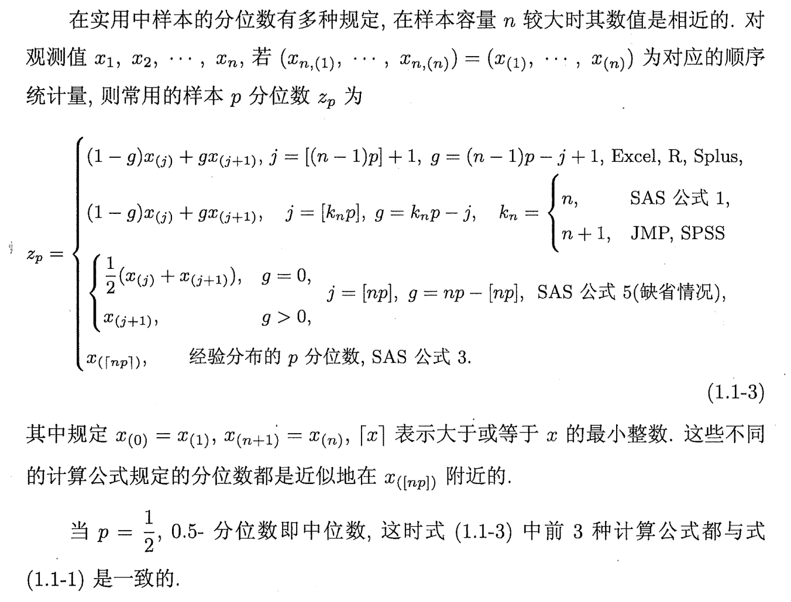

# FDU 数理统计 2. 参数点估计

本文参考以下教材: 

- 《数理统计讲义》(郑明, 陈子毅, 汪嘉冈) 第 $2$ 章

## 2.1 估计量求法

### 2.1.1 参数估计问题

统计推断，是要从样本 $X$ 出发，   
对样本 $X$ 的真实分布 $F_X(\theta_0)$ 或总体 $\xi$ 的真实分布 $F_{\xi}(\theta_0)$ 全部或部分地作出推断，  
即对分布的参数 $\theta_0$ 作推断.

参数估计的对象除了参数 $\theta$ 本身外，我们还可以考虑 $\theta$ 的函数 $g(\theta)$，称为**参数函数**.  
为估计参数函数 $g(\theta)$，我们使用样本的函数——统计量 $T(X)$  
用于估计参数函数 $g(\theta)$ 的统计量称为 $g(\theta)$ 的**估计量**，记为 $\hat g$.  

在统计推断中，我们希望在参数空间 $\Theta$ 中确定真实参数 $\theta_0$ 的函数值 $g(\theta_0)$ 或其取值范围.  
确定参数函数 $g(\theta_0)$ 取值的问题称为**参数点估计**;  
确定参数函数 $g(\theta_0)$ 取值范围的问题称为**参数区间估计**;  
二者统称为**参数估计问题**.

对于点估计问题，我们通常要考虑以下两个问题: 

- 如何构造 $g(\theta)$ 的估计量 $\hat g$ ?
- 对于同一 $g(\theta)$ 的不同估计量，如何评价它们的优劣?

### 2.1.2 直观法

我们可以根据待估计的参数 $\theta$ 或参数函数 $g(\theta)$ 的意义，直观地构造统计量.

- **频率估计概率: **    
  记事件 $A$ 发生的概率为 $p=\text{P}(A)$  
  我们对事件 $A$ 发生与否进行了 $n$ 次观测，得到样本 $X=(X_1,\dots,X_n)$  
  其中 $X_i = \begin{cases}
  1 & \text{if event $A$ occurs in the $i$-th observation}\\
  0 & \text{otherwise}
  \end{cases} \quad (i=1,\dots,n)$   
  我们使用频率 $\hat p = \frac1n \sum_{i=1}^nX_i$ 作为 $p$ 的估计量. 
- **样本均值估计总体均值: **  
  我们使用样本均值 $\hat \mu =\overline X = \frac1n \sum_{i=1}^nX_i$ 作为总体均值 $\mu=\mathbb{E}[X]$ 的估计量.
- **样本方差估计总体方差: **  
  我们使用未修偏的样本方差 $\hat \sigma^2 =S^2 = \frac1n \sum_{i=1}^n(X_i-\overline X)^2$ 作为总体方差 $\sigma^2 = \mathbb{E}[(X-\mu)^2]$ 的估计量.
- **样本矩估计总体矩: **  
  我们使用样本原点矩 $\hat \alpha_k = A_k = \frac1n \sum_{i=1}^nX_i^k$ 作为总体原点矩 $\alpha_k = \mathbb{E}[X^k]$ 的估计量.  
  我们使用样本中心矩 $\hat \mu_k = M_k = \frac1n \sum_{i=1}^n(X_i-\overline X)^k$ 作为总体中心矩 $\mu_k = \mathbb{E}[(X-\mu)^k]$ 的估计量.
- **经验分布函数估计总体分布函数: **  
  我们使用经验分布函数 $\hat F(x) = \hat F_n(x) = \frac1n\sum_{i=1}^n I_{[X_i,\infty)}(x)$ 作为总体分布函数 $F(x;\theta)$ 的估计量.  
  我7们有 $\begin{cases}
  \mathbb{E}[\hat F_n(x)] = F(x;\theta)\\
  \text{Cov}[\hat F_n(x),\hat F_n(y)] = \frac1n (F(\min\{x,y\}) - F(x) F(y)) \end{cases}$
- **样本分位数估计总体分位数: **  
  我们使用样本分位数 $\hat q_p = \inf\{x:\hat F_n(x)\geq p\} = X_{(\lceil np\rceil)}$   
  作为总体分位数 $q_p = \inf\{x:F(x;\theta)\geq p\}$ 的估计量.

### 2.1.3 矩方法

构造估计量的矩方法可简单地表达为如下的原则: 

- 用样本矩 (原点矩或中心矩) 估计相应阶的总体矩 (原点矩或中心矩)
- 用样本矩的函数估计总体矩的同一函数
- 尽量使用低阶矩

要使用矩方法构造总体分布的 $k$ 个实参数 $(\theta_1,\dots,\theta_k)=\theta$ 的估计量，  
必须将它们表示为前 $k$ 阶矩的函数.  
以原点矩 $\alpha_k$ 为例:     
$$
\begin{cases}
\alpha_1 = \int x \mathrm{d}F(x;\theta) = g_1(\theta_1,\dots,\theta_k)\\
\qquad\qquad\dots\\
\alpha_k = \int x \mathrm{d}F(x;\theta) = g_k(\theta_1,\dots,\theta_k)\end{cases}
$$
我们从方程组中反解出 $\theta_1,\dots,\theta_k$ 如下:   
$$
\begin{cases}
\theta_1 = h_1(\alpha_1,\dots,\alpha_k)\\
\qquad\dots\\
\theta_k = h_k(\alpha_1,\dots,\alpha_k)\end{cases}
$$
将总体原点矩 $\alpha_k$ 替换为样本原点矩为 $\hat \alpha_k$，则 $\theta_1,\dots,\theta_k$ 的估计量就取作:   
$$
\begin{cases}
\hat\theta_1 = h_1(\hat\alpha_1,\dots,\hat\alpha_k)\\
\qquad\dots\\
\hat\theta_k = h_k(\hat\alpha_1,\dots,\hat\alpha_k)\end{cases}
$$
对于参数函数 $g(\theta_1,\dots,\theta_k)$，其估计量取作 $\hat g = g(\hat \theta_1,\dots,\hat \theta_k)$ 

- 我们也可以用 $(\alpha_1,\mu_2,\dots,\mu_k)$ (其中 $\mu_k$ 代表 $k$ 阶总体中心矩) 来代替 $(\alpha_1,\alpha_2,\dots,\alpha_k)$   
  两种方法的困难程度取决于具体问题，但它们是等价的 (因为中心矩可表示为原点矩的函数).
- 若仅凭 $(\alpha_1,\dots,\alpha_k)$ 的方程组无法反解出 $(\theta_1,\dots,\theta_k)$，则也可以使用更高阶矩.
- 熟练后我们可以直接求解方程组:   
  $\begin{cases}
  \hat\alpha_1 =  g_1(\hat\theta_1,\dots,\hat\theta_k)\\
  \qquad\qquad\dots\\
  \hat\alpha_k =  g_k(\hat\theta_1,\dots,\hat\theta_k)\end{cases}$​  反解出 $\begin{cases}
  \hat\theta_1 = h_1(\hat\alpha_1,\dots,\hat\alpha_k)\\
  \qquad\dots\\
  \hat\theta_k = h_k(\hat\alpha_1,\dots,\hat\alpha_k)\end{cases}$ (相当于把三个步骤合在一起)

***

**一些具体的例子: **

- **(数理统计讲义 例 $2.1.7$)**  
  考虑指数分布族 $\{\exp(\lambda):\lambda>0\}$  
  我们知道 $\mathbb{E}[\exp(\lambda)] = \frac 1\lambda$   
  我们使用样本均值 $\overline X$ 估计总体均值 $\mathbb{E}[\exp(\lambda)] = \frac 1\lambda$，  
  因而容易想到用 $\hat \lambda = \frac{1}{\overline X}$ 作为 $\lambda$ 的估计量.

- **(数理统计讲义 例 $2.1.10$)**  
  对于二阶矩存在的二维分布总体，  
  我们定义 Pearson 相关系数为 $\rho =  
  \frac{\text{Cov}(X,Y)}{\sqrt{\text{Var}(X)\text{Var}(Y)}}$    
  基于样本 $((X_1,Y_1),\dots,(X_n,Y_n))$ 的矩估计量为:   
  $$
  \hat \rho = \frac{\frac1n \sum_{i=1}^n (X_i-\overline X)(Y_i-\overline Y)}{\sqrt{\frac1n  \sum_{i=1}^n(X_i-\overline X)^2 \cdot \frac1n \sum_{i=1}^n(Y_i-\overline Y)^2}} 
  = 
  \frac{\sum_{i=1}^n (X_i-\overline X)(Y_i-\overline Y)}{\sqrt{\sum_{i=1}^n(X_i-\overline X)^2 \sum_{i=1}^n(Y_i-\overline Y)^2}}
  $$
  
- **(数理统计讲义 例 $2.1.11$)**   
  考虑均匀分布总体 $\{\text{Uniform}(a,b):a<b\}$​   
  根据 $\begin{cases}
  \mathbb{E}[\text{Uniform}(a,b)] = \frac{a+b}{2}\\
  \text{Var}[\text{Uniform}(a,b)] = \frac{(b-a)^2}{12}\end{cases}$​ 可知:   
  从矩估计的角度来说，我们有 $\begin{cases}
  \overline X = \frac{\hat a+ \hat b}{2}\\
  S_n^2 = \frac{(\hat b- \hat a)^2}{12}\end{cases}$，反解得 $\begin{cases}
  \hat a = \overline X - \sqrt{3} S_n\\
  \hat b = \overline X + \sqrt{3} S_n\end{cases}$ 

  特殊地，对于均匀分布总体 $\{\text{Uniform}(0,\theta):\theta>0\}$   
  根据 $\mathbb{E}[\text{Uniform}(0,\theta)] = \frac{\theta}{2}$ 可知:   
  参数 $\theta$ 的矩估计为 $\hat \theta = 2\overline X$ 

- **(数理统计讲义 例 $2.1.12$)**     
  考虑 Gamma 分布总体 $\{\text{Gamma}(\alpha,\lambda):\alpha,\lambda>0\}$   
  根据 $\begin{cases}
  \mathbb{E}[\text{Gamma}(\alpha,\lambda)] = \frac{\alpha}{\lambda}\\
  \text{Var}[\text{Gamma}(\alpha,\lambda)] = \frac{\alpha}{\lambda^2}\end{cases}$ 可知:   
  从矩估计的角度来说，我们有 $\begin{cases}
  \overline X = \frac{\alpha}{\lambda}\\
  S_n^2 = \frac{\alpha}{\lambda^2}\end{cases}$，反解得 $\begin{cases}
  \hat \alpha = \frac{{\overline X}^2}{S_n^2}\\
  \hat \lambda = \frac{{\overline X}}{S_n^2}\end{cases}$  

- **(矩估计的局限性)**  
  我们容易看出，若总体可能分布族的矩不存在，则矩估计是无法应用的.  
  例如对于 Cauchy 分布族 $\{p(x;\mu,\sigma)= \frac{1}{\pi}\cdot \frac{\sigma}{(x-\mu)^2 +\sigma^2}\}$   
  就无法通过矩方法给出位置参数 $\mu$ 和尺度参数 $\sigma$ 的估计量.

### 2.1.4 最大似然估计法

**最大似然估计的基本思想: **  
根据观测的结果选择这样的参数值作为估计值，  
它使当前观测到的情况出现的可能性最大.  
我们需要比较不同参数值时当前观测到的情况出现的可能性大小.

设 $X=(X_1,\dots,X_n)$ 是取自分布族 $\{p(\theta):\theta\in\Theta\}$ 的简单随机样本.  
记样本 $X$ 的取值空间为 $\Omega$.  
给定样本 $X$ 的观测 $x\in \Omega$，  
我们定义**似然函数** (likelihood function) 为:     
$$
L(\theta|x) = \text{P}_\theta\{X=x\} = \prod_{i=1}^n p(x_i;\theta)\ \ \ (\theta\in\Theta)
$$
我们定义**对数似然函数** (log-likelihood function) 为:
$$
l(\theta|x) = \log\{L(\theta|x)\} = \sum_{i=1}^n\log(p(x_i;\theta))
$$
若存在 $\hat \theta = \hat \theta(X)$，使得对于任意 $x\in\Omega$ 都有  $\hat \theta(x) \in \arg \max_{\theta\in\Theta} L(\theta|x)$ 成立，  
则称 $\hat \theta = \hat \theta(X)$ 是 $\theta$ 的**最大似然估计量** (MLE, maximum likelihood estimator).  
由于 $\log$ 函数是严格单调的连续函数，  
故上述最大化条件也可替换为 $\hat \theta(x) \in \arg \max_{\theta\in\Theta} l(\theta|x)\ \ (\forall\ x\in\Omega)$

- **一阶必要条件: **  
  设 $\Theta\subseteq \mathbb R^k$，给定样本观测 $X=x\in\Omega$ 
  若 $L(\theta|x)$ 关于 $\theta$ 一阶连续可微，且 $\hat \theta(x) \in \arg \max_{\theta\in\Theta} L(\theta|x) = \arg \max_{\theta\in\Theta} l(\theta|x)$，  
  则我们一定有 $\nabla_\theta l(\hat\theta(x))^\mathrm{T}(\theta-\hat\theta(x)) \geq 0\ \ (\forall\ \theta\in\Theta)$ 成立.  
  特殊地，如果 $\Theta = \mathbb R^k$，那么一阶必要条件简化为**驻点条件** $\nabla_\theta l(\hat\theta(x))=0_k$
- **二阶必要条件: **  
  设 $\Theta = \mathbb R^k$ (这已经是特殊情况了)，给定样本观测 $X=x\in\Omega$     
  若 $L(\theta|x)$ 关于 $\theta$ 二阶连续可微，且 $\hat \theta(x) \in \arg \max_{\theta\in\Theta} L(\theta|x) = \arg \max_{\theta\in\Theta} l(\theta|x)$，  
  则我们一定有 $\begin{cases}
  \nabla_\theta l(\hat\theta(x))=0_k\\
  \nabla^2_\theta l(\hat \theta(x))\leq 0\end{cases}$ 成立.  
- **二阶充分条件: **    
  设 $\Theta = \mathbb R^k$ (这已经是特殊情况了)，给定样本观测 $X=x\in\Omega$     
  若 $L(\theta|x)$ 关于 $\theta$ 二阶连续可微，且 $\hat \theta(x)$ 满足 $\begin{cases}
  \nabla_\theta l(\hat\theta(x))=0_k\\
  \nabla^2_\theta l(\hat \theta(x))\leq 0\end{cases}$，  
  则我们有 $\hat \theta(x) \in \arg \max_{\theta\in\Theta} L(\theta|x) = \arg \max_{\theta\in\Theta} l(\theta|x)$ 成立.

**最大似然估计的下列特性是容易验证的: **  

- 设 $h:\Theta \mapsto \Phi$ 为双射，记 $\phi = h(\theta)$.  
  若 $\hat \theta$ 为 $\theta$ 的最大似然统计量 $(\text{MLE})$，则 $\hat \phi = h(\hat \theta)$ 也是 $\phi$ 的 $\text{MLE}$
  
- 有时我们给定的不是样本观测 $X=x\in\Omega$，而是统计量 $T(X)$ 的观测 $t\in \text{Range}(T)$   
  我们也可以定义似然函数 $L(\theta|t) = \text{P}_\theta\{T(X)=t\} = p_T(t;\theta)$，  
  并求出使得这一似然函数达到最大的参数值，作为参数的 $\text{MLE}$
  
- 若样本分布族 $\mathscr P_X=\{p_X(x;\theta):\theta\in\Theta\}$ 存在充分统计量 $T(X)$，  
  则参数 $\theta$ 的 $\text{MLE}$ (如果存在) 一定是充分统计量 $T(X)$ 的函数.

  这是根据**因子化定理**得到的:   
  给定充分统计量 $T(X)$，样本 $X$ 的概率分布或密度可表示为:   
  $$
  p_X(x;\theta)=g(T(x);\theta) h(x)\ \ (\forall\ \theta\in\Theta)
  $$
  
  此时对数似然函数可写为:   
  $$
  l(\theta|x) = \log\{L(\theta|x)\} = \log\{P_X(x;\theta)\} = \log(g(T(x);\theta)) + C\ \ (\forall\ \theta\in \Theta)
  $$
  其中 $C=\log(h(x))$ 是与 $\theta$ 无关的项.  
  所以 $\text{MLE}$ $\hat \theta = \arg \max_{\theta\in\Theta} l(\theta|x)$ 一定是充分统计量 $T(X)$ 的函数.
  
  因此当存在充分统计量 $T(X)$ 时，  
  无论是以样本 $X$ 构造似然函数，还是以 $T(X)$ 构造似然函数，  
  两者求得的最大似然估计是相同的.
  
  > **定理 $1.3.5$: (因子化定理, 数理统计讲义 命题 $1.5.6$)**  
  > 设样本的可能分布族为 $\mathscr F_X = \{f_X(x;\theta):\theta\in \Theta\}$   
  > 其中 $f_X(x;\theta)$ 为分布密度或离散的概率分布，  
  > 则统计量 $T=T(X)$ 为分布族 $\mathscr F_X$ 参数 $\theta$ 的**充分统计量**的**充要条件**是:   
  > 对于任意 $\theta\in \Theta$，$f_X(x;\theta)$ 都可分解为 $g(T(x);\theta)\cdot h(x)$，  
  > 其中 $h(x)$ 是与 $\theta$ 无关的**非负函数**.  

****

**(数理统计讲义 例 $2.1.18$)**    
设 $X=(X_1,\dots,X_n)$ 是取自 Bernoulli 分布族 $\{B(1,p):p\in(0,1)\}$ 的简单随机样本.  
其似然函数为 $L(\lambda|x) = \prod_{i=1}^n \text{P}\{B(1,p)=x_i\} = \prod_{i=1}^n p^{x_i}(1-p)^{1-x_i} = p^{\sum_{i=1}^nx_i}(1-p)^{n-\sum_{i=1}^nx_i}$   
其对数似然函数为:     
$$
\begin{align}
l(p|x)
&= \log(L(p|x))\\
&= \left(\sum_{i=1}^n x_i\right)\cdot \log(p) + \left(n-\sum_{i=1}^n x_i\right)\cdot \log(1-p)\end{align}
$$
注意到 $l(p|x)$ 关于 $p\in(0,1)$ 是凹函数，因此其驻点即为全局最大值点.   
解 $\frac{\partial}{\partial p}l(p|x) = \frac1p \sum_{i=1}^nx_i - \frac{1}{1-p}(n-\sum_{i=1}^nx_i)=0$ 得到 $\hat p(x) = \frac{1}{n}\sum_{i=1}^nx_i=\overline x$   
因此 $\hat p=\overline X$ 即为 $p$ 的最大似然估计量.

****

**(数理统计讲义 例 $2.1.19$)**  
设 $X=(X_1,\dots,X_n)$ 是取自 Poisson 分布族 $\{\text{Poisson}(\lambda):\lambda>0\}$ 的简单随机样本.  
其似然函数为 $L(\lambda|x) = \prod_{i=1}^n \text{P}\{\text{Poisson}(\lambda)=x_i\} = \prod_{i=1}^n e^{-\lambda}\frac{\lambda^{x_i}}{x_i!}$   
其对数似然函数为:   
$$
\begin{align}
l(\lambda|x)
&= \log(L(\lambda|x))\\
&= \sum_{i=1}^n\log(e^{-\lambda}\frac{\lambda^{x_i}}{x_i!})\\
&= -n\lambda + \left(\sum_{i=1}^nx_i\right)\log(\lambda) - \sum_{i=1}^n \log(x_i!)\end{align}
$$
注意到 $l(\lambda|x)$ 关于 $\lambda\in \mathbb R_{++}$ 是凹函数，因此其驻点即为全局最大值点.  
解 $\frac{\partial}{\partial \lambda}l(\lambda|x) = -n + (\sum_{i=1}^nx_i)\frac{1}{\lambda} = 0$ 得到 $\hat\lambda(x) = \frac{1}{n}\sum_{i=1}^nx_i=\overline x$   
因此 $\hat\lambda=\overline X$ 即为 $\lambda$ 的最大似然估计量.

****

**(数理统计讲义 例 2.1.20)**   
设 $X=(X_1,\dots,X_n)$ 是取自正态分布族 $\{N(\mu,\sigma^2):\mu\in\mathbb R,\sigma^2>0\}$ 的简单随机样本.  
其似然函数为:   
$$
\begin{align}
L(\mu,\sigma^2|x) 
&= \prod_{i=1}^n \text{P}\{N(\mu,\sigma^2)=x_i\} \\
&= \prod_{i=1}^n \frac{1}{\sqrt{2\pi\sigma^2}}\exp\left\{-\frac{(x_i-\mu)^2}{2\sigma^2}\right\}\\
&= (2\pi\sigma^2)^{-\frac{n}{2}} \exp \left\{-\frac{1}{2\sigma^2}\sum_{i=1}^n(x_i-\mu)^2\right\}\end{align}
$$
其对数似然函数为:   
$$
\begin{align}
l(\mu,\sigma^2|x) 
&= \log(L(\mu,\sigma^2|x))\\
&= -\frac{n}{2}\log(2\pi\sigma^2) -\frac{1}{2\sigma^2}\sum_{i=1}^n(x_i-\mu)^2\end{align}
$$
注意到 $l(\mu,\sigma^2|x) $ 关于 $\mu \in \mathbb R$ 和 $\sigma^2\in\mathbb R_{++}$ 是凹函数，因此其驻点即为全局最大值点.     
求解 $\begin{cases}
\frac{\partial }{\partial \mu}l(\mu,\sigma^2|x) = \frac{1}{2\sigma^2} \sum_{i=1}^n 2(x_i-\mu) = 0\\
\frac{\partial }{\partial \sigma^2}l(\mu,\sigma^2|x) = -\frac{n}{2\sigma^2} + \frac{1}{2\sigma^4}\sum_{i=1}^n(x_i-\mu)^2 = 0 \end{cases}$   
解得 $\begin{cases}
\hat \mu = \frac{1}{n}\sum_{i=1}^nx_i = \bar x\\
\hat \sigma^2 = \frac{1}{n}\sum_{i=1}^n(x_i-\hat\mu)^2 = \frac{1}{n}\sum_{i=1}^n(x_i-\bar x)^2\end{cases}$    
因此 $(\mu,\sigma^2)$ 的 $\text{MLE}$ 为 $(\hat \mu,\hat \sigma^2) = (\overline X,S_n^2)$   
其中 $S_n^2 = \frac{1}{n}\sum_{i=1}^n(X_i-\overline X)^2$ 为未修偏的样本方差.

由于 $(\mu,\sigma^2)\mapsto(\mu,\sigma)$ 是 $\mathbb R\times \mathbb R_+$ 上的双射，  
故 $(\mu,\sigma)$ 的 $(\text{MLE})$ 为 $(\hat \mu,\hat \sigma) = (\overline X,S_n)$    
其中 $S_n = \sqrt{\frac{1}{n}\sum_{i=1}^n(X_i-\overline X)^2}$ 为未修偏的样本标准差.

****

**(数理统计讲义 例 $2.1.21$)**   
设 $X=(X_1,\dots,X_n)$ 是取自均匀分布族 $\{\text{Uniform}(0,\theta):\theta>0\}$ 的简单随机样本.  
其似然函数为:   
$$
\begin{align}
L(\theta|x) 
&= \prod_{i=1}^n \text{P}\{\text{Uniform}(0,\theta)=x_i\}\\
&= \prod_{i=1}^n \frac{1}{\theta}I_{[0,\theta]}(x_i) \\
&= \frac{1}{\theta^n} I(0\leq \min_{i=1,\dots,n} x_i) I(\max_{i=1,\dots,n} x_i \leq \theta)
\end{align}
$$
容易直接验证 $\hat\theta (x) = \underset{i=1,\dots,n}\max x_i$ 是 $L(\theta|x)$ 唯一的最大值点，  
因此 $\theta$ 的 $\text{MLE}$ 为 $\hat \theta = X_{(n)}$

****

**(数理统计讲义 例 $2.1.22$)** (使用二阶偏导的解法见作业 $5$ 补充题)  
设 $((X_1,Y_1),\dots,(X_n,Y_n))$ 为  
取自二元正态分布总体 $\left\{N\left(\begin{bmatrix}
0\\
0\end{bmatrix},\sigma^2 \begin{bmatrix}
1 & \rho\\
\rho & 1\end{bmatrix}\right): \sigma^2>0,-1<\rho<1\right\}$ 的简单随机样本.

其似然函数为:   
$$
\begin{align}
L(\sigma^2,\rho|x,y)
&= \prod_{i=1}^n \frac{1}{2\pi \sqrt{(\sigma^2)^2 (1-\rho^2)}} 
\exp\left\{-\frac12 \begin{bmatrix}
x_i-0\\
y_i-0\end{bmatrix}^\mathrm{T}
\cdot \left(\sigma^2\begin{bmatrix}
1 & \rho\\
\rho & 1\end{bmatrix}\right)^{-1}\cdot
\begin{bmatrix}
x_i-0\\
y_i-0\end{bmatrix}\right\}\\
&= 
(2\pi)^{-n}(1-\rho^2)^{-n/2} (\sigma^2)^{-n}
\prod_{i=1}^n
\exp\left\{-\frac{1}{2\sigma^2(1-\rho^2)}
\begin{bmatrix}
x_i\\
y_i\end{bmatrix}^\mathrm{T}
\begin{bmatrix}
1 & -\rho\\
-\rho & 1\end{bmatrix}
\begin{bmatrix}
x_i\\
y_i\end{bmatrix}\right\}\\
&=
(2\pi)^{-n}(1-\rho^2)^{-n/2} (\sigma^2)^{-n}
\exp\left\{-\frac{1}{2\sigma^2(1-\rho^2)}
\left(\sum_{i=1}^n x_i^2 - 2\rho \sum_{i=1}^n x_iy_i + \sum_{i=1}^n y_i^2\right)\right\}\end{align}
$$
其对数似然函数为:
$$
\begin{align}
l(\sigma^2,\rho | x,y)
&= \log\{L(\sigma^2,\rho | x,y)\}\\
&= -n\log(2\pi) - \frac{n}2 \log(1-\rho^2) - n\log(\sigma^2)
-\frac{1}{2\sigma^2(1-\rho^2)} \left(\sum_{i=1}^n x_i^2 - 2\rho \sum_{i=1}^n x_iy_i + \sum_{i=1}^n y_i^2\right) \end{align}
$$
列出驻点条件的方程为:   
$$
\begin{cases}
\frac{\partial}{\partial \sigma^2} l(\sigma^2,\rho | x,y)
=
-\frac{n}{\sigma^2} + \frac{1}{2\sigma^4(1-\rho^2)}(\sum_{i=1}^n x_i^2 - 2\rho \sum_{i=1}^n x_iy_i + \sum_{i=1}^n y_i^2) = 0\\
\frac{\partial}{\partial \rho} l(\sigma^2,\rho | x,y)
= 
\frac{n\rho}{1-\rho^2} - \frac{\rho}{\sigma^2(1-\rho^2)^2}(\sum_{i=1}^n x_i^2 - 2\rho \sum_{i=1}^n x_iy_i + \sum_{i=1}^n y_i^2) + \frac{1}{\sigma^2(1-\rho^2)}(\sum_{i=1}^n x_iy_i) = 0\end{cases}
$$
解得 $\begin{cases}
\hat \sigma^2 = \frac{1}{2n(1-\hat \rho^2)}(\sum_{i=1}^n x_i^2 - 2 \hat \rho \sum_{i=1}^n x_iy_i + \sum_{i=1}^n y_i^2)\\
\hat \rho = \frac{2\sum_{i=1}^nx_iy_i}{\sum_{i=1}^nx_i^2 + \sum_{i=1}^n y_i^2}\end{cases}$

因为 $l(\sigma^2,\rho|x,y)$ 在 $\mathbb R_{++}\times (-1,1)$ 上连续，  
且边界点满足 $\begin{cases}
l(0_+,\rho) = -\infty
&(\forall\ \rho\in (-1,1))\\
l(+\infty,\rho) = -\infty
&(\forall\ \rho\in (-1,1))\\
l(\sigma^2,1_-) =  -\infty 
&(\forall\ \sigma^2>0)\\
l(\sigma^2,-1_+) =  -\infty 
&(\forall\ \sigma^2>0)\end{cases}$    
所以 $(\hat \sigma^2,\hat \rho)$ 是 $l(\sigma^2,\rho|x,y)$ 上的最大值点，  
说明 $(\sigma^2,\rho)$ 的 $\text{MLE}$ 为 $\begin{cases}
\hat \sigma^2 = \frac{1}{2n(1-\hat \rho^2)}(\sum_{i=1}^n X_i^2 - 2 \hat \rho \sum_{i=1}^n X_iY_i + \sum_{i=1}^n Y_i^2)\\
\hat \rho = \frac{2\sum_{i=1}^nX_iY_i}{\sum_{i=1}^nX_i^2 + \sum_{i=1}^n Y_i^2}\end{cases}$

****

**(数理统计讲义 例 $2.1.23$, 以统计量代替样本进行最大似然估计)**  
在产品的寿命测试中，若要获得全部寿命数据就必须待所有观测产品失效后才可结束试验.  
为了节省时间，我们可利用的只是寿命较短的几个产品的寿命数据和参加观测的产品总数.

设 $X_{(1)},\dots,X_{(r)}$ 为取自指数分布族 $\{\exp(\lambda):\lambda>0\}$   
样本量为 $n$ 的样本 $X=(X_1,\dots,X_n)$ 的前 $r\leq n$ 个次序统计量.  
记其取值为 $x_{(1)},\dots,x_{(r)}$.

> **定理 $1.3.4$: (次序统计量的联合概率密度函数, 数理统计讲义 命题 $1.4.7$)**  
> 设 $X_{(1)},X_{(2)},\dots,X_{(n)}$ 为对应于简单随机样本 $X = (X_1,X_2,\dots,X_n)$ 的次序统计量，  
> (我们可以看作存在映射关系 $T(X_1,X_2,\dots,X_n) = (X_{(1)},X_{(2)},\dots,X_{(n)})$) 
> 总体分布具有分布函数 $F$ 和概率密度函数 $f$.  
> 则对于任意 $\begin{cases}
> 1\leq r\leq n\\
> 1\leq j_1 <j_2<\dotsm< j_r\leq n\end{cases}$  
> $(X_{(j_1)},X_{(j_2)},\dots,X_{(j_r)})$ 具有联合概率密度函数:
> $$
> \begin{align} &f_{X_{(j_1)},X_{(j_2)},\dots,X_{(j_r)}}(y_{j_1},y_{j_2},\dots,y_{j_r}) \\ &= \frac{n!}{(j_1-1)!(j_2-j_1-1)!\dots (j_r-j_{r-1}-1)!(n-j_r)!}\\ &\quad\times[F(y_{j_1})]^{j_1-1}[F(y_{j_2})-F(y_{j_1})]^{j_2-j_1-1}\dotsm [F(y_{j_r})-F(y_{j_{r-1}})]^{j_r-j_{r-1}-1}[1-F(y_{j_r})]^{n-j_r}\\ &\quad\times f(y_{j_1})f(y_{j_2})\dotsm f(y_{j_r})\\ &\quad\times I(y_{j_1}<y_{j_2}<\dotsm < y_{j_r})\end{align}
> $$
> 

我们知道基于 $x_{(1)},\dots,x_{(r)}$ 的似然函数为:   
$$
\begin{align}
L(\lambda|x_{(1)},\dots,x_{(r)})
&= 
f_{X_{(1)},\dots,X_{(r)}}(x_{(1)},\dots,x_{(r)})\\
&=
\frac{n!}{(n-r)!}
[1-F(x_{(r)})]^{n-r} \prod_{i=1}^r f(x_{(i)})\\
&=
\frac{n!}{(n-r)!}
(\exp(-\lambda x_{(r)}))^{n-r} \prod_{i=1}^r
\lambda e^{-\lambda x_{(i)}}\\
&=
\frac{n!}{(n-r)!}
\lambda^r \exp\left\{-\lambda \sum_{i=1}^r x_{(i)} - \lambda (n-r) x_{(r)}\right\}\end{align}
$$
其对数似然函数为:   
$$
l(\lambda|x_{(1)},\dots,x_{(r)})
=\log\left(\frac{n!}{(n-r)!}\right) + r\log(\lambda) -
\lambda \sum_{i=1}^rx_{(i)} -
\lambda(n-r)x_{(r)}
$$

注意到 $l(\lambda|x_{(1)},\dots,x_{(r)})$ 关于 $\lambda\in\mathbb R_{++}$ 是凹函数，因此其驻点即为全局最大值点.   
解 $\frac{\mathrm{d}}{\mathrm{d}\lambda}l(\lambda|x_{(1)},\dots,x_{(r)}) =
\frac{r}{\lambda} - \sum_{i=1}^r x_{(i)}
-(n-r)x_{(r)}=0$   
得到 $\hat\lambda(x_{(1)},\dots,x_{(r)})=\frac{r}{\sum_{i=1}^r x_{(i)}
+(n-r)x_{(r)}}$   
因此 $\lambda$ 的 $\text{MLE}$ 为 $\hat \lambda = \frac{r}{\sum_{i=1}^r X_{(i)}
+(n-r)X_{(r)}}$ 

****

**(数理统计讲义 例 $2.1.24$, 多项分布概率的最大似然估计)**    
设 $X=(X_1,\dots,X_n)\in \mathbb R^{k\times n}$ 是  
取自 $k$ 类别分布族 $\{M_k(1,\pi):1_k^\mathrm{T}\pi = 1,\pi\succeq 0_k\}$ 的简单随机样本.   
其似然函数为:   
$$
\begin{align}
L(\pi|X) 
&= \prod_{i=1}^n \text{P}\{M_k(1,\pi) = X_i\}\\
&= \prod_{i=1}^n \pi_1^{X_{i1}}\dots\pi_k^{X_{ik}}\\
&= \pi_1^{\sum_{i=1}^n X_{i1}}\dots \pi_k^{\sum_{i=1}^n X_{ik}}\end{align}
$$
其对数似然函数为:   
$$
\begin{align}
l(\pi|X) &= \log(L(\pi|X))\\
&= \sum_{i=1}^n X_{i1} \log(\pi_1) + \dots + \sum_{i=1}^n X_{ik} \log(\pi_k)\\
&= \sum_{j=1}^k \sum_{i=1}^n X_{ij} \log(\pi_j)\\
&= (X1_n)^\mathrm{T}\log(\pi)\end{align}
$$
注意到 $l(\pi|X)$ 是关于 $\pi\in \left\{\pi\in\mathbb R^k:\begin{cases}
\pi\succeq 0_k\\
1_k^\mathrm{T}\pi = 1\end{cases}\right\}$ (概率单纯形是凸集) 的凹函数，  
(对应的最大化问题是一个凸优化问题)  
**因此其 KKT 点即为全局最大值点.**   
考虑 (凸) 优化问题:   
$$
\begin{align}
\max\ \ &l(\pi|X) = (X1_n)^\mathrm{T}\log(\pi)\\
\text{s.t.}\quad&\pi\succeq 0_k\\
&1_k^\mathrm{T}\pi = 1\end{align}
$$
定义其 Lagrange 函数为:   
$$
La(\pi,\lambda,\nu) = (X1_n)^\mathrm{T}\log(\pi) + \lambda^\mathrm{T}(\pi-0_k) + \nu(1-1_k^\mathrm{T}\pi)
$$
求解 KKT 系统 $\begin{cases}
\pi\succeq 0_k\\
1_k^\mathrm{T}\pi = 1\\
\nabla_\pi La(\pi,\lambda,\nu) = \pi^{-1}\circ (X1_n) + \lambda - \nu 1_k = 0_k\\
\lambda\succeq 0_k\\
\lambda_i\pi_i = 0\ \ (\forall\ i=1,\dots,k)\end{cases}$  
(其中 $\circ$ 代表逐元素乘积，即 Hadamard 乘积)  
注意到系统的一个解为 $\begin{cases}
\lambda = 0_k\\
\nu = 1_k^\mathrm{T}(X_n1_n)=n\\
\pi = (\lambda-\nu1_k)^{-1}\circ (X1_n) = \frac{1}{n}(X1_n)\end{cases}$

因此 $\hat\pi(X) = \frac1n (X1_n)$，即 $\hat\pi_j = \frac1n\sum_{i=1}^nX_{ij}\ \ (j=1,\dots,k)$ 为 $X$ 的第 $j$ 行和的 $\frac1n$.

****

**(数理统计讲义 例 $2.1.25$, 待补充)**

****

许多常用的分布 (例如正态分布、Bernoulli 分布、Poisson 分布)   
其参数的最大似然估计量和矩法估计量是一致的.   
但也有许多情况 (例如均匀分布)，  
其参数的最大似然估计量和矩法估计量并不相同，  
而进一步的比较往往是最大似然估计量有更多优良的特性. 

对于许多估计问题，最大似然解可能并没有显式表示.  
此时常用的处理方法是用各种优化算法对最大似然估计量的值进行数值求解.

**(补充: 有关指数型分布族的结论, 期末不考)**  
设 $X= (X_1,\dots,X_n)$ 为  
取自指数型分布族 $\{p(x;\theta) = C(\theta)\exp[\sum_{i=1}^kQ_i(\theta)T_i(x)]h(x):\theta \in \Theta\}$ 的简单随机样本.  
其似然函数为:   
$$
\begin{align}
L(\theta|x)
&= 
\prod_{j=1}^n C(\theta)\exp\left\{\sum_{i=1}^kQ_i(\theta)T_i(x_j)\right\}h(x_j)\\
&=
(C(\theta))^n \exp\left\{
\sum_{i=1}^k Q_i(\theta) \left(\sum_{j=1}^n T_i(x_j)\right)\right\}
\prod_{j=1}^n h(x_j)\\
&=  (C(\theta))^n \exp\left\{\sum_{i=1}^k Q_i(\theta) \widetilde T_i(x) \right\}\tilde h(x)\end{align}
$$
其中 $\begin{cases}
\widetilde T_i(x) = \underset{j=1}{\overset{n}\sum} T_i(x_j) &(i=1,\dots,k)\\
\tilde h(x) = \sum_{j=1}^n h(x_j) \end{cases}$  
定义 $Q = \{(Q_1(\theta),\dots,Q_k(\theta)):\theta\in\Theta\}$ 

其对数似然函数为:   
$$
\begin{align}
l(\theta|x)
&= \log(L(\theta|x))\\
&= n\log(C(\theta)) + \sum_{i=1}^k Q_i(\theta) \widetilde T_i(x)  + \log{(\tilde h(x))}\end{align}
$$
**(待补充)**

****

**(数理统计讲义 例 $2.1.27$)**  
设 $X=(X_1,\dots,X_n)$ 为取自 Cauchy 分布族 $\{p(x;\mu):\frac{1}{\pi}\frac{1}{1+(x-\mu)^2}:\mu\in \mathbb R\}$ 的简单随机样本.  
矩估计对这一分布族并不适用.  

其似然函数为:   
$$
\begin{align}
L(\mu|x)
&= \prod_{i=1}^n \frac{1}{\pi}\frac{1}{1+(x_i-\mu)^2}\\
&= \left(\frac1\pi\right)^n \prod_{i=1}^n\frac{1}{1+(x_i-\mu)^2}\end{align}
$$
其对数似然函数为: (但是我们无法一眼判断出它是不是凹函数，需要求二阶导，省略)  
$$
\begin{align}
l(\mu|x) &= \log(L(\mu|x))\\
&= -n\log(\pi) - \sum_{i=1}^n \log(1+(x_i-\mu)^2)\end{align}
$$

列出方程 $\frac{\mathrm{d}}{\mathrm{d}\mu}l(\mu|x)= \sum_{i=1}^n\frac{2(x_i-\mu)}{1+(x_i-\mu)^2}=0$   
根据 $\begin{cases}
l(-\infty|x)<0\\
l(+\infty|x)>0\end{cases}$ 可知方程一定有解，  
但这个解无解析形式，因而只能通过数值计算求解.

### 2.1.5 估计量的比较

对于参数函数 $g(\theta)$ 的估计量 $\hat g$，它必须要接近 $g(\theta)$  
因为 $\hat g$ 是一个随机变量，   
所以一个理想的估计是对于参数 $\theta\in\Theta$ 可能出现的所有情况，  
它的分布都应该集中在 $g(\theta)$ 附近.   

若 $\hat g^\star$ 比其他估计量 $\hat g$ 好，它应满足:   
任意给定 $\theta\in\Theta$   
对于任意 $a>0$ 都有 $\text{P}_\theta\{|\hat g^\star - g(\theta)|\leq a\}\geq 
\text{P}_\theta\{|\hat g-g(\theta)|\leq a\}$ 成立.  

上述命题不容易达到和验证，所以我们改用方便验证的**二阶矩要求**:   
对于任意 $\theta\in\Theta$ 都有 $\mathbb{E}_\theta\{|\hat g^\star - g(\theta)|^2\}\leq 
\mathbb{E}_\theta\{|\hat g-g(\theta)|^2\}$ 成立.  
其中 $\mathbb{E}_\theta[\cdot]$ 代表关于分布 $\text{P}_\theta$ 的期望运算.  

- 我们通常记 $\mathbb{E}_\theta\{|\hat g-g(\theta)|^2\}$ 为 $\text{MSE}_\theta(\hat g,g(\theta))$，简记为 $\text{MSE}_\theta(\hat g)$  
  我们有:   
  $$
  \begin{align}
  \text{MSE}_\theta(\hat g)
  &= \mathbb{E}_\theta\{|\hat g-g(\theta)|^2\}\\
  &= \mathbb{E}_\theta \{[\hat g - \mathbb{E}_\theta[\hat g] + \mathbb{E}_\theta[\hat g]-g(\theta)]^2\}\\
  &= \mathbb{E}_\theta\{[\hat g - \mathbb{E}_\theta[\hat g]]^2\} + 2\mathbb{E}_\theta[\hat g - \mathbb{E}_\theta [\hat g]]\cdot (\mathbb{E}_\theta[\hat g]-g(\theta)) 
  +[\mathbb{E}_\theta[\hat g]-g(\theta)]^2\\
  &=
  \text{Var}_\theta(\hat g) + 2\cdot 0\cdot \text{bias}_\theta(\hat g) + (\text{bias}_\theta(\hat g))^2\\
  &=
  \text{Var}_\theta(\hat g) + (\text{bias}_\theta(\hat g))^2\end{align}
  $$
  若 $\hat g $ 是 $\hat g(\theta)$ 的无偏估计量，即 $\text{bias}_\theta(\hat g)= \mathbb{E}_\theta[\hat g]-g(\theta)=0$，  
  则我们有 $\text{MSE}_\theta(\hat g) = \text{Var}_\theta(\hat g)$ 成立.

通常还附加**一阶的无偏性要求**:   
对于任意 $\theta\in\Theta$ 都有 $\mathbb{E}_\theta[\hat g] = g(\theta)$ 成立.   
对于满足无偏性的 $\hat g^\star$ 和 $\hat g$ 来说，$\hat g^\star$ 比 $\hat g$ **有效** (effective) 的**二阶矩要求**即为:     
对于任意 $\theta\in\Theta$ 都有 $\text{Var}_\theta(\hat g^\star)\leq 
\text{Var}_\theta (\hat g)$ 成立.  
我们可以定义 $\hat g$ 关于 $\hat g^\star$ 的**相对效率** (relative efficiency) 为 $e(\hat g, \hat g^\star) = \frac{\text{Var}_\theta(\hat g^\star)}{\text{Var}_\theta(\hat g)}$   
很多情况下，估计量的方差近似地有 $\begin{cases}
\text{Var}_\theta(\hat g) = \frac{c(\theta)}{n}\\
\text{Var}_\theta(\hat g^\star) = \frac{c^\star(\theta)}{n}\end{cases}$ 成立，  
此时有 $e(\hat g, \hat g^\star) = \frac{\text{Var}_\theta(\hat g^\star)}{\text{Var}_\theta(\hat g)} = \frac{c^\star(\theta)}{c(\theta)}$   
为达到相同的方差，不同估计量需要观测的样本量不同，  
令 $\frac{c(\theta)}{n}=\frac{c^\star(\theta)}{n^\star}$ 我们有 $\frac{n^\star}{n}=\frac{c^\star(\theta)}{c(\theta)} = e(\hat g,\hat g^\star)$ 成立.  
因此相对效率就是采用不同估计想达到同样效果 (方差) 所需要的样本量之反比.    
相对效率越低，达到同样效果 (方差) 所需要的样本量的差距越大.

****

满足上述无偏性要求的 $\hat g$ 称为参数函数 $g(\theta)$ 的**无偏估计量** (unbiased estimator)   
否则，我们称 $\hat g$ 是**有偏的** (biased)，  
并将 $\text{bias}_{\theta}(\hat g) = \mathbb{E}_\theta[\hat g] - g(\theta)$ 称为估计量 $\hat g$ 的**偏差** (bias).

无偏性是对估计量的合理限制，  
因为无偏性保证了在多次使用同一估计方法进行估计时，  
其估计量的平均应该与真值十分接近，没有系统的偏差.

****

**(样本均值的无偏性, 数理统计讲义 例 $2.1.32$)**  
对于简单随机样本 $X=(X_1,\dots,X_n)$  
我们有 $\mathbb{E}[\overline X]=\mathbb{E}[\frac1n\sum_{i=1}^nX_i] =
\frac1n \sum_{i=1}^n \mathbb{E}[X_i] = \frac1n \cdot n\mu = \mu$   
因此样本均值 $\overline X$ 是总体均值 $\mu$ 的无偏估计量.

显而易见，只要 $1_n^\mathrm{T}c = 1$，  
样本的线性函数 $c^\mathrm{T}X = \sum_{i=1}^nc_i X_i$ 就是总体均值 $\mu$ 的无偏估计量.  
样本均值 $\overline X$ 即是 $c=\frac1n 1_n$ 时的特例.   
这类线性无偏估计的方差为:   
$$
\text{Var}[\sum_{i=1}^nc_i X_i] = \sum_{i=1}^nc_i \text{Var}(X_i) = \sum_{i=1}^nc_i \sigma^2
\geq \frac{\sigma^2}{n} = \text{Var}[\overline X]
$$

因此样本均值 $\overline X$ 是总体均值 $\mu$ 的所有线性无偏估计量中方差最小的.

****

**(样本方差的修偏, 数理统计讲义 例 2.1.33)**  
已修偏的样本方差 $S_n^2 = \frac{1}{n-1} \sum_{i=1}^n (X_i-\overline X)^2$，其期望为:   
$$
\begin{align}
\mathbb{E}[S_n^2] 
&= \frac{1}{n-1} \mathbb{E}[\sum_{i=1}^n (X_i-\overline X)^2]\\
&= \frac1{n-1}
\mathbb{E}[\sum_{i=1}^n (X_i-\mu)^2 - n(\mu-\overline X)^2]\\
&= \frac1{n-1}
\{\sum_{i=1}^n\text{Var}[X_i] - n\text{Var}[\overline X]\}\\
&= \frac1{n-1} \{n\sigma^2 - n\cdot \frac{\sigma^2}{n}\}\\
&= \sigma^2\end{align}
$$
因此已修偏的样本方差 $S_n^2$ 就是总体方差 $\sigma^2$ 的无偏估计量.  

然而 $S_n$ 不是 $\sigma$ 的无偏估计量.  
考虑正态总体，我们有 $S_n^2 \sim \frac{\chi^2_{n-1}}{n-1}\sigma^2 = \frac{\text{Gamma}(\frac{n-1}{2},\frac12)}{n-1}\sigma^2$ 成立.  
因此 $S_n\sim \frac{\sigma}{\sqrt{n-1}}\sqrt{\text{Gamma}(\frac{n-1}{2},\frac12)}$ ，我们有:       
$$
\begin{align}
\mathbb{E}[S_n]
&= \mathbb{E}\left[\frac{\sigma}{\sqrt{n-1}}\sqrt{\text{Gamma}(\frac{n-1}2,\frac12)}\right]\\
&= \frac{\sigma}{\sqrt{n-1}} \int_0^\infty \sqrt t 
\cdot\text{P}\{\text{Gamma}(\frac{n-1}{2},\frac12)=t\}\mathrm{d}t\\
&= \frac{\sigma}{\sqrt{n-1}} 
\int_0^\infty \sqrt t \frac{(\frac12)^{\frac{n-1}{2}}}{\Gamma(\frac{n-1}{2})}t^{\frac{n-1}{2}-1}e^{-\frac{1}2 t} \mathrm{d}t\\
&= 
\sqrt{\frac{2}{n-1}}\frac{1}{\Gamma(\frac{n-1}{2})}\sigma \cdot 
\int_0^\infty t^{\frac{n}{2}-1} e^{-\frac12t} (\frac12)^{\frac{n}2} \mathrm{d}t\\
&= 
\sqrt{\frac{2}{n-1}}\frac{1}{\Gamma(\frac{n-1}{2})} \sigma \cdot 
\int_0^\infty u^{\frac{n}{2}-1} e^{-u} \mathrm{d}u\quad(u\overset{\Delta}= \frac12 t)\\
&= \sqrt{\frac{2}{n-1}}\frac{1}{\Gamma(\frac{n-1}{2})}\sigma \cdot  
\Gamma(\frac{n}{2})\\
&= \sqrt{\frac{2}{n-1}}\frac{\Gamma(\frac{n}{2})}{\Gamma(\frac{n-1}{2})}\sigma\\
&= k_n \sigma\qquad (k_n := \sqrt{\frac{2}{n-1}}\frac{\Gamma(\frac{n}{2})}{\Gamma(\frac{n-1}{2})})\end{align}
$$
因此 $S_n$ 不是 $\sigma$ 的无偏估计量，$\frac{1}{k_n}S_n$ 才是 $\sigma$ 的无偏估计量.

****

**(数理统计讲义 例 $2.1.34$)**   
设 $X=(X_1,\dots,X_n)$ 是取自均匀分布族 $\{\text{Uniform}(0,\theta):\theta>0\}$ 的简单随机样本.  

- 根据 $\mathbb{E}[\text{Uniform}(0,\theta)] = \frac{\theta}{2}$ 可知矩估计量为 $\hat \theta_1 = 2\overline X$，容易验证它是无偏的.  

- 根据 $2.1.4$ 节的 **(数理统计讲义 例 $2.1.21$)** 可知最大似然估计量为 $\hat \theta_2 = X_{(n)}$   
  由 $\mathbb{E}_\theta[X_{(n)}]=\int_0^\theta x \cdot f_{X_{(n)}}(x)\mathrm{d}x =   
  \int_0^\theta x\cdot \frac{nx^{n-1}}{\theta^n}\mathrm{d}x = \frac{n}{n+1}\theta$ 可知 $\hat \theta_2 = X_{(n)}$ 不是无偏的.
  
- 我们在 $\hat \theta_2 = X_{(n)}$ 的基础上构造 $\hat \theta_3 = \frac{n+1}{n}X_{(n)}$，它是 $\theta$ 的无偏估计量.
  - $\text{Var}_\theta(\hat \theta_1) = \text{Var}_\theta(2\overline X) = 4\cdot \frac1n\text{Var}_\theta[\xi]= 4\cdot\frac{\theta^2}{12n} = \frac{\theta^2}{3n}$ 
  
  - 而对于 $\hat \theta_3 = \frac{n+1}{n}X_{(n)}$ 我们有:   
    $$
    \begin{align}
    \text{Var}_\theta[\hat \theta_3]
    &= \mathbb{E}_\theta [(\frac{n+1}{n}X_{(n)})^2] -
    (\mathbb{E}_\theta[\hat \theta_3])^2\\
    &= 
    (\frac{n+1}{n})^2 \int_0^\theta x^2\cdot \frac{nx^{n-1}}{\theta^n}\mathrm{d}x -\theta^2\\
    &=
    \frac{(n+1)^2}{n(n+2)}\theta^2 -\theta^2\\
    &=
    \frac{\theta^2}{n(n+2)}\\
    &\leq \frac{\theta^2}{3n}\\
    &= \text{Var}_\theta[\hat \theta_1]\end{align}
    $$
    
    因此 $\hat \theta_3$ 比 $\hat \theta_1$ 更有效.
  
- 考虑形如 $cX_{(n)}$ 的线性估计量，  
  $$
  \begin{align}
  \mathbb{E}_{\theta}[(cX_{(n)}-\theta)^2]
  &= c^2 \mathbb{E}[(X_{(n)})^2] - 2c\theta \mathbb{E}_\theta [X_{(n)}] + \theta^2\\
  &= c^2 \int_0^\theta x^2 \cdot \frac{nx^{n-1}}{\theta^n}\mathrm{d}x
  -2c\theta \int_{0}^\infty x\cdot \frac{nx^{n-1}}{\theta^n}\mathrm{d}x 
  +\theta^2\\
  &= c^2 \frac{n}{n+2} \theta^2 - 2c\theta \frac{n}{n+1}\theta + \theta^2\\
  &= \frac{n(n+1)c^2 -2n(n+2)c + (n+1)(n+2)}{(n+1)(n+2)}\theta^2\end{align}
  $$
  (分子上的二次函数) 关于 $c\in \mathbb R$ 取全局最小值，得到 $c_\star = \frac{n+2}{n+1}$  
  因此我们可以构造 $\hat \theta_4 = \frac{n+2}{n+1}X_{(n)}$   
  代入可得 $\mathbb{E}_\theta[(\hat \theta_4 - \theta)^2] = \frac{\theta^2}{(n+1)^2}\leq \frac{\theta^2}{n(n+2)} = \mathbb{E}_\theta[(\hat \theta_3 - \theta)^2]$   
  因此尽管 $\hat \theta_4$ 是有偏的，但它的均方误差是形如 $cX_{(n)}$ 的线性估计量中最小的.

## 2.2 一致最小方差无偏估计

### 2.2.1 无偏估计量

在 $2.1.5$ 节中，我们给出了二阶矩要求:   
若 $\hat g^\star$ 比其他估计量 $\hat g$ 好，它应满足:   
对于任意 $\theta\in\Theta$ 都有 $\mathbb{E}_\theta\{|\hat g^\star - g(\theta)|^2\}\leq 
\mathbb{E}_\theta\{|\hat g-g(\theta)|^2\}$ 成立.  
其中 $\mathbb{E}_\theta[\cdot]$ 代表关于分布 $\text{P}_\theta$ 的期望运算.  

因此 "最优" 的估计量为 $\hat g^\star
=\arg \min_{\hat g\in \mathcal V} \mathbb{E}_\theta[|\hat g-g(\theta)|^2]\ \ (\theta\in \Theta)$   
其中 $\mathcal V$ 是**存在二阶矩的估计量全体**.  
然而这样的最优估计一般是不存在的，  
因为对于每个特定的 $\theta_0$，取平凡估计量 $\hat g =g(\theta_0)$ 可使 $\mathbb{E}_{\theta_0}[|\hat g-g(\theta_0)|^2] = 0$    
要让 $\hat g^\star$ 在每一个 $\theta_0$ 上做的和平凡估计量 $\hat g =g(\theta_0)$ 一样好是不可能的，    
因此我们必须对估计量集合 $\mathcal V$ 加以限定，以排除平凡估计量的存在.

最常用的限制是**无偏性**.  
我们现在取 $\mathcal V$ 为**存在二阶矩的无偏估计量全体** $\mathcal U_g$.  
此时最优的估计量 $\hat g^\star
=\arg\min_{\hat g\in \mathcal U_g} \mathbb{E}_\theta[|\hat g-g(\theta)|^2]=\arg\min_{\hat g\in \mathcal U_g} \text{Var}_\theta(\hat g)\ \ (\forall\ \theta\in \Theta)$ 通常是存在的.

****

给定参数函数 $g(\theta)$   
若它存在无偏估计量，则我们称它是**可估计的** (estimable).

**(并不是所有参数函数都是可估计的, 数理统计讲义 例 $2.2.3$)**    
从 $B(n,p)$ 中取得容量为 $1$ 的样本 $X$，其中 $n$ 已知而 $p$ 为未知参数.  
考虑参数函数 $g(p)=\frac1p$   
对于任何一个基于 $X$ 的统计量 $T(X)$   
其均值 $\mathbb{E}_p[T(X)] = \sum_{i=1}^n T(i)p^i (1-p)^{n-i}\ \ (0<p<1)$   
上式右端是 $p$ 的 $n$ 次多项式，必然是有界的，不可能在 $p\in (0,1)$ 上恒等于无界函数 $\frac1p$   
因此 $g(p)=\frac1p$ 的无偏估计量不存在，从而是不可估计的.

**(数理统计讲义 例 $2.2.4$)**  
设 $X=(X_1,\dots,X_n)$ 为取自均匀分布族 $\{\text{Uniform}(0,\theta):\theta>0\}$ 的简单随机样本.  
考虑参数函数 $g(\theta) = \frac1\theta$   
通常情况下，$X_{(n)} = \underset{i=1,\dots,n}\max X_i$ 是一个很好的出发点，因为它是 $\theta$ 的**充分完备估计量**.  
仅考虑基于 $X_{(n)}$ 的估计量 $T(X_{(n)})$，其均值为:
$$
\mathbb{E}_\theta [T(X_{(n)})] = \int_0^\theta T(x)\frac{n x^{n-1}}{\theta^n}\mathrm{d}x
$$
要使 $T(X_{(n)})$ 无偏，则必须有 $\int_0^\theta T(x)\frac{n x^{n-1}}{\theta^n}\mathrm{d}x=\frac1\theta\ \ (\forall\ \theta>0)$   
即要有 $n\int_0^\theta T(x)x^{n-1}\mathrm{d}x=\theta^{n-1}\ \ (\forall\ \theta>0)$   
两端对 $\theta$ 求导可得 $nT(\theta)\theta^{n-1} = (n-1)\theta^{n-2}$   
解得 $T(\theta) = \frac{n-1}{n\theta}$，即得到估计量 $T(X_{(n)})=\frac{n-1}{nX_{(n)}}$   

> 考虑到 $\hat \theta = \frac{n+1}{n}X_{(n)}$ 是 $\theta$ 的无偏估计量，为什么这里不是 $T(X_{(n)})=\frac{n-1}{(n+1)X_{(n)}}$?  
> 答案在于:
> $$
> \mathbb{E}\left[\frac{1}{\hat \theta}\right] \neq \frac{1}{\mathbb{E}[\hat \theta]} = \frac{1}{\theta}
> $$

- 当 $n=1$ 时，上述 $T(X_{(n)})\equiv 0$，因而 $g(\theta) = \frac1\theta$ 是不可估计的.
- 当 $n\geq 2$ 时，$T(X_{(n)})=\frac{n-1}{nX_{(n)}}$ 即为 $g(\theta) = \frac1\theta$ 的无偏估计量.

****

**定义: **  
给定参数函数 $g(\theta)$，记其无偏估计量的全体为 $\mathcal U_g$   
若 $\hat g^\star$ 是参数函数 $g(\theta)$ 的无偏估计量，且对于任意 $\hat g$ 都有 $\text{Var}_\theta [\hat g^\star]\leq \text{Var}_\theta [\hat g]\ \ (\forall\ \theta\in\Theta)$ 成立，  
也就是说，有 $\hat g^\star = \arg \min_{\hat g \in \mathcal U_g} \text{Var}_\theta[\hat g]\ \ (\forall\ \theta\in \Theta)$ 成立，  
则我们称 $\hat g^\star$ 是 $g(\theta)$ 的**一致最小方差无偏估计量** ($\text{UMVUE}$, Uniform Minimum Variance Unbiased Estimator).

值得注意的是， $g(\theta)$ 的**一致最小方差无偏估计量**若存在则必定唯一.  
也就是说，若 $\hat g^\star_{(1)}$ 和 $\hat g^\star_{(2)}$ 同为 $g(\theta)$ 的一致最小方差无偏估计量，  
则一定有 $\text{P}_\theta \{\hat g^\star_{(1)}=\hat g^\star_{(2)}\} = 1\ \ (\forall\ \theta\in\Theta)$ 成立.

### 2.2.2 Cramér-Rao 不等式 (无偏估计量方差的下界)

考虑分布族 $\mathscr P =\{p(x;\theta):\theta\in\Theta\}$   
假设其满足**光滑性条件**: 

- 参数空间 $\Theta \subseteq \mathbb R$ 是开集;

- 分布的支撑集 $\{x:p(x;\theta)>0\}$ 与 $\theta$ 无关;

- $p(x;\theta)$ 关于 $\theta$ 可求偏导，且与积分 (求和) 可换序，  
  即有 $\begin{cases}
  \frac{\partial}{\partial\theta}\int p(x;\theta) \mathrm{d}x = \int 
  \frac{\partial}{\partial\theta} p(x;\theta)\mathrm{d}x &\text{Continuous case}\\\frac{\partial}{\partial\theta}\sum_x p(x;\theta) = \sum_x
  \frac{\partial}{\partial\theta} p(x;\theta) &\text{Discrete case}\end{cases}$ 成立.

- $\text{Var}_\theta [\frac{\partial}{\partial \theta}\log(p(x;\theta))] =\mathbb{E}_\theta [(\frac{\partial}{\partial \theta}\log(p(x;\theta)))^2]$ 存在且有限，  
  即有 $0<\mathbb{E}_\theta [(\frac{\partial}{\partial \theta}\log(p(x;\theta)))^2] <\infty\ \ (\forall\ \theta\in \Theta)$ 成立.  

  > 值得注意的是，对于任意 $\theta\in \Theta$ 都有:   
  > $\begin{align}
  > \mathbb{E}_\theta \left[\frac{\partial}{\partial \theta}\log(p(x;\theta))\right]
  > &= \int \frac{1}{p(x;\theta)}\frac{\partial}{\partial \theta} p(x;\theta) \cdot p(x;\theta)\mathrm{d}x\\
  > &= \int \frac{\partial}{\partial \theta} p(x;\theta) \mathrm{d}x\\
  > &= \frac{\partial}{\partial \theta} \int p(x;\theta) \mathrm{d}x\\
  > &= \frac{\partial}{\partial \theta} \{1\}\\
  > &= 0\end{align}$

指数型分布族 $\mathscr P=\{p(x;\theta) = C(\theta)\exp[\sum_{i=1}^kQ_i(\theta)T_i(x)]h(x):\theta \in \Theta\}$ 一般都满足**光滑性条件**，  
例如 Poisson 分布族 $\{\text{Poisson}(\lambda):\lambda>0\}$ 和正态分布族 $\{N(\mu,\sigma^2):\mu\in \mathbb R,\sigma^2>0\}$   

****

**定理 $2.2.1$: (Cramér-Rao 不等式, 数理统计 $2.2.10$)**  
考虑满足光滑性条件的分布族 $\mathscr P =\{p(x;\theta):\theta\in\Theta\}$    
设 $X=(X_1,\dots,X_n)$ 为取自该分布族的样本 (不假设是简单随机样本).  
定义对数似然函数 $l(\theta|x) = \log (\text{P}_\theta\{X=x\})$   
定义 **Fisher 信息量** $I_X(\theta) = \text{Var}_\theta[\frac{\partial }{\partial \theta}l(\theta|X)] = \mathbb{E}_\theta [(\frac{\partial }{\partial \theta}l(\theta|X))^2]$     
则对于参数函数 $g(\theta)$ 的任意无偏估计量 $\hat g$，都有 $\text{Var}_\theta[\hat g(X)]\geq \frac{(\frac{\mathrm{d}}{\mathrm{d}\theta} g(\theta))^2}{I_X(\theta)}$ 成立.

- 特殊地，取 $g(\theta) = \theta$，  
  则对于 $\theta$ 的任意无偏估计量 $\hat \theta$，都有 $\text{Var}_\theta[\hat g(X)]\geq \frac{1}{I_X(\theta)}$ 成立.
  
- 记参数函数 $g(\theta)$ 的无偏估计量全体为 $\mathcal U_g$   
  则 Cramér-Rao 不等式表明 $\inf_{\hat g\in \mathcal U_g} \text{Var}_\theta(\hat g) \geq \frac{(\frac{\mathrm{d}}{\mathrm{d}\theta} g(\theta))^2}{I_X(\theta)}$   
  若 $\hat g$ 达到了 C-R 下界，即有 $\text{Var}_\theta[\hat g(X)]= \frac{(\frac{\mathrm{d}}{\mathrm{d}\theta} g(\theta))^2}{I_X(\theta)}$ 成立，  
  则它必然是**一致最小方差无偏估计量** $\text{UMVUE}$ 

- **定理 $2.2.1$ 的证明: **  
  $$
  \begin{align}
  \frac{\mathrm{d}}{\mathrm{d}\theta}g(\theta) 
  &= \frac{\mathrm{d}}{\mathrm{d}\theta} \mathbb{E}_\theta[\hat g(X)]\\
  &=
  \frac{\mathrm{d}}{\mathrm{d}\theta}\int \hat g(x) p(x;\theta)\mathrm{d}x \\
  &= \int \hat g(x) \frac{\partial }{\partial \theta}p(x;\theta)\mathrm{d}x\\
  &= \int \hat g(x) \frac{\partial }{\partial \theta}\log(p(x;\theta)) \cdot p(x;\theta)\mathrm{d}x\end{align}
  $$
  注意到:   
  $$
  \begin{align}
  \mathbb{E}_\theta \left[\frac{\partial }{\partial \theta}\log(p(x;\theta))\right]
  &=\int  
  \frac{\partial }{\partial \theta}\log(p(x;\theta)) \cdot p(x;\theta)\mathrm{d}x\\
  &=\int \frac{1}{p(x;\theta)}\frac{\partial }{\partial \theta}p(x;\theta) \cdot p(x;\theta)\mathrm{d}x\\
  &=\frac{\partial }{\partial \theta} \int p(x;\theta)\mathrm{d}x\\
  &=\frac{\partial }{\partial \theta}\{1\}\\
  &= 0 \end{align}
  $$
  
  因此 $\int g(\theta)\frac{\partial }{\partial \theta} \log(p(x;\theta)) \cdot p(x;\theta)\mathrm{d}x = 0$   
  
  结合 $\frac{\mathrm{d}}{\mathrm{d}\theta}g(\theta) 
  = \int \hat g(x) \frac{\partial }{\partial \theta}\log(p(x;\theta)) \cdot p(x;\theta)\mathrm{d}x$     
  可得 $\frac{\mathrm{d}}{\mathrm{d}\theta}g(\theta) 
  = \int (\hat g(x)-g(\theta))\cdot (\frac{\partial }{\partial \theta}\log(p(x;\theta))-0) \cdot p(x;\theta)\mathrm{d}x$   
  因此我们有:   
  $$
  \begin{align}
  \left|\frac{\mathrm{d}}{\mathrm{d}\theta}g(\theta)\right|
  &= \left|\int (\hat g(x)-g(\theta))\cdot \left(\frac{\partial }{\partial \theta}\log(p(x;\theta))-0\right) \cdot p(x;\theta)\mathrm{d}x\right|\\
  &= \left|\text{Cov}_\theta\left\{\hat g(X), \frac{\partial }{\partial \theta}\log(p(x;\theta))\right\}\right|\\
  &\leq \sqrt{\text{Var}_\theta(\hat g(X))\cdot \text{Var}_\theta \left(\frac{\partial }{\partial \theta}\log(p(x;\theta))\right)}\\
  &= \sqrt{\text{Var}_\theta(\hat g(X))\cdot I_X(\theta)}\end{align}
  $$
  整理得 $\text{Var}_\theta[\hat g(X)]\geq \frac{(\frac{\mathrm{d}}{\mathrm{d}\theta} g(\theta))^2}{I_X(\theta)}$ 成立，命题得证.

**定理 $2.2.1$ 的注解: **  

- Fisher 信息量 $I_X(\theta)$ 用于表示样本 $X$ 中包含关于 $\theta$ 的信息量.  
  只有支撑集与参数 $\theta$ 无关的分布族，  
  才可以使用 $I_X(\theta) = \text{Var}_\theta[\frac{\partial }{\partial \theta}l(\theta|X)] = \mathbb{E}_\theta [(\frac{\partial }{\partial \theta}l(\theta|X))^2]$ 定义Fisher 信息量.

  对于**简单随机样本** $X=(X_1,\dots,X_n)$  
  对数似然函数为:  $l(\theta|x) = \log (\text{P}_\theta\{X=x\}) = \sum_{i=1}^n \log(p(x_i;\theta))$    
  于是我们有:   
  $$
  \begin{align}
  I_X(\theta) 
  &= \text{Var}_\theta \left[\frac{\partial }{\partial \theta}l(\theta|X)\right]\\
  &= \mathbb{E}_\theta \left[\left(\frac{\partial }{\partial \theta}l(\theta|X)\right)^2\right]\\
  &= \mathbb{E}_\theta \left\{\left[\sum_{i=1}^n \frac{\partial}{\partial \theta}\log(p(X_i;\theta))\right]^2\right\}\\
  &= \sum_{i=1}^n \mathbb{E}_\theta \left\{\left[\frac{\partial}{\partial \theta}\log(p(X_i;\theta))\right]^2\right\}\\
  &= n I_\xi (\theta)\end{align}
  $$
  
  其中 $I_\xi (\theta) = \mathbb{E}_\theta \{[\frac{\partial}{\partial \theta}\log(p(\xi;\theta))]^2\}$  为总体 $\xi$ 的 Fisher 信息量.
  
- Cramér-Rao 不等式 $\text{Var}_\theta[\hat g(X)]\geq \frac{(\frac{\mathrm{d}}{\mathrm{d}\theta} g(\theta))^2}{I_X(\theta)}$ 表明:   
  样本 $X$ 包含参数的信息越多 (Fisher 信息量 $I_X(\theta)$ 越大)，估计方差的下界越小.

- 若统计量 $T(X)$ 是样本分布族 $\mathscr P_X = \{\text{P}_\theta\{X=x\}:\theta \in \Theta\}$ 的**充分统计量**，  
  即 $X$ 关于 $T(X)$ 的条件分布 $\text{P}\{X|T(X)\}$ 与 $\theta$ 无关，  
  则 $T(X)$ 和 $X$ 包含的 Fisher 信息量相同，即 $I_T(\theta) = I_X(\theta)$

- 考虑大小为 $n$ 的简单随机样本 $X$  
  设 $\hat g (X)$ 是参数函数 $g(\theta)$ 的基于样本 $X$ 构建的无偏估计量.  
  记总体分布关于 $\theta$ 的 Fisher 信息量为 $I_\xi (\theta)$ (则样本 $X$ 的 Fisher 信息量为 $I_X(\theta) = nI_{\xi}(\theta)$)   
  我们记 $e_n(\theta,\hat g) = \frac{(\frac{\mathrm{d}}{\mathrm{d}\theta} g(\theta))^2}{I_X(\theta)\cdot \text{Var}_\theta[\hat g(X)]} = \frac{(\frac{\mathrm{d}}{\mathrm{d}\theta} g(\theta))^2}{nI_\xi(\theta)\cdot \text{Var}_\theta[\hat g(X)]}$ 为估计量 $\hat g$ 的**效率函数**.  
  
  若 $\hat g(X)$ 满足 $e_n(\theta,\hat g)=1\ (\forall\ \theta\in\Theta)$，则我们称 $\hat g$ 为**有效估计量**.  
  从 Cramér-Rao 不等式的讨论中我们可以看到，  
  有效估计量一定是**一致最小方差无偏估计量** $\text{UMVUE}$   
  (它是达到 C-R 下界的 $\text{UMVUE}$)
  
  虽然有效估计量是最理想的估计量，但它存在条件最为苛刻，  
  因此我们通常使用有效性要求更宽松的**一致最小方差无偏估计量** $\text{UMVUE}$ 
  
- 若 $p(x;\theta)$ 关于 $\theta$ 二阶可偏导，且 $\int p(x;\theta)\mathrm{d}x=1$ 关于 $\theta$ 可在积分号下微分两次，  
  则我们有 $I_X(\theta) =\mathbb{E}_\theta [(\frac{\partial }{\partial \theta}l(\theta|X))^2] = -\mathbb{E}_\theta [\frac{\partial^2 }{\partial \theta^2}l(\theta|X)]$ 成立.  

  **证明: **  
  $$
  \begin{align}
  \frac{\partial }{\partial \theta}l(\theta|x) 
  &= \frac{1}{p(x;\theta)}\frac{\partial }{\partial \theta}p(x;\theta)\\
  \frac{\partial^2 }{\partial \theta^2}l(\theta|x) 
  &= \frac{1}{p(x;\theta)}\frac{\partial^2}{\partial \theta^2}p(x;\theta)
  -\frac{1}{(p(x;\theta))^2}(\frac{\partial}{\partial \theta}p(x;\theta))^2\\
  &=
  \frac{1}{p(x;\theta)}\frac{\partial^2}{\partial \theta^2}p(x;\theta)
  -(\frac{\partial }{\partial \theta}l(\theta|x))^2
  \end{align}
  $$
  利用 $\int p(x;\theta)\mathrm{d}x=1$ 关于 $\theta$ 可在积分号下微分两次的假设，  
  我们有 $\int \frac{\partial^2}{\partial \theta^2}p(x;\theta)\mathrm{d}x=0$  
  即有 $\mathbb{E}_\theta[\frac{1}{p(x;\theta)}\frac{\partial^2}{\partial \theta^2}p(x;\theta)] = \int \frac{1}{p(x;\theta)}\frac{\partial^2}{\partial \theta^2}p(x;\theta)\cdot p(x;\theta)\mathrm{d}x = \int \frac{\partial^2}{\partial \theta^2}p(x;\theta)\mathrm{d}x=0$  
  
  因此我们有:   
  $$
  \begin{align}
  \mathbb{E}_\theta\left[\frac{\partial^2 }{\partial \theta^2}l(\theta|x)\right]
  &= 
  \mathbb{E}_\theta \left[\frac{1}{p(x;\theta)}\frac{\partial^2}{\partial \theta^2}p(x;\theta)\right]
  -\mathbb{E}_\theta\left[\left(\frac{\partial }{\partial \theta}l(\theta|x)\right)^2\right]\\
  &= 
  0 - I_X(\theta)\end{align}
  $$
  于是有 $I_X(\theta) =\mathbb{E}_\theta [(\frac{\partial }{\partial \theta}l(\theta|X))^2] = -\mathbb{E}_\theta [\frac{\partial^2 }{\partial \theta^2}l(\theta|X)]$ 成立.

****

**(数理统计讲义 例 $2.2.14$)**  

- 设 $X=(X_1,\dots,X_n)$​ 是取自二项分布族 $\{B(k,p):p\in (0,1)\}$​ 的简单随机样本.  
  总体 $\xi$ 的对数似然函数为:   
  $$
  \begin{align}
  l(p;x) 
  &= \log(\text{P}\{B(k,p)=x\})\\
  &= \log\left\{\binom{k}{x}p^x (1-p)^{k-x}\right\} \\
  &= \log \binom{k}{x} +x\log(p) + (k-x)\log(1-p)
  \end{align}
  $$

  我们有 $\begin{cases}
  \frac{\partial }{\partial p}l(p;x) = \frac{x}{p} - \frac{k-x}{1-p}\\
  \frac{\partial^2}{\partial p^2}l(p;x) = -\frac{x}{p^2} - \frac{k-x}{(1-p)^2}
  \end{cases}$   

  Fisher 信息量为 (第二步的转化基于 "$\int p(x;p)\mathrm{d}x=1$ 关于 $p$ 可在积分号下微分两次" 的条件):   
  $$
  \begin{align}
  I_\xi(p) 
  &=\mathbb{E}_p \left[\left(\frac{\partial }{\partial p}l(p|\xi)\right)^2\right]\\
  &= -\mathbb{E}_p \left[\frac{\partial^2 }{\partial p^2}l(p|\xi)\right]\\
  &= -\mathbb{E}_p \left[-\frac{\xi}{p^2} - \frac{k-\xi}{(1-p)^2}\right]\\
  &= \frac{\mathbb{E}[\xi]}{p^2} + \frac{k-\mathbb{E}[\xi]}{(1-p)^2}\\
  &= \frac{kp}{p^2} + \frac{k-kp}{(1-p)^2}\\
  &= k\left(\frac1p + \frac{1}{1-p}\right)\\
  &= \frac{k}{p(1-p)}\end{align}
  $$
  因此 C-R 下界为 $\frac{(\frac{\mathrm{d}}{\mathrm{d}p}p)^2}{I_X(p)} = \frac{1^2}{n I_\xi(p)} = \frac{1}{n\cdot \frac{k}{p(1-p)}} = \frac{p(1-p)}{nk}$     
  显然矩估计量 $\hat p = \frac1k\overline X$ 是 $p$ 的无偏估计量，其方差 $\text{Var}_p(\hat p) = \frac{p(1-p)}{nk}$ 达到了 C-R 下界，  
  因此矩估计量 $\hat p = \frac1k \overline X$ 是参数 $p$ 的**一致最小方差无偏估计量** $\text{UMVUE}$ 

- 设 $X=(X_1,\dots,X_n)$ 是取自 Poisson 分布族 $\{\text{Poisson}(\lambda):\lambda>0\}$ 的简单随机样本.  
  总体 $\xi$ 的对数似然函数为:   
  $$
  \begin{align}
  l(\lambda;x) 
  &= \log(\text{P}\{\text{Poisson}(\lambda)=x\})\\
  &= \log\left(e^{-\lambda}\frac{\lambda^x}{x!}\right) \\
  &= -\lambda + x \log(\lambda) - \log(x!)
  \end{align}
  $$
  我们有 $\begin{cases}
  \frac{\partial }{\partial \lambda}l(\lambda;x) = -1 +\frac{x}{\lambda}\\
  \frac{\partial^2}{\partial \lambda^2}l(\lambda;x) = -\frac{x}{\lambda^2}
  \end{cases}$

  Fisher 信息量为 (第二步的转化基于 "$\int p(x;\lambda)\mathrm{d}x=1$ 关于 $\lambda$ 可在积分号下微分两次" 的条件):   
  $$
  \begin{align}
  I_\xi(\lambda) 
  &=\mathbb{E}_\lambda \left[\left(\frac{\partial }{\partial \lambda}l(\lambda|\xi)\right)^2\right]\\
  &= -\mathbb{E}_\lambda \left[\frac{\partial^2 }{\partial \lambda^2}l(\lambda|\xi)\right]\\
  &= -\mathbb{E}_\lambda \left[-\frac{\xi}{\lambda^2}\right]\\
  &= \frac{\mathbb{E}[\xi]}{\lambda^2}\\
  &= \frac{\lambda}{\lambda^2}\\
  &= \frac{1}{\lambda}\end{align}
  $$
  因此 C-R 下界为 $\frac{(\frac{\mathrm{d}}{\mathrm{d}\lambda}\lambda)^2}{I_X(\lambda)} = \frac{1^2}{n I_\xi(\lambda)} = \frac{1}{n\cdot \frac{1}{\lambda}} = \frac{\lambda}{n}$     
  显然矩估计量 $\hat \lambda = \overline X$ 是 $\lambda$ 的无偏估计量，其方差 $\text{Var}_\lambda(\hat \lambda) = \frac{\lambda}{n}$ 达到了 C-R 下界，  
  因此矩估计量 $\hat \lambda = \overline X$ 是参数 $\lambda$ 的**一致最小方差无偏估计量** $\text{UMVUE}$ 

- 设 $X=(X_1,\dots,X_n)$ 是取自指数分布族 $\{\exp(\lambda):\lambda>0\}$ 的简单随机样本.  
  总体 $\xi$ 的对数似然函数为:   
  $$
  \begin{align}
  l(\lambda;x) 
  &= \log(\text{P}\{\exp(\lambda)=x\})\\
  &= \log\{\lambda e^{-\lambda x}\} \\
  &= \log(\lambda) -\lambda x
  \end{align}
  $$
  我们有 $\begin{cases}
  \frac{\partial }{\partial \lambda}l(\lambda;x) = \frac{1}{\lambda}-x\\
  \frac{\partial^2}{\partial \lambda^2}l(\lambda;x) = -\frac{1}{\lambda^2}
  \end{cases}$

  Fisher 信息量为 (第二步的转化基于 "$\int p(x;\lambda)\mathrm{d}x=1$ 关于 $\lambda$ 可在积分号下微分两次" 的条件):   
  $$
  \begin{align}
  I_\xi(\lambda) 
  &=\mathbb{E}_\lambda \left[\left(\frac{\partial }{\partial \lambda}l(\lambda|\xi)\right)^2\right]\\
  &= -\mathbb{E}_\lambda \left[\frac{\partial^2 }{\partial \lambda^2}l(\lambda|\xi)\right]\\
  &= -\mathbb{E}_\lambda \left[-\frac{1}{\lambda^2}\right]\\
  &= \frac{1}{\lambda^2}\end{align}
  $$
  考虑参数函数 $g(\lambda)=\frac1\lambda$ (总体均值):   
  对应的 C-R 下界为 $\frac{(\frac{\mathrm{d}}{\mathrm{d}\lambda} g(\lambda))^2}{I_X(\lambda)} = \frac{(-\frac1{\lambda^2})^2}{n I_\xi(\lambda)} = \frac{\frac{1}{\lambda^4}}{n\cdot \frac{1}{\lambda^2} } = \frac{1}{n\lambda^2}$   
  显然样本均值 $\hat g=\overline X$ 是总体均值 $g(\lambda)=\frac1\lambda$ 的无偏估计量，  
  其方差 $\text{Var}_\lambda(\hat g) = \frac1n \text{Var}_\lambda (\xi) = \frac{1}{n\lambda^2}$ 达到了 C-R 下界，  
  因此样本均值 $\hat g=\overline X$ 是总体均值 $g(\lambda)=\frac1\lambda$ 的**一致最小方差无偏估计量** $\text{UMVUE}$ 

  > **(下面有关 $\lambda$ 的 $\text{UMVUE}$ 的论证是错误的)**
  > 因此 C-R 下界为 $\frac{(\frac{\mathrm{d}}{\mathrm{d}\lambda}\lambda)^2}{I_X(\lambda)} = \frac{1^2}{n I_\xi(\lambda)} = \frac{1}{n\cdot \frac{1}{\lambda^2} } = \frac{\lambda^2}{n}$     
  > 由于样本均值 $\overline X$ 是总体均值 $\frac1\lambda$ 的无偏估计量，  
  > 故矩估计量 $\hat \lambda = \frac{1}{\overline X}$ 是参数 $\lambda$ 的无偏估计量.  
  > 其方差为 (使用 **Delta 方法**, 记 $h(x) = \frac1x$, 有 $h'(x) = -\frac{1}{x^2}$):    
  > $$
  > \begin{align}
  > \text{Var}_\lambda(\hat \lambda) 
  > &= \text{Var}_\lambda\left(\frac{1}{\overline X}\right)\\
  > &= \text{Var}_\lambda(h(\overline X))\\
  > &\approx (h'(\mathbb{E}[\overline X]))^2\cdot \text{Var}_\lambda(\overline X)\\
  > &= (h'(\frac1\lambda))^2 \cdot \frac1n \text{Var}_\lambda (\xi)\\
  > &= \left(-\frac{1}{(\frac1\lambda)^2}\right)^2\cdot \frac1n \frac{1}{\lambda^2}\\
  > &= \frac{\lambda^2}{n}\end{align}
  > $$
  > 达到了 C-R 下界.  
  > 因此矩估计量 $\hat \lambda = \frac{1}{\overline X}$ 是参数 $\lambda$ 的**一致最小方差无偏估计量** $\text{UMVUE}$ 

- 设 $X=(X_1,\dots,X_n)$ 是取自正态分布族 $\{N(\mu,\sigma^2_0):\mu\in\mathbb R\}$ 的简单随机样本.   
  总体 $\xi$ 的对数似然函数为:   
  $$
  \begin{align}
  l(\mu;x) 
  &= \log(\text{P}\{N(\mu,\sigma^2_0)=x\})\\
  &= \log \left\{\frac{1}{\sqrt{2\pi\sigma^2_0}}\exp\left(\frac1{2\sigma_0^2}(x-\mu)^2\right)\right\}\\
  &= -\frac 12 \log(2\pi\sigma_0^2) - \frac1{2\sigma_0^2}(x-\mu)^2
  \end{align}
  $$
  我们有 $\begin{cases}
  \frac{\partial }{\partial \mu}l(\mu;x) = \frac{1}{\sigma_0^2}(x-\mu)\\
  \frac{\partial^2}{\partial \mu^2}l(\mu;x) =
  -\frac{1}{\sigma_0^2}\end{cases}$

  Fisher 信息量为 (第二步的转化基于 "$\int p(x;\mu)\mathrm{d}x=1$ 关于 $\mu$ 可在积分号下微分两次" 的条件):   
  $$
  \begin{align}
  I_\xi(\mu) 
  &=\mathbb{E}_\mu \left[\left(\frac{\partial }{\partial \mu}l(\mu|\xi)\right)^2\right]\\
  &= -\mathbb{E}_\mu \left[\frac{\partial^2 }{\partial \mu^2}l(\mu|\xi)\right]\\
  &= -\mathbb{E}_\mu \left[-\frac{1}{\sigma_0^2}\right]\\
  &= \frac{1}{\sigma_0^2}\end{align}
  $$
  因此 C-R 下界为 $\frac{(\frac{\mathrm{d}}{\mathrm{d}\mu}\mu)^2}{I_X(\mu)} = \frac{1^2}{n I_\xi(\mu)} = \frac{1}{n\cdot (1/\sigma_0^2)} = \frac{\sigma_0^2}{n}$   
  而样本均值 $\hat \mu = \overline X$ 作为 $\mu$ 的无偏估计量，其方差 $\text{Var}_\mu(\hat \mu) = \frac{\sigma_0^2}{n}$ 达到了 C-R 下界，  
  因此样本均值 $\hat \mu = \overline X$ 是参数 $\mu$ 的**一致最小方差无偏估计量** $\text{UMVUE}$ 

- 设 $X=(X_1,\dots,X_n)$ 是取自正态分布族 $\{N(\mu_0,\sigma^2):\sigma^2 >0\}$ 的简单随机样本.   
  总体 $\xi$ 的对数似然函数为:
  $$
  \begin{align}
  l(\sigma^2;x) 
  &= \log(\text{P}\{N(\mu_0,\sigma^2)=x\})\\
  &= \log \left\{\frac{1}{\sqrt{2\pi\sigma^2}}\exp\left(\frac1{2\sigma^2}(x-\mu_0)^2\right)\right\}\\
  &= -\frac 12 \log(2\pi\sigma^2) - \frac1{2\sigma^2}(x-\mu_0)^2
  \end{align}
  $$
  我们有 $\begin{cases}
  \frac{\partial }{\partial \sigma^2}l(\sigma^2;x) = -\frac{1}{2\sigma^2} + \frac{1}{2\sigma^4}(x-\mu_0)^2\\
  \frac{\partial^2}{\partial (\sigma^2)^2}l(\sigma^2;x) =
  \frac{1}{2\sigma^4} - \frac{1}{\sigma^6}(x-\mu_0)^2\end{cases}$

  Fisher 信息量为 (第二步的转化基于 "$\int p(x;\sigma^2)\mathrm{d}x=1$ 关于 $\sigma^2$ 可在积分号下微分两次" 的条件):   
  $$
  \begin{align}
  I_\xi(\sigma^2) 
  &=\mathbb{E}_{\sigma^2} \left[\left(\frac{\partial }{\partial {\sigma^2}}l({\sigma^2}|\xi)\right)^2\right]\\
  &= -\mathbb{E}_{\sigma^2} \left[\frac{\partial^2 }{\partial ({\sigma^2})^2}l({\sigma^2}|\xi)\right]\\
  &= -\mathbb{E}_{\sigma^2} \left[\frac{1}{2\sigma^4} - \frac{1}{\sigma^6}(\xi-\mu_0)^2\right]\\
  &= -\frac{1}{2\sigma^4} + \frac{1}{\sigma^6} \text{Var}(\xi)\\
  &= -\frac{1}{2\sigma^4} + \frac{1}{\sigma^6} \sigma^2\\
  &= \frac{1}{2\sigma^4}\end{align}
  $$
  因此 C-R 下界为 $\frac{(\frac{\mathrm{d}}{\mathrm{d}\sigma^2}\sigma^2)^2}{I_X(\sigma)} = \frac{1^2}{n I_\xi(\sigma^2)} = \frac{1}{n\cdot (1/{2\sigma^4})} = \frac{2\sigma^4}{n}$   
  显然矩估计量 $\hat \sigma^2 = \frac1n \sum_{i=1}^n (X_i-\mu_0)^2$ 是 $\sigma^2$ 的无偏估计量.  

  - 这里请务必与样本方差 $S^2 = \frac1n \sum_{i=1}^n (X_i-\overline X)^2$ 比较，  
    **样本方差的有偏性是样本均值的随机性造成的**，  
    而这个问题里总体均值是已知的，不需使用样本均值，  
    从而 $\sigma^2$ 的矩估计量 $\hat \sigma^2 = \frac1n \sum_{i=1}^n (X_i-\mu_0)^2$ 是无偏估计量.

  其方差为:    
  $$
  \begin{align}
  \text{Var}[\hat \sigma^2] 
  &= \text{Var} \left[\frac1n \sum_{i=1}^n (X_i-\mu_0)^2\right]\\
  &= \frac1{n^2} \sum_{i=1}^n \text{Var}[(X_i-\mu_0)^2]\end{align}
  $$
  我们知道 $\frac{X_i-\mu_0}{\sigma} \sim N(0,1)$​   
  故有 $(\frac{X_i-\mu_0}{\sigma})^2 \sim \chi^2(1)$​，  
  即有 $(X_i-\mu_0)^2 \sim \sigma^2 \chi^2(1) = \sigma^2 \text{Gamma}(\frac12,\frac12)$​   
  因此 $\text{Var}[(X_i-\mu_0)^2] = \text{Var}[\sigma^2 \text{Gamma}(\frac12,\frac12)] = \sigma^4 \cdot \frac{\frac12}{(\frac12)^2} = 2\sigma^4$​   

  代入 $\text{Var}[\hat \sigma^2]$ 的算式可得:   
  $$
  \begin{align}
  \text{Var}[\hat \sigma^2] 
  &= \frac1{n^2} \sum_{i=1}^n \text{Var}[(X_i-\mu_0)^2]\\
  &= \frac1{n^2} \cdot n\cdot 2\sigma^4\\
  &= \frac{2\sigma^4}{n}\end{align}
  $$
  恰好等于 C-R 下界.  
  因此矩估计量 $\hat \sigma^2 = \frac1n \sum_{i=1}^n (X_i-\mu_0)^2$ 是参数 $\sigma^2$ 的**一致最小方差无偏估计量** $\text{UMVUE}$ 

****

**(C-R 下界失效的例子, 数理统计讲义 例 $2.2.15$)**  
设 $X=(X_1,\dots,X_n)$ 是取自均匀分布族 $\{\text{Uniform}(0,\theta):\theta >0\}$ 的简单随机样本.   
根据 $2.1.5$ 节的 **(数理统计讲义 例 $2.1.34$)** 可知:   
$\hat \theta_3 = \frac{n+1}{n}X_{(n)}$ 是参数 $\theta$ 的无偏估计量，其方差为 $\frac{\theta^2}{n(n+2)}$    

设 C-R 不等式给出的无偏估计量的方差下界为 $\frac{C}{n}$ (其中 $C$ 是某个常数)  
只要 $n$ 足够大，$\text{Var}(\hat \theta_3) = \frac{\theta^2}{n(n+2)}$ 可以小于 $\frac{C}{n}$.    
因此 C-R 不等式给出的无偏估计量的方差下界对这一分布族是无效的.  
(光滑性条件不满足: 均匀分布族的支撑集 $(0,\theta)$ 与参数 $\theta$ 有关)

****

**定理 $2.2.2$: (C-R 下界可达的充要条件, 有效估计量的稀有性, 数理统计讲义 命题 $2.2.16$)**  
设分布族 $\mathscr P_X = \{p(x;\theta):\theta\in \Theta\}$ 与参数空间 $\Theta$ 满足**定理 $2.2.1$** 的**光滑性条件**: 

- 参数空间 $\Theta \subseteq \mathbb R$ 是开集;

- 分布的支撑集 $\{x:p(x;\theta)>0\}$ 与 $\theta$ 无关;

- $p(x;\theta)$ 关于 $\theta$ 可求偏导，且与积分 (求和) 可换序，  
  即有 $\begin{cases}
  \frac{\partial}{\partial\theta}\int p(x;\theta) \mathrm{d}x = \int 
  \frac{\partial}{\partial\theta} p(x;\theta)\mathrm{d}x &\text{Continuous case}\\\frac{\partial}{\partial\theta}\sum_{x} p(x;\theta) = \sum_{x}
  \frac{\partial}{\partial\theta} p(x;\theta) &\text{Discrete case}\end{cases}$ 成立

- $\text{Var}_\theta [\frac{\partial}{\partial \theta}\log(p(x;\theta))] =\mathbb{E}_\theta [(\frac{\partial}{\partial \theta}\log(p(x;\theta)))^2]$ 存在且有限，  
  即有 $0<\mathbb{E}_\theta [(\frac{\partial}{\partial \theta}\log(p(x;\theta)))^2] <\infty\ \ (\forall\ \theta\in \Theta)$ 成立.

  > 值得注意的是，对于任意 $\theta\in \Theta$ 都有:   
  > $\begin{align}
  > \mathbb{E}_\theta \left[\frac{\partial}{\partial \theta}\log(p(x;\theta))\right]
  > &= \int \frac{1}{p(x;\theta)}\frac{\partial}{\partial \theta} p(x;\theta) \cdot p(x;\theta)\mathrm{d}x\\
  > &= \int \frac{\partial}{\partial \theta} p(x;\theta) \mathrm{d}x\\
  > &= \frac{\partial}{\partial \theta} \int p(x;\theta) \mathrm{d}x\\
  > &= \frac{\partial}{\partial \theta} \{1\}\\
  > &= 0\end{align}$

设 $X=(X_1,\dots,X_n)$ 为取自该分布族的样本 (不假设是简单随机样本).  
定义对数似然函数 $l(\theta|x) = \log (\text{P}_\theta\{X=x\})$   
定义 **Fisher 信息量** $I_X(\theta) = \text{Var}_\theta[\frac{\partial }{\partial \theta}l(\theta|X)] = \mathbb{E}_\theta [(\frac{\partial }{\partial \theta}l(\theta|X))^2]$   

若参数函数 $g(\theta)$ 不恒为常数，  
则存在无偏估计量 $\hat g^\star(X)$ 达到 **C-R 下界** (即 $\text{Var}_\theta[\hat g^\star(X)]= \frac{(\frac{\mathrm{d}}{\mathrm{d}\theta} g(\theta))^2}{I_X(\theta)}$ 成立) 的**充要条件**是: 

- $p(x;\theta)$ 可以表示为 $C(\theta) \cdot\exp\{Q(\theta) \hat g^\star(x)\}\cdot h(x)$
- 因式 $C(\theta)$ 和 $Q(\theta)$ 关于 $\theta$ 可微

此时必定有 $g(\theta) = \mathbb{E}_\theta[\hat g^\star(X)] = -\frac{1}{\frac{\mathrm{d}}{\mathrm{d}\theta}Q(\theta)}\cdot \frac{\mathrm{d}}{\mathrm{d}\theta} \log(C(\theta)) = -\frac{1}{Q'(\theta)}\cdot \frac{C'(\theta)}{C(\theta)}$

**定理 $2.2.2$ 的证明: **    
在**定理 $2.2.1$** 的末尾，我们证明了下式成立:   
$$
\begin{align}
\left|\frac{\mathrm{d}}{\mathrm{d}\theta}g(\theta)\right|
&= \left|\int (\hat g(x)-g(\theta))\cdot \left(\frac{\partial }{\partial \theta}\log(p(x;\theta))-0\right) \cdot p(x;\theta)\mathrm{d}x\right|\\
&= \left|\text{Cov}_\theta\{\hat g(X), \frac{\partial }{\partial \theta}\log(p(x;\theta))\}\right|\\
&\leq \sqrt{\text{Var}_\theta(\hat g(X))\cdot \text{Var}_\theta \left(\frac{\partial }{\partial \theta}\log(p(x;\theta))\right)}\\
&= \sqrt{\text{Var}_\theta(\hat g(X))\cdot I_X(\theta)}\end{align}
$$
其中第三行的不等号取等的充要条件是 $\hat g(X) - g(\theta)$ 和 $\frac{\partial }{\partial \theta}\log(p(x;\theta))-0$ 之间存在线性关系，  
(注意 $g(\theta)$ 和 $0$ 分别是 $\hat g(X)$ 和 $\frac{\partial }{\partial \theta}\log(p(x;\theta))$ 在给定 $\theta$ 条件下的期望) 
即存在恒不为 $0$ 的 $\alpha(\theta)$ 和 $\beta(\theta)$，  
使得 $\alpha(\theta) (\hat g(X)-g(\theta)) + \beta(\theta) \frac{\partial }{\partial \theta}\log(p(x;\theta))=0\ \ (\forall\ \theta\in\Theta)$ 成立，  
即有 $\frac{\partial }{\partial \theta}\log(p(x;\theta)) = -\frac{\alpha (\theta)}{\beta(\theta)}(\hat g(X)-g(\theta))$ 成立.

要证明**定理 $2.2.2$**，  
等价于证明 $\hat g(X) - g(\theta)$ 和 $\frac{\partial }{\partial \theta}\log(p(x;\theta))-0$ 之间存在线性关系的充要条件是: 

- $p(x;\theta)$ 可以表示为 $C(\theta) \cdot\exp\{Q(\theta) \hat g^\star(x)\}\cdot h(x)$
- 因式 $C(\theta)$ 和 $Q(\theta)$ 关于 $\theta$ 可微

我们分两个方向进行证明: 

- **必要性证明: **  
  假设 $\hat g(X) - g(\theta)$ 和 $\frac{\partial }{\partial \theta}\log(p(x;\theta))-0$ 之间存在线性关系，    
  即存在恒不为 $0$ 的 $\alpha(\theta)$ 和 $\beta(\theta)$，  
  使得 $\alpha(\theta) (\hat g(X)-g(\theta)) + \beta(\theta) \frac{\partial }{\partial \theta}\log(p(x;\theta))=0\ \ (\forall\ \theta\in\Theta)$ 成立，  
  即有 $\frac{\partial }{\partial \theta}\log(p(x;\theta)) = -\frac{\alpha (\theta)}{\beta(\theta)}(\hat g(X)-g(\theta))$ 成立.

  则我们有:   
  $$
  \begin{align}
  p(x;\theta) 
  &= \exp\left\{\int -\frac{\alpha (\theta)}{\beta(\theta)}(\hat g(X)-g(\theta)) \mathrm{d}\theta\right\}\\
  &= \exp\left\{\int \frac{\alpha (\theta)}{\beta(\theta)} g(\theta) \mathrm{d}\theta\right\}\cdot
  \exp\left\{-\int \frac{\alpha (\theta)}{\beta(\theta)} \mathrm{d}\theta \cdot \hat g(X) \right\}\\
  &= C(\theta)\cdot \exp\{Q(\theta)\cdot \hat g(X)\}\cdot h(x)\end{align}
  $$
  其中 $\begin{cases}
  C(\theta) = \exp\{\int \frac{\alpha (\theta)}{\beta(\theta)} g(\theta) \mathrm{d}\theta\}\\
  Q(\theta) = -\int \frac{\alpha (\theta)}{\beta(\theta)} \mathrm{d}\theta\\
  h(x)\equiv 1\end{cases}$ (显然 $C(\theta)$ 和 $Q(\theta)$ 关于 $\theta$ 可微)  
  必要性得证.
  
- **充分性证明: **  
  若 $p(x;\theta)$ 可以表示为 $C(\theta) \cdot\exp\{Q(\theta) \hat g^(x)\}\cdot h(x)$ 且因式 $C(\theta)$ 和 $Q(\theta)$ 关于 $\theta$ 可微，  
  则我们有:    
  $$
  \begin{align}
  \frac{\partial }{\partial \theta}\log(p(x;\theta)) 
  &=
  \frac{\partial }{\partial \theta} 
  \{
  \log(C(\theta)) + Q(\theta) \hat g(x) + \log(h(x))\}\\
  &=
  \frac{C'(\theta)}{C(\theta)} + Q'(\theta) \hat g(x)\end{align}
  $$
  因此有 $\frac{\partial }{\partial \theta}\log(p(X;\theta)) 
  =
  \frac{C'(\theta)}{C(\theta)} + Q'(\theta) \hat g(X)$ 成立.  
  
  我们知道 $\begin{cases}
  \mathbb{E}_\theta [\frac{\partial }{\partial \theta}\log(p(X;\theta))] = 0\\
  \mathbb{E}_\theta [\hat g(X)] = g(\theta)\end{cases}$  
  因此对上式取期望可得 $0 = \frac{C'(\theta)}{C(\theta)} + Q'(\theta) g(\theta)$ 
  
  联立 $\begin{cases}
  \frac{\partial }{\partial \theta}\log(p(X;\theta)) 
  =
  \frac{C'(\theta)}{C(\theta)} + Q'(\theta) \hat g(X)\\
  0 = \frac{C'(\theta)}{C(\theta)} + Q'(\theta) g(\theta)\end{cases}$   
  两式相减可得 $\frac{\partial }{\partial \theta}\log(p(X;\theta)) 
  =
  Q'(\theta) (\hat g(X)-g(\theta))$ 
  
  说明 $\hat g(X) - g(\theta)$ 和 $\frac{\partial }{\partial \theta}\log(p(x;\theta))-0$ 之间存在线性关系.  
  充分性得证.

根据充分性证明中的 $0 = \frac{C'(\theta)}{C(\theta)} + Q'(\theta) g(\theta)$ 我们可以得到:   
定理 $2.2.2$ 所描述的能够达到 C-R 下界的 $\hat g^\star(\theta)$ 满足:   
$$
\begin{align}
\mathbb{E}_\theta[\hat g^\star (\theta)]
&= g(\theta)\\
&= -\frac{1}{Q'(\theta)}\cdot \frac{C'(\theta)}{C(\theta)}\\
&= -\frac{1}{Q'(\theta)} \frac{\partial}{\partial \theta}\log(C(\theta))\end{align}
$$

命题得证.

***

**定理 $2.2.2$ 的注解: **   
这个定理表明，对于形如 $p(x;\theta) =C(\theta) \cdot\exp\{Q(\theta) \hat g^\star(x)\}\cdot h(x)$ 的指数族分布:   

- 仅形如 $\alpha \hat g(X) + \beta$ 的估计量作为 $\alpha g(\theta) +  \beta$ 的无偏估计量，其方差可以达到 C-R 下界.  
- 仅形如 $g(\theta)=-\frac{1}{Q'(\theta)} \frac{\partial}{\partial \theta}\log(C(\theta)))$ 的参数函数存在方差达到 C-R 下界的无偏估计量.

这说明方差能够**达到 C-R 下界的无偏估计量** (称为**有效估计量**) 并不多.  
若不计线性变换的差别，  
则一个指数族分布至多只有一个参数函数存在**一致最小方差无偏估计量** $\text{UMVUE}$

> 考虑大小为 $n$ 的简单随机样本 $X$  
> 设 $\hat g (X)$ 是参数函数 $g(\theta)$ 的基于样本 $X$ 构建的无偏估计量.  
> 记总体分布关于 $\theta$ 的 Fisher 信息量为 $I_\xi (\theta)$ (则样本 $X$ 的 Fisher 信息量为 $I_X(\theta) = nI_{\xi}(\theta)$)   
> 我们记 $e_n(\theta,\hat g) = \frac{(\frac{\mathrm{d}}{\mathrm{d}\theta} g(\theta))^2}{I_X(\theta)\cdot \text{Var}_\theta[\hat g(X)]} = \frac{(\frac{\mathrm{d}}{\mathrm{d}\theta} g(\theta))^2}{nI_\xi(\theta)\cdot \text{Var}_\theta[\hat g(X)]}$ 为估计量 $\hat g$ 的**效率函数**.  
>
> 若 $\hat g(X)$ 满足 $e_n(\theta,\hat g)=1\ (\forall\ \theta\in\Theta)$，则我们称 $\hat g$ 为**有效估计量**.  
> 从 Cramér-Rao 不等式的讨论中我们可以看到，  
> 有效估计量一定是**一致最小方差无偏估计量** $\text{UMVUE}$ 
>
> 虽然有效估计量是最理想的估计量，但它存在条件最为苛刻，  
> 因此我们通常使用有效性要求更宽松的**一致最小方差无偏估计量** $\text{UMVUE}$ 

**(数理统计讲义 例 $2.2.18$)**  

- 设 $X=(X_1,\dots,X_n)$ 是取自 Bernoulli 分布族 $\{B(1,p): p\in (0,1)\}$ 的简单随机样本.   
  样本 $X$ 的分布是一个指数族分布:  
  $$
  \begin{align}
  p(x;p) 
  &= \prod_{i=1}^np^{x_i}(1-p)^{1-x_i} \\
  &= (1-p)^n\cdot \exp\left\{\log(\frac{p}{1-p}) \sum_{i=1}^n x_i\right\}
  \end{align}
  $$
  可取 $\begin{cases}
  C(p) = (1-p)^n\\
  Q(p) = \log(\frac{p}{1-p})\end{cases}$ 显然它们关于 $p$ 可微.
  
  根据 $2.2.2$ 节 **(数理统计讲义 例 $2.2.14$)** 的结论，  
  我们知道样本均值 $\overline X$ 是 $p$ 的**一致最小方差无偏估计量** $\text{UMVUE}$ (达到 C-R 下界)      
  
  根据**定理 $2.2.2$** 可知:   
  仅有形如 $\hat g(X)=\alpha \overline X + \beta$ 的估计量的方差可以达到其均值 $g(p)=\alpha p + \beta$ 对应的 C-R 下界.  
  ($\overline X$ 与 $p$ 相当于某种基准)  
  而对于 $p$ 的二次或高于二次的多项式参数函数，  
  即使存在无偏估计量，其方差都无法达到对应的 C-R 下界.
  
- 设 $X=(X_1,\dots,X_n)$ 是取自正态分布族 $\{N(\mu,\sigma_0^2):\mu\in \mathbb R\}$ 的简单随机样本.   
  这是一个指数族分布:  
  $$
  \begin{align}
  p(x;\mu) 
  &= \left(\frac{1}{\sqrt{2\pi \sigma_0^2}}\right)^n \exp\left\{-\frac{1}{2\sigma_0^2}\sum_{i=1}^n(x_i-\mu)^2\right\} \\
  &= \left(\frac{1}{\sqrt{2\pi \sigma_0^2}}\right)^n\exp\left\{-\frac{n\mu^2}{2\sigma_0^2}\right\}\cdot \exp\left\{\frac{\mu}{\sigma^2_0}\sum_{i=1}^n x_i\right\}\cdot \exp\left\{-\frac{1}{2\sigma^2_0}\sum_{i=1}^n x^2_i\right\}
  \end{align}
  $$
  可取 $\begin{cases}
  C(\mu) = (\frac{1}{\sqrt{2\pi \sigma_0^2}})^n\exp\{-\frac{n\mu^2}{2\sigma_0^2}\}\\
  Q(\mu) = \frac{\mu}{\sigma_0^2}\end{cases}$ 显然它们关于 $\mu$ 可微.
  
  根据 $2.2.2$ 节 **(数理统计讲义 例 $2.2.14$)** 的结论，  
  我们知道样本均值 $\overline X$ 是 $\mu$ 的**一致最小方差无偏估计量** $\text{UMVUE}$ (达到 C-R 下界)  
  
  根据**定理 $2.2.2$** 可知:   
  仅有形如 $\alpha \overline X + \beta$ 的估计量的方差可以达到其均值 $\alpha \mu + \beta$ 对应的 C-R 下界.  
  而对于 $\mu$ 的二次或高于二次的多项式参数函数，  
  即使存在无偏估计量，其方差都无法达到对应的 C-R 下界.
  
- 设 $X=(X_1,\dots,X_n)$​ 是取自 Poisson 分布族 $\{\text{Poisson}(\lambda):\lambda>0\}$​ 的简单随机样本.   
  这是一个指数族分布:    
  $$
  \begin{align}
  p(x;\lambda) 
  &= \prod_{i=1}^n e^{-\lambda}\frac{\lambda^x}{x!}\\
  &= e^{-n\lambda}\cdot \exp\left\{\log(\lambda) \sum_{i=1}^n x_i\right\}\cdot\prod_{i=1}^n 
  \frac{1}{x_i!}\end{align}
  $$
  可取 $\begin{cases}
  C(\lambda) = e^{-n\lambda}\\
  Q(\lambda) = \log(\lambda)
  \end{cases}$ 显然它们关于 $\lambda$ 可微.  
  
  根据 $2.2.2$ 节 **(数理统计讲义 例 $2.2.14$)** 的结论，  
  我们知道样本均值 $\overline X$ 是 $\lambda$ 的**一致最小方差无偏估计量** $\text{UMVUE}$ (达到 C-R 下界)  
  
  根据**定理 $2.2.2$** 可知:   
  仅有形如 $\alpha \overline X + \beta$ 的估计量的方差可以达到其均值 $\alpha \lambda + \beta$ 对应的 C-R 下界.  
  而对于 $\lambda$ 的二次或高于二次的多项式参数函数，  
  即使存在无偏估计量，其方差都无法达到对应的 C-R 下界.
  
- 设 $X=(X_1,\dots,X_n)$ 是取自指数分布族 $\{\exp(\lambda):\lambda>0\}$ 的简单随机样本.   
  这是一个指数族分布:   
  $$
  \begin{align}
  p(x;\lambda) 
  &= \prod_{i=1}^n\lambda e^{-\lambda x_i}\\
  &= \lambda^n \exp\left\{-\lambda \sum_{i=1}^n x_i\right\}\end{align}
  $$
  可取 $\begin{cases}
  C(\lambda) = \lambda^n\\
  Q(\lambda) = -\lambda
  \end{cases}$ 显然它们关于 $\lambda$ 可微.  
  
  根据 $2.2.2$ 节 **(数理统计讲义 例 $2.2.14$)** 的结论，  
  我们知道样本均值 $\hat\lambda = \overline X$ 是总体均值 $g(\lambda) = \frac1\lambda$ 的**一致最小方差无偏估计量** $\text{UMVUE}$ 
  
  根据**定理 $2.2.2$** 可知:   
  仅有形如 $\alpha \overline X + \beta$ 的估计量的方差可以达到其均值 $\alpha \frac1\lambda + \beta$ 对应的 C-R 下界.  
  而对于 $\lambda$ 的其他多项式参数函数 (例如 $g_1(\lambda) = \lambda$, 其矩估计量为 $\frac{1}{\overline X}$)，  
  即使存在无偏估计量，其方差都无法达到对应的 C-R 下界.

 

### 2.2.3 无偏估计量与充分统计量

回顾 $1.3.4$ 节的内容: 

> **充分统计量 (Sufficient Statistics):**  
> 设样本 $X$ 的可能分布族为 $\mathscr P_X = \{p_X(\theta):\theta\in \Theta\}$    
> 若 $X$ 关于 $T(X)$ 的条件分布与 $\theta$ 无关，  
> 则我们称 $T(X)$ 为 (分布族 $\mathscr P_X$) 关于 $\theta$ 的**充分统计量**.
>
> **定理 $1.3.5$: (因子化定理, 数理统计讲义 命题 $1.5.6$)**  
> 设样本的可能分布族为 $\mathscr F_X = \{f_X(x;\theta):\theta\in \Theta\}$   
> 其中 $f_X(x;\theta)$ 为分布密度或离散的概率分布，  
> 则统计量 $T=T(X)$ 为分布族 $\mathscr F_X$ 参数 $\theta$ 的**充分统计量**的**充要条件**是:   
> 对于任意 $\theta\in \Theta$，$f_X(x;\theta)$ 都可分解为 $g(T(x);\theta)\cdot h(x)$，  
> 其中 $h(x)$ 是与 $\theta$ 无关的**非负函数**.  

一些记号约定: 

- 我们记样本 $X$ 在 $T(X)=t$ 条件下的条件分布密度或条件概率为:   
  $p(x|T(X)=t) = \text{P}\{X=x|T(X)=t\}$  

- 对于样本的任意函数 $\phi(X)$，  
  我们记条件期望为 $\mathbb{E}[\phi(X)|T(x)=t] = \int \phi(x)p(x|T(X)=t)\mathrm{d}x$   
  当我们不强调 $T(X)$ 取什么特定的值时，就记作 $\mathbb{E}[\phi(X)|T]$

  利用**全期望公式**我们有 $\mathbb{E}[\phi(X)]=\mathbb{E}[\mathbb{E}[\phi(X)|T]]$  
  利用**全方差公式**我们有 $\text{Var}[\phi(X)]=\text{Var}[\mathbb{E}[\phi(X)|T]] + \mathbb{E}[\text{Var}[\phi(X)|T]]$ 

- 由于样本 $X$ 的分布依赖于参数 $\theta$，  
  故对于一般的统计量 $T(X)$，条件分布 $(X|T)$ 依赖于参数 $\theta$，  
  故条件期望 $\mathbb{E}[\phi(X)|T]$ 通常也依赖于参数 $\theta$  
  因此严格意义上来说，我们应该将其记作 $\mathbb{E}_\theta[\phi(X)|T]$   

  但若统计量 $T(X)$ 是参数 $\theta$ 的充分统计量，  
  则 $X$ 关于 $T$ 的条件分布 $(X|T)$ 与参数 $\theta$ 无关，  
  此时条件期望 $\mathbb{E}_\theta[\phi(X)|T]$ 也与参数 $\theta$ 无关，因此可记为 $\mathbb{E}[\phi(X)|T]$

**定理 $2.2.3$: (Rao-Blackwell, 数理统计讲义 命题 $2.2.21$)**  
若 $\hat g(X)$ 是参数函数 $g(\theta)$ 的无偏估计量，   
统计量 $T(X)$ 是分布族 $\mathscr P_X = \{p_X(\theta):\theta\in \Theta\}$ 的充分统计量，  
则我们有: 

- $\hat g(X)$ 关于 $T$ 的条件期望 $h(T)=\mathbb{E}[\hat g(X)|T]$ 是参数函数 $g(\theta)$ 的无偏估计量;
- 方差满足: $\text{Var}_\theta[h(T)] \leq \text{Var}_\theta [\hat g(X)]\ \ (\forall\ \theta\in \Theta)$   
  当且仅当 $\text{P}_\theta\{h(T)=\hat g(X)\}=1\ \ (\forall\ \theta\in\Theta)$ 时取等

**定理 $2.2.3$ 的注解: **  

- 定理表明，若分布族存在充分统计量 $T(X)$，  
  则对已有的无偏估计量 $\hat g(X)$ 关于充分统计量 $T(X)$ 取条件期望，  
  可以得到参数函数 $g(\theta)$ 的更有效的无偏估计量 $h(T)=\mathbb{E}[\hat g(X)|T]$.
- 定理表明，若分布族存在充分统计量 $T(X)$，  
  则我们可以局限在基于 $T(X)$ 的无偏估计量中，来寻找最有效的无偏估计量.

**定理 $2.2.3$ 的推广: (数理统计讲义 命题 $2.2.23$)**   
对于向量值参数函数的情形，我们有以下结论:   
若 $\hat g(X)=(\hat g_1(X),\dots,\hat g_k(X))$ 是 $\R^k$ 值参数函数 $g(\theta)$ 的无偏估计量，  
且统计量 $T(X)$ 是样本分布族 $\{p_X(x;\theta):\theta\in \Theta\}$ 的充分统计量，  
则我们有: 

- $\hat g(X)$ 关于 $T$ 的条件期望 $h(T)=\mathbb{E}[\hat g(X)|T]$ 是参数函数 $g(\theta)$ 的无偏估计量;
- 协方差矩阵满足: $\text{Cov}_\theta(h(T))\preceq \text{Cov}_\theta(\hat g(X))\ \ (\forall\ \theta\in \Theta)$   
  当且仅当 $\text{P}_\theta\{h(T)=\hat g(X)\}=1\ \ (\forall\ \theta\in\Theta)$ 时取等.

**定理 $2.2.3$ 的证明: **  

- 因为 $T(X)$ 是充分统计量，  
  所以 $h(T)=\mathbb{E}[\hat g(X)|T]$ 与 $\theta$ 无关，也是一个统计量 (因而可以作为 $g(\theta)$ 的估计量).  
  $$
  \begin{align}
  \mathbb{E}_\theta[h(T)]
  &= \mathbb{E}_\theta[\mathbb{E}[\hat g(X)|T]]\\
  &= \mathbb{E}_\theta[\hat g(X)]\\
  &= g(\theta)\end{align}
  $$
  
  因而 $h(T)=\mathbb{E}[\hat g(X)|T]$ 是参数函数 $g(\theta)$ 的无偏估计量.
  
- 我们有:   
  $$
  \begin{align}
  \text{Var}_\theta[\hat g(X)]
  &= 
  \mathbb{E}_\theta \{[\hat g(X)-g(\theta) ]^2\}\\
  &=
  \mathbb{E}_\theta\{[(\hat g(X)-h(T)) + (h(T) -g(\theta))]^2\}\\
  &=
  \mathbb{E}_\theta[(\hat g(X)-h(T))^2]
  +2\mathbb{E}_\theta[(\hat g(X)-h(T))(h(T) -g(\theta))]
  +\mathbb{E}_\theta[(h(T) -g(\theta))^2]\end{align}
  $$
  其中:   
  $$
  \begin{align}
  \mathbb{E}_\theta[(\hat g(X)-h(T))(h(T) -g(\theta))]
  &=
  \mathbb{E}_\theta[\mathbb{E}[(\hat g(X)-h(T))(h(T) -g(\theta))|T]]\\
  &=
  \mathbb{E}_\theta[(\mathbb{E}[\hat g(X)|T]-h(T))(h(T)-g(\theta))]\\
  &=
  \mathbb{E}_\theta[(h(T)-h(T))(h(T)-g(\theta))]\\
  &=
  \mathbb{E}_\theta[0\cdot(h(T)-g(\theta))]\\
  &= 0\end{align}
  $$
  因此我们有:   
  $$
  \begin{align}
  \text{Var}_\theta[\hat g(X)]
  &= 
  \mathbb{E}_\theta[(\hat g(X)-h(T))^2]
  +2\mathbb{E}_\theta[(\hat g(X)-h(T))(h(T) -g(\theta))]
  +\mathbb{E}_\theta[(h(T) -g(\theta))^2]\\
  &=
  \mathbb{E}_\theta[(\hat g(X)-h(T))^2] + 0 +\mathbb{E}_\theta[(h(T) -g(\theta))^2]\\ &\geq 
  0 + \text{Var}_\theta[h(T)]\\
  &=
  \text{Var}_\theta[h(T)]\end{align}
  $$
  显然不等号当且仅当 $\mathbb{E}_\theta[(\hat g(X)-h(T))^2]=0$  
  或等价地，$\text{P}_\theta\{h(T)=\hat g(X)\}=1\ \ (\forall\ \theta\in\Theta)$

***

**(数理统计讲义 例 $2.2.22$)**  
设 $X=(X_1,\dots,X_n)$ 为取自 Bernoulli 分布族 $\{B(1,p):p\in(0,1)\}$ 的简单随机样本.  
显然 $\hat p(X) = X_1$ 是 $p$ 的无偏估计量 (但显然不够好)  
同时 $T=\sum_{i=1}^nX_i$ 是参数 $p$ 的充分统计量 (根据因子化定理易证)

- 记 $x=(x_1,\dots,x_n)$，则我们有:   
  $$
  \begin{align}
  \text{P}\{X=x\}
  &= 
  \text{P}\{X_1=x_1,\dots,X_n=x_n\}\\
  &= 
  \prod_{i=1}^n \text{P}\{B(1,p)=x_i\}\\
  &= 
  \prod_{i=1}^n p^{x_i}(1-p)^{1-x_i}\\
  &=
  \left(\frac{p}{1-p}\right)^{\sum_{i=1}^nx_i}(1-p)^{n}\end{align}
  $$
  考虑统计量 $T(X) = \sum_{i=1}^n X_i$        
  记 $\begin{cases}
  g(T(x);p) = (\frac{p}{1-p})^{T(X)}(1-p)^{n} = (\frac{p}{1-p})^{\sum_{i=1}^nx_i}(1-p)^{n}\\
  h(x) \equiv 1\end{cases}$  
  则有 $\text{P}\{X=x\} = g(T(x);p) h(x)$  
  根据因子化定理我们知道，$T(X) = \sum_{i=1}^n X_i$ 是参数 $p$ 的充分统计量.

下面我们推导 $h(T)=\mathbb{E}[\hat p(X)|T]$ 的形式:   
$$
\begin{align}
h(t)
&= \mathbb{E}[\hat p(X)|T=t]\\
&= \mathbb{E}[X_1|\sum_{i=1}^n X_i=t]\\
&= \text{P}\left\{X_1=1|\sum_{i=1}^n X_i = t\right\}\\
&= \frac{\text{P}\{X_1=1,\sum_{i=2}^n X_i=t-1\}}{\text{P}\{\sum_{i=1}^n X_i=t\}}\\
&= \frac{\text{P}\{X_1=1\}\cdot\text{P}\{\sum_{i=2}^n X_i=t-1\}}{\text{P}\{\sum_{i=1}^n X_i=t\}}\\
&= \frac{p\cdot \binom{n-1}{t-1}p^{t-1}(1-p)^{n-1-(t-1)}}{\binom{n}{t}p^t(1-p)^{n-t}}\\
&= \frac{t}{n}\end{align}
$$
最终得到 $h(T)=\mathbb{E}[\hat p(X)|T] = \frac{T}{n} = \overline X$   
根据 **Rao-Blackwell 定理**可知，  
$h(T) = \frac{T}{n}=\overline X$ 是参数 $p$ 的无偏估计量，  
而且它的方差不超过 $\hat p(X) = X_1$ 的方差，即 $\text{Var}_p[h(T)] \leq \text{Var}_p [\hat p(X)]\ \ (\forall\ p\in (0,1))$  
但由于取等条件 $\text{P}_p\{h(T)=\hat p(X)\}=1\ \ (\forall\ p\in (0,1))$ 不满足，
故我们实际上可知 $\text{Var}_p[\overline X] < \text{Var}_p [X_1]\ \ (\forall\ p\in (0,1))$ (这与我们的直觉相符)

### 2.2.4 无偏估计量与充分完备统计量

> **定义: (分布族的完备性)**  
> 任意给定随机变量 $X$ 的函数 $\phi$，  
> 若根据 $\mathbb{E}_\theta[\phi(X)]=0\ \ (\forall\ \theta\in \Theta)$ (即 $\phi(X)$ 是 $0$ 的**无偏估计量**)  
> 都能推出 $\text{P}_\theta\{\phi(X)=0\}=1\ \ (\forall\ \theta\in \Theta)$ 成立 (意味着 $\phi(X)$ 必须**几乎处处为** $0$)，  
> 则我们称分布族 $\mathscr F_X =\{F_X(\theta):\theta\in \Theta\}$ 为**完备的**.
>
> **定义: (统计量的完备性)**  
> 对于统计量 $T(X)$，  
> 设样本 $X$ 具有可能分布族 $\mathscr F_X =\{F_X(\theta):\theta\in \Theta\}$，  
> 而统计量 $T(X)$ 具有相应的可能分布族 $\mathscr F_T =\{F_T(\theta):\theta\in \Theta\}$.  
> 若 $\mathscr F_T$ 为完备分布族，  
> 即 $\mathbb{E}_\theta[\phi(T)]=0\ \ (\forall\ \theta\in \Theta)\ \ \Rightarrow\ \ \text{P}_\theta\{\phi(T)=0\}=1\ \ (\forall\ \theta\in \Theta)$，  
> 则称统计量 $T(X)$ 为**完备的**.

**定理 $2.2.4$: (Lehmann-Scheffé 数理统计讲义 命题 $2.2.30$)**  
若:

- $T(X)$ 是样本分布族 $\mathscr F_X=\{F_X(\theta):\theta\in\Theta\}$ 的参数 $\theta$ 的**充分完备统计量**. 
- $\hat g(X)$ 为参数函数 $g(\theta)$ 的方差有限的无偏估计量.

则 $h(T) = \mathbb{E}[\hat g(X)|T]$ 为 $g(\theta)$ 的**一致最小方差无偏估计量** $\text{UMVUE}$ 

**定理 $2.2.4$ 的推论: **  

- 若 $T(X)$ 是分布族的充分完备统计量，  
  且 $g(\theta)$ 的无偏估计量 $\hat g(X)=\phi(T)$ 可以写作 $T$ 的函数，  
  则 $\hat g(X)=\phi(T)$ 就是 $g(\theta)$ 的**一致最小方差无偏估计量** $\text{UMVUE}$ 
- 回顾前文**有效估计量**的概念 (达到 C-R 下界的一致最小方差无偏估计量)，我们发现:   
  对于一个单参数指数型分布族，  
  至多存在一个估计量及其线性函数为有效估计量，  
  但可以有许多不同的估计量分别是其均值的**一致最小方差无偏估计量** $\text{UMVUE}$ 
- 从 **Lehmann-Scheffé 定理**也可知:   
  若分布族存在充分完备统计量 $T(X)$，  
  则可以直接寻找基于 $T$ 的无偏估计量 $h(T)$，  
  也可以先找到待估参数函数 $g(\theta)$ 的无偏估计量 $\hat g(X)$，  
  再对 $T$ 取条件期望就得到 $g(\theta)$ 的一致最小方差无偏估计量 $h(T)=\mathbb{E}[\hat g(X)|T]$ 

**定理 $2.2.4$ 的证明: **  
根据 **Rao-Blackwell 定理**可知 $h(T) = \mathbb{E}[\hat g(X)|T]$ 是 $g(\theta)$ 的无偏估计量.  

对于 $g(\theta)$ 的任意无偏估计量 $\phi(X)$，  
根据 **Rao-Blackwell 定理**可知 $\hat h(T) = \mathbb{E}[\phi (X)|T]$ 都是 $g(\theta)$ 的无偏估计量.  
因此对于任意 $\theta\in\Theta$ 都有 $\mathbb{E}_\theta[\hat h(T)-h(T)] = g(\theta)-g(\theta)=0$  
根据统计量 $T$ 的完备性，我们知道对于任意 $\theta\in\Theta$ 都有 $\text{P}_\theta\{\hat h (T) = h(T)\}=1$ 成立.    
表明 $h(T)$ 和 $\hat (T)$ 几乎处处相等.

根据 **Rao-Blackwell 定理**的第二个结论可知，  
对于任意 $\theta\in\Theta$ 都有:   
$$
\text{Var}_\theta[h(T)] = \text{Var}_\theta[\hat h(T)] \leq \text{Var}_\theta[\hat \phi(X)]
$$

根据无偏估计量 $\hat \phi(X)$ 的任意性可知 $h(T)$ 是**一致最小方差无偏估计量** $\text{UMVUE}$ 

***

**(数理统计讲义 例 $2.2.31$)**  
以下结论中出现的充分完备统计量的证明可以参考**作业 $7$**，那里有详细推导.

- $T=\sum_{i=1}^nX_i$ 是 Bernoulli 分布族 $\{B(1,p):p\in(0,1)\}$ 的充分完备统计量.  
  我们容易知道 $h(T) = \frac1n T = \frac1n \sum_{i=1}^nX_i=\overline X$ 是参数 $p$ 的无偏估计量，  
  根据 **Lehmann-Scheffé 定理**可知 $h(T)=\overline X$ 是参数 $p$ 的**一致最小方差无偏估计量** $\text{UMVUE}$.
- $T=\sum_{i=1}^nX_i$ 是 Poisson 分布族 $\{\text{Poisson}(\lambda):\lambda>0\}$ 的充分完备统计量.  
  我们容易知道 $h(T) = \frac1n T = \frac1n \sum_{i=1}^nX_i=\overline X$ 是参数 $\lambda$ 的无偏估计量，  
  根据 **Lehmann-Scheffé 定理**可知 $h(T)=\overline X$ 是参数 $\lambda$ 的**一致最小方差无偏估计量** $\text{UMVUE}$.
- $T=(\overline X,{S_n^*}^2)$ 是正态分布族 $\{N(\mu,\sigma^2):\mu\in\mathbb R,\sigma^2>0\}$ 的充分完备统计量.  
  我们容易知道 $h(T) = T$ 是参数 $(\mu,\sigma^2)$ 的无偏估计量，  
  根据 **Lehmann-Scheffé 定理**可知 $T=(\overline X,{S_n^*}^2)$ 是参数 $(\mu,\sigma^2)$ 的**一致最小方差无偏估计量** $\text{UMVUE}$.

****

**(数理统计讲义 例 $2.2.31$ 续)**    
$T=X_{(n)}$ 是均匀分布族 $\{\text{Uniform}(0,\theta):\theta >0\}$ 的充分完备统计量.  
我们容易知道 $h(T) = \frac{n+1}{n}T = \frac{n+1}{n}X_{(n)}$ 是参数 $\theta$ 的无偏估计量，  
根据 **Lehmann-Scheffé 定理**可知 $h(T)= \frac{n+1}{n}X_{(n)}$ 是参数 $\theta$ 的**一致最小方差无偏估计量** $\text{UMVUE}$.

为了支撑上述结论，我们证明其中的三个关键点: 

- 证明 $T=X_{(n)}$ 是参数 $\theta$ 的**充分统计量**:     
  记 $x=(x_1,\dots,x_n)$，则我们有:   
  $$
  \begin{align}
  \text{P}\{X=x\}
  &= 
  \text{P}\{X_1 = x_1,\dots,X_n = x_n\}\\
  &=
  \prod_{i=1}^n
  \text{P}\{\text{Uniform}(0,\theta) = x_i\}\\
  &=
  \prod_{i=1}^n  
  \frac{1}{\theta} I(0<x_i<\theta)\\
  &=
  \frac{1}{\theta^n}I(\max\{x_i\}<\theta)I(\min\{x_i\}>0) \end{align}
  $$
  考虑统计量 $T=T( X)=\max\{X_i\} = X_{(n)}$  
  记 $\begin{cases}
  g(T(x);\theta) = g(\max\{x_i\};\theta) = \frac{1}{\theta^n}I(\max\{x_i\}<\theta)\\
  h(x) = I(\min \{x_i\}>0)\end{cases}$   
  根据因子化定理我们知道，$T=X_{(n)}$ 是参数 $\theta$  的充分统计量.
  
- 证明统计量 $T=X_{(n)}$ 的**完备性**:     
  首先 $X_{(n)}$ 的概率密度函数为 $f_{X_{(n)}}(t)=\text{P}\{X_{(n)}=t\} = n\cdot (\frac{t}{\theta})^{n-1}(\frac{1}{\theta})I(0<t<\theta)$ 

  任意给定 $T=X_{(n)}$ 的函数 $\phi$，    
  假设有 $\mathbb{E}_\theta[\phi(X_{(n)})]= \int_0^\theta \phi(t)\cdot \frac{nt^{n-1}}{\theta^n}\mathrm{d}t = 0\ \ (\forall\ \theta>0)$ 成立，  
  根据测度论的结论，  
  上述条件意味着 $\phi(t)t^{n-1}$ 几乎处处为 $0$，说明 $\phi(t)$ 几乎处处为 $0$，  
  因此 $\text{P}_\theta[\phi(X_n)=0] = 1\ \ (\forall\ \theta>0)$   
  所以统计量 $X_{(n)}$ 是均匀分布族 $\{\text{uniform}(0,\theta):\theta>0\}$ 的完备统计量.

- 证明 $h(T) = \frac{n+1}{n}T = \frac{n+1}{n}X_{(n)}$ 是 $\theta$ 的**无偏估计量**:   
  $\mathbb{E}_\theta[X_{(n)}]=\int_0^\theta x \cdot f_{X_{(n)}}(x)\mathrm{d}x =   
  \int_0^\theta x\cdot \frac{nx^{n-1}}{\theta^n}\mathrm{d}x = \frac{n}{n+1}\theta$   
  因此 $\mathbb{E}[h(T)] = \frac{n+1}{n}\mathbb{E}[X_{(n)}] = \frac{n+1}{n}\cdot\frac{n}{n+1}\theta = \theta$ 

***

**(数理统计讲义 例 $2.2.32$)**  
设 $X=(X_1,\dots,X_n)$ 为取自 Gamma 分布族 $\{\text{Gamma}(\alpha,\lambda):\lambda>0\}$ 的简单随机样本.  
其中 $\alpha>0$ 已知.  
试求 $\lambda$ 的**一致最小方差无偏估计量** $\text{UMVUE}$.

**Lemma:**  
若 $X\sim \text{Gamma}(\alpha,\lambda)\ (\alpha>1)$，则 $\mathbb{E}[\frac{1}{X}]$ 有定义且 $=\frac{\lambda}{\alpha-1}$   
若 $X\sim \text{Gamma}(\alpha,\lambda)\ (\alpha>2)$，则 $\mathbb{E}[\frac{1}{X^2}]$ 有定义且 $=\frac{\lambda^2}{(\alpha-1)(\alpha-2)}$  

- **证明: **  
  当 $\alpha>1$ 时，我们有:   
  $$
  \begin{align}
  \mathbb{E}\left[\frac1{X}\right]
  &= 
  \int_{0}^{\infty} \frac{1}{x}\cdot \frac{\lambda^\alpha}{\Gamma(\alpha)}x^{\alpha-1}e^{-\lambda x}\mathrm{d}x\\
  &=
  \frac{\lambda}{\Gamma(\alpha)} \int_0^\infty u^{\alpha-2} e^{-u}\mathrm{d}u\\
  &=
  \frac{\lambda}{\Gamma(\alpha)}\cdot \Gamma(\alpha-1)\\
  &=
  \frac{\lambda}{\alpha-1}\end{align}
  $$
  当 $\alpha>2$ 时，我们有:   
  $$
  \begin{align}
  \mathbb{E}\left[\frac1{X^2}\right]
  &= 
  \int_{0}^{\infty} \frac{1}{x^2}\cdot \frac{\lambda^\alpha}{\Gamma(\alpha)}x^{\alpha-1}e^{-\lambda x}\mathrm{d}x\\
  &=
  \frac{\lambda^2}{\Gamma(\alpha)} \int_0^\infty u^{\alpha-3} e^{-u}\mathrm{d}u\\
  &=
  \frac{\lambda^2}{\Gamma(\alpha)}\cdot \Gamma(\alpha-2)\\
  &=
  \frac{\lambda^2}{(\alpha-1)(\alpha-2)}\end{align}
  $$

**Solution:**  
我们可以证明 $T=\sum_{i=1}^n X_i$ 是 Gamma 分布族 $\{\text{Gamma}(\alpha,\lambda):\lambda>0\}$ 的**充分完备统计量**.  

- 首先利用**因子化定理**证明 $\sum_{i=1}^n X_i$ 的**充分性**:     
  记 $x=(x_1,\dots,x_n)$，则我们有:   
  $$
  \begin{align}
  \text{P}\{X=x\}
  &=
  \text{P}\{X_1=x_1,\dots,X_n=x_n\}\\
  &=
  \prod_{i=1}^n \text{P}\{\text{Gamma}(\alpha,\lambda)=x_i\}\\
  &= 
  \prod_{i=1}^n
  \frac{\lambda^\alpha}{\Gamma(\alpha)} x_i^{\alpha-1} e^{-\lambda x_i}I(x_i>0)\\
  &=
  \lambda^{n\alpha}e^{-\lambda \sum_{i=1}^nx_i}\left(\prod_{i=1}^nx_i^{\alpha-1}\right) I(\min_{i=1,\dots,n} x_i > 0)\end{align}
  $$
  考虑统计量 $T(X) = \sum_{i=1}^n X_i$        
  记 $\begin{cases}
  g(T(x);\lambda) = \lambda^{n\alpha} e^{-\lambda T(x)}=\lambda^{n\alpha}e^{-\lambda \sum_{i=1}^nx_i}\\
  h(x) = (\prod_{i=1}^nx_i^{\alpha-1}) I(\underset{i=1,\dots,n}{\min} x_i > 0) \end{cases}$  
  则有 $\text{P}\{X=x\} = g(T(x);\lambda) h(x)$  
  根据因子化定理我们知道，$T(X) = \sum_{i=1}^n X_i$ 是参数 $\lambda$ 的充分统计量.
  
- 其次证明统计量 $\sum_{i=1}^n X_i$ 的**完备性**:   
  根据 Gamma 分布的再生性我们知道 $T=\sum_{i=1}^n X_i\sim \text{Gamma}(n\alpha,\lambda)$     
  给定 $T=\sum_{i=1}^n X_i$ 的函数 $\phi(T)$  
  **假设**对于任意 $\lambda>0$ 都有 $\mathbb{E}[\phi(T)]=0$ 成立，这个条件可展开为:   
  $\mathbb{E}[\phi(T)]
  = \int_{0}^\infty \phi(t) \frac{\lambda^{n\alpha}}{\Gamma(n\alpha)}t^{n\alpha-1}e^{-\lambda t}\mathrm{d}t = 0\ \ (\forall\ \lambda>0)$   

  即 $\phi(T)T^{n\alpha-1}$ 的 Laplace 变换 $g(\lambda) = \int_{0}^\infty \phi(t)t^{n\alpha -1}e^{-\lambda t}\mathrm{d}t = 0\ \ \ \ (\forall\ \lambda>0)$    
  Laplace 变换的唯一性定理表明 $\phi(T)T^{n\alpha-1}$ 几乎处处为 $0$，即 $\phi(T)$ 几乎处处为 $0$.  
  这表明统计量 $\sum_{i=1}^n X_i$ 是**完备的**.

综上所述，$T=\sum_{i=1}^n X_i$ 是 Gamma 分布族 $\{\text{Gamma}(\alpha,\lambda):\lambda>0\}$ 的**充分完备统计量**.

下面我们基于 $T$ 构造 $\lambda$ 的无偏估计量:   
注意到 $T \overset{\mathrm{d}} = \text{Gamma}(n\alpha,\lambda)$   
根据引理可知，当 $n\alpha>1$ 时，$\mathbb{E}[\frac{1}{T}] = \frac{\lambda}{n\alpha-1}$   
因此我们可以构造基于 $T$ 的无偏估计量 $\hat \lambda=\frac{n\alpha-1}{T} = \frac{n\alpha-1}{\sum_{i=1}^nX_i} = \frac{n\alpha-1}{n\overline X}$   
根据 **Lehmann-Scheffé 定理**可知 $\hat \lambda=\frac{n\alpha-1}{T}= \frac{n\alpha-1}{n\overline X}$ 是参数 $\lambda$ 的**一致最小方差无偏估计量** $\text{UMVUE}$.

下面我们验证它是否达到 **C-R 下界**:   

- 总体 $\xi$ 的对数似然函数为:   
  $$
  \begin{align}
  l(\lambda|x)
  &= \log(\text{P}\{\text{Gamma}(\alpha,\lambda)=x\})\\
  &= \log(\frac{\lambda^\alpha}{\Gamma(\alpha)} x^{\alpha-1} e^{-\lambda x})\\
  &= \alpha \log(\lambda) - \log(\Gamma(\alpha)) 
  +(\alpha-1)\log(x) -\lambda x\end{align}
  $$
  其导数为 $\begin{cases}
  \frac{\partial}{\partial \lambda}l(\lambda|x) = \frac{\alpha}{\lambda} - x\\
  \frac{\partial^2}{\partial \lambda^2} l(\lambda|x) = -\frac{\alpha}{\lambda^2}\end{cases}$
  
- Fisher 信息量为 (第二步的转化基于 "$\int p(x;\lambda)\mathrm{d}x=1$ 关于 $\lambda$ 可在积分号下微分两次" 的条件):   
  $$
  \begin{align}
  I_\xi(\lambda) 
  &=\mathbb{E}_\lambda [(\frac{\partial }{\partial \lambda}l(\lambda|\xi))^2]\\
  &= -\mathbb{E}_\lambda [\frac{\partial^2 }{\partial \lambda^2}l(\lambda|\xi)]\\
  &= -\mathbb{E}_\lambda [-\frac{\alpha}{\lambda^2}]\\
  &= \frac{\alpha}{\lambda^2}\end{align}
  $$
  因此 C-R 下界为 $\frac{(\frac{\mathrm{d}}{\mathrm{d}\lambda}\lambda)^2}{I_X(\lambda)} = \frac{1^2}{n I_\xi(\lambda)} = \frac{1}{n\cdot \frac{\alpha}{\lambda^2}} = \frac{\lambda^2}{n\alpha}$   
  
- 注意到 $T\sim \text{Gamma}(n\alpha,\lambda)$     
  当 $n\alpha>2$ 时，根据引理我们有 $\begin{cases}
  \mathbb{E}_\lambda[\frac1T] = \frac{\lambda}{n\alpha-1}\\
  \mathbb{E}_\lambda[\frac{1}{T^2}] = \frac{\lambda^2}{(n\alpha-1)(n\alpha-2)}\end{cases}$   
  于是我们有:   
  $$
  \begin{align}
  \text{Var}_\lambda\left[\frac{1}{T}\right] 
  &= \mathbb{E}_\lambda\left[\frac{1}{T^2}\right] - \left(\mathbb{E}_\lambda\left[\frac1T\right]\right)^2 \\
  &= \frac{\lambda^2}{(n\alpha-1)(n\alpha-2)} - (\frac{\lambda}{n\alpha-1})^2\\
  &= \frac{(n\alpha-1)\lambda^2 - (n\alpha-2)\lambda^2}{(n\alpha-1)^2(n\alpha-2)}\\
  &= \frac{\lambda^2}{(n\alpha-1)^2(n\alpha-2)}\end{align}
  $$
  我们计算 $\hat \lambda=\frac{n\alpha-1}{T}= \frac{n\alpha-1}{n\overline X}$ 的方差:     
  $$
  \begin{align}
  \text{Var}_\lambda(\hat \lambda)
  &= 
  (n\alpha-1)^{2}\cdot\text{Var}_\lambda\left(\frac{1}{T}\right)\\
  &=
  (n\alpha-1)^{2}\cdot\frac{\lambda^2}{(n\alpha-1)^2(n\alpha-2)}\\
  &=
  \frac{\lambda^2}{n\alpha-2}\end{align}
  $$
  
  因此 $\text{UMVUE}$ $\hat \lambda=\frac{n\alpha-1}{T}= \frac{n\alpha-1}{n\overline X}$ 没有达到 C-R 下界 $\frac{\lambda^2}{n\alpha}$ 
  
  > 我不知道下面的做法算出来的方差为什么比 C-R 下界要小: (因为 Delta 方法只是渐近方法)  
  > $\begin{align}
  > \text{Var}_\lambda(\hat \lambda)
  > &= 
  > \left(\frac{n\alpha-1}{n}\right)^{2}\cdot\text{Var}_\lambda\left(\frac{1}{\overline X}\right)\\
  > &= 
  > \left(\frac{n\alpha-1}{n}\right)^{2}\cdot \left(\frac{\mathrm{d}}{\mathrm{d}u}\left\{\frac1u\right\} {\Large |}_{u=\mathbb{E}_\lambda[\overline X]}\right)^2 
  > \text{Var}_\lambda(\overline X)\quad (\text{Delta Method})\\
  > &= 
  > \left(\frac{n\alpha-1}{n}\right)^{2}\cdot \left(-\frac{1}{(\mathbb{E}_\lambda[\overline X])^2}\right)^2 
  > \text{Var}_\lambda(\overline X)\\
  > &=
  > \left(\frac{n\alpha-1}{n}\right)^{2}\cdot \frac{1}{(\frac{\alpha}{\lambda})^4}\cdot \frac{\alpha}{n\lambda^2}\\
  > &=
  > \frac{(n\alpha-1)^2\lambda^2}{n^3\alpha^3}\end{align}$ 

***

**(数理统计讲义 例 $2.2.33$)**  
设 $X=(X_1,\dots,X_n)$ 为取自 Poisson 分布族 $\{\text{Poisson}(\lambda):\lambda>0\}$ 的简单随机样本.  
试求 $g(\lambda)=e^{-\lambda}\frac{\lambda^k}{k!}=\text{P}_\lambda\{\text{Poisson}(\lambda)=k\}$ 的**一致最小方差无偏估计量** $\text{UMVUE}$.

**Solution:**  
考虑 $g(\lambda)=e^{-\lambda}\frac{\lambda^k}{k!}=\text{P}_\lambda\{\text{Poisson}(\lambda)=k\}$   
它是 Poisson 概率分布的一项，容易看出 $I(X_1=k)$ 是 $g(\lambda)$ 的无偏估计量.  

我们知道 $T=\sum_{i=1}^nX_i$ 是 Poisson 分布族 $\{\text{Poisson}(\lambda):\lambda>0\}$ 的充分完备统计量.     
根据 **Lehmann-Scheffé 定理**的指导，  
我们知道 $h(T)=\mathbb{E}[I(X_1=k)|T]$ 是 $g(\lambda)$ 的**一致最小方差无偏估计量** $\text{UMVUE}$.  
当 $t\geq k$ 时我们有:   
$$
\begin{align}
h(t)
&= \mathbb{E}[I(X_1=k)|T=t]\\
&= \text{P}_\lambda\left\{X_1=k|\sum_{i=1}^nX_i=t\right\}\\
&= \frac{\text{P}_\lambda\{X_1=k,\sum_{i=2}^nX_i=t-k\}}{\text{P}_\lambda\{\sum_{i=1}^nX_i = t\}}\\
&= \frac{\text{P}_\lambda\{X_1=k\}\cdot \text{P}_\lambda\{\sum_{i=2}^nX_i=t-k\}}{\text{P}_\lambda\{\sum_{i=1}^nX_i = t\}}\\
&= \frac{e^{-\lambda}\frac{\lambda^k}{k!}\cdot e^{-(n-1)\lambda}\frac{[(n-1)\lambda]^{t-k}}{(t-k)!}}
{e^{-n\lambda}\frac{(n\lambda)^t}{t!}}\\
&= \binom{t}{k}\left(\frac{1}{n}\right)^{k}\left(1-\frac1n\right)^{t-k}\\
&= \text{P}\left\{B\left(t,\frac1n\right)=k\right\}\end{align}
$$
因此 $h(T) = \binom{T}{k}(\frac1n)^k (1-\frac1n)^{T-k}I(T\geq k)$ 是 $g(\lambda)=e^{-\lambda}\frac{\lambda^k}{k!}$ 的**一致最小方差无偏估计量** $\text{UMVUE}$.  
特别地，对于 $k=0$ 的情况，我们知道 $(1-\frac1n)^\mathrm{T}$ 是 $e^{-\lambda}$ 的**一致最小方差无偏估计量** $\text{UMVUE}$. 

***

**(数理统计讲义 例 $2.2.34$)**  
设 $X=(X_1,\dots,X_n)$ 为取自正态分布族 $\{N(\mu,\sigma^2):\mu\in\mathbb R,\sigma^2>0\}$ 的简单随机样本.   
试求参数 $\sigma$ 的**一致最小方差无偏估计量** $\text{UMVUE}$.

**Solution:**  
根据前文 $2.1.5$ 节 **(数理统计讲义 例 $2.1.33$)** 可知，  
参数 $\sigma$ 的无偏估计量是 $\hat \sigma = \frac{1}{k_n}S_n^\star$   
其中 $\begin{cases}
{S_n^*} = \sqrt{\frac{1}{n-1} \sum_{i=1}^n (X_i-\overline X)^2}\\
k_n = \sqrt{\frac{2}{n-1}}\frac{\Gamma(\frac{n}{2})}{\Gamma(\frac{n-1}{2})}\end{cases}$ 

我们知道 $T=(\overline X,{S_n^*}^2)$ 是正态分布族 $\{N(\mu,\sigma^2):\mu\in\mathbb R,\sigma^2>0\}$ 的充分完备统计量.  
根据 **Lehmann-Scheffé 定理**可知 $\hat \sigma = \frac{1}{k_n}S_n^*$ 是参数 $\sigma$ 的**一致最小方差无偏估计量** $\text{UMVUE}$.

## 2.3 估计量的渐近性质

### 2.3.1 概率不等式

**定理 $2.3.1$ (Markov 不等式)**  
若 $X$ 为非负随机向量，且 $-\infty<\mathbb{E}(X)<\infty$，  
则对于任意 $a>0$ 都有 $\text{P}\{X\geq a\} \leq \frac{\mathbb{E}[X]}{a}$ 成立  
**证明: **  

- 我们首先假设 $X$ 为连续型随机变量，概率密度函数为 $f$  
  $$
  \begin{align}
  \mathbb{E}[X] 
  &= \int_0^{\infty} xf(x)\mathrm{d}x\\
  &= \int_0^axf(x) \mathrm{d}x + \int_a^{\infty} xf(x)\mathrm{d}x\\
  &\geq \int_a^{\infty} xf(x)\mathrm{d}x\\
  &\geq \int_a^{\infty} af(x)\mathrm{d}x\\
  & = a\int_a^{\infty} f(x)\mathrm{d}x\\
  & = a\cdot \text{P}\{X\geq a\}\end{align}
  $$
  
  于是有 $\text{P}\{X\geq a\} \leq \frac{\mathbb{E}[X]}{a}$ 成立.  
  
- 离散情况的证明十分类似，假设概率质量函数为 $\text{pmf}$  
  $$
  \begin{align}
  \mathbb{E}[X] 
  &= \underset{x: \text{pmf}(x)>0}{\sum} x\cdot\text{pmf}(x)\\
  &= \underset{\begin{subarray}{} x: \text{pmf}(x)>0\\ 0\leq x<a\end{subarray}}{\sum} x\cdot\text{pmf}(x) + \underset{\begin{subarray}{} x: \text{pmf}(x)>0\\ x\geq a\end{subarray}}{\sum} x\cdot\text{pmf}(x)\\
  &\geq \underset{\begin{subarray}{} x: \text{pmf}(x)>0\\ x\geq a\end{subarray}}{\sum} x\cdot\text{pmf}(x)\\
  &\geq \underset{\begin{subarray}{} x: \text{pmf}(x)>0\\ x\geq a\end{subarray}}{\sum} a\cdot\text{pmf}(x)\\
  & = a\underset{\begin{subarray}{} x: \text{pmf}(x)>0\\ x\geq a\end{subarray}}{\sum} \text{pmf}(x)\\
  & = a\cdot \text{P}\{X\geq a\}\end{align}
  $$

作为 Markov 不等式的直接推论，我们有: 

- **(Chernoff 不等式)**  
  若 $X$ 为非负随机向量，且矩母函数 $M_X(t)$ 存在，  
  则对于任意 $a>0$ 都有 $\text{P}(X\geq a) \leq \underset{t>0}{\inf} M_X(t) e^{-at}$ 成立  
  **证明: **  
  任意给定 $a>0$  
  对于任意 $t >0 $，$e^{tX}$ 都是非负随机变量，因此对其应用 Markov 不等式可得:     
  $$
  \begin{align}
  \text{P}(X\geq a) &= \text{P}(e^{tX} \geq e^{ta})\\
  &\leq \frac{\mathbb{E}[e^{tX}]}{e^{ta}}\quad (\text{Markov Inequality})\\
  &= M_X(t)e^{-at}\end{align}
  $$
  
  因此 $\text{P}(X\geq a) \leq \underset{t>0}{\inf} M_X(t) e^{-at}$ 
  
- **(Chebyshev 不等式)**  
  若 $X$ 是具有均值 $\mu$ 和 $k\geq 2$ 阶中心距 $\mathbb{E}[|X-\mu|^k]<\infty$ 的随机变量，  
  则对于任意 $a>0$ 都有 $\text{P}\{|X-\mu|\geq a\}\leq \frac{\mathbb{E}[|X-\mu|^k]}{a^k}$ 成立.  
  **证明: **  
  由于 $|X-\mu|^k$ 是非负随机变量，因此对其应用 Markov 不等式可得:   
  $$
  \begin{align}
  \text{P}\{|X-\mu|\geq a\} 
  &= \text{P}\{|X-\mu|^k\geq a^k\}\\
  &\leq \frac{\mathbb{E}[|X-\mu|^k]}{a^k}\qquad(\text{Markov Inequality})
  \end{align}
  $$

**Markov 不等式和 Chebyshev 不等式的重要性在于: **  
在只有概率分布的均值或中心矩已知时，  
它们能为我们提供待求概率的上界，尽管这些上界可能不是非常紧，  
但在许多情况下，这些简单的工具足以提供有用的信息或证明.  
当然，如果真实分布已知，那么我们直接精确计算待求概率就好了.  

**一个具体的例子: **  
设某工厂每日生产的产品数 (记为 $X$) 的均值是 $500$  

- ① 估计某一天生产的产品数至少有 $1000$ 的概率.  
  解: 由于 $X$ 是非负随机变量，故可应用 Markov 不等式，  
  有 $\text{P}\{X\geq 1000\} \leq \frac{\mathbb{E}[X]}{1000} = \frac{500}{1000} = \frac 12$ 成立.  
  
- ② 若今天生产的产品数的方差已知等于 $100$，  
  那么如何估计今天生产的产品数在 $400$ 到 $600$ 之间的概率？  
  解: 应用 Chebyshev 不等式，可得:   
  $$
  \begin{align}
  \text{P}\{|X -500|\geq 100\}
  &\leq \frac{\text{Var}(X)}{100^2}\\
  &= \frac{100}{100^2}\\
  &= \frac{1}{100}\end{align}
  $$
  因此:   
  $$
  \begin{align}
  \text{P}\{400<X<600\} &= 1 -\text{P}\{|X -500|\geq 100\}\\
  &\geq 1-\frac{1}{100}\\
  &= \frac{99}{100}\end{align}
  $$

### 2.3.2 相合性

我们之前都是在样本量 $n$ 固定的情况下讨论估计量的各种特性，  
这一节我们将讨论样本量 $n$ 逐渐增大时估计量的渐近性质.  
我们记基于 $n$ 维样本 $X=(X_1,\dots,X_n)$ 的统计量为 $T_n(X)$ 

**定义: **  
考虑参数函数 $g(\theta)$ 的基于 $n$ 维样本的估计量 $\hat g_n(X)$     
若对于任意 $\theta\in\Theta$ 都有 $\hat g_n(X)\overset{\mathrm{p}}\to g(\theta)$ 成立 (**依概率收敛**)，  
即对于任意 $\varepsilon>0$ 都有 $\lim_{n\to\infty}\text{P}_\theta\{|\hat g_n(X) - g(\theta)|>\varepsilon\} = 0$ 成立，  
则我们称 $\hat g_n(X)$ 是 $g(\theta)$ 的**相合估计量** (consistent estimator).

**相合性**保证了当样本量 $n$ 趋于无穷时，  
估计量 $\hat g_n(X)$ 与被估计的参数函数 $g(\theta)$ 发生较大偏差的概率将趋于 $0$.

**强相合性**的条件是 $\text{P}_\theta\{\lim_{n\to\infty} \hat g_n(X) = g(\theta)\} = 1\ \ (\forall\ \theta\in\Theta)$  
(表明除了某个零测集以外，几乎所有的样本路径上最终都有 $\hat g_n(X)$ 收敛于 $g(\theta)$)  
即 $\hat g_n(X)$ 几乎处处收敛到 $g(\theta)$，记为 $\hat g_n(X)\overset{\text{a.s.}}\to g(\theta)$ (这是比依概率收敛更强的收敛性)    
显然强相合性包含了相合性.  
此时我们称 $\hat g_n(X)$ 是 $g(\theta)$ 的**强相合估计量** (strongly consistent estimator).

***

**定理 $2.3.2$: (连续映射定理)**  
若随机变量序列 $X_n \overset{\mathrm{p}}\to X$，且 $f(\cdot)$ 是在 $X$ 的所有可能取值处连续的函数，  
则我们有 $f(X_n) \overset{\mathrm{p}}\to f(X)$ 成立.   
(这个定理也可以使用**几乎处处收敛** $\overset{\text{a.s.}}\to$ 或**依分布收敛** $\overset{\mathrm{d}}\to$ 来叙述)

**定理 $2.3.3$ (随机变量序列收敛性的变换规则, 随机过程导论, 命题 $1.12$)**  
设 $\{X_n\},\{ Y_n\}$ 为随机变量序列，$X,Y$ 为随机变量.

- **① 加减: **  
  - 若 $\begin{cases}
    X_n\overset{\mathrm{p}}\to X\\
    Y_n\overset{\mathrm{p}}\to Y\end{cases}$ ，则 $X_n\pm Y_n \overset{\mathrm{p}}\to X\pm Y$  
  - 若 $\begin{cases}
    X_n\overset{\mathrm{d}}\to X\\
    Y_n\overset{\mathrm{d}}\to c\ \ \ (\text{i.e. }Y_n\overset{\mathrm{p}}\to c)\end{cases}$ ，则 $X_n\pm Y_n \overset{\mathrm{d}}\to X\pm c\ \ \text{(Slutzky)}$   
    一般来说，对于依分布收敛，$\begin{cases}
    X_n\overset{\mathrm{d}}\to X\\
    Y_n\overset{\mathrm{d}}\to Y\end{cases} \ \ \not\Rightarrow\ \ X_n\pm Y_n \overset{\mathrm{d}}\to X\pm Y$ 
- **② 乘除: ** 
  - 若 $\begin{cases}
    X_n\overset{\mathrm{p}}\to X\\
    Y_n\overset{\mathrm{p}}\to Y\end{cases}$ ，则 $X_nY_n \overset{\mathrm{p}}\to XY$   
    当 $Y\neq 0$ 时，进一步成立 $\frac{X_n}{Y_n} \overset{\mathrm{p}}\to \frac{X}{Y}$ 
  - 若 $\begin{cases}
    X_n\overset{\mathrm{d}}\to X\\
    Y_n\overset{\mathrm{d}}\to c\ \ \ (\text{i.e. }Y_n\overset{\mathrm{p}}\to c)\end{cases}$ ，则 $X_nY_n \overset{\mathrm{d}}\to cX\ \ \text{(Slutzky)}$    
    当 $c\neq 0$ 时，进一步成立 $\frac{X_n}{Y_n} \overset{\mathrm{d}}\to \frac{X}{c}$   
    一般来说，对于依分布收敛，$\begin{cases}
    X_n\overset{\mathrm{d}}\to X\\
    Y_n\overset{\mathrm{d}}\to Y\end{cases} \ \ \not\Rightarrow\ \ X_nY_n \overset{\mathrm{d}}\to XY$ 
- **③ 组合: **  
  - 若 $\begin{cases}
    X_n\overset{\mathrm{p}}\to X\\
    Y_n\overset{\mathrm{p}}\to Y\end{cases}$ ，则 $\begin{bmatrix}
    X_n\\
    Y_n\end{bmatrix} \overset{\mathrm{p}}\to \begin{bmatrix}
    X\\
    Y\end{bmatrix}$   
  - 若 $\begin{cases}
    X_n\overset{\mathrm{d}}\to X\\
    Y_n\overset{\mathrm{d}}\to c\ \ \ (\text{i.e. }Y_n\overset{\mathrm{p}}\to c)\end{cases}$ ，则 $\begin{bmatrix}
    X_n\\
    Y_n\end{bmatrix} \overset{\mathrm{d}}\to \begin{bmatrix}
    X\\
    c\end{bmatrix}$        
    一般来说，对于依分布收敛，$\begin{cases}
    X_n\overset{\mathrm{d}}\to X\\
    Y_n\overset{\mathrm{d}}\to Y\end{cases} \ \ \not\Rightarrow\ \ \begin{bmatrix}
    X_n\\
    Y_n\end{bmatrix} \overset{\mathrm{d}}\to \begin{bmatrix}
    X\\
    Y\end{bmatrix}$ 

***

**定理 $2.3.4$: (独立同分布随机变量序列的极限定理, 随机过程导论, 命题 $1.16$)**   
设 $X_1,X_2,\dots$ 是一列独立同分布的随机变量，  
记部分和为 $S_n = \sum_{i=1}^nX_i$，记样本均值 $\overline {X}_n = \frac{S_n}{n}$，则有: 

- **① (Khinchin 弱大数定律): **  
  当且仅当对于任意 $i=1,2,\dots$ 都有 $\mathbb{E}[X_i]=\mu<\infty$ 时，有 $\overline{X}_n=\frac{S_n}{n}\overset{\mathrm{p}}\to \mu = \mathbb{E}[\frac{S_n}{n}]$ 成立  
  
  - **证明: **  
    要证明 $\frac{S_n}{n}\overset{\mathrm{p}}\to \mu$，等价于证明 $\frac{S_n}{n}\overset{\mathrm{d}}\to \mu$ 成立，  
    即等价于证明当 $n\to\infty$ 时，  
    $\frac{S_n}{n}$ 的**特征函数** $\varphi_n(t)=\mathbb{E}[e^{\mathrm{i}t\frac{S_n}{n}}]$ **弱收敛**于单点分布 $\mu$ 的**特征函数** $\mathbb{E}[e^{\mathrm{i}t\mu}]=e^{\mathrm{i}t\mu}$   
    即要说明对于任意 $t\in \mathbb R$ (特征函数在整个 $\mathbb R$ 上连续) 都有 $\lim_{n\to\infty}\varphi_n(t)= e^{\mathrm{i}t\mu}$ 成立.   
    $$
    \begin{align}
    \varphi_n(t)
    &= \mathbb{E}[e^{\mathrm{i}t\frac{S_n}{n}}]\\
    &= \mathbb{E}\left[\exp\left\{\mathrm{i}\frac{t}{n}\underset{j=1}{\overset{n}\sum}X_j\right\}\right]\quad(X_i\ \bot\ X_j\text{ for all }i\neq j=1,2,\dots)\\
    &= \sum_{j=1}^n
    \mathbb{E}\left[\exp\left\{\mathrm{i}\frac{t}{n}X_j\right\}\right]\end{align}
    $$
    由于 $\{X_n\}$ 独立同分布，故它们拥有相同的特征函数，记为 $\varphi(t)$，于是有 $\varphi_n(t)=[\varphi(\frac{t}{n})]^n$   
    下面计算 $\varphi(t) = \mathbb{E}[e^{\mathrm{i}tX}]$ 在 $t=0$ 处的**一阶 Taylor 展开式**:   
    根据 $\begin{cases}
    \varphi(0) = \mathbb{E}[e^0] = 1\\
    \varphi'(0) = \mathbb{E}[e^{\mathrm{i}tX}\mathrm{i}X]|_{t=0} = \mathrm{i}\mathbb{E}[X]=\mathrm{i}\mu\\
    \end{cases}$  可知 $\varphi(t) = 1 + \mathrm{i}\mu t+o(t)$   
    因此对于任意 $t\in \mathbb R$ 都有:   
    $$
    \begin{align}
    \lim_{n\to\infty}\varphi_n(t)
    &=\lim_{n\to\infty}\left[\varphi\left(\frac{t}{n}\right)\right]^n\\
    &=\lim_{n\to\infty}\left[1+\mathrm{i}\mu \frac{t}{n} + o\left(\frac{t}{n}\right)\right]^n\\
    &=\lim_{n\to\infty}\left(1+\frac{\mathrm{i}\mu t}{n}\right)^n\\
    &= e^{\mathrm{i}\mu t}\end{align}
    $$
    
    
    命题得证.
- **② (Kolmogorov 强大数定律): **
  当且仅当对于任意 $i=1,2,\dots$ 都有 $\begin{cases}
  \mathbb{E}[|X_i|] < \infty\\
  \mathbb{E}[X_i] = \mu\end{cases}$ 时，有 $\overline{X}_{n}=\frac{S_n}{n}\overset{\text{a.s.}}\to \mu = \mathbb{E}[\frac{S_n}{n}]$ 成立
- **③ (Feller-Lévy 中心极限定理): **   
  当且仅当对于任意 $i=1,2,\dots$ 都有 $\begin{cases}
  0<\text{Var}[X_i] = \sigma^2<\infty\\
  -\infty <\mathbb{E}[X_i] = \mu < \infty\end{cases}$ 时，  
  有 $\frac{S_n-\mathbb{E}[S_n]}{\sqrt{\text{Var}(S_n)}}=\frac{S_n-n\mu}{\sqrt{n\sigma^2}}\overset{\mathrm{d}}\to \text{N}(0,1)$ 成立 (即 $\frac{\overline{X}_{n}-\mu}{\sqrt{\sigma^2/n}}\overset{\mathrm{d}}\to \text{N}(0,1)$)    
  - **证明: **  
    要证明 $\frac{S_n-n\mu}{\sqrt{n\sigma^2}}\overset{\mathrm{d}}\to \text{N}(0,1)$，等价于证明当 $n\to\infty$ 时，  
    $\frac{S_n-n\mu}{\sqrt{n\sigma^2}}$ 的**特征函数** $\varphi_n(t)= \mathbb{E}[e^{\mathrm{i}t\frac{S_n-n\mu}{\sqrt{n\sigma^2}}}]$ **弱收敛**于标准正态分布 $\text{N}(0,1)$ 的**特征函数** $e^{\frac12(\mathrm{i}t)^2}=e^{-\frac12t^2}$    
    即要说明对于任意 $t\in \mathbb R$ (特征函数在整个 $\mathbb R$ 上连续) 都有 $\lim_{n\to\infty}\varphi_n(t)= e^{-\frac12 t^2}$ 成立.    
    记 $Z_i:= \frac{X_i-\mu}{\sigma}$，则有 $\frac{S_n-n\mu}{\sqrt{n\sigma^2}} = \frac{\sum_{i=1}^nX_i-n\mu}{\sqrt n \sigma} = \frac{1}{\sqrt n}\sum_{i=1}^n\frac{X_i-\mu}{\sigma} = \frac{1}{\sqrt n}\sum_{i=1}^nZ_i$   
    易知 $\{Z_i\}$ 独立同分布，且 $\begin{cases}
    \mathbb{E}[Z_i]=0\\
    \text{Var}[Z_i]=1\\
    \mathbb{E}[Z_i^2]=1\end{cases}$，它们拥有相同的特征函数，记为 $\varphi(t)$  
    下面计算 $\varphi(t) = \mathbb{E}[e^{\mathrm{i}tZ}]$ 的**二阶 Taylor 展开式**:     
    根据 $\begin{cases}
    \varphi(0) = \mathbb{E}[e^0] = 1\\
    \varphi'(0) = \mathbb{E}[e^{\mathrm{i}tZ}iZ]|_{t=0} = i\mathbb{E}[Z]=0\\
    \varphi''(0) = \mathbb{E}[e^{\mathrm{i}tZ}(iZ)^2]|_{t=0} = i^2\mathbb{E}[Z] = -1\end{cases}$  可知 $\varphi(t) = 1 - \frac12 t^2 + o(t^2)$   
    因此对于任意 $t\in\mathbb R$ 都有:   
    $$
    \begin{align}
    \varphi_n(t) 
    &= \mathbb{E}\left[e^{\mathrm{i}t\frac{S_n-n\mu}{\sqrt{n\sigma^2}}}\right]\\
    &= \mathbb{E}\left[\exp\left\{\mathrm{i}\frac{t}{\sqrt n}\sum_{i=1}^nZ_i\right\}\right]\quad(Z_i\ \bot\ Z_j\text{ for all }i\neq j=1,2,\dots)\\
    &= \prod_{i=1}^n \mathbb{E}[e^{\mathrm{i}\frac{t}{\sqrt{n}}Z_i}]\\
    &= \left[\varphi\left(\frac{t}{\sqrt{n}}\right)\right]^n\\
    &= \left[1-\frac{1}{2}\left(\frac{t}{\sqrt{n}}\right)^2+o\left(\left(\frac{t}{\sqrt{n}}\right)^2\right)\right]^n\\
    &= \left[1-\frac{t^2}{2n} + o\left(\frac{1}{n}\right)\right]^n\to e^{-\frac12 t^2}\quad(n\to \infty) \end{align}
    $$
    命题得证.

***

作为 **Khinchin 弱大数定律**的直接结论，我们知道:   
对于存在均值的分布族来说，样本均值 $\overline X$ 是总体均值 $\mu$ 的相合估计量.

类似地，对于存在二阶矩的分布族来说，  
样本方差 (无论是未修偏的 $S_n^2$ 还是已修偏的 ${S_n^*}^2$) 都是总体方差 $\sigma^2$ 的相合估计量.  
(已修偏的样本方差 ${S_n^*}^2$ 一定是总体方差 $\sigma^2$ 的无偏估计量)

实际上我们有以下命题:   
**定理 $2.3.5$: (样本矩是总体矩的相合估计量, 数理统计讲义 $2.4.7$)**     
记总体分布的累积分布函数为 $F(x;\theta)$.

- 样本 $k$ 阶原点矩是总体 $k$ 阶原点矩的相合估计量.  
  即对于任意 $\theta\in\Theta$ 都有 $A_k = \frac1n \sum_{i=1}^nX_i^k\overset{\mathrm{p}}\to \alpha_k = \int x^k \mathrm{d} F(x;\theta)$   
  (对随机变量序列 $\{X_i^k\}$ 应用 **Khinchin 弱大数定律**即得)
- 样本 $k$ 阶中心矩是总体 $k$ 阶中心矩的相合估计量.  
  即对于任意 $\theta\in\Theta$ 都有 $M_k = \frac1n \sum_{i=1}^n(X_i-\overline X)^k\overset{\mathrm{p}}\to \mu_k = \int (x-\mu)^k \mathrm{d} F(x;\theta)$    
  其中 $\mu=\alpha_1$ 表示总体分布的均值. 

**定理 $2.3.5$ 的注解: **

- 结合**连续映射定理 ($2.3.1$)** 可知:   
  只要待估计的参数函数可以表示为总体矩的连续函数，其矩估计量就是相合估计量.
- 将 **Khinchin 弱大数定律**替换为 **Kolmogorov 强大数定律**可以将**定理 $2.3.5$** 强化:   
  样本矩实际上是总体相应矩的**强相合估计量**.

**定理 $2.3.5$ 的证明: **  
**我们只需证明第二个结论: **    
对 $j\geq 1$ 记 $B_j(n) = \frac{1}{n}\sum_{i=1}^n (X_i-\mu)^j$       
我们对 $\{(X_i-\mu)^j\}$ 应用 **Khinchin 弱大数定律**可得，对于任意 $\theta\in\Theta$ 都有:   

- 对于 $j=1$ 的情况，$B_1(n) = \frac{1}{n}\sum_{i=1}^n (X_i-\mu)\overset{\mathrm{p}}\to 0$ 
- 对于 $j\geq 2$ 的情况，$B_j(n) = \frac{1}{n}\sum_{i=1}^n (X_i-\mu)^j \to \{(X_i-\mu)^j\}$ 的原点矩为 $\mu_j$  

因此对于任意 $\theta\in\Theta$ 都有:   
$$
\begin{align}
M_k 
&= \frac1n\sum_{i=1}^n(X_i-\overline X)^k\\
&= \frac1n\sum_{i=1}^n(X_i-\mu + \mu +\overline X)^k\\
&= \frac1n \sum_{i=1}^n\left\{\sum_{j=0}^k \binom{k}{j}(X_i-\mu)^{j}(\mu-\overline X)^{k-j}\right\}\\
&= \frac1n \sum_{i=1}^n(X_i-\mu)^{k} + 
\sum_{j=1}^{k-1}\left\{\frac1n\sum_{i=1}^n\binom{k}{j}(X_i-\mu)^{j}(\mu-\overline X)^{k-j}\right\} + \frac1n \sum_{i=1}^n(\mu-\overline X)^{k}\\
&= 
B_k(n) + \sum_{j=1}^{k-1}\binom{k}{j}B_{j}(n)(\mu-\overline X)^{k-j} +  \frac1n \sum_{i=1}^n(\mu-\overline X)^{k}\quad (\text{use Theorem }2.3.3)\\
&\overset{\mathrm{p}}\to
\mu_k + \sum_{j=1}^{k-1}\binom{k}{j}\mu_j\cdot 0^{k-j} +  \frac1n \sum_{i=1}^n0^{k}\\
&= \mu_k\end{align}
$$
因此对于任意 $\theta\in\Theta$ 都有 $M_k \overset{\mathrm{p}}\to \mu_k$ 

**(数理统计讲义 例 $2.4.8$, 矩估计量不相合的例子)**  
设 $X=(X_1,\dots,X_n)$ 为取自 Cauchy 分布族 $\{p(x;\theta) = \frac{1}{\pi(1+(x-\theta)^2)}:\theta\in\mathbb R\}$ 的简单随机样本.  
其中 $\theta\in\mathbb R$ 是 Cauchy 分布的对称中心 (位置参数)  
若取 $\hat \theta = \overline X$ 为 $\theta$ 的估计量，  
则无论样本量 $n$ 为多大，$\overline X$ 都与 Cauchy 总体具有相同分布，  
因而 $\overline X$ 不依概率收敛于 $\theta$，即不是 $\theta$ 的相合估计量.

***

**定理 $2.3.6$: (数理统计讲义 例 $2.4.11$)**  
简单随机样本 $X=(X_1,\dots,X_n)$ 的经验分布函数 $\hat F_n(x) = \frac1n \sum_{i=1}^n I_{(X_i\leq x)}$   
它是 Bernoulli 随机变量序列 $\{Y_i = I_{(X_i\leq x)}\}$ 前 $n$ 项的算术平均.

- 因此应用**Khinchin 弱大数定律**可知 $\hat F_n(x)$ 是 $F(x) = \text{P}\{Y=1\}=\mathbb{E}[I_{(X\leq x)}]$ 的**相合估计量**.    
  即对于任意 $x$ 都有 $\lim_{n\to\infty} \text{P}\{|\hat F_n(x) - F(x)|\geq \varepsilon\} = 0\ \ (\forall\ \varepsilon>0)$ 成立.
- 将 **Khinchin 弱大数定律**替换为 **Kolmogorov 强大数定律**可以将结论加强为**强相合估计量**:     
  即有 $\text{P}\{\lim_{n\to\infty}|\hat F_n(x) - F(x)|=0\}=1\ \ (\forall\ x\in \mathbb R)$ 成立.

- **(Glivenko 定理)** 实际上几乎处处收敛还可以加强为**一致收敛**，  
  即有 $\text{P}\{\lim_{n\to\infty}\underset{x\in\R}{\sup}|\hat F_n(x) - F(x)|=0\}=1$ 成立.

**定理 $2.3.7$: (数理统计讲义 命题 $2.4.12$)**  
我们记 $X=(X_1,\dots,X_n)$ 的顺序统计量为 $(X_{(1),n},\dots,X_{(n),n})$   
根据经验分布函数的定义可得 $\hat F_n(X_{(k),n}) = \frac{k}{n}\ \ (\forall\ 1\leq k\leq n)$ 

若总体分布函数 $F$ 在其 $p$-分位数 $q_p$ 处连续且严格单调递增，  
且序列 $\{k_n\}$ 满足 $\lim_{n\to\infty}\frac{k_n}{n}=p$，  
则顺序统计量 $X_{(k_n),n}$ 是 $p$-分位数 $q_p$ 的**相合估计量**.

- 我们在下面的证明中使用的 $\hat F_n$ 关于 $F$ 的相合性.  
  若在证明中使用的是 $\hat F_n$ 关于 $F$ 的强相合性，则结论可强化为**强相互估计量**.

**定理 $2.3.7$ 的证明: **    
"总体分布函数 $F$ 在其 $p$-分位数 $q_p$ 处连续且严格单调递增"  
这个条件保证了 $q_p$ 是 $F(x)=p$ 的唯一解.  
且对于任意 $\varepsilon>0$，必定存在 $\delta>0$ 使得 $|F(q_p \pm \varepsilon)-p|>\delta>0$  

由于序列 $\{k_n\}$ 满足 $\lim_{n\to\infty}\frac{k_n}{n}=p$，  
故当 $n$ 足够大时有 $|\frac{k_n}{n}-p|<\frac{\delta}{2}$ 成立.  

- 一方面我们有:   
  $$
  \begin{align}
  \text{P}\{X_{(k_n),n}> q_p + \varepsilon\}
  &\leq 
  \text{P}\{\hat F_n(X_{(k_n),n}) > \hat F_n(q_p+\varepsilon)\}\\
  &=
  \text{P}\left\{\frac{k_n}{n}> \hat F_n(q_p+\varepsilon)\right\}\\
  &\leq 
  \text{P}\left\{\hat F_n(q_p+\varepsilon)<p+\frac{\delta}{2}\right\}\\
  &\leq 
  \text{P}\left\{|\hat F_n(q_p + \varepsilon)-F(q_p+\varepsilon)|\geq 
  \frac{\delta}{2}\right\}\to 0\ (n\to\infty)\end{align}
  $$
  
  最后一步是因为 $\hat F_n(x)$ 是 $F(x)$ 的**相合估计量**.
  
- 另一方面我们有:   
  $$
  \begin{align}
  \text{P}\{X_{(k_n),n}< q_p - \varepsilon\}
  &\leq 
  \text{P}\{\hat F_n(X_{(k_n),n}) < \hat F_n(q_p-\varepsilon)\}\\
  &=
  \text{P}\left\{\frac{k_n}{n} < \hat F_n(q_p-\varepsilon)\right\}\\
  &\leq 
  \text{P}\left\{\hat F_n(q_p-\varepsilon) > p-\frac{\delta}{2}\right\}\\
  &\leq 
  \text{P}\left\{|\hat F_n(q_p - \varepsilon)-F(q_p-\varepsilon)|\geq 
  \frac{\delta}{2}\right\}\to 0\ (n\to\infty)\end{align}
  $$
  
  最后一步是因为 $\hat F_n(x)$ 是 $F(x)$ 的**相合估计量**.

综上所述，我们有 $\lim_{n\to\infty} \text{P}\{|X_{(k_n),n}- q_p| > \varepsilon\}=0\ \ (\forall\ \varepsilon>0)$   
说明 $X_{(k_n),n}$ 是 $q_p$ 的相合估计量.  
命题得证.

****

**定理 $2.3.8$: (数理统计讲义 命题 $2.4.9$)**  
若参数函数 $g(\theta)$ 的估计量 $\hat g_n$ 满足 $\lim_{n\to\infty}\mathbb{E}_\theta[(\hat g_n- g(\theta))^2] = 0 \ \ (\forall\ \theta\in \Theta)$，  
则 $\hat g_n$ 是 $g(\theta)$ 的相合估计量.  

- **证明: **  
  利用 **Chebyshev 不等式**可得:   
  $\text{P}_\theta\{|\hat g_n-g(\theta)|>\varepsilon\} \leq 
  \frac{1}{\varepsilon^2}\mathbb{E}_\theta[(\hat g_n- g(\theta))^2]$   

  当 $\hat g_n$ 满足 $\lim_{n\to\infty}\mathbb{E}_\theta[(\hat g_n- g(\theta))^2] = 0 \ \ (\forall\ \theta\in \Theta)$ 时，  
  我们有 $\lim_{n\to\infty}\text{P}_\theta\{|\hat g_n-g(\theta)|>\varepsilon\} = 0 \ \ (\forall\ \theta\in \Theta)$ 

- 实际上我们称上述 $\hat g_n$ **均方收敛**于 $g(\theta)$，记为 $\hat g_n \overset{L_2}\to g(\theta)$，这是比依概率收敛更强的收敛性.  
  上述相合性也称为**均方相合性**，比一般的相合性更强.

  根据**方差-偏差分解公式** $\mathbb{E}_\theta[(\hat g_n- g(\theta))^2] = \text{Var}_\theta[\hat g_n] + (\mathbb{E}_\theta[\hat g_n]-g(\theta))^2$ 可知，  
  均方收敛条件 $\lim_{n\to\infty}\mathbb{E}_\theta[(\hat g_n- g(\theta))^2] = 0 \ \ (\forall\ \theta\in \Theta)$ 就等价于 $\begin{cases}
  \lim_{n\to\infty} \text{Var}_\theta[\hat g_n] = 0\\
  \lim_{n\to\infty} \mathbb{E}_\theta[\hat g_n] = g(\theta)\end{cases}$  
  前者称为**渐近方差趋于 $0$ 条件** (Asymptotic Variance Tending to Zero)，  
  后者称为**渐近无偏条件** (Asymptotic Unbiasedness).

**(数理统计讲义 例 $2.4.10$)**  
设 $X=(X_1,\dots,X_n)$ 为取自均匀分布族 $\{\text{Uniform}(0,\theta):\theta>0\}$ 的简单随机样本.  
考虑 $\theta$ 的估计量 $X_{(n)}$     
其概率密度为 $f_{X_{(n)}}(x;\theta) = n\cdot (\frac{x}{\theta})^{n-1}\cdot (\frac{1}{\theta})I(0<x<\theta)$      
我们计算其均值:   
$$
\begin{align}
\mathbb{E}_\theta[X_{(n)}] 
&= \int_{-\infty}^\infty x\cdot f_{X_{(n)}}(x;\theta)\mathrm{d}x\\
&= \int_0^\theta x\cdot \frac{nx^{n-1}}{\theta^n}\mathrm{d}x\\
&= \frac{n}{\theta^n}\cdot \left(\frac{1}{n+1}x^{n+1}\right){\Large |}_0^\theta \\
&= \frac{n}{n+1}\theta\end{align}
$$
我们计算其二阶矩:
$$
\begin{align}
\mathbb{E}_\theta[X_{(n)}^2] 
&= \int_{-\infty}^\infty x^2\cdot f_{X_{(n)}}(x;\theta)\mathrm{d}x\\
&= \int_0^\theta x^2\cdot \frac{nx^{n-1}}{\theta^n}\mathrm{d}x\\
&= \frac{n}{\theta^n}\cdot \left(\frac{1}{n+2}x^{n+2}\right){\Large |}_0^\theta \\
&= \frac{n}{n+2}\theta^2\end{align}
$$
我们计算其均方误差:   
$$
\begin{align}
\mathbb{E}_\theta[(X_{(n)}-\theta)^2]
&= 
\mathbb{E}_\theta[X_{(n)}^2] - 2\mathbb{E}_\theta[X_{(n)}]\theta + \theta^2\\
&= 
\frac{n}{n+2}\theta^2 + 2\cdot \frac{n}{n+1}\theta\cdot \theta + \theta^2\\
&=
\frac{2}{(n+2)(n+1)}\theta^2\end{align}
$$
对于任意 $\theta>0$，上式在 $n\to\infty$ 时都趋于 $0$   
即满足均方收敛条件 $\lim_{n\to\infty}\mathbb{E}_\theta[(\hat g- g(\theta))^2] = 0 \ \ (\forall\ \theta\in \Theta)$   
因此 $X_{(n)}$ 是参数 $\theta$ 的 **(均方) 相合估计量**.

### 2.3.3 渐近正态性

**定义: **  
设 $X=(X_1,X_2,\dots,X_n)$ 为取自分布族 $\{F_\xi(\theta):\theta\in\Theta\}$ 的简单随机样本.  
设 $T_n(X)$ 为基于 $n$ 维样本 $X$ 的统计量.  
若存在 $g(\theta)$ 和 $v(\theta)$ 使得:
$$
\lim_{n\to\infty} P_\theta\left\{\frac{\sqrt{n}(T_n(X)-g(\theta))}{\sqrt{v(\theta)}}\leq z\right\} = \Phi(z)\ \ (\forall\ z\in \mathbb R,\ \theta\in\Theta)
$$
(其中 $\Phi(\cdot)$ 为标准正态分布的累积分布函数)  
则称统计量序列 $\{T_n(X)\}$ **渐近正态分布** $N(g(\theta),\frac{v(\theta)}{n})$，记为 $T_n \overset{\mathrm{d}}\approx N(g(\theta),\frac{v(\theta)}{n})$ (不严谨的写法) 

- 注意: $T_n \overset{\mathrm{d}}\to N(g(\theta),\frac{v(\theta)}{n})$ 的写法是错误的，其右式包含 $n$，因而并不是一个极限.
- **渐近正态条件**也表明 $\frac{\sqrt{n}(T_n-g(\theta))}{\sqrt{v(\theta)}}$ 依分布收敛于标准正态分布 $N(0,1)$   
  由于 $\Phi(\cdot)$ 为连续函数，故上述收敛关于 $z\in\mathbb R$ 是**一致的**.   
  最标准的记号是 $\frac{\sqrt{n}(T_n-g(\theta))}{\sqrt{v(\theta)}}\overset{\mathrm{d}}\to N(0,1)$ 或 $\sqrt{n}(T_n-g(\theta))\overset{\mathrm{d}}\to N(0,v(\theta))$
- 对于多个统计量可以类似地定义**联合渐近正态**.

**定理 $2.3.9$: (渐近正态性 $\Rightarrow$ 相合性, 数理统计讲义 命题 $2.4.15$)**   
若统计量 $\frac{\sqrt{n}(T_n-g(\theta))}{\sqrt{v(\theta)}}\overset{\mathrm{d}}\to N(0,1)$，则 $T_n$ 是 $g(\theta)$ 的相合估计量 (即 $T_n\overset{\mathrm{p}}\to g(\theta)$)   

- **证明: **    
  对于任意 $\varepsilon>0$ 我们都有:   

  $$
  \begin{align}
  \lim_{n\to\infty} \text{P}_\theta\{|T_n-g(\theta)|>\varepsilon\}
  &= 
  \lim_{n\to\infty}  \text{P}_\theta\left\{\left|\frac{\sqrt{n}(T_n-g(\theta))}{\sqrt{v(\theta)}}\right|>\frac{\sqrt{n}\varepsilon}{\sqrt{v(\theta)}}\right\}\\
  &=
  \lim_{n\to\infty} 2\left(1-\Phi\left(\frac{\sqrt{n}\varepsilon}{\sqrt{v(\theta)}}\right)\right)\\
  &=
  2(1-1)\\
  &=0\end{align}
  $$
  表明渐近正态性是比相合性更强的要求.  
  命题得证.

***

**渐近正态性的意义在于: **  
它给出了统计量的近似分布，在样本量 $n$ 足够大时，可以用于替代原有分布进行推断，  
而这一近似分布与原有分布的类型无关，这正是方便之处.

根据**定理 $2.3.4$** 的 **Feller-Lévy 中心极限定理**可知:   
对于存在二阶矩的分布，设总体的均值和方差为 $\mu,\sigma^2$    
我们知道样本均值 $\overline X\overset{\mathrm{d}}\approx N(\mu,\frac{\sigma^2}{n})$ 

- 正态分布 $N(\mu,\sigma^2)$:  $\overline X\overset{\mathrm{d}}\approx N(\mu,\frac{\sigma^2}{n})$ 
- Bernoulli 分布 $B(1,p)$:  $\overline X\overset{\mathrm{d}}\approx N(p,\frac{p(1-p)}{n})$
- Poisson 分布 $\text{Poisson}(\lambda)$:  $\overline X\overset{\mathrm{d}}\approx N(\lambda,\frac{\lambda}{n})$
- Gamma 分布 $\text{Gamma}(\alpha,\lambda)$:  $\overline X\overset{\mathrm{d}}\approx N(\frac{\alpha}{\lambda},\frac{\alpha}{n\lambda^2})$

**(经验分布函数的渐近正态性, 数理统计讲义 例 $2.4.18$)**  
设样本 $X=(X_1,\dots,X_n)$ 的经验分布函数为 $\hat F_n(x) = \frac1n \sum_{i=1}^n I_{(X_i\leq x)}$   
它是 Bernoulli 随机变量序列 $\{Y_i = I_{(X_i\leq x)}\}$ 前 $n$ 项的算术平均.  
我们有 $\begin{cases}
\mathbb{E}[Y_i]=F(x)\\
\text{Var}[Y_i] = F(x)(1-F(x))\end{cases}$  
对 $\{Y_i\}$ 应用 **Feller-Lévy 中心极限定理**可知 $\hat F_n(x) \overset{\mathrm{d}}\approx N(F(x),\frac{F(x)(1-F(x))}{n})$    
即 $\sqrt{n}(\hat F_n(x)-F(x)) \overset{\mathrm{d}}\to N(0,F(x)(1-F(x)))$ 

***

**(依分布收敛 $\neq$ 渐近正态, 数理统计讲义 例 2.4.19)**  
设 $X=(X_1,\dots,X_n)$ 为取自均匀分布族 $\{\text{Uniform}(0,\theta):\theta>0\}$ 的简单随机样本.  
考虑次序统计量 $X_{(n)}$，其概率密度为 $f_{X_{(n)}}(x;\theta) = n\cdot (\frac{x}{\theta})^{n-1}\cdot (\frac{1}{\theta})I(0<x<\theta)$      
我们计算其均值:   
$$
\begin{align}
\mathbb{E}_\theta[X_{(n)}] 
&= \int_{-\infty}^\infty x\cdot f_{X_{(n)}}(x;\theta)\mathrm{d}x\\
&= \int_0^\theta x\cdot \frac{nx^{n-1}}{\theta^n}\mathrm{d}x\\
&= \frac{n}{\theta^n}\cdot \left(\frac{1}{n+1}x^{n+1}\right){\Large |}_0^\theta \\
&= \frac{n}{n+1}\theta\end{align}
$$
我们计算其二阶矩:   
$$
\begin{align}
\mathbb{E}_\theta[X_{(n)}^2] 
&= \int_{-\infty}^\infty x^2\cdot f_{X_{(n)}}(x;\theta)\mathrm{d}x\\
&= \int_0^\theta x^2\cdot \frac{nx^{n-1}}{\theta^n}\mathrm{d}x\\
&= \frac{n}{\theta^n}\cdot \left(\frac{1}{n+2}x^{n+2}\right) {\Large |}_0^\theta \\
&= \frac{n}{n+2}\theta^2\end{align}
$$
我们计算其方差:   
$$
\begin{align}
\text{Var}_\theta[X_{(n)}] 
&= \mathbb{E}_\theta[X_{(n)}^2] - (\mathbb{E}_\theta[X_{(n)}])^2\\
&= \frac{n}{n+2}\theta^2 - \left(\frac{n}{n+1}\theta\right)^2\\
&= \frac{n}{(n+1)^2(n+2)}\theta^2\end{align}
$$
我们近似取 $\begin{cases}
g(\theta) = \theta\\
v(\theta,n) = \frac{1}{n^2}\theta^2\end{cases}$ 以对 $X_{(n)}$ 近似标准化，则对于任意 $z\leq 0$ 都有:   
$$
\begin{align}
\text{P}_\theta \left\{\frac{X_{(n)}-g(\theta)}{\sqrt{v(\theta, n)}}\leq z\right\}
&=
\text{P}_\theta \left\{\frac{X_{(n)}-\theta}{\sqrt{\frac1{n^2}\theta^2}}\leq z\right\}\\
&=
\text{P}_\theta \left\{n\left(\frac{X_{(n)}}{\theta}-1\right)\leq z\right\}\\
&=
\text{P}_\theta \left\{\frac{X_{(n)}}{\theta}\leq 1 + \frac{z}{n}\right\}\\
&=
\left(\text{P}_\theta \left\{\text{Uniform}(0,1)\leq 1 + \frac{z}{n}\right\}\right)^n\\
&=
\left(1+\frac{z}{n}\right)^n\to e^z\quad (\forall\ z\leq 0)\end{align}
$$
表明 $X_{(n)}$ 不是渐近正态的，$\frac{X_{(n)}-g(\theta)}{\sqrt{v(\theta, n)}} = n(\frac{X_{(n)}}{\theta}-1)$ 收敛到一个非正态的分布.

***

**(补充: Lindeberg-Feller 中心极限定理)**  
设二维随机变量序列 $\{Y_{n,i}\}_{i=1}^{k_n}$ 的各项相互独立 ($\lim_{n\to\infty}k_n = \infty$)，且二阶矩均存在.  
$$
\begin{array}{}
n=1 & Y_{1,1} & Y_{1,2} & \dotsm & Y_{1,k_1}\\
n=2 & Y_{2,1} & Y_{2,2} & \dotsm & Y_{2,k_1}\\
\vdots & \vdots & \vdots & \dotsm & \vdots\\
n=n & Y_{n,1} & Y_{n,2} & \dotsm & Y_{n,k_n}\\
\vdots & \vdots & \vdots & \dotsm & \vdots\end{array}
$$

当各列元素都对应相等且 $k_n= n$ 时，就简化为一维序列 $\{Y_i\}$   

若当 $n\to\infty$ 时有: 

- $\sum_{i=1}^{k_n} \mathbb{E}[|Y_{n,i}|^2 I_{(|Y_{n,i}|>\varepsilon)}]\to 0\ \ (\forall\ \varepsilon>0)$ 
- $\sum_{i=1}^{k_n} \text{Var}(Y_{n,i}) \to \sigma^2 >0$ 

则我们有 $\sum_{i=1}^{k_n} (Y_{n,i}-\mathbb{E}[Y_{n,i}]) \overset{\mathrm{d}}\to N(0,\sigma^2)$ 

**(应用示例: 证明样本均值 $\overline X\overset{\mathrm{d}}\approx N(\mu,\frac{\sigma^2}{n})$, 从略)**  

***

为推导更多统计量的渐近分布，我们首先复述 $2.3.2$ 节中与随机变量收敛性相关的结论:   

> **定理 $2.3.2$: (连续映射定理)**  
> 若随机变量序列 $X_n \overset{\mathrm{p}}\to X$，且 $f(\cdot)$ 是在 $X$ 的所有可能取值处连续的函数，  
> 则我们有 $f(X_n) \overset{\mathrm{p}}\to f(X)$ 成立.   
> (这个定理也可以使用**几乎处处收敛** $\overset{\text{a.s.}}\to$ 或**依分布收敛** $\overset{\mathrm{d}}\to$ 来叙述)
>
> **定理 $2.3.3$ (随机变量序列收敛性的变换规则, 随机过程导论第一章, 命题 $1.12$)**  
> 设 $\{X_n\},\{ Y_n\}$ 为随机变量序列，$X,Y$ 为随机变量.
>
> - **① 加减: **  
>   - 若 $\begin{cases}
>     X_n\overset{\mathrm{p}}\to X\\
>     Y_n\overset{\mathrm{p}}\to Y\end{cases}$ ，则 $X_n\pm Y_n \overset{\mathrm{p}}\to X\pm Y$  
>   - 若 $\begin{cases}
>     X_n\overset{\mathrm{d}}\to X\\
>     Y_n\overset{\mathrm{d}}\to c\ \ \ (\text{i.e. }Y_n\overset{\mathrm{p}}\to c)\end{cases}$ ，则 $X_n\pm Y_n \overset{\mathrm{d}}\to X\pm c\ \ \text{(Slutzky)}$   
>     一般来说，对于依分布收敛，$\begin{cases}
>     X_n\overset{\mathrm{d}}\to X\\
>     Y_n\overset{\mathrm{d}}\to Y\end{cases} \ \ \not\Rightarrow\ \ X_n\pm Y_n \overset{\mathrm{d}}\to X\pm Y$ 
> - **② 乘除: ** 
>   - 若 $\begin{cases}
>     X_n\overset{\mathrm{p}}\to X\\
>     Y_n\overset{\mathrm{p}}\to Y\end{cases}$ ，则 $X_nY_n \overset{\mathrm{p}}\to XY$   
>     当 $Y\neq 0$ 时，进一步成立 $\frac{X_n}{Y_n} \overset{\mathrm{p}}\to \frac{X}{Y}$ 
>   - 若 $\begin{cases}
>     X_n\overset{\mathrm{d}}\to X\\
>     Y_n\overset{\mathrm{d}}\to c\ \ \ (\text{i.e. }Y_n\overset{\mathrm{p}}\to c)\end{cases}$​ ，则 $X_nY_n \overset{\mathrm{d}}\to cX\ \ \text{(Slutzky)}$​    
>     当 $c\neq 0$​ 时，进一步成立 $\frac{X_n}{Y_n} \overset{\mathrm{d}}\to \frac{X}{c}$​   
>     一般来说，对于依分布收敛，$\begin{cases}
>     X_n\overset{\mathrm{d}}\to X\\
>     Y_n\overset{\mathrm{d}}\to Y\end{cases} \ \ \not\Rightarrow\ \ X_nY_n \overset{\mathrm{d}}\to XY$
> - **③ 组合: **  
>   - 若 $\begin{cases}
>     X_n\overset{\mathrm{p}}\to X\\
>     Y_n\overset{\mathrm{p}}\to Y\end{cases}$ ，则 $\begin{bmatrix}
>     X_n\\
>     Y_n\end{bmatrix} \overset{\mathrm{p}}\to \begin{bmatrix}
>     X\\
>     Y\end{bmatrix}$   
>   - 若 $\begin{cases}
>     X_n\overset{\mathrm{d}}\to X\\
>     Y_n\overset{\mathrm{d}}\to c\ \ \ (\text{i.e. }Y_n\overset{\mathrm{p}}\to c)\end{cases}$，则 $\begin{bmatrix}
>     X_n\\
>     Y_n\end{bmatrix} \overset{\mathrm{d}}\to \begin{bmatrix}
>     X\\
>     c\end{bmatrix}$        
>     一般来说，对于依分布收敛，$\begin{cases}
>     X_n\overset{\mathrm{d}}\to X\\
>     Y_n\overset{\mathrm{d}}\to Y\end{cases} \ \ \not\Rightarrow\ \ \begin{bmatrix}
>     X_n\\
>     Y_n\end{bmatrix} \overset{\mathrm{d}}\to \begin{bmatrix}
>     X\\
>     Y\end{bmatrix}$​ ​

**(数理统计讲义 例 $2.4.22$)**  

- 若 $X_n \overset{\mathrm{d}}\to N(0,1)$，则 $X_n^2 \overset{\mathrm{d}}\to \chi^2(1)$
- 若 $(X_n,Y_n) \overset{\mathrm{d}}\to N\left(\begin{bmatrix}
  0\\
  0\end{bmatrix},\begin{bmatrix}
  1 & \\
  & 1\end{bmatrix}\right)$，则 $\frac{X_n}{Y_n}\overset{\mathrm{d}}\to \text{Cauchy}(0,1)$ (分布函数为 $f_{Z}(z)=\frac{1}{\pi(1+z^2)}$)
- 若 $X_n\overset{\mathrm{d}}\to X$，则 $\begin{cases}
  AX_n \overset{\mathrm{d}}\to AX\\
  X_n^\mathrm{T}BX_n \overset{\mathrm{d}}\to X^\mathrm{T}BX\end{cases}$
- 若 $X_n\overset{\mathrm{d}}\to N(\mu,\Sigma)$，则 $AX_n \overset{\mathrm{d}}\to N(A\mu,A\Sigma A^\mathrm{T})$ 

**(数理统计讲义 例 $2.4.23$)**  
设 $X=(X_1,\dots,X_n)$ 是取自存在四阶矩的分布族的简单随机样本.    
记总体的均值为 $\mu$，方差为 $\sigma^2$，四阶中心矩为 $\mu_4$   
考虑未修偏的样本方差:   
$$
\begin{align}
S_n^2 
&= \frac1n \sum_{i=1}^n (X_i-\overline X)^2 \\
&= \frac1n \left\{\sum_{i=1}^n (X_i-\mu)^2 -n(\overline X-\mu)^2\right\}\\
&= \frac1n \sum_{i=1}^n (X_i-\mu)^2 - (\overline X-\mu)^2\\
\end{align}
$$
我们有:
$$
\begin{align}
\sqrt{n}(S_n^2-\sigma^2) 
&= 
\frac1{\sqrt{n}}\sum_{i=1}^n (X_i-\mu)^2 - \sqrt{n}(\overline X-\mu)^2 - \sqrt{n}\sigma^2\\
&=
\frac1{\sqrt{n}}\sum_{i=1}^n [(X_i-\mu)^2-\sigma^2] - [\sqrt{n}(\overline X-\mu)](\overline X-\mu)
\end{align}
$$

- 记 $Y_i = (X_i-\mu)^2-\sigma^2$，并记其算术平均为 $\bar Y$       
  $$
  \begin{align}
  \mathbb{E}[Y_i] 
  &= \mathbb{E}[(X_i-\mu)^2-\sigma^2]\\
  &= \mathbb{E}[(X_i-\mu)^2]-\sigma^2 \\
  &= \sigma^2-\sigma^2\\
  &= 0\\
  \text{Var}[Y_i] 
  &= \text{Var}[(X_i-\mu)^2-\sigma^2]\\
  &= \mathbb{E}\{[(X_i-\mu)^2-\sigma^2]^2\}\\
  &= \mathbb{E}[(X_i-\mu)^4] - 2\sigma^2 \mathbb{E}[(X_i-\mu)^2] + \sigma^4\\
  &= \mu_4 - 2\sigma^2 \cdot \sigma^2 + \sigma^4\\
  &= \mu_4 - \sigma^4
  \end{align}
  $$
  因此应用 **Feller-Lévy 中心极限定理**可得:   
  $$
  \frac1{\sqrt{n}}\sum_{i=1}^n [(X_i-\mu)^2-\sigma^2]=\sqrt{n}(\overline Y-0) \overset{\mathrm{d}}\to  N(0,\mu_4-\sigma^4)
  $$
  
- 我们知道 $\begin{cases}
  \sqrt{n}(\overline X-\mu)\overset{\mathrm{d}}\to N(0,\sigma^2)\\
  (\overline X-\mu)\overset{\mathrm{p}}\to 0\end{cases}$  
  根据定理 $2.3.3$ 的 **Slutzky 定理**可知 $[\sqrt{n}(\overline X-\mu)](\overline X-\mu)\overset{\mathrm{d}}\to N(0,\sigma^2)\cdot 0 = 0$  

综上所述，我们有:   
$$
\begin{align}
\sqrt{n}(S_n^2-\sigma^2) 
&=
\frac1{\sqrt{n}}\sum_{i=1}^n [(X_i-\mu)^2-\sigma^2] - [\sqrt{n}(\overline X-\mu)](\overline X-\mu)\\
&\overset{\mathrm{d}}\to 
N(0,\mu_4 - \sigma^4) - 0\\
&= N(0,\mu_4 - \sigma^4)\end{align}
$$
类似地，将 $S_n^2$ 替换为已修偏的样本方差 ${S_n^*}^2$ 可得:      
$$
\begin{align}
\sqrt{n}({S_n^*}^2-\sigma^2)
&= \sqrt{n}\left(\frac{n}{n-1}S_n^2 - \sigma^2\right) \\
&= \frac{n-1}{n}\sqrt{n}(S_n^2 - \sigma^2) + \frac{\sqrt{n}}{n-1}\sigma^2\\
&\overset{\mathrm{d}}\to N(0,\mu_4 -\sigma^2) + 0\\
&= N(0,\mu_4 - \sigma^2)\end{align}
$$

****

**定理 $2.3.10$: (Delta 方法, 数理统计讲义 定理 $2.4.24$)**  
设 $k$ 维随机向量序列 $\{T_n\}$ 满足渐近正态性 $\sqrt{n}(T_n-\theta) \overset{\mathrm{d}}\to N(\mu,\Sigma)$    
假设向量值函数 $\phi(t):\R^k\to \R^m$ 在 $t=\theta$ 处可微，  
记其梯度 $\nabla \phi(\theta) = \begin{bmatrix}
\frac{\partial}{\partial t_1}\phi_1(\theta) 
& \dotsm & \frac{\partial}{\partial t_1}\phi_m(\theta)\\
\vdots & &\vdots\\
\frac{\partial}{\partial t_k}\phi_1(\theta) 
& \dotsm & \frac{\partial}{\partial t_k}\phi_m(\theta)\end{bmatrix}\in \R^{k\times m}$   
则我们有 $\sqrt{n}(\phi(T_n)-\phi(\theta)) \overset{\mathrm{d}}\to N(\nabla \phi(\theta)^\mathrm{T} \mu,\nabla \phi(\theta)^\mathrm{T}\Sigma \nabla \phi(\theta))$ 

- 特别地，当 $\begin{cases}
  k=1\\
  m=1\end{cases}$ 时，上述结论可写为:   
  若 $\sqrt{n}(T_n-\theta) \to N(\mu,\sigma^2)$ 且 $\phi(t)$ 在 $t=\theta$ 处可微，  
  则 $\sqrt{n}(\phi(T_n)-\phi(\theta)) \overset{\mathrm{d}}\to N(\phi'(\theta) \mu,(\phi'(\theta))^2\sigma^2)$
  
  **(二阶 Delta 方法)**  
  此时如果 $\phi'(\theta)=0$，则得到的极限分布是退化分布，  
  我们需要考虑更高阶的 Taylor 展开.  
  具体来说 (在 $\phi'(\theta)=0$ 的条件下) 我们有 $\phi(t) = \phi(\theta) + \frac12 \phi''(\theta) (t-\theta)^2 + o((t-\theta)^2)$   
  为简单起见，考虑 $\sqrt{n}(T_n-\theta) \overset{\mathrm{d}}\to N(0,\sigma^2)$ 我们有:   
  $$
  \begin{align}
  n(\phi(T_n)-\phi(\theta))
  &\approx\frac{1}{2}\phi''(\theta)\{\sqrt{n}(T_n-\theta)\}^2\\
  &\overset{\mathrm{d}}\to 
  \frac12 \phi''(\theta)\{N(0,\sigma^2)\}^2\\
  &= \frac12 \phi''(\theta)\sigma^2\chi^2(1) \end{align}
  $$

**证明: **  
为简化证明，我们只考虑 $m=1$ 的情况.  
由 $\phi(t)$ 在 $t=\theta$ 处可微，  
我们有一阶 Taylor 展开式 $\phi(t) = \phi(\theta) + \nabla \phi(\theta)^\mathrm{T}(t-\theta) + o(\|t-\theta\|)$   
因此有 $\sqrt{n}(\phi(T_n)-\phi(\theta)) = \nabla \phi(\theta)^\mathrm{T}[\sqrt{n}(T_n-\theta)] + \|\sqrt{n}(T_n-\theta)\|\frac{o(\|T_n-\theta\|)}{\|T_n-\theta\|}$ 

- 根据**定理 $2.3.2$ (连续映射定理)** 可知:   
  $\nabla \phi(\theta)^\mathrm{T}[\sqrt{n}(T_n-\theta)]\overset{\mathrm{d}}\to N(\nabla \phi(\theta)^\mathrm{T}\mu, \nabla \phi(\theta)^\mathrm{T}\Sigma \nabla\phi(\theta))$ 

- 根据**定理 $2.3.2$ (连续映射定理)** 可知:   
  $\|\sqrt{n}(T_n-\theta)\|$ 的分布弱收敛 (尽管极限分布 $\|N(\mu,\Sigma)\|$ 不是正态分布)   

  注意到 $\frac{o(\|T_n-\theta\|)}{\|T_n-\theta\|}\overset{\mathrm{p}}\to 0$   
  根据**定理 $2.3.3$ (Slutzky)** 可知 $\|\sqrt{n}(T_n-\theta)\|\frac{o(\|T_n-\theta\|)}{\|T_n-\theta\|}\overset{\mathrm{d}}\to 0$ 

综上所述:   
$$
\begin{align}
\sqrt{n}(\phi(T_n)-\phi(\theta)) 
&= \nabla \phi(\theta)^\mathrm{T}[\sqrt{n}(T_n-\theta)] + \|\sqrt{n}(T_n-\theta)\|\frac{o(\|T_n-\theta\|)}{\|T_n-\theta\|}\\
&\overset{\mathrm{d}}\to N(\nabla \phi(\theta)^\mathrm{T}\mu, \nabla \phi(\theta)^\mathrm{T}\Sigma \nabla\phi(\theta)) + 0\\
&= N(\nabla \phi(\theta)^\mathrm{T}\mu, \nabla \phi(\theta)^\mathrm{T}\Sigma \nabla\phi(\theta))\end{align}
$$
定理得证 (至少对于 $m=1$ 的情形我们已经完成了证明).

***

**(数理统计讲义 例 $2.4.25$)**    
设 $X=(X_1,\dots,X_n)$ 是取自存在四阶矩的分布族的简单随机样本.    
记总体的均值为 $\mu$，方差为 $\sigma^2$，四阶中心矩为 $\mu_4$   

根据 **(数理统计讲义 例 $2.4.23$)** 我们知道 $\begin{cases}
\sqrt{n}(S_n^2-\sigma^2)\overset{\mathrm{d}}\to N(0,\mu_4 - \sigma^4)\\
\sqrt{n}({S_n^*}^2-\sigma^2)\overset{\mathrm{d}}\to N(0,\mu_4 - \sigma^4)\end{cases}$    
记 $\phi(x) = \sqrt{x}$，其导数 $\phi'(x) = \frac{1}{2\sqrt{x}}$，于是有 $\phi'(\sigma^2) = \frac{1}{2\sigma}$  
根据**定理 $2.3.10$ Delta 方法**我们有:   
$$
\begin{align}
\sqrt{n}(S_n -\sigma) 
&= \sqrt{n}(\phi(S_n^2)-\phi(\sigma^2))\\
&\overset{\mathrm{d}}\to
N(\phi'(\sigma^2)\cdot 0,(\phi'(\sigma^2))^2\cdot (\mu_4 -\sigma^4))\\
&=
N\left(\frac{1}{2\sigma}\cdot 0, \left(\frac{1}{2\sigma}\right)^2\cdot (\mu_4-\sigma^4)\right)\\
&=
N\left(0, \frac{\mu_4-\sigma^4}{4\sigma^2}\right)\end{align}
$$
同理我们有 $\sqrt{n}(S_n^* -\sigma)\overset{\mathrm{d}}\to N(0, \frac{\mu_4-\sigma^4}{4\sigma^2})$ 

***

**定理 $2.3.11$: (矩估计量渐近正态性的保证, 数理统计讲义 命题 $2.4.26$)**  
设总体分布存在 $2k$ 阶矩，$X=(X_1,\dots,X_n)$ 为取自总体的简单随机样本.  
记 $\begin{cases}
\mu = \alpha_1 = \mathbb{E}[\xi]\\
\alpha_k = \mathbb{E}[\xi^k]\\
A_k(n) = \frac1n\sum_{i=1}^nX_i^k\ \ \ (A_1(n)=\overline X)\\
\mu_k = \mathbb{E}[(\xi-\mu)^k]\ \ \ \ \ (\mu_0 = \mu_1 = 0)\\
M_k(n) = \frac1n \sum_{i=1}^n(X_i-\overline X)^k\end{cases}$  
则我们有: 

- 当 $n\to\infty$ 时 $\sqrt{n}\begin{bmatrix}
  A_1(n)-\alpha_1\\
  \vdots\\
  A_k(n)-\alpha_k\end{bmatrix}\overset{\mathrm{d}}\to N(0_k,\Sigma^{(1)}_{k\times k})$   
  其中协方差矩阵元素的通式为 $\Sigma_{ij}^{(1)} = \alpha_{i+j}-\alpha_i\alpha_j$ 
- 当 $n\to\infty$ 时 $\sqrt{n}\begin{bmatrix}
  \overline X-\mu\\
  M_2(n)-\mu_2\\
  \vdots\\
  M_k(n)-\mu_k\end{bmatrix}\overset{\mathrm{d}}\to N(0_k,\Sigma^{(2)}_{k\times k})$   
  其中协方差矩阵元素的通式为 $\Sigma_{ij}^{(2)} = \mu_{i+j}-\mu_i\mu_j - i\mu_{i-1}\mu_{j+1} - j\mu_{i+1}\mu_{j-1} + ij\mu_{i-1}\mu_{j-1}\mu_2$ 
  -  特殊地，对于 $k=2$ 的情况，我们可将其表述为:   
    $$
    \sqrt{n}\begin{bmatrix}
    \overline X-\mu\\
    S_n^2 - \sigma^2\end{bmatrix}\overset{\mathrm{d}}\to 
    N\left(\begin{bmatrix}
    0\\
    0\end{bmatrix},\begin{bmatrix}
    \sigma^2 & \mu_3\\
    \mu_3 & \mu_4-\sigma^4\end{bmatrix}\right)
    $$
    
  -  对于正态随机变量 $\xi\sim N(\mu,\sigma^2)$，我们知道 $\mathbb{E}\left[\left(\frac{\xi-\mu}{\sigma}\right)^m\right] = \begin{cases}
    0&m=2k-1\\
    (2k-1)!!&m=2k\end{cases}$   
    表明 $\mu_3 = 0$ 且 $\mu_4 = (3)!!\cdot \sigma^4 = 3\sigma^4$   
    因此对于正态总体有:     
    $$
    \sqrt{n}\begin{bmatrix}
    \overline X-\mu\\
    S_n^2 - \sigma^2\end{bmatrix}\overset{\mathrm{d}}\to 
    N\left(\begin{bmatrix}
    0\\
    0\end{bmatrix},\begin{bmatrix}
    \sigma^2 & \mu_3\\
    \mu_3 & \mu_4-\sigma^4\end{bmatrix}\right) = N\left(\begin{bmatrix}
    0\\
    0\end{bmatrix},\begin{bmatrix}
    \sigma^2 & 0\\
    0 & 2\sigma^4\end{bmatrix}\right)
    $$

上述命题表明:   
只要待估计的参数函数可以表示为**总体矩**的可微函数，  
那么**矩估计量**就是渐近正态的.

- **(补充引理: Cramer-Wald Device)**  
  $k$ 维随机变量序列 $X_n\overset{\mathrm{d}}\to X$，  
  当且仅当对于任意 $c\neq 0_k\in \R^k$ 都有 $c^\mathrm{T}X_n\overset{\mathrm{d}}\to c^\mathrm{T}X$ 成立.  
  这个定理表明:   
  证明多维随机变量序列依分布收敛，等价于证明其分量的任意线性组合都依分布收敛.

**我们只证明第一个命题: **  

- 对于任意 $c\neq 0_k\in \R^k$，记 $Y_i = \sum_{j=1}^k c_j (X_i^j-\alpha_j)$   
  显然 $\{Y_i:i\geq 1\}$ 为独立同分布的零均值随机变量序列.  
  应用 **Feller-Lévy 中心极限定理**可得:   
  $$
  \begin{align}
  c^\mathrm{T}\left(\sqrt{n}\begin{bmatrix}
  A_1(n)-\alpha_1\\
  \vdots\\
  A_k(n)-\alpha_k\end{bmatrix}\right)
  &=
  \frac{1}{\sqrt{n}}\sum_{i=1}^n
  \left(\sum_{j=1}^k c_j(X_i^j - \alpha_j)\right)\\
  &=
  \frac{1}{\sqrt{n}}\sum_{i=1}^nY_i \\
  &= \sqrt{n} \cdot (\overline Y-0)\\
  &\overset{\mathrm{d}}\to 
  N(0,\mathbb{E}[Y_1^2])\\
  &=
  N\left(0,\sum_{j=1}^k\sum_{l=1}^k c_jc_l(\alpha_{j+l}-\alpha_j\alpha_l)\right)\\
  &=
  N(c^\mathrm{T}0_k,c^\mathrm{T} \Sigma^{(1)}_{k\times k} c)\end{align}
  $$
  根据 **Cramer-Wald Device** 可知 $\sqrt{n}\begin{bmatrix}
  A_1(n)-\alpha_1\\
  \vdots\\
  A_k(n)-\alpha_k\end{bmatrix}\overset{\mathrm{d}}\to N(0_k,\Sigma^{(1)}_{k\times k})$   
  第一个命题得证.

***

**(数理统计讲义 例 $2.4.28$)**  
设 $X=(X_1,\dots,X_n)$ 为取自正态总体的简单随机样本.  
定义**总体变异系数**为 $v = \frac{\sigma}{\mu}$ 和**样本变异系数** $\text{CV} = \frac{S_n}{\overline X}$   

对于正态随机变量 $X\sim N(\mu,\sigma^2)$，我们知道 $\mathbb{E}\left[\left(\frac{X-\mu}{\sigma}\right)^m\right] = \begin{cases}
0&m=2k-1\\
(2k-1)!!&m=2k\end{cases}$   
表明 $\mu_3 = 0$ 且 $\mu_4 = (3)!!\cdot \sigma^4 = 3\sigma^4$   
因此根据**定理 $2.3.11$** 可知对于正态总体有:     
$$
\sqrt{n}\begin{bmatrix}
\overline X-\mu\\
S_n^2 - \sigma^2\end{bmatrix}\overset{\mathrm{d}}\to 
N\left(\begin{bmatrix}
0\\
0\end{bmatrix},\begin{bmatrix}
\sigma^2 & \mu_3\\
\mu_3 & \mu_4-\sigma^4\end{bmatrix}\right) = N\left(\begin{bmatrix}
0\\
0\end{bmatrix},\begin{bmatrix}
\sigma^2 & 0\\
0 & 2\sigma^4\end{bmatrix}\right)
$$
定义函数 $\phi(x,y) = \frac{\sqrt{y}}{x}$，我们有 $\begin{cases}
\phi(\mu,\sigma^2) = \frac{\sqrt{\sigma^2}}{\mu} = \frac{\sigma^2}{\mu}  = v\\
\phi(\overline X,S_n^2) = \frac{\sqrt{S_n^2}}{\overline X} = \frac{S_n}{\overline X}=\text{CV}\end{cases}$  
其在 $(\mu,\sigma^2)$ 处的梯度 $\nabla \phi(\mu,\sigma^2) = \begin{bmatrix}
\frac{\partial }{\partial \mu}\phi(\mu,\sigma^2)\\
\frac{\partial }{\partial \sigma^2}\phi(\mu,\sigma^2)\end{bmatrix}
=\begin{bmatrix}
-\frac{\sigma}{\mu^2}\\
\frac{1}{2\mu\sigma}\end{bmatrix}$   
利用**定理 $2.3.10$ Delta 方法**我们有:   
$$
\begin{align}
\sqrt{n}(\text{CV}-v)
&= 
\sqrt{n} (\phi(\overline X,S_n^2)-\phi(\mu,\sigma^2))\\
&\overset{\mathrm{d}}\to
N\left(\nabla \phi(\mu,\sigma^2)^\mathrm{T}\begin{bmatrix}
0\\
0\end{bmatrix}, \nabla \phi(\mu,\sigma^2)^\mathrm{T}\begin{bmatrix}
\sigma^2 & \\
 & 2\sigma^4\end{bmatrix} \nabla \phi(\mu,\sigma^2)\right)\\
&=
N\left(\begin{bmatrix}
-\frac{\sigma}{\mu^2}\\
\frac{1}{2\mu\sigma}
\end{bmatrix}^\mathrm{T}\begin{bmatrix}
0\\
0\end{bmatrix}, \begin{bmatrix}
-\frac{\sigma}{\mu^2}\\
\frac{1}{2\mu\sigma}
\end{bmatrix}^\mathrm{T}\begin{bmatrix}
\sigma^2 & \\
 & 2\sigma^4\end{bmatrix} \begin{bmatrix}
-\frac{\sigma}{\mu^2}\\
\frac{1}{2\mu\sigma}
\end{bmatrix}\right)\\
&=
N\left(0,\frac{\sigma^4}{\mu^4} + \frac{\sigma^2}{2\mu^2}\right)\\
&=
N\left(0,v^4 + \frac{v^2}{2}\right)\end{align}
$$
类似地，我们可以证明**样本偏态系数** $B_1=\frac{M_3}{S_n^3}$ 和**样本偏态系数** $B_2=\frac{M_4}{S_n^4}-3$   
具有渐近分布 $\sqrt{n}\begin{bmatrix}
B_1\\
B_2\end{bmatrix}\overset{\mathrm{d}}\to N\left(\begin{bmatrix}
0\\
0\end{bmatrix},\begin{bmatrix}
6&\\
&24\end{bmatrix}\right)$ 

***

**(数理统计讲义 例 $2.4.29$)**    
设 $((X_1,Y_1),\dots,(X_n,Y_n))$ 为取自相关系数为 $\rho =  
\frac{\text{Cov}(X,Y)}{\sqrt{\text{Var}(X)\text{Var}(Y)}}$ 的两维正态分布的简单随机样本.  
记样本相关系数为 $r = \frac{\frac1n \sum_{i=1}^n (X_i-\overline X)(Y_i-\overline Y)}{\sqrt{\frac1n  \sum_{i=1}^n(X_i-\overline X)^2 \cdot \frac1n \sum_{i=1}^n(Y_i-\overline Y)^2}} 
= 
\frac{\sum_{i=1}^n (X_i-\overline X)(Y_i-\overline Y)}{\sqrt{\sum_{i=1}^n(X_i-\overline X)^2 \sum_{i=1}^n(Y_i-\overline Y)^2}}$
可以证明 $\sqrt{n}(r-\rho)\overset{\mathrm{d}}\to N(0,(1-\rho^2)^2)$   
(但是我不知道怎么证——如果将它们表示为矩的可微函数呢?)

- 老师说计算量相当大，最后是一个三维的变换函数.  
  分母使用联合渐近正态即可，关键在于处理分子.  
  $$
  \sum_{i=1}^n (X_i-\overline X)(Y_i-\overline Y)=
  \sum_{i=1}^n [(X_i-\mathbb{E}[X_i] + \mathbb{E}[X_i] -\overline X)(Y_i-\mathbb{E}[Y_i] + \mathbb{E}[Y_i] -\overline Y)]
  $$
  我们发现 $\mathbb{E}[X_i] -\overline X$ 和 $\mathbb{E}[Y_i] -\overline Y$ 都几乎处处收敛到 $0$  
  因此最后的乘积要关注的是 $\sum_{i=1}^n [(X_i-\mathbb{E}[X_i])(Y_i-\mathbb{E}[Y_i] )]$ 云云.

***

> **(经验分布函数的渐近正态性, 数理统计讲义 例 $2.4.18$)**  
> 设样本 $X=(X_1,\dots,X_n)$ 的经验分布函数为 $\hat F_n(x) = \frac1n \sum_{i=1}^n I_{(X_i\leq x)}$   
> 它是 Bernoulli 随机变量序列 $\{Y_i = I_{(X_i\leq x)}\}$ 前 $n$ 项的算术平均.  
> 我们有 $\begin{cases}
> \mathbb{E}[Y_i]=F(x)\\
> \text{Var}[Y_i] = F(x)(1-F(x))\end{cases}$  
> 对 $\{Y_i\}$ 应用 **Feller-Lévy 中心极限定理**可知 $\hat F_n(x) \overset{\mathrm{d}}\approx N(F(x),\frac{F(x)(1-F(x))}{n})$    
> 即 $\sqrt{n}(\hat F_n(x)-F(x)) \overset{\mathrm{d}}\to N(0,F(x)(1-F(x)))$ 

但是为得到**样本分位数**的渐近正态性，我们需要更一般的结果:   
**引理 $2.3.12$: (数理统计讲义 引理 $2.4.30$)**  
设样本 $X=(X_1,\dots,X_n)$ 的经验分布函数为 $\hat F_n(x) = \frac1n \sum_{i=1}^n I_{(X_i\leq x)}$    
若对于某个 $\delta>0$，序列 $\{x_n\}$ 满足 $|F(x_n)-\frac12| \leq \frac12 - \delta < \frac12$，  
则我们有 $\frac{\sqrt{n}(\hat F_n(x)-F(x))}{\sqrt{F(x_n)(1-F(x_n))}}\overset{\mathrm{d}}\to N(0,1)$ 成立.

**定理 $2.3.13$: (数理统计讲义 引理 $2.4.31$)**  
设 $p\in (0,1)$，总体分布函数 $F$ 在 $p$-分位数 $q_p$ 处可微，  
且概率密度函数 $f$ 在 $q_p$ 处为正值，即 $f(q_p) = F'(q_p)>0$   
设序列 $\{k_n\}$ 满足 $\lim_{n\to\infty} \sqrt{n}(\frac{k_n}{n}-p)=\mu\in \R$   
则 $\sqrt{n}(X_{(k_n),n}-q_p) \overset{\mathrm{d}}\to N(\mu,\frac{p(1-p)}{f^2(q_p)})$

- **推论: (数理统计讲义 系 $2.4.32$)**    
  设 $p\in (0,1)$，总体分布函数 $F$ 在 $p$-分位数 $q_p$ 处可微，  
  且概率密度函数 $f$ 在 $q_p$ 处为正值，即 $f(q_p) = F'(q_p)>0$    
  设 $\hat q_p$ 是样本 $p$-分位数 **(任何一种定义方式均可)**  
  则我们有 $\frac{\sqrt{n}f(q_p)(\hat q_p - q_p)}{\sqrt{p(1-p)}} \overset{\mathrm{d}}\to N(0,1)$ 成立.
  - **推论证明: **  
    无论样本 $p$-分位数 $\hat q_p$ 采用哪种定义方式，我们都有:   
    $X_{(\lfloor(n-1)p\rfloor),n}\leq \hat q_p \leq X_{(\lfloor (n-1)p\rfloor+1),n}$ 
  
  - **证明需要用到两个事实: (如果不使用数理统计讲义上的证明的话)**  
    我们更换记号，用 $F^{-1}(p)$ 代表总体 $p$-分位数，用 $\hat F_n^{-1}(p)$ 代表样本 $p$-分位数.
    - $\sqrt{n} f(F^{-1}(p))(X_{(k_n),n}-\hat F^{-1}_n(p))\overset{\mathrm{p}}\to 0$
    - $\sqrt{n}(\hat F^{-1}_n(p) - F^{-1}(p))$ 的极限行为可由 $-\frac{1}{\sqrt{n}}\sum_{i=1}^n\frac{I_{(X\leq F^{-1}(p))}-p}{f(F^{-1}(p))}$ 刻画，  
      它依分布收敛于 $N(0,\frac{1}{p(1-p)})$

### 2.3.4 最大似然估计的渐近性质

**引理 $2.3.14$: (数理统计讲义, 引理 $2.4.33$)**    
设 $p_0(x)$ 和 $p_1(x)$ 是两个离散分布族的概率或连续分布族的概率密度.  
设 $X$ 服从 $p_0(x)$ 对应的分布，记关于分布 $p_0(x)$ 的期望为 $\mathbb{E}_0[\cdot]$   
则在以下期望存在时，有 $\mathbb{E}_0[\log(p_1(X))]\leq \mathbb{E}_0[\log(p_0(X))]$ 成立.  
当且仅当 $p_0,p_1$ 两个分布完全相同时取等.

- **证明: **  
  根据 $\log(x)$ 的**严格凹性**，我们有**反 Jessen 不等式**:      
  对于任意 $\begin{cases}
  x_1,x_2>0\\
  \alpha\in (0,1)\end{cases}$ 都有 $\log(\alpha x_1 + (1-\alpha)x_2) \geq \alpha \log(x_1)+(1-\alpha)\log(x_2)$ 成立.  
  当且仅当 $x_1 = x_2$ 时取等.  
  将上式推广至期望，即有 $\log(\mathbb{E}[X])\geq \mathbb{E}[\log(X)]$ 成立 (如果这两个期望存在的话)    
  当且仅当 $X$ 服从单点分布时取等.

  应用到这里，我们有:   
  $$
  \begin{align}
  \mathbb{E}_0\left[\log(\frac{p_1(X)}{p_0(X)})\right]
  &\leq \log{\left(\mathbb{E}_0\left[\frac{p_1(X)}{p_0(X)}\right]\right)}\\
  &= \log{\left(\int \frac{p_1(x)}{p_0(x)}\cdot p_0(x)\mathrm{d}x\right)}\\
  &= \log{\left(\int p_1(x)\mathrm{d}x\right)}\\
  &= \log(1)\\
  &= 0\end{align}
  $$
  因此我们有 $\mathbb{E}_0[\log(p_1(X))]\leq \mathbb{E}_0[\log(p_0(X))]$ 成立.   
  当且仅当 $\frac{p_1(X)}{p_0(X)}$ 服从单点分布时取等，  
  即当且仅当 $p_0,p_1$ 两个分布完全相同时取等.

***

**定理 $2.3.15$: (最大似然估计量的一致性定理, 数理统计讲义 命题 $2.4.34$)**  
考虑总体分布族 $\{p(x;\theta):\theta\in\Theta\}$ (离散的或连续的) 
其中 $\Theta$ 为实数集上的开区间 (一维情形)，且满足: 

- **(某种光滑性)** $p(x;\theta)$ 关于 $\theta\in\Theta$ 可求偏导，且 $\mathbb{E}_\theta[\log(p(X,\theta))]<\infty\ \ (\forall\ \theta\in\Theta)$
- **(模型的可识别性)** 当 $\theta_1\neq \theta_2$ 时，分布 $p(x,\theta_1)$ 和 $p(x,\theta_2)$ 不相同.

设 $X=(X_1,\dots,X_n)$ 为取自上述总体的简单随机样本，  
则对于任意 $\theta_\text{true}\in\Theta$ 作为**真实参数**，当样本量 $n$ 足够大时，  
似然方程 $\sum_{i=1}^n\frac{\partial \log(p(X_i,\theta))}{\partial \theta} = 0$ 存在**解** $\hat \theta_n = \hat \theta_n(X)$   
它满足 $\text{P}_{\theta_\text{true}}\{\lim_{n\to\infty} \hat \theta_n(X)=\theta_\text{true}\}=1$ (**几乎处处收敛**, 又称**一致收敛**，又即**强相合性**)  
也就是说，似然方程 $\sum_{i=1}^n\frac{\partial \log(p(X_i,\theta))}{\partial \theta} = 0$ 存在**强相合解**.

- **注解: **  
  在许多实用的情况中，最大似然估计量是似然方程的唯一解，  
  这时上述命题可以用于推出 $\text{MLE}$ 的**强相合性**.  
  一般地，似然方程的解不一定是唯一的，  
  所以上述命题虽然给出了似然方程存在**强相合解**，  
  但没有证明最大似然估计量的存在性与强相合性.   

**定理 $2.3.15$ 的证明: **  
记对数似然函数为 $l_n(\theta|X) = \sum_{i=1}^n\log(p(X_i;\theta))$     
固定 $\delta>0$，根据**引理 $2.3.14$** 和**模型的可识别性**的假设可知:   
$$
\mathbb{E}_{\theta_{\text{true}}}[\log(p(X_i;\theta_{\text{true}}))]> \mathbb{E}_{\theta_{\text{true}}}[\log(p(X_i),\theta_{\text{true}}\pm \delta)]\ \ \ (\forall\ i=1,\dots,n)
$$
根据 **Kolmogorov 强大数定律**可知:   
$$
\begin{align}
\frac{1}{n}\sum_{i=1}^n\log(p(X_i;\theta_\text{true}))
&= \frac1n l_n(\theta_\text{true}|X) \overset{\text{a.s.}}\to \mathbb{E}_{\theta_{\text{true}}}[\log(p(X_i;\theta_{\text{true}}))]\\
\frac{1}{n}\sum_{i=1}^n\log(p(X_i;\theta_\text{true}\pm \delta))
&= \frac1n l_n(\theta_\text{true}\pm \delta|X) \overset{\text{a.s.}}\to \mathbb{E}_{\theta_{\text{true}}}[\log(p(X_i;\theta_{\text{true}}\pm \delta))]\end{align}
$$
因此我们可以看出:   
当 $n$ 足够大时，有 $l_n(\theta_\text{true}\pm \delta|X)<l_n(\theta_\text{true}|X)$ 成立.  
因为 $l_n(\theta|X)$ 是 $\theta$ 的连续函数，  
所以 $l_n(\theta|X)$ 必然在区间 $(\theta_\text{true}-\delta,\theta_\text{true}+\delta)$ 内某点 $\hat \theta_n(X)$ 达到极大值，    
即似然方程 $\sum_{i=1}^n\frac{\partial \log(p(X_i,\theta))}{\partial \theta} = 0$ 在区间 $(\theta_\text{true}-\delta,\theta_\text{true}+\delta)$ 内存在解 $\hat \theta_n(X)$   
而且这个解满足 $|\hat\theta_n(X)-\theta_\text{true}|<\delta$   
根据 $\delta>0$ 的任意性，可知 $\text{P}_{\theta_\text{true}}\{\lim_{n\to\infty} \hat \theta_n(X)=\theta_\text{true}\}=1$ (即 $\hat\theta_n(X)\overset{\text{a.s.}}\to \theta_\text{true}$)   
命题得证.

***

Wald 在一定的正则性条件下证明了 $\text{MLE}$ 的强相合性:     
**定理 $2.3.16$: (数理统计讲义 定理 $2.4.35$)**  
考虑总体分布族 $\{p(x;\theta):\theta\in\Theta\}$ (离散的或连续的)   
假设其满足: 

- 参数空间 $\Theta$ 为 $\R^k$ 中的开集;
- 分布的支撑集 $\{x:p(x;\theta)>0\}$ 与参数 $\theta$ 无关;
- $p(x;\theta)$ 关于 $\theta$ 可三阶偏导，且满足:   
  (对某个 $\theta_0$ 验证以下条件时可以将参数空间 $\Theta$ 局限于包含 $\theta_0$ 的一个开集上)
  - 一阶偏导和积分可换序$\frac{\partial }{\partial \theta}\int p(x;\theta)\mathrm{d}x = \int \frac{\partial p(x;\theta)}{\partial \theta}\mathrm{d}x$   
    (对于离散的情况是一阶偏导和求和可换序 $\frac{\partial}{\partial \theta}\sum_{x} p(x;\theta) = \sum_{x} \frac{\partial p(x;\theta)}{\partial \theta}$) 
  - 二阶偏导和积分可换序$\frac{\partial^2}{\partial \theta^2}\int p(x;\theta)\mathrm{d}x = \int \frac{\partial^2 p(x;\theta)}{\partial \theta^2}\mathrm{d}x$   
    (对于离散的情况是二阶偏导和求和可换序 $\frac{\partial^2}{\partial \theta^2}\sum_{x} p(x;\theta) = \sum_{x} \frac{\partial ^2p(x;\theta)}{\partial \theta^2}$) 
  - $|\frac{\partial^3}{\partial \theta^3}\log(p(x;\theta))|\leq H(x)\ \ (\forall\ x)$ 
  - $\int H(x)p(x;\theta)\mathrm{d}x \leq M <\infty$
- 总体 $\xi$ 的 Fisher 信息量 $I_\xi(\theta) = \mathbb{E}_\theta[(\frac{\partial}{\partial \theta}\log(p(\xi;\theta)))^2]$ 存在且有限 (取值范围为 $(0,\infty)$)  

对于简单随机样本 $X=(X_1,\dots,X_n)$ (注意到其 Fisher 信息量 $I_X(\theta) = nI_\xi(\theta)$) 
记对数似然函数为 $l_n(\theta|X) = \sum_{i=1}^n\log(p(X_i;\theta))$   
若 $\hat \theta_n$ 为似然方程 $\frac{\partial}{\partial \theta}l_n(\theta|X)=0$ 的**相合解** (即满足似然方程的同时还有 $\hat \theta_n \overset{\mathrm{p}}\to \theta$ 成立)  
则任意给定 $\theta \in\Theta$ 都有 $\lim_{n\to\infty} \text{P}_\theta\{\sqrt{nI_\xi(\theta)}(\hat \theta_n-\theta)\leq x\} = \Phi(x)\ \ (\forall\ x\in\R)$ 成立.  
其中 $\Phi(\cdot)$ 为标准正态分布的累积分布函数.

- **上述定理表明: **    
  在其假设条件下，似然方程的相合解 $\hat \theta_n$ 是渐近 $N(\theta,\frac{1}{nI_\xi(\theta)})$ 分布的.  
  即 $\sqrt{n}(\hat \theta_n - \theta)\overset{\mathrm{d}}\to N(0,\frac{1}{I_\xi(\theta)})$   
  从渐近分布的方差来看，它达到了 **C-R 下界** $\frac{(\frac{\partial}{\partial\theta}\theta)^2}{I_X(\theta)} = \frac{1}{nI_\xi(\theta)}$  
  从这个意义上说，$\hat\theta_n$ 渐近达到了最优 **(一致最小方差无偏估计量)**  
  所以也称为**最优渐近正态的** (BAN-Best Asymptotic Normal)
  
- 若 $\phi(\theta)$ 是 $\theta$ 的可微函数，而 $\hat \theta_n$ 是似然方程的相合解，  
  则根据**定理 $2.3.10$ Delta 方法**我们知道:   
  $$
  \begin{align}
  \sqrt{n}(\phi(\hat \theta_n)-\phi(\theta))
  &\overset{\mathrm{d}}\to N\left(\phi'(\theta)\cdot 0,(\phi'(\theta))^2\cdot \frac{1}{I_\xi(\theta)}\right)\\
  &= N\left(0, \frac{(\phi'(\theta))^2}{I_\xi(\theta)}\right)\end{align}
  $$
  表明 $\phi(\hat\theta_n)$ 是渐近 $N(\phi(\theta),\frac{(\phi'(\theta))^2}{nI_\xi(\theta)})$ 分布的.  
  我们注意到渐近分布的方差同样达到了 **C-R 下界** $\frac{(\phi'(\theta))^2}{nI_\xi(\theta)}$   
  这正是最大似然估计量在渐近性方面表现出的优良特性.
  
  - 别忘了我们还有 $\phi(\hat\theta_n)\overset{\text{a.s.}}\to \phi(\theta)$ 成立.

**定理 $2.3.16$ 的证明: **  
固定真实参数 $\theta_\text{true}\in\Theta$  
假设 $\hat \theta_n$ 为似然方程 $\frac{\partial}{\partial \theta}l_n(\theta|X)=0$ 的**相合解**   
即满足似然方程 ($\frac{\partial}{\partial \theta}l_n(\hat \theta_n|X)=0$) 的同时还有 $\hat \theta_n \overset{\mathrm{p}}\to \theta_\text{true}$ 成立.

基于光滑性假设，我们对 $\frac{\partial}{\partial \theta}l_n(\theta|X)$ 在 $\theta = \theta_\text{true}$ 处一阶 Taylor 展开:   
(下面我们简记 $\begin{cases}
l_n'(\theta) =\frac{\partial}{\partial \theta}l_n(\theta|X)\\
l_n''(\theta) =\frac{\partial^2}{\partial \theta^2}l_n(\theta|X)\\
l_n^{(3)}(\theta) =\frac{\partial^3}{\partial \theta^3}l_n(\theta|X)\end{cases}$)  
$$
l_n'(\hat\theta_n) = l_n'(\theta_\text{true}) + l_n''(\hat\theta_n - \theta_\text{true}) + l_n^{(3)}(\bar\theta)\frac{(\hat\theta_n-\theta_\text{true})}{2}=0
$$

其中 $\bar \theta = \theta_\text{true} + \lambda(\hat \theta_n - \theta_\text{true})$ ($\lambda$ 为 $[0,1]$ 区间中的某个值)

根据上式我们有:
$$
\sqrt{n}(\hat\theta_n -\theta_0) = \frac{\frac{1}{\sqrt{n}}l_n'(\theta_\text{true})}{-\frac1n l_n''(\theta_\text{true}) - \frac1n l_n^{(3)}(\bar\theta)\frac{\hat \theta_n - \theta_\text{true}}{2}}
$$
我们可以将 $l_n(\theta)= \sum_{i=1}^n \log(p(X_i;\theta))$ 表示为独立同分布随机变量的和.  
利用一、二阶偏导和期望 (积分或求和) 可换序的假设，   
我们可以证明 $\begin{cases}
\mathbb{E}_{\theta_\text{true}}[\frac{\partial}{\partial \theta}\log(p(X_i;\theta_\text{true}))] = 0\\
\mathbb{E}_{\theta_\text{true}}[(\frac{\partial}{\partial \theta}\log(p(X_i;\theta_\text{true})))^2] = I_\xi(\theta_\text{true})\\
\mathbb{E}_{\theta_\text{true}}[\frac{\partial^2}{\partial \theta^2}\log(p(X_i;\theta_\text{true}))] = -I_\xi(\theta_\text{true})\end{cases}\ (\forall\ i=1,\dots,n)$  
(可以参考 C-R 下等式的证明)

因此当 $n\to\infty$ 时，我们有: 

- $\frac{1}{\sqrt{n}}l_n'(\theta_{\text{true}}) = \sqrt{n}\cdot \frac{1}{n}\sum_{i=1}^n \frac{\partial}{\partial \theta}\log(p(X_i;\theta))\overset{\mathrm{d}}\to
  N(0,I_\xi(\theta_\text{true}))$ 

- $\frac{1}{n}l_n''(\theta_{\text{true}}) = \frac{1}{n}\sum_{i=1}^n \frac{\partial^2}{\partial \theta^2}\log(p(X_i;\theta))\overset{\mathrm{p}}\to
  -I_\xi(\theta_\text{true})$ 

- 根据三阶偏导的相关假设，我们有:   
  $$
  \begin{align}
  \left|\frac1n l_n^{(3)}(\hat\theta)\right|
  &=
  \left|\frac1n \sum_{i=1}^n\frac{\partial^3}{\partial \theta^3}\log{(p(X_i,\bar \theta))}\right|\\
  &\leq
  \frac1n \sum_{i=1}^n H(X_i)\\
  &\overset{\mathrm{p}}\to
  \mathbb{E}_{\theta_\text{true}}[H(X_1)]\leq M <\infty\end{align}
  $$
  结合 $\hat \theta_n$ 的相合性 ($\hat \theta_n \overset{\mathrm{p}}\to \theta_\text{true}$) 可知 $\frac1n l_n^{(3)}(\bar\theta)\frac{\hat \theta_n - \theta_\text{true}}{2}\overset{\mathrm{p}}\to 0$ 

返回等式 $\sqrt{n}(\hat\theta_n -\theta_0) = \frac{\frac{1}{\sqrt{n}}l_n'(\theta_\text{true})}{-\frac1n l_n''(\theta_\text{true}) - \frac1n l_n^{(3)}(\bar\theta)\frac{\hat \theta_n - \theta_\text{true}}{2}}$   

- 分子依分布收敛于 $N(0,I_\xi(\theta_\text{true}))$ 
- 分母依概率收敛于 $-(-I_\xi(\theta_\text{true})) - 0 = I_\xi(\theta_\text{true})$ 

因此我们有: 
$$
\sqrt{n}(\hat\theta_n -\theta_0) = \frac{\frac{1}{\sqrt{n}}l_n'(\theta_\text{true})}{-\frac1n l_n''(\theta_\text{true}) - \frac1n l_n^{(3)}(\bar\theta)\frac{\hat \theta_n - \theta_\text{true}}{2}}\overset{\mathrm{d}}\to 
N(0,\frac{1}{I_\xi(\theta_\text{true})})
$$
即有 $\lim_{n\to\infty} \text{P}_{\theta_\text{true}}\{\sqrt{nI_\xi({\theta_\text{true}})}(\hat \theta_n-{\theta_\text{true}})\leq x\} = \Phi(x)\ \ (\forall\ x\in\R)$ 成立.  
其中 $\Phi(\cdot)$ 为标准正态分布的累积分布函数.   
命题得证.

**The End**
