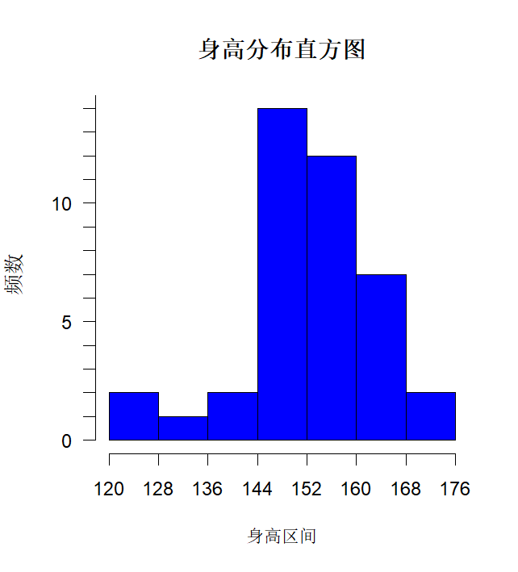
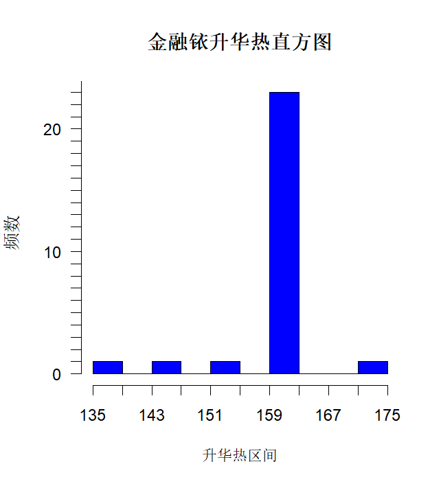
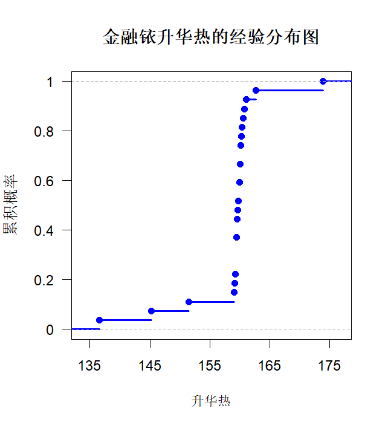
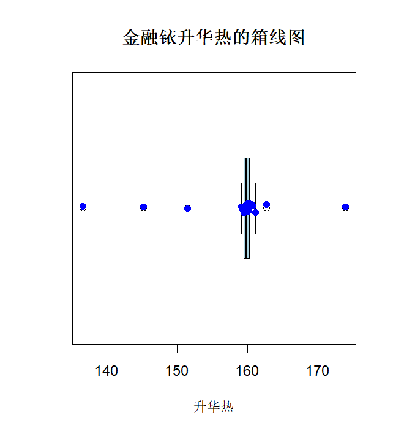

## 统计学基础Ⅰ: 数理统计 Assignment 1

**姓名: **雍崔扬  
**学号: **21307140051

## Problem1 习题 1.1


我们用以下 $\text{R}$ 代码生成包含表 $1.1\text{-}2$数据的数据框: 

```R
students <- data.frame(
  name = c("LAWRENCE", "JEFFERY", "EDWARD", "PHILLIP", "KIRK",
			"ROBERT", "JACLYN", "DANNY", "CLAY", "HENRY", 
			"LESLIE", "JOHN", "WILLIAM", "MARTHA", "LEWIS", 
         	"AMY", "ALFRED", "CHRIS", "FREDRICK", "CAROL",   
			"JOE", "MARY", "LINDA", "MARK", "PATTY",  
			"ELIZABET", "JUDY", "LOUISE", "ALICE", "JAMES", 
			"MARIAN", "TIM", "BARBARA", "DAVID", "KATIE",   
			"MICHAEL", "SUSAN", "JANE", "LILLIE", "ROBERT"),
  age = c(17, 14, 16, 16, 17, 15, 12, 15, 15, 14,   
			14, 13, 15, 16, 14, 15, 14, 14, 14, 14,
         	13, 15, 17, 15, 14, 14, 14, 12, 13, 12, 
			16, 12, 13, 13, 12, 13, 13, 12, 12, 12),
  height = c(172, 169, 167, 167, 167, 164, 162, 162, 162, 159, 
			159, 159, 159, 159, 157, 157, 157, 157, 154, 154,   
			154, 152, 152, 152, 152, 152, 152, 149, 149, 149,
         	147, 147, 147, 145, 145, 142, 137, 135, 127, 125),
  gender = c("M", "M", "M", "M", "M", "M", "F", "M", "M", "M", 
			"F", "M", "M", "F", "M", "F", "M", "M", "M", "F",   
			"M", "F", "F", "M", "F", "F", "F", "F", "F", "M",
         	"F", "M", "F", "M", "F", "M", "F", "F", "F", "M"),
  weight = c(78.1, 51.3, 50.8, 58.1, 60.8, 58.1, 65.8, 48.1, 47.7, 54,   
			64.5, 44.5, 50.4, 50.8, 41.8, 50.8, 44.9, 44.9, 42.2, 38.1,  
 			47.7, 41.8, 52.7, 47.2, 38.6, 41.3, 36.8, 55.8, 48.6, 58.1,
         	52.2, 38.1, 50.8, 35.9, 43.1, 43.1, 30.4, 33.6, 29.1, 35.9)
)
```


### (1) 按学生姓名的第一个字母分组，统计不同组包含学生的频数.

**R 代码: ** 

```R
# Extract the first letter of each name
first_letters <- substr(students$name, 1, 1)

# Calculate the frequency of each first letter
letter_frequency <- table(first_letters)

# Print the frequency table
print(letter_frequency)
```

**运行结果: **  

```R
first_letters
A B C D E F H J K L M P R S T W 
3 1 3 2 2 1 1 7 2 6 5 2 2 1 1 1 
```

### (2) 计算体重数据的各个汇总统计量 (均值、方差、标准差、中位数、极差)

**R 代码: ** 

```R
# mean
mean_weight <- mean(students$weight)

# variance
variance_weight <- var(students$weight)

# standard deviation
sd_weight <- sd(students$weight)

# median
median_weight <- median(students$weight)

# range
range_weight <- range(students$weight)
range_value <- diff(range_weight)

# print statistics
cat("mean:", mean_weight, "\n")
cat("variance:", variance_weight, "\n")
cat("standard deviation:", sd_weight, "\n")
cat("median:", median_weight, "\n")
cat("minimum:", range_weight[1], "\n")
cat("maximum:", range_weight[2], "\n")
cat("range:", range_value, "\n")
```

**运行结果: **  

```R
mean: 47.6625 
variance: 101.4886 
standard deviation: 10.07415 
median: 47.7 
minimum: 29.1 
maximum: 78.1 
range: 49 
```

### (3) 将身高数据按 $(120,128],(128,136],\dots,(168,176]$ 分组绘制直方图

**R 代码: **  

```R
# Define the boundaries of groups
breaks <- seq(120, 176, by=8)

# Create a histogram
hist(students$height, breaks=breaks, main="身高分布直方图",
     xlab="身高区间", ylab="频数", 
     col="blue", border="black", 
     right=TRUE, # which means the interval type is (]
     xaxt='n', yaxt='n' # disable the default axis
    )

# User-defined axis
# horizontal axis
axis(1, at=seq(120, 176, by=8), labels=seq(120, 176, by=8), las=1)
# vertical axis
axis(2, at=seq(0, 20, by=1), las=1, 
     labels=ifelse(seq(0, 20, by=1) %in% seq(0, 20, by=5), seq(0, 20, by=1), "")
    )
```

**运行结果: **   




## Problem 2 习题 1.5

设样本量为 $10$ 的样本的观测值为 $0.5,0.7,0.2,0.7,0.4,2.5,1.5,-0.2,-0.5,0.1$   
试绘制其经验分布函数的图形.  
**R 代码: **  

```R
# sample data
sample_data <- c(0.5, 0.7, 0.2, 0.7, 0.4, 2.5, 1.5, -0.2, -0.5, 0.1)

# calculate Empirical Distribution Function
sample_ecdf <- ecdf(sample_data)

# create Empirical Distribution Function
plot(sample_ecdf, main="Empirical Distribution Function", 
     xlab="Values", ylab="ECDF", col="blue", lwd=2,
     xaxt='n', yaxt='n' # disable the default axis
)
     
# User-defined axis
# horizontal axis
axis(1, at=seq(-1, 3, by=0.5), labels=seq(-1, 3, by=0.5), las=1)
# vertical axis
axis(2, at=seq(0, 1, by=0.1), las=1, 
      labels=ifelse(seq(0, 1, by=0.1) %in% seq(0, 1, by=0.2), seq(0, 1, by=0.1), "")
)
```

**运行结果: **  


## Problem 3 习题 1.6

任意给定常数 $a\neq 0$ 和 $b$，$y_i = ax_i+b\ \ (i=1,\dots,n)$ 

### (1) 证明: $\begin{cases} x_1,\dots,x_n\\ y_1,\dots,y_n\end{cases}$ 的样本均值、方差之间有 $\begin{cases} \bar y = a \bar x+b\\ s_y^2 = a^2 s_x^2\end{cases}$  成立

- ① 证明 $\bar y = a \bar x+b$: 
  $$
  \begin{align}
  \bar y 
  &= \frac1n\sum_{i=1}^ny_i\\
  &= \frac1n\sum_{i=1}^nax_i+b\\
  &= a \bar x +b\end{align}
  $$
  
- ② 证明 $s_y^2 = a^2 s_x^2$:   
  $$
  \begin{align}
  s_y^2 
  &= \frac{1}{n-1}\sum_{i=1}^n(y_i-\bar y)^2\\
  &= \frac{1}{n-1}\sum_{i=1}^n(ax_i+b-a\bar x-b)^2\\ 
  &= \frac{1}{n-1}a^2\sum_{i=1}^n(x_i-\bar x)^2\\
  &= a^2 s_x^2\end{align}
  $$

### (2) 根据 (1) 的结果，使用适当的线性变换，求下列一组数据的样本均值、方差: 

$480,550,510,590,510,610,490,600,580$  
取 $a=0.1,b=-48$  
得到新数据: $0,7,3,11,3,13,1,12,10$  
可以计算其样本均值、方差为 $\begin{cases}
\bar y = \frac{60}{9} = 6\frac{2}{3}\\
s_y^2 = \frac{202}{8} = 25.25\end{cases}$  
于是有 $\begin{cases}
\bar x = \frac{1}{a}(\bar y - b) = 10(6\frac{2}{3}+48) \approx 546.6667\\
s_x^2 = \frac{1}{a^2}s_{y}^2 = 2525\end{cases}$  


## Problem 4 习题 1.8

若样本观测值 $x_1,\dots,x_m$ 的频数分别为 $n_1,\dots,n_m$，  
试写出计算样本均值 $\overline{X}$ 和 (已修偏的) 样本方差 $S_n^2$ 的公式 (其中 $n=n_1+\dots+n_m$)  
**解: **  

- 样本均值:   
  $$
  \overline{X} = \frac{1}{n}\sum_{i=1}^m n_ix_i
  $$
  
- (已修偏的) 样本方差:   
  $$
  \begin{align}
  S_n^2 
  &= \frac{1}{n-1} \sum_{i=1}^m n_i(x_i-\overline{X})^2\\
  &= \frac{1}{n-1} \sum_{i=1}^m n_i(x_i^2 - 2\overline{X}x_i + \overline{X}^2)\\
  &= \frac{1}{n-1}\left\{\sum_{i=1}^m n_ix_i^2 - 2\overline{X}\sum_{i=1}^m n_ix_i + n\overline{X}^2\right\}\\
  &= \frac{1}{n-1}\left\{\sum_{i=1}^m n_ix_i^2 - n\overline{X}^2\right\}\end{align}
  $$


## Problem 5

对以下金融铱的升华热数据: 

```R
# sample data
sublimation_heat_data <- c(
  136.6, 145.2, 151.5, 162.7, 159.1, 
  159.8, 160.8, 173.9, 160.1, 160.4, 
  161.1, 160.6, 160.2, 159.5, 160.3, 
  159.2, 159.3, 159.6, 160.0, 160.2, 
  160.1, 160.0, 159.7, 159.5, 159.5, 
  159.6, 159.5
)
```

### (1) 制作直方图

**R 代码: **  

```R
# Define the boundaries of groups
breaks <- seq(135, 175, by=4)

# Create a histogram
hist(sublimation_heat_data, breaks=breaks, 
     main="金融铱升华热直方图", 
     xlab="升华热区间", ylab="频数",
     col="blue", border="black",
     xaxt='n', yaxt='n' # disable the default axis
)

# User-defined axis
# horizontal axis
axis(1, at=seq(135, 175, by=4), labels=seq(135, 175, by=4), las=1)
# vertical axis
axis(2, at=seq(0, 30, by=1), las=1, 
     labels=ifelse(seq(0, 30, by=1) %in% seq(0, 30, by=10), seq(0, 30, by=1), "")
)
```

**运行结果: **  




### (2) 制作经验分布图

**R 代码: **  

```R
# calculate Empirical Distribution Function
edf <- ecdf(sublimation_heat_data)

# create Empirical Distribution Function
plot(edf, main="金融铱升华热的经验分布图", 
     xlab="升华热", ylab="累积概率", 
     col="blue", lwd=2, 
     xaxt='n', yaxt='n' # disable the default axis
    )

# User-defined axis
# horizontal axis
axis(1, at=seq(135, 175, by=10), labels=seq(135, 175, by=10), las=1)
# vertical axis
axis(2, at=seq(0, 1, by=0.2), labels=seq(0, 1, by=0.2), las=1)
```

**运行结果: **  



### (3) 给出其在 $0.90,0.75,0.25,0.05,0.01$ 的分位数

**R 代码: **  

```R
# 指定的概率水平
prob_levels <- c(0.90, 0.75, 0.25, 0.05, 0.01)

# 计算并打印分位数
quantiles <- quantile(sublimation_heat_data, probs = prob_levels)
print(quantiles)
```

**运算结果: **  

```R
    90%     75%     25%      5%      1% 
160.920 160.250 159.500 147.090 138.836 
```

### (4) 计算其样本均值、方差、标准差、偏态系数和峰态系数

**R 代码: **  

```R
library(e1071)
mean_value <- mean(sublimation_heat_data)
variance_value <- var(sublimation_heat_data)
std_deviation <- sd(sublimation_heat_data)
skewness_value <- skewness(sublimation_heat_data)
kurtosis_value <- kurtosis(sublimation_heat_data)

cat("mean: ", mean_value, "\n")
cat("variance: ", variance_value, "\n")
cat("standard variance: ", std_deviation, "\n")
cat("skewness: ", skewness_value, "\n")
cat("kurtosis: ", kurtosis_value, "\n")
```

**运算结果: **  

```R
mean:  158.8148 
variance:  38.74516 
standard variance:  6.224561 
skewness:  -1.587447 
kurtosis:  5.212256 
```

### (5) 制作箱线图

**R 代码: **  

```R
# 使用boxplot()函数创建箱线图
boxplot(sublimation_heat_data, 
        main="金融铱升华热的箱线图", 
        xlab="升华热", 
        col="lightblue", # 设置箱体颜色
        notch=FALSE, # 如果为TRUE，则在箱体中添加一个缺口以表示中位数的置信区间
        horizontal=TRUE # 设置箱线图的方向，FALSE为垂直，TRUE为水平
       )

# 添加数据点，以更清楚地展示所有观测值
points(sublimation_heat_data,
       jitter(rep(1, length(sublimation_heat_data))), 
       col="blue", pch=16)
```

**运行结果: **  



**The End**
