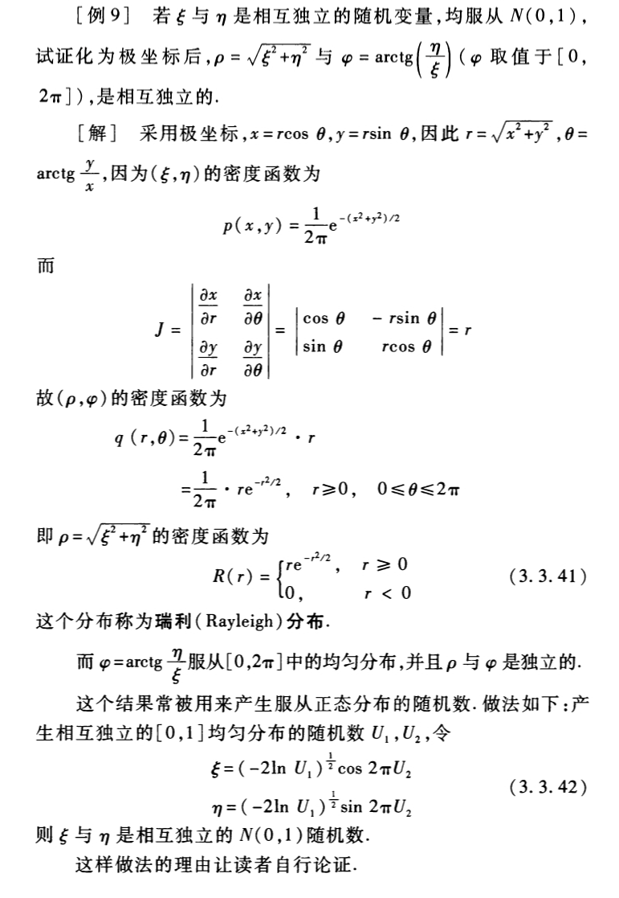

## 统计学基础Ⅰ: 数理统计 Assignment 2

**姓名: ** 雍崔扬  
**学号: ** 21307140051  
**习题: **E1.2, E1.3, E1.4(1)(2)(3), E1.14, E1.18, E1.23

### Problem 1 习题 1.2

试确定下列问题的总体及分布族: 

(1) 研究某种型号玻璃瓶的品质，假设瓶上的气泡数是衡量品质的指标，它服从 Poisson 分布.

- **Solution:**  
  记瓶子上的气泡数为 $X$，总体是气泡数 $X$ 所有可能取值的全体，即自然数集 $\mathbb N$.    
  概率密度函数 $p(x;\lambda) = e^{-\lambda} \frac{\lambda^x}{x!}\ (x\in \mathbb N,\lambda>0)$  
  参数分布族为 $\mathscr P_X = \{p(\cdot,\lambda): \lambda \in (0,\infty)\}$

(2) 研究某工厂生成的标值为 $2.5\Omega$ 的电阻的阻值.

- **Solution:**  
  记电阻阻值为 $X$，总体是阻值 $X$ 所有可能取值的全体，即正实数集 $\mathbb R_{++}$.    
  总体分布族为 $\mathscr F_X = \{F_X: \text{CDF on }\mathbb R_{++}\text{ such that }F_X(0)=0 \text{ and }\int_0^\infty x {\mathrm d}F(x) = 2.5\}$  
  (无法写为单一有限维参数族)

(3) 同 (2)，但假设阻值服从正态分布.

- **Solution:**  
  与 (2) 同理，总体为 $\mathbb R_{++}$  
  总体分布 $F_X$ 的参数分布族为 $\mathscr F_X = \{N(2.5,\sigma^2): \sigma^2>0\}$   
  值得注意的是，正态在负轴上有正概率，可能与电阻必须为正的物理事实冲突.  
  如需保证非负性，应改用对数正态、Gamma 或截断正态等正支持族.

### Problem 2 习题 1.3

一物体的重量 $\mu$ 未知.  
用两架天平称量，其测量误差分别服从 $N(0,\sigma_1^2)$ 和 $N(0,\sigma_2^2)$，其中 $\sigma_1,\sigma_2$ 未知.  
为使得测量尽可能精确，先将该物体在第一架天平上称两次，得到 $X_1,X_2$.   
再在第二架天平上乘两次，得到 $X_3,X_4$.   
然后看哪架天平乘得的数据偏差的绝对值小，再用该天平称 $n-4$ 次得到 $X_5,X_6,\dots,X_n$   
写出样本 $(X_1,X_2,\dots,X_n)$ 的分布族.

**Solution: **  
样本空间: $\mathbb R^n$ (不考虑与质量必须为正的物理事实的冲突)  
参数: $\mu \in \mathbb R,\sigma^2_1 >0,\sigma^2_2 > 0$  
对于 $x=(x_1,\dots,x_n)$，联合密度为:
$$
p(x) = 
\begin{cases}
\prod_{i=1}^2 \varphi(x_i;\mu,\sigma^2_1) \prod_{i=3}^4 \varphi(x_i;\mu,\sigma_2^2)
\prod_{i=5}^n \varphi(x_i;\mu,\sigma_1^2), & \text{if }|x_1 - x_2| \leq |x_3-x_4|\\

\prod_{i=1}^2 \varphi(x_i;\mu,\sigma^2_1) \prod_{i=3}^4 \varphi(x_i;\mu,\sigma_2^2)
\prod_{i=5}^n \varphi(x_i;\mu,\sigma_2^2), & \text{if }|x_1 - x_2| > |x_3-x_4|
\end{cases}
$$
值得注意的是，在条件于判定事件 (基于前四次观测) 下观测相互独立;  
但未条件时后 $n-4$ 次观测与前四次观测存在依赖.

### Problem 3 习题 1.4

设 $X_1,X_2,\dots,X_n$ 为取自 Bernoulli 分布 $B(1,p)$ 的一个样本，其中 $0<p<1$     
(1) 写出样本的联合分布列.  

- **Solution:**   
  对于任意 $x_1,x_2,\dots,x_n\in\{0,1\}$，我们有:    
  $$
  \begin{align}
  \text{P}\{X_1=x_1,\dots,X_n=x_n\}
  &= \prod_{i=1}^n \text{P}\{X_i=x_i\}\\
  &= \prod_{i=1}^n p^{x_i}(1-p)^{1-x_i}\\
  &= p^{\sum_{i=1}^n x_i} (1-p)^{n - \sum_{i=1}^n x_i}\end{align}
  $$

(2) 指出下列样本的函数中哪些是统计量，哪些不是统计量，为什么？

- **Solution: **  
  - $T_1=\frac{1}{5}(X_1+X_2+\dots+X_5)$ 是统计量，它由样本唯一确定.
  - $T_2= X_5-\text{E}[X_1] = X_5-p$ 不是统计量，   
    因为它拥有参数 $p$，而 $p$ 不能由样本唯一确定.
  - $T_3 = X_5-p$ 与 $T_2$ 相同，不是统计量.
  - $T_4 = \max\{X_1,X_2,\dots,X_5\}$ 是统计量，它由样本唯一确定.

(3) 如果一个样本观测值为 $(0, 1, 0, 1, 1)$, 写出其样本均值、样本方差和经验分布函数.  

- **Solution:**  
  样本均值 $\overline{X} = \frac{1}{5}(0+1+0+1+1) = 0.6$  
  样本方差 $s^2 = \frac{1}{5-1}[2\times(0-0.6)^2 + 3\times (1-0.6)^2] = 0.3$  
  经验分布函数 $\hat F(x) = \begin{cases}
  0,&x<0\\
  0.4,&0\leq x<1\\
  1,&x\geq 1\end{cases}$

### Problem 4 习题 1.14

**(Poisson 分布的再生性)**  
设 $X = (X_1,X_2,\dots,X_n)$ 为取自 Poisson 分布 $\{\text{Poisson}(\lambda):\lambda>0\}$ 的简单随机样本，   
试求出 $\overline X$ 的抽样分布，并计算 $\text{E}[\overline X]$ 和 $\text{E}[S_n^2]$.    
(其中 $S_n^2$ 代表未修偏的样本方差)

- **一个有趣的事实: 指数分布和几何分布具有无记忆性**

**Solution:**  

- **计算 $\overline X$ 的抽样分布: **  
  首先我们计算 $X\sim \text{Possion}(\lambda)$ 的矩母函数 $M_X(t)$:   
  $$
  \begin{align}
  M_X(t) 
  &= \text{E}[e^{tX}]\\
  &= \sum_{i=0}^\infty e^{t\cdot i}e^{-\lambda}\frac{\lambda^i}{i!}\\
  &= e^{-\lambda} \sum_{i=0}^\infty \frac{(\lambda e^t)^i}{i!}\\
  &= e^{-\lambda}e^{\lambda e^t}\\
  &= e^{\lambda(e^t-1)}\end{align}
  $$
  于是 $n\overline X$ 的矩母函数为:   
  $$
  \begin{align}
  M_{n\overline X}(t) 
  &= \text{E}[e^{t\cdot n\overline X}]\\
  &= \text{E}[e^{t\cdot \sum_{i=1}^n X_i}]\\
  &= \prod_{i=1}^n \text{E}[e^{tX_i}]\\
  &= \prod_{i=1}^n M_{X_i}(t)\\
  &= \prod_{i=1}^n e^{\lambda(e^{t}-1)}\\
  &= e^{n\lambda(e^t-1)}\end{align}
  $$
  因此 $n\overline X \sim \text{Poisson}(n\lambda)$   
  也就是说 $\overline X\sim \frac{1}{n}\text{Poisson}(n\lambda)$    
  根据中心极限定理可知，当 $n\to \infty$ 时，$\sqrt{n}(\overline X-\lambda)\overset{\mathrm{d}}\to N(0,\lambda)$
  
- **计算 $\text{E}[\overline X]$: **  
  $$
  \begin{align}
  \text{E}[\overline X]
  &= \text{E}\left[\frac{1}{n} \sum_{i=1}^n X_i\right]\\
  &= \frac{1}{n}\sum_{i=1}^n\text{E}[X_i]\\
  &= \frac{1}{n}\sum_{i=1}^n \lambda\\
  &= \lambda\end{align}
  $$
  
  (实际上可由 $\overline X \sim \frac{1}{n}\text{Poisson}(n\lambda)$ 直接得到 $\text{E}[\overline X]=\frac{1}{n}\cdot n\lambda = \lambda$)
  
- **计算 $\text{Var}[\overline X]:$**  
  $$
  \begin{align}
  \text{Var}(\overline X)
  &=\left(\frac{1}{n}\right)^2\cdot\text{Var}\left(\sum_{i=1}^n X_i\right)\\
  &=\frac{1}{n^2}\cdot \sum_{i=1}^n \text{Var}(X_i)\\
  &=\frac{1}{n^2}\cdot n\lambda\\
  &=\frac{\lambda}{n}
  \end{align}
  $$
  
  (实际上可由 $\overline X \sim \frac{1}{n}\text{Poisson}(n\lambda)$ 直接得到 $\text{Var}[\overline X]=\frac{1}{n^2}\cdot n\lambda = \frac{\lambda}{n}$)
  
- **计算 $\text{E}[S_n^2]$:**
  $$
  \begin{align}
  \text{E}[S_n^2]
  &= \text{E}\left[\frac{1}{n}\sum_{i=1}^n(X_i-\overline X)^2\right]\\
  &= \frac1n  \text{E}\left[\sum_{i=1}^n (X_i - \lambda)^2 - n(\lambda - \overline{X})^2\right]\\
  &= \frac1n \sum_{i=1}^n \text{E}[(X_i - \lambda)^2] - \text{E}[(\overline{X}-\lambda)^2]\\
  &= \frac1n \sum_{i=1}^n \text{Var}(X_i) - \text{Var}(\overline X)\\
  &= \lambda - \frac{\lambda}{n}\\
  &= \frac{n-1}{n}\lambda\end{align}
  $$

### Problem 5 习题 1.18

设 $X_1,X_2$ 为取自正态分布 $N(0,\sigma^2)$ 的一个样本.   
试证明统计量 $X_1/X_2$ 和 $\sqrt{X_1^2+X_2^2}$ 是相互独立的.

- **Solution:**     
  显然 $X_1,X_2$ 联合地连续，且具有联合概率密度函数 $f_{X_1,X_2}(x_1,x_2) = \frac{1}{2\pi \sigma^2}\exp\{-\frac{x_1^2+x_2^2}{2\sigma^2}\}$   
  记 $\begin{cases}
  Y_1 = g_1(X_1,X_2) = X_1/X_2\\
  Y_2 = g_2(X_1,X_2) = \sqrt{X_1^2+X_2^2}\end{cases}$    
  (按老师的说法，把 $Y_1,Y_2$ 命名为 $\Theta$ 和 $R$ 会更好)  
  于是有 $\begin{cases}
  X_1 = \frac{Y_1Y_2}{\sqrt{Y_1^2+1}} \overset{\Delta}= h_1(Y_1,Y_2)\\
  X_2 = \frac{Y_2}{\sqrt{Y_1^2+1}} \overset{\Delta}= h_2(Y_1,Y_2)
  \end{cases}$   
  由于函数 $g_1,g_2$ 在所有的点 $(x_1,x_2)$ 上有连续的偏导数，  
  且使得对于任意满足 $x_2\neq 0$ 的 $(x_1,x_2)$ 都有  
  $$
  \begin{align}
  J(x_1,x_2) 
  &= \begin{vmatrix} \frac{\partial g_1}{\partial x_1} & \frac{\partial g_1}{\partial x_2} \\ \frac{\partial g_2}{\partial x_1} & \frac{\partial g_2}{\partial x_2} \end{vmatrix} \\
  &= \frac{\partial g_1}{\partial x_1}\frac{\partial g_2}{\partial x_2} - \frac{\partial g_1}{\partial x_2}\frac{\partial g_2}{\partial x_1}\\
  &= \frac{1}{x_2}\cdot \frac{x_2}{\sqrt{x_1^2+x_2^2}} - \left(-\frac{x_1}{x_2^2}\right)\cdot \frac{x_1}{\sqrt{x_1^2+x_2^2}}\\ 
  &= \frac{1}{\sqrt{x_1^2+x_2^2}}\left(1+\frac{x_1^2}{x_2^2}\right)\\
  &\neq 0
  \end{align}
  $$
  故可以证明 $Y_1,Y_2$ 联合地连续，且联合密度函数为:   
  $$
  \begin{align}
  f_{Y_1,Y_2}(y_1,y_2) 
  &= f_{X_1,X_2}(x_1,x_2)|J(x_1,x_2)|^{-1}\\
  &= f_{X_1,X_2}(h_1(y_1,y_2),h_2(y_1,y_2))|J(h_1(y_1,y_2),h_2(y_1,y_2))|^{-1}\\
  &= f_{X_1,X_2}\left(\frac{y_1y_2}{\sqrt{y_1^2+1}},\frac{y_2}{\sqrt{y_1^2+1}}\right)\left|J\left(\frac{y_1y_2}{\sqrt{y_1^2+1}},\frac{y_2}{\sqrt{y_1^2+1}}\right)\right|^{-1}\\
  &= \frac{1}{2\pi \sigma^2}\exp\left\{-\frac{y_2^2}{2\sigma^2}\right\}\cdot 
  \left[\frac{1}{y_2}(1+y_1^2)\right]^{-1}\\
  &= \frac{1}{2\pi \sigma^2}\exp\left\{-\frac{y_2^2}{2\sigma^2}\right\}y_2\cdot \frac{1}{y_1^2+1}\qquad(y_2\geq 0)
  \end{align}
  $$
  我们发现联合密度函数 $f_{Y_1,Y_2}(y_1,y_2)$ 可以分离为关于 $y_1$ 的函数和关于 $y_2$ 的函数的乘积.  
  这说明 $Y_1\ \bot\ Y_2$ 相互独立，命题得证. 
  
  ****
  
  值得注意的是，通过定义 $\begin{cases}
  X_1 = \frac{Y_1Y_2}{\sqrt{Y_1^2+1}} \overset{\Delta}= h_1(Y_1,Y_2)\\
  X_2 = \frac{Y_2}{\sqrt{Y_1^2+1}} \overset{\Delta}= h_2(Y_1,Y_2)
  \end{cases}$ 我们限制了 $X_2\geq 0$  
  然而 $X_1,X_2$ 的联合概率密度函数 $f_{X_1,X_2}(x_1,x_2) = \frac{1}{2\pi \sigma^2}\exp\{-\frac{x_1^2+x_2^2}{2\sigma^2}\}$ 基于 $X_1,X_2\in\mathbb R$ 的假设，  
  直接应用到 $f_{Y_1,Y_2}(y_1,y_2)$ 的算式中会造成**不归一**的问题.   
  实际上，我们应该使用 $X_1,|X_2|$ 的联合概率密度函数 $f_{X_1,|X_2|}(x_1,x_2) = \frac{1}{\pi \sigma^2}\exp\{-\frac{x_1^2+x_2^2}{2\sigma^2}\}$   
  **因此 $Y_1,Y_2$ 联合密度函数的最终形式应为: **  
  $$
  f_{Y_1,Y_2}(y_1,y_2) 
  =\frac{y_2}{\sigma^2}\exp\left\{-\frac{y_2^2}{2\sigma^2}\right\}\cdot \frac{1}{\pi (y_1^2+1)}\qquad(y_2\geq 0)
  $$
  这也是我们在 Problem 6 习题 1.23 (2) 中使用的形式.  
  我们可以知道 $\begin{cases}
  Y_1 \sim \text{Cauchy}(0,1)\\
  Y_2 \sim \text{Rayleigh}(\sigma^2)\quad (\text{i.e. }Y_2^2 \sim \sigma\chi^2(2))\\
  Y_1\ \bot\ Y_2\end{cases}$

*****

**TA: 李贤平《概率论基础》P175:**

### Problem 6 习题 1.23

试证:     
(1) $t^2(k)\overset{\mathrm{d}}= F(1,k)$

- **Solution:**   
  形式上，等式 $t^2(k) = [\frac{N(0,1)}{\sqrt{\chi^2(k)/k}}]^2 = \frac{\chi^2(1)/1}{\chi^2(k)/k} = F(1,k)$ 就说明了命题成立.   
  其中我们要求分子、分母的分布相互独立.  
  严格化的证明比较复杂，与 (2) 中严格化的证明的基本思想是相同的，这里就不写了.

(2) $t(1) \overset{\mathrm{d}}= \text{Cauchy}(0,1)$

- **Solution:**  
  形式上，等式 $t(1) = \frac{N(0,1)}{\sqrt{\chi^2(1)/1}} = \frac{N(0,1)}{|N(0,1)|} = \frac{N(0,1)}{N(0,1)} = \text{Cauchy}(0,1)$ 就说明了命题成立.  
  其中我们要求分子、分母的分布相互独立.

  - **关于 $\frac{N(0,1)}{|N(0,1)|} = \frac{N(0,1)}{N(0,1)}$ 的直觉: **  
    记 $\begin{cases}
    X_1,X_2\sim N(0,1)\\
    X_1\ \bot\ X_2\end{cases}$   
    根据独立性、$N(0,1)$ 的对称性和 $\text{P}\{X_2=0\}=0$ 可知:   
    $$
    \begin{align}
    \text{P}\left\{\frac{X_1}{X_2}\leq t\right\}
    &=\text{P}\left\{\frac{X_1}{X_2} \leq t, X_2 > 0\right\} + \text{P}\left\{\frac{X_1}{X_2} \leq t, X_2 < 0\right\} \\
    &= \text{P}\left\{\frac{X_1}{|X_2|} \leq t, X_2 > 0\right\} + \text{P}\left\{-\frac{X_1}{|X_2|} \leq t, X_2 < 0\right\} \quad(\text{by symmetry of }N(0,1))\\
    &= \text{P}\left\{\frac{X_1}{|X_2|} \leq t, X_2 > 0\right\} + \text{P}\left\{\frac{X_1}{|X_2|} \leq t, X_2 < 0\right\} \\
    &= \text{P}\left\{\frac{X_1}{|X_2|} \leq t\right\} \end{align}
    $$
    因此我们知道 $Y_1 := \frac{X_1}{X_2} \overset{\mathrm{d}}= \frac{X_1}{|X_2|} \sim t(1)$ 
    
  - **法一: **  
    记 $\begin{cases}
    X_1,X_2\sim N(0,1)\\
    X_1\ \bot\ X_2\end{cases}$   
    显然 $X_1,X_2$ 联合地连续，且具有联合概率密度函数 $f_{X_1,X_2}(x_1,x_2) = \frac{1}{2\pi \sigma^2}\exp\{-\frac{x_1^2+x_2^2}{2\sigma^2}\}$  
    定义 $\begin{cases}
    Y_1 = g_1(X_1,X_2) = \frac{X_1}{X_2}\\
    Y_2 = g_2(X_1,X_2) = \sqrt{X_1^2+X_2^2}\end{cases}$   
    根据本次作业 Problem 5 (教材习题 1.18) 的结论，我们知道:   
    $Y_1,Y_2$ 联合地连续，且联合密度函数为:   
    $$
    f_{Y_1,Y_2}(y_1,y_2) 
    =\frac{1}{\pi \sigma^2}\exp\left\{-\frac{y_2^2}{2\sigma^2}\right\}y_2\cdot \frac{1}{y_1^2+1}\qquad(y_2\geq 0)
    $$
    于是 $Y_1$ 的概率密度函数为:   
    $$
    \begin{align}
    f_{Y_1}(y_1)
    &= \int_{0}^{\infty}
    f_{Y_1,Y_2}(y_1,y_2)\mathrm{d}y_2\\
    &= \int_{0}^{\infty}
    \frac{y_2}{\sigma^2}\exp\left\{-\frac{y_2^2}{2\sigma^2}\right\}\cdot \frac{1}{\pi (y_1^2+1)}\mathrm{d}y_2\\
    &= \frac{1}{\pi (y_1^2+1)} \int_0^{\infty} \exp\left\{-\frac{y_2^2}{2\sigma^2}\right\}\frac{y_2}{\sigma^2}\mathrm{d}y_2\\
    &= \frac{1}{\pi (y_1^2+1)} \int_0^{\infty} e^{-t}\mathrm{d}t\quad(t:= \frac{y_2^2}{2\sigma^2})\\
    &= \frac{1}{\pi (y_1^2+1)}\\
    &= \text{P}\{\text{Cauchy}(0,1)=y_1\}\end{align}
    $$
    这就说明了 $Y_1= \frac{X_1}{X_2} \sim \text{Cauchy}(0,1)$    
    再结合 $Y_1 = \frac{X_1}{X_2} \overset{\mathrm{d}}= \frac{X_1}{|X_2|} \sim t(1)$ 就得到 $t(1) \overset{\mathrm{d}}= \text{Cauchy}(0,1)$
    
  - **法二: **    
    记 $\begin{cases}
    X_1,X_2\sim N(0,1)\\
    X_1\ \bot\ X_2\end{cases}$  
    使用极坐标变换:
    $$
    (R,\Theta) \text{ with }X_1 = R\cos\Theta,\ X_2 = R\sin\Theta,\ R\geq 0,\ \Theta\in [0,\pi)
    $$
    Jacobi 行列式为:
    $$
    J(r,\theta) = 
    \begin{vmatrix}
    \frac{\partial x_1}{\partial r} & \frac{\partial x_1}{\partial \theta}\\
    \frac{\partial x_2}{\partial r} & \frac{\partial x_2}{\partial \theta}
    \end{vmatrix}
    =
    \begin{vmatrix}
    \cos\theta & -r\sin\theta\\
    \sin\theta & r\cos\theta
    \end{vmatrix}
    =
    r
    $$
    联合密度为:
    $$
    \begin{align}
    f_{R,\Theta}(r,\theta)
    &=
    f_{X_1,X_2}(x_1,x_2)|J(r,\theta)|\\
    &=
    \frac{1}{2\pi}\exp\left\{-\frac{x_1^2+x_2^2}{2}\right\}\cdot r\\
    &=
    \frac{1}{2\pi} e^{-r^2/2} r 
    
    \end{align}
    $$
    定义 $U:=\cot \Theta = X_1 / X_2\ \Theta\in [0,\pi)$.  
    对于给定 $u$，有 $\theta = \arccot u$ 且 $\mathrm{d}\theta/ \mathrm{d}u = -1 / (1+u^2)$.  
    对 $r$ 积分可得 $U$ 的边缘密度:
    $$
    \begin{align}
    f_U(u)
    &=
    \int_0^\infty f_{R,\Theta}(r,\theta)\cdot  \left| \frac{\mathrm{d}\theta}{\mathrm{d}u}\right|\mathrm{d}r\\
    &=
    \int_0^\infty \frac{1}{2\pi} e^{-r^2/2} r \cdot \frac{1}{1+u^2} \mathrm{d}r\\
    &=
    \frac{1}{2\pi}\cdot \frac{1}{1+u^2} \int_0^\infty e^{-r^2/2} r \mathrm{d}r\\
    &=
    \frac{1}{2\pi}\cdot \frac{1}{1+u^2} \int_0^\infty e^{-t} \mathrm{d}t\quad (t:= r^2/2)\\
    &=
    \frac{1}{2\pi (1+u^2)}
    
    \end{align}
    $$
    
    注意我们把 $\Theta$ 的区间缩为 $[0,\pi)$，而原始 $X_1,X_2$ 的 $\Theta$ 的自然取值区间长度为 $2\pi$.  
    因此要恢复原始分布，需要把贡献乘以 $2$，最终得到:
    $$
    f_U(u) = \frac{1}{\pi (1+u^2)}
    $$

**The End**
