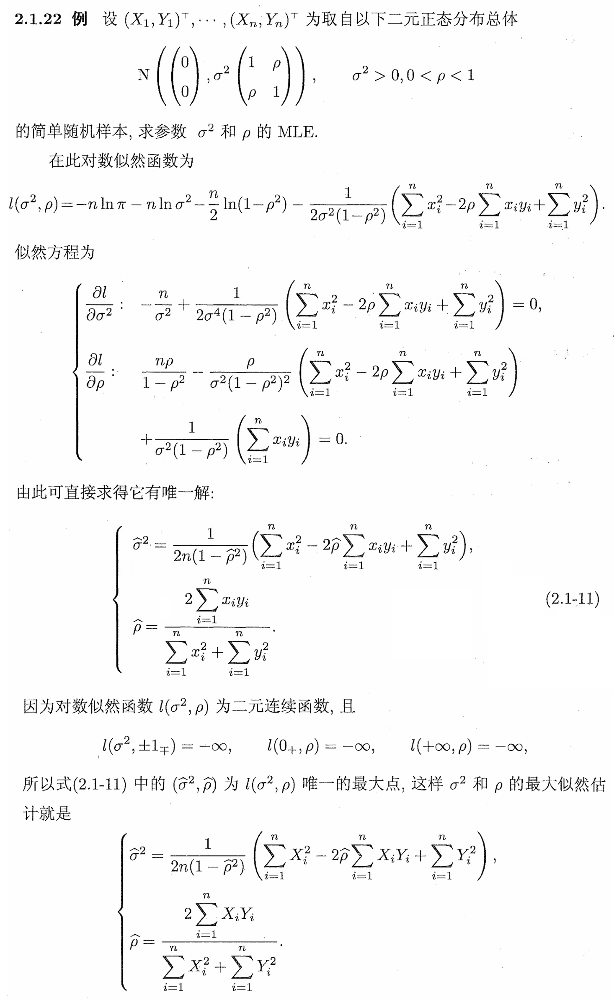

## 统计学基础Ⅰ: 数理统计 Assignment 5

**姓名: ** 雍崔扬  
**学号: ** 21307140051      
**习题: ** E2.3(2)(3), E2.5, E2.6(1)(5)(7), E2.8, 补充题4

### Problem 1 (习题 2.3(1)(2)(3))

设 $X=(X_1,\dots,X_n)$ 为取自下列分布的简单随机样本，求其未知参数的矩估计:   
(1) $p(x;\lambda)=\lambda e^{-\lambda x} I_{(x,\infty)}(x)\ \ (\lambda>0)$ 

- **Solution:**  
  $$
  \begin{align}
  \mathbb{E}[X]
  &= \int_0^\infty x\cdot \lambda e^{-\lambda x}\mathrm{d}x\\
  &= \frac{1}{\lambda}\int_0^\infty  ue^{-u}\mathrm{d}u\quad (u := \lambda x)\\
  &= \frac{1}{\lambda}\cdot (-(u+1)e^{-u})|_0^\infty\\
  &= \frac{1}{\lambda}\end{align}
  $$
  根据矩估计有 $\overline X = 1/{\hat \lambda}$   
  因此矩估计量为 $\hat \lambda = 1/{\overline X}$   
  其中 $\overline X = \frac1n \sum_{i=1}^n X_i$ 为样本均值.

(2) $p(x;\theta) = \frac{2(\theta -x)}{\theta^2}I_{(0,\theta)}(x)\ \ (\theta>0)$

- **Solution:**  
  $$
  \begin{align}
  \mathbb{E}[X]
  &= \int_0^\theta x\cdot \frac{2(\theta-x)}{\theta^2}\mathrm{d}x\\
  &= \frac{2}{\theta}\int_0^\theta x\mathrm{d}x - \frac{2}{\theta^2}\int_0^\infty x^2\mathrm{d}x\\
  &= \frac{2}{\theta}\cdot \left(\frac12x^2\right) {\Large|}_0^\theta -
  \frac{2}{\theta^2}\cdot \left(\frac13x^3\right){\Large|}_0^\theta\\
  &= \frac{2}{\theta}\cdot \frac12 \theta^2 -
  \frac{2}{\theta^2}\cdot \frac13\theta^3\\
  &= \frac{\theta}{3}\end{align}
  $$
  
  根据矩估计有 $\overline X = {\hat \theta}/3$​    
  因此矩估计量为 $\hat \theta = 3\overline X$   
  其中 $\overline X = \frac1n \sum_{i=1}^n X_i$ 为样本均值.

(3) $\text{Beta}(\theta,b)\ \ (\theta>0)$ (其中 $b$ 已知)

- **Solution:**  
  $p(x;\theta,b) = \frac{1}{\beta(\theta,b)}x^{\theta-1}(1-x)^{b-1} I_{(0,1)}(x)$   
  其中 $\beta(\theta,b) = \int_0^1 x^{\theta-1}(1-x)^{b-1}\mathrm{d}x = \frac{\Gamma(\theta)\Gamma(b)}{\Gamma(\theta+b)}$   
  $$
  \begin{align}
  \mathbb{E}[X] 
  &=
  \int_0^1 x\cdot \frac{1}{\beta(\theta,b)}x^{\theta-1}(1-x)^{b-1}\mathrm{d}x\\
  &=
  \frac{1}{\beta(\theta,b)}\int_0^1 x^{(\theta+1)-1}(1-x)^{b-1}\mathrm{d}x\\
  &=
  \frac{\beta(\theta+1,b)}{\beta(\theta,b)}\\
  &=
  \frac{\Gamma(\theta+1)\Gamma(b)}{\Gamma(\theta+1+b)} \cdot \frac{\Gamma(\theta+b)}{\Gamma(\theta)\Gamma(b)}\\
  &=
  \frac{\theta}{\theta+b}\end{align}
  $$
  根据矩估计有 $\overline X = {\hat \theta} / {(\hat \theta + b)}$    
  因此矩估计量为 $\hat \theta = {b\overline X} / {(1-\overline X)}$   
  其中 $\overline X = \frac1n \sum_{i=1}^n X_i$ 为样本均值.

### Problem 2 (习题 2.5)

设 $X=(X_1,\dots,X_n)$ 为取自正态总体 $\{\xi\overset{\mathrm{d}}=N(\mu,\sigma^2):\mu\in\mathbb R, \sigma^2>0\}$ 的简单随机样本.  
求 $\text{P}_{\mu,\sigma^2}\{\xi>1\}$ 的矩估计量.

**Solution:**  
$$
\begin{align}
\text{P}_{\mu,\sigma^2}\{\xi>1\}
&= 1 - \text{P}_{\mu,\sigma^2}\{\xi\leq 1\}\\
&= 1 - \text{P}_{\mu,\sigma^2}
\left\{
\frac{\xi-\mu}{\sigma} \leq \frac{1-\mu}{\sigma}
\right\}\\
&= 1- \Phi\left(\frac{1-\mu}{\sigma}\right)\end{align}
$$

其中 $\Phi(\cdot)$ 为标准正态分布 $N(0,1)$ 的累积分布函数.

根据矩估计有: 
$$
\begin{align}
\hat {\text{P}}_{\mu,\sigma^2}\{\xi>1\}
&= 1- \Phi\left(\frac{1-\hat\mu}{\hat\sigma}\right)\\
&= 1-\Phi\left(\frac{1-\overline X}{S_n}\right)\end{align}
$$

其中 $\overline X = \frac1n \sum_{i=1}^n X_i$ 为样本均值，$S_n^2 = \frac1n \sum_{i=1}^n (X_i-\overline X)^2$ 为未修偏的样本方差.

### Problem 3 (习题 2.6(1)(5)(7))

设 $X=(X_1,\dots,X_n)$ 为取自下列分布的简单随机样本，求其未知参数的最大似然估计量:   
**(1)** $p(x;\theta) = (\theta + 1) x^\theta I_{(0,1)}(x)\ \ (\theta>-1)$ 

- **Solution:**  
  似然函数为:
  $$
  \begin{align}
  L(\theta|x)
  &= \prod_{i=1}^n (\theta+1)x_i^\theta \\
  &= (\theta+1)^n \left(\prod_{i=1}^n x_i\right)^\theta\end{align}
  $$
  对数似然函数为:
  $$
  \begin{align}
  l(\theta|x)
  &= \log(L(\theta|x))\\
  &= n\log(\theta+1) + \left(\sum_{i=1}^n\log(x_i)\right)\cdot \theta\end{align}
  $$
  注意到 $l(\theta|x)$ 关于 $\theta \in (-1,\infty)$ 是凹函数，故其驻点就是全局最大值点.  
  **(这是数学分析以及最优化课程的结论，但遗憾的是侯老师不允许在期末考试中使用**)  
  求解驻点条件 (也就是所谓的似然方程):   
  $$
  \frac{\partial }{\partial \theta}l(\theta|x) = \frac{n}{\theta + 1}
  +\sum_{i=1}^n\log(x_i) = 0
  $$
  解得:
  $$
  \hat\theta = -\frac{n}{\sum_{i=1}^n\log(x_i)} -1
  $$
  **(既然不能使用最优化的结论，只能验证一下边界点了)**  
  根据 $\begin{cases}
  l(1_+|x) = -\infty\\
  l(\infty|x) = -\infty\end{cases}\ (\forall\ x\in \Omega = \{x\in \mathbb R^n:0_n\prec x\prec 1_n\})$   
  我们可知 $\hat \theta = \arg \underset{\theta \in (-1,\infty)}\max l(\theta|x)\ \ (\forall\ x\in \Omega)$   
  因此 $\theta$ 的 $\text{MLE}$ 即为 $\hat\theta = -\frac{n}{\sum_{i=1}^n\log(X_i)} -1$

***

**(5)** $p(x;\theta) = \frac{mx^{m-1}}{\theta}\exp\{-\frac{x^m}{\theta}\}\ \ (\theta>0)$ (其中 $m$ 已知)  

- **Preparation:**  
  题干没有标明 $x$ 的范围，我们来推导一下:   
  首先 $p(x;\theta)$ 在 $x> 0$ 时是正值.  
  其次 $p(x;\theta)$ 对 $x\in (0,\infty)$ 的积分是 $1$:
  $$
  \begin{align}
  \int_0^\infty p(x;\theta)
  &= \int_0^\infty \frac{mx^{m-1}}{\theta}\exp\left\{-\frac{x^m}{\theta}\right\} \mathrm{d}x\\
  &= \int_0^\infty e^{-u}\mathrm{d}u\quad (u := \frac{x^m}{\theta})\\
  &= (-e^{-u})|_0^\infty\\
  &= 1\end{align}
  $$
  因此这个分布的 $x$ 的取值范围 (即支撑集) 始终是 $(0,\infty)$
  
- **Solution:**    
  似然函数为:   
  $$
  \begin{align}
  L(\theta|x)
  &= \prod_{i=1}^n \frac{mx_i^{m-1}}{\theta}\exp\left\{-\frac{x_i^m}{\theta}\right\} \\
  &= \left(\frac{m}{\theta}\right)^n \left(\prod_{i=1}^n x_i\right)^{m-1} \exp\left\{
  -\frac{1}{\theta} \sum_{i=1}^n x_i^m\right\}\end{align}
  $$
  对数似然函数为:
  $$
  \begin{align}
  l(\theta|x)
  &= \log(L(\theta|x))\\
  &= n\log(m) - n\log(\theta) + (m-1) \sum_{i=1}^n \log(x_i) - 
  \frac{1}{\theta} \sum_{i=1}^n x_i^m\end{align}
  $$
  注意到 $\max_\theta l(\theta|x)$ 是一个开凸集上的约束优化问题，其驻点条件是**局部最大值点**的必要条件.  
  求解驻点条件 (也就是所谓的似然方程) $\frac{\partial }{\partial \theta}l(\theta|x) = -\frac{n}{\theta}
  +(\sum_{i=1}^n x_i^m)\frac{1}{\theta^2} = 0$   
  解得 $\hat \theta = \frac1n \sum_{i=1}^n x_i^m $ 
  
  我们可以验证 $\hat \theta$ 是一个**严格局部最大值点**，  
  因为 $\hat \theta$ 处的二阶导数 $\frac{\partial }{\partial \theta}l(\hat\theta|x) = \frac{n}{\hat \theta^2}
  -2(\sum_{i=1}^n x_i^m)\frac{1}{\hat\theta^3} = -\frac{n}{\hat \theta^2}<0$.    
  
  根据 $\begin{cases}
  l(0_+|x) = -\infty\\
  l(\infty|x) = -\infty\end{cases}$ 可知 $\hat \theta = \frac1n \sum_{i=1}^n x_i^m $ 是**全局最大值点**.
  
  因此 $\theta$ 的 $\text{MLE}$ 即为 $\hat \theta = \frac1n \sum_{i=1}^n X_i^m = A_m$ (样本 $m$ 阶原点矩)

***

**(7)** $\text{P}\{\xi=k\}=\binom{k-1}{r-1}p^r(1-p)^{k-r}\ \ (k=r,r+1,\dots)$  参数 $p\in (0,1)$，常数 $r$ 已知

- **Solution: **    
  似然函数为:   
  $$
  \begin{align}
  L(p|x)
  &= \prod_{i=1}^n \binom{x_i-1}{r-1}p^r(1-p)^{x_i-r} \\
  &= \prod_{i=1}^n \binom{x_i-1}{r-1}\cdot p^{nr}\cdot (1-p)^{\sum_{i=1}^n x_i - nr}\end{align}
  $$
  对数似然函数为:   
  $$
  \begin{align}
  l(p|x)
  &= \log(L(p|x))\\
  &= \sum_{i=1}^n \log\binom{x_i-1}{r-1} + nr\log(p) + \left(\sum_{i=1}^n x_i - nr\right)\log(1-p)\end{align}
  $$
  注意到 $l(p|x)$​ 关于 $p \in (0,1)$​ 是**凹函数**，故其驻点就是全局最大值点.  
  求解驻点条件 (也就是所谓的似然方程) $\frac{\partial }{\partial p}l(p|x) = \frac{nr}{p} -\frac{\sum_{i=1}^n x_i-nr}{1-p}= 0$   
  解得 $\hat p = \frac{nr}{\sum_{i=1}^n x_i} = \frac{nr}{\bar x}$ 
  
  **(既然不能使用最优化的结论，只能验证一下边界点了)**  
  根据 $\begin{cases}
  l(0_+|x) = -\infty\\
  l(1_-|x) = -\infty\end{cases}\ (\forall\ x\in \Omega\{x\in \mathbb Z^n:x_i \geq r\ \text{for all }i=1,\dots,n\})$   
  我们可知 $\hat p = \arg \underset{p \in (0,1)}\max l(p|x)\ \ (\forall\ x\in \Omega)$   
  因此 $p$ 的 $\text{MLE}$ 即为 $\hat p = \frac{nr}{\bar X}$   
  其中 $\overline X = \frac1n \sum_{i=1}^n X_i$ 为样本均值.

### Problem 4 (习题 2.8)

设 $X=(X_1,\dots,X_n)$ 为取自均匀分布 $\{\xi\overset{\mathrm{d}}=\text{Uniform}(\theta,2\theta):\theta>0\}$   
求 $\theta$ 的最大似然估计量，并在其基础上构造无偏估计量.

**Solution:**    
似然函数为:   
$$
\begin{align}
L(\theta|x) 
&= \underset{i=1}{\overset{n}\prod} \text{P}\{\text{Uniform}(\theta,2\theta)=x_i\}\\
&= \underset{i=1}{\overset{n}\prod} \frac{1}{\theta}I_{[\theta,2\theta]}(x_i) \\
&= \frac{1}{\theta^n} I\left(\theta\leq \min_{i=1,\dots,n} x_i\right) I\left(\max_{i=1,\dots,n} x_i \leq 2\theta\right)\\
&= 
\frac{1}{\theta^n} I\left(\frac12\max_{i=1,\dots,n} x_i \leq \theta \leq \min_{i=1,\dots,n} x_i\right)\end{align}
$$
容易直接验证 $\hat\theta (x) = \frac12\underset{i=1,\dots,n}\max x_i$ 是 $L(\theta|x)$ 的最大值点，  
因此 $\theta$ 的 $\text{MLE}$ 为 $\hat \theta = \frac12 X_{(n)}$

**下面我们验证它不是无偏估计量: **  
$$
\begin{align}
\mathbb{E}_\theta[\hat \theta]
&= \frac12\mathbb{E}_\theta[X_{(n)}]\\
&= \frac12 \mathbb{E}_\theta[X_{(n)}-\theta] + \frac12\theta\\
&= \frac12\int_\theta^{2\theta} (x-\theta) \cdot f_{X_{(n)}}(x)\mathrm{d}x + \frac12\theta\\ 
&=   
\frac12\int_\theta^{2\theta} (x-\theta)\cdot \frac{n(x-\theta)^{n-1}}{\theta^n}\mathrm{d}x +\frac12\theta\\
&= \frac{n}{2\theta^n} \int_0^\theta u^n \mathrm{d}u + \frac12\theta\\
&= \frac{n}{2(n+1)}\theta + \frac12\theta\\
&= \frac{2n+1}{2(n+1)}\theta\end{align}
$$
我们可以在其基础上构造无偏估计量 $\hat \theta_{\text{unbiased}}=\frac{2(n+1)}{2n+1}\hat \theta = \frac{n+1}{2n+1}X_{(n)}$  

### Problem 5 (补充题 4)

利用二阶偏导的方法求解《数理统计讲义》上 $2.1.22$ 例子 ($66\text{-}67$ 页) 中的估计是最大似然估计.

**Solution:**  
设 $((X_1,Y_1),\dots,(X_n,Y_n))$ 为  
取自二元正态分布总体 $\left\{N\left(\begin{bmatrix}
0\\
0\end{bmatrix},\sigma^2 \begin{bmatrix}
1 & \rho\\
\rho & 1\end{bmatrix}\right): \sigma^2>0,-1<\rho<1\right\}$ 的简单随机样本.

其似然函数为:   
$$
\begin{align}
L(\sigma^2,\rho|x,y)
&= \prod_{i=1}^n \frac{1}{2\pi \sqrt{(\sigma^2)^2 (1-\rho^2)}} 
\exp\left\{-\frac12 \begin{bmatrix}
x_i-0\\
y_i-0\end{bmatrix}^{\mathrm T}
\cdot \left(\sigma^2\begin{bmatrix}
1 & \rho\\
\rho & 1\end{bmatrix}\right)^{-1}\cdot
\begin{bmatrix}
x_i-0\\
y_i-0\end{bmatrix}\right\}\\
&= 
(2\pi)^{-n}(1-\rho^2)^{-n/2} (\sigma^2)^{-n}
\prod_{i=1}^n
\exp\left\{-\frac{1}{2\sigma^2(1-\rho^2)}
\begin{bmatrix}
x_i\\
y_i\end{bmatrix}^{\mathrm{T}}
\begin{bmatrix}
1 & -\rho\\
-\rho & 1\end{bmatrix}
\begin{bmatrix}
x_i\\
y_i\end{bmatrix}\right\}\\
&=
(2\pi)^{-n}(1-\rho^2)^{-n/2} (\sigma^2)^{-n}
\exp\left\{-\frac{1}{2\sigma^2(1-\rho^2)}
\left(\sum_{i=1}^n x_i^2 - 2\rho \sum_{i=1}^n x_iy_i + \sum_{i=1}^n y_i^2\right)\right\}\end{align}
$$
其对数似然函数为:   
$$
\begin{align}
l(\sigma^2,\rho | x,y)
&= \log\{L(\sigma^2,\rho | x,y)\}\\
&= -n\log(2\pi) - \frac{n}2 \log(1-\rho^2) - n\log(\sigma^2)
-\frac{1}{2\sigma^2(1-\rho^2)} \left(\sum_{i=1}^n x_i^2 - 2\rho \sum_{i=1}^n x_iy_i + \sum_{i=1}^n y_i^2\right) \end{align}
$$
列出驻点条件的方程 (即所谓的似然方程) 为:   
$$
\begin{cases}
\frac{\partial}{\partial \sigma^2} l(\sigma^2,\rho | x,y)
=
-\frac{n}{\sigma^2} + \frac{1}{2\sigma^4(1-\rho^2)}(\sum_{i=1}^n x_i^2 - 2\rho \sum_{i=1}^n x_iy_i + \sum_{i=1}^n y_i^2) = 0\\
\frac{\partial}{\partial \rho} l(\sigma^2,\rho | x,y)
= 
\frac{n\rho}{1-\rho^2} - \frac{\rho}{\sigma^2(1-\rho^2)^2}(\sum_{i=1}^n x_i^2 - 2\rho \sum_{i=1}^n x_iy_i + \sum_{i=1}^n y_i^2) + \frac{1}{\sigma^2(1-\rho^2)}(\sum_{i=1}^n x_iy_i) = 0\end{cases}
$$
解得 $\begin{cases}
\hat \sigma^2 = \frac{1}{2n(1-\hat \rho^2)}(\sum_{i=1}^n x_i^2 - 2 \hat \rho \sum_{i=1}^n x_iy_i + \sum_{i=1}^n y_i^2)\\
\hat \rho = \frac{2\sum_{i=1}^nx_iy_i}{\sum_{i=1}^nx_i^2 + \sum_{i=1}^n y_i^2}\end{cases}$

下面我们说明  $(\hat \sigma^2,\hat \rho)$ 是 $l(\sigma^2,\rho|x,y)$ 上的最大值点:   

- **证明 $(\hat \sigma^2,\hat \rho)$ 是严格局部最大点: **  
  我们计算 $l(\sigma^2,\rho|x,y)$ 在 $(\hat \sigma^2,\hat \rho)$ 的 Hessian 矩阵，看它是不是负定的.   
  $$
  \begin{align}
  \nabla^2_{(\sigma^2,\rho)}l(\hat\sigma^2,\hat\rho|x,y)
  &= \begin{bmatrix}
  \frac{\partial^2}{(\partial \sigma^2)^2}l(\hat\sigma^2,\hat\rho|x,y)
  &
  \frac{\partial^2}{\partial \sigma^2\partial \rho}l(\hat\sigma^2,\hat\rho|x,y)\\
  \frac{\partial^2}{\partial \rho\partial \sigma^2}l(\hat\sigma^2,\hat\rho|x,y)
  &
  \frac{\partial^2}{(\partial \rho)^2}l(\hat\sigma^2,\hat\rho|x,y)\end{bmatrix}\\
  &=
  \begin{bmatrix}
  -\frac{n}{\hat \sigma^4}
  &
  \frac{2n\hat\rho\hat\sigma^2-\sum_{i=1}^n x_iy_i}{\hat\sigma^4 (1-\hat\rho^2)}\\
  \frac{2n\hat\rho\hat\sigma^2-\sum_{i=1}^n x_iy_i}{\hat\sigma^4 (1-\hat\rho^2)}
  &
  \frac{4\hat \rho \sum_{i=1}^n x_iy_i - n\hat \sigma^2 (1+5\hat \rho^2)}{\hat \sigma^2 (1-\hat \rho^2)^2}\end{bmatrix}\end{align}
  $$
  
  - **(TODO: 二阶偏导应该算错了)**  
    老师算出的 Hessian 是 $\begin{bmatrix}
    -\frac{4n^3}{(\sum_{i=1}^n x_i^2\sum_{i=1}^n y_i^2)^2}
    &
    \frac{n\hat \rho}{2\hat\sigma^2(1-\hat \rho^2)}\\
    \frac{n\hat \rho}{2\hat\sigma^2(1-\hat \rho^2)}
    &
    \frac{-n(1+3\hat \rho^2)}{(1-\hat \rho^2)^2}\end{bmatrix}$   
    最终 $\det = \frac{n^2(1+\frac{11}{4}\hat\rho^2)}{\hat \sigma^4 (1-\hat\rho^2)^2}>0$ 
    
  - 根据 $(\hat \sigma^2,\hat \rho)$ 的表达式，我们可以反解出 $\begin{cases}
    \sum_{i=1}^n x_i^2 + \sum_{i=1}^n y_i^2 = 2n\hat\sigma^2\\
    \sum_{i=1}^n x_iy_i = n\hat \sigma^2 \hat\rho\end{cases}$
  
  - 一阶顺序主子式 $=-\frac{n}{\hat \sigma^4}<0$   
  
  - 二阶顺序主子式:   
    $$
    \begin{align}
    \det {(\nabla^2_{(\sigma^2,\rho)}l(\hat\sigma^2,\hat\rho|x,y))}
    &=
    -\frac{n}{\hat\sigma^4}\cdot \frac{4\hat \rho \sum_{i=1}^n x_iy_i - n\hat\sigma^2 (1+5\hat \rho^2)}{\hat \sigma^2 (1-\hat \rho^2)^2} -
    \left(\frac{2n\hat\rho\hat\sigma^2-\sum_{i=1}^n x_iy_i}{\hat\sigma^4 (1-\hat\rho^2)}\right)^2\\
    &=
    \frac{n^2\hat \sigma^4 (1+\hat \rho^2)-(\sum_{i=1}^n x_iy_i)^2}{\hat \sigma^8 (1-\hat \rho^2)^2}\\
    &=
    \frac{n^2\hat \sigma^4 (1+\hat \rho^2)-(n\hat\sigma^2 \hat \rho)^2}{\hat \sigma^8 (1-\hat \rho^2)^2}\\
    &=
    \frac{n^2}{\hat \sigma^4 (1-\hat \rho^2)^2}\\
    &>0\end{align}
    $$
  
  根据 **Sylvester 判定定理**可知 $\nabla^2_{(\sigma^2,\rho)}l(\hat\sigma^2,\hat\rho|x,y)\prec 0$   
  因此 $(\hat\sigma^2,\hat\rho)$ 是 $l(\sigma^2,\rho|x,y)$ 的**严格局部最大值点**.
  
- **排除边界点: **
  因为 $l(\sigma^2,\rho|x,y)$ 在 $\mathbb R_{++}\times (-1,1)$ 上连续，  
  且边界点满足 $\begin{cases}
  l(0_+,\rho) = -\infty
  &(\forall\ \rho\in (-1,1))\\
  l(+\infty,\rho) = -\infty
  &(\forall\ \rho\in (-1,1))\\
  l(\sigma^2,1_-) =  -\infty 
  &(\forall\ \sigma^2>0)\\
  l(\sigma^2,-1_+) =  -\infty 
  &(\forall\ \sigma^2>0)\end{cases}$      
  所以边界点不可能是全局最大点.

综上所述，驻点 $(\hat \sigma^2,\hat \rho)$ 是 $l(\sigma^2,\rho|x,y)$ 上的全局最大值点，  
说明 $(\sigma^2,\rho)$ 的 $\text{MLE}$ 为 $\begin{cases}
\hat \sigma^2 = \frac{1}{2n(1-\hat \rho^2)}(\sum_{i=1}^n X_i^2 - 2 \hat \rho \sum_{i=1}^n X_iY_i + \sum_{i=1}^n Y_i^2)\\
\hat \rho = \frac{2\sum_{i=1}^nX_iY_i}{\sum_{i=1}^nX_i^2 + \sum_{i=1}^n Y_i^2}\end{cases}$

**The End**
