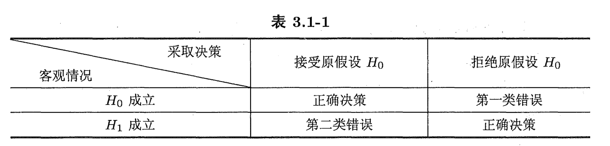

# FDU 回归分析 0. 统计推断概论

本文参考以下教材:

- All of Statistics (L. Wasserman) Chapter $6$
- 统计学完全教程 (L. Wasserman) 第 $6$ 章
- 《数理统计讲义》郑明、陈子毅、汪嘉冈 第 $3$ 章

欢迎批评指正!

## 1.1 统计推断概论

### 1.1.1 统计模型

**统计模型** (statistical model) $\mathscr F$ 是一系列分布构成的集合.  

- 若 $\mathscr F$ 不能用有限个参数表示，则称为**非参数模型** (non-parametric model)  
  例如所有分布构成的统计模型:  
  $$
  \mathscr F_{\text{ALL}}:= \{\text{all CDF}\}
  $$

- 若 $\mathscr F$ 可用有限个参数表示，则称为**参数模型** (parametric model).  
  例如来源于正态分布的数据所对应的双参数模型:  
  $$
  \mathscr F:= \{f(x;\mu,\sigma^2)= \frac{1}{\sqrt{2\pi}\sigma}\exp\{-\frac{1}{2\sigma^2}(x-\mu)^2\}:\mu\in \mathbb R,\sigma^2>0\}
  $$
  一般地，参数模型具有如下形式:  
  $$
  \mathscr F:= \{f(x;\theta):\theta\in \Theta\}
  $$
  若我们只关心参数向量 $\theta$ 的部分分量，则称其余参数为**冗余参数** (nuisance parameter)

  **(基本记号)**  
  给定参数模型 $\mathscr F:= \{f(x;\theta):\theta\in \Theta\}$，我们记:  
  $$
  \text{P}_\theta\{X\in S\}:= \int_S f(x;\theta) {\mathrm d}x\\
  \text{E}_\theta[g(X)] := \int g(x)f(x;\theta){\mathrm d}x\\
  \text{Var}_\theta[g(X)]:= \text{E}_\theta\{[g(X)-\text{E}_\theta(g(X))]^2\} = \int \{g(x)-\text{E}_\theta[g(X)]\}^2 f(x;\theta){\mathrm d}x
  $$

- **(回归模型)**  
  给定成对的观测值 $(x_1,y_1),\dots,(x_n,y_n)$  
  我们称 $X$ 为**自变量** (independent variable) 或**预测变量** (predictor)  
  我们称 $Y$ 为**因变量** (dependent variable) 或**响应变量** (response variable)  
  我们称 $r(x)=\text{E}[Y|X=x]$ 为**回归函数** (regression function)  
  并记回归模型为 $Y=r(X)+\varepsilon$，其中 $\varepsilon$ 是一个零均值随机噪音.

  若 $r$ 属于某个参数模型 $\mathscr F:= \{f(x;\theta):\theta\in \Theta\}$，则称该模型为**参数回归模型** (parametric regression model)  
  否则称其为**非参数回归模型** (non-parametric regression model)

### 1.1.2 统计推断

统计推断问题基本分为三类: 点估计、置信区间估计和假设检验.  
统计推断有很多方法，其中主要的两种是**频率统计推断** (frequentist inference) 和 **Bayes 推断** (Bayesian inference)

#### (1) 点估计

**点估计** (point estimation) 是指对感兴趣的某一单点提供 "最优估计"  
其对象可以是参数模型 $\mathscr F$ 中的某一参数，也可以是对某些随机变量未来值的预测.  

我们记参数 $\theta$ 的点估计为 $\hat \theta$，前者是固定且未知的，而后者依赖于数据，因而是随机的.  
令 $X_1,\dots,X_n$ 为取自某分布的 $n$ 个独立同分布的数据点  
参数 $\theta$ 的点估计 $\hat \theta_n$ 通常是 $X_1,\dots,X_n$ 的函数 $\hat \theta_n = g(X_1,\dots,X_n)$   

我们定义估计量 $\hat \theta_n$ 的**偏差**为 $\text{bias}(\hat \theta_n):= \text{E}_\theta[\hat \theta_n] - \theta$    

> 注意 $\text{E}_\theta[\cdot]$ 和 $\text{Var}_\theta[\cdot]$ 下标中的 $\theta$ 代表关于样本联合分布 $f(x_1,\dots,x_n;\theta)= \underset{i=1}{\overset{n}\prod} f(x_i;\theta)$ 取期望和方差  
> 而不是关于所有 $\theta\in \Theta$ 对应分布的期望和方差的平均

若 $\text{bias}(\hat \theta_n)=0$ (即 $ \text{E}_\theta[\hat \theta_n] = \theta$)，则我们称 $\hat\theta_n$ 是 $\theta$ 的**无偏估计量** (unbiased estimator)   
估计量的无偏性曾经备受关注，但如今已经不被看重了.  
很多估计量都是有偏的，我们对它们的合理要求是**渐近无偏性** (asymptotic unbiasness):  
即当收集的数据越来越多的时候，它将依概率收敛于真实的参数值 $\theta$   
(也即对于任意 $\varepsilon>0$ 都有 $\underset{n\rightarrow \infty}\lim\text{P}_\theta\{|\hat\theta_n-\theta|>\varepsilon\} = 0$ 成立)

估计量 $\hat \theta_n$ 的分布称为**抽样分布** (sampling distribution)  
我们定义 $\hat\theta_n$ 的**标准误差** (standard error) 为其标准差，记为 $\text{SE}(\hat \theta_n):= \sqrt{\text{Var}_\theta(\hat\theta_n)}$，用于衡量估计量的稳定性. 
它通常依赖于未知参数 $\theta$，对它进行估计的一种做法是直接用 $\hat \theta_n$ 代替 $\theta$ 得到**样本标准误差** $\hat {\text{SE}}(\hat \theta_n)$ 

- **(All of Statistics 例 6.8)**  
  令 $X_1,\dots,X_n \overset{iid}\sim B(1,p)$，考虑矩估计量 $\hat p_n:= \frac{1}{n}\sum_{i=1}^n X_i$ 的标准误差.  
  根据 $\text{E}_p[\hat p_n] = \text{E}_p[\frac1n \sum_{i=1}^n X_i] = \frac1n \sum_{i=1}^n \text{E}_p[X_i] = \frac1n \sum_{i=1}^n p = p$ 可知 $\hat p_n$ 是无偏的.  
  其标准误差为: 
  $$
  \text{SE}(\hat p_n) = \sqrt{\text{Var}_p(\hat p_n)} = \sqrt{\text{Var}_p(\frac1n \sum_{i=1}^n X_i)} = \sqrt{\frac1{n^2}\sum_{i=1}^n \text{Var}_p (X_i)} = \sqrt{\frac1{n^2} \sum_{i=1}^n p(1-p)} = \sqrt{\frac{p(1-p)}{n}}
  $$
  我们直接用 $\hat p_n$ 代替 $p$ 可得 $\hat {\text{SE}}(\hat p_n) = \sqrt{\frac{\hat p_n (1-\hat p_n)}{n}}$ 

****

点估计的好坏经常用**均方误差** (mean squared error) 来衡量:  
$$
\begin{align}
\text{MSE}(\hat \theta_n)
&:= \text{E}_\theta [(\hat \theta_n - \theta)^2]\\
&= 
\text{E}_\theta[(\hat \theta_n - \text{E}_\theta[\hat \theta_n] + \text{E}_\theta[\hat \theta_n]-\theta)^2]\\
&=
\text{E}_\theta[(\hat \theta_n - \text{E}_\theta[\hat \theta_n])^2] 
+ 
2(\text{E}_\theta[\hat \theta_n]-\theta) \cdot \text{E}_\theta[\hat \theta_n - \text{E}_\theta[\hat \theta_n]] 
+
(\text{E}_\theta[\hat \theta_n]-\theta)^2\\
&=
\text{Var}_\theta(\hat \theta_n) + 2(\text{E}_\theta[\hat \theta_n]-\theta) \cdot 0 + \text{bias}^2(\hat \theta_n)\\
&=
\text{Var}_\theta(\hat \theta_n) + \text{bias}^2(\hat \theta_n)
\end{align}
$$
若 $\underset{n\rightarrow \infty}{\lim} \text{MSE}(\hat \theta_n) = 0$，则我们称 $\hat \theta_n$ **均方收敛**于 $\theta$ (即依 $2$ 阶矩收敛于 $\theta$)  
这个收敛性强于依概率收敛 $\hat \theta_n \overset{p}\to \theta_n$ (即对于任意 $\varepsilon>0$ 都有 $\underset{n\rightarrow \infty}\lim\text{P}_\theta\{|\hat\theta_n-\theta|>\varepsilon\} = 0$ 成立)

#### (2) 置信集估计  

令 $X_1,\dots,X_n$ 为取自某分布的 $n$ 个独立同分布的数据点  
记 $\alpha \in (0,1)$ 为置信度.  
记一维参数 $\theta$ 的 $1-\alpha$ 置信区间为 $C_n:=(a,b)$，其中 $a,b$ 都是样本 $X_1,\dots,X_n$ 的函数，满足:  
$$
\text{P}_\theta\{\theta\in C_n\} \geq 1-\alpha\ \ (\forall\ \theta\in \Theta)
$$

> 若 $\theta$ 为参数向量，则可改用置信集 (例如球面或椭球面) 代替置信区间.

**置信区间的解释:**  
如果以后都按这种方式构建置信区间，则有 $(1-\alpha)\times 100\%$ 的区间将包括真实的参数值.    
即使每次估计的参数值不同，这一结论也是正确的.  
这里的随机性不来源于参数 $\theta$ (毕竟它不是随机变量)，而是来源于样本 $X_1,\dots,X_n$ (它们是随机变量)  
因此置信区间不是参数 $\theta$ 的概率陈述.

- **(All of Statistics 例 6.14)**   
  令 $\theta$ 为一个固定且已知的实数，$X_1,X_2$ 为独立同分布的随机变量，满足:  
  $$
  \text{P}\{X_i = 1\} = \text{P}\{X_i = -1\} = \frac12\quad (i=1,2)
  $$
  现定义 $Y_i = \theta + X_i\ (i=1,2)$ 和以下 "置信区间" (实际上它只包含了一个点):  
  $$
  C:= \begin{cases}
  \{Y_1- 1\}, & Y_1=Y_2\\
  \{\frac12(Y_1+Y_2)\}  & Y_1\neq Y_2
  \end{cases}
  $$
  可以验证不管 $\theta$ 为多少，我们都有 $\text{P}_\theta\{\theta\in C\}= \text{P}\{X_1=1\text{ or }\begin{cases}
  X_1=-1\\
  X_2=1\end{cases}\}= \frac34$，因此这是一个 $75\%$ 的置信区间.

***

回忆起 $\hat\theta_n$ 的标准误差为 $\text{SE}(\hat \theta_n):= \sqrt{\text{Var}_\theta(\hat\theta_n)}$，样本标准误差 $\hat {\text{SE}}(\hat \theta_n)$ 为直接用 $\hat \theta_n$ 代替 $\theta$ 得到的估计.    
记标准正态分布 $N(0,1)$ 的概率密度函数为 $\Phi(z)= \frac{1}{\sqrt{2\pi}}\exp\{-\frac{1}{2}z^2\}\ (z\in \mathbb R)$   

**(渐近正态性)**  
若 $\frac{\hat \theta_n-\theta}{\text{SE}(\hat \theta_n)}$ 的概率密度函数逐点收敛 (弱收敛) 于标准正态分布 $N(0,1)$ 的概率密度函数 $\Phi(\cdot)$，  
即 $\underset{n\to\infty}{\lim} \text{P}_\theta\{\frac{\hat \theta_n-\theta}{\text{SE}(\hat \theta_n)}\leq z\} = \Phi(z)\ \ (\forall\ z\in \mathbb R,\ \theta\in\Theta)$)，  
则我们称估计量 $\frac{\hat \theta_n-\theta}{\text{SE}(\hat \theta_n)}$ 渐近收敛于 $N(0,1)$，记为 $\frac{\hat \theta_n-\theta}{\text{SE}(\hat \theta_n)}\overset{d}\to N(0,1)$ 

**(基于渐近正态性的置信区间, All of Statistics 定理 6.16)**    
设 $\frac{\hat \theta_n-\theta}{\text{SE}(\hat \theta_n)}\overset{d}\to N(0,1)$，置信度 $\alpha\in (0,1)$  
记 $N(0,1)$ 的 $(1-\frac{\alpha}{2})$ 分位数为 $z_{\frac{\alpha}{2}} = \Phi^{-1}(1-\frac{\alpha}2)$ (注意它对 $Z\sim N(0,1)$ 满足 $\text{P}\{-z_{\frac{\alpha}{2}}<Z<z_{\frac{\alpha}{2}}\} = 1-\alpha$)   
若令区间 $C_n:= (\hat\theta_n - z_{\frac{\alpha}{2}}\hat{\text{SE}}(\hat \theta_n),\hat\theta_n + z_{\frac{\alpha}{2}}\hat{\text{SE}}(\hat \theta_n))$，  
则我们有 $\underset{n\to\infty}{\lim}\text{P}_\theta \{\theta\in C_n\} = 1-\alpha$   
换言之，上面定义的 $C_n$ 是 $\theta$ 的 $1-\alpha$ 渐近置信区间.

#### (3) 假设检验

在**假设检验** (hypothesis testing) 中，  
我们从**零假设** (null hypothesis) 开始通过数据是否提供充分证据来支持拒绝该假设.  
如果不能拒绝，则保留零假设 (保留代表不能拒绝，不代表接受)

设总体的可能分布族为 $\mathscr F_\xi = \{F_\xi(\theta):\theta\in\Theta\}$ (或样本的可能分布族为 $\mathscr F_X = \{F_X(\theta):\theta\in\Theta\}$)     
设总体的真分布为 $F_\xi(\theta_\text{true})$ (或样本的真分布为 $F_X(\theta_\text{true})$)  
设 $\Theta_0,\Theta_1$ 是参数空间 $\Theta$ 的两个互不相交的非空子集.

- 我们称论断 "$\theta_\text{true}\in\Theta_0$" 为**零假设** (null hypothesis)，记为 $H_0:\theta_\text{true}\in\Theta_0$
- 我们称论断 "$\theta_\text{true}\in\Theta_1$" 为**备择假设** (alternative hypothesis)，记为 $H_1:\theta_\text{true}\in\Theta_1$

我们使用**简单假设**和**复合假设** (composite hypothesis) 的名称来区分 $\Theta_0,\Theta_1$ 是否是单元素集.  
例如 $\Theta_0 = \{\theta_0\}$ 的情况下，零假设便可写为 $H_0:\theta_\text{true}=\theta_0$  
我们倾向于保护零假设，因此有时会设置其为简单假设，  
而备择假设通常不会设为简单假设，否则本末倒置了.

- 对于一维实参数的情况 (即 $\Theta\subseteq \R$)，  
  称 $\Theta_1 = \{\theta:\theta<\theta_0\}$ 和 $\Theta_1 = \{\theta:\theta>\theta_0\}$ 为**单侧 (one-side) 备择假设**  
  称 $\Theta_1 = \{\theta:\theta \neq \theta_0\}$ 或 $\Theta_1=\{\theta:\theta<\theta_1\ \text{or}\ \theta>\theta_2\}$ 为**双侧 (two-side) 备择假设**
- 两种最简单的检验问题：  
  - 都是简单假设：$H_0:\theta=\theta_0 \leftrightarrow H_1:\theta = \theta_1$ 
  - 都是单边假设：$H_0:\theta\leq \theta_0 \leftrightarrow H_1:\theta>\theta_0$ 

规定了零假设 $H_0:\theta\in\Theta_0$ 和与之对立的备择假设 $H_1:\theta\in\Theta_1$，  
就确定一个假设检验问题，记为 $H_0:\theta\in\Theta_0\leftrightarrow H_1:\theta\in\Theta_1$   
实施假设检验就是根据观测到的样本 $X$ 对 $H_0$ 和 $H_1$ 成立的可能性做推断，  
最终拒绝 $H_0$ 或不拒绝 $H_0$ (**"假设没有被推翻"**不代表可以**"接受假设"**) 

- 若在零假设 $H_0$ 成立的前提条件下，样本 $X$ 取到我们的观测值 $x$ 的概率非常小，  
  则我们拒绝零假设 $H_0$ 

  那么对于事件是否在一次试验中发生的问题，多小的概率可以称为是 "小概率" 呢？    
  我们通常约定**显著水平** (significance level) $\alpha$ 为一个小的正数，通常设为 $0.05$   
  任何概率小于 $\alpha$ 的事件都将认为是在一次试验中不可能发生的事件.

  注意与区间估计的**置信水平** $1-\alpha$ 区分开.

假设检验一般分为以下步骤：

- 确定检验问题 $H_0:\theta\in\Theta_0\leftrightarrow H_1:\theta\in \Theta_1$ 
- 选定一个对检验问题敏感的统计量 $T(X)$，  
  它在零假设 $H_0$ 成立时的分布必须是已知的 (或者容易近似估计的)，  
  因而可用于确定零假设 $H_0$ 成立时统计量 $T(X)$ 的拒绝范围.
- 对于给定的显著水平 $\alpha$，确定统计量的拒绝范围 (违反零假设 $H_0$ 的范围)，  
  使得对于任意 $\theta\in\Theta_0$ 都有 $\text{P}_\theta\{T(X)\ \textbf{在拒绝范围内取值}\}\leq \alpha$
- 然后我们根据样本 $X$ 的观测值 $x$ 作如下的判断：   
  若 $T(x)$ 落入拒绝范围内，则**拒绝** (reject) 零假设 $H_0$ 

对于同一个假设检验问题，  
不同的检验统计量和不同的拒绝范围构成不同的检验法.  
我们记统计量 $T(X)$ 的**拒绝范围**为 $\mathscr T_\text{regect}$   
对应回**样本空间** $\mathscr X$ 上，  
我们记**拒绝域** (reject region) $\mathscr X_{\text{reject}} = \{x\in \mathscr X:T(x) \in \mathscr T_{\text{reject}}\}$ 

为了讨论方便，我们引入**检验函数** (test function) 的概念：  
$\phi(X) = \begin{cases}
1, & X\in \mathscr X_{\text{reject}}\\
0, & X\notin \mathscr X_{\text{reject}}\end{cases} = \begin{cases}
1, & T(X)\in \mathscr T_{\text{reject}}\\
0, & T(X)\notin \mathscr T_{\text{reject}}\end{cases}$   
因此检验法显著水平就要求：  
当对于任意 $\theta\in\Theta_0$ 都有 $\text{E}_\theta[\phi(X)] \leq \alpha$ 成立时，才不拒绝零假设 $H_0$ 

- 对于离散分布，上述划分可能会失效，  
  此时需要引入一些随机化处理，使 $\phi(X)$ 在 $[0,1]$ 连续区间上取值.  
  这称为**随机的** (randomized) 检验法.  
  前文描述的是**非随机的** (non-randomized) 检验法.

****

- 在零假设 $H_0$ 成立时，由于样本观测值 $x$ 落入拒绝域 $\mathscr X_{\text{reject}}$ 而拒绝零假设 $H_0$，  
  这类错误称为**第一类错误** (error of type Ⅰ, **拒真**)  
  (合格产品被拒收了)  
  对于任意 $\theta\in\Theta_0$，$\text{P}_\theta\{\text{error of type one}\}=\text{P}_\theta\{X\in\mathscr X_{\text{reject}}\}=\text{E}_\theta[\phi(X)]$ 
- 在零假设 $H_0$ 不成立时，由于样本观测值 $x$ 没有落入拒绝域 $\mathscr X_{\text{reject}}$ 而**没有拒绝**零假设 $H_0$，  
  这类错误称为**第二类错误** (error of type Ⅱ, **受伪**)  
  (不合格产品没有被拒收)  
  对于任意 $\theta\in\Theta_1$，$\text{P}_\theta\{\text{error of type one}\}=\text{P}_\theta\{X\notin\mathscr X_{\text{reject}}\}= 1-\text{E}_\theta[\phi(X)]$   
  (数理统计讲义上将 "没有拒绝" 称为 "接受"，这点我不太认同)  

客观上不会两类错误不会同时发生 (即它们是互斥的)，  
理想的检验法要求发生两类错误的概率都要小.  
但这个要求是自相矛盾的：  
若将拒绝域 $\mathscr X_\text{reject}$ 缩小，则可以减小第一类错误概率，但必然导致第二类错误概率增加.  
所以要同时限制两类错误的概率，就可能需要增加样本量.  
**当样本量固定时，我们首先要限制的是第一类错误概率.**

我们对于 $\theta\in\Theta$ 定义检验法 (或检验函数 $\phi$) 的**功效函数** (power function)  
$\gamma_\phi(\theta) = \text{E}_\theta[\phi(X)] = \text{P}_\theta\{X\in \mathscr X_\text{reject}\}$   
它表征分布参数为 $\theta$ 时，检验法拒绝零假设 $H_0$ 的可能性 

- 当 $\theta\in\Theta_0$ 时 $\gamma_\phi(\theta)$ 就是 $\theta$ 对应的第一类错误概率.
- 当 $\theta\in \Theta_1$ 时 $1-\gamma_\phi(\theta)$ 就是 $\theta$ 对应的第二类错误概率.

例如正态分布 (方差已知) 的两点检验 $H_0:\mu=\mu_0 \leftrightarrow H_1:\mu= \mu_1$ (其中 $\mu_0<\mu_1$)     

- 一旦拒绝域缩小 (即第一个子图中两条决策边界远离对称中心 $\mu=\mu_0$)，  
  则第一类错误概率 (图中记为 $\alpha$) 会减小，  
  但第二类错误概率 (图中记为 $\beta$) 会增大.
- 其实我觉得这张图 $H_1$ 应当扩充为 $H_1: \mu \in \{\mu_1,\mu_2\}$，其中 $\mu_2<\mu_0<\mu_1$   
  这样第一张子图左侧的拒绝域部分代表着 $H_1$ 中 $\mu=\mu_2$ 的情况比 $H_0:\mu = \mu_0$ 更可能成立.

因此检验法显著水平 $\alpha$ 就要求：  
当对于任意 $\theta\in\Theta_0$ 都有**第一类错误概率** $\gamma_\phi(\theta)=\text{E}_\theta[\phi(X)] \leq \alpha$ 成立时，才不拒绝零假设 $H_0$   
也就是说，检验法的**显著水平** $\alpha$ 是其第一类错误概率的一个**上界**.  
上式也可写为：  
当 $\underset{\theta\in\Theta_0}{\sup} \gamma_\phi(\theta) = 
\underset{\theta\in\Theta_0}{\sup} \text{E}_\theta[\phi(X)] \leq \alpha$ 时，才不拒绝零假设 $H_0$    
我们称 $\underset{\theta\in\Theta_0}{\sup} \gamma_\phi(\theta) = 
\underset{\theta\in\Theta_0}{\sup} \text{E}_\theta[\phi(X)]$ 为检验法的**实际水平** (size of test)

***

**(数理统计讲义 例 3.1.14)**  
规定工厂产品次品率不得超过 $6\%$.  
今在一批产品中任取 $50$ 件发现有 $8$ 件次品，请问这批产品是否能够出厂？

- 我们不能根据 $\frac{8}{50} = 0.16 > 0.06$ 直接判断次品率 $>0.06$  
  考虑两种**极端情况**：(总体分布和抽样分布天差地别)

  - 这批产品 (假设其数量成百上千) 只有 $8$ 个次品，但恰好抽样时全被抽取；
  - 这批产品 (假设其数量成百上千) 只有 $42$ 个合格品，但恰好抽样时全被抽取；

  因此我们无法直接根据抽样的**点估计**说明次品率 $>0.06$ 还是 $<0.06$

记这批产品的次品率为 $\pi$ 

- 零假设 $H_0 : \pi \leq 0.06$
- 备择假设 $H_1:\pi > 0.06$

记 $X_i = \begin{cases}
1 & \text{if the }i\text{-th product is defective}\\
0 & \text{otherwise}\end{cases}$  
我们知道对于 Bernoulli 分布族 $\overline X$ 或 $\underset{i=1}{\overset{n}\sum}X_i$ 是参数 $\pi$ 的充分统计量，  
因此可以基于 $\underset{i=1}{\overset{n}\sum}X_i$ 进行推断.

平均意义上，$\underset{i=1}{\overset{n}\sum}X_i$ 的均值是 $50\pi$   

- 当 $\pi$ 比较小时，$\underset{i=1}{\overset{n}\sum}X_i$ 取值倾向于比较小；
- 当 $\pi$ 比较大时，$\underset{i=1}{\overset{n}\sum}X_i$ 取值倾向于比较大；

在零假设 $H_0:\pi\leq 0.06$ 成立时，我们有：  
$\text{P}_\pi\{\underset{i=1}{\overset{50}\sum}X_i\geq 8\} \leq \text{P}_{0.06}\{\underset{i=1}{\overset{50}\sum}X_i\geq 8\} = 0.00938$   
现有样本观测值 $\underset{i=1}{\overset{50}\sum}x_i = 8$  
如果零假设 $H_0:\pi\leq 0.06$ 成立的话，上述样本观测出现的概率是非常小的，  
几乎不可能在一次试验中出现，因此我们拒绝零假设 $H_0:\pi\leq 0.06$ 

下面我们考虑**显著水平** $\alpha = 0.05$ 时 $T(X)=\underset{i=1}{\overset{50}\sum}X_i$ 的**拒绝范围**：  
(计算概率 $\text{P}_{H_0}\{T(X)\ 比观测\ T(x)\ 更极端\}$，作为 $\text{P}_{H_0}\{观测\ T(x)\ 发生\}$ 的上界)

- $\text{P}_{0.06}\{\underset{i=1}{\overset{50}\sum}X_i\geq 6\} = 0.07764 > 0.05=\alpha$ 
- $\text{P}_{0.06}\{\underset{i=1}{\overset{50}\sum}X_i\geq 7\} = 0.02892 < 0.05=\alpha$  

因此对于任意 $\pi\leq 0.06$ 我们都有 $\text{P}_{0.06}\{\underset{i=1}{\overset{50}\sum}X_i\geq 7\}\leq\text{P}_{0.06}\{\underset{i=1}{\overset{50}\sum}X_i\geq 7\} < 0.05$  
我们可以设定 $T(X)=\underset{i=1}{\overset{50}\sum}X_i$ 的**拒绝范围** $\mathscr T_\text{reject} = \{t\in \N:t\geq 7\}$   
因此样本 $X$ 的**拒绝域**为 $\mathscr X_\text{reject} =\{x:T(x)=\underset{i=1}{\overset{50}\sum}x_i \geq 7\}$    
**检验函数** $\phi(X) = \begin{cases}
1 & X\in \mathscr X_{\text{reject}}\\
0 & X\notin \mathscr X_{\text{reject}}\end{cases} = \begin{cases}
1 & T(X)\in \mathscr T_{\text{reject}}\\
0 & T(X)\notin \mathscr T_{\text{reject}}\end{cases}$   
其**功效函数**为：  
$\begin{align}
\gamma_\phi(\pi) 
&= \text{P}_\pi\{\underset{i=1}{\overset{50}\sum}X_i\geq 7\}\\
&= \text{P}_\pi\{B(50,\pi)\geq 7\}\\
&= \underset{i=7}{\overset{50}\sum} 
\binom{50}{i}\pi^i (1-\pi)^{50-i}\\
&=
\frac{1}{\beta(7,44)}\int_0^\pi t^6 (1-t)^{43}{\mathrm d}t\end{align}$   

其中 Beta 函数 $\beta(a,b) = \frac{\Gamma(a)\Gamma(b)}{\Gamma(a+b)}$，最后一步实际上变换为 $\text{Beta}(7,44)$ 分布 (方便计算).  
$\xi\sim \text{Beta}(7,44)$ 的概率密度函数便是 $f_\xi(t) = \frac{1}{\beta(a,b)}t^{a-1}(1-t)^{b-1} I_{(0,1)}(t)$  

注意到功效函数 $\gamma_\phi(\pi)$ 关于 $\pi$ 是**递增函数**.    
(这在 $3.2.2$ 节我们会更深入地讨论)

- 当 $\pi\leq 0.06$ ($H_0:\pi\leq 0.06$) 时，  
  第一类错误概率 $\text{P}_\pi\{\text{Type-1 Error}\} = \gamma_\phi(\pi)\leq \gamma_{\phi}(0.06) \approx 0.02892<0.05 = \alpha$  
- 当 $\pi> 0.06$ ($H_1:\pi> 0.06$) 时，  
  第二类错误概率 $\text{P}_\pi\{\text{Type-2 Error}\} = 1-\gamma_\phi(\pi)$ 关于 $\pi$ 递减.  

****

**(数理统计讲义 例 3.1.15)**  
糖厂使用包装机将糖以 $100\text{kg}$ 的标准重量打包.  
根据以往的经验，其称重的标准差 $\sigma = 1.15\text{kg}$   
某日抽检 $9$ 包，其重量为:   
$99.3,98.7,100.5,101.2,98.3,99.7,99.5,102.1,99.8$   
请问包装机工作是否正常?

我们有以下疑问: 

- 糖包重量是否服从正态分布? (这个涉及总体分布类型的问题我们暂不考虑)
- 在假设其总体分布服从方差为 $(1.15)^2$ 的正态分布的前提条件下，  
  其均值 $\mu$ 是否为 $100$?

设糖包重量的可能分布族为 $\{N(\mu,1.15^2):\mu >0\}$ 

- 零假设 $H_0 : \mu = 100$ (简单假设)
- 备择假设 $H_1:\mu \neq 100$ (双侧假设)

对于正态分布族来说，$\overline X$ 或 $\underset{i=1}{\overset{n}\sum}X_i$ 是参数 $\mu$ 的充分统计量，因此可以基于 $\overline X$ 进行推断.      
(计算概率 $\text{P}_{H_0}\{T(X)\ 比观测\ T(x)\ 更极端\}$，作为 $\text{P}_{H_0}\{观测\ T(x)\ 发生\}$ 的上界)

我们知道 $\frac{\sqrt{9}(\overline X-\mu)}{1.15}\overset{d}= N(0,1)$   
在原假设 $H_0:\mu = 100$ 成立的前提条件下，我们有 $Z=\frac{\sqrt{9}(\overline X-100)}{1.15}\overset{d}= N(0,1)$   

经计算可知 $\overline X$ 的本次观测为：  
$\overline x = \frac19 (99.3+98.7+100.5+101.2+98.3+99.7+99.5+102.1+99.8)=99.9$   
于是 $z = \frac{\sqrt{9}(\overline x-100)}{1.15}\approx -0.261$  
$\text{P}_{H_0}\{|Z|\geq |z| = 0.261\} = 2(1-\Phi(0.261))\approx 0.7942$      
说明本次观测 $\bar x=99.9$ 虽然与 $100$ 有偏差，但这一事件发生的概率并不是很小，  
因此拒绝零假设 $H_0:\mu = 100$ 的证据不足.

下面我们考虑**显著水平** $\alpha = 0.05$ 时 $\overline X = \frac19 \underset{i=1}{\overset{9}\sum} X_i$ 的**拒绝范围**，  
或者更一般地，标准化后的 $T(X)=Z=\frac{\sqrt{9}(\overline X-100)}{1.15}$ 的拒绝范围：

- 求解 $\text{P}_{H_0}\{|Z|\geq \delta\} = 2(1-\Phi(\delta)) = \alpha  = 0.05$   
  可知 $\delta = \Phi^{-1}(1-\frac12\alpha) = \Phi^{-1}(0.975) = 1.96$   
  表明 $\text{P}_{H_0}\{|Z|\geq 1.96\} = \alpha  = 0.05$   
  因此我们有：
  - 当 $z$ 落入 $\{z:|z|\geq 1.96\}$ 时我们拒绝零假设 $H_0 : \mu = 100$
  - 其余情况拒绝零假设 $H_0:\mu = 100$ 的证据不足

因此 $T(X)=Z$ 的**拒绝范围**为 $\mathscr T_\text{reject} = \{z:|z|\geq 1.96\}$  
于是**拒绝域**为 $\mathscr X_{\text{reject}} = \{x=(x_1,\dots,x_9): |z|=\frac{\sqrt{9}|\frac19\sum_{i=1}^9 x_i - 100|}{1.15} \geq 1.96\}$   
**检验函数** $\phi(X) = \begin{cases}
1 & X\in \mathscr X_{\text{reject}}\\
0 & X\notin \mathscr X_{\text{reject}}\end{cases} = \begin{cases}
1 & T(X)\in \mathscr T_{\text{reject}}\\
0 & T(X)\notin \mathscr T_{\text{reject}}\end{cases}$     

请务必将 $\text{P}_{H_0}$ 和 $\text{P}_\mu$ 的情况区分开来：

- 零假设 $H_0:\mu=100$ 成立的前提条件下 $Z=\frac{\sqrt{9}(\overline X-100)}{1.15}\overset{d}= N(0,1)$ 
- 对于一般的 $\mu>0$，我们有 $Z=\frac{\sqrt{9}(\overline X-100)}{1.15}\overset{d}= N(\frac{3(\mu-100)}{1.15},1)$  

**功效函数**为 (请务必将 $\text{P}_{H_0}$ 和 $\text{P}_\mu$ 的情况区分开来)：  
$\begin{align}
\gamma_\phi(\mu) 
&= 
\text{P}_\mu\{|Z|\geq 1.96\}\\
&=
\text{P}_\mu \{|N(\frac{3(\mu-100)}{1.15},1)|\geq 1.96\}\\
&=
1-\Phi(1.96 - \frac{3(\mu-100)}{1.15}) + \Phi(-1.96-\frac{3(\mu-100)}{1.15})\end{align}$  

功效函数的图像如下：  

- 当 $\mu \in \Theta_0\ (\text{i.e. }\mu = 100)$ 时，犯第一类错误 (认为 $\mu\neq 100$) 的概率为：   
  $\begin{align}
  \text{P}_{100}\{\text{error of type one}\}
  &=\gamma_\phi(100) \\
  &= 1-\Phi(1.96) + \Phi(-1.96) \\
  &= 1 - 0.975 + 0.025\\
  &= 0.05\end{align}$
- 当 $\mu\in \Theta_1\ (\text{i.e. }\mu \neq 100)$ 时，犯第二类错误 (认为 $\mu = 100$) 的概率为：  
  $\text{P}_\mu\{\text{error of type two}\}  = 1-\gamma_\phi(\mu)$ 

我们注意到这个双侧检验问题仍然有 "单调性" 在里面，  
$\gamma_\phi(\mu)$ 随着 $\mu$ 距离 $\mu_0=100$ 越来越远，而越来越大，即关于 $|\mu-\mu_0|$ 是单调递增的.  
(这在 $3.2.2$ 节我们会更深入地讨论)

***

**Neyman-Pearson 原则 (数理统计讲义 3.1.16)**  
对于假设检验问题 $H_0:\theta \in \Theta_0 \leftrightarrow H_1:\theta\in \Theta_1$   
一个显著水平为 $\alpha$ 的检验法 $\phi$ 首先需要控制其犯第一类错误的概率，  
即对于任意 $\theta\in\Theta_0$ 都必须满足 $\gamma_\phi(\theta) = \text{E}_\theta[\phi(X)] \leq \alpha$，  
然后再让功效函数 $\gamma_\phi(\theta)$ 在 $\theta\in \Theta_1$ 时尽可能大，  
也就是使发生第二类错误的概率尽可能小.  
在这一原则下，零假设 $H_0$ 和备择假设 $H_1$ 的地位是不对称的，前者是受保护的.

以 $\mathcal \Phi_\alpha$ 表示检验问题 $H_0:\theta \in \Theta_0 \leftrightarrow H_1:\theta\in \Theta_1$ 显著水平 $\alpha$ 的检验法全体.  

- **Neyman-Pearson 原则**可以翻译为如下的优化问题：  
  $$
  \begin{align}
  &\min_{\phi}
  \ \ \{1-\inf_{\theta\in\Theta_1} \gamma_\phi(\theta)\}\\
  &\text{ s.t.}\quad 
  \sup_{\theta\in \Theta_0} \gamma_\phi(\theta)\leq \alpha\ \  (\text{i.e. }\phi\in \mathcal \Phi_\alpha)\end{align}
  $$
  其中约束 $\underset{\theta\in \Theta_0}{\sup} \gamma_\phi(\theta)\leq \alpha$ (即 $\phi\in \mathcal \Phi_\alpha$) 保证了 $\phi$ 第一类错误概率的上确界被显著水平 $\alpha$ 所控制.  
  而我们的优化目标 $\{1-\underset{\theta\in\Theta_1}{\inf} \gamma_\phi(\theta)\} = \underset{\theta\in\Theta_1}{\sup}\{1-\gamma_\phi(\theta)\}$   
  则代表 $\phi\in \mathcal \Phi_\alpha$ 第二类错误概率的上确界，它需要尽可能小.  

- 更强地，若存在 $\phi^\star\in \mathcal \Phi_\alpha$，对于任意 $\theta\in\Theta$ 都有 $\gamma_{\phi^\star}(\theta) = \underset{\phi\in \mathcal \Phi_\alpha}{\sup} \gamma_\phi(\theta)$，  
  则我们称 $\phi^\star$ 为显著水平 $\alpha$ 的**一致最有效检验法** (uniformly most powerful test, **UMP**).  
  (所谓 **"一致"** 就是该检验法对于所有 $\theta\in \Theta_1$ 都是最优的)

## 1.2 Bayes 推断

我们之前讨论的都是频率方法，它们基于以下假设:

- ① 概率是频率的极限，概率是现实世界的客观属性
- ② 参数是未知常数，因而不能作关于参数的概率陈述
- ③ 统计过程应当具有频率特征 (例如 $95\%$ 的置信区间应该包含参数真实值的频率至少有 $95\%$) 

另一种推断方法是 Bayes 方法，它们基于以下假设:

- ① 概率描述的是信心的程度，不是频率的极限.  
  正因如此才可以对许多事情用概率描述，而不光是服从随机变量的数据.
- ② 尽管参数是未知常数，但仍可对其作概率陈述
- ③ 通过参数 $\theta$ 的概率分布来推断参数 $\theta$ 

Bayes 推断是一个有争议的方法，因为它先天包含概率的主观概念.  
一般来说，Bayes 方法不能保证长远的表现.  
(算了，这部分内容不学)

**The End**
