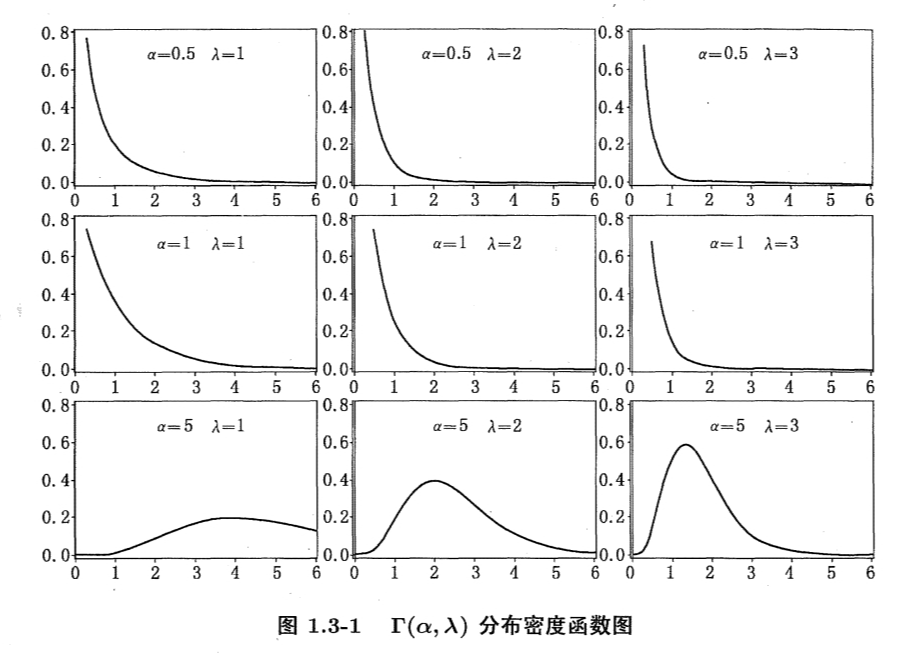

# FDU 回归分析 2. 多元线性回归

本文根据王勤文老师课堂笔记整理而成，并参考以下教材:

- 应用回归分析 (第 $5$ 版, 何晓群, 刘文卿) 第 $3$ 章
- Statistical Inference (2nd Edition, G. Casella) Chapter $12$
- 统计推断 (第 $2$ 版, G. Casella) 第 $12$ 章
- 数理统计讲义 (郑明, 陈子毅, 汪嘉冈) 第 $1$ 章
- Introduction to Probability Models: Applied Stochastic Processes (S. Ross) Chapter $2$
- 应用随机过程: 概率模型导论 (S. Ross) 第 $2$ 章

欢迎批评指正!

## 2.1 多元线性回归模型

我们势必要将简单线性回归模型推广至多元线性回归模型，以解决更多实际问题.

### 2.1.1 一般形式

设随机变量 $Y$ 与一般变量 $x_1,\dots,x_p$ 具有如下关系:
$$
Y 
= \beta^{\mathrm T}x + \varepsilon
= \beta_0 + \beta_1 x_1 + \dots + \beta_p x_p + \varepsilon\\
\text{E}[Y|x] = \beta^{\mathrm T}x,
$$
其中:
$$
\begin{cases}
x = [1,x_1,\dots,x_p]^{\mathrm T}\in \mathbb R^{p+1}\\
\beta = [\beta_0,\beta_1,\dots,\beta_p]^{\mathrm T} \in \mathbb R^{p+1}\\
\text{E}[\varepsilon] = 0\\
\text{Var}[\varepsilon]=\sigma^2.
\end{cases}
$$
设观测数据为 $(x^{(1)},y_1),\dots,(x^{(n)},y_n)$，   
其中 $x^{(i)} = [1,x_1^{(i)},\dots,x_p^{(i)}]^{\mathrm T}\in \mathbb R^{p+1}\ (i=1,\dots,n)$.  
若以它们为行向量构造 $X=[x^{(1)},\dots,x^{(n)}]^{\mathrm T}\in \mathbb R^{n\times (p+1)}$，则我们有:
$$
\begin{cases}
y_1 = \beta^{\mathrm T} x^{(1)} + \varepsilon_1\\
\quad\ \ \vdots\\
y_n = \beta^{\mathrm T} x^{(n)} + \varepsilon_n
\end{cases}

\ \ \Leftrightarrow\ \ 

y = \begin{bmatrix} y_1 \\ \vdots\\ y_n\end{bmatrix}
= \begin{bmatrix}
(x^{(1)})^{\mathrm T}\\
\vdots\\
(x^{(n)})^{\mathrm T}
\end{bmatrix}
\beta 
+ 
\begin{bmatrix}
\varepsilon_1\\
\vdots\\
\varepsilon_n
\end{bmatrix} 
=
X\beta +\varepsilon.
$$

我们称 $X$ 称为**设计矩阵** (design matrix).

### 2.1.2 基本假定

为方便对模型进行估计，我们做如下基本假定:

- ① 解释变量 $x_1,\dots,x_p$ 是确定性变量，不是随机变量，且与随机误差 $\varepsilon$ 无关.
- ② $X \in \mathbb R^{n\times (p+1)}$ 是扁平的列满秩矩阵，即 $\rank(X)=p+1<n$ (这保证 $X^{\mathrm T}X$ 正定, 因而可逆)  
  这表明设计矩阵 $X$ 的自变量列之间不线性相关，且样本量 $n$ 大于参数个数 $p+1$ 
- ③ (Gauss-Markov 条件) 随机误差项 $\varepsilon_1,\dots,\varepsilon_n$ 零均值、不相关且方差相等，即 $\begin{cases}
  \text{E}[\varepsilon]=0_n\\
  \text{Cov}[\varepsilon]=\sigma^2 I_n\end{cases}$ 
- ④ (正态假设) 随机误差 $\varepsilon_1,\dots,\varepsilon_n$ 服从正态分布  
  结合 ③ 的假设，我们可以统一记为 $\varepsilon \sim N(0_n,\sigma^2 I_n)$ 

满足上述所有假设的模型 $y=X\beta+\varepsilon$ 便称为条件正态模型，它可写为 $y\sim N(X\beta,\sigma^2 I_n)$ 

## 2.2 参数的点估计

### 2.2.1 最小二乘: 数学解

(注意: 本节我们不对随机误差 $\varepsilon_1,\dots,\varepsilon_n$ 做任何统计上的假设)  
我们定义观测数据 $(x^{(1)},y_1),\dots,(x^{(n)},y_n)$ 关于直线 $\text{E}[Y|x]=\beta^{\mathrm T}x$ 的**残差平方和** (residual sum of squares) 为:  
$$
\text{RSS}(\beta) := \sum_{i=1}^n [y_i - \beta^{\mathrm T}x^{(i)}]^2 = \|y-X\beta\|_2^2\\
\nabla_\beta \text{RSS}(\beta) = -2X^{\mathrm T}(y-X\beta)\\
\nabla_\beta^2 \text{RSS}(\beta) = 2X^{\mathrm T}X \succ 0
$$
最小二乘的观点表明:  
$$
\hat \beta = \arg \min_{\beta} \text{RSS}(\beta) = \arg \min_{\beta} \|y-X\beta\|_2^2
$$
注意到目标函数 $\text{RSS}(\beta)=\|y-X\beta\|_2^2$ 是关于 $\beta$ 的严格凸函数  
因此上述优化问题的最优解是唯一的，且为驻点 (即使得梯度为零的点)  
令 $\nabla_\beta \text{RSS}(\beta) = -2X^{\mathrm T}(y-X\beta)=0_{p+1}$ 解得最小二乘解为 $\hat \beta = (X^{\mathrm T}X)^{-1}X^{\mathrm T}y$ 

#### (1) 无偏性

下面我们证明 $\hat \beta - \beta$ 可以写成 $\varepsilon$ 的线性组合:
$$
\begin{align}
\hat \beta - \beta
&=
(X^{\mathrm T}X)^{-1}X^{\mathrm T}y - \beta\\
&=
(X^{\mathrm T}X)^{-1}X^{\mathrm T}(X\beta +\varepsilon) - \beta\\
&=
\beta + (X^{\mathrm T}X)^{-1} X^{\mathrm T}\varepsilon - \beta\\
&=
(X^{\mathrm T}X)^{-1}X^{\mathrm T}\varepsilon
\end{align}
$$
因此在 $\begin{cases}
\text{E}[\varepsilon]=0_n\\
\text{Cov}[\varepsilon]=\sigma^2 I_n\end{cases}$ 的假设下我们有:  
$$
\begin{align}
\text{E}[\hat \beta] 
&=
\text{E}[\beta + (X^{\mathrm T}X)^{-1}X^{\mathrm T}\varepsilon]\\
&=
\beta + (X^{\mathrm T}X)^{-1}X^{\mathrm T} \text{E}[\varepsilon]\\
&=
\beta + (X^{\mathrm T}X)^{-1}X^{\mathrm T} 0_n\\
&= \beta\\

\hline
\text{Cov}[\hat \beta]
&=
\text{Cov}[\beta + (X^{\mathrm T}X)^{-1}X^{\mathrm T}\varepsilon]\\
&=
(X^{\mathrm T}X)^{-1}X^{\mathrm T} \text{Cov}[\varepsilon] ((X^{\mathrm T}X)^{-1}X^{\mathrm T})^{\mathrm T}\\
&=
(X^{\mathrm T}X)^{-1}X^{\mathrm T} \cdot \sigma^2 I_n \cdot X(X^{\mathrm T}X)^{-1}\\
&=
\sigma^2 (X^{\mathrm T}X)^{-1}
\end{align}
$$
进一步，在 $\varepsilon \sim N(0_n,\sigma^2 I_n)$ 的假设下我们有:  
$$
\hat \beta \sim N(\beta , \sigma^2 (X^{\mathrm T}X)^{-1})
$$

#### (2) 投影矩阵

根据最小二乘估计量 $\hat \beta$ 得到的预测值 $\hat y = X\hat \beta = X(X^{\mathrm T}X)^{-1}X^{\mathrm T}y$   
结合最小二乘解的几何意义我们知道: $\hat y$ 是 $y\in \mathbb R^n$ 在 $X$ 的列空间 $\text{span}\{X\}$ 的正交投影.  
我们记正交投影矩阵 $H=X(X^{\mathrm T}X)^{-1}X^{\mathrm T}$，容易验证它具有以下性质:

- ① 对称: $H^{\mathrm T}=H$ (进而有 $(I_n - H)^{\mathrm T}=I_n-H$)   
  这保证了 $H$ 的 $n$ 个特征值均为实数 (进而 $I_n-H$ 的 $n$ 个特征值也均为实数)

- ② 幂等: $H^2 = H$ (进而有 $(I_n-H)^2 = I_n-H$)  
  这保证了 $H$ 的特征值只能是 $0$ 或 $1$ (进而 $I_n-H$ 的 $n$ 个特征值也只能是 $0$ 或 $1$)

- ③ 迹与特征值: $\tr(H)=p+1$ (进而有 $\tr(I_n-H)=n-p-1$)  
  这保证了 $H$ 的特征值为 $n-p-1$ 个 $0$ 和 $p+1$ 个 $1$ (进而 $I_n-H$ 的特征值为 $n-p-1$ 个 $1$ 和 $p+1$ 个 $0$)

- ④ 映射公式:   
  由于 $H$ 是 $\mathbb R^n$ 空间投影至 $\text{span}\{X\}$ 的正交投影矩阵 (且注意到 $X$ 的第 $1$ 列为 $1_n$)，因此我们有:
  $$
  \begin{align}
  Hy=\hat y \ &\Rightarrow\ (I_n-H)y = y-\hat y\\
  HX=X\ &\Rightarrow\ (I_n-H)X=0_{n\times (p+1)}\\
  H1_n = 1_n\ &\Rightarrow\ (I_n -H)1_n = 0_{n}
  \end{align}
  $$

以简单线性回归为例展示最小二乘的几何意义:

### 2.2.2 最佳线性无偏估计: 统计解

现在给定 $\begin{cases}
\text{E}[\varepsilon]=0_n\\
\text{Cov}[\varepsilon]=\sigma^2 I_n\end{cases}$ 的假设 (但我们不对 $\varepsilon$ 的分布进行假设)  
下面我们证明最小二乘估计量 $\hat \beta_{\text{LSE}} = (X^{\mathrm T}X)^{-1}X^{\mathrm T}y$ 是 $\beta$ 的线性无偏估计类中最优的估计量.

- 首先，$\beta$ 的一个线性估计量具有形式 $\hat\beta= C^{\mathrm T} y$ (其中 $C\in \mathbb R^{n\times (d+1)}$ 是已知且固定的矩阵) 

- 其次，$\beta$ 的一个线性无偏估计量还满足 $\text{E}[\hat \beta] =\beta$，也就是说:  
  $$
  \begin{align}
  \text{E}[\hat \beta] 
  &= \text{E}[C^{\mathrm T}y]\\
  &= \text{E}[C^{\mathrm T}(X\beta + \varepsilon)]\\
  &= C^{\mathrm T}X\beta + C^{\mathrm T}\text{E}[\varepsilon] \quad (\text{note that }\text{E}[\varepsilon]=0_n)\\
  &= C^{\mathrm T}X\beta\\
  &=\beta
  \end{align}
  $$
  根据 $C^{\mathrm T}X\beta = \beta$ 可知 $C\in \mathbb R^{n\times (d+1)}$ 满足 $C^{\mathrm T}X=I_{d+1}$ 

- 最后，$\beta$ 的最佳线性无偏估计量还满足 $\tr{(\text{Cov}[\hat \beta])} = \underset{C^{\mathrm T}X=I_{d+1}}\min \tr(\text{Cov}[C^{\mathrm T}y])$   
  注意到目标函数可以化为:   
  $$
  \begin{align}
  \tr(\text{Cov}[C^{\mathrm T}y])
  &=
  \tr(C^{\mathrm T}\text{Cov}[y]C)\\
  &=
  \tr(C^{\mathrm T}\text{Cov}[X\beta + \varepsilon] C)\\
  &=
  \tr(C^{\mathrm T}\text{Cov}[\varepsilon]C)\\
  &=
  \tr(C^{\mathrm T}\cdot\sigma^2 I_n\cdot C)\\
  &=
  \sigma^2 \tr(C^{\mathrm T}C)
  \end{align}
  $$
  因此问题变为求解最优化问题:  
  $$
  \hat C = \arg \min_{C^{\mathrm T}X=I_{d+1}} \tr(C^{\mathrm T}C) = \arg \min_{C^{\mathrm T}X=I_{d+1}} \|C\|_F^2
  $$
  其中 $\|C\|_F$ 代表矩阵 $C\in \mathbb R^{n\times (d+1)}$ 的 Frobenius 范数.

  注意到目标函数是 (严格) 凸函数 (因为可以验证 $\nabla_C^2 \{\tr(C^{\mathrm T}C)\}=2I_n\succ 0\ (\forall\ C\in \mathbb R^{n\times (d+1)})$)  
  因此其 KKT 点就对应其最优解. 

  定义 Lagrange 函数为 $L(C,\Lambda) = \tr(C^{\mathrm T}C) - \tr(\Lambda (C^{\mathrm T}X-I_{d+1}))$，    
  其中对称正定阵 $\Lambda \in \mathbb R^{(d+1)\times (d+1)}$ 是约束条件 $C^{\mathrm T}X=I_{d+1}$ 对应的 Lagrange 乘子.   

  > 回忆起高等线性代数中的一些求导结论:  
  > $\nabla_X \tr(AX)=\nabla_X \tr(XA)=\nabla_X \tr(A^{\mathrm T}X^{\mathrm T})= \nabla_X \tr(X^{\mathrm T}A^{\mathrm T})= A^{\mathrm T}$ (特殊地我们有 $\nabla_X \tr(X) = I$)    
  > $\nabla_X\| X \|_F^2 = \nabla_X \tr(X^{\mathrm T}X) = \nabla_X \tr(XX^{\mathrm T})=2X$

  我们计算其关于 $C\in \mathbb R^{n\times (d+1)}$ 的梯度:
  $$
  \begin{align}
  \nabla_C L(C,\Lambda) 
  &=
  \nabla_C\{\tr(C^{\mathrm T}C) - \tr(\Lambda (C^{\mathrm T}X-I_{d+1}))\}\\
  &=
  \nabla_C\{\tr(C^{\mathrm T}C)\} - \nabla_C\{\tr(C^{\mathrm T}X \Lambda)\}\\
  &=
  2C - X\Lambda
  \end{align}
  $$
  其 KKT 条件如下: 
  $$
  \begin{cases}
  \nabla_C L(C,\Lambda) = 2C-X\Lambda = 0_{n\times (d+1)}\\
  C^{\mathrm T}X=I_{d+1}
  \end{cases}
  $$
  可解得 $\begin{cases}
  \hat \Lambda = 2(X^{\mathrm T}X)^{-1}\\
  \hat C = \frac12 X \hat \Lambda = X(X^{\mathrm T}X)^{-1}\end{cases}$ 

  因此最佳线性无偏估计量为:   
  $$
  \hat \beta = \hat C^{\mathrm T} y = [X(X^{\mathrm T}X)^{-1}]^{\mathrm T} y = (X^{\mathrm T}X)^{-1}X^{\mathrm T}y
  $$
  其协方差矩阵的迹为 $\beta$ 的线性无偏估计量所能具有的协方差矩阵的迹的最小值 (因而 $\hat \beta$ 是最稳定的线性无偏估计量):   
  $$
  \begin{align}
  \tr{(\text{Cov}[\hat\beta])}
  &=
  \min_{C^{\mathrm T}X=I_{d+1}} \{\tr(\text{Cov}[C^{\mathrm T}y])\}\\
  &=
  \min_{C^{\mathrm T}X=I_{d+1}} \{\sigma^2 \tr(C^{\mathrm T}C)\}\\
  &=
  \sigma^2 \tr{(\hat C^{\mathrm T}\hat C)}\\
  &=
  \sigma^2 \tr\{[X(X^{\mathrm T}X)^{-1}]^{\mathrm T}[X(X^{\mathrm T}X)^{-1}]\}\\
  &=
  \sigma^2 \tr[(X^{\mathrm T}X)^{-1}]\\
  \hline
  \text{Cov}[\hat \beta]
  &=
  \sigma^2 (X^{\mathrm T}X)^{-1}
  \end{align}
  $$

****

**(多元线性回归中的 Gauss-Markov 定理)**  
给定数据点 $(x^{(1)},y_1),\dots,(x^{(n)},y_n)$ 和多元线性回归模型 $Y= \beta^{\mathrm T}x + \varepsilon$ (其中 $\beta\in \mathbb R^{p+1}$ 为参数向量，$\varepsilon$ 为随机噪音)    
记样本关系为 $y=X\beta + \varepsilon$ (其中 $X=[x^{(1)},\dots,x^{(n)}]^{\mathrm T}\in \mathbb R^{n\times (p+1)}$ 为设计矩阵，$\varepsilon\in \mathbb R^n$ 为随机误差构成的列向量)

若 $\begin{cases}
\text{E}[\varepsilon] = 0_n\\
\text{Var}[\varepsilon] = \sigma^2 I_n
\end{cases}$ (零均值和互不相关, 无需给出分布上的假设)，  
则最小二乘估计量 $\hat\beta = (X^{\mathrm T}X)^{-1}X^{\mathrm T}y$ 是参数向量 $\beta$ 的最佳线性无偏估计量 (Best Linear Unbiased Estimator, BLUE)  
$$
\text{E}[\hat \beta] = \beta\\
\text{Cov}[\hat \beta] = \sigma^2 (X^{\mathrm T}X)^{-1}
$$

### 2.2.3 极大似然估计

现在我们考虑正态假设  $\varepsilon \sim N(0_n,\sigma^2 I_n)$ 下的多元线性回归模型 $y=X\beta+\varepsilon$ (可等价写作 $y\sim N(X\beta,\sigma^2 I_n)$)   
这称为条件正态模型.

#### (1) 似然解

下面求解 $\beta$ 和 $\sigma^2$ 的极大似然估计量:

$y\sim N(X\beta,\sigma^2 I_n)$ 的概率密度函数为:
$$
\begin{align}
f(y)
&=
\frac{1}{(\sqrt{2\pi})^n |\sigma^2 I_n|^\frac12} \exp\{-\frac12 (y-X\beta)^{\mathrm T}(\sigma^2 I_n)^{-1} (y-X\beta)\}\\
&=
\frac{1}{(\sqrt{2\pi}\sigma)^n}\exp\{-\frac{1}{2\sigma^2}(y-X\beta)^{\mathrm T}(y-X\beta)\}
\end{align}
$$
似然函数 $L(\beta,\sigma^2|X,y)$ 和对数似然函数 $\log L(\beta,\sigma^2|X,y)$ 为:
$$
\begin{align}
L(\beta,\sigma^2|X,y)
&=
f(y)
=\frac{1}{(\sqrt{2\pi}\sigma)^n}\exp\{-\frac{1}{2\sigma^2}(y-X\beta)^{\mathrm T}(y-X\beta)\}\\

\log L(\beta,\sigma^2|X,y)
&=
- \frac{n}{2}\log(2\pi) - \frac{n}{2}\log(\sigma^2)-\frac1{2\sigma^2} (y-X\beta)^{\mathrm T}(y-X\beta)

\end{align}
$$
注意到对于任意固定的 $\sigma^2$，对数似然函数 $\log L(\beta,\sigma^2|X,y)$ 作为 $\beta$ 的函数最大化的问题，  
就等价于残差平方和 $\text{RSS}(\beta)= \|y - X\beta\|_2^2$ 作为 $\beta$ 的函数最小化的问题.     
因此对于任意固定的 $\sigma^2$，$\beta$ 的极大似然估计量正是最小二乘估计量 $\hat\beta = (X^{\mathrm T}X)^{-1}X^{\mathrm T}y$  

由于 $y\sim N(X\beta,\sigma^2 I_n)$，结合 $\begin{cases}
\text{E}[\hat\beta]=\beta\\
\text{Var}[\hat \beta] = \sigma^2(X^{\mathrm T}X)^{-1}\end{cases}$ 的结论可知 $\beta\sim N(\beta,\sigma^2(X^{\mathrm T}X)^{-1})$   
(正态随机变量只需确定均值和方差便能确定它的分布)

****

现在我们将 $\hat\beta = (X^{\mathrm T}X)^{-1}X^{\mathrm T}y$ 代入对数似然函数 $\log L(\beta,\sigma^2|X,y)$ 以求得 $\sigma^2$ 的极大似然估计量. 

注意到对数似然函数 $\log L(\hat \beta,\sigma^2|X,y)$ 关于 $\sigma^2$ 是严格凹函数，因此其最大值点唯一且为驻点. 
我们令:
$$
\frac{\partial}{\partial \sigma^2}L(\hat \beta,\sigma^2|X,y) = -\frac{n}{2\sigma^2} + \frac{1}{2\sigma^4}(y-X\hat\beta)^{\mathrm T}(y-X\hat\beta) = 0
$$
解得 $\hat\sigma^2 = \frac1{n}\|y-X\hat\beta\|_2^2 = \frac1n\text{RSS}(\hat \beta)=\frac1n \text{SSE}$    
即为在最小二乘线 $y=\hat \beta^{\mathrm T}x$ 处算得的残差平方和 $\text{RSS}(\hat \beta)$ 除以样本量 $n$
$$
\begin{align}
\hat \sigma^2 
&=
\frac1n \text{RSS}(\hat \beta)\\
&=
\frac1n \|y-X \hat \beta\|_2^2\quad (\text{recall that }\hat y = X\hat \beta = Hy\text{ where }H=X(X^{\mathrm T}X)^{-1}X^{\mathrm T})\\
&=
\frac1n \|y-Hy\|_2^2\\
&=
\frac1n y^{\mathrm T}(I_n-H)^{\mathrm T} (I_n - H)y\quad (\text{note that }H\text{ is symmetric and idempotent})\\
&=
\frac1n y^{\mathrm T}(I_n-H)y\quad (\text{note that }y=X\beta + \varepsilon)\\
&=
\frac1n (X\beta + \varepsilon)^{\mathrm T}(I_n-H)(X\beta +\varepsilon)\quad(\text{note that }HX=X\text{ so that }(I_n-H)X=0_{n\times (p+1)})\\
&=
\frac1n \varepsilon^{\mathrm T}(I_n-H)\varepsilon
\end{align}
$$

#### (2) 纠偏

下面我们证明 $\sigma^2$ 的极大似然估计量 $\hat\sigma^2 = \frac1{n}\|y-X \hat \beta\|_2^2 = \frac1n \varepsilon^{\mathrm T} (I_n - H)\varepsilon$ 不是无偏的.
$$
\begin{align}
\text{E}[\hat \sigma^2]
&=
\text{E}[\frac1n \varepsilon^{\mathrm T}(I_n-H)\varepsilon]\\
&=
\frac1n \text{E}\{\tr[\varepsilon^{\mathrm T}(I_n-H)\varepsilon]\}\\
&=
\frac1n \text{E}\{\tr[(I_n-H)\varepsilon\varepsilon^{\mathrm T}]\}\\
&=
\frac1n \tr\{\text{E}[(I_n-H)\varepsilon \varepsilon^{\mathrm T}]\}\\
&=
\frac1n \tr\{(I_n-H)\text{E}[\varepsilon \varepsilon^{\mathrm T}]\}\\
&=
\frac1n \tr\{(I_n-H)\text{Cov}(\varepsilon)\}\\
&=
\frac1n \tr\{(I_n-H)\sigma^2 I_n\}\\
&=
\frac{1}n \sigma^2\cdot \tr(I_n-H)\quad (\text{note that }\tr(I_n-H)=n-\tr(H) = n-p-1)\\
&=
\frac{n-p-1}n\sigma^2
\end{align}
$$
因此 $\hat \sigma^2$ 不是 $\sigma^2$ 的无偏估计量  
我们可以构造 $\sigma^2$ 的无偏估计量为 $s^2 = \frac{n}{n-p-1}\hat\sigma^2 =\frac{1}{n-p-1}\|y - X\hat \beta \|_2^2 = \frac{1}{n-p-1}\varepsilon^{\mathrm T} (I_n-H)\varepsilon$  

#### (3) 分布

在 $2.2.3 (1)$ 中我们已经说明了最小二乘估计量 $\hat\beta = (X^{\mathrm T}X)^{-1}X^{\mathrm T}y$ 服从正态分布:
$$
\beta\sim N(\beta,\sigma^2(X^{\mathrm T}X)^{-1})
$$

****

下面我们证明 $s^2 = \frac1{n-p-1}\|y-X \hat \beta\|_2^2 = \frac1{n-p-1} \varepsilon^{\mathrm T} (I_n - H)\varepsilon$ 与 $\hat \beta$ 独立:

> 在证明之前我们先给出两个有用的引理:  
> **(Statistical Inference 引理 $11.3.2$)**  
> 设 $Y_1,\dots,Y_n$ 是互不相关的随机变量，$\text{Var}(Y_i)=\sigma^2_i\ (i=1,\dots,n)$，$a,b\in \mathbb R^n$ 为常数向量.  
> 若记 $Y=[Y_1,\dots,Y_n]^{\mathrm T},\Sigma = \text{Cov}(Y)=\text{diag}\{\sigma_1^2,\dots,\sigma^2_n\}$，则我们有:    
> $$
> \text{Cov}(a^{\mathrm T}Y,b^{\mathrm T}Y) = \text{Cov}(\sum_{i=1}^n a_i Y_i, \sum_{i=1}^n b_i Y_i) = \sum_{i=1}^n a_i b_i\sigma_i^2 = a^{\mathrm T} \Sigma b
> $$
> **(Statistical Inference 引理 $5.3.3$)**  
> 设 $X_i\sim N(\mu_i,\sigma_i^2)\ (i=1,\dots,n)$ 相互独立，记:  
> $$
> X = \begin{bmatrix}
> X_1\\
> \vdots\\
> X_n
> \end{bmatrix}
> \quad 
> U =\begin{bmatrix}
> U_1\\
> \vdots\\
> U_k
> \end{bmatrix}
> \quad
> V=\begin{bmatrix}
> V_1\\
> \vdots\\
> V_m
> \end{bmatrix}\ (\text{where }k+m\leq n)\\
> 
> A=[a_1,\dots,a_k] \in \mathbb R^{n\times k}\quad B=[b_1,\dots,b_m]\in \mathbb R^{n\times m}\\
> 
> U=A^{\mathrm T} X = \begin{bmatrix}
> a_1^{\mathrm T}X\\
> \vdots\\
> a_k^{\mathrm T}X
> \end{bmatrix}
> 
> \quad
> 
> V=B^{\mathrm T} X = \begin{bmatrix}
> b_1^{\mathrm T}X\\
> \vdots\\
> b_m^{\mathrm T}X
> \end{bmatrix}\\
> 
> \Sigma = \text{Cov}(X) =\text{diag}\{\sigma_1^2,\dots,\sigma_n^2\}
> $$
> 则我们有:  
>
> - $U_i$ 和 $V_j$ 相互独立当且仅当 $\text{Cov}(U_i,V_j) = \text{Cov}(a_i^{\mathrm T}X,b_j^{\mathrm T}X) = a_i^{\mathrm T}\Sigma b_j=0$   
>   其中 $i=1,\dots,k$ 而 $j=1,\dots,m$ 
> - $U$ 和 $V$ 相互独立当且仅当对于任意 $i=1,\dots,k$ 和 $j=1,\dots,m$ 都有 $\text{Cov}(U_i,V_j)=0$   
>   即当且仅当 $\text{Cov}(U,V) = \text{Cov}(A^{\mathrm T}X,B^{\mathrm T}X) = A^{\mathrm T} \Sigma B = 0_{k\times m}$

要证明 $s^2 = \frac1{n-p-1} \|(I_n - H)\varepsilon\|_2^2$ 与 $\hat \beta$ 独立，只需证明 $(I_n -H)\varepsilon$ 与 $\hat \beta$ 独立即可  
根据 **Statistical Inference 引理 $5.3.3$** 可知只需证明 $\text{Cov}((I_n -H)\varepsilon,\hat \beta)=0_{n\times (p+1)}$ 即可.  
回忆起 $\hat \beta - \beta$ 可以写成 $\varepsilon$ 的线性组合: $\hat \beta - \beta = (X^{\mathrm T}X)^{-1}X^{\mathrm T}\varepsilon$，故我们有:
$$
\begin{align}
\text{Cov}((I_n-H)\varepsilon,\hat \beta)
&=
\text{Cov}((I_n-H)\varepsilon,\hat \beta - \beta)\\
&=
\text{Cov}((I_n-H)\varepsilon, (X^{\mathrm T}X)^{-1}X^{\mathrm T}\varepsilon)\\
&=
(I_n-H)\text{Cov}(\varepsilon) [(X^{\mathrm T}X)^{-1}X^{\mathrm T}]^{\mathrm T}\\
&=
(I_n-H)\cdot \sigma^2 I_n \cdot X(X^{\mathrm T}X)^{-1}\\
&=
\sigma^2 (I_n-H) X(X^{\mathrm T}X)^{-1}\quad (\text{recall that }(I_n-H)X=0_{n\times (p+1)})\\
&=
\sigma^2 \cdot 0_{n\times (p+1)}\cdot (X^{\mathrm T}X)^{-1}\\
&=
0_{n\times (p+1)}
\end{align}
$$
因此 $s^2$ 与 $\hat \beta$ 相互独立. 

****

下面我们证明 $\frac{n-p-1}{\sigma^2}s^2 = \frac1{\sigma^2}\varepsilon^{\mathrm T} (I_n - H)\varepsilon$ 服从自由度为 $n-p-1$ 的卡方分布 $\chi^2_{(n-p-1)}$  
在 $2.2.1(2)$ 节我们说明了投影矩阵 $H=X(X^{\mathrm T}X)^{-1}X^{\mathrm T}$ 的几个性质:

- ① 对称: $H^{\mathrm T}=H$ (进而有 $(I_n - H)^{\mathrm T}=I_n-H$)   
  这保证了 $H$ 的 $n$ 个特征值均为实数 (进而 $I_n-H$ 的 $n$ 个特征值也均为实数)
- ② 幂等: $H^2 = H$ (进而有 $(I_n-H)^2 = I_n-H$)  
  这保证了 $H$ 的特征值只能是 $0$ 或 $1$ (进而 $I_n-H$ 的 $n$ 个特征值也只能是 $0$ 或 $1$)
- ③ 迹与特征值: $\tr(H)=p+1$ (进而有 $\tr(I_n-H)=n-p-1$)  
  这保证了 $H$ 的特征值为 $n-p-1$ 个 $0$ 和 $p+1$ 个 $1$ (进而 $I_n-H$ 的特征值为 $n-p-1$ 个 $1$ 和 $p+1$ 个 $0$)

设 $I_n-H$ 的谱分解 (实对称阵一定具有谱分解) 为:
$$
U^{\mathrm T}(I_n-H)U = \Lambda = \text{diag}\{\underset{n-p-1}{\underbrace{1,\dots,1}},\underset{p+1}{\underbrace{0,\dots,0}}\}
$$
记 $\eta := \frac{1}{\sigma}U^{\mathrm T}\varepsilon$，根据 $\varepsilon\sim N(0_n,\sigma^2 I_n)$ 可知 $\eta = \frac{1}{\sigma}U^{\mathrm T}\varepsilon \sim N(\frac{1}{\sigma}U^{\mathrm T}0_n,\frac{1}{\sigma^2}U^{\mathrm T}\sigma^2 I_n U) = N(0_n, I_n)$.   
这表明 $\eta = [\eta_1,\dots,\eta_n]^{\mathrm T}$ 的分量是独立同分布的标准正态随机变量.    
于是我们有:  
$$
\begin{align}
\frac{n-p-1}{\sigma^2}s^2 
&=
 \frac{1}{\sigma^2}\varepsilon^{\mathrm T} (I_n - H)\varepsilon\\
&=
 \frac{1}{\sigma^2}\varepsilon^{\mathrm T} U\Lambda U^{\mathrm T}\varepsilon\\
&=
\eta^{\mathrm T} \Lambda \eta\\
&=
 \sum_{i=1}^{n-p-1} \eta_i^2\sim \chi^2_{(n-p-1)}\quad (\text{note that }\Lambda=\text{diag}\{\underset{n-p-1}{\underbrace{1,\dots,1}},\underset{p+1}{\underbrace{0,\dots,0}}\})
\end{align}
$$
这样我们就证明了 $\frac{n-p-1}{\sigma^2}s^2 = \frac1{\sigma^2}\varepsilon^{\mathrm T} (I_n - H)\varepsilon$ 服从自由度为 $n-p-1$ 的卡方分布 $\chi^2_{(n-p-1)}$   
据此我们也可以自然地得到:   
$$
(n-p-1)s^2 = n\hat \sigma^2 \sim \sigma^2\chi^2_{(n-p-1)}\\
\text{E}[\hat \sigma^2] = \frac{\sigma^2}{n}(n-p-1) = \frac{n-p-1}{n}\sigma^2
\ \Rightarrow\ 
\text{E}[s^2] = \sigma^2\\

\text{Var}[\hat \sigma^2] = \frac{\sigma^4}{n^2}2(n-p-1) = \frac{2(n-p-1)}{n^2}\sigma^4
\ \Rightarrow\ 
\text{Var}[s^2] = \frac{2}{n-p-1}\sigma^4
$$

****

总之我们有如下定理:  
在条件正态模型下，$\hat \beta,s^2$ 分别是 $\alpha,\beta,\sigma^2$ 的无偏估计量，它们满足:
$$
\hat \beta = (X^{\mathrm T}X)^{-1}X^{\mathrm T}y\\

s^2 = \frac1{n-p-1}\|y-X\hat \beta\|_2^2 = \frac1{n-p-1} \varepsilon^{\mathrm T} (I_n - H)\varepsilon 
\text{ where }H = X(X^{\mathrm T}X)^{-1}X^{\mathrm T}\\

\hline 
\hat \beta \sim N(\beta,\sigma^2(X^{\mathrm T}X)^{-1})\\
\frac{(n-p-1)s^2}{\sigma^2} \sim \chi^2_{(n-p-1)}\\

\hline
\text{Var}[s^2] = \frac{2}{n-p-1}\sigma^4
$$

## 2.3 假设检验

### 2.3.1 常用分布

(本节内容取自 FDU 数理统计 1. 基础知识)

#### (1) Gamma 分布 $\text{Gamma}(\alpha,\lambda)$

定义 **Gamma 函数**为 $\begin{cases}
\Gamma (\alpha) = \int_0^{+\infty} e^{-t}t^{\alpha-1}dt\\ 
\text{dom}(\Gamma) = \{\alpha\in \mathbb C:\text{Re}(\alpha)>0\}
\end{cases}$  
特殊地，对于任意整数 $n$ 有 $\Gamma(n) = (n-1)!$ 成立，  
实际上 $\Gamma$ 函数是阶乘函数在实数域和复数域上的推广.  
它还具有性质 $\begin{cases}
\Gamma(\frac12)=\sqrt{\pi}\\
\Gamma(1) =1\\
\Gamma(\alpha+1)=\alpha\Gamma(\alpha)\end{cases}$  

若对于某对 $\begin{cases} \alpha>0\\ \lambda>0 \end{cases}$ 有 $f(x) = \frac{\lambda^\alpha}{\Gamma(\alpha)}x^{\alpha-1} e^{-\lambda x}I_{(0,\infty)}(x) = \begin{cases} 
\frac{\lambda e^{-\lambda x}(\lambda x)^{\alpha-1}}{\Gamma(\alpha)},&x> 0\\ 0,&\text{otherwise}  \end{cases}$ 成立  
则称 $X$ 为具有参数 $(\alpha,\lambda)$ 的 **Gamma 随机变量**，记为 $X\sim \text{Gamma}(\alpha,\lambda)$  
它没有解析形式的累积分布函数.  
它满足 $\begin{cases}
M_X(t) = (\frac{\lambda}{\lambda-t})^\alpha\quad (t<\lambda)\\
\varphi_X(t) = (\frac{\lambda}{\lambda-it})^\alpha\\  
\text{E}[X^k] = \frac{\Gamma (\alpha + k)}{\lambda^k \Gamma(\alpha)}\ \ (\forall\ k = 1,2,\dots)\\
\text{E}[X] = \frac{\alpha}{\lambda}\\
\text{E}[X^2] = \frac{\alpha(\alpha+1)}{\lambda^2}\\
\mu_2 =\text{Var}[X] = \frac{\alpha}{\lambda^2}\\
\mu_3 = \text{E}[(X-\text{E}[X])^3] = \frac{2\alpha}{\lambda^3}\\
\mu_4 = \text{E}[(X-\text{E}[X])^4] = \frac{3\alpha^2 + 6\alpha}{\lambda^4}\\
\end{cases}$  

Gamma 分布具有**再生性**：  
即对于任意 $\begin{cases}
X_1\sim \text{Gamma}(\alpha_1,\lambda)\\
X_2\sim \text{Gamma}(\alpha_2,\lambda)\\
X_1\ \bot\ X_2\end{cases}$ 都有 $X_1+X_2\sim \text{Gamma}(\alpha_1+\alpha_2,\lambda)$   
我们在后面会证明这个性质 (**定理1.2.1**)  
特殊地，指数分布 $\exp(\lambda)\overset{\Delta}=\text{Gamma}(1,\lambda)$  

#### (2) 卡方分布 $\chi^2(k)$

若 $X\sim N(0,1)$ (即 $f_X(x) = \frac{1}{\sqrt{2\pi}\sigma}\exp\{-\frac{x^2}{2\sigma^2}\}$)   
则 $Y=g(X) =X^2$ 的概率密度函数为：  
(我们记 $x=h(y) = \sqrt y$，注意这只相当于 "一半的反函数"，所以要乘 $2$；而 $J(x) = \frac{\partial}{\partial x}g(x) = 2x$)   
$$
\begin{align}
f_Y(y) 
&= 2\cdot f_X(h(y))|J(h(y))|^{-1}\\
&= 2f_X(\sqrt{y})\cdot |2\sqrt y|^{-1} \\
&= 2\frac{1}{\sqrt{2\pi}}\exp\{-\frac{(\sqrt y)^2}{2}\}\cdot \frac{1}{2\sqrt y}\\
&= \frac{1}{\sqrt{2\pi y}}\exp\{-\frac{y}{2}\}\\
&= \frac{(\frac{1}{2})^{\frac12}}{\Gamma(\frac12)}y^{\frac12 -1} e^{-\frac12 y} \\
&= \text{P}\{\text{Gamma}(\frac12,\frac12) = y\}\quad (y\geq 0)
\end{align}
$$
于是我们可以知道: $Y=X^2 \sim \text{Gamma}(\frac12,\frac12)\overset{\Delta}=\chi^2(1)$   
**我们称 $Y$ 服从自由度为 $1$ 的卡方分布 $\chi^2(1)$.**

**根据 Gamma 分布的再生性 (定理1.2.2)：**  
若 $X_1,\dots,X_k\overset{iid}\sim N(0,1)$，  
记 $Y_i = X_i^2\sim \text{Gamma}(\frac12,\frac12)\overset{\Delta}=\chi^2(1)\ (\forall\ i=1,\dots,k)$  
则 $Z = \underset{i=1}{\overset{k}\sum}Y_i \sim \text{Gamma}(\frac{k}{2},\frac12) \overset{\Delta}= \chi^2(k)$   
**也就是说，$k$ 个相互独立的标准正态随机变量的平方和 $Z$ 服从自由度为 $k$ 的卡方分布 $\chi^2(k)$**   

卡方随机变量 $X\sim \chi^2(n)=\text{Gamma}(\frac{n}2,\frac12)$ 满足 $\begin{cases}
f_X(x) = \frac{x^{n/2-1}}{2^{n/2}\Gamma(n/2)}e^{-\frac12 x}I_{(0,\infty)}\\
\text{E}[X^k] = \frac{\Gamma (\frac{n}{2} + k)}{(\frac12)^k \Gamma(\frac{n}{2})}\\ \text{E}[X]=n\\
\text{E}[X^2]=n(n+2)\\
\text{Var}[X]=2n\end{cases}$

#### (3) F 分布 $F(k_1,k_2)$ 

若 $\begin{cases}
X_1\sim \chi^2(k_1)\\
X_2\sim \chi^2(k_2)\\
X_1\ \bot\ X_2\end{cases}$，则称 $Y= \frac{X_1/k_1}{X_2/k_2}$ 的分布为 **F 分布**，记为 $F(k_1,k_2)$   
其中 $k_1$称为**分子自由度** (ndf, numerator degrees of freedom)  
而 $k_2$ 称为**分母自由度** (ddf, denominator degrees of freedom).  
根据定理 1.4 可知：  
若 $\begin{cases}
X_1\sim \chi^2(k_1)= \text{Gamma}(\frac{k_1}2,\frac12)\\
X_2\sim \chi^2(k_2)= \text{Gamma}(\frac{k_2}2,\frac12)\\
X_1\ \bot\ X_2\end{cases}$，则 $\frac{X_1}{X_2}\sim \text{Beta Prime}(\frac{k_1}{2},\frac{k_2}{2})$   
因此我们知道 $F(k_1,k_2)\overset{d}= \frac{k_2}{k_1} \text{Beta Prime}(\frac{k_1}{2},\frac{k_2}{2})$ 

$F$ 随机变量 $X\sim F(k_1,k_2)$ 满足：$\begin{cases}
f_X(x) = \frac{(k_1/k_2)^{k_1/2}}{\beta(k_1/2,k_2/2)}\frac{x^{k_1/2 - 1}}{(1+(k_1/k_2)x)^{(k_1+k_2)/2}} I_{(0,\infty)}(x)\\   
\qquad\ \ = \frac{k_1^{k_1/2}k_2^{k_2/2}}{\beta(k_1/2,k_2/2)}   
\frac{x^{k_1/2-1}}{(k_2+k_1x)^{(k_1+k_2)/2}}I_{(0,\infty)}(x)\\  
\text{E}[X] = \frac{k_2}{k_2-2}\quad (k_2>3)\\
\text{Var}[X]= \frac{2k_2^2(k_1+k_2-2)}{k_1(k_2-2)^2(k_2-4)}\quad (k_2>4)\end{cases}$  

#### (4) t 分布 $t(k)$ 

若 $\begin{cases}
Z\sim N(0,1)\\
X\sim \chi^2(k)\\
Z\ \bot\ X\end{cases}$，则称 $Y= \frac{Z}{\sqrt{X/k}}$ 的分布为自由度为 $k$ 的 **$t$ 分布**，记为 $t(k)$   
容易验证：$(t(k))^2 \overset{d}= F(1,k)$      
**非中心 $t$ 分布：**  
若 $\begin{cases}
Z\sim N(\mu,1)\\
X\sim \chi^2(k)\\
Z\ \bot\ X\end{cases}$，则记 $Y = \frac{Z}{\sqrt{X/k}}\sim t(k,\mu)$  
其中 $\mu$ 为位置参数，显然 $t(k)\overset{d}=t(k,0)$ 

$t$ 分布随机变量 $X\sim t(k)$ 满足 $\begin{cases}
f_X(x) = \frac12 \cdot \text{P}\{F(1,k)=y\}\cdot |\frac{\partial y}{\partial x}|\\
\qquad \ \ =\frac12\cdot\frac{1^{1/2}k^{k/2}}{\beta(1/2,k/2)}   
\frac{y^{1/2-1}}{(k+y)^{(1+k)/2}}I_{(0,\infty)}(y)\cdot 2|x|\\
\qquad \ \ = \frac12\cdot k^{k/2}\cdot \frac{\Gamma(\frac{k+1}{2})}{\Gamma(\frac12)\Gamma(\frac{k}{2})}\cdot \frac{(x^2)^{-1/2}}{(k+x^2)^{(k+1)/2}}I_{(0,\infty)}(x^2)\cdot 2|x|\\
\qquad \ \ = \frac{\Gamma(\frac{k+1}{2})}{\sqrt{\pi}\Gamma(\frac{k}{2})}\cdot \frac{k^{k/2}}{(k+x^2)^{(k+1)/2}}\\
\qquad \ \ = \frac{\Gamma(\frac{k+1}{2})}{\sqrt{k\pi}\Gamma(\frac{k}{2})}(1+\frac{x^2}{k})^{-\frac{k+1}{2}}\\ 
\text{E}[X] = 0\quad (k>1)\\
\text{Var}[X] = \frac{k}{k-2}\quad (k>2)\end{cases}$ 

### 2.3.2 回归方程显著性的 $F$ 检验

对多元线性回归方程的显著性检验就是要看自变量 $x_1,\dots,x_p$ 从整体上对随机变量 $Y$ 是否有显著的影响.   
考虑第一类型错误概率界限为 $\alpha$ 的检验问题 $H_0:\beta_1=\dotsm = \beta_p = 0\ \leftrightarrow\ H_1:\exists\ i\in\{1,\dots,n\}\text{ such that }\beta_i \neq 0$    
如果零假设 $H_0$ 被推翻，那么我们认为自变量 $x_1,\dots,x_p$ 从整体上对随机变量 $Y$ 有显著的影响.

#### (1) 基本记号

**① 总平方和 (Total Sum of Squares)**  
$$
\begin{align}
\text{SST}
&= S_{yy}\\
&= \|y- \bar y 1_n\|_2^2\\
&= (y-\bar y 1_n)^{\mathrm T} (y-\bar y 1_n)\\
&= y^{\mathrm T}y - n\bar y^2\\
&= y^{\mathrm T}y - n (\frac1n1_n^{\mathrm T}y)^2\\
&= y^{\mathrm T}(I_n - \frac1n 1_n 1_n^{\mathrm T})y
\end{align}
$$
显然 $\text{SST}$ 只与样本有关，与模型无关.  

当零假设 $H_0:\beta_1=\dotsm = \beta_p = 0$ 成立时，我们有 $y=X\beta+\varepsilon = \beta_0 1_n + \varepsilon$，因而有:  
$$
\begin{align}
\text{SST}
&= y^{\mathrm T}(I_n - \frac1n 1_n 1_n^{\mathrm T}) y\\
&\overset{H_0}=
(\beta_0 1_n + \varepsilon)^{\mathrm T}(I_n - \frac1n 1_n 1_n^{\mathrm T}) (\beta_0 1_n + \varepsilon)\\
&= \varepsilon^{\mathrm T} (I_n - \frac1n 1_n 1_n^{\mathrm T}) \varepsilon
\end{align}
$$
注意到 $I_n - \frac1n 1_n 1_n^{\mathrm T}$ 对称、幂等且 $\tr(I_n - \frac1n 1_n 1_n^{\mathrm T})=n-1$  
因此它存在谱分解，且有 $n-1$ 个特征值是 $1$，$1$ 个特征值是 $0$    
我们可设其谱分解为:   
$$
U^{\mathrm T}(I_n - \frac1n 1_n 1_n^{\mathrm T})U = \Lambda = \text{diag}\{\underset{n-1}{\underbrace{1,\dots,1}},0\}
$$
记 $\eta := \frac{1}{\sigma}U^{\mathrm T} \varepsilon$，根据 $\varepsilon\sim N(0_n,\sigma^2 I_n)$ 可知 $\eta = \frac{1}{\sigma}U^{\mathrm T}\varepsilon \sim N(\frac{1}{\sigma}U^{\mathrm T}0_n,\frac{1}{\sigma^2}U^{\mathrm T}\sigma^2 I_n U) = N(0_n, I_n)$   
这表明 $\eta = [\eta_1,\dots,\eta_n]^{\mathrm T}$ 的分量是独立同分布的标准正态随机变量.  
于是我们有: 
$$
\begin{align}
\frac{1}{\sigma^2}\text{SST}
&= 
\frac{1}{\sigma^2}\|y- \bar y 1_n\|_2^2\\
&\overset{H_0}= 
\frac{1}{\sigma^2}\varepsilon^{\mathrm T} (I_n - \frac1n 1_n 1_n^{\mathrm T}) \varepsilon\\
&=
\frac{1}{\sigma^2}\varepsilon^{\mathrm T} U\Lambda U^{\mathrm T} \varepsilon\\
&=
\eta^{\mathrm T}\Lambda \eta\\
&=
\sum_{i=1}^{n-1} \eta_i^2\sim \chi^2_{(n-1)}\quad (\text{note that }\Lambda = \text{diag}\{\underset{n-1}{\underbrace{1,\dots,1}},0\})
\end{align}
$$
此时我们定义**总均方和** (Total Mean Squares) $\text{MST}=\frac{\text{SST}}{\text{df}_T} = \frac{\text{SST}}{n-1}=\frac1{n-1}S_{yy}$，则我们有:  
$$
\text{SST} = S_{yy}\overset{H_0}\sim \sigma^2\chi^2_{(n-1)}\\
\text{MST} = \frac{1}{n-1}S_{yy} \overset{H_0}\sim \sigma^2 \frac{\chi_{(n-1)}^2}{n-1}
$$

****

**② 回归平方和 (Regression Sum of Squares)** 
$$
\begin{align}
\text{SSR} 
&= \|\hat y - \bar y 1_n\|_2^2\\
&= \|Hy - \frac1n 1_n^{\mathrm T}y1_n\|_2^2\\
&= \|(H-\frac1n 1_n1_n^{\mathrm T})y\|_2^2\\
&= y^{\mathrm T} (H-\frac1n 1_n1_n^{\mathrm T})^{\mathrm T} (H-\frac1n 1_n1_n^{\mathrm T}) y\quad (\text{note that }H \text{ satisfies}\begin{cases}
H^{\mathrm T}=H\\
H^2=H\\
H1_n = 1_n\end{cases})\\
&= 
y^{\mathrm T} (H-\frac1n 1_n1_n^{\mathrm T})y
\end{align}
$$
当零假设 $H_0:\beta_1=\dotsm = \beta_p = 0$ 成立时，我们有 $y=X\beta+\varepsilon = \beta_0 1_n + \varepsilon$，因而有:   
$$
\begin{align}
\text{SSR}
&=
y^{\mathrm T} (H-\frac1n 1_n1_n^{\mathrm T})y\\
&\overset{H_0}=
(\beta_0 1_n + \varepsilon)^{\mathrm T} (H-\frac1n 1_n1_n^{\mathrm T})(\beta_0 1_n + \varepsilon)\quad (\text{note that }H1_n=1_n\text{ so that }(H-\frac1n 1_n1_n^{\mathrm T})1_n=0_n)\\
&=
\varepsilon^{\mathrm T}(H-\frac1n 1_n1_n^{\mathrm T})\varepsilon
\end{align}
$$
注意到 $H - \frac1n 1_n 1_n^{\mathrm T}$ 对称、幂等且 $\tr(H - \frac1n 1_n 1_n^{\mathrm T})=(p+1)-1=p$  
因此它存在谱分解，且有 $p$ 个特征值是 $1$，$n-p$ 个特征值是 $0$    
我们可设其谱分解为:   
$$
U^{\mathrm T}(I_n - \frac1n 1_n 1_n^{\mathrm T})U = \Lambda = \text{diag}\{\underset{p}{\underbrace{1,\dots,1}},\underset{n-p}{\underbrace{0,\dots,0}}\}
$$
记 $\eta := \frac{1}{\sigma}U^{\mathrm T} \varepsilon$，根据 $\varepsilon\sim N(0_n,\sigma^2 I_n)$ 可知 $\eta = \frac{1}{\sigma}U^{\mathrm T}\varepsilon \sim N(\frac{1}{\sigma}U^{\mathrm T}0_n,\frac{1}{\sigma^2}U^{\mathrm T}\sigma^2 I_n U) = N(0_n, I_n)$   
这表明 $\eta = [\eta_1,\dots,\eta_n]^{\mathrm T}$ 的分量是独立同分布的标准正态随机变量.  
于是我们有: 
$$
\begin{align}
\frac{1}{\sigma^2}\text{SSR}
&= 
\frac{1}{\sigma^2}\|\hat y- \bar y 1_n\|_2^2\\
&\overset{H_0}= 
\frac{1}{\sigma^2}\varepsilon^{\mathrm T} (H - \frac1n 1_n 1_n^{\mathrm T}) \varepsilon\\
&=
\frac{1}{\sigma^2}\varepsilon^{\mathrm T} U\Lambda U^{\mathrm T} \varepsilon\\
&=
\eta^{\mathrm T}\Lambda \eta\\
&=
\sum_{i=1}^{p} \eta_i^2\sim \chi^2_{(p)}\quad (\text{note that }\Lambda = \text{diag}\{\underset{p}{\underbrace{1,\dots,1}},\underset{n-p}{\underbrace{0,\dots,0}}\})
\end{align}
$$
此时我们定义**回归均方和** (Regression Mean Squares) $\text{MSR}=\frac{\text{SSR}}{\text{df}_R} = \frac{\text{SSR}}{p} = \frac1p \|\hat y - \bar y1_n\|_2^2$，则我们有:  
$$
\text{SSR} = \|\hat y-\bar y1_n\|_2^2 \overset{H_0}\sim \sigma^2\chi^2_{(p)}\\
\text{MSR} = \frac1p\|\hat y-\bar y1_n\|_2^2 \overset{H_0}\sim \sigma^2\frac{\chi^2_{(p)}}{p}\\
$$

****

**③ 误差平方和 (Sum of Squared Errors)**
$$
\begin{align}
\text{SSE}
&=
\text{RSS}(\hat \beta)\\
&=
\|y-\hat y\|_2^2\\
&=
\|y- Hy\|_2^2\\
&=
(n-p-1)s^2\sim \sigma^2\chi^2_{(n-p-1)}
\end{align}
$$
值得注意的是 $\text{SSE}\sim \sigma^2\chi^2_{(n-p-1)}$ 并不依赖于零假设 $H_0:\beta_1=\dotsm = \beta_p = 0$ 成立.  
可以证明 $\text{SSE} = \text{SST}-\text{SSR}$:  
$$
\begin{align}
\text{SSE}
&= \|y-\hat y\|_2^2\\
&= \|y-Hy\|_2^2\\
&= y^{\mathrm T}(I_n-H)y\\
&= y^{\mathrm T}[(I_n-\frac1n 1_n1_n^{\mathrm T}) - (H-\frac1n 1_n1_n^{\mathrm T})]y\\
&= y^{\mathrm T}(I_n-\frac1n 1_n1_n^{\mathrm T})y - y^{\mathrm T}(H-\frac1n 1_n1_n^{\mathrm T})y\\
&=
\text{SST}-\text{SSR}
\end{align}
$$
此时我们定义**均方误差** (Mean Square Error) $\text{MSE}=\frac{\text{SSE}}{\text{df}_E} = \frac{\text{SSE}}{n-p-1} = \frac{1}{n-p-1}\|y-\hat y\|_2^2$，则我们有:  
$$
\text{SSE} = \|y-\hat y\|_2^2 \sim \sigma^2\chi^2_{(n-p-1)}\\
\text{MSE} = \frac{1}{n-p-1}\|y-\hat y\|_2^2 \sim \sigma^2 \frac{\chi_{(n-p-1)}^2}{n-p-1}
$$

*****

总结如下:
$$
\begin{cases}
H_0:\beta_1=\dotsm = \beta_p = 0\\
\hline
\text{SST} = \|y-\bar y 1_n\|_2^2= S_{yy} \overset{H_0}\sim \sigma^2\chi^2_{(n-1)}
&\quad \text{MST} = \frac{\text{SST}}{\text{df}_\text{T}} = \frac{1}{n-1}S_{yy} \overset{H_0}\sim \sigma^2 \frac{\chi^2_{(n-1)}}{n-1}\\

\text{SSR} = \|\hat y - \bar y1_n\|_2^2\overset{H_0}\sim \sigma^2 \chi^2_{(p)}
&\quad
\text{MSR} = \frac{\text{SSR}}{\text{df}_\text{R}} = \frac1p\|\hat y-\bar y 1_n\|_2^2 \overset{H_0}\sim \sigma^2 \frac{\chi^2_{(p)}}{p}\\

\text{SSE} = \|y-\hat y\|_2^2 \sim \sigma^2 \chi^2_{(n-p-1)}
&\quad
\text{MSE} = \frac{\text{SSE}}{\text{df}_\text{E}} = \frac{1}{n-p-1}\|y-\hat y\|_2^2 \sim \sigma^2 \frac{\chi^2_{(n-p-1)}}{n-p-1}\\

\begin{cases}
\text{SST} = \text{SSR} + \text{SSE}\\
\text{df}_\text{T} = \text{df}_\text{R} + \text{df}_\text{E}\\
\text{SSR}\ \bot \ \text{SSE}
\end{cases}
\end{cases}
$$

其中 $\text{SSR}\ \bot \ \text{SSE}$ 可由以下论断得到:
$$
\begin{align}
\text{SSR} 
&= \|\hat y - \bar y\|_2^2 = \|(H-\frac1n 1_n1_n^{\mathrm T}) y\|_2^2\\
\text{SSE}
&=
\|y-\hat y\|_2^2 = \|(I_n- H)y\|_2^2\\
\hline
\text{Cov}((H-\frac1n 1_n1_n^{\mathrm T}) y,(I_n-H)y)
&=
(H-\frac1n1_n1_n^{\mathrm T}) \cdot\text{Cov}(y)\cdot (I_n-H)\\
&=
(H-\frac1n1_n1_n^{\mathrm T}) \cdot\text{Cov}(\varepsilon)\cdot (I_n-H)\\
&=
(H-\frac1n1_n1_n^{\mathrm T}) \cdot\sigma^2 I_n\cdot (I_n-H)\\
&=
\sigma^2 (H - \frac1n 1_n1_n^{\mathrm T} -H^2 + \frac1n 1_n 1_n^{\mathrm T} H)\\
&=
\sigma^2 (H- \frac1n 1_n1_n^{\mathrm T} - H + \frac1n 1_n1_n^{\mathrm T})\\
&=
0_{n\times n}
\end{align}
$$
由于 $(H-\frac1n 1_n1_n^{\mathrm T})y$ 和 $(I_n-H)y$ 联合正态，  
故根据 $\text{Cov}((H-\frac1n 1_n1_n^{\mathrm T}) y,(I_n-H)y)=0_{n\times n}$ 就等价于 $(H-\frac1n 1_n1_n^{\mathrm T})y\ \bot\ (I_n-H)y$   
进而可知 $\text{SSR}\ \bot \ \text{SSE}$

#### (2) 检验法

考虑第一类型错误概率界限为 $\alpha$ 的检验问题 $H_0:\beta_1=\dotsm = \beta_p = 0\ \leftrightarrow\ H_1:\exists\ i\in\{1,\dots,n\}\text{ such that }\beta_i \neq 0$       
我们使用如下的 $F$ 统计量:
$$
F = \frac{\text{MSR}}{\text{MSE}}=\frac{\text{SSR}/p}{\text{SSE}/(n-p-1)} \overset{H_0}\sim \frac{\sigma^2 \chi^2_{(p)}/p}{\sigma^2 \chi_{(n-p-1)}^2/(n-p-1)} = F_{p,n-p-1}
$$
其中分子 $\text{MSR}$ 和分母 $\text{MSE}$ 是相互独立的 (无论零假设 $H_0$ 是否成立).

记 $F_{p,n-p-1,\alpha}$ 为 $F_{p,n-p-1}$ 分布的 $1-\alpha$ 分位数.  
因此回归方程显著性的 $F$-检验法为:

- ($F$-检验法) 若 $F=\frac{\text{MSR}}{\text{MSE}}= \frac{\|\hat y-\bar y1_n\|_2^2/p}{\|y-\hat y\|_2^2/(n-p-1)} > F_{p,n-p-1,\alpha}$，则我们拒绝零假设 $H_0:\beta_1=\dotsm = \beta_p = 0$ 

### 2.3.3 回归系数显著性的 $t$ 检验

#### (1) 检验法

假设回归方程显著，即自变量 $(x_1,\dots,x_p)$ 从整体上对随机变量 $Y$ 有显著的解释作用.    
我们总想从回归方程中剔除那些没有解释作用的变量，重新建立更为简单的回归方程.  
因此我们需要对每个自变量 $x_i$ 进行显著性检验.  
对于某个给定的 $i \in {1,2,\dots,p}$，考虑第一类型错误概率界限为 $\alpha$ 的检验问题 $H_0: \beta_i = 0\ \leftrightarrow\ H_1:\beta_i\neq 0$   
如果 $H_0$ 被推翻，则说明 $x_i$ 对 $Y$ 有显著解释作用.

根据 $\beta\sim N(\beta,\sigma^2(X^{\mathrm T}X)^{-1})$ 可知 $\hat\beta_i\sim N(\beta_i,\sigma^2 (X^{\mathrm T}X)^{-1}_{[i+1,i+1]})\ (i=0,\dots,p)$   
我们使用如下的 $t$ 统计量:
$$
t_i = \frac{\hat \beta_i}{s\sqrt{ (X^{\mathrm T}X)^{-1}_{[i+1,i+1]}}}
=
\frac{\frac{\hat \beta_i}{\sigma\sqrt{ (X^{\mathrm T}X)^{-1}_{[i+1,i+1]}}}}{\frac{s}{\sigma}}
\overset{H_0}\sim 
\frac{N(0,1)}{\sqrt{\chi_{(n-p-1)}^2/(n-p-1)}} = t_{n-p-1}\\
(\text{note that }\hat\beta_i\sim N(\beta_i,\sigma^2 (X^{\mathrm T}X)^{-1}_{[i+1,i+1]}) \overset{H_0}= N(0,\sigma^2 (X^{\mathrm T}X)^{-1}_{[i+1,i+1]}))
$$
其中分子和分母总是相互独立的 (无论零假设是否成立)，这是由 $s^2\ \bot\ \hat \beta$ 保证的.

我们记 $t_{n-p-1,\frac{\alpha}{2}}$ 为 $t_{n-p-1}$ 分布的 $1-\frac{\alpha}{2}$ 分位数.  
则 $x_i$ 的回归系数显著性检验的 $t$-检验法为:

- ($t$-检验法) 若 $|t_i| = \left|\frac{\hat \beta_i}{s\sqrt{ (X^{\mathrm T}X)^{-1}_{[i+1,i+1]}}}\right| >t_{n-p-1,\frac{\alpha}2} $，则我们拒绝零假设 $H_0:\beta_i = 0$  

#### (2) 推广

考虑第一类型错误概率界限为 $\alpha$ 的检验问题 $H_0:\beta_i = b\ \leftrightarrow\ H_1:\beta_i \neq b$ (其中 $b\in \mathbb R$ 为给定常数)  
我们使用如下的 $t$ 统计量:
$$
t_i = \frac{\hat \beta_i - b}{s\sqrt{ (X^{\mathrm T}X)^{-1}_{[i+1,i+1]}}}
=
\frac{\frac{\hat \beta_i - b}{\sigma\sqrt{ (X^{\mathrm T}X)^{-1}_{[i+1,i+1]}}}}{\frac{s}{\sigma}}
\overset{H_0}\sim 
\frac{N(0,1)}{\sqrt{\chi_{(n-p-1)}^2/(n-p-1)}} = t_{n-p-1}\\
(\text{note that }\hat\beta_i\sim N(\beta_i,\sigma^2 (X^{\mathrm T}X)^{-1}_{[i+1,i+1]}) \overset{H_0}= N(b,\sigma^2 (X^{\mathrm T}X)^{-1}_{[i+1,i+1]}))
$$
其中分子和分母总是相互独立的 (无论零假设是否成立)，这是由 $s^2\ \bot\ \hat \beta$ 保证的.

我们记 $t_{n-p-1,\frac{\alpha}{2}}$ 为 $t_{n-p-1}$ 分布的 $1-\frac{\alpha}{2}$ 分位数.  
则上述假设检验问题的 $t$-检验法为:

- ($t$-检验法) 若 $|t_i| = \left|\frac{\hat \beta_i - b}{s\sqrt{ (X^{\mathrm T}X)^{-1}_{[i+1,i+1]}}}\right| >t_{n-p-1,\frac{\alpha}2}$，则我们拒绝零假设 $H_0:\beta_i = b$   

### 2.3.4 响应的估计

#### (1) 平均响应

考虑条件正态模型 $y\sim N(X\beta,\sigma^2 I_n)$     
在得到了 $\beta,\sigma^2$ 的无偏估计量 $\begin{cases}
\hat \beta = (X^{\mathrm T}X)^{-1}X^{\mathrm T}y\\
s^2 = \frac{1}{n-p-1}\|y-\hat y\|_2^2 = \frac{1}{n-p-1}\|y-X\hat \beta\|_2^2\end{cases}$ 之后，  
试验者可能要设置 $x=x_0$ 来得到一个新的观测值 $y_0$，它是随机变量 $Y_0\sim N(\beta^{\mathrm T}x_0,\sigma^2)$ 的一个实现.

平均响应 $\mu=\text{E}[Y_0|x_0]=\beta^{\mathrm T} x_0$ 点估计的一个显然的选择就是 $\hat\mu=\hat \beta^{\mathrm T} x_0$，因为它是无偏的.
$$
\begin{align}
\text{E}[\hat\mu]
&=
\text{E}[\hat \beta^{\mathrm T} x_0]\\
&=
\text{E}[\hat \beta]^{\mathrm T} x_0\\
&=
\beta^{\mathrm T} x_0\\

\hline

\text{Var}[\hat \mu]
&=
\text{Var}[\hat \beta^{\mathrm T} x_0]\\
&=
x_0^{\mathrm T} \text{Var}[\hat \beta] x_0\\
&=
x_0^{\mathrm T} \cdot \sigma^2 (X^{\mathrm T}X)^{-1}\cdot x_0\\
&=
\sigma^2 x_0^{\mathrm T}(X^{\mathrm T}X)^{-1}x_0
\end{align}
$$

由于 $\hat \beta$ 多元正态，故 $\hat\mu=\hat \beta^{\mathrm T} x_0$ 也服从正态分布:  
$$
\hat\mu=\hat \beta^{\mathrm T} x_0 \sim N(\beta^{\mathrm T} x_0, \sigma^2 x_0^{\mathrm T}(X^{\mathrm T}X)^{-1}x_0)
$$
由于 $s^2$ 与 $\hat \beta$ 独立，故 $s^2$ 也与 $\hat\mu=\hat \beta^{\mathrm T} x_0$ 独立，因此我们有:  
$$
\frac{\hat \beta^{\mathrm T} x_0 - \beta^{\mathrm T}x_0}{s\sqrt{x_0^{\mathrm T}(X^{\mathrm T}X)^{-1}x_0}} 
=
\frac{\frac{\hat \beta^{\mathrm T} x_0 - \beta^{\mathrm T}x_0}{\sigma\sqrt{x_0^{\mathrm T}(X^{\mathrm T}X)^{-1}x_0}}}{\frac{s}{\sigma}}
\sim
\frac{N(0,1)}{\sqrt{\chi_{(n-p-1)}^2/(n-p-1)}}= t_{n-p-1}
$$
根据这个枢轴量便可得到平均响应 $\mu = \beta^{\mathrm T}x_0$ 的 $(1-\alpha)$ 置信区间:  
$$
\mu = \beta^{\mathrm T}x_0 \in [\hat \beta^{\mathrm T} x_0 \pm s\sqrt{x_0^{\mathrm T}(X^{\mathrm T}X)^{-1}x_0}\cdot t_{n-p-1,\frac{\alpha}{2}}]

\text{ where }
\begin{cases}
\hat \beta = (X^{\mathrm T}X)^{-1}X^{\mathrm T}y\\
s^2 = \frac{1}{n-p-1} \|y-\hat y\|_2^2 = \frac{1}{n-p-1}\|y-X\hat \beta\|_2^2
\end{cases}
$$
其中 $t_{n-p-1,\frac{\alpha}{2}}$ 为 $t_{n-p-1}$ 分布的 $1-\frac{\alpha}{2}$ 分位数.

#### (2) 个体响应

现在我们考虑个体响应 $Y_0\sim N(\beta^{\mathrm T} x_0,\sigma^2)$ 的估计.  

- **(预测区间)**    
  未观测随机变量 $Y$ 的一个基于样本 $X$ 的 $(1-\alpha)$ 预测区间是一个随机区间 $[L(X),U(X)]$，满足:  
  $$
  \text{P}_\theta \{L(X)\leq Y\leq U(X)\} \geq 1-\alpha \ \ (\forall\ \theta\in \Theta) 
  $$
  预测区间的定义与置信区间是相似的，区别在于预测区间是针对随机变量的，而不是针对参数的.  
  直观上，由于随机变量与参数 (常数) 相比具有变异性，故预测区间会比相同水平的置信区间更宽.

由于估计量 $\hat\beta,s^2$ 是根据以前的数据计算出来的，故 $Y_0$ 与 $\hat\beta,s^2$ 独立.  
$$
{\begin{cases}
Y_0\sim N(\beta^{\mathrm T} x_0,\sigma^2)\\
\hat\beta^{\mathrm T} x_0 \sim N(\beta^{\mathrm T} x_0, \sigma^2 x_0^{\mathrm T}(X^{\mathrm T}X)^{-1}x_0)
\end{cases}}\\

\Rightarrow\\

\begin{align}
Y_0- \hat \beta^{\mathrm T} x_0
&\sim N(\beta^{\mathrm T}x_0-\beta^{\mathrm T}x_0, \sigma^2 + \sigma^2  x_0^{\mathrm T}(X^{\mathrm T}X)^{-1}x_0)\\ 
&= N(0,\sigma^2(1+ x_0^{\mathrm T}(X^{\mathrm T}X)^{-1}x_0))

\end{align}
$$
利用 $s^2$ 与 $Y_0- \hat \beta^{\mathrm T}x_0$ 的独立性，我们有:  
$$
\frac{Y_0- \hat \beta^{\mathrm T}x_0}{s\sqrt{1+ x_0^{\mathrm T}(X^{\mathrm T}X)^{-1}x_0}} 
=
\frac{\frac{Y_0- \hat \beta^{\mathrm T} x_0}{\sigma\sqrt{1+ x_0^{\mathrm T}(X^{\mathrm T}X)^{-1}x_0}} }{\frac{s}{\sigma}}
\sim
\frac{N(0,1)}{\sqrt{\frac1{n-p-1}\chi^2_{(n-p-1)}}}
=
t_{n-p-1}
$$
于是我们得到个体响应 $Y_0\sim N(\beta^{\mathrm T} x_0,\sigma^2)$ 的 $(1-\alpha)$ 预测区间:  
$$
Y_0 \in \left[\hat \beta^{\mathrm T} x_0 \pm s\sqrt{1+ x_0^{\mathrm T}(X^{\mathrm T}X)^{-1}x_0}\cdot t_{n-p-1,\frac{\alpha}{2}}\right]

\text{ where }
\begin{cases}
\hat \beta = (X^{\mathrm T}X)^{-1}X^{\mathrm T}y\\
s^2 = \frac{1}{n-p-1} \|y-\hat y\|_2^2 = \frac{1}{n-p-1}\|y-X\hat \beta\|_2^2
\end{cases}
$$
其中 $t_{n-p-1,\frac{\alpha}{2}}$ 为 $t_{n-p-1}$ 分布的 $1-\frac{\alpha}{2}$ 分位数.

#### (3) 同时估计

在 $2.3.4(1)$ 中我们已经看到，与 $x_0$ 相联系的总体 $Y_0\sim N(\beta^{\mathrm T} x_0,\sigma^2)$ 的均值，  
即平均响应 $\mu=\text{E}[Y|x_0]=\beta^{\mathrm T} x_0$ 的 $(1-\alpha)$ 置信区间为:  
$$
\mu = \beta^{\mathrm T}x_0 \in \left[\hat \beta^{\mathrm T} x_0 \pm s\sqrt{x_0^{\mathrm T}(X^{\mathrm T}X)^{-1}x_0}\cdot t_{n-p-1,\frac{\alpha}{2}}\right]

\text{ where }
\begin{cases}
\hat \beta = (X^{\mathrm T}X)^{-1}X^{\mathrm T}y\\
s^2 = \frac{1}{n-p-1} \|y-\hat y\|_2^2 = \frac{1}{n-p-1}\|y-X\hat \beta\|_2^2
\end{cases}
$$
现假定我们要在若干点处对于 $Y$ 总体的均值进行推断.  
具体来说，我们要求包含 $\mu_i = \text{E}[Y|x_0^{(i)}] = \beta^{\mathrm T} x_0^{(i)}\ (i=1,\dots,m)$ 的区间.  
如果按上面的方法分别给出 $\mu_i\ (i=1,\dots,m)$ 的 $(1-\alpha)$ 置信区间，  
那么合并得到的区间的置信水平将不是 $1-\alpha$ 

一个简单且有用的处理方式是应用 Bonferroni 不等式.

> 当事件交的概率难以 (甚至无法) 计算，而我们只需知道其大致范围时，Bonferroni 不等式非常有用:  
> **(Bonferroni 不等式, Statistical Inference 例 $1.2.10$)**  
> 设 $A,B$ 是两个事件，则我们有 $\text{P}(A\cap B)\geq P(A) + P(B)-1$  
> 注意: 若 $A,B$ 发生概率不足够大，则 Bonferroni 下界可能是一个毫无用处 (尽管仍然正确) 的负数.

由 Bonferroni 不等式可知，我们有:
$$
\begin{align}
&\text{P}\left\{\beta^{\mathrm T} x_0^{(i)}\in \left[\hat \beta^{\mathrm T} x_0^{(i)}\pm s\sqrt{(x_0^{(i)})^{\mathrm T}(X^{\mathrm T}X)^{-1}x_0^{(i)}}\cdot t_{n-p-1,\frac{\alpha}{2m}}\right]\text{ for all }i=1,\dots,m \right\}\\
&\geq
\sum_{i=1}^m \text{P}\left\{\beta^{\mathrm T} x_0^{(i)}\in \left[\hat \beta^{\mathrm T} x_0^{(i)}\pm s\sqrt{(x_0^{(i)})^{\mathrm T} (X^{\mathrm T}X)^{-1}x_0^{(i)}}\cdot t_{n-p-1,\frac{\alpha}{2m}}\right]\right\} - (m-1)\\
&=
m\cdot (1-\frac{\alpha}{m}) - (m-1)\\
&=
1-\alpha
\end{align}
$$
也就是说，我们至少以概率 $1-\alpha$ 有事件 $\beta^{\mathrm T} x_0^{(i)}\in [\hat \beta^{\mathrm T} x_0^{(i)}\pm s\sqrt{(x_0^{(i)})^{\mathrm T}(X^{\mathrm T}X)^{-1}x_0^{(i)}}\cdot t_{n-p-1,\frac{\alpha}{2m}}]\ (i=1,\dots,m)$ 同时成立.  
(结合 $2.3.4(2)$ 的内容，我们可以通过类似的方法给出 $Y_0^{(i)}\sim N(\beta^{\mathrm T} x_0^{(i)},\sigma^2)\ (i=1,\dots,m)$ 的同时预测区间)

****

我们还可进一步对所有 $x$ 进行同时推断.  
**(Scheffe 置信区域)**    
在条件正态模型 $(Y|x) \sim N(\beta^{\mathrm T} x,\sigma^2)$ 下，我们至少以概率 $1-\alpha$ 对所有 $x$ 同时成立:  
$$
\text{E}[Y|x] = \beta^{\mathrm T} x \in \left[\hat \beta^{\mathrm T} x \pm s\sqrt{x^{\mathrm T}(X^{\mathrm T}X)^{-1}x}\cdot M_\alpha\right] \text{ where }M_\alpha = \sqrt{(p+1)F_{p+1,n-p-1,\alpha}}
$$

- **注解:**   
  由于上式至少以概率 $1-\alpha$ 对所有 $x$ 成立  
  故它给出的是整个总体回归超平面 $\text{E}[Y|x] = \beta^{\mathrm T} x$ 的一个 $(1-\alpha)$ 置信带 (称为 **Scheffe 带**).  
  就像一个置信区间覆盖一个参数一样，这个置信区域覆盖了整个总体回归超平面.

  下图给出了一个简单线性回归 Scheffe 带的例子，同时给出了两个 Bonferroni 区间和一个 $t$ 区间:

  

  实际上 Bonferroni 区间有可能比 Scheffe 带更宽 (尽管图中没有给出这样的例子)  
  因此即使只对少数几个 $x$ 感兴趣，我们仍更倾向于选择 Scheffe 带而不是 Bonferroni 区间.  
  这是由于 Bonferroni 区间是通用的界 (而且实际覆盖率要比 $1-\alpha$ 高)，而 Scheffe 带是问题的精确解.

  此外，理论上我们可以用类似方法得到针对所有 $x$ 的**同时预测区间**，但导出的统计量没有特别好的分布.

- **证明:**  
  上述问题等价于寻找一个常数 $M_\alpha$ 使得:  
  $$
  \text{P}\left\{\frac{(\hat \beta^{\mathrm T} x-\beta^{\mathrm T} x)^2}{s^2 \cdot x^{\mathrm T}(X^{\mathrm T}X)^{-1}x}\leq M_\alpha^2 \text{ for all }x\right\} = 1-\alpha
  $$
  即等价于使得:  
  $$
  \text{P}\left\{\max_{x}\frac{(\hat \beta^{\mathrm T} x-\beta^{\mathrm T} x)^2}{s^2 \cdot x^{\mathrm T}(X^{\mathrm T}X)^{-1}x}\leq M_\alpha^2\right\} = 1-\alpha
  $$

  > **Lemma: (广义 Raylaigh 商)**  
  > 若 $b\in \mathbb R^n$ 为给定向量且 $A\in \mathbb R^{n\times n}$ 正定，则 $\underset{x\neq 0_n\in \mathbb R^n}\max \frac{(b^{\mathrm T}x)^2}{x^{\mathrm T}Ax}=b^{\mathrm T}A^{-1}b$    
  >
  > 证明:    
  > $$
  > \begin{align}
  > \max_{x\neq 0_n\in \mathbb R^n} \frac{(b^{\mathrm T}x)^2}{x^{\mathrm T}Ax}
  > &=
  > \max_{y\neq 0_n\in \mathbb R^n} \frac{(b^{\mathrm T}A^{-\frac12} y)^2}{y^{\mathrm T}y}\quad (y\overset{\Delta}= A^{\frac12}x)\\
  > &=
  > \max_{y \neq 0_n\in \mathbb R^n}\frac{y^{\mathrm T}(A^{-\frac12} bb^{\mathrm T}A^{-\frac12})y}{y^{\mathrm T}y}
  > \quad (\text{Raylaigh theorem})\\
  > &=
  > \lambda_\max(A^{-\frac12} bb^{\mathrm T} A^{-\frac12})\qquad\ \ \  (\text{note that }A\text{ is positive definite, hence symmetric})\\
  > &=
  > \lambda_\max\{(A^{-\frac12} b)(A^{-\frac12} b)^{\mathrm T}\}\quad(\text{note that rank-one matrix }zz^{\mathrm T} \text{'s only non-zero eigenvalue is }\|z\|_2)\\
  > &=
  > \|A^{-\frac12}b\|_2^2\\
  > &=
  > b^{\mathrm T}A^{-1}b
  > \end{align}
  > $$
  > 其中最大值可以在 $x=\alpha A^{-1}b\ (\forall\ \alpha\neq 0\in \mathbb R)$ 取到.
  
  注意到多元线性回归中的向量 $x$ 的第一个分量总是 $1$，因此它一定不会是零向量.  
  实际上其取值集合是 $x\in \{1\}\times \mathbb R^p$  
  但我们发现目标函数在 $x\in \{1\}\times \mathbb R^p$ 上优化和在 $x\neq 0_{p+1}\in \mathbb R^{p+1}$ 上优化是等价的.  
  $$
  \begin{align}
  \max_{x\neq 0_{p+1}\in \mathbb R^{p+1}}\frac{(\hat \beta^{\mathrm T} x-\beta^{\mathrm T} x)^2}{s^2 \cdot x^{\mathrm T}(X^{\mathrm T}X)^{-1}x}
  &=
  \frac{1}{s^2} \max_{x\neq 0_{p+1}\in \mathbb R^{p+1}} \frac{[(\hat \beta-\beta)^{\mathrm T}x]^2}{x^{\mathrm T}(X^{\mathrm T}X)^{-1}x}\\
  &=
  \frac1{s^2} \cdot (\hat \beta-\beta)^{\mathrm T}[(X^{\mathrm T}X)^{-1}]^{-1}(\hat \beta-\beta)\\
  &=
  \frac1{s^2}(\hat \beta-\beta)^{\mathrm T}(X^{\mathrm T}X)(\hat \beta-\beta)\\
  &=
  \frac{[\frac1 \sigma (X^{\mathrm T}X)^\frac12 (\hat\beta - \beta)]^{\mathrm T}[\frac1 \sigma (X^{\mathrm T}X)^\frac12 (\hat\beta - \beta)]}{s^2/\sigma^2}\\
  
  &(\text{note that }\begin{cases}
  \frac1\sigma (X^{\mathrm T}X)^{\frac12}(\hat \beta -\beta) \sim N(0_{p+1},I_{p+1})\\
  (n-p-1)s^2\sim \sigma^2 \chi^2_{(n-p-1)}
  \end{cases}\text{ and they are independent})\\
  
  &\sim
  
  \frac{\chi^2_{(p+1)}}{\chi^2_{(n-p-1)}/(n-p-1)}\\
  
  &=
  (p+1)\frac{\chi^2_{(p+1)}/(p+1)}{\chi^2_{(n-p-1)}/(n-p-1)}\\
  &=
  (p+1)F_{p+1,n-p-1}
  
  \end{align}
  $$
  因此 $M_\alpha^2 = (p+1)F_{p+1,n-p-1,\alpha}$，即 $M_\alpha = \sqrt{(p+1)F_{p+1,n-p-1,\alpha}}$   
  命题得证.

### 2.3.5 线性约束检验

对于多元线性回归模型中的解释变量，  
我们可能会推测它们之间存在某种线性的先验关系 (即其回归系数具有某种线性依赖关系)  

例如把 $(x_1-x_2)$ 作为解释变量会比单独使用 $x_1,x_2$ 的解释作用更好.  
这个例子可翻译为零假设 $H_0: \beta_1+\beta_2 = 0$   
如果 $H_0$ 成立，则原模型 $Y = \beta_0 + \beta_1 x_1 + \beta_2 x_2 + \varepsilon$ 可约简为 $Y = \gamma_0 + \gamma_1(x_1-x_2) + \varepsilon$  
其中 $\begin{cases}\gamma_0 = \beta_0\\ \gamma_1 = \beta_1 = -\beta_2 \end{cases}$  
也就是说，我们把解释变量 $x_1,x_2$ 替换为线性组合 $x_1-x_2$，会有更好的解释效果.

对于一般的线性约束检验，零假设为 $H_0 : C\beta = h$  
其中 $\begin{cases} C \in \mathbb R^{m\times (p+1)}\ \ \ \ (m < p+1)\\ 
h\in \mathbb R^{m}\\
\beta = [\beta_0, \beta_1,\dots, \beta_p]^{\mathrm T} \in \mathbb R^{p+1}\end{cases}$ (我们假设 $C$ 是行满秩的，即 $\rank(C)=m$) 
我们将使用 $F = \frac{(\text{SSE}_\text{reduced} - \text{SSE}_{\text{full}})/m}{\text{SSE}_{\text{full}}/n-p-1} \overset{H_0}\sim F_{m,n-p-1}$ 作为检验统计量  
其中 $\text{SSE}_{\text{full}},\text{SSE}_{\text{reduced}}$ 分别是**全模型** (full model) 和**简约模型** (reduces model) 的误差平方和  
我们随后会明确这些概念的定义.

#### (1) 基本记号

我们最初定义的多元线性回归模型 $y=X\beta + \varepsilon$ (其中 $\varepsilon\sim N(0_n,\sigma^2 I_n)$) 便称为**全模型** (full model)  
其中 $\beta \in \mathbb R^{p+1}$ 的各个分量之间是独立的.  
于是 $\beta$ 的估计量就可通过求解无约束最小二乘问题 $\underset{\beta\in \mathbb R^{p+1}}{\min} \|y-X\beta\|_2^2$ 得到，记为 $\hat \beta_{\text{full}}= (X^{\mathrm T}X)^{-1}X^{\mathrm T}y$ 

我们在 $2.2$ 节已经对其有过深入的研究，现复述结论如下:

- 全模型回归系数估计量 $\hat \beta_{\text{full}}= (X^{\mathrm T}X)^{-1}X^{\mathrm T}y\sim N(\beta,\sigma^2(X^{\mathrm T}X)^{-1})$ 
- 全模型误差平方和 $\text{SSE}_{\text{full}} = \|y-X\hat \beta_{\text{full}}\|_2^2 = \varepsilon^{\mathrm T}(I_n-H)\varepsilon \sim \sigma^2 \chi^2_{(n-p-1)}$   
  其中投影矩阵 $H=X(X^{\mathrm T}X)^{-1}X^{\mathrm T}\in \mathbb R^{n\times n}$ 

***

现在我们假设 $\beta \in \mathbb R^{p+1}$ 的各个分量之间存在线性依赖关系 $C\beta = h$   
其中 $C\in \mathbb R^{m\times (p+1)}$ 是行满秩矩阵，$h\in \mathbb R^m$ 为给定向量.  
那么我们可以视 $\beta$ 的前 $p+1-m$ 个分量是独立的，而后 $m$ 个分量线性依赖于前 $p+1-m$ 个分量.  
这样我们可以将 $\beta$ 分为两个部分: $\beta^{(1)}\in \mathbb R^{p+1-m}$ 和 $\beta^{(2)}\in \mathbb R^m$  
并假设 $\beta^{(2)}=A\beta^{(1)} + b$ (其中 $A\in \mathbb R^{m\times (p+1-m)}$ 和 $b\in \mathbb R^m$ 是依赖于 $C,h$ 的)  

对应地我们也可以将 $X\in \mathbb R^{n\times (p+1)}$ 分块为 $X^{(1)}\in \mathbb R^{n\times (p+1-m)}$ 和 $X^{(2)}\in \mathbb R^{n\times m}$   
于是我们有:
$$
\begin{align}
y 
&= X\beta + \varepsilon\\
&= [X^{(1)},X^{(2)}] 
\begin{bmatrix}
\beta^{(1)}\\
\beta^{(2)}
\end{bmatrix} + \varepsilon\\
&=
[X^{(1)},X^{(2)}] 
\begin{bmatrix}
\beta^{(1)}\\
A\beta^{(1)} + b
\end{bmatrix} + \varepsilon\\
&=
[X^{(1)},X^{(2)}] 
\begin{bmatrix}
0_{p+1-m}\\
b
\end{bmatrix}
+
[X^{(1)},X^{(2)}]
\begin{bmatrix}
I_{p+1-m}\\
A
\end{bmatrix}\beta^{(1)} + \varepsilon
\\
&=
X^{(2)}b
+
(X^{(1)}+X^{(2)}A)\beta^{(1)} + \varepsilon\\
\end{align}
$$
若我们记 $\begin{cases}
\tilde y = y-X^{(2)} b\in \mathbb R^{n}\\
Z = X^{(1)} + X^{(2)}A \in \mathbb R^{n\times (p+1-m)}\\
\gamma = \beta^{(1)}\in \mathbb R^{p+1-m}\end{cases}$   
则我们就得到了一个新的多元线性回归模型 $\tilde y = Z\gamma + \varepsilon $ (其中 $\varepsilon\sim N(0_n,\sigma^2 I_n)$)，称为**简约模型** (reduced model)  
其中它的解释变量 $z_1,\dots,z_{p-m}$ 是全模型解释变量 $x_1,\dots,x_{p-m},\dots,x_p$ 的线性组合，  
相应地，其设计矩阵 $Z\in \mathbb R^{n\times (p+1-m)}$ 的列向量也是全模型设计矩阵 $X\in \mathbb R^{n\times (p+1)}$ 的线性组合.  
其回归系数 $\gamma\in \mathbb R^{p+1-m}$ 的各个分量相互独立. 

实际应用时，我们并不显式地将全模型 $y=X\beta + \varepsilon$ 化为简约模型 $\tilde y = Z\gamma + \varepsilon$   
(这样计算繁难且没有必要，不过邵美悦老师在数值算法课程中引入了这一 "消元" 的做法)  
而是接受 "$\beta \in \mathbb R^{p+1}$ 的各个分量不完全独立" 这个事实，  
通过求解线性约束最小二乘问题 $\underset{C\beta=h}{\min}\|y-X\beta\|_2^2$ 来得到简约模型下的 $\beta$ 的估计量 $\hat \beta_{\text{reduced}}$   
并研究简约模型误差平方和 $\text{SSE}_{\text{reduced}} = \|y-X\hat \beta_{\text{reduced}}\|_2^2$ 的分布   
(值得注意的是，由于求解时增添了约束条件 $C\beta = h$，故 $\text{SSE}_{\text{reduced}}$ 一定是大于 $\text{SSE}_{\text{full}}$ 的)

****

特例: (用 $e_i$ 表示 $\mathbb R^{p+1}$ 的第 $i$ 个标准正交基向量)

- $H_0: \beta_1 = 0$ 等价于 $H_0: e_2^{\mathrm T} \beta = 0$ 
- $H_0: \beta_1 = \beta_2 = 0$ 等价于 $H_0: \begin{bmatrix}
  e_2^{\mathrm T}\\
  e_3^{\mathrm T}\end{bmatrix} \beta = 
  \begin{bmatrix}
  0\\ 0\end{bmatrix}$

#### (2) 简约模型的求解

考虑求解线性约束最小二乘问题 $\underset{C\beta=h}{\min}\|y-X\beta\|_2^2$  

注意到目标函数 $f(\beta)=\|y-X\beta\|_2^2$ 是关于 $\beta$ 的凸函数，而问题只有线性等式约束 $C\beta = h$   
因此这是一个标准形式的凸优化问题，其最优解即为 KKT 点.  

定义其 Lagrange 函数 $L(\beta,\lambda)$ 为:  
$$
\begin{align}
L(\beta,\lambda)
&=
f(\beta) - \lambda^{\mathrm T}(C\beta - h)\\
&=
\|y-X\beta\|_2^2 - \lambda^{\mathrm T}(C\beta - h)\\
\hline
\text{dom} \{L\} &= \mathbb R^{p+1}\times \mathbb R^m
\end{align}
$$
 Lagrange 函数 $L(\beta,\lambda)$ 关于 $\beta$ 的梯度为:  
$$
\begin{align}
\nabla_\beta L(\beta, \lambda)
&=
\nabla_\beta \{\|y-X\beta\|_2^2 - \lambda^{\mathrm T}(C\beta - h)\}\\
&=
-X^{\mathrm T}\cdot 2(y-X\beta) - (\lambda^{\mathrm T}C)^{\mathrm T}\\
&=
-2X^{\mathrm T}y + 2X^{\mathrm T}X\beta - C^{\mathrm T}\lambda
\end{align}
$$
KKT 条件为:  
$$
\begin{cases}
\nabla_\beta L(\beta,\lambda) = -2X^{\mathrm T}y + 2X^{\mathrm T}X\beta - C^{\mathrm T}\lambda = 0_{p+1} & ①\\
C\beta = h & ②
\end{cases}
$$
① 式左乘 $(X^{\mathrm T}X)^{-1}$ 可得 $-2(X^{\mathrm T}X)^{-1}X^{\mathrm T}y + 2\beta - (X^{\mathrm T}X)^{-1}C^{\mathrm T}\lambda = 0_{p+1}$   
于是有 $\beta = (X^{\mathrm T}X)^{-1}X^{\mathrm T}y + \frac12 (X^{\mathrm T}X)^{-1}C^{\mathrm T}\lambda$   
代入 ② 式即得 $C\beta = C(X^{\mathrm T}X)^{-1}X^{\mathrm T}y + \frac12 C(X^{\mathrm T}X)^{-1}C^{\mathrm T}\lambda = h$   
解得 $\lambda_{\text{KKT}} = 2[C(X^{\mathrm T}X)^{-1}C^{\mathrm T}]^{-1}[h-C(X^{\mathrm T}X)^{-1}X^{\mathrm T}y]$   
因此我们有:
$$
\begin{align}
\hat \beta_{\text{reduced}}
&= \beta_{\text{KKT}}\\
&= (X^{\mathrm T}X)^{-1}X^{\mathrm T}y + \frac12 (X^{\mathrm T}X)^{-1}C^{\mathrm T}\lambda_{\text{KKT}}\\
&= (X^{\mathrm T}X)^{-1}X^{\mathrm T}y + \frac12 (X^{\mathrm T}X)^{-1}C^{\mathrm T}\cdot 2[C(X^{\mathrm T}X)^{-1}C^{\mathrm T}]^{-1}[h-C(X^{\mathrm T}X)^{-1}X^{\mathrm T}y]\\
&= \hat \beta_{\text{full}}  - (X^{\mathrm T}X)^{-1}C^{\mathrm T} [C(X^{\mathrm T}X)^{-1}C^{\mathrm T}]^{-1} (C\hat \beta_{\text{full}}-h)
\end{align}
$$
其中 $\hat \beta_{\text{full}}= (X^{\mathrm T}X)^{-1}X^{\mathrm T}y$.

****

下面我们计算简约模型误差平方和 $\text{SSE}_{\text{reduced}} = \|y-X\hat \beta_{\text{reduced}}\|_2^2$   
$$
\begin{align}
\text{SSE}_{\text{reduced}} 
&= \|y-X\hat \beta_{\text{reduced}}\|_2^2\\
&= \|y-X(\hat \beta_{\text{full}}  - (X^{\mathrm T}X)^{-1}C^{\mathrm T} (C(X^{\mathrm T}X)^{-1}C^{\mathrm T})^{-1} (C\hat \beta_{\text{full}}-h))\|_2^2\\
&=
\|y-X\hat \beta_{\text{full}} + X(X^{\mathrm T}X)^{-1}C^{\mathrm T} (C(X^{\mathrm T}X)^{-1}C^{\mathrm T})^{-1} (C\hat \beta_{\text{full}}-h) \|_2^2\\
&=
\|y-X\hat \beta_{\text{full}} + A(C\hat \beta_{\text{full}}-h)\|_2^2\quad (\text{denote }A:=X(X^{\mathrm T}X)^{-1}C^{\mathrm T} [C(X^{\mathrm T}X)^{-1}C^{\mathrm T}]^{-1})\\
&=
\|y-X\hat \beta_{\text{full}}\|_2^2 - 2(y-X\hat \beta_{\text{full}})^{\mathrm T}A(C\hat \beta_{\text{full}}-h) + 
\|A(C\hat \beta_{\text{full}}-h)\|_2^2
\end{align}
$$
其中 $A:=X(X^{\mathrm T}X)^{-1}C^{\mathrm T} [C(X^{\mathrm T}X)^{-1}C^{\mathrm T}]^{-1}\in \mathbb R^{n\times m}$.  
考虑交叉项 $(y-X\hat \beta_{\text{full}})^{\mathrm T}A(C\hat \beta_{\text{full}}-h)$:  
$$
\begin{align}
&(y-X\hat \beta_{\text{full}})^{\mathrm T}A(C\hat \beta_{\text{full}}-h)\\
&=
(y-Hy)^{\mathrm T} A(C\hat \beta_{\text{full}}-h)\quad (\text{recall that }X\hat \beta_{\text{full}}=Hy\text{ where }H= X(X^{\mathrm T}X)^{-1}X^{\mathrm T}y)\\
&=
y^{\mathrm T}(I_n-H) X(X^{\mathrm T}X)^{-1}C^{\mathrm T} [C(X^{\mathrm T}X)^{-1}C^{\mathrm T}]^{-1} (C\hat \beta_{\text{full}}-h)\quad (\text{note that }HX=X\text{ so that }(I_n-H)X=0_{n\times (p+1)})\\
&=
y^{\mathrm T} 0_{n\times (p+1)} (X^{\mathrm T}X)^{-1}C^{\mathrm T} [C(X^{\mathrm T}X)^{-1}C^{\mathrm T}]^{-1} (C\hat \beta_{\text{full}}-h)\\
&=
0
\end{align}
$$
因此我们有:
$$
\begin{align}
\text{SSE}_{\text{reduced}}
&=
\|y-X\hat \beta_{\text{full}}\|_2^2 - 2(y-X\hat \beta_{\text{full}})^{\mathrm T}A(C\hat \beta_{\text{full}}-h) + 
\|A(C\hat \beta_{\text{full}}-h)\|_2^2\\
&=
\text{SSE}_{\text{full}} - 2\cdot 0 + \|A(C\hat \beta_{\text{full}}-h)\|_2^2\\
&=
\text{SSE}_{\text{full}} + \|A(C\hat \beta_{\text{full}}-h)\|_2^2
\end{align}
$$
我们定义**额外误差平方和** (extra sum of squares, ESS) 为从全模型到简约模型增加的误差平方和:  
$$
\text{ESS} = \text{SSE}_{\text{reduced}} - \text{SSE}_{\text{full}} = \|A(C\hat \beta_{\text{full}}-h)\|_2^2
$$
其中 $\begin{cases}
A=X(X^{\mathrm T}X)^{-1}C^{\mathrm T} [C(X^{\mathrm T}X)^{-1}C^{\mathrm T}]^{-1}\\
\hat \beta_{\text{full}}= (X^{\mathrm T}X)^{-1}X^{\mathrm T}y\end{cases}$ 

#### (3) 检验法

考虑第一类型错误概率界限为 $\alpha$ 的检验问题 $H_0:C\beta = h\ \leftrightarrow\ H_1:C\beta \neq h$   
下面我们研究**额外误差平方和** $\text{ESS} = \text{SSE}_{\text{reduced}} - \text{SSE}_{\text{full}} = \|A(C\hat \beta_{\text{full}}-h)\|_2^2$ 在零假设 $H_0:C\beta = h$ 下的分布.
$$
\begin{align}
\text{ESS} 
&= \text{SSE}_{\text{reduced}} - \text{SSE}_{\text{full}}\\
&= \|A(C\hat \beta_{\text{full}}-h)\|_2^2\\
&= (C\hat \beta_{\text{full}}-h)^{\mathrm T} A^{\mathrm T}A (C\hat \beta_{\text{full}}-h)\quad (\text{recall that }A=X(X^{\mathrm T}X)^{-1}C^{\mathrm T} [C(X^{\mathrm T}X)^{-1}C^{\mathrm T}]^{-1})\\
&= (C\hat \beta_{\text{full}}-h)^{\mathrm T} \{X(X^{\mathrm T}X)^{-1}C^{\mathrm T} [C(X^{\mathrm T}X)^{-1}C^{\mathrm T}]^{-1}\}^{\mathrm T}\{X(X^{\mathrm T}X)^{-1}C^{\mathrm T} [C(X^{\mathrm T}X)^{-1}C^{\mathrm T}]^{-1}\} (C\hat \beta_{\text{full}}-h)\\
&=
(C\hat \beta_{\text{full}}-h)^{\mathrm T} \{[C(X^{\mathrm T}X)^{-1}C^{\mathrm T}]^{-1}C(X^{\mathrm T}X)^{-1}X^{\mathrm T}\}\cdot \{X(X^{\mathrm T}X)^{-1}C^{\mathrm T} [C(X^{\mathrm T}X)^{-1}C^{\mathrm T}]^{-1}\} (C\hat \beta_{\text{full}}-h)\\
&=
(C\hat \beta_{\text{full}}-h)^{\mathrm T} [C(X^{\mathrm T}X)^{-1}C^{\mathrm T}]^{-1} (C\hat \beta_{\text{full}}-h)\\
&= \eta^{\mathrm T}\eta \quad (\text{denote }\eta = [C(X^{\mathrm T}X)^{-1}C^{\mathrm T}]^{-\frac12}(C\hat \beta_{\text{full}}-h))
\end{align}
$$
注意到 $\hat \beta_{\text{full}} = (X^{\mathrm T}X)^{-1}X^{\mathrm T}y\sim N(\beta,\sigma^2(X^{\mathrm T}X)^{-1})$  
于是我们有:
$$
\begin{align}
C\hat \beta_{\text{full}}-h 
&\sim N(C\beta - h, \sigma^2 C(X^{\mathrm T}X)^{-1}C^{\mathrm T})\\
&\overset{H_0}= N(0_m,\sigma^2 C(X^{\mathrm T}X)^{-1}C^{\mathrm T})\quad (\text{where }H_0:C\beta=h) 
\end{align}
$$
因此我们有:
$$
\begin{align}
\eta 
&= [C(X^{\mathrm T}X)^{-1}C^{\mathrm T}]^{-\frac12}(C\hat \beta_{\text{full}}-h)\\
&\overset{H_0}\sim
N([C(X^{\mathrm T}X)^{-1}C^{\mathrm T}]^{-\frac12}\cdot 0_m, [C(X^{\mathrm T}X)^{-1}C^{\mathrm T}]^{-\frac12} \sigma^2 C(X^{\mathrm T}X)^{-1}C^{\mathrm T} \{[C(X^{\mathrm T}X)^{-1}C^{\mathrm T}]^{-\frac12}\}^{\mathrm T})\quad (\text{where }H_0:C\beta=h) \\
&=
N(0_m,\sigma^2 I_m) 
\end{align}
$$
于是我们有 $\text{ESS} = \eta^{\mathrm T}\eta \overset{H_0}\sim \sigma^2 \chi_{(m)}^2$ 

****

现在我们可以构造线性约束检验问题 $H_0:C\beta = h\ \leftrightarrow\ H_1:C\beta \neq h$ 的检验统计量了:  
$$
\begin{align}
F 
&:= \frac{(\text{SSE}_\text{reduced} - \text{SSE}_{\text{full}})/m}{\text{SSE}_{\text{full}}/n-p-1}\\
&= \frac{\text{ESS}/m}{\text{SSE}_{\text{full}}/n-p-1}\\
&(\text{note that }\begin{cases}
\text{ESS} \overset{H_0}\sim \sigma^2 \chi^2_{(m)}\\
\text{SSE}_{\text{full}} \sim \sigma^2 \chi^2_{(n-p-1)}\end{cases}\text{ where }H_0:C\beta = h)\\
&\overset{H_0}\sim \frac{\sigma^2 \chi_{(m)}^2/m}{\sigma^2 \chi_{(n-p-1)}^2/(n-p-1)}\\
&= F_{m,n-p-1}
\end{align}
$$
其中分子 $\frac1m \text{ESS} = \frac1m \|A(C\hat \beta_{\text{full}}-h)\|_2^2$ 与分母 $s^2_{\text{full}}=\frac{1}{n-p-1}{\|y-X\hat \beta_{\text{full}}\|_2^2}$ 的独立性由 $\hat \beta_{\text{full}}\ \bot\ s^2_{\text{full}}$ 保证.  
(其中 $s^2_{\text{full}}$ 记为全模型中根据 $\sigma^2$ 的极大似然估计量构造出的无偏估计量)

我们记 $F_{m,n-p-1,\alpha}$ 为 $F_{m,n-p-1}$ 分布的 $1-\alpha$ 分位数.  
则线性约束 $C\beta = h$ 的显著性检验的 $F$-检验法为:

- ($F$​-检验法)   
  若 $F= \frac{\text{ESS}/m}{\text{SSE}_{\text{full}}/n-p-1} = \frac{\|A(C\hat \beta_{\text{full}}-h)\|_2^2/m}{\|y-X\hat \beta_{\text{full}}\|_2^2/(n-p-1)}> F_{m,n-p-1,\alpha}$​  
  则我们拒绝零假设 $H_0:C\beta = h$​，即我们认为线性先验关系 $C\beta = h$ 不成立.

  其中 $\begin{cases}
  A=X(X^{\mathrm T}X)^{-1}C^{\mathrm T} [C(X^{\mathrm T}X)^{-1}C^{\mathrm T}]^{-1}\\
  \hat \beta_{\text{full}}= (X^{\mathrm T}X)^{-1}X^{\mathrm T}y\end{cases}$ 

## 2.4 模型选择

> "Finding a good model involves trading off fit and complexity."  
> (选取一个好的模型涉及到拟合度和复杂度之间的权衡)

考虑正态假设下的多元线性回归模型 $y\sim N(X\beta,\sigma^2 I_n)$    
下面我们简要说明一下为什么模型的解释变量不是越多越好. 

- 一方面，根据最小二乘估计量 $\hat \beta = (X^{\mathrm T}X)^{-1}X^{\mathrm T}y$ 的几何解释 (即 $\hat y=X\hat\beta$ 是 $y$ 在 $\text{span}\{X\}$ 上的投影) 可知:   
  随着解释变量的数量 $p$ 不断增大，设计矩阵 $X\in \mathbb R^{n\times (p+1)}$ 的列向量组张成的空间 $\text{span}\{X\}$ 势必会不断增大  
  这会导致 $y$ 在 $\text{span}\{X\}$ 的投影 $\hat y = X\hat \beta = Hy$ 越来越接近 $y$    
  也就是说，只要向模型中不断加入新的解释变量，不管它们是否有或有多大的解释作用，  
  最终都倾向于使误差平方和 $\text{SSE} = \|y - \hat y\|^2_2$  变小，表现为模型针对样本的拟合程度变好.   

  可以预见，当解释变量的数量 $p\geq n-1$ (其中 $n$ 为样本容量) 时，  
  回归参数 $\beta_0,\beta_1,\dots,\beta_p$ 的自由度 $p+1$ 便大于等于样本容量 $n$  
  此时这些参数总可以找到合适的值 $\hat \beta_{\text{best}}$ 使得 $y=X\hat \beta_{\text{best}}$ (即拟合曲线 $y=\hat \beta_{\text{best}}^{\mathrm T}x$ 经过所有 $n$ 个样本点) 
  这相当于把随机噪音完全拟合进去了，因此这样的模型对随机噪音的耐受能力非常弱.  
  一旦该样本进行重采样 (随机噪音发生变动)，模型的参数便会发生很大的波动.

- 另一方面，根据 $\tr{(\text{Cov}(\hat\beta))} = \sigma^2 \tr\{(X^{\mathrm T}X)^{-1}\}$ 可知:  
  最小二乘估计量 $\hat \beta$ 分量方差之和 $\tr{(\text{Cov}(\hat\beta))}$ 与 $\tr\{(X^{\mathrm T}X)^{-1}\}$ 正相关.   
  如果我们向模型中不断加入新的解释变量，那么它们的依赖关系 (又称多重共线性) 势必会增强，  
  这可能会导致 $X$ 列满秩的假设越来越 "弱"，使得 $X^{\mathrm T}X$ 越来越接近奇异，进而使 $(X^{\mathrm T}X)^{-1}$ 的对角元 "膨胀"  
  结果必然是最小二乘估计量 $\hat \beta$ 的分量方差之和 $\tr{(\text{Cov}(\hat\beta))}$ 越来越大，表明波动性越来越强.  
  一旦该样本进行重采样，模型的参数便会发生很大的波动，从而影响模型的稳定性和可靠性.

综上所述，模型的解释变量不是越多越好.  
我们需要把解释变量的数量 $p$ (它表征模型复杂度) 降下来，把真正有用的解释变量留下.

一般有两类模型选择的方法:  

- 一种是**所有子集回归** (All Possible Regression)，找出最优的解释变量集；  
- 另一种是**逐步回归** (Stepwise Regression)，通过迭代不断更新解释变量集，以更小的代价得到足够好的解释变量集.

### 2.4.1 所有子集回归

考虑有 $m$ 个解释变量的多元线性回归模型 (称其为全模型)    
设因变量的 $n$ 个观测值构成的向量为 $y\in \mathbb R^n$  
我们定义总平方和 $\text{SST}= \|y-\bar y 1_n\|_2^2 = \|y-\frac1n 1_n1_n^{\mathrm T} y\|_2^2$ (自由度为 $n-1$)  
它反映的是因变量观测值的离差，与模型选择无关，因此我们把它定义在这里.

全模型的解释变量子集一共有 $2^m$ 个，我们希望从其中选取一个最优的解释变量子集.    
模型选择依据的准则有以下几种:

#### (1) 样本决定系数

给定某个 $p$ 元解释变量子集，设其设计矩阵为 $X_p\in \mathbb R^{n\times (p+1)}$  
我们记其回归参数向量 $\beta_p$ 的估计量 $\hat \beta_p = (X_p^{\mathrm T}X_p)^{-1}X_p y$ (这里的下标只代表模型的解释变量个数，不代表分量)  
误差平方和 $\text{SSE}_p = \|y-\hat y_p\|_2^2 = \|y-X_p \hat \beta_p\|_2^2$ (自由度为 $n-p-1$)    
回归平方和 $\text{SSR}_p = \|\hat y_p - \bar y 1_n\|_2^2 = \|X_p\hat \beta_p - \frac1n 1_n1_n^{\mathrm T} y\|_2^2 = \text{SST}-\text{SSE}_p$ (自由度为 $p$)

我们定义样本决定系数 $R^2 := \frac{\text{SSR}}{\text{SST}} = \frac{\text{SST}-\text{SSE}}{\text{SST}} = 1-\frac{\text{SSE}}{\text{SST}}\in [0,1]$   
它代表响应变量的观测 $y$ 的总平方和 $\text{SST}=\|y-\bar y 1_n\|_2^2$ 中有多少可以被模型解释.  
可以证明: $R^2= \text{Corr}^2(y,\hat y)$ (因此 $R^2$ 越大，$y$ 和 $\hat y$ 之间的线性相关性就越大)
$$
\begin{align}
R^2 
&=
\frac{\text{SSR}}{\text{SST}}\\
&=
\frac{\|\hat y-\bar y 1_n\|_2^2}{\|y-\bar y1_n\|_2^2}\\
&=
\frac{\|\hat y-\bar y1_n\|_2^2 \|\hat y - \bar y1_n\|_2^2}{\|y-\bar y1_n\|_2^2 \|\hat y- \bar y 1_n\|_2^2}\\
&=
\frac{[y^{\mathrm T}(H- \frac1n 1_n 1_n^{\mathrm T})y]^2}{\|y-\bar y1_n\|_2^2 \|\hat y- \bar y 1_n\|_2^2}\quad (\text{note that }(H-\frac1n 1_n1_n^{\mathrm T})\frac1n 1_n1_n^{\mathrm T} = \frac{1}{n}1_n1_n^{\mathrm T} - \frac1n 1_n1_n^{\mathrm T} = 0_{n\times n})\\
&=
\frac{[y^{\mathrm T}(H- \frac1n 1_n 1_n^{\mathrm T})(I_n - \frac1n 1_n1_n^{\mathrm T})y]^2}{\|y-\bar y1_n\|_2^2 \|\hat y- \bar y 1_n\|_2^2}\\
&=
\frac{[(\hat y- \bar y 1_n)^{\mathrm T}(y- \bar y1_n)]^2}{\|y-\bar y1_n\|_2^2 \|\hat y- \bar y 1_n\|_2^2}\quad (\text{note that }\bar {\hat y} = \frac1n 1_n^{\mathrm T}\hat y = \frac1n 1_n^{\mathrm T} Hy = \frac1n 1_n^{\mathrm T} y=\bar y)\\
&=
\frac{[(\hat y- \bar {\hat y} 1_n)^{\mathrm T}(y- \bar y1_n)]^2}{\|y-\bar y1_n\|_2^2 \|\hat y- \bar {\hat y} 1_n\|_2^2}\\
&=
\frac{\text{Cov}^2(y,\hat y)}{\text{Var}(y)\text{Var}(\hat y)}\\
&=
\text{Corr}^2(y,\hat y)
\end{align}
$$
值得注意的是，它不能作为模型选择依据的准则  
因为随着解释变量个数 $p$ 增加，$\text{SSE}_p$ 会非严格单调递减，所以 $R^2_p=1-\frac{\text{SSE}_p}{\text{SST}}$ 会非严格单调递增.  
这表明它只考虑到了模型的拟合度，而没有考虑模型的复杂度.

我们设法对样本决定系数 $R_p^2$ 进行适当的修正，  
使得只有加入真正可以提升模型解释能力的变量时，经过修正的样本决定系数才会增加.  
这就是所谓的自由度修正的样本决定系数:
$$
\tilde R_p^2 := 1 - \frac{\text{SSE}_p/(n-p-1)}{\text{SST}/(n-1)} = 1 - \frac{\text{MSE}_p}{\text{MST}} \propto -\text{MSE}_p
$$
它具有如下性质:

* $\tilde R^2_p = 1 - \frac{\text{SSE}_p/(n-p-1)}{\text{SST}/(n-1)} \leq 1-\frac{\text{SSE}_p}{\text{SST}} = R_p^2$   
  给定解释变量数量 $p$，当样本数量 $n$ 趋于无穷大时，$\tilde R^2_p$ 会收敛到 $R^2_p$ 
* $\tilde R^2_p$ 会对模型中解释变量数量 $p$ 的增加进行惩罚，  
  因此如果新添加的解释变量没有显著提高模型的拟合度，则 $\tilde R^2_p$ 可能会下降  
  $\tilde R_p^2$ 的值可能为负，特别是当对应的模型的拟合度极差时.
* $\tilde R_p^2$ 不是模型拟合优度的无偏估计量，  
  它只是相对于 $R_p^2$ 引入了自由度的修正，使其更适用于比较具有不同数量的解释变量的模型.

在所有回归子集中自由度修正的样本决定系数 $\tilde R^2_p$ 最大者对应的回归模型就是最优模型.

#### (2) AIC & BIC 准则

**Akaike 信息量准则** (Akaike Information Criterion, AIC) 是根据最大似然估计原理提出的一种模型选择准则.  
(因此只要模型能写出对数似然，那么 $\text{AIC}$ 准则以及后面的 $\text{BIC}$ 准则就是定义良好的)

给定某个 $p$ 元解释变量子集，设其设计矩阵为 $X_p\in \mathbb R^{n\times (p+1)}$   
我们记其回归参数向量 $\beta_p$ 的估计量 $\hat \beta_p = (X_p^{\mathrm T}X_p)^{-1}X_p y$ (这里的下标只代表模型的解释变量个数，不代表分量)  
误差平方和 $\text{SSE}_p = \|y-\hat y_p\|_2^2 = \|y-X_p \hat \beta_p\|_2^2$ (自由度为 $n-p-1$)   

在正态假设下，我们有 $y\sim N(X_p \beta_p,\sigma^2 I_n)$ (其中 $\sigma^2$ 反映的是随机噪音的强度，与模型无关)   
其概率密度函数为:
$$
\begin{align}
f(y)
&=
\frac{1}{(\sqrt{2\pi})^n |\sigma^2 I_n|^\frac12} \exp\{-\frac12 (y-X_p\beta_p)^{\mathrm T}(\sigma^2 I_n)^{-1} (y-X_p\beta_p)\}\\
&=
\frac{1}{(\sqrt{2\pi}\sigma)^n}\exp\{-\frac{1}{2\sigma^2}\|y-X_p\beta_p\|_2^2\}
\end{align}
$$
似然函数 $L(\beta_p,\sigma^2|X_p,y)$ 和对数似然函数 $\log L(\beta_p,\sigma^2|X_p,y)$ 为:
$$
\begin{align}
L(\beta_p,\sigma^2|X_p,y)
&=
f(y)
=\frac{1}{(\sqrt{2\pi}\sigma)^n}\exp\{-\frac{1}{2\sigma^2}\|y-X_p\beta_p\|_2^2\}\\

\hline

\log L(\beta_p,\sigma^2|X_p,y)
&=
- \frac{n}{2}\log(2\pi) - \frac{n}{2}\log(\sigma^2)-\frac1{2\sigma^2}\|y-X_p\beta_p\|_2^2

\end{align}
$$
根据 $2.2.3(1)$ 节的结论，最大化对数似然函数 $\log L(\beta_p,\sigma^2|X_p,y)$ 得到的似然解为: 
$$
{\begin{cases}
\hat \beta_p = (X_p^{\mathrm T}X_p)^{-1}X_p^{\mathrm T}y\\
\hat \sigma_p^2 = \frac1n \|y-X_p\hat \beta_p\|_2^2 = \frac1n \text{SSE}_p
\end{cases}}\\
\begin{align}
\max_{\beta,\sigma^2} \log L(\beta_p,\sigma^2|X_p,y)
&=
\log L(\hat \beta_p,\hat \sigma_p^2|X_p,y)\\
&=
- \frac{n}{2}\log(2\pi) - \frac{n}{2}\log(\hat\sigma^2_p)-\frac1{2\hat\sigma_p^2}\|y-X_p\hat\beta_p\|_2^2\\
&=
- \frac{n}{2}\log(2\pi) - \frac{n}{2}\log{(\frac1n \text{SSE}_p)}-\frac1{2\cdot\frac1n \text{SSE}_p} \text{SSE}_p\\
&=
-\frac{n}{2}\log(\text{SSE}_p)  - \frac{n}2 \log(2\pi) + \frac{n}{2}\log(n) - \frac{n}{2}
\end{align}
$$
我们希望最大化: (王勤文老师采用的定义，其中模型复杂度由解释变量个数来表征)
$$
\begin{align}
\text{AIC}_p
&:=
\text{maximum\_log-likelihood} - \text{model\_complexity}
\\
&=-\frac{n}{2}\log(\text{SSE}_p) -p
\end{align}
$$
在所有回归子集中 Akaike 信息量 $\text{AIC}_p$ 最大者对应的回归模型就是最优模型.  
(不过我们通常使用 $\text{AIC}$ 准则的另一等价形式，即最小化 $\text{AIC}_p := n\log(\text{SSE}_p)+2p $)

***

AIC 准则经由 Bayes 理论改进得到了 **BIC 准则** (Bayesian Information Criterion)  
它加大了对解释变量数量 $p$ 的惩罚力度:
$$
\text{AIC}_p := n\log(\text{SSE}_p)+2p\\
\text{BIC}_p := n\log(\text{SSE}_p)+\log(n)p
$$
在所有回归子集中 Bayes 信息量 $\text{BIC}_p$ 最小者对应的回归模型就是最优模型.  
(与 $\text{AIC}$ 准则相比，$\text{BIC}$ 倾向于选择复杂度更低的模型)

#### (3) Mallows $C_p$ 准则

Mallows $C_p$ 准则是从最小化模型预测误差的角度提出的.    

给定某个 $p$ 元解释变量子集，设其设计矩阵为 $X_p\in \mathbb R^{n\times (p+1)}$   
我们记其回归参数向量 $\beta_p$ 的估计量 $\hat \beta_p = (X_p^{\mathrm T}X_p)^{-1}X_p y$ (这里的下标只代表模型的解释变量个数，不代表分量)  
误差平方和 $\text{SSE}_p = \|y-\hat y_p\|_2^2 = \|y-X_p \hat \beta_p\|_2^2$ (自由度为 $n-p-1$)    

在正态假设下，我们有 $y\sim N(X_p \beta_p,\sigma^2 I_n)$ (其中 $\sigma^2$ 反映的是随机噪音的强度，与模型无关)   
根据 $\sigma^2$ 的最大似然估计量纠偏得到的无偏估计量 $s_p^2 = \frac{1}{n-p-1}\text{SSE}_p\sim \sigma^2 \chi^2_{(n-p-1)}$   
而 $\beta_p$ 的最大似然估计量即为最小二乘估计量 $\hat \beta_p = (X_p^{\mathrm T}X_p)^{-1}X_p y\sim N(\beta_p,\sigma^2(X^{\mathrm T}_pX_p)^{-1})$ 

考虑模型预测值 $\hat y_p = X_p \hat \beta_p = H_p y$ 的均方误差:   
(它由模型波动性 $\tr(\text{Cov}(\hat y_p))$ 和模型偏差 $\|\text{E}[\hat y_p] - \mu\|^2 =\mu^{\mathrm T} (I-H_p)y$ 构成)
$$
\begin{align}
\text{MSE}(\hat y_p)
&:=\text{E}[\|\hat y_p - \text{E}[y]\|^2]\quad (\text{denote }\mu := \text{E}[y])\\
&=\text{E}[\|\hat y_p - \mu\|^2]\\
&=\text{E}[\|\hat y_p - \text{E}[\hat y_p] + \text{E}[\hat y_p] - \mu\|^2]\\
&=\text{E}\{\|\hat y_p - \text{E}[\hat y_p]\|^2  + \|\text{E}[\hat y_p] - \mu\|^2 + 2
(\hat y_p - \text{E}[\hat y_p])^{\mathrm T} (\text{E}[\hat y_p] - \mu)\}\\
&=
\text{E}[\|\hat y_p - \text{E}[\hat y_p]\|^2] + \text{E}[\|\text{E}[\hat y_p] - \mu\|^2] + 2 \text{E}[(\hat y_p - \text{E}[\hat y_p])^{\mathrm T} (\text{E}[\hat y_p] - \mu)]\\
&=
\text{E}[\tr((\hat y_p - \text{E}[\hat y_p])^{\mathrm T} (\hat y_p - \text{E}[\hat y_p]))] 
+
\|\text{E}[\hat y_p] - \mu\|^2
+
2(\text{E}[\hat y_p] - \text{E}[\hat y_p])^{\mathrm T} (\text{E}[\hat y_p] - \mu)\\
&=
\text{E}[\tr((\hat y_p - \text{E}[\hat y_p])(\hat y_p - \text{E}[\hat y_p])^{\mathrm T})]
+
\|\text{E}[H_p y] - \mu\|^2
+
0\\
&=
\tr(\text{E}[(\hat y_p - \text{E}[\hat y_p])(\hat y_p - \text{E}[\hat y_p])^{\mathrm T}]) + 
\|H_p \text{E}[y] - \mu\|^2\\
&=
\tr(\text{Cov}(\hat y_p)) + \|H_p \mu - \mu\|^2\\
&=
\tr(\text{Cov}(\hat y_p)) + \mu^{\mathrm T}(I-H_p)\mu\\
&\geq 
\tr(\text{Cov}(\hat y_p))\quad (\text{note that }\hat y_p = H_p y = X_p(X_p^{\mathrm T}X_p)^{-1}X_p^{\mathrm T} y)\\
&=
\tr(\text{Cov}(H_p y))\\
&=
\tr(H_p\text{Cov}(y)H_p^{\mathrm T})\\
&=
\tr(H_p \cdot \sigma^2 I_n \cdot H_p)\\
&=
\sigma^2\tr(H_p)\\
&=
\sigma^2 (p+1)
\end{align}
$$
考虑模型预测值 $\hat y_p = X_p \hat \beta_p = H_p y$ 的误差平方和:   
$$
\begin{align}
\text{E}[\text{SSE}_p]
&=
\text{E}[\|y - \hat y_p\|^2] \\
&=
\text{E}[\|y-H_p y\|^2]\\
&=
\text{E}[y^{\mathrm T}(I-H_p)^{\mathrm T} (I-H_p) y]\\
&=
\text{E}[y^{\mathrm T}(I-H_p)y]\\
&=
\text{E}[\tr(y^{\mathrm T}(I-H_p)y)]\\
&=
\text{E}[\tr((I-H_p)yy^{\mathrm T})]\\
&=
\tr((I-H_p)\text{E}[yy^{\mathrm T}])\\
&=
\tr\{(I-H_p) \text{E}[(\mu+\varepsilon)(\mu + \varepsilon)^{\mathrm T}]\}\\
&=
\tr\{(I-H_p) \text{E}[\mu\mu^{\mathrm T} + 2\mu\varepsilon^{\mathrm T} + \varepsilon \varepsilon^{\mathrm T}]\}\\
&=
\tr\{(I-H_p) [\mu \mu^{\mathrm T} + 2\mu \cdot 0_n^{\mathrm T} + \text{Cov}(\varepsilon)]\}\\
&=
\tr\{(I-H_p) [\mu \mu^{\mathrm T} + \sigma^2 I_n]\}\\
&=
\mu^{\mathrm T}(I-H_p)\mu + \sigma^2 \tr(I-H_p)\\
&=
\mu^{\mathrm T}(I-H_p)\mu + \sigma^2 (n-p-1)
\end{align}
$$
因此我们有:    
$$
\begin{align}
\frac{\text{E}[\text{SSE}_p]}{\sigma^2} - n + 2(p+1)
&=
\frac{\mu^{\mathrm T}(I-H_p)\mu + \sigma^2 (n-p-1)}{\sigma^2} - n + 2(p+1)\\
&=
\frac{\mu^{\mathrm T}(I-H_p)\mu}{\sigma^2} + (p+1)\\
&\geq p+1
\end{align}
$$
它由模型相对偏差 $\frac{1}{\sigma^2}\|\text{E}[\hat y_p] - \mu\|^2 = \frac{1}{\sigma^2}\mu^{\mathrm T} (I-H_p)y$ 和模型复杂度 $p+1$ 构成.    
据此构造 $C_p$ 统计量: (其中我们使用全模型的估计量 $s_m^2$ 来作为 $\sigma^2$ 的估计量 (此时不一定无偏))
$$
\begin{align}
C_p
&:= \frac{\text{SSE}_p}{s_m^2} - n + 2(p+1)\\
&= \frac{\text{SSE}_p}{\text{SSE}_m/(n-m-1)} -n+2(p+1)\\
&= (n-m-1)\frac{\text{SSE}_p}{\text{SSE}_m} -n+2(p+1)
\end{align}
$$
在所有回归子集中，我们尽量选择 Mallows 指数 $C_p\approx p+1$ 的子集.  
若有多个子集满足 $C_p\approx p+1$ (它们对应的 $p$ 可能是不同的)，则我们尽量选取 $C_p$ 值较小的子集.

### 2.4.1 逐步回归

考虑有 $p$ 个解释变量的多元线性回归模型 (称其为全模型)     
它一共有 $2^p$ 个回归子集，能构建 $2^p-1$ 个回归方程.  
因此当 $p$ 较大时，所有子集回归的代价就太高了.  
我们可以选择向现实妥协一下，放弃对最优回归模型的追求，  
通过迭代不断更新解释变量集，以更小的代价得到足够好的回归模型.

回忆起线性约束检验的内容:

> 对于一般的线性约束检验，零假设为 $H_0 : C\beta = h$  
> 其中 $\begin{cases} C \in \mathbb R^{m\times (p+1)}\ \ \ \ (m < p+1)\\ 
> h\in \mathbb R^{m}\\
> \beta = [\beta_0, \beta_1,\dots, \beta_p]^{\mathrm T} \in \mathbb R^{p+1}\end{cases}$ (我们假设 $C$ 是行满秩的，即 $\rank(C)=m$) 
> 我们将使用 $F = \frac{(\text{SSE}_\text{reduced} - \text{SSE}_{\text{full}})/m}{\text{SSE}_{\text{full}}/n-p-1} \overset{H_0}\sim F_{m,n-p-1}$ 作为检验统计量  
> 其中 $\text{SSE}_{\text{full}},\text{SSE}_{\text{reduced}}$ 分别是**全模型** (full model) 和**简约模型** (reduces model) 的误差平方和

假设当前的回归子集为 $\{x_1,\dots,x_k\}$   

- ① 若我们要判断已有的解释变量 $x_i$ 是否可以删掉，则我们可对其回归系数进行显著性检验.  
  考虑检验问题 $H_0:\beta_i = 0\ \leftrightarrow\ H_1:\beta_i\neq 0$ (这里线性约束的个数 $m=1$)
  $$
  F_i = \frac{(\text{SSE}_{\{x_1,\dots,x_k\}\backslash\{x_i\}} - \text{SSE}_{\{x_1,\dots,x_k\}})/1}{\text{SSE}_{\{x_1,\dots,x_k\}}/(n-k-1)} \overset{H_0}\sim F_{1,n-k-1}
  $$
  
  $F_i$ 越大，则我们越倾向于拒绝 $H_0$，意味着 $x_i$ 的解释作用越显著，越应该保留 $x_i$ 
  
- ② 若我们要判断是否可以引入新的解释变量 $x_i$​，则我们可对其回归系数进行显著性检验.    
  考虑检验问题 $H_0:\beta_i = 0\ \leftrightarrow\ H_1:\beta_i\neq 0$ (这里线性约束的个数 $m=1$)
  $$
  F_i = \frac{(\text{SSE}_{\{x_1,\dots,x_k\}} - \text{SSE}_{\{x_1,\dots,x_k\}\cup \{x_i\}})/1}{\text{SSE}_{\{x_1,\dots,x_k\}\cup \{x_i\}}/(n-k-2)} \overset{H_0}\sim F_{1,n-k-2}
  $$

  $F_i$ 越大，则我们越倾向于拒绝 $H_0$，意味着 $x_i$ 的解释作用越显著，越应该引入 $x_i$ 

#### (1) 前进法

前进法的思想是解释变量由少到多  
每轮迭代增加一个偏 $F$ 检验最显著 (而且显著水平高于阈值) 的解释变量，直至没有可引入的解释变量.

考虑有 $p$ 个解释变量的多元线性回归模型 (称其为全模型)  
其设计矩阵为 $X\in \mathbb R^{n\times (p+1)}$，因变量观测向量为 $y\in \mathbb R^n$  

计算某一回归子集 (通过传入下标指定) 的均方误差的函数为:
$$
\begin{align}
&\text{function: } \text{SSE}_{\text{subset}} = \text{Compute\_SSE}(y,X,\text{indices})\\
&\qquad 
X_{\text{subset}} = X[\ :\ ,\ \text{indices}]\qquad (\text{note that the first column of }X_{\text{subset}}\text{ is always }1_n)\\
&\qquad
\hat \beta_{\text{subset}} = (X_{\text{subset}}^{\mathrm T}X_{\text{subset}})^{-1} X_{\text{subset}}^{\mathrm T}y\\
&\qquad
\hat y_{\text{subset}} = X_{\text{subset}} \hat \beta_{\text{subset}}\\
&\qquad
\text{return } \|y-\hat y_{\text{subset}}\|_2^2
\end{align}
$$
因子水平为 $\alpha$ 的前进法的算法如下:
$$
\begin{align}
&\text{function: }\text{best\_vars} = \text{ForwardSelection}(y,X,\alpha)\\
&\qquad
n= X.\text{shape}[0]\\
&\qquad
p = X.\text{shape}[1]-1\\
&\qquad
\text{selected\_vars} = [0]\qquad (\text{Initialize with the intercept term only})\\
&\qquad
\text{remaining\_vars} = [1,\dots,p]\\
&\qquad
\text{current\_SSE} = \text{Compute\_SSE}(y,X,\text{selected\_vars})\\
&\qquad
\text{while remaining\_vars is not empty:}\\
&\qquad\qquad
\text{best\_F\_stat} = 0\\
&\qquad\qquad
\text{best\_var} = \text{None}\\
&\qquad\qquad
\text{degree\_of\_freedom}= n - 1 - \text{len}(\text{selected\_vars})\\
&\qquad\qquad
\text{critical\_value} = F_{1,\text{degree\_of\_freedom},\alpha}\\
&\qquad\qquad
\text{for }i\text{ in remaining\_vars:}\\
&\qquad\qquad\qquad 
\text{temp\_vars} = \text{selected\_vars} + [i]\\
&\qquad\qquad\qquad
\text{new\_SSE} = \text{Compute\_SSE}(y,X,\text{temp\_vars})\qquad (\text{Compute SSE with }x_i\text{ included})\\
&\qquad\qquad\qquad
\text{F\_stat} = \frac{\text{current\_SSE}-\text{new\_SSE}}{\text{new\_SSE}/\text{degree\_of\_freedom}}
\qquad\qquad (\text{Compute F\_statistics of }x_i)\\
&\qquad\qquad\qquad
\text{if F\_stat} > \text{best\_F\_stat}\\
&\qquad\qquad\qquad\qquad
\text{best\_F\_stat} = \text{F\_stat}\\
&\qquad\qquad\qquad\qquad
\text{best\_var} = i\\
&\qquad\qquad\qquad
\text{end}\\
&\qquad\qquad
\text{end}\\
&\qquad\qquad
\text{if best\_F\_stat}>\text{critical\_value}\\
&\qquad\qquad\qquad
\text{selected\_vars.append(best\_var)} \qquad\quad \text{(Add the best variable to the selected set)} \\
&\qquad\qquad\qquad
\text{remaining\_vars.remove(best\_var)} \qquad \text{(Remove the best variable from remaining set)} \\
&\qquad\qquad
\text{else}\\
&\qquad\qquad\qquad
\text{break}\quad (\text{Stop if no F value meet the critical value determined by the significance level }\alpha)\\
&\qquad\qquad
\text{end}\\
&\qquad
\text{end}\\
&\qquad
\text{return selected\_vars}
\end{align}
$$

#### (2) 后退法

后退法与前进法相反:  
首先用全部解释变量进行回归，  
随后每轮迭代删除一个偏 $F$ 检验最不显著 (而且显著水平低于阈值) 的解释变量，直至没有可删除的解释变量.

因子水平为 $\alpha$ 的后退法的算法如下:
$$
\begin{align}
&\text{function: }\text{best\_vars} = \text{BackwardSelection}(y,X,\alpha)\\
&\qquad
n= X.\text{shape}[0]\\
&\qquad
p = X.\text{shape}[1]-1\\
&\qquad
\text{selected\_vars} = [0,1,\dots,p]\qquad (\text{Initialize with the intercept term and all variables})\\
&\qquad
\text{current\_SSE} = \text{Compute\_SSE}(y,X,\text{selected\_vars})\\
&\qquad
\text{while }\text{len}(\text{selected\_vars}) >1\\
&\qquad\qquad
\text{worst\_F\_stat} = \infty\\
&\qquad\qquad
\text{worst\_var} = \text{None}\\
&\qquad\qquad
\text{degree\_of\_freedom}= n - \text{len}(\text{selected\_vars})\\
&\qquad\qquad
\text{critical\_value} = F_{1,\text{degree\_of\_freedom},\alpha}\\
&\qquad\qquad
\text{for }i\text{ in selected\_vars[1:]}\qquad (\text{Note that the first entry of selected\_vars is always }0)\\
&\qquad\qquad\qquad 
\text{temp\_vars} = \text{selected\_vars} - [i]\\
&\qquad\qquad\qquad
\text{new\_SSE} = \text{Compute\_SSE}(y,X,\text{temp\_vars})\qquad (\text{Compute SSE without }x_i)\\
&\qquad\qquad\qquad
\text{F\_stat} = \frac{\text{new\_SSE}-\text{current\_SSE}}{\text{current\_SSE}/\text{degree\_of\_freedom}}
\qquad\ \ (\text{Compute F\_statistics of }x_i)\\
&\qquad\qquad\qquad
\text{if F\_stat} < \text{best\_F\_stat}\\
&\qquad\qquad\qquad\qquad
\text{worst\_F\_stat} = \text{F\_stat}\\
&\qquad\qquad\qquad\qquad
\text{worst\_var} = i\\
&\qquad\qquad\qquad
\text{end}\\
&\qquad\qquad
\text{end}\\
&\qquad\qquad
\text{if worst\_F\_stat}<\text{critical\_value}\\
&\qquad\qquad\qquad
\text{selected\_vars.remove(worst\_var)} \qquad \text{(Remove the worst variable from the selected set)} \\
&\qquad\qquad
\text{else}\\
&\qquad\qquad\qquad
\text{break}\quad (\text{Stop if all F values are above the critical value determined by the significance level }\alpha)\\
&\qquad\qquad
\text{end}\\
&\qquad
\text{end}\\
&\qquad
\text{return selected\_vars}
\end{align}
$$
如果所有解释变量 $x_1,\dots,x_p$ 都是相互不相关的，则二者的结果是相同的.
但在绝大部分实际问题中解释变量都有一定的相关性.
如果有若干个解释变量联合起来解释作用显著，但单个来看解释作用不显著，
则前进法无法引入这几个解释变量，而后退法却能保留这几个解释变量，这便是后退法的优点.  
但后退法相对于前进法的缺点也很明显: 它从最大的回归子集开始迭代，这样计算量会很大.

#### (3) 逐步回归

尽管后退法和前进法用起来相当简便，但它们有一个共同的缺陷:  
解释变量的删除或增加都只取决于某一步骤中的局部情况，  
删除或增加一旦发生，后面是无法 "挽救" 的.    
以前进法为例，引入的某个解释变量刚开始可能是显著的，  
但随着我们不断引入新的解释变量，它有可能变得不再显著了，但前进法无法将它剔除.  
这种只考虑引入而不考虑剔除的做法显然是不全面的.  

我们自然想到构造一种方法，将前进法和后退法结合起来，这就产生了逐步回归法:  
具体来说，每步迭代都先进行单步前进法，再进行单步后退法.  
其中单步前进法负责引入新变量，而单步后退法用于剔除已有的解释变量 (如果它由于新变量的引入而变得不再显著)  
上述迭代一直进行，直到单步前进法无法引入新的解释变量为止.

值得注意的是，单步前进法的因子水平 $\alpha_{\text{entry}}$ 应当小于单步后退法的因子水平 $\alpha_{\text{removal}}$ (即引入要比剔除更加严格)  
否则可能会出现某个变量反复被引入和剔除的死循环.

**① 单步前进法:**
$$
\begin{align}
&\text{function: } \text{best\_var} = \text{StepwiseForwardSelection}(y, X, \text{selected\_vars}, \text{remaining\_vars}, \alpha)\\
&\qquad
n = X.\text{shape}[0] \\
&\qquad
\text{current\_SSE} = \text{Compute\_SSE}(y, X, \text{selected\_vars}) \\
&\qquad
\text{degree\_of\_freedom} = n - \text{len}(\text{selected\_vars}) - 1 \\
&\qquad
\text{critical\_value} = F_{1,\text{degree\_of\_freedom}, \alpha} \\
&\qquad
\text{best\_F\_stat} = 0 \\
&\qquad
\text{best\_var} = \text{None} \\
&\qquad
\text{for } i \text{ in remaining\_vars:} \\
&\qquad\qquad
\text{temp\_vars} = \text{selected\_vars} + [i] \\
&\qquad\qquad
\text{new\_SSE} = \text{Compute\_SSE}(y, X, \text{temp\_vars}) \\
&\qquad\qquad
\text{F\_stat} = \frac{(\text{current\_SSE} - \text{new\_SSE}) / 1}{\text{new\_SSE} / \text{degree\_of\_freedom}} \\
&\qquad\qquad
\text{if } \text{F\_stat} > \text{best\_F\_stat:} \\
&\qquad\qquad\qquad
\text{best\_F\_stat} = \text{F\_stat} \\
&\qquad\qquad\qquad
\text{best\_var} = i \\
&\qquad\qquad
\text{end}\\
&\qquad
\text{end} \\
&\qquad
\text{if } \text{best\_F\_stat} > \text{critical\_value:} \\
&\qquad\qquad
\text{return } \text{best\_var} \\
&\qquad
\text{else:} \\
&\qquad\qquad
\text{return } \text{None} \\
&\qquad
\text{end} \\
\end{align}
$$
**② 单步后退法:**  
$$
\begin{align}
&\text{function: } \text{worst\_var} = \text{StepwiseBackwardSelection}(y, X, \text{selected\_vars}, \alpha)\\
&\qquad
n = X.\text{shape}[0] \\
&\qquad
\text{current\_SSE} = \text{Compute\_SSE}(y, X, \text{selected\_vars}) \\
&\qquad
\text{degree\_of\_freedom} = n - \text{len}(\text{selected\_vars}) \\
&\qquad
\text{critical\_value} = F_{1, \text{degree\_of\_freedom}, \alpha} \\
&\qquad
\text{worst\_F\_stat} = \infty \\
&\qquad
\text{worst\_var} = \text{None} \\
&\qquad
\text{for } i \text{ in selected\_vars[1:]} \quad (\text{Note that the first entry of } \text{selected\_vars} \text{ is always } 0) \\
&\qquad\qquad
\text{temp\_vars} = \text{selected\_vars} - [i] \\
&\qquad\qquad
\text{new\_SSE} = \text{Compute\_SSE}(y, X, \text{temp\_vars}) \\
&\qquad\qquad
\text{F\_stat} = \frac{(\text{new\_SSE} - \text{current\_SSE}) / 1}{\text{current\_SSE} / \text{degree\_of\_freedom}} \\
&\qquad\qquad
\text{if } \text{F\_stat} < \text{worst\_F\_stat:} \\
&\qquad\qquad\qquad
\text{worst\_F\_stat} = \text{F\_stat} \\
&\qquad\qquad\qquad
\text{worst\_var} = i \\
&\qquad\qquad
\text{end} \\
&\qquad
\text{end} \\
&\qquad
\text{if } \text{worst\_F\_stat} < \text{critical\_value:} \\
&\qquad\qquad
\text{return } \text{worst\_var} \\
&\qquad
\text{else:} \\
&\qquad\qquad
\text{return } \text{None} \\
&\qquad
\text{end}
\end{align}
$$
**③ 逐步回归:**
$$
\begin{align}
&\text{function: }\text{best\_vars} = \text{StepwiseRegression}(y, X, \alpha_{\text{entry}}, \alpha_{\text{removal}})\\
&\qquad
\text{if }\alpha_{\text{entry}} \ge \alpha_{\text{removal}}: \\
&\qquad\qquad
\text{raise ValueError("Entry significance level } \alpha_{\text{entry}} \text{ must be less than removal significance level } \alpha_{\text{removal}}\text{"})\\
&\qquad
n = X.\text{shape}[0] \\
&\qquad
p = X.\text{shape}[1] - 1 \\
&\qquad
\text{selected\_vars} = [0] \qquad (\text{Initialize with the intercept term only}) \\
&\qquad
\text{remaining\_vars} = [1, \dots, p] \\
&\qquad
\text{while TRUE:}\\
&\qquad\qquad
\text{best\_var} = \text{StepwiseForwardSelection}(y, X, \text{selected\_vars}, \text{remaining\_vars}, \alpha_{\text{entry}})\\
&\qquad\qquad
\text{if best\_var} \neq \text{None:} \\
&\qquad\qquad\qquad
\text{selected\_vars.append(best\_var)} \qquad\quad \text{(Add the best variable to the selected set)} \\
&\qquad\qquad\qquad
\text{remaining\_vars.remove(best\_var)} \qquad \text{(Remove the best variable from remaining set)} \\
&\qquad\qquad
\text{else}\\
&\qquad\qquad\qquad
\text{break}\\
&\qquad\qquad
\text{end}\\
&\qquad\qquad
\text{worst\_var} = \text{StepwiseBackwardSelection}(y, X, \text{selected\_vars}, \alpha_{\text{removal}}) \\
&\qquad\qquad
\text{if worst\_var} \neq \text{None:} \\
&\qquad\qquad\qquad
\text{selected\_vars.remove(worst\_var)} \qquad\quad \text{(Remove the worst variable from the selected set)} \\
&\qquad\qquad\qquad
\text{remaining\_vars.append(worst\_var)} \qquad \text{(Add the worst variable back to the remaining set)} \\
&\qquad\qquad
\text{end}\\
&\qquad
\text{end}\\
&\qquad
\text{return selected\_vars}
\end{align}
$$

## 2.5 模型诊断

随机噪音 $\varepsilon$ 的基本假设是 $\begin{cases} \text{E}(\varepsilon) = 0_n\\ 
\text{Cov}(\varepsilon) = \sigma^2 I_n \end{cases}$    

- 第一个基本假设 $\text{E}[\varepsilon]=0_n$ 被违反我们是不担心的   
  这是因为我们可以将 $y$ 中心化，让 $\text{E}[y]$ 把 $\text{E}[\varepsilon]$ 的非零值吃掉.   
  因此这不是模型诊断的重点.

- 第二个基本假设 $\text{Cov}(\varepsilon) = \sigma^2 I_n$ 被违反的情况就要严重多了，主要分为两种:

  - ① 异方差性 (hetero-skedasticity): 存在某对 $i\neq j$ 使得 $\text{Var}(\varepsilon_i)\neq \text{Var}(\varepsilon_j)$   
  - ② 自相关性 (auto-correlation): 存在某对 $i\neq j$ 使得 $\text{Cov}(\varepsilon_i,\varepsilon_j)=0$ 

  我们将残差向量 $e = y - \hat y$ 作为随机噪音 $\varepsilon$ 的估计  
  根据 $e$ 的表现来判断是否需要检验 $\varepsilon$ 的第二个基本假设 $\text{Cov}(\varepsilon) = \sigma^2 I_n$  
  如果它成立，则我们有:
  $$
  \begin{align}
  \text{Cov}(\hat y,e) 
  &= \text{Cov}(Hy,(I_n-H)y)\\
  &= H\cdot \text{Cov}(y)\cdot (I_n-H)^{\mathrm T}\\
  &(\text{if }\text{Cov}(\varepsilon)=\sigma^2 I_n\text{ then we have }\text{Cov}(y)=\sigma^2 I_n)\\
  &= H\cdot \sigma^2 I_n\cdot (I_n-H)\quad (\text{note that }H \text{ is symmetric and idempotent})\\
  &= \sigma^2 (H-H^2)\\
  &= \sigma^2 (H-H)\\
  &= 0_{n\times n}
  \end{align}
  $$
  $\text{Cov}(\hat y,e)$ 的矩估计量 $\widehat {\text{Cov}}(\hat y,e)$为:  
  $$
  \begin{align}
  \widehat {\text{Cov}}(\hat y,e)
  &=
  (\hat y - \bar{\hat y}1_n)(e-\bar e1_n)^{\mathrm T}\quad (\text{note that }\bar {\hat y} = \bar y\text{ and }\bar e =0)\\
  &=
  (\hat y - \bar y 1_n)e^{\mathrm T}
  \end{align}
  $$
  因此如果 $\widehat {\text{Cov}}(\hat y,e) = (\hat y - \bar y1_n)e^{\mathrm T}$ 与 $0_{n\times n}$ 相差较远，  
  那么我们就要对 $\varepsilon$ 的第二个基本假设 $\text{Cov}(\varepsilon) = \sigma^2 I_n$ 进行检验.

  > 其中 $\bar {\hat y}=\bar y$ 和 $\bar e = 0$ 是因为:  
  > $$
  > \begin{align}
  > 1_n^{\mathrm T} e 
  > &= 1_n^{\mathrm T} (y-\hat y)\\
  > &= 1_n^{\mathrm T} (y-Hy)\\
  > &= 1_n^{\mathrm T}(I_n-H)y\quad (\text{note that }H1_n=1_n\text{ so that }(I_n-H)1_n=0_n)\\
  > &= 0_n^{\mathrm T}y\\
  > &= 0
  > \end{align}
  > $$
  > 因此 $\bar{\hat y}-\bar y = \bar e = \frac1n 1_n^{\mathrm T}e = 0$，表明 $\bar {\hat y}=\bar y$ 和 $\bar e = 0$ 
  
  或者考虑 $e$ 和 $\hat y$ 的样本相关系数 $\hat \rho(e,\hat y)$:  
  $$
  \hat\rho(e,\hat y):= \frac{\sum_{i=1}^n (e_i-\bar e)(\hat y_i -\bar y)}{\sqrt{\sum_{i=1}^n (e_i-\bar e)^2 \sum_{i=1}^n (\hat y_i - \bar y)^2}}
  $$
  如果这个量离 $0$ 较远，则我们就要对 $\varepsilon$ 的第二个基本假设 $\text{Cov}(\varepsilon) = \sigma^2 I_n$ 进行检验.

### 2.5.1 异方差性

**异方差性** (hetero-skedasticity): 存在某对 $i\neq j$ 使得 $\text{Var}(\varepsilon_i)\neq \text{Var}(\varepsilon_j)$     
当存在异方差性时，最小二乘估计存在以下问题:

- 参数向量 $\beta$ 的最小二乘估计量 $\hat \beta_{\text{LSE}} = (X^{\mathrm T}X)^{-1}X^{\mathrm T}y$ 仍是无偏估计量，但不再是最佳线性无偏估计量.
- 参数的显著性检验失效.
- 回归方程的应用效果极不理想.

#### (1) 检验

异方差性的检验方法有十余种，但没有一个公认的最优方法.  
本课程介绍残差图分析法和 Breusch-Pagan 检验.

****

**残差图分析法**是最简便直观的检验方法.  
它以残差 $e_1,\dots,e_n$ 为纵坐标，以其他适宜的变量为横坐标绘制散点图.  
常见的横坐标有三种选择:

- ① 拟合值 $\hat y_1,\dots,\hat y_n$ (其中 $\hat y_i = x_i^{\mathrm T}\hat\beta$) 
- ② (如果是一元线性回归的话) 自变量取值 $x_1,\dots,x_n$
- ③ 观测时间或序号 $(1,\dots,n)$ 

如果回归模型适合样本数据，那么残差 $e_1,\dots,e_n$ 应当反映 $\varepsilon_1,\dots,\varepsilon_n$ 所假定的性质.  
此时若 $\varepsilon_1,\dots,\varepsilon_n$ 确实满足我们所假定的性质，  
则我们应当只能从残差 $e_1,\dots,e_n$ 的图像上观察到符合假设的特征，但没有额外的信息 (即明显的、未出现在假设中的规律)    
例如下图就是一张 "好" 的残差图:

而下面的 "坏" 的残差图表现出了没有被加入模型中的规律 (即模型不充分):

有时我们对随机噪音分布的假设是错误的，例如下面的残差图暗示随机噪音的方差是逐渐变大的:  
(这幅图就展示了典型的异方差性)

*****

**Breusch-Pagan 检验 (又称 BP 检验)** 
$$
H_0:\text{Var}(\varepsilon_i)= \text{Var}(\varepsilon_j)\ (\forall\ i,j=1,\dots,n)\ \ \leftrightarrow\ \ 
H_1:\exist\ i\neq j\in \{1,\dots,n\}\text{ such that }\text{Var}(\varepsilon_i)\neq \text{Var}(\varepsilon_j)
$$
其基本思想是:  
如果存在异方差性，那么残差项的方差将随解释变量变化.  
因此可以对残差的平方进行回归，检验这些残差的方差是否显著依赖于解释变量.

设因子水平 (第一类型错误概率的上界) 为 $\alpha$，记因变量观测为 $y\in \mathbb R^n$，设计矩阵为 $X\in \mathbb R^{n\times (p+1)}$    
$\text{BP}$ 检验分为以下三步:

- **① 原模型回归** (又称普通最小二乘回归, Ordinary Least Squares Regression)
  对 $y,\tilde X$ 进行标准多元线性回归 (回归方程为 $y=\beta + \varepsilon$)，得到 $\beta$ 的最小二乘估计量 $\hat\beta = (X^{\mathrm T} X)^{-1} X^{\mathrm T}y$   
  然后计算残差 $e= y-\hat y = y- X\hat \beta$，并计算残差的逐项二次幂: $e^2:=e\circ e$   

- **② 辅助回归** (Auxiliary Regression)  
  对 $e^2,X$ 进行标准多元线性回归 (回归方程为 $e^2 = X\gamma + u$，其中假设 $u\sim N(0_n,\sigma^2_{\text{auxiliary}}I_n)$)  
  最终得到以下统计量:
  $$
  \hat \gamma = (X^{\mathrm T}X)^{-1}X^{\mathrm T}e^2\\
  \hat u = e^2 - X\hat \gamma = (I_n-H)e^2\quad (\text{where }H=X(X^{\mathrm T}X)^{-1}X^{\mathrm T},\tr(H)=p+1)\\
  \text{SSE}_{\text{auxiliary}} = \|\hat u\|_2^2 = \|(I_n-H)e^2\|_2^2 = (e^2)^{\mathrm T}(I_n-H)e^2\sim \sigma^2_{\text{auxiliary}}\chi^2_{(n-p-1)}\\
  \text{SST}_{\text{auxiliary}} = \|e^2 - \bar {e^2}1_n\|_2^2 = \|(I_n - \frac1n 1_n1_n^{\mathrm T}) e^2\|_2^2 = (e^2)^{\mathrm T} (I_n-\frac1n 1_n1_n^{\mathrm T})e^2\\
  \text{SSR}_{\text{auxiliary}} = \|X\hat y - \bar{e^2}1_n\|_2^2 = \|(H-\frac1n 1_n1_n^{\mathrm T}) e^2\|_2^2 = (e^2)^{\mathrm T} (H-\frac1n 1_n1_n^{\mathrm T})e^2
  $$

- **③ 辅助回归的回归方程显著性检验**  
  原检验问题可以转换为辅助回归的回归方程显著性检验:  
  $$
  \tilde H_0: \gamma_1=\dotsm = \gamma_p=0\ \ \leftrightarrow\ \ \tilde H_1:\exists\ i\in \{1,\dots,p\}\text{ such that }\gamma_i\neq 0
  $$
  注意到在零假设 $\tilde H_0: \gamma_1=\dotsm = \gamma_p=0$ 下我们有:
  $$
  \text{SST}_{\text{auxiliary}}\overset{\tilde H_0}\sim \sigma^2_{\text{auxiliary}}\chi^2_{(n-1)}\\
  \text{SSR}_{\text{auxiliary}}\overset{\tilde H_0}\sim \sigma^2_{\text{auxiliary}}\chi^2_{(p)}\\
  \text{SSE}_{\text{auxiliary}}\sim \sigma^2_{\text{auxiliary}}\chi^2_{(n-p-1)}\\
  \text{SSR}_{\text{auxiliary}}\ \overset{\tilde H_0}\bot\ \text{SSE}_{\text{auxiliary}}
  $$
  因此检验统计量的分布为:
  $$
  F = \frac{\text{MSR}_{\text{auxiliary}}}{\text{MSE}_{\text{auxiliary}}}=\frac{\text{SSR}_{\text{auxiliary}}/p}{\text{SSE}_{\text{auxiliary}}/(n-p-1)} \overset{\tilde H_0}\sim \frac{\sigma^2 \chi^2_{(p)}/p}{\sigma^2 \chi_{(n-p-1)}^2/(n-p-1)} = F_{p,n-p-1}
  $$
  记 $F_{p,n-p-1,\alpha}$ 为 $F_{p,n-p-1}$ 分布的 $1-\alpha$ 分位数.    
  ($F$-检验法)   
  若 $F=\frac{\text{MSR}_{\text{auxiliary}}}{\text{MSE}_{\text{auxiliary}}}=\frac{\text{SSR}_{\text{auxiliary}}/p}{\text{SSE}_{\text{auxiliary}}/(n-p-1)} > F_{p,n-p-1,\alpha}$，则我们拒绝零假设 $\tilde H_0:\gamma_1=\dotsm = \gamma_p = 0$   
  这表明残差项的方差 $e^2$ 显著依赖于解释变量，即有异方差性.

**$\text{BP}$ 检验的推广是 $ \text{White}$ 检验，二者的区别在于第二步辅助回归：**  
$\text{BP}$ 检验在辅助回归中使用的解释变量就是原模型的解释变量 $x_1,\dots,x_p$   
而 $ \text{White}$ 检验在辅助回归中不但使用 $x_1,x_2,\dots,x_p$，还会使用它们的平方项或交叉项 (例如 $x_1^2,x_1x_2$)  
这样，$\text{White}$ 检验的辅助回归中的解释变量个数 $p_\text{white}>p$，  
于是检验统计量 $F_{\text{white}}=\frac{\text{MSR}_{\text{auxiliary}}}{\text{MSE}_{\text{auxiliary}}}=\frac{\text{SSR}_{\text{auxiliary}}/p_{\text{white}}}{\text{SSE}_{\text{auxiliary}}/(n-p_{\text{white}}-1)} \overset{\tilde H_0}\sim F_{p_{\text{white}},n-p_{\text{white}}-1}$    

#### (2) 处理方法

如果通过残差图或 $\text{BP}$ 检验发现存在异方差性，那么我们该如何处理呢?  

**(广义最小二乘, Generalized Least Squares)**  
我们将随机噪音的假设 $\begin{cases}
\text{E}[\varepsilon] = 0_n\\
\text{Cov}[\varepsilon] = \sigma^2 I_n\end{cases}$ 放宽为 $\begin{cases}
\text{E}[\varepsilon] = 0_n\\
\text{Cov}[\varepsilon] = W\end{cases}$   
其中 $W\in \mathbb R^{n\times n}$ 为给定的对称正定矩阵 (代表我们对随机噪音的方差和协方差的假设)  
设其谱分解为 $W=Q\Lambda Q^{\mathrm T} = Q\text{diag}\{\lambda_1,\dots,\lambda_n\}Q^{\mathrm T}$  
我们定义 $W^{\frac12}:= Q\Lambda^{\frac12}Q^{\mathrm T}=Q\text{diag}\{\lambda_1^\frac12,\dots,\lambda_n^{\frac12}\}Q^{\mathrm T}$，并对回归模型做以下变换: 
$$
{\begin{cases}
\tilde y = W^{-\frac12} y\\
\tilde X = W^{-\frac12} X\\
\tilde \varepsilon = W^{-\frac12} \varepsilon
\end{cases}}
\quad(\text{note that }
\begin{cases}
\text{E}[\tilde \varepsilon] = W^{-\frac12}\text{E}[\varepsilon] = 0_n\\
\text{Cov}[\tilde \varepsilon] = W^{-\frac12} \text{Cov}[\varepsilon] (W^{-\frac12})^{\mathrm T} = I_n
\end{cases})
\\
y=X\beta + \varepsilon\ \Rightarrow\ \tilde y=\tilde X\beta + \tilde \varepsilon
$$
此时参数 $\beta$ 的广义最小二乘估计量即为:  
$$
\begin{align}
\hat \beta_{\text{GLSE}}
&=
(\tilde X^{\mathrm T}\tilde X)^{-1} \tilde X^{\mathrm T} \tilde y\\
&=
[(W^{-\frac12} X)^{\mathrm T} (W^{-\frac12}X)]^{-1} (W^{-\frac12}X)^{\mathrm T} (W^{-\frac12}y)\\
&=
(X^{\mathrm T}W^{-1}X)^{-1}X^{\mathrm T}W^{-1}y
\end{align}
$$
显然 $\hat \beta_{\text{GLSE}}$ 在假设 $\begin{cases}
\text{E}[\varepsilon] = 0_n\\
\text{Cov}[\varepsilon] = W\end{cases}$ 下是最佳线性无偏估计量，其协方差矩阵及其迹为:
$$
\begin{align}
\text{Cov}[\hat \beta_{\text{GLSE}}]
&=
\text{Cov}[(\tilde X^{\mathrm T}\tilde X)^{-1} \tilde X^{\mathrm T} \tilde y]\\
&=
(\tilde X^{\mathrm T}\tilde X)^{-1} \tilde X^{\mathrm T} \text{Cov}[\tilde y] [(\tilde X^{\mathrm T}\tilde X)^{-1} \tilde X^{\mathrm T}]^{\mathrm T}\\
&=
(\tilde X^{\mathrm T}\tilde X)^{-1} \tilde X^{\mathrm T} \cdot  I_n\cdot \tilde X(\tilde X^{\mathrm T}\tilde X)^{-1}\\
&=
(\tilde X^{\mathrm T}\tilde X)^{-1}\\
&=
[(W^{-\frac12}X)^{\mathrm T}(W^{-\frac12}X)]^{-1}\\
&=
 (X^{\mathrm T}WX)^{-1}\\
\hline
\tr\{\text{Cov}[\hat \beta_{\text{GLSE}}]\}
&=
\tr\{(X^{\mathrm T}WX)^{-1}\}\\
\end{align}
$$

****

特殊地，当 $\text{Cov}[\varepsilon]=\sigma^2W = \text{diag}\{\frac{1}{w_1},\dots,\frac{1}{w_n}\}$ 时，我们称广义最小二乘为**加权最小二乘** (Weighted Least Squares)  
通过引入合适的权重，可以调整不同观测值的贡献，  
使得加权后的误差项方差变得恒定，从而使得模型满足经典的回归假设.

- 若我们对模型中的误差项方差结构有明确的先验知识，即知道 $\text{Cov}[\varepsilon]=\text{diag}\{\sigma^2_1,\dots,\sigma_n^2\}$，  
  则我们可以设 $w_i = \frac{1}{\sigma^2_i}\ (i=1,\dots,n)$ 
- **(似乎是错误的想法)**   
  若模型中的误差项方差结构是未知的，  
  则我们可对残差平方 $e^2$ 进行辅助回归 (使用解释变量 $x_1,\dots,x_p$, 也可加入其平方项或交叉项)  
  然后将辅助回归的预测值 $\text{diag}\{\hat e_1^2,\dots,\hat e_n^2\}$ 作为 $\text{Cov}[\varepsilon]$ 的估计，取 $w_i = \frac{1}{\hat e^2_i}\ (i=1,\dots,n)$

*****

可以证明最小二乘估计量 $\hat \beta_{\text{LSE}} = (X^{\mathrm T}X)^{-1}X^{\mathrm T}Y$ 仍是 $\beta$ 的线性无偏估计量，只是不再满足最小方差性.  
实际上，基于设计矩阵 $X^{n\times (p+1)}$ 的最小二乘估计量 $\hat \beta_{\text{LSE}}$ 是 $\beta$ 的相合估计量.   
即对于任意给定的 $\beta\in \mathbb R^{p+1}$，当 $n\to\infty$ 时都有 $\hat \beta_{\text{LSE}} \overset{p}\to \beta$ 成立 (依概率收敛)  
即对于任意 $\varepsilon>0$ 都有 $\underset{n\to\infty}{\lim}\text{P}_\beta\{\|\hat \beta_{\text{LSE}} - \beta\|>\varepsilon\} = 0$ 成立.  
其中 $\text{P}_\beta\{\cdot\}$ 的下标 $\beta$ 代表在固定 $\beta$ 的情况下的概率 (简单起见，后文省略这个下标)

要证明上述命题，只需要证明 $\hat \beta_{\text{LSE}}=[\hat \beta_0,\dots,\hat \beta_{p}]$ 的分量分别是 $\beta=[\beta_0,\dots,\beta_p]$ 的相合估计量即可.  
即证明:  
$$
\lim_{n\to\infty} \text{P} \{|\hat \beta_i - \beta_i| > \varepsilon\} = 0\ (\forall\ i=0,1,\dots,p)
$$
根据 Markov 不等式我们有:  
$$
\begin{align}
\text{P}\{|\hat \beta_i - \beta_i|>\varepsilon\} 
&\leq \frac{\text{E}[((\hat \beta_i - \beta_i) - \text{E}(\hat \beta_i - \beta_i))^2]}{\varepsilon^2}\quad (\text{note that }\text{E}[\hat \beta_i]=\beta_i)\\
&=
\frac{\text{E}[(\hat \beta_i - \beta_i)^2]}{\varepsilon^2}\\
&=
\frac{\text{Var}(\hat \beta_i)}{\varepsilon^2}
\end{align}\ (\forall\ i=0,1,\dots,p)
$$
因此我们只需证明 $\lim_{n\to\infty}\text{Var}(\hat \beta_i) = 0\ (\forall\ i=0,1,\dots,p)$  
即只需证明 $\lim_{n\to\infty} \tr\{\text{Cov}(\hat \beta_{\text{LSE}})\}=0$ 即可.  
注意到:
$$
\begin{align}
\text{Cov}[\hat \beta_{\text{LSE}}]
&=
\text{Cov}[(X^{\mathrm T}X)^{-1}X^{\mathrm T}y]\\
&=
(X^{\mathrm T}X)^{-1}X^{\mathrm T} \text{Cov}[y] [(X^{\mathrm T}X)^{-1}X^{\mathrm T}]^{\mathrm T}\\
&=
(X^{\mathrm T}X)^{-1}X^{\mathrm T} \cdot W\cdot [(X^{\mathrm T}X)^{-1}X^{\mathrm T}]^{\mathrm T}\\
&=
(X^{\mathrm T}X)^{-1} (X^{\mathrm T}WX) (X^{\mathrm T}X)^{-1}
\end{align}
$$
于是我们有:
$$
\begin{align}
\tr\{\text{Cov}[\hat \beta_{\text{LSE}}]\}
&=
\tr\{(X^{\mathrm T}X)^{-1} (X^{\mathrm T}WX) (X^{\mathrm T}X)^{-1}\}\\
&=
\|(X^{\mathrm T}X)^{-1}X^{\mathrm T}W^{\frac12}\|_F^2

\end{align}
$$
- 若 $W$ 为对角阵 (记为 $W=\text{diag}\{w_1^2,\dots,w_n^2\}$，其中 $w_1^2,\dots,w_n^2>0$)  
  则我们有:  
  $$
  \begin{align}
  \tr\{\text{Cov}[\hat \beta_{\text{LSE}}]\}
  &=
  \|(X^{\mathrm T}X)^{-1}X^{\mathrm T}W^{\frac12}\|_F^2\\
  &\leq
  \max_{1\leq i\leq n}w_i^2 \cdot \|(X^{\mathrm T}X)^{-1}X^{\mathrm T}\|_F^2\\
  &=
  \max_{1\leq i\leq n}w_i^2 \cdot \tr\{(X^{\mathrm T}X)^{-1} (X^{\mathrm T}X) (X^{\mathrm T}X)^{-1}\}\\
  &=
  \max_{1\leq i\leq n}w_i^2 \cdot \tr\{(X^{\mathrm T}X)^{-1}\}\\
  &\leq
  \max_{1\leq i\leq n}w_i^2 \cdot (p+1)\max_{0\leq i\leq p} [(X^{\mathrm T}X)^{-1}]_{(i+1,i+1)}
  \end{align}
  $$

  > **引理:**      
  > 将设计矩阵按列记为 $X := [x_0,x_1,\dots,x_{p}] \in \mathbb R^{n\times (p+1)}$ (其中 $x_0=1_n$)  
  > 记 $X_{(i)} \in \mathbb R^{n\times p}$ 为 $X$ 删去第 $i$ 列 $x_i$ 后得到的矩阵.  
  > 记 $\text{span}\{X_{(i)}\}$ 的投影算子为 $H_{(i)}:= X_{(i)}[X_{(i)}^{\mathrm T} X_{(i)}]^{-1}X_{(i)}^{\mathrm T}$    
  > 记 $x_i$ 垂直于 $\text{span}\{X_{(i)}\}$ 的分量为 $r_i = (I_{n} - H_{(i)})x_i$，则我们有:
  > $$
  > [(X^{\mathrm T}X)^{-1}]_{(i+1,j+1)} = \frac{r_i^{\mathrm T}r_j}{\|r_i\|^2 \|r_j\|^2}\ (\forall\ i,j=0,1,\dots,p)
  > $$
  > 特殊地，对于对角元我们有:  
  > $$
  > [(X^{\mathrm T}X)^{-1}]_{(i+1,i+1)} = \frac{r_i^{\mathrm T}r_i}{\|r_i\|^2 \|r_i\|^2} = \frac{1}{\|r_i\|^2} = \frac{1}{\|(I_{n}-H_{(i)})x_i\|^2} = \frac{1}{x_i^{\mathrm T}(I_{n} - H_{(i)})x_i}\ (\forall\ i=0,1,\dots,p)
  > $$
  > 随着 $n$ 不断增大，$\text{span}\{X_{(i)}\}$ 的维数 $p$ 相比于 $n$ 越来越小，  
  > 因此 $x_{i}$ 在 $\text{span}\{X_{(i)}\}$ 中的投影 $H_{(i)}x_i$ 相比于 $x_i$ 越来越小，使得 $(I_{n}-H_{(i)})x_i$ 越来越趋向于 $x_i$    
  > 换言之，$[(X^{\mathrm T}X)^{-1}]_{(i+1,i+1)}$ 越来越趋近于 $\frac{1}{\|x_i\|^2}$  
  > 于是我们有: **(存疑)**
  > $$
  > \lim_{n\to\infty}[(X^{\mathrm T}X)^{-1}]_{(i+1,i+1)} = \lim_{n\to\infty}\frac{1}{\|x_i\|^2} = 0
  > $$
  
  根据引理可知 $\tr\{\text{Cov}[\hat \beta_{\text{LSE}}]\}\to 0\ (n\to\infty)$   
  因此当 $W$ 为对角阵时，$\hat \beta_{\text{LSE}}$ 是 $\beta$ 的相合估计量.
  
- 对于一般的对称正定阵 $W$，我们设其谱分解为 $W=Q\Lambda Q^{\mathrm T}$   
  (其中 $Q\in \mathbb R^{n\times n}$ 为实正交阵，$\Lambda$ 为具有正实数对角元的对角阵)   
  我们做以下变换:
  $$
  {\begin{cases}
  \tilde y = Q^{\mathrm T} y\\
  \tilde X = Q^{\mathrm T} X\\
  \tilde \varepsilon = Q^{\mathrm T}\varepsilon
  \end{cases}}
  \quad(\text{note that }
  \begin{cases}
  \text{E}[\tilde \varepsilon] = Q^{\mathrm T}\text{E}[\varepsilon] = 0_n\\
  \text{Cov}[\tilde \varepsilon] = Q^{\mathrm T} \text{Cov}[\varepsilon] Q = Q^{\mathrm T}WQ =\Lambda 
  \end{cases})
  \\
  y=X\beta + \varepsilon\ \Rightarrow\ \tilde y=\tilde X\beta + \tilde \varepsilon
  $$
  这样就归结为 $W$ 为对角阵的情形.  
  根据之前的结论可知，对于一般的对称正定阵 $W$，$\hat \beta_{\text{LSE}}$ 都是 $\beta$ 的相合估计量.

### 2.5.2 自相关性

**自相关性** (auto-correlation): 存在某对 $i\neq j$ 使得 $\text{Cov}(\varepsilon_i,\varepsilon_j)\neq 0$     
当存在自相关性时，最小二乘估计存在以下问题:

- 参数向量 $\beta$ 的最小二乘估计量 $\hat \beta_{\text{LSE}} = (X^{\mathrm T}X)^{-1}X^{\mathrm T}y$ 仍是无偏估计量，但不再是最佳线性无偏估计量.  
  它对样本的重采样异常敏感.
- 常用的 $F$ 检验和 $t$ 检验失效:   
  $F$ 值和 $t$ 值评价偏高，容易造成实际不显著的回归方程和回归系数判断为显著.
- 回归方程的应用效果极不理想，波动性很大.

我们通常认为 $\{x_t\}$ 是从时刻 $t=1,2,\dots$ 的观测序列，且 $x_t$ 是与时刻 $t$ 无关的.  
简单起见，我们假设随机变量序列 $\{\varepsilon_t\}$ 是**平稳的一阶自回归模型** $(\text{AR}(1))$:

- ① 随机变量序列 $\{\varepsilon_t\}$ 是**平稳的** (stationary)  
  即对于任意时刻 $t\in \mathbb Z_+$ 都有 $\begin{cases} \text{E}[\varepsilon_t] = \mu <\infty\\
  \text{Var}[\varepsilon_t] =\sigma_0^2< \infty\\ \text{Cov}(\varepsilon_t,\varepsilon_s) = \sigma^2_{t-s} \end{cases}$ 成立 (根据 $\text{AR(1)}$ 假设可以证明 $\mu=0$, 参见后文)  
  (均值和方差存在且与时间无关，自协方差存在且依赖于时间差)

  给定正整数 $k$，我们定义序列的**滞后 $k$ 阶自相关系数** ($\text{lag-k}$ autocorrelation coefficient) 及其估计量为:  
  $$
  \begin{align}
  \rho_{\text{lag-k}} &:= \frac{\text{Cov}(\varepsilon_t,\varepsilon_{t-k})}{\sqrt{\text{Var}(\varepsilon_t)}\sqrt{\text{Var}(\varepsilon_{t-k})}} = \frac{\sigma^2_k}{\sigma^2_0}\\
  
  \hat \rho_{\text{lag-k}} &:= \frac{\sum_{t=k+1}^n e_t e_{t-k}}{\sqrt{\sum_{t=k+1}^n e_t^2}\sqrt{\sum_{t=k+1}^ne_{t-k}^2}}
  
  \end{align}
  $$
  
- ② 随机变量序列 $\{\varepsilon_t\}$ 满足以下关系式:
  $$
  \varepsilon_t = \rho \varepsilon_{t-1} + u_t\ (t=2,3,\dots)
  $$
  其中 $\rho$ 为常数 (平稳性要求其满足 $|\rho|<1$, 参见后文)  

  - 当 $\rho=0$ 时，序列 $\{\varepsilon_t\}$ 不存在自相关性
  - 当 $\rho\in (0,1)$ 时，序列 $\{\varepsilon_t\}$ 具有正相关性
  - 当 $\rho\in (-1,0)$ 时，序列 $\{\varepsilon_t\}$ 具有负相关性
  
  
  而 $\{u_t\}$ 为取自 $N(0,\sigma_u^2)$ 的一列独立同分布的随机变量 (Gauss 白噪声序列, 即独立于下标)  
  可以证明 $\sigma_u^2 = (1-\rho^2)\sigma_0^2$ (参见后文)

****

可以证明在上述模型假设下 $\rho=\text{Corr}(\varepsilon_t,\varepsilon_{t-1})\ (\forall\ t\geq 2)$:  
$$
\begin{align}
\text{Corr}(\varepsilon_t,\varepsilon_{t-1})
&=
\frac{\text{Cov}(\varepsilon_t,\varepsilon_{t-1})}{\sqrt{\text{Var}(\varepsilon_t)}\sqrt{\text{Var}(\varepsilon_{t-1})}}\quad (\text{note that }\text{Var}[\varepsilon_t] =\sigma_0^2\text{ for all }t\in \mathbb Z_+)\\
&=
\frac{\text{Cov}(\varepsilon_t,\varepsilon_{t-1})}{\text{Var}(\varepsilon_{t-1})}\quad (\text{note that }\varepsilon_{t}=\rho\varepsilon_{t-1}+u_t)\\
&=
\frac{\text{Cov}(\rho\varepsilon_{t-1}+u_t,\varepsilon_{t-1})}{\text{Var}(\varepsilon_{t-1})}
\quad (\text{note that }u_t\ \bot\ \varepsilon_{t-1},\text{since }\varepsilon_{t-1}\text{ is relevant to }u_1,\dots,u_{t-1})\\
&=
\frac{\text{Cov}(\rho\varepsilon_{t-1},\varepsilon_{t-1})}{\text{Var}(\varepsilon_{t-1})}\\
&=
\frac{\rho\text{Var}(\varepsilon_{t-1})}{\text{Var}(\varepsilon_{t-1})}\\
&=
\rho
\end{align}
$$

#### (1) 检验

**残差图分析法**是最简便直观的检验方法.    

① 绘制 $e_i\text{-}e_{i-1}$ 散点图 (即数据点为 $(e_i,e_{i-1})\ (i=2,\dots,n)$)  

- 若大部分点落在 $1,3$ 象限，则表明随机噪音存在正的序列相关性
- 若大部分点落在 $2,4$ 象限，则表明随机噪音存在负的序列相关性

② 绘制 $e_i\text{-}i$ 散点图 (即数据点为 $(e_i,i)\ (i=1,\dots,n)$)  

- 若 $e_i$ 随着 $i$ 的增大不频繁地改变符号，则表明随机噪音存在正的序列相关性
- 若 $e_i$ 随着 $i$ 的增大频繁地改变符号 (蛛网现象)，则表明随机噪音存在负的序列相关性

*****

**自相关系数法:**   
随机噪音项 $\varepsilon_1,\dots,\varepsilon_n$ 的样本 $\text{lag-}1$ 相关系数 $\hat \rho_1$ 为:
$$
\hat \rho_{\text{lag-1}}= \frac{\sum_{i=2}^n e_i e_{i-1}}
{\sqrt{\sum_{i=2}^n e_i^2}\sqrt{\sum_{i=2}^n e_{i-1}^2}}
$$

- 若 $\hat \rho_{\text{lag-1}}$ 接近于 $1$，则表明随机噪音存在正的序列相关性
- 若 $\hat \rho_{\text{lag-1}}$ 接近于 $-1$，则表明随机噪音存在负的序列相关性

当样本量 $n$ 足够大时，$\hat \rho_{\text{lag-1}}$ 的估计结果才可信.

****

**(Durbin-Watson 检验)**  
$\text{DW}$ 检验是一种适用于小样本的检验方法，用于检验随机噪音序列 $\{\varepsilon_t\}$ 具有一阶自回归形式的自相关问题.  
$$
\varepsilon_t = \rho \varepsilon_{t-1} + u_t\ (t=2,3,\dots)
$$
考虑检验问题 $H_0: \rho=0\ \leftrightarrow\ H_1:\rho \neq 0$，我们定义 $\text{DW}$ 统计量为:
$$
\text{DW}:= \frac{\sum_{i=2}^n (e_i-e_{i-1})^2}
{\sum_{i=2}^n e_i^2}
$$
当样本量 $n$ 足够大时，我们可认为 $\sum_{i=2}^n e_i^2$ 和 $\sum_{i=2}^n e_{i-1}^2$ 近似相等，此时我们有:
$$
\begin{align}
\text{DW}
&= \frac{\sum_{i=2}^n (e_i-e_{i-1})^2}{\sum_{i=2}^n e_i^2}\\
&= \frac{\sum_{i=2}^n e_i^2 + \sum_{i=2}^n e_{i-1}^2 - 2\sum_{i=2}^n e_ie_{i-1}}{\sum_{i=2}^n e_i^2}\\
&\approx
2(1-\frac{\sum_{i=2}^n e_i e_{i-1}}
{\sqrt{\sum_{i=2}^n e_i^2}\sqrt{\sum_{i=2}^n e_{i-1}^2}})\\
&=
2(1-\hat\rho_{\text{lag-1}})

\end{align}
$$
因此 $\text{DW}$ 值理论上提供了如下判据:

- 若 $\text{DW}\in (0,2)$ (对应 $\hat \rho_{\text{lag-1}}\in (0,1)$)，则表明随机噪音存在正的序列相关性
- 若 $\text{DW}\in (2,4)$ (对应 $\hat \rho_{\text{lag-1}}\in (-1,0)$)，则表明随机噪音存在负的序列相关性

但在实际使用中，我们需要根据样本量 $n$ (一般要求 $n>15$) 和解释变量数 $p+1$ (这里包括截距项) 查 $\text{DW}$ 分布表，  
得到临界值 $d_{L}$ 和 $d_{U}$，这帮助我们判断模型的自相关性是否显著 (如下图所示)  
我们发现 $\text{DW}=2$ 附近有一个较大的无自相关区，   
因此当 $\text{DW}$ 值在 $2$ 左右时，无须查表便可认为模型不存在序列相关性.

#### (2) 处理方法

当一个回归模型存在序列相关性时，首先要查明序列相关性产生的原因.  
若是回归模型选用不当或缺少重要的自变量，则应当选用合适的模型或增加自变量.  
若上述方法都不能消除序列相关性，则我们需要按以下方式处理:

简单起见，我们假设随机变量序列 $\{\varepsilon_t\}$ 是**平稳的一阶自回归模型** $(\text{AR}(1))$:

- ① 随机变量序列 $\{\varepsilon_t\}$ 是**平稳的** (stationary)  
  即对于任意时刻 $t\in \mathbb Z_+$ 都有 $\begin{cases} \text{E}[\varepsilon_t] = \mu <\infty\\
  \text{Var}[\varepsilon_t] =\sigma_0^2< \infty\\ \text{Cov}(\varepsilon_t,\varepsilon_s) = \sigma^2_{t-s} \end{cases}$ 成立 
  (均值和方差存在且与时间无关，自协方差存在且依赖于时间差)

- ② 随机变量序列 $\{\varepsilon_t\}$ 满足以下关系式:
  $$
  \varepsilon_t = \rho \varepsilon_{t-1} + u_t\ (t=2,3,\dots)
  $$
  其中 $\rho$ 为常数，而 $\{u_t\}$ 为取自 $N(\mu_u,\sigma_u^2)$ 的一列独立同分布的随机变量 (Gauss 白噪声序列)   
  (我们之前假设 $\mu_u=0$，这里为得到更深刻的结果，将 $\{u_t\}$ 的均值设为更一般的 $\mu_u$)

则我们有:
$$
\begin{align}
\varepsilon_t 
&= \rho \varepsilon_{t-1} + u_t\\
&= \rho(\rho \varepsilon_{t-2} + u_{t-1}) + u_t\\
&= \rho^2 \varepsilon_{t-2} + \rho u_{t-1} + u_t\\
&= \dotsm\\
&= \rho^{t-1} \varepsilon_1 + \rho^{t-2} u_2 + \dotsm + \rho u_{t-1} + u_t 
\end{align}
$$
对于二阶中心矩有:
$$
\begin{align}
\text{Var}(\varepsilon_t) 
&=
\text{Var}(\rho^{t-1} \varepsilon_1 + \rho^{t-2} u_2 + \dotsm + \rho u_{t-1} + u_t)\\
&=
\rho^{2(t-1)} \text{Var}(\varepsilon_1)  + \rho^{2(t-2)} \text{Var}(u_2) + \dotsm + \rho^2 \text{Var}(u_{t-1}) + \text{Var}(u_t)\\
&=
\rho^{2(t-1)} \sigma_0^2 + \rho^{2(t-2)} \sigma^2_u + \dotsm + \rho^{2}\sigma_u^2 +\sigma_u^2
\end{align}
$$
回忆起 $\text{Var}(\varepsilon_t) = \sigma_0^2$，故我们有: $\rho^{2(t-1)} \sigma_0^2 + \rho^{2(t-2)} \sigma^2_u + \dotsm + \rho^{2}\sigma_u^2 +\sigma_u^2=\sigma_0^2$    
从这里我们可以得到 $|\rho|<1$ 成立 (因为若 $|\rho|\geq 1$ 成立，则左式在 $t\to\infty$ 时趋于正无穷)
$$
\begin{align}
\sigma_0^2 
&= \frac{1}{1-\rho^{2(t-1)}}\{\rho^{2(t-2)}  + \dotsm + \rho^{2} + 1\}\sigma^2_u\\
&= \frac{1}{1-\rho^{2(t-1)}} \cdot \frac{1-\rho^{2(t-1)}}{1-\rho^2}\sigma^2_u\\
&= \frac{\sigma_u^2}{1-\rho^2}
\end{align}
$$

对于一阶矩有:
$$
\begin{align}
\text{E}(\varepsilon_t)
&=
\text{E}(\rho^{t-1} \varepsilon_1 + \rho^{t-2} u_2 + \dotsm + \rho u_{t-1} + u_t )\\
&=
\rho^{t-1} \text{E}(\varepsilon_1)  + \rho^{t-2} \text{E}(u_2) + \dotsm + \rho \text{E}(u_{t-1}) + \text{E}(u_t)\\
&=
\rho^{t-1}\mu + \rho^{t-2}\mu_{u} + \dotsm + \rho \mu_u + \mu_u\quad (\text{note that }|\rho|<1)\\
&= \rho^{t-1}\mu + \frac{1-\rho^{t-1}}{1-\rho}\mu_u
\end{align}
$$
回忆起 $\text{E}(\varepsilon_t) = \mu$，于是我们有 $\rho^{t-1}\mu + \frac{1-\rho^{t-1}}{1-\rho}\mu_u = \mu$，得到 $\mu = \frac{\mu_u}{1-\rho}$   
当 $\mu_u=0$ 时，我们有 $\mu = 0$ 成立.  
因此当 $\mu_u=0$ 时，平稳的一阶自回归序列 $\{\varepsilon_t\}$ 仍然满足零均值和同方差的假设，只是违反了不相关的假设.

*****

**(Ⅰ) 假设 $\rho$ 已知**   
(例如当 $\text{DW} \approx 0$ 或 $4$ 时我们可取 $\rho = 1$ 或 $-1$)   
对于任意 $i = 2,\dots,n$ 我们都有: 
$$
\begin{cases}
y_i = x_i^{\mathrm T}\beta + \varepsilon_i\\
y_{i-1} = x_{i-1}^{\mathrm T}\beta + \varepsilon_{i-1}\\
\varepsilon_i = \rho \varepsilon_{i-1} + u_i
\end{cases}
\ \Rightarrow\ 
(y_i - \rho y_{i-1}) = (x_i-\rho x_{i-1})^{\mathrm T} \beta + u_i
$$
我们记 $\begin{cases} \tilde y_i = y_i - \rho y_{i-1}\\ \tilde x_i = x_i -\rho x_{i-1} \end{cases}\ (i=2,\dots,n)$ 则我们有 $\tilde y_i = \tilde x_i^{\mathrm T}\beta + u_i\ (i=2,\dots,n)$
$$
\text{denote }\tilde y = 
\begin{bmatrix}
\tilde y_2\\
\vdots\\
\tilde y_n
\end{bmatrix}\in \mathbb R^{n-1},
\tilde X =
\begin{bmatrix}
\tilde x_2^{\mathrm T}\\
\vdots\\
\tilde x_n^{\mathrm T}
\end{bmatrix}\in \mathbb R^{(n-1)\times (p+1)},
u=
\begin{bmatrix}
u_2\\
\vdots\\
u_{n}
\end{bmatrix}\in \mathbb R^{n-1}\\
\text{note that the first column of }X \text{ is }(1-\rho)1_{n-1}\text{ and }u\sim N(0_{n-1},\sigma_u^2 I_{n-1})\\
\text{we obtain }\tilde y = \tilde X\beta + u
$$
这就将**一阶自回归模型** $(\text{AR}(1))$ $y=X\beta + \varepsilon$ 转变为标准多元线性回归模型 $\tilde y = \tilde X\beta + u$   
此时我们可取 $\hat\beta$ 为新模型下的最小二乘估计量 $\hat \beta = (\tilde X^{\mathrm T}\tilde X)^{-1}\tilde X^{\mathrm T}y$ (即新模型的 $\text{BLUE}$)   
而 $\hat \sigma_u$ 为新模型下的无偏估计量 $\hat \sigma_u = \frac{1}{(n-1)-p-1}\|\tilde y-\tilde X\hat \beta\|_2^2$    
给定新样本 $x_{n+1}$ (紧跟 $x_n$ 的取值) 时，模型的预测值为 $\hat y_{n+1}=\hat \beta^{\mathrm T} x_{n+1} + \rho y_n$ 

*****

**(Ⅱ) 假设 $\rho$ 未知**  
此时我们的目标是找到 $\rho$ 的一个足够好的估计 $\hat \rho$，然后就可以当作 $\rho$ 已知的情况处理.  
寻找 $\hat \rho$ 的方法有迭代法和差分法.

**① 迭代法:**  

- **第一步: 设置初值**    
  对原始样本 $(y,X)$ 进行标准的多元线性回归 $y = X\beta+\varepsilon$   
  此时 $\hat \beta = (X^{\mathrm T}X)^{-1}X^{\mathrm T}y$ 仍是 $\beta$ 的无偏估计量，只不过不满足最小方差性.  
  计算残差向量 $e=y-\hat y = y-X\hat \beta$      
  $$
  e^{(1)} := e(1:n-1) = 
  \begin{bmatrix}
  e_1\\
  \vdots\\
  e_{n-1}
  \end{bmatrix}\in \mathbb R^{n-1}\\
  e^{(2)} := e(2:n) = 
  \begin{bmatrix}
  e_2\\
  \vdots\\
  e_{n}
  \end{bmatrix}\in \mathbb R^{n-1}\\
  $$
  考虑不带截距项的一元线性回归模型 $e^{(2)} = e^{(1)}\rho+ u$   
  计算最小二乘估计量 $\hat \rho = [(e^{(1)})^{\mathrm T}e^{(1)}]^{-1} (e^{(1)})^{\mathrm T} e^{(2)}$ 作为初值.
  
- **第二步: 根据 $\hat \rho$ 对样本做变换，并更新残差向量 $e$**  
  对原始样本 $(y,X)$ 做如下变换:
  $$
  \begin{align}
  \tilde y 
  &= 
  \begin{bmatrix}
  \tilde y_2\\
  \vdots\\
  \tilde y_n
  \end{bmatrix}
  =
  \begin{bmatrix}
  y_2 - \hat \rho y_1\\
  \vdots\\
  y_n - \hat \rho y_{n-2}
  \end{bmatrix}\in \mathbb R^{n-1}\\
  \tilde X
  &=
  \begin{bmatrix}
  \tilde x_2^{\mathrm T}\\
  \vdots\\
  \tilde x_n^{\mathrm T}
  \end{bmatrix}
  =
  \begin{bmatrix}
  (x_2-\hat \rho x_1)^{\mathrm T}\\
  \vdots\\
  (x_n-\hat \rho x_{n-1})^{\mathrm T}
  \end{bmatrix}\in \mathbb R^{(n-1)\times (p+1)}\\
  u
  &=
  \begin{bmatrix}
  u_2\\
  \vdots\\
  u_n
  \end{bmatrix} 
  =
  \begin{bmatrix}
  \varepsilon_2 - \hat \rho \varepsilon_1\\
  \vdots\\
  \varepsilon_n - \hat \rho \varepsilon_{n-1}
  \end{bmatrix}\in \mathbb R^{n-1}
  
  \end{align}
  $$
  根据变换后的样本 $(\hat y, \tilde X)$ 计算最小二乘估计量 $\hat \beta = (\tilde X^{\mathrm T}\tilde X)^{-1}\tilde X^{\mathrm T} \tilde y$   
  更新残差向量 $e=y-\hat y = y-X\hat \beta$ 
  
- **第三步: 更新 $\hat \rho$**   
  $$
  e^{(1)} := e(1:n-1) = 
  \begin{bmatrix}
  e_1\\
  \vdots\\
  e_{n-1}
  \end{bmatrix}\in \mathbb R^{n-1}\\
  e^{(2)} := e(2:n) = 
  \begin{bmatrix}
  e_2\\
  \vdots\\
  e_{n}
  \end{bmatrix}\in \mathbb R^{n-1}\\
  $$
  考虑不带截距项的一元线性回归模型 $e^{(2)} = e^{(1)}\rho+ u$   
  计算最小二乘估计量 $\hat \rho = [(e^{(1)})^{\mathrm T}e^{(1)}]^{-1} (e^{(1)})^{\mathrm T} e^{(2)}$，然后再转到第二步.

反复进行上述迭代，直至相邻两次迭代的 $\text{SSE}=\|y-X\hat\beta\|_2^2$ 非常接近为止.  
给定新样本 $x_{n+1}$ (紧跟 $x_n$ 的取值) 时，模型的预测值为 $\hat y_{n+1}=\hat \beta^{\mathrm T} x_{n+1} + \hat\rho y_n$ 

**② 差分法**  
差分法就是对 $\rho$ 可能的范围进行划分.  
不妨假设根据残差图和 $\text{DW}$ 检验发现随机噪音存在正的序列相关性  
则可对区间 $(0,1)$ 进行划分 $0=\rho_0 < \rho_1 < \dots < \rho_{m-1} < \rho_{m} = 1$   
我们分别使用 $\rho_0,\rho_1,\dots,\rho_{m}$ 对样本 $(y,X)$ 进行变换，得到 $\{(\tilde y_i,\tilde X_i)\}_{i=0}^{m}$   
并计算 $\beta$ 的最小二乘估计量 $\hat \beta^{(i)} = (\tilde X_i^{\mathrm T}\tilde X_i)^{-1}\tilde X_i^{\mathrm T}\tilde y_i\ (i=0,\dots,m)$   
我们计算均方误差 $\text{SSE}_{(i)} = \|\tilde y_i-\tilde X_i \hat \beta^{(i)}\|^2\ (i=0,\dots,m)$  
找出最小的均方误差对应的 $\hat \beta^{(i_\min)}$ 和 $\rho_{i_\min}$   
给定新样本 $x_{n+1}$ (紧跟 $x_n$ 的取值) 时，模型的预测值为 $\hat y_{n+1}=(\hat \beta^{(i_\min)})^{\mathrm T} x_{n+1} + \rho_{i_\min} y_n$ 

**③ 求解以下最优化问题:**   
(可能还需加上约束 $|\rho|<1$)
$$
\min_{\beta,\rho} \|\tilde y(\rho) - \tilde X(\rho) \beta\|_2^2\\
\text{where }\tilde y(\rho) = 
\begin{bmatrix}
y_2-\rho y_1\\
\vdots\\
y_n-\rho y_{n-1}
\end{bmatrix}\in \mathbb R^{n-1},
\tilde X(\rho) =
\begin{bmatrix}
(x_2-\rho x_1)^{\mathrm T}\\
\vdots\\
(x_n - \rho x_{n-1})^{\mathrm T}
\end{bmatrix}\in \mathbb R^{(n-1)\times (p+1)}\\
$$

### 2.5.3 非线性

若响应变量 $Y$ 与解释变量 $x_1,\dots,x_p$ 不是线性关系，则我们可对响应变量的观测 $y$ 进行 $\text{Box-Cox}$ 变换:  
$$
\text{Choose }\alpha \text{ such that }y_i + \alpha>0 \text{ for all }i=1,\dots,n\\
\text{GM}(y,\alpha) = (\prod_{i=1}^n(y_i+\alpha))^{\frac1n}\\
\tau(y_i ; \lambda, \alpha) :=
\begin{cases}
\text{GM}(y,\alpha) \log(y_i + \alpha) & \text{if }\lambda = 0\\
\frac{y^\lambda-1}{\lambda (\text{GM}(y,\alpha))^{\lambda-1}} & \text{if }\lambda \neq 0
\end{cases}
$$
简单起见，我们假设 $y_i>0\ (i=1,\dots,n)$，并把 $\text{Box-Cox}$ 变换简写为:

$$
\tau(y_i ; \lambda) :=
\begin{cases}
\log(y_i) & \text{if }\lambda = 0\\
\frac{y^\lambda-1}{\lambda} & \text{if }\lambda \neq 0
\end{cases}
$$

我们希望找到 $\lambda$ 使得 $y^{(\lambda)}$ 与设计矩阵 $X$ 之间的关系是线性的.  
设 $y^{(\lambda)} = X\beta + \varepsilon\sim N(X\beta,\sigma^2 I_n)$ (其中 $\varepsilon\sim N(0_n, \sigma^2 I_n)$)  
则 $y^{(\lambda)}$ 的概率密度函数为:  
$$
\begin{align}
f(y^{(\lambda)}) 
&= \frac{1}{(\sqrt{2\pi})^n (\det(\sigma^2 I_n))^{\frac12}}\exp\{-\frac{1}{2} (y^{(\lambda)}-X\beta)^{\mathrm T} (\sigma^2 I_n)^{-1} (y^{(\lambda)}-X\beta)\}\\
&= \frac{1}{(\sqrt{2\pi}\sigma)^n} \exp\{-\frac{1}{2\sigma^2}\|y^{(\lambda)} - X\beta\|^2\}
\end{align}
$$
> **Lemma (联合概率密度在双射下的变换规则, S. Ross Section 2.5.4)：**    
> 假设 $X$ 是 $k$ 维连续随机变量，具有概率密度函数 $f_X(\cdot)$   
> 给定变换 $g:\mathbb R^k \to \mathbb R^k$，记 $Y=g(X)$   
> 若 $g$ 满足：  
>
> - $g$ 存在逆变换 $h=g^{-1}$ 
> - $g$ 一阶连续可求偏导，即在所有 $x$ 上有连续的偏导数.  
>   且对于任意 $x$ 都有 Jacobi 行列式 $J(x) = \begin{vmatrix}\frac{\partial g_1}{\partial x_1}&\dots & \frac{\partial g_1}{\partial x_k}\\
>   \vdots & &\vdots\\
>   \frac{\partial g_k}{\partial x_1} & \dots & \frac{\partial g_k}{\partial x_k}\end{vmatrix}\neq 0$   
>
> 在这两个条件下，可以证明 $Y=(Y_1,Y_2,\dots,Y_k)$ **联合地连续**，且联合密度函数为：  
> $f_{Y}(y) = f_{X}(x)|J(x)|^{-1} = f_X(h(y))|J(h(y))|^{-1}$ 
>
> - 特殊地，假设 $X$ 是 $k$ 维连续随机变量，具有概率密度函数 $f_X(\cdot)$   
>   给定可逆矩阵 $A\in \mathbb R^{k\times k}$ 和向量 $b\in \mathbb R^k$，记 $Y=AX+b$  
>   则 $f_Y(y) = \frac{1}{|\det(A)|}f_X(A^{-1}(y-b))$ 

因此 $y$ 的概率密度函数为:  
$$
f(y)=f(y^{(\lambda)})J(\lambda)\\
\text{ where Jacobian matrix }J(\lambda) :=
\det(\left[\frac{\partial}{\partial y_j}y_i^{(\lambda)} \right]_{i,j=1}^n)=
\prod_{i=1}^n \frac{\partial}{\partial y_i}y_i^{(\lambda)} = 
\begin{cases}
\prod_{i=1}^n \frac{1}{y_i} & \text{if }\lambda = 0\\
\prod_{i=1}^n y_i^{\lambda-1} & \text{if }\lambda \neq 0
\end{cases}
$$

则对数似然函数为:
$$
\begin{align}
L(\beta,\sigma^2,\lambda)
&=
\log({f(y^{(\lambda)}) J(\lambda)})\\
&=
\log({\frac{1}{(\sqrt{2\pi}\sigma)^n} \exp\{-\frac{1}{2\sigma^2}\|y^{(\lambda)} - X\beta\|^2\}J(\lambda) })\\
&= 
-\frac1{2\sigma^2}\|y^{(\lambda)}-X\beta\|^2 - \frac{n}2 \log(2\pi) - \frac{n}2 \log(\sigma^2) + \log(J(\lambda))
\end{align}
$$
易知 $\beta,\sigma^2$ 的极大似然估计量为:  
$$
\begin{cases}
\hat \beta_{\text{MLE}} := (X^{\mathrm T}X)^{-1}X^{\mathrm T}y^{(\lambda)}\\
\hat \sigma^2_{\text{MLE}} := \frac1n \|y^{(\lambda)}-X\hat \beta_{\text{MLE}}\|^2 = \frac1n (y^{(\lambda)})^{\mathrm T} (I_n -H) y^{(\lambda)}\text{ where }H:= X(X^{\mathrm T}X)^{-1}X^{\mathrm T}
\end{cases}
$$
将 $\hat \beta_{\text{MLE}}$ 和 $\hat \sigma^2_{\text{MLE}}$ 代入对数似然函数，便得到:  
$$
\begin{align}
&L(\hat \beta_{\text{MLE}},\hat \sigma^2_{\text{MLE}},\lambda)\\
&= 
-\frac1{2\hat\sigma^2_{\text{MLE}}}\|y^{(\lambda)}-X \hat \beta_{\text{MLE}}\|^2 - \frac{n}2 \log(2\pi) - \frac{n}2 \log(\hat \sigma^2_{\text{MLE}}) + \log(J(\lambda))\\
&=
-\frac1{2\cdot\frac1n \|y^{(\lambda)}-X\hat \beta_{\text{MLE}}\|^2}\|y^{(\lambda)}-X \hat \beta_{\text{MLE}}\|^2 - \frac{n}2 \log(2\pi) - \frac{n}2 \log({\frac1n (y^{(\lambda)})^{\mathrm T} (I_n -H) y^{(\lambda)}}) + \log(J(\lambda))\\
&=
-\frac{n}{2} - \frac{n}{2}\log(2\pi) - \frac{n}{2} \log({\left(\frac{y^{(\lambda)}}{(J(\lambda))^{\frac1n}}\right)^{\mathrm T} (I_n-H) \left(\frac{y^{(\lambda)}}{(J(\lambda))^{\frac1n}}\right)}) + \frac{n}2\log(n)\\
&=
-\frac{n}{2} - \frac{n}{2}\log(2\pi) - \frac{n}{2}\log({(z^{(\lambda)})^{\mathrm T} (I_n-H)(z^{(\lambda)})}) + \frac{n}{2}\log(n)\quad (\text{Denote }z^{(\lambda)}:= \frac{y^{(\lambda)}}{(J(\lambda))^{\frac1n}})
\end{align}
$$
因此 $\lambda$ 的极大似然估计量为:  
$$
\begin{align}
\hat\lambda_{\text{MLE}}
&=
\arg \max_{\lambda\in \mathbb R} L(\hat \beta_{\text{MLE}},\hat \sigma^2_{\text{MLE}},\lambda)\\
&=
\arg \max_{\lambda\in \mathbb R} \left\{ -\frac{n}{2} - \frac{n}{2}\log(2\pi) - \frac{n}{2} \log({(z^{(\lambda)})^{\mathrm T} (I_n-H)(z^{(\lambda)})}) + \frac{n}2\log(n)\right\}\\
&=
\arg\min_{\lambda\in \mathbb R} \left\{\log({(z^{(\lambda)})^{\mathrm T} (I_n-H)(z^{(\lambda)})})\right\}\\
&=
\arg\min_{\lambda\in \mathbb R} \left\{(z^{(\lambda)})^{\mathrm T} (I_n-H)(z^{(\lambda)}) \right\}
\end{align}
$$
其中投影矩阵 $H= X(X^{\mathrm T}X)^{-1}X^{\mathrm T}$，而 $z^{(\lambda)}:= \frac{y^{(\lambda)}}{(J(\lambda))^{\frac1n}}$ 

****

值得注意的是，$\lambda$ 的极大似然估计量 $\hat\lambda_{\text{MLE}}$ 有时没有显式表示.  
我们可以取一系列值 $a=\lambda_0<\lambda_1<\dotsm < \lambda_m = b$   
分别计算 $z^{(\lambda_i)}$ 和均方误差 $(z^{(\lambda_i)})^{\mathrm T} (I_n-H)(z^{(\lambda_i)})$  
找出最小的均方误差对应的 $\lambda_{i_\min}$ 作为 $\hat\lambda_{\text{MLE}}$ 的近似.

**The End**
