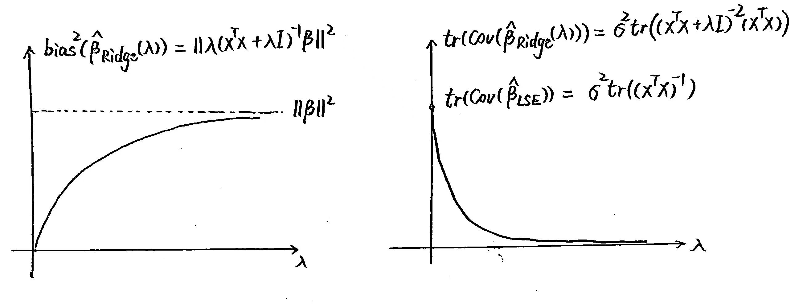
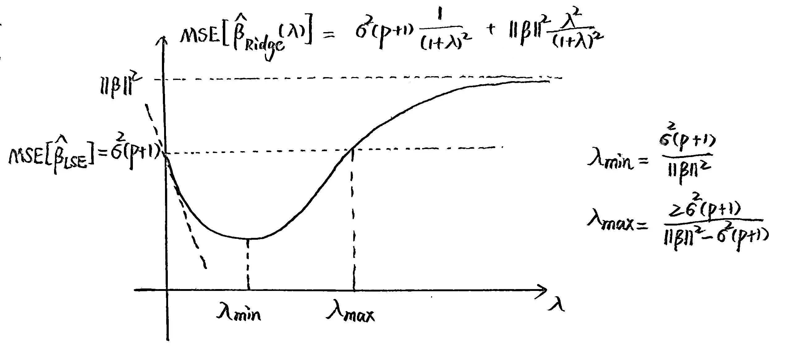
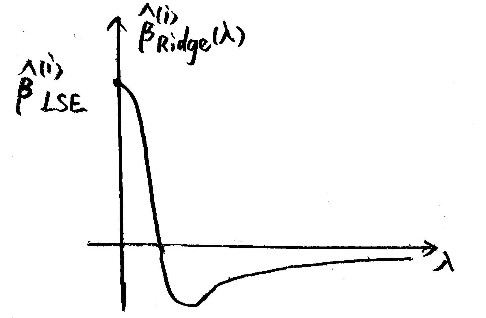
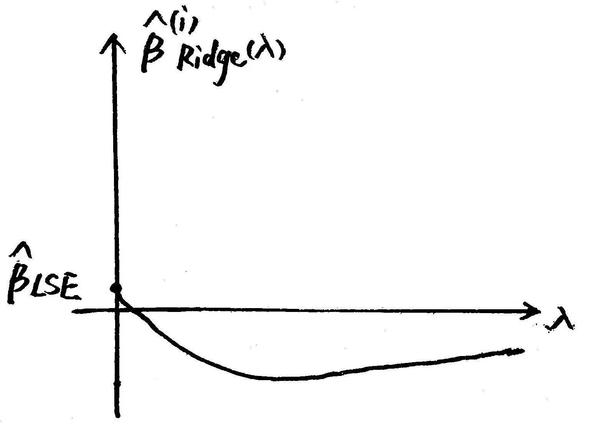
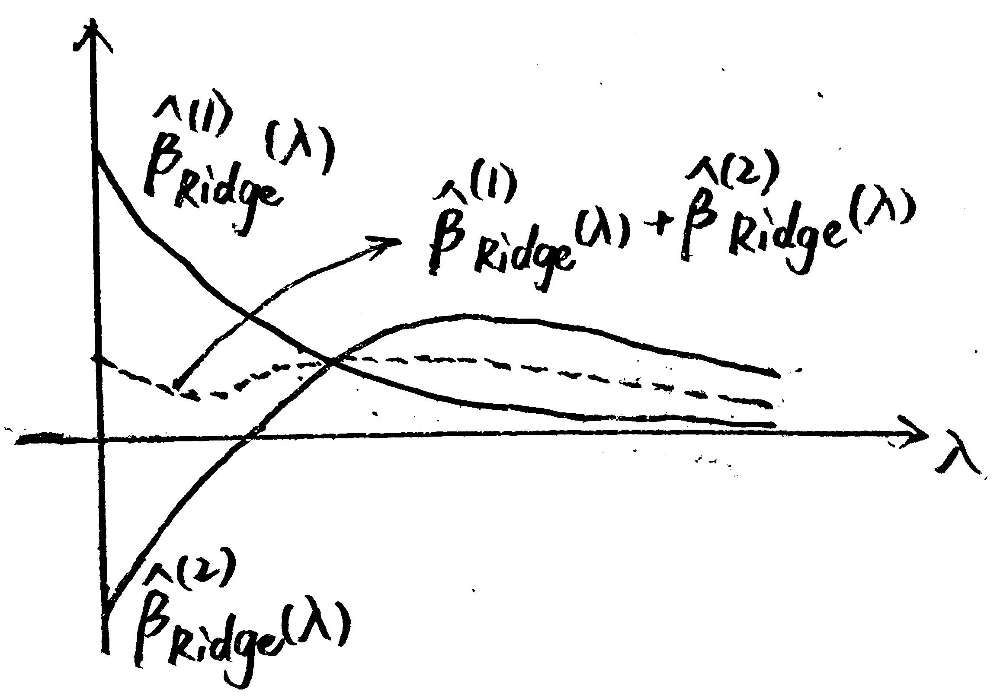
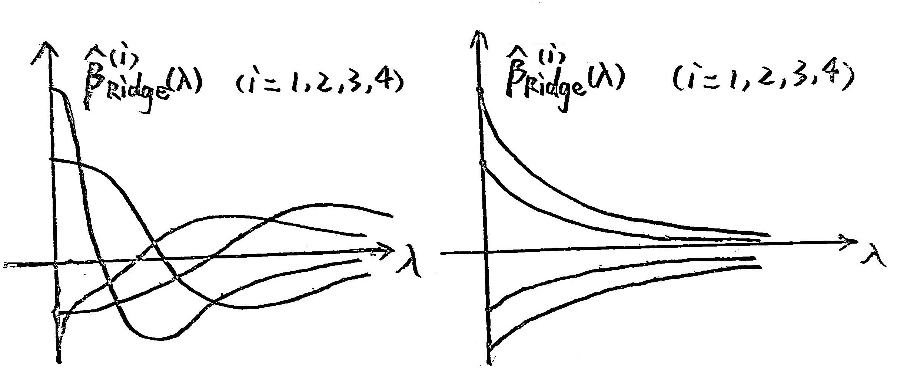

# FDU 回归分析 3. 岭回归

本文根据王勤文老师课堂笔记整理而成，并参考以下教材:

- 应用回归分析 (第 $5$ 版, 何晓群, 刘文卿) 第 $6,7$ 章

欢迎批评指正!

## 3.1 多重共线性

在 FDU 回归分析 2. 多元线性回归中，  
我们默认设计矩阵 $X\in \mathbb R^{n\times (p+1)}$ 满足列满秩假设 $\rank(X)=p+1\leq n$   
这保证了 $(X^{\mathrm T}X)\in \mathbb R^{(p+1)\times (p+1)}$ 是非奇异阵.  
于是 $X$ 的 Moore-Penrose 逆 $X^{\dagger} = (X^{\mathrm T}X)^{-1}X^{\mathrm T}\in \mathbb R^{(p+1)\times n}$ 

但如果设计矩阵 $X\in \mathbb R^{n\times (p+1)}$ 的列越来越趋于线性相关 (即列满秩假设越来越趋于不成立)，  
那么 $X^{\mathrm T}X$ 会越来越趋于奇异，即其模最小特征值 $\lambda_\min(X^{\mathrm T}X)$ 越来越趋于 $0$  
此时我们称设计矩阵 $X$ 的列向量之间存在**多重共线性** (multi-collinearlity)  
即解释变量之间存在显著的相关性.

### 3.1.1 影响

[(Proof of the below proposition)](https://math.stackexchange.com/questions/2624986/the-meaning-behind-xtx-1)     
设 $X := [x_1,\dots,x_{p}] \in \mathbb R^{n\times p}$  
记 $X_{(i)} \in \mathbb R^{n\times (p-1)}$ 为 $X$ 删去第 $i$ 列 $x_i$ 后得到的矩阵.  
记 $\text{span}\{X_{(i)}\}$ 的投影算子为 $H_{(i)}:= X_{(i)}[X_{(i)}^{\mathrm T} X_{(i)}]^{-1}X_{(i)}^{\mathrm T}$    
记 $x_i$ 垂直于 $\text{span}\{X_{(i)}\}$ 的分量为 $r_i = (I_{n} - H_{(i)})x_i$，则我们有:
$$
[(X^{\mathrm T}X)^{-1}]_{(i,j)} = \frac{r_i^{\mathrm T}r_j}{\|r_i\|^2 \|r_j\|^2}\ (\forall\ i,j=1,\dots,p)\\
\Leftrightarrow\\
(X^{\mathrm T}X)^{-1} = \left[\frac{r_i^{\mathrm T}r_j}{\|r_i\|^2\|r_j\|^2}\right]_{i,j=1}^p 
$$
特殊地，对于对角元我们有:  
$$
[(X^{\mathrm T}X)^{-1}]_{(i,i)} = \frac{r_i^{\mathrm T}r_i}{\|r_i\|^2 \|r_i\|^2} = \frac{1}{\|r_i\|^2} = \frac{1}{\|(I_{n}-H_{(i)})x_i\|^2} = \frac{1}{x_i^{\mathrm T}(I_{n} - H_{(i)})x_i}\ (\forall\ i=1,\dots,p)\\
\Leftrightarrow\\
\text{diag}((X^{\mathrm T}X)^{-1}) = \text{diag}\left\{ \frac{1}{\|r_1\|^2},\dots,\frac{1}{\|r_p\|^2}\right\}
$$
- **推论:**  
  定义变换: 
  $$
  Z := (I_n-\frac1n1_n1_n^{\mathrm T})X = [x_1-\bar x_11_n,\dots,x_p-\bar x_p 1_n]\\
  D := \text{diag}(Z^{\mathrm T}Z) = \text{diag}\left\{\|x_1-\bar x_11_n\|,\dots,\|x_p-\bar x_p 1_n\|\right\}\\
  \tilde X := XD^{-\frac12}
  $$
  则我们有:  
  $$
  \begin{align}
  (\tilde X^{\mathrm T}\tilde X)^{-1} 
  &=
  \left\{D^{-\frac12} (X^{\mathrm T}X) D^{-\frac12} \right\}^{-1}\\
  &=
  D^{\frac12} (X^{\mathrm T}X)^{-1} D^{\frac12}\\
  &=
  \text{diag}\left\{\|x_1-\bar x_11_n\|,\dots,\|x_p-\bar x_p 1_n\|\right\}
  \left[\frac{r_i^{\mathrm T}r_j}{\|r_i\|^2\|r_j\|^2}\right]_{i,j=1}^p \text{diag}\left\{\|x_1-\bar x_11_n\|,\dots,\|x_p-\bar x_p 1_n\|\right\}\\
  &=
  \left[\|x_i-\bar x_i 1_n\|\frac{r_i^{\mathrm T}r_j}{\|r_i\|^2\|r_j\|^2}\|x_j-\bar x_i 1_n\|\right]_{i,j=1}^p
  \end{align}
  $$
  因此其对角元为:  
  $$
  [(\tilde X^{\mathrm T}\tilde X)^{-1}]_{(i,i)} =
  \frac{\|x_i - \bar x_i 1_n\|^2}{\|r_i\|^2}\quad (i=1,\dots,p)
  $$

**证明:**   
在 $x_1,\dots,x_p$ 线性无关的假设下，$r_1,\dots,r_p$ 也构成 $\text{span}\{x_1,\dots,x_p\}$ 的一组基.  
我们设:  
$$
A = [a_{ij}]_{i,j=1}^p \text{ such that }X=[x_1,\dots,x_p] = [r_1,\dots,r_p] A=RA\\
B = [b_{ij}]_{i,j=1}^p \text{ such that }R=[r_1,\dots,r_p] = [x_1,\dots,x_p] B=XB\\
$$
根据基变换的性质可知 $B=A^{-1}$    

- 一方面，注意到 $r_i^{\mathrm T}x_j = \begin{cases}
  0 & \text{if }i\neq j\\
  r_i^{\mathrm T}r_i = \|r_i\|^2 & \text{if }i=j\end{cases}$  
  因此我们有:   
  $$
  \begin{align}
  x_i^{\mathrm T}x_j
  &=
  x_i^{\mathrm T}\left(\sum_{k=1}^p a_{kj} r_k\right)\\
  &=
  \sum_{k=1}^p a_{kj} x_i^{\mathrm T}r_k \quad (\text{note that }r_i^{\mathrm T}x_j = \begin{cases}
  0 & \text{if }i\neq j\\
  r_i^{\mathrm T}r_i = \|r_i\|^2 & \text{if }i=j\end{cases})\\
  &=
  a_{ij} x_i^{\mathrm T} r_i\\
  &=
  a_{ij} r_i^{\mathrm T} r_i\\
  &=
  a_{ij} \|r_i\|^2
  \end{align}\ (\forall\ i,j=1,\dots,p)
  $$
  因此 $a_{ij}=\frac{x_i^{\mathrm T}x_j}{\|r_i\|^2}\ (\forall\ i,j=1,\dots,p)$  
  于是我们有:  
  $$
  \begin{align}
  A 
  &= [a_{ij}]_{i,j=1}^p \\
  &= \left[\frac{x_i^{\mathrm T}x_j}{\|r_i\|^2}\right]_{i,j=1}^p\\
  &= \text{diag}\left\{\frac{1}{\|r_1\|^2},\dots,\frac{1}{\|r_p\|^2}\right\}\left[ x_i^{\mathrm T}x_j \right]_{i,j=1}^p \\
  &=  \text{diag}\left\{\frac{1}{\|r_1\|^2},\dots,\frac{1}{\|r_p\|^2}\right\}(X^{\mathrm T}X)
  \end{align}
  $$
  
- 另一方面，我们有:  
  $$
  \begin{align}
  r_i^{\mathrm T}r_j
  &=
  r_i^{\mathrm T}\left(\sum_{k=1}^n b_{kj}x_k\right)\\
  &=
  \sum_{k=1}^n b_{kj} r_i^{\mathrm T}x_k\\
  &=
  b_{ij} r_i^{\mathrm T}x_i\\
  &=
  b_{ij} r_i^{\mathrm T}r_i\\
  &=
  b_{ij} \|r_i\|^2
  \end{align}\ (\forall\ i,j=1,\dots,p)
  $$
  因此 $b_{ij}=\frac{r_i^{\mathrm T}r_j}{\|r_i\|^2}\ (\forall\ i,j=1,\dots,p)$  
  于是我们有:   
  $$
  \begin{align}
  B 
  &= [b_{ij}]_{i,j=1}^p\\
  &=\left[\frac{r_i^{\mathrm T}r_j}{\|r_i\|^2}\right]_{i,j=1}^p \\
  &=\text{diag}\left\{\frac{1}{\|r_1\|^2},\dots,\frac{1}{\|r_p\|^2}\right\} \left[r_i^{\mathrm T}r_j\right]_{i,j=1}^p \\
  &= \text{diag}\left\{\frac{1}{\|r_1\|^2},\dots,\frac{1}{\|r_p\|^2}\right\}(R^{\mathrm T}R) 
  \end{align}
  $$

根据 $A=B^{-1}$ 可知:  
$$
BA =  \text{diag}\left\{\frac{1}{\|r_1\|^2},\dots,\frac{1}{\|r_p\|^2}\right\}(R^{\mathrm T}R) \text{diag}\left\{\frac{1}{\|r_1\|^2},\dots,\frac{1}{\|r_p\|^2}\right\}(X^{\mathrm T}X) = I_n
$$

因此我们有:
$$
(X^{\mathrm T}X)^{-1}
=
\text{diag}\left\{\frac{1}{\|r_1\|^2},\dots,\frac{1}{\|r_p\|^2}\right\}(R^{\mathrm T}R) \text{diag}\left\{\frac{1}{\|r_1\|^2},\dots,\frac{1}{\|r_p\|^2}\right\} = \left[\frac{r_i^{\mathrm T}r_j}{\|r_i\|^2\|r_j\|^2}\right]_{i,j=1}^p
$$
命题得证.

****

将设计矩阵按列记为 $X := [x_0,x_1,\dots,x_{p}] \in \mathbb R^{n\times (p+1)}$ (其中 $x_0=1_n$)  
记 $X_{(i)} \in \mathbb R^{n\times p}$ 为 $X$ 删去第 $i$ 列 $x_i$ 后得到的矩阵.  
记 $\text{span}\{X_{(i)}\}$ 的投影算子为 $H_{(i)}:= X_{(i)}[X_{(i)}^{\mathrm T} X_{(i)}]^{-1}X_{(i)}^{\mathrm T}$    
记 $x_i$ 垂直于 $\text{span}\{X_{(i)}\}$ 的分量为 $r_i = (I_{n} - H_{(i)})x_i$，则我们有:
$$
[(X^{\mathrm T}X)^{-1}]_{(i+1,j+1)} = \frac{r_i^{\mathrm T}r_j}{\|r_i\|^2 \|r_j\|^2}\ (\forall\ i,j=0,1,\dots,p)
$$
特殊地，对于对角元我们有:
$$
[(X^{\mathrm T}X)^{-1}]_{(i+1,i+1)} = \frac{r_i^{\mathrm T}r_i}{\|r_i\|^2 \|r_i\|^2} = \frac{1}{\|r_i\|^2} = \frac{1}{\|(I_{n}-H_{(i)})x_i\|^2} = \frac{1}{x_i^{\mathrm T}(I_{n} - H_{(i)})x_i}\ (\forall\ i=0,1,\dots,p)
$$
- **推论:**  
  定义变换: 
  $$
  Z := [1_n,x_1-\bar x_11_n,\dots,x_p-\bar x_p 1_n]\\
  D := \text{diag}(Z^{\mathrm T}Z) = \text{diag}\left\{1,\|x_1-\bar x_11_n\|,\dots,\|x_p-\bar x_p 1_n\|\right\}\\
  \tilde X := XD^{-\frac12}
  $$
  则我们有:  
  $$
  \begin{align}
  (\tilde X^{\mathrm T}\tilde X)^{-1}_{(2:p+1,2:p+1)} 
  &=
  \left\{D^{-\frac12} (X^{\mathrm T}X) D^{-\frac12} \right\}^{-1}_{(2:p+1,2:p+1)}\\
  &=
  \left\{D^{\frac12} (X^{\mathrm T}X)^{-1} D^{\frac12}\right\}_{(2:p+1,2:p+1)}\\
  &=
  \text{diag}\left\{\|x_1-\bar x_11_n\|,\dots,\|x_p-\bar x_p 1_n\|\right\}
  \left[\frac{r_i^{\mathrm T}r_j}{\|r_i\|^2\|r_j\|^2}\right]_{i,j=1}^p \text{diag}\left\{\|x_1-\bar x_11_n\|,\dots,\|x_p-\bar x_p 1_n\|\right\}\\
  &=
  \left[\|x_i-\bar x_i 1_n\|\frac{r_i^{\mathrm T}r_j}{\|r_i\|^2\|r_j\|^2}\|x_j-\bar x_i 1_n\|\right]_{i,j=1}^p
  \end{align}
  $$
  因此其对角元为:  
  $$
  [(\tilde X^{\mathrm T}\tilde X)^{-1}]_{(i+1,i+1)} =
  \frac{\|x_i - \bar x_i 1_n\|^2}{\|r_i\|^2} = \frac{\|x_i-\bar x_i1_n\|^2}{\|(I_n-H_{(i)})x_i\|^2}\quad (i=1,\dots,p)
  $$

****

考虑多元线性回归模型 $y=X\beta+\varepsilon\ (\text{where }\begin{cases}
\text{E}[\varepsilon]=0_n\\
\text{Cov}[\varepsilon]=\sigma^2 I_n\end{cases})$ 的最小二乘估计量 $\hat\beta = (X^{\mathrm T}X)^{-1}X^{\mathrm T}y$   
其协方差为: 
$$
\begin{align}
\text{Cov}[\hat \beta] 
&= \text{Cov}[(X^{\mathrm T}X)^{-1}X^{\mathrm T}y]\\
&= \text{Cov}[(X^{\mathrm T}X)^{-1}X^{\mathrm T}(X\beta + \varepsilon)]\\
&= \text{Cov}[\beta + (X^{\mathrm T}X)^{-1}X^{\mathrm T}\varepsilon]\\
&= (X^{\mathrm T}X)^{-1}X^{\mathrm T}\text{Cov}[\varepsilon] X(X^{\mathrm T}X)^{-1}\\
&= (X^{\mathrm T}X)^{-1}X^{\mathrm T}\cdot \sigma^2 I_n\cdot X(X^{\mathrm T}X)^{-1}\\
&= \sigma^2(X^{\mathrm T}X)^{-1}
\end{align}
$$
因此对于 $\hat \beta=[\hat \beta_0, \hat \beta_1,\dots,\hat \beta_p]^{\mathrm T}$ 的每个分量都有:  
$$
\text{Var}(\hat \beta_i) = \sigma^2 [(X^{\mathrm T}X)^{-1}]_{(i+1,i+1)} = \sigma^2 \frac{1}{\|(I_{n}-H_{(i)})x_i\|^2}\ (i=0,1,\dots,p)
$$
这说明当 $x_i$ 与 $X_{(i)}$ 之间存在多重共线性关系 (即 $(I_n-H_{(i)})x_i\approx 0_n$，也即 $x_i$ 几乎包含在 $\text{span}\{X_{(i)}\}$ 中) 时，  
参数 $\beta_i$ 的估计量 $\hat \beta_i$ 的方差会非常大，波动性会很强，模型的泛化能力可能会很差.

****

直观判断:

- ① 在减少或增加解释变量时，若估计量 $\hat \beta$ 的某些分量变化很大，则存在多重共线性的可能.
- ② 在估计量 $\hat \beta$ 的协方差矩阵中，若某些方差项或协方差项很大，则存在多重共线性的可能.
- ③ 若 $\hat \beta$ 的某些分量的绝对值很大 (表明对应的解释变量很重要)，  
  但相应的回归系数的显著性 $t$ 检验没有通过 (表明对应的解释变量不重要，产生矛盾)，  
  则我们认为存在多重共线性的可能.

### 3.1.2 检验

我们使用**方差膨胀因子** $\text{VIF}$ (Variance Inflation Factor) 来刻画多重共线性的严重程度.  

将设计矩阵按列记为 $X := [x_0,x_1,\dots,x_{p}] \in \mathbb R^{n\times (p+1)}$ (其中 $x_0=1_n$)  
记 $X_{(j)} \in \mathbb R^{n\times p}$ 为 $X$ 删去第 $j$ 列 $x_j$ 后得到的矩阵.  
记 $\text{span}\{X_{(j)}\}$ 的投影算子为 $H_{(j)}:= X_{(j)}[X_{(j)}^{\mathrm T} X_{(j)}]^{-1}X_{(j)}^{\mathrm T}$     
考虑使用多元线性回归模型表征 $x_j$ 与 $X_{(j)}$ 之间的线性相关性，定义:  
(不需要计算截距项的方差膨胀因子，因此 $j=1,\dots,p$，**(存疑)** 实际上设计矩阵的第一列 $1_n$ 也不用加，不过那样比较麻烦)
$$
\begin{align}
\text{SST}_j 
&:= \|x_j - \bar x_j 1_n\|^2 \\
&= \|x_j - \frac1n 1_n1_n^{\mathrm T} x_j\|^2\\
&= x_j^{\mathrm T}(I_n - \frac1n 1_n1_n^{\mathrm T}) x_j\\
&= \|x_j - \text{E}[x_j]\|^2\\
&= \tr({\text{Cov}(x_j)})\\

\hline
\text{SSR}_j 
&:= \|\hat x_j - \bar x_j 1_n\|^2\\
&= \|H_{(j)} x_j - \frac1n 1_n1_n^{\mathrm T} x_j\|^2\\
&= x_j^{\mathrm T} (H_{(j)}-\frac1n 1_n1_n^{\mathrm T}) x_j\\
&= \|\text{E}[x_j|X_{(j)}] - \text{E}[x_j]\|^2\\

\hline
\text{SSE}_j
&:= \|x_j - \hat x_j\|^2\\
&= \|x_j - H_{(j)} x_j\|^2\\
&= x_j^{\mathrm T} (I_n - H_{(j)}) x_j\\
&= \|x_j - \text{E}[x_j|X_{(j)}]\|^2\\
&= \tr({\text{Cov}(x_j|X_{(j)})})
\end{align}
$$
定义决定系数 $R_j^2:= \frac{\text{SSR}_j}{\text{SST}_j}$，则 $(x_j,X_{(j)})$ 的方差膨胀因子 $\text{VIF}_j$ 定义如下:
$$
\begin{align}
\text{VIF}_j 
&:= 
\frac{1}{1-R_j^2}\\
&=
\frac{1}{1-\frac{\text{SSR}_j}{\text{SST}_j}}\quad (\text{note that }\text{SST}_j = \text{SSE}_j + \text{SSR}_j)\\
&=
\frac{\text{SST}_j}{\text{SSE}_j}\in [1,+\infty)\quad (\text{note that }\text{SST}_j \geq \text{SSE}_j)\\
&=
\frac{x_j^{\mathrm T} (I_n - \frac1n 1_n1_n^{\mathrm T})x_j}{x_j^{\mathrm T} (I_n-H_{(j)})x_j}\\
&=
\frac{\tr(\text{Cov}(x_j))}{\tr(\text{Cov}(x_j|X_{(j)}))}\\
&=
\text{Estimator of }\left\{ \frac{\text{Var}(X_j)}{\text{Var}(X_j|\{X_1,\dots,X_p\}\backslash \{X_j\})}\right\}
\end{align}\ (\forall\ j=1,\dots,p)
$$
我们可以看出 $\text{VIF}_j$ 是 $\frac{\text{Var}(X_j)}{\text{Var}(X_j|\{X_1,\dots,X_p\}\backslash \{X_j\})}$ 的矩估计量，这就是 "方差膨胀因子" 名称的由来.  
它的数值反映了第 $j$ 个解释变量的方差膨胀程度.  
当 $\text{VIF}_j \geq 20$，则我们认为第 $j$ 个解释变量与其余解释变量之间有严重的多重共线性.  
当平均方差膨胀因子 $\frac1p \sum_{j=1}^p \text{VIF}_j$ 较大时，我们也认为设计矩阵 $X$ 具有严重的多重共线性.

*****

此外，我们发现:  
$$
\begin{align}
\text{Var}(\hat \beta_j) 
&= \sigma^2 [(X^{\mathrm T}X)^{-1}]_{(j+1,j+1)}\\
&= \sigma^2 \frac{1}{\|(I_{n}-H_{(j)})x_j\|^2}\\
&= \sigma^2 \frac{1}{x_j^{\mathrm T}(I_n-H_{(j)})x_j}\\
&= \sigma^2 \frac{1}{\text{SSE}_{(j)}}\quad (\text{note that }\text{VIF}_j = \frac{\text{SST}_j}{\text{SSE}_j})\\
&= \sigma^2 \frac{\text{VIF}_j}{\text{SST}_j}
\end{align}\ (\forall\ j=1,\dots,p)
$$
因此 $\text{VIF}_j$ 可以刻画参数 $\beta_j$ 的估计量 $\hat \beta_j$ 的波动性.  
这也提供了计算方差膨胀因子的简便方法:
$$
\begin{align}
\text{VIF}_j 
&=
\frac{\text{SST}_j}{\text{SSE}_j}\quad (\text{note that }[(X^{\mathrm T}X)^{-1}]_{(j+1,j+1)}=\frac{1}{x_j^{\mathrm T}(I_n-H_{(j)})x_j} = \frac{1}{\text{SSE}_j})\\
&=
\text{SST}_j [(X^{\mathrm T}X)^{-1}]_{(j+1,j+1)}
\end{align}\ (\forall\ j=1,\dots,p)
$$

更深刻地，我们可以做变换: 
$$
Z := [1_n,x_1-\bar x_11_n,\dots,x_p-\bar x_p 1_n]\\
D := \text{diag}(Z^{\mathrm T}Z) = \text{diag}\left\{1,\|x_1-\bar x_11_n\|,\dots,\|x_p-\bar x_p 1_n\|\right\}\\
\tilde X := XD^{-\frac12}
$$
则根据 $3.1.1$ 节的结论我们有:  
$$
[(\tilde X^{\mathrm T}\tilde X)^{-1}]_{(j+1,j+1)} =
\frac{\|x_j - \bar x_j 1_n\|^2}{\|r_j\|^2} = \frac{\|x_j-\bar x_j1_n\|^2}{\|(I_n-H_{(j)})x_j\|^2} = \frac{\text{SST}_j}{\text{SSE}_j}\quad (j=1,\dots,p)
$$
因此我们有:  
$$
\text{VIF}_j = \frac{\text{SST}_j}{\text{SSE}_j} =[(\tilde X^{\mathrm T}\tilde X)^{-1}]_{(j+1,j+1)}\quad (j=1,\dots,p)
$$

*****

实际上 $X^{\mathrm T}X$ 有多少个特征值近似为 $0$，$X$ 的列之间就有多少个多重共线性关系.  
具体来说，如果 $(\lambda,\eta)$ 为 $X^{\mathrm T}X$ 的一个特征对 (满足 $\lambda\approx 0$ 和 $\|\eta\|_2 = 1$)，我们就有: 
$$
\begin{align}
\|X\eta\|^2_2
&=
\eta^{\mathrm T}(X^{\mathrm T}X)\eta\quad (\text{note that }(X^{\mathrm T}X)\eta = \eta \lambda)\\
&=
\eta^{\mathrm T} \eta \lambda\quad (\text{note that }\|\eta\|_2 = 1)\\
&= \lambda\\
&\approx 0
\end{align}
$$
于是有 $X\eta = \eta_0 1_n + \eta_1 x_1 + \dotsm + \eta_p x_p \approx 0_n$ 成立.  

注意到 $X^{\mathrm T}X$ 是对称阵 (自然是正规矩阵)，因此可以酉对角化 (自然可以相似对角化)  
于是 $X^{\mathrm T}X$ 的任意特征值的几何重数都等于代数重数.  
若 $X^{\mathrm T}X$ 有 $k$ 个特征值 (计代数重数) 近似为 $0$，则这些特征值对应的特征空间的和是一个 $k$ 维向量空间.  
于是从某种意义上说，我们有 $k$ 个多重共线性关系.

我们还可以根据条件数 $\kappa_2(X)=\|X\|_2 \|X^{-1}\|_2 = \sqrt{\frac{\lambda_\max(X^{\mathrm T}X)}{\lambda_\min(X^{\mathrm T}X)}}$ 来刻画多重共线性的严重程度.  
当 $0<\kappa_2(X^{\mathrm T}X)<10$ 时，可以认为不存在多重共线性.  
当 $10\leq \kappa_2(X^{\mathrm T}X)<100$ 时，可以认为存在多重共线性.  
当 $\kappa_2(X^{\mathrm T}X)\geq 100$ 时，可以认为存在严重的多重共线性.

### 3.1.3 处理方法

若原始模型存在多重共线性，则我们可以剔除方差膨胀因子最大的解释变量，重新建立线性回归模型.  
上述过程可以重复进行，直至不存在严重的多重共线性为止.  
我们还可以结合之前学过的回归系数显著性检验、模型选择等知识，以及问题的实际背景，对解释变量进行筛选和剔除.

实际问题中，当样本数量 $n$ 过小时，也容易产生多重共线性，因此我们可以适当增加样本数量.  
事实上，增大样本数量可以减小最小二乘估计量 $\hat \beta = (X^{\mathrm T}X)^{-1}X^{\mathrm T}y$ 的方差:  
$$
\begin{align}
\tr({\text{Cov}(\hat \beta)})
&=
\tr({\sigma^2 (X^{\mathrm T}X)^{-1}})\\
&=
\sigma^2 \tr((X^{\mathrm T}X)^{-1})\to 0\ (n\to\infty)
\end{align}
$$
尽管最小二乘估计量 $\hat \beta = (X^{\mathrm T}X)^{-1}X^{\mathrm T}y$ 作为 $\beta$ 的无偏估计量有着良好的性质，但我们也不必局限于此.  
事实上，有很多方法 (例如 Ridge 回归、偏最小二乘法等) 以牺牲无偏性为代价，  
对最小二乘估计量进行改进，以提高估计量的稳定性.

## 3.2 岭回归

### 3.2.1 岭估计量

考虑多元线性回归模型 $y=X\beta+\varepsilon$  
其中 $y\in \mathbb R^n, X\in \mathbb R^{n\times (p+1)},\varepsilon\sim N(0_n,\sigma^2 I_n)$   
岭回归以牺牲无偏性为代价，将最小二乘估计量 $\hat \beta_{\text{LSE}}:= (X^{\mathrm T}X)^{-1}X^{\mathrm T}y$ 改进为 $\hat \beta_{\text{Ridge}}(\lambda):= (X^{\mathrm T}X+\lambda I_{p+1})^{-1}X^{\mathrm T}y$  
其中 $\lambda>0$ 称为岭回归的正则化系数，用于提高估计量的稳定性.

它还有另一种等价的表示形式: (但计算复杂度更高，如果 $n>p+1$ 的话)  
$$
\begin{align}
\hat \beta_{\text{Ridge}}(\lambda)
&:= (X^{\mathrm T}X+\lambda I_{p+1})^{-1}X^{\mathrm T}y\\
&= (X^{\mathrm T}X+\lambda I_{p+1})^{-1}X^{\mathrm T}(XX^{\mathrm T}+\lambda I_{n})(XX^{\mathrm T}+\lambda I_{n})^{-1}y\\
&= (X^{\mathrm T}X+\lambda I_{p+1})^{-1}(X^{\mathrm T}XX^{\mathrm T}+\lambda X^{\mathrm T})(XX^{\mathrm T}+\lambda I_{n})^{-1}y\\
&= (X^{\mathrm T}X+\lambda I_{p+1})^{-1}(X^{\mathrm T}X+\lambda I_{p+1})X^{\mathrm T}(XX^{\mathrm T}+\lambda I_{n})^{-1}y\\
&= X^{\mathrm T}(XX^{\mathrm T}+\lambda I_{n})^{-1}y
\end{align}
$$
我们可以将最小二乘估计量 $\hat \beta_{\text{LSE}}$ 视为岭估计量 $\hat \beta_{\text{Ridge}}(\lambda)$ 的特殊情况:  
$$
\hat \beta_{\text{LSE}}= (X^{\mathrm T}X)^{-1}X^{\mathrm T}y = \hat\beta_{\text{Ridge}}(0)
$$

*****

岭估计量 $\hat \beta_{\text{Ridge}}(\lambda)$ 可以表示为最小二乘估计量 $\hat \beta_{\text{LSE}}$ 的线性组合:  
$$
\begin{align}
\hat \beta_{\text{Ridge}}(\lambda)
&=
(X^{\mathrm T}X+\lambda I)^{-1}X^{\mathrm T}y\\
&=
(X^{\mathrm T}X+\lambda I)^{-1}(X^{\mathrm T}X)(X^{\mathrm T}X)^{-1}X^{\mathrm T}y\\
&=
(X^{\mathrm T}X+\lambda I)^{-1}(X^{\mathrm T}X) \hat \beta_{\text{LSE}}
\end{align}
$$
其中算子 $(X^{\mathrm T}X+\lambda I)^{-1} (X^{\mathrm T}X)$ 的作用是对 $\hat \beta_{\text{LSE}}$ 进行压缩.   
(值得注意的是，在实际应用中最优的 $\lambda$ 的选取通常依赖于样本，因此本质上 $\hat \beta_{\text{Ridge}}(\lambda)$ 并非 $\hat \beta_{\text{LSE}}$ 的线性组合)

设 $X^{\mathrm T}X\in \mathbb R^{(p+1)\times (p+1)}$ 的谱分解为 $X^{\mathrm T}X=UD U^{\mathrm T}$   
其中 $U\in \mathbb R^{n\times n}$ 为实正交阵，$D:=\text{diag}\{d_1,\dots,d_{p+1}\}$ 为具有正实数对角元的对角阵.  
于是我们有:  
$$
\begin{align}
(X^{\mathrm T}X+\lambda I)^{-1} (X^{\mathrm T}X)
&=
(UD U^{\mathrm T} + \lambda I)^{-1} (UD U^{\mathrm T})\\
&=
U(D + \lambda I)^{-1}U^{\mathrm T} UD U^{\mathrm T}\\
&=
U(D+\lambda I)^{-1}D U^{\mathrm T}\\
&=
U\cdot \text{diag}\left\{\frac{d_1}{d_1+\lambda},\dots, \frac{d_{p+1}}{d_{p+1}+\lambda}\right\}\cdot U^{\mathrm T}
\end{align}
$$
这表明算子 $(X^{\mathrm T}X+\lambda I)^{-1} (X^{\mathrm T}X)$ 的特征值均属于 $(0,1)$ 区间，  
因此其作用是把 $\hat \beta_{\text{LSE}}$ 往 $0_{p+1}$ 压缩，压缩程度取决于 $\lambda$ 的大小.  
换言之，当 $\|\hat \beta_{\text{LSE}}\|>0$ 时，对于任意 $\lambda>0$ 我们都有 $\|\hat \beta_{\text{Ridge}}(\lambda)\|<\|\hat \beta_{\text{LSE}}\|$ 成立，且 $\lim_{\lambda\to\infty}\|\hat\beta_{\text{Ridge}}(\lambda)\| = 0$ 

****

我们还可将岭估计量 $\hat \beta_{\text{Ridge}}(\lambda):= (X^{\mathrm T}X+\lambda I)^{-1}X^{\mathrm T}y$ 视为以下优化问题的最优解:  
$$
\min_{\beta\in \mathbb R^{p+1}} \left\{\|y-X\beta\|^2+\lambda \|\beta\|^2  \right\}\quad (\text{where }\lambda>0\text{ is a given constant})
$$
这相当于在最小二乘问题的基础上加了一个 $l_2$ 正则项 $\lambda\|\beta\|^2$，对估计量的大小进行了限制.  

注意到目标函数关于 $\beta$ 的梯度为:  
$$
\begin{align}
\nabla_\beta\{\|y-X\beta\|^2+\lambda \|\beta\|^2 \} 
&= 
-2X^{\mathrm T}(y-X\beta) + 2\lambda \beta\\
&=
2(X^{\mathrm T}X+\lambda I) \beta -2X^{\mathrm T}y
\end{align}
$$
令 $\nabla_\beta\{\|y-X\beta\|^2+\lambda \|\beta\|^2 \}=2(X^{\mathrm T}X+\lambda I) \beta -2X^{\mathrm T}y=0_{p+1}$ 就得到 $\hat \beta_{\text{Ridge}}(\lambda)= (X^{\mathrm T}X+\lambda I)^{-1}X^{\mathrm T}y$   

### 3.2.2 偏差-方差

对于最小二乘估计量 $\hat \beta_{\text{LSE}}:=\hat \beta_{\text{Ridge}}(0)= (X^{\mathrm T}X)^{-1}X^{\mathrm T}y$ 我们有:  
$$
\begin{cases}
\text{E}[\hat \beta_{\text{LSE}}] = \beta\\
\text{Cov}(\hat \beta_{\text{LSE}}) = \sigma^2(X^{\mathrm T}X)^{-1}\\
\end{cases}
$$
对于岭估计量 $\hat \beta_{\text{Ridge}}(\lambda)= (X^{\mathrm T}X+\lambda I)^{-1}X^{\mathrm T}y$ 我们有:    
(记 $(X^{\mathrm T}X)\in \mathbb R^{(p+1)\times (p+1)}$ 的谱分解为 $X^{\mathrm T}X=UD U^{\mathrm T}$)
$$
\begin{align}
\hat \beta_{\text{Ridge}}(\lambda)
&=
(X^{\mathrm T}X+\lambda I)^{-1}X^{\mathrm T}y\\
&=
(X^{\mathrm T}X+\lambda I)^{-1}(X^{\mathrm T}X)(X^{\mathrm T}X)^{-1}X^{\mathrm T}y\\
&=
(X^{\mathrm T}X+\lambda I)^{-1}(X^{\mathrm T}X) \hat \beta_{\text{LSE}}\\
\hline

\text{E}[\hat \beta_{\text{Ridge}}(\lambda)]
&=
\text{E}[(X^{\mathrm T}X+\lambda I)^{-1}(X^{\mathrm T}X) \hat \beta_{\text{LSE}}]\\
&=
(X^{\mathrm T}X+\lambda I)^{-1}(X^{\mathrm T}X)\text{E}[\beta_{\text{LSE}}]\\
&=
(X^{\mathrm T}X+\lambda I)^{-1}(X^{\mathrm T}X)\beta\\
&\neq
\beta\\
\hline

\text{bias}^2(\hat \beta_{\text{Ridge}}(\lambda))
&=
\|\text{E}[\hat \beta_{\text{Ridge}}(\lambda)]-\beta\|^2\\
&=
\|(X^{\mathrm T}X+\lambda I)^{-1}(X^{\mathrm T}X)\beta - \beta\|^2\\
&=
\|(X^{\mathrm T}X+\lambda I)^{-1}(X^{\mathrm T}X)\beta - (X^{\mathrm T}X+\lambda I)^{-1}(X^{\mathrm T}X+\lambda I)\beta\|^2\\
&=
\|-(X^{\mathrm T}X+\lambda I)^{-1} \lambda I \beta\|^2\\
&=
\|\lambda (X^{\mathrm T}X+\lambda I)^{-1} \beta\|^2\\
&=
\|\lambda (UD U^{\mathrm T}+\lambda I)^{-1}\beta\|^2\\
&=
\|\lambda U(D + \lambda I)^{-1}U^{\mathrm T} \beta\|^2 \quad (\text{note that }l_2\text{ norm is unitary invariant})\\
&=
\|\lambda(D + \lambda I)^{-1}U^{\mathrm T}\beta\|^2\\
&=
\left\|\text{diag}\left\{\frac{\lambda}{d_1+\lambda},\dots,\frac{\lambda}{d_{p+1}+\lambda}\right\} U^{\mathrm T}\beta\right\|^2\\
&<
\|U^{\mathrm T}\beta\|^2\\
&=
\|\beta\|^2
\end{align}
$$
这表明岭估计量 $\hat \beta_{\text{Ridge}}(\lambda)$ 不再是 $\beta$ 的无偏估计量.  
$$
\begin{align}
\text{Cov}[\hat \beta_{\text{Ridge}}(\lambda)]
&=
\text{Cov}[(X^{\mathrm T}X+\lambda I)^{-1}(X^{\mathrm T}X) \hat \beta_{\text{LSE}}]\\
&=
(X^{\mathrm T}X+\lambda I)^{-1}(X^{\mathrm T}X)\cdot \text{Cov}[\hat \beta_{\text{LSE}}]\cdot (X^{\mathrm T}X) (X^{\mathrm T}X+\lambda I)^{-1}\\
&=
(X^{\mathrm T}X+\lambda I)^{-1}(X^{\mathrm T}X)\cdot \sigma^2 (X^{\mathrm T}X)^{-1}\cdot (X^{\mathrm T}X) (X^{\mathrm T}X+\lambda I)^{-1}\\
&=
\sigma^2 (X^{\mathrm T}X+\lambda I)^{-1}(X^{\mathrm T}X)(X^{\mathrm T}X+\lambda I)^{-1}\\
\hline

\tr{(\text{Cov}[\hat \beta_{\text{Ridge}}(\lambda)])}
&=
\tr({\sigma^2 (X^{\mathrm T}X+\lambda I)^{-1}(X^{\mathrm T}X)(X^{\mathrm T}X+\lambda I)^{-1}})\\
&=
\sigma^2 \tr({(X^{\mathrm T}X+\lambda I)^{-2}(X^{\mathrm T}X)})\\
&=
\sigma^2 \tr({(UD U^{\mathrm T} + \lambda I)^{-2} (UD U^{\mathrm T})})\\
&=
\sigma^2 \tr({U(D + \lambda I)^{-2}U^{\mathrm T} UD U^{\mathrm T}})\\
&=
\sigma^2 \tr({U(D + \lambda I)^{-2}D U^{\mathrm T}})\\
&=
\sigma^2 \tr({(D + \lambda I)^{-2}D U^{\mathrm T}U})\\
&=
\sigma^2 \tr({(D + \lambda I)^{-2}D})\\
&=
\sigma^2 \tr({(D + \lambda I)^{-2}D^2 \cdot D^{-1}})\\
&<
\sigma^2 \tr({D^{-1}})\\
&=
\sigma^2 \tr({D^{-1}U^{\mathrm T}U})\\
&=
\sigma^2\tr(UD^{-1}U^{\mathrm T})\\
&=
\tr({\sigma^2 (X^{\mathrm T}X)^{-1}})\\
&=
\tr{(\text{Cov}[\hat \beta_{\text{LSE}}])}
\end{align}
$$
这表明岭估计量 $\hat \beta_{\text{Ridge}}(\lambda)$ 的稳定性要优于最小二乘估计量 $\hat \beta_{\text{LSE}}$    
岭估计量 $\hat \beta_{\text{Ridge}}(\lambda)$ 的偏差平方 $\text{bias}^2(\hat \beta_{\text{Ridge}}(\lambda))$ 和方差 $\tr{(\text{Cov}[\hat \beta_{\text{Ridge}}(\lambda)])}$ 关于 $\lambda$ 的变换图像大致是这样的:

### 3.2.3 均方误差

考虑均方误差:
$$
\begin{align}
\text{MSE}[\hat \beta_{\text{Ridge}}(\lambda)]
&=
\text{E}[\|\hat \beta_{\text{Ridge}}(\lambda)-\beta\|^2]\\
&=
\text{E}[\|\hat \beta_{\text{Ridge}}(\lambda) - \text{E}[\hat \beta_{\text{Ridge}}(\lambda)] +\text{E}[\hat \beta_{\text{Ridge}}(\lambda)] -\beta\|^2]\\
&=
\text{E}[\|\hat \beta_{\text{Ridge}}(\lambda) - \text{E}[\hat \beta_{\text{Ridge}}(\lambda)]\|^2]
+
\|\text{E}[\hat \beta_{\text{Ridge}}(\lambda)]-\beta\|^2\\
&=
\tr{(\text{Cov}[\hat \beta_{\text{Ridge}}(\lambda)])} + \text{bias}^2(\hat \beta_{\text{Ridge}}(\lambda))\\
&=
\tr\{(X^{\mathrm T}X + \lambda I)^{-1}X^{\mathrm T} \text{Cov}(y) X(X^{\mathrm T}X+\lambda I)^{-1}\} 
+ 
\|(X^{\mathrm T}X+\lambda I)^{-1} X^{\mathrm T} X \beta -\beta\|^2\\
&=
\tr\{(X^{\mathrm T}X + \lambda I)^{-1}X^{\mathrm T} \cdot \sigma^2 I_n\cdot X(X^{\mathrm T}X+\lambda I)^{-1}\} 
+ 
\|-\lambda (X^{\mathrm T}X+\lambda I)^{-1}\beta\|^2\\
&=
\sigma^2 \tr({(X^{\mathrm T}X+\lambda I)^{-2}(X^{\mathrm T}X)}) + \lambda^2\beta^{\mathrm T} (X^{\mathrm T}X+\lambda I)^{-2} \beta\\

\hline
\text{MSE}[\hat \beta_{\text{LSE}}] 
&=
\text{E}[\|\hat \beta_{\text{LSE}}-\beta\|^2]\\
&=
\text{E}[\|\hat \beta_{\text{LSE}} - \text{E}[\hat \beta_{\text{LSE}}] +\text{E}[\hat \beta_{\text{LSE}}] -\beta\|^2]\\
&=
\text{E}[\|\hat \beta_{\text{LSE}} - \text{E}[\hat \beta_{\text{LSE}}]\|^2]
+
\|\text{E}[\hat \beta_{\text{LSE}}]-\beta\|^2\\
&=
\tr{(\text{Cov}[\hat \beta_{\text{LSE}}])} + \text{bias}^2(\hat \beta_{\text{LSE}})\\
&=
\tr(\sigma^2(X^{\mathrm T}X)^{-1}) + 0^2\\
&=
\sigma^2 \tr((X^{\mathrm T}X)^{-1})
\end{align}
$$
设 $X^{\mathrm T}X\in \mathbb R^{(p+1)\times (p+1)}$ 的谱分解为 $X^{\mathrm T}X = UDU^{\mathrm T}$  
其中 $U\in \mathbb R^{(p+1)\times (p+1)}$ 为正交阵，$D=\text{diag}\{d_1,\dots,d_{p+1}\}$ 为对角阵.  
于是我们有:  
$$
\begin{align}
\text{MSE}[\hat \beta_{\text{Ridge}}(\lambda)]
&=
\sigma^2 \tr({(X^{\mathrm T}X+\lambda I)^{-2}(X^{\mathrm T}X)}) + \lambda^2\beta^{\mathrm T} (X^{\mathrm T}X+\lambda I)^{-2} \beta\\
&=
\sigma^2 \tr({(UDU^{\mathrm T} + \lambda I)^{-2}}UDU) + \lambda^2 \beta^{\mathrm T}(UDU^{\mathrm T}+\lambda I)^{-2}\beta\\
&=
\sigma^2 \tr({U(D + \lambda I)^{-2}}DU^{\mathrm T}) + \lambda^2 \beta^{\mathrm T}U(D+\lambda I)^{-2}U^{\mathrm T}\beta\\
&=
\sigma^2 \tr({(D + \lambda I)^{-2}}D) + \lambda^2 \beta^{\mathrm T}U(D+\lambda I)^{-2}U^{\mathrm T}\beta\\
\end{align}
$$
我们断言存在某个 $\lambda>0$ 使得 $\text{MSE}[\hat \beta_{\text{Ridge}}(\lambda)]< \text{MSE}[\hat \beta_{\text{LSE}}]$    
注意到最小二乘估计量 $\hat \beta_{\text{LSE}} = (X^{\mathrm T}X)^{-1}X^{\mathrm T}y=\hat \beta_{\text{Ridge}}(0)$，即 Ridge 估计量 $\lambda=0$ 的情形.  
因此要证明存在某个 $\lambda>0$ 使得 $\text{MSE}[\hat \beta_{\text{Ridge}}(\lambda)]<\text{MSE}[\hat \beta_{\text{LSE}}]$，  
我们只要证明 $\text{MSE}[\hat \beta_{\text{Ridge}}(\lambda)]$ 关于 $\lambda$ 的导数在 $\lambda=0$ 处为负值即可. 
$$
\begin{align}
\frac{d}{d\lambda}\text{MSE}[\hat \beta_{\text{Ridge}}(\lambda)]
&=
\frac{d}{d\lambda}
\left\{ 
\sigma^2 \tr({(D + \lambda I)^{-2}}D) + \lambda^2 \beta^{\mathrm T}U(D+\lambda I)^{-2}U^{\mathrm T}\beta
\right\}\\
&=
-2\sigma^2 \tr({(D + \lambda I)^{-3}}D)
+
2\lambda \beta^{\mathrm T}U(D+\lambda I)^{-2}U^{\mathrm T}\beta
+\lambda^2\cdot (-2 \beta^{\mathrm T}U(D+\lambda I)^{-3}U^{\mathrm T}\beta)\\
\hline
\frac{d}{d\lambda}\text{MSE}[\hat \beta_{\text{Ridge}}(\lambda)]{\LARGE \mid}_{\lambda = 0}
&=
-2\sigma^2 \tr{(D^{-3}D)} + 0 + 0\\
&=
-2\sigma^2 \tr{(D^{-2})}\\
&<0
\end{align}
$$
尽管根据 Gauss-Markov 定理，最小二乘估计量 $\hat \beta_{\text{LSE}}$ 是线性无偏估计量中方差最小的，即均方误差最小的 (因为此时偏差为 $0$)  
但我们可以通过牺牲无偏性 (例如岭估计量 $\hat \beta_{\text{Ridge}}(\lambda)$) 来获得更低的均方误差，这可能会带来更好的预测性能.  
下图清晰地展示了有偏估计量优于无偏估计量的情形:

****

特殊地，当 $X^{\mathrm T}X=I_{p+1}$ **(存疑: 这个假设不可能成立?)** 时，我们有:  
$$
\begin{align}
\text{MSE}[\hat \beta_{\text{Ridge}}(\lambda)]
&=
\sigma^2 \tr({(X^{\mathrm T}X+\lambda I_{p+1})^{-2}(X^{\mathrm T}X)}) + \lambda^2\beta^{\mathrm T} (X^{\mathrm T}X+\lambda I_{p+1})^{-2} \beta\\
&=
\sigma^2 \tr{((I_{p+1} + \lambda I_{p+1})^{-2} I_{p+1})} + \lambda^2\beta^{\mathrm T} (I_{p+1}+\lambda I_{p+1})^{-2} \beta\\
&=
\sigma^2 (p+1)\frac{1}{(1+\lambda)^2} + \|\beta\|^2\frac{\lambda^2}{(1+\lambda)^2}\\

\hline
\text{MSE}[\hat \beta_{\text{LSE}}] 
&=
\sigma^2 \tr((X^{\mathrm T}X)^{-1})\\
&=
\sigma^2 \tr((I_{p+1})^{-1})\\
&=
\sigma^2(p+1)
\end{align}
$$

- 假设 $\|\beta\|^2>\sigma^2(p+1)$ **(这个假设是否成立?)**，令 $\text{MSE}[\hat \beta_{\text{Ridge}}(\lambda)] = \text{MSE}[\hat \beta_{\text{LSE}}]$ 解得 $\lambda_\max = \frac{2\sigma^2(p+1)}{\|\beta\|^2-\sigma^2(p+1)}>0$   
  因此 $\text{MSE}[\hat \beta_{\text{Ridge}}(\lambda)]$ 曲线在 $\lambda_\max = \frac{2\sigma^2(p+1)}{\|\beta\|^2-\sigma^2(p+1)}>0$ 处与 $\text{MSE}[\hat \beta_{\text{LSE}}]=\sigma^2(p+1)$ 相等.

- 计算 $\text{MSE}[\hat \beta_{\text{Ridge}}(\lambda)]$ 关于 $\lambda$ 的导数:  
  $$
  \begin{align}
  \frac{d}{d\lambda}\text{MSE}[\hat \beta_{\text{Ridge}}(\lambda)]
  &=
  \frac{d}{d\lambda}\left\{
  \sigma^2 (p+1)\frac{1}{(1+\lambda)^2} + \|\beta\|^2\frac{\lambda^2}{(1+\lambda)^2}
  \right\}\\
  &=
  \sigma^2(p+1)\frac{-2}{(1+\lambda)^3} + \|\beta\|^2 \left[\frac{2\lambda}{(1+\lambda)^2} + \lambda^2\frac{-2}{(1+\lambda)^3}\right]\\
  &=
  -2\sigma^2(p+1)\frac{1}{(1+\lambda)^3} + 2\|\beta\|^2 \frac{\lambda}{(1+\lambda)^3}\\
  \hline
  
  \frac{d^2}{(d\lambda)^2}\text{MSE}[\hat \beta_{\text{Ridge}}(\lambda)]
  &=
  \frac{d}{d\lambda}\left\{
  -2\sigma^2(p+1)\frac{1}{(1+\lambda)^3} + 2\|\beta\|^2 \frac{\lambda}{(1+\lambda)^3}
  \right\}\\
  &=
  -2\sigma^2(p+1)\frac{-3}{(1+\lambda)^4} + 2\|\beta\|^2 
  \left[
  \frac{1}{(1+\lambda)^3}
  +
  \lambda\frac{-3}{(1+\lambda)^4}
  \right]\\
  &=
  6\sigma^2(p+1)\frac{1}{(1+\lambda)^4} + 2\|\beta\|^2 \frac{1-2\lambda}{(1+\lambda)^4}
  \end{align}
  $$
  因此 $\text{MSE}[\hat \beta_{\text{Ridge}}(\lambda)]$ 大致是一个先凸后凹的曲线.  
  令 $\frac{d}{d\lambda}\text{MSE}[\hat \beta_{\text{Ridge}}(\lambda)]=-2\sigma^2(p+1)\frac{1}{(1+\lambda)^3} + 2\|\beta\|^2 \frac{\lambda}{(1+\lambda)^3}=0$ 解得 $\lambda_\min = \frac{\sigma^2(p+1)}{\|\beta\|^2}$    
  注意到 $\lambda_\max = \frac{2\sigma^2(p+1)}{\|\beta\|^2-\sigma^2(p+1)} > \frac{\sigma^2(p+1)}{\|\beta\|^2}=\lambda_\min$

据此我们可以大致绘制 $\text{MSE}[\hat \beta_{\text{Ridge}}(\lambda)]$ 关于 $\lambda$ 的图像:  

同时我们发现 $\lambda_\max = \frac{2\sigma^2(p+1)}{\|\beta\|^2-\sigma^2(p+1)} = \frac{2}{\frac{\|\beta\|^2}{\sigma^2(p+1)} - 1}$ 和 $\lambda_\min = \frac{\sigma^2(p+1)}{\|\beta\|^2}$ 都与 $\frac{\|\beta\|^2}{\sigma^2(p+1)}$ 有关.  
我们定义**信噪比** (Signal\-to\-Noise Ratio) 为 $\text{SNR}:= \frac{\|\beta\|^2}{\sigma^2(p+1)} = \frac{\|\beta\|^2/(p+1)}{\sigma^2}$    
对于多元线性回归模型 $y=X\beta+\varepsilon$，我们称 $X\beta$ 为**信号** (signal)，$\varepsilon$ 为**噪声** (noise) 
在 $X^{\mathrm T}X=I_{k+1}$ 的条件下，**信号强度** $\|X\beta\|^2 / (p+1) = (\beta^{\mathrm T}X^{\mathrm T}X\beta) / (p+1) = \|\beta\|^2 / (p+1)$   
从这个角度来看，$\text{SNR}=\frac{\|\beta\|^2/(p+1)}{\sigma^2}$ 的分子代表信号强度，而分母 $\sigma^2$ 代表噪音强度.  
信噪比 $\text{SNR}=\frac{\|\beta\|^2/(p+1)}{\sigma^2}$ 越小，则 $\lambda_\min$ 和 $\lambda_{\max}$ 越大，  
说明用岭回归比普通最小二回归更好的参数范围 $(0,\lambda_{\max})$ 更大，最优参数 $\lambda_\min$ 也较大.  
此时我们会更倾向于使用岭回归.  
换言之，在噪声较大的情况下，普通最小二回归可能会对噪声过于敏感，而岭回归通过引入正则化项能够缓解这一问题.

### 3.2.4 核岭回归

岭回归的拟合值为:  
$$
\begin{align}
\hat y
&=
X\hat \beta_{\text{Ridge}}(\lambda)\\
&=
X (X^{\mathrm T}X+\lambda I_{p+1})^{-1}X^{\mathrm T}y\\
&=
X (X^{\mathrm T}X+\lambda I_{p+1})^{-1}X^{\mathrm T}(XX^{\mathrm T}+\lambda I_n)(XX^{\mathrm T}+\lambda I_n)^{-1} y\\
&=
X (X^{\mathrm T}X+\lambda I_{p+1})^{-1}(X^{\mathrm T}XX^{\mathrm T}+\lambda X^{\mathrm T})(XX^{\mathrm T}+\lambda I_n)^{-1} y\\
&=
X (X^{\mathrm T}X+\lambda I_{p+1})^{-1}(X^{\mathrm T}X+\lambda I_{p+1})X^{\mathrm T}(XX^{\mathrm T}+\lambda I_n)^{-1} y\\
&=
XX^{\mathrm T}(XX^{\mathrm T}+\lambda I_n)^{-1} y\\

\end{align}
$$
记 $X\in \mathbb R^{n\times (p+1)}$ 的行向量为 $x_1,\dots,x_n$，则 $XX^{\mathrm T} = [x_i^{\mathrm T}x_j]_{i,j=1}^n = [\langle x_i,x_j\rangle_2]_{i,j=1}^n$   
其中 $\langle \cdot,\cdot\rangle_2$ 代表 $\mathbb R^{p+1}$ 上的 Euclid 内积.  
如果我们定义某个核函数 $k(\cdot,\cdot)$，则可构造 $K:= [k(x_i,x_j)]_{i,j=1}^n$ 来代替 $XX^{\mathrm T}$  
此时拟合值 $\hat y:= K(K+\lambda I_n)^{-1}y$   
这样我们就将岭回归推广为**核岭回归** (Kernel Ridge Regression, KRR)

- **线性核 (Linear Kernel)**: 
  $k(x_i, x_j) = x_i^{\mathrm T} x_j$ (对应一般的岭回归)
- **多项式核 (Polynomial Kernel)**:   
  $k(x_i, x_j) = (x_i^{\mathrm T} x_j + c)^d$ (其中 $c$ 是常数，$d$ 是多项式的阶数)  
  可推广为 Chebyshev 核: $k(x_i, x_j) = \sum_{d=0}^{D} a_d (x_i^{\mathrm T} x_j)^d$ (其中 $D$ 为最大阶数，而 $\alpha_0,\dots,\alpha_D$ 为常数)
- **Gauss 径向基核 (Gaussian Radial Basis Function Kernel)**:   
  $k(x_i, x_j) = \exp\{-\frac{1}{2\sigma^2}\|x_i-x_j\|^2_2\}$ (其中 $\sigma$ 是一个超参数)
- **Sigmoid 核 (Sigmoid Kernel)**:   
  $k(x_i, x_j) = \tanh(\alpha x_i^{\mathrm T} x_j + c)$ (其中 $\alpha,c$ 是超参数)
- **Laplace 核 (Laplacian Kernel)**:   
  $k(x_i, x_j) = \exp\{-\frac{1}{\sigma}\|x_i-x_j\|_1\}$ (其中 $\sigma$ 是一个超参数)

给定新观测 $x$ 的模型预测为:  
$$
y_{\text{predict}}:= \begin{bmatrix}
k(x_1,x)\\
\vdots\\
k(x_n,x)
\end{bmatrix}^{\mathrm T} (K+\lambda I_n)^{-1}y
$$

## 3.3 正则化系数的确定

### 3.3.1 岭迹分析

岭估计量 $\hat \beta_{\text{Ridge}}(\lambda) = (X^{\mathrm T}X+\lambda I)^{-1}X^{\mathrm T}y$ 的分量 $\hat\beta^{(i)}_{\text{Ridge}}(\lambda)$ 关于 $\lambda$ 的图像称为**岭迹图** (ridge trace)    
它们可用来定性分析自变量的作用和相互关系，以及多元线性回归是否适用.  
(注意最小二乘估计量 $\hat \beta_{\text{LSE}}= \hat\beta_{\text{Ridge}}(0) = (X^{\mathrm T}X)^{-1}X^{\mathrm T}y$)

- **① 例一:**  

  

  最小二乘估计量的分量 $\hat \beta_{\text{LSE}}^{(i)} = \hat \beta_{\text{Ridge}}^{(i)}(0)$ 显著大于 $0$  
  即从多元线性回归的观点来看，解释变量 $X_i$ 的解释作用相当显著.  
  但是 $\hat\beta^{(i)}_{\text{Ridge}}(\lambda)$ 的岭迹图表现出相当的不稳定性:  
  随着 $\lambda$ 的增大显著下降，且趋于 $0$ 的速度相当快 (尽管我们知道它一定会趋于 $0$).  
  因此从岭回归的观点来看，解释变量 $X_i$ 的解释作用可能不显著.  
  这说明在本例中，多元线性回归可能没有反映真实情况.

- **② 例二:** 

  

  最小二乘估计量的分量 $\hat \beta_{\text{LSE}}^{(i)} = \hat \beta_{\text{Ridge}}^{(i)}(0)$ 近似于 $0$，  
  即从多元线性回归的观点来看，解释变量 $X_i$ 的解释作用不显著.  
  但是 $\hat\beta^{(i)}_{\text{Ridge}}(\lambda)$ 的岭迹图显示：  
  随着 $\lambda$ 增大， $\hat\beta^{(i)}_{\text{Ridge}}(\lambda)$ 在相当长的区间内稳定为离 $0$ 较远的负值 (虽然我们知道它最终会趋于 $0$).  
  因此从岭回归的观点来看，解释变量 $X_i$ 的解释作用显著.   
  这说明在本例中，多元线性回归可能没有反映真实情况.

- **③ 例三:** 

  

  我们发现 $\hat\beta^{(1)}_{\text{Ridge}}(\lambda)$ 和 $\hat\beta^{(2)}_{\text{Ridge}}(\lambda)$ 的岭迹曲线都很不稳定，  
  但它们的线性组合 $\hat\beta^{(1)}_{\text{Ridge}}(\lambda) + \hat\beta^{(2)}_{\text{Ridge}}(\lambda)$ 却相当稳定.  
  这说明解释变量 $X_1,X_2$ 之间存在多重共线性.  
  从变量选择的角度来说，二者只需保留一个就足够了.

- **④ 例四:**  

  

  **从全局来看，岭迹分析可用于判断多元线性回归是否适用.**  
  我们将所有回归系数的岭迹曲线绘制在一张图像上.  
  如果这些岭迹曲线的不稳定性很强，即整个图像呈现比较 "乱" 的局面 (如左图所示)，  
  则我们倾向于认为多元线性回归是不适用的.  
  此时我们应该剔除某些变量，或使用岭回归 (可选择使得所有岭迹曲线趋于稳定的 $\lambda$ 值)  
  否则我们认为多元线性回归是适用的 (如右图所示)

  **(应用回归分析 例 $7.3$)**   

  

与基于残差的方法相比，岭迹法确定正则化系数 $\lambda$ 的方法存在一定主观性.  
我们可以将其作为一种**定性分析**，与后文所述的定量分析相辅相成.

### 3.3.2 交叉验证

#### (1) K-fold 交叉验证

记设计矩阵 $X\in \mathbb R^{n\times (p+1)}$ 的行向量为 $x_1,\dots,x_n\in \mathbb R^{p+1}$  
将 $n$ 个观测 $\{(x_i,y_i)\}_{i=1}^n$ (近似) 等分为 $K$ 份，记为 $S_1,\dots,S_K$  
给定正则化系数 $\lambda>0$，遍历 $k=1,\dots,K$: 

- 以 $S_k$ 为验证集，其余 $K-1$ 份为训练集.  
  对应的估计量和残差平方和为:
  $$
  \hat \beta_{(k)}(\lambda):= \left(\sum_{j\neq S_k}x_jx_j^{\mathrm T} + \lambda I_{p+1}\right)^{-1} \sum_{j\neq S_k}x_jy_j\\
  
  \text{SSE}_{(k)}(\lambda):= \sum_{j\in S_k} (y_j - x_j^{\mathrm T}\hat \beta_{(k)}(\lambda))^2
  $$

最终得到 $\text{SSE}_{(1)}(\lambda),\dots,\text{SSE}_{(K)}(\lambda)$   
定义平均残差平方和为:
$$
\text{CV}(\lambda):= \frac1K\sum_{k=1}^K \text{SSE}_{(k)}(\lambda)
$$
设待选的 $\lambda$ 值属于一个离散的集合 $\{\lambda_1,\lambda_2,\dots,\lambda_m\}$   
我们可对所有的 $\lambda$ 进行 $K$-折交叉验证，得到 $\text{CV}(\lambda_1),\dots,\text{CV}(\lambda_m)$  
并取最小值对应的 $\lambda$ 值:
$$
\lambda_\star := \arg\min_{\lambda\in \{\lambda_1,\dots,\lambda_m\}} \text{CV}(\lambda)
$$
我们以 $\lambda_\star$ 作为岭回归的正则化系数.

#### (2) Leave-one-out 交叉验证

记设计矩阵 $X\in \mathbb R^{n\times (p+1)}$ 的行向量为 $x_1,\dots,x_n\in \mathbb R^{p+1}$   
当 $K=n$ 时，$K$-折交叉验证就称为留一交叉验证 (Leave-one-out Cross Validation)    
给定正则化系数 $\lambda>0$，遍历 $k=1,\dots,n$: 

- 以 $(x_k,y_k)$ 为验证集，其余 $n-1$ 个样本为训练集.  
  对应的估计量和残差平方和为:
  $$
  \hat \beta_{(k)}(\lambda):= \left(\sum_{j\neq k}x_jx_j^{\mathrm T} + \lambda I_{p+1}\right)^{-1} \sum_{j\neq k}x_jy_j\\
  
  \text{SSE}_{(k)}(\lambda):= (y_k - x_k^{\mathrm T}\hat \beta_{(k)}(\lambda))^2
  $$

最终得到 $\text{SSE}_{(1)}(\lambda),\dots,\text{SSE}_{(n)}(\lambda)$   
定义平均残差平方和为:
$$
\text{CV}(\lambda):= \frac1n\sum_{k=1}^n \text{SSE}_{(k)}(\lambda)
$$
设待选的 $\lambda$ 值属于一个离散的集合 $\{\lambda_1,\lambda_2,\dots,\lambda_m\}$   
我们可对所有的 $\lambda$ 进行 $K$-折交叉验证，得到 $\text{CV}(\lambda_1),\dots,\text{CV}(\lambda_m)$  
并取最小值对应的 $\lambda$ 值:
$$
\lambda_\star := \arg\min_{\lambda\in \{\lambda_1,\dots,\lambda_m\}} \text{CV}(\lambda)
$$
我们以 $\lambda_\star$ 作为岭回归的正则化系数.

#### (3) 一般交叉验证

记设计矩阵 $X\in \mathbb R^{n\times (p+1)}$ 的行向量为 $x_1,\dots,x_n\in \mathbb R^{p+1}$   
在留一交叉验证的背景下，考虑 $\hat\beta_{(k)}(\lambda)$ 与 $\hat\beta(\lambda)$ 的差距:
$$
\begin{align}
\hat \beta(\lambda)
&= (X^{\mathrm T}X+\lambda I_{p+1})^{-1} X^{\mathrm T} y\\
&= \left(\sum_{j=1}^n x_jx_j^{\mathrm T} + \lambda I_{p+1}\right)^{-1}\sum_{j=1}^n x_j y_j\\
\hline
\hat \beta_{(k)}(\lambda)
&=
\left(\sum_{j\neq k}x_jx_j^{\mathrm T} + \lambda I_{p+1}\right)^{-1} \sum_{j\neq k}x_jy_j\quad (k=1,\dots,n)
\end{align}
$$
我们发现当 $n$ 很大时，$\hat \beta_{(k)}(\lambda)$ 和 $\hat \beta(\lambda)$ 很接近，因此将 $\hat \beta_{(k)}(\lambda)$ 替换为 $\hat \beta(\lambda)$ 似乎是合理的.   
基于上述观察，我们希望找到一种能够快速计算 $\hat\beta_{(k)}(\lambda)\ (k=1,\dots,n)$ 的方法.

****

注意到对于任意可逆方阵 $A,B\in \mathbb C^{n\times n}$ 我们都有 $A^{-1}-B^{-1} = A^{-1}(B-A)B^{-1}$   
于是我们有:  
$$
\begin{align}
&\left(\sum_{j=1}^n x_jx_j^{\mathrm T} + \lambda I_{p+1}\right)^{-1}
-
\left(\sum_{j\neq k}^n x_j x_j^{\mathrm T} + \lambda I_{p+1}\right)^{-1}\\
&=
\left(\sum_{j=1}^n x_jx_j^{\mathrm T} + \lambda I_{p+1}\right)^{-1} 
\left\{
\left(\sum_{j\neq k}^n x_j x_j^{\mathrm T} + \lambda I_{p+1}\right) - \left(\sum_{j=1}^n x_j x_j^{\mathrm T} + \lambda I_{p+1}\right)
\right\}
\left(\sum_{j\neq k}^n x_j x_j^{\mathrm T} + \lambda I_{p+1}\right)^{-1}\\
&=
-\left(\sum_{j=1}^n x_jx_j^{\mathrm T} + \lambda I_{p+1}\right)^{-1} 
(x_kx_k^{\mathrm T})
\left(\sum_{j\neq k}^n x_j x_j^{\mathrm T} + \lambda I_{p+1}\right)^{-1}
\end{align}
$$
左右同乘 $x_k^{\mathrm T}$ 可得:  
$$
\begin{align}

x_k^{\mathrm T}\left(\sum_{j=1}^n x_jx_j^{\mathrm T} + \lambda I_{p+1}\right)^{-1}
-
x_k^{\mathrm T}\left(\sum_{j\neq k}^n x_j x_j^{\mathrm T} + \lambda I_{p+1}\right)^{-1}

=
-x_k^{\mathrm T}\left(\sum_{j=1}^n x_jx_j^{\mathrm T} + \lambda I_{p+1}\right)^{-1} 
(x_kx_k^{\mathrm T})
\left(\sum_{j\neq k}^n x_j x_j^{\mathrm T} + \lambda I_{p+1}\right)^{-1}

\end{align}
$$
于是我们有:
$$
\begin{align}
&x_k^{\mathrm T}\left(\sum_{j=1}^n x_jx_j^{\mathrm T} + \lambda I_{p+1}\right)^{-1}\\
&=
x_k^{\mathrm T}\left(\sum_{j\neq k}^n x_j x_j^{\mathrm T} + \lambda I_{p+1}\right)^{-1}
-
x_k^{\mathrm T}\left(\sum_{j=1}^n x_jx_j^{\mathrm T} + \lambda I_{p+1}\right)^{-1} 
(x_kx_k^{\mathrm T})
\left(\sum_{j\neq k}^n x_j x_j^{\mathrm T} + \lambda I_{p+1}\right)^{-1}\\
&=
x_k^{\mathrm T}\left(\sum_{j\neq k}^n x_j x_j^{\mathrm T} + \lambda I_{p+1}\right)^{-1}
\left\{
1 -
x_k^{\mathrm T} \left(\sum_{j=1}^n x_j x_j^{\mathrm T} + \lambda I_{p+1}\right)^{-1}x_k
\right\}
\end{align}
$$

于是我们有:
$$
x_k^{\mathrm T}\left(\sum_{j\neq k}^n x_j x_j^{\mathrm T} + \lambda I_{p+1}\right)^{-1} 
=
\frac{x_k^{\mathrm T}\left(\sum_{j=1}^n x_jx_j^{\mathrm T} + \lambda I_{p+1}\right)^{-1}}{1 -
x_k^{\mathrm T} \left(\sum_{j=1}^n x_j x_j^{\mathrm T} + \lambda I_{p+1}\right)^{-1}x_k}
$$
进而有:
$$
\begin{align}
y_k - x_k^{\mathrm T} \hat \beta_{(i)}(\lambda)
&=
y_k - x_k^{\mathrm T} \left(\sum_{j\neq k}^n x_j x_j^{\mathrm T} + \lambda I_{p+1}\right)^{-1} \sum_{j\neq k}^n x_jy_j\\
&=
y_k - \frac{x_k^{\mathrm T}\left(\sum_{j=1}^n x_jx_j^{\mathrm T} + \lambda I_{p+1}\right)^{-1}}{1 -
x_k^{\mathrm T} \left(\sum_{j=1}^n x_j x_j^{\mathrm T} + \lambda I_{p+1}\right)^{-1}x_k}\sum_{j\neq k}^n x_jy_j\\
&=
\frac{y_k - x_k^{\mathrm T} \left(\sum_{j=1}^n x_j x_j^{\mathrm T} + \lambda I_{p+1}\right)^{-1}x_k y_k - 
x_k^{\mathrm T}\left(\sum_{j=1}^n x_jx_j^{\mathrm T} + \lambda I_{p+1}\right)^{-1} \sum_{j\neq k}^n x_jy_j}
{1 -
x_k^{\mathrm T} \left(\sum_{j=1}^n x_j x_j^{\mathrm T} + \lambda I_{p+1}\right)^{-1}x_k}\\

&=
\frac{y_k - x_k^{\mathrm T}\left(\sum_{j=1}^n x_jx_j^{\mathrm T} + \lambda I_{p+1}\right)^{-1} \sum_{j= 1}^n x_jy_j}
{1 -
x_k^{\mathrm T} \left(\sum_{j=1}^n x_j x_j^{\mathrm T} + \lambda I_{p+1}\right)^{-1}x_k}\\

&=
\frac{y_k - x_k^{\mathrm T} (X^{\mathrm T}X + \lambda I_{p+1})^{-1} X^{\mathrm T}y}{1-x_k^{\mathrm T}(X^{\mathrm T}X+\lambda I_{p+1})^{-1} x_k}\\
&=
\frac{y_k - x_k^{\mathrm T} \hat \beta(\lambda)}
{1- [X(X^{\mathrm T}X+\lambda I_{p+1})^{-1}X^{\mathrm T}]}_{[k,k]}\\

&=
\frac{y_k - x_k^{\mathrm T} \hat \beta(\lambda)}{1-[H(\lambda)]_{[k,k]}}
\end{align}
$$
其中投影矩阵 $H(\lambda):= X(X^{\mathrm T}X+\lambda I_{p+1})^{-1}X^{\mathrm T}\in \mathbb R^{n\times n}$   
其第 $k$ 个对角元为 $[H(\lambda)]_{[k,k]} := x_k^{\mathrm T} (X^{\mathrm T}X + \lambda I_{p+1})^{-1}x_k$  
于是第 $k$ 个样本作为验证集得到的残差平方和为:  
$$
\begin{align}
\text{SSE}_{(k)}(\lambda) 
&:= [y_k - x_k^{\mathrm T} \hat \beta_{(i)}(\lambda)]^2 \\
&= 
\left[\frac{y_k - x_k^{\mathrm T} \hat \beta(\lambda)}{1-[H(\lambda)]_{[k,k]}}\right]^2
\end{align}\quad (k=1,\dots,n)
$$
这样我们就得到了留一交叉验证的 $\text{CV}(\lambda)$ 的简便计算公式:  
$$
\begin{align}
\text{CV}(\lambda)
&:=
\frac1n \sum_{k=1}^n \text{SSE}_{(k)}(\lambda)\\
&=
\frac1n \sum_{k=1}^n \left[\frac{y_k - x_k^{\mathrm T} \hat \beta(\lambda)}{1-[H(\lambda)]_{[k,k]}}\right]^2
\end{align}
$$
事实上，我们还可将其进一步简化成以下近似公式:  
$$
\begin{align}
\text{CV}(\lambda)
&=
\frac1n \sum_{k=1}^n \left[\frac{y_k - x_k^{\mathrm T} \hat \beta(\lambda)}{1-[H(\lambda)]_{[k,k]}}\right]^2\\
&\approx
\frac1n \sum_{k=1}^n \left[\frac{y_k - x_k^{\mathrm T} \hat \beta(\lambda)}{1-\frac1n\tr(H(\lambda))}\right]^2\\
&=
\frac1{n(1-\frac1n \tr(H(\lambda)))^2} \sum_{k=1}^n (y_k - x_k^{\mathrm T} \hat \beta(\lambda))^2\\
&=
\frac{n}{(n-\tr(H(\lambda)))^2}  \|y-X \hat \beta(\lambda)\|^2\\
&=
\frac{n}{(n-\tr(H(\lambda)))^2} \text{SSE}(\lambda)
\end{align}
$$
其中 $\text{SSE}(\lambda):=\|y-X\hat \beta(\lambda)\|^2$ 是参数为 $\lambda$ 的岭回归在整个训练集上的残差平方和.  

****

考虑 $\tr(H(\lambda))$ 的快速计算:   
(假设 $X\in \mathbb R^{n\times (p+1)}$ 的奇异值分解为 $X=U\Sigma V^{\mathrm T}$，则 $X^{\mathrm T}X$ 的特征分解为 $X^{\mathrm T}X = V\Sigma^{\mathrm T}\Sigma V^{\mathrm T}$)
$$
\begin{align}
\tr(H(\lambda))
&=
\tr(X(X^{\mathrm T}X+\lambda I_{p+1})^{-1}X^{\mathrm T})\\
&=
\tr((X^{\mathrm T}X + \lambda I_{p+1})^{-1}X^{\mathrm T}X)\\
&=
\tr({(V\Sigma^{\mathrm T}\Sigma V^{\mathrm T} + \lambda I_{p+1})^{-1} V\Sigma^{\mathrm T}\Sigma V^{\mathrm T}})\\
&=
\tr(V(\Sigma^{\mathrm T}\Sigma + \lambda I_{p+1})^{-1}V^{\mathrm T}V\Sigma^{\mathrm T}\Sigma V^{\mathrm T})\\
&=
\tr(V(\Sigma^{\mathrm T}\Sigma+\lambda I_{p+1})^{-1} \Sigma^{\mathrm T}\Sigma V^{\mathrm T})\\
&=
\tr((\Sigma^{\mathrm T}\Sigma+\lambda I_{p+1})^{-1}\Sigma^{\mathrm T}\Sigma V^{\mathrm T}V)\\
&=
\tr((\Sigma^{\mathrm T}\Sigma + \lambda I_{p+1})^{-1}\Sigma^{\mathrm T}\Sigma)
\end{align}
$$
考虑 $\text{SSE}(\lambda)$ 的快速计算:  
$$
\begin{align}
\text{SSE}(\lambda)
&=
\|y-X \hat \beta(\lambda)\|^2_2\\
&=
\|y-X(X^{\mathrm T}X+\lambda I_{p+1})^{-1}X^{\mathrm T}y\|^2_2\\
&=
\|y-U\Sigma V^{\mathrm T}(V\Sigma^{\mathrm T}\Sigma V^{\mathrm T}+\lambda I_{p+1})^{-1} V\Sigma^{\mathrm T} U^{\mathrm T}y\|^2_2\\
&=
\|y-U\Sigma (\Sigma^{\mathrm T}\Sigma + \lambda I_{p+1})^{-1} \Sigma^{\mathrm T} U^{\mathrm T}y\|^2_2\quad (\text{note that }\|\cdot\|_2 \text{ is unitary invariant})\\
&=
\|U^{\mathrm T}y - \Sigma(\Sigma^{\mathrm T}\Sigma + \lambda I_{p+1})^{-1} \Sigma^{\mathrm T} U^{\mathrm T}y\|_2^2\quad (\text{denote }\tilde y = U^{\mathrm T}y)\\
&=
\|\tilde y - \Sigma(\Sigma^{\mathrm T}\Sigma + \lambda I_{p+1})^{-1}\Sigma^{\mathrm T} \tilde y\|_2^2
\end{align}
$$

*****

于是我们得到 Leave-one-out $\text{CV}(\lambda)$ 的快速近似算法 (一般交叉验证):   
设待选的 $\lambda$ 值属于一个离散的集合 $\{\lambda_1,\lambda_2,\dots,\lambda_m\}$   

- 计算 $X\in \mathbb R^{n\times (p+1)}$ 的奇异值分解 $X=U\Sigma V^{\mathrm T}$   
  其中 $U\in \mathbb R^{n\times n}$ 和 $V\in \mathbb R^{(p+1)\times (p+1)}$ 为实正交阵，$\Sigma\in \mathbb R^{n\times (p+1)}$ 为对角元为非负实数的对角阵

- 计算 $\tilde y=U^{\mathrm T}y\in \mathbb R^n$

- 对于 $\{\lambda_1,\lambda_2,\dots,\lambda_m\}$ 中的每个 $\lambda$，执行以下步骤:

  - ① 计算 $\tr(H(\lambda)) = \tr((\Sigma^{\mathrm T}\Sigma + \lambda I_{p+1})^{-1}\Sigma^{\mathrm T}\Sigma)$
  - ② 计算 $\text{SSE}(\lambda) = \|\tilde y - \Sigma(\Sigma^{\mathrm T}\Sigma + \lambda I_{p+1})^{-1}\Sigma^{\mathrm T} \tilde y\|_2^2$ 
  - ③ 计算 $\text{CV}(\lambda)\approx \frac{n}{(n-\tr(H(\lambda)))^2} \text{SSE}(\lambda)$ 

  最终得到 $\text{CV}(\lambda_1),\dots,\text{CV}(\lambda_m)$  

- 并取最小值对应的 $\lambda$ 值:  
  $$
  \lambda_\star := \arg\min_{\lambda\in \{\lambda_1,\dots,\lambda_m\}} \text{CV}(\lambda)
  $$

我们以 $\lambda_\star$ 作为岭回归的正则化系数.

### 3.3.3 Akaike 信息准则

由于岭估计量并不基于极大似然估计，故 $\text{AIC}$ 准则并不是用于选取正则化系数 $\lambda$ 的最佳方法.  
我们通常将交叉验证法作为首选，但了解 $\text{AIC}$ 准则也相当有用.

考虑多元线性回归模型 $y=X\beta+\varepsilon$  
其中 $y\in \mathbb R^n, X\in \mathbb R^{n\times (p+1)},\varepsilon\sim N(0_n,\sigma^2 I_n)$   
记岭回归估计量为 $\hat \beta(\lambda):= (X^{\mathrm T}X+\lambda I_{p+1})^{-1}X^{\mathrm T}y$  
其中 $\lambda>0$ 称为岭回归的正则化系数.

在正态假设下，我们有 $y\sim N(X \beta,\sigma^2 I_n)$ (其中 $\sigma^2$ 反映的是随机噪音的强度，与模型无关)   
其概率密度函数为:
$$
\begin{align}
f(y)
&=
\frac{1}{(\sqrt{2\pi})^n |\sigma^2 I_n|^\frac12} \exp\{-\frac12 (y-X\beta)^{\mathrm T}(\sigma^2 I_n)^{-1} (y-X\beta)\}\\
&=
\frac{1}{(\sqrt{2\pi}\sigma)^n}\exp\{-\frac{1}{2\sigma^2}\|y-X\beta\|_2^2\}
\end{align}
$$
似然函数 $L(\beta,\sigma^2|X,y)$ 和对数似然函数 $\log L(\beta,\sigma^2|X,y)$ 为:
$$
\begin{align}
L(\beta,\sigma^2|X,y)
&=
f(y)
=\frac{1}{(\sqrt{2\pi}\sigma)^n}\exp\{-\frac{1}{2\sigma^2}\|y-X\beta\|_2^2\}\\

\hline

\log L(\beta,\sigma^2|X,y)
&=
- \frac{n}{2}\log(2\pi) - \frac{n}{2}\log(\sigma^2)-\frac1{2\sigma^2}\|y-X\beta\|_2^2

\end{align}
$$
在岭回归中，我们固定 $\beta = \hat \beta(\lambda) = (X^{\mathrm T}X+\lambda I_{p+1})^{-1}X^{\mathrm T}y$，得到:  
$$
\begin{align}
\log L(\hat\beta(\lambda),\sigma^2|X,y)
&=
- \frac{n}{2}\log(2\pi) - \frac{n}{2}\log(\sigma^2)-\frac1{2\sigma^2}\|y-X\hat\beta(\lambda)\|_2^2\\
\hline
\nabla_{\sigma^2} \{\log L(\hat\beta(\lambda),\sigma^2|X,y)\}
&=
\nabla_{\sigma^2} \left\{
- \frac{n}{2}\log(2\pi) - \frac{n}{2}\log(\sigma^2)-\frac1{2\sigma^2}\|y-X\hat\beta(\lambda)\|_2^2
\right\}\\
&=
-\frac{n}{2\sigma^2} + \frac{1}{2\sigma^4}\|y-X\hat \beta(\lambda)\|^2

\end{align}
$$
令 $\nabla_{\sigma^2} \{\log L(\hat\beta(\lambda),\sigma^2|X,y)\} = -\frac{n}{2\sigma^2} + \frac{1}{2\sigma^4}\|y-X\hat \beta(\lambda)\|^2=0$   
即得 $\sigma^2$ 在固定 $\beta = \hat \beta(\lambda)$ 条件下的极大似然解为:  
$$
\begin{align}
\hat \sigma^2
&=
\frac{1}{n} \|y-X\hat \beta(\lambda)\|^2\\
&=
\frac1n \text{SSE}(\lambda)
\end{align}
$$
代入得到固定 $\beta = \hat \beta(\lambda)$ 条件下的极大似然为:  
$$
\begin{align}
\log L(\hat\beta(\lambda),\hat \sigma^2|X,y)
&=
- \frac{n}{2}\log(2\pi) - \frac{n}{2}\log(\hat\sigma^2)-\frac1{2 \hat \sigma^2}\|y-X\hat\beta(\lambda)\|_2^2\\
&=
- \frac{n}{2}\log(2\pi) - \frac{n}{2}\log({\frac1n \text{SSE}(\lambda)})-\frac1{2 \cdot \frac1n \text{SSE}(\lambda)}\text{SSE}(\lambda)\\
&=
- \frac{n}{2}\log(2\pi) + \frac{n}{2}\log(n) - \frac{n}{2}\log(\text{SSE}(\lambda))
-
\frac{n}{2}
\end{align}
$$
考虑到 $\text{AIC}:=\text{maximum\_log-likelihood} - \text{model\_complexity}$  
我们可将 $\log L(\hat\beta(\lambda),\hat \sigma^2|X,y)$ 作为全局极大似然 $\max_{\beta,\sigma^2}\log L(\beta,\sigma^2|X,y)$ 的近似值 (删除常数项)  
同时将 $\tr(H(\lambda))$ 作为模型复杂度的近似值.  
最终得到:  
$$
\begin{align}
\text{AIC}_p
&:=
\text{maximum\_log-likelihood} - \text{model\_complexity}
\\
&=-\frac{n}{2}\log(\text{SSE}(\lambda)) - \tr(H(\lambda))\\
\text{where } &\begin{cases}
\hat \beta(\lambda) := (X^{\mathrm T}X+\lambda I_{p+1})^{-1}X^{\mathrm T}y\\
\text{SSE}(\lambda) := \|y-X\hat \beta(\lambda)\|^2\\
H(\lambda) := X(X^{\mathrm T}X+\lambda I_{p+1})^{-1}X^{\mathrm T}
\end{cases}
\end{align}
$$
设待选的 $\lambda$ 值属于一个离散的集合 $\{\lambda_1,\lambda_2,\dots,\lambda_m\}$     
我们可对所有的 $\lambda$ 计算 $\text{AIC}(\lambda)$，得到 $\text{AIC}(\lambda_1),\dots,\text{AIC}(\lambda_m)$  
并取最大值对应的 $\lambda$ 值:
$$
\lambda_\star := \arg\max_{\lambda\in \{\lambda_1,\dots,\lambda_m\}} \text{AIC}(\lambda)
$$
我们以 $\lambda_\star$ 作为岭回归的正则化系数.

**The End**
