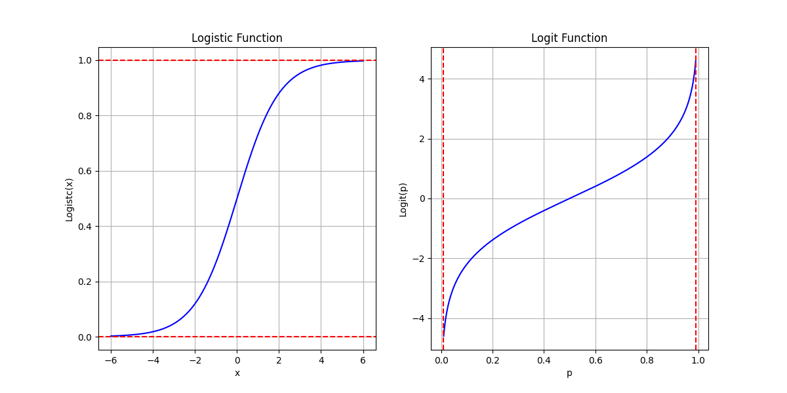

# FDU 回归分析 4. Logistic 回归

本文根据王勤文老师课堂笔记整理而成，并参考以下教材:

- 应用回归分析 (第 $5$ 版, 何晓群, 刘文卿) 第 $10$ 章

欢迎批评指正!

## 4.1 An Introduction

多元线性回归模型 $y=X\beta+\varepsilon$ 中无论是响应变量还是解释变量都是连续变量.  
但在实际问题中我们会遇到离散变量，也称为定性变量 (例如性别、年份、成功与失败、战争与和平)  
此时多元线性回归模型就不适用了.

本章我们假设响应变量 $Y$ 为 $0\text{-}1$ 取值的离散型随机变量 (代表类别标签)  
而解释变量 $x_1,\dots,x_d$ 都是连续变量.    
我们记:  
$$
x = 
\begin{bmatrix}
1\\
x_1\\
\vdots\\
x_d\\
\end{bmatrix}\in \mathbb R^{d+1}
\quad 
\beta =
\begin{bmatrix}
\beta_0\\
\beta_1\\
\vdots\\
\beta_d
\end{bmatrix}\in \mathbb R^{d+1}
$$
此时建立回归方程的基本想法如下:

* ① 响应变量 $Y$ 只有 $0$ 和 $1$ 两个取值，不适合作为连续的回归函数的因变量.  
  我们可以将**条件期望** $\text{E}[Y|x]$ (即**后验概率** $p\{Y=1|x\}$) 作为回归函数的因变量.
  
* ② 为了解决连续的线性函数不适合进行分类的问题，  
  我们引入非线性函数 $g:\mathbb R\to (0,1)$ 来预测类别标签的后验概率 $\text{P}\{Y=1|x\}$: 
  $$
  \text{P}\{Y=1|x\} = g(\beta^{\mathrm T}x)
  $$
  其中 $g(\cdot)$ 称为**激活函数** (activation function)，作用是将线性函数的值域 (实数域) 压缩到区间 $(0,1)$  
  值域为 $[0,1]$ 的连续函数有很多，例如所有连续型随机变量的概率密度函数都符合要求.  
  最常用的是 **Logistic 函数** (又称 Sigmoid 函数) $\sigma(x) := \frac{1}{1+\exp(-x)}\ (\forall\ x\in \mathbb R)$ 

## 4.2 Logistic 回归

### 4.2.1 基本概念

我们首先介绍 Logistic 回归模型中的一些基本概念:

- **① 赔率 (odds):**    
  事件 $E$ 发生与不发生的概率的比值称为赔率，记为 $\text{odds}(E) := \frac{\text{P}(E)}{\text{P}(E^c)} = \frac{\text{P}(E)}{1-\text{P}(E)}$   

- **② 对数赔率函数 (Logit 函数):**  
  $$
  \text{Logit}(p) := \log(\frac{p}{1-p})\quad (p\in (0,1))
  $$

- **③ Logistic 函数 (Sigmoid 函数/逆 Logit 函数):**  
  $$
  \sigma(x):= \frac{1}{1+\exp(-x)} = \frac{\exp(x)}{1+\exp(x)}\quad (x\in \mathbb R)
  $$

Logistic 函数 $\sigma(\cdot)$ 的性质:    
它把实数域的输入挤压到 $(0,1)$  
当输入值在 $0$ 附近时，Logistic 函数近似为线性函数 $y=\frac14 x+\frac12$ (一阶 Taylor 近似)；   
当输入值靠近两端 $(\pm\infty)$ 时，Logistic 函数对输入进行挤压.    
$$
\begin{align} 
\sigma(-x) 
&= \frac{1}{1+\exp(x)} \\
&= \frac{\exp(-x)}{\exp(-x)+1} \\
&= 1- \frac{1}{1+\exp(-x)} \\
&= 1-\sigma(x)\\ 

\hline
\sigma'(x) 
&= \frac{\exp(-x)}{(1+\exp(-x))^2} \\
&= \frac{\exp(-x)}{1+\exp(-x)}\cdot \frac{1}{1+\exp(-x)} \\
&= \frac{1}{\exp(x)+1}\cdot \frac{1}{1+\exp(-x)} \\
&= \sigma(-x)\cdot \sigma(x) \\
&= (1-\sigma(x))\sigma(x)  
\end{align}
$$
Logistic 函数的反函数称为 Logit 函数 $\text{Logit}(p) = \log(\frac{p}{1-p})\ \ \ (p\in [0,1])$     

### 4.2.2 模型假设

给定 $d$ 个连续的解释变量 $x_1,\dots,x_d$ 和 $0$-$1$ 取值的响应变量 $Y$ (代表类别标签)   
我们记:  
$$
x = 
\begin{bmatrix}
1\\
x_1\\
\vdots\\
x_d\\
\end{bmatrix}\in \mathbb R^{d+1}
\quad 
\beta =
\begin{bmatrix}
\beta_0\\
\beta_1\\
\vdots\\
\beta_d
\end{bmatrix}\in \mathbb R^{d+1}
$$
假设标签 $Y=1$ 的后验概率为:  
$$
\begin{align}
\text{P}\{Y=1|x\} 
&= \sigma(\beta^{\mathrm T}x)\\
&= \frac{1}{1+\exp(-\beta^{\mathrm T}x)}\\
&= \frac{\exp(\beta^{\mathrm T}x)}{1+\exp(\beta^{\mathrm T}x)}
\end{align}
$$
则标签 $Y=0$ 的后验概率为:
$$
\begin{align}
\text{P}\{Y=0|x\} 
&= 1-\text{P}\{Y=1|x\}\\
&= 1- \sigma(\beta^{\mathrm T}x)\\
&= \sigma(-\beta^{\mathrm T}x)\\
&= \frac{\exp(-\beta^{\mathrm T}x)}{1+\exp(-\beta^{\mathrm T}x)}\\
\end{align}
$$
于是我们有:  
$$
\begin{align}
\beta^{\mathrm T}x 
&=
\log(\frac{\text{P}\{Y=1|x\}}{1-\text{P}\{Y=1|x\}})\\
&=
\log(\frac{\text{P}\{Y=1|x\}}{\text{P}\{Y=0|x\}})\\
&=
\log(\text{odds}(Y=1|x))\\
&=
\text{Logit}(x)
\end{align}
$$
这样我们就建立了二分类问题和多元线性回归的关系.  
下图给出了使用线性回归和 Logistic 回归来拟合一维数据的二分类问题的示例:  

### 4.2.3 模型推导

给定 $n$ 个样本观测: $(x_1,y_1),\dots,(x_n,y_n)$  
其中 $x_1,\dots,x_n\in  \{1\}\times \mathbb R^{d}$ (已经添加了对应于截距项的 $1$)，而 $y_1,\dots,y_n\in \{0,1\}$   
我们记:  
$$
y=
\begin{bmatrix}
y_1\\
\vdots\\
y_n
\end{bmatrix}\in \{0,1\}^n
\quad
X=
\begin{bmatrix}
x_1^{\mathrm T}\\
\vdots\\
x_n^{\mathrm T}
\end{bmatrix}\in \mathbb R^{n\times (d+1)}
$$
我们将 $y_1,\dots,y_n$ 视为随机变量 $Y_1,\dots,Y_n$ 的实现.  
假设 $Y_i\ (i=1,\dots,n)$ 服从以下 Bernoulli 分布:  
$$
Y_i \sim \text{B}(1, p_i)\text{ i.e. }
Y_i =
\begin{cases}
1, & p_i\\
0, & 1-p_i
\end{cases}\\
\text{where }p_i := \text{P}\{Y=1|x_i\}
=
\sigma(\beta^{\mathrm T}x_i)
$$
因此 $Y = [Y_1,\dots,Y_n]^{\mathrm T}$ 的联合概率密度函数为:  
$$
\begin{align}
f(Y) 
&:= \prod_{i=1}^n p_i^{Y_i}(1-p_i)^{1-Y_i}\\
&=
\prod_{i=1}^n (\sigma(\beta^{\mathrm T}x_i))^{Y_i} (1-\sigma(\beta^{\mathrm T}x_i))^{1-Y_i}\\
\end{align}
$$
对数似然函数为:  
$$
\begin{align}
\mathcal L(y|X,\beta)
&=
\log({\prod_{i=1}^n p_i^{y_i} (1-p_i)^{1-y_i}})\\
&=
\sum_{i=1}^n \left\{
y_i \log(p_i) + (1-y_i) \log(1-p_i) 
\right\}\\
&=
\sum_{i=1}^n \left\{
y_i \log({\sigma(\beta^{\mathrm T}x_i)}) + (1-y_i)\log({1-\sigma(\beta^{\mathrm T}x_i)})
\right\}\\
&=
\sum_{i=1}^n \left\{
y_i \log(\sigma(\beta^{\mathrm T}x_i)) + (1-y_i)\log({\sigma(-\beta^{\mathrm T}x_i)})
\right\}\\
&=
\sum_{i=1}^n \left\{
y_i \log(\frac{1}{1+\exp(-\beta^{\mathrm T}x_i)}) 
-y_i\log (\frac{1}{1+\exp(\beta^{\mathrm T}x_i)})
+ \log({\sigma(-\beta^{\mathrm T}x_i)})
\right\}\\
&=
\sum_{i=1}^n 
\left\{
y_i \log(\frac{1+\exp(\beta^{\mathrm T}x_i)}{1+\exp(-\beta^{\mathrm T}x_i)})
+
\log({\sigma(-\beta^{\mathrm T}x_i)})
\right\}\\
&=
\sum_{i=1}^n \left\{y_i\log({\exp(\beta^{\mathrm T}x_i)}) +\log(\sigma(-\beta^{\mathrm T}x_i)))\right\}\\
&=
\sum_{i=1}^n \left\{y_i (\beta^{\mathrm T}x_i) +\log({\sigma(-\beta^{\mathrm T}x_i)}) \right\}\\
&=
y^{\mathrm T}X\beta + 1_n^{\mathrm T}\log(\sigma(-X\beta))
\end{align}
$$
这就是所谓的**交叉熵损失函数**，我们将其视为 $\beta\in \mathbb R^{d+1}$ 的函数:  
$$
\begin{align}
L(\beta)
&:=-\sum_{i=1}^n \left\{
y_i \log({\sigma(\beta^{\mathrm T}x_i)}) + (1-y_i)\log({1-\sigma(\beta^{\mathrm T}x_i)})
\right\}\\
&= 
- y^{\mathrm T}X\beta - 1_n^{\mathrm T}\log(\sigma(-X\beta))
\end{align}
$$
我们的目标是求解优化问题:  
$$
\begin{align}
\min_{\beta\in \mathbb R^{d+1}} L(\beta) 
&:= -\sum_{i=1}^n \left\{
y_i \log({\sigma(\beta^{\mathrm T}x_i)}) + (1-y_i)\log({1-\sigma(\beta^{\mathrm T}x_i)})
\right\}
\end{align}
$$
但上述问题一般没有解析解，因此我们使用迭代法求解.  
为提供模型的泛化能力，我们还可以引入正则化项 $\lambda \|\beta\|$  
其中 $\lambda>0$ 为正则化系数，而 $\|\cdot\|$ 为 $\mathbb R^{d+1}$ 上的某个范数.

### 4.2.4 梯度法

考虑交叉熵损失函数:  
$$
\begin{align}
L(\beta)
&=-\sum_{i=1}^n \left\{
y_i \log({\sigma(\beta^{\mathrm T}x_i)}) + (1-y_i)\log({1-\sigma(\beta^{\mathrm T}x_i)})
\right\}\quad (\text{denote }p_i:= \sigma(\beta^{\mathrm T}x))\\
&=
-\sum_{i=1}^n 
\left\{y_i \log(p_i) + (1-y_i) \log(1-p_i)\right\}
\end{align}
$$
注意到:  
$$
\begin{align}
\nabla_\beta \log(p_i)
&=
\nabla_\beta \log({\sigma(\beta^{\mathrm T}x_i)})\\
&=
\frac{1}{\sigma(\beta^{\mathrm T}x_i)} \nabla_\beta \{\sigma(\beta^{\mathrm T}x_i)\}\quad (\text{note that }\frac{d}{dt}\sigma(t)=(1-\sigma(t))\sigma(t))\\
&=
\frac{1}{\sigma(\beta^{\mathrm T}x_i)} (1-\sigma(\beta^{\mathrm T}x_i))\sigma(\beta^{\mathrm T}x_i) \nabla_\beta \{\beta^{\mathrm T}x_i\}\\
&=
(1-\sigma(\beta^{\mathrm T}x_i))x_i\\
&=
(1-p_i) x_i\\
\hline
\nabla_\beta \log(1-p_i) 
&=
\nabla_\beta \log({1-\sigma(\beta^{\mathrm T}x_i)})\quad (\text{note that }\sigma(-t)=1-\sigma(t))\\
&=
\nabla_\beta \log({\sigma(-\beta^{\mathrm T}x_i)})\\
&=
(1-\sigma(-\beta^{\mathrm T}x_i))\cdot (-x_i)\\
&=
-\sigma(\beta^{\mathrm T}x_i) x_i\\
&=
-p_i x_i
\end{align}
$$
于是损失函数的梯度为: 
$$
\begin{align}
\nabla_\beta L(\beta)
&=
-\nabla_\beta\left\{\sum_{i=1}^n 
\left\{y_i \log(p_i) + (1-y_i) \log(1-p_i)\right\}\right\}\\
&=
-\sum_{i=1}^n 
\left\{y_i \nabla_\beta\log(p_i) + (1-y_i) \nabla_\beta \log(1-p_i)\right\}\\
&=
-\sum_{i=1}^n
\left\{y_i \cdot (1-p_i)x_i + (1-y_i)\cdot [-p_i x_i]\right\}\\
&=
-\sum_{i=1}^n (y_i-p_i)x_i\\
&=
-X^{\mathrm T} (y-p)\quad (\text{where }p:= \sigma(X\beta) = 
\begin{bmatrix}
\sigma(\beta^{\mathrm T}x_1)\\
\vdots\\
\sigma(\beta^{\mathrm T}x_n)
\end{bmatrix} = 
\begin{bmatrix}
p_1\\
\vdots\\
p_n
\end{bmatrix})
\end{align}
$$
**使用梯度法训练模型:**

- 初始化 $\beta^{(0)}= 0_{d+1}$  

- 然后迭代更新参数直至达到某个预设定的停止条件:
  $$
  p^{(k)} = \sigma(X\beta^{(k)})\\
  d^{(k)} = -\nabla_\beta L(\beta^{(k)}) = X^{\mathrm T}(y-p^{(k)})\\
  t_k = \text{Armijo}(\beta^{(k)},d^{(k)})\\
  \beta^{(k+1)} = \beta^{(k)} + t_k d^{(k)}
  $$
  其中 $t_k$ 是步长，$d^{(k)}$ 为下降方向，$p^{(k)}$ 是当参数为 $\beta^{(k)}$ 时，Logistic 回归模型的 $n$ 维输出向量.     
  步长 $t_k$ 的选择可使用 **Armijo 准则:**    
  固定初始步长 $\hat t$ 和回溯因子 $\gamma\in (0,1)$，以及尺度因子 $\alpha \in (0,1)$  
  我们不断试验步长 $\gamma^m \hat t\ \ (m=0,1,\dots)$ 直至找到第一个非负整数 $m$，  
  使得 $L(\beta^{(k)}+(\gamma^m\hat t)d^{(k)}) - L(\beta^{(k)})\leq
  \alpha (\gamma^m \hat t)(\nabla_\beta L(\beta^{(k)}))^{\mathrm T}d^{(k)}$ 成立.  
  这不但保证了每步迭代有下降， 还保证了下降的程度是充分大的. 

### 4.2.5 Newton 法

我们已经得到了损失函数的梯度:
$$
\begin{align}
\nabla_\beta L(\beta) 
&= -X^{\mathrm T} (y-p)\\
&= -\sum_{i=1}^n (y_i-p_i)x_i\\
&= -\sum_{i=1}^n (y_i- \sigma(\beta^{\mathrm T}x_i))x_i
\end{align}
$$
其中 $p=\sigma(X\beta) = [\sigma(\beta^{\mathrm T}x_1),\dots,\sigma(\beta^{\mathrm T}x_n)]^{\mathrm T}\in \mathbb R^n$，而 $X=[x_1,\dots,x_n]^{\mathrm T}\in \mathbb R^{n\times (d+1)}$  
注意到: 
$$
\begin{align}
\nabla_\beta \{p_i\}
&=
\nabla_\beta \{\sigma(\beta^{\mathrm T}x_i)\}\\
&=
(1-\sigma(\beta^{\mathrm T}x_i))\sigma(\beta^{\mathrm T}x_i) \nabla_\beta\{\beta^{\mathrm T}x_i\}\\
&=
(1-\sigma(\beta^{\mathrm T}x_i))\sigma(\beta^{\mathrm T}x_i) x_i\\
&=
(1-p_i)p_i x_i
\end{align}
$$
于是损失函数的 Hesse 矩阵为:
$$
\begin{align}
\nabla_\beta^2 L(\beta)
&=
\frac{\partial }{\partial \beta} \nabla_\beta L(\beta)\\
&=
\frac{\partial }{\partial \beta} \left\{-X^{\mathrm T}(y-p)\right\}\\
&=
\frac{\partial }{\partial \beta} \left\{ -\sum_{i=1}^n (y_i- p_i)x_i\right\}\\
&=
-\sum_{i=1}^n x_i \frac{\partial }{\partial \beta}\{y_i - p_i\}\quad (\text{note that }\frac{\partial}
{\partial \beta}p_i = \nabla_\beta^{\mathrm T}\{p_i\} = (1-p_i)p_i x_i^{\mathrm T} )\\
&=
-\sum_{i=1}^n x_i \cdot [0_{d+1} - (1-p_i)p_i x_i^{\mathrm T}]\\
&=
\sum_{i=1}^n (1-p_i)p_i x_ix_i^{\mathrm T}\\
&=
X^{\mathrm T}\cdot \text{diag}\{(1_n-p)\odot p\}\cdot X
\end{align}
$$
其中 $\odot$ 代表 Hadamard 乘积，即逐元素乘积.  

****

**使用 Newton 法训练模型:**

- 初始化 $\beta^{(0)}= 0_{d+1}$  

- 然后迭代更新参数直至达到某个预设定的停止条件:   
  $$
  \begin{align}
  p^{(k)}
  &= \sigma(X\beta^{(k)})\\
  \nabla_\beta L(\beta^{(k)}) 
  &= -X^{\mathrm T}(y-p^{(k)})\\
  \nabla_\beta^2 L(\beta^{(k)}) 
  &= X^{\mathrm T}\cdot \text{diag}\{(1_n-p^{(k)})\odot p^{(k)}\}\cdot X\\
  d^{(k)} 
  &= -(\nabla^2_\beta L(\beta^{(k)}))^{-1} \nabla_\beta L (\beta^{(k)})\\
  t_k &= \text{Armijo}(\beta^{(k)},d^{(k)})\\
  \beta^{(k+1)} &= \beta^{(k)} + t_k d^{(k)}
  \end{align}
  $$
  其中 $p^{(k)}$ 是当参数为 $\beta^{(k)}$ 时 Logistic 回归模型的 $n$ 维输出向量，$d^{(k)}$ 为下降方向.
  步长 $t_k$ 的选择可使用 **Armijo 准则:**    
  固定初始步长 $\hat t$ 和回溯因子 $\gamma \in (0,1)$，以及尺度因子 $\alpha \in (0,1)$  
  我们不断试验步长 $\gamma^m \hat t\ \ (m=0,1,\dots)$ 直至找到第一个非负整数 $m$，  
  使得 $L(\beta^{(k)}+(\gamma^m\hat t)d^{(k)}) - L(\beta^{(k)})\leq
  \alpha (\gamma^m \hat t)(\nabla_\beta L(\beta^{(k)}))^{\mathrm T}d^{(k)}$ 成立.  
  这不但保证了每步迭代有下降， 还保证了下降的程度是充分大的. 

### 4.2.6 另一种视角

求解 Logistic 回归的 Newton 法的每步迭代相当于进行一次加权最小二乘: 
$$
\begin{align}
\beta^{(k+1)} 
&= \beta^{(k)} + t_kd^{(k)}\\
&= \beta^{(k)} + t_k\left[-(X^{\mathrm T}\text{diag}\{p^{(k)} \odot (1_n- p^{(k)})\} X)^{-1} 
(- X^{\mathrm T}(y-p^{(k)}))\right]\\
&=
\beta^{(k)} + t_k(X^{\mathrm T}\text{diag}\{p^{(k)} \odot (1_n- p^{(k)})\} X)^{-1} X^{\mathrm T}(y-p^{(k)})
\quad (\text{denote }W_k:= \text{diag}\{p^{(k)} \odot (1_n- p^{(k)})\})\\
&=
\beta^{(k)} + t_k(X^{\mathrm T} W_k X)^{-1} X^{\mathrm T}(y-p^{(k)})\\
&=
(X^{\mathrm T} W_k X)^{-1} X^{\mathrm T}W_k[X \beta^{(k)} - t_k W_k^{-1}(y-p^{(k)})]\quad (\text{denote }z^{(k)}:=
X \beta^{(k)} - t_k W_k^{-1}(y-p^{(k)}))\\
&=
(X^{\mathrm T}W_kX)^{-1}X^{\mathrm T}W_kz^{(k)}
\end{align}
$$
因此迭代中的每一个 $\beta^{(k+1)}\ (k=0,1,\dots)$ 都能视为一个加权最小二乘估计量.   

> 或者我们也可以将 $(X^{\mathrm T} W_k X)^{-1} X^{\mathrm T}(y-p^{(k)})$ 视为一个加权最小二乘估计量.  
> 每次迭代 $\beta^{(k+1)}=\beta^{(k)} + t_k(X^{\mathrm T} W_k X)^{-1} X^{\mathrm T}(y-p^{(k)})$   
> 都相当于在当前解的基础上加上一个加权最小二乘估计量 $t_k\cdot (X^{\mathrm T} W_k X)^{-1} X^{\mathrm T}(y-p^{(k)})$

当样本量 $n\to\infty$ 时，对于任意 $k=0,1,\dots$ 我们都有:    
(王勤文老师: 也许可以回到 $\beta$ 原本满足的方程，使用一阶 Taylor 展开来证明这个式子)
$$
(X^{\mathrm T}W_k X)^{-\frac12}\beta^{(k+1)} \to N(\beta_{\text{true}},I_{d+1})
$$
因而当 $n,k\to\infty$ 时有: **(存疑: 但是 $W_{\text{true}}$ 的计算公式包含 $n$ 怎么办?)**
$$
\beta^{(k)} \to N(\beta_{\text{true}},(X^{\mathrm T}W_{\text{true}}X)^{-1})\text{ where }
\begin{cases}
p_{\text{true}} = \sigma(X\beta_{\text{true}})\\
W_{\text{true}} = \text{diag}\{p_{\text{true}}\odot (1_n - p_{\text{true}})\}
\end{cases}
$$

### 4.2.7 似然比检验

在 Logistic 回归的背景下，  
**似然比检验** (likelihood ratio test) 可以用来检验某一组回归系数是否为零 (即对应的解释变量是否对模型有显著贡献)     
我们将 $\beta\in \mathbb R^{d+1}$ 分为两个部分，$\beta^{(0)}\in \mathbb R^{m}$ 和 $\beta^{(1)}\in \mathbb R^{d+1-m}$，其中前者是我们感兴趣的解释变量的回归系数.   
我们相应地将 $X\in \mathbb R^{n\times (d+1)}$ 分为两个部分，$X^{(0)}\in \mathbb R^{n\times m}$ 和 $X^{(1)}\in \mathbb R^{n\times (d+1-m)}$   
考虑检验问题:  
$$
H_0 : \beta^{(0)} = 0_m \ \leftrightarrow\ H_1: \beta^{(0)} \neq 0_m
$$
我们构造如下的似然比检验统计量:  
$$
\begin{align}
\text{LR}
&:=
-2\max_{\beta^{(1)}\in \mathbb R^{d+1-m}} \text{loglikelihood}(\text{reduced model}) + 2\max_{
\beta\in \mathbb R^{d+1}}
\text{loglikelihood}(\text{full model})\\
&=
-2\max_{\beta^{(1)}\in \mathbb R^{d+1-m}}
\underset{i=1}{\overset{n}\sum}
\left\{y_i\log{(\sigma((\beta^{(1)})^{\mathrm T}x^{(1)}_i))} + (1-y_i)\log{(1-\sigma((\beta^{(1)})^{\mathrm T}x^{(1)}_i))}\right\}\\
&\quad\ +
2\max_{\beta\in \mathbb R^{d+1-m}}
\underset{i=1}{\overset{n}\sum}
\left\{y_i\log{(\sigma(\beta^{\mathrm T}x_i))} + (1-y_i)\log{(1-\sigma(\beta^{\mathrm T}x_i))}\right\}\\
&\overset{H_0}\sim  \chi^2_{(m)}
\end{align}
$$
设因子水平为 $\alpha$  
当 $\text{LR}> \chi^2_{(m),\alpha}$ 时我们拒绝零假设 $H_0 : \beta^{(0)} = 0_m$，认为 $\beta^{(0)}$ 中回归系数对应的解释变量是显著的.  
其中 $\chi^2_{(m),\alpha}$ 为自由度 $m$ 的卡方分布的 $1-\alpha$ 分位数.  

**The End**
