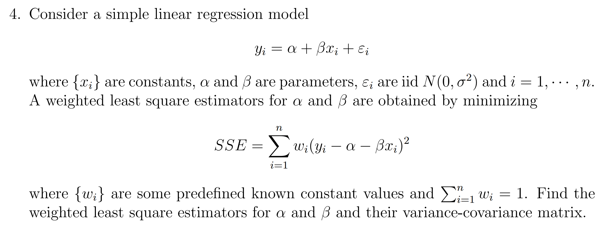

## 第一次作业第四题原题:

## 加上 $w_1,\dots,w_n>0$ 假设后的求解过程

**Solution:**    
$y_i = \alpha + \beta x_i + \varepsilon_i\ (i=1,\dots,n)$ 可以写成紧凑形式 $y=\alpha 1_n + \beta x + \varepsilon$，其中 $\varepsilon \sim N(0_n,\sigma^2I_n)$   
记 $\begin{cases}
W=\text{diag}\{w_1,\dots,w_n\}\\
w=[w_1,\dots,w_n]^T\\
\gamma = [\alpha,\beta]^T\\
X = [1_n;x]\end{cases}$ 则我们有:  
$$
y=\alpha 1_n + \beta x + \varepsilon =  X\gamma + \varepsilon\\
\hline
\text{RSS}(\alpha,\beta):= \sum_{i=1}^n w_i (y_i-\alpha -\beta x_i)^2 = (y-X\gamma)^TW (y-X\gamma)\text{ where }W \text{ satisfies }\begin{cases}
W\succ 0\\
\tr(W) = 1
\end{cases}
$$
于是 $\gamma$ 的最小二乘估计量为如下优化问题的全局最小点:  
$$
\hat \gamma := \arg \min_{\begin{subarray}{}\gamma \in \mathbb R^2\end{subarray}} (y-X\gamma)^TW (y-X\gamma)\\
\hline
\begin{align}
\nabla_\gamma\{(y-X\gamma)^TW (y-X\gamma)\} 
&= 
\nabla_\gamma\{y^TWy - 2y^TWX\gamma + \gamma X^TWX \gamma\}\\
&=
-2X^TWy + 2X^TWX\gamma\\
\hline
\nabla_\gamma^2\{(y-X\gamma)^TW (y-X\gamma)\} 
&=
2X^TWX \succ 0
\end{align}
$$
因此这是一个无约束凸优化问题，其全局最小点即为驻点.  
令 $\nabla_\gamma\{(y-X\gamma)^TW (y-X\gamma)\}=-2X^TWy + 2X^TWX\gamma = 0_2$ 可得:  
$$
\begin{align}
\hat \gamma 
&= (X^TWX)^{-1} X^TWy\\
&= \begin{bmatrix}
1_n^TW1_n & 1_n^TWx\\
x^TW1_n & x^TWx
\end{bmatrix}^{-1}
\begin{bmatrix}
1_n^TWy\\
x^TWy
\end{bmatrix}\quad (\text{note that }\begin{bmatrix}
a & b\\
c & d\end{bmatrix}^{-1} = \frac{1}{ad-bc}
\begin{bmatrix}
d & -b\\
-c & a
\end{bmatrix}\text{ if }ad-bc\neq 0)\\
&=
\frac{1}{(1_n^TW1_n)(x^TWx) - (1_n^TWx)(x^TW1_n)}
\begin{bmatrix}
x^TWx & -1_n^TWx\\
-x^TW1_n& 1_n^TW1_n
\end{bmatrix}
\begin{bmatrix}
1_n^TWy\\
x^TWy
\end{bmatrix}\quad (\text{note that }
\begin{cases}
1_n^TW1_n = \sum_{i=1}^n w_i = 1)\\
W1_n =w\end{cases})\\
&=
\frac{1}{x^TWx - (w^Tx)^2}
\begin{bmatrix}
(x^TWx)(w^Ty) - (w^Tx) (x^TWy)\\
-(w^Tx)(w^Ty) + x^TWy
\end{bmatrix}
\end{align}
$$
因此 $\alpha,\beta$ 的加权最小二乘估计量 $\hat \alpha,\hat \beta$ 分别为 $\hat \gamma$ 的两个分量:  
$$
\begin{align}
\hat \alpha 
&=
\frac{(x^TWx)(w^Ty) - (w^Tx) (x^TWy)}{x^TWx - (w^Tx)^2}\\
&=
\frac{(\sum_{i=1}^n w_ix_i^2)(\sum_{i=1}^n w_i y_i) - (\sum_{i=1}^n w_i x_i)(\sum_{i=1}^n w_i x_iy_i)}{\sum_{i=1}^n w_i x_i^2 - (\sum_{i=1}^n w_ix)^2}\\
\hline
\hat \beta 
&=
\frac{ x^TWy-(w^Tx)(w^Ty)}{x^TWx - (w^Tx)^2}\\
&=
\frac{\sum_{i=1}^n w_i x_iy_i - (\sum_{i=1}^n w_i x_i)(\sum_{i=1}^n w_iy_i)}{\sum_{i=1}^n w_i x_i^2 - (\sum_{i=1}^n w_ix)^2}
\end{align}
$$
下面我们考虑 $\hat \gamma =[\hat \alpha,\hat \beta]^T$ 的分布:  
$$
\begin{align}
\hat \gamma 
&= (X^TWX)^{-1} X^TWy\\
&= (X^TWX)^{-1} X^TW(X\gamma + \varepsilon)\\
&= \gamma +  (X^TWX)^{-1} X^TW\varepsilon\\
\hline
\hat \gamma - \gamma
&= (X^TWX)^{-1} X^TW\varepsilon\\
&\sim N((X^TWX)^{-1} X^TW \cdot 0_n, (X^TWX)^{-1} X^TW \cdot \sigma^2 I_n \cdot [(X^TWX)^{-1} X^TW]^T)\\
&=
N(0_n, \sigma^2\cdot (X^TWX)^{-1} X^TW^2X(X^TWX)^{-1})
\end{align}
$$
因此 $\hat \alpha,\hat \beta$ 的协方差矩阵为:
$$
\begin{align}
\text{Cov}(\hat \gamma) 
&= \sigma^2\cdot (X^TWX)^{-1} X^TW^2X(X^TWX)^{-1}\quad (\text{note that }(X^TWX)^{-1} 
= \frac{1}{x^TWx - (w^Tx)^2}
\begin{bmatrix}
x^TWx & -w^Tx\\
-w^Tx& 1
\end{bmatrix})\\
&= 
\frac{\sigma^2}{[x^TWx - (w^Tx)^2]^2}
\begin{bmatrix}
x^TWx & -w^Tx\\
-w^Tx& 1
\end{bmatrix}
\begin{bmatrix}
1_n^TW^21_n & 1_n^TW^2x\\
x^TW^21_n & x^TW^2x
\end{bmatrix}
\begin{bmatrix}
x^TWx & -w^Tx\\
-w^Tx& 1
\end{bmatrix}
\end{align}
$$

(不想继续化简了)

## 一点思考

如果将 $\varepsilon_i \overset{iid}\sim N(0,\sigma^2)\ (i=1,\dots,n)$ 的假设变为 "$\varepsilon_i \sim N(0,\frac{\sigma^2}{w_i})\ (i=1,\dots,n)$ 且它们相互独立"，  
那么 $\hat \gamma$ 的协方差矩阵的形式会更加简单:  
(注意此时我们有 $\varepsilon \sim N(0_n,\sigma^2 W^{-1})$)  
$$
\begin{align}
\hat \gamma 
&= (X^TWX)^{-1} X^TWy\\
&= (X^TWX)^{-1} X^TW(X\gamma + \varepsilon)\\
&= \gamma +  (X^TWX)^{-1} X^TW\varepsilon\\
\hline
\hat \gamma - \gamma
&= (X^TWX)^{-1} X^TW\varepsilon\\
&\sim N((X^TWX)^{-1} X^TW \cdot 0_n, (X^TWX)^{-1} X^TW \cdot \sigma^2 W^{-1} \cdot [(X^TWX)^{-1} X^TW]^T)\\
&=
N(0_n, \sigma^2\cdot (X^TWX)^{-1} X^TWX(X^TWX)^{-1})\\
&=
N(0_n,\sigma^2 (X^TWX)^{-1})
\end{align}
$$
我觉得这样的协方差矩阵形式更加简单，只要取 $W = I_n$ 就是普通最小二乘的情况.  
而且这也更符合加权最小二乘用于异方差修正的问题背景.