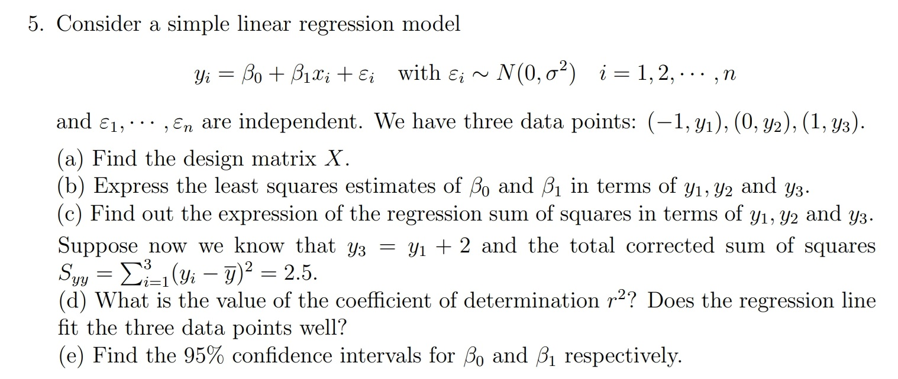

## Problem 5

Consider a simple linear regression model:  
$$
y_i = \beta_0 + \beta_1 x_i + \varepsilon_i\ (i=1,\dots,n)
$$
where $x_1,\dots,x_n$ are constants, $\alpha,\beta$ are parameters, $\varepsilon_i\overset{iid}\sim N(0,\sigma^2)\ (i=1,\dots,n)$    
Suppose $n=3$ and three data points: $(-1,y_1),(0,y_2),(1,y_3)$ 

- (a) Find the design matrix $X$  
- (b) Express the least squares estimators of $\beta_0,\beta_1$ in terms of $y_1,y_2,y_3$ 
- (c) Find out the expression of the regression sum of squares in terms of $y_1,y_2,y_3$
- (d) Suppose $y_3=y_1+2$ and the total sum of squares $\text{SST}:=S_{yy} = \sum_{i=1}^3(y_i-\bar y)^2 = 2.5$   
  What is the value of the coefficient of determination $R^2$?  
  Does the regression line fit the three data points well?
- (e) Under the condition of (d), find the $95\%$ confidence intervals for $\beta_0,\beta_1$ respectively.

**原题截图:**

### Part (a)

Find the design matrix $X$  

**Solution:**   
$$
X= 
\begin{bmatrix}
1 & x_1\\
1 & x_2\\
1 & x_3
\end{bmatrix}
=
\begin{bmatrix}
1 & -1\\
1 & 0\\
1 & 1
\end{bmatrix}
$$
于是 $y_i=\beta_0 + \beta_1 x_i + \varepsilon_i\ (i=1,2,3)$ 可以写成紧凑形式 $y = X\beta + \varepsilon$ (其中 $\beta = [\beta_0,\beta_1]^T$) 

### Part (b)

Express the least squares estimators of $\beta_0,\beta_1$ in terms of $y_1,y_2,y_3$ 

**Solution: **   
$$
\begin{align}
\hat \beta
&:=
\arg \min_{\beta\in \mathbb R^2} \|y-X\beta\|_2^2\\
&=
\text{solution of }\{-2X^T(y-X\beta) = 0_2\}\\
&=
(X^TX)^{-1} X^Ty\\
&=
\begin{bmatrix}
3 & 0\\
0 & 2
\end{bmatrix}^{-1}
\begin{bmatrix}
1 & 1 & 1\\
-1 & 0 & 1
\end{bmatrix} 
\begin{bmatrix}
y_1\\
y_2\\
y_3
\end{bmatrix}\\
&=
\begin{bmatrix}
\frac13 (y_1 + y_2 + y_3)\\
\frac12 (y_3 - y_1)
\end{bmatrix}
\end{align}
$$
因此我们有:  
$$
\begin{cases}
\hat \beta_0 = \frac13(y_1 + y_2 + y_3) = \bar y\\
\hat \beta_1 = \frac12(y_3 - y_1)
\end{cases}
$$

### Part (c)

Find out the expression of the regression sum of squares in terms of $y_1,y_2,y_3$

**Solution:**  
$$
\begin{align}
\text{SSR}
&=
\|\hat y - \bar y 1_3\|_2^2\\
&=
\|X\hat \beta - \frac13 1_3^Ty 1_3\|\quad (\text{note that }\hat \beta = (X^TX)^{-1}X^Ty)\\
&=
\|[X(X^TX)^{-1}X^T - \frac{1}{3}1_31_3^T] y\|_2^2\\
&=
y^T[X(X^TX)^{-1}X^T - \frac{1}{3}1_31_3^T] y\\
&=
y^T\left(\begin{bmatrix}
1 & -1\\
1 & 0\\
1 & 1
\end{bmatrix} \begin{bmatrix}
3 & 0\\
0 & 2
\end{bmatrix}^{-1}
\begin{bmatrix}
1 & -1\\
1 & 0\\
1 & 1
\end{bmatrix}^T - \frac13 
\begin{bmatrix}
1 & 1 & 1\\
1 & 1 & 1\\
1 & 1 & 1
\end{bmatrix}\right) y\\
&=
y^T
\left(
\begin{bmatrix}
1 & -1\\
1 & 0\\
1 & 1
\end{bmatrix}
\begin{bmatrix}
\frac13 & \\
& \frac12
\end{bmatrix}
\begin{bmatrix}
1 & 1 & 1\\
-1 & 0 & 1
\end{bmatrix}
- \frac13 
\begin{bmatrix}
1 & 1 & 1\\
1 & 1 & 1\\
1 & 1 & 1
\end{bmatrix}
\right)y\\
&=
y^T
\left(
\begin{bmatrix}
\frac56 &\frac13 & -\frac16\\
\frac13 & \frac13 & \frac13\\
-\frac16 & \frac13 & \frac{5}{6}
\end{bmatrix}

- \frac13 
\begin{bmatrix}
1 & 1 & 1\\
1 & 1 & 1\\
1 & 1 & 1
\end{bmatrix}\right)y\\
&=
y^T\begin{bmatrix}
\frac12 & 0 & -\frac12\\
0 & 0 & 0\\
-\frac12 & 0 & \frac{1}{2}
\end{bmatrix}y\\
&=
\frac12 (y_1-y_3)^2
\end{align}
$$

### Part (d)

Suppose $y_3=y_1+2$ and the total sum of squares $\text{SST}:=S_{yy} = \sum_{i=1}^3(y_i-\bar y)^2 = 2.5$   
What is the value of the coefficient of determination $R^2$?  
Does the regression line fit the three data points well?

**Solution:**  
由于 $y_3 = y_1 + 2$，故 $\text{SSR} = \frac12 (y_1 - y_3)^2 = \frac12 \cdot 2^2 = 2$   
因此 $R^2 = \frac{\text{SSR}}{\text{SST}} = \frac{2}{2.5} = 0.8$   
这个数值很接近于 $1$，故模型较好地拟合了 $3$ 个数据点.

### Part (e)

Under the condition of (d), find the $95\%$ confidence intervals for $\beta_0,\beta_1$ respectively.

**Solution:**       
根据 $\begin{cases}
y_3 = y_1 + 2\\
S_{yy} = \sum_{i=1}^3(y_i-\bar y)^2 = y_1^2 + y_2^2 + y_3^2 - 3\bar y^2= 2.5\\
\bar y = \frac13 (y_1 + y_2 + y_3)\end{cases}$ 我们可以得到:
$$
\begin{align}
2.5 
&= y_1^2 + y_2^2 + (y_1 + 2)^2 - 3\cdot \frac19(2y_1 + y_2 + 2)^2\\
&= 2y_1^2 + y_2^2 + 4y_1 + 4 - \frac13 (4y_1^2 + y_2^2 + 4 + 4y_1y_2 + 8y_1 + 4 y_2)\\
&= \frac23 y_1^2 + \frac23 y_2^2  +\frac43 y_1 - \frac43 y_2 - \frac43 y_1y_2 + \frac83\\
&= \frac23 (y_1^2 + y_2^2 + 1 + 2y_1 - 2y_2 -2y_1y_2) + 2\\
&= \frac23 (y_1 -y_2 + 1)^2 + 2\\
\hline
(y_1-y_2 + 1)^2 &= \frac34\ \Rightarrow\ (y_1- y_2) = -1 \pm \frac{\sqrt 3}{2}
\end{align}
$$
但遗憾的是，根据已有数据我们仍然无法计算出 $\hat \beta_0 = \bar y$   
根据 Part (b) 我们有:  
$$
\begin{align}
\hat \beta
&:=
\arg \min_{\beta\in \mathbb R^2} \|y-X\beta\|_2^2\\
&=
\text{solution of }\{-2X^T(y-X\beta) = 0_2\}\\
&=
(X^TX)^{-1} X^Ty\\
&=
\begin{bmatrix}
3 & 0\\
0 & 2
\end{bmatrix}^{-1}
\begin{bmatrix}
1 & 1 & 1\\
-1 & 0 & 1
\end{bmatrix} 
\begin{bmatrix}
y_1\\
y_2\\
y_3
\end{bmatrix}\\
&=
\begin{bmatrix}
\frac13 (y_1 + y_2 + y_3)\\
\frac12 (y_3 - y_1)
\end{bmatrix}\quad (\text{note that }y_3 = y_1 + 2)\\
&=
\begin{bmatrix}
\bar y\\
1
\end{bmatrix}
\end{align}
$$
因此我们有:  
$$
\begin{align}
\hat \beta 
&= (X^TX)^{-1}X^Ty\\
&= (X^TX)^{-1}X^T(X\beta + \varepsilon)\\
&= \beta + (X^TX)^{-1}X^T\varepsilon\\
\hline
\hat \beta - \beta
&= (X^TX)^{-1}X^T\varepsilon\\
&\sim N((X^TX)^{-1}X^T0_n, (X^TX)^{-1}X^T \cdot \sigma^2 I_n\cdot [(X^TX)^{-1}X^T]^T)\\
&= N(0_2, \sigma^2 (X^TX)^{-1})\\
&= N\left(
\begin{bmatrix}
0\\ 0\end{bmatrix},
\sigma^2 
\begin{bmatrix}
3 & 0\\
0 & 2
\end{bmatrix}^{-1}
\right)\\
&=N\left(
\begin{bmatrix}
0\\ 0\end{bmatrix}, 
\begin{bmatrix}
\frac13 \sigma^2 & 0\\
0 & \frac12 \sigma^2
\end{bmatrix}\right)
\end{align}
$$
而 $\sigma^2$ 的无偏估计量 $s^2 = \frac{1}{n-2}\text{SSE} = \frac{1}{n-2}(\text{SST}-\text{SSR}) = \frac{1}{3-2}(2.5-2) = 0.5\sim \sigma^2 \chi^2_{(1)}$   
因此用于对 $\beta_0,\beta_1$ 进行区间估计的枢轴量为:
$$
\frac{\hat \beta_0 - \beta_0}{\sqrt{\frac13 s^2}} = \sqrt{6}(? - \beta_0) \sim t_{1}\\
\frac{\hat \beta_1 - \beta_1}{\sqrt{\frac12 s^2}} = 2(1 - \beta_1) \sim t_1
$$
因此 $\beta_1$ 的 $95\%$ 置信区间为 $[1 - \frac12 t_{1,0.975},1+\frac12 t_{1,0,975}]$  
其中 $t_{1,0.975}\approx 12.71$ 为自由度为 $1$ 的 $t$ 分布的 $1-\frac{1}{2}(1-0.95) = 0.975$ 分位数.  

但是由于 $\hat \beta_0 = \bar y$ 计算不出来，因此无法给出 $\beta_0$ 的区间估计.  
如果真要做的话，似乎只能对 $(y_1- y_2) = -1 \pm \frac{\sqrt 3}{2}$分类讨论，  
得到 $\bar y$ 关于 $y_1$ 的两种表达式，分别给出置信区间.  
我在想，老师您是不是遗漏了某个条件呢, 例如 "$\bar y = 0.5$" 之类的?