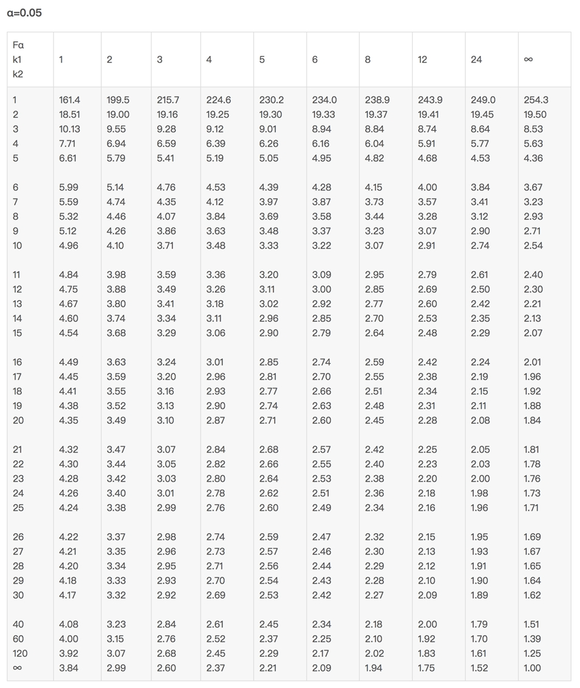

# 期末考试回忆 (2024 秋)

## Problem 1

双因子方差分析，试求 $\text{SSA}$, $\text{SSB}$, $\text{SSAB}$ 的期望.

**Solution:**  
在双因子方差分析的背景下，我们有:
$$
\bar y_{ij\cdot} := \frac{1}{n}\sum_{k=1}^{n}y_{ijk} = \mu_{ij} + \bar \varepsilon_{ij\cdot} \sim N\left(\mu_{ij},\frac{\sigma^2}{n}\right)\\

\bar y_{i\cdot\cdot} := \frac{1}{b}\sum_{j=1}^b \bar y_{ij\cdot} 
=
\mu_{i\cdot} + \bar \varepsilon_{i\cdot\cdot} \sim N\left(\mu_{i\cdot},\frac{\sigma^2}{bn}\right)\\

\bar y_{\cdot j\cdot} := \frac{1}{a}\sum_{i=1}^a \bar y_{ij\cdot} 
=
\mu_{\cdot j} + \bar \varepsilon_{\cdot j\cdot}
\sim N\left(\mu_{\cdot j},\frac{\sigma^2}{an}\right)\\

\bar y_{\cdot\cdot\cdot} := \frac{1}{ab}\sum_{i=1}^a \sum_{j=1}^b \bar y_{ij\cdot} 
=
\mu_{\cdot\cdot} + \bar \varepsilon_{\cdot\cdot\cdot}\sim N
\left(\mu_{\cdot\cdot},\frac{\sigma^2}{abn}\right)\\
\text{SSAB}:=n\sum_{i,j}^{a,b} (\bar y_{ij\cdot} + \bar y_{\cdot\cdot\cdot} - \bar y_{i\cdot\cdot} - \bar y_{\cdot j\cdot})^2\\

\text{SSA}:=bn \sum_{i=1}^a (\bar y_{i\cdot\cdot} - \bar y_{\cdot\cdot\cdot})^2\\

\text{SSB}:= an \sum_{j=1}^b (\bar y_{\cdot j \cdot} - \bar y_{\cdot\cdot\cdot})^2
$$

定义 $\Epsilon:= [\bar \varepsilon_{ij\cdot}]\in \mathbb R^{a\times b}$  
用 $\Epsilon_{(i,:)}$ 代表 $\Epsilon$ 的第 $i$ 行，用 $\text{E}_{(:,j)}$ 代表 $\Epsilon$ 的第 $j$ 列.  
注意到: 
$$
\begin{align}
\bar\varepsilon_{i\cdot\cdot}
&= \frac1b \sum_{j=1}^b \bar \varepsilon_{ij\cdot} = \Epsilon_{(i,:)}\cdot \frac1b 1_b\\
\bar\varepsilon_{\cdot j\cdot}
&=
\frac{1}{a} \sum_{i=1}^a \bar\varepsilon_{ij\cdot} = \frac{1}{a}1_a^{\mathrm T}\cdot\Epsilon_{(:,j)} \\
\bar \varepsilon_{\cdot\cdot\cdot}
&=
\frac{1}{ab}\sum_{i=1}^{a}\sum_{j=1}^b \bar\varepsilon_{ij\cdot} = \frac{1}{a} 1_a^{\mathrm T} \cdot \Epsilon \cdot
\frac{1}{b} 1_b
\end{align}
$$
因此我们有:  
$$
\begin{align} 
\begin{bmatrix} 
\bar\varepsilon_{1\cdot\cdot} & \dotsm & \bar\varepsilon_{1\cdot\cdot}\\ \vdots &&\vdots\\ \bar \varepsilon_{a\cdot\cdot} & \dotsm & \bar\varepsilon_{a\cdot\cdot} \end{bmatrix} 
&= 
\begin{bmatrix} \bar \varepsilon_{1\cdot\cdot}1_b^{\mathrm T}\\ \vdots\\ \bar \varepsilon_{a\cdot\cdot}1_b^{\mathrm T} \end{bmatrix} 
= 
\Epsilon\cdot \frac{1}b1_b1_b^{\mathrm T}\\ 
\begin{bmatrix} \bar\varepsilon_{\cdot 1\cdot} & \dotsm & \bar\varepsilon_{\cdot b\cdot}\\ \vdots &&\vdots\\ \bar \varepsilon_{\cdot 1\cdot} & \dotsm & \bar\varepsilon_{\cdot b\cdot} \end{bmatrix}  
&= 
\begin{bmatrix}  \bar\varepsilon_{\cdot 1 \cdot} 1_a & \dotsm & \bar\varepsilon_{\cdot b\cdot} 1_a \end{bmatrix} 
= \frac1a 1_a1_a^{\mathrm T} \cdot \Epsilon\\ 
\begin{bmatrix} \bar\varepsilon_{\cdot\cdot\cdot} & \dotsm & \bar\varepsilon_{\cdot\cdot\cdot}\\ \vdots &&\vdots\\ \bar \varepsilon_{\cdot\cdot\cdot} & \dotsm & \bar\varepsilon_{\cdot\cdot\cdot} \end{bmatrix}  
&= 1_a \bar\varepsilon_{\cdot\cdot\cdot} 1_b^{\mathrm T} = \frac{1}a1_a1_a^{\mathrm T}\cdot \Epsilon\cdot \frac1b 1_b1_b^{\mathrm T} \end{align}
$$

### (1) $\text{E}[\text{SSAB}]$

注意到:
$$
\begin{align}
&(I_a - \frac{1}{a}1_a1_a^{\mathrm T}) \Epsilon (I_b - \frac{1}{b} 1_b1_b^{\mathrm T})\\
&=\Epsilon +  \frac{1}a1_a1_a^{\mathrm T}\cdot \Epsilon\cdot \frac1b 1_b1_b^{\mathrm T} - \Epsilon\cdot \frac{1}b1_b1_b^{\mathrm T} - 
\frac1a 1_a1_a^{\mathrm T} \cdot \Epsilon\\
&=
[\bar\varepsilon_{ij\cdot}] + [\bar \varepsilon_{\cdot\cdot\cdot}] - [\bar \varepsilon_{i\cdot\cdot}]
-
[\bar \varepsilon_{\cdot j\cdot}]\\
&=
[\bar\varepsilon_{ij\cdot} + \bar \varepsilon_{\cdot\cdot\cdot} - \bar \varepsilon_{i\cdot\cdot} 
-
\bar \varepsilon_{\cdot j\cdot}]
\end{align}
$$
记 $\begin{cases}
P_a =  I_a - \frac1a 1_a1_a^{\mathrm T}\\
P_b = I_b - \frac1b 1_b1_b^{\mathrm T}\end{cases}$   
显然它们是投影算子 (即自伴且幂等)，记其谱分解为:
$$
\begin{cases}
P_a = Q_a \Lambda_a Q_a^{\mathrm T}\\
P_b = Q_b \Lambda_b Q_b^{\mathrm T}
\end{cases}\text{ where }
\begin{cases}
\Lambda_a = \text{diag}\{\underset{a-1\text{ times}}{\underbrace{1,\dots,1}},0\}\\
\Lambda_b = \text{diag}\{\underset{b-1\text{ times}}{\underbrace{1,\dots,1}},0\}\\
\end{cases}
$$
则我们有:  
$$
\begin{align}
\sum_{i,j}^{a,b} (\bar \varepsilon_{ij\cdot} + \bar \varepsilon_{\cdot\cdot\cdot} - \bar \varepsilon_{i\cdot\cdot} - \bar \varepsilon_{\cdot j\cdot})^2
&=
\sum_{i,j}^{a,b} ([P_a \Epsilon P_b]_{(i,j)})^2
\quad (\text{note that }\bar \varepsilon_{ij\cdot} + \bar \varepsilon_{\cdot\cdot\cdot} - \bar \varepsilon_{i\cdot\cdot} - \bar \varepsilon_{\cdot j\cdot} = [P_a \Epsilon P_b]_{(i,j)})\\
&=
\|P_a \Epsilon P_b\|_{\mathrm F}^2 \quad (\text{Frobenius norm})\\
&=
\tr((P_a \Epsilon P_b)^{\mathrm T} P_a \Epsilon P_b)\\
&=
\tr(P_b^{\mathrm T}\Epsilon^{\mathrm T} P_a^{\mathrm T} P_a \Epsilon P_b)\\
&=
\tr(\Epsilon^{\mathrm T} P_a^{\mathrm T} P_a \Epsilon P_bP_b^{\mathrm T})\quad (\text{note that }
\begin{cases}
P_a^{\mathrm T}P_a = P_a^2 = P_a\\
P_b^{\mathrm T}P_b = P_b^2 = P_b
\end{cases})\\
&=
\tr(\Epsilon^{\mathrm T} P_a \Epsilon P_b)\quad (\text{note that }\begin{cases}
P_a = Q_a \Lambda_a Q_a^{\mathrm T}\\
P_b = Q_b \Lambda_b Q_b^{\mathrm T}
\end{cases})\\
&=
\tr(\Epsilon^{\mathrm T} Q_a\Lambda_a Q_a^{\mathrm T} \Epsilon Q_b \Lambda_b Q_b^{\mathrm T})\\
&=
\tr(Q_b^{\mathrm T}\Epsilon^{\mathrm T} Q_a\Lambda_a Q_a^{\mathrm T} \Epsilon Q_b \Lambda_b)
\quad (\text{denote }\widetilde \Epsilon := Q_a^{\mathrm T}\Epsilon Q_b)\\
&=
\tr(\widetilde \Epsilon ^{\mathrm T} \Lambda_a \widetilde \Epsilon \Lambda_b)\\
&=
\tr({(\Lambda_a \widetilde \Epsilon)^{\mathrm T} (\widetilde \Epsilon \Lambda_b)})
\quad (\text{note that }
\Lambda_a = \text{diag}\{\underset{a-1\text{ times}}{\underbrace{1,\dots,1}},0\}\text{ and }
\Lambda_b = \text{diag}\{\underset{b-1\text{ times}}{\underbrace{1,\dots,1}},0\})\\
&=
\sum_{i=1}^{a-1}\sum_{j=1}^{b-1} \widetilde \Epsilon_{(i,j)}^2
\end{align}
$$

注意到 $\Epsilon:= [\bar \varepsilon_{ij\cdot}]\in \mathbb R^{a\times b}$ 的元素独立同分布:  
$$
\{\bar \varepsilon_{ij\cdot}\} \overset{\text{iid}}\sim N\left(0,\frac{\sigma^2}{n}\right)
$$
我们可以将整个 $\Epsilon\in \mathbb R^{a\times b}$ 的分布表示为:  
$$
\text{vec}(\Epsilon) \sim N\left( 0_{ab}, \frac{\sigma^2}{n} I_b \otimes I_a\right)
$$
其中 $\text{vec}(\cdot)$ 是向量化操作符 (即将一个矩阵按列拉伸为向量)，而 $\otimes$ 代表 Kronecker 乘积.  
于是我们有:  
$$
\begin{align}
\text{vec}(\widetilde \Epsilon)
&=\text{vec}(Q_a^{\mathrm T} \Epsilon Q_b) \quad(\text{note that }\text{vec}(AXB) = (B^{\mathrm T}\otimes A)\text{vec}(X))\\
&= 
(Q^{\mathrm T}_b\otimes Q_a^{\mathrm T})\text{vec}(\Epsilon)\\
&\sim 
N\left((Q^{\mathrm T}_b\otimes Q_a^{\mathrm T}) 0_{ab}, (Q_b^{\mathrm T}\otimes Q_a^{\mathrm T})\cdot 
\frac{\sigma^2}{n}I_b\otimes I_a\cdot (Q_b^{\mathrm T}\otimes Q_a^{\mathrm T})^{\mathrm T}
\right)\\
&=
N\left(0_{ab}, (Q_b^{\mathrm T}\otimes Q_a^{\mathrm T})\cdot 
\frac{\sigma^2}{n}I_b\otimes I_a\cdot (Q_b\otimes Q_a)
\right)\\
&=
N\left(0_{ab}, \frac{\sigma^2}{n}[(Q_b^{\mathrm T} \cdot I_b\cdot Q_b)\otimes (Q_a^{\mathrm T} \cdot I_a\cdot Q_a)])
\right)\\
&=
N\left( 0_{ab}, \frac{\sigma^2}{n} I_b \otimes I_a\right)
\end{align}
$$
因此 $\widetilde \Epsilon = Q_a^{\mathrm T} \Epsilon Q_b\in \mathbb R^{a\times b}$ 的元素独立同分布:  
$$
\{\widetilde \Epsilon_{ij\cdot}\} \overset{\text{iid}}\sim N\left(0,\frac{\sigma^2}{n}\right)
$$

于是我们有:  
$$
\sum_{i=1}^{a-1}\sum_{j=1}^{b-1} \widetilde \Epsilon_{(i,j)}^2 \sim \frac{\sigma^2}{n} \chi^2_{(a-1)(b-1)}
$$

因此我们有:  
$$
\begin{align}
&\text{E}[\text{SSAB}]\\
&=
\text{E}\left[n\sum_{i,j}^{a,b} (\bar y_{ij\cdot} + \bar y_{\cdot\cdot\cdot} - \bar y_{i\cdot\cdot} - \bar y_{\cdot j\cdot})^2\right]\\

&=
n\cdot\text{E}\left[\sum_{i,j}^{a,b} [(\mu_{ij} + \mu_{\cdot\cdot} - \mu_{i\cdot} - \mu_{\cdot j}) + (\bar \varepsilon_{ij\cdot} + \bar \varepsilon_{\cdot\cdot\cdot} - \bar \varepsilon_{i\cdot\cdot} - \bar \varepsilon_{\cdot j\cdot})]^2\right]\\

&=
n
\left\{\sum_{i,j}^{a,b} (\mu_{ij} + \mu_{\cdot\cdot}- \mu_{i\cdot} - \mu_{\cdot j})^2
+
2\sum_{i,j}^{a,b} (\mu_{ij} + \mu_{\cdot\cdot}- \mu_{i\cdot} - \mu_{\cdot j})
\text{E}[\bar \varepsilon_{ij\cdot} + \bar \varepsilon_{\cdot\cdot\cdot} - \bar \varepsilon_{i\cdot\cdot} - \bar \varepsilon_{\cdot j\cdot}]
+
\text{E}\left[\sum_{i,j}^{a,b}(\bar \varepsilon_{ij\cdot} + \bar \varepsilon_{\cdot\cdot\cdot} - \bar \varepsilon_{i\cdot\cdot} - \bar \varepsilon_{\cdot j\cdot})^2\right]\right\}\\
&=
n
\sum_{i,j}^{a,b} (\mu_{ij} + \mu_{\cdot\cdot}- \mu_{i\cdot} - \mu_{\cdot j})^2
+
0 + 
n\cdot \frac{\sigma^2}{n} (a-1) (b-1)\\
&=
n
\sum_{i,j}^{a,b} (\mu_{ij} + \mu_{\cdot\cdot}- \mu_{i\cdot} - \mu_{\cdot j})^2 + 
(a-1)(b-1)\sigma^2
\end{align}
$$

### (2) $\text{E}[\text{SSA}]\ \&\ \text{E}[\text{SSB}]$ 

注意到: 
$$
\begin{align}
&(I_a - \frac{1}{a}1_a1_a^{\mathrm T}) \cdot \Epsilon \cdot \frac{1}{b} 1_b\\
&=\Epsilon\cdot \frac{1}b1_b - \frac{1}a1_a1_a^{\mathrm T}\cdot \Epsilon\cdot \frac1b 1_b\\
&=
\begin{bmatrix} 
\bar\varepsilon_{1\cdot\cdot}\\ 
\vdots \\ 
\bar \varepsilon_{a\cdot\cdot}\end{bmatrix} 
-
\begin{bmatrix} 
\bar\varepsilon_{\cdot\cdot\cdot}\\ 
\vdots \\ 
\bar \varepsilon_{\cdot\cdot\cdot}\end{bmatrix} \\
&=
\begin{bmatrix} 
\bar\varepsilon_{1\cdot\cdot} - \bar\varepsilon_{\cdot\cdot\cdot}\\ 
\vdots \\ 
\bar \varepsilon_{a\cdot\cdot} - \bar\varepsilon_{\cdot\cdot\cdot}\end{bmatrix}
\end{align}
$$
记 $P_a =  I_a - \frac1a 1_a1_a^{\mathrm T}$   
显然它是投影算子 (即自伴且幂等)，记其谱分解为:
$$
P_a = Q_a \Lambda_a Q_a^{\mathrm T}
\text{ where }
\Lambda_a = \text{diag}\{\underset{a-1\text{ times}}{\underbrace{1,\dots,1}},0\}
$$
则我们有:  
$$
\begin{align}
\sum_{i=1}^{a} (\bar \varepsilon_{i\cdot\cdot} - \bar \varepsilon_{\cdot\cdot\cdot})^2
&=
\sum_{i=1}^{a} \left(\left[P_a \Epsilon \cdot \frac{1}{b}1_b \right]_{(i)}\right)^2
\quad (\text{note that }\bar \varepsilon_{i\cdot\cdot} - \bar \varepsilon_{\cdot\cdot\cdot}= \left[P_a \Epsilon \cdot \frac1b 1_b \right]_{(i)})\\
&=
\left\|P_a \Epsilon \cdot \frac1b1_b \right\|_2^2\\
&=
\frac{1}{b}1_b^{\mathrm T} \Epsilon^{\mathrm T} P_a^{\mathrm T} P_a \Epsilon \cdot \frac{1}{b}1_b \quad (\text{note that }
P_a^{\mathrm T} P_a = P_a^2=P_a)\\
&=
\frac{1}{b^2} 1_b^{\mathrm T}\Epsilon^{\mathrm T} P_a \Epsilon 1_b\quad (\text{note that }P_a = Q_a \Lambda_a Q_a^{\mathrm T})\\
&=
\frac{1}{b^2} 1_b^{\mathrm T} \Epsilon^{\mathrm T}Q_a \Lambda_a Q_a^{\mathrm T}\Epsilon  1_b\quad (\text{denote }\tilde e:= Q_a^{\mathrm T}\Epsilon 1_b\in \mathbb R^{a})\\
&=
\frac{1}{b^2} \tilde e^{\mathrm T} \Lambda_a \tilde e \quad (\text{note that }\Lambda_a = \text{diag}\{\underset{a-1\text{ times}}{\underbrace{1,\dots,1}},0\})\\
&=
\frac{1}{b^2} \sum_{i=1}^a \tilde e_i^2
\end{align}
$$

注意到 $\Epsilon:= [\bar \varepsilon_{ij\cdot}]\in \mathbb R^{a\times b}$ 的元素独立同分布:  
$$
\{\bar \varepsilon_{ij\cdot}\} \overset{\text{iid}}\sim N\left(0,\frac{\sigma^2}{n}\right)
$$
我们可以将整个 $\Epsilon\in \mathbb R^{a\times b}$ 的分布表示为:  
$$
\text{vec}(\Epsilon) \sim N\left( 0_{ab}, \frac{\sigma^2}{n} I_b \otimes I_a\right)
$$
其中 $\text{vec}(\cdot)$ 是向量化操作符 (即将一个矩阵按列拉伸为向量)，而 $\otimes$ 代表 Kronecker 乘积.  
于是我们有:  
$$
\begin{align}
\widetilde e
&=Q_a^{\mathrm T} \Epsilon 1_b \quad(\text{note that }\text{vec}(AXB) = (B^{\mathrm T}\otimes A)\text{vec}(X))\\
&= 
(1_b^{\mathrm T}\otimes Q_a^{\mathrm T})\text{vec}(\Epsilon)\\
&\sim 
N\left((1_b^{\mathrm T}\otimes Q_a^{\mathrm T}) 0_{ab}, (1_b^{\mathrm T}\otimes Q_a^{\mathrm T})\cdot 
\frac{\sigma^2}{n}I_b\otimes I_a\cdot (1_b^{\mathrm T}\otimes Q_a^{\mathrm T})^{\mathrm T}
\right)\\
&=
N\left(0_{ab}, (1_b^{\mathrm T}\otimes Q_a^{\mathrm T})\cdot 
\frac{\sigma^2}{n}I_b\otimes I_a\cdot (1_b\otimes Q_a)
\right)\\
&=
N\left(0_{ab}, \frac{\sigma^2}{n}[(1_b^{\mathrm T} \cdot I_b\cdot 1_b)\otimes (Q_a^{\mathrm T} \cdot I_a\cdot Q_a)])
\right)\\
&=
N\left( 0_{ab}, \frac{\sigma^2 b}{n}I_a\right)
\end{align}
$$
因此 $\tilde e = Q_a^{\mathrm T} \Epsilon 1_b\in \mathbb R^{a}$ 的元素独立同分布:  
$$
\{\tilde e_i\} \overset{\text{iid}}\sim N\left(0,\frac{\sigma^2b}{n}\right)
$$

于是我们有:  
$$
\sum_{i=1}^{a} (\bar \varepsilon_{i\cdot\cdot} - \bar \varepsilon_{\cdot\cdot\cdot})^2
=
\frac{1}{b^2}\sum_{i=1}^a \tilde e_i^2 
\sim \frac{1}{b^2}\cdot\frac{\sigma^2b}{n} \chi^2_{(a-1)}
=
\frac{\sigma^2}{bn} \chi^2_{(a-1)}
$$

因此我们有:  
$$
\begin{align}
\text{E}[\text{SSA}]
&=
\text{E}\left[ bn \sum_{i=1}^a (\bar y_{i\cdot\cdot} - \bar y_{\cdot\cdot\cdot})^2 \right]\\
&=
bn \cdot \text{E}
\left[
\sum_{i=1}^a [(\mu_{i\cdot} - \mu_{\cdot\cdot}) + (\bar \varepsilon_{i\cdot\cdot} - \bar \varepsilon_{\cdot\cdot\cdot})]^2
\right]\\
&=
bn
\left\{
\sum_{i=1}^a (\mu_{i\cdot} - \mu_{\cdot\cdot})^2
+
2\sum_{i=1}^a (\mu_{i\cdot} - \mu_{\cdot\cdot})\text{E}[\bar \varepsilon_{i\cdot\cdot} - \bar \varepsilon_{\cdot\cdot\cdot}]
+
\text{E}
\left[
\sum_{i=1}^a
(\bar \varepsilon_{i\cdot\cdot} - \bar \varepsilon_{\cdot\cdot\cdot})^2
\right]
\right\}\\

&=
bn \sum_{i=1}^a (\mu_{i\cdot} - \mu_{\cdot\cdot})^2
+
0 + 
bn\cdot \frac{1}{bn} \sigma^2 (a-1)\\
&=
bn \sum_{i=1}^a (\mu_{i\cdot} - \mu_{\cdot\cdot})^2
+
\sigma^2(a-1)
\end{align}
$$
交换 $a,b$ 的记号，则我们有:  
$$
\text{E}[\text{SSB}] 
=
an \sum_{j=1}^b (\mu_{\cdot j} - \mu_{\cdot\cdot})^2
+
\sigma^2(b-1)
$$

## Problem 2

animo acid level vs. 3 Species and 2 Genders (5 samples for each treatment)

- ① fill the ANOVA table with interaction and test whether there is Interaction.

  |             |  SS  |  DF  |  MS  |
  | :---------: | :--: | :--: | :--: |
  | Regression  | 200  |  ?   |  ?   |
  |   Species   |  59  |  ?   |  ?   |
  |   Gender    | 138  |  ?   |  ?   |
  | Interaction |  ?   |  ?   |  ?   |
  |    Error    |  ?   |  ?   |  ?   |
  |    Total    | 240  |  ?   |  ?   |

- ② find the ANOVA table without interaction and test whether there is main effect for Species and Gender.

**Solution:**  
根据题意我们有: $a=3,b=2,n=5$

### (1) 有交互效应的情形

在存在交互效应的假设下，双因子方差分析的 ANOVA TABLE 如下:
$$
\text{ANOVA  TABLE  (with  interaction)}\\ 
\begin{array}{|c|c|c|c|}  
\hline 
\text{Sum of Squares} &  & \text{Degree of  Freedom} & \text{Mean Squares} \\  
\hline  
\text{SST} & \sum_{i,j,k}^{a,b,n}(y_{ijk}-\bar y_{\cdot\cdot\cdot})^2 & abn-1 & \text{MST} = \frac{\text{SST}}{abn-1} \\  
\hline  
\text{SSE} & \sum_{i,j,k}^{a,b,n}(y_{ijk}-\bar y_{ij\cdot})^2 & ab(n-1) &  \text{MSE} = \frac{\text{SSE}}{ab(n-1)}\\  
\hline  
\text{SAB} & n\sum_{i,j}^{a,b}\widehat{\text{ME}}_{(A_i,B_j)}^2 & ab-1 & \text{MAB} = \frac{\text{SAB}}{ab-1} \\  
\hline 
\text{SSAB} & n\sum_{i,j}^{a,b}\widehat {\text{IA}}_{(A_i,B_j)}^2 & (a-1)(b-1) & \text{MSAB} = \frac{\text{SSAB}}{(a-1)(b-1)}\\ 
\hline 
\text{SSA} &  bn\sum_{i=1}^a\widehat {\text{ME}}_{A_i}^2 & a-1 & \text{MSA} = \frac{\text{SSA}}{a-1}\\ \hline 
\text{SSB} &  an\sum_{j=1}^b \widehat {\text{ME}}_{B_j}^2 & b-1 & \text{MSB} = \frac{\text{SSB}}{b-1}\\ \hline \end{array}\\
\widehat {\text{ME}}_{A_i} = \bar y_{i\cdot\cdot}-\bar y_{\cdot\cdot\cdot}\\
\widehat {\text{ME}}_{B_j} = \bar y_{\cdot j\cdot} -\bar y_{\cdot\cdot\cdot}\\
\widehat {\text{ME}}_{(A_i,B_j)} = \bar y_{ij\cdot}-\bar y_{\cdot\cdot\cdot}\\
\widehat{\text{IA}}_{(A_i,B_j)} = \widehat {\text{ME}}_{(A_i,B_j)} - 
\widehat{\text{ME}}_{A_i} - \widehat{\text{ME}}_{B_j}=\bar y_{ij\cdot} + \bar y_{\cdot\cdot\cdot} - \bar y_{i\cdot\cdot} - \bar y_{\cdot j\cdot}
$$

|             |  SS   |       DF       |   MS   |
| :---------: | :---: | :------------: | :----: |
| Regression  | $200$ |    $ab-1=5$    |  $40$  |
|   Species   | $59$  |    $a-1=2$     | $29.5$ |
|   Gender    | $138$ |    $b-1=1$     | $138$  |
| Interaction |  $3$  | $(a-1)(b-1)=2$ | $1.5$  |
|    Error    | $40$  |  $ab(n-1)=24$  | $1.67$ |
|    Total    | $240$ |  $abn-1 = 29$  | $8.28$ |

零假设和备择假设分别为: 
$$
H_0: \widehat{\text{IA}}_{(A_i,B_j)} = 0 \text{ for all }
\begin{cases}
i=1,\dots,a\\
j=1,\dots,b
\end{cases}\\
\Updownarrow\\
H_1: \exists\ i,j\text{ such that }\widehat {\text{IA}}_{(A_i,B_j)} = 0
$$

$\text{SSAB}$ 和 $\text{MSAB}$ 的零假设分布为:  
$$
\text{SSAB} \overset{H_0}\sim \sigma^2 \chi^2_{(a-1)(b-1)}\\
\text{MSAB} := \frac{\text{SSAB}}{(a-1)(b-1)} \overset{H_0}\sim \frac{\sigma^2\chi^2_{(a-1)(b-1)}}{(a-1)(b-1)}
$$

设第一类型错误概率界限为 $\alpha$  
我们构造如下的 $F$ 检验统计量:
$$
F:= \frac{\text{MSAB}}{\text{MSE}} \overset{H_0}\sim \frac{\sigma^2\chi^2_{(a-1)(b-1)}/(a-1)(b-1)}
{\sigma^2 \chi^2_{ab(n-1)}/ab(n-1)} = F_{(a-1)(b-1),ab(n-1)}
$$
其中分子 $\text{MSAB}$ 和分母 $\text{MSE}$ 是相互独立的 (无论零假设 $H_0$ 是否成立)    

查表得 $F_{2,24}(0.05) = 3.40$  
根据 $F=\frac{\text{MSAB}}{\text{MSE}} = \frac{1.5}{1.67}\approx 0.90 < F_{2,24}(0.05)$ 不能拒绝零假设，可以认为交互效应较弱.

### (2) 无交互效应的情形

在不存在交互效应的假设下，双因子方差分析的 ANOVA TABLE 如下:
$$
\text{ANOVA  TABLE  (without  interaction)}\\ 
\begin{array}{|c|c|c|c|}  
\hline 
\text{Sum of Squares} &  & \text{Degree of  Freedom} & \text{Mean Squares} \\  
\hline  
\text{SST} & \sum_{i,j,k}^{a,b,n}(y_{ijk}-\bar y_{\cdot\cdot\cdot})^2 & abn-1 & \text{MST} = \frac{\text{SST}}{abn-1} \\  
\hline  
\text{SSE}_{\text{reduced}} & \sum_{i,j,k}^{a,b,n} (y_{ijk} + \bar y_{\cdot\cdot\cdot} - \bar y_{i\cdot\cdot} - \bar y_{\cdot j\cdot})^2 & abn-a-b+1 &  \text{MSE}_{\text{reduced}} = \frac{\text{SSE}_{\text{reduced}}}{abn-a-b+1}\\  
\hline 
\text{SSA} &  bn\sum_{i=1}^a\widehat {\text{ME}}_{A_i}^2 & a-1 & \text{MSA} = \frac{\text{SSA}}{a-1}\\ \hline 
\text{SSB} &  an\sum_{j=1}^b \widehat {\text{ME}}_{B_j}^2 & b-1 & \text{MSB} = \frac{\text{SSB}}{b-1}\\ \hline \end{array}\\
\widehat {\text{ME}}_{A_i} = \bar y_{i\cdot\cdot}-\bar y_{\cdot\cdot\cdot}\\
\widehat {\text{ME}}_{B_j} = \bar y_{\cdot j\cdot} -\bar y_{\cdot\cdot\cdot}\\
$$

|            |  SS   |       DF       |   MS    |
| :--------: | :---: | :------------: | :-----: |
| Regression | $197$ |   $a+b-2=3$    | $65.67$ |
|  Species   | $59$  |    $a-1=2$     | $29.5$  |
|   Gender   | $138$ |    $b-1=1$     |  $138$  |
|   Error    | $43$  | $abn-a-b+1=26$ | $1.65$  |
|   Total    | $240$ |   $abn-1=29$   | $8.28$  |

零假设和备择假设分别为: 
$$
H_0 : \text{ME}_{A_1}=\dotsm = \text{ME}_{A_a} = 0\\
\Updownarrow\\
H_1 : \exists\ i=1,\dots,a\text{ such that }\text{ME}_{A_i}\neq 0
$$

$\text{SSA}$ 的零假设分布为:  
$$
\text{SSA} \overset{H_0} 
\sim \sigma^2 \chi^2_{(a-1)}
$$
设第一类型错误概率界限为 $\alpha$  
我们构造如下的 $F$ 检验统计量:
$$
F:= \frac{\text{MSA}}{\text{MSE}_{\text{reduced}}} \overset{H_0}\sim \frac{\sigma^2\chi^2_{(a-1)}/(a-1)}
{\sigma^2 \chi^2_{abn-a-b+1}/(abn -a-b+1)} = F_{a-1,abn-a-b+1}
$$
其中分子 $\text{MSA}$ 和分母 $\text{MSE}_{\text{reduced}}$ 是相互独立的 (无论零假设 $H_0$ 是否成立)  

查表得 $F_{2,26}(0.05) = 3.37$  
根据 $F=\frac{\text{MSA}}{\text{MSE}_{\text{reduced}}} = \frac{29.5}{1.65}\approx 17.88 > F_{2,26}(0.05)$ 可以拒绝零假设，即 "物种" 因子存在主效应.

****

零假设和备择假设分别为: 
$$
H_0 : \text{ME}_{B_1}=\dotsm = \text{ME}_{B_b} = 0\\
\Updownarrow\\
H_1 : \exists\ j=1,\dots,b\text{ such that }\text{ME}_{B_j}\neq 0
$$

$\text{SSB}$ 的零假设分布为:  
$$
\text{SSB} \overset{H_0} \sim \sigma^2 \chi^2_{(b-1)}
$$
设第一类型错误概率界限为 $\alpha$  
我们构造如下的 $F$ 检验统计量:
$$
F:= \frac{\text{MSB}}{\text{MSE}_{\text{reduced}}} \overset{H_0}\sim \frac{\sigma^2\chi^2_{(b-1)}/(b-1)}
{\sigma^2 \chi^2_{abn-a-b+1}/(abn -a-b+1)} = F_{b-1,abn-a-b+1}
$$
其中分子 $\text{MSB}$ 和分母 $\text{MSE}_{\text{reduced}}$ 是相互独立的 (无论零假设 $H_0$ 是否成立)  

查表得 $F_{1,26}(0.05) = 4.22$  
根据 $F=\frac{\text{MSB}}{\text{MSE}_{\text{reduced}}} = \frac{138}{1.65}\approx 83.64 > F_{1,26}(0.05)$ 可以拒绝零假设，即 "性别" 因子存在主效应.

## Problem 3

For the one-way ANOVA model:  
$$
y_{ij} = \mu_{i} + \varepsilon_{ij}\quad 
\begin{cases}
i = 1,\dots,a\\
j = 1,\dots,n_i
\end{cases}\text{ where }\{\varepsilon_{ij}\}\overset{\text{i.i.d}}\sim N(0,\sigma^2)
$$
For given $c_1,\dots,c_a$, propose a test statistic for:  
$$
H_0 : \frac{\mu_1}{c_1} = \dotsm = \frac{\mu_a}{c_a}
$$
then find its null distribution and rejection region.

**Solution:**   
考虑单因子方差分析的多元线性回归形式:
$$
y
=\begin{align}
\begin{bmatrix}
y^{(1)}\\
y^{(2)}\\
\vdots\\
y^{(a)}
\end{bmatrix}
= 
\begin{bmatrix} 1_{n_1} &&&\\  &1_{n_2}&&\\ &&\ddots&\\ &&&1_{n_a}\\ \end{bmatrix}_{n\times a} 
\begin{bmatrix}\mu_1 \\ \mu_2 \\\vdots\\ \mu_a\end{bmatrix}
+
\begin{bmatrix}
\varepsilon^{(1)}\\
\varepsilon^{(2)}\\
\vdots\\
\varepsilon^{(a)}
\end{bmatrix}=X\mu + \varepsilon
\end{align}
$$
其中:  
$$
y^{(i)} = 
\begin{bmatrix}
y_{i,1}\\
y_{i,2}\\
\vdots\\
y_{i,n_i}
\end{bmatrix}
\quad
\varepsilon^{(i)}
=
\begin{bmatrix}
\varepsilon_{i,1}\\
\varepsilon_{i,2}\\
\vdots\\
\varepsilon_{i,n_i}
\end{bmatrix}\quad (i=1,\dots,a)\\
n=n_1+n_2+\dotsm + n_a\\
\{\varepsilon_{i,j}\} \overset{\text{i.i.d.}}\sim N(0,\sigma^2)
$$
设计矩阵 $X = 1_{n_1}\oplus \dotsm \oplus 1_{n_a}\in \mathbb R^{n\times a}$      
我们定义投影矩阵为:  
$$
\begin{align}
H 
&:= X(X^{\mathrm T}X)^{-1}X^{\mathrm T}\\
&=
\begin{bmatrix} 1_{n_1} &&&\\  &1_{n_2}&&\\ &&\ddots&\\ &&&1_{n_a}\\ \end{bmatrix}
\begin{bmatrix}
n_1\\
& n_2\\
& & \ddots & \\
& & & n_a
\end{bmatrix}^{-1}
\begin{bmatrix} 1_{n_1} &&&\\  &1_{n_2}&&\\ &&\ddots&\\ &&&1_{n_a}\\ \end{bmatrix}^{\mathrm T}\\
&=
\begin{bmatrix}
\frac{1}{n_1}1_{n_1}1_{n_1}^{\mathrm T}\\
& \frac{1}{n_2}1_{n_2}1_{n_2}^{\mathrm T}\\
& & \ddots\\
& & & \frac{1}{n_a} 1_{n_a}1_{n_a}^{\mathrm T}
\end{bmatrix}
\end{align}
$$
于是我们有:  
$$
\begin{align}
\text{SSE}_{\text{full}} 
&=
\|y-\hat y\|^2\\&=
\|y-Hy\|^2\\
&=
\left\|
\begin{bmatrix}
y^{(1)}\\
y^{(2)}\\
\vdots\\
y^{(a)}
\end{bmatrix}
-
\begin{bmatrix} 1_{n_1} &&&\\  &1_{n_2}&&\\ &&\ddots&\\ &&&1_{n_a}\\ \end{bmatrix}_{n\times a} 
\begin{bmatrix}\bar y_{1\cdot} \\ \bar y_{2\cdot} \\\vdots\\ \bar y_{a\cdot}\end{bmatrix}
\right\|^2\\
&=
\left\|
\begin{bmatrix}
y^{(1)} - \bar y_{1\cdot} 1_{n_1}\\
y^{(2)} - \bar y_{2\cdot} 1_{n_2}\\
\vdots\\
y^{(a)} - \bar y_{a\cdot} 1_{n_a}
\end{bmatrix}
\right\|^2\\

&=
\sum_{i=1}^a \|y^{(i)}-\bar y_{i\cdot}1_{n_i}\|^2\\
&=
\sum_{i=1}^a \sum_{j=1}^{n_i} (y_{ij} - \bar y_{i\cdot})^2\sim \chi^2_{(n-a)}

\quad (\text{where }\bar y_{i\cdot} = \frac{1}{n_i}\sum_{j=1}^{n_i}y_{ij})
\end{align}
$$
注意到零假设 $H_0 : \frac{\mu_1}{c_1} = \dotsm = \frac{\mu_a}{c_a}$ 可以等价表示为:  
$$
H_0: C \mu = 
\begin{bmatrix}
\frac{1}{c_1} & -\frac{1}{c_2}\\
\frac{1}{c_1} &  & -\frac{1}{c_3}\\
\vdots & & & \ddots\\
\frac{1}{c_1} & & & & -\frac{1}{c_a}
\end{bmatrix}
\begin{bmatrix}
\mu_1\\
\mu_2\\
\vdots\\
\mu_a
\end{bmatrix}
=
\begin{bmatrix}
0\\
0\\
\vdots\\
0
\end{bmatrix}
= 0_{a-1}
$$
根据线性约束检验的结论可知:  
$$
\text{ESS} 
=
(C\hat \mu_{\text{full}})^{\mathrm T} [C(X^{\mathrm T}X)^{-1}C^{\mathrm T}]^{-1} (C\hat \mu_{\text{full}})\sim \sigma^2\chi^2_{(a-1)}\\
\text{where }
\hat \mu_{\text{full}} := 
\begin{bmatrix}
\bar y_{1\cdot}\\
\bar y_{2\cdot}\\
\dots\\
\bar y_{a\cdot}
\end{bmatrix}
\text{ and }
C=
\begin{bmatrix}
\frac{1}{c_1} & -\frac{1}{c_2}\\
\frac{1}{c_1} &  & -\frac{1}{c_3}\\
\vdots & & & \ddots\\
\frac{1}{c_1} & & & & -\frac{1}{c_a}
\end{bmatrix}\in \mathbb R^{(a-1)\times a}
\\
\text{ESS}\perp \text{SSE}_{\text{full}}
$$
于是检验统计量为:  
$$
F := \frac{\text{EES}/(a-1)}{\text{SSE}_{\text{full}}/(n-a)} \overset{H_0}\sim \frac{\sigma^2 \chi^2_{(a-1)}/(a-1)}{\sigma^2 \chi^2_{(n-a)}/(n-a)} = F_{a-1,n-a}
$$
当 $F>F_{a-1,n-a}(\alpha)$ 时，我们拒绝零假设 $H_0: C\mu = 0$ (即 $H_0 : \frac{\mu_1}{c_1} = \dotsm = \frac{\mu_a}{c_a}$) 

## Problem 4

Simultaneous confidence interval for linear regression $y =X\beta + \varepsilon$ where $\varepsilon\sim N(0_n,\sigma^2 I_n)$:  
Find $M_\alpha>0$ such that: 
$$
\text{P}\left\{
\max_{c\in \mathbb R^{p+1}}
\frac{|c^{\mathrm T}(\hat \beta - \beta)|}{s \sqrt{c^{\mathrm T}(X^{\mathrm T}X)^{-1}c}}
\geq M_\alpha
\right\} = \alpha\quad (\text{where }\alpha\in (0,1))
$$
Hint: use Cauchy-Schwarz Inequality.

**Solution:**  
根据 Cauchy-Schwarz 不等式我们有:  
$$
\begin{align}
|c^{\mathrm T} (\hat \beta - \beta)|
&=
|c^{\mathrm T} (X^{\mathrm T}X)^{-\frac12} (X^{\mathrm T} X)^{\frac12} (\hat \beta - \beta)|\\
&\leq
\|(X^{\mathrm T}X)^{-\frac12}c\|\|(X^{\mathrm T} X)^{\frac12} (\hat \beta - \beta)\|\\
&=
\sqrt{c^{\mathrm T}(X^{\mathrm T}X)^{-1}c} \cdot \|(X^{\mathrm T} X)^{\frac12} (\hat \beta - \beta)\|
\end{align}
$$
当且仅当 $(X^{\mathrm T}X)^{-\frac12}c$ 与 $(X^{\mathrm T} X)^{\frac12} (\hat \beta - \beta)$ 线性相关时取等.  
因此我们有:  
$$
\max_{c\in \mathbb R^{p+1}}
\frac{|c^{\mathrm T}(\hat \beta - \beta)|}{s \sqrt{c^{\mathrm T}(X^{\mathrm T}X)^{-1}c}} =
\frac{\|(X^{\mathrm T} X)^{\frac12} (\hat \beta - \beta)\|}{s}
$$
根据多元线性回归的结论我们有:  
$$
\hat\beta = (X^{\mathrm T}X)^{-1}X^{\mathrm T} y\sim N(\beta,\sigma^2 (X^{\mathrm T}X)^{-1})\\
s^2 \sim \sigma^2 \frac{\chi^2_{(n-p-1)}}{n-p-1}\\
\hat \beta \ \bot\ s^2
$$
于是我们有:  
$$
(X^{\mathrm T} X)^{\frac12} (\hat \beta - \beta) \sim N(0_{p+1},\sigma^2 I_{p+1})\\

\frac{\|(X^{\mathrm T} X)^{\frac12} (\hat \beta - \beta)\|^2}{s^2} \sim \frac{\sigma^2 \chi^2_{(p+1)}}{\sigma^2 \chi^2_{(n-p-1)}/(n-p-1)}
=
(p+1)\frac{\chi^2_{(p+1)}/(p+1)}{\chi^2_{(n-p-1)}/ (n-p-1)} = (p+1) F_{p+1,n-p-1}
$$
因此我们有:  
$$
\begin{align}
\alpha
&= \text{P}\left\{
\max_{c\in \mathbb R^{p+1}}
\frac{|c^{\mathrm T}(\hat \beta - \beta)|}{s \sqrt{c^{\mathrm T}(X^{\mathrm T}X)^{-1}c}}
\geq M_\alpha
\right\}\\

&= \text{P}\left\{
\frac{\|(X^{\mathrm T} X)^{\frac12} (\hat \beta - \beta)\|}{s}
\geq M_\alpha
\right\}\\

&=
\text{P}\left\{
\frac{\|(X^{\mathrm T} X)^{\frac12} (\hat \beta - \beta)\|^2}{s^2}
\geq M_\alpha^2
\right\}\\

&=
\text{P}\left\{
(p+1) F_{p+1,n-p-1}
\geq M_\alpha^2
\right\}\\

&=
\text{P}\left\{
F_{p+1,n-p-1}
\geq \frac{1}{p+1} M_\alpha^2
\right\}\\
\end{align}
$$
这表明:  
$$
\frac{1}{p+1} M_\alpha^2 = F_{p+1,n-p-1}(\alpha)\\
\Updownarrow\\
M_\alpha = \sqrt{(p+1) F_{p+1,n-p-1}(\alpha)}
$$

## Problem 5

Suppose that $Y_i$ is generated from PDF $f_{\lambda_i}(y) = e^{\lambda_i y - r(\lambda_i)}f_0(y)$ where $\lambda_i\in \Gamma$  
$$
\text{E}[Y_i] = g(x_i^{\mathrm T}\beta)
$$

- ① find $\text{E}[Y_i]$ (Hint: use MGF)
- ② find link function $g(\cdot)$ such that $\lambda_i = x_i^{\mathrm T}\beta$ 
- ③ find the log-likelihood function (utilize ①②)
- ④ find the MLE

**Solution:**  
容易验证 $r(\lambda_i) = \log\left(\int e^{\lambda_i y} f_0(y) {\mathrm d}y \right)$  
这可以保证 PDF $f_{\lambda_i}(y)$ 在 $(-\infty,\infty)$ 上的积分为 $1$:  
$$
\begin{align}
\int f_{\lambda_i}(y) {\mathrm d}y 
&=
\int e^{\lambda_i y - r(\lambda_i)} f_0(y) {\mathrm d}y\\
&=
e^{-r(\lambda_i)} \int e^{\lambda_i y} f_0(y) {\mathrm d}y\\
&=
\exp\left\{- \log\left(\int e^{\lambda_i y} f_0(y) {\mathrm d}y \right)\right\} \int e^{\lambda_i y} f_0(y) {\mathrm d}y\\
&=
1
\end{align}
$$

### (1) Find $\text{E}[Y_i]$ 

$Y_i$ 的矩母函数为:  
$$
\begin{align}
M_{Y_i}(t)
&=
\text{E}[e^{tY_i}]\\
&=
\int e^{ty} f_{\lambda_i}(y) {\mathrm d}y\\
&=
\int e^{ty} e^{\lambda_i y - r(\lambda_i)}f_0(y) {\mathrm d} y\\
&=
e^{-r(\lambda_i)} \int e^{(\lambda_i + t)y} f_0(y) {\mathrm d}y\\
&=
e^{-r(\lambda_i)} e^{r(\lambda_i + t)}
\end{align}
$$
于是我们有:  
$$
\begin{align}
\text{E}[Y_i]
&=
\frac{{\mathrm d}}{{\mathrm d}t} M_{Y_i}(t){\Large |}_{t=0}\\
&=
\frac{{\mathrm d}}{{\mathrm d}t} \left\{e^{-r(\lambda_i)} e^{r(\lambda_i + t)}\right\} {\Large |}_{t=0}\\
&=
\left\{ e^{-r(\lambda_i)} e^{r(\lambda_i + t)} r'(\lambda_i + t)\right\} {\Large |}_{t=0}\\
&=
r'(\lambda_i)
\end{align}
$$

### (2) Find $g(\cdot)$ such that $\lambda_i = x_i^{\mathrm T}\beta$

根据 $(1)$ 的结论可知 $\text{E}[Y_i] = r'(\lambda_i) = g(x_i^{\mathrm T}\beta)$   
欲令 $\lambda_i = x_i^{\mathrm T}\beta$，我们需要对于任意 $\lambda_i \in \Gamma$ 都有 $g(\lambda_i) = r'(\lambda_i)$ 成立.  
因此 $g(\cdot)=r'(\cdot)$

### (3) Find the log-likelihood function

$Y_i$ 的似然函数为:  
$$
L(\beta) := \prod_{i=1}^n f_{\lambda_i}(y_i) = \prod_{i=1}^n e^{\lambda_i y_i - r(\lambda_i)} f_0(y_i)
$$
于是 $Y_i$ 的对数似然函数为:  
$$
\begin{align}
l(\beta) 
&:= \log(L(\beta))\\ 
&= \sum_{i=1}^n [\lambda_i y_i - r(\lambda_i) + \log(f_0(y_i))]\quad (\text{substitute }\lambda_i = x_i^{\mathrm T}\beta)\\
&= 
\sum_{i=1}^n [x_i^{\mathrm T}\beta y_i - r(x_i^{\mathrm T}\beta) + \log(f_0(y_i))]

\end{align}
$$
丢弃与 $\beta$ 的无关项，记 $l(\beta) := \sum_{i=1}^n [x_i^{\mathrm T}\beta y_i - r(x_i^{\mathrm T}\beta)]$

### (4) Find the MLE

$\hat \beta_{\text{MLE}}$ 是驻点方程 $\nabla_\beta l(\beta) = \sum_{i=1}^n [y_i - r'(x_i^{\mathrm T}\beta)]x_i =
\sum_{i=1}^n (y_i - \text{E}[Y_i])x_i= 0$ 的解.   
我们可以使用梯度法进行数值逼近.

**The End**
