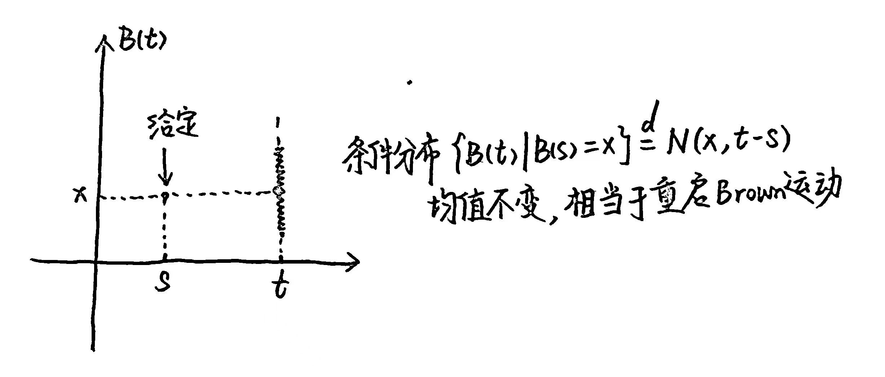
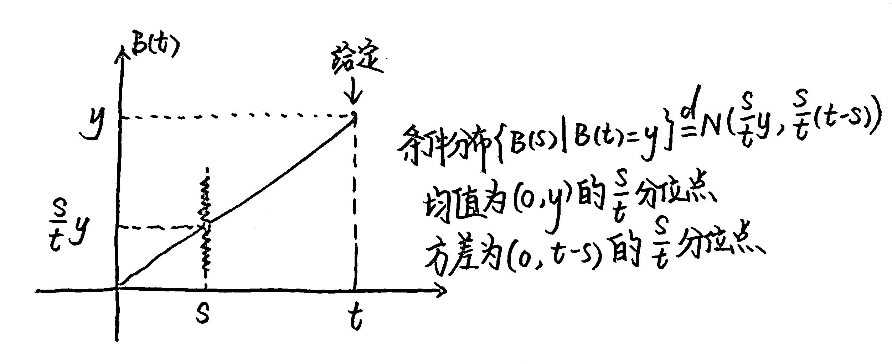
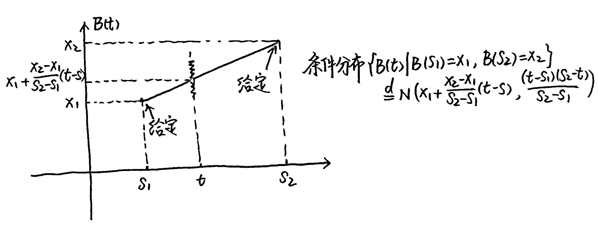
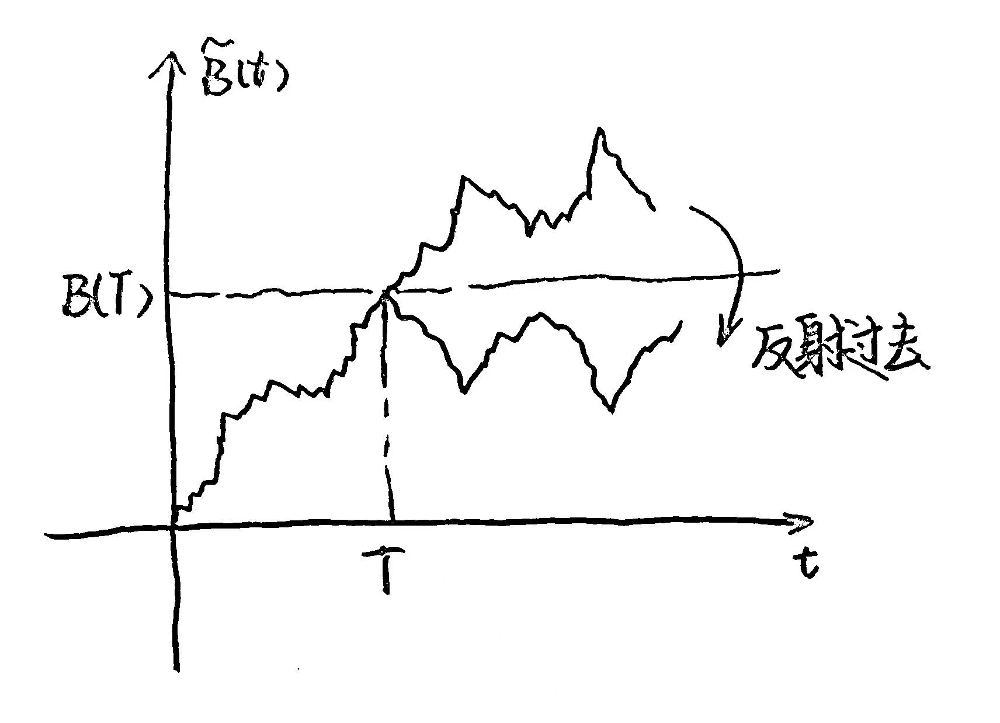
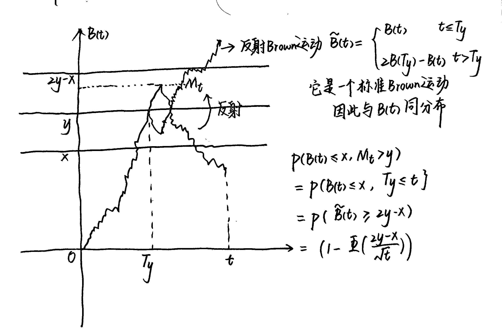
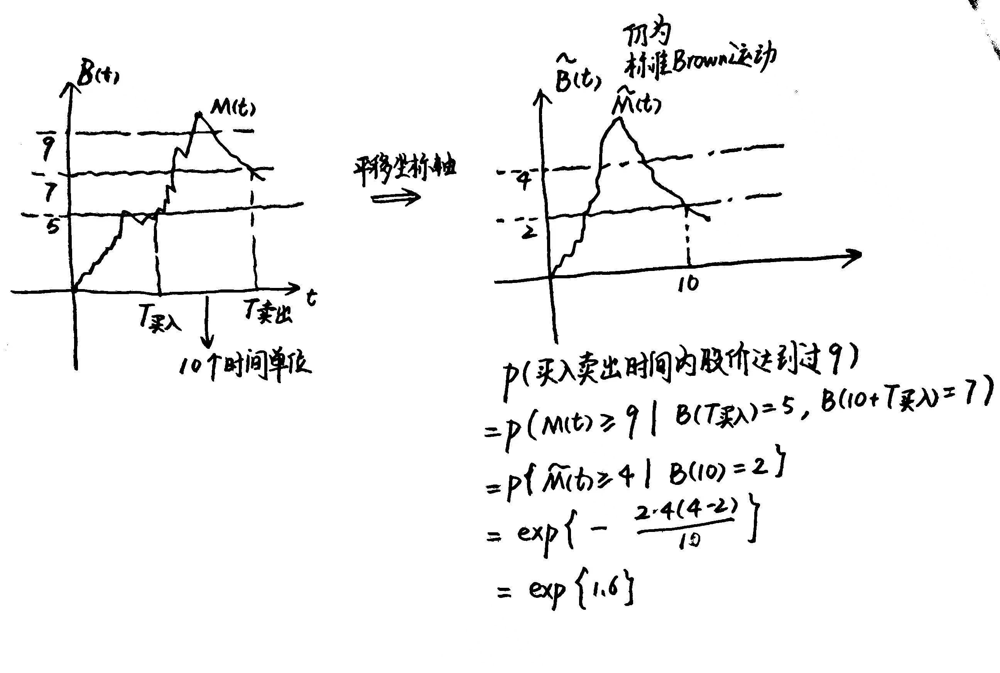

#  FDU 随机过程导论 6. Brown 运动

本文根据王老师课堂笔记整理而成，并参考了以下教材: 

  - 随机过程 (苏中根) 第 $7$ 章
  - Introduction to Probability Models: Applied Stochastic Processes (S. Ross) 
  - 应用随机过程概率论模型导论 (S. Ross) 龚光鲁译 第 $10$ 章

欢迎批评指正!

## 6.1 Brown 运动

### 6.1.1 第一种定义

考虑连续时间的随机过程 $\mathbf B=\{B(t):t\geq 0\}$，其状态空间 $\mathcal E = \R$.   
若 $\{B(t):t\geq 0\}$ 满足: 

- **初始状态: **$B(0)=0$
- **具有独立平稳增量: **  
  - **独立增量: **  
    对于任意 $0<t_1<t_2<\dotsm<t_k$ 都有 $B(t_1),B(t_2)-B(t_1),\dots,B(t_k)-B(t_{k-1})$ 相互独立.
  - **平稳增量: **  
    对于任意 $0<s<t$ 都有 $B(t)-B(s) \overset{\mathrm{d}}= B(t-s)$
- **正态分布: **对于任意 $t>0$ 都有 $B(t)\sim N(0,\sigma^2 t)$ 

则我们称 $\{B(t):t\geq 0\}$ 是参数为 $\sigma^2$ 的 **Brown 运动**.  
特别地，当 $\sigma^2 = 1$ 时，称为**标准 Brown 运动**.    
任意 Brown 运动都可通过 $\widetilde B(t)= \frac{1}{\sigma}B(t)$ 转化为标准 Brown 运动.  
因此除非特别声明，我们默认考虑标准 Brown 运动.

### 6.1.2 基本性质

- **均值函数: **  
  $\mathbb{E}[B(t)] \equiv 0$

- **方差函数: **  
  $\text{Var}(B(t))=t\ \ (t\geq 0)$ 

- **自相关函数: **(假设 $0<s<t$)  
  $\begin{align}
  \text{Cov}(B(s),B(t))
  &= \mathbb{E}[(B(s)-0)(B(t)-0)]\\
  &= \mathbb{E}[B(s)(B(s) + B(t) - B(s))]\\
  &= \mathbb{E}[(B(s))^2] + \mathbb{E}[B(s)]\mathbb{E}[B(t)-B(s)]\\
  &= \text{Var}[B(s)] + (\mathbb{E}[B(s)])^2 + \mathbb{E}[B(s)](\mathbb{E}[B(t)]-\mathbb{E}[B(s)])\\
  &= s + 0^2 + 0\cdot (0-0)\\
  &= s\end{align}$

  表明对于任意 $s,t\geq 0$ 都有 $\text{Cov}(B(s),B(t))= \min\{s,t\}=s\and t$  
  这是 Brown 运动的典型特征. 

- 值得注意的是，对于任意 $s,t\geq 0$ 都有:   
  $\begin{align}
  \text{Var}(B(s)-B(t)) 
  &= \text{Var}(B(s)) - 2\text{Cov}(B(s),B(t)) + \text{Var}(B(t))\\
  &= s - 2\min\{s,t\} + t\\
  &= |t-s|\end{align}$ 

注意到 $\begin{cases}
B(t_1) = B(t_1)\\
B(t_2) = B(t_1) + B(t_2) - B(t_1)\\
\quad\quad\ \dots\\
B(t_n) = B(t_1) + B(t_2) - B(t_1) + \dotsm + B(t_n) - B(t_{n-1})\end{cases}$   
根据 Brown 运动的正态分布性和增量独立性，我们知道:   
$\begin{bmatrix}
B(t_1)\\
B(t_2)-B(t_1)\\
\vdots\\
B(t_n)-B(t_{n-1})\end{bmatrix} \sim N(\begin{bmatrix}
0\\
0\\
\vdots\\
0\end{bmatrix},\begin{bmatrix}
t_1 & & & \\
& t_2-t_1 & & \\
&&\ddots &\\
&&&t_n-t_{n-1}\end{bmatrix})$ (我们记其协方差矩阵为 $D_n$)

基于 $\begin{bmatrix}
B(t_1)\\
B(t_2)\\
\vdots\\
B(t_n)\end{bmatrix} = 
\begin{bmatrix}
1 &  & & \\
1 & 1 & & \\
\vdots & \vdots & \ddots & \\
1 & 1 & \dotsm & 1\end{bmatrix}\begin{bmatrix}
B(t_1)\\
B(t_2)-B(t_1)\\
\vdots\\
B(t_n)-B(t_{n-1})\end{bmatrix}$ (我们记其变换矩阵为 $A$)   
我们容易知道 $(B(t_1),B(t_2),\dots,B(t_n))\sim N(0_n,\Sigma_n)$  
其中**协方差矩阵** $\Sigma_n = (t_i\and t_j)_{n\times n} = (\min\{t_i,t_j\})_{n\times n} = AD_n A^T$  
这表明 Brown 运动是 **Gauss 过程** (正态过程)，即**任意有限维联合分布都是正态分布**.

我们有以下推论: 

- **Brown 运动的任意有限线性组合都服从正态分布: **  
  对于任意 $c_1,\dots,c_n\in \mathbb R$​ 都有 $\underset{k=1}{\overset{n}\sum}c_k B(t_k) \sim N(0,\sigma^2_n)$​   
  其中 $\sigma^2_n = c^T\Sigma_n c =c^TAD_nA^Tc =   \underset{k=1}{\overset{n}\sum}\{(\underset{i=k}{\overset{n}\sum}c_i)^2\cdot (t_k-t_{k-1})\}$​ (我们假设 $t_0 = 0$​)   
  具体来说是这样的:   
  $\begin{align}
  \sigma^2_n 
  &= c^T\Sigma_n c \\
  &= c^TAD_nA^Tc \\
  &= (A^Tc)^TD_n (A^Tc)\\
  &= \begin{bmatrix}
  \underset{i=1}{\overset{n}\sum}c_i\\
  \underset{i=2}{\overset{n}\sum}c_i\\
  \vdots\\
  \underset{i=n}{\overset{n}\sum}c_i\end{bmatrix}^T  \begin{bmatrix}
  t_1 & & & \\
  & t_2-t_1 & & \\
  &&\ddots &\\
  &&&t_n-t_{n-1}\end{bmatrix} \begin{bmatrix}
  \underset{i=1}{\overset{n}\sum}c_i\\
  \underset{i=2}{\overset{n}\sum}c_i\\
  \vdots\\
  \underset{i=n}{\overset{n}\sum}c_i\end{bmatrix}\\
  &= \underset{k=1}{\overset{n}\sum}\{(\underset{i=k}{\overset{n}\sum}c_i)^2\cdot (t_k-t_{k-1})\}\end{align}$ ​
  
- 对于任意 $0<s<t$ 都有联合分布:   
  $\begin{bmatrix}
  B(s)\\
  B(t)-B(s)\end{bmatrix} \sim N(\begin{bmatrix}
  0\\
  0\end{bmatrix},\begin{bmatrix}
  s&\\
  &t-s\end{bmatrix})$  
  因此**条件分布** $\{B(t)|B(s)=x\}\sim N(x,t-s)$   
  条件密度函数为:    
  $\text{P}\{B(t)=y|B(s)=x\} = \frac{1}{\sqrt{2\pi(t-s)}}\exp\{-\frac{(y-x)^2}{2(t-s)}\}\ \ (\forall\ y\in\mathbb R)$   
  
  
  反过来，**条件分布** $\{B(s)|B(t)=y\}\sim N(\frac{s}{t}y,\frac{s}{t}(t-s))$​     
  条件密度函数为:    
  $\text{P}\{B(s)=x|B(t)=y\} = \frac{\sqrt{t}}{\sqrt{2\pi s(t-s)}}\exp\{-\frac{(tx-sy)^2}{2st(t-s)}\}\ \ (\forall\ x\in\mathbb R)$   
  
  
- 对于任意 $0<s_1<t<s_2$ 都有联合分布:   
  $\begin{bmatrix}
  B(s_1)\\
  B(t)-B(s_1)\\
  B(s_2)-B(t)\end{bmatrix} \sim N(\begin{bmatrix}
  0\\
  0\\
  0\end{bmatrix},\begin{bmatrix}
  s_1& &\\
  &t-s_1&\\
  && s_2-t\end{bmatrix})$     
  **条件分布** $\{B(t)|B(s_1)=x_1,B(s_2)=x_2\}\sim N(x_1 + \frac{x_2-x_1}{s_2-s_1}(t-s),\frac{(t-s_1)(s_2-t)}{s_2-s_1})$      
  

***

Brown 运动的样本曲线非常奇特.  
它的每条样本曲线**几乎处处连续**，但**无处可微**.  
即对于任意 $t_0$ 都有 $\underset{t\to t_0}{\lim} \text{P}\{|B(t)-B(t_0)|> \varepsilon\} = 0\ \ (\forall\ \varepsilon>0)$，   
但另一方面 $|B(t)-B(t_0)| \approx |t-t_0|^{\frac12}$，表明曲线 $B(t)$ 不可微.  
我们用离散点列逼近 Brown 运动的样本曲线:   
(就像压缩版的一维对称简单随机游动; 事实上，标准 Brown 运动是一维对称简单随机游走的极限)  

- **几乎处处连续: **  
  $\begin{align}
  \lim_{\Delta t\to 0}\text{P}\{|B(t+\Delta t)-B(t)|>\varepsilon\}
  &= \lim_{\Delta t\to 0} \text{P}\{|N(0,\Delta t)|>\varepsilon\}\\
  &\leq  \lim_{\Delta t\to 0} \frac{\mathbb{E}[(N(0,\Delta t))^2]}{\varepsilon^2}\quad (\text{Chebyshev inequality})\\
  &= \lim_{\Delta t\to 0} \frac{\text{Var}[N(0,\Delta t)]}{\varepsilon^2}\\
  &= \lim_{\Delta t\to 0} \frac{\Delta t}{\varepsilon^2}\\
  &= 0\end{align}$ 

  因此对于任意 $\varepsilon>0$ 都有 $\underset{\Delta t\to 0}{\lim}\text{P}\{|B(t+\Delta t)-B(t)|>\varepsilon\}=0$ 成立，  
  表明 $\mathbf B = \{B(t):t\geq 0\}$ 的样本轨道几乎处处连续.

- **无处可微: **
  直观上，可以将 Brown 运动的样本路径想象为一种极其不规则的曲线.  
  虽然这条曲线是连续的，但在任意小的时间间隔内，它都会经历剧烈的波动，  
  使得无法在任何点上定义其切线，即无法计算其导数.  

  考虑一维 Brown 运动的变化率:   
  $\begin{align}
  \lim_{\Delta t\to 0} \frac{B(t+\Delta t)-B(t)}{\Delta t}
  &= 
  \lim_{\Delta t\to 0} \frac{N(0,\Delta t)}{\Delta t}\\
  &=
  \lim_{\Delta t\to 0} \frac{N(0,1)}{\sqrt{\Delta t}}\end{align}$   
  显然  
  根据 $t$ 的任意性可知 $\mathbf B = \{B(t):t\geq 0\}$ 的样本轨道无处可微.

### 6.1.3 第二种定义

**定理 6.1.1: (Brown 运动的第二种等价定义, 苏中根 定理 7.1)**  
若 $\mathbf X=\{X(t):t\geq 0\}$ 是一个**实数值 Gauss 过程** (即任意有限维联合正态)，  
且 $\begin{cases}
\mathbb{E}[X(t)] = 0\\
\text{Cov}[X(s),X(t)] = s\and t = \min\{s,t\}\end{cases}$   
则 $\mathbf X=\{X(t):t\geq 0\}$ 是**标准 Brown 运动**.

- $\mathbf X=\{X(t):t\geq 0\}$ 为 Gauss 过程当且仅当任意线性组合为正态随机变量，  
  即任意给定 $n$ 个时刻 $t_1,t_2,\dots,t_n$ 和 $c_1,c_2,\dots,c_n$   
  其线性组合 $\underset{i=1}{\overset{n}\sum}c_i X(t_i)$ 为正态随机变量.

> **Brown 运动的第一种等价定义: **  
> 考虑连续时间的随机过程 $\mathbf B=\{B(t):t\geq 0\}$，其状态空间 $\mathcal E = \R$   
> 若 $\{B(t):t\geq 0\}$ 满足: 
>
> - **初始状态: **$B(0)=0$
> - **具有独立平稳增量: **  
>   - **独立增量: **  
>     对于任意 $0<t_1<t_2<\dotsm<t_k$ 都有 $B(t_1),B(t_2)-B(t_1),\dots,B(t_k)-B(t_{k-1})$ 相互独立.
>   - **平稳增量: **  
>     对于任意 $0<s<t$ 都有 $B(t)-B(s) \overset{\mathrm{d}}= B(t-s)$
> - **正态分布: **对于任意 $t>0$ 都有 $B(t)\sim N(0,\sigma^2 t)$ 
>
> 则我们称 $\{B(t):t\geq 0\}$ 是参数为 $\sigma^2$ 的 **Brown 运动**.  
> 特别地，当 $\sigma^2 = 1$ 时，称为**标准 Brown 运动**.    

**定理 6.1.1 的证明: **    
我们逐一验证第一种定义中的各项性质: 

- **正态分布: **  
  对于任意 $t>0$ 都有 $X(t)\sim N(0, t)$ 

- **初始状态: **  
  根据 $\begin{cases}
  \mathbb{E}[X(t)] = 0\\
  \text{Cov}[X(s),X(t)] = s\and t = \min\{s,t\}\end{cases}$ 可知 $\begin{cases}
  \mathbb{E}[X(0)] = 0\\
  \text{Var}[X(0)] = 0\end{cases}$   
  因此 $X(0) \overset{a.s.}= 0$ 

- **增量平稳性: **  
  对于任意给定的 $0<s<t$，增量 $X(t)-X(s)$ 都服从正态分布，  
  且满足 $\begin{cases}
  \mathbb{E}[X(t)-X(s)] = \mathbb{E}[X(t)]-\mathbb{E}[X(s)] = 0-0 = 0\\
  \text{Var}[X(t)-X(s)] = \text{Var}[X(t)] + \text{Var}[X(s)] -2\text{Cov}(X(t),X(s)) \\
  \qquad\qquad\qquad\ \ \ \ \ \ = t+s-2t\and s\\
  \qquad\qquad\qquad\ \ \ \ \ \ = t-s\end{cases}$   
  因此 $X(t)-X(s)\sim N(0,t-s)$，从而与 $X(t-s)$ 同分布.

- **增量独立性: **  
  对于任意给定的 $0<t_1<t_2<\dots<t_n$，  
  我们知道 $X(t_1),X(t_2)-X(t_1),\dots,X(t_n)-X(t_{n-1})$ **联合正态**，  
  并且两两之间协方差为 $0$，表明两两之间**不相关**，等价于两两之间**相互独立**.

  > 对于任意 $0<s<t$ 我们有:   
  > $\begin{align}
  > \text{Cov}(X(s),X(t)-X(s))
  > &= 
  > \text{Cov}(X(s),X(t)) - \text{Var}(X(s))\\
  > &=
  > s\and t - s\\
  > &= s-s\\
  > &=0\end{align}$

综上所述 $\{X(t):t\geq 0\}$ 是**标准 Brown 运动**，命题得证.

****

**定理 6.1.1 的推论: **  
设 $\mathbf B=\{B(t):t\geq 0\}$ 是标准 Brown 运动.  
下列基于 $B(t)$ 得到的三个过程均是标准 Brown 运动: 

- 给定 $t_0\geq 0$，定义 $X(t) = B(t+t_0) - B(t_0)\ \ \ (t\geq 0)$ 
- 给定 $\alpha>0$，定义 $X(t) = \frac{1}{\sqrt{\alpha}}B(\alpha t)\ \ (t\geq 0)$ 
- 定义 $X(t) = \begin{cases}
  tB(t^{-1}) &t>0\\
  0&t=0\end{cases}$

**基于定理 6.1.1 (标准 Brown 运动第二种等价定义) 的证明: **

- 给定 $t_0\geq 0$，定义 $X(t) = B(t+t_0) - B(t_0)\ \ \ (t\geq 0)$   

  - 任意给定 $n$ 个时刻 $t_1,t_2,\dots,t_n$ 和 $c_1,c_2,\dots,c_n$   
    考虑其**线性组合** $\underset{i=1}{\overset{n}\sum}c_i X(t_i)$:   
    $\begin{align}
    \underset{i=1}{\overset{n}\sum}c_i X(t_i)
    &= 
    \sum_{i=1}^n c_i[B(t_i+t_0) - B(t_0)]\\
    &=
    \sum_{i=1}^n c_i B(t_i+t_0) -\sum_{i=1}^n c_i B(t_0)\end{align}$  
    它作为正态随机变量 $\{B(t_i+t_0)\}_{i=1}^n$ 和 $B(t_0)$ 的线性组合，也是**正态随机变量**.  
    表明 $\mathbf X = \{X(t):t\geq 0\}$ 是 **Gauss 过程** (正态过程).
  - 我们计算 $\mathbf X = \{X(t):t\geq 0\}$ 的均值函数和自相关函数:   
    $\begin{cases}
    \mathbb{E}[X(t)] = \mathbb{E}[B(t+t_0)-B(t_0)] \\
    \qquad\quad\ = 0-0\\ 
    \qquad\quad\ =0\quad (\forall\ t\geq 0)\\
    \text{Cov}(X(s),X(t)) = \mathbb{E}[(X(s)-0)(X(t)-0)]\\
    \qquad\qquad\qquad\ \ \ \ = 
    \mathbb{E}[(B(s+t_0)-B(t_0))(B(t+t_0)-B(t_0))]\\
    \qquad\qquad\qquad\ \ \ \ = 
    \text{Cov}(B(s+t_0),B(t+t_0)) - \text{Cov}(B(t_0),B(t+t_0)) - \text{Cov}(B(s+t_0),B(t_0)) + \text{Var}(B(t_0))\\
    \qquad\qquad\qquad\ \ \ \ = 
    (s+t_0)\and (t+t_0) - t_0 \and (t+t_0) - (s+t_0)\and t_0 + t_0\\
    \qquad\qquad\qquad\ \ \ \ = 
    \{s\and t + t_0\} - t_0 - t_0 + t_0\\
    \qquad\qquad\qquad\ \ \ \ = 
    s\and t\quad (\forall\ s,t\geq 0)\end{cases}$

  综上所述，$\mathbf X = \{X(t):t\geq 0\}$ 符合**标准 Brown 运动的第二种等价定义**.

- 给定 $\alpha>0$，定义 $X(t) = \frac{1}{\sqrt{\alpha}}B(\alpha t)\ \ (t\geq 0)$ 

  - 任意给定 $n$ 个时刻 $t_1,t_2,\dots,t_n$ 和 $c_1,c_2,\dots,c_n$   
    考虑其**线性组合** $\underset{i=1}{\overset{n}\sum}c_i X(t_i)
    =\underset{i=1}{\overset{n}\sum} c_i\frac{1}{\sqrt{\alpha}}B(\alpha t_i)$  
    它作为正态随机变量 $\{B(\alpha t_i)\}_{i=1}^n$ 的线性组合，也是**正态随机变量**.  
    表明 $\mathbf X = \{X(t):t\geq 0\}$ 是 **Gauss 过程** (正态过程).
  - 我们计算 $\mathbf X = \{X(t):t\geq 0\}$ 的均值函数和自相关函数:   
    $\begin{cases}
    \mathbb{E}[X(t)] = \mathbb{E}[\frac{1}{\sqrt{\alpha}}B(\alpha t)] \\
    \qquad\quad\ = \frac{1}{\sqrt{\alpha}}\cdot 0\\ 
    \qquad\quad\ =0\quad (\forall\ t\geq 0)\\
    \text{Cov}(X(s),X(t)) = \mathbb{E}[(X(s)-0)(X(t)-0)]\\
    \qquad\qquad\qquad\ \ \ \ = 
    \mathbb{E}[\frac{1}{\sqrt{\alpha}}B(\alpha s)\cdot \frac{1}{\sqrt{\alpha}} B(\alpha t)]\\
    \qquad\qquad\qquad\ \ \ \ =
    \frac{1}{\alpha}\cdot [(\alpha s)\and (\alpha t)]\\
    \qquad\qquad\qquad\ \ \ \ =
    s\and t\quad (\forall\ s,t\geq 0)\end{cases}$

  综上所述，$\mathbf X = \{X(t):t\geq 0\}$ 符合**标准 Brown 运动的第二种等价定义**.

- 定义 $X(t) = \begin{cases}
  tB(t^{-1}) &t>0\\
  0&t=0\end{cases}$  

  - 不失一般性 (包含零时刻的情况非常容易处理，就是下面的情况简单地加上了常数 $0$)，  
    任意给定 $n$ 个**非零**时刻 $t_1,t_2,\dots,t_n\neq 0$ 和 $c_1,c_2,\dots,c_n$   
    考虑其**线性组合** $\underset{i=1}{\overset{n}\sum}c_i X(t_i)
    =\underset{i=1}{\overset{n}\sum} c_i\cdot t_iB(t_i^{-1})$  
    它作为正态随机变量 $\{B(t_i^{-1})\}_{i=1}^n$ 的线性组合，也是**正态随机变量**.  
    表明 $\mathbf X = \{X(t):t\geq 0\}$ 是 **Gauss 过程** (正态过程).

  - 我们计算 $\mathbf X = \{X(t):t\geq 0\}$ 的均值函数和自相关函数:   
    首先考虑非平凡情况 $\begin{cases}
    \mathbb{E}[X(t)] = \mathbb{E}[tB(t^{-1})] \\
    \qquad\quad\ = t\cdot 0\\ 
    \qquad\quad\ =0\quad (\forall\ t> 0)\\
    \text{Cov}(X(s),X(t)) = \mathbb{E}[(X(s)-0)(X(t)-0)]\\
    \qquad\qquad\qquad\ \ \ \ = 
    \mathbb{E}[sB(s^{-1})\cdot tB(t^{-1})]\\
    \qquad\qquad\qquad\ \ \ \ =
    st\cdot [(s^{-1})\and (t^{-1})]\\
    \qquad\qquad\qquad\ \ \ \ =
    t\and s\quad (\forall\ s,t> 0)\end{cases}$   

    对于 $t=0$ 的平凡情况，$\mathbb{E}[X(0)] = 0$ 依然满足通式 $\mathbb{E}[X(t)]=0$.  
    对于 $s,t$ 中至少有一个是 $0$ 的平凡情况 (不妨假设 $s=0$)，  
    $\text{Cov}(X(0),X(t)) = \text{Cov}(0,X(t))=0$ 依然满足通式 $\text{Cov}(X(s),X(t))=s\and t$. 

  综上所述，$\mathbf X = \{X(t):t\geq 0\}$ 符合**标准 Brown 运动的第二种等价定义**.

****

**概率空间** $(\Omega,\mathcal E,\text{P})$ 由**样本空间** $\Omega$、**事件空间** $\mathcal E=\{E:E\subseteq \Omega\}$、**概率函数** $\text{P}:\mathcal E\to[0,1]$ 构成.  
我们定义 $\{E_t\}_{t\geq 0}$ 是概率空间的一个**过滤** (filtration)，  
即一族逐渐增大的 $\sigma$-代数，对于任意 $0\leq s\leq t$ 满足 $E_s\subseteq E_t$   
过滤 $\{E_t\}_{t\geq 0}$ 通常被解释为随时间 $t$ 推移的信息积累.

考虑随机变量 $\tau$   
若对于任意 $t\geq 0$，事件 $\{\tau \leq t\}$ 都属于 $E_t$，  
则我们称 $\tau$ 为 $\{E_t\}_{t\geq 0}$ 的**停时** (stopping time).  
换句话说，在时刻 $t$ 时，根据已有的观察结果能够确定停时 $\tau$ 是否已经发生.

停时是一个随机时刻，其是否发生只取决于当前及之前的观察结果，而与未来无关.  
例如在赌徒问题中，赌徒停止赌博的时刻可以被看作是一个停时，  
因为这一时刻的发生取决于赌徒截至到目前为止的输赢情况，而不依赖于未来的输赢.

- 停时的**反射原理** (reflect principle)  
  若 $T$ 是停时，则 $\tilde B(t) \overset{\Delta}= \begin{cases}
  B(t) & t\leq T\\
  2B(T)-B(t) & t> T\end{cases}$  定义了一个**标准 Brown 运动**  
  

我们刚刚证明了:   
若 $\mathbf B=\{B(t):t\geq 0\}$ 是**标准 Brown 运动**，  
则随机过程 $\mathbf X=\{X(t) = B(t+t_0) - B(t_0):t\geq 0\}$ 也是**标准 Brown 运动**.  
事实上，我们可以推广这个结论:   

- 记 $\mathbf B=\{B(t):t\geq 0\}$ 的**自然过滤** $E_t = \sigma(B(s):0\leq s\leq t)$，  
  它表示由 Brown 运动在时间区间 $[0,t]$ 上所有值生成的最小的 $\sigma$-代数.  
  这一过滤表示在时间 $t$ 时刻我们能够获取的所有信息.

  记 $T$ 是 $\{E_t:t\geq 0\}$ 的**停时**，  
  定义 $X(t)=B(t+T)-B(T)\ \ (t\geq0)$   
  则 $\mathbf X = \{X(t):t\geq 0\}$ 是**标准 Brown 运动**.  
  这称为**强 Markov 性**.

### 6.1.4 相关过程

Brown 运动是最基本的一类过程，基于它可以产生一些有趣的过程.

#### (1) Brown 桥

定义 **Brown 桥** $\mathbf B^0 = \{B^0(t)=B(t)-tB(1):0\leq t\leq 1\}$   
显然它是一个**均值函数**恒为 $0$ 的**正态过程**.   
对于任意 $0\leq s,t\leq 1$，其**自相关函数**为:   
$\begin{align}
\text{Cov}(B^0(s),B^0(t)) 
&= \mathbb{E}[B^0(s)B^0(t)]\\ 
&=\mathbb{E}[(B(s)-sB(1))(B(t)-tB(1))]\\
&=
\text{Cov}(B(s),B(t)) - s\text{Cov}(B(1),B(t)) - t\text{Cov}(B(s),B(1)) + st\text{Var}(B(1))\\
&=
s\and t - s\cdot (1\and t) - t\cdot (s\and 1) + st\cdot 1\\
&=
s\and t - s\cdot t - t\cdot s + st\cdot 1\\
&=
s\and t - st\end{align}$    
(苏中根 7.1 节(五(1)) 将上述结果写为 $s\and t(1-s\or t)$，或许有他的理由吧 (雾))

我们可以写出其任意有限维的联合分布 (其中 $0<t_1<\dots<t_n$):   
$\begin{bmatrix}
B^0(t_1)\\
B^0(t_2)\\
\vdots\\
B^0(t_n)\end{bmatrix} \sim N(\begin{bmatrix}
0\\
0\\
\vdots\\
0\end{bmatrix},\begin{bmatrix}
t_1-t_1^2 & t_1 - t_1t_2&\dotsm & t_1-t_1t_n \\
t_1-t_2t_1& t_2-t_2^2 & \dotsm& t_2-t_2t_n\\
\vdots&\vdots&\ddots &\vdots\\
t_1-t_nt_1& t_2-t_nt_2 & \dotsm &t_n-t_{n}^2\end{bmatrix})$ 

- **回忆起之前的结论: **  
  对于任意 $0<s<t$ 都有**条件分布** $\{B(s)|B(t)=y\}\sim N(\frac{s}{t}y,\frac{s}{t}(t-s))$  

  根据 $\mathbf B^0 = \{B^0(t)=B(t)-tB(1):0\leq t\leq 1\}$ 的定义，  
  我们有 $B^0(t)\overset{\mathrm{d}}= (B(t)|B(1)=0)\sim N(0,\frac{t}{1}(1-t)) = N(0,t-t^2)$    
  这表明 Brown 桥与 $(B(t)|B(1)=0)$ 同分布.

Brown 桥在非参数统计中假设检验问题的研究中起着非常重要的作用.

#### (2) 反射 Brown 运动

定义**反射 Brown 运动** $\mathbf X=\{X(t) = |B(t)|:t\geq 0\}$   
显然 $X(t)$ 仅取非负实数值，**不再是正态过程**.  
给定 $t>0$，$X(t)$ 的概率密度函数为 $p(x;t) = 2\cdot \frac{1}{\sqrt{2\pi t}}e^{-\frac{x^2}{2t}} = \sqrt{\frac{2}{\pi t}}e^{-\frac{x^2}{2t}}$   
(对于 $t=0$ 的平凡情况，$X(0)$ 为 $0$ 处的退化分布，即单点分布)

- 计算 $X(t)$ 的**均值函数**:   
  $\begin{align}
  \mathbb{E}[X(t)]
  &= 
  \int_0^\infty x\cdot \sqrt{\frac{2}{\pi t}}e^{-\frac{x^2}{2t}}dx\\
  &=
  \sqrt{\frac{2}{\pi t}}\cdot t\int_0^\infty \frac{x}{t}\cdot e^{-\frac{x^2}{2t}}dx\\
  &=
  \sqrt{\frac{2t}{\pi}}\int_0^\infty e^{-u}du\quad (u=\frac{x^2}{2t})\\
  &=
  \sqrt{\frac{2t}{\pi}}\cdot \Gamma(1)\\
  &=
  \sqrt{\frac{2t}{\pi}}\quad (\forall\ t>0)\end{align}$

  对于 $t=0$ 的平凡情况，$\mathbb{E}[X(0)]=0$ 依然满足通式 $\mathbb{E}[X(t)]=\sqrt{\frac{2t}{\pi}}$  
  因此我们有 $\mathbb{E}[X(t)]=\sqrt{\frac{2t}{\pi}}\ \ (\forall\ t\geq 0)$ 

- 计算 $X(t)$ 的**二阶矩函数** (此时它不等于方差函数):    
  $\begin{align}
  \mathbb{E}[(X(t))^2]
  &=
  \mathbb{E}[(B(t))^2]\\
  &=
  \text{Var}(B(t))\\
  &=t\quad (\forall\ t\geq 0)\end{align}$  
  
- 计算 $X(t)$ 的**方差函数**:  
  $\begin{align}
  \text{Var}(X(t))
  &= 
  \mathbb{E}[(X(t))^2] - (\mathbb{E}[X(t)])^2\\
  &=
  t - (\sqrt{\frac{2t}{\pi}})^2\\
  &=
  t- \frac{2t}{\pi}\\
  &=
  (1-\frac{2}{\pi})t\quad (\forall\ t\geq 0)\end{align}$

#### (3) 几何 Brown 运动

给定 $\alpha,\beta\in\R$，定义几何 Brown 运动 $\mathbf X=\{X(t)=\exp\{\alpha t + \beta B(t)\}:t\geq 0\}$   
显然 $X(t)$ 仅取非负实数值，**不再是正态过程**.    
它通常用于描述股票价格，因而对金融市场的研究非常重要.

记 $x = \exp\{\alpha t + \beta b\}$ (这是变量 $b$ 向变量 $x$ 的转换)  
记 $b = \frac{1}{\beta}(\log(x)-\alpha t)$ (这是变量 $x$ 向变量 $b$ 的转换)  
给定 $t>0$，$X(t)$ 的概率密度函数为: **(指数正态分布)**  
$\begin{align}
p(x;t) 
&= \{\frac{dx}{db}\}^{-1}\cdot \frac{1}{\sqrt{2\pi t}}\exp\{-\frac{b^2}{2t}\} \\
&= \{\frac{d}{db}\exp\{\alpha t + \beta b\}\}^{-1} \cdot \frac{1}{\sqrt{2\pi t}}\exp\{-\frac{[\frac{1}{\beta}(\log(x)-\alpha t)]^2}{2t}\}\\
&= \{\beta\exp\{\alpha t + \beta b\}\}^{-1} \cdot\frac{1}{\sqrt{2\pi t}}\exp\{-\frac{(\log(x)-\alpha t)^2}{2\beta^2t}\}\\
&=
\{\beta x\}^{-1}\cdot \frac{1}{\sqrt{2\pi t}}\exp\{-\frac{(\log(x)-\alpha t)^2}{2\beta^2t}\}\\
&=
\frac{1}{\beta x\sqrt{2\pi t}}\exp\{-\frac{(\log(x)-\alpha t)^2}{2\beta^2t}\}\quad (x>0)\end{align}$   
(对于 $t=0$ 的平凡情况，$X(0)$ 为 $1$ 处的退化分布，即单点分布)

回忆起 $\xi\sim N(\mu,\sigma^2)$ 的**矩母函数** $\mathbb{E}[e^{t\xi}] = \exp\{\mu t + \frac{\sigma^2}2t^2\}$

- 计算 $X(t)$ 的**均值函数**:   
  $\begin{align}
  \mathbb{E}[X(t)]
  &= 
  \mathbb{E}[\exp\{\alpha t + \beta B(t)\}]\\
  &=
  e^{\alpha t}\cdot\mathbb{E}[e^{\beta  B(t)}]\\
  &= 
  e^{\alpha t}\cdot \exp\{0\cdot \beta + \frac{t}{2}\beta^2\}\\
  &=
  e^{\alpha t + \frac12 \beta^2 t}\quad (\forall\ t\geq 0)\end{align}$
- 计算 $X(t)$ 的**二阶矩函数** (此时它不等于方差函数):   
  $\begin{align}
  \mathbb{E}[(X(t))^2]
  &= \mathbb{E}[\exp\{2\alpha t + 2\beta B(t)\}]\\
  &= e^{2\alpha t}\cdot \mathbb{E}[e^{2\beta B(t)}]\\
  &= e^{2\alpha t}\cdot \exp\{0\cdot 2\beta + \frac{t}{2}\cdot (2\beta)^2\}\\
  &= e^{2\alpha t + 2\beta^2 t}\quad (\forall\ t\geq 0)\end{align}$
- 计算 $X(t)$ 的**方差函数**:  
  $\begin{align}
  \text{Var}(X(t))
  &= 
  \mathbb{E}[(X(t))^2] - (\mathbb{E}[X(t)])^2\\
  &=
  e^{2\alpha t + 2\beta^2 t} - (e^{\alpha t + \frac12\beta^2 t})^2\\
  &=
  e^{2\alpha t + 2\beta^2 t} - e^{2\alpha t + \beta^2 t}\\
  &=
  e^{2\alpha t + \beta^2 t}(e^{\beta^2 t}-1)\quad (\forall\ t\geq 0)\end{align}$

#### (4) 积分过程

对 Brown 运动而言，每条样本曲线都几乎处处连续，  
即存在零测度集 $\Omega_0$ 使得任意 $\omega \in \Omega\backslash \Omega_0$，$B(\omega,t)$ 作为 $t$ 的函数在 $[0,\infty)$ 上连续.  
定义 $X(\omega,t)=\begin{cases}
\int_0^t B(\omega,s)ds & \omega \in \Omega\backslash \Omega_0\\
0 & \omega \in \Omega_0\end{cases}$  
上述定义中的积分是 Riemann 积分，它存在且有限.  
(实际上当 $\omega\in\Omega_0$ 时，其值可以任意选择，并不必须设为 $0$)

定义**积分过程** $\mathbf X = \{X(t) = \int_0^t B(s) ds:t\geq 0\}$   
对于任何固定的 $t\geq 0$，$X(t) = \int_0^t B(s) ds$ 都是由许多小的正态随机变量的和构成的.  
因此我们基本上可以认定它是一个**正态过程**了 (事实也确实如此, 详细证明从略)  

- 计算 $X(t)$ 的**均值函数**:   
  $\begin{align}
  \mathbb{E}[X(t)]
  &=
  \int_0^t \mathbb{E}[B(s)]ds \\
  &=
  \int_0^t 0\cdot ds\\
  &= 0\quad (\forall\ t\geq 0)\end{align}$
- 计算 $X(t)$ 的**自相关函数**:   
  $\begin{align}
  \text{Cov}(X(s),X(t))
  &=
  \mathbb{E}[(X(s)-0)(X(t)-0)]\\
  &=
  \int_0^s \int_0^t \mathbb{E}[B(u)B(v)]dudv\\
  &=
  \int_0^s \int_0^t (u\and v)dudv\\
  &=
  \int_0^s\{\int_0^v u du + \int_v^t vdu\} dv\\
  &=
  \int_0^s \{\frac12v^2 + v(t-v)\}dv\\
  &=
  (\frac{t}{2}v^2 - \frac{1}{6}v^3)|_{0}^s\\
  &=
  \frac{s^2t}{2}-\frac{s^3}{6}\quad (\forall\ 0\leq s\leq t)\end{align}$

## 6.2 最大值分布

### 6.2.1 最大值

考虑**一维标准 Brown 运动** $\mathbf B=\{B(t):t\geq 0\}$   
任意给定 $t>0$，记其在 $[0,t]$ 内的最大值为 $M_t = \underset{0\leq s\leq t}\max B(s)$   
其分布与下面定义的**首次命中时刻**有着密切的关系.

任意给定非零实数 $a$，定义 $T_a = \begin{cases}
\inf\{t\geq 0:B(t)>a\} & \text{if }a>0\\
\inf\{t\geq 0:B(t)<a\} & \text{if }a<0\end{cases}$   
由于 $\mathbf B = \{B(t):t\geq 0\}$ 几乎处处连续，  
故无论 $a<0$ 还是 $a>0$ 都有:   
$\begin{align}
T_a &= \begin{cases}
\inf\{t\geq 0:B(t)>a\} &\text{if } a>0\\
\inf\{t\geq 0:B(t)<a\} &\text{if } a<0
\end{cases}\\
&=\begin{cases}
\inf\{t\geq 0:B(t)\geq a\} &\text{if } a>0\\
\inf\{t\geq 0:B(t)\leq a\} &\text{if } a<0
\end{cases}\\
&\overset{a.s.}=
\inf\{t\geq 0:B(t)=a\}\end{align}$

- **注意: **    
  记 $\mathbf B=\{B(t):t\geq 0\}$ 的**自然过滤** $E_t = \sigma(B(s):0\leq s\leq t)$，  
  它表示由 Brown 运动在时间区间 $[0,t]$ 上所有值生成的最小的 $\sigma$-代数.  
  这一过滤表示在时间 $t$ 时刻我们能够获取的所有信息.  
  我们定义 $E_{t+} = \bigcap_{\varepsilon>0} E_{t+\varepsilon}$ (它包含的信息多于 $E_t$)

  **首次命中时刻** $T_a$ 关于 $\{E_t\}_{t\geq 0}$ 不是**停时** (停时的定义参见 6.1.3 节)，  
  实际上它关于 $\{E_{t+}\}_{t\geq 0}$ 才是停时，  
  即对于任意 $t\geq 0$ 都有 $\{T_a\leq t\}$ 属于 $E_{t+}$ 

  不管怎样，我们有**强 Markov 性**:  
  $\mathbf X=\{X(t) = B(t+T_a)-B(T_a):t\geq 0\}$ 是标准 Brown 运动，  
  并且它与 $\{B(t):0\leq t\leq T_a\}$ 相互独立.

***

**定理 6.2.1: (苏中根 定理 7.2)**  
考虑**一维标准 Brown 运动** $\mathbf B = \{B(t):t\geq 0\}$  
给定 $t>0$ 都有 $M_t = \underset{0\leq s\leq t}\max B(s) \overset{\mathrm{d}}= |B(t)|$   

**定理 6.2.1 的证明: **  
由于 $B(0)=0$，故对于任意 $t\geq 0$ 都有 $M_t\geq 0$   
任意给定 $x>0$ 都有 $\text{P}\{B(t)=x\}=0$ 成立  
因此我们有:   
$\text{P}\{M_t>x\}
= \text{P}\{M_t > x,B(t)>x\} + \text{P}\{M_t>x,B(t)<x\}$   

显然第一项 $\text{P}\{M_t > x,B(t)>x\} = \text{P}\{B(t)>x\}$   
我们考虑第二项 $\text{P}\{M_t>x,B(t)<x\}$  
我们希望证明 $\text{P}\{M_t>x,B(t)<x\} = \text{P}\{M_t>x,B(t)>x\} =\text{P}\{B(t)=x\}$ 

- 若事件 $\{M_t>x,B(t)<x\}$ 成立，  
  则一定存在某个时刻 $s\in (0,t)$ 使得 $B(s)=x$ 成立，  
  表明 $x$ 的首次命中时刻 $T_x<t$ 并且 $B(T_x)=x$ 

- 将坐标原点平移至 $(T_x,x)$ 处:   
  

  考虑过程 $X(t)=B(t+T_x) - B(T_x)\ \ (t\geq 0)$   
  根据我们之前的讨论，$\mathbf X= \{X(t):t\geq 0\}$ 是一个**标准 Brown 运动**，  
  并且它独立于截断的过程 $\{B(t):0\leq t\leq T_x\}$ 

- 因此在给定 $\{T_x<t\}$ 的条件下，  
  事件 $\{B(t)-x>0\}$ 和 $\{B(t)-x<0\}$ 具有相同概率 (根据一维 Brown 运动的对称性)  
  因此我们有 $\text{P}\{M_t>x,B(t)<x\} = \text{P}\{M_t>x,B(t)>x\} =\text{P}\{B(t)>x\}$ 

综上所述，对于任意 $x>0$ 我们都有:   
$\begin{align}
\text{P}\{M_t>x\}
&=
\text{P}\{M_t > x,B(t)>x\} + \text{P}\{M_t>x,B(t)<x\}\\
&=
2\text{P}\{B(t)>x\}\\
&=
\text{P}\{|B(t)|>x\}\end{align}$

表明 $M_t = \underset{0\leq s\leq t}\max B(s) \overset{\mathrm{d}}= |B(t)|$，定理得证.

****

定义**反射 Brown 运动** $\mathbf X=\{X(t) = |B(t)|:t\geq 0\}$   
回顾 6.1.4 (2) 的内容，我们知道:   
给定 $t>0$，$X(t)$ 的概率密度函数为 $\text{P}\{X(t)=x\} = 2\cdot \frac{1}{\sqrt{2\pi t}}e^{-\frac{x^2}{2t}} = \sqrt{\frac{2}{\pi t}}e^{-\frac{x^2}{2t}}$   
(对于 $t=0$ 的平凡情况，$X(0)$ 为 $0$ 处的退化分布，即单点分布)

根据**定理 6.2.1** 我们知道 $M_t\overset{\mathrm{d}}= |B(t)|$  
因此任意给定 $t>0$，最大值 $M_t$ 的概率密度函数为 $(x\geq 0)$:   
$\text{P}\{M_t = x\} = \text{P}\{|B(t)|=x\} = \sqrt{\frac{2}{\pi t}}e^{-\frac{x^2}{2t}}$ 

另外，我们有:   
$\begin{align}
\text{P}\{M_t\geq x\} &= \text{P}\{|B(t)|\geq x\}\\
&=2\text{P}\{B(t)\geq x\}\\
&=2\text{P}\{N(0,t)\geq x\}\\ 
&= 2(1-\Phi(\frac{x}{\sqrt{t}}))
\end{align}$ 

首中时 $T_x\ (x> 0)$ 满足 $\text{P}\{T_x\leq t\} = \text{P}\{M_t\geq x\} = 2(1-\Phi(\frac{x}{\sqrt{t}}))$ 

***

对称地，我们考虑最小值 $M^-_t = \underset{0\leq s\leq t}{\min} B(s) = -\underset{0\leq s\leq t}{\max}(-B(s))$   
$-B(t)$ 实际上也是标准 Brown 运动.

因此任意给定 $t>0$，最大值 $M_t$ 的概率密度函数为 $(x\leq 0)$:   
$\begin{align}
\text{P}\{M^-_t\leq x\} 
&=
\text{P}\{-\underset{0\leq s\leq t}{\max}(-B(s))\leq x\}\\
&=
\text{P}\{-\underset{0\leq s\leq t}{\max}B(s)\leq x\}\\
&=
\text{P}\{-M_t\leq x\}\\
&=
\text{P}\{M_t\geq -x\}\\
&=
\text{P}\{|B(t)|\geq -x\}\\
&=
2\text{P}\{B(t)\geq -x\}\\
&=
2\text{P}\{N(0,t)\geq -x\}\\
&=
2(1-\Phi(\frac{-x}{\sqrt{t}}))\\
&=
2\Phi(\frac{x}{\sqrt{t}})\end{align}$

首中时 $T_x\ (x< 0)$ 满足 $\text{P}\{T_x\leq t\} = \text{P}\{M_t^{-}\leq x\} = 2\Phi(\frac{x}{\sqrt{t}})= 2(1-\Phi(\frac{-x}{\sqrt{t}}))$  

****

综上所述，首中时 $T_x\ (x\neq 0)$ 我们有 $\text{P}\{T_x\leq t\} = 2(1-\Phi(\frac{|x|}{\sqrt{t}}))$

 ### 6.2.2 首次命中时刻

**定理 6.2.2: (苏中根 定理 7.3)**  
$a\neq 0$ 的首次命中时刻 $T_a$ 的概率密度函数为 $f_a(t) = \frac{|a|}{\sqrt{2\pi} t^{3/2}}\exp\{-\frac{a^2}{2t}\}\ \ (t>0)$  

**定理 6.2.2 的证明: **  
不失一般性，假设 $a>0$ ($a<0$ 的情况与之对称)  
对于任意 $t>0$ 都有:   
$\begin{align}
\text{P}\{T_a\leq t\}
&= \text{P}\{M_t\geq a\}\\
&= \text{P}\{|B(t)|\geq a\}\\
&=2\text{P}\{N(0,t)\geq a\}\\
&= 2\int_a^\infty \frac{1}{\sqrt{2\pi t}}e^{-\frac{x^2}{2t}} dx\\
&= \sqrt{\frac{2}{\pi}} \int_a^\infty t^{-\frac12}e^{-\frac{x^2}{2t}} dx\end{align}$ 

上式对 $t$ 求导可得:   
$\begin{align}
f_a(t)
&=
\text{P}\{T_a = t\}\\
&=
\sqrt{\frac{2}{\pi}}
\int_a^\infty (-\frac12 t^{-\frac32} + \frac{x^2}{2}t^{-\frac52}) \exp\{-\frac{x^2}{2t}\}dx\\
&=
-\frac{1}{\sqrt{2\pi}} t^{-\frac32} \int_a^\infty \exp\{-\frac{x^2}{2t}\}dx + \frac{1}{\sqrt{2\pi}}t^{-\frac52}
\int_a^\infty x^2 \exp\{-\frac{x^2}{2t}\}dx\end{align}$

使用**分部积分法**:   
$\begin{align}
\int_a^\infty \exp\{-\frac{x^2}{2t}\}dx
&=
(x\cdot \exp\{-\frac{x^2}{2t}\})|_{a}^\infty - 
\int_a^\infty x\cdot(-\frac{x}{t}\exp\{-\frac{x^2}{2t}\})dx\\
&=
-a\exp\{-\frac{a^2}{2t}\} + t^{-1}\int_a^\infty x^2\exp\{-\frac{x^2}{2t}\}dx\end{align}$

代入原式可得:   
$\begin{align}
f_a(t)
&=
\text{P}\{T_a = t\}\\
&=-\frac{1}{\sqrt{2\pi}} t^{-\frac32} \int_a^\infty \exp\{-\frac{x^2}{2t}\}dx + \frac{1}{\sqrt{2\pi}}t^{-\frac52}
\int_a^\infty x^2 \exp\{-\frac{x^2}{2t}\}dx\\
&=
-\frac{1}{\sqrt{2\pi}} t^{-\frac32} \cdot (-a\exp\{-\frac{a^2}{2t}\} + t^{-1}\int_a^\infty x^2\exp\{-\frac{x^2}{2t}\}dx) + \frac{1}{\sqrt{2\pi}}t^{-\frac52}
\int_a^\infty x^2 \exp\{-\frac{x^2}{2t}\}dx\\
&=
-\frac{a}{\sqrt{2\pi}t^{3/2}}\exp\{-\frac{a^2}{2t}\} - frac{1}{\sqrt{2\pi}}t^{-\frac52}
\int_a^\infty x^2 \exp\{-\frac{x^2}{2t}\}dx + frac{1}{\sqrt{2\pi}}t^{-\frac52}
\int_a^\infty x^2 \exp\{-\frac{x^2}{2t}\}dx\\
&=
-\frac{a}{\sqrt{2\pi}t^{3/2}}\exp\{-\frac{a^2}{2t}\}\end{align}$ 

定理得证.

****

**定理 6.2.3: (苏中根 推论 7.2)**  
对于任意 $a\in\R$ 都有 $\begin{cases}
\text{P}\{T_a<\infty\}=1\\
\mathbb{E}[T_a] = \infty\end{cases}$

- **上述定理揭示了一个有趣的现象: **  
  一方面，无论 $|a|$ 离 $0$ 有多远，从 $0$ 点出发的 Brown 运动总会在有限时间内到达 $a$.  
  另一方面，无论 $|a|$ 离 $0$ 有多近，从 $0$ 点出发的 Brown 运动到达 $a$ 所需的平均时间为 $\infty$

**定理 6.2.3 的证明: **  

- 不失一般性，设 $a>0$ ($a<0$ 的情况与之对称)     
  对于任意 $t>0$ 都有:   
  $\begin{align}
  \text{P}\{T_a\leq t\}
  &= \text{P}\{M_t\geq a\}\\
  &= \text{P}\{|B(t)|\geq a\}\\
  &= \int_a^\infty \sqrt{\frac{2}{\pi t}}e^{-\frac{x^2}{2t}} dx\\
  &= \sqrt{\frac{2}{\pi}} \int_a^\infty t^{-\frac12}e^{-\frac{x^2}{2t}} dx\end{align}$ (即 $2\text{P}\{B(t)\geq a\} = 2(1-\Phi(\frac{\sqrt{a}}{t}))$)

  因此我们有:   
  $\begin{align}
  \text{P}\{T_a<\infty\}
  &= 
  \lim_{t\to\infty}
  \text{P}\{T_a\leq t\}\\
  &=
  \lim_{t\to\infty}
  \sqrt{\frac{2}{\pi}}
  \int_a^\infty t^{-\frac12}e^{-\frac{x^2}{2t}} dx\\
  &=
  \lim_{t\to\infty}
  \sqrt{\frac{2}{\pi}}
  \int_{a\cdot t^{-\frac12}}^\infty e^{-\frac{u^2}{2}} du\quad (u=x\cdot t^{-\frac12})\\
  &=
  \sqrt{\frac{2}{\pi}}
  \int_{0}^\infty e^{-\frac{u^2}{2}} du\\
  &=
  \sqrt{\frac{2}{\pi}}\cdot \sqrt{\frac{\pi}{2}}\\
  &= 1\end{align}$ 

  其中我们使用了 Gauss 积分的结论 $\int_{-\infty}^\infty e^{-\frac{u^2}{2}} du= \sqrt{2\pi}$   
  因此 $\int_{0}^\infty e^{-\frac{u^2}{2}} du = \frac12 \int_{-\infty}^\infty e^{-\frac{u^2}{2}} du = \frac12\cdot \sqrt{2\pi} = \sqrt{\frac{\pi}{2}}$  
  这就证明了第一个命题 $\text{P}\{T_a<\infty\}=1$ 

- 至于第二个命题，根据**定理 6.2.2** 可知:   
  $a\neq 0$ 的首次命中时刻 $T_a$ 的概率密度函数为 $f_a(t) = \frac{|a|}{\sqrt{2\pi} t^{3/2}}\exp\{-\frac{a^2}{2t}\}\ \ (t>0)$   
  因此我们有:   
  $\begin{align}
  \mathbb{E}[T_a] 
  &= \int_0^\infty t\cdot f_a(t)dt\\
  &= \int_0^\infty t\cdot\frac{|a|}{\sqrt{2\pi} t^{3/2}}\exp\{-\frac{a^2}{2t}\}dt\\
  &= \frac{|a|}{\sqrt{2\pi}} \int_0^\infty 
  t^{-\frac12}\exp\{-\frac{a^2}{2t}\}dt\end{align}$

  下面我们说明积分 $\int_0^\infty 
  t^{-\frac12}\exp\{-\frac{a^2}{2t}\}dt$ 发散:   
  $\begin{align}\int_0^\infty 
  t^{-\frac12}\exp\{-\frac{a^2}{2t}\}dt
  &>
  \int_1^\infty 
  t^{-\frac12}\exp\{-\frac{a^2}{2t}\}dt\\
  &> \exp\{-\frac{a^2}{2}\}\int_1^\infty t^{-\frac12}dt\\
  &= \exp\{-\frac{a^2}{2}\}\cdot (2t^{\frac12})|_{1}^\infty\\
  &= \infty\end{align}$

  这就证明了第二个命题 $\mathbb{E}[T_a] = \infty$ 

***

**定理 6.2.4: (苏中根 定理 7.4)**  
对于任意 $a<0<b$ 都有 $\begin{cases}
\text{P}\{T_a<T_b\} = \frac{|b|}{|a| + |b|}\\
\text{P}\{T_a>T_b\} = \frac{|a|}{|a| + |b|}\end{cases}$ (二者都是连续随机变量，相等概率为 $0$)

- 证明需要**鞅** (Martingale) 的结论，因此省略.  
  最终通过求解方程组 $\begin{cases}
  a\text{P}\{T_a<T_b\} + b\text{P}\{T_a>T_b\} = 0\\
  \text{P}\{T_a<T_b\} + \text{P}\{T_a>T_b\} = 1\end{cases}$ 得到命题.

### 6.2.3 联合分布

考虑 $(B_t,M_t)$ 的**联合分布** $(x\leq y)$:   
$\begin{align}
\text{P}\{B_t\leq x,M_t\leq y\}
&=
\text{P}\{B_t\leq x\} - \text{P}\{B_t\leq x,M_t>y\}\\
&=
\text{P}\{B_t\leq x\} - \text{P}\{B_t\leq x,T_y\leq t\}\\
&=
\text{P}\{B_t\leq x\} - \text{P}\{\tilde B_t\geq 2y-x\}\\
&=
\text{P}\{\frac{B_t}{\sqrt{t}}\leq \frac{x}{\sqrt{t}}\} - \text{P}\{\frac{\tilde B_t}{\sqrt{t}}\geq \frac{2y-x}{\sqrt{t}}\}\\
&=
\Phi(\frac{x}{\sqrt{t}}) - (1-\Phi(\frac{2y-x}{\sqrt{t}}))\\
&=
\Phi(\frac{x}{\sqrt{t}}) - 1 + \Phi(\frac{2y-x}{\sqrt{t}})\end{align}$ 

其中 $T_y$ 为 $y$ 的**首中时** (它是一个停时)，  
而 $\tilde B(t) \overset{\Delta}= \begin{cases}
B(t) & t\leq T_y\\
2B(T_y)-B(t) & t> T_y\end{cases}$ 是一个标准 Brown 运动.  

下面我们计算 $(B_t,M_t)$ 的**联合概率密度函数** $(x\leq y)$: 
$$
\begin{align}
f_{(B_t,M_t)}(x,y) 
&= \frac{\partial^2}{\partial x\partial y}\text{P}\{B_t\leq x,\ M_t\leq y\}\\
&= \frac{\partial^2}{\partial x\partial y}\{\Phi(\frac{x}{\sqrt{t}}) - 1 + \Phi(\frac{2y-x}{\sqrt{t}})\}\\
&=
\frac{\partial }{\partial y}\{\frac{1}{\sqrt{t}}\phi(\frac{x}{\sqrt{t}}) - \frac{1}{\sqrt{t}}\phi(\frac{2y-x}{\sqrt{t}})\}\\
&=
-\frac{2}{t}\phi'(\frac{2y-x}{\sqrt{t}})\\
&=
-\frac{2}{t}(-\frac{2y-x}{\sqrt{t}})\phi(\frac{2y-x}{\sqrt{t}})\quad (\phi'(z)=-z\phi(z))\\
&=
\frac{2(2y - x)}{t \sqrt{t}} \phi( \frac{2y - x}{\sqrt{t}} )\end{align}
$$
其中 $\Phi(z) = \int_{-\infty}^z \phi(t)dt = \int_{-\infty}^z \frac{1}{\sqrt{2\pi}}e^{-\frac{t^2}{2}}dt$ 是 $N(0,1)$ 的累计分布函数.  
而 $\phi(z)=\frac{1}{\sqrt{2\pi}}e^{-\frac{z^2}{2}}$ 是 $N(0,1)$ 的概率密度函数.  
注意到其导函数 $\phi'(z)=-z\cdot \frac{1}{\sqrt{2\pi}}e^{-\frac{z^2}{2}} = -z\phi(z)$ 

下面我们计算 $(B_t|M_t)$ 的**条件概率密度函数** $(x\leq y)$:   
根据**定理 6.2.1** 我们有:    
$$
\begin{align}
f_{M_t}(y) &= \text{P}\{M_t=y\}\\
&= \text{P}\{|B(t)|=y\}\\
&= 2\text{P}\{B(t)=y\} \\
&= 2\frac{d}{dy}\text{P}\{B(t)\leq y\}\\
&= 2\frac{d}{dy}\Phi(\frac{y}{\sqrt{t}})\\
&=\frac{1}{\sqrt{t}}\phi(\frac{y}{\sqrt{t}})
\end{align}
$$

因此我们有: 
$$
\begin{align}
f_{B_t|M_t}(x|y) 
&=
\frac{f_{B_t,M_t}(x,y)}{f_{M_t}(y)}\\
&=
\frac{\frac{2(2y - x)}{t \sqrt{t}} \phi( \frac{2y - x}{\sqrt{t}} )}{2\frac{1}{\sqrt{t}}\phi(\frac{y}{\sqrt{t}})}\\
&=
\frac{(2y - x)}{t} \exp\{-\frac{(2y-x)^2}{2t}+ \frac{y^2}{2t}\}\\
&=
\frac{(2y - x)}{t} \exp\{-\frac{(y-x)(3y-x)}{2t}\}\\\end{align}
$$
下面我们计算 $(M_t|B_t)$ 的**条件概率密度函数** $(x\leq y)$:    
根据 $B(t)\sim N(0,t)$ 我们有:   
$$
\begin{align}
f_{B_t}(x) &= \text{P}\{B_t=x\}\\
&= \frac{d}{dx}\text{P}\{B(t)\leq x\}\\
&= \frac{d}{dx}\Phi(\frac{x}{\sqrt{t}})\\
&=\frac{1}{\sqrt{t}}\phi(\frac{x}{\sqrt{t}})
\end{align}
$$
 因此我们有: 
$$
\begin{align}
f_{M_t|B_t}(y|x) 
&=
\frac{f_{B_t,M_t}(x,y)}{f_{B_t}(x)}\\
&=
\frac{\frac{2(2y - x)}{t \sqrt{t}} \phi( \frac{2y - x}{\sqrt{t}} )}{\frac{1}{\sqrt{t}}\phi(\frac{x}{\sqrt{t}})}\\
&=
\frac{2(2y - x)}{t} \exp\{-\frac{(2y-x)^2}{2t}+ \frac{x^2}{2t}\}\\
&=
\frac{2(2y - x)}{t} \exp\{-\frac{2y(2y-x)}{t}\}\end{align}
$$
我们最终可以得到: 
$$
\text{P}\{M_t\geq y|B_t = x\} = \exp\{-\frac{2y(y-x)}{t}\}
$$

***

**(王勤文补充示例)**  
设股市价格随时间变化的过程是一个标准 Brown 运动.  
假设某时刻某人以 $5$ 元每股的价格买入某支股票，  
并在 $10$ 个时间单位后以 $7$ 元每股的价格卖出这支股票.  
试求在此人买入卖出的 $10$ 个时间单位中，股票价格达到过 $9$ 元每股的概率.

(图中答案写错了，是 $\exp\{-1.6\}$)

### 6.2.4 推广: 漂移 Brown 运动

我们称 $\{X(t):t\geq 0\}$ 为具有参数 $(\mu,\sigma^2)$ 的漂移 Brown 运动，如果它满足: 

- $X(0) = 0$
- 具有独立平稳增量
- $X(t) \sim N(\mu t, t \sigma^2)$ 

它可以表示为 $X(t)=\sigma B(t) + \mu t$

考虑 $X(t_1)$ 和 $X(t_2)$ 的**联合分布**:   
$$
\begin{bmatrix}
X(t_1)\\
X(t_2)\end{bmatrix} = 
\sigma \begin{bmatrix}
B(t_1)\\
B(t_2)\end{bmatrix} + \begin{bmatrix}
\mu t_1\\
\mu t_2\end{bmatrix} \overset{\mathrm{d}}= N(\begin{bmatrix}
\mu t_1\\
\mu t_2\end{bmatrix}, \sigma^2\begin{bmatrix}
t_1 & t_1\and t_2\\
t_2\and t_1 & t_2 \end{bmatrix}) 
$$

****

对于任意 $0<t_1<t_2$，考虑**条件分布** $(X(t_2)|X(t_1)=x_1)$: 
$$
(X(t_2)|X(t_1)=x_1) \overset{\mathrm{d}}= N(x_1 + \mu(t_2-t_1), \sigma^2(t_2-t_1))
$$
对于任意 $0<t_1<t_2$，考虑**条件分布** $(X(t_1)|X(t_2)=x_2)$:   
$$
(X(t_1)|X(t_2)=x_2) \overset{\mathrm{d}}= N(\frac{t_1}{t_2}x_2 , \frac{t_1}{t_2}\sigma^2(t_2-t_1))
$$
我们发现它与 $\mu$ 无关，即完全可以等同于 $\mu=0$ 的情况.  
也就是说，对于任意 $\mu\in \R$ 都有 $(X(t_1)|X(t_2)=x_2) \overset{\mathrm{d}}= (\sigma B(t_1)|\sigma B(t_2)=x_2)$ 成立.

***

考虑**最大值** $M(t) = \underset{0\leq s\leq t}{\max} X(s) = \underset{0\leq s\leq t}{\max}\{\sigma B(s) + \mu s\}$ 的分布:     
其中: 

- 第二步转化是基于 $x\geq y$ 时条件概率 $\text{P}\{M_t\geq y|X_t=x\} = 1$ 的事实进行分类讨论的.
- 第三步转化用到了 $(X(t_1)|X(t_2)=x_2) \overset{\mathrm{d}}= (\sigma B(t_1)|\sigma B(t_2)=x_2)$ 的结论
- 第四步转化用到了 $\text{P}\{\underset{0\leq s\leq t}{\max} B_s \geq y|B_t = x\} = \exp\{-\frac{2y(y-x)}{t}\}$ 的结论

$$
\begin{align}
&\text{P}\{M(t) \geq y\}\\
&=
\int_{-\infty}^\infty \text{P}\{M_t \geq y|X_t = x\} \cdot \text{P}\{X_t = x\}dx\\
&=
\int_{-\infty}^y \text{P}\{M_t \geq y|X_t = x\} \cdot \text{P}\{X_t = x\}dx + \int_{y}^{\infty} 1\cdot \text{P}\{X_t = x\}dx\\
&=
\int_{-\infty}^y \text{P}\{\max_{0\leq s\leq t}\{\sigma B(s)\} \geq y|\sigma B(t)=x\}\cdot \text{P}\{N(\mu t, \sigma^2 t) = x\}dx + \int_{y}^{\infty} \text{P}\{N(\mu t, \sigma^2 t)=x\}dx\\
&=
\int_{-\infty}^y \exp\{-\frac{2y(y-x)}{\sigma^2 t}\}\cdot \frac{1}{\sqrt{2\pi\sigma^2 t}}\exp\{-\frac{(x-\mu t)^2}{2\sigma^2 t}\} dx + \text{P}\{N(\mu t,\sigma^2 t)> y\} \\
&=
\exp\{\frac{2\mu y}{\sigma^2}\}
\int_{-\infty}^y \text{P}\{N(\mu t +2 y,\sigma^2 t) = x\}dx +(1- \Phi(\frac{y-\mu t}{\sigma\sqrt{t}}))\\
&=
\exp\{\frac{2\mu y}{\sigma^2}\}
\text{P}\{N(\mu t +2 y,\sigma^2 t) \leq y\} + 1 - \Phi(\frac{y-\mu t}{\sigma\sqrt{t}})\\
&=
\exp\{\frac{2\mu y}{\sigma^2}\}\Phi(\frac{-y-\mu t}{\sigma\sqrt{t}}) + 1 -\Phi(\frac{y-\mu t}{\sigma\sqrt{t}})\end{align}
$$

因此 $\text{P}\{T_y \leq t\} = \text{P}\{M_t\geq y\} = \exp\{\frac{2\mu y}{\sigma^2}\}\Phi(\frac{-y-\mu t}{\sigma\sqrt{t}}) + 1 -\Phi(\frac{y-\mu t}{\sigma\sqrt{t}})$   
对 $t$ 求导可得:   
$\text{P}\{T_y = t\} = \frac{y}{\sqrt{2\pi\sigma^2 t}}\exp\{-\frac{(y-\mu t)^2}{2\sigma^2 t}\}$

并且可以计算出 $\begin{cases}
\mathbb{E}[T_y] = \frac{y}{\mu}\\
\text{Var}[T_y] = \frac{y\sigma^2}{\mu^3}\end{cases}$ 均为有限值，  
这与 $\mu=0$ 的情况 (即 $\sigma B(t)$，例如标准 Brown 运动) 不同.

****

对于 $y>x$，我们有条件分布:  
$\begin{align}
\text{P}\{M(t)\geq y|X(t) =x\} 
&= 
\text{P}\{\max_{0\leq s\leq t}\{\sigma B(s)\} \geq y|\sigma B(t)=x\}\\
&= 
\exp\{-\frac{2y(y-x)}{\sigma^2 t}\}\quad (y\geq 0)\end{align}$  

### 6.2.4 推广: 漂移 Brown 运动

本节推广 Brown 运动**最大值**和**首中时**的相关结论.

设漂移系数 $b\in\R$，定义**漂移 Brown 运动** $X(t)=B(t)-bt\ \ (t\geq 0)$   
显然 $\mathbf X = \{X(t):t\geq 0\}$ 仍是**连续正态过程**，但不再是 Brown 运动.

任意给定 $t>0$，记其在 $[0,t]$ 内的最大值为 $\underset{0\leq s\leq t}\max X(s)$   
其分布与下面定义的**首次命中时刻**有着密切的关系.

任意给定 $a\in\R$，定义:    
$\begin{align}
T_{a,b} &= \begin{cases}
\inf\{t\geq 0:X(t)\geq a\} &\text{if } a>0\\
\inf\{t\geq 0:X(t)\leq a\} &\text{if } a<0
\end{cases}\\
&=\begin{cases}
\inf\{t\geq 0:B(t) \geq a + bt\} &\text{if } a>0\\
\inf\{t\geq 0:B(t)\leq a + bt\} &\text{if } a<0
\end{cases}\end{align}$     
它实际上是 Brown 运动首次命中直线 $a+bt$ 的时刻.

显然，对于任意 $a>0$，我们都有 $\text{P}\{\underset{0\leq s\leq t}\max X(s)\geq a\}=
\text{P}\{T_{a,b}\leq t\}$ 成立.

****

**引理 6.2.5: (测度变换定理, 苏中根 定理 7.6 前文)**  
设原概率空间为 $(\Omega,\mathcal E,\text{P})$   
给定常数 $\begin{cases}
b\in \R\\
t_0>0\end{cases}$    
对于任意 $E\in \mathcal E$，定义 $\hat {\text{P}}(E)= \mathbb{E}[\exp\{bB(t_0)-\frac12 b^2t_0\}\cdot I_E]$ (原概率 $\text{P}(E)=\mathbb{E}[I_E]$)   

> 回忆起 $\xi\sim N(\mu,\sigma^2)$ 的**矩母函数** $\mathbb{E}[e^{t\xi}] = \exp\{\mu t + \frac{\sigma^2}2t^2\}$

注意到:   
$\begin{align}
\mathbb{E}[\exp\{bB(t_0)-\frac12 b^2t_0\}]
&=
e^{-\frac12 b^2t_0}\cdot \mathbb{E}[e^{b B(t_0)}]\\
&=
e^{-\frac12 b^2t_0}\cdot \mathbb{E}[e^{b N(0,t_0)}]\\
&=
e^{-\frac12 b^2t_0}\cdot \exp\{0\cdot b + \frac{t_0}{2}\cdot b^2\}\\
&=
e^0\\
&=
1\end{align}$ 

因此 $\hat {\text{P}}:\mathcal E\mapsto [0,1]$ 是概率，这样就得到了新概率空间 $(\Omega,\mathcal E,\hat {\text{P}})$ 

**定理 6.2.6: (苏中根 定理 7.6)**  
在新定义的概率空间 $(\Omega,\mathcal E,\hat {\text{P}})$ 上，  
正态过程 $\mathbf X = \{X(t)=B(t)-bt:t\geq 0\}$ 是标准 Brown 运动.

- **证明: **    
  记概率 $\hat {\text{P}}$ 下的期望为 $\hat {\mathbb{E}}[\cdot]$   
  对于任意 $u\in\R$ 我们都有:   
  $\begin{align}
  \hat{\mathbb{E}}[e^{uX(t)}]
  &=
  \hat{\mathbb{E}}[e^{u(B(t)-bt)}]\\
  &=
  \int_{-\infty}^\infty e^{u(x-bt)}\cdot \hat{\text{P}}\{B(t)=x\}dx\\
  &=
  \int_{-\infty}^\infty e^{u(x-bt)}\cdot \mathbb{E}[\exp\{bB(t_0)-\frac12 b^2t_0\}\cdot I_{B(t)=x}]dx\\ 
  &=
  e^{-ubt - \frac{1}{2}b^2t_0} \int_{-\infty}^\infty
  e^{ux}\cdot \mathbb{E}[\exp\{bB(t_0)\}\cdot I_{B(t)=x}]dx\\
  &=
  e^{-ubt - \frac{1}{2}b^2t_0} \mathbb{E}[e^{uB(t)+bB(t_0)}]\\
  &=
  e^{\frac12 u^2t}\end{align}$ 

  (最后两步我不知道是如何转化的)

****

**定理 6.2.5: (定理 6.2.2 的推广, 苏中根 定理 7.5)**  
给定 $\begin{cases}
a\neq 0\in \R\\
b\in\R
\end{cases}$，首中时 $T_{a,b}$ 的概率密度函数为:   
$f_{a,b}(t) = \frac{|a|}{\sqrt{2\pi}t^{3/2}}\exp\{-\frac{(a+bt)^2}{2t}\}\ \ (t>0)$ 

- 特别地，当 $b=0$ 时即为**定理 6.2.2** 的结论:   
  首次命中时刻 $T_{a,0}$ 的概率密度函数为 $f_{a,0}(t) = \frac{|a|}{\sqrt{2\pi} t^{3/2}}\exp\{-\frac{a^2}{2t}\}\ \ (t>0)$  

**定理 6.2.5 的证明: (有些超纲, 参见课本)**  

## 6.3 随机积分

回顾 **Riemann 积分** $\int_a^b f(x)dx$，它的定义方式如下: 

- **划分:** 将区间 $[a,b]$ 划分为 $a=x_0 < x_1<\dots<x_n = b$，记这个划分为 $\pi$  
  记区间长度的上确界 $\Delta = \underset{i=1,\dots,n}{\sup} \{x_i-x_{i-1}\}$  
- **取点:** 在每个小区间 $[x_{i-1},x_i]$ 中各选取一点 $\xi_i$ 
- **求和:** $S_n = \underset{i=1}{\overset{n}\sum} f(\xi_i)(x_i-x_{i-1})$ 
- **取极限:**   
  若存在 $s$，使得对于区间 $[a,b]$ 的任意划分 $\pi$ 和任意取点 $\xi_i\in [x_{i-1},x_{i}]$，  
  都有 $\underset{\begin{subarray}{}
  n\to \infty\\
  \|\Delta\|\to 0\end{subarray}}{\lim} S_n = s$   
  则我们定义 $\int_a^b f(x)dx=s$ 

若 $f$ 连续 (或分段连续)，则 Riemann 积分 $\int_a^b f(x)dx$ 存在.

***

将 **Riemann 积分 **$\int_a^b f(x)dx$ 推广至 **Riemann-Stieltjes 积分** $\int_a^b f(x)dG(x)$:  

- **划分:** 将区间 $[a,b]$ 划分为 $a=x_0 < x_1<\dots< x_n = b$，记这个划分为 $\pi$  
  记区间长度的上确界 $\Delta = \underset{i=1,\dots,n}{\sup} \{x_i-x_{i-1}\}$  
- **取点:** 在每个小区间 $[x_{i-1},x_i]$ 中各选取一点 $\xi_i$ 
- **求和:** $S_n = \underset{i=1}{\overset{n}\sum} f(\xi_i)[G(x_i)-G(x_{i-1})]$ 
- **取极限:**   
  若存在 $s$，使得对于区间 $[a,b]$ 的任意划分 $\pi$ 和任意取点 $\xi_i\in [t_{i-1},t_{i}]$，  
  都有 $\underset{\begin{subarray}{}
  n\to \infty\\
  \|\Delta\|\to 0\end{subarray}}{\lim} S_n = s$   
  则我们定义 $\int_a^b f(x)dG(x)=s$ 

若 $f$ 连续且 $G(x)$ **有界变差** (bounded variance)，  
即对于任意划分 $\pi$，求和 $\underset{i=1}{\overset{n}\sum} |G(x_i)-G(x_{i-1})|<\infty$ 都有界，  
则 **Riemann-Stieltjes 积分** $\int_a^b f(x)dG(x)$ 存在.

****

考虑积分 $\int_0^t f(s) dB(s)$，我们可以证明 $B(s)$ 不是有界变差函数，因而这个积分不一定存在.

- 我们只需找到一个划分 $\pi$ 使得求和 $S_n=\underset{i=1}{\overset{n}\sum} |B(x_i)-B(x_{i-1})|=\infty$ 即可，   
  等价于证明 $\text{P}\{S_n = \infty\}=1$ 成立，  
  等价于证明对于任意 $M>0$ 都有 $\text{P}\{S_n>M\}=1$ 成立，  
  等价于证明对于任意 $M>0$ 都有 $\text{P}\{S_n\leq M\}=0$ 成立，  
  只要证明 $\begin{cases}
  \mathbb{E}[S_n]\to \infty \\
  \text{Var}[S_n] = O(1)\end{cases}$ 即可.

  ****

  这是因为如果 $\begin{cases}
  \mathbb{E}[S_n]\to \infty \\
  \text{Var}[S_n] = O(1)\end{cases}$ 成立，  
  则对于任意 $M>0$，当 $n$ 足够大时都有 $\mathbb{E}[S_n]>2M$，即有 $M< \frac12 \mathbb{E}[S_n]$ 成立.  
  于是我们有:   
  $$
  \begin{align}
  \text{P}\{S_n\leq M\}
  &=
  \text{P}\{S_n-\mathbb{E}[S_n]\leq M- \mathbb{E}[S_n]\}\\
  &=
  \text{P}\{S_n-\mathbb{E}[S_n]< -\frac12 \mathbb{E}[S_n]\}\\
  &\leq 
  \text{P}\{|S_n-\mathbb{E}[S_n]|> \frac12 \mathbb{E}[S_n]\}\\ 
  & \leq 
  \frac{\mathbb{E}[|S_n - \mathbb{E}[S_n]|^2]}{(\frac12\mathbb{E}[S_n])^2}\\
  &= 
  \frac{4\text{Var}[S_n]}{(\mathbb{E}[S_n])^2}\to 0\ \ (n\to\infty)\end{align}
  $$
  表明对于任意 $M>0$ 都有 $\text{P}\{S_n\leq M\}=0$ 成立.

  > **命题1.7 (Chebyshev 不等式)**  
  > 若 $X$ 是具有均值 $\mu$ 和 $k\geq 2$ 阶中心距 $\mathbb{E}[|X-\mu|^k]<\infty$ 的随机变量，  
  > 则对于任意 $a>0$ 都有 $\text{P}\{|X-\mu|\geq a\}\leq \frac{\mathbb{E}[|X-\mu|^k]}{a^k}$ 成立.  

- 考虑将 $[0,t]$ 划分为 $2^n$ 个等份，则我们有:   
  $\begin{align} \mathbb{E}[S_n] &= \sum_{i=1}^{2^n} \mathbb{E} \left[\left| B \left( \frac{i}{2^n} \right) - B \left( \frac{i-1}{2^n} \right) \right|\right] \\ &= 2^n \mathbb{E} \left[\left| N \left( 0, \frac{1}{2^n} \right) \right|\right] \quad (\mathbb{E}[|N(0,\sigma^2)|]=\sigma\sqrt{\frac{2}{\pi}})\\ 
  &= 2^n \sqrt{\frac{2}{\pi 2^n}}\\
  &= \sqrt{\frac{2^{n+1}}{\pi}} \to \infty \end{align}$ 

  $\begin{align}
  \text{Var}(S_n) &= \text{Var} \left( \sum_{i=1}^{2^n} \left| B \left( \frac{i}{2^n} \right) - B \left( \frac{i-1}{2^n} \right) \right| \right) \\ &= \sum_{i=1}^{2^n} \text{Var} \left( \left| B \left( \frac{i}{2^n} \right) - B \left( \frac{i-1}{2^n} \right) \right| \right) \\ &\leq \sum_{i=1}^{2^n} \mathbb{E} \left( \left| B \left( \frac{i}{2^n} \right) - B \left( \frac{i-1}{2^n} \right) \right|^2 \right) \\ &=
  \sum_{i=1}^{2^n} \mathbb{E} \left( \left| N\left(0,\frac{1}{2^n}\right)\right|^2 \right) \quad (\mathbb{E}[|N(0,\sigma^2)|^2] = \sigma^2 \mathbb{E}[\chi^2(1)]=\sigma^2) \\
  &= 2^n\cdot \frac{1}{2^n}\\
  &= 1\end{align}$

这样我们就证明了 $\begin{cases}
\mathbb{E}[S_n]\to \infty \\
\text{Var}[S_n] = O(1)\end{cases}$   
进而可以推出 $\text{P}\{S_n = \infty\}=1$，说明 $B(s)$ 不是有界变差函数.

***

考虑积分 $\int_0^t f(s) dB(s)$，其中 $f(s)$​ 是给定的连续函数，不具有随机性.  

- **划分:** 将区间 $[a,b]$ 划分为 $t=s_0 < s_1<\dots< s_n = t$，记这个划分为 $\pi$  
  记区间长度的上确界 $\Delta = \underset{i=1,\dots,n}{\sup} \{s_i-s_{i-1}\}$  

- **取点:** 在每个小区间 $[s_{i-1},s_i]$ 中各选取一点 $\xi_i$ 

- **求和:**   
  $$
  \begin{align}
  S_n 
  &= \underset{i=1}{\overset{n}\sum} f(\xi_i)[B(s_i)-B(s_{i-1})]\\
  &= f(\xi_n)B(s_n) - \sum_{i=2}^{n}B(s_{i-1}) (f(\xi_i)-f(\xi_{i-1})) -f(\xi_1)B(s_0)\\
  &=
  f(\xi_n) B(t) - \sum_{i=1}^{n-1}B(s_{i}) (f(\xi_{i+1})-f(\xi_{i})) - f(\xi_1)B(0)\\
  &=
  f(\xi_n) B(t) - \sum_{i=1}^{n-1}B(s_{i}) (f(\xi_{i+1})-f(\xi_{i}))\quad (B(0)=0)\end{align}
  $$

- **取极限: **  
  $\begin{align}
  \lim_{n\to\infty}
  S_n &=
  \lim_{n\to\infty}\{f(\xi_n) B(t) - \sum_{i=1}^{n-1}B(s_{i}) (f(\xi_{i+1})-f(\xi_{i}))\}\\
  &=
  f(t)B(t) - \int_0^t B(s)df(s)\end{align}$

我们假设 $f(s)$ 是有界变差函数 (同时注意到 $B(s)$ 几乎处处连续)，  
此时我们可以定义 $\int_0^t f(s) dB(s)=f(t)B(t) - \int_0^t B(s)df(s)$ 

****

考虑积分 $\int_0^t f(s) dB(s)$，其中 $f(s)$ 是一个随机过程.  
取 $f(s)=B(s)$，即考虑 $\int_0^t B(s) dB(s)$ 

- **划分:** 将区间 $[a,b]$ 划分为 $t=s_0 < s_1<\dots< s_n = t$，记这个划分为 $\pi$  
  设区间长度的上确界 $\Delta = \underset{i=1,\dots,n}{\sup} \{s_i-s_{i-1}\}\to 0\ \ (n\to \infty)$   
- **取点:** **Ito 积分**规定取点 $\xi_i$ 总是取区间 $[s_{i-1},s_{i}]$ 的左端点 $s_{i-1}$ 
- **求和:** $S_n = \underset{i=1}{\overset{n}\sum} B(s_i)(B(s_i)-B(s_{i-1}))$ 
- **取极限:**   
  若存在 $s$ 使得 $\mathbb{E}[|S_n-s|^2]\to 0$ 成立，则我们定义 $\int_0^t B(s) dB(s)=s$ 

我们希望证明这个 $s = \frac{(B(t))^2 - t}{2}$，  
即等价于证明 $\mathbb{E}[|S_n-s|^2] = \mathbb{E}[|S_n-\frac{B_t^2 - t}{2}|^2]\to 0$ 成立.  
即等价于证明 $\mathbb{E}[|2S_n - B_t^2 +t|]\to 0$ 成立.

注意到: 

- $B(t)$ 可拆分为:   
  $$
  \begin{align}
  B_t^2 &= 
  B_t^2 - B_{s_{n-1}}^2 + B_{s_{n-1}}^2 - \dots -B_{s_1}^2 + B_{s_1}^2 - B_{s_0}^2 + B_{s_0^2}\\
  &=
  \sum_{i=1}^n (B_{s_i}^2 - B_{s_{i-1}}^2) + B_0^2\\
  &=
  \sum_{i=1}^n (B_{s_i} +B_{s_{i-1}})(B_{s_i} -B_{s_{i-1}})\end{align}
  $$

- $t$ 可拆分为:   
  $$
  \begin{align}
  t &= t -s_{n-1} + s_{n-1} - s_{n-2} + s_{n-2} + \dots - s_1 + s_1 -s_0 + s_0\\
  &= \sum_{i=1}^n (s_i-s_{i-1}) + s_0\\
  &= \sum_{i=1}^n (s_i-s_{i-1}) \end{align}
  $$

因此我们有:   
$$
\begin{align}
2S_n -B_t^2 + t &=2\underset{i=1}{\overset{n}\sum} B_{s_i}(B_{s_i}-B_{s_{i-1}})
 - \sum_{i=1}^n (B_{s_i} +B_{s_{i-1}})(B_{s_i} -B_{s_{i-1}}) + 
\sum_{i=1}^n (s_i-s_{i-1})\\
&=
-\sum_{i=1}^n [(B_{s_i}-B_{s-i})^2 - (s_i-s_{i-1})]\\
&=
-\sum_{i=1}^n [X_i^2 - (s_i-s_{i-1})]\quad (X_i = B_{s_i} - B_{s_{i-1}}\overset{\mathrm{d}}= N(0,s_i-s_{i-1}))\\
&=
-\sum_{i=1}^n [X_i^2 - \mathbb{E}[X_i^2]]\end{align}
$$
于是我们有:   
$$
\begin{align}
\mathbb{E}[|2S_n -B_t^2 + t|^2]
&=
\mathbb{E}\{[-\sum_{i=1}^n [X_i^2 - \mathbb{E}[X_i^2]]]^2\}\\
&= \sum_{i=1}^n \mathbb{E}\{[X_i^2 - \mathbb{E}[X_i^2]]^2\}\\
&= \sum_{i=1}^n \text{Var}[X_i^2]\\
&\leq \sum_{i=1}^n \mathbb{E}[(X_i^2)^2]\\
&= \sum_{i=1}^n (s_{i}-s_{i-1})^2\\
&\leq \max_{i=1,\dots,n}\{s_i-s_{i-1}\}\sum_{i=1}^n (s_i-s_{i-1})\\
&= \max_{i=1,\dots,n}\{s_i-s_{i-1}\}(s_n-s_0)\\
&= \max_{i=1,\dots,n}\{s_i-s_{i-1}\} \cdot t \to 0\ \ (n\to\infty)\end{align}
$$
这样就得证了 $\mathbb{E}[|S_n-s|^2] = \mathbb{E}[|S_n-\frac{B_t^2 - t}{2}|^2]\to 0$   
我们定义 $\int_0^t B(s)dB(s) = s = \frac{B_t^2 - t}{2}$ 

**The End**
