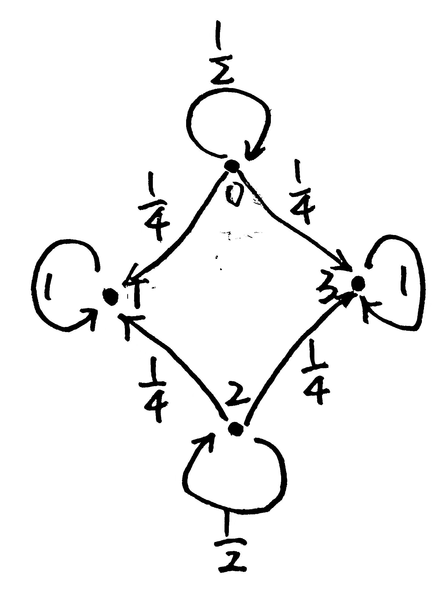

## 随机过程导论 Assignment 02

**姓名：** 雍崔扬  
**学号：** 21307140051  
**Due Date:** May 24, 2024

### Problem 1

Suppose $\{X_n:n=0,1,\dots\}$ is a two state Markov chain   
whose transition probability matrix is given by $P = \begin{bmatrix}
\alpha & 1-\alpha\\
1-\beta & \beta\end{bmatrix}$   
Let $Z_n = (X_{n-1},X_n)$ be a vector with four states $(0,0),(0,1),(1,0),(1,1)$  
Is $Z_n$ a Markov chain?  
If yes, determine its transition probability matrix.

**Solution:**    
我们记 $\{X_n:n=0,1,\dots\}$ 的两个状态为 $0,1$

- **$Z_n$ 是一个 Markov 链.**  
  我们记 $z_n = (x_{n-1},x_n)\ \ (n=1,2,\dots)$   
  其中 $x_{n-1},x_{n}$ 只能在 $\{0,1\}$ 中取值.  
  则对于任意 $n=1,2,\dots$ 我们都有：  
  $\begin{align}
  \text{P}\{Z_{n+1}=z_{n+1}|Z_n=z_n,\dots,Z_1=z_1\}
  &=
  \text{P}\{X_{n+1}=x_{n+1}|X_n=x_n,\dots,X_1=x_1,X_0=x_0\}\\
  &=
  \text{P}\{X_{n+1}=x_{n+1}|X_n=x_n,X_{n-1}=x_{n-1}\}\\
  &=
  \text{P}\{Z_{n+1}=z_{n+1}|Z_n=z_n\}\end{align}$  
  说明 $\{Z_n=(X_{n-1},X_n):n=1,2,\dots\}$ 具有 Markov 性，它是一个 Markov 链.

- **下面确定 $\{Z_n=(X_{n-1},X_n):n=1,2,\dots\}$ 的状态转移矩阵：**    
  $\begin{align}
  \text{P}\{Z_{n+1}=z_{n+1}|Z_n=z_n\}
  &=
  \text{P}\{X_{n+1}=x_{n+1}|X_n=x_n,X_{n-1}=x_{n-1}\}\\
  &=
  \text{P}\{X_{n+1}=x_{n+1}|X_n=x_n\}\\
  &=
  P_{x_n,x_{n+1}}\end{align}$

  因此 $\begin{cases}
  \text{P}\{Z_{n+1}=(0,0)|Z_n = (0,0)\} = \text{P}\{Z_{n+1}=(0,0)|Z_n = (1,0)\}=P_{0,0} = \alpha\\
  \text{P}\{Z_{n+1}=(0,1)|Z_n = (0,0)\} = \text{P}\{Z_{n+1}=(0,1)|Z_n = (1,0)\}=P_{0,1} = 1-\alpha\\
  \text{P}\{Z_{n+1}=(1,0)|Z_n = (0,1)\} = \text{P}\{Z_{n+1}=(1,0)|Z_n = (1,1)\}=P_{1,0} = 1-\beta\\
  \text{P}\{Z_{n+1}=(1,1)|Z_n = (0,1)\} = \text{P}\{Z_{n+1}=(1,1)|Z_n = (1,1)\}=P_{1,1} = \beta\end{cases}$   

  于是 $\{Z_n=(X_{n-1},X_n):n=1,2,\dots\}$ 的状态转移矩阵为：  
  $Q=\begin{bmatrix}
  \alpha & 1-\alpha &&\\
  &&1-\beta&\beta\\
  \alpha & 1-\alpha&&\\
  &&1-\beta&\beta\end{bmatrix}$ 

### Problem 2

A Markov chain with state space $\{0,1,2,3\}$ has transition probability matrix    
$P = \begin{bmatrix}
\frac12 & \frac14 & & \frac14\\
&1&&\\
&\frac14&\frac12&\frac14\\
&&&1\end{bmatrix}$

(a) Draw the transition diagram.

- **Solution:**  
  

(b) Suppose the initial probability distribution is uniform, i.e. $\text{P}\{X_0=i\} =\frac14\ \ (i=0,1,2,3)$  
Determine $\text{P}\{X_n=1\}$ and $\text{P}\{X_n=2\}$

- **Solution:**  
  $P^{(2)} = P^2 = \begin{bmatrix}
  \frac14 & \frac38 & & \frac38\\
  &1&&\\
  &\frac38&\frac14&\frac38\\
  &&&1\end{bmatrix}$   

  $P^{(3)} = P^3 = \begin{bmatrix}
  \frac18 & \frac7{16} & & \frac7{16}\\
  &1&&\\
  &\frac7{16}&\frac18&\frac7{16}\\
  &&&1\end{bmatrix}$   

  归纳可知 $P^{(n)} = P^n = \begin{bmatrix}
  \frac{1}{2^n} & \frac{2^n-1}{2^{n+1}} & & \frac{2^n-1}{2^{n+1}}\\
  &1&&\\
  &\frac{2^n-1}{2^{n+1}}&\frac1{2^n}&\frac{2^n-1}{2^{n+1}}\\
  &&&1\end{bmatrix}$   
  (根据 (a) 中的图像可知这个归纳结果是合理的)

  $\begin{align}
  \text{P}\{X_n=1\} 
  &= \sum_{i=1}^4\text{P}\{X_n=1|X_0=i\}\text{P}\{X_0=i\}\\
  &= \sum_{i=1}^4 P^{(n)}_{i,1}\cdot \frac14\\
  &= \frac14(\frac{2^n-1}{2^{n+1}} + 1 + \frac{2^n-1}{2^{n+1}} + 0)\\
  &= \frac12 - \frac{1}{2^{n+2}} \end{align}$

  $\begin{align}
  \text{P}\{X_n=2\} 
  &= \sum_{i=1}^4\text{P}\{X_n=2|X_0=i\}\text{P}\{X_0=i\}\\
  &= \sum_{i=1}^4 P^{(n)}_{i,2}\cdot \frac14\\
  &= \frac14(0 + 0 + \frac{1}{2^{n}} + 0)\\
  &= \frac{1}{2^{n+2}} \end{align}$

### Problem 3

Consider independent tosses of a fair die.  
Let $X_n$ be the maximum of numbers appearing in the first $n$ throws, $n=1,2,\dots$    

**(a)** Verify that $\{X_n:n\geq 1\}$ is a Markov chain.    
Describe the state space and the transition probability matrix of this homogeneous Markov Chain.

**Solution:**  
记第 $n$ 次投掷骰子的结果为 $\xi_n$，其分布为 $\text{P}\{\xi_n = i\}=\frac16\ \ (i=1,2,3,4,5,6)$   
则对于任意 $n\in\mathbb N$ 都有 $X_{n+1} = \max \{\xi_1,\dots,\xi_n,\xi_{n+1}\} = \max\{X_{n},\xi_{n+1}\}$   
显然有 $\text{P}\{X_{n+1}=x_{n+1}|X_n=x_n,\dots,X_1=x_1\} = \text{P}\{X_{n+1}=x_{n+1}|X_n=x_n\}$ 成立  
说明 $\{X_n:n\geq 1\}$ 具有 Markov 性，因此是一个 Markov 链.

其状态空间为 $\{1,2,3,4,5,6\}$，考虑转移概率:

- 当前 $n$ 次投掷处于最大值 $m$ 时，下一步仍停在 $m$ 的概率为:
  $$
  \text{P}_{m,m} = \text{P}\{\xi_{n+1}\leq m\} = \frac{m}{6}
  $$

- 当前 $n$ 次投掷处于最大值 $m$ 时，下一步变为 $j>m$ 的概率为:
  $$
  \text{P}_{m,m} = \text{P}\{\xi_{n+1} = j\} = \frac{1}{6}
  $$

因此状态转移矩阵为:
$$
P=\begin{bmatrix}
\frac16&\frac16&\frac16&\frac16&\frac16&\frac16\\
&\frac26&\frac16&\frac16&\frac16&\frac16\\
&&\frac36&\frac16&\frac16&\frac16\\
&&&\frac46&\frac16&\frac16\\
&&&&\frac56&\frac16\\
&&&&&1\\\end{bmatrix}
$$
**(b)** Find out the classes of all states.   
Is there any state closed (a state is closed if, once entered, it cannot be left)?   
Is there any state recurrent/transient?   
Is there any state positive recurrent?   
Write your reasons briefly.

**Solution:**  

- 状态 $6$ 是闭的 (即吸收态)，因为 $\text{P}\{X_{n+1}=6|X_n=6\}=P_{6,6} = 1$ 
- 状态 $6$ 是常返态 (具体来说，是正常返态)，因为它是一个吸收态.  
  状态 $1,2,3,4,5$ 是瞬时态，  
  因为它们都可到达状态 $6$，可是一旦过程进入状态 $6$，它就无法返回到其他状态.

### Problem 4

Assume a Markov chain $X_n$ has state $0,1,2,\dots$   
and transition probabilities: $\begin{cases}
P_{i,0} = \frac{1}{2i^\alpha}\\
P_{i,i+1} = \begin{cases}
1&i=0\\
1-\frac{1}{2i^\alpha} & i= 1,2,\dots\end{cases}\end{cases}$ where $\alpha>0$ is a constant.  
(a) Is this Markov chain irreducible?

- **Solution:**    

  - 一方面，任意状态 $i\geq 1$ 都能到达状态 $0$；  
  - 另一方面，从状态 $0$ 可以到达状态 $1$，从状态 $1$ 可以到达状态 $2$，以此类推…  
    所以从状态 $0$ 可以到达任意状态 $i\geq 1$   

  因此 $\{X_n:n\in\N\}$ 的所有状态之间都是互通的，因而是不可约的.

(b) Assume $X_0=0$ and let $T$ be the first return time to $0$  
(i.e. the first time after the initial time the chain is back at the origin)  
Determine for which $\alpha>0$ is $1-f_0 = \text{P}\{\text{no return}\} = \underset{n\to\infty}{\lim} \text{P}\{T>n\} = 0$ 

- **Solution:**    
  $\begin{align}
  1-f_0 &= \text{P}\{\text{no return}\}\\
  &= \underset{n\to\infty}{\lim} \text{P}\{T>n\} \\
  &= \lim_{n\to\infty} \text{P}\{X_n=n|X_0=0\}\\
  &= \lim_{n\to\infty} (\prod_{i=0}^{n-1}P_{i,i+1})\\
  &= \lim_{n\to\infty} \{1\cdot \prod_{i=1}^{n-1}(1-\frac{1}{2i^\alpha})\}\end{align}$​   

  要寻找 $\alpha>0$ 使得 $1-f_0 =\underset{n\to\infty}{\lim} \underset{i=1}{\overset{n-1}\prod}(1-\frac{1}{2i^\alpha}) = 0$，  
  等价于寻找 $\alpha>0$ 使得 $\underset{n\to\infty}{\lim} \log\{\underset{i=1}{\overset{n-1}\prod}(1-\frac{1}{2i^\alpha})\} = \underset{n\to\infty}{\lim} 
  \underset{i=1}{\overset{n-1}\sum} \log(1-\frac{1}{2i^\alpha})= -\infty$   
  根据 $\log(1-x)\approx -x\ \ (x\to 0)$ 可知，  
  等价于寻找 $\alpha>0$ 使得 $\underset{n\to\infty}{\lim} 
  \underset{i=1}{\overset{n-1}\sum} (-\frac{1}{2i^\alpha})= -\infty$  
  即等价于寻找 $\alpha>0$ 使得 $\underset{n\to\infty}{\lim} 
  \underset{i=1}{\overset{n-1}\sum} \frac{1}{i^\alpha} = \underset{i=1}{\overset{\infty}\sum} \frac{1}{i^\alpha}= \infty$   

  我们知道级数 $\underset{i=1}{\overset{\infty}\sum} \frac{1}{i^\alpha}$ 在 $0<\alpha\leq 1$ 时发散，在 $\alpha>1$ 时收敛，  
  因此当且仅当 $0<\alpha\leq 1$ 时我们有 $1-f_0 = \text{P}\{\text{no return}\} = \underset{n\to\infty}{\lim} \text{P}\{T>n\} = 0$ 成立.

(c) Depending on $\alpha$, determine which classes are recurrent.

- **Solution:**  
  根据 (b) 的结论，我们知道：  
  状态 $0$ 在 $0<\alpha\leq 1$ 时是常返态，在 $\alpha>1$ 时是瞬时态.  

  由于所有状态都是互通的，因此它们要么都是常返态，要么都是瞬时态.  
  因此所有状态在 $0<\alpha\leq 1$ 时是常返态，在 $\alpha>1$ 时是瞬时态. 

### Problem 5

Let $\{X_n:n=0,1,2,\dots\}$ be a simple random walk.  
Each step it has equal probability to walk to the left and to the right.   
The first passage time $\tau(m) = \min\{n\geq 0:X_n=m\}$ is the first time the process ever walks to position $m$ 

Suppose that $X_0=0$   
Denote $G_m(z)=\text{E}[z^{\tau(m)}]$ as the probability generating function of $\tau(m)$  
Without loss of generality, assume that $m>0$

(a) Show that $G_m(z) = (G_1(z))^m$  

- **Lemma：(Catalan 数)**  
  将 $n$ 个 $-1$ 和 $n+1$ 个 $+1$ 排成一列，  
  使得任意前 $i$ 项和 $(i=1,2,\dots,2n)$ 都小于 $1$ 的排列总数是 **Catalan 数** $C_n = \frac{1}{n+1}\binom{2n}{n}$   
  其递推公式为 $C_n = \underset{i=0}{\overset{n-1}\sum} C_i\cdot C_{n-1-i}$ 

- **Solution:**  
  记 $\tau(i,j) = \min\{n\geq 0:X_n=j,\ \text{given that }X_0 = i\}$     
  记 $s(i,j) = \underset{k=i}{\overset{j-1}\sum} \tau (k,k+1)$ 

  - **首先证明 $\tau(i,i+1) \overset{d}= \tau(j,j+1)\ \ (\forall\ i,j\in \Z)$：**  
    任意给定 $i\in \Z$，我们注意到 $\tau(i,i+1)$ 只可能取奇数值 $2n+1\ (n\geq 0)$  
    对于任意 $n\geq 0$ 都有：  
    $\begin{align}
    \text{P}\{\tau(i,i+1)= 2n+1\} 
    &= \text{P}\{X_{2n+1}=1,X_k \leq 0\ \text{for all }k=1,2,\dots,2n|X_0=0\}\\
    &= C_{n} (\frac12)^{n} (\frac12)^{n+1}\\
    &= C_{n} (\frac12)^{2n+1}\end{align}$   
    根据 $i$ 的任意性可知 $\tau(i,i+1) \overset{d}= \tau(j,j+1)\ \ (\forall\ i,j\in \Z)$

  我们注意到，从状态 $0$ 出发的过程要到达状态 $m>0$，  
  必然要依次到达状态 $1,\dots,m-1$   
  因此我们有：  
  $\begin{align}
  \tau(0,m) 
  &= \min\{n\geq 0:X_n=m,\ \text{given that }X_0 = 0\}\\
  &= \sum_{i=0}^{m-1} \min\{n\geq 0:X_{s(0,i)+n}=j,\ \text{given that }X_{s(0,i)} = i\}\\
  &= \sum_{i=0}^{m-1} \min\{n\geq 0:X_{n}=j,\ \text{given that }X_{0} = i\}
  \quad (利用 \text{ Markov } 性)\\
  &= \tau (0,1) + \tau(1,2) + \dots + \tau (m-1,m)
  \end{align}$  

  根据 Markov 性我们还知道 $\tau(0,1),\dots,\tau(m-1,m)$ 是相互独立的.  
  因此我们有 $\tau(m) = \tau(0,m) \overset{d}= \underset{i=1}{\overset{m}\sum} \xi_i$，  
  其中 $\{\xi_i\}$ 独立同分布，$\xi_i \overset{d}= \tau(0,1) = \tau(1)$ 

  因此对于任意 $z$ 我们都有：  
  $\begin{align}
  G_m(z)
  &= \text{E}[z^{\tau(m)}]\\
  &= \text{E}[z^{\underset{i=1}{\overset{m}\sum} \xi_i}]\\
  &= \prod_{i=1}^{m} \text{E}[z^{\xi_i}]\\
  &= \prod_{i=1}^{m} \text{E}[z^{\tau(1)}]\\
  &= \prod_{i=1}^{m} G_1(z)\\
  &= (G_1(z))^m\end{align}$

(b) Use the result of part (a), or otherwise, to find $G_m(z)$  

- **Solution:**      
  对 $X_1$ 取条件，从分布意义上可得 $\tau(1) = \begin{cases}
  1 & \text{if }X_1 = 1\\
  1 + \tau(2) & \text{if } X_1 = -1\end{cases}$  
  其中 $\tau(2)$ 是从 $-1$ 出发首次到 $1$ 所需步数的计数 ，  
  相当于一个新过程从 $0$ 出发首次到 $2$ 所需步数的计数.
  
  故对于任意给定 $z$ 我们都有：$z^{\tau(1)} = \begin{cases}
  z & \text{if }X_1=1\\
  z^{1+\tau(2)} & \text{if }X_1=-1\end{cases}$   
  
  因此我们有：  
  $\begin{align}
  G_1(z)
  &= \text{E}[z^{\tau(1)}]\\
  &= z\cdot \frac12 + z\cdot\text{E}[z^{\tau(2)}]\cdot \frac12\\
  &= \frac{z}{2} + \frac{z}{2}G_2(z)\\
  &= \frac{z}{2} + \frac{z}{2}(G_1(z))^2\end{align}$
  
  求解 $G_1(z) = \frac{z}{2} + \frac{z}{2}(G_1(z))^2$ 可得 $G_1(z)=\frac1z \pm \sqrt{\frac{1}{z^2}-1} = \frac1z (1\pm\sqrt{1-z^2})$   
  (注意写成**奇函数**的形式)   
  
  由于 $G_1(z)$ 是一个生成函数，故对于任意 $z\in (0,1)$ 应有 $G_1(z)<1$ 成立.  
  因此我们取 $G_1(z)= \frac1z (1 - \sqrt{1-z^2})$ 
  
  故 $G_m(z) = (G_1(z))^m = (\frac1z (1 - \sqrt{1-z^2}))^m$

