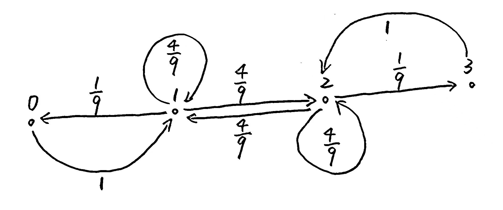

# 随机过程期末试卷

**Time:** 18:30-20:30

### Problem 1

Consider independent tosses of a fair die.  
Let $X_n$ be the maximum of numbers appearing in the first $n$ throws, $n=1,2,\dots$    

**(a)** Verify that $\{X_n:n\geq 1\}$ is a Markov chain.    
Describe the state space and the transition probability matrix of this homogeneous Markov Chain.

**Solution:**  
记第 $n$ 次投掷骰子的结果为 $\xi_n$，其分布为 $\text{P}\{\xi_n = i\}=\frac16\ \ (i=1,2,3,4,5,6)$   
则对于任意 $n\in\mathbb N$ 都有 $X_{n+1} = \max \{\xi_1,\dots,\xi_n,\xi_{n+1}\} = \max\{X_{n},\xi_{n+1}\}$   
显然有 $\text{P}\{X_{n+1}=x_{n+1}|X_n=x_n,\dots,X_1=x_1\} = \text{P}\{X_{n+1}=x_{n+1}|X_n=x_n\}$ 成立  
说明 $\{X_n:n\geq 1\}$ 具有 Markov 性，因此是一个 Markov 链.

其状态空间为 $\{1,2,3,4,5,6\}$，考虑转移概率:

- 当前 $n$ 次投掷处于最大值 $m$ 时，下一步仍停在 $m$ 的概率为:
  $$
  \text{P}_{m,m} = \text{P}\{\xi_{n+1}\leq m\} = \frac{m}{6}
  $$

- 当前 $n$ 次投掷处于最大值 $m$ 时，下一步变为 $j>m$ 的概率为:
  $$
  \text{P}_{m,m} = \text{P}\{\xi_{n+1} = j\} = \frac{1}{6}
  $$

因此状态转移矩阵为:
$$
P=\begin{bmatrix}
\frac16&\frac16&\frac16&\frac16&\frac16&\frac16\\
&\frac26&\frac16&\frac16&\frac16&\frac16\\
&&\frac36&\frac16&\frac16&\frac16\\
&&&\frac46&\frac16&\frac16\\
&&&&\frac56&\frac16\\
&&&&&1\\\end{bmatrix}
$$
**(b)** Find out the classes of all states.   
Is there any state closed (a state is closed if, once entered, it cannot be left)?   
Is there any state recurrent/transient?   
Is there any state positive recurrent?   
Write your reasons briefly.

**Solution:**  

- 状态 $6$ 是闭的 (即吸收态)，因为 $\text{P}\{X_{n+1}=6|X_n=6\}=P_{6,6} = 1$ 
- 状态 $6$ 是常返态 (具体来说，是正常返态)，因为它是一个吸收态.  
  状态 $1,2,3,4,5$ 是瞬时态，  
  因为它们都可到达状态 $6$，可是一旦过程进入状态 $6$，它就无法返回到其他状态.

### Problem 2

Three white and three black balls are allocated in two urns, with three balls per urn. At each step, we draw at random a ball from each of the two urns, and exchange their places (the ball drawn from the first urn is put into the second urn, and vice versa). The process is repeated again and again. Let $X_n$ denote the number of white balls in the first urn after the $n$-th step.

(a) Draw a transition diagram to describe the Markov chain $\{X_n, n = 0, 1, 2, \cdots\}$. [5 marks]

- **Solution:**  
  

(b) Write down the transition probability matrix for the Markov chain described in part (a). [5 marks]

- **Solution:**  
  $P=\begin{bmatrix}
  & 1 & &\\
  \frac19 & \frac49 & \frac49 &\\
  &\frac49 & \frac49 & \frac19\\
  &&1&\end{bmatrix}$ 

(c) Does the limiting distribution of this Markov chain exist? Explain briefly. [5 marks]

- **Solution:**    
  这个 Markov 链的极限分布存在.  
  
  因为它的**状态空间有限且不可约**，故所有状态都是**正常返态**.  
  (可以论证它不可能是瞬时的，也不可能是零常返的)  
  同时我们可以看出状态 $0$ 是**非周期**的，因此这是一个非周期 Markov 链.
  
  我们知道：  
  一个非周期不可约的 Markov 链当且仅当正常返时，存在唯一的平稳分布，  
  并且这个平稳分布就是极限分布.

(d) Determine the proportion of steps after which there is no white ball in the first urn. [5 marks]

- **Solution:**    
  求解 $\begin{cases}
  \pi = \pi P\\
  \pi1_4 = 1\end{cases}$ 方程，即 $\begin{cases}
  \pi_0 = \frac19 \pi_1\\
  \pi_1 = \pi_0 + \frac49 \pi_1 + \frac49 \pi_2\\
  \pi_2 = \frac49 \pi_1 + \frac49 \pi_2 + 1 \pi_3\\
  \pi_3 = \frac19 \pi_2\\
  \pi_0 + \pi_1 + \pi_2 + \pi_3 = 1\end{cases}$ ，解得 $\begin{cases}
  \pi_0 = \frac1{20}\\
  \pi_1 = \frac9{20}\\
  \pi_2 = \frac{9}{20}\\
  \pi_3 = \frac1{20}\end{cases}$   
  因此极限分布 $\mu$ 等于平稳分布 $\pi = (\frac1{20},\frac{9}{20},\frac{9}{20},\frac{1}{20})$   
  表明如果这个 Markov 过程持续进行下去，  
  则第一个盒子里没有白球所占的时间比例大约为 $\pi_0 = \frac{1}{20}$.

  **Interpretation:**  
  The proportion of steps after which there is no white ball in the first urn is the stationary probability $\pi_0 = \frac1{20}$. This tells us that in the long run, the first urn will have no white balls approximately $\frac1{20}$ of the time, or 5% of the steps. This proportion is the limiting frequency with which the first urn will contain zero white balls as the number of steps becomes very large.

### Problem 3

Let $\{N(t), t \geq 0\}$ be a Poisson process with rate $\lambda$ that is independent of the non-negative random variable $T$ with mean $\mu$ and variance $\sigma^2$. Find

- (a) $\text{Cov}(T, N(T))$. [5 marks]
- (b) $\text{Var}(N(T))$. [5 marks]

### Problem 4

Suppose $N(t), t \geq 0$ is a Poisson process with rate $\lambda$ and $\{S_1, S_2, \cdots\}$ is the sequence of arrival time.   
Let $f: \mathbb{R}^+ \rightarrow \mathbb{R}$, find the value of $E(\sum_{i=1}^{N(t)} f(S_i))$.
[15 marks]

### Problem 5

Assume that the offspring distribution of a branching process with a single ancestor ($X_0 = 1$)   
is given by $P_0 = \frac{1}{6}, P_1 = \frac{1}{2}, P_2 = 0, P_3 = \frac{1}{3}$.

- (a) Determine the expectation and variance of the size of the 9th generation. [5 marks]
- (b) Determine the probability that the process dies exactly at the 3rd generation. [5 marks]
- (c) Determine the extinction probability for this process. [5 marks]
- (d) If the process starts with 5 ancestors (i.e., $X_0 = 5$), how likely is it that the process will eventually die out? [5 marks]

### Problem 6

Consider the integrated Brownian Motion process $\{Z(t), t \geq 0\}$ defined by $Z(t) = \int_0^t B(s) ds$,   
where $\{B(s), s \geq 0\}$ is the standard Brownian Motion.   
Find the joint distribution of $Z(t)$ and $B(t)$. [10 marks]

### Problem 7

Define $B_x(t) := B(t) + x$, where $B(t)$ is standard Brownian Motion.   
Determine the probability that $B_x(t)$ has at least one zero in $[0, T]$. [15 marks]