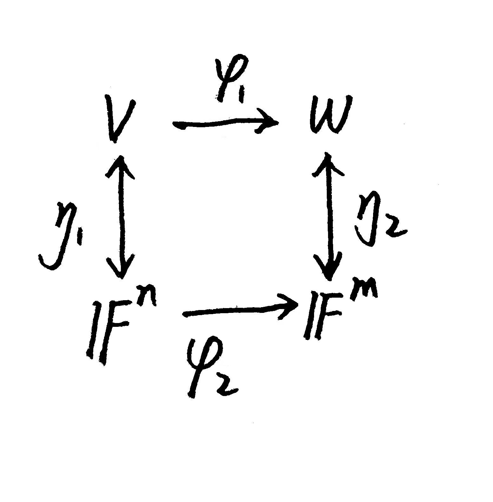

# FDU 高等线性代数 0. 基础知识

本文根据邵美悦老师授课内容整理而成，并参考了以下资料:   

* Matrix Analysis (R. Horn & C. Johnson) Chapter $0$
* 矩阵分析 (R. Horn & C. Johnson) 第 $0$ 章
* 高等代数学 (第 $4$ 版, 谢启鸿, 姚慕生, 吴泉水) 第 $3,4$ 章
* [Vector spaces and linear maps (stanford.edu)](https://ai.stanford.edu/~gwthomas/notes/vector-spaces-linear-maps.pdf)
* [Matrix Cookbook (uwaterloo.ca)](https://www.math.uwaterloo.ca/~hwolkowi/matrixcookbook.pdf)
* [Hadamard product (Wiki)](https://en.wikipedia.org/wiki/Hadamard_product_(matrices)#cite_note-HornJohnson-1)
* Kronecker Products and Matrix Calculus with Applications (Graham, A. 1981)
* [Convex Optimization: Appendix D Matrix Calculus (stanford.edu)](https://ccrma.stanford.edu/~dattorro/0976401304.pdf)

欢迎批评指正!

## 0.1 域

### 0.1.1 域

> Underlying a vector space is its field, or set of scalars, typically $\mathbb R$ or $\mathbb C$  
> we denote it by the symbol $\mathbb F$ if unspecdified.

构建线性空间的基础是**域** (field)，即满足某些良好性质的标量集合.
典型的域例如实数域 $\mathbb R$ 和复数域 $\mathbb C$  
我们通常将一般的域记为 $\mathbb F$ 

一个标量集合 $S$ 要成为一个域，需要对定义在其上的两种二元运算: 加法 $(+)$ 和乘法 $(\times)$ 满足:  
对于任意 $a,b,c\in \mathbb F$

- **封闭:** $\begin{cases}
  a + b \in \mathbb F\\
  a\times b \in \mathbb F \end{cases}$ 
- **可交换:** $\begin{cases}
  b + a = a + b\\ 
  b\times a = a\times b \end{cases}$ 
- **可结合:** $\begin{cases} 
  (a + b) + c =a + (b+ c)\\ 
  (a \times b)\times c = a\times(b\times c) \end{cases}$ 
- **可分配:** $\begin{cases}
  (a + b)\times c = (a \times c) + (b\times c)\\
  c\times (a + b) = (c \times a) + (c\times a)\end{cases}$
- **单位元 (不动点):** $\exists\ 0_{\mathbb F},1_{\mathbb F}\in \mathbb F\ \text{such that }
  \begin{cases} 0_{\mathbb F} \neq 1_{\mathbb F}\\ 
  a + 0_{\mathbb F} = a\\ 
  a\times 1_{\mathbb F} = a \end{cases}$
- **逆元:** $\begin{cases}
  \exist\ (-a)\in \mathbb F\ \text{such that }a+(-a)=0_{\mathbb F}\\
  \text{if }a\neq 0_{\mathbb F},\ \text{then } \exists\ (a^{-1})\in \mathbb F\ \text{such that }a\times (a^{-1})=1_{\mathbb F}\end{cases}$

我们可以定义域 $\mathbb F$ 上的减法 $(-)$ 为 $a-b:= a+(-b)$   
还可以定义域 $\mathbb F$ 上的除法 $(\backslash)$ 为 $a\backslash b:= a\times (b^{-1})$ (其中 $b\neq 0_{\mathbb F}$)   
这样在域上我们可以使用一切规范的代数法则.

最简单的域是 $\{0,1\}$，可视 $0$ 为偶数而 $1$ 为奇数，并定义其加法和乘法运算为:  
$$
\begin{array}{c|cc} 
+ & 0 & 1 \\ 
\hline 0 & 0 & 1 \\ 
1 & 1 & 0
\end{array}

\qquad\qquad

\begin{array}{c|cc} 
\times & 0 & 1 \\ 
\hline 0 & 0 & 0 \\ 
1 & 0 & 1 
\end{array}
$$

代数数构成域，  
例如有理数域 $\mathbb Q$ 加上无理数 $\sqrt 2$ 的扩张 $\text{Q}[\sqrt 2]=\{\alpha+\beta \sqrt 2: \alpha,\beta \in \mathbb Q\}$ 就是一个域.

超越数的有理函数构成域，  
例如自然常数 $e$ 的有理函数集合 $\{\frac{\alpha_0 + \alpha_1 e + \dotsm + \alpha_m \mathrm{e}^m}{\beta_0 + \beta_1 e + \dotsm + \beta_m \mathrm{e}^m}:m\in \mathbb N,\alpha_1,\dots,\alpha_m,\beta_1,\dots,\beta_m\in \mathbb Q,\beta_m \neq 0\}$ 就是一个域.

### 0.1.2 复数域

在全体复数构成的集合 $\mathbb C=\{\alpha+i\beta :\alpha,\beta \in \mathbb R\}$ 上，我们可以定义两种最基本的运算:  

- 加法 $(\alpha_1+i\beta_1)+(\alpha_2+i\beta_2):=(\alpha_1+\alpha_2)+i(\beta_1+\beta_2)$
- 乘法 $(\alpha_1+i\beta_1)\times(\alpha_2+i\beta_2) := (\alpha_1\alpha_2-\beta_1\beta_2) + i(\alpha_1\beta_2+\alpha_2\beta_1)$   
  (根据这个定义我们自然有 $i^2 =-1$)

我们有以下结论:

- **(加法, addition)**   
  对于任意 $x,y,z\in \mathbb C$ 我们有:  

  - 封闭 (closed): $x+y \in \mathbb C$ 

  - 可结合 (associative): $(x+y)+z = x + (y+z)$ 

  - 可交换 (commutative): $y + x = x + y$ 

  - 单位元 (indentity): $0\in \mathbb C\ \text{such that }x + 0 = x$ 

  - 逆元 (inverse): $\exists \ (-x)\in \mathbb C\ \text{such that }x + (-x) = 0$ 

  这表明 $(\mathbb C,+)$ 是一个**无限 Abel 群 **(Infinite Abelian Group).  
  我们可以定义**减法**为 $x-y:= x+ (-y)$ 

- **(乘法, multiplication)**   
  对于任意 $x,y,z\in \mathbb C$ 我们有:

  - 封闭: $x\times y \in \mathbb C$ 

  - 可结合: $(x\times y) \times z = x \times (y\times z)$ 

  - 可交换: $y\times x = x\times y$ 

  - 单位元: $1\in \mathbb C\ \text{such that }x\times 1 = x$ 

  - 逆元: 若 $x\neq 0$，则 $\exists\ (x^{-1}) = \frac{\bar x}{x\bar x}\in \mathbb C\ \text{such that }x\times (x^{-1}) = 1$ 

  这表明 $(\mathbb C\backslash \{0\},\times)$ 是一个**无限 Abel 群**.  
  我们可以定义**除法**为 $x/y:= x\times (y^{-1})$ (其中 $y\neq 0$)  

- **(复数乘法对复数加法满足分配律, Complex Multiplication Distributes over Addition)**    
  对于任意 $x,y,z\in \mathbb C$ 我们有:  
  $$
  \begin{cases} 
  x\times(y+z) = (x\times y) +(x\times z)\\ 
  (y + z)\times x = (y\times x) + (z \times x) 
  \end{cases}
  $$

  综上所述，设 $x,y,z$ 是复数，则我们有:
  $$
  \begin{cases}
  x+y = y+x\\
  (x+y) + z = x + (y+z)\\
  x+0 = 0+x =x\\
  x\times y=y\times x\\
  (x\times y)\times z = x\times (y\times z)\\
  x\times 1 = 1\times x = x\\
  x\times (y+z) = x\times y + x\times z\\
  (y+z)\times x = y\times x + z\times x\end{cases}
  $$
  上述九个等式表明 $(\mathbb C,+,\times)$ 构成一个**交换环** (commutative ring)  
  注意: 如果我们删去等式 $x\times y = y\times x$，则只能断定复数集 $\mathbb C$ 构成一个**环** (ring)  

- **(复数集构成一个域)**   
  设 $x,y,z$ 是复数，则我们有:
  $$
  \begin{cases}
  x+y = y+x\\
  (x+y) + z = x + (y+z)\\
  x+0 = 0+x =x\\
  x\times y=y\times x\\
  (x\times y)\times z = x\times (y\times z)\\
  x\times 1 = 1\times x = x\\
  x\times (y+z) = x\times y + x\times z\\
  (y+z)\times x = y\times x + z\times x\\
  \text{if }x\neq 0,\ \text{then }x\times x^{-1} = x^{-1}\times x = 1\end{cases}
  $$
  上述十个等式表明 $(\mathbb C,+,\times)$ 构成一个**域** (field)  
  这保证了我们可以在复数域上使用一切规范的代数法则.

### 0.1.3 数域

数域是域的特例.  
**(数域, 高等代数学 定义 $3.1.1$)**  
设 $\mathbb K$ 是复数域 $\mathbb C$ 的子集，且至少有两个不同的元素.  
若 $\mathbb K$ 对定义在复数域 $\mathbb C$ 上的加法、减法、乘法以及除法 (除数不为零) 封闭，  
则称 $\mathbb K$ 是一个数域.

- 我们立即知道复数集 $\mathbb C$、实数集 $\mathbb R$ 和有理数集 $\mathbb Q$ 都是数域.
- 显然任一数域都包含 $0$ 和 $1$ 两个数

**(高等代数学 定理 $3.1.1$)**  
任一数域 $\mathbb K$ 必定包含有理数域 $\mathbb Q$.

- 这表明有理数域 $\mathbb Q$ 是最基本的数域.
- **证明:**  
  注意到 $1\in \mathbb K$，根据 $\mathbb K$ 对加法和减法的封闭性可知 $\mathbb K$ 包含全体整数.  
  又根据 $\mathbb K$ 对除法 (除数不为零) 的封闭性可知 $\mathbb K$ 包含全体有理数.

我们称数域 $\mathbb K$ 是**完备的**，如果 $\mathbb K$ 上的任意 Cauchy 数列都收敛，且极限都落在 $\mathbb K$ 中.  
可以证明有理数域 $\mathbb Q$ 是不完备的:  
定义在 $\mathbb Q$ 上的某些 Cauchy 数列可能是发散的 (直观来说，这是因为其极限是无理数)  
幸运的是，我们可以证明实数域 $\mathbb R$ 和复数域 $\mathbb C$ 都是完备的. 

### 0.1.4 域的特征

域 $\mathbb F$ 的特征 $\text{char}(\mathbb F)$ 是最小的正整数 $p$，使得 $p$ 个乘法单位元 $1_{\mathbb F}$ 相加等于加法单位元 $0_{\mathbb F}$.   
如果这样的正整数 $p$ 不存在，则称该域的特征为零.  

- 我们使用的通常是特征为零的域.  
  显然数域的特征一定为零.

**定理:** 域的特征只能是 $0$ 或素数.

- **证明:**   
  只需要说明，对于非零特征的域 $\mathbb F$ ，其特征一定是素数.  
  **(反证法)** 假设 $\text{char}(\mathbb F)=n\neq 0$ 是一个合数，  
  则存在 $1<a,b<n$ 使得 $n=ab$ 

  记 $\begin{cases}
  a\cdot 1_{\mathbb F} := \underset{a}{\underbrace{1_{\mathbb F} + \dotsm + 1_{\mathbb F}}}\\
  b\cdot 1_{\mathbb F} := \underset{b}{\underbrace{1_{\mathbb F} + \dotsm + 1_{\mathbb F}}}\end{cases}$   
  根据 $\text{char}(\mathbb F) = n>a$ 可知 $\begin{cases}
  a\cdot 1_{\mathbb F} \neq 0_{\mathbb F}\\
  b\cdot 1_{\mathbb F} \neq 0_{\mathbb F}\end{cases}$  

  但注意到:
  $$
  (a\cdot 1_{\mathbb F})\times (b\cdot 1_{\mathbb F}) = \underset{ab}{\underbrace{1_{\mathbb F} + \dotsm + 1_{\mathbb F}}} = (ab)\cdot 1_{\mathbb F} = n\cdot 1_{\mathbb F} = 0_{\mathbb F}
  $$
  这显然与 $\begin{cases}
  a\cdot 1_{\mathbb F} \neq 0_{\mathbb F}\\
  b\cdot 1_{\mathbb F} \neq 0_{\mathbb F}\end{cases}$ 相矛盾.  
  命题得证.

**于是域的特征的定义可以更新为:**  
域 $\mathbb F$ 的特征 $\text{char}(\mathbb F)$ 是最小的素数 $p$，使得 $p$ 个乘法单位元 $1_{\mathbb F}$ 相加等于加法单位元 $0_{\mathbb F}$.   
如果这样的素数 $p$ 不存在，则称该域的特征为零.  

### 0.1.5 域的同态与同构

两个域之间保持运算和单位元的映射称为**同态** (Homomorphism).  
设 $\mathbb F_1$ 和 $\mathbb F_2$ 是两个域，一个映射 $f:\mathbb F_1 \mapsto \mathbb F_2$ 称为同态，如果它满足以下条件:

* **保持运算:** 对于任意 $a,b\in \mathbb F_1$ 都有 $
  \begin{cases} 
  f(a + b) = f(a) + f(b)\\ 
  f(a\times b) = f(a)\times f(b) \end{cases}$ 成立
* **保持单位元:** $\begin{cases} f(0_{\mathbb F_1}) = 0_{\mathbb F_2}\\ 
  f(1_{\mathbb F_1}) = 1_{\mathbb F_2} \end{cases}$

两个域之间保持运算和单位元的双射称为**同构** (Isomorphism).  
也就是说，当域的同态是一个双射时，这个同态称为同构.  
即保持运算和单位元的同时，它还满足双射的性质: 

* **单射 (Injective):** 对于任意 $a, b \in \mathbb{F}_1$，若 $f(a) = f(b)$，则有 $a = b$ 成立
* **满射 (Surjective)**: 对于任意 $b \in \mathbb{F}_2$，存在一个 $a \in \mathbb{F}_1$ 使得 $f(a) = b$

即满足 **1-1 对应:** 对于任意 $a\in \mathbb F_1$ 都存在唯一的 $b \in \mathbb F_2$ 与之对应 $(f(a)=b)$，反之亦然 $(a=f^{-1}(b))$.

如果存在一个从域 $\mathbb F_1$ 到域 $\mathbb F_2$ 的同构，那么我们称这两个域是同构的，记作 $\mathbb F_1 \cong \mathbb F_2$.  
这意味着这两个域在代数结构上是完全相同的，尽管它们的元素可能看起来不一样.  

在实际应用中，域的同构可以帮助我们理解不同的数学系统之间的本质联系.  
例如有理数域 $\mathbb Q$ 与有理函数域，或不同的有限域之间的关系.   
通过域的同构，我们可以将一个问题从一个域转换到另一个域，  
这为理论研究和问题求解提供了一个非常有力的工具.

**下面我们来看一些同构的例子: **

- 复数域 $\mathbb C = \{\alpha + \beta i:\alpha,\beta \in \mathbb R\}$ 与集合 $\left\{\begin{bmatrix}
  \alpha & -\beta\\ 
  \beta & \alpha\end{bmatrix}:\alpha,\beta \in \mathbb R\right\}$ 和 $\left\{\begin{bmatrix}
  \alpha & \beta\\ 
  -\beta & \alpha\end{bmatrix}:\alpha,\beta \in \mathbb R\right\}$ 同构.  

- 有理数域的扩张与有理系数多项式的商域同构.   
  例如有理数域 $\mathbb Q$ 加上代数数 $\sqrt{2}$ 的扩张 $\mathbb Q(\sqrt2) = \{\alpha + \beta\sqrt2 : \alpha,\beta \in \mathbb Q\}$   
  与有理系数多项式的商域 $\mathbb Q[x]/(x^2-2)$ 是同构的.  
  我们可以构造 $\varphi: \mathbb Q[x]/(x^2-2) \mapsto \mathbb Q(\sqrt2)$   
  使得对于任意等价类 $[p(x)]\in \mathbb Q[x]/(x^2-2)$，都有 $\varphi([p(x)]) = p(\sqrt2)$ 成立.  
  可以证明这个映射保持运算且是一个双射.
  
  > 商域 $\mathbb Q[x]/(x^2-2)$ 的元素是形如 $[p(x)]$ 的等价类，  
  > 两个多项式 $p(x)$ 和 $q(x)$ 属于同一个等价类，当且仅当 $p(x)-q(x)$ 可被 $x^2-2$ 整除.  
  > 注意到 $\mathbb Q[x]$ 中的每个有理系数多项式 $p(x)$ 都可表示为 $p(x)=m(x)(x^2-2) + \alpha + \beta x$，  
  > 因此商域 $\mathbb Q[x]/(x^2-2)$ 中每个等价类都形如 $\alpha + \beta x\ (\alpha,\beta\in \mathbb Q)$ (这可作为等价类的代表元)，  
  > 很容易与 $\mathbb Q(\sqrt2) = \{\alpha + \beta\sqrt2 : \alpha,\beta \in \mathbb Q\}$ 之间建立双射.

一个容易造成混淆的概念是 **"拓扑同构"** (又称为同胚 Homeomorphism):  

- 任意开区间 (例如 $(0,1)$) 与实数域 $\mathbb R$ 在拓扑上是同构的 (同胚).  
  这可以通过一个双射函数 $f:(0,1)\rightarrow \mathbb R$ 来实现，  
  例如 $f(x) = \tan(\pi(x-\frac12))$ 或 $f(x) = \log \frac{x}{1-x}$.

  拓扑同构仅保持点集的连续性和连通性，而不涉及代数运算和单位元的保持.   
  这意味着它们在拓扑上是相同的，尽管其具体结构可能不同.

## 0.2 线性空间

### 0.2.1 线性空间

域 $\mathbb F$ 上的**线性空间** (linear space) $(V,+,\cdot)$ (又称为**向量空间** vector space)  
由一组对象 (通常称为**向量** vector) 的集合 $V$、向量加法 $+: V\times V\mapsto V$ 和标量乘法 $\cdot: \mathbb F\times V\mapsto V$ 构成.  
对于任意向量 $u,v,w\in V$ 和标量 $\alpha,\beta\in \mathbb F$，它满足以下性质: 

- **加法可交换:** $u +v = v + u$
- **可结合:** $\begin{cases} (u+v)+w = u + (v + w)\\ 
  \alpha\cdot(\beta\cdot v) = (\alpha\cdot \beta)\cdot v \end{cases}$ 
- **可分配:** $\begin{cases} \alpha\cdot(u+v) = \alpha \cdot u + \alpha \cdot v\\ (\alpha + \beta) \cdot v = \alpha\cdot v + \beta\cdot v \end{cases}$ 
- **单位元:** $\begin{cases} 
  \exists\ 0_V \in V & \text{ such that }\ v+0_{V} = v\\ 
  \exists\ 1_{V} \in \mathbb F & \text{ such that } 1_V\cdot v = v\end{cases}$ 
- **加法逆元: ** $\exists\ (-v) \in V \text{ such that } v+(-v) = 0_V$

可以证明: 加法单位元 $0_V$、数乘单位元 $1_V$ 和任意给定向量 $v\in V$ 的加法逆元 $-v$ 都是唯一的.

给定域 $\mathbb F$ 和正整数 $n$，由 $\mathbb F$ 中的元素形成的 $n$ 元组的集合 $\mathbb F^n$ 在逐元素加法和数乘之下构成线性空间.  
我们约定 $\mathbb F^n$ 中的元素总是列向量.  
其中 $\mathbb C^n$ 和 $\mathbb R^n$ 是本课程中最基本的线性空间.

### 0.2.2 子空间

若 $S$ 是域 $\mathbb F$ 上的线性空间 $V$ 的子集，且本身也是 $\mathbb F$ 上的线性空间，  
则我们称 $S$ 为 $V$ 的一个**线性子空间** (linear subspace).  
它有着与 $V$ 相同的向量加法和数乘运算，并满足:

- **包含零向量 (加法单位元):** $0_V \in S$
- **对向量加法和数乘元素封闭:** $\begin{cases} u+v\in S &(\forall\ u,v\in S)\\
  \alpha v\in S & (\forall\ \alpha\in \mathbb F,v\in S)\end{cases}$

换句话说，若子集 $S$ 继承了全空间 $V $ 的代数性质，则称为线性子空间 (简称子空间).

零线性空间 $\{0_V\}$ 和全空间 $V$ 总是 $V$ 的子空间，因而称为**平凡子空间** (trivial subspace).  
若子空间 $S$ 异于全空间 $V$，则称为**真子空间** (proper subspace).  
若子空间 $S$ 异于零线性空间 $\{0_V\}$ 和全空间 $V$，则称为**非平凡子空间** (nontrivial subspace).  

***

**线性组合**即线性空间 $V$ 中有限个元素的加权和，形如 $\alpha_1v_1 + \dots + a_k v_k$，其中 $\begin{cases}
k\in  \mathbb N_+\\
\alpha_1,\dots,\alpha_k\in \mathbb F\\
v_1,\dots,v_k\in V\end{cases}$     
若 $\alpha_1=\dotsm=\alpha_k=0$，则称此线性组合是平凡的; 反之，它就是非平凡的.

若 $S$ 是域 $\mathbb F$ 上的线性空间 $V$ 的子集，则 $S$ 的**生成子空间** $\text{span}(S)$ 是 $V$ 中所有包含 $S$ 的子空间的交.   
(因此即使 $S$ 并不是子空间，生成子空间 $\text{span}(S)$ 也一定是子空间)

- 若 $S=\emptyset$，则 $\text{span}(S) =\{0_V\}$ 
- 若 $S\neq \emptyset$​，则 $\text{span}(S) = \left\{\alpha_1v_1+\dots + \alpha_k v_k:\begin{cases}
  k\in  \mathbb N_+\\
  \alpha_1,\dots,\alpha_k\in \mathbb F\\
  v_1,\dots,v_k\in S\end{cases} \right\}$  ​

****

任意给定线性空间 $V$ 的两个子空间 $S_1,S_2$ 

- 它们的交 $S_1 \cap S_2=\{s:s\in S_1,s\in S_2\}$ 仍然是子空间
- 它们的并 $S_1 \cup S_2 = \{s:s\in S_1\ \text{or } s\in S_2\}$ 不一定是一个子空间
- 它们的和 $S_1 + S_2 = \text{span}(S_1\cup S_2) = \{s_1+s_2:s_1\in S_1,s_2\in S_2\}$ 仍然是子空间.  
  若 $S_1\cap S_2 = \{0_V\}$，则我们称 $S_1+S_2$ 为**直和** (direct sum)，记为 $S_1\oplus S_2$   
  此时任意 $s\in S_1\oplus S_2$ 都可以唯一地表示为 $s=s_1+s_2$，其中 $s_1\in S_1,s_2\in S_2$ 

****

任意给定一个子集 $S\subseteq \mathbb C^n$   
我们定义 $S$ 的**正交补** (orthogonal complement) $S^\bot := \{x\in \mathbb C^n:x^{\mathrm H}y = 0\text{ for all }y\in S\}$   

- 即使 $S$ 不是 $\mathbb C^n$ 的子空间，其正交补 $S^\bot$ 也总是一个子空间.  
- 我们有 $(S^\bot)^\bot = \text{span}(S)$   
  当且仅当 $S$ 是一个子空间时 $(S^\bot)^\bot = \text{span}(S) = S$   
  我们恒有 $\dim(S^\bot) + \dim((S^\bot)^\bot) = \dim(S^\bot) + \dim(\text{span}(S)) = n$ 
- 若 $S_1,S_2$ 都是 $\mathbb C^n$ 的子空间，则我们有 $(S_1+S_2)^\bot = S_1^\bot \cap S_2^\bot$ 
- 对于任意 $A\in \mathbb C^{m\times n}$，我们都有 $\begin{cases}
  \text{Range}(A)^\bot = \text{Ker}(A^{\mathrm H})\\
  \text{Ker}(A)^\bot = \text{Range}(A^{\mathrm H})\end{cases}$ 
- 设 $A\in \mathbb C^{m\times n},B\in \mathbb C^{m\times q},X\in \mathbb C^{m\times r},Y\in \mathbb C^{m\times s}$   
  若 $\begin{cases}
  \text{Range}(X) = \text{Ker}(A^{\mathrm H})\\
  \text{Range}(Y) = \text{Ker}(B^{\mathrm H})\end{cases}$，则我们有 $\text{Range}(A)\cap \text{Range}(B) = \text{Ker}(\begin{bmatrix}
  X^{\mathrm H}\\
  Y^{\mathrm H}\end{bmatrix})$   
  (**存疑**: $A,B$ 和 $X,Y$ 弄反了?)

### 0.2.3 基

我们称域 $\mathbb F$ 上的线性空间 $V$ 中有限多个向量 $v_1,\dots,v_k$ 是**线性相关的** (linearly dependent)，  
当且仅当存在不全为零的标量 $\alpha_1,\dots,\alpha_k\in \mathbb F$ 使得 $\alpha_1v_1 + \dotsm + \alpha_k v_k = 0_V$   
即当且仅当 $v_1,\dots,v_k$ 存在某个非平凡的线性组合是零向量.

若 $v_1,\dots,v_k$ 不是线性相关的，则我们称它们是**线性无关的** (linearly independent)    
特别地，空向量组不是线性相关的，因此它是线性无关的.

从一个向量组 (可以是无限的) 中去掉某些向量得到的向量组称为**子向量组** (sublist)  
一个无穷向量组称为是线性相关的，如果它的某个有限子向量组是线性相关的.  
一个无穷向量组称为是线性无关的，如果它的任意有限子向量组都是线性无关的. 

一个有限向量组的**基数**是其**极大线性无关组** (即个数最多的线性无关的子向量组) 中的向量个数.

***

若一组线性无关的向量 $\{v_1,v_2,...,v_n\}$ 能张成 $V$ (即 $\text{span}\{v_1,v_2,...,v_n\} = V$)，  
则称其为 $V$ 的一组**基** (basis).  
给定 $V$ 的一组基 $\{v_1,v_2,...,v_n\}$，  
则 $V$ 中的每个向量都能唯一地表示为基向量 $v_1,\dots,v_n$ 的线性组合.

- 一组能张成 $V$ 的向量 $\{v_1,v_2,...,v_n\}$ 是 $V$ 的一组基，  
  当且仅当其任意真子集都不能张成 $V$.
- 空向量组 (可以认为它是线性无关的) 是零线性空间 $\{0_V\}$ 的基.
- 线性空间可以有无限基数的基，例如 $\{1,t,t^2,\dots\}$ 就是所有实系数多项式组成的线性空间的一组基.  
  每一个实系数多项式都能唯一地表示为这组基中 (有限多个) 元素的线性组合.
- 域 $\mathbb F$ 上的线性空间 $V$ 中的任意一组线性无关的向量都可以扩充为 $V$ 的一组基 (且扩充方式不唯一). 

****

若存在一个正整数 $n$ 使得线性空间 $V$ 的一组基恰好包含 $n$ 个向量，    
则 $V$ 的每组基都恰好由 $n$ 个向量构成.    
此时我们称 $V$ 是**有限维的** (finite-dimensional)，记为 $\dim(V)=n$   

反之，我们称 $V$ 是**无限维的** (infinite-dimensional)   
此时任意两组基的元素之间都存在 1-1 对应关系 (因而有相同的基数).

**子空间交引理 (subspace intersection lemma)**  
设 $V$ 是一个有限维线性空间，且 $S_1$ 和 $S_2$ 是 $V$ 的两个给定的子空间.  
则我们有维数公式 $\dim(S_1\cap S_2) + \dim(S_1+S_2) = \dim(S_1) + \dim(S_2)$   
(特殊地，当 $S_1\cap S_2 = \{0_V\}$ 时，则形式为 $\dim(S_1\oplus S_2) = \dim(S_1) + \dim(S_2)$)  
进而有 $\dim(S_1\cap S_2) = \dim(S_1) + \dim(S_2) - \dim(S_1 + S_2)\geq \dim(S_1) + \dim(S_2)-\dim(V)$ 

- 归纳法指出:  
  若 $S_1,\dots,S_k$ 是有限维线性空间 $V$ 的子空间，则我们有:  
  $$
  \dim(S_1\cap \dotsm \cap S_k) \geq \dim(S_1) + \dotsm + \dim(S_k) - (k-1)\dim(V)
  $$

****

**(高等线性代数纲要 $4.2$ 节)**  
给定正整数 $n$  
若 $\mathbb F$ 是一个域，则 $\mathbb F^n$ 不能表示为它的两个真子空间的并.  
当 $\text{char}(\mathbb F)=0$ 时，$\mathbb F^n$ 不能表示为其有限个真子空间的并.  

- 换句话说，真子空间的并集所包含的向量比全空间少.  
  这说明了我们应当通过基向量的线性组合来构造线性空间，而不是依靠真子空间的并.

- 更深刻地，域不能表示成两个真子域的并.  
  当域的特征为零时，该域不能表示为有限个真子域的并.  
  即在域的结构中，某些性质不能通过更简单的子结构进行分解.
  
- **证明:**    
  **(反证法)** 假设存在 $\mathbb F^n$ 的两个真子空间 $S_1,S_2$ 使得 $\mathbb F^n = S_1\cup S_2$.   
  由于 $S_1,S_2$ 是真子空间，故存在 $s_1,s_2$ 满足 $\begin{cases} s_1\in S_1,\  s_1\notin S_2\\ 
  s_2\notin S_1,\ s_2\in S_2 \end{cases}$  
  根据线性空间对向量加法的封闭性，有 $s_1 + s_2 \in \mathbb F^n$，则 $s_1+s_2$ 势必属于 $S_1,S_2$ 中的一个.  
  
  - 若 $s_1+s_2\in S_1$  
    则 $s_2 = (s_1+s_2) + (-s_1) \in S_1$ (注意到 $S_1$ 是子空间，故 $(-s_1)\in S_1$)，与假设矛盾;  
  - 若 $s_1+s_2\in S_2$  
    则 $s_1 = (s_1+s_2) + (-s_2) \in S_2$ (注意到 $S_2$ 是子空间，故 $(-s_2)\in S_2$)，与假设矛盾;
  
  因此 $\mathbb F^n$ 不能表示为它的两个真子空间的并.
  
  ****
  
  当 $\text{char}(\mathbb F)=0$ 时，我们使用数学归纳法证明 $\mathbb F^n$ 不能表示为其有限个真子空间的并.      
  对真子空间数量 $m$ 进行数学归纳:      
  ① 当 $m=1,2$ 时，命题显然成立.    
  ② 现假设命题对正整数 $m$ 成立  
  则对于 $\mathbb F^n$ 的任意给定的 $m$ 个真子空间 $S_1,\dots,S_m$ 都有 $\left(\bigcup_{i=1}^m S_i\right)\subset \mathbb F^n$ 成立.  
  根据归纳假设可知 $\left(\bigcup_{i=1}^m S_i\right)$ 不是 $\mathbb F^n$ 的真子空间，仅仅是真子集.  
  
  下面证明在归纳假设下，命题对正整数 $m+1$ 也成立.  
  **(反证法)** 假设存在 $\mathbb F^n$ 的一个真子空间 $S_{m+1}$ 使得 $\left(\bigcup_{i=1}^m S_i\right)\cup S_{m+1}=\mathbb F^n$   
  由于 $\left(\bigcup_{i=1}^m S_i\right)\subset \mathbb F^n$ 和 $S_{m+1}\subset \mathbb F^n$，故存在 $s_1,s_2$ 满足 $\begin{cases} s_1\in S_{m+1},\  s_1\notin \left(\bigcup_{i=1}^m S_i\right)\\ 
  s_2\notin S_{m+1},\ s_2\in \left(\bigcup_{i=1}^m S_i\right)\end{cases}$   
  
  根据线性空间对向量加法的封闭性，对于任意 $k$ 都有 $ks_1 + s_2 \in \mathbb F^n$ 成立  
  因此对于任意给定的标量 $\alpha\in \mathbb F$，$\alpha s_1+s_2$ 势必属于 $S_{m+1}$ 和 $\left(\bigcup_{i=1}^m S_i\right)$ 中的一个.   
  若 $\alpha s_1+s_2\in S_{m+1}$  
  则 $s_2 = (\alpha s_1+s_2) + \alpha (-s_1) \in S_{m+1}$ (注意到 $S_{m+1}$ 是子空间，故 $\alpha (-s_1)\in S_{m+1}$)，与假设矛盾;   
  因此我们有 $\alpha s_1+s_2\in \left(\bigcup_{i=1}^m S_i\right)\ (\forall\ \alpha\in \mathbb F)$ 成立.
  
  设 $0_\mathbb F, 1_\mathbb F$ 分别是域 $\mathbb F$ 的加法单位元和数乘单位元.  
  考虑 $\alpha = k 1_\mathbb F\ (k\in\mathbb Z)$ 的情况:  
  显然我们有无限个形如 $(k1_\mathbb F) s_1+s_2\ (\forall\ k\in \mathbb Z)$ 的向量在 $\left(\bigcup_{i=1}^m S_i\right)$ (它是有限个真子空间 $S_1,\dots,S_m$ 的并集)  
  
  根据**抽屉原理**可知，对于真子空间 $S_1$，  
  至少存在两个不同的整数 $k_1,k_2\in \mathbb Z$ (不妨设 $k_2>k_1$) 使得 $\begin{cases}
  (k_1 1_\mathbb F) s_1+s_2 \in S_1\\
  (k_2 1_\mathbb F) s_1+s_2 \in S_1\end{cases}$    
  故我们有 $[(k_2-k_1)1_\mathbb F]\cdot s_1\in S_1$   
  
  注意到域 $\mathbb F$ 的特征 $\text{char}(\mathbb F)=0$，故 $(k_2-k_1)1_\mathbb F\neq 0_\mathbb F$，从而有 $s_1\in S_1$  
  这与 $s_1 \notin \left(\bigcup_{i=1}^m S_i\right)$ 的假设相矛盾.  
  因此在归纳假设下，命题对正整数 $m+1$ 也成立.  
  
  根据数学归纳法可知，命题对任意正整数 $m\in \mathbb Z_+$ 都成立，  
  即当 $\text{char}(\mathbb F)=0$ 时，$\mathbb F^n$ 不能表示为其有限个真子空间的并.

### 0.2.4 同构

若 $V_1,V_2$ 是同一域 $\mathbb F$ 上的线性空间，  
且双射 $f:V_1\mapsto V_2$ 满足对于任意 $\begin{cases}
x,y\in V_1\\
a,b\in \mathbb F\end{cases}$ 都有 $f(ax+by)=af(x) + bf(y)$ 成立，  
则我们称 $V_1,V_2$ 是**同构的** (isomorphic) (即 "构造相同的")  
同构意味着它们可以有区别 (如果我们关心的话)，否则它们就是没有区别的.

**([vector-spaces-linear-maps (stanford.edu)](https://ai.stanford.edu/~gwthomas/notes/vector-spaces-linear-maps.pdf) Section $3.1$)**  
同一域上的两个有限维线性空间同构，当且仅当它们具有相同的维数.  

- 上述定理表明: 域 $\mathbb F$ 上任意一个 $n$ 维线性空间都与 $\mathbb F^n$ 同构.    
  具体来说，若 $V$ 是域 $\mathbb F$ 上的一个 $n$ 维线性空间，且有指定的基 $\mathcal B = \{x_1,\dots,x_n\}$  
  则任意 $x\in V$ 都可唯一地表示为 $\mathcal B$ 的线性组合 $x=\alpha_1 x_1 + \dotsm + \alpha_n x_n$ (其中 $\alpha_i\in \mathbb F$)   
  于是我们可建立起 $x\in V$ 和 $n$ 元向量 $[x]_{\mathcal B} = [\alpha_1,\dots,\alpha_n]^{}\in \mathbb F^n$ 的 1-1 对应.  
  这样，映射 $x\mapsto [x]_{\mathcal B}$ 就是 $V$ 与 $\mathbb F^n$ 之间的一个同构.
- 上述定理的证明我们放在 $0.3.1$ 节.

## 0.3 线性映射

### 0.3.1 线性映射

**线性映射** (linear map) 是线性空间之间的保持向量加法和数乘运算以及加法单位元的映射 (即线性空间之间的同态)  
对于建立在域 $\mathbb F$ 上的线性空间 $V_1,V_2$，若映射 $T:V_1 \mapsto V_2$ 是线性映射，则它满足:
$$
T(u+v) = T(u) + T(v)\quad (\forall\ u,v\in V_1)\\
T(\alpha v) = \alpha T(v)\qquad (\forall\ \alpha\in \mathbb F,v\in V_1)
$$
值得注意的是，上述性质已经蕴含了 $T(0_{V_1}) = 0_{V_2}$ 的结论.  
(取 $u=0_{V_1}$ 则对于任意 $v\in V_1$ 都有 $T(v) = T(0_{V_1}+v) = T(0_{V_1}) + T(v)$ 成立，因而有 $T(0_{V_1})=0_{V_2}$)

- 此时若线性映射 $T:V_1 \mapsto V_2$ 还是双射，则我们称 $T$ 是线性空间 $V_1,V_2$ 之间的**同构**.  
  (这与 $0.2.4$ 的同构定义是一致的)
- 特殊地，当 $V_2=V_1$ 时，  
  我们称 $T:V_1\mapsto V_2$ 为 $V_1$ 上的**线性变换** (linear transformation) 或**线性算子** (linear operator)    
  此时若线性变换 $T:V_1\mapsto V_1$ 还是双射，则我们称 $T$ 是 $V_1$ 的**自同构**.

- 当 $V_2=\mathbb F$ 时，我们称 $T:V_1\mapsto \mathbb F$ 为 $V_1$ 到域 $\mathbb F$ 的**线性泛函** (linear functional).

****

关于线性映射的一个有用的事实 (无论是在概念上还是在证明中):   
**线性映射由其对基的作用所唯一确定.**

> One useful fact regarding linear maps (both conceptually and for proofs)   
> is that they are uniquely determined by their action on a basis.

**([vector-spaces-linear-maps (stanford.edu)](https://ai.stanford.edu/~gwthomas/notes/vector-spaces-linear-maps.pdf) Proposition 10)**    
考虑定义在域 $\mathbb F$ 上的线性空间 $V,W$  
设 $\{v_1,\dots,v_n\}$ 是线性空间 $V$ 的一组基，而 $\{w_1,\dots,w_n\}$ 是线性空间 $W$ 中的任意向量组.    
则存在唯一的线性映射 $T:V\mapsto W$ 使得 $T(v_i) = w_i\ (i=1,\dots,n)$ 

- 特别地，如果 $\{w_1,w_2,...,w_n\}$ 是 $W$ 的一组基，  
  则这个唯一的线性映射是 $V,W$ 间的一个同构.  
  这就印证了 $0.2.4$ 节的断言:  
  **"同一域上的两个有限维线性空间同构，当且仅当它们具有相同的维数"**    

  - **证明:**  
    考虑域 $\mathbb F$ 上的有限维线性空间 $V,W$，满足 $n:=\dim(V)=\dim(W)$   
    设 $\{v_1,\dots,v_n\}$ 和 $\{w_1,\dots,w_n\}$ 分别是 $V$ 和 $W$ 的一组基  

    - 一方面，存在唯一的线性映射 $T:V\mapsto W$ 使得 $T(v_i) = w_i\ (i=1,\dots,n)$ 

    - 另一方面，存在唯一的线性映射 $S:W\mapsto V$ 使得 $S (w_i) = v_i\ (i=1,\dots,n)$ 

    于是我们有 $S(T(v_i)) = S(w_i) = v_i\ (i=1,\dots,n)$   
    这表明复合映射 $S\circ T$ 是 $V$ 上的恒等变换 $I_V$ 

    同理我们有 $T(S(w_i)) = T(v_i) = w_i\ (i=1,\dots,n)$  
    这表明复合映射 $T\circ S$ 是 $W$ 上的恒等变换 $I_W$ 

    综上所述，$S=T^{-1}$  
    这表明线性映射 $T:V\mapsto W$ 是一个双射，因而是 $V,W$ 之间的同构. 

- **证明:**  
  我们定义映射 $T:V\mapsto W$ 为:  
  $$
  \alpha_1 v_1 + \dotsm +\alpha_n v_n \mapsto \alpha_1 w_n + \dotsm + \alpha_n w_n\ \ (\text{for all }\alpha_1,\dots,\alpha_n\in \mathbb F) 
  $$
  这个映射是定义良好的，因为任意 $v\in V$ 都可以表示为 $v_1,\dots,v_n$ 的线性组合.  
  而且显然它满足 $T v_i = w_i\ (i=1,\dots,n)$  
  下面我们证明它是线性映射.

  对于任意 $x=\alpha_1 v_1 + \dotsm + \alpha_n v_n\in V$ 和 $y = \beta_1 v_1 + \dotsm + \beta_n v_n\in V$ 我们都有:  
  $$
  \begin{align}
  T(x+y) 
  &= T(\alpha_1 v_1 + \dotsm + \alpha_n v_n + \beta_1 v_1 + \dotsm + \beta_n v_n)\\ 
  &= T((\alpha_1 + \beta_1)v_1 + \dotsm + (\alpha_n+\beta_n)v_n)\\
  &= (\alpha_1 + \beta_1) w_1 + \dotsm + (\alpha_n + \beta_n)w_n\\
  &= (\alpha_1 w_1 + \dotsm + \alpha_n w_n) + (\beta_1 w_1 + \dotsm + \beta_n w_n)\\
  &= T(\alpha_1 v_1 + \dotsm + \alpha_n v_n) + T(\beta_1 v_1 + \dotsm + \beta_n v_n)\\
  &= T(x) + T(y)
  \end{align}
  $$
  对于任意 $x=\alpha_1 v_1 + \dotsm \alpha_n v_n\in V$ 和 $\gamma\in \mathbb F$ 我们都有: (**存疑**: 是否可精简?)
  $$
  \begin{align}
  T(\gamma x)
  &=
  T(\gamma(\alpha_1 v_1 + \dotsm +\alpha_n v_n))\\
  &=
  T(\gamma \alpha_1 v_1 + \dotsm + \gamma \alpha_n v_n)\\
  &=
  \gamma \alpha_1 w_1 + \dotsm + \gamma \alpha_n w_n\\
  &=
  \gamma (\alpha_1 w_1 + \dotsm +\alpha_n w_n)\\
  &=
  \gamma T(\alpha_1 v_1 + \dotsm +\alpha_n v_n)\\
  &=
  \gamma T(x)
  \end{align}
  $$
  因此映射 $T:V\mapsto W$ 是一个线性映射.

  为证明线性映射 $T:V\mapsto W$ 是唯一的，假设 $\tilde T$ 是一个满足 $\tilde T v_i = w_i\ (i=1,\dots,n)$ 的线性映射.  
  由于任意 $v\in V$ 都可以唯一表示为 $v=\alpha_1 v_1 + \dotsm + \alpha_n v_n$，故我们有:  
  $$
  \begin{align}
  \tilde T(v) 
  &= \tilde T(\alpha_1 v_1 + \dotsm + \alpha_n v_n)\\
  &= \alpha_1 \tilde T(v_1) + \dotsm + \alpha_n \tilde T(v_n)\quad (\text{note that }\tilde T\text{ is a linear map})\\
  &= \alpha_1 w_1 + \dotsm + \alpha_n w_n\\
  &= T(\alpha_1 v_1 + \dotsm + \alpha_n v_n)\\
  &= T(v)
  \end{align}
  $$
  因此 $\tilde T \equiv T$，表明线性映射 $T:V\mapsto W$ 是唯一的.  
  定理得证.

### 0.3.2 线性映射的代数运算

**线性映射的线性组合仍是线性映射.**    
考虑域 $\mathbb F$ 上的线性空间 $V,W$ 和两个线性映射 $T_1,T_2:V\mapsto W$   
容易验证 $T_1+T_2$ 和 $\alpha T_1\ (\forall\ \alpha\in \mathbb F)$ 都是 $V\mapsto W$ 的线性映射.

- 由于映射的加法和数乘满足交换律、结合律和分配律，且单位元和加法逆元存在，   
  (加法单位元是零映射，数乘单位元是 $1_{\mathbb F}$，加法逆元即给定线性映射对应的负映射)  
  故 $V\mapsto W$ 的线性映射全体构成一个线性空间，记为 $\mathcal L(V,W)$  
  若 $W=V$，则可简记为 $\mathcal L(V)$ 

**([vector-spaces-linear-maps (stanford.edu)](https://ai.stanford.edu/~gwthomas/notes/vector-spaces-linear-maps.pdf) Proposition 11)**   
**线性映射的复合映射仍是线性映射.**

- **证明:**  
  考虑域 $\mathbb F$ 上的线性空间 $U,V,W$   
  任意给定线性映射 $S:U\mapsto V$ 和 $T: V\mapsto W$   
  下面我们证明复合映射 $S\circ T:U\mapsto W$ 也是线性映射:

  一方面，对于任意 $u,v\in U$ 我们都有:    
  $$
  \begin{align}
  (S\circ T)(u+v) 
  &= 
  S(T(u+v)) \\
  &=
  S(T(u) + T(v))\\
  &=
  S(T(u)) + S(T(v))\\
  &=
  (S\circ T)(u) + (S\circ T)(v)
  \end{align}
  $$
  另一方面，对于任意 $u\in U$ 和 $\alpha \in \mathbb F$ 我们都有:
  $$
  \begin{align}
  (S\circ T)(\alpha u)
  &=
  S(T(\alpha u))\\
  &=
  S(\alpha T(u))\\
  &=
  \alpha S(T(u))\\
  &=
  \alpha (S\circ T)(u)
  
  \end{align}
  $$
  综上所述，复合映射 $S\circ T:U\mapsto W$ 也是线性映射.  
  命题得证.

***

**(高等代数学, 定义 $4.2.2$)**   
**代数** (algebra) 是一个额外定义了乘法的线性空间，且这个乘法满足一定的性质.    
设 $(\mathcal A,+,\cdot)$ 是域 $\mathbb F$ 上的线性空间，且额外定义了乘法 $(\times)$ 使得对于任意 $u,v,w\in \mathcal A$ 和 $\alpha\in \mathbb F$ 都有:

- 乘法结合律: $u\times (v\times w) = (u\times v)\times w$
- 乘法单位元: 存在 $1_{\mathcal A}\in \mathcal A$ 使得 $1_{\mathcal A}\times u = u\times 1_{\mathcal A} = u$ 
- 分配律: $\begin{cases}
  u\times (v+w) = u\times v + u\times w\\
  (v+w)\times u = v\times u + w\times u\end{cases}$  
- 乘法与数乘的相容性: $(\alpha u)\times v = \alpha(u\times v) = u\times (\alpha v)$ 

**(高等代数学, 定理 $4.2.1$)**  
线性空间 $V$ 上线性变换的全体 $\mathcal L(V)$ 构成基域 $\mathbb F$ 上一个**代数**.   
其加法、数乘和乘法就是映射的加法、数乘和复合运算，  
而加法单位元是 $V$ 上的零变换 $0_V$，数乘单位元是 $\mathbb F$ 上的乘法单位元 $1_{\mathbb F}$，乘法单位元是 $V$ 上的恒等变换 $I_V$，  
加法逆元即给定线性变换对应的负变换.

### 0.3.3 线性映射的表示矩阵

考虑域 $\mathbb F$ 上的线性空间 $V,W$，其中 $\dim(V)=n$ 而 $\dim(W)=m$  
我们知道 $V\mapsto W$ 的线性映射全体组成的集合 $\mathcal L(V,W)$ 在映射的加法和数乘运算下构成一个线性空间  
我们知道域 $\mathbb F$ 上 $m\times n$ 矩阵全体组成的集合 $\mathbb F^{m\times n}$ 在矩阵的加法和数乘运算下构成一个线性空间.  
本节的目标就是证明**线性映射空间 $\mathcal L(V,W)$ 和矩阵空间 $\mathbb F^{m\times n}$ 是同构的**.

> **([vector-spaces-linear-maps (stanford.edu)](https://ai.stanford.edu/~gwthomas/notes/vector-spaces-linear-maps.pdf) Proposition 10)**    
> 考虑定义在域 $\mathbb F$ 上的线性空间 $V,W$  
> 设 $\{v_1,\dots,v_n\}$ 是线性空间 $V$ 的一组基，而 $\{w_1,\dots,w_n\}$ 是线性空间 $W$ 中的任意向量组.    
> 则存在唯一的线性映射 $T:V\mapsto W$ 使得 $T(v_i) = w_i\ (i=1,\dots,n)$ 
>
> - 特别地，如果 $\{w_1,w_2,...,w_n\}$ 是 $W$ 的一组基，  
>   则这个唯一的线性映射是 $V,W$ 间的一个同构.  

设 $V$ 的基为 $\{v_1,\dots,v_n\}$，记基矩阵 $B_V = [v_1,\dots,v_n]$   
设 $\mathbb F^n$ 的基为 $\{e_1,\dots,e_n\}$ (其中 $e_i$ 的第 $i$ 个分量取 $1_\mathbb F$，其余分量为 $0_\mathbb F$)，记基矩阵 $E = [e_1,\dots,e_n]$    
设 $W$ 的基为 $\{w_1,\dots,w_m\}$，记基矩阵 $B_W = [w_1,\dots,w_m]$    
设 $\mathbb F^m$ 的基为 $\{f_1,\dots,f_m\}$ (其中 $f_i$ 的第 $i$ 个分量取 $1_\mathbb F$，其余分量为 $0_\mathbb F$)，记基矩阵 $F = [f_1,\dots,f_m]$    

我们知道:

- $n$ 维线性空间 $V,\mathbb F^n$ 之间存在唯一的同构 $\eta_1: V\mapsto \mathbb F^n$ 使得 $\eta_1(v_i)= e_i\ (i=1,\dots,n)$  
- $m$ 维线性空间 $W,\mathbb F^m$ 之间存在唯一的同构 $\eta_2: W\mapsto \mathbb F^m$ 使得 $\eta_2(w_j)= f_j\ (j=1,\dots,n)$  

这表明对于任意线性映射 $\varphi_1:V\mapsto W$ 都存在一个线性映射 $\varphi_2:\mathbb F^n\mapsto \mathbb F^m$ 定义如下:  
$$
\varphi_2(v) = \eta_2(\varphi_1(\eta_1^{-1}(v))) \ (\text{for all }v\in V)
$$
由于 $\eta_1,\eta_2$ 都是双射，因此 $\mathcal L(V,W)\mapsto \mathcal L(\mathbb F^n,\mathbb F^m)$ 的映射 $T(\varphi_1) = \eta_2 \circ\varphi_1\circ \eta_1^{-1}\ (\varphi_1\in \mathcal L(V,W))$ 也是一个双射.  

容易验证映射 $T:\mathcal L(V,W)\mapsto \mathcal L(\mathbb F^n,\mathbb F^m)$ 保持加法和数乘运算:

- 对于任意 $\varphi,\phi \in \mathcal L(V,W)$ 我们都有:  
  $$
  \begin{align}
  T(\varphi + \phi) 
  &= \eta_2 \circ (\varphi + \phi) \circ \eta_1^{-1}\\
  &= \eta_2\circ \varphi \circ \eta_1^{-1} + \eta_2 \circ \phi \circ \eta_1^{-1}\\
  &= T(\varphi) + T(\phi)
  \end{align}
  $$

- 对于任意 $\varphi \in \mathcal L(V,W)$ 和 $\alpha\in \mathbb F$ 我们都有:  
  $$
  \begin{align}
  T(\alpha \varphi)
  &= \eta_2 \circ (\alpha \varphi) \circ \eta_1^{-1}\\
  &= \alpha(\eta_2 \circ \varphi \circ \eta_1^{-1})\\
  &= \alpha T(\varphi)
  \end{align}
  $$

因而 $T$ 还是一个线性映射.  
这表明 $\mathcal L(V,W)$ 和 $\mathcal L(\mathbb F^n,\mathbb F^m)$ 是同构的.    
因此要证明 $\mathcal L(V,W)$ 和 $\mathbb F^{m\times n}$ 同构，只要证明 $\mathcal L(\mathbb F^n,\mathbb F^m)$ 和 $\mathbb F^{m\times n}$ 同构.

***

任意给定线性映射 $\varphi\in \mathcal L(\mathbb F^n,\mathbb F^m)$，我们记:  
$$
\varphi(e_1) = a_{11} f_1 + \dotsm + a_{m1} f_m\\
\vdots\\
\varphi(e_n) = a_{1n} f_1 + \dotsm + a_{mn} f_m\\

\varphi(E) = [\varphi(e_1),\dots,\varphi(e_n)]
=
[f_1,\dots,f_m] \begin{bmatrix}
a_{11} & \dotsm & a_{1n}\\
\vdots & &\vdots\\
a_{m1} & \dotsm & a_{mn}
\end{bmatrix} = FA
$$

- 对于给定的线性映射 $\varphi\in \mathcal L(\mathbb F^n,\mathbb F^m)$，上述矩阵 $A\in \mathbb F^{m\times n}$ 是唯一确定的.  
  如若不然，我们会推出 $f_1,\dots,f_m$ 线性相关，这与 $\{f_1,\dotsm,f_m\}$ 是 $\mathbb F^m$ 的一组基的假设相矛盾.

反过来，对于给定的矩阵 $A\in \mathbb F^{m\times n}$，满足 $\varphi(E)=FA$ 的线性映射 $\varphi\in \mathcal L(\mathbb F^n,\mathbb F^m)$ 也是唯一确定的.  
下面我们就来证明这个结论.

- 对于任意 $v\in \mathbb F^n$，设 $v$ 在 $\mathbb F^n$ 的基为 $\{e_1,\dots,e_n\}$ 下的线性表示为 $v= x_1 e_1 + \dotsm +x_n e_n=Ex$  
  (我们称 $x=[x_1,\dots,x_n]^{\mathrm T}$ 为 $v\in \mathbb F^n$ 在基 $\{e_1,\dots,e_n\}$ 下的坐标)  
  则我们有:
  $$
  \begin{align}
  \varphi(v) 
  &= \varphi(x_1 e_1 + \dotsm +x_n e_n)\\
  &= x_1 \varphi(e_1) + \dotsm + x_n \varphi(e_n)\\
  &= \varphi(E)x\\
  &= FA x
  \end{align}
  $$
  设 $\varphi(v)$ 在 $\mathbb F^m$ 的基为 $\{f_1,\dots,f_m\}$ 下的线性表示为: $\varphi(v) = y_1 f_1 + \dotsm + y_m f_m = Fy$    
  (我们称 $y=[y_1,\dots,y_m]^{\mathrm T}$ 为 $\varphi (v)\in \mathbb F^m$ 在基 $\{f_1,\dots,f_m\}$ 下的坐标)   
  则我们有: 
  $$
  Fy=\varphi(v) = FAx\\
  \Leftrightarrow\\
  y = Ax
  $$
  这表明 $v\in \mathbb F^n$ 的坐标 $x\in \mathbb F^n$ 与经线性变换 $\varphi\in \mathcal L(\mathbb F^n,\mathbb F^m)$ 得到的 $\varphi (v)\in \mathbb F^m$ 的坐标 $y\in \mathbb F^m$ 满足 $y=Ax$ 的关系.

- 给定的矩阵 $A\in \mathbb F^{m\times n}$，设 $\varphi,\tilde \varphi\in \mathcal L(\mathbb F^n,\mathbb F^m)$ 满足 $\varphi(E)=\tilde \varphi(E)=FA$  
  则根据上面的讨论，对于任意 $v=Ex\in \mathbb F^n$ 我们都有:  
  $$
  \tilde \varphi(v) = \tilde \varphi(E)x = FAx =\varphi(E)x = \varphi(v)
  $$
  这表明 $\tilde \varphi \equiv \varphi$ 

综上所述，矩阵空间 $\mathbb F^{m\times n}$ 和线性映射空间 $\mathcal L(\mathbb F^n,\mathbb F^m)$ 之间存在一个双射 $T:\mathbb F^{m\times n}\mapsto \mathcal L(\mathbb F^n,\mathbb F^m)$   
其定义为: 
$$
T(A):= \varphi \text{ such that }\varphi(Ex) = FAx\text{ for all }x\in \mathbb F^n
$$
注意到 $E=\text{diag}(\underset{n}{\underbrace{1_{\mathbb F},\dots,1_{\mathbb F}}})$ 和 $F=\text{diag}(\underset{m}{\underbrace{1_{\mathbb F},\dots,1_{\mathbb F}}})$   
故上述定义还可以写得更简洁一些:  
$$
T(A):= \varphi \text{ such that }\varphi(x) = Ax\text{ for all }x\in \mathbb F^n
$$
容易验证映射 $T:\mathbb F^{m\times n}\mapsto \mathcal L(\mathbb F^n,\mathbb F^m)$ 保持加法和数乘运算:

- 对于任意 $A_1,A_2\in \mathbb F^{m\times n}$ 我们都有:  
  $$
  \begin{align}
  T(A_1+A_2)(x) 
  &= (A_1+A_2)x\\
  &= A_1 x + A_2X\\
  &= T(A_1)(x) + T(A_2)(x)
  \end{align}
  (\forall\ x\in \mathbb F^n)
  $$

- 对于任意 $A\in \mathbb F^{m\times n}$ 和 $\alpha\in \mathbb F$ 我们都有:  
  $$
  \begin{align}
  T(\alpha A)(x)
  &=
  (\alpha A)x\\
  &=
  \alpha(Ax)\\
  &=
  \alpha T(A)(x)
  \end{align}
  (\forall\ x\in \mathbb F^n)
  $$

因而 $T$ 还是一个线性映射.   
这表明线性映射空间 $\mathcal L(\mathbb F^n,\mathbb F^m)$ 和矩阵空间 $\mathbb F^{m\times n}$ 是同构的.    
进而说明**线性映射空间 $\mathcal L(V,W)$ 和矩阵空间 $\mathbb F^{m\times n}$ 是同构的**.  
从这个角度来说，矩阵的本质就是线性映射. 
对于无限维空间，可以定义无限维矩阵，也与无限维线性映射唯一对应.

****

综上所述，线性映射空间 $\mathcal L(V,W)$ 和矩阵空间 $\mathbb F^{m\times n}$ 是同构的:

- 对于任意线性映射 $\varphi: V\mapsto W$，都存在唯一的矩阵 $A\in \mathbb F^{m\times n}$ 使得 $\varphi(B_Vx) = B_WAx\ (\forall\ x\in \mathbb F^n)$ 
- 对于任意矩阵 $A\in \mathbb F^{m\times n}$，都存在唯一的线性映射 $\varphi: V\mapsto W$ 满足 $\varphi(B_Vx) = B_WAx\ (\forall\ x\in \mathbb F^n)$ 

我们称与线性映射 $\varphi: V\mapsto W$ 1-1 对应的矩阵 $A\in \mathbb F^{m\times n}$ 为 $\varphi$ 的**表示矩阵**.  
它的作用是让线性映射 $\varphi: V\mapsto W$ 具体化:

- 基矩阵关系: $\varphi(B_V) = B_W A$ 
- 坐标关系: $y=Ax$ 

表明线性映射的像 $\varphi(v)=\varphi(B_Vx)$ 在基矩阵 $\varphi(B_V)=B_W A$ 下的坐标为 $y=Ax$ 

特殊地，当 $W=V$ 且 $T = I_V$ (即 $T$ 为 $V$ 上的恒等变换) 时，我们称表示矩阵 $A$ 为**过渡矩阵**.    
显然 $V$ 上的线性变换空间 $\mathcal L(V)$ 与矩阵空间 $\mathbb F^{n\times n}$ 同构.  

> 回忆起 **([vector-spaces-linear-maps (stanford.edu)](https://ai.stanford.edu/~gwthomas/notes/vector-spaces-linear-maps.pdf) Proposition 11)**   
> 线性映射的复合映射仍是线性映射. 

若线性映射 $T_1:U\mapsto V$ 和 $T_2:V\mapsto W$ 的表示矩阵分别为 $A_1$ 和 $A_2$，  
则复合得到的线性映射 $T_2\circ T_1:U\mapsto W$ 的表示矩阵就是 $A_2A_1$   
这说明**矩阵乘法的几何意义是线性映射的复合**.

****

给定置换矩阵 $P_1\in \mathbb F^{n\times n}$ 和 $P_2\in \mathbb F^{m\times m}$，根据原基矩阵关系 $\varphi(B_V) = B_W A$ 可以做如下变换:  
$$
\varphi(B_V P_1) = (WP_2) P_2^{-1}AP_1
$$
我们称 $A\mapsto P_2^{-1}AP_1$ 为一个等价变换，和线性映射有关的性质 (例如秩、零度) 都不发生改变.  
通过行列 Gauss 消去法可以将 $A$ 变换为秩标准型: 
$$
A\mapsto P_2^{-1}AP_1 = \begin{bmatrix}
I_r & 0_{r\times (n-r)}\\
0_{(m-r)\times r} & 0_{(m-r)\times (n-r)}
\end{bmatrix}
$$

### 0.3.4 线性映射的像与核

考虑域 $\mathbb F$ 上的线性空间 $V,W$   
设 $\varphi: V\mapsto W$ 是一个映射.  
我们定义 $\varphi$ 的**像** (image) 为 $\text{Img}(\varphi):= \varphi(V)= \{\varphi(v):v\in V\}$  
我们定义 $\varphi$ 的**核** (kernel) 为 $\text{Ker}(\varphi):= \{v\in V: \varphi(v) = 0_W\}$ 

**(高等代数学, 命题 $4.4.1$)**  
若 $\varphi: V\mapsto W$ 是一个线性映射，  
则 $\text{Img}(\varphi)$ 是 $W$ 的子空间，而 $\text{Ker}(\varphi)$ 是 $V$ 的子空间.  

- 根据线性映射的性质我们容易证明 $\text{Img}(\varphi)$ 和 $\text{Ker}(\varphi)$ 对加法和数乘封闭，  
  因而分别是 $W$ 和 $V$ 的子空间.  

  此时我们称 $\text{Img}(\varphi)$ 为 $\varphi$ 的**像空间**，而称 $\text{Ker}(\varphi)$ 是 $\varphi$ 的**核空间**.  
  定义 $\rank(\varphi) := \dim(\text{Img}(\varphi))$ 为 $\varphi$ 的**秩**，而定义 $\text{null}(\varphi):=\dim(\text{Ker}(\varphi))$ 为 $\varphi$ 的**零度**

- **(高等代数学, 推论 $4.4.1$)**   
  线性映射 $\varphi$ 是满的，当且仅当 $\dim(\text{Img}(\varphi)) = \dim(W)$   
  线性映射 $\varphi$ 是单的，当且仅当 $\text{Ker}(\varphi) = \{0_V\}$ 

**(高等代数学, 定理 $4.4.1$)**  
设 $V,W$ 分别为域 $\mathbb F$ 上的 $n$ 维和 $m$ 维线性空间.   
若 $\varphi: V\mapsto W$ 是一个线性映射，且表示矩阵为 $A\in \mathbb F^{m\times n}$，则我们有:  
$$
\rank(\varphi) = \rank(A)\\
\text{null}(\varphi) = n- \rank(A)
$$

- **(高等代数学, 推论 $4.4.2$​)**     
  设 $V,W$ 分别为域 $\mathbb F$ 上的 $n$ 维和 $m$ 维线性空间.   
  若 $\varphi: V\mapsto W$ 是一个线性映射，则我们有:  
  $$
  \rank(\varphi) + \text{null}(\varphi) = \dim(V) = n
  $$

- **(高等代数学, 推论 $4.4.3$)**  
  设 $V,W$ 分别为域 $\mathbb F$ 上的 $n$ 维和 $m$ 维线性空间.   
  若 $\varphi: V\mapsto W$ 是一个线性映射，且表示矩阵为 $A\in \mathbb F^{m\times n}$，则我们有: 

  - 当且仅当 $\rank(A)=m\leq n$ 时，$\varphi$ 是满的.
  - 当且仅当 $\rank(A)=n\leq m$ 时，$\varphi$ 是单的.

- **(高等代数学, 推论 $4.4.4$)**  
  设 $V$ 为域 $\mathbb F$ 上的 $n$ 维线性空间   
  若 $\varphi: V\mapsto V$ 是 $V$ 上的线性变换，且表示矩阵为 $A\in \mathbb F^{n\times n}$，  
  则当且仅当 $A$ 可逆 (即 $\rank(A)=n$) 时 $\varphi$ 是可逆变换.

### 0.3.5 不变子空间

**(高等代数学, 定义 $4.5.1$)**   
设 $V$ 为域 $\mathbb F$ 上的 $n$ 维线性空间，而 $\varphi: V\mapsto V$ 是 $V$ 上的线性变换.  
若 $V$ 的子空间 $S$ 满足 $\varphi(S)=\{\varphi(v):v\in S\}\subseteq S$，  
则我们称 $S$ 是 $V$ 的 **$\varphi$-不变子空间** (invariant subspace).   
此时我们可以将 $\varphi$ 的定义域限制在 $S$ 上，得到 $S$ 上的线性变换 $\varphi|_S: S\mapsto S$ 

- 线性空间 $V$ 上的任意线性变换 $\varphi$ 至少有两个不变子空间: 零向量空间 $\{0_V\}$ 和全空间 $V$   
  我们称它们为平凡的 $\varphi$-不变子空间.    
  此外，像空间 $\text{Img}(\varphi)$ 和核空间 $\text{Ker}(\varphi)$ 也是 $\varphi$ 的不变子空间.

下面的定理给出了线性变换的不变子空间和表示矩阵之间的关系.  
**(高等代数学, 定理 $4.5.1$​)**    
设 $S$ 是 $n$ 维线性空间 $V$ 上线性变换 $\varphi:V\rightarrow V$ 的 $k\leq n$ 维不变子空间，且有一组基为 $\{s_1,s_2,...,s_k\}$  
若将 $S$ 的这组基扩充为 $V$ 的一组基 $\{s_1,s_2,...,s_k,v_{k+1},v_{k+2},...,v_n\}$，  
则线性变换 $\varphi$ 在扩充得到的这组基下的表示矩阵形如:
$$
A 
=
\begin{bmatrix} 
A_{11} & A_{21}\\ 
 & A_{22} \end{bmatrix} 
= 
\left[\begin{array}{ccc|ccc} 
a_{11} & \dotsm & a_{1k} & a_{1,k+1} & \dotsm & a_{1n}\\ 
\vdots &&\vdots & \vdots &&\vdots\\ 
a_{k1} & \dotsm & a_{kk} & a_{k,k+1} & \dotsm & a_{kn}\\ 
\hline
&&& a_{k+1,k+1} & \dotsm & a_{k+1,n}\\ 
&&& \vdots&& \vdots\\ 
&&& a_{n,k+1} & \dots & a_{nn} \end{array}\right]
$$

- 上述定理的逆命题也是成立的:  
  若 $V$ 有一组基 $\{v_1,v_2,\dots, v_k,v_{k+1},\dots,v_n\}$   
  使得线性变换 $\varphi$ 在这组基下的表示矩阵是形如 $\begin{bmatrix} A_{11} & A_{21}\\ 0 & A_{22} \end{bmatrix}\ (A_{11}\in \mathbb F^{k\times k})$ 的分块上三角矩阵，  
  则 $S=\text{span}\{v_1,\dots,v_k\}$ 是线性变换 $\varphi$ 的不变子空间.

- **(高等代数学, 推论 $4.5.1$)**  
  设 $V=V_1 \oplus V_2$，且 $V_1,V_2$ 都是线性变换 $\varphi$ 的不变子空间.  
  若 $V_1,V_2$ 的基分别为 $\{v_1,\dots,v_k\}$ 和 $\{v_{k+1},\dots,v_n\}$  
  则 $\{v_1,\dots,v_k,v_{k+1},\dots,v_n\}$ 是 $V$ 的一组基，  
  且线性变换 $\varphi$ 在这组基下的表示矩阵形如:  
  $$
  A 
  =
  \begin{bmatrix} 
  A_{11} & \\ 
   & A_{22} \end{bmatrix} 
  = 
  \left[\begin{array}{ccc|ccc} 
  a_{11} & \dotsm & a_{1k} & &  & \\ 
  \vdots &&\vdots &  &&\\ 
  a_{k1} & \dotsm & a_{kk} &  &  & \\ 
  \hline
  &&& a_{k+1,k+1} & \dotsm & a_{k+1,n}\\ 
  &&& \vdots&& \vdots\\ 
  &&& a_{n,k+1} & \dots & a_{nn} \end{array}\right]
  $$
  归纳法表明:  
  若 $V=V_1 \oplus \dots \oplus V_k$，且每个 $V_i\ (i=1,\dots,k)$ 都是线性变换 $\varphi$ 的不变子空间，  
  则 $V$ 存在一组基 (可由 $V_i$ 的基合并而成) 使得 $\varphi$ 在这组基下的表示矩阵为分块对角阵 $A=A_1\oplus \dotsm \oplus A_k$   
  其中 $A_i$ 是 $\varphi|_{V_i}$ 的表示矩阵，阶数等于 $\dim(V_i)$ 

从上述定理可以看到:   
寻找不变子空间可以帮助我们降低问题的复杂性，简化系统的行为分析，使得问题变得更易于理解和解决.   
在矩阵理论中，不变子空间有助于我们理解矩阵如何作用在向量上.   
例如，一个方阵的特征子空间 (特征向量张成的线性空间) 是该方阵对应的线性变换的不变子空间，  
因为这些特征向量在该方阵的作用下只是按特征值缩放.

## 0.4 矩阵

### 0.4.1 行列式

在数学中，用一个数来简要描述多元对象常常是有用的  
而行列式函数 $\det(\cdot):\mathbb F^{n\times n}\mapsto \mathbb F$ 就是其中之一.

对于方阵 $A\in \mathbb F^{n\times n}$，我们递归地定义:
$$
\det(A):= \begin{cases}
 a_{11} & \text{if }n=1\\
 \sum_{j=1}^n (-1)^{i+j} a_{ij}\det(A_{ij}) = \sum_{i=1}^n (-1)^{i+j}a_{ij} \det(A_{ij}) & \text{if }n\geq 2
\end{cases}
$$
其中 $A_{ij}\in \mathbb F^{(n-1)\times (n-1)}$ 为 $A$ 去掉第 $i$ 行和第 $j$ 列得到的子矩阵.

行列式函数 $\det(\cdot):\mathbb F^{n\times n}\mapsto \mathbb F$ 有如下性质:

- $\det(A^{\mathrm T}) = \det(A)\ \ (\forall\ A\in \mathbb F^{n\times n})$ 
- 若 $A\in \mathbb C^{n\times n}$，则我们有 $\det(A^{\mathrm H}) = \overline{\det(A)}$
- $\det(AB)=\det(A)\det(B)\ \ (\forall\ A,B\in \mathbb F^{n\times n})$ 
- $\det(A)=0$ 当且仅当 $A$ 的行 (列) 线性相关.

#### (1) 初等行列变换

有三种关于行和列的基本运算，我们称之为**初等行列变换** (elementary row and column operation)  
它们可以用于将矩阵约化为简单的形式，以方便问题的求解.  
初等行变换可通过左乘初等变换矩阵来实现，初等列变换可通过右乘初等行列变换矩阵来实现.  
我们集中讨论对矩阵 $A\in \mathbb F^{m\times n}$ 进行初等行变换.  

- **① 行交换**  
  对于 $i\neq j$，交换 $A$ 的第 $i,j$ 行的初等变换矩阵为:  
  $$
  P_{i\leftrightarrow j} = I_m -(e_ie_i^{\mathrm T} + e_je_j^{\mathrm T}) + (e_ie_j^{\mathrm T} + e_j e_i^{\mathrm T}) = 
  \begin{bmatrix}
  1 &&&&&&&&&\\
  &\ddots &&&&&&&&\\
  &&0 & & \dotsm & & 1 &&&\\
  &&& 1 &&&&&&\\
  &&\vdots & &\ddots & & \vdots &&&\\
  &&&&&1 &&&&\\
  &&1 & & \dotsm & & 0 &&&\\
  &&&&&&&1&&\\
  &&&&&&&&\ddots&\\
  &&&&&&&&& 1
  \end{bmatrix}
  $$
  其中对角线以外的两个 $1$ 位于 $(i,j)$ 和 $(j,i)$ 位置，对角线上的两个 $0$ 位于 $(i,i)$ 和 $(j,j)$ 位置  
  其余未标注的元素均为零，而 $e_i$ 代表 $\mathbb F^n$ 的第 $i$ 个标准单位基向量.  
  它对行列式的作用效果是乘以 $-1$ 

- **② 行数乘**  
  用 $c\in \mathbb F$ 对 $A$ 的第 $i$ 行进行数乘的初等变换矩阵为:  
  $$
  P_{(ci)} = I_m + (c-1) e_ie_i^{\mathrm T} = \begin{bmatrix}
  1 & & & & & & \\
  & \ddots & & & & & \\
  && 1 & & & & \\
  &&& c & & & \\
  &&&&1&&\\
  &&&&& \ddots &\\
  &&&&&&1
  \end{bmatrix}
  $$
  其中 $(i,i)$ 处的对角元为 $c$，其余对角元均为 $1$，其余未标注的元素均为零.  
  它对行列式的作用效果是乘以 $c$ 

- **③ 将一行的数乘加到另一行**  
  对于 $i\neq j$，将 $A$ 第 $i$ 行与 $c\in \mathbb F$ 数乘的结果加到第 $j$ 行的初等变换矩阵为 (以 $j>i$ 的情况为例):   
  $$
  P_{(c_i)\to j} = I_m + c e_j e_i^{\mathrm T} = \begin{bmatrix}
  1 &&&&&&\\
  &\ddots &&&&&\\
  &&1&&&&\\
  &&&\ddots &&&\\
  &&c &&1 &&\\
  &&&&&\ddots &\\
  &&&&&&1
  
  \end{bmatrix}
  $$
  其中 $(j,i)$ 处的元素是 $c$，所有对角元均为 $1$，其余未标注的元素均为零.  
  它不影响行列式的值.

#### (2) 伴随矩阵

设 $A\in \mathbb F^{n\times n}\ (n\geq 2)$  
我们定义 $A$ 的代数余子式构成的矩阵的转置为**伴随矩阵**.  
$$
\text{adj}(A) := \left(\left[\frac{\partial}{\partial a_{ij}}\det(A)\right]_{i,j=1}^n\right)^{\mathrm T}= \{[(-1)^{i+j}\det(A[\{i\}^c,\{j\}^c])]_{i,j=1}^n\}^{\mathrm T} = [(-1)^{i+j}\det(A[\{j\}^c,\{i\}^c])]_{i,j=1}^n
$$
我们有 $\text{adj}(A)A= A\text{adj}(A) = \det(A) I_n$   
这表明如果 $A$ 非奇异 ($\det(A)\neq 0$)，那么我们有 $\begin{cases}
A^{-1} = \frac{1}{\det(A)} \text{adj}(A)\\
\det(\text{adj}(A)) = (\det(A))^{n-1}\\
\text{adj}(A^{-1}) = \frac{1}{\det(A)} A = \text{adj}(A)^{-1}\end{cases}$

- 例如 $\text{adj}\begin{bmatrix}
  a & b\\
  c & d\end{bmatrix} = \begin{bmatrix}
  d & -b\\
  -c & a\end{bmatrix}$   
  当 $ad-bc\neq 0$ 时我们有 $\begin{bmatrix}
  a & b\\
  c & d\end{bmatrix}^{-1} = \frac{1}{ad-bc}\begin{bmatrix}
  d & -b\\
  -c & a\end{bmatrix}$ 

- 若 $A=[a_{ij}]$ 是上 (下) 三角阵/对角阵，   
  则 $\text{adj}(A)=[b_{ij}]$ 也是上 (下) 三角阵/对角阵，且对角元 $b_{ii} = \underset{j\neq i}{\prod} a_{jj}\ (i=1,\dots,n)$   
  
- 若 $A$ 是奇异的，且 $\rank(A)\leq n-2$，则 $A$ 的所有 $n-1$ 阶子式都是零，于是此时 $\text{adj}(A)$ 是全零方阵.

- 若 $A$ 是奇异的，且 $\rank(A)=n-1$，则我们有 $\text{rank}(\text{adj}(A)) = 1$

  - 一方面，$A$ 的某个 $n-1$ 阶子式不为零，故 $\text{adj}(A)$ 不是全零矩阵，有 $\text{rank}(\text{adj}(A)) \geq 1$ 
  - 另一方面，$A$ 的某 $n-1$ 行 (**存疑**: 列?) 是线性无关的.  
    根据恒等式 $\text{adj}(A)A= \det(A) I_n=0_{n\times n}$ 可知 $\text{null}(\text{adj}(A)) \geq n-1$   
    因此 $\text{rank}(\text{adj}(A)) = n - \text{null}(\text{adj}(A)) \leq n-(n-1) = 1$ 

  综上所述，我们有 $\text{rank}(\text{adj}(A)) = 1$   
  因此存在非零的 $x,y\in \mathbb F^n$ 使得 $\text{adj}(A) = xy^{\mathrm T}$   
  根据 $(Ax)y^{\mathrm T} = A(\text{adj}(A)) = 0_{n\times n} = (\text{adj}(A))A = x(y^{\mathrm T}A)$ 可知 $\begin{cases}
  Ax=0_m\\
  y^{\mathrm T}A=0_n\end{cases}$ 

****

函数 $\text{adj}(\cdot):\mathbb F^{n\times n}\mapsto \mathbb F^{n\times n}$ 是连续的.  
(因为 $\text{adj}(A)$ 的每个元素都是 $A$ 的元素的多项式)  
结合 **"任意方阵 $A\in \mathbb F^{n\times n}$ 都是非奇异方阵序列的极限"** 的事实，我们可以得到很多有用的结论:

- 若 $A,B\in \mathbb F^{n\times n}$ 非奇异，则我们有:  
  $$
  \begin{align}
  \text{adj}(AB) 
  &=
  \det(AB) (AB)^{-1}\\
  &=
  \det(A)\det(B) B^{-1}A^{-1}\\
  &=
  \det(A) A^{-1} \det(B) B^{-1}\\
  &=
  \text{adj}(A) \text{adj}(B)
  \end{align}
  $$
  根据函数 $\text{adj}(\cdot)$ 的连续性，我们可以去掉 $A,B$ 非奇异的假设，得到:  
  $$
  \text{adj}(AB) = \text{adj}(A)\text{adj}(B)\ \ (\forall\ A,B\in \mathbb F^{n\times n})
  $$

- 对于任意 $A\in \mathbb F^{n\times n}$ 和 $c\in \mathbb F$ 我们都有 $\text{adj}(c A) = c^{n-1}\text{adj}(A)$  
  特别地，我们有 $\text{adj}(cI_n)=c^{n-1}I_n$ 和 $\text{adj}(0_{n\times n}) = 0_{n\times n}$ 

  若 $A\in \mathbb F^{n\times n}$ 非奇异，则我们有:   
  $$
  \begin{align}
  \text{adj}(\text{adj}(A))
  &=
  \text{adj}(\det(A)A^{-1})\\
  &=
  (\det(A))^{n-1} \text{adj}(A^{-1})\\
  &=
  (\det(A))^{n-1} \frac1{\det(A)} A\\
  &=
  (\det(A))^{n-2}A
  \end{align}
  $$
  根据函数 $\text{adj}(\cdot)$ 的连续性，我们可以去掉 $A$ 非奇异的假设，得到:    
  $$
  \text{adj}(\text{adj}(A))=(\det(A))^{n-2}A\ \ (\forall\ A\in \mathbb F^{n\times n})
  $$

- 若 $A,B\in \mathbb F^{n\times n}$ 且 $A+B$ 非奇异，则我们有:   
  $$
  \begin{align}
  A(A+B)^{-1}B
  &=
  (A+B)(A+B)^{-1}B - B(A+B)^{-1}B\\
  &=
  B - B(A+B)^{-1}B\\
  &=
  B(A+B)^{-1}(A+B-B)\\
  &=
  B(A+B)^{-1}A
  \end{align}\Leftrightarrow A\text{adj}(A+B)B = B\text{adj}(A+B)A
  $$
  根据函数 $\text{adj}(\cdot)$ 的连续性，我们可以去掉 $A,B$ 非奇异的假设，得到:   
  $$
  A\text{adj}(A+B)B = B\text{adj}(A+B)A \ \ (\forall\ A,B\in \mathbb F^{n\times n})
  $$

- 设 $A,B\in \mathbb F^{n\times n}$ 且 $AB=BA$ (即 $A,B$ 可交换)   
  若 $A$ 非奇异，则 $BA^{-1}=A^{-1}ABA^{-1} = A^{-1}BAA^{-1}=A^{-1}B$，表明 $A^{-1}$ 与 $B$ 也可交换.   
  注意到 $\begin{cases}
  BA^{-1} = B\frac{1}{\det(A)}\text{adj}(A) = \frac{1}{\det(A)}B\text{adj}(A)\\
  A^{-1}B = \frac{1}{\det(A)}\text{adj}(A) B\end{cases}$   
  因此 $B\text{adj}(A)=\text{adj}(A)B$，表明 $\text{adj}(A)$ 与 $B$ 也可交换.

  根据函数 $\text{adj}(\cdot)$ 的连续性，我们可以去掉 $A$ 非奇异的假设:  
  只要方阵 $A,B$ 可交换，$\text{adj}(A)$ 与 $B$ 就是可交换的.

- 若 $A\in \mathbb C^{n\times n}$ 非奇异，则我们有:    
  $$
  \begin{align}
  \text{adj}(A^{\mathrm T}) &=
  \det(A^{\mathrm T}) A^{-\mathrm{T}}\\
  &=
  \det(A) A^{-\mathrm{T}}\\
  &=
  [\det(A) A^{-1}]^{\mathrm T}\\
  &=
  \text{adj}(A)^{\mathrm T}\\
  
  \text{adj}(A^{\mathrm H}) &=
  \det(A^{\mathrm H}) A^{-H}\\
  &=
  \det(A) A^{-H}\\
  &=
  [\det(A) A^{-1}]^{\mathrm H}\\
  &=
  \text{adj}(A)^{\mathrm H}\\
  \end{align}
  $$
  根据函数 $\text{adj}(\cdot)$ 的连续性，我们可以去掉 $A$ 非奇异的假设，得到:    
  $$
  \begin{cases}
  \text{adj}(A^{\mathrm T}) = \text{adj}(A)^{\mathrm T}\\
  \text{adj}(A^{\mathrm H}) = \text{adj}(A)^{\mathrm H}\\
  \end{cases}\ \ (\forall\ A\in \mathbb C^{n\times n})
  $$

#### (3) Cramer 法则

给定 $A\in \mathbb F^{n\times n}$ 和 $b\in \mathbb F^m$，考虑线性方程组 $Ax=b$  
当 $A\in \mathbb F^{n\times n}$ 非奇异时，我们可以使用 Cramer 法则给出方程的唯一解的解析表达式.

**(Matrix Analysis $0.8.3$ 节)**  
记 $\det{(A\underset{(i)}\leftarrow b)}$ 为用 $b$ 替代 $A$ 的第 $i$ 列得到的矩阵的行列式值，则我们有: 
$$
A
\begin{bmatrix}
\det{(A\underset{(1)}\leftarrow b)}\\
\vdots\\
\det{(A\underset{(n)}\leftarrow b)}
\end{bmatrix}
=
A\text{adj}(A)b
=
\det(A)b
$$
当 $A\in \mathbb F^{n\times n}$ 非奇异时，我们就有:  
$$
x_i = \frac{\det{(A\underset{(i)}\leftarrow b)}}{\det(A)}\ \ (i=1,\dots,n)
$$

> Cramer 法则的另一种推导方法: 
> 方程组 $Ax=b$ 可改写为 $A(I_n\underset{(i)}\leftarrow x)= (A\underset{(i)}\leftarrow b)$   
> 两边取行列式即得到:  
> $$
> \begin{align}
> \det\{(A\underset{(i)}\leftarrow b)\}
> &=
>  \det{(A(I_n\underset{(i)}\leftarrow x))}\\
> &=
> \det(A)\det{(I_n\underset{(i)}\leftarrow x)}\\
> &=
> \det(A) x_i
> \end{align}\ \ \ (i=1,\dots,n)
> $$
> 当 $A\in \mathbb F^{n\times n}$ 非奇异时，即得到 $x_i = \frac{\det{(A\underset{(i)}\leftarrow b)}}{\det(A)}\ \ (i=1,\dots,n)$ 

### 0.4.2 秩

考虑矩阵 $A\in \mathbb F^{m\times n}$  
我们定义**秩** $\rank(A) := \dim(\text{Range}(A))$ 为 $A$ 的列极大线性无关组的元素个数.  
一个值得注意的事实是 $\rank(A^{\mathrm T})=\rank(A)$  
因此我们可以用 $A$ 的行极大线性无关组的元素个数 $\dim(\text{Range}(A^{\mathrm T}))$ 作为 $\rank(A)$ 的等价定义.  
也就是说，列秩等于行秩.

- 我们定义**零度** $\text{null}(A):= \dim(\text{Ker}(A))$ (其中 $\text{Ker}(A):= \{x\in \mathbb F^n:Ax=0_m\}$)  
  **(秩-零度定理)**      
  对于线性空间 $\mathcal{V},\mathcal{W}$ 上任意一个线性映射 $T:\mathcal{V}\mapsto \mathcal{W}$ (记其表示矩阵为 $A$)  
  我们都有 $\rank(A)+\text{null}(A) = \rank(T)+\text{null}(T) = \dim(\mathcal{V})$ 成立.  
  其中 $\text{null}(T):= \dim(\text{Ker}(T))$ 为线性映射 $T$ 的零度.

任意给定 $A\in \mathbb F^{m\times n}$，下列命题是等价的:

- $\rank(A)=r$
- $A$ 的行向量中有 $r$ 个 (且不多于 $r$ 个) 是线性无关的

- $A$ 的列向量中有 $r$ 个 (且不多于 $r$ 个) 是线性无关的
- $A$ 至少存在一个 $r$ 阶非零子式，且 $A$ 的所有高于 $r$ 阶的子式都为零
- $\text{null}(A) = n-r$ 
- $r = \min\{p\in \mathbb N_+:A=XY^{\mathrm T}\text{ where }X\in \mathbb F^{m\times p},Y\in \mathbb F^{n\times p}\}$
- $r = \min\{p\in \mathbb N_+:A=x_1y_1^{\mathrm T} + \dotsm + x_py_p^{\mathrm T}\text{ where }x_1,\dots,x_p\in \mathbb F^m,y_1,\dots,y_p\in \mathbb F^n\}$ 

#### (1) 秩与线性方程组

给定 $A\in \mathbb F^{m\times n}$ 和 $b\in \mathbb F^m$，考虑线性方程组 $Ax=b$   

- 线性方程组 $Ax=b$ 可能没有解 (称为不相容)，可能有唯一解，可能有无穷多组解.

- 线性方程组 $Ax=b$ 是相容的 (即至少存在一组解)，当且仅当 $\text{rank}([A,b])=\rank(A)$ (即 $b\in \text{Range}(A)$)  
  线性方程组 $Ax=b$ 解的本质就是 $b$ 表示为 $A$ 的列线性组合时系数构成的向量.

- 当 $\mathbb F=\mathbb C$ 时，根据 $\text{Range}(A)^\bot = \text{Ker}(A^{\mathrm H})$ 我们知道:   
  $$
  b\in \text{Range}(A)\ \Leftrightarrow\ b\notin \text{Range}(A)^\bot = \text{Ker}(A^{\mathrm H})
  $$
  据此我们可以得到 **Fredholm 择一定理**:  
  下列两个命题是互斥的 (即总是恰好有一个为真):

  - 线性方程组 $Ax=b$ 有解
  - 线性方程组 $A^{\mathrm H}y = 0_n$ 有满足 $y^{\mathrm H}b\neq 0$ 的解

  若 $Ax=b$ 无解，则等价说明存在 $A^{\mathrm H}y = 0_n$ 的一个解 $y\in \mathbb C^m$ 使得 $y^{\mathrm H}b\neq 0$，  
  令 $y=b-Ax$ (代表残差)，则问题转变为求解 $A^{\mathrm H}(b - Ax) = 0_n$   

  注意到 $A^{\mathrm H}(b - Ax)$ 是凸函数 $\|b-Ax\|_2^2$ 的梯度.  
  因此求解 $A^{\mathrm H}(b - Ax) = 0_n$ 就等价于求解最小二乘问题 $\underset{x}\min \|b-Ax\|_2^2$ 

#### (2) 不等式

有如下关于秩的不等式:

- 若 $A\in \mathbb F^{m\times n}$，则 $\rank(A)\leq \{m,n\}$ 

- 子矩阵的秩不超过原矩阵的秩

- **(Sylvester 不等式)**  
  若 $A\in \mathbb F^{m\times k}$ 而 $B\in \mathbb F^{k\times n}$，则我们有:  
  $$
  (\rank(A)+\rank(B)) - k \leq \rank(AB) \leq \min(\rank(A),\rank(B))
  $$

- **(秩-和不等式 rank-sum inequality)**  
  若 $A,B\in \mathbb F^{m\times n}$，则我们有:  
  $$
  |\rank(A)-\rank(B)| \leq \rank(A+B) \leq \rank(A) + \rank(B)  
  $$
  其中第二个等号当且仅当 $\begin{cases}
  \text{Range}(A)\cap \text{Range}(B)=\{0_m\}\\
  \text{Range}(A^{\mathrm T})\cap \text{Range}(B^{\mathrm T})=\{0_n\}\end{cases}$ 时取等

  特殊地，若 $\rank(B) = 1$，则我们有 $|\rank(A+B)-\rank(A)|\leq 1$   
  也就是说，秩一修正至多将原矩阵的秩改变 $1$.

- **(Schur 补不等式)**    
  对于任意 $A\in \mathbb F^{n_1\times n_2}, B\in \mathbb F^{n_3\times n_2}, C\in \mathbb F^{n_3\times n_4}$ 我们都有:  
  $$
  \rank\left(
  \begin{bmatrix}
  A \\
  B & C
  \end{bmatrix}\right)\geq \rank(A) + \rank(C)
  $$
  当且仅当存在 $X\in \mathbb F^{n_3\times n_1}$ 和 $Y\in \mathbb F^{n_4\times n_2}$ 使得 $XA+CY=B$ 时取等.
  
- **(Frobenius 不等式)**  
  若 $A\in \mathbb F^{m\times k},B\in \mathbb F^{k\times p},C\in \mathbb F^{p\times n}$，则我们有:  
  $$
  \rank(AB) + \rank(BC) \leq \rank(B) + \rank(ABC)
  $$
  当且仅当存在矩阵 $X\in \mathbb F^{n_2\times n_1}$ 和 $Y\in \mathbb F^{n_4\times n_3}$ 使得 $B=XAB + BCY$ 时取等.
  
  **证明:**    
  首先注意到:
  $$
  \begin{align}
  \begin{bmatrix}
  I_{n_1} & -A\\
  & I_{n_2}
  \end{bmatrix}
  \begin{bmatrix}
  ABC\\
  & B
  \end{bmatrix}
  \begin{bmatrix}
  I_{n_4} & \\
  C & I_{n_3}
  \end{bmatrix}
  \begin{bmatrix}
  & I_{n_4}\\
  -I_{n_3} & \\
  \end{bmatrix}
  &=
  \begin{bmatrix}
  I_{n_1} & -A\\
  & I_{n_2}
  \end{bmatrix}
  \begin{bmatrix}
  ABC & \\
  BC & B
  \end{bmatrix}
  \begin{bmatrix}
  & I_{n_4}\\
  -I_{n_3} & \\
  \end{bmatrix}\\
  &=
  \begin{bmatrix}
  0_{n_1\times n_4} & -AB\\
  BC & B
  \end{bmatrix}
  \begin{bmatrix}
  & I_{n_4}\\
  -I_{n_3} & \\
  \end{bmatrix}\\
  &=
  \begin{bmatrix}
  AB & 0_{n_1\times n_4}\\
  -B & BC
  \end{bmatrix}
  \end{align}
  $$
  根据 **Schur 补不等式** 可知:  
  $$
  \begin{align}
  \rank(ABC) + \rank(B)
  &=
  \rank\left(
  \begin{bmatrix}
  ABC\\
  & B
  \end{bmatrix}
  \right)\\
  &=
  \rank\left(
  \begin{bmatrix}
  AB & 0_{n_1\times n_4}\\
  -B & BC
  \end{bmatrix}
  \right)\quad (\text{utilize Schur complement inequality})\\
  &\geq
  \rank(AB) + \rank(BC)
  \end{align}
  $$
  当且仅当存在矩阵 $X\in \mathbb F^{n_2\times n_1}$ 和 $Y\in \mathbb F^{n_4\times n_3}$ 使得 $B=XAB + BCY$ 时取等.

#### (3) 恒等式

有如下关于秩的等式:

- 若 $A\in \mathbb C^{m\times n}$，则 $\rank(A^{\mathrm H}A) = \rank(A^{\mathrm H}) = \rank(A^{\mathrm T}) = \rank(\bar A) = \rank(A)$ 

- 左乘或右乘非奇异矩阵不改变原矩阵的秩

- 若 $A,B\in \mathbb F^{m\times n}$，  
  则当且仅当存在非奇异矩阵 $X\in \mathbb F^{m\times m},Y\in \mathbb F^{n\times n}$ 使得 $B=XAY$ 时有 $\rank(A)=\rank(B)$ 成立.

- **(满秩分解)**  
  若 $A\in \mathbb F^{m\times n}$，则 $\rank(A)=r$ 当且仅当下列条件至少有一个成立 (实际上这些条件相互蕴含):

  - ① 存在两个列满秩矩阵 $X\in \mathbb F^{m\times r}$ 和 $Y\in \mathbb F^{n,r}$ 使得 $A=XY^{\mathrm T}$ (例如 $\text{QR}$ 分解)  
  - ② 存在两个列满秩矩阵 $X\in \mathbb F^{m\times r}$ 和 $Y\in \mathbb F^{n,r}$ 以及一个非奇异阵 $B\in \mathbb F^{r\times r}$ 使得 $A=XBY^{\mathrm T}$ (例如奇异值分解)
  - ③ 存在两个非奇异阵 $S\in \mathbb F^{m\times m}$ 和 $T\in \mathbb F^{n\times n}$ 使得 $A=S\begin{bmatrix}
    I_r & \\
    & 0_{(m-r)\times (n-r)}\end{bmatrix}T$   
    其中 ③ 所描述的就是秩 $r$ 矩阵 $A$ 的**秩标准型** (rank normal form)，它可由初等行列变换得到.

  特别地，$\rank(A)=1$ 当且仅当存在两个非零向量 $x\in \mathbb F^m$ 和 $y\in \mathbb F^n$ 使得 $A=xy^{\mathrm T}$ 

- 设 $A\in \mathbb F^{m\times n},X\in \mathbb F^{n\times k},Y\in \mathbb F^{n\times k}$  
  若 $W=Y^{\mathrm T}AX$ 非奇异，则我们有:
  $$
  \rank(A-AXW^{-1}Y^{\mathrm T}A) = \rank(A) - \rank(AXW^{-1}Y^{\mathrm T}A)
  $$
  当 $k=1$ 时，这就是 **Wedderburn 秩一化简公式**:  

  - 设 $x\in \mathbb F^n,y\in \mathbb F^m$    
    若 $w = y^{\mathrm T}Ax\neq 0$，则 $\rank(A-w^{-1}Axy^{\mathrm T}A) = \rank(A)-1$ 
  - 反之，设 $\sigma\in \mathbb F,u\in \mathbb F^n,v\in \mathbb F^m$  
    若 $\rank(A-\sigma u v^{\mathrm T})<\rank(A)$，  
    则 $\rank(A-\sigma uv^{\mathrm T}) = \rank(A)-1$ 且存在 $x\in \mathbb F^n$ 和 $y\in \mathbb F^m$ 使得 $\begin{cases}
    u=Ax\\
    v=A^{\mathrm T}y\\
    y^{\mathrm T}Ax\neq 0\\
    \sigma = (y^{\mathrm T}Ax)^{-1}\end{cases}$

****

**Sherman–Morrison–Woodbury 公式:**  
设 $\begin{cases} A \in \mathbb C^{n\times n}\\  U,V \in \mathbb C^{n\times k}\\ B\in \mathbb C^{k\times k}\\ n \geq k \end{cases} $ 且 $A,B$ 均为可逆矩阵，  
则 $(A+UBV^{\mathrm H})$ 可逆的充要条件是 $(B^{-1}+V^{\mathrm H}A^{-1}U)$ 可逆，  
此时逆矩阵 $(A + UBV^{\mathrm H})^{-1} = A^{-1} - A^{-1}U(B^{-1} + V^{\mathrm H}A^{-1}U)^{-1}V^{\mathrm H}A^{-1} $   

- 上述公式给出了 $A$ 进行秩 $k$ 更新得到的矩阵 $A+UBV^{\mathrm H}$ 的逆矩阵.  
  若 $A^{-1}$ 已知，则我们可以很方便地计算 $(A+UBV^{\mathrm H})^{-1}$ 
- 特殊地，当 $B = I_k$ 且 $(I_k + V^{\mathrm H}A^{-1}U)$ 非奇异时，  
  公式化为 $(A + UV^{\mathrm H})^{-1} = A^{-1} - A^{-1}U(I_k + V^{\mathrm H}A^{-1}U)^{-1}V^{\mathrm H}A^{-1} $   
  (这便是实用意义下的 Sherman–Morrison–Woodbury 公式)

- 进一步，当 $k=1$ 时，记 $u,v \in \mathbb C^n$ (假设 $1+v^{\mathrm H}A^{-1}u\neq 0$)  
  公式化为 $(A + uv^{\mathrm H})^{-1} = A^{-1} - \frac{A^{-1}uv^{\mathrm H}A^{-1} }{1 + v^{\mathrm H}A^{-1}u}$   
  (这便是最早的 Sherman–Morrison 公式)

**证明: **  
考虑线性系统 $(A+UBV^{\mathrm H})x = b$，其中 $x,b\in \mathbb C^n$   
其增广形式为 $\begin{bmatrix} A & U\\ V^{\mathrm H} & -B^{-1} \end{bmatrix} \begin{bmatrix} x \\ \xi\end{bmatrix} = \begin{bmatrix} b\\ 0 \end{bmatrix}$ (引入的附加变量 $\xi \in \mathbb C^k$)  
对系数矩阵做 $\text{LU}$ 分解有:   
$\begin{bmatrix} A & U\\ V^{\mathrm H} & -B^{-1} \end{bmatrix} = \begin{bmatrix} I_n & \\ V^{\mathrm H}A^{-1} & I_k \end{bmatrix}\begin{bmatrix} A & U\\ & -(B^{-1}+V^{\mathrm H}A^{-1}U)  \end{bmatrix}$   
于是增广系统变为:   
$\begin{bmatrix} I_n & \\ V^{\mathrm H}A^{-1} & I_k \end{bmatrix}\begin{bmatrix} A & U\\ & -(B^{-1}+V^{\mathrm H}A^{-1}U)  \end{bmatrix} \begin{bmatrix} x \\ \xi\end{bmatrix} = \begin{bmatrix} b\\ 0 \end{bmatrix}$ 

- 考虑对分块下三角阵做**前向替换** (Forward Substitution):   
  即利用下三角阵的结构的特殊性求解 $\begin{bmatrix} I_n & \\ V^{\mathrm H}A^{-1} & I_k \end{bmatrix} \begin{bmatrix} y \\ \eta\end{bmatrix} = \begin{bmatrix} b\\ 0 \end{bmatrix}$   
  解得 $\begin{cases} y = b\\ \eta = - V^{\mathrm H}A^{-1}y \end{cases}$   
- 再对分块上三角阵做**后向替换** (Backward Substitution):   
  即利用上三角阵的结构的特殊性求解 $\begin{bmatrix} A & U\\ & -(B^{-1}+V^{\mathrm H}A^{-1}U) \end{bmatrix} \begin{bmatrix} x \\ \xi\end{bmatrix} = \begin{bmatrix} y\\ \eta \end{bmatrix}$   
  当且仅当 $(B^{-1}+V^{\mathrm H}A^{-1}U)$ 可逆时有解 $\begin{cases} \xi =  -(B^{-1}+V^{\mathrm H}A^{-1}U)^{-1}\eta\\ x = A^{-1} (y-U\xi) \end{cases}$   

综合 $\begin{cases} y = b\\ \eta = - V^{\mathrm H}A^{-1}y\\ \xi =  -(B^{-1}+V^{\mathrm H}A^{-1}U)^{-1}\eta\\ x = A^{-1} (y-U\xi) \end{cases}$   
可得 $x = [A^{-1} -A^{-1}U(B^{-1}+V^{\mathrm H}A^{-1}U)^{-1}V^{\mathrm H}A^{-1} ] \cdot b$   
将这个解代入原始系统 $(A+UBV^{\mathrm H})x = b$   
可知 $(A+UBV^{\mathrm H})$ 可逆且逆矩阵为 $[A^{-1} -A^{-1}U(B^{-1}+V^{\mathrm H}A^{-1}U)^{-1}V^{\mathrm H}A^{-1} ]$   
命题得证.

*****

**一个简单应用:**  
若 $T\in \mathbb C^{n\times n}$ 为非奇异三对角矩阵，  
则 $T^{-1}$ 的严格上三角部分的任一分块 (或严格下三角部分的任一分块) 的秩都不超过 $1$.   

**证明: **  
首先对于超对角线有零元的三对角矩阵  
$$
\left[\begin{array}{c|c} \begin{matrix}  * &* &&\\ * & * &* &\\ &* & *&*\\ &&*&*  \end{matrix}&  \begin{matrix}  &&&\\ &&&\\ &&&\\ 0&\ \ \ \ \ \ &&\\  \end{matrix}\\ \hline \begin{matrix}  \ &\ &\ &\ \ \ *\\ &&&\\ &&&\\ &&&\\  \end{matrix}&\begin{matrix}  * &* &&\\ * & * &* &\\ &* & *&*\\ &&*&*  \end{matrix} \end{array}\right]  = \begin{bmatrix}T_1 & \\ *&T_2\end{bmatrix} \overset{\Delta}=T_0,
$$
其逆矩阵
$$
T_0^{-1} = \left[\begin{array}{c|c} T_1^{-1} &  \\ \hline *& T_2^{-1} \end{array}\right]
$$
的右上分块为零矩阵.  
对于一般的三对角阵 $T$，我们总可以将其表示为形如 $T_0$ 的三对角阵加上一个秩 $1$ 修正，  
即 $T = T_0 + vv^{\mathrm H}$.

根据 **Sherman–Morrison 公式**可知
$$
T^{-1} = (T_0 + vv^{\mathrm H})^{-1}=T_0^{-1} - \frac{T_0^{-1}vv^{\mathrm H}T_0^{-1} }{1 + v^{\mathrm H}T_0^{-1}v}.
$$
我们知道 $T_0^{-1}$ 是一个分块下三角矩阵，而 $T_0^{-1}vv^{\mathrm H}T_0^{-1} / (1 + v^{\mathrm H}T_0^{-1}v)$ 为一个秩 $1$ 矩阵，  
因此 $T^{-1}$ 的右上分块的秩不超过 $1$.   
根据 $T_0$ 中超对角线零元位置的任意性，  
**可知** $T^{-1}$ **的严格上三角部分的任意分块的秩都不超过** $1$.  
对 $T^{T}$ 应用上述结论即可知 $T^{-1}$ 的任一严格下三角部分的分块的秩都不超过 $1$.  
命题得证.

### 0.4.3 Frobenius 友阵

考虑关于 $x \in \mathbb{F}$ 的 $n$ 次首一复系数多项式 $p(x)=x^n + \alpha_{n-1}x^{n-1} + \alpha_{n-2} x^{n-2} + \dotsm + \alpha_1 x + \alpha_0$.  
方程 $p(x)=0$ 可等价表示为 
$$
\begin{bmatrix}
0 & 1\\
& 0 & 1\\
& & \ddots & \ddots\\
& & & 0 & 1\\
-\alpha_0 & -\alpha_1 & \dotsm & -\alpha_{n-2} & -\alpha_{n-1}
\end{bmatrix}
\begin{bmatrix}
1\\
x\\
\vdots\\
x^{n-2}\\
x^{n-1}
\end{bmatrix} 
=
\begin{bmatrix}
1\\
x\\
\vdots\\
x^{n-2}\\
x^{n-1}
\end{bmatrix}
x.
$$
记上述线性方程组的系数矩阵为 $A$，  
则 $p(x)$ 的根 $\lambda$ 一定是 $A$ 的特征值，对应的特征向量为 $[1,\lambda,\dotsm,\lambda^{n-2},\lambda^{n-1}]^{\mathrm{T}}$.  
我们称 $A$ 为 $p(x)$ 的 **Frobenius 友阵** (Frobenius companion matrix).  
它有很多等价定义，例如:
$$
\begin{bmatrix}
-\alpha_{n-1} & -\alpha_{n-2} & \dotsm & -\alpha_1 & -\alpha_0\\
1& 0\\
& \ddots & \ddots &\\
& & 1 & 0 &\\
& & & 1 & 0 
\end{bmatrix}
\quad\text{or}\quad
\begin{bmatrix}
0 & & &  & -a_0\\
1 & 0 &  & & -a_1\\
& 1 & \ddots & & \vdots\\
& & \ddots & 0 & -a_{n-2}\\
& & & 1 & -a_{n-1}
\end{bmatrix}.
$$
有趣的是，虚数单位 $\mathrm{i}$ 的实表示矩阵
$$
\begin{bmatrix}
0 & -1\\
1 & 0\end{bmatrix}
$$
便是首一多项式 $x^2 + 1=0$ 的 Frobenius 友阵.

总之，多项式求根问题可以等价表示为矩阵求特征值问题.  
若 $p(x) = x^n + \alpha_{n-1}x^{n-1}+\dotsm + \alpha_1 x + \alpha_0=0$ 的 $n$ 个根是 $x_1,x_2,\dots,x_n$，则我们有
$$
{\begin{bmatrix}
0 & 1\\
& 0 & 1\\
& & \ddots & \ddots\\
& & & 0 & 1\\
-\alpha_0 & -\alpha_1 & \dotsm & -\alpha_{n-2} & -\alpha_{n-1}
\end{bmatrix}
\begin{bmatrix}
1 & 1 & \dotsm & 1 & 1\\
x_1 & x_2 & \dotsm & x_{n-1} & x_n\\
\vdots & \vdots & & \vdots & \vdots\\
x_1^{n-2} & x_2^{n-2} & \dotsm & x_{n-1}^{n-2} & x_n^{n-2}\\
x_1^{n-1} & x_2^{n-1} & \dotsm & x_{n-1}^{n-1} & x_n^{n-1}
\end{bmatrix}}
\\
=
\\
{\begin{bmatrix}
1 & 1 & \dotsm & 1 & 1\\
x_1 & x_2 & \dotsm & x_{n-1} & x_n\\
\vdots & \vdots & & \vdots & \vdots\\
x_1^{n-2} & x_2^{n-2} & \dotsm & x_{n-1}^{n-2} & x_n^{n-2}\\
x_1^{n-1} & x_2^{n-1} & \dotsm & x_{n-1}^{n-1} & x_n^{n-1}
\end{bmatrix}
\begin{bmatrix}
x_1 &&&&\\
&x_2&&&\\
&&\ddots&&\\
&&&x_{n-1}&\\
&&&&x_n
\end{bmatrix}}.
$$

## 0.5 矩阵运算

### 0.5.1 Hadamard 乘积

Hadamard 乘积 $\odot:\mathbb F^{m\times n}\mapsto \mathbb F^{m\times n}$ 即逐元素乘积，又称 Schur 乘积.    
对于任意给定的 $A,B\in \mathbb F^{m\times n}$，我们定义 $A\odot B:= [a_{ij}b_{ij}]\in \mathbb F^{m\times n}$ 

对于任意 $A,B,C\in \mathbb F^{m\times n}$ 和 $\alpha\in \mathbb F$ 我们都有:

- 可交换: $A\odot B = B\odot A$ (这区别于矩阵乘法)
- 可结合: $(A\odot B)\odot C = A\odot (B\odot C)$ 
- 对加法分配: $\begin{cases}
  A\odot (B+C) = A\odot B + A\odot C\\
  (B+C)\odot A = B\odot A + C\odot A\end{cases}$ 
- 与数乘相容: $(\alpha A)\odot B = \alpha (A\odot B) = A\odot (\alpha B)$ 
- 零元: $A\odot 0_{m\times n} = 0_{m\times n} \odot A= 0_{m\times n}$ 
- 单位元: $A\odot 1_{m\times n} = 1_{m\times n} \odot A= A$ 

***

Hadamard 乘积的其他性质: [Hadamard product (matrices) - Wikipedia](https://en.wikipedia.org/wiki/Hadamard_product_(matrices))

- $\rank(A\odot B)\leq \rank(A) + \rank(B)$

- 向量的对角化算子可以表示为 $\text{diag}(x)=(x1_n^{\mathrm T})\odot I_n\ \ (\forall\ x\in \mathbb C^n)$  

- 设 $A,B\in \mathbb C^{m\times n}$  
  若 $D_1\in \mathbb C^{m\times m},D_2\in \mathbb C^{n\times n}$ 是两个对角阵，则我们有: **(待补充)**
  $$
  D_1(A\odot B)D_2 = (D_1A)\odot (BD_2) = (D_1AD_2)\odot B = (AD_2)\odot (D_1B) = A\odot
  $$

- 设 $A,B\in \mathbb C^{n\times n}$ 是两个 Hermite 阵.  
  则其 Hadamard 乘积 $A\odot B$ 一定是 Hermite 阵，  
  而其矩阵乘积 $AB$ 是 Hermite 阵，当且仅当 $AB=BA$ (即 $A,B$ 可交换)

- 对于任意 $x,y\in \mathbb C^n$ 我们都有:  
  $$
  x\odot y = \text{diag}(x)y = \text{diag}(y)x
  $$

- 对于任意给定的 $A\in \mathbb C^{n\times n}$ 和 $x,y\in \mathbb C^n$，我们都有:    
  $$
  (xy^{\mathrm H})\odot A = \text{diag}(x) A \text{diag}(\bar y)
  $$
  **证明:**    
  注意到 $\text{diag}(x) A = [x_i a_{ij}]$  
  于是我们有 $\text{diag}(x)A\text{diag}(\bar y) = [(x_ia_{ij})\bar y_j] = [(x_i\bar y_j) a_{ij}] = (xy^{\mathrm H}\odot A)$   

- **(Matirx Analysis 引理 $7.5.2$)**  
  对于任意给定的 $A,B\in \mathbb C^{n\times n}$ 和 $x,y\in \mathbb C^n$，我们都有:  
  $$
  x^{\mathrm H}(A\odot B)y = \tr{(\text{diag}(\bar x) A \text{diag}(y) B^{\mathrm T})}
  $$
  **证明:**  
  注意到
  $$
  \begin{cases}
  \sum_{i,j}^n a_{ij} b_{ij} = \tr(AB^{\mathrm T})\\
  \text{diag}(\bar x) \cdot A = [\bar x_i a_{ij}]\\
  B \cdot \text{diag}(y) = [b_{ij}y_j],\end{cases}
  $$
  于是我们有
  $$
  \begin{align}
  \tr{(\text{diag}(\bar x) A \text{diag}(y) B^{\mathrm T})} 
  &=
  \tr{[(\text{diag}(\bar x) A) (B \text{diag}(y))^{\mathrm T}]}\\
  &=
  \sum_{i,j}^n (\bar x_i a_{ij})(b_{ij} y_j)\\
  &=
  \sum_{i,j}^n \bar x_i (a_{ij} b_{ij}) y_j\\
  &=
  x^{\mathrm H} (A\odot B) y.
  \end{align}
  $$
  
- **(Schur 乘积定理, Matrix Analysis 定理 $7.5.3$)**  
  设 $A,B\in \mathbb C^{n\times n}$ 都是半正定的，则我们有: 

  - ① $A\odot B$ 是半正定的
  
  - ② 若 $A$ 正定，且 $B$ 的主对角元均为正实数，则 $A\odot B$ 是正定的

  - ③ 若 $A,B$ 都正定，则 $A\odot B$ 正定   
    注意此时 $AB$ 不一定正定，例如: 
    $$
    A=\begin{bmatrix}
    2 & 1\\
    1 & 1
    \end{bmatrix},
    B=\begin{bmatrix}
    2 & 1\\
    1 & 3
    \end{bmatrix},
    A\odot B = \begin{bmatrix}
    4 & 1\\
    1 & 3
    \end{bmatrix} \text{ are all positive definite,}\\
    
    \text{but }AB = \begin{bmatrix}
    5 & 5\\
    3 & 4
    \end{bmatrix} \text{ is not positive definite; it is not even symmetric.}
    $$
  
- 若 $A,B\in \mathbb C^{n\times n}$ 都是正定的，则我们有: 
  $$
  \prod_{i=k}^n \lambda_i (A\odot B) \geq \prod_{i=k}^n \lambda_i (A B)\ \ (\text{for all }k=1,\dots,n)
  $$
  其中 $\lambda_i(A\odot B)$ 和 $\lambda_i(AB)$ 分别是 $A\odot B$ 和 $AB$ 的第 $i$ 大的特征值.

### 0.5.2 Kronecker 乘积

给定 $A\in \mathbb F^{m\times n}$ 和 $B\in \mathbb F^{r\times q}$，我们定义 Kronecker 乘积 $A\otimes B\in \mathbb F^{mr\times nq}$ 为:  
$$
A\otimes B = \begin{bmatrix}
a_{11} B & \dotsm & a_{1n} B\\
\vdots & & \vdots\\
a_{m1} B & \dotsm & a_{mn} B
\end{bmatrix}
$$
**(Matrix Cookbook Nov.15, 2012 Page 60)**  
对于任意 $A\in \mathbb F^{m\times n},B\in \mathbb F^{r\times q},C\in \mathbb F^{p\times l},D\in \mathbb F^{s\times t}$ 和 $\alpha\in \mathbb F$，Kronecker 乘积具有以下性质:  

- 一般不满足交换律: $A\otimes B \neq B\otimes A\ \text{in general}$ (二者相差行列重排)
- 可结合: $(A\otimes B) \otimes C = A\otimes (B\otimes C)$ 
- 对加法分配: $\begin{cases}
  A\otimes (B+C) = A\otimes B + A\otimes C\\
  (B+ C)\otimes A = B\otimes A + C\otimes A\end{cases}$
- 与数乘相容: $(\alpha A)\otimes B = \alpha (A\otimes B) = A\otimes (\alpha B)$ 
- $(A\otimes B)(C\otimes D) = (AC)\otimes (BD)\text{ if the matrix products }AB \text{ and }CD \text{ are well-defined}$     
- $\begin{cases}
  (A\otimes B)^{\mathrm T} = A^{\mathrm T} \otimes B^{\mathrm T}\\
  (A\otimes B)^{-1} = A^{-1}\otimes B^{-1}\\
  (A\otimes B)^{\dagger} = A^{\dagger}\otimes B^{\dagger}\end{cases}$
- $\rank(A\otimes B) = \rank(A)\rank(B)$ 
- $\tr(A\otimes B) = \tr(A)\tr(B) = \tr(\text{diag}(A) \otimes \text{diag}(B)) = \tr(\Lambda_A \otimes \Lambda_B)\text{ if }A,B\text{ are square matrices}$   
  (其中 $\Lambda_A, \Lambda_B$ 分别代表 $A,B$ 的特征值构成的对角阵) 
- 若 $A,B$ 均为方阵，则 $\det(A\otimes B) = \det(A)^{\dim(B)} \det(B)^{\dim(A)}$，其中 $\dim(A)$ 代表 $A$ 的阶数.
- $\text{eig}(A\otimes B) = \text{eig}(A)\otimes \text{eig}(B)$  
  其中 $\text{eig}(A)$ 代表 $A$ 的特征值构成的列向量 (邵老师采用的记号为 $\text{spec}(A)$).
- $\{\text{eig}(A\otimes B)\} = \{\text{eig}(B\otimes A)\}\text{ if }A,B\text{ are square matrices}$ 
- $\{\text{eig}(A\otimes B)\} = \{\text{eig}(A)\text{eig}(B)^{\mathrm T}\}\text{ if }A,B\text{ are symmetric square matrices}$ 

*****

**应用举例: 证明代数数构成一个数域.**  
有理系数多项式的根称为代数数.  
由于代数数是复数，天然满足复数域上的运算律.  
因此要证明代数数构成一个数域，我们只需验证封闭性，  
即对于任意代数数 $\alpha,\beta$，$\alpha + \beta,\alpha-\beta,\alpha \times \beta,\alpha\backslash\beta\ (\beta\neq 0)$ 也都是代数数. 

**证明: (待补充)**  
任意给定代数数 $\alpha,\beta$，根据 Frobenius 友阵的知识，  
我们知道存在 $A\in \mathbb Q^{m\times m},B\in \mathbb Q^{n\times n}$ 和 $x\in \mathbb C^m,y\in \mathbb C^m$ 使得
$$
\begin{cases}
Ax=x\alpha\\
By=y\beta.\end{cases}
$$

- ① 注意到 $(A \otimes I_n + I_m \otimes B)\in \mathbb Q^{mn\times mn}$ 具有特征值 $\alpha+\beta$，表明 $\alpha+\beta$ 是代数数.
- ② 注意到 $(-B)y=y(-\beta)$，因此 $-\beta$ 也是一个代数数，因此 $\alpha-\beta = \alpha+(-\beta)$ 也是代数数.
- ③ 注意到 $(A\otimes B)(x\otimes y)= (Ax)\otimes (By) = (x\alpha)\otimes (y\beta)=(x\otimes y)(\alpha \otimes \beta) =(x\otimes y)(\alpha\times\beta)$  
  由于 $\alpha\times \beta$ 是 $(A\otimes B)\in \mathbb Q^{mn\times mn}$ 的特征值，因而是代数数.
- ④ 注意到若代数数 $\beta\neq 0$ 是有理系数多项式 $x^n + a_{n-1}x^{n-1}+\dotsm + a_1 x + a_0=0$ 的根，  
  那么我们有 $1 + a_{n-1}(\beta^{-1}) + \dotsm + a_1 (\beta^{-1})^{n-1} + a_0 (\beta^{-1})^n = 0$，表明 $\beta^{-1}$ 也是一个代数数.  
  因此 $\alpha\backslash \beta\ = \alpha \times (\beta^{-1})$ 也是一个代数数. 

综上所述，代数数构成一个数域.  
Attention is all you need.

### 0.5.3 向量化操作符

向量化操作符 $\text{vec}(\cdot)$ 将矩阵 $A=[a_1,\dots,a_n]\in \mathbb F^{m\times n}$ 按列拉伸为一个 $mn$ 维的列向量
$$
\text{vec}(A)=\begin{bmatrix}
a_1\\
\vdots\\
a_n\end{bmatrix}\in \mathbb{F}^{mn}.
$$
**(Matrix Cookbook Nov.15, 2012 Page 60)**   
向量化操作符具有以下性质:

- 它是一个线性映射: $\begin{cases}
  \text{vec}(A+B) = \text{vec}(A) + \text{vec}(B)\\
  \text{vec}(\alpha A) = \alpha \text{vec}(A)\end{cases}$ 
  
- $\tr(A^{\mathrm T}B) = \text{vec}(A)^{\mathrm T}\text{vec}(B)$ 

- $\text{vec}(AXB) = (B^{\mathrm T}\otimes A)\text{vec}(X)$ 

- $a^{\mathrm T}XCX^{\mathrm T}b = \text{vec}(X)^{\mathrm T} [C\otimes (ba^{\mathrm T})]\text{vec}(X)$ 

- 给定 $A\in \mathbb F^{m\times m},B\in \mathbb F^{n\times n},C\in \mathbb F^{m\times n}$.  
  Sylvester 方程组 $AX-XB=C$ 可以等价表示为 $\text{vec}(X)=(I_n\otimes A - B^{\mathrm T}\otimes I_m)^{-1} \text{vec}(C)$ 
  $$
  AX-XB=C\\
  \Leftrightarrow\\
  (I_n\otimes A - B^{\mathrm T}\otimes I_m) \text{vec}(X) = \text{vec}(C)
  $$
  
  **(Sylvester 定理, Matrix Analysis 定理 $2.4.4.1$)**
  Sylvester 方程组有唯一解，  
  当且仅当系数矩阵 $(I_n\otimes A - B^{\mathrm T}\otimes I_m)$ 非奇异，即当且仅当 $A,B$ 没有公共特征值.  
  这个命题的证明需要 Schur 分解定理，故我们将其放在下一篇笔记中.

> 根据邵老师的讲述，Sylvester 是一个很喜欢猜想的数学家，  
> 但可惜的是，他几乎所有的猜想都是错的，不过有一个猜想是对的.  
> **(Sylvester–Gallai 定理)**  
> 若在平面上有有限个点，不全在同一直线上，  
> 则存在一条直线，恰好通过这组点中的两点.
>
> **Proof:**  
> 因为点集 $S$ 有限，故存在两点 $P,Q\in S$，  
> 使得它们的距离是点集 $S$ 中任意两点间的最小距离. 
> 假设不存在只包含点集 $S$ 中两点的直线，则直线 $PQ$ 上必有第三个点 $R\in S$.  
> 

### 0.5.4 求导运算

#### (1) 向量求导

给定 $x\in \mathbb F^n$ 和 $y\in \mathbb F^m$，考虑 $\frac{\partial y}{\partial x}$

- 对于一般的情况，我们记:    
  $$
  \frac{\partial y}{\partial x} 
  := 
  \left[\frac{\partial y_i}{\partial x_j} \right]
  =
  \begin{bmatrix}
  \frac{\partial y_1}{\partial x_1} & \dotsm & \frac{\partial y_1}{\partial x_n}\\
  \vdots & &\vdots\\
  \frac{\partial y_m}{\partial x_1} & \dotsm & \frac{\partial y_m}{\partial x_n}
  \end{bmatrix} \in \mathbb F^{m\times n}\\
  
  \nabla_x y 
  := \left(\frac{\partial y}{\partial x}\right)^{\mathrm T} 
  = 
  \left[\frac{\partial y_j}{\partial x_i}\right]
  =
  \begin{bmatrix}
  \frac{\partial y_1}{\partial x_1} & \dotsm & \frac{\partial y_m}{\partial x_1}\\
  \vdots & &\vdots\\
  \frac{\partial y_1}{\partial x_n} & \dotsm & \frac{\partial y_m}{\partial x_n}
  \end{bmatrix} \in \mathbb F^{n\times m}\\
  $$
  
- 若 $x$ 是一个标量 (即 $n=1$)，则我们有:  
  $$
  \frac{\partial y}{\partial x} = 
  \begin{bmatrix}
  \frac{\partial y_1}{\partial x}\\
  \vdots \\
  \frac{\partial y_m}{\partial x}
  \end{bmatrix} \in \mathbb F^{m\times 1}\\
  
  \nabla_x y = \left(\frac{\partial y}{\partial x}\right)^{\mathrm T} = 
  \begin{bmatrix}
  \frac{\partial y_1}{\partial x} &
  \dotsm &
  \frac{\partial y_m}{\partial x}
  \end{bmatrix} \in \mathbb F^{1\times m}
  $$
  
- 若 $y$ 是一个标量 (即 $m=1$)，则我们有:  
  $$
  \frac{\partial y}{\partial x} = 
  \begin{bmatrix}
  \frac{\partial y}{\partial x_1} &
  \dotsm &
  \frac{\partial y}{\partial x_n}
  \end{bmatrix} \in \mathbb F^{1\times n}\\
  
  \nabla_x y = \left(\frac{\partial y}{\partial x}\right)^{\mathrm T} =
  \begin{bmatrix}
  \frac{\partial y}{\partial x_1}\\
  \vdots \\
  \frac{\partial y}{\partial x_n}
  \end{bmatrix} \in \mathbb F^{n\times 1}\\
  $$
  若标量 $y$ 关于 $n$ 维向量 $x$ 二阶可微，则我们记:  
  $$
  \frac{\partial^2 y}{\partial x^2} 
  := \frac{\partial }{\partial x}\nabla_xy 
  = 
  \left[\frac{\partial}{\partial x_j}\frac{\partial y}{\partial x_i}\right]
  =
  \left[\frac{\partial^2 y}{\partial x_j \partial x_i}\right]
  =
  \begin{bmatrix}
  \frac{\partial^2 y}{\partial x_1 \partial x_1} & \dotsm & \frac{\partial^2 y}{\partial x_n \partial x_1}\\
  \vdots & & \vdots\\
  \frac{\partial^2 y}{\partial x_1 \partial x_n} & \dotsm & \frac{\partial^2 y}{\partial x_n \partial x_n}
  \end{bmatrix}\\
  
  \nabla^2_x y 
  := \left(\frac{\partial^2 y}{\partial x^2}\right)^{\mathrm T} 
  = \left[\frac{\partial^2 y}{\partial x_i \partial x_j}\right]
  =
  \begin{bmatrix}
  \frac{\partial^2 y}{\partial x_1 \partial x_1} & \dotsm & \frac{\partial^2 y}{\partial x_1 \partial x_n}\\
  \vdots & & \vdots\\
  \frac{\partial^2 y}{\partial x_n \partial x_1} & \dotsm & \frac{\partial^2 y}{\partial x_n \partial x_n}
  \end{bmatrix}
  $$

****

**(链式法则)**  
给定 $x\in \mathbb F^n,y\in \mathbb F^r,z\in \mathbb F^m$，则 $\frac{\partial z}{\partial x}\in \mathbb F^{m\times n},\frac{\partial y}{\partial x}\in \mathbb F^{r\times n},\frac{\partial z}{\partial y}\in \mathbb F^{m\times r}$ 满足:  
$$
\frac{\partial z}{\partial x} = \frac{\partial z}{\partial y}\frac{\partial y}{\partial x}\\
\nabla_x z 
= \left(\frac{\partial z}{\partial x}\right)^{\mathrm T} 
= \left(\frac{\partial z}{\partial y}\frac{\partial y}{\partial x}\right)^{\mathrm T} 
= \left(\frac{\partial y}{\partial x}\right)^{\mathrm T} \left(\frac{\partial z}{\partial y}\right)^{\mathrm T} 
= \nabla_x y \nabla_y z
$$

#### (2) 矩阵求导

我们假设 $X$ 没有特殊结构 (例如对称性和正定性等等) 以保证 $X$ 的元素都是相互独立的.  
这个基本假设可以表示为:  
$$
\frac{\partial X_{kl}}{\partial X_{ij}} = \delta_{ik}\delta_{lj} = \begin{cases}
1 & \text{if }i=k\text{ and }l=j\\
0 & \text{otherwise}\end{cases}
$$
其中 $\delta_{ij}:= \begin{cases}
1 & \text{if }i=j\\
0 & \text{otherwise}\end{cases}$ 代表 Kronecker $\delta$-函数.

****

考虑矩阵 $X\in \mathbb F^{m\times n}$ 对标量 $y$ 的求导:
$$
\frac{\partial X}{\partial y} = \left[\frac{\partial X_{ij}}{\partial y}\right] = 
\begin{bmatrix}
\frac{\partial X_{11}}{\partial y} & \dotsm & \frac{\partial X_{1n}}{\partial y}\\
\vdots &  & \vdots\\
\frac{\partial X_{m1}}{\partial y} & \dotsm & \frac{\partial X_{mn}}{\partial y}
\end{bmatrix}
$$
考虑矩阵 $X\in \mathbb F^{m\times n}$ 对其自身元素 $X_{ij}$ 的求导:  
$$
\frac{\partial X}{\partial X_{ij}} = E_{ij}
$$
其中 $E_{ij}\in \mathbb F^{m\times n}$ 在 $(i,j)$ 位置上为 $1$，在其余位置为零.

****

考虑标量 $y=f(X)$ 关于矩阵 $X\in \mathbb F^{m\times n}$ 的求导，我们记:  
$$
\frac{\partial y}{\partial X} 
:= \left[\frac{\partial y}{\partial X_{ji}} \right] 
= 
\begin{bmatrix}
\frac{\partial y}{\partial x_{11}} & \dotsm & \frac{\partial y}{\partial x_{m1}}\\
\vdots & & \vdots\\
\frac{\partial y}{\partial x_{1n}} & \dotsm & \frac{\partial y}{\partial x_{mn}}
\end{bmatrix}\in \mathbb F^{n\times m}\\

\nabla_Xy := \left(\frac{\partial y}{\partial X}\right)^{\mathrm T} 
=
\left[\frac{\partial y}{\partial X_{ij}}\right]
=
\begin{bmatrix}
\frac{\partial y}{\partial x_{11}} & \dotsm & \frac{\partial y}{\partial x_{1n}}\\
\vdots & & \vdots\\
\frac{\partial y}{\partial x_{m1}} & \dotsm & \frac{\partial y}{\partial x_{mn}}
\end{bmatrix}\in \mathbb F^{m\times n}
$$

****

(Matrix Cookbook Nov.15, 2012 Page 8)   
微分运算符 $\partial(\cdot)$ 具有以下性质:

- $\partial A \equiv 0_{m\times n}\ \ (\text{where }A\in \mathbb F^{m\times n} \text{ is a constant matrix})$ 
- $\begin{cases}
  \partial (X+Y) = \partial X + \partial Y\\
  \partial(\alpha X) = \alpha \partial X
  \end{cases}$ 
- $\begin{cases}
  \partial (X^{\mathrm T}) = (\partial X)^{\mathrm T}\\
  \partial (X^{\mathrm H}) = (\partial X)^{\mathrm H}\end{cases}$
- $\partial (\tr(X)) = \tr(\partial X)$ 
- $\partial(XY) = (\partial X)Y + X(\partial Y)$
- $\partial (X\odot Y) = (\partial X)\odot Y + X\odot(\partial Y)$
- $\partial (X\otimes Y) = (\partial X)\otimes Y + X\otimes(\partial Y)$
- $\partial(X^{-1}) = -X^{-1}(\partial X) X^{-1}$ 
- $\partial(\det(X)) = \tr(\text{adj}(X)\partial X)= \det(X) \tr(X^{-1}\partial X)$
- $\partial (\log(\det(X))) = \tr(X^{-1}\partial X)$ 

#### (3) 常用结论

**求导的有效思路: 固定一个对另一个求导.**  
例如对于 $f(x)=Axx^{\mathrm T}x$，可将其改写为 $f(x)=Ax_1x_2^{\mathrm T}x_3|_{x_1=x,x_2=x,x_3=x}$  
然后分别对 $x_1,x_2,x_3$ 求梯度 $\begin{cases} 
\nabla_{x_1} Ax_1 x_2^{\mathrm T}x_3 = \nabla_{x_1}Ax_1\cdot (x_2^{\mathrm T}x_3 I_n)^{\mathrm T}  = A^{\mathrm T}\cdot (x_3^{\mathrm T}x_2 I_n) = x_3^{\mathrm T}x_2 A^{\mathrm T}\\ 
\nabla_{x_2} Ax_1 x_2^{\mathrm T}x_3 = \nabla_{x_2} x_3^{\mathrm T}x_2 \cdot (Ax_1)^{\mathrm T} = x_3\cdot x_1^{\mathrm T}A^{\mathrm T} = x_3x_1^{\mathrm T}A^{\mathrm T}\\ 
\nabla_{x_3} Ax_1 x_2^{\mathrm T}x_3 = (Ax_1x_2^{\mathrm T})^{\mathrm T} = x_2x_1^{\mathrm T}A^{\mathrm T}\end{cases}$  
最后将变量 $x_1,x_2,x_3$ 重新替换为$x$，相加得到 $\nabla_x f = 2xx^{\mathrm T}A^{\mathrm T} + x^{\mathrm T}xA^{\mathrm T}$ 

**计算结果可由 [Matrix Calculus](https://www.matrixcalculus.org/) 网站验证.**

****

(Matrix Cookbook Nov.15, 2012 Page 10)  
**一阶结论:**

- $\nabla_x x^{\mathrm T}a = \nabla_x a^{\mathrm T}x= a$  
- $\begin{cases}
  \nabla_x Ax = A^{\mathrm T}\\
  \nabla_x x^{\mathrm T}A = A\end{cases}$ (特殊地我们有 $\nabla_x x = \nabla_x x^{\mathrm T} = I_n$) 
- $\begin{cases}
  \nabla_x (Ax-b)^{\mathrm T}(Ax-b) = 2A^{\mathrm T}(Ax-b)\\
  \nabla_x^2 (Ax-b)^{\mathrm T}(Ax-b) = 2A^{\mathrm T}A\\
  \nabla_x \|Ax-b\|_2 = \nabla_x \sqrt{(Ax-b)^{\mathrm T}(Ax-b)} = \frac{1}{2\|Ax-b\|_2}2A^{\mathrm T}(Ax-b)= \frac{A^{\mathrm T}(Ax-b)}{\|Ax-b\|_2}\\
  \nabla_x\|Ax-b\|_1 = \nabla_x 1_n^{\mathrm T} |Ax-b| = A^{\mathrm T} \text{sgn}(Ax-b)\text{ if }Ax-b\text{ has no zero entries}\end{cases}$ 

- $\begin{cases}
  \nabla_X a^{\mathrm T}Xb = ab^{\mathrm T}\\
  \nabla_X a^{\mathrm T}X^{\mathrm T}b = ba^{\mathrm T}\end{cases}\ \Rightarrow\ 
  \nabla_X a^{\mathrm T}Xa = \nabla_X a^{\mathrm T}X^{\mathrm T}a  = aa^{\mathrm T}$ 
- $\nabla_{X_{ij}} AXB = AE_{ij}B$ (其中 $E_{ij}$ 在 $(i,j)$ 位置上为 $1$，在其余位置为零) 
- $\begin{cases}
  \nabla_{X_{ij}} (XA)_{kl} = \delta_{ik} A_{jl} = (E_{ij} A)_{kl}\\
  \nabla_{X_{ij}} (X^{\mathrm T}A)_{kl} = \delta_{il} A_{jk} = (E_{ji} A)_{kl}\end{cases}$(其中 $\delta_{ij}:= \begin{cases}
  1 & \text{if }i=j\\
  0 & \text{otherwise}\end{cases}$ 代表 Kronecker $\delta$-函数)

****

(Matrix Cookbook Nov.15, 2012 Page 11)  
**二阶结论:** 

- $\nabla_x x^{\mathrm T}Ax = (A+A^{\mathrm T})x$ (特殊地我们有 $\nabla_x x^{\mathrm T}x = 2x$)  
  $\nabla_x (Ax+b)^{\mathrm T}C(Dx+e) = A^{\mathrm T}C (Dx+e) + D^{\mathrm T}C^{\mathrm T} (Ax+b)$ 
- $\begin{cases}
  \nabla_x a^{\mathrm T}x^{\mathrm T}xb = 2xa^{\mathrm T}b\\
  \nabla_x a^{\mathrm T}xx^{\mathrm T}b = (ab^{\mathrm T} + ba^{\mathrm T})x\\
  \end{cases} \ \ \Leftarrow\ \ \begin{cases}
  \nabla_X a^{\mathrm T}X^{\mathrm T}Xb = X(ab^{\mathrm T}+ba^{\mathrm T})\\
  \nabla_X a^{\mathrm T}XX^{\mathrm T}b = (ab^{\mathrm T} + ba^{\mathrm T})X\\
  \end{cases}$  

- $\nabla_{X_{ij}} \underset{k,l,m,n}{\sum} X_{kl}X_{mn} = 2\underset{k,l}{\sum} X_{kl}$   
- $\begin{cases}
  \nabla_{X_{ij}} (X^{\mathrm T}AX)_{kl} = \delta_{lj}(X^{\mathrm T}A)_{ki} + \delta_{kj}(AX)_{il}\\
  \nabla_{X_{ij}} X^{\mathrm T}AX = X^{\mathrm T} A E_{ij} + E_{ji} AX\end{cases}$ (注意 $(E_{ij})_{kl} = \delta_{ik}\delta_{jl}$)

****

[Appendix D Matrix Calculus (stanford.edu)](https://ccrma.stanford.edu/~dattorro/0976401304.pdf)  
**其他结论:**

- $\nabla_X \tr(AX)=\nabla_X \tr(XA)=\nabla_X \tr(A^{\mathrm T}X^{\mathrm T})= \nabla_X \tr(X^{\mathrm T}A^{\mathrm T})= A^{\mathrm T}$ (特殊地我们有 $\nabla_X \tr(X) = I$)  
  据此可推出前面的 $\nabla_X a^{\mathrm T}Xb=\nabla_X \tr(ba^{\mathrm T}X)= \nabla_X \tr(X^{\mathrm T}ab^{\mathrm T})=\nabla_X b^{\mathrm T}X^{\mathrm T}a= ab^{\mathrm T}$  
  一般来说我们有 $\nabla_X \tr(AX^k)= \nabla_X \tr(X^kA)=\overset{k-1}{\underset{i=0}{\sum}} (X^iAX^{k-1-i})^{\mathrm T}$
- $\nabla_X\| X \|_{\mathrm F}^2 = \nabla_X \tr(X^{\mathrm T}X) = \nabla_X \tr(XX^{\mathrm T})=2X$ 
- $\nabla_X \tr(X^{-1})=-(X^{-2})^{\mathrm T}$ 
- $\nabla_X \det(X) = \nabla_X \det(X^{\mathrm T}) = \det(X)X^{-\mathrm{T}} = \text{adj}(X)^{\mathrm T}$  
  一般来说我们有:
  $$
  \begin{align}
  \nabla_X \det(X^k) 
  &= \nabla_X (\det(X))^k\\
  &= k\det((X))^{k-1}\det(X)X^{-\mathrm{T}}\\ 
  &= k\det((X))^k X^{-\mathrm{T}}\\
  &= k\det(X^k) X^{-\mathrm{T}}
  \end{align}
  $$
- $\nabla_X \det(X^{-1}) = - \det(X^{-1})X^{-\mathrm{T}}=-\det(X)^{-1}X^{-\mathrm{T}}$  
- $\nabla_X \log(\det(X)) = X^{-\mathrm{T}}$   
  一般来说我们有 $\nabla_X \log(\det(X^\mu)) = \mu X^{-\mathrm{T}}$ (特殊地我们有 $\nabla_X \log(\det(X^{-1})) = -X^{-\mathrm{T}}$)
- $\nabla_x 1_n^{\mathrm T} \mathrm{e}^{Ax} = A^{\mathrm T} \mathrm{e}^{Ax}$ 
- $\nabla_x \log(1_n^{\mathrm T} \mathrm{e}^x) = \frac{1}{1_n^{\mathrm T}\mathrm{e}^x}\mathrm{e}^x$

***

**应用举例:**   
给定实方阵 $A \in \mathbb R^{n\times n}$   
$$
\min_{X^{\mathrm T}X=I_k} \tr(X^{\mathrm T}AX) = \lambda_1 + \dotsm + \lambda_k\\
\text{where }\lambda_i \text{ denote the }i\text{-th smallest eigenvalue of matrix }A\in \mathbb R^{n\times n}
$$
首先构造 Lagrange 函数:  
$$
\begin{align}
L(X,\Lambda) 
&= \tr(X^{\mathrm T}AX) - \tr(\Lambda(X^{\mathrm T}X-I_k))\\
&= \tr(X^{\mathrm T}AX) - \tr( X\Lambda X^{\mathrm T}) + \tr(\Lambda)
\end{align}
$$
接下来我们对 Lagrange 函数求梯度:
$$
{\begin{cases}
{\begin{cases}
\nabla_{X_1}\tr(X_1^{\mathrm T} A X_2) = AX_2\\
\nabla_{X_2}\tr(X_1^{\mathrm T}AX_2) = (X_1^{\mathrm T}A)^{\mathrm T} = A^{\mathrm T}X_1
\end{cases}}

&\Rightarrow\ 

\nabla_X \tr(X^{\mathrm T}AX) = AX+A^{\mathrm T}X\\

{\begin{cases}
\nabla_{X_1}\tr(X_1 \Lambda X_2^{\mathrm T}) = (\Lambda X_2^{\mathrm T})^{\mathrm T} = X_2 \Lambda\\
\nabla_{X_2}\tr(X_1 \Lambda X_2^{\mathrm T}) = X_1 \Lambda
\end{cases}}

&\Rightarrow\ 

\nabla_X \tr(X \Lambda X^{\mathrm T}) = 2X\Lambda\\

\end{cases}}\\

\nabla_X L(X,\Lambda) = \nabla_X \tr(X^{\mathrm T}AX) - \nabla_X \tr(X \Lambda X^{\mathrm T}) = (A+A^{\mathrm T})X - 2X\Lambda
$$

**KKT 条件**指导我们令 $\nabla_X L(X,\Lambda) = (A+A^{\mathrm T})X - 2X\Lambda =0_{n\times k}$，得到 $\frac12(A+A^{\mathrm T})X=X\Lambda$   
表明 $X\in \mathbb R^{n\times k}$ 的列向量是 $\frac12(A+A^{\mathrm T})$ 的 $k$ 个单位特征向量 (之所以 "单位" 是因为满足 $X^{\mathrm T}X=I_k$ 的约束条件)  
与其相伴的 $\frac12(A+A^{\mathrm T})$ 的特征值就是 $\Lambda$ 的 $k$ 个对角元 (即 Lagrange 乘子)   

值得注意的是，满足 KKT 条件的 $\Lambda$ 的 $k$ 个对角元 (不计排列) 的选取方式共有 $\binom{n}{k}$ 种  
假设 $\Lambda = \text{diag}\{\lambda_{\pi(1)},\dots,\lambda_{\pi(k)}\}$ (其中 $\pi$ 是 $\{1,\dots,n\}$ 的一个排列) 且 $X$ 的列由相应的单位特征向量构成，  
则此时目标函数值为 $\lambda_{\pi(1)} + \dotsm +\lambda_{\pi(k)}$   
显而易见，在这 $\binom{n}{k}$ 种选取方式中，目标函数的最优值为 $\lambda_1+\dots+\lambda_k$   
(其中 $\lambda_i$ 代表对称阵 $\frac12(A+A^{\mathrm T})\in \mathbb R^{n\times n}$ 的第 $i$ 小特征值)

- 特殊地，当 $A\in \mathbb R^{n\times n}$ 为对称阵时，  
  优化问题 $\min_{X^{\mathrm T}X=I_k} \tr(X^{\mathrm T}AX) = \lambda_1 + \dotsm + \lambda_k$ 的最优值便是 $A$ 的前 $k$ 小的特征值之和.

- 推广到复数域上，当 $A\in \mathbb C^{n\times n}$ 为 Hermite 阵时，  
  优化问题 $\min_{X^{\mathrm H}X=I_k} \tr(X^{\mathrm H}AX) = \lambda_1 + \dotsm + \lambda_k$ 的最优值便是 $A$ 的前 $k$ 小的特征值之和.  
  ($A\in \mathbb C^{n\times n}$ 必须是 Hermite 阵，因为这样才能保证其任意二次型都是实数)

> You may want to refer to the following theorems: 
> **(Rayleigh-Ritz 定理, Matrix Analysis 定理 $4.2.2$)**  
> 若 $A$ 是 $n$ 阶 Hermite 阵，则我们有: 
> $$
> \lambda_\min = \min_{x\neq 0_n} \frac{x^{\mathrm H}Ax}{x^{\mathrm H}x} = \min_{\|x\|_2 =1} x^{\mathrm H}Ax\\
> \lambda_\max = \max_{x\neq 0_n} \frac{x^{\mathrm H}Ax}{x^{\mathrm H}x} = \max_{\|x\|_2 =1} x^{\mathrm H}Ax
> $$
> **(Courant–Fischer min-max 定理, Matrix Analysis 定理 $4.2.6$)**   
> 若 $A$ 是 $n$ 阶 Hermite 阵，并记 $\mathbb C^n$ 的 $k$ 维子空间的全体为 $\mathcal G^n_k$，则对于任意 $k=1,\dots,n$ 我们都有:   
> $$
> \begin{align}
> \lambda_k 
> &= \max_{\mathcal X\in \mathcal G^n_k} \min_{x\neq 0_n \in \mathcal X} \frac{x^{\mathrm H}Ax}{x^{\mathrm H}x}\\
> &= \min_{\mathcal X\in \mathcal G^n_k} \max_{x\neq 0_n \in \mathcal X} \frac{x^{\mathrm H}Ax}{x^{\mathrm H}x}
> \end{align}
> $$
>

**The End**

