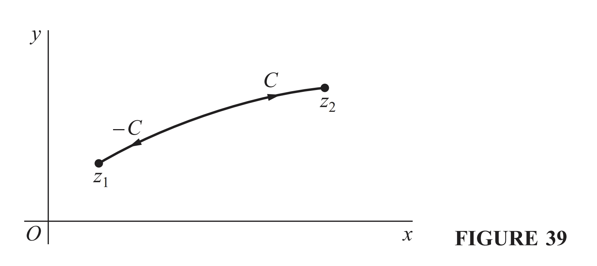
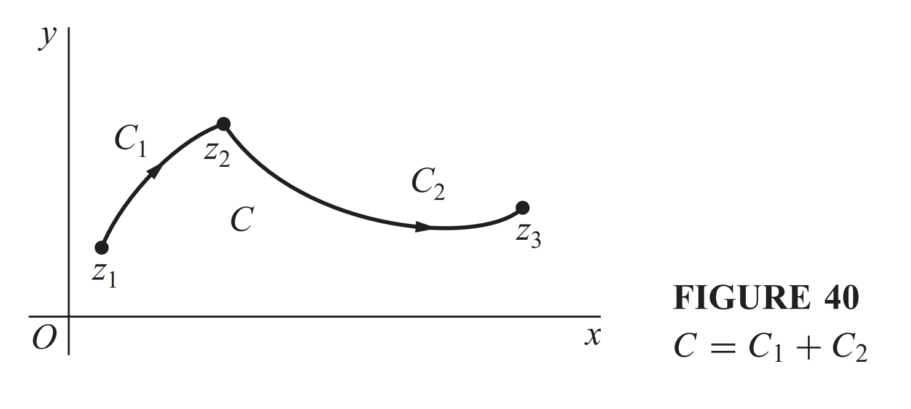

# FDU 高等线性代数 1. 复数与复方阵

本文根据邵美悦老师授课内容整理而成，并参考了以下资料:   
* [Properties of Complex Numbers](https://proofwiki.org/wiki/Properties_of_Complex_Numbers)
* Matrix Analysis (R. Horn & C. Johnson) Chapter $2\ \&\ 4$
* 矩阵分析 (R. Horn & C. Johnson) 第 $2,4$ 章
* Complex Variables and Applications (9th Edition, J. Brown & R. Churchill) Chapter $1\sim 4\ \& \ 6$
* 复变函数及其应用 (第 $9$ 版, J. Brown & R. Churchill) 第 $1\sim 4\ \& \ 6$ 章

欢迎批评指正!

## 1.1 复数

### 1.1.1 复数的实矩阵表示

在复数域 $\mathbb C=\{\alpha+\mathrm{i}\beta :\alpha,\beta \in \mathbb R\}$ 上，我们可以定义两种最基本的运算:

- 加法 $(\alpha_1+\mathrm{i}\beta_1)+(\alpha_2+\mathrm{i}\beta_2):=(\alpha_1+\alpha_2)+\mathrm{i}(\beta_1+\beta_2)$
- 乘法 $(\alpha_1+\mathrm{i}\beta_1)\times(\alpha_2+\mathrm{i}\beta_2) := (\alpha_1\alpha_2-\beta_1\beta_2) + \mathrm{i}(\alpha_1\beta_2+\alpha_2\beta_1)$   

根据这个定义我们自然有 $\mathrm{i}^2 =-1$.  
我们还可以用实矩阵来表示复数，定义映射 $\phi:\mathbb C \mapsto \mathbb R^{2\times 2}$ 为:  
$$
\phi(\alpha+\mathrm{i}\beta) := 
\begin{bmatrix} 
\alpha & -\beta \\
\beta & \alpha   
\end{bmatrix}
$$

可以验证这种表示方式满足:  

- 复数加法即矩阵加法: $\phi(\alpha_1 + \mathrm{i}\beta_1) + \phi(\alpha_2 + \mathrm{i}\beta_2) = \phi((\alpha_1 + \alpha_2) + \mathrm{i}(\beta_1 + \beta_2))$ 

- 复数乘法即矩阵乘法: $\phi(\alpha_1 + \mathrm{i}\beta_1)\times \phi(\alpha_2 + \mathrm{i}\beta_2) = \phi((\alpha_1\alpha_2 - \beta_1\beta_2) + \mathrm{i}(\alpha_1\beta_2 + \alpha_2 \beta_1))$ 

- 复数共轭即实矩阵转置: $\phi(\alpha-\mathrm{i}\beta) = \phi(\overline{\alpha - \mathrm{i}\beta})^\mathrm{T} = \phi(\alpha+\mathrm{i}\beta)^{\mathrm T} $ 

- 实表示矩阵的行列式值为复数模长的平方: $\det(\phi(\alpha+\mathrm{i}\beta)) = \alpha^2 + \beta^2 = |\alpha+\mathrm{i}\beta|^2$

- 实表示矩阵的特征值为一对共轭复数: $\text{eig}(\phi(\alpha+\mathrm{i}\beta)) = \alpha ± \mathrm{i}\beta$​   
  具体来说它具有谱分解: 
  $$
  \phi(\alpha + \mathrm{i}\beta) 
  = 
  \begin{bmatrix} 
  \alpha & -\beta \\
  \beta & \alpha   
  \end{bmatrix} 
  =
  \left(
  \frac1{\sqrt2}
  \begin{bmatrix}
  1 & -1\\
  \mathrm{i} & \mathrm{i}
  \end{bmatrix}
  \right)
  
  \begin{bmatrix}
  \alpha - \mathrm{i}\beta & \\
  & \alpha + \mathrm{i}\beta
  \end{bmatrix}
  
  \left(
  \frac1{\sqrt2}
  \begin{bmatrix}
  1 & -1\\
  \mathrm{i} & \mathrm{i}
  \end{bmatrix}
  \right)^{\mathrm H}
  $$

**复矩阵的实嵌入:**  
对于复矩阵 $A+\mathrm{i}B$ (其中 $A,B$ 为同形的实矩阵)，它可以类似地表示为:
$$
\phi(\alpha + \mathrm{i}\beta) = \begin{bmatrix}
A & -B \\ 
B & A 
\end{bmatrix}
$$

### 1.1.2 复数的运算性质

- **(加法, addition)**   
  对于任意 $x,y,z\in \mathbb C$ 我们有:  

  - 封闭 (closed): $x+y \in \mathbb C$ 

  - 可结合 (associative): $(x+y)+z = x + (y+z)$ 

  - 可交换 (commutative): $y + x = x + y$ 

  - 单位元 (identity): $0\in \mathbb C\ \text{such that }x + 0 = x$ 

  - 逆元 (inverse): $\exists \ (-x)\in \mathbb C\ \text{such that }x + (-x) = 0$ 

  这表明 $(\mathbb C,+)$ 是一个**无限 Abel 群 **(Infinite Abelian Group).  
  我们可以定义**减法**为 $x-y:= x+ (-y)$.

- **(乘法, multiplication)**   
  对于任意 $x,y,z\in \mathbb C$ 我们有:

  - 封闭: $x\times y \in \mathbb C$ 

  - 可结合: $(x\times y) \times z = x \times (y\times z)$ 

  - 可交换: $y\times x = x\times y$ 

  - 单位元: $1\in \mathbb C\ \text{such that }x\times 1 = x$ 

  - 逆元: 若 $x\neq 0$，则 $\exists\ (x^{-1}) = \bar{x}/{(x\bar{x})} \in \mathbb C\ \text{such that }x\times (x^{-1}) = 1$ 

  这表明 $(\mathbb C\backslash \{0\},\times)$ 是一个**无限 Abel 群**.  
  我们可以定义**除法**为 $x/y:= x\times (y^{-1}) = x\times\bar{y}/{(y\bar{y})}$ (其中 $y\neq 0$).

- **(复数乘法对复数加法满足分配律, Complex Multiplication Distributes over Addition)**    
  对于任意 $x,y,z\in \mathbb C$ 我们有:  
  $$
  \begin{cases} 
  x\times(y+z) = (x\times y) +(x\times z)\\ 
  (y + z)\times x = (y\times x) + (z \times x) 
  \end{cases}
  $$

  综上所述，设 $x,y,z$ 是复数，则我们有:
  $$
  \begin{cases}
  x+y = y+x\\
  (x+y) + z = x + (y+z)\\
  x+0 = 0+x =x\\
  x\times y=y\times x\\
  (x\times y)\times z = x\times (y\times z)\\
  x\times 1 = 1\times x = x\\
  x\times (y+z) = x\times y + x\times z\\
  (y+z)\times x = y\times x + z\times x\end{cases}
  $$
  这表明 $(\mathbb C,+,\times)$ 构成一个**交换环** (commutative ring).  
  注意: 如果我们删去乘法交换律 $x\times y = y\times x$，则只能知道复数集 $\mathbb C$ 构成一个**环** (ring).

- **(复数集构成一个域)**   
  设 $x,y,z$ 是复数，则我们有:
  $$
  \begin{cases}
  x+y = y+x\\
  (x+y) + z = x + (y+z)\\
  x+0 = 0+x =x\\
  x\times y=y\times x\\
  (x\times y)\times z = x\times (y\times z)\\
  x\times 1 = 1\times x = x\\
  x\times (y+z) = x\times y + x\times z\\
  (y+z)\times x = y\times x + z\times x\\
  \text{if }x\neq 0,\ \text{then }x\times x^{-1} = x^{-1}\times x = 1\end{cases}
  $$
  这表明 $(\mathbb C,+,\times)$ 构成一个**域** (field).  
  这保证了我们可以在复数域上使用一切规范的代数法则.

> 在复数域 $\mathbb{C}$ 上，无法像在实数域 $\mathbb{R}$ 那样定义一个兼容加法与乘法的偏序关系.  
> 例如，若假设 $\mathrm{i}>0$，则由乘法保持序性的假设可得 $-1 = \mathrm{i} \times \mathrm{i} > 0\times 0 = 0$.  
> 进而有 $-\mathrm{i} = -1 \times \mathrm{i}>0\times 0 = 0$，进而有 $0 = -\mathrm{i} + \mathrm{i} > 0 + 0 =0$，导出矛盾.

***

其他有用的运算性质:

-  **(共轭运算与复数的模)**  
  对于任意 $z_1,z_2\in \mathbb C$ 都有:  
  $$
  \overline{z_1 \pm z_2} = \bar z_1 \pm \bar z_2\\
  \overline{z_1z_2} = \bar z_1 \bar z_2\\
  z\bar z = |z|^2\\
  |z_1z_2|=|z_1||z_2|\\
  \overline{\left(\frac{z_1}{z_2}\right)} = \frac{\bar z_1}{\bar z_2}\ (z_2\neq 0)\\
  \left|\frac{z_1}{z_2}\right| = \frac{|z_1|}{|z_2|}\ (z_2\neq 0)
  $$
  
- **(三角不等式)**  
  对于任意 $z_1,z_2\in \mathbb C$ 都有:
  $$
  ||z_1|-|z_2||\leq |z_1+z_2|\leq |z_1| + |z_2|
  $$

- **(两个非零复数的乘积也不是零)**  
  若 $z_1z_2=0$，则 $z_1$ 和 $z_2$ 至少有一个是零.

  **证明:**   
  当 $z_1=0$ 时，结论成立.  
  当 $z_1\neq 0$ 时，可知逆元 $z_1^{-1}$ 存在，我们有 $z_2 =z_2(z_1z_1^{-1}) = z_1^{-1} (z_1z_2) = z_1^{-1}\cdot 0 =0$ 
  
- **(二项展开式)**  
  对于任意 $z_1,z_2\in \mathbb{C}^n$ 和 $n\in \mathbb{Z}_+$ 都有:
  $$
  (z_1+z_2)^n = \sum_{k=0}^n \binom{n}{k} z_1^k z_2^{n-k}
  $$
  
- 对于任意的 $n\ (n\geq 1)$ 次复多项式 $p(z)=a_0 + a_1z + \dotsm + a_nz^n\ (a_n\neq 0)$   
  都存在 $R>0$ 使得当 $|z|>R$ 时，有 $\left|\frac{1}{p(z)}\right|< \frac{2}{|a_n| R^n}$ 成立.

  **证明:**  
  显然存在足够大的正实数 $R>0$，  
  使得对于任意满足 $|z|>R$ 的 $z\in \mathbb R$ 都有 $|a_0 +a_1z + \dotsm + a_{n-1}z^{n-1}| \leq \frac12|a_n||z|^n$.   
  因此我们有:
  $$
  \begin{align}
  \left|\frac{1}{p(z)}\right| 
  &= \frac{1}{|p(z)|}\\
  &= \frac{1}{|a_0 + a_1 z + \dots + a_{n-1} z^{n-1} + a_n z^n|}\quad(\text{triangle inequality }|z_1-z_2|\geq ||z_1|-|z_2||)\\
  &\leq \frac{1}{||a_n| |z|^n - |a_0 +a_1z + \dotsm + a_{n-1}z^{n-1}||} \quad (\text{note that }|a_0 +a_1z + \dotsm + a_{n-1}z^{n-1}| \leq \frac12|a_n||z|^n)\\
  &\leq \frac{1}{|a_n||z|^n -\frac12|a_n||z|^n}\\
  &= \frac{2}{|a_n||z|^n}\\
  &< \frac{2}{|a_n| R^n}\quad (\text{note that }|z|>R)
  
  \end{align}
  $$

### 1.1.3 Euler 公式

**(Euler 公式)**  
对于任意 $\theta\in \mathbb R$ 我们有 $\mathrm{e}^{\mathrm{i}\theta} = \cos(\theta) + \mathrm{i}\sin(\theta)$ 成立.

- Euler 公式是数学中最为人称道的公式之一.  
  它揭示了复指数函数与三角函数之间的关系，  
  并且简洁地联系了五个基本数学常数 $0,1,\pi,\mathrm{e},\mathrm{i}$:
  $$
  \mathrm{e}^{\mathrm{i}\pi} + 1 = 0
  $$
  
- **证明:**
  $$
  \begin{align}
  \cos(\theta) 
  &= 
  \sum_{k=0}^\infty (-1)^k\frac{\theta^{2k}}{(2k)!}\\
  
  &=\frac{1}{0!} - \frac{\theta^2}{2!} + \frac{\theta^4}{4!} - \dotsm +(-1)^{k}\frac{\theta^{2k}}{(2k)!} + \dotsm\\
  
  \sin(\theta) 
  &=
  \sum_{k=0}^\infty (-1)^k\frac{\theta^{2k+1}}{(2k+1)!}\\
  
  &= \frac{\theta}{1!} - \frac{\theta^3}{3!} + \frac{\theta^5}{5!} - \dotsm +(-1)^{k}\frac{\theta^{2k+1}}{(2k+1)!} + \dotsm\\
  \hline
  \mathrm{e}^{\mathrm{i}\theta} 
  &=
  \sum_{n=0}^{\infty}\frac{(\mathrm{i}\theta)^n}{n!}\quad (\text{note that }\mathrm{e}^\theta = \sum_{n=0}^{\infty}\frac{\theta^n}{n!})\\
  &=
  \frac{1}{0!}+\frac{\mathrm{i}\theta}{1!}- \frac{\theta^2}{2!} -\frac{\mathrm{i}\theta^3}{3!}+ \frac{\theta^4}{4!}+\frac{\mathrm{i}\theta^5}{5!} - \dotsm +\frac{(\mathrm{i}\theta)^{n}}{n!} + \dotsm\\
  &=
  \sum_{k=0}^\infty (-1)^k \left[\frac{\theta^{2k}}{(2k)!} + \frac{\mathrm{i}\theta^{2k+1}}{(2k+1)!}\right]\\
  &=
  \sum_{k=0}^\infty (-1^k) \frac{\theta^{2k}}{(2k)!} + \mathrm{i}\sum_{k=0}^\infty (-1)^k \frac{\theta^{2k+1}}{(2k+1)!}\\
  &=
  \cos(\theta) + \mathrm{i}\sin(\theta)
  \end{align}
  $$

从 Euler 公式 $\mathrm{e}^{\mathrm{i}\theta} = \cos(\theta) + \mathrm{i}\sin(\theta)\ (\forall\ \theta\in \mathbb R)$ 可知:  
对于任意复数 $z=\alpha + \mathrm{i}\beta\in \mathbb C$ 我们都有:
$$
\mathrm{e}^{z} = \mathrm{e}^{\alpha + \mathrm{i}\beta} = \mathrm{e}^\alpha (\cos(\beta) + \mathrm{i}\sin(\beta))
$$

### 1.1.4 辐角主值公式

对于任意给定的复数 $z=\alpha+\mathrm{i}\beta\in \mathbb C$   
我们希望取 $\rho,\theta\in \mathbb R$ 使得:  
$$
z = \alpha + \mathrm{i}\beta = \rho \mathrm{e}^{\mathrm{i}\theta} = \rho(\cos(\theta)+\mathrm{i}\sin(\theta))
$$
通过解方程组 $\begin{cases}
\alpha = \rho \cos(\theta)\\
\beta = \rho \sin(\theta)\end{cases}$ 我们得到一组解:
$$
\rho = |\alpha + \mathrm{i}\beta| = \sqrt{\alpha^2 + \beta^2}\in [0,\infty)\\
\theta = 
\begin{cases}
\arctan (\beta/\alpha) - \pi\in (-\pi,-\pi/2) & \text{if }\alpha<0\text{ and }\beta<0\\
-\pi/2 & \text{if }\alpha=0\text{ and }\beta < 0\\
\arctan (\beta/\alpha) \in (-\pi/2, \pi/2) & \text{if }\alpha>0\\
\pi/2 & \text{if }\alpha = 0\text{ and }\beta > 0\\
\arctan (\beta/\alpha) + \pi \in (\pi/2, \pi] & \text{if }\alpha<0 \text{ and }\beta\geq 0\\
\text{undefined} & \text{if }\alpha = 0\text{ and }\beta =0\\
\end{cases}
$$
 于是**辐角主值公式**为:  
$$
z = \rho \mathrm{e}^{\mathrm{i}\theta}\ \text{where } \begin{cases}
\rho = |z| = \sqrt{(\text{Re}(z))^2 + (\text{Im}(z))^2}\in [0,\infty)\\
\theta = \arg(z) = 
\begin{cases}
\arctan (\text{Im}(z)/\text{Re}(z)) - \pi\in (-\pi,-\pi/2) & \text{if }\text{Re}(z)<0\text{ and }\text{Im}(z)<0\\
-\pi/2 & \text{if }\text{Re}(z)=0\text{ and }\text{Im}(z) < 0\\
\arctan (\text{Im}(z)/\text{Re}(z)) \in (-\pi/2, \pi/2) & \text{if }\text{Re}(z)>0\\
\pi/2 & \text{if }\text{Re}(z) = 0\text{ and }\text{Im}(z) > 0\\
\arctan (\text{Im}(z)/\text{Re}(z)) + \pi \in (\pi/2, \pi] & \text{if }\text{Re}(z)<0 \text{ and }\text{Im}(z)\geq 0\\
\text{undefined} & \text{if }\text{Re}(z) = 0\text{ and }\text{Im}(z) =0\\
\end{cases}\end{cases}
$$
其中 $\theta\in (-\pi,\pi]$ 称为 $z$ 的**辐角主值** (principal value of argument).  
这样我们就得到了复数的另一种表示方式: 
$$
z= \rho \mathrm{e}^{\mathrm{i}\theta}\in \mathbb C\ \text{where }\rho\geq 0,\theta\in (-\pi,\pi]
$$
对于任意 $\begin{cases}
z_1 = \rho_1 \mathrm{e}^{\mathrm{i}\theta_1} \in \mathbb C\\
z_2 = \rho_2 \mathrm{e}^{\mathrm{i}\theta_2} \in \mathbb C\end{cases}$ 我们都有 $z_1\times z_2 = \rho_1 \mathrm{e}^{\mathrm{i}\theta_1} \times \rho_2 \mathrm{e}^{\mathrm{i}\theta_2} = (\rho_1 \rho_2) \mathrm{e}^{\mathrm{i}(\theta_1 + \theta_2)}$   
这表明**复数乘法的几何意义是向量的旋转和伸缩变换**.

- 相应地，**复数加法的几何意义是向量加法**.  
  这很容易从复数的最基本的表示方式 $z = \alpha + \mathrm{i}\beta \in \mathbb C\ \text{where }\alpha,\beta\in \mathbb R$ 看出:    
  对于任意 $\begin{cases}
  z_1 = \alpha_1 + \mathrm{i}\beta_1 \in \mathbb C\\
  z_2 = \alpha_2 + \mathrm{i}\beta_2 \in \mathbb C\end{cases}$ 我们都有 $z_1+ z_2 = (\alpha_1 + \mathrm{i}\beta_1) + (\alpha_2 + \mathrm{i}\beta_2)
  = (\alpha_1 + \alpha_2) + \mathrm{i} (\beta_1 + \beta_2)$  

  **(三角不等式)**  
  根据向量加法的性质我们知道:  
  对于任意 $z_1,z_2\in \mathbb C$ 都有 $||z_1|-|z_2||\leq |z_1+z_2|\leq |z_1|+|z_2|$ 成立.

很多与复数有关的公式都能由 Euler 公式和辐角主值公式理解和证明，  
例如 De Moivre 定理 $(\cos \theta + \mathrm{i} \sin \theta)^n = \cos(n\theta) + \mathrm{i} \sin(n\theta)$.
因此我们就不赘述相关公式了.

****

**利用复数证明平面几何问题——Napoleon 定理: **
在 Euclid 平面内，若由三角形 $\triangle ABC$ 的各边分别向外作正三角形 $\triangle BXC,\triangle CYA,\triangle AZB$，
那么由这三个正三角形的中心 (记为 $L,M,N$) 确定的三角形 $\triangle LMN$ 也是一个正三角形.

**证明:**   
记原点为 $O$.  
设 $\overrightarrow{OA},\overrightarrow{OB},\overrightarrow{OC}$ 对应的复数分别为 $a,b,c$，设 $\overrightarrow{OL},\overrightarrow{OM},\overrightarrow{ON}$ 对应的复数为 $z_1,z_2,z_3$.

- 注意到 $\overrightarrow{AM}$ 是 $\overrightarrow{AC}$ 数乘 $1/\sqrt{3}$ 并逆时针旋转 $\pi/6$ 得到的，于是我们有:
  $$
  z_2-a = \frac{1}{\sqrt{3}}\mathrm{e}^{\frac{\mathrm{i}\pi}{6}} (c-a)
  $$

- 注意到 $\overrightarrow{BN}$ 是 $\overrightarrow{BA}$ 数乘 $1/\sqrt{3}$ 并逆时针旋转 $\pi/6$ 得到的，于是我们有:
  $$
  z_3-b = \frac{1}{\sqrt{3}}\mathrm{e}^{\frac{\mathrm{i}\pi}{6}} (a-b)
  $$

- 注意到 $\overrightarrow{CL}$ 是 $\overrightarrow{CB}$ 数乘 $1/\sqrt{3}$ 并逆时针旋转 $\pi/6$ 得到的，于是我们有:
  $$
  z_1-c = \frac{1}{\sqrt{3}}\mathrm{e}^{\frac{\mathrm{i}\pi}{6}} (b-c)
  $$

记 $\omega =\exp(\mathrm{i}\pi/6)$ 则我们有:
$$
z_2-a = \frac1{\sqrt3}\omega (c-a)\\
z_3-b = \frac1{\sqrt3}\omega (a-b)\\
z_1-c = \frac1{\sqrt3}\omega (b-c)
$$
下面我们证明 $z_1-z_2 = \omega^2 (z_3-z_2)$:
$$
\begin{align}
&\omega^2 (z_3-z_2) - (z_1-z_2)\\
&=
\omega^2 \left[b + \frac1{\sqrt3}\omega(a-b) - a - \frac1{\sqrt 3}\omega (c-a)\right] - \left[c + \frac1{\sqrt3}\omega(b-c) -a -\frac1{\sqrt3}\omega(c-a)\right]\\
&=
\left(-\frac{1}{\sqrt3}\omega^3 -1 +\frac{1}{\sqrt3}\omega+ \frac1{\sqrt3}\omega\right) c 
+
\left(\omega^2 - \frac1{\sqrt3}\omega^3  - \frac1{\sqrt3}\omega\right)b + \left(\frac1{\sqrt 3}\omega^3-\omega^2 + \frac1{\sqrt3}\omega^3 + 1 - \frac1{\sqrt3}\omega\right)a\\
&=
0\cdot c + 0\cdot b + 0\cdot a\quad (\text{note that }\omega = \frac{\sqrt3}2 + \frac12 \mathrm{i},\ \omega^2=\frac12+\frac{\sqrt3}{2}\mathrm{i},\ \omega^3 = \mathrm{i})\\
&=
0
\end{align}
$$
这表明 $\overrightarrow{LM}$ 是 $\overrightarrow{MN}$ 逆时针旋转 $\pi/6$ 得到的，因此 $\triangle LMN$ 是一个正三角形.

### 1.1.5 复数的根

- 两个非零复数 $z_1=\rho_1 \mathrm{e}^{\mathrm{i}\theta_1}$ 和 $z_2=\rho_2\mathrm{e}^{\mathrm{i}\theta_2}$ 相等，当且仅当 $\begin{cases}\rho_1 = \rho_2\\
  \theta_1 = \theta_2 + 2k\pi\text{ for some }k\in \mathbb Z
  \end{cases}$

- 非零复数 $z=\rho \mathrm{e}^{\mathrm{i}\theta}$ 的 $n\ (n\in \mathbb Z)$ 次幂的表达式为 $z^n = \rho^n \mathrm{e}^{\mathrm{i}n\theta}$   

因此非零复数 $z_0=\rho_0 \mathrm{e}^{\mathrm{i}\theta_0}$ 的 $n=2,3,\dots$ 次方根 $z=\rho \mathrm{e}^{\mathrm{i}\theta}$ 一定满足:
$$
z^n = \rho^n \mathrm{e}^{\mathrm{i}n\theta}=\rho_0 \mathrm{e}^{\mathrm{i}\theta_0}=z_0
$$
于是我们有:
$$
\rho^n = \rho_0\\
n\theta = \theta_0 + 2k\pi\text{ for some }k\in \mathbb Z
$$
因此我们有 $\begin{cases}
\rho = \sqrt[n]{\rho_0}\\
\theta = \frac{\theta_0 + 2k\pi}{n}\ \ (k\in \mathbb Z)\end{cases}$ (其中 $\sqrt[n]{\rho_0}$ 代表正实数 $\rho_0$ 唯一的正 $n$ 次方根)  
这表明 $z=\sqrt[n]{\rho_0}\exp\{\mathrm{i} (\frac{\theta_0 + 2k\pi}{n})\}\ (k\in \mathbb Z)$ 就是 $z_0$ 的 $n$ 次方根.  
它们都落在圆周 $|z|=\sqrt[n]{\rho_0}$ 上，以 $\theta_0/n$ 为起始辐角，相邻两根之间的角度间隔为 $2\pi/n$.

我们记其中 $n$ 个不同的根为:
$$
r_k=\sqrt[n]{\rho_0}\exp\left\{\mathrm{i} \left(\frac{\theta_0}{n} + \frac{2k\pi}{n}\right)\right\}\ (k = 0,1,\dots,n-1)
$$
记 $\omega_n = \exp(\mathrm{i}\frac{2\pi}{n})$ (代表逆时针旋转 $\frac{2\pi}{n}$)，则我们有:  
$$
r_k = \sqrt[n]{\rho_0}\exp(\mathrm{i} \frac{\theta_0}{n}) \omega^k_n = r_0 \omega_n^k\quad(k = 0,1,\dots,n-1)
$$
当然，其中的 $r_0$ 可以由 $z_0$ 的任意一个特殊的 $n$ 次方根代替.  

****

**(Complex Variables and Applications 第 $11$ 节, 例 $1$)**  
考虑求解 $-16$ 的 $4$ 个 $4$ 次方根.   
注意到 $-16$ 的辐角主值形式为 $-16 = 16 \mathrm{e}^{\mathrm{i}\pi}$，故对于任意 $k=0,1,2,3$ 我们有:
$$
\begin{align}
r_k 
&= \sqrt[4]{16}\exp\left\{\mathrm{i}\left(\frac{\pi}{4} + \frac{2k\pi}{4}\right)\right\} \\
&= 2\exp(\frac{\mathrm{i}\pi}{4}) \left(\exp(\frac{\mathrm{i}\pi}{2})\right)^k\\
&= \sqrt2(1+\mathrm{i}) \omega^k\quad (\text{denote }\omega :=\mathrm{e}^{\frac{\mathrm{i}\pi}{2}})
\end{align}
$$
因此其 $4$ 个不同的 $4$ 次方根为:
$$
\begin{align}
r_0 &= \sqrt{2}(1+\mathrm{i})\\
r_1 &= \sqrt{2}(1+\mathrm{i})\omega = \sqrt{2}(-1+\mathrm{i})\\
r_2 &= \sqrt{2}(1+\mathrm{i})\omega^2 = \sqrt{2}(-1-\mathrm{i})\\
r_3 &= \sqrt{2}(1-\mathrm{i})\omega^3 = \sqrt{2}(1-\mathrm{i})
\end{align}
$$

## 1.2 复变函数

### 1.2.1 Cauchy–Riemann 方程

设函数 $f(z) = u(x,y) + \mathrm{i} v(x,y)$ 在点 $z_0=(x_0,y_0)$ 处可导.  
我们将在得到两个在 $z_0$ 处的关于两个分量函数 $u,v$ 的一阶偏微分方程，并说明如何用这些偏导数表示 $f'(z_0)$.

我们记:  
$$
z_0 = x_0 + \mathrm{i} y_0\\
\Delta z = \Delta x + \mathrm{i} \Delta y\\
\Delta w = f(z_0+\Delta z) - f(z_0) = [u(x_0+\Delta x,y_0 + \Delta y) + \mathrm{i}v(x_0 + \Delta x,y_0 + \Delta y)]-[u(x_0,y_0)+ \mathrm{i}v(x_0,y_0)]
$$
于是我们有:  
$$
\frac{\Delta w}{\Delta z} = \frac{u(x_0+\Delta x,y_0 + \Delta y) - u(x_0,y_0)}{\Delta x+ \mathrm{i}\Delta y} + \mathrm{i} \frac{v(x_0+\Delta x,y_0 + \Delta y) - v(x_0,y_0)}{\Delta x + \mathrm{i}\Delta y}
$$
注意无论点 $(\Delta x,\Delta y)$ 以何种方式趋向于点 $(0,0)$，上式都成立.

- **水平逼近:**  
  令 $\Delta y=0$ 并令 $(\Delta x,0)$ 趋近于 $(0,0)$，我们有:  
  $$
  \begin{align}
  
  f'(z_0) 
  &= \underset{\Delta x\to 0}{\lim} \frac{u(x_0+\Delta x, y_0)-u(x_0,y_0)}{\Delta x} + 
  \mathrm{i} \lim_{\Delta x\to 0}\frac{v(x_0+\Delta x,y_0) - v(x_0,y_0)}{\Delta x}\\
  &= \frac{\partial}{\partial x}u(x_0,y_0) + \mathrm{i} \frac{\partial}{\partial x}v(x_0,y_0)\\
  &= u_x(x_0,y_0) + \mathrm{i}v_x(x_0,y_0)
  \end{align}
  $$

- **垂直逼近:**  
  令 $\Delta x=0$ 并令 $(0,\Delta y)$ 趋近于 $(0,0)$，我们有:    
  $$
  \begin{align}
  f'(z_0) 
  &= \underset{\Delta y\to 0}{\lim} \frac{u(x_0, y_0+\Delta y)-u(x_0,y_0)}{\mathrm{i}\Delta y} + 
  \mathrm{i} \lim_{\Delta y\to 0}\frac{v(x_0,y_0+\Delta y) - v(x_0,y_0)}{\mathrm{i}\Delta y}\\
  
  &= -\mathrm{i}\frac{\partial}{\partial y}u(x_0,y_0) +  \frac{\partial}{\partial y}v(x_0,y_0)\\
  
  &= v_y(x_0,y_0) - \mathrm{i} u_y(x_0,y_0)
  \end{align}
  $$

根据 $u_x(x_0,y_0) + \mathrm{i}v_x(x_0,y_0) = f'(z_0) = v_y(x_0,y_0) - \mathrm{i} u_y(x_0,y_0)$ 可得 $f'(z_0)$ 存在的必要条件为:  
$$
\begin{cases}
u_x(x_0,y_0) = v_y(x_0,y_0)\\
u_y(x_0,y_0) = - v_x(x_0,y_0)
\end{cases}
$$

***

**(可导的必要条件, Complex Variables and Applications 第 21 节)** 
设函数 $f(z) = u(x,y) + \mathrm{i} v(x,y)$ 在点 $z_0=(x_0,y_0)$ 处可导，  
则 $u,v$ 在 $(x_0,y_0)$ 处可偏导，且其一阶偏导数满足 **Cauchy–Riemann 方程**:  
$$
\begin{cases}
u_x(x_0,y_0) = v_y(x_0,y_0)\\
u_y(x_0,y_0) = - v_x(x_0,y_0)
\end{cases}
$$
此时导数 $f'(z_0) = u_x(x_0,y_0) + \mathrm{i} v_x(x_0,y_0)$.

***

不过函数 $f$ 在 $(x_0,y_0)$ 满足 Cauchy–Riemann 方程不能保证 $f$ 在该点处可导.  
但是加上一些连续性条件，我们就可以得到下面的重要定理:  
**(可导的充分条件, Complex Variables and Applications 第 $22$ 节)**  
若函数 $f(z) = u(x,y) + \mathrm{i}v(x,y)$ 在点 $z_0=(x_0,y_0)$ 的某个邻域内有定义，且满足:

- 函数 $u,v$ 在 $z_0=(x_0,y_0)$ 的该邻域内可偏导

- 函数 $u,v$ 的一阶偏导数在 $z_0=(x_0,y_0)$ 处连续且满足 **Cauchy–Riemann 方程**:   
  $$
  \begin{cases}
  u_x(x_0,y_0) = v_y(x_0,y_0)\\
  u_y(x_0,y_0) = - v_x(x_0,y_0)
  \end{cases}
  $$

则 $f$ 在 $z_0=(x_0,y_0)$ 处可导，且导数 $f'(z_0) = u_x(x_0,y_0) + \mathrm{i} v_x(x_0,y_0)$.

**(Complex Variables and Applications 第 $22$ 节 例 $1$)**  
考虑函数 $f(z)=\mathrm{e}^z = \mathrm{e}^x \mathrm{e}^{iy} = \mathrm{e}^x\cos(y) + \mathrm{i}\mathrm{e}^x \sin(y)$，这里 $\begin{cases}
u(x,y) = \mathrm{e}^x \cos(y)\\
v(x,y) = \mathrm{e}^x \sin(y)\end{cases}$   
$$
\begin{cases}
u_x(x,y) = \mathrm{e}^x\cos(y)\\
u_y(x,y) = -\mathrm{e}^x \sin(y)\\
v_x(x,y) = \mathrm{e}^x\sin(y)\\
v_y(x,y) = \mathrm{e}^x\cos(y)
\end{cases}
\ \Rightarrow\ 
\begin{cases} u_x(x,y) = v_y(x,y)\\
u_y(x,y) = - v_x(x,y)
\end{cases}\ (\forall\ (x,y)\in \mathbb R\times \mathbb R)
$$
这表明 $u,v$ 的一阶偏导数在复平面中的任意一点都连续且满足 Cauchy–Riemann 方程.  
因此 $f$ 在复平面上处处可导，且有 $f'(z) = u_x(x,y) + \mathrm{i}v_x(x,y) = \mathrm{e}^x\cos(y) + \mathrm{i}\mathrm{e}^x \sin(y)$ 

***

**(极坐标下可导的充分条件, Complex Variables and Applications 第 $24$ 节)**  
若函数 $f(z) = u(\rho,\theta) + \mathrm{i}v(\rho,\theta)$ 在非零点 $z_0=\rho_0 \mathrm{e}^{\mathrm{i}\theta_0}$ 的某个邻域内有定义，且满足:

- 函数 $u,v$ 在 $z_0=\rho_0 \mathrm{e}^{\mathrm{i}\theta_0}$ 的该邻域内可偏导

- 函数 $u,v$ 的一阶偏导数在 $(\rho_0,\theta_0)$ 处连续且满足**极坐标形式的 Cauchy–Riemann 方程**:   
  $$
  \begin{cases}
  \rho u_\rho(\rho_0,\theta_0) = v_\theta(\rho_0,\theta_0)\\
  u_\theta(\rho_0,\theta_0) = - \rho v_\rho(\rho_0,\theta_0)
  \end{cases}
  $$

则 $f$ 在 $z_0=\rho_0 \mathrm{e}^{\mathrm{i}\theta_0}$ 处可导，且导数 $f'(z_0) = \mathrm{e}^{-\mathrm{i}\theta}(u_\rho(\rho_0,\theta_0) + \mathrm{i} v_\rho(\rho_0,\theta_0))$.

***

**(全纯函数)**  
当 $f$ 仅依赖于 $z$，而不依赖于 $\bar{z}$ 时，就意味着它满足 ${\partial f}/{\partial \bar{z}}=0$ (Wirtinger 导数条件)  
若 $f$ 在某个开区域 (连通的非空开集) 上满足 Wirtinger 导数条件，  
则可以证明它在该开区域内处处可导，称为**全纯函数** (holomorphic function).

- 函数 $f(z)=z^2$ 在复平面上仅依赖于 $z$，因此它在复平面上处处可导. 
- 函数 $f(z)=|z|^2=z\bar{z}$ 仅在 $z=0$ 处不依赖于 $\bar{z}$，因此它只在 $z=0$ 处可导.

### 1.2.2 解析函数

若函数 $f$ 在开集 $S$ 上可展开为一个收敛的幂级数，则称它在 $S$ 上是**解析的** (analytic). 
如果我们说函数 $f$ 在一个非开集合 $S$ 内解析，则意味着 $f$ 在包含 $S$ 的某个开集内解析.    
在整个复平面内解析的函数称为**整函数** (entire function)，例如多项式函数.

**(Complex Variables and Applications 第 $57$ 节 定理 $1$)**   
若函数 $f$ 在一个给定的点的某个开邻域内处处可导，  
则它的任意阶导数也在该开邻域内处处可导.

- **推论 $1$:**   
  若函数 $f(z)=u(x,y) + \mathrm{i}v(x,y)$ 在点 $z_0=(x_0,y_0)$ 的某个开邻域内处处可导，  
  则它的实部和虚部函数 $u$ 和 $v$ 在点 $z_0=(x_0,y_0)$ 处都有任意阶的偏导数.

- **推论 $2$:**   
  根据定义可知解析函数一定是全纯函数，而根据上述定理可知全纯函数一定是解析函数.  
  因此解析函数和全纯函数的定义是等价的.

显然函数 $f$ 在 $\text{dom}(f)$ 上解析的必要条件是 $f$ 在 $\text{dom}(f)$ 上连续，  
且其分量函数的一阶偏导数满足 Cauchy–Riemann 方程.  
解析函数的和、差、积和商 (分母上的函数不为零) 也是解析函数.  
解析函数的复合函数也是解析函数，导数 $\frac{\mathrm{d}}{{\mathrm d}z}g(f(z)) = g'(f(z))f'(z)$.

若函数 $f$ 在 $z_0$ 处不解析但在 $z_0$ 的每一邻域内都有解析的点，则称 $z_0$ 为 $f$ 的**奇点** (singular point).  
例如 $z=0$ 就是 $f(z)= 1/z$ 的奇点.  
但 $f(z)=|z|^2$ 没有奇点，因为它仅在 $z=0$ 处可导，  
即 $z=0$ 的任何邻域内都不包含 $f$ 的解析点，所以它不存在奇点.

***

**(Schwarz 反射原理, Complex Variables and Applications 第 $29$ 节)**  
设开域 $D$ 包含一段 $x$ 轴且关于 $x$ 轴对称，函数 $f$ 在 $D$ 内解析，  
则当且仅当对于那段 $x$ 轴上的任意 $x$，函数值 $f(x)$ 是实数时，我们有 $\overline{f(z)}=f(\bar z)\ \ (\forall\ z\in D)$ 成立.

- 例如 $D$ 取整个复平面时，函数 $f(z)=z+1$ 和 $f(z)=z^2$ 满足 $\overline{f(z)}=f(\bar z)\ \ (\forall\ z\in \mathbb C)$   
  而函数 $f(z)=z+\mathrm{i}$ 和 $f(z)=\mathrm{i}z^2$ 不满足上述性质.

### 1.2.3 初等函数

**(指数函数)**  
$z=x+\mathrm{i}y$ 的指数定义为 $\mathrm{e}^z = \mathrm{e}^x \mathrm{e}^{\mathrm{i}y} = \mathrm{e}^x\cos(y) + \mathrm{i}\mathrm{e}^x \sin(y)$ (其中 $y$ 取弧度值)

- $\mathrm{e}^{z_1}\mathrm{e}^{z_2} = \mathrm{e}^{z_1+z_2}\ \ (\forall\ z_1,z_2\in \mathbb C)$ 
- $\mathrm{e}^{z_1}/\mathrm{e}^{z_2} = \mathrm{e}^{z_1-z_2}\ \ (\forall\ z_1,z_2\in \mathbb C)$
- $\frac{\mathrm{d}}{{\mathrm d}z}\mathrm{e}^z = \mathrm{e}^z\ \ (\forall\ z\in \mathbb C)$ 
- $\mathrm{e}^z$ 是一个以 $2\pi \mathrm{i}$ 为纯虚数周期的周期函数: $\begin{cases}
  \mathrm{e}^{\pi \mathrm{i}}=-1\\
  \mathrm{e}^{2\pi \mathrm{i}}=1\\
  \mathrm{e}^{z+2\pi \mathrm{i}}=\mathrm{e}^z\ (\forall\ z\in \mathbb z)\end{cases}$ 

**(对数函数)**  
$w=\log(z)$ 是方程 $\mathrm{e}^w=z\ (z\neq 0)$ 的解，  
我们可以延拓定义 $\log(z):= \log(|z|) + \mathrm{i}\arg(z)\ (\forall\ z\neq 0\in \mathbb C)$ 

- $\log(\mathrm{e}^z) = z + 2n\pi \mathrm{i}\ \ (n\in \mathbb Z)$ 
- $\log(z_1z_2) = \log(z_1)+\log(z_2)\ \ (\forall\ z_1,z_2\neq 0\in \mathbb C)$ 
- $\log(z_1/z_2) = \log(z_1)-\log(z_2)\ \ (\forall\ z_1,z_2\neq 0\in \mathbb C)$
- $\begin{cases}
  z^n = \mathrm{e}^{n\log(z)}\\
  z^{\frac1n} = \mathrm{e}^{\frac1n\log(z)}\end{cases}\ (\forall\ z\neq 0\in \mathbb C)$ 
- $\frac{\mathrm{d}}{{\mathrm d}z}\log(z)=\frac1z\ \ (|z|>0,0<\arg(z)<2\pi)$

**(幂函数)**  
当 $z\neq 0$ 且指数 $c$ 是任意复数时，我们定义幂函数 $z^c:= \mathrm{e}^{c\log(z)}$ 

- $\frac{\mathrm{d}}{{\mathrm d}z}z^c = cz^{c-1}\ \ (|z|>0,0<\arg(z)<2\pi)$ 
- $c^z = \mathrm{e}^{\log(c)z}$ 
- $\frac{\mathrm{d}}{{\mathrm d}z}c^z = c^z \log(c)$ 

**(三角函数)**    

- $\begin{cases}\sin(z) = \frac{1}{2\mathrm{i}} (\mathrm{e}^{\mathrm{i}z}-\mathrm{e}^{-\mathrm{i}z}) = \sin(x)\cosh(y) + \mathrm{i}\cos(x)\sinh(y)\\
  \cos(z) = \frac{1}{2} (\mathrm{e}^{\mathrm{i}z} + \mathrm{e}^{-\mathrm{i}z}) = \cos(x)\cosh(y) - \mathrm{i}\sin(x)\sinh(y)\end{cases}$

- $\begin{cases}
  \frac{\mathrm{d}}{{\mathrm d}z}\sin (z) = \cos(z)\\
  \frac{\mathrm{d}}{{\mathrm d}z}\cos(z) = -\sin(z)\end{cases}$

- 三角恒等式:  
  $$
  (\cos(z))^2 + (\sin(z))^2 = 1\\
  \sin(z_1+z_2) = \sin(z_1)\cos(z_2) + \cos(z_1)\sin(z_2)\\
  \cos(z_1+z_2) = \cos(z_1)\cos(z_2) - \sin(z_1)\sin(z_2)\\
  \sin(2z ) = 2\sin(z)\cos(z)\\
  \cos(2z) = (\cos(z))^2 - (\sin(z))^2\\
  \sin(z+\frac{\pi}{2}) = \cos(z)\\
  \sin(z-\frac{\pi}{2}) = -\cos(z)
  $$

- $\sin(z)=0$ 当且仅当 $z=n\pi\ (n\in \mathbb Z)$ (它们是 $\cot(z)$ 函数的奇点)  
  $\cos(z)=0$ 当且仅当 $z=n\pi +\frac{\pi}2\ (n\in \mathbb Z)$ (它们是 $\tan(z)$ 函数的奇点)

**(双曲函数)**

- $\begin{cases}
  \sinh(z) = \frac{1}{2}(\mathrm{e}^z-\mathrm{e}^{-z})\\
  \cosh(z) = \frac{1}{2}(\mathrm{e}^z + \mathrm{e}^{-z})\end{cases}$ (它们是以 $2\pi \mathrm{i}$ 为纯虚数周期的周期函数)

- $\begin{cases}
  \frac{\mathrm{d}}{{\mathrm d}z}\sinh (z) = \cosh(z)\\
  \frac{\mathrm{d}}{{\mathrm d}z}\cosh(z) = \sinh(z)\end{cases}$ 

- 双曲恒等式:  
  $$
  \sinh(-z) = -\sinh(z)\\
  \cosh(-z) = \cosh(z)\\
  (\cosh(z))^2 - (\sinh(z))^2 =1\\
  \sinh(z_1+z_2) = \sinh(z_1)\cosh(z_2) + \cosh(z_1)\sinh(z_2)\\
  \cosh(z_1+z_2) = \cosh(z_1)\cosh(z_2) + \sinh(z_1)\sinh(z_2)\\
  \sinh(z) = \sinh(x)\cos(y) + \mathrm{i}\cosh(x)\sin(y)\\
  \cosh(z) = \cosh(x)\cos(y) + \mathrm{i}\sinh(x)\sin(y)\\
  |\sinh(z)|^2 = (\sinh(x))^2 + (\sin(y))^2\\
  |\cosh(z)|^2 = (\sinh(x))^2 + (\cos(y))^2
  $$

### 1.2.4 定积分

考虑单实变量复值函数 $w(t) = u(t)+\mathrm{i}v(t)$ (其中 $t\in \mathbb R$ 且 $u,v$ 均为实值函数).  
若积分 $\int_a^b u(t){\mathrm d}t $ 和 $\int_a^b v(t){\mathrm d}t $ 都存在，则我们定义 $w(t)$ 在区间 $[a,b]$ 上的定积分为:  
$$
\int_a^b w(t){\mathrm d}t := \int_a^b u(t){\mathrm d}t  + \mathrm{i} \int_a^b v(t){\mathrm d}t
$$
也就是说，我们有: 
$$
\text{Re}\left(\int_a^b w(t){\mathrm d}t \right) = \int_a^b \text{Re}(w(t)){\mathrm d}t \\
\text{Im}\left(\int_a^b w(t){\mathrm d}t \right) = \int_a^b \text{Im}(w(t)){\mathrm d}t
$$
$w(t)$ 在无界区间上的广义积分可以类似的方式来定义.

- 若函数 $u,v$ 在区间 $[a,b]$ 上分段连续，则它们的积分 $\int_a^b u(t){\mathrm d}t $ 和 $\int_a^b v(t){\mathrm d}t $ 一定存在.  
  这样的函数在 $[a,b]$ 上除了可能的有限个点之外是处处连续的，  
  并且即使它在这些例外点处不连续，也会具有单边极限.  
  (当然，在区间 $[a,b]$ 的左端点 $a$ 处我们只要求 $u,v$ 有右极限，而在右端点 $b$ 处只要求有左极限)

  若函数 $u,v$ 在区间 $[a,b]$ 上分段连续，则我们称函数 $w$ 在 $[a,b]$ 上是分段连续的.

****

**(微积分基本原理的推广)**  
设单实变量复值函数 $w(t)=u(t)+\mathrm{i}v(t)$ 和 $W(t)=U(t)+\mathrm{i}V(t)$ 在 $[a,b]$ 上连续.  
若对于任意 $t\in [a,b]$ 都有 $\begin{cases}
W'(t) = w(t)\\
U'(t) = u(t)\\
V'(t) = v(t)\end{cases}$，则我们有:  
$$
\int_a^b w(t){\mathrm d}t  = W(b)-W(a) = W(t)|_{a}^b
$$

***

关于导数的 Lagrange 中值定理对单实变量复值函数是失效的.  
相应地，积分中值定理对单实变量复值函数也是失效的.   
因此在复分析中应用微积分中的法则需要特别小心.

### 1.2.5 围道积分

与单实变量复值函数不同，单复变量复值函数的积分定义在复平面的曲线上，而不只是定义在实轴的区间上.

我们称复平面内的一个点集 $\{z=(x,y)\}$ 为一条**弧** (arc)，  
如果 $x,y$ 可以表示为区间 $[a,b]$ 上关于实参变量 $t$ 的连续函数 $x(t)$ 和 $y(t)$.   
这个定义构建了区间 $[a,b]$ 到复平面的连续映射，且象点随着 $t$ 值的增长可以定向.  
后面我们用 $z=z(t)=x(t)+\mathrm{i}y(t)\ (a\leq t\leq b)$ 来表示这条弧.

若弧不自交 (即对于任意 $t_1\neq t_2$ 都有 $z(t_1)\neq z(t_2)$)，则我们称其为**简单弧** (simple arc).   
若除了 $z(b)=z(a)$ 以外，弧是简单的，则我们称其为一条**简单闭曲线** (simple closed curve).  
若 (当 $t$ 增加时) 这条曲线是逆时针方向的，则我们称其为**正向的** (positively oriented).

- 若 $z(t)=x(t)+\mathrm{i}y(t)$ 的实部和虚部在区间 $a\leq t\leq b$ 上 连续可导，  
  则我们称 $z=z(t)\ (a\leq t\leq b)$ 是**可微弧** (differentiable arc)，  
  并且实值函数 $|z'(t)| = |x'(t)+\mathrm{i}y'(t)|=\sqrt{[x'(t)]^2 + [y'(t)]^2}$ 在区间 $a\leq t\leq b$ 上是可积的.

  事实上，根据微积分中弧长的定义可知其弧长等于 $L:=\int_a^b |z'(t)|{\mathrm d}t $.

- 任意给定的弧 $C$ 所使用的参数表达式当然也不是唯一的.  
  事实上，将参数所在的区间变为任意的其他区间都是有可能的.  
  具体来说，假设 $t=\varphi(\tau)\ \ (\alpha\leq \tau \leq \beta)$，   
  其中 $\varphi$ 是一个将区间 $\alpha \leq \tau \leq \beta$ 映射到区间 $a\leq t\leq b$ 的实值函数.  
  我们假设 $\varphi$ 连续且具有连续的导数，且对于每个 $\alpha\leq \tau \leq \beta$ 都有 $\varphi'(\tau)>0$ (以保证 $t$ 是关于 $\tau$ 的增函数).  
  这样我们就可将弧 $C$ 表示为 $z=Z(\tau)\ \ (\alpha\leq \tau \leq \beta)$，  
  其中 $Z(\tau)=z(\varphi(\tau))$. 

  在上述变化下，弧长应具有 $L=\int_\alpha^\beta |Z'(\tau)|{\mathrm d}\tau = \int_\alpha^\beta |z'(\varphi(\tau))|\varphi'(\tau){\mathrm d}\tau$ 的形式.  
  可以证明我们仍可以得到相同的弧长.

- 若 $z=z(t)\ (a\leq t\leq b)$ 是可微弧，且在开区间 $a<t<b$ 内处处有 $z'(t)\neq 0$ 成立，  
  则对于开区间 $a<t<b$ 内的所有 $t$，  
  单位切向量 $T=\frac{z'(t)}{|z'(t)|}$ 都是有明确定义的，且倾角就等于 $\arg (z'(t))$.   
  我们称这样的弧是**光滑的** (smooth)

一条**围道** (contour)，或者说分段光滑的弧，是指由有限条光滑弧首尾连接而成的一条弧.  
因此，若 $z=z(t)\ (a\leq t\leq b)$ 是一条围道，那么 $z(t)$ 就是连续的，其导数 $z'(t)$ 就是分段连续的.  
一条围道或简单闭围道的长度是指构成这条围道的各个光滑弧的长度之和.

**(Jordan 曲线定理)**  
任何简单闭曲线或简单闭围道 $C$ 上的点都构成了两个不相交的开域的边界点  
其中一个是弧 $C$ 的内部，是有界的，另一个是弧 $C$ 的外部，是无界的.

****

现在我们转到关于复变量 $z$ 的复值函数 $f$ 的积分.  
它由 $f(z)$ 在复平面上给定的从 $z=z_1$ 到 $z=z_2$ 的围道 $C$ 上的取值来定义，因此是线积分. 
一般来说，积分值既取决于围道 $C$ 也取决于函数 $f$，记为 $\int_C f(z){\mathrm d}z$ 或 $\int_{z_1}^{z_2} f(z){\mathrm d}z$   
当积分值与固定端点 $z_1,z_2$ 之间的围道选择无关的时候，我们通常采用后一种表示方法.

- 和微积分中不同的是，除了一些特殊情况以外，  
  并没有辅助性的几何或物理的解释适用于复平面上的定积分.

设 $z=z(t)\ (a\leq t\leq b)$ 是一条从点 $z_1=z(a)$ 到点 $z_2=z(b)$ 的围道 $C$   
假设 $f(z(t))$ 在区间 $[a,b]$ 上分段连续，则此时我们也把函数 $f(z)$ 看作在围道 $C$ 上分段连续的函数.  
这样我们可以从参数 $t$ 的角度来定义 $f$ 沿围道 $C$ 的围道积分:
$$
\int_C f(z){\mathrm d}z:= \int_a^b f(z(t))z'(t){\mathrm d}t
$$

- 我们对 $z=z(t)\ (a\leq t\leq b)$ 进行之前介绍过的变换 $z=z(\varphi(\tau))\ \ (\alpha\leq \tau \leq \beta)$，积分值是不变的.

- 给定一条围道，我们规定 $-C$ 为与 $C$ 所构成的点集相同但是方向相反的那条围道.  
  换言之，若 $C$ 定义为 $z=z(t)\ (a\leq t\leq b)$，则 $-C$ 的定义为 $z=z(-t)\ (-b\leq t\leq -a)$  

  

- 若 $C_1$ 表示一条从 $z_1$ 到 $z_2$ 的围道，而 $C_2$ 表示一条从 $z_2$ 到 $z_3$ 的围道，  
  则我们称这两条围道顺次连接所得到的围道为它们的和，记为 $C:=C_1+C_2$ 

  

- 若两条围道 $C_1,C_2$ 具有相同的中点，则 $C_1$ 和 $-C_2$ 的和就是有确切定义的，记为 $C:=C_1-C_2$ 

**围道积分的性质:**   
设 $f(z)$ 和 $g(z)$ 在所讨论的任意围道上都是分段连续的，则我们有:

- 对于任意给定复常数 $\alpha\in \mathbb C$，我们都有 $\int_C \alpha f(z){\mathrm d}z = \alpha \int_C f(z){\mathrm d}z$ 

- $\int_C [f(z)\pm g(z)]{\mathrm d}z = \int_C f(z){\mathrm d}z + \int_C g(z){\mathrm d}z$ 

- 记 $-C$ 为与 $C$ 所构成的点集相同但是方向相反的那条围道，则我们有: 
  $$
  \begin{align}
  \int_{-C} f(z){\mathrm d}z 
  &= \int_{-b}^{-a} f(z(-t)) \frac{\mathrm{d}}{{\mathrm d}z}z(-t){\mathrm d}t \\
  &= -\int_{-b}^{-a} f(z(-t)) z'(-t){\mathrm d}t \\
  &= -\int_b^a f(z(\tau)) z'(\tau)\cdot-{\mathrm d}\tau\quad (\text{denote }\tau = -t)\\
  &= -\int_a^b f(z(\tau))z'(\tau){\mathrm d}\tau\\
  &= -\int_C f(z){\mathrm d}z
  \end{align}
  $$

- 设 $C_1$ 表示一条从 $z_1$ 到 $z_2$ 的围道，而 $C_2$ 表示一条从 $z_2$ 到 $z_3$ 的围道  
  记这两条围道顺次连接所得到的围道为 $C=C_1+C_2$，则我们有:  
  $$
  \int_{C_1+C_2} f(z){\mathrm d}z = \int_{C_1}f(z){\mathrm d}z + \int_{C_2}f(z){\mathrm d}z
  $$

***

**(Complex Variables and Applications 第 45 节 例 1)**  
设 $C_1$ 表示围道 $z = \mathrm{e}^{\mathrm{i}\theta}\ (0\leq \theta\leq \pi)$，即单位圆周 $|z|=1$ 从 $z=1$ 到 $z=-1$ 的上半部分.  
考虑围道积分 $\int_{C_1}\frac{1}{z}{\mathrm d}z$:  
$$
\begin{align}
\int_{C_1}\frac{1}{z}{\mathrm d}z
&=
\int_0^\pi \frac{1}{\mathrm{e}^{\mathrm{i}\theta}} i\mathrm{e}^{\mathrm{i}\theta} {\mathrm d}\theta\\
&=
\mathrm{i}\int_0^\pi {\mathrm d}\theta\\
&=
\pi \mathrm{i}
\end{align}
$$

设 $C_2$ 表示单位圆周 $|z|=1$ 从 $z=1$ 到 $z=-1$ 的下半部分.  
为此，我们使用 $-C_2$ 的参数表达式围道 $z = \mathrm{e}^{\mathrm{i}\theta}\ (\pi\leq \theta\leq 2\pi)$   
考虑围道积分 $\int_{C_2}\frac{1}{z}{\mathrm d}z$:
$$
\begin{align}
\int_{C_2}\frac{1}{z}{\mathrm d}z
&= -\int_{-C_2}\frac{1}{z}{\mathrm d}z\\
&=
-\int_\pi^{2\pi} \frac{1}{\mathrm{e}^{\mathrm{i}\theta}} i\mathrm{e}^{\mathrm{i}\theta} {\mathrm d}\theta\\
&=
-\mathrm{i}\int_\pi^{2\pi} {\mathrm d}\theta\\
&=
-\pi \mathrm{i}
\end{align}
$$
现在用 $C$ 表示闭曲线 $C=C_1-C_2$ (它代表正向单位圆周，即圆周 $|z|=1$ 逆时针方向的围道)  
考虑围道积分 $\int_{C}\frac{1}{z}{\mathrm d}z$: 
$$
\begin{align}
\int_C \frac{1}{z}{\mathrm d}z 
&=
\int_{C_1} \frac{1}{z}{\mathrm d}z + \int_{-C_2}\frac1z {\mathrm d}z\\
&=
\int_{C_1} \frac{1}{z}{\mathrm d}z - \int_{C_2}\frac1z {\mathrm d}z\\
&=
\pi \mathrm{i}- (-\pi \mathrm{i})\\
&=
2\pi \mathrm{i}
\end{align}
$$

***

**(Complex Variables and Applications 第 45 节 例 2)**  
令 $C$ 表示任意一条从固定点 $z_1$ 到固定点 $z_2$ 的光滑弧 $z=z(t)\ (a\leq t\leq b)$   

考虑围道积分 $\int_{C}z{\mathrm d}z$:  
$$
\begin{align}
\int_C z{\mathrm d}z
&=
\int_a^b z(t)z'(t){\mathrm d}t \\
&=
\frac{1}{2}(z(t))^2{\Large|}_{a}^b \\
&=
\frac12((z(b))^2 - (z(a))^2)\\
&=
\frac12(z_2^2-z_1^2)
\end{align}
$$
这表明此积分值仅仅依赖于弧 $C$ 的端点 $z_1,z_2$ 有关，而与弧 $C$ 的选择无关，因此我们将上式记为:  
$$
\int_{z_1}^{z_2} z{\mathrm d}z = \frac12(z_2^2-z_1^2)
$$
由于围道 $C$ 是由有限条光滑弧 $C_k\ (k=1,\dots,n)$ 首尾顺次连接得到的，  
因此上式对不一定光滑的围道也是成立的.  
具体来说，设 $C_k$ 从 $z_k$ 延伸到 $z_{k+1}$，那么我们有:  
$$
\begin{align}
\int_C z{\mathrm d}z 
&=
\sum_{k=1}^n \int_{C_k} z{\mathrm d}z\\
&=
\sum_{k=1}^n \int_{z_k}^{z_{k+1}}z{\mathrm d}z\\
&=
\sum_{k=1}^n \frac12(z_{k+1}^2 - z_{k}^2)\\
&=
\frac12 (z^2_{n+1} - z_1^2)
\end{align}
$$
这个例子可以说明一个给定的函数沿着一条闭围道的积分可能等于零 (取 $z_1,z_{n+1}$ 使得 $z_{n+1}=\pm z_1$ 即可).

***

涉及**支割线** (branch cut) 的例子:  
围道积分的积分路径可以包含被积函数的支割线的点，我们举例说明这种情况.

**(Complex Variables and Applications 第 46 节 例 1)**   
设 $C$ 表示围道 $z = \mathrm{e}^{\mathrm{i}\theta}\ (0\leq \theta\leq \pi)$，即单位圆周 $|z|=1$ 从 $z=1$ 到 $z=-1$ 的上半部分.  
考虑多值函数 $z^\frac12$ 的分支:  
$$
f(z) = z^\frac12 = \exp(\frac12\log(z))\ \ (|z|>0,\ 0<\arg(z)<2\pi)
$$
它在围道的起点 $z=1$ 处没有定义.  
但由于被积函数 $f$ 在 $C$ 上分段连续，故积分 $\int_C f(z) {\mathrm d}z$ 是存在的.

- 事实上，由于 $f(z(\theta))z'(\theta)=(\mathrm{e}^{\mathrm{i}\theta})^\frac12 \mathrm{i}\mathrm{e}^{\mathrm{i}\theta} = \mathrm{i}\mathrm{e}^{\frac{3\mathrm{i}\theta}2}\ (0<\theta\leq \pi)$ 在 $\theta\to 0$ 时的极限是 $\mathrm{i}$.  
  故我们只需将 $f(z(\theta))z'(\theta)$ 在 $\theta=0$ 处的值定义为 $\mathrm{i}$ 即可使它在闭区间 $0\leq \theta\leq \pi$ 上连续.

现在考虑围道积分 $\int_C f(z) {\mathrm d}z$ 的计算:  
$$
\begin{align}
\int_C f(z) {\mathrm d}z
&=
\int_0^\pi f(z(\theta)) z'(\theta) {\mathrm d}\theta\\
&=
\int_0^\pi \mathrm{i}\mathrm{e}^{\frac{3\mathrm{i}\theta}{2}} {\mathrm d}\theta\\
&=
\mathrm{i}\cdot \frac{2}{3\mathrm{i}} \mathrm{e}^{\frac{3\mathrm{i}\theta}{2}}{\Large|}_0^\pi\\
&=
\frac23(\mathrm{e}^{\frac{3\mathrm{i}\pi}{2}} - \mathrm{e}^0)\\
&=
\frac23 (-\mathrm{i}-1)\\
&=
-\frac23(1+\mathrm{i})
\end{align}
$$

***

下面我们给出一个在各种应用中都非常重要的有关围道积分的不等式.  
**(Complex Variables and Applications 第 47 节 引理)**   
设 $w(t)$ 是一个在区间 $a\leq t\leq b$ 上分段连续的单实变量复值函数，则我们有:  
$$
\left|\int_a^b w(t){\mathrm d}t \right|\leq \int_a^b |w(t)|{\mathrm d}t 
$$
**(Complex Variables and Applications 第 47 节 定理)**   
设 $C$ 是一条弧长为 $L:= \int_a^b |z'(t)|{\mathrm d}t $ 的围道，单复变量复值函数 $f(z)$ 在 $C$ 上分段连续.  
设正实数 $M>0$ 是 $|f(z)|$ 在 $C$ 上的上界，即对于围道 $C$ 上的任意点 $z$ 都有 $|f(z)|\leq M$，则我们有: 
$$
\left|\int_C f(z) {\mathrm d}z \right|\leq ML
$$

- 值得注意的是，由于 $C$ 是一条围道 (即分段光滑的弧) 且 $f$ 在 $C$ 上分段连续，  
  故 $|f(z)|$ 在 $C$ 上总是上有界的，即正实数 $M>0$ 总是存在的.

  > 这是因为当 $f$ 在 $C$ 上连续时，实值函数 $|f(z(t))|$ 在闭区间 $a\leq t\leq b$ 上也是连续的，  
  > 而连续函数在闭区间上总能取到最大值.  
  > 当 $f$ 在 $C$ 上分段连续时，结果也是一样的.

### 1.2.6 原函数

虽然一般来说 $f(z)$ 从一个固定点 $z_1$ 到另一个固定点 $z_2$ 的围道积分与路径的选择有关，  
但的确有一些函数从 $z_1$ 到 $z_2$ 的积分与路径的选择无关.  
此外，沿闭合围道的积分值有时候等于零，但并不总是等于零.  
下面的定理可用来确定何时积分与路径无关，或者说何时沿闭合围道的积分为零.

**(Complex Variables and Applications 第 48 节 定理)**  
假设函数 $f(z)$ 在开域 $D$ 上连续，则下列命题相互等价:

- ① $f(z)$ 在 $D$ 内有原函数 $F(z)$，即满足 $F'(z)=f(z)\ (\forall\ z\in D)$ 的函数.

- ② $f(z)$ 沿着从固定点 $z_1$ 到固定点 $z_2$ 且包含在 $D$ 内的任意路径的积分都相同:  
  $$
  \int_{z_1}^{z_2}f(z){\mathrm d}z = F(z){\Large|}_{z_1}^{z_2} = F(z_2)-F(z_1)
  $$
  其中 $F(\cdot)$ 就是 ① 中的原函数.

- ③ $f(z)$ 沿着包含在 $D$ 内的任意闭合围道的积分都为零.

**注解:**

- 上述定理是微积分基本定理的推广，用它可以简化许多围道积分的计算.  
  值得注意的是，此定理是说对于一个给定的函数 $f(z)$ 来说，  
  这三个命题要么同时成立，要么同时不成立.
- 原函数必然是解析函数 (即在开域 $D$ 上处处可导).  
  此外，函数 $f(z)$ 的原函数除了相差一个常数外是唯一的.

***

下面我们引入几个例子来说明上述定理是如何应用的.

**(Complex Variables and Applications 第 48 节 例 2 & 3)**  
除原点外处处连续的函数 $f(z)=\frac{1}{z^2}$ 在除去原点的复平面区域 $\{z\in\mathbb C:|z|>0\}$ 内有原函数 $F(z)=-\frac1z$.   
设 $C$ 是 $\{z\in\mathbb C:|z|>0\}$ 内的任意闭合围道 (例如正向单位圆周 $z=\mathrm{e}^{\mathrm{i}\theta}\ (0\leq \theta\leq 2\pi)$) 都有 $\int_C \frac1{z^2} {\mathrm d}z=0$ 成立.

值得注意的是，函数 $f(z)=\frac1z$ 沿正向单位圆周 $z=\mathrm{e}^{\mathrm{i}\theta}\ (0\leq \theta\leq 2\pi)$ 的积分是不能用类似方法计算的.  
虽然 $\log(z)$ 的任意分支 $F(z)$ 的导函数都是 $\frac1z$，但 $F(z)$ 沿着它的支割线都是不可导的，甚至是没有定义的. 
这使得 $F(z)$ 在正向单位圆周与支割线的交点处是不可导的，  
因此正向单位圆周并不包含在满足 $F'(z) = \frac1z$ 的任何开域内，  
从而我们不能直接使用原函数.   
事实上，我们应使用两个不同的原函数的组合来计算 $f(z)=\frac1z$ 沿正向单位圆周 $C$ 的积分.  

设 $C$ 为正向单位圆周 $z=\mathrm{e}^{\mathrm{i}\theta}\ (0\leq \theta\leq 2\pi)$ 

- 设 $C_1$ 为圆周 $C$ 的右半部分 $z=\mathrm{e}^{\mathrm{i}\theta}\ \ (-\frac\pi2\leq \theta \leq \frac\pi 2)$   
  我们用对数函数的主值支 $\text{Log}(z)=\log(r) + \mathrm{i}\theta\ \ (r>0,-\pi<\theta<\pi)$ 作为 $\frac1z$ 的原函数计算 $\frac1z$ 沿 $C_1$ 的积分:  
  $$
  \begin{align}
  \int_{C_1} \frac{1}{z}{\mathrm d}z
  &=
  \int_{-\mathrm{i}}^\mathrm{i} \frac{1}{z}{\mathrm d}z\\
  &=
  \text{Log}(z){\Large|}_{-\mathrm{i}}^\mathrm{i}\\
  &=
  \text{Log}(\mathrm{i}) - \text{Log}(-\mathrm{i})\\
  &=
  \left(\log(1) + \mathrm{i}\frac{\pi}{2}\right) - \left(\log(1) - \mathrm{i}\frac{\pi}{2}\right)\\
  &=
  \pi \mathrm{i}
  \end{align}
  $$

- 设 $C_2$ 为圆周 $C$ 的左半部分 $z=\mathrm{e}^{\mathrm{i}\theta}\ \ (\frac\pi2\leq \theta \leq \frac{3\pi} 2)$.   
  我们用对数函数的分支 $\log(z)=\log(r) + \mathrm{i}\theta\ \ (r>0,0<\theta<2\pi)$ 作为 $\frac1z$ 的原函数计算 $\frac1z$ 沿 $C_2$ 的积分:  
  $$
  \begin{align}
  \int_{C_2} \frac{1}{z}{\mathrm d}z
  &=
  \int_{\mathrm{i}}^{-\mathrm{i}} \frac{1}{z}{\mathrm d}z\\
  &=
  \log(z){\Large|}_{\mathrm{i}}^{-\mathrm{i}}\\
  &=
  \log(-\mathrm{i}) - \log(\mathrm{i})\\
  &=
  \left(\log(1) + \mathrm{i}\frac{3\pi}{2}\right) - \left(\log(1) + \mathrm{i}\frac{\pi}{2}\right)\\
  &=
  \pi \mathrm{i}
  \end{align}
  $$

因此 $\frac1z$ 沿整个圆周 $C=C_1+C_2$ 的积分值:  
$$
\int_C \frac{1}{z}{\mathrm d}z = \int_{C_1}\frac1z{\mathrm d}z + \int_{C_2}\frac1z{\mathrm d}z = \pi \mathrm{i} + \pi \mathrm{i} = 2\pi \mathrm{i}
$$

### 1.2.7 Cauchy–Goursat 定理

设 $C$ 是一条正向 (即逆时针方向) 的简单闭围道 $z=z(t)\ \ (a\leq t\leq b)$，  
且函数 $f$ 在 $C$ 围成的闭区域 $\text{int}(C)\cup C$ 上解析.   
我们记 $\begin{cases}
f(z) = u(x,y) + \mathrm{i}v(x,y)\\
z(t) = x(t) + \mathrm{i}y(t)\end{cases}$ 则我们有:  
$$
\begin{align}
\oint_C f(z){\mathrm d}z 
&=
\int_a^b f(z(t))z'(t){\mathrm d}t \\
&=
\int_a^b [u(x(t),y(t)) + \mathrm{i}v(x(t),y(t))]\cdot[x'(t) + \mathrm{i}y'(t)]{\mathrm d}t \\
&=
\int_a^b [u(x(t),y(t)) x'(t) - v(x(t),y(t))y'(t)]{\mathrm d}t  + \mathrm{i}\int_a^b [v(x(t),y(t))x'(t) + u(x(t),y(t))y'(t)]{\mathrm d}t \\
&=
\oint_C \{u(x,y){\mathrm d}x-v(x,y){\mathrm d}y\} + \mathrm{i}\oint_C \{v(x,y){\mathrm d}x + u(x,y){\mathrm d}y\}
\end{align}
$$

- 事实上，上式对于任意围道 $C$ 和在 $C$ 上分段连续的函数 $f$ 来说也是成立的.  
  其实它也可以简单地将 $\int_C f(z){\mathrm d}z $ 中的 $f(z)$ 和 ${\mathrm d}z$ 分别替换为 $u+\mathrm{i}v$ 和 ${\mathrm d}x+\mathrm{i}{\mathrm d}y$ 得到:  
  $$
  \begin{align}
  \int_C f(z){\mathrm d}z 
  &=
  \int_C (u+\mathrm{i}v)({\mathrm d}x+\mathrm{i}{\mathrm d}y)\\
  &=
  \int_C \{u{\mathrm d}x - v{\mathrm d}y\} + \mathrm{i}\int_C \{v{\mathrm d}x + u{\mathrm d}y\}
  \end{align}
  $$

- 回忆微积分中的 **Green 公式**:  
  假设两个实值函数 $P(x,y)$ 和 $Q(x,y)$ 及其一阶偏导数都在由简单闭围道 $C$ 围成的闭区域 $\text{int}(C)\cup C$ 上连续，  
  则我们有 $\oint_C P{\mathrm d}x + Q{\mathrm d}y = \iint_{\text{int}(C)\cup C} (Q_x- P_y){\mathrm d}x{\mathrm d}y$ 成立.

  Green 公式可以帮助我们把某些线积分表达为二重积分的形式.
  
  > **(Complex Variables and Applications 第 57 节 定理 1)**   
  > 若函数 $f$ 在一个给定的点解析，则它的任意阶导数也在该点解析.
  >
  > - **推论:**   
  >   若函数 $f(z)=u(x,y) + \mathrm{i}v(x,y)$ 在点 $z_0=(x_0,y_0)$ 处解析，  
  >   则它的实部和虚部函数 $u$ 和 $v$ 在点 $z_0=(x_0,y_0)$ 处都有任意阶的偏导数.
  
  由于函数 $f$ 在 $C$ 围成的闭区域 $\text{int}(C)\cup C$ 上解析 (即处处可导)，故 $f$ 和 $f'$ 也在 $\text{int}(C)\cup C$ 上连续.  
  $u,v$ 的偏导数 $u_x,u_y,v_x,v_y$ 自然也在 $\text{int}(C)\cup C$ 上连续.  
  从而利用 Green 公式可知:  
  $$
  \begin{align}
  \oint_C f(z){\mathrm d}z 
  &=
  \oint_C \{u{\mathrm d}x - v{\mathrm d}y\} + \mathrm{i}\oint_C \{v{\mathrm d}x + u{\mathrm d}y\}\quad (\text{using Green's formula})\\
  &=
  \iint_{\text{int}(C)\cup C} (-v_x-u_y){\mathrm d}x{\mathrm d}y + \mathrm{i}\iint_{\text{int}(C)\cup C} (u_x-v_y) {\mathrm d}x{\mathrm d}y\quad (\text{use Cauchy–Riemann equation }\begin{cases}
  u_x = v_y\\
  u_y = -v_x\end{cases})\\
  &=
  \iint_{\text{int}(C)\cup C} 0\  {\mathrm d}x{\mathrm d}y + \mathrm{i}\iint_{\text{int}(C)\cup C} 0\  {\mathrm d}x{\mathrm d}y\\
  &=
  0
  \end{align}
  $$
  值得注意的是，一旦证明了此积分值等于零，那么围道 $C$ 的方向就不再重要了.  
  换言之，我们可以去除 $C$ 关于方向的假设，仅假设它为任意简单闭围道.

综上所述，我们有如下定理:  
**(Cauchy–Goursat 定理, Complex Variables and Applications 第 50 节)**  
若函数 $f$ 在由一条简单闭围道 $C$ 围成的闭区域 $\text{int}(C)\cup C$ 上解析，则我们有: 
$$
\oint_C f(z){\mathrm d}z = 0
$$

### 1.2.8 Cauchy 积分公式

现在我们给出单复变函数论的另一个基本结果.  
**(Cauchy 积分公式, Complex Variables and Applications 第 54 节)**  
设函数 $f$ 在由一条**正向** (即逆时针方向) 的简单闭围道 $C$ 围成的闭区域 $\text{int}(C)\cup C$ 上解析.  
若 $z_0$ 是 $C$ 内部的任意一点，则我们有:   
$$
f(z_0) = \frac{1}{2\pi \mathrm{i}} \oint_C \frac{f(z)}{z-z_0}{\mathrm d}z
$$

- Cauchy 积分公式告诉我们:  
  若函数 $f$ 在一条由简单闭围道 $C$ 围成的闭区域 $\text{int}(C)\cup C$ 上解析，  
  则 $f$ 在 $C$ 内部的取值完全由 $f$ 在 $C$ 上的取值所确定.

- 如果将 Cauchy 积分公式写成:  
  $$
  \oint_C \frac{f(z)}{z-z_0}{\mathrm d}z = 2\pi \mathrm{i} f(z_0)
  $$
  那么就可以根据 $f$ 在 $C$ 内部一点 $z_0$ 的取值 $f(z_0)$ 来计算它沿 (正向的) 简单闭围道 $C$ 的积分.

  **(Complex Variables and Applications 第 54 节 例 1)**  
  设 $C$ 为正向单位圆周 $z=\mathrm{e}^{\mathrm{i}\theta}\ (0\leq z\leq 2\pi)$，考虑计算围道积分 $\oint_C \frac{\cos(z)}{z(z^2+9)}{\mathrm d}z$   
  由于函数 $f(z)=\frac{\cos(z)}{z^2+9}$ 在 $C$ 及其内部解析，且原点 $z_0=0$ 在 $C$ 的内部，  
  故根据 Cauchy 积分公式可知:  
  $$
  \begin{align}
  \oint_C \frac{f(z)}{z-z_0}{\mathrm d}z
  &=
  \oint_C \frac{\cos(z)}{z(z^2+9)}{\mathrm d}z\quad (\text{note that }z_0=0)\\
  &=
  2\pi \mathrm{i} f(z_0)\qquad(\text{note that }f(z_0)=\frac{\cos(0)}{0^2+9}= \frac19)\\
  &=
  \frac{2\pi \mathrm{i}}{9}
  \end{align}
  $$

****

Cauchy 积分公式可以进行推广，从而给出 $f$ 在 $z_0$ 处的导数 $f^{(k)}(z_0)$​ 的积分表示.  
**(Cauchy 积分公式的推广, Complex Variables and Applications 第 55 节)**     
设函数 $f$ 在由一条**正向** (即逆时针方向) 的简单闭围道 $C$ 围成的闭区域 $\text{int}(C)\cup C$ 上解析.  
若 $z_0$ 是 $C$ 内部的任意一点，则我们有:   
$$
f^{(k)}(z_0) = \frac{k!}{2\pi \mathrm{i}} \oint_C \frac{f(z)}{(z-z_0)^{k+1}}{\mathrm d}z\ \ (k=0,1,\dots)
$$

- 如果将推广后的 Cauchy 积分公式写成:  
  $$
  \oint_C \frac{f(z)}{(z-z_0)^{k+1}}{\mathrm d}z = \frac{2\pi \mathrm{i}}{k!}f^{(k)} (z_0)\ \ (k=0,1,\dots)
  $$
  我们就可以用它来计算定积分.

  **(Complex Variables and Applications 第 55 节 例 1)**   
  设 $C$ 为正向单位圆周 $z=\mathrm{e}^{\mathrm{i}\theta}\ (0\leq z\leq 2\pi)$，考虑计算围道积分 $\oint_C \frac{\mathrm{e}^{2z}}{z^4}{\mathrm d}z$   
  由于函数 $f(z)=\mathrm{e}^{2z}$ 在 $C$ 及其内部解析，且原点 $z_0=0$ 在 $C$ 的内部，  
  故根据 Cauchy 积分公式可知:    
  $$
  \begin{align}
  \oint_C \frac{f(z)}{(z-z_0)^4}{\mathrm d}z
  &=
  \oint_C \frac{\mathrm{e}^{2z}}{z^4}{\mathrm d}z \qquad (\text{note that }z_0=0)\\
  &=
  \frac{2\pi \mathrm{i}}{3!} f^{(3)}(z_0)\quad(\text{note that }f^{(3)}(z_0)=2^3 \mathrm{e}^{0}= 8)\\
  &=
  \frac{8\pi \mathrm{i}}{3}
  \end{align}
  $$

****

推广的 Cauchy 积分公式有一些重要的推论.   

**(Complex Variables and Applications 第 57 节 定理 1)**   
若函数 $f$ 在一个给定的点解析，则它的任意阶导数也在该点解析.

- **推论:**   
  若函数 $f(z)=u(x,y) + \mathrm{i}v(x,y)$ 在点 $z_0=(x_0,y_0)$ 处解析，  
  则它的实部和虚部函数 $u$ 和 $v$ 在点 $z_0=(x_0,y_0)$ 处都有任意阶的偏导数.

**(Morera 定理, Complex Variables and Applications 第 57 节 定理 2)**  
设函数 $f$ 在开域 $D$ 上连续.  
若对于 $D$ 内的每一条闭围道 $C$ 都有 $\oint_C f(z){\mathrm d}z = 0$，则函数 $f$ 在开域 $D$ 上解析.

**(Cauchy 不等式, Complex Variables and Applications 第 57 节 定理 3)**  
设函数 $f$ 在以 $z_0$ 为圆心，$R$ 为半径的正向圆周 $C_{(z_0,R)}$ 及其内部解析.  
若 $M>0$ 表示实值函数 $|f(z)|$ 在 $C_{(z_0,R)}$ 上的最大值，则我们有:  
$$
|f^{(k)}(z_0)| \leq \frac{k!M}{R^k}\ \ (k=1,2,\dots)
$$

### 1.2.9 Liouville 定理

在整个复平面内解析的函数称为**整函数** (entire function)，例如多项式函数.

**(Liouville 定理, Complex Variables and Applications 第 58 节 定理 1)**  
若函数 $f$ 是复平面上的有界整函数，则它必定是复平面上的常数函数.

**证明:**  
根据 Cauchy 不等式可知，对于任意给定的 $z_0\in \mathbb C$ 和 $R>0$ 我们都有:  
$$
|f'(z_0)|\leq \frac{M_R}{R}
$$
其中 $M_R$ 表示实值函数 $|f(z)|$ 在以 $z_0$ 为圆心，$R$ 为半径的正向圆周 $C_{(z_0,R)}$ 上的最大值.

现固定 $z_0$.  
根据函数 $f$ 的有界性可知:  
存在常数 $M>M_R\geq R|f'(z_0)|$ 使得 $|f(z)|\leq M\ \ (\forall\ z\in \mathbb C)$.  
由于 $R$ 可以无限大，故 $|f'(z_0)|$ 必须是零，否则会产生矛盾.  
因此 $f'(z_0)=0$.

根据 $z_0\in \mathbb C$ 的任意性可知 $f'(z)=0\ (\forall\ z\in \mathbb C)$，表明 $f$ 是一个常数函数.

*****

**(代数基本定理, Complex Variables and Applications 第 58 节 定理 2)**   
任意的 $n\ (n\geq 1)$ 次复多项式 $P(z)=a_0 + a_1z + \dotsm + a_nz^n\ (a_n\neq 0)$ 都至少在复数域 $\mathbb C$ 上有一个零点.

**反证法证明:**  
假设 $P(z)$ 在复数域 $\mathbb C$ 上没有零点，即对于任意 $z\in \mathbb C$，$P(z)$ 都不等于零.  
注意到多项式函数 $P(z)$ 是一个整函数 (即在整个复平面上解析)  
故商式 $\frac{1}{P(z)}$ 也是整函数.

下面证明 $\frac{1}{P(z)}$ 在复平面上有界:  

- 一方面，$\frac{1}{P(z)}$ 在闭圆盘 $|z|\leq R$ 内解析，因而连续，进而有界.

- 另一方面，存在足够大的正实数 $R>0$  
  使得对于任意满足 $|z|>R$ 的 $z\in \mathbb R$ 都有 $|a_0 +a_1z + \dotsm + a_{n-1}z^{n-1}| \leq \frac12|a_n||z|^n$   
  因此我们有:  
  $$
  \begin{align}
  \left|\frac{1}{P(z)}\right| 
  &= \frac{1}{|P(z)|}\\
  &= \frac{1}{|a_0 + a_1 z + \dots + a_{n-1} z^{n-1} + a_n z^n|}\quad(\text{triangle inequality }|z_1-z_2|\geq ||z_1|-|z_2||)\\
  &\leq \frac{1}{||a_n| |z|^n - |a_0 +a_1z + \dotsm + a_{n-1}z^{n-1}||} \quad (\text{note that }|a_0 +a_1z + \dotsm + a_{n-1}z^{n-1}| \leq \frac12|a_n||z|^n)\\
  &\leq \frac{1}{|a_n||z|^n -\frac12|a_n||z|^n}\\
  &= \frac{2}{|a_n||z|^n}\\
  &< \frac{2}{|a_n| R^n}\quad (\text{note that }|z|>R)
  
  \end{align}
  $$
  因此 $\frac{1}{P(z)}$ 在闭圆盘 $|z|\leq R$ 的外部是有界的.

综上所述，$\frac{1}{P(z)}$ 在复平面上有界且解析.  
根据 Liouville 定理可知 $\frac{1}{P(z)}$ 是常数函数，于是 $P(z)$ 是常数函数.  
这与我们 "$P(z)$ 为 $n\ (n\geq 1)$ 次复多项式" 的假设相矛盾.  
因此 $n\ (n\geq 1)$ 次复多项式 $P(z)$ 在复数域 $\mathbb C$ 上至少有一个零点.  
定理得证.

### 1.2.10 最大模原理

**(Complex Variables and Applications 第 59 节 引理)**  
若函数 $f$ 在 $z_0$ 的某开邻域内解析，且对该邻域内所有点 $z$ 都满足 $|f(z)|\leq |f(z_0)|$，  
则函数 $f$ 在此邻域内恒等于常数 $f(z_0)$. 

- 特殊地，若一个解析函数的模在某开域内恒为常数，则此函数本身也在该开域恒为常数.

**(最大模原理, Complex Variables and Applications 第 59 节 定理)**   
若函数 $f$ 在给定的开域 $D$ 内解析且不恒为常数，则 $|f(z)|$ 在 $D$ 内取不到最大值.  
也就是说，在 $D$ 中不存在点 $z_0$ 使得 $|f(z)|\leq |f(z_0)|\ \ (\forall\ z\in D)$ 

- **推论:**    
  设函数 $f$ 在给定的有界闭域 $D$ 上连续且在其内部解析.  
  若函数 $f$ 在 $D$ 上不是常数函数，则 $|f(z)|$ 能且仅能在 $D$ 的边界点上取到最大值.

### 1.2.11 Cauchy 留数定理

Cauchy–Goursat 定理指出，  
若函数 $f$ 在简单闭围道 $C$ 及其内部处处解析，则围道积分 $\oint_C f(z){\mathrm d}z = 0$.  
事实上，若函数 $f$ 在简单闭围道 $C$ 的内部的有限多个点处不解析，  
则对于这些例外点，都存在一个具体的数 (即留数)，利用这些点处的留数可以得到围道积分值.

***

若函数 $f$ 在点 $z_0$ 的某个邻域内处处可导，则称函数 $f$ 在点 $z_0$ 处解析.  
若函数 $f$ 在点 $z_0$ 处不解析，但在 $z_0$ 的任意邻域内都存在 $f$ 的解析点，  
则称 $z_0$ 为函数 $f$ 的**奇点** (singular point).

Cauchy 留数定理主要处理下述类型的特殊奇点:  
若 $f$ 在奇点 $z_0$ 的某个去心邻域内处处解析，  
则称奇点 $z_0$ 为**孤立奇点** (isolated singular point).

**(Complex Variables and Applications 第 74 节 例 1)**  
有理函数 $(z-1)/(z^5(z^2+9))$ 具有三个孤立奇点，分别是 $z=0,\pm 3\mathrm{i}$. 

一个重要的事实:  
若函数在简单闭围道 $C$ 的内部除了有限多个奇点以外处处解析，则这些奇点必定是孤立奇点.  
特殊地，有理函数 (即两个多项式函数的商) 的奇点总是孤立奇点，因为分母中的多项式函数仅有有限个零点.

***

若 $z_0$ 是函数 $f$ 的孤立奇点，则存在正数 $R>0$ 使得 $f$ 在 $0<|z-z_0|<R$ 中的任意一点 $z$ 处解析.  
因此函数 $f$ 关于 $z_0$ 的 Laurent 级数展开式为
$$
f(z) = \sum_{n=0}^\infty a_n (z-z_0)^n + \sum_{n=1}^\infty \frac{b_n}{(z-z_0)^n}\\
\begin{align}
a_n &= \frac1{2\pi \mathrm{i}}\oint_C \frac{f(z)}{(z-z_0)^{n+1}}{\mathrm d}z\quad\ \  (n=0,1,\dots)\\
b_n &= \frac1{2\pi \mathrm{i}}\oint_C \frac{f(z)}{(z-z_0)^{-n+1}}{\mathrm d}z\quad (n=1,2,\dots),
\end{align}
$$
其中 $C$ 为 $0<|z-z_0|<R$ 中任意围绕 $z_0$ 的简单正向闭围道.

特别地，$b_1$ 的表达式为  
$$
b_1 = \frac1{2\pi \mathrm{i}}\oint_C f(z){\mathrm d}z.
$$
我们称其为函数 $f$ 在孤立奇点 $z_0$ 处的**留数** (residue)，记为 $\underset{z=z_0}{\text{Res}} f(z)$，于是我们有
$$
\oint_C f(z){\mathrm d}z = 2\pi \mathrm{i}\cdot \underset{z=z_0}{\text{Res}} f(z).
$$
**(Complex Variables and Applications 第 75 节 例 3)**   
记 $C$ 为正向圆周 $|z-2|=1$，考虑积分 $\oint_C \frac{1}{z(z-2)^5}{\mathrm d}z$.  
由于被积函数在 $C$ 的内部除 $z=0,2$ 两点以外处处解析，  
故它在去心圆盘 $0<|z-2|<2$ 内具有 Laurent 级数展开式.

> 等比级数: $\frac1{1-z} = \sum_{n=0}^\infty z^n\ \ (|z|<1)$ 

我们有:  
$$
\begin{align}
\frac{1}{z(z-2)^5}
&=
\frac{1}{2(z-2)^5} \cdot \frac{1}{1-(-\frac{z-2}{2})}\\
&=
\frac{1}{2(z-2)^5} \sum_{n=0}^\infty \left(-\frac{z-2}{2}\right)^n\\
&=
\sum_{n=0}^\infty \frac{(-1)^n}{2^{n+1}} (z-2)^{n-5}
\end{align}\quad (0<|z-2|<2)
$$
其中 $\frac1{z-2}$ 的系数即所求留数，即:  
$$
\underset{z=2}{\text{Res}} \frac{1}{z(z-2)^5} =\frac{(-1)^4}{2^5}=\frac1{32}
$$
因此我们有:  
$$
\oint_C \frac{1}{z(z-2)^5}{\mathrm d}z = 2\pi \mathrm{i} \cdot \underset{z=2}{\text{Res}} \frac{1}{z(z-2)^5} = 2\pi \mathrm{i}\cdot \frac1{32} = \frac{\pi \mathrm{i}}{16}
$$

****

**(Cauchy 留数定理, Complex Variables and Applications 第 76 节 定理)**  
设 $C$ 为正向简单闭围道.  
若函数 $f$ 在 $C$ 及其内部除了有限多个奇点 $z_k\ (k=1,\dots,n)$ 以外处处解析 (自然是孤立奇点)  
则我们有
$$
\oint_C f(z){\mathrm d}z = 2\pi \mathrm{i}\sum_{k=1}^n \underset{z=z_k}{\text{Res}} f(z).
$$
即 $f$ 沿 $C$ 的积分值 $\oint_C f(z){\mathrm d}z$ 为其内部有限个奇点处的留数之和的 $2\pi \mathrm{i}$ 倍.

**(Complex Variables and Applications 第 76 节 例)**   
记 $C$ 为 $|z|=2$ 确定的正向圆周，考虑积分 $\oint_C \frac{4z-5}{z(z-1)}{\mathrm d}z$.  
被积函数具有两个孤立奇点 $z=0$ 和 $z=1$，且都位于 $C$ 的内部.

> 等比级数: $\frac1{1-z} = \sum_{n=0}^\infty z^n\ \ (|z|<1)$ 

- 计算 $z=0$ 处的留数:
  $$
  \begin{align}
  \frac{4z-5}{z(z-1)}
  &=
  \frac{5-4z}{z} \cdot \frac{1}{1-z}\\
  &=
  \left(\frac{5}{z}-4\right)\sum_{n=0}^\infty z^n\\
  &=
  \frac{5}{z} + \sum_{n=0}^\infty z^n\quad (0<|z|<1)
  \end{align}
  $$
  其中 $\frac1{z}$ 的系数即所求留数，即:
  $$
  \underset{z=0}{\text{Res}} \frac{4z-5}{z(z-1)} = 5
  $$
  
- 计算 $z=1$ 处的留数:  
  $$
  \begin{align}
  \frac{4z-5}{z(z-1)}
  &=
  \frac{4(z-1)-1}{z-1} \cdot \frac{1}{1+(z-1)}\\
  &=
  (4-\frac{1}{z-1}) \sum_{n=0}^\infty [-(z-1)]^n\\
  &=
  -\frac{1}{z-1} + \sum_{n=0}^\infty 5(-1)^n (z-1)^n\quad (0<|z-1|<1)
  \end{align}
  $$
  其中 $\frac1{z-1}$ 的系数即所求留数，即:
  $$
  \underset{z=1}{\text{Res}} \frac{4z-5}{z(z-1)} = -1
  $$

综上所述，我们有:
$$
\oint_C \frac{4z-5}{z(z-1)} {\mathrm d}z = 2\pi \mathrm{i} \left(\underset{z=0}{\text{Res}} \frac{4z-5}{z(z-1)} + \underset{z=1}{\text{Res}} \frac{4z-5}{z(z-1)}\right) = 2\pi \mathrm{i}(5+(-1)) = 8\pi \mathrm{i}
$$

****

下面的定理仅仅涉及一个留数，故运用起来有时比 Cauchy 留数定理更加方便:  
**(Complex Variables and Applications 第 77 节 定理)**     
若函数 $f$ 在有限平面上除了有限多个奇点以外处处解析，且这些奇点落在一条正向简单闭围道 $C$ 的内部，  
则我们有
$$
\oint_C f(z){\mathrm d}z = 2\pi \mathrm{i} \cdot \underset{z=0}{\text{Res}}\left\{\frac1{z^2} f\left(\frac1z\right)\right\}.
$$
**(Complex Variables and Applications 第 77 节 例)**    
记 $C$ 为 $|z|=3$ 确定的正向圆周，考虑 $f(z)=\frac{z^3(1-3z)}{(1+z)(1+2z^4)}$ 在 $C$ 上的积分.   
显然 $f(z)$ 的奇点都落在 $C$ 的内部.

下面计算 $\frac1{z^2}f(\frac1z)$ 在 $z=0$ 处的留数: 
$$
\begin{align}
\frac1{z^2}f\left(\frac1z\right)
&=
\frac{1}{z^2} \frac{(\frac1z)^3 (1-3\frac1z)}{(1+\frac1z)[1+2(\frac1z)^4]}\\
&=
\frac1z \cdot \frac{z-3}{(z+1)(z^4+2)}
\end{align}
$$
注意到 $g(z):=\frac{z-3}{(z+1)(z^4+2)}$ 在 $z=0$ 处解析，因而有关于 $z=0$ 的 Taylor 展开式:  
$$
g(z) =\frac{z-3}{(z+1)(z^4+2)} = \sum_{n=0}^\infty \frac{g^{(n)}(0)}{n!} z^n = -\frac32 + \sum_{n=1}^\infty \frac{g^{(n)}(0)}{n!} z^n
$$
于是我们有:  
$$
\begin{align}
\frac1{z^2}f(\frac1z)
&=
\frac1z \cdot \frac{z-3}{(z+1)(z^4+2)}\\
&= \frac{1}{z}\left(-\frac32 + \sum_{n=1}^\infty \frac{g^{(n)}(0)}{n!} z^n\right)\\
&=
-\frac32 \cdot \frac1z + \sum_{n=1}^\infty \frac{g^{(n)}(0)}{n!} z^{n-1}
\end{align}
$$
其中 $\frac1{z}$ 的系数即所求留数，即:
$$
\underset{z=0}{\text{Res}} \left\{\frac1{z^2}f\left(\frac1z\right)\right\} = -\frac32
$$
于是有:  
$$
\oint_C f(z){\mathrm d}z = \oint_C \frac{z^3(1-3z)}{(1+z)(1+2z^4)} {\mathrm d}z = 2\pi \mathrm{i} \cdot \underset{z=0}{\text{Res}} \frac1{z^2}f(\frac1z) = 2\pi \mathrm{i} \cdot (-\frac32) = -3\pi \mathrm{i} 
$$

## 1.3 Schur 分解

### 1.3.1 代数基本定理

我们想要知道:   
一元 $n$ 次复系数方程 $\lambda^n +a_{n-1}\lambda^{n-1}+...+a_1\lambda+a_0=0$ 在复数域 $\mathbb C$ 上一定可解吗?  
如果可解，有多少个解?

**代数基本定理** (fundamental theorem of algebra) 回答了这一系列问题:   

> **(Matrix Analysis 附录 C) & (Complex Variables and Applications 第 $58$ 节 定理 $2$)**   
> **任何一元 $n\ (n\geq 1)$ 次复系数方程组都至少在复数域 $\mathbb C$ 上有一个解.**

接下来，基于存在的这个复根，可以利用长除法 (多项式带余除法) 将原方程降一阶，变为一个 $n-1$ 次方程. 
而这个 $n-1$ 次方程又至少存在一个复根，因而可以继续降阶.  
这样的过程可以一直进行下去，直到找到 $n$ 个复根.   
因此我们可以推出: 

> **任何一元 $n\ (n\geq 1)$ 次复系数方程组在复数域 $\mathbb C$ 上都有且仅有 $n$ 个解 (按重数计算).**

由于求解 $n$ 阶复方阵 $A\in \mathbb C^{n\times n}$ 特征值的本质是求解一元 $n$ 次复系数方程 $\det(\lambda I-A)=0$  
故又能推出: 

> **任意** $n$ **阶复方阵都有且仅有** $n$ **个复特征值 (按重数计算).**

***

引入复数的一个历史原因是一元实系数方程可能在实数域 $\mathbb R$ 上没有解 (例如 $x^2+1 = 0$).  
幸运的是，任何一元实系数方程的所有解都包含在复数域 $\mathbb C$ 中.  
事实上，复数域 $\mathbb C$ 是一个**代数封闭的域** (algebraically closed field):    
不存在这样的域 $\mathbb F$，使得 $\mathbb C$ 是 $\mathbb F$ 的子域，且存在一个系数属于 $\mathbb C$ 的一元方程，它有一个解在 $\mathbb F$ 中但不在 $\mathbb C$ 中.

***

**(相似上三角化)**    
对于任意复方阵 $A\in \mathbb C^{n\times n}$ 都存在非奇异矩阵 $P\in \mathbb C^{n\times n}$，  
使得 $T:=P^{-1}A P$ 是以 $A$  的特征值为对角元的上三角阵.

- 值得说明的是，这个上三角阵 $T$ 的自由度相当高.  
  事实上，我们可以令其为 $A$ 的 Jordan 标准型.

**证明:**   
当 $n=1$ 时，命题显然成立.  
当 $n\geq 2$ 时，假设对于所有维数小于 $n$ 的复方阵，上述命题都成立.  
下面对 $n$ 维复方阵证明该命题.

设 $(\lambda_1,x_1)$ 是 $A\in \mathbb C^{n\times n}$ 的一个特征对，即满足 $A_1x_1=x_1\lambda_1$.  
将 $x_1$ 扩充为 $\mathbb{C}^n$ 的一组基 $x_1,v_2,\dots,v_n$，  
定义非奇异阵 $P_1:=[x_1,v_2,\dots,v_n]=[x_1,V]$，则我们有:  
$$
\begin{align}
AP_1
&= A[x_1,V]\\ 
&= [Ax_1, AV]\\
&= [x_1\lambda_1, AV]\\
&= [x_1,V]
[\lambda_1e_1, P_1^{-1}AV]\quad (\text{denote }P_1^{-1}AV = 
\begin{bmatrix}
*\\
A_2
\end{bmatrix}\in \mathbb{C}^{n\times (n-1)})\\
&= [x_1,V]
\begin{bmatrix}
\lambda_1 & *\\
& A_2
\end{bmatrix}\\
&=
P_1
\begin{bmatrix}
\lambda_1 & *\\
& A_2
\end{bmatrix}
\end{align}
$$
根据归纳假设可知，存在非奇异阵 $\widetilde P_2\in \mathbb{C}^{(n-1)\times (n-1)}$ 使得 $T_2 := \widetilde{P}_2^{-1}A_2 \widetilde{P}_2$ 为上三角阵.  
定义 $P_2 := 1 \oplus \widetilde P_2$ 和 $P=P_1P_2$ 可知:  
$$
\begin{align}
P^{-1}AP
&=
P_2^{-1}P_1^{-1} A P_1 P_2\\
&=
\begin{bmatrix}
1\\
& P_2^{-1}
\end{bmatrix}
\begin{bmatrix}
\lambda_1 & *\\
& A_2
\end{bmatrix}
\begin{bmatrix}
1\\
& P_2
\end{bmatrix}\\
&=
\begin{bmatrix}
\lambda_1 & *\\
& P_2^{-1}A_2P_2
\end{bmatrix}\\
&=
\begin{bmatrix}
\lambda_1 & *\\
& T_2
\end{bmatrix}
\end{align}
$$
因此 $T:= P^{-1}AP$ 为上三角阵.  
根据数学归纳法可知，对于任意 $A\in \mathbb{C}^{n\times n}$ 都存在非奇异矩阵 $P\in \mathbb C^{n\times n}$ 使得 $T:=P^{-1}A P$ 为上三角阵. 

考虑 $T$ 的特征多项式:
$$
\begin{align}
\det(\lambda I-T) 
&= \det(\lambda I - P^{-1}AP) \\
&= \det(P^{-1})\det(\lambda I - A) \det(P)\\ 
&= (\det(P))^{-1}\det(\lambda I - A) \det(P)\\ 
&= \det(\lambda I-A)
\end{align}
$$
因此 $T$ 的对角元即为 $A$ 的特征值.

### 1.3.2 酉相似变换

**(Matrix Analysis 定理 $2.1.2$)**  
$\mathbb C^n$ 中任意标准正交的向量组都是线性无关的.  
等价地，$\mathbb C^n$ 中任意由非零向量构成的正交向量组都是线性无关的.

**观察:**    

- 若 $\{x_1,\dots,x_k\}$ 是 $\mathbb C^n$ 中的正交向量组，则要么 $k\leq n$，要么其中至少有 $k-n$ 个是零向量.

- 任意线性无关组都能通过 Gram–Schmidt 方法标准正交化，  
  从而得到一组具有相同生成子空间的标准正交基.  
  易知 $\mathbb C^n$ 的任意非零子空间都有标准正交基.

**证明:**   
设 $\{x_1,\dots,x_k\}$ 是 $\mathbb C^n$ 中的一个标准正交的向量组，即满足:   
$$
x_i^{\mathrm H}  x_j = \begin{cases}
1 & \text{if }i=j\\
0 & \text{otherwise}\end{cases}
$$
**(反证法)** 假设 $\{x_1,\dots,x_k\}$ 线性相关，  
则存在不全为零的 $\alpha_1,\dots,\alpha_k \in \mathbb C$ 使得 $\alpha_1 x_1 + \dotsm + \alpha_k x_k = 0_n$   
因此我们有:  
$$
{\begin{align}
0 
&=
0_n^{\mathrm H}  0_n\\
&= (\alpha_1 x_1 + \dotsm + \alpha_k x_k)^{\mathrm H}  (\alpha_1 x_1 + \dotsm + \alpha_k x_k)\\
&= \sum_{i=1}^k \bar \alpha_i x_i^{\mathrm H} \cdot \alpha_i x_i + 
\sum_{i\neq j}^k \bar \alpha_i x_i^{\mathrm H}  \cdot \alpha_j x_j\\
&=
\sum_{i=1}^k |\alpha_i|^2 \cdot 1 + \sum_{i\neq j}^k \bar \alpha_i \alpha_j \cdot 0\\
&=
\sum_{i=1}^k |\alpha_i|^2
\end{align}}

\Rightarrow

\alpha_1 = \dotsm = \alpha_k = 0
$$
这与 "$\alpha_1,\dots,\alpha_k \in \mathbb C$ 不全为零" 相矛盾.  
因此 $\{x_1,\dots,x_k\}$ 线性无关，定理得证.

****

**(酉矩阵 Unitary Matrix)**  
若复方阵 $U\in \mathbb C^{n\times n}$ 满足 $U^{\mathrm H} U=I_n$ (列标准正交)，则称 $U$ 为酉矩阵.

酉矩阵有很多等价定义.  
**(Matrix Analysis 定理 $2.1.4$)**  
设 $U\in \mathbb C^{n\times n}$，则下列命题等价:  

- ① $U$ 非奇异，且逆矩阵 $U^{-1} = U^{\mathrm H} $ 
- ② $U^{\mathrm H} U=I_n$ (即列标准正交, 也即 $U$ 为酉矩阵)
- ③ $UU^{\mathrm H}  = I_n$ (即行标准正交, 也即 $U^{\mathrm H} $ 为酉矩阵)
- ④ 对于任意 $x\in \mathbb C^n$ 都有 $\|Ux\|_2 = \|x\|_2$ 成立 (即线性变换 $U$ 作用在 $x$ 上不改变其 Euclid 范数).  
  换言之，Euclid 范数 $\|\cdot\|_2$ 仅对酉矩阵具有不变性.

**一个有趣的观察:**  
酉矩阵 $U\in \mathbb C^{n\times n}$ 是上三角的，当且仅当它是对角矩阵.  

- 必要性显然成立，下证充分性:  
  根据 $U$ 是上三角的可知 $U^{-1}$ 是上三角的，而 $U^{\mathrm H} $ 是下三角阵.  
  由于 $U^{-1} = U^{\mathrm H} $，故 $U^{\mathrm H} $ 只能是对角阵，因而 $U$ 是对角阵.

**(Matrix Analysis 定理 $2.1.7$)**   
$\mathbb C^{n\times n}$ 中酉矩阵的全体构成的集合和矩阵乘法构成一个**群** (group):

- **封闭性:** 对于任意酉矩阵 $U_1,U_2\in \mathbb C^{n\times n}$，$U_1U_2\in \mathbb C^{n\times n}$ 也是酉矩阵
- **可结合:** 对于任意酉矩阵 $U_1,U_2,U_3\in \mathbb C^{n\times n}$ 我们有 $(U_1 U_2)U_3 = U_1(U_2U_3)$ 
- **单位元:** $I_n$ 是一个酉矩阵，且对于任意酉矩阵 $U\in \mathbb C^{n\times n}$ 都有 $UI_n = U$ 
- **逆元:** 对于任意酉矩阵 $U\in \mathbb C^{n\times n}$，$U^{\mathrm H} $ 都是一个酉矩阵，且满足 $UU^{\mathrm H}  = I_n$

值得注意的是，$n$ 阶酉矩阵的集合是 $\mathbb C^{n\times n}$ 的**闭子集**.  
也就是说，酉矩阵构成的序列如果收敛，则极限一定是一个酉矩阵.  
同时我们发现酉矩阵的所有元素的模长都小于等于 $1$，因此 $n$ 阶酉矩阵的集合是**有界的**.  
于是 $n$ 阶酉矩阵的集合是有限维空间 $\mathbb C^{n\times n}$ 的**有界闭子集**，因而是**紧集**.  
换言之，酉矩阵构成的序列一定存在收敛子列，这称为**酉矩阵的选择原理**.

***

若 $U\in \mathbb C^{n\times n}$ 是酉矩阵，则我们称 $A\mapsto U^{\mathrm H} AU$ 给出的变换是酉相似变换.  
**(酉相似 Unitary Similarity)**    
给定 $A,B \in \mathbb C^{n\times n}$，我们称 $A$ 酉相似于 $B$，  
当且仅当存在一个酉矩阵 $U\in \mathbb C^{n\times n}$ 使得 $B = U^{\mathrm H} AU$   

- 若 $A$ 酉相似于某个对角阵，则我们称 $A$ **可酉对角化** (unitarily diagonalizable)

**酉相似是一个等价关系:**    
设 $A,B,C\in \mathbb C^{n\times n}$

- 自反性: $A$ 酉相似于 $A$ 
- 对称性: 若 $A$ 酉相似于 $B$，则 $B$ 也酉相似于 $A$
- 传递性: 若 $A$ 酉相似于 $B$ 且 $B$ 酉相似于 $C$，则 $A$ 酉相似于 $C$

**(Matrix Analysis 定理 $2.2.2$)**  
设 $A,B\in \mathbb C^{m,n}$  
若酉矩阵 $U\in \mathbb C^{m\times m}$ 和 $V\in \mathbb C^{n\times n}$ 使得 $A=UBV$  
则我们有 $\|A\|_{\mathrm F} = \|B\|_{\mathrm F}$ 成立.

- 特别地，取 $m=n$ 和 $V=U^{\mathrm H} $ 可知 $\|U^{\mathrm H} AU\|_{\mathrm F} = \|A\|_{\mathrm F}$   
  也就是说，**Frobenius 范数 $\|\cdot\|_{\mathrm F}$ 具有酉不变性**.
  
- **证明:**  
  根据 Frobenius 范数 $\|\cdot\|_{\mathrm F}$ 的定义 $\|A\|_{\mathrm F} := \sqrt{\sum_{i,j=1}^n |a_{ij}|^2} = \sqrt{\tr(A^{\mathrm H} A)}$ 可知只需验证 $\tr(A^{\mathrm H} A) =\tr(B^{\mathrm H} B)$ 即可.  
  $$
  \begin{align}
  \tr(A^{\mathrm H} A)
  &=
  \tr((UBV)^{\mathrm H}  (UBV))\\
  &=
  \tr(V^{\mathrm H} B^{\mathrm H} U^{\mathrm H} UBV)\\
  &=
  \tr(V^{\mathrm H} B^{\mathrm H} BV)\\
  &=
  \tr(B^{\mathrm H} B VV^{\mathrm H} )\\
  &= 
  \tr(B^{\mathrm H} B)
  \end{align}
  $$
  

### 1.3.3 Schur 分解

初等矩阵论中最有用的事实之一:   
任何复方阵 $A$ 都酉相似于一个以 $A$ 的特征值作为对角元素 (按任意指定的次序排列) 的三角阵.  

**(Schur 分解定理, Matrix Analysis 定理 $2.3.1$)**  
设 $A=[a_{ij}]\in \mathbb C^{n\times n}$ 的特征值为 $\lambda_1,\dots,\lambda_n$ (按任意指定的次序排列).  
则存在一个酉矩阵 $U\in \mathbb C^{n\times n}$ 使得 $T:=U^{\mathrm H}  A U = [t_{ij}]$ 是以 $\lambda_1,\dots,\lambda_n$ 为对角元的上三角阵.

- 特殊地，若 $A\in \mathbb R^{n\times n}$ 且 $\lambda_1,\dots,\lambda_n$ 均为实数，  
  则存在一个实正交阵 $Q\in \mathbb R^{n\times n}$ 使得 $T:=Q^{\mathrm T}  A Q = [t_{ij}]$ 是以 $\lambda_1,\dots,\lambda_n$ 为对角元的上三角阵.
- 可以验证:   
  若 $T = U^{\mathrm H} A^{\mathrm T} U$ 是定理描述的与 $A^{\mathrm T} $ 酉相似的上三角阵，  
  取 $V=\bar U$ (此上标代表逐元素共轭; 可以证明 $V$ 也是一个酉矩阵)，  
  则 $V^{\mathrm H} A V = (\bar U)^{\mathrm H}  A \bar U = U^{\mathrm T}  A \bar U = (U^{\mathrm H} A^{\mathrm T} U)^{\mathrm T}  = T^{\mathrm T} $ 是一个下三角阵.  
  这表明 $A^{\mathrm T} $ 的 Schur 上三角分解和 $A$ 的 Schur 下三角分解是等价的.
- **(Matrix Analysis $2.4.5$ 节)**  
  即使固定对角元次序，Schur 分解得到的上三角阵 $T$ 也不一定是唯一的.   
  也就是说，具有相同主对角线的不同的上三角阵可能是酉相似的.
- **推论:** Hermite 矩阵 $A$ (即满足 $A^{\mathrm H} =A$) 可以酉对角化，且对角元的次序可以任意指定.  
  这是因为合同变换 $U^{\mathrm H} AU$ 保持共轭对称性 (酉相似变换自然是合同变换)，  
  故 Hermite 矩阵酉相似于一个具有共轭对称性的上三角阵，而它只能是对角阵.

**证明:**  
设 $x$ 为 $A$ 关于特征值 $\lambda_1$ 的单位特征向量，即满足 $\begin{cases}
Ax=x\lambda_1\\
\|x\|_2=1\end{cases}$   
任取一个第一列为 $x$ 的酉矩阵 $U_1 = [x,u_2,\dots,u_n]\in \mathbb C^{n\times n}$，则我们有:  
$$
\begin{align}
U_1^{\mathrm H}  A U_1 
&=
\begin{bmatrix}
x^{\mathrm H} \\
u_2^{\mathrm H} \\
\vdots\\
u_n^{\mathrm H} 
\end{bmatrix}
A
\begin{bmatrix}
x & u_2 & \dotsm & u_n
\end{bmatrix}\\

&=
\begin{bmatrix}
x^{\mathrm H} \\
u_2^{\mathrm H} \\
\vdots\\
u_n^{\mathrm H} 
\end{bmatrix}
\begin{bmatrix}
\lambda_1 x & Au_2 & \dotsm & Au_n
\end{bmatrix}\\

&=

\left[\begin{array}{c|cccc}
\lambda_1 x^{\mathrm H} x & x^{\mathrm H}  Au_2 & \dotsm & x^{\mathrm H}  Au_n\\
\hline
\lambda_1 x^{\mathrm H}  u_2 & u_2^{\mathrm H}  A u_2 & \dotsm & u_2^{\mathrm H}  A u_n\\
\vdots & \vdots & & \vdots\\
\lambda_1 x^{\mathrm H}  u_n & u_n^{\mathrm H}  A u_2 & \dotsm & u_n^{\mathrm H}  A u_n
\end{array}\right]\\

&=

\left[\begin{array}{c|cccc}
\lambda_1 & x^{\mathrm H}  Au_2 & \dotsm & x^{\mathrm H}  Au_n\\
\hline
0 &  &  & \\
\vdots & & A_{1}& \\
0 & &  & 
\end{array}\right]

\end{align}
$$

由于 $u_2,\dots,u_n$ 是标准正交的，  
故子矩阵 $A_1 = [u_i^{\mathrm H}  A u_j]_{i,j=2}^n = [u_2,\dots,u_n]^{\mathrm H}  A [u_2,\dots,u_n]$ 的特征值是 $\lambda_2,\dots,\lambda_n$ 

**(待补充: 这里要对 $A_1$ 与 $A$ 的特征值的关系进行分析)**  
对 $A_1$ 重新执行上述过程，  
可得到一个酉矩阵 $\widetilde U_2\in \mathbb C^{(n-1)\times (n-1)}$ 使得 $\widetilde U_2^{\mathrm H}  A_1 \widetilde U_2 = \begin{bmatrix}
\lambda_2 & *\\
0_{n-2} & A_2\end{bmatrix}$ (其中 $A_2$ 的特征值是 $\lambda_3,\dots,\lambda_n$)  
记 $U_2 = \begin{bmatrix}
1 & \\
& \widetilde U_2\end{bmatrix}\in \mathbb C^{n\times n}$ 则我们有:  
$$
\begin{align}
U_2^{\mathrm H} (U_1^{\mathrm H} A U_1) U_2 
&= 
U_2^{\mathrm H}  
\begin{bmatrix}
\lambda_1 & *\\
& A_1
\end{bmatrix} U_2\\

&=
\begin{bmatrix}
1 & \\
& \widetilde U_2\end{bmatrix}^{\mathrm T} 

\begin{bmatrix}
\lambda_1 & *\\
 & A_1
\end{bmatrix}

\begin{bmatrix}
1 & \\
& \widetilde U_2\end{bmatrix}
\\

&=
\begin{bmatrix}
\lambda_1 & *\\
& \widetilde U_2^{\mathrm T}  A_1 \widetilde U_2
\end{bmatrix}\\

&=
\left[
\begin{array}{c|cc}
\lambda_1 & * & *\\
\hline
 & \lambda_2 & *\\
 &  & A_2

\end{array}
\right]

\end{align}
$$
依此类推，我们最终得到 $n-1$ 个酉矩阵 $\{\widetilde U_i\}_{i=1}^{n-1}$ (其中 $\widetilde U_i \in \mathbb C^{(n-i+1)\times (n-i+1)}$)   
记 $U_1 = \widetilde U_1$ 和 $U_i = \begin{bmatrix}
I_{i-1} & \\
& \widetilde U_i\end{bmatrix}\ (i=2,\dots,n-1)$  
取 $U = U_1\dotsm U_{n-1}$ 即得 $A$ 的 **Schur 分解**: 
$$
U^{\mathrm H} AU = U_{n-1}^{\mathrm H}  \dotsm U_1^{\mathrm H}  A U_1\dotsm U_{n-1} = \begin{bmatrix}
\lambda_1 & * & \dotsm & * \\
& \lambda_2 & \ddots & \vdots\\
& & \ddots & *\\
&&&\lambda_n
\end{bmatrix} \overset{\Delta}= T
$$
定理得证.

****

**(Schur 分解定理的推论 1, Matrix Analysis 定理 $2.3.3$)** 
非空交换族 $\mathcal F\subseteq \mathbb C^{n\times n}$ 中的所有方阵可同时酉上三角化.   

**证明:**  
我们注意到三个事实:

- **① 相似变换能够保持交换性:**  
  若 $A,B\in \mathbb C^{n\times n}$ 可交换 (即 $AB=BA$)，则对于任意非奇异阵 $S\in \mathbb C^{n\times n}$ 我们都有:  
  $$
  \begin{align}
  (S^{-1}AS)(S^{-1}BS)
  &=
  S^{-1}ABS\quad (\text{note that }AB=BA)\\
  &=
  S^{-1}BAS\\
  &=
  (S^{-1}BS)(S^{-1}AS)
  \end{align}
  $$

- **② (Matrix Analysis 引理 $1.3.19$) 非空交换族 $\mathcal F\subseteq \mathbb C^{n\times n}$ 中的所有方阵一定存在公共特征向量:**   
  我们这里只证明这个结论的简单版本.  
  设 $A,B\in \mathbb C^{n\times n}$ 可交换 (即 $AB=BA$)，  
  且 $(\lambda,x)$ 为 $A$ 的一个特征对 (其中非零向量 $x\in \text{Ker}(A-\lambda I_n)$)，  
  则我们有:
  $$
  Ax = x\lambda\\
  \Rightarrow\\
  ABx = BAx = B(x\lambda)
  $$
  因此 $Bx$ 也是 $A$ 关于特征值 $\lambda$ 的特征向量，即 $Bx\in \text{Ker}(A-\lambda I_n)$  
  这表明 $\text{Ker}(A-\lambda I_n)$ 是线性变换 $B$ 的不变子空间.
  
  设 $\text{Ker}(A-\lambda I_n)$ 的维数是 $d$，一组基为 $v_1,\dots,v_d$  
  则 $Bv_1,\dots,B v_d$ 均能表示为基 $v_1,\dots,v_d$ 的线性组合:  
  $$
  B [v_1,\dots,v_d] = [v_1,\dots,v_d]C
  $$
  其中 $C\in \mathbb C^{d\times d}$ 是非奇异的系数矩阵.  
  设 $C$ 的 Schur 分解为 $C=U^{\mathrm H} TU$ (其中 $U\in \mathbb C^{d\times d}$ 是酉矩阵，而 $T\in \mathbb C^{n\times n}$ 是上三角阵)  
  则我们有:  
  $$
  B [v_1,\dots,v_d] = [v_1,\dots,v_d]C = [v_1,\dots,v_d] UTU^{\mathrm H} \\
  \Leftrightarrow\\
  B[v_1,\dots,v_d] U = [v_1,\dots,v_d] UT\\
  \Leftrightarrow\\
  B[q_1,\dots,q_d] = [q_1,\dots,q_d] T
  $$
  其中 $q_1,\dots,q_d$ 是不变子空间 $\text{Ker}(A-\lambda I_n)$ 的新的一组基.  
  记 $T$ 在 $(1,1)$ 位置上的元素为 $\mu$，则我们有 $Bq_1 = q_1 \mu$ 成立 ($\mu$ 就是 $B$ 的一个特征值)  
  注意到 $q_1\in \text{Ker}(A-\lambda I_n)$，故 $Aq_1 = q_1\lambda$  
  这样我们就找到了 $A,B$ 的公共特征向量 $q_1$
  
- **③ 若两个划分相同的 $2\times 2$ 分块上三角阵可交换，则其对角分块也可交换:**  
  若 $A = \begin{bmatrix}
  A_{11} & A_{12}\\
  0_{k\times k} & A_{22}\end{bmatrix}\in \mathbb C^{n\times n}$ 和 $B = \begin{bmatrix}
  B_{11} & B_{12}\\
  0_{k\times k} & B_{22}\end{bmatrix}\in \mathbb C^{n\times n}$ 可交换，则我们有:
  $$
  \begin{align}
  \begin{bmatrix}
  A_{11}B_{11} & A_{11}B_{12} + A_{12} B_{22}\\
  0_{k\times k} & A_{22}B_{22}\end{bmatrix}
  &=
  \begin{bmatrix}
  A_{11} & A_{12}\\
  0_{k\times k} & A_{22}\end{bmatrix}
  \begin{bmatrix}
  B_{11} & B_{12}\\
  0_{k\times k} & B_{22}\end{bmatrix}\\
  &=
  AB\\
  &=
  BA\\
  &=
  \begin{bmatrix}
  B_{11} & B_{12}\\
  0_{k\times k} & B_{22}\end{bmatrix}
  \begin{bmatrix}
  A_{11} & A_{12}\\
  0_{k\times k} & A_{22}\end{bmatrix}\\
  &=
  \begin{bmatrix}
  B_{11}A_{11} & B_{11}A_{12} + B_{12} A_{22}\\
  0_{k\times k} & B_{22}A_{22}\end{bmatrix}\\
  
  \hline
  \Rightarrow\ &\begin{cases}
  A_{11}B_{11} = B_{11}A_{11}\\
  A_{22}B_{22} = B_{22}A_{22}
  \end{cases}
  \end{align}
  $$

基于以上事实，回到 **Schur 分解定理**的证明，  
我们断言关于酉矩阵 $U\in \mathbb C^{n\times n}$ 的所有组成成分都可对非空交换族 $\mathcal F\subseteq \mathbb C^{n\times n}$ 中的所有方阵以同样的方式选取.  
因此它们可以同时酉上三角化.

****

**(Schur 分解定理的推论 2)**  
正规矩阵 $A\in \mathbb C^{n\times n}$ (满足 $A^{\mathrm H} A =AA^{\mathrm H} $, 即 $A$ 与 $A^{\mathrm H} $ 可交换) 可以酉对角化，且对角元的次序可以任意指定.

- 反过来，可酉对角化的矩阵 $A\in \mathbb C^{n\times n}$ 也一定是正规矩阵.  
  设 $A\in \mathbb C^{n\times n}$ 可酉对角化，酉对角化结果为 $A=U\Lambda U^{\mathrm H} $ (其中 $U\in \mathbb C^{n\times n}$ 为酉矩阵)  
  则我们有 $A^{\mathrm H} A = (U\Lambda U^{\mathrm H} )^{\mathrm H}  (U\Lambda U^{\mathrm H} ) = U\Lambda^{\mathrm H}  \Lambda U^{\mathrm H}  = U\Lambda \Lambda^{\mathrm H}  U^{\mathrm H}  = (U\Lambda U^{\mathrm H} ) (U\Lambda U^{\mathrm H} )^{\mathrm H}  = AA^{\mathrm H} $   
  表明 $A$ 是正规矩阵.

  **因此正规矩阵和可酉对角化的矩阵是等价的.**

- **证明:**  
  设 $A=[a_{ij}]\in \mathbb C^{n\times n}$ 的特征值为 $\lambda_1,\dots,\lambda_n$ (按任意指定的次序排列).   
  根据 **Schur 分解定理**可知:  
  存在一个酉矩阵 $U\in \mathbb C^{n\times n}$，使得 $U^{\mathrm H} AU =T$ 为以 $\lambda_1,\dots,\lambda_n$ 为对角元的上三角阵.

  将 $T$ 按任意指定的方式分块为 $T = \begin{bmatrix} T_{11} & T_{12}\\  & T_{22} \end{bmatrix}$   
  我们只要证明分块 $T_{12}$ 总是全零矩阵，就可推知 $T$ 为对角阵.
  $$
  A^{\mathrm H}  A = AA^{\mathrm H} \\
  \Leftrightarrow\\
  (UTU^{\mathrm H} )^{\mathrm H}  UTU^{\mathrm H}  = UTU^{\mathrm H} (UTU^{\mathrm H} )^{\mathrm H} \\
  \Leftrightarrow\\
  U T^{\mathrm H}  T U^{\mathrm H}  = U T T^{\mathrm H}  U^{\mathrm H} \\
  \Leftrightarrow\\
  T^{\mathrm H}  T = TT^{\mathrm H} \\
  \Leftrightarrow\\
  
  \begin{bmatrix} 
  T_{11}^{\mathrm H}  & \\ T_{12}^{\mathrm H} 
  & T_{22}^{\mathrm H}  
  \end{bmatrix} 
  \begin{bmatrix} 
  T_{11} & T_{12}\\ 
  & T_{22} \end{bmatrix}
  
  =
  \begin{bmatrix} 
  T_{11} & T_{12}\\ 
  & T_{22} \end{bmatrix} 
  \begin{bmatrix} 
  T_{11}^{\mathrm H}  & \\ T_{12}^{\mathrm H} 
  & T_{22}^{\mathrm H}  \end{bmatrix}
  $$
  根据 $(1,1)$ 分块的对应关系可知 $T_{11}^{\mathrm H}  T_{11} = T_{11}T_{11}^{\mathrm H}  + T_{12} T_{12}^{\mathrm H} $，于是我们有:  
  $$
  \tr(T_{11}^{\mathrm H}  T_{11}) = \tr(T_{11}T_{11}^{\mathrm H} ) + \tr(T_{12} T_{12}^{\mathrm H} )\\
  \Leftrightarrow\\
  \tr(T_{11}^{\mathrm H}  T_{11}) = \tr(T_{11}^{\mathrm H} T_{11}) + \tr(T_{12} T_{12}^{\mathrm H} )\\
  \Leftrightarrow\\
  0 = \tr(T_{12} T_{12}^{\mathrm H} )
  $$
  因此 $\|T_{12}\|_{\mathrm F} = \sqrt{\tr(T_{12} T_{12}^{\mathrm H} )} = 0$，表明 $T_{12}$ 是全零矩阵.  
  由于分块方式是任意的，故 $T$ 的严格上三角元都是零，表明 $T$ 是对角阵.  
  因此 $U^{\mathrm H} AU =T$ 是 $A$ 的酉对角化，命题得证.

***

事实上，对于**正规矩阵** (normal matrix) 我们有如下结果:   
**(Matrix Analysis 定理 $2.5.3$)**   
设 $A\in \mathbb C^{n\times n}$ 的特征值为 $\lambda_1,\dots,\lambda_n$，则下列命题等价:

- $A$ 是正规矩阵 (满足 $A^{\mathrm H} A =AA^{\mathrm H} $, 即 $A$ 与 $A^{\mathrm H} $ 可交换)
- $A$ 可酉对角化，即存在酉矩阵 $U\in \mathbb C^{n\times n}$ 使得 $U^{\mathrm H} AU = \Lambda = \text{diag}(\lambda_1,\dots,\lambda_n)$ 
- $\|A\|_{\mathrm F}^2 = \sum_{i=1}^n |\lambda_i|^2$ 
- $A$ 有 $n$ 个标准正交的特征向量

正规矩阵 $A\in \mathbb C^{n\times n}$ 的表示 $A = U\Lambda U^{\mathrm H} $ (其中 $U\in \mathbb C^{n\times n}$ 为酉矩阵) 称为 $A$ 的**谱分解**. 

****

正规矩阵可由谱分解的形式构造.  
几类特殊的正规矩阵:

- ① Hermite 矩阵 $A^{\mathrm H} =A$，其特征值均为实数
- ② 反 Hermite 矩阵 $A^{\mathrm H} =-A$，其特征值均为虚数.  
  (取 $B=iA$ 便可得到 Hermite 矩阵，因此我们很少对反 Hermite 矩阵单独研究)
- ③ 酉矩阵 $A^{\mathrm H} A=I_n$，其特征值的模长均为 $1$ (即落在复平面的单位圆周上)

**(待补充: 上述性质均可从 Rayleigh 商出发进行证明)**

反 Hermite 矩阵 $A$ 可由 **Cayley 变换** (Mobius 变换的特例) 化为酉矩阵 $B:= (I-A)(I+A)^{-1}$  
下面验证 $B:= (I-A)(I+A)^{-1}$ 为酉矩阵:
$$
\begin{align}
B^{\mathrm H} B 
&=
(I+A)^{-H}(I-A)^{H} (I-A) (I+A)^{-1}\quad (\text{note that }A^{\mathrm H} =-A)\\
&=
(I-A)^{-1}(I+A)(I-A) (I+A)^{-1}\quad (\text{note that }(I+A)(I-A)=I-A^2 = (I-A)(I+A))\\
&=
(I-A)^{-1}(I-A)(I+A) (I+A)^{-1}\\
&=
I
\end{align}
$$

****

现在我们转而讨论实的正规矩阵，它们当然可以通过酉相似变换对角化.  
但通过实正交相似变换可以得到何种特殊形式呢?

**(Matrix Analysis 引理 $2.5.7$)**  
若 $2$ 阶实方阵 $\begin{bmatrix}
a & b\\
c & d\end{bmatrix}\in \mathbb R^{2\times 2}$ 是正规的，且有一对共轭的非实特征值，  
则我们有 $a=d$ 和 $b=-c\neq 0$ 

**(Matrix Analysis 定理 $2.5.8$)**  
若 $A\in \mathbb R^{n\times n}$ 是正规的，则下列命题成立:

- ① 存在实正交阵 $Q\in \mathbb R^{n\times n}$ 使得 $Q^{\mathrm T} AQ$ 为拟对角阵，  
  每个对角块要么是 $1\times 1$ 的 (对应 $A$ 的一个实特征值)，  
  要么是 $2\times 2$ 的，且具有特殊形式 $\begin{bmatrix}
  a & b\\
  -b & a\end{bmatrix}\ (b>0)$ (对应 $A$ 的一对共轭复特征值 $a\pm ib$)    
  这些对角块由 $A$ 的特征值完全确定，但可以按照任意预先指定的次序出现.
- ② 两个 $n$ 阶实正规矩阵是实正交相似的，当且仅当它们具有完全相同的特征值.

**(Matrix Analysis 推论 $2.5.11$)**  
设 $A\in \mathbb R^{n\times n}$，则下列命题成立: 

- ① $A=A^{\mathrm T} $ 当且仅当存在一个实正交阵 $Q\in \mathbb R^{n\times n}$ 使得 $Q^{\mathrm T} AQ =\text{diag}\{\lambda_1,\dots,\lambda_n\}\in \mathbb R^{n\times n}$   
  其中 $\lambda_1,\dots,\lambda_n$ 为 $A$ 的 $n$ 个实特征值.  
  此外，两个 $n$ 阶实对称矩阵是实正交相似的，当且仅当它们具有完全相同的特征值.

- ② $A=-A^{\mathrm T} $ 当且仅当存在一个实正交阵 $Q\in \mathbb R^{n\times n}$ 和一个非负整数 $p\in \mathbb N$ 使得:  
  $$
  Q^{\mathrm T} AQ = \text{diag}(0_{n-2p})\oplus 
  b_1
  \begin{bmatrix}
  0 & 1\\
  -1 & 0
  \end{bmatrix} \oplus \dotsm \oplus 
  b_p
  \begin{bmatrix}
  0 & 1\\
  -1 & 0
  \end{bmatrix}\ (\text{where }b_1,\dots,b_p>0)
  $$
  其中 $\pm ib_1,\dots,\pm ib_p$ 为 $A$ 的 $p$ 对非零共轭复特征值.  
  此外，两个 $n$ 阶实反对称矩阵是实正交相似的，当且仅当它们具有完全相同的特征值.

- ③ $A^{\mathrm T} A=I_n$ 当且仅当存在一个实正交阵 $Q\in \mathbb R^{n\times n}$ 和一个非负整数 $p\in \mathbb N$ 使得:  
  $$
  Q^{\mathrm T} AQ = \text{diag}\{\lambda_1,\dots,\lambda_{n-2p}\}\oplus 
  \begin{bmatrix}
  \cos(\theta_1) & \sin(\theta_1)\\
  -\sin(\theta_1) & \cos(\theta_1)
  \end{bmatrix}
  \oplus
  \dotsm
  \oplus
  \begin{bmatrix}
  \cos(\theta_p) & \sin(\theta_p)\\
  -\sin(\theta_p) & \cos(\theta_p)
  \end{bmatrix}
  $$
  其中 $\lambda_1,\dots,\lambda_{n-2p}\in \{1,-1\}$，且 $\theta_1,\dots,\theta_p\in (0,\pi)$  
  $A$ 的特征值是 $\lambda_1,\dots,\lambda_{n-2p}\in \{1,-1\}$ 加上 $\mathrm{e}^{\pm \mathrm{i}\theta_1},\dots,\mathrm{e}^{\pm \mathrm{i}\theta_p}$   
  此外，两个 $n$ 阶实正交矩阵是实正交相似的，当且仅当它们具有完全相同的特征值.

### 1.3.4 实 Schur 分解

在 $1.2.3$ 节的注释中我们说过:  

> 若 $A\in \mathbb R^{n\times n}$ 且 $\lambda_1,\dots,\lambda_n$ 均为实数，  
> 则存在一个实正交阵 $Q\in \mathbb R^{n\times n}$ 使得 $T:=Q^{\mathrm T}  A Q = [t_{ij}]$ 是以 $\lambda_1,\dots,\lambda_n$ 为对角元的上三角阵.

但如果实方阵 $A\in \mathbb R^{n\times n}$ 存在复特征值，  
则显然我们无法通过实正交相似变换 $Q^{\mathrm T}  A Q $ 将它化简为以 $A$ 的特征值为对角元的三角阵   
(因为实数运算的结果不会是复数)  
幸运的是，我们总可以通过实正交相似变换将实方阵 $A\in \mathbb R^{n\times n}$ 化为一个实的拟三角阵，  
其对角块要么是 $1\times 1$ 的 (对应 $A$ 的实特征值)，要么是 $2\times 2$ 的 (对应 $A$ 的一对共轭的复特征值)

**(实 Schur 分解, Matrix Analysis 定理 $2.3.4$)**  
任意给定一个实方阵 $A\in \mathbb R^{n\times n}$  

- ① 存在一个实的非奇异阵 $S\in \mathbb R^{n\times n}$ 使得 $S^{-1}A S$ 是实的拟上三角阵 (对角块都是 $1\times 1$ 或 $2\times 2$ 的):  
  $$
  S^{-1}AS = 
  \begin{bmatrix}
  A_1 & * & \dotsm & *\\
  &A_2& \ddots & \vdots\\
  & & \ddots & * \\
  &&& A_p
  \end{bmatrix}
  $$

  - 它的 $1\times 1$ 对角块给出 $A$ 的实特征值
  - 它的 $2\times 2$ 对角块 $\begin{bmatrix}
    \alpha & -\beta\\
    \beta & \alpha\end{bmatrix}$ 给出 $A$ 的一对共轭的复特征值 $\alpha \pm \mathrm{i}\beta$ 
  - 它的对角块由 $A$ 的特征值完全确定，并且可以按照任意预先指定的次序出现.

- ② 存在一个实正交阵 $Q\in \mathbb R^{n\times n}$ 使得 $Q^{T}A Q$ 是实的拟上三角阵 (对角块都是 $1\times 1$ 或 $2\times 2$ 的):    
  $$
  Q^{\mathrm T} AQ = 
  \begin{bmatrix}
  A_1 & * & \dotsm & *\\
  &A_2& \ddots & \vdots\\
  & & \ddots & * \\
  &&& A_p
  \end{bmatrix}
  $$

  - 它的 $1\times 1$ 对角块给出 $A$ 的实特征值

  - 它的 $2\times 2$ 对角块不一定有特殊的形式 (但和形如 $\begin{bmatrix}
    \alpha & -\beta\\
    \beta & \alpha\end{bmatrix}$ 的矩阵相似) 给出 $A$ 的一对共轭的复特征值 $\alpha \pm \mathrm{i}\beta$ 

  - 它的对角块由 $A$ 的特征值完全确定，并且可以按照任意预先指定的次序出现.

## 1.4 Schur 分解定理的推论

### 1.4.1 Vieta 定理

> **(Vieta 定理, Matrix Analysis 定理 $1.2.16$)**  
> 设复方阵 $A\in \mathbb C^{n\times n}$ 的特征值为 $\lambda_1,\dots,\lambda_n$   
> 则 $\lambda_1,\dots,\lambda_n$ 的任意 $k=1,\dots,n$ 次初等对称多项式等于 $A$ 的所有 $k$ 阶主子式 (这样的主子阵一共有 $\binom{n}{k}$ 个) 之和:  
> $$
> \sum_{1\leq i_1<\dotsm <i_k \leq n} \lambda_{i_1}\dotsm \lambda_{i_k} = \sum_{1\leq i_1<\dotsm <i_k \leq n} \det(A_{i_1,\dots,i_k})
> $$
> 其中 $A_{i_1,\dots,i_k}$ 代表由 $A$ 的第 $i_1,\dots,i_k$ 行、列构成的 $k$ 阶主子阵.
>
> - 对于 $k=1$ 的情况: $\sum_{i=1}^n \lambda_i = \tr(A)$
> - 对于 $k=n-1$ 的情况: $\sum_{i=1}^n \underset{j\neq i}{\overset{n}\prod} \lambda_j = \tr(\text{adj}(A))$   
>   (其中 $\text{adj}(A)=\{[(-1)^{i+j}\det(A[\{i\}^c,\{j\}^c])]_{i,j=1}^n\}^{\mathrm T} $ 为 $A$ 的伴随矩阵, 是 $A$ 所有代数余子式构成矩阵的转置)
> - 对于 $k=n$ 的情况: $\prod_{i=1}^n \lambda_i = \det(A)$ 

我们利用 Schur 分解定理对 Vieta 定理 $k=1,n-1,n$ 三种情况进行证明.  

首先注意到 $\tr(\cdot),\tr(\text{adj}(\cdot)),\det(\cdot)$ 具有相似不变性，  
即对于任意非奇异阵 $S\in \mathbb C^{n\times n}$ 我们都有:
$$
\tr(S^{-1}AS) = \tr(ASS^{-1}) = \tr(A)\\
\tr(\text{adj}(S^{-1}AS)) = \tr(\text{adj}(S)\text{adj}(A)\text{adj}(S^{-1})) =  \tr(\text{adj}(S)\text{adj}(A)\text{adj}(S)^{-1}) = \tr(\text{adj}(A))\\
\det(S^{-1}AS) = \det(S^{-1})\det(A) \det(S) = \det(S)^{-1} \det(A) \det(S) = \det(A)
$$
设 $A\in \mathbb C^{n\times n}$ 的 Schur 分解是 $U^{\mathrm H}  A U= T$   
其中 $U\in \mathbb C^{n\times n}$ 是酉矩阵，$T$ 是对角元为 $A$ 的特征值 $\lambda_1,\dots,\lambda_n$ 的上三角阵.  
则我们有:  
$$
\sum_{i=1}^n \lambda_i = \tr(T) = \tr(U^{\mathrm H} AU) = \tr(A)\\
\sum_{i=1}^n \underset{j\neq i}{\overset{n}\prod} \lambda_j = \tr(\text{adj}(T)) = \tr(\text{adj}(U^{\mathrm H} AU)) = \tr(\text{adj}(A))\\
\prod_{i=1}^n \lambda_i = \det(T) = \det(U^{\mathrm H} AU) = \det(A)
$$
(第二个式子的第一步之所以成立，是因为 $\text{adj}(T)$ 的主对角元分别为 $\underset{j\neq 1}{\overset{n}\prod} \lambda_j,\dots,\underset{j\neq n}{\overset{n}\prod} \lambda_j$) 

### 1.4.2 方阵多项式的特征值

考虑复方阵 $A\in \mathbb C^{n\times n}$ 的多项式 $p(A)$   
设 $A\in \mathbb C^{n\times n}$ 的 Schur 分解是 $U^{\mathrm H}  A U= T$   
其中 $U\in \mathbb C^{n\times n}$ 是酉矩阵，$T$ 是对角元为 $A$ 的特征值 $\lambda_1,\dots,\lambda_n$ 的上三角阵.    
这样就有 $p(A) = p(UTU^{\mathrm H} ) = Up(T)U^{\mathrm H} $   
注意到 $p(T)$ 的主对角元是 $p(\lambda_1),\dots,p(\lambda_n)$  
它们就是 $p(T)$ (自然也是 $p(A)$) 的特征值.

***

考虑复方阵 $A\in \mathbb C^{n\times n}$   
我们知道，如果对于某个正整数 $k$ 有 $A^k$ 为全零矩阵，  
则 $A$ 的所有特征值都为 $0$，其特征多项式 $\det(\lambda I-A) = \lambda^n$   
反过来，若 $A$ 的所有特征值都为 $0$，  
则存在一个酉矩阵 $U\in \mathbb C^{n\times n}$ 以及一个严格上三角阵 $T\in \mathbb C^{n\times n}$ 使得 $A=UTU^{\mathrm H} $ 

> 容易验证:  
> 若 $T\in \mathbb C^{n\times n}$ 是严格上三角阵，则 $T^p\ (p=1,\dots,n)$ 的主对角线以及前 $p-1$ 条超对角线上的所有元素都是零.  
> 特别地，我们有 $T^n$ 为全零矩阵.

根据 $T^n  = 0_{n\times n}$ 我们知道 $A^n=0_{n\times n}$ 

因此下列结论对于 $A\in \mathbb C^{n\times n}$ 是等价的: 

- $A$ 是**幂零的** (nilpotent)，即存在某个正整数 $k$ 使得 $A^k$ 为全零矩阵
- $A^n = 0_{n\times n}$
- $A$ 的所有特征值都为 $0$

### 1.4.3 Cayley-Hamilton 定理

**(Matrix Analysis 引理 $2.4.3.1$)**  
考虑形如 $R=\begin{bmatrix}
0_{k\times k} & R_{12}\\
0_{(n-k)\times k} & R_{22}\end{bmatrix},
\ T= \begin{bmatrix}
T_{11} & T_{12}\\
0_{(n-k)\times k} & T_{22}\end{bmatrix}$ 的上三角阵的乘积.  
其中分块 $R_{22},T_{11},T_{22}$ 都是上三角阵，且分块 $T_{22}$ 的左上角元素也为 $0$，即 $t_{k+1,k+1}=0$  
记 $T_{22} = [0_{n-k}\ \ \widetilde T_{22}]$，则我们有:
$$
\begin{align}
RT
&= 
\begin{bmatrix}
0_{k\times k} & R_{12}\\
0_{(n-k)\times k} & R_{22}\end{bmatrix}

\begin{bmatrix}
T_{11} & T_{12}\\
0_{(n-k)\times k} & T_{22}\end{bmatrix}\\

&=

\begin{bmatrix}
0_{k\times k} & R_{12} T_{22}\\
0_{(n-k)\times k} & R_{22} T_{22}
\end{bmatrix}\\

&=
\begin{bmatrix}
0_{k\times k} & R_{12} [0_{n-k}\ \ \widetilde T_{22}]\\
0_{(n-k)\times k} & R_{22} [0_{n-k}\ \ \widetilde T_{22}]
\end{bmatrix}\\

&=
\begin{bmatrix}
0_{k\times k} & 0_{k} & R_{12}\widetilde T_{22}\\
0_{(n-k)\times k} & 0_{n-k} & R_{22}\widetilde T_{22}
\end{bmatrix}\\

&=
\begin{bmatrix}
0_{(k+1)\times (k+1)} & R_{12}\widetilde T_{22}\\
0_{(n-k-1)\times (k+1)} & R_{22}\widetilde T_{22}
\end{bmatrix}\\

\end{align}
$$
即 $RT$ 在左上角有一个 $k+1$ 阶的全零子矩阵，比 $R$ 左上角的 $k$ 阶全零子矩阵高了一阶.

***

任意复方阵都满足其特征方程.  
**(Cayley-Hamilton 定理, Matrix Analysis 定理 $2.4.3.2$)**    
设 $p_A(t):=\det(tI_n- A)$ 是 $A\in \mathbb C^{n\times n}$ 的特征多项式，则我们有 $p_A(A) = 0_{n\times n}$ 成立.

- **证明:**  
  设 $A$ 的特征值为 $\lambda_1,\dots,\lambda_n$，则特征多项式可表示为 $p_A(t)= (t-\lambda_1)\dotsm (t-\lambda_n)$​     

  设 $A$ 的 Schur 分解是 $U^{\mathrm H}  A U= T$   
  其中 $U\in \mathbb C^{n\times n}$ 是酉矩阵，$T$ 是对角元为 $A$ 的特征值 $\lambda_1,\dots,\lambda_n$ 的上三角阵.     
  由于 $p_A(A) = p_A(UTU^{\mathrm H} ) = Up_A(T) U^{\mathrm H} $，故要证明 $p_A(A) = 0_{n\times n}$，只需证明 $p_A(T)=0_{n\times n}$ 即可.

  考虑 $p_A(T)=(T-\lambda_1 I)\dotsm (T-\lambda_n I)$   

  - 注意到 $T-\lambda_1 I$ 左上角的 $1\times 1$ 分块是 $0$，$T-\lambda_2 I$ 的 $(2,2)$ 位置是 $0$  
    根据 **Matrix Analysis 引理 $2.4.3.1$** 可知 $(T-\lambda_1 I)(T-\lambda_2 I)$ 左上角的 $2\times 2$ 分块是全零矩阵.
  - 注意到 $T-\lambda_3 I$ 的 $(3,3)$ 位置是 $0$   
    根据 **Matrix Analysis 引理 $2.4.3.1$** 可知 $(T-\lambda_1 I)(T-\lambda_2 I)(T-\lambda_3 I)$ 左上角的 $3\times 3$ 分块是全零矩阵.
  - **(归纳法)** 假定 $(T-\lambda_1 I)\dotsm (T-\lambda_k I)$ 左上角的 $k\times k$ 是全零矩阵  
    注意到 $T-\lambda_{k+1} I$ 的 $(k+1,k+1)$ 位置是 $0$   
    根据 **Matrix Analysis 引理 $2.4.3.1$** 可知 $(T-\lambda_1 I)\dotsm (T-\lambda_n I)$ 左上角的 $(k+1)\times (k+1)$ 分块是全零矩阵.

  根据归纳原理我们得出 $p_A(T)=(T-\lambda_1 I)\dotsm (T-\lambda_n I)$ 为全零矩阵 $0_{n\times n}$.  
  定理得证.

****

Cayley-Hamilton 定理的重要应用是将 $A\in \mathbb C^{n\times n}$ 的高次幂 $A^k\ (k\geq n)$ 写成 $I,A,\dots,A^{n-1}$ 的线性组合.  

- 以 $A=\begin{bmatrix}
  3 & 1\\
  -2 & 0\end{bmatrix}$ 为例:  
  其特征多项式 $p_A(t) = \det(tI-A) = t^2 - 3t + 2$   
  根据 Cayley-Hamilton 定理我们有 $p_A(A) = A^2 -3A + 2I = 0_{2\times 2}$   
  我们可将 $A$ 的 $k\geq 2$ 次幂写成 $I,A$ 的线性组合:  
  $$
  A^2 = 3A-2I = 
  \begin{bmatrix}
  7 & 3\\
  -6 & -2
  \end{bmatrix}\\
  A^3 = A(A^2) = A(3A-2I) = 3A^2-2A = 3(3A-2I) - 2A = 7A-6I
  =\begin{bmatrix}
  15 & 7\\
  -14 & -6
  \end{bmatrix}\\
  A^4 = A(A^3) = A(7A-6I) = 7A^2 - 6A = 7(3A-2I) - 6A = 15 A - 14 I
  =
  \begin{bmatrix}
  31 & 15\\
  -30 & -14
  \end{bmatrix}
  $$

Cayley-Hamilton 定理还可将非奇异阵 $A\in \mathbb C^{n\times n}$ 的负幂 $A^k\ (k\leq -1)$ 写成 $I,A,\dots,A^{n-1}$ 的线性组合.    
**(Matrix Analysis 推论 $2.4.3.4$)**  
设 $A\in \mathbb C^{n\times n}$ 非奇异  
记其特征多项式 $p_A(t) = \det(tI-A) = t^n + c_{n-1}t^{n-1} + \dotsm + c_1 t + c_0$    
根据 Cayley-Hamilton 定理我们有 $p_A(A) = A^n + c_{n-1}A^{n-1} + \dotsm + c_1 A + c_0 I_n = 0_{n\times n}$     
则 $A^{-1} = -\frac{1}{c_0}(A^{n-1} + c_{n-1} A^{n-2} + \dotsm + c_2 A + c_1)$

- 以 $A=\begin{bmatrix}
  3 & 1\\
  -2 & 0\end{bmatrix}$ 为例:  
  其特征多项式 $p_A(t) = \det(tI-A) = t^2 - 3t + 2$   
  根据 Cayley-Hamilton 定理我们有 $p_A(A) = A^2 -3A + 2I = 0_{2\times 2}$     
  我们可将 $A$ 的 $k\leq -1$ 次幂写成 $I,A$ 的线性组合:    
  $$
  A^{-1} = -\frac12(A-3I) = 
  \begin{bmatrix}
  0 & -\frac12\\
  1 & \frac32\end{bmatrix}\\
  
  A^{-2} = (A^{-1})^2 = [-\frac12(A-3I)]^2 = \frac14(A^2 - 6A + 9I)
  =
  \frac14(3A-2I - 6A + 9I) 
  =\frac14(-3A + 7I) = 
  \frac14\begin{bmatrix}
  -2 & -3\\
  6 & 7\end{bmatrix}\\
  
  A^{-3} =  (A^{-2})A^{-1} = \frac14(-3A + 7I)\cdot -\frac12(A-3I)
  = -\frac18(-3A^2 + 16 A - 21 I) = -\frac18(7A -15 I) 
  = -\frac18 \begin{bmatrix}
   6 & 7\\
   -14 & -15
  \end{bmatrix}
  $$

***

我们再来看一个例子，它说明特征多项式并不一定是 $A$ 所能满足的最低次的多项式方程.  
考虑 $A = \begin{bmatrix}
1 & &\\
&1 & 1\\
&&1\end{bmatrix}$   
其特征多项式 $p_A(t) = \det(tI-A) = (t-1)^3$   
根据 Cayley-Hamilton 定理我们有 $p_A(A) = (A-I)^3 = 0_{3\times 3}$      
但是可以验证 $(A-I)^2= 0_{3\times 3}$，即 $A$ 满足 $2$ 阶多项式 $p_2(t) = (t-1)^2$  
不过 $A$ 不可能满足形如 $p_1(t) = t + c_0$ 的 $1$ 阶多项式，因为不存在 $c_0$ 使得 $A+c_0 I = 0_{3\times 3}$ 

*****

最后我们看一个例子，它说明复方阵 $A\in \mathbb C^{n\times n}$ 的伴随矩阵 $\text{adj}(A)$ 可以表示为 $A$ 的不超过 $n-1$ 次的多项式.  
考虑复方阵 $A\in \mathbb C^{n\times n}$   
记其特征多项式 $p_A(t) = \det(tI-A) = t^n + c_{n-1}t^{n-1} + \dotsm + c_1 t + c_0$    
根据 Cayley-Hamilton 定理我们有 $p_A(A) = A^n + c_{n-1}A^{n-1} + \dotsm + c_1 A + c_0 I_n = 0_{n\times n}$   

- ① 若 $A$ 非奇异，则根据 **Matrix Analysis 推论 $2.4.3.4$** 可知 $A^{-1}$ 可表示为 $A$ 的至多 $n-1$ 次的多项式.  
  具体来说是 $A^{-1} = -\frac{1}{c_0}(A^{n-1} + c_{n-1} A^{n-2} + \dotsm + c_2 A + c_1)$   
  则 $\text{adj}(A)=\det(A) A^{-1}$ 可以表示为 $A$ 的至多 $n-1$ 次的多项式.

- ② 若 $A$ 奇异，则可对其做任意小扰动 $\varepsilon I_n$ 得到非奇异阵 $A+\varepsilon I_n$  
  根据 ① 可知存在至多 $n-1$ 次的多项式 $g_\varepsilon(t)$ 使得 $\text{adj}(A+\varepsilon I_n) = g_\varepsilon(A + \varepsilon I_n)$   
  我们断言 $g_\varepsilon(t)$ 的系数均为关于 $\varepsilon$ 的连续函数 (因为行列式是关于矩阵元素的连续函数)，  
  因此存在一个至多 $n-1$ 次的多项式 $g(t)$ 使得 $\lim_{\varepsilon\to 0} g_\varepsilon(t) = g(t)$   
  注意到 $\text{adj}(A+\varepsilon I_n)$ 的所有元素也都是关于 $\varepsilon$ 的连续函数，故我们有 $\lim_{\varepsilon\to 0} \text{adj}(A+\varepsilon I_n) = \text{adj}(A)$  
  于是我们有:  
  $$
  \begin{align}
  \text{adj}(A) 
  &= 
  \lim_{\varepsilon\to 0} \text{adj}(A+\varepsilon I_n)\\
  &=
  \lim_{\varepsilon\to 0}g_\varepsilon(A + \varepsilon I_n)\\
  &=
  g(A)
  \end{align}
  $$
  **(存疑: 最后一步似乎有点悬)**

综上所述，命题得证.

### 1.4.4 Sylvester 定理

若 $AX=XB$，则我们有:
$$
A^2 X = A(AX) = A(XB) = (XB)B = XB^2\\
A^3 X = A(A^2 X) = A(XB^2) = (XB) B^2 = XB^3\\
\vdots\\
A^nX = XB^n
$$
因此对于任意多项式 $p(t) = \sum_{k=0}^{m} c_k t^k$，我们都有  
$$
\begin{align}
p(A)X 
&= \left(\sum_{k=0}^m c_k A^k\right) X\\
&= \sum_{k=0}^m c_k A^k X\\
&= \sum_{k=0}^m c_k X B^k\\ 
&= X \left(\sum_{k=0}^m c_k B^k \right)\\
&= Xp(B).
\end{align}
$$
我们将上述推导总结为如下的引理:  
**(Matrix Analysis 引理 $2.4.4.0$)**  
设 $A\in \mathbb C^{m\times m},B\in \mathbb C^{n\times n},X\in \mathbb C^{m\times n}$.   
若 $AX=XB$，则对于任意多项式 $p(t)$ 都有 $p(A)X = X p(B)$.

****

**(Sylvester 定理, Matrix Analysis 定理 $2.4.4.1$)**  
设 $A\in \mathbb C^{m\times m},B\in \mathbb C^{n\times n},C\in \mathbb C^{m\times n}$.   
当且仅当 $A,B$ 没有公共特征值 (即 $\text{eig}(A)\cap \text{eig}(B) = \emptyset$) 时，  
Sylvester 方程 $AX-XB=C$ 有唯一解 $X\in \mathbb C^{m\times n}$.

- 特别地，对于 $C$ 为全零矩阵的情况:  
  若 $A,B$ 没有公共特征值 (即 $\text{eig}(A)\cap \text{eig}(B) = \emptyset$)，  
  则 $AX-XB = 0_{m\times n}$ 的唯一解就是 $X=0_{m\times n}$.
  
- **实数域上的情况:**   
  设 $A\in \mathbb R^{m\times m},B\in \mathbb R^{n\times n},C\in \mathbb R^{m\times n}$   
  当且仅当 $A,B$ 没有公共特征值 (即 $\text{eig}(A)\cap \text{eig}(B) = \emptyset$) 时，  
  Sylvester 方程 $AX-XB=C$ 有唯一解 $X\in \mathbb R^{m\times n}$.   
  (尽管 $A,B$ 的特征值不一定为实数)

**证明:**  
定义线性变换 $T:\mathbb C^{m\times n}\mapsto \mathbb C^{m\times n}$ 为 $T(X) := AX-XB$  
要确保对于任意 $C\in \mathbb C^{m\times n}$ 方程 $T(X)=C$ 都有唯一解，  
只需证明 $T(X)=0_{m\times n}$ 的唯一解是 $X=0_{m\times n}$ 即可.

设 $X\in \mathbb C^{m\times n}$ 使得 $AX-XB=0_{m\times n}$.   
根据 **Matrix Analysis 引理 $2.4.4.0$** 和 **Cayley-Hamilton 定理**可知: 
$$
AX=XB\\
\Updownarrow\\
p_B(A)X = Xp_B(B) = X0_{n\times n} = 0_{m\times n}
$$
设 $B$ 的特征值为 $\lambda_1,\dots,\lambda_n$，则 $B$ 的特征多项式 $p_B(t) = (t-\lambda_1)\dotsm (t-\lambda_n)$.

- 若 $A,B$ 没有公共特征值，则 $p_B(A) = (A-\lambda_1 I_m)\dotsm (A-\lambda_n I_m)$ 非奇异.  
  于是 $p_B(A)X=0_{m\times n}$ 的唯一解就是 $X=0_{m\times n}$.
- 反过来，若 $p_B(A)X=0_{m\times n}$ 有一个非平凡解 $X\neq 0_{m\times n}$，  
  则 $p_B(A)$ 必然是奇异的，于是 $A,B$ 至少有一个公共特征值.

因此当且仅当 $A,B$ 没有公共特征值时，$AX-XB = 0_{m\times n}$ 具有唯一解 $X=0_{m\times n}$.  
于是对于任意 $C\in \mathbb C^{m\times n}$ Sylvester 方程 $AX-XB=C$ 都有唯一解 $X\in \mathbb C^{m\times n}$.

****

**邵老师提供的证明:**    
设 $A\in \mathbb C^{m\times m}$ 和 $B^{\mathrm T} \in \mathbb C^{n\times n}$ 的相似上三角化为 
$$
\begin{cases}
A = P_1 T_1 P_1^{-1}\\
B^{\mathrm T}  = P_2 T_2 P_2^{-1}.\end{cases}
$$
根据 Kronecker 乘积 $\otimes$ 的性质我们有:
$$
AX-XB = C\\
\Updownarrow\\
(I_n \otimes A - B^{\mathrm T}  \otimes I_m) \text{vec}(X) = \text{vec}(C)\\
\Updownarrow\\
((P_2P_2^{-1}) \otimes (P_1 T_1 P_1^{-1}) - (P_2T_2 P_2^{-1}) \otimes (P_1P_1^{-1})) \text{vec}(X) = \text{vec}(C)\\
\Updownarrow\\
((P_2 \otimes P_1) (I_n \otimes T_1 - T_2 \otimes I_m) (P_2^{-1} \otimes P_1^{-1})) \text{vec}(X) = \text{vec}(C)\\
\Updownarrow\\
((P_2 \otimes P_1) (I_n \otimes T_1 - T_2 \otimes I_m) (P_2 \otimes P_1)^{-1}) \text{vec}(X) = \text{vec}(C)\\
$$

Sylvester 方程有唯一解，  
当且仅当系数矩阵 $[(P_2 \otimes P_1) (I_n \otimes T_1 - T_2 \otimes I_m) (P_2 \otimes P_1)^{-1}]$ 非奇异，  
当且仅当 $(I_n \otimes T_1 - T_2 \otimes I_m)$ 非奇异，  
当且仅当 $T_1,T_2$ 没有公共特征值，    
(这里用到了 $\text{eig}(M\otimes N) = \text{eig}(M)\otimes \text{eig}(N)$ 的结论，其中 $\text{eig}(M)$ 代表 $M$ 的特征值构成的列向量)  
当且仅当 $A,B^{\mathrm T} $ 没有公共特征值，  
当且仅当 $A,B$ 没有公共特征值.  
(这里我们提前用到了 $B,B^{\mathrm T} $ 相似的结论，这在后面会作为 Jordan 标准型的推论来证明)

***

形如 $AX=XB$ 的恒等式称为**缠绕关系** (interwining relation)  
例如交换性方程 $AX=XA$，反交换性方程 $AX=-XA$ 以及 $AB=BA^{\mathrm H} $ 等.  

- 下面的推论常用来证明满足某种类型的缠绕关系的矩阵是分块对角的.  
  **(Matrix Analysis 推论 $2.4.4.2$)**  
  设 $B,C\in \mathbb C^{n\times n}$ 是分块对角的，共形地划分为 $\begin{cases}
  B = B_1 \oplus \dotsm \oplus B_k\\
  C = C_1 \oplus \dotsm \oplus C_k\end{cases}$  且满足 $\text{eig}(B_i)\cap \text{eig}(C_j)= \emptyset\ (\forall\ i\neq j)$   
  若 $A\in \mathbb C^{n\times n}$ 满足 $AB=CA$，  
  则 $A$ 也可与 $B,C$ 共形地划分为 $A = A_1\oplus \dotsm \oplus A_k$ 且有 $A_i B_i = C_i A_i\ (i=1,\dots,k)$ 

  **证明:**  
  将 $A$ 与 $B,C$ 共形地划分为 $A=[A_{ij}]$  
  则 $AB=CA$ 当且仅当对于任意 $i,j$ 都有 $A_{ij}B_j = C_i A_{ij}$  

  当 $i\neq j$ 时，注意到 $B_j,C_i$ 没有公共特征值 (即 $\text{eig}(B_j)\cap \text{eig}(C_i)= \emptyset$)，  
  根据 **Sylvester 定理**可知非对角块 $A_{ij}$ 为全零矩阵.  
  因此 $A$ 只有对角块 $A_{11},\dots,A_{kk}$ 可能不为零，且满足 $A_{ii}B_i = C_i A_{ii}\ (i=1,\dots,k)$  
  命题得证.

- 一个基本原则是:  
  若 $AX=XB$，且 $A,B$ 的结构存在某种特殊性，则 $X$ 的结构很可能也存在某种特殊性.  
  通过用相似标准型代替 $A,B$，或许可以发现 $X$ 的特殊结构是什么.  
  下面的推论就是这类方法的一个例子:  
  **(Matrix Analysis 推论 $2.4.4.3$)**  
  设 $A,X\in \mathbb C^{n\times n}$  
  若存在一个非奇异的 $S\in \mathbb C^{n\times n}$ 使得 $A = S(A_1\oplus \dotsm \oplus A_k) S^{-1}$ 且满足 $\text{eig}(A_i)\cap \text{eig}(A_j)= \emptyset\ (\forall\ i\neq j)$，  
  则 $AX=XA$ 当且仅当 $X=S(X_1 \oplus \dotsm \oplus X_k)S^{-1}$ (划分与 $A$ 相同) 且 $A_iX_i = X_i A_i\ (i=1,\dots,k)$

  - 这一结果的实际应用中，$A$ 通常形如 $\lambda_1 I_{n_1}\oplus \dotsm \oplus \lambda_k I_{n_k}$ (每个分块都是单特征值的纯量矩阵)

  **证明:**   
  必要性易证，下证充分性:  
  若 $AX=XA$，则我们有: 
  $$
  (S^{-1}AS)(S^{-1}XS) = (S^{-1}XS)(S^{-1}AS)\\
  \Leftrightarrow\\
  (A_1\oplus \dotsm \oplus A_k) (S^{-1}XS) = (S^{-1}XS)(A_1\oplus \dotsm \oplus A_k)
  $$
  应用 **Matrix Analysis 推论 $2.4.4.2$** 可知:   
  $S^{-1}XS$ 可与 $A$ 共形地划分为 $X_1\oplus \dotsm \oplus X_k$ 且有 $A_i X_i = X_i A_i\ (i=1,\dots,k)$ 

### 1.4.5 复方阵都可以分块对角化

下面的定理是通往 Jordan 标准型的重要一步.  
**(Matrix Analysis 定理 $2.4.6.1$)**  
设 $A\in \mathbb C^{n\times n}$ 的不同特征值 $\lambda_1,\dots,\lambda_d$ 的代数重数分别为 $n_1,\dots,n_d$   
Schur 分解定理保证了 $A$ 酉相似于一个 $d\times d$ 分块上三角阵 $T=[T_{ij}]_{i,j=1}^d$  
其中 $T_{ij}\in \mathbb R^{n_i\times n_j}$，且每一个对角分块 $T_{ii}$ 分别是对角元全为 $\lambda_i$ 的上三角阵.    
因此 $A$ 就相似于 $T_{11}\oplus \dotsm \oplus T_{dd}$ (因为二者具有完全一致的特征值)    
总之，存在酉矩阵 $U\in \mathbb C^{n\times n}$ 和非奇异矩阵 $S\in \mathbb C^{n\times n}$ 使得:  
$$
S^{-1}(U^{\mathrm H} AU)S = S^{-1}TS = \begin{bmatrix}
T_{11} & &\\
&\ddots &\\
&& T_{dd}
\end{bmatrix}
$$

- **实数域上的情况:**   
  若 $A\in \mathbb R^{n\times n}$ 且只有实特征值，则上述化简过程中的酉矩阵和相似矩阵都可以取为实的.

**证明:**      
根据 Schur 定理，我们总能找到酉矩阵 $U\in \mathbb{C}^{n\times n}$ 使得 $T:= U^{\mathrm H} AU$ 为上三角阵  
其中 $A$ 的特征值排列在 $T$ 的主对角线上，且相同特征值排列在一起.

将 $T$ 分块为 $T=\begin{bmatrix} T_{11} & Y\\ & \widetilde T_{2} \end{bmatrix}$   
其中 $T_{n_1}$ 主对角线上全为 $\lambda_1$，而 $\widetilde T_{2} = [T_{ij}]_{i,j=2}^d$ 主对角线有 $\lambda_2,\dots,\lambda_d$ 构成.   

我们希望找到一个非奇异矩阵 $S_1\in \mathbb{C}^{n\times n}$ 使得 $S^{-1}_1TS_1 = \begin{bmatrix} T_{11} & \\ & \widetilde T_{2} \end{bmatrix}$   
取 $S_1=\begin{bmatrix} I_{n_1} & X\\ & I_{n-n_1} \end{bmatrix}$，则逆矩阵 $S^{-1}_1 =  \begin{bmatrix} I_{n_1} & -X\\ & I_{n-n_1} \end{bmatrix}$ 于是我们有:
$$
\begin{align}
S^{-1}_1TS_1 
&=  \begin{bmatrix} I_{n_1} & X\\ & I_{n-n_1} \end{bmatrix}  
\begin{bmatrix} T_{11} & Y\\ & \widetilde T_{2} \end{bmatrix} 
\begin{bmatrix} I_{n_1} & -X\\ & I_{n-n_1} \end{bmatrix} \\
&=  \begin{bmatrix} T_{11} & T_{11}X-X\widetilde T_{2}+Y\\ & \widetilde T_{2} \end{bmatrix}
\end{align}
$$
要使 $S^{-1}_1TS_1 = \begin{bmatrix} T_{11} & \\ & \widetilde T_{2} \end{bmatrix}$，只需使 $T_{11}X-X\widetilde T_{2}=-Y$ 即可.   
根据 Sylvester 定理 (Matrix Analysis 定理 $2.4.4.1$) 可知:  
由于 $T_{11}$ 和 $\widetilde T_{2}$ 没有公共特征值，故这个方程有唯一解，我们只需取 $X$ 为 $T_{11}X-X\widetilde T_{2}=-Y$ 的解即可.  
因此 $T=\begin{bmatrix} T_{11} & Y\\ & \widetilde T_{2} \end{bmatrix}$ 可相似变换为 $S^{-1}_1TS_1 = \begin{bmatrix} T_{11} & \\ & \widetilde T_{2} \end{bmatrix}$   

如果 $d=2$，那么这就是所求的分块对角化;  
如果 $d>2$，那么我们重复上述过程就可以得到非奇异阵 $S_2,\dots,S_{d-1}\in \mathbb C^{n\times n}$ 使得:  
$$
S_{d-1}^{-1}\dotsm S_1^{-1} T S_1\dotsm S_{d-1} = T_{11}\oplus \dotsm \oplus T_{dd}\\
\text{where }T=U^{\mathrm H} AU = [T_{ij}]_{i,j=1}^d
$$

### 1.4.6 复方阵都几乎可以对角化

"每个复方阵都几乎可以对角化" 具有两种解释:

- ① 存在一个可对角化的矩阵，它任意接近给定的方阵.
- ② 任意给定的方阵都相似于一个上三角阵，其严格上三角元可以任意小.

**(Matrix Analysis 定理 $2.4.7.1$)**  
设 $A\in \mathbb C^{n\times n}$  
对于任意 $\varepsilon>0$，都存在一个可对角化的方阵 $\widetilde A\in \mathbb C^{n\times n}$ (即具有 $n$ 个不同的特征值) 使得 $\|A-\widetilde A\|_{\mathrm F}^2 <\varepsilon$ 

- 限制 "$\|A-\widetilde A\|_{\mathrm F}^2 <\varepsilon$" 亦可用 "$\underset{i,j}{\max} |a_{ij}-\widetilde a_{ij}| < \varepsilon$" 来代替.  
  (只需在原定理中用 $\varepsilon^2$ 代替 $\varepsilon$ 即可完成二者的关联)

**(Matrix Analysis 定理 $2.4.7.2$)**  
设 $A\in \mathbb C^{n\times n}$    
对于任意 $\varepsilon>0$，都存在一个非奇异阵 $S\in \mathbb C^{n\times n}$ 使得 $S^{-1}AS = T$ 是上三角阵  
且任意严格上三角元 $t_{ij}\ (i<j)$ 都有 $|t_{ij}|<\varepsilon$ 成立.

### 1.4.7 特征值的连续性

Schur 分解定理可以证明一个基本事实: **复方阵的特征值连续地依赖于它的元素.**  

**(Matrix Analysis 引理 $2.4.9.1$)**  
设 $\{A_k\}$ 是一个由 $n$ 阶复方阵构成的序列   
若 $\{A_k\}$ 逐元素收敛于 $A\in \mathbb C^{n\times n}$ (即 $\underset{k\to\infty}{\lim} A_k = A$)   
则存在一个严格递增的正整数序列 $\{k_i\}$ 以及一列酉矩阵 $U_{k_i}\in \mathbb C^{n\times n}\ (i=1,2,\dots)$ 使得:

- ① $T_{k} = U_{k}^{\mathrm H}  A_{k} U_{k}\ (k=1,2,\dots)$ 都是上三角阵
- ② 极限 $U:=\underset{i\to\infty}{\lim} U_{k_i}$ 存在且是酉矩阵
- ③ $T:= U^{\mathrm H}  AU$ 是上三角阵
- ④ $\underset{i\to \infty}{\lim} T_{k_i} = T$ 

**证明:**  

- 首先结论 ① 可以由 **Schur 分解定理**直接得到.    
  即对于任意 $A_k\in \mathbb C^{n\times n}$，都存在一个酉矩阵 $U_k\in \mathbb C^{n\times n}$ 使得 $T_k:= U_k^{\mathrm H}  A_k U_k$ 为上三角阵   
  (且 $T_k$ 的对角元为 $A_k$ 的特征值，可按任意预先指定的次序排列)

- 其次在 $1.2.2$ 节的**酉矩阵的选择原理**中我们说明了 **$n$ 阶酉矩阵全体构成的集合是一个紧集** (自然也是闭集)  
  因此序列 $\{U_k\}$ 存在一个收敛的子列 $\{U_{k_i}\}$，其极限 $U:=\underset{i\to\infty}{\lim} U_{k_i}$ 存在且是酉矩阵，结论 ② 得证.

- 根据 $\begin{cases}
  \underset{k\to\infty}{\lim} A_k = A \ \Rightarrow \underset{i\to\infty}{\lim} A_{k_i} = A\\
  \underset{i\to\infty}{\lim} U_{k_i} = U\end{cases}$ 可知 $T_{k_i}:= U_{k_i}^{\mathrm H}  A_{k_i} U_{k_i}$ 收敛于极限 $T:= U^{\mathrm H}  AU$   
  容易知道 $T$ 是上三角阵，因为每个 $T_{k_i}$ 都是上三角阵，结论 ③④ 得证.

***

在上述推理中，  
$T_{k_i}$ 的主对角元是 $A_{k_i}$ 的特征值按某种排列构成的，同时极限 $T$ 的主对角元是 $A$ 的特征值按某种排列构成的.  
注意到 $T_{k_i}\to T\ (i\to \infty)$ 的收敛是逐元素收敛.  
这说明我们可以对所有的 $A_{k_i}$ 各选取其特征值的 $n!$ 种排列中的一种，  
使得这些排列构成的序列收敛于 $A$ 的特征值的某种排列.

**(Matrix Analysis 定理 $2.4.9.2$)**   
设 $\{A_k\}$ 是一个由 $n$ 阶复方阵构成的序列，且逐元素收敛于 $A\in \mathbb C^{n\times n}$ (即 $\underset{k\to\infty}{\lim} A_k = A$)   
记 $\lambda(A) = [\lambda_1(A),\dots,\lambda_n(A)]^{\mathrm T} $ 和 $\lambda(A_k) = [\lambda_1(A_k),\dots,\lambda_n(A_k)]^{\mathrm T} $ 分别是 $A$ 和 $A_k$ 特征值的给定的排列.  
记 $S_n:= \{\pi : \pi \text{ is a permutation of }\{1,\dots,n\} \}$ 是 $\{1,\dots,n\}$ 所有排列构成的集合.  
那么对于任意 $\varepsilon>0$ 都存在一个正整数 $N$ 使得对于所有的 $k\geq N$ 都有:  
$$
\min_{\pi \in S_n} \left\{\max_{i=1,\dots,n}|\lambda_{\pi(i)}(A_k) - \lambda_i(A)|\right\} \leq \varepsilon
$$

- 这就说明了**复方阵的特征值连续地依赖于它的元素**:  
  即当一个复方阵发生微小的元素变化时，其特征值只会相应地发生微小变化.   

  也就是说，只要 $A_k$ 足够接近 $A$，就存在一个排列，  
  使得 $A_k$ 的特征值按此排列与 $A$ 的特征值的给定排列非常接近.  

  这个结论在数值线性代数中是非常重要的  
  因为它确保了在计算特征值时，微小的数值误差不会导致计算结果发生巨大变化.
  
- 上述定理中 "对于每个给定的 $\varepsilon > 0$ 存在一个正整数 $N$" 的存在性断言可被一个明确的上界所替代:  
  **(Matrix Analysis 附录 D 定理 D.2)**  
  给定 $A,B\in \mathbb{C}^{n\times n}$  
  记 $\begin{cases} \lambda(A) =[\lambda_1(A),\lambda_2(A),\dots,\lambda_n(A)]^{\mathrm T} \\ \lambda(B) =[\lambda_1(B),\lambda_2(B),\dots,\lambda_n(B)]^{\mathrm T}  \end{cases}$ 分别为 $A,B$ 特征值的某种排列 (计入重数)  
  则存在 $\{1,\dots,n\}$ 的某个排列 $\tau$ 使得:  
  $$
  \max_{i=1,\dots,n} |\lambda_i(A) - \lambda_{\pi(i)}(B)| \leq  2^{\frac{2n-1}{n}}(\|A\|_2 + \|B\|_2)^{\frac{n-1}{n}} \|A-B\|_2^{\frac1n}
  $$
  换言之，我们有:  
  $$
  \min_{\pi\in S_n} \left\{\max_{i=1,\dots,n} |\lambda_i(A) - \lambda_{\pi(i)}(B)|\right\} \leq 2^{\frac{2n-1}{n}}(\|A\|_2 + \|B\|_2)^{\frac{n-1}{n}} \|A-B\|_2^{\frac1n}
  $$
  其中 $S_n:= \{\pi : \pi \text{ is a permutation of }\{1,\dots,n\} \}$ 是 $\{1,\dots,n\}$ 所有排列构成的集合.

**反证法证明:**  
假设存在一个 $\varepsilon_0 >0$ 以及一个严格递增的正整数序列 $\{k_j\}$ 使得对于任意 $j = 1,2,\dots$ 都有:  
$$
\max_{i=1,\dots,n} |\lambda_{\pi(i)}(A_{k_j}) - \lambda_i (A)| > \varepsilon_0\ \ (\text{for all }\pi \in S_n)
$$
注意到 $\underset{j\to\infty}{\lim} A_{k_j} = A$，根据 **Matrix Analysis 引理 $2.4.9.1$** 可知:  
存在一个严格递增的 (每项均 $\geq k_1$ 的) 正整数序列 $\{k_{j_p}\}$ 以及一列酉矩阵 $U_{k_{j_p}}\in \mathbb C^{n\times n}\ (p=1,2,\dots)$ 使得:

- ① $T_{k_{j_p}} = U_{k_{j_p}}^{\mathrm H}  A_{k_{j_p}} U_{k_{j_p}}\ (p=1,2,\dots)$ 都是上三角阵
- ② 极限 $U:=\underset{p\to\infty}{\lim} U_{k_{j_p}}$ 存在且是酉矩阵
- ③ $T:= U^{\mathrm H}  AU$ 是上三角阵
- ④ $\underset{p\to \infty}{\lim} T_{k_{j_p}} = T$ 

注意到 $T_{k_{j_p}}$ 的主对角元是 $A_{k_{j_p}}$ 的特征值按某种排列 (记为 $\pi_p\in S_n$) 构成的，  
同时极限 $T$ 的主对角元是 $A$ 的特征值按某种排列 (不妨设为 $\{1,\dots,n\}$ 的自然排列) 构成的.   
于是逐元素收敛 $\underset{p\to \infty}{\lim} T_{k_{j_p}} = T$ 表明存在一个正整数 $N$ 使得对于任意 $p\geq N$ 都有:  
$$
\max_{i=1,\dots,n} |\lambda_{\pi_p(i)}(A_{k_{j_p}}) - \lambda_i (A)| \leq \varepsilon_0
$$
这与 "对于任意 $j=1,2,\dots$ 都有 $\underset{i=1,\dots,n}{\max} |\lambda_{\pi(i)}(A_{k_j}) - \lambda_i (A)| > \varepsilon_0\ \ (\text{for all }\pi \in S_n)$" 相矛盾.  
原命题得证.

### 1.4.8 秩一摄动的特征值

复方阵的任意特征值都能通过秩一摄动 (rank-one perturbation) 来任意移动而不干扰其他的特征值.  
**(Brauer 定理, Matrix Analysis 定理 $2.4.10.1$)**  
设 $A\in \mathbb C^{n\times n}$ 有特征值 $\lambda_1,\lambda_2,\dots,\lambda_n$  
若 $x\in \mathbb C^n$ 是 $\lambda_1$ 的特征向量 (满足 $Ax=\lambda_1 x$ 和 $x\neq 0_n$)，  
则对于任意 $v\in \mathbb C^n$，方阵 $A+xv^{\mathrm H} $ 的特征值是 $\lambda_1+ v^{\mathrm H} x,\lambda_2,\dots,\lambda_n$ 

**证明:**  
不失一般性，假设 $x$ 是 $\lambda_1$ 的单位特征向量. 

- 一方面，根据 Schur 分解定理的证明过程可知:  
  存在一个酉矩阵 $U=[x,u_2,\dots,u_n]\in \mathbb C^{n\times n}$ 使得 $U^{\mathrm H} AU = \begin{bmatrix}
  \lambda_1 & *\\
  & A_1\end{bmatrix}$   
  其中 $u_2,\dots,u_n$ 只要使得 $U$ 是酉矩阵即可，而 $A_1\in \mathbb C^{(n-1)\times (n-1)}$ 的特征值是 $\lambda_2,\dots,\lambda_n$ 

- 另一方面，对于任意 $v\in \mathbb C^n$ 我们有:    
  $$
  \begin{align}
  U^{\mathrm H} xv^{\mathrm H} U 
  &=
  \begin{bmatrix}
  x^{\mathrm H} \\
  u_2^{\mathrm H} \\
  \vdots\\
  u_n^{\mathrm H} 
  \end{bmatrix}
  
  x v^{\mathrm H}  
  
  \begin{bmatrix}
  x & u_2 & \dotsm & u_n
  \end{bmatrix}\\
  
  &=
  \begin{bmatrix}
  x^{\mathrm H} x\\
  u_2^{\mathrm H} x\\
  \vdots\\
  u_n^{\mathrm H} x
  \end{bmatrix}
  
  \begin{bmatrix}
  v^{\mathrm H} x & v^{\mathrm H} u_2 \dotsm v^{\mathrm H}  u_n
  \end{bmatrix}\\
  
  &=
  \begin{bmatrix}
  1\\
  0\\
  \vdots\\
  0
  \end{bmatrix}
  
  \begin{bmatrix}
  v^{\mathrm H} x & v^{\mathrm H} u_2 & \dotsm & v^{\mathrm H}  u_n
  \end{bmatrix}\\
  
  &=
  \begin{bmatrix}
  v^{\mathrm H} x & v^{\mathrm H} u_2 & \dotsm &  v^{\mathrm H}  u_n\\
   0 & 0 & \dotsm & 0\\
   \vdots & \vdots & &\vdots\\
   0 & 0 & \dotsm & 0
  
  \end{bmatrix}\\
  
  &=
  
  \begin{bmatrix}
  v^{\mathrm H} x & *\\
  & 0_{(n-1)\times (n-1)}
  \end{bmatrix}
  
  \end{align}
  $$

综上所述，我们有:  
$$
\begin{align}
U^{\mathrm H} (A + xv^{\mathrm H} ) U
&=
U^{\mathrm H} AU + U^{\mathrm H}  xv^{\mathrm H}  U\\

&=
\begin{bmatrix}
\lambda_1 & *\\
& A_1\end{bmatrix} + 

\begin{bmatrix}
v^{\mathrm H} x & *\\
& 0_{(n-1)\times (n-1)}\end{bmatrix}\\

&=
\begin{bmatrix}
\lambda_1+v^{\mathrm H} x & *\\
& A_1\end{bmatrix}
\end{align}
$$
注意到 $A_1\in \mathbb C^{(n-1)\times (n-1)}$ 的特征值是 $\lambda_2,\dots,\lambda_n$   
因此方阵 $A+xv^{\mathrm H} $ 的特征值是 $\lambda_1+ v^{\mathrm H} x,\lambda_2,\dots,\lambda_n$  
定理得证.

### 1.4.9 双正交完备原理

**双正交原理** (biorthogonality principle) 表明不同特征值相伴的左右特征向量是正交的.  
现在我们推广这一结论，讨论所有可能的情况.

**(双正交完备原理, Matrix Analysis 定理 $1.4.7$ & $2.4.11.1$)**  
给定复方阵 $A\in \mathbb C^{n\times n}$ 和单位向量 $x,y\in \mathbb C^n$ 以及 $\lambda,\mu\in \mathbb C$ 

- ① (双正交原理) 若 $\begin{cases}
  Ax=\lambda x\\
  y^{\mathrm H} A=\mu y^{\mathrm H} \\
  \lambda \neq \mu\end{cases}$ 则 $y^{\mathrm H} x=0$   
  设 $U = [x,y,u_3,\dotsm,u_n]$ 是酉矩阵，则我们有:  
  $$
  U^{\mathrm H} AU = \begin{bmatrix}
  \lambda & * & *\\
  & \mu & \\
  & * & A_{n-2}
  \end{bmatrix}\ \ (A_{n-2}\in \mathbb C^{(n-2)\times (n-2)})
  $$

- ② 若 $\begin{cases}
  Ax=\lambda x\\
  y^{\mathrm H} A=\lambda y^{\mathrm H} \end{cases}$ 且 $y^{\mathrm H} x=0$，则 $\lambda$ 的代数重数至少是 $2$  
  设 $U = [x,y,u_3,\dotsm,u_n]$ 是酉矩阵，则我们有:  
  $$
  U^{\mathrm H} AU = \begin{bmatrix}
  \lambda & * & *\\
  & \lambda & \\
  & * & A_{n-2}
  \end{bmatrix}\ \ (A_{n-2}\in \mathbb C^{(n-2)\times (n-2)})
  $$

- ③ 若 $\begin{cases}
  Ax=\lambda x\\
  y^{\mathrm H} A=\lambda y^{\mathrm H} \end{cases}$ 且 $y^{\mathrm H} x\neq 0$，则存在一个非奇异阵 $S=[x, S_1]\in \mathbb C^{n\times n}$ 使得:  
  $$
  S^{-1}AS = \begin{bmatrix}
  \lambda & \\
  & A_{n-1}
  \end{bmatrix}\ \ (A_{n-1}\in \mathbb C^{(n-1)\times (n-1)})
  $$
  其中 $S_1$ 的列是 $y$ 的正交补空间的任意一组基  
  (这保证了 $S$ 是非奇异的 (因为 $x\notin \text{span}(S_1)$)，且 $S^{-1}$ 的第一行是 $\frac{y^{\mathrm H} }{y^{\mathrm H} x}$)     
  如果 $\lambda$ 的几何重数是 $1$，则其代数重数也是 $1$.

  反过来，若 $A$​ 与形如 $\begin{bmatrix}
  \lambda & \\
  & A_{n-1}
  \end{bmatrix}$ 的矩阵相似，则它就有一对关于 $\lambda$ 的非正交的左右特征向量.

- ④ 若 $\begin{cases}
  Ax=\lambda x\\
  y^{\mathrm H} A=\lambda y^{\mathrm H} \end{cases}$ 且 $x=y$，则我们称 $x$​ 为**正规特征向量** (normal eigenvector)   
  设 $U = [x,u_2,u_3,\dotsm,u_n]$ 是酉矩阵，则我们有:  
  $$
  U^{\mathrm H} AU = \begin{bmatrix}
  \lambda & \\
  & A_{n-1}
  \end{bmatrix}\ \ (A_{n-1}\in \mathbb C^{(n-1)\times (n-1)})
  $$

### 1.4.10 Schur 分解的唯一性

即使固定对角元次序，Schur 分解得到的上三角阵 $T$ 也不一定是唯一的.   
也就是说，具有相同主对角线的不同的上三角阵可能是酉相似的.

设 $T,T'\in \mathbb C^{n\times n}$ 是具有相同主对角线的上三角阵，且主对角线上相同的元素归并在一起.  
若酉矩阵 $W\in \mathbb C^{n\times n}$ 使得 $T' = W TW^{\mathrm H} $ (即 $WT=T'W$)，则它必定是分块对角的.  
进一步，在关于 $T$ 的超对角元的某种假设下，$W$ 必定是对角阵，甚至是一个纯量矩阵 (此时有 $T=T'$)   
**(Matrix Analysis 定理 $2.4.5.1$)**  
设 $n,d,n_1,\dots,n_d$ 是正整数，且它们满足 $n_1+\dots + n_d = n$  
设 $\Lambda = \lambda_1 I_n \oplus \dotsm \oplus \lambda_d I_n\in \mathbb C^{n\times n}$ (其中 $\lambda_i\neq \lambda_j\ (\forall\ i\neq j)$)  
而 $T,T'\in \mathbb C^{n\times n}$ 是与 $\Lambda$ 具有相同主对角线的上三角阵，$W\in \mathbb C^{n\times n}$ 是一个使得 $WT=T'W$ 的矩阵.  
与 $\Lambda$ 共形地划分 $T=[T_{ij}]_{i,j=1}^d$，$T'=[T'_{ij}]_{i,j=1}^d$ 和 $W=[W_{ij}]_{i,j=1}^d$，则我们有:

- $W$ 是与 $\Lambda$ 共形的分块上三角阵，即对于任意 $i>j$ 都有 $W_{ij}=0_{n_i\times n_j}$   
  若 $W$ 是酉矩阵，则它是与 $\Lambda$ 共形的分块对角阵: $W=W_{11}\oplus \dotsm \oplus W_{dd}$ 
- 若每个块 $T_{11},\dots,T_{dd}$ 的第一条超对角线上的元素都不是零，则 $W$ 是上三角阵.  
  进一步，若 $W$ 是酉矩阵，则它是对角阵: $W=\text{diag}\{w_1,\dots,w_n\}$
- 若每个块 $T_{11},\dots,T_{dd}$ 的第一条超对角线上的元素都大于零，且 $W$ 是酉矩阵，  
  则它是纯量酉矩阵: $W=wI_n$，此时我们有 $T=T'$ 成立.

**(待补充)**

### 1.4.11 Hermite 阵

考虑复方阵 $A\in \mathbb C^{n\times n}$  
若 $A^{\mathrm T} =A$，则我们称 $A$ 是**对称的** (symmetric)  
若 $A^{\mathrm T} =-A$，则我们称 $A$ 是**反对称的** (skew symmetric)   
若 $A^{\mathrm H}  = A$，则我们称 $A$ 是 **Hermite 的** (Hermitian)  
若 $A^{\mathrm H}  = -A$，则我们称 $A$ 是**反 Hermite 的** (skew Hermitian)    
若存在某个 $\theta\in \mathbb R$ 使得 $\mathrm{e}^{\mathrm{i}\theta}A$ 是 Hermite 的，则我们称 $A$ 是**本性 Hermite 的** (essentially Hermitian)

对于任意复方阵 $A\in \mathbb C^{n\times n}$ 我们有如下结论:

- $A+ A^{\mathrm H} ,A^{\mathrm H} A,A^{\mathrm H} A$ 都是 Hermite 阵，而 $A-A^{\mathrm H} $ 是反 Hermite 阵
- 若 $A$ 是 Hermite 阵，则其正整数次幂 $A^{k}\ (k\geq 1)$ 都是 Hermite 阵.  
  进一步，若 $A$ 还是非奇异的，则其负整数次幂 $A^{k}\ (k\leq -1)$ 也都是 Hermite 阵.
- 若 $A$ 是 Hermite 阵，则 $iA$ 是反 Hermite 阵.  
  若 $A$ 是反 Hermite 阵，则 $iA$ 是 Hermite 阵.
- 若 $A$ 是 Hermite 阵，则 $A$ 的对角元均为实数. 

***

- 任意复方阵 $A\in \mathbb C^{n\times n}$ 都可以唯一地分解为 $A = \text{Re}(A) + \text{Im}(A)$  
  其中 $\text{Re}(A) = \frac12(A+\bar A)$ 称为 $A$ 的**实部**，而 $\text{Im}(A) = \frac12(A-\bar A)$ 称为 $A$ 的**虚部**.

- 任意复方阵 $A\in \mathbb C^{n\times n}$ 都可以唯一地分解为 $A = S(A) + C(A)$  
  其中 $S(A) = \frac12(A+A^{\mathrm T} )$ 称为 $A$ 的**对称部分**，而 $C(A) = \frac12(A-A^{\mathrm T} )$ 称为 $A$ 的**反对称部分**.

- 任意复方阵 $A\in \mathbb C^{n\times n}$ 都可以唯一地分解为 $A = H(A) + K(A)$  
  其中 $H(A) = \frac12(A+A^{\mathrm H} )$ 称为 $A$ 的 **Hermite 部分**，而 $K(A) = \frac12(A-A^{\mathrm H} )$ 称为 $A$ 的**反 Hermite 部分**.

  通常我们会从 $K(A)$ 中提取一个 $i$ 出来，就得到 $A$ 的 **Toeplitz 分解**:   
  $$
  A = H(A) + iK(A)\text{ where }\begin{cases}
  H(A) = \frac12 (A+A^{\mathrm H} )\\
  K(A) = \frac1{2i} (A-A^{\mathrm H} )
  \end{cases}
  $$

***

**(Matrix Analysis 定理 $4.1.4$)**  
复方阵 $A\in\mathbb C^{n\times n}$ 是 Hermite 阵，当且仅当下列条件至少有一条满足:  

- ① 对于任意 $x\in \mathbb C^{n}$，$x^{\mathrm H} Ax$ 都是实数
- ② $A$ 是正规矩阵，且特征值均为实数
- ③ 对于任意 $S\in \mathbb C^{n\times n}$，$S^{\mathrm H} AS$ 都是 Hermite 阵.

**必要性证明:**    
设复方阵 $A\in\mathbb C^{n\times n}$ 是 Hermite 阵，则我们有:

- ① 对于任意 $x\in \mathbb C^{n}$，我们有 $\overline{x^{\mathrm H} Ax} = (x^{\mathrm H} Ax)^{\mathrm H}  = x^{\mathrm H} A^{\mathrm H} x = x^{\mathrm H} Ax$，表明 $x^{\mathrm H} Ax$ 是实数
- ② 根据 $A^{\mathrm H} =A$ 我们立即有 $AA^{\mathrm H} =A^{\mathrm H} A$，表明 $A$ 是正规矩阵.  
  对于 $A$ 的任意特征值 $\lambda$，我们总能找到一个单位特征向量 $x\in \mathbb C^n$ (满足 $Ax=\lambda x$ 且 $\|x\|_2 = 1$)   
  于是 $\lambda = \lambda x^{\mathrm H} x = x^{\mathrm H} \lambda x = x^{\mathrm H} Ax$，根据结论 ① 可知 $\lambda$ 是实数.
- ③ 对于任意 $S\in \mathbb C^{n\times n}$，$(S^{\mathrm H} AS)^{\mathrm H}  = S^{\mathrm H} A^{\mathrm H} S = S^{\mathrm H} AS$，表明 $S^{\mathrm H} AS$ 是 Hermite 阵  
  **(合同变换保持共轭对称性)**

**充分性证明:**

- ① 若对于任意 $x\in \mathbb C^{n}$，$x^{\mathrm H} Ax$ 都是实数，  
  则对于任意 $x,y\in \mathbb C^n$，$(x+y)^{\mathrm H} A(x+y) = (x^{\mathrm H} Ax + y^{\mathrm H} Ay)  + (x^{\mathrm H} Ay + y^{\mathrm H} Ax)$ 是实数.  
  注意到 $x^{\mathrm H} Ax$ 和 $y^{\mathrm H} Ay$ 是实数，  
  于是我们知道对于任意 $x,y\in \mathbb C^n$，$x^{\mathrm H} Ay + y^{\mathrm H} Ax$ 都是实数.

  任取 $k,j\in \{1,\dots,n\}$  

  - 令 $\begin{cases}
    x=e_k\\
    y=e_j\end{cases}$ 根据 $x^{\mathrm H} Ay + y^{\mathrm H} Ax = a_{kj} + a_{jk}$ 是实数可知 $\text{Im}(a_{kj}) = -\text{Im}(a_{jk})$ 
  - 令 $\begin{cases}
    x=ie_k\\
    y=e_j\end{cases}$ 根据 $x^{\mathrm H} Ay + y^{\mathrm H} Ax = ia_{kj} + a_{jk}$ 是实数可知 $\text{Re}(a_{kj}) = \text{Re}(a_{jk})$ 

  因此 $\bar {a_{kj}} = a_{jk}\ (\forall\ k,j\in \{1,\dots,n\})$，表明 $A^{\mathrm H} =A$ (即 $A$ 为 Hermite 阵)

- ② 若 $A$ 是正规矩阵，根据 **Matrix Analysis 定理 $2.5.3$** 可知 $A$ 可酉对角化  
  即存在一个酉矩阵 $U\in \mathbb C^{n\times n}$，使得 $U^{\mathrm H} AU=\Lambda = \text{diag}(\lambda_1,\dots,\lambda_n)$   
  其中 $\lambda_1,\dots,\lambda_n\in \mathbb C$ 是 $A$ 的特征值.  
  一般来说 $A^{\mathrm H}  = (U\Lambda U^{\mathrm H} )^{\mathrm H}  = U\Lambda^{\mathrm H}  U^{\mathrm H}  = U\bar \Lambda U^{\mathrm H} $ 

  若额外假设 $A$ 的特征值 $\lambda_1,\dots,\lambda_n$ 均为实数，  
  则我们知道 $\bar\Lambda =\Lambda$，进而有 $A^{\mathrm H}  = U\bar \Lambda U^{\mathrm H}  = U\Lambda U^{\mathrm H}  = A$，表明 $A$ 是 Hermite 阵

- ③ 若对于任意 $S\in \mathbb C^{n\times n}$，$S^{\mathrm H} AS$ 都是 Hermite 阵  
  令 $S=I_n$，即可知 $I_n^{\mathrm H} AI_n = A$ 为 Hermite 阵.

***

Hermite 阵是正规矩阵的特例，因此有关正规矩阵的结果均适用于 Hermite 阵，例如:

- Hermite 阵可酉对角化.
- Hermite 阵的不同特征值对应的特征向量是正交的.
- $\mathbb C^n$ 存在一组由给定 Hermite 阵的特征向量组成的标准正交基.

设 $A,B\in \mathbb C^{n\times n}$ 为 Hermite 阵，  
则 $A,B$ 的实数线性组合一定是 Hermite 阵，但 $A,B$ 的复数线性组合不一定 Hermite 阵.  
(虚数单位 $i$ 作用在 Hermite 阵上会将其变为反 Hermite 阵)

另外， 由于 $(AB)^{\mathrm H}  = B^{\mathrm H} A^{\mathrm H}  =BA$，  
故 $AB$ 是 Hermite 阵当且仅当 $A,B$ 乘法可交换 (commutative)，即 $BA = AB$.  
关于可交换的 Hermite 阵的一个著名结果如下:  
**(Matrix Analysis 定理 $4.1.6$)**  
设 $\mathcal F$ 是一个给定的非空的 Hermite 矩阵族.  
当且仅当 $\mathcal F$ 中的 Hermite 阵两两可交换时，它们可以同时酉对角化.  
即当且仅当 $AB=BA\ (\forall\ A,B\in \mathcal F)$ 时，  
存在一个酉矩阵 $U\in \mathbb C^{n\times n}$ 使得对于任意 $A\in \mathcal F$，$UAU^{\mathrm H} $ 都是对角阵.

**The End**
