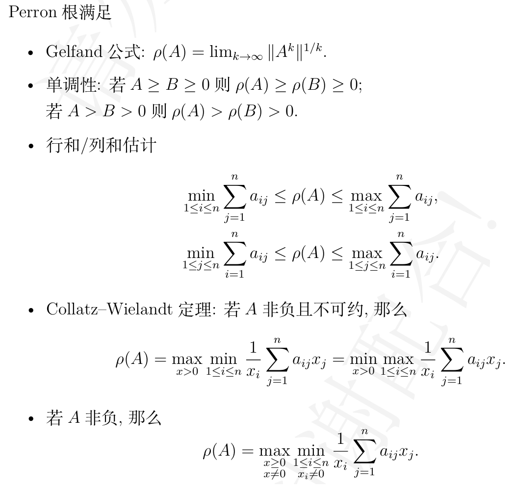
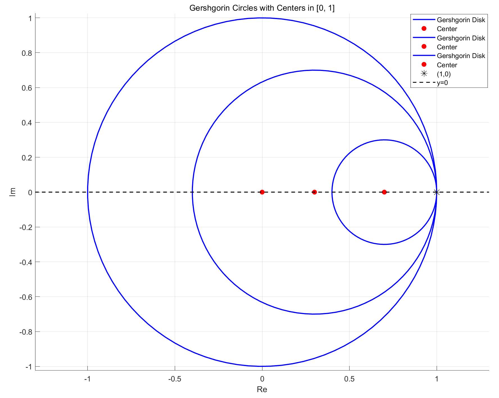

# FDU 高等线性代数 6. 非负矩阵

本文根据邵美悦老师授课内容整理而成，并参考了以下教材：  

* Matrix Analysis (R. Horn & C. Johnson) Chapter $8$
* 矩阵分析 (R. Horn & C. Johnson) 第 $8$ 章

欢迎批评指正!

## 6.1 基础知识

首先我们给出下列定义:

- 设 $A=[a_{ij}]\in \mathbb C^{m\times n}$ 和 $B=[b_{ij}]\in \mathbb C^{m\times n}$  
  我们定义 $|A|=[|a_{ij}|]\in \mathbb R^{m\times n}$ 和 $|B|=[|b_{ij}|]\in \mathbb R^{m\times n}$    

- 设 $A,B\in \mathbb R^{m\times n}$ 

  - 若所有 $a_{ij}$ 均为非负数，则我们称实矩阵 $A$ 是**非负的** (nonnegative)，记为 $A\geq 0$ (等价于 $|A|=A$)
  - 若所有 $a_{ij}$ 均为正数，则我们称实矩阵 $A$ 是**正的** (positive)，记为 $A > 0$ 
  - 若 $A-B$ 是非负矩阵 (即 $A-B\geq 0$)，则我们记 $A\geq B$ 
  - 若 $A-B$ 是非负矩阵 (即 $A-B> 0$)，则我们记 $A>B$ 

  反向的关系 $\leq$ 和 $<$ 可以用类似的方法定义.

**(Matrix Analysis 命题 $8.1.8$) ** 
给定 $A=[a_{ij}]\in \mathbb C^{n\times n}$ 和 $x=[x_i]\in \mathbb C^n$，我们有下列命题成立:

- ① $|Ax|\leq |A||x|$     
  **Proof:**
  $$
  \begin{align}
  |Ax|_k
  &=
  \left|
  \sum_{j=1}^n a_{kj} x_j
  \right|\\
  &\leq
  \sum_{j=1}^n |a_{kj}x_j|\\
  &=
  \sum_{j=1}^n |a_{kj}| |x_j|\\
  &=
  (|A||x|)_k
  \end{align}\quad (k=1,\dots,n)
  $$

- ② 设 $A\in \mathbb R^{n\times n}$ 是非负的且有一行全为正数.  
  若 $|Ax|=A|x|$，则存在实数 $\theta\in [0,2\pi)$ 使得 $e^{-i\theta}x = |x|$  
  **Proof:**  
  $|Ax|=Ax$ 说明对于任意 $k=1,\dots,n$，① 的证明中的三角不等式都取等.  
  因此对于任意 $k=1,\dots,n$，复数 $a_{kj}x_j\ (j=1,\dots,n)$ 一定具有相同的辐角.  
  由于 $A$ 有一行全为正数，故复数 $x_j\ (j=1,\dots,n)$ 一定具有相同的辐角.  
  于是存在实数 $\theta\in [0,2\pi)$ 使得 $e^{-i\theta}x = |x|$

- ③ 设 $x\in \mathbb R^n$ 是正的.  
  $Ax=|A|x$ 当且仅当 $A=|A|$ (即 $A$ 是非负矩阵)  

****

设 $A,B,C,D\in \mathbb C^{n\times n},x,y\in \mathbb C^n$，又设 $m\in \mathbb Z_+$，则我们有下列命题成立:

- ① $|AB|\leq |A||B|$  
  特殊地，$|A^m| \leq |A|^m$ 
- ② 若 $0\leq A\leq B$ 且 $0\leq C\leq D$，则 $0\leq AC\leq BD$   
  特殊地，若 $0\leq A\leq B$，则 $0\leq A^m \leq B^m$ 
- ③ 若 $A\geq 0$，则 $A^m\geq 0$;   
  若 $A>0$，则 $A^m>0$ 
- ④ 若 $A>0$，则对于任意非零的非负向量 $x\geq 0$ (满足 $x\neq 0_n$) 都有 $Ax>0$ 成立

****

Horn 的书上的两道习题有错误:

- $\||A|\|_2  = \|A\|_2$  的反例: 
  $$
  A = \frac{1}{\sqrt{2}}
  \begin{bmatrix}
  1 & 1\\
  -1 & 1
  \end{bmatrix}
  \qquad 
  |A| = \frac{1}{\sqrt{2}}
  \begin{bmatrix}
  1 & 1\\
  1 & 1
  \end{bmatrix}
  $$
  注意到 $A$ 的特征值是 $\frac{\sqrt{2}}{2}\pm \frac{\sqrt{2}}{2}i$，奇异值是 $1,1$，因此 $\|A\|_2 = 1$ 
  而 $|A|$ 的特征值是 $0,\sqrt{2}$，奇异值是 $0,\sqrt{2}$，因此 $\||A|\|_2 = \sqrt{2}$  
  两者并不相等.

- "若 $|A|\leq |B|$，则 $\|A\|_2 \leq \|B\|_2$" 的反例:   
  $$
  A_\varepsilon = \frac{1}{\sqrt{2}}
  \begin{bmatrix}
  1-\varepsilon & 1-\varepsilon\\
  1-\varepsilon & 1-\varepsilon
  \end{bmatrix}
  \qquad 
  B = \frac{1}{\sqrt{2}}
  \begin{bmatrix}
  1 & 1\\
  -1 & 1
  \end{bmatrix}
  $$
  显然当 $\varepsilon\in (0,2)$ 时我们都有 $|A_\varepsilon|\leq |B|$   
  根据之前的结论我们有 $\|B\|_2=1$   
  当 $\varepsilon\to 0_+$ 时，我们有 $\|A_\varepsilon\|_2 \to \sqrt{2}$，因此存在 $\varepsilon>0$ 使得 $\|A_\varepsilon\|_2> \|B\|_2$

  事实上，这个命题可以改为:  
  "若 $0\leq A\leq B$，则我们有 $0\leq A^{\mathrm T}A\leq B^{\mathrm T}B$，进而有 $\rho(A^{\mathrm T}A)\leq \rho(B^{\mathrm T}B)$，即有 $\|A\|_2\leq \|B\|_2$"

****

**(Matrix Analysis 定理 $8.1.18$)**  
设 $A,B\in \mathbb C^{n\times n}$，并假设 $B\geq 0$  
若 $|A| \leq |B|=B$，则我们有 $\rho(A)\leq \rho(|A|)\leq \rho(B)$ 

- **(Matrix Analysis 推论 $8.1.19$)**   
  若 $A,B\in \mathbb R^{n\times n}$ 满足 $0\leq A\leq B$，则 $0\leq \rho(A)\leq \rho(B)$   

  **证明:** 根据 Gelfand 谱半径公式我们有:  
  $$
  \rho(A) = \lim_{k\to\infty} \|A^k\|_\infty^{\frac1k} \leq \lim_{k\to\infty}\|B^k\|_\infty^{\frac1k} =\rho(B)
  $$
  
- **(邵老师的补充)**  
  若 $A,B\in \mathbb R^{n\times n}$ 满足 $0< A < B$，则 $0<\rho(A)< \rho(B)$   

  **证明:** 对于 $A>B>0$ 的情况直接应用 Gelfand 谱半径公式是不行的，因为严格大于号取极限是非严格大于号.  
  我们得从另一条路走.  
  根据 $0< A < B$ 可知存在 $\theta>1$ 使得 $\theta A\leq B$   
  应用 **Matrix Analysis 推论 $8.1.19$** 可知 $\rho(A)< \rho(\theta A)\leq \rho(B)$ 
  
- **(Matrix Analysis 推论 $8.1.20$)**  
  设 $A\in \mathbb R^{n\times n}$ 是非负矩阵.    
  ① 若 $A_1$ 是 $A$ 的主子阵，则 $\rho(A_1)\leq \rho(A)$ 
  ② $\min_{1\leq i\leq n} a_{ii} \leq \rho(A)$ (即 ① 的一阶情况)  
  特殊地，若 $A$ 的主对角元都是正实数，则 $\rho(A)>0$ 

  > "$A$ 是非负矩阵" 的假设是十分重要的  
  > 例如 $A=\begin{bmatrix}
  > 1 & 1\\
  > -1 & -1\end{bmatrix}$ (其特征值均为 $0$) 就不满足 $\rho(A)\geq 1$ 

*****

**(Matrix Analysis 引理 $8.1.21$)**  
若 $A=[a_{ij}]\in \mathbb R^{n\times n}$ 是非负矩阵，则我们有:  
$$
\begin{align}
\rho(A)
&\leq \|A\|_1 = \max_{1\leq j\leq n}\sum_{i=1}^n |a_{ij}|= \max_{1\leq j\leq n}\sum_{i=1}^n a_{ij}\\
\rho(A)
&\leq \|A\|_\infty = \max_{1\leq i\leq n}\sum_{j=1}^n |a_{ij}| = \max_{1\leq i\leq n}\sum_{j=1}^n a_{ij}
\end{align}
$$
前者当且仅当 $A$ 所有列和相等时取等，后者当且仅当 $A$ 所有行和相等时取等.  

非负矩阵的最大行(列)和是其谱半径的一个上界，这是显然的.  
但令人惊讶的是，非负矩阵的最小行(列)和是其谱半径的一个下界.  
**(Matrix Analysis 定理 $8.1.22$)**  
设 $A=[a_{ij}]\in \mathbb R^{n\times n}$ 是非负矩阵，则我们有:  
$$
\min_{1\leq i\leq n}\sum_{j=1}^n a_{ij} \leq \rho(A) \leq \max_{1\leq i\leq n}\sum_{j=1}^n a_{ij}\\
\min_{1\leq j\leq n}\sum_{i=1}^n a_{ij} \leq \rho(A) \leq \max_{1\leq j\leq n}\sum_{i=1}^n a_{ij}
$$

- **证明:**   
  我们可以取一个正定对角阵 $D_1$ 将 $A$ 的所有行和都配成 $A$ 的最小行和 $\min_{1\leq i\leq n}\sum_{j=1}^n a_{ij}$  
  同时取一个正定对角阵 $D_2$ 将 $A$ 的所有行和都配成 $A$ 的最大行和 $\max_{1\leq i\leq n}\sum_{j=1}^n a_{ij}$  
  显然有 $0\leq D_1A \leq A\leq D_2 A$ 成立  
  根据 **Matrix Analysis 推论 $8.1.19$** 我们有 $0\leq \rho(D_1A) \leq \rho(A)\leq \rho(D_2 A)$ 成立  

  根据**关于行的 Gershgorin 圆盘定理**我们知道所有行和相同的非负矩阵的谱半径就等于行和.  
  因此 $\rho(D_1A) = \min_{1\leq i\leq n}\sum_{j=1}^n a_{ij}$ 而 $\rho(D_2 A)=\max_{1\leq i\leq n}\sum_{j=1}^n a_{ij}$   
  所以我们有 $\min_{1\leq i\leq n}\sum_{j=1}^n a_{ij} = \rho(D_1 A) \leq \rho(A) \leq \rho(D_2 A) = \max_{1\leq i\leq n}\sum_{j=1}^n a_{ij}$ 成立.  

  对 $A^{\mathrm T}$ 应用上述结论就得到 $\min_{1\leq j\leq n}\sum_{i=1}^n a_{ij} \leq \rho(A^{\mathrm T}) \leq \max_{1\leq j\leq n}\sum_{i=1}^n a_{ij}$   
  注意到 $A^{\mathrm T}$ 与 $A$ 是相似的，因此 $\rho(A^{\mathrm T})= \rho(A)$   
  于是我们有 $\min_{1\leq j\leq n}\sum_{i=1}^n a_{ij} \leq \rho(A) \leq \max_{1\leq j\leq n}\sum_{i=1}^n a_{ij}$

- **(Matrix Analysis 推论 $8.1.25$)**  
  设 $A=[a_{ij}]\in \mathbb R^{n\times n}\ (n\geq 2)$ 是非负矩阵.  
  若 $A$ 的所有行(列)和均为正实数，则我们有 $\rho(A)>0$ 成立，且 $A$ 是不可约的. 
  (即不存在排列矩阵 $P$ 使得 $P^{\mathrm T}AP$ 为分块上三角阵)

通过引进某些自由参数可以推广上面的定理.  
设 $A=[a_{ij}]\in \mathbb R^{n\times n}$ 是非负矩阵，$x=[x_i]\in \mathbb R^n$ 是正向量.  
记 $D=\text{diag}\{x_1,\dots,x_n\}$，则 $D^{-1}AD = [a_{ij}\frac{x_j}{x_i}]$ 也是非负矩阵，且与 $A$ 具有相同特征值.  
对 $D^{-1}AD$ 应用 **Matrix Analysis 定理 $8.1.22$** 就得到:  
**(Matrix Analysis 定理 $8.1.26$)**  
设 $A=[a_{ij}]\in \mathbb R^{n\times n}$ 是非负矩阵.  
对于任意正向量 $x=[x_i]\in \mathbb R^n$ 我们都有:  
$$
\min_{1\leq i\leq n} \frac{1}{x_i} \sum_{j=1}^n a_{ij}x_j 
\leq \rho(A) \leq 
\max_{1\leq i\leq n} \frac{1}{x_i} \sum_{j=1}^n a_{ij}x_j\\

\min_{1\leq j\leq n}x_j \sum_{i=1}^n \frac{a_{ij}}{x_i} \leq \rho(A) \leq \max_{1\leq j\leq n} x_j \sum_{i=1}^n \frac{a_{ij}}{x_i}
$$

- **(Matrix Analysis 推论 $8.1.29$)**  
  设 $A=[a_{ij}]\in \mathbb R^{n\times n}$ 是非负矩阵，$x=[x_i]\in \mathbb R^n$ 是正向量.   
  若 $\alpha,\beta\geq 0$ 满足 $\alpha x\leq Ax\leq \beta x$，则 $\alpha\leq \rho(A)\leq \beta$   
  若 $\alpha x < Ax$，则 $\alpha < \rho(A)$   
  若 $Ax<\beta x$，则 $\rho(A)<\beta$ 

- **(Matrix Analysis 推论 $8.1.30$)**  
  设 $A=[a_{ij}]\in \mathbb R^{n\times n}$ 是非负矩阵.  
  若 $x$ 是 $A$ 的一个正的特征向量，则 $(\rho(A),x)$ 是 $A$ 的一个特征对.  
  换言之，若 $A,x,\lambda$ 满足 $A\geq 0,x>0,Ax=x\lambda$，则 $\lambda=\rho(A)$ 

- **(Collatz-Wielandt 定理, Matrix Analysis 推论 $8.1.31$)**  
  设 $A=[a_{ij}]\in \mathbb R^{n\times n}$ 是非负矩阵.  
  若 $A$ 有一个正的特征向量 **(邵老师: 若 $A$ 是不可约非负矩阵)**，则我们有:  
  $$
  \begin{align}
  \rho(A)
  &=
  \max_{x>0} \min_{1\leq i\leq n}\frac{1}{x_i}\sum_{j=1}^n a_{ij}x_j\\
  &=
  \min_{x>0} \max_{1\leq i\leq n}\frac{1}{x_i}\sum_{j=1}^n a_{ij}x_j
  \end{align}
  $$
  对于一般的非负矩阵，只有第一个等式成立 (其形式略微不同) **(Matrix Analysis 推论 $8.3.3$)**

*****

我们知道 Hermite 正定阵 $A$ 的 Hermite 正定 $p$ 次根 $A^{\frac1p}$ 是唯一的.   
但在随机过程中，我们通常研究的是对非负矩阵 $A$ 开非负 $p$ 次根 $X$   
(因为概率转移矩阵一定是非负的，即所有元素都是非负实数)  
这种情况下，非负 $p$ 次根 $X$ 不一定存在，即使存在也不定唯一.

- 考虑非负矩阵的方程 $\begin{bmatrix}
  0 & 1\\
  & 0 & 1\\
  & & 0\end{bmatrix}=X^2$   
  若 $X$ 存在，则 $X$ 的特征值均为零，因此它的 Jordan 块只有如下三种可能:  
  $$
  J_X= 
  \begin{bmatrix}
  0 & 1\\
   & 0 & 1\\
    & & 0
  \end{bmatrix}\text{ or }
  \begin{bmatrix}
  0 & 1 & \\
  & 0 &\\
  & & 0
  \end{bmatrix}
  \text{ or }
  \begin{bmatrix}
  0 & \\
   & 0\\
   & & 0
  \end{bmatrix}
  $$
  我们发现 $J_X^2$​ 的秩至多是 $1$​，因此不存在 $X$​ 使得 $X^2 = \begin{bmatrix}
  0 & 1\\
  & 0 & 1\\
  & & 0\end{bmatrix}$ ​

- 考虑非负矩阵的方程 $\begin{bmatrix}
  1 \\
  & 1
  \end{bmatrix} = X^2$   
  方程的解 $X$ 可以是 $\pm I$ 或 $P\begin{bmatrix}
  1\\
  & -1\end{bmatrix}P^{-1}$ (例如 $\begin{bmatrix}
  0 & 1\\
  1 & 0\end{bmatrix}$)   
  邵老师提供了一个形象的说明:  
  通过 $2$ 步转移概率矩阵并不一定能够唯一确定 $1$ 步转移概率矩阵.

## 6.2 正矩阵

首先我们讨论与模最大特征值相伴的特征向量的性质.  
**(Matrix Analysis 引理 $8.2.1$)**  
设 $A\in \mathbb R^{n\times n}$ 是正矩阵.  
若 $(\lambda,x)$ 是 $A$ 的一组特征对，且 $|\lambda|=\rho(A)$，  
则我们有 $|x|>0$ 且 $A|x|=\rho(A) |x|$ 

**(Matrix Analysis 引理 $8.2.3$)**  
设 $A\in \mathbb R^{n\times n}$ 是正矩阵.  
若 $(\lambda,x)$ 是 $A$ 的一组特征对，且 $|\lambda|=\rho(A)$，  
则存在一个实数 $\theta\in [0,2\pi)$ 使得 $e^{-i\theta}x =|x|>0$

****

于是我们可得出有关正矩阵的一个基本事实:  
**(Matrix Analysis 定理 $8.2.2$)**  
若 $A\in \mathbb R^{n\times n}$ 是正矩阵，则存在正向量 $x,y$ 使得 $Ax=x\rho(A)$ 和 $y^{\mathrm T}A=\rho(A) y^{\mathrm T}$ 

接下来我们就可以证明: 正矩阵仅有的模最大特征值就是它的谱半径.  
**(Matrix Analysis 定理 $8.2.4$)**  
设 $A\in \mathbb R^{n\times n}$ 是正矩阵.  
若 $\lambda$ 是 $A$ 的一个特征值，且 $|\lambda|\neq \rho(A)$，则 $|\lambda|<\rho(A)$ 

那么关于 $\rho(A)$ 的几何重数我们有什么结论?  
**(Matrix Analysis 定理 $8.2.5$)**  
若 $A\in \mathbb R^{n\times n}$ 是正矩阵，则 $\rho(A)$ 作为 $A$ 的特征值的几何重数为 $1$

- **(Matrix Analysis 推论 $8.2.6$)**  
  若 $A\in \mathbb R^{n\times n}$ 是正矩阵，则 $A$ 关于特征值 $\rho(A)$ 存在唯一的特征向量 $x$ 满足 $\sum_{i=1}^n x_i=1$，且这个向量必然是正的.  
  我们称上述 $x$ 为 $A$ 的**右 Perron 向量**，称 $\rho(A)$ 为 $A$ 的 **Perron 根**   
- 将上述结果应用于 $A^{\mathrm T}$，其与特征值 $\rho(A)$ 对应的满足 $\sum_{i=1}^n x_iy_i=1$ 的特征向量 $y$ 是正的，且是唯一的.  
  我们称它为 $A$ 的**左 Perron 向量**

正矩阵 $A$ 的 Perron 根 $\rho(A)$ 的代数重数也是 $1$.  
**(Matrix Analysis 定理 $8.2.7$)**  
若 $A\in \mathbb R^{n\times n}$ 是正矩阵，则 Perron 根 $\rho(A)$ 作为 $A$ 的特征值的代数重数是 $1$  
若 $y$ 和 $x$ 分别是 $A$ 的左、右 Perron 向量，则 $\lim_{m\to\infty}(\rho^{-1}(A)A)^m = xy^{\mathrm T}$ (这是一个正的秩 $1$ 矩阵)

****

我们将本节的结果总结如下:  
**(Perron 定理, Matrix Analysis 定理 $8.2.8$)**  
若 $A\in \mathbb R^{n\times n}$ 是正矩阵，则下列命题成立:

- ① $\rho(A)>0$ 
- ② $\rho(A)$ 是 $A$ 的单重特征值
- ③ 对 $A$ 的每个满足 $\lambda\neq \rho(A)$ 的特征值都有 $|\lambda|<\rho(A)$ 成立
- ④ 存在唯一的正的实向量 $x\in \mathbb R^n$ 使得 $Ax=\rho(A)x$ 且 $\sum_{i=1}^n x_i=1$
- ⑤ 存在唯一的正的实向量 $y\in \mathbb R^n$ 使得 $y^{\mathrm T}A=\rho(A)y^{\mathrm T}$ 且 $\sum_{i=1}^n x_iy_i=1$
- ⑥ $\lim_{m\to\infty}(\rho^{-1}(A)A)^m = xy^{\mathrm T}$ (这是一个正的秩 $1$ 矩阵)

邵老师利用 Brouwer 不动点定理提供了一个形象的说明.

> **(Brouwer 不动点定理)**  
> 若 $C\subset \mathbb R^n$ 是非空有界闭凸集，$f:C\mapsto C$ 是连续映射，  
> 则存在 $x\in C$ 使得 $f(x)=x$ 

记 $\mathbb R^n$ 中的概率单纯形为 $C:=\{x:x\succeq 0_n,\|x\|_1=1\}$   
(例如在 $\mathbb R^3$ 中 $C$ 就是平面 $x+y+z=1$ 被三个坐标平面截成的正三角形)  
我们定义 $C\mapsto C$ 的映射 $u\mapsto \frac{Au}{\|Au\|_1}$   
根据 Brouwer 不动点定理可知存在 $u_0\in C$ 使得 $\frac{Au_0}{\|Au_0\|_1}=u_0$，即 $Au_0 = u_0 \|Au_0\|_1$   
**(存疑)** 其中 $\|Au_0\|_1$ 就是 $A$ 的 Perron 根，$u_0$ 就是 $A$ 的右 Perron 向量.

***

Perron 定理的一个应用:  
**(樊畿, Matrix Analysis 定理 $8.2.9$)**  
设 $A=[a_{ij}]\in \mathbb C^{n\times n}$  
若 $B=[b_{ij}]\in \mathbb R^{n\times n}$ 是非负矩阵，且对于任意 $i\neq j$ 都有 $b_{ij}\geq |a_{ij}|$，  
则 $A$ 的每个特征值都在 $n$ 个圆盘的并集中: 
$$
\bigcup_{i=1}^n \{z\in \mathbb C:|z-a_{ii}|\leq \rho(B)-b_{ii}\}
$$
特别地，若对于任意 $i=1,\dots,n$ 都有 $|a_{ii}|>\rho(B)-b_{ii}$，则 $A$ 是非奇异的.

## 6.3 非负矩阵

### 6.3.1 一般情形

非负矩阵的结论要比正矩阵的结论弱很多.  
例如非负矩阵 $A$ 的模最大特征值不一定是 $\rho(A)$ (即使是 $\rho(A)$，其代数重数也不一定为 $1$)  

>例如 $A = \begin{bmatrix}
>0 & 1 & 0\\
>0 & 0 & 1\\
>1 & 0 & 0
>\end{bmatrix}$ 的特征值为 $1,\omega,\omega^2$ (其中 $\omega = \exp(\frac{2\pi i}{3})$)，它们都是模最大特征值.  
>例如 $A = \begin{bmatrix}
>1 & 0 & 0\\
>0 & 1 & 0\\
>0 & 0 & 1
>\end{bmatrix}$ 的特征值为 $1,1,1$，它们都是模最大特征值，且等于 $\rho(A)$，但其代数重数不是 $1$ 

我们可以通过取极限来将 Perron 定理的部分结论推广到非负矩阵.  
**(一般非负矩阵的 Perron 定理, Matrix Analysis 定理 $8.3.1$)**  
若 $A\in \mathbb R^{n\times n}$ 是非负矩阵，则 $\rho(A)$ 是 $A$ 的一个特征值 (称为 **Perron 根**)，  
且存在一个非负且非零的向量 $x\in \mathbb R^n$ 使得 $Ax=\rho(A)x$

- 非负矩阵的 Perron 根相伴的特征向量 (即使它是标准化的) 不一定是唯一的.  
  因此对于非负矩阵，我们不能定义 "Perron 向量" 的概念.  
  例如每个非零的非负向量都是非负矩阵 $I_n$ 关于其 Perron 根 $\rho(A)=1$ 的特征向量.

**(Matrix Analysis 定理 $8.3.2$)**  
设 $A\in \mathbb R^{n\times n}$ 是非负矩阵，而 $x\in \mathbb R^n$ 是非负且非零的向量.  
给定 $\alpha\in \mathbb R$，若 $Ax\geq \alpha x$，则 $\rho(A)\geq \alpha$

- **(Matrix Analysis 推论 $8.3.3$)**  
  若 $A\in \mathbb R^{n\times n}$ 是非负矩阵，则我们有:  
  $$
  \rho(A) = \max_{
  \begin{subarray}{}
  x\geq 0\\
  x\neq 0_n
  \end{subarray}
  } 
  \min_{
  \begin{subarray}{}
  1\leq i\leq n\\
  x_i \neq 0
  \end{subarray}
  }\frac{1}{x_i} \sum_{j=1}^n a_{ij}x_j
  $$

具有正的左特征向量或右特征向量的非负矩阵有着某些特殊的性质:  
**(Matrix Analysis 定理 $8.3.4$)**  
设 $A\in \mathbb R^{n\times n}$ 是非负矩阵.  
若存在一个正向量 $x\in \mathbb R^n$ 和一个非负实数 $\lambda\geq 0$ 使得 $Ax=x\lambda$ 或 $x^{\mathrm T}A=\lambda x^{\mathrm T}$，  
则我们有 $\lambda = \rho(A)$

**(Matrix Analysis 定理 $8.3.5$)**  
设 $A\in \mathbb R^{n\times n}$ 是非负矩阵，且有一个正的左特征向量.

- ① 若 $x\in \mathbb R^n$ 非零且满足 $Ax\geq \rho(A)x$，则 $x$ 是 $A$ 关于 $\rho(A)$ 的特征向量.
- ② 若 $A$ 不是零矩阵，且 $\rho(A)>0$，  
  则 $A$ 的每个满足 $|\lambda|=\rho(A)$ 的特征值 $\lambda$ 都是半简单的 (即几何重数等于代数重数)

### 6.3.2 不可约情形

**(可约性 & 不可约性, Matrix Analysis 定义 $6.2.21$ & $6.2.22$)**  
我们称 $A\in \mathbb C^{n\times n}$ 是**可约的** (reducible)  
如果存在一个置换矩阵 $P\in \mathbb C^{n\times n}$ 使得:  
$$
P^{\mathrm T}AP = \begin{bmatrix}
B & C\\
0_{n-r,r} & D
\end{bmatrix}\text{ where }1\leq r\leq n-1
$$
换言之，我们只要求 $A$ 通过对称行列变换产生左下方的全零分块，  
且 $B,D$ 的阶至少是 $1$ (并不要求 $B,C,D$ 有非零元素)

- 若 $A\in \mathbb C^{n\times n}$ 是可约的，则它至少含有 $n-1$ 个非零元素.
- 若 $A\in \mathbb C^{n\times n}$ 不是可约的，则我们称 $A$ 是**不可约的** (irreducible)

**(强连通, Matrix Analysis 定义 $6.2.13$)**   
我们称一个有向图 $\Gamma$ 是**强连通的** (strongly connected)  
如果在 $\Gamma$ 的每一对不同节点 $P_i,P_j$ 都存在一条长度有限的有向路径.

**(有向图, Matrix Analysis 定义 $6.2.11$)**  
$A\in \mathbb C^{n\times n}$ 的有向图 $\Gamma(A)$ 是 $n$ 个节点 $P_1,\dots,P_n$ 上的这样一个有向图:  
当且仅当 $a_{ij}\neq 0$ 时，$\Gamma(A)$ 中存在一条从 $P_i$ 到 $P_j$ 中的有向弧.

**(Matrix Analysis 定理 $6.2.24$)**  
给定 $A\in \mathbb C^{n\times n}$，定义绝对值矩阵 $|A|:=[|a_{ij}|]\in \mathbb R^{n\times n}$ 和指标矩阵 $\Mu(A)=[{\large \mathbb 1}\{a_{ij}\neq 0\}]\in \mathbb R^{n\times n}$   
则下列命题是等价:

- ① $A$ 是不可约的
- ② $(I+|A|)^{n-1}>0$
- ③ $(I+\Mu(A))^{n-1}>0$ 
- ④ 有向图 $\Gamma(A)$ 是强连通的

****

不可约的非负矩阵可以多继承正矩阵的一些性质.    
**(Matrix Analysis 引理 $8.4.2$)**  
若 $A\in \mathbb C^{n\times n}$ 的特征值是 $\lambda_1,\dots,\lambda_n$，  
则 $I+A$ 的特征值是 $\lambda_1+1,\dots,\lambda_n+1$ 且 $\rho(I+A)\leq \rho(A)+1$   
进一步，若 $A$ 是非负矩阵，则 $\rho(I+A)=\rho(A)+1$ 

**(Matrix Analysis 引理 $8.4.3$)**   
若 $A$ 是非负矩阵，且对于某个正整数 $m\geq 1$，$A^m$ 是正矩阵，  
则 $\rho(A)>0$，且是 $A$ 仅有的模最大特征值 (其代数重数为 $1$)

**(不可约非负矩阵的 Perron-Frobenius 定理, Matrix Analysis 定理 $8.4.4$)**  
设 $A\in \mathbb C^{n\times n}\ (n\geq 2)$ 是不可约的非负矩阵，则下列命题成立:

- ① $\rho(A)>0$ 
- ② $\rho(A)$ 是 $A$ 的单重特征值 **(Perron 根)**
- ③ 存在唯一的实向量 $x=[x_i]\in \mathbb R^n$ 使得 $Ax=\rho(A)x$ 且 $\sum_{i=1}^n x_i=1$，这个向量是正的 **(右 Perron 向量)**
- ④ 存在唯一的实向量 $y=[y_i]\in \mathbb R^n$ 使得 $y^{\mathrm T}A=\rho(A)y^{\mathrm T}$ 且 $\sum_{i=1}^n x_iy_i=1$，这个向量是正的 **(左 Perron 向量)**

## 6.4 随机矩阵

所有行和均为 $1$ 的非负矩阵 $A\in \mathbb R^{n\times n}$ 称为**(行)随机矩阵** ((row) stochastic matrix) (即满足 $A\geq 0$ 且 $A1_n=1_n$)  
所有列和均为 $1$ 的非负矩阵 $A\in \mathbb R^{n\times n}$ 称为**列随机矩阵** (column stochastic matrix) (即满足 $A\geq 0$ 且 $A^{\mathrm T}1_n=1_n$)  
所有行和、列和均为 $1$ 的非负矩阵 $A\in \mathbb R^{n\times n}$ 称为**双随机矩阵** (doubly stochastic matrix)

- 一个随机矩阵的例子 (四个同学传球):
  $$
  \begin{bmatrix}
  0 & \frac13 & \frac13 & \frac13\\
  \frac13 & 0 & \frac13 & \frac13\\
  \frac13 & \frac13 & 0 & \frac13\\
  \frac13 & \frac13 & \frac13 & 0
  \end{bmatrix} = \frac13 (1_31_3^{\mathrm T} - I)
  $$

- 根据定义可知随机矩阵 $A\in \mathbb R^{n\times n}$ 满足 $A1_n = 1_n$  
  因此 $1$ 是 $A$ 的一个特征值，而 $1_n$ 是与之相伴的特征向量.  
  根据关于行的 Gershgorin 圆盘定理可知，所有行和相同的非负矩阵的谱半径就等于行和.  
  因此 $A$ 的谱半径 $\rho(A)=1$ 

  

****

若 $Q = [q_{ij}]\in \mathbb R^{n\times n}$ 满足 $q_{ij}\geq 0\ (i\neq j)$ (非对角元非负) 和 $Q1_n = 0_n$ (所有行和均为 $0$)，  
则我们称 $Q$ 是一个**生成矩阵** (generator matrix)   
(通常用于描述连续时间 Marcov 链的状态转移速率)

可以证明 $\exp(Q)$ 是一个随机矩阵:  

- ① 首先证明 $\exp(Q)$ 是一个非负矩阵:  
  由于 $Q$ 的非对角元都是非负的，故我们可以取一个足够大的 $\alpha\in \mathbb R$ 使得 $Q+\alpha I_n$ 是一个非负矩阵.  
  于是我们有:  
  $$
  \begin{align}
  \exp(Q)
  &=
  \exp(Q+\alpha I_n) \exp(-\alpha I_n)\\
  &=
  \left(
  \sum_{k=0}^\infty \frac{(Q+\alpha I_n)^k}{k!}
  \right) \cdot e^{-\alpha} I_n\\
  &=
  \left(
  \sum_{k=0}^\infty \frac{(Q+\alpha I_n)^k}{k!}
  \right) \cdot e^{-\alpha}
  \end{align}
  $$
  注意到 $\exp(Q+\alpha I_n)=\sum_{k=0}^\infty \frac{(Q+\alpha I_n)^k}{k!}$ 作为非负矩阵 $Q+\alpha I_n$ 的幂级数，也一定是非负矩阵.   
  同时 $e^{-\alpha}$ 是一个正实数，故 $\exp(Q)$ 是一个非负矩阵.

- ② 其次证明 $\exp(Q)$ 的所有行和均为 $1$:  
  $$
  \begin{align}
  \exp(Q)1_n
  &=
  \left(
  \sum_{k=0}^\infty \frac{Q^k}{k!}
  \right) 1_n\\
  &=
  \left(
  I_n + \sum_{k=1}^\infty \frac{Q^k}{k!}
  \right) 1_n\\
  &=
  1_n + \sum_{k=1}^\infty \frac{Q^k 1_n}{k!}\\
  &=
  1_n + \sum_{k=1}^\infty \frac{Q^{k-1}\cdot Q1_n}{k!}\quad (\text{note that }Q1_n=0_n)\\
  &=
  1_n + \sum_{k=1}^\infty \frac{Q^{k-1}\cdot 0_n}{k!}\\
  &=
  1_n
  \end{align}
  $$

***

**(Birkhoff 定理, Matrix Analysis 定理 $8.7.2$)**  
$A\in \mathbb R^{n\times n}$ 是双随机的，当且仅当它可表示为至多 $n^2-n+1$ 个排列矩阵的凸组合.  
具体来说，$A=\sum_{i=1}^N \alpha_i P_i$   
其中 $N\leq n^2-n+1$，$P_1,\dots,P_N$ 为排列矩阵，$\alpha_1,\dots,\alpha_N$ 为正实数，且满足 $\sum_{i=1}^N \alpha_i = 1$     
(原书上引理的证明是错误的) 

**The End**
