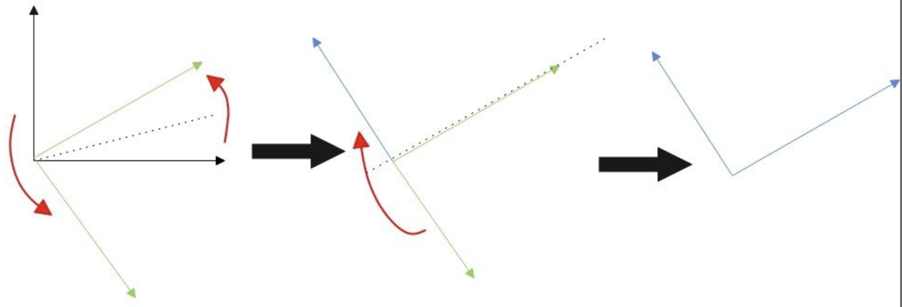

# FDU 高等线性代数 7. 奇异值

本文根据邵美悦老师授课内容整理而成，并参考了以下教材：  

* Matrix Analysis (R. Horn & C. Johnson) Chapter $2,7$
* 矩阵分析 (R. Horn & C. Johnson) 第 $2,7$ 章
* 工科泛函分析基础 (孙明正, 李冱岸, 张建国, 邹杰涛) 第 $3$ 章

欢迎批评指正!

## 7.1 内积空间上的线性映射

### 7.1.1 有界线性算子

**(工科泛函分析基础 定理 $3.3.5$)**    
设 $(X,\|\cdot\|_X)$ 和 $(Y,\|\cdot\|_Y)$ 是域 $\mathbb F$ 上的两个赋范空间，$T:X\mapsto Y$ 是一个线性算子.   
$T$ 为连续算子当且仅当 $T$ 是有界算子.  
(这表明连续线性算子等价于有界线性算子)

- **充分性:**  
  设 $T$ 是有界算子，则存在 $M>0$ 使得 $\|T(x)\|_Y \leq M\|x\|_X\ (\forall\ x\in X)$  
  考虑 $X$ 中的序列 $\{x_n\}$  
  若 $x_n\to x\ (n\to\infty)$ (即 $\lim_{n\to\infty}\|x_n-x\|_X = 0$)，则我们有:  
  $$
  \|T(x_n)-T(x)\|_Y = \|T(x_n-x)\|_Y \leq M \|x_n -x\|_X \to 0\ (n\to\infty)
  $$
  这表明 $T$ 是连续算子.

- **必要性:**  
  设 $T$ 是连续算子.  
  **(反证法)** 假设 $T$ 是无界算子，则存在序列 $\{x_n\}$ 使得 $\|T(x_n)\|_Y > n \|x_n\|_X\ (\forall\ n\in \mathbb Z_+)$   
  定义 $z_n:= \frac{x_n}{n\|x_n\|_X}\ (\forall\ n\in \mathbb Z_+)$，则我们有:  
  $$
  \|z_n\|_X = \left\|\frac{x_n}{n\|x_n\|_X}\right\|_X = \frac{1}{n} \to 0
  $$
  因此 $z_n \to 0_X\ (n\to\infty)$  
  根据 $T$ 的连续性可知 $T(z_n) \to T(0_X) = 0_Y\ (n\to\infty)$  
  但注意到:  
  $$
  \begin{align}
  \|z_n - 0_Y\|_Y 
  &=
  \left\|T(z_n)-0_Y\right\|_Y\\
  &=
  \|T(z_n-0_X)\|_Y\\
  &=
  \left\|T\left(\frac{x_n}{n\|x_n\|_X}\right)\right\|_Y\\
  &=
  \frac{\|T(x_n)\|_Y}{n \|x_n\|_X}\\
  &\geq
  \frac{n\|x_n\|_X}{n\|x_n\|_X} \\
  &=
  1
  \end{align}\ (\forall\ n\in \mathbb Z_+)
  $$
  这与 $T(z_n) \to T(0_X) = 0_Y\ (n\to\infty)$ 矛盾.  
  因此 $T$ 是有界算子.

### 7.1.2 Riesz 表示定理

设 $(V,\|\cdot\|)$ 为域 $\mathbb C$ 上的赋范空间.  
我们称 $V$ 上的有界线性泛函全体构成的线性空间为 $V$ 的**对偶空间**，记为 $V_*$   
可以证明它是一个赋范空间，其范数 $\|\cdot\|_*$ 称为 $\|\cdot\|$ 的**对偶范数**，定义为 $\|f\|_* := \sup_{\|x\|=1} |f(x)|\ (\forall\ f\in V_*)$   
进一步还可以证明它是一个完备赋范空间，即 **Banach 空间** (这一事实基于复数域 $\mathbb C$ 的完备性)

设 $(V,\langle \cdot,\cdot\rangle)$ 为域 $\mathbb C$ 上的 **Hilbert 空间** (即完备内积空间)  
对于任意给定的 $y \in V$，可定义线性泛函 $f:V\mapsto \mathbb C$ 为 $f(x):=\langle x,y\rangle\ (\forall\ x\in V)$  
可以证明 $f$ 是有界的 (即存在 $M>0$ 使得 $|f(x)|\leq M\|x\|\ (\forall\ x\in V)$)  
其对偶范数 $\|f\|_*=\sup_{\|x\|=1}|f(x)| = \sup_{\|x\|=1}|\langle x,y\rangle| = \|y\|$ (基于 Cauchy-Schwarz 不等式)   
这表明对于任意给定的 $y \in V$，上述定义的泛函 $f(x):=\langle x,y\rangle\ (\forall\ x\in V)$ 一定是有界线性泛函，即有 $f\in V_*$ 

反过来，对于对偶空间 $V_*$ 中任意给定的有界线性泛函 $f:V\mapsto \mathbb C$   
是否存在对应的 $y\in V$ 使得 $f(x)=\langle x,y\rangle \ (\forall\ x\in V)$ 呢?  
换言之，是否存在对应的 $y\in V$ 使得 $f$ 可以表示为 $f(x)=\langle x,y\rangle \ (\forall\ x\in V)$ 的形式?  

**Riesz 表示定理**回答了这个问题:  
设 $(V,\langle \cdot, \cdot\rangle)$ 为 Hilbert 空间，记 $V^*$ 为 $V$ 的对偶空间，  
则对于任意有界线性泛函 $f\in V_*$ 都存在唯一的 $y \in V$ 使得 $f(x)=\langle x,y\rangle \ (\forall\ x\in V)$   
并且 $f$ 的对偶范数等于 $y$ 的向量范数，即 $\|f\|_*=\sup_{\|x\|=1}|f(x)| = \sup_{\|x\|=1}|\langle x,y\rangle| = \|y\|$   
也就是说，Hilbert 空间 $(V,\langle \cdot,\cdot\rangle)$ 和其对偶空间 $(V_*,\|\cdot\|_*)$ 是等距同构的，可以说 $V^* = V$.  
("等距同构" 代表二者之间存在一个双射，不但保持线性结构，而且保持范数)

- 特殊地，有限维内积空间一定是 Hilbert 空间，定义在其上的线性泛函都是有界的.   
  (泛函分析的结论: 有限维赋范空间上的线性映射一定有界)  
  因此 Riesz 表示定理对有限维内积空间上的所有线性泛函都成立.

- **存在性证明:**   
  若 $f\equiv 0$，则取 $y=0_V$ 即可，因此不妨设 $f$ 不是零泛函.  
  记 $\text{Ker}(f):=\{x\in V:f(x)=0\}$，它是 $V$ 的真子空间.  
  因此 $\text{Ker}(f)^\bot/\{0_V\}\neq \emptyset$，于是一定存在 $x_0\neq 0_V\in \text{Ker}(f)^\bot$   
  即存在 $x_0\neq 0_V$ 使得 $f(x_0)\neq 0$ 

  由于 $f$ 是线性泛函，故我们有:  
  $$
  f\left(x-\frac{f(x)}{f(x_0)}x_0 \right) = f(x)-\frac{f(x)}{f(x_0)}f(x_0) = 0\quad (\forall\ x\in V)
  $$
  这表明 $x-\frac{f(x)}{f(x_0)}x_0\in \text{Ker}(f)\ (\forall\ x\in V)$   
  根据 $x_0 \in \text{Ker}(f)^\bot$ 可知 $x_0\ \bot \ (x-\frac{f(x)}{f(x_0)}x_0)$  
  即对于任意 $x\in V$ 都有 $\langle x-\frac{f(x)}{f(x_0)}x_0,x_0\rangle = 0$ 成立.
  $$
  \left\langle x- \frac{f(x)}{f(x_0)}x_0, \ x_0 \right\rangle 
  = 
  \langle x,x_0 \rangle - \frac{f(x)}{f(x_0)} \|x_0\|^2 = 0\quad (\forall\ x\in V)\\
  \Leftrightarrow\\
  f(x) = \frac{f(x_0)}{\|x_0\|^2} \langle x,x_0\rangle = \left\langle x,\frac{\overline {f(x_0)}}{\|x_0\|^2}x_0\right\rangle\quad (\forall\ x\in V)
  $$
  取 $y=\frac{\overline {f(x_0)}}{\|x_0\|^2}x_0$ 即有 $f(x)=\langle x,y\rangle\ (\forall\ x\in V)$ 

  此外，根据 Cauchy\-Schwarz 不等式可知:  
  $$
  \begin{align}
  \frac{|f(x)|}{\|x\|}
  &=
  \frac{|\langle x,y\rangle|}{\|x\|}\\
  &\leq
  \frac{\|x\|\|y\|}{\|x\|}\\
  &=
  \|y\|
  \end{align}\quad (\forall\ x\neq 0_V\in V)
  $$
  当且仅当 $x$ 与 $y$ 线性相关时取等.  
  因此我们有:  
  $$
  \|f\| = \sup_{x\neq 0_V} \frac{|f(x)|}{\|x\|} = \|y\|
  $$

- **唯一性证明:**    
  (反证法) 假设存在不同的 $y_1,y_2 \in V$ 使得:   
  $$
  f(x) = \langle x,y_1\rangle = \langle x,y_2\rangle \quad (\forall\ x\in V)
  $$
  则我们有 $\langle x,y_1-y_2 \rangle = 0\ (\forall\ x\in V)$   
  取 $x = y_1 - y_2$，则有 $\langle y_1-y_2,y_1-y_2 \rangle = 0$  
  根据内积的正定性可知 $y_1 -y_2 = 0_V$，即 $y_1 = y_2$，与假设矛盾.  
  因此使得 $f(x)=\langle x,y\rangle\ (\forall\ x\in V)$ 的 $y\in V$ 是唯一的.

### 7.1.3 伴随算子

设 $(V,\langle \cdot, \cdot\rangle)$ 为域 $\mathbb C$ 上的 Hilbert 空间，$A$ 为 $V$ 上的有界线性算子 (的表示矩阵)  
(特殊地，有限维内积空间一定是 Hilbert 空间，有限维内积空间上的线性算子一定有界)  
对于任意给定的 $y\in V$，关于 $x$ 的线性泛函 $f_y(x) := \langle Ax,y\rangle$ 一定有界.    
这是因为根据 Cauchy-Schwarz 不等式可知:  
$$
\begin{align}
\frac{|f_y(x)|}{\|x\|} 
&=
\frac{|\langle Ax,y\rangle|}{\|x\|}\\
&\leq
\frac{\|Ax\|\|y\|}{\|x\|}\\
&\leq
\frac{\|A\|\|x\|\|y\|}{\|x\|}\\
&=
\|A\|\|y\|
\end{align}
(\forall\ x\neq 0_V\in V)
$$
因此我们有 $\|f_y\|=\sup_{x\neq 0_V} \frac{|f(x)|}{\|x\|} \leq \|A\|\|y\|<\infty$ 成立.

根据 **Riesz 表示定理**可知，存在唯一的 $z \in V$ 使得 $f_y(x) = \langle x,z\rangle\ (\forall\ x\in V)$ 且 $\|f_y\|=\|z\|$   
于是我们有:  
$$
\langle Ax,y\rangle = \langle x,z\rangle \quad (\forall\ x\in V)
$$
注意到 $y,z$ 是唯一对应的，因此存在 $V$ 上的一个双射 $B$ 满足:
$$
\begin{cases}
z = By\\
\|f_y\| = \|z\|= \|By\|\\
\end{cases}\quad (\forall\ y\in V)
$$
因此对于任意 $x,y\in V$ 都有 $\langle Ax,y\rangle = \langle x,By\rangle$ 成立.  
我们称 $B$ 为 $A$ 的**伴随算子** (adjoint operator)

*****

可以证明域 $\mathbb C$ 上的 Hilbert 空间 $(V,\langle \cdot, \cdot\rangle)$ 上的有界线性算子 $A$ 的伴随算子 $B$ 是唯一的，且是 $V$ 上的有界线性算子.

* **① 线性性:**  
  $$
  \begin{align}
  \langle x, B(\alpha y_1+\beta y_2)\rangle
  &=\langle Ax,\alpha y_1+\beta y_2\rangle\\
  &=
  \bar \alpha (Ax,y_1) + \bar \beta\langle Ax,y_2\rangle\\
  &=
  \bar \alpha \langle x, By_1\rangle + \bar \beta \langle x,By_2\rangle\\
  &=
  \langle x,\alpha By_1\rangle + \langle x, \beta By_2\rangle\\
  &=
  \langle x,\alpha By_1 + \beta B y_2\rangle
  \end{align}\quad (\forall\ x,y_1,y_2\in V,\alpha,\beta\in \mathbb C)
  $$
  因此 $B(\alpha y_1+\beta y_2)=\alpha By_1 + \beta B y_2\ (\forall\ y_1,y_2\in V,\alpha,\beta\in \mathbb C)$  
  这表明 $B$ 是线性算子.

* **② 有界性:**  
  根据 Riesz 表示定理可知 $\|By\|=\|f_y\|\leq \|A\|\|y\|\ (\forall\ y\in V)$  
  于是我们有:  
  $$
  \|B\| = \sup_{y\neq 0_V} \frac{\|By\|}{\|y\|} \leq \|A\| < \infty
  $$
  因此 $B$ 是有界算子 (事实上，根据后面的内容我们知道 $\|B\|=\|A\|$)

* **③ 唯一性:**  
  设 $B_1,B_2$ 都是 $A$ 的伴随算子，即有: 
  $$
  \langle Ax,y\rangle = \langle x,B_1 y\rangle =\langle x,B_2 y\rangle\quad (\forall\ x,y\in V)\\
  \Leftrightarrow\\
  \langle x,(B_1-B_2)y\rangle = 0\quad (\forall\ x,y\in V)\\
  \Leftrightarrow\\
  (B_1-B_2)y = 0_V\quad (\forall\ y\in V)\\
  \Leftrightarrow\\
  B_1 = B_2
  $$
  这说明伴随算子 $B$ 是唯一的，故可记 $A$ 的伴随算子为 $A^*$.

事实上，复 Euclid 空间 $(\mathbb C^n,\langle \cdot,\cdot\rangle_2)$ 上的有界线性算子 $A$ 的伴随算子 $A^*$ 就相当于 $A$ 的共轭转置. 

****

设 $A^*$ 为域 $\mathbb C$ 上的 Hilbert 空间 $(V,\langle \cdot, \cdot\rangle)$ 上的有界线性算子 $A$ 的伴随算子.   
以下性质是显然的:

- ① $(A_1+A_2)^* = A_1^* + A_2^*$ 

- ② $(A_1A_2)^* = A_2^*A_1^*$ 

- ③ $(\alpha A)^* = \bar \alpha A^*\ (\forall\ \alpha\in \mathbb C)$

- ④ $A^{**}:=(A^*)^* = A$
  $$
  \begin{align}
  \langle y,Ax\rangle 
  &= \overline {\langle Ax,y\rangle}\\
  &= \overline{\langle x,A^*y\rangle}\\
  &= \langle A^* y,x\rangle\\
  &= \langle y,A^{**}x\rangle
  \end{align}\quad (\forall\ x,y\in V)
  $$

- ⑤ $\|A^*\|=\|A\|$ 
  $$
  \begin{cases}
  \|A^*\|\leq \|A\|\\
  \|A\| = \|A^{**}\| \leq \|A^*\|
  \end{cases}\Rightarrow \|A^*\| = \|A\|
  $$

- ⑥ $\|A^*A\|=\|AA^*\| = \|A^*\|\|A\| = \|A^*\|^2 = \|A\|^2$   
  一方面，诱导范数天然满足相容性，故 $\|A^*A\|\leq \|A^*\|\|A\| = \|A\|^2$   
  另一方面，注意到对于任意 $x\in V$ 都有:  
  $$
  \begin{align}
  \|Ax\|^2 
  &= \langle Ax,Ax\rangle\\
  &= \langle x,A^*Ax\rangle \quad (\text{Cauchy-Schwarz})\\
  &\leq \|x\|\|A^*Ax\|\\
  &\leq \|x\|\|A^* A\|\|x\|\\
  &=
  \|A^*A\|\|x\|^2
  \end{align}
  $$
  因此我们有:  
  $$
  \|A\|^2 = \sup_{x\neq 0_V}\left(\frac{\|Ax\|}{\|x\|}\right)^2 \leq \|A^*A\|
  $$
  于是我们有 $\|A^*A\|=\|A\|^2$   
  对 $A^*$ 应用上述结论即得 $\|A^{**}A^*\| = \|A^*\|^2$  
  结合 $A^{**}=A$ 的结论可知 $\|AA^*\|=\|A^*\|^2$  
  综上所述，我们有 $\|A^*A\|=\|AA^*\| = \|A^*\|\|A\| = \|A^*\|^2 = \|A\|^2$

- ⑦ 若 $A$ 的逆算子 $A^{-1}$ 存在且有界，则 $A^*$ 的逆算子 $(A^*)^{-1}$ 存在且有界，满足 $(A^*)^{-1} = (A^{-1})^*$    
  注意到恒等算子 $I_V$ 的伴随算子 $I_V^* = I_V$  
  根据 $A^{-1}A = AA^{-1} = I_V$ 可知:  
  $$
  A^*(A^{-1})^* = (A^{-1}A)^* = I_V^* = I_V\\ 
  (A^{-1})^*A^* = (AA^{-1})^* = I_V^* = I_V
  $$
  因此 $A^*$ 的逆算子 $(A^*)^{-1}$ 存在且有界，满足 $(A^*)^{-1} = (A^{-1})^*$  

### 7.1.4 正交投影算子

**(正交分解定理)**  
设 $(V, \langle \cdot,\cdot\rangle)$ 为 Hilbert 空间，$S$ 是 $V$ 的闭子空间，$\|\cdot\|$ 为 $\langle \cdot,\cdot \rangle$ 诱导出的范数.  
(特殊地，有限维内积空间一定是 Hilbert 空间，其子空间均为闭子空间)  
则对于任意 $x\in V$，都存在唯一的 $p \in S$ 使得：

* $\|x - p\| =  \min_{y\in S} \|x-y\|$，即 $p$ 是 $x$ 在 $S$ 上的最佳逼近元
* $x-p \ \bot\  S$，即 $p$ 为 $x$ 在 $S$ 上的正交投影

根据第二点可知，任意 $x\in V$ 在 $S$ 上都有唯一的分解 $x = p + (x-p)$ 满足 $\begin{cases} p \in S\\ x-p \in S^\bot \end{cases}$   
进一步可知 $V$ 可直和分解为 $S$ 和 $S^{\bot}$，即 $V=S\oplus S^{\bot}$ (此时称为正交分解)  
其中 $S^\bot := \{x\in V:\langle x,s\rangle = 0\text{ for all }s\in S\}$ 称为 $S$ 的正交补空间.

***

设 $(V, \langle \cdot,\cdot\rangle)$ 为域 $\mathbb C$ 上的 Hilbert 空间， $A$ 为 $V$ 上的有界线性算子.

* 若 $A^2 = A$，则称 $A$ 为**幂等算子** (idempotent operator)
* 若 $AA^* =A^*A$，则称 $A$ 为**正规算子** (normal operator) 
* 若 $AA^* =A^*A = I_V$，则称 $A$ 为**酉算子** (unitary operator) (正规算子的特例)
* 若 $A^* =A$，则称 $A$ 为**自伴算子** (self-adjoint operator) (正规算子的特例)
* 设 $S$ 为 $V$ 的闭子空间.  
  若对于任意 $x\in V$ 都有 $(I_V-A)x \ \bot\ S$ 成立，  
  则称 $A$ 为从 $V$ 到 $S$ 的**正交投影算子**，简称**投影算子** (projection operator)

**定理：**  
设 $(V, \langle \cdot,\cdot\rangle)$ 为域 $\mathbb C$ 上的 Hilbert 空间，$S$ 为 $V$ 的闭子空间，$P$ 为从 $V$ 到 $S$ 的投影算子，则我们有: 
(特殊地，有限维向量空间的所有子空间都是闭子空间)

* ① $P$ 是有界线性算子，且算子范数 $\|P\|=1$
* ② $P^2 = P$ (投影算子一定是幂等算子)
* ③ $P^* = P$ (投影算子一定是自伴算子)

**证明：**  

- 对于任意 $x_1,x_2 \in V$，我们记:  
  $$
  \begin{align}
  p_1 &:= Px_1\in S\\
  r_1 &:= x_1 - p_1\in S^\bot\\
  p_2 &:= Px_2\in S\\
  r_2 &:= x_2 - p_2\in S^\bot
  \end{align}
  $$
  于是我们有:  
  $$
  \begin{align}
  \alpha x_1+\beta x_2 
  &=
  \alpha (p_1+r_1) + \beta(p_2+r_2)\\
  &=
  (\alpha p_1+\beta p_2) + (\alpha r_1 + \beta r_2)
  \end{align}\quad (\forall\ \alpha,\beta\in \mathbb C)
  $$
  注意到 $(\alpha p_1 +\beta p_2 ) \in S$ 而 $(\alpha r_1 +\beta r_2)\in S^\bot$  
  根据正交分解的唯一性可知 $P(\alpha x_1 + \beta x_2 ) =\alpha p_1 +\beta p_2 = \alpha (Px_1) + \beta (Px_2)$   
  根据 $\alpha,\beta\in \mathbb C$ 的任意性可知投影算子 $P$ 是**线性算子**.

- 根据正交分解定理可知 $Px\ \bot\ (x-Px)\ (\forall\ x\in V)$   
  因此对于任意 $x\in V$ 我们都有:
  $$
  \begin{align}
  \|x\|^2 
  &= \|Px + (x-Px)\|^2\quad (\text{note that }Px\ \bot\ (x-Px))\\
  &= \|Px\|^2 + \|x-Px\|^2\\
  &\geq \|Px\|^2
  \end{align}
  $$
  即 $\|Px\|\leq \|x\|\ (\forall\ x\in V)$ (当且仅当 $x\in S$ 时取等)   
  这说明投影算子 $P$ 是**有界算子**，且 $\|P\| = \sup_{x\neq 0_V} \frac{\|Px\|}{\|x\|} = 1$ 

- 注意到对于任意 $x\in V$ 都有 $Px\in S$   
  因此 $P^2x = P(Px) = Px\ (\forall\ x\in V)$  
  于是有 $P^2=P$，表明投影算子 $P$ 一定是**幂等算子**.

- 注意到对于任意 $x_1,x_2\in V$ 都有:
  $$
  \begin{align}
  \langle x_1,P^*x_2\rangle
  &=
  \langle Px_1,x_2\rangle\\
  &=
  \langle Px_1,Px_2+(x_2-Px_2)\rangle\\
  &=
  \langle Px_1,Px_2\rangle + \langle Px_1,x_2-Px_2\rangle\quad (\text{note that }Px_1\in S\text{ and }x_2-Px_2\in S^\bot)\\
  &=
  \langle Px_1,Px_2\rangle + 0\qquad\qquad\qquad\quad\ \  (\text{note that }Px_2\in S\text{ and }x_1-Px_1\in S^\bot)\\
  &=
  \langle Px_1,Px_2\rangle + \langle x_1-Px_1,Px_2\rangle\\
  &= 
  \langle Px_1 +(x_1-Px_1),Px_2\rangle\\
  &=
  \langle x_1,Px_2\rangle
  \end{align}
  $$
  因此 $P^*=P$，表明投影算子 $P$ 一定是**自伴算子**.

****

**定理：**  
设 $(V, \langle \cdot,\cdot\rangle)$ 为域 $\mathbb C$ 上的 Hilbert 空间，$P$ 为 $V$ 上的算子.  
则 $P$ 为 $V$ 上的投影算子当且仅当 $P$ 是幂等且自伴的有界线性算子.  
若记 $S:=\text{Range}(P)$，则 $S$ 为 $V$ 的闭子空间，$P$ 为从 $V$ 到 $S$ 的投影算子.  

**证明:**  
必要性我们刚刚已经证过了，这里只需证明充分性即可.  
设 $P$ 是幂等且自伴的有界线性算子，记 $S:=\text{Range}(P)$，显然 $S$ 为 $V$ 的子空间.  

- **首先证明 $S$ 是 $V$ 的闭子空间:**   
  设 $\{p_n\}$ 是 $S$ 中的收敛序列，满足 $p_n\to p_0\ (n\to\infty)$ (根据 Hilbert 空间的完备性可知 $p_0\in V$)  
  根据定义 $S:=\text{Range}(P)$ 可知存在 $\{x_n\}\subset V$ 满足 $Px_n=p_n\ (\forall\ n\in \mathbb Z_+)$   
  由于 $P$ 是幂等算子，故我们有:  
  $$
  p_n = Px_n = P^2x_n = P(Px_n) = P(p_n)\quad (\forall\ n\in \mathbb Z_+)
  $$
  由于有界线性算子等价于连续线性算子，故我们有 $P(p_n)\to P(p_0)\ (n\to\infty)$  
  因而有:  
  $$
  \begin{align}
  \|p_0-P(p_0)\|
  &=
  \|p_0 -P(p_n) + P(p_n) - P(p_0)\|\\
  &\leq
  \|p_0-P(p_n)\| + \|P(p_n)-P(p_0)\|\quad (\text{note that }P(p_n)=p_n\text{ for all }n\in \mathbb Z_+)\\
  &=
  \|p_0-p_n\| + \|P(p_n)-P(p_0)\|\quad (\text{note that }\begin{cases}
  p_n\to p_0\\
  P(p_n)\to P(p_0)
  \end{cases}\ (n\to\infty))\\
  &\to 0\quad (n\to\infty)
  \end{align}
  $$
  这表明 $\|p_0-P(p_0)\|=0$，说明 $P(p_0)=p_0$，意味着 $p_0\in S$  
  因此 $S$ 是 $V$ 的闭子空间.

- **其次证明 $P$ 是投影算子:**   
  根据定义 $S:=\text{Range}(P)$ 可知对于任意 $p\in S$，总能找到 $x_0 \in V$ 使得 $Px_0 = p$  
  根据 $P$ 的幂等性和自伴性可知，对于任意 $x\in V$ 都有:  
  $$
  \begin{align}
  \langle x-Px,p\rangle
  &=
  \langle x-Px,Px_0\rangle\\
  &=
  \langle P^*(x-Px),x_0\rangle \quad\ (\text{note that }P^*=P)\\
  &=
  \langle P(x-Px),x_0\rangle\\
  &=
  \langle Px-P^2x,x_0\rangle\qquad(\text{note that }P^2=P)\\
  &=
  \langle Px-Px,x_0\rangle\\
  &=
  \langle 0_V,x_0\rangle\\
  &=
  0
  
  
  
  \end{align}
  $$
  根据 $p\in S$ 的任意性可知，对于任意 $x\in V$ 都有 $(x-Px)\ \bot\ S=\text{Range}(P)$ 成立.  
  这表明 $P$ 是 $V$ 上的投影算子，且投影到 $V$ 的闭子空间 $S=\text{Range}(P)$ 上.

***

**推论:**  
设 $(V, \langle \cdot,\cdot\rangle)$ 为域 $\mathbb C$ 上的 Hilbert 空间，$P_1 : V\mapsto S_1$ 和 $P_2 : V \mapsto S_2$ 为两个投影算子，则我们有:

* $P =P_1 + P_2$ 为投影算子的充要条件为 $S_1\  \bot\ S_2$.   
  此时 $P$ 是 $V\mapsto (S_1 \oplus S_2)$ 的投影算子.
* $P =P_1P_2$ 为投影算子的充要条件为 $P_1P_2 = P_2P_1$  
  此时 $P$ 是 $V\mapsto (S_1 \cap S_2)$ 的投影算子.

***

设 $(V, \langle \cdot,\cdot\rangle)$ 为域 $\mathbb C$ 上的 $n$ 维内积空间 (有限维内积空间一定是 Hilbert 空间)  
设 $S$ 为 $V$ 的 $r\leq n$ 维子空间 (有限维向量空间的子空间一定是闭子空间)  
取 $S$ 的一组标准正交基，记基矩阵为 $W \in \mathbb C^{n\times r}$ (满足 $W^*W = I_r$)  
则 $WW^*$ 是一个投影算子，因为它满足幂等性和自伴性:
$$
\begin{align}
(WW^*)^2 &= WW^*WW^* = WW^*\\
(WW^*)^* &= WW^*
\end{align}
$$
实际上，每一个投影算子都可以表示成 $WW^*$ 的形式 (其中 $W\in \mathbb C^{n\times r}$ 满足 $W^*W=I_r$)  
因为投影算子 $P$ 作为一个自伴算子 (自然是正规算子)，它一定可酉对角化.   
同时它作为一个幂等算子，特征值只能是 $0$ 或 $1$  
若记 $r:=\rank(P) = \dim(\text{Range}(P))$，  
则存在酉矩阵 $U=[U_1,U_2]\in \mathbb C^{n\times n}$ (其中 $U_1\in \mathbb C^{n\times r}$) 使得:  
$$
\begin{align}
P
&=
[U_1,U_2]
\begin{bmatrix}
I_r & \\
& 0_{(n-r)\times (n-r)}
\end{bmatrix}
[U_1,U_2]^*\\
&=
U_1 I_r U_1^*\\
&=
U_1U_1^*
\end{align}
$$
在有限维内积空间中，任意子空间一定是闭子空间.  
我们只需子空间的一组基，就可通过 Gram-Schimidt 正交化过程得到一组标准正交基，进而确定正交投影算子.  

### 7.1.5 正交变换

设 $(V,\langle \cdot,\cdot \rangle)$ 是域 $\mathbb F$ 上的 $n$ 维内积空间，$T:V\mapsto V$ 是 $V$ 上的变换.  
若 $T$ 保持内积 (即 $\langle T(x),T(y)\rangle = \langle x,y\rangle\ (\forall\ x,y\in V)$)，  
则我们称 $T$ 为**正交变换** (orthogonal transformation) (又称保积同构)

- **① 可以证明 $T$ 是线性变换:**   
  (这个性质对无限维内积空间上的正交变换也成立，参见 Homework 09 Problem 05)

  - **(线性可加性)** 对于任意 $x_1,x_2\in V$ 我们都有:   
    $$
    \begin{align}
    \langle T(x_1+x_2),T(y)\rangle
    &=
    \langle x_1+x_2,y\rangle\\
    &=
    \langle x_1,y\rangle + \langle x_2,y\rangle\\
    &=
    \langle T(x_1),T(y)\rangle + \langle T(x_2),T(y)\rangle\\
    &=
    \langle T(x_1)+T(x_2),T(y)\rangle
    \end{align}
    $$
    即有 $\langle T(x_1+x_2) - T(x_1)-T(x_2),T(y)\rangle=0\ (\forall\ x_1,x_2\in V)$ 成立.  
    根据 $y\in V$ 的任意性可知 $T(x_1+x_2)=T(x_1)+T(x_2)\ (\forall\ x_1,x_2\in V)$

  - **(齐次性)** 对于任意 $x\in V$ 和 $\alpha\in \mathbb F$ 我们都有:  
    $$
    \begin{align}
    \langle T(\alpha x),T(y)\rangle
    &=
    \langle \alpha x,y\rangle\\
    &=
    \alpha \langle x,y\rangle\\
    &=
    \alpha \langle T(x),T(y)\rangle\\
    &=
    \langle \alpha T(x),T(y)\rangle
    \end{align}
    $$
    即有 $\langle T(\alpha x) - \alpha T(x),T(y)\rangle=0\ (\forall\ x\in V,\alpha\in \mathbb F)$ 成立.   
    根据 $y\in V$ 的任意性可知 $T(\alpha x)=\alpha T(x)\ (\forall\ x\in V,\alpha\in \mathbb F)$

- **② 可以证明 $T$ 在标准正交基下的表示矩阵一定是正交矩阵:**  
  取 $\mathbb F=\mathbb C$  
  设 $Q\in \mathbb C^{n\times n}$ 是内积空间 $V$ 的任意一组标准正交基构成的基矩阵.  
  设 $T(Q)=QA$，其中 $A\in \mathbb C^{n\times n}$ 是 $T$ 在标准正交基 $Q$ 下的表示矩阵.  
  任意给定 $x,y\in V$，设它们在标准正交基 $Q$ 下的坐标表示为 $\begin{cases}
  x = Qu\\
  y = Qv\end{cases}$   
  由于 $T$ 是一个线性变换，故我们有 $\begin{cases}
  T(x) = T(Qu) = T(Q)u = QAu\\
  T(y) = T(Qv) = T(Q)v = QAv\end{cases}$   
  于是我们有:
  $$
  \begin{align}
  \langle T(x),T(y)\rangle
  &=
  \langle QAu,QAv\rangle\\
  &=
  (Av)^{\mathrm H} \langle Q,Q\rangle (Au)\quad (\text{note that }\langle Q,Q\rangle = I_n \text{ is the Gram matrix of }Q)\\
  &=
  v^{\mathrm H}A^{\mathrm H}A u\\
  \hline
  \langle x,y\rangle
  &=
  \langle Qu,Qv \rangle\\
  &=
  v^{\mathrm H} \langle Q,Q\rangle u\\
  &=
  v^{\mathrm H}u
  \end{align}
  $$
  根据正交变换 $T$ 的保积性 $\langle T(x),T(y)\rangle = \langle x,y\rangle\ (\forall\ x,y\in V)$ 可知 $v^{\mathrm H}A^{\mathrm H}Au = v^{\mathrm H}u$   
  根据 $u,v$ 的任意性可知 $A^{\mathrm H}A=I_n$，因此为正交矩阵.
  
  > 这是因为我们可以取 $V$ 的一组基 $e_1,\dots,e_n$，有 $v^{\mathrm H}A^{\mathrm H}A [e_1,\dots,e_n] = v^{\mathrm H}[e_1,\dots,e_n]$  
  > 由于 $[e_1,\dots,e_n]$ 为可逆矩阵，故我们有 $v^{\mathrm H}A^{\mathrm H}A = v^{\mathrm H}$   
  > 类似地，我们有 $[e_1,\dots,e_n]^{\mathrm H} A^{\mathrm H}A = [e_1,\dots,e_n]^{\mathrm H}$，于是有 $A^{\mathrm H}A=I_n$ 

****

两类特殊的正交变换:

- **① Householder 变换:**    
  设 $(V, \langle \cdot,\cdot\rangle)$ 为域 $\mathbb C$ 上的 $n$ 维内积空间 (有限维内积空间一定是 Hilbert 空间)  
  设 $S$ 为 $V$ 的 $r\leq n$ 维子空间 (有限维向量空间的子空间一定是闭子空间)  
  取 $S$ 的一组标准正交基，记基矩阵为 $W \in \mathbb C^{n\times r}$ (满足 $W^*W = I_r$)，则 $P:=WW^*$ 是一个投影算子 
  我们定义**广义 Householder 变换**为 $H = I-2P = I-2WW^*$.   
  显然 $H$ 具有 $r$ 个 $-1$ 特征值 (对应 $r$ 维子空间 $S$)，和 $n-r$ 个 $1$ 特征值 (对应正交补空间 $S^\bot$)  
  因此 $\det(H)=(-1)^{r}\cdot 1^{n-r}=(-1)^{r}$   

  记 $W=[w_1,\dots,w_r]$，我们容易验证:  
  $$
  \begin{align}
  (I-2WW^*) 
  &= I_n - 2(w_1w_1^*+ \dotsm + w_rw_r^*)\\
  &= (I-2w_1w_1^*)\dotsm (I-2w_rw_r^*)\\
  \end{align}
  $$
  这表明 $r$ 维 Householder 变换等价于 $r$ 个标准正交向量 $w_1,\dots,w_r$ 对应的 $1$ 维 Householder 变换的复合.  

  同时我们发现，偶数维 Householder 变换 (偶数次镜面反射) 相当于旋转变换.  
  因此我们称 $\det(H)=-1$ 的 $H$ 为**镜像变换** (奇数维)，而称 $\det(H)=+1$ 的 $H$ 为**旋转变换** (偶数维).

- **② Givens 变换:**  
  平面旋转变换的矩阵表示形如:  
  $$
  G(i,k,\theta)
  =
  I + \sin(\theta) (e_i e_k^{\mathrm T} - e_k e_i^{\mathrm T}) + (\cos(\theta)-1)(e_ie_i^{\mathrm T} + e_k e_k^{\mathrm T})
  =
  \begin{array}{cl}
  \begin{bmatrix}
    1 &  &  &  &  &  &  \\
     & \ddots &  &  &  &  &  \\
     &  & \cos(\theta) & \cdots & \sin(\theta) &  &  \\
     &  & \vdots & \ddots & \vdots &  &  \\
     &  & -\sin(\theta) & \cdots & \cos(\theta) &  &  \\
     &  &  &  &  & \ddots &  \\
     &  &  &  &  &  & 1 \\
  \end{bmatrix} 
  &
  \begin{array}{}
  \\
  \\
  i\\
  \\
  k\\
  \\
  \\
  \end{array} \\
  \begin{array}{}
  && \ \ i &\qquad& k &&\\
  \end{array}
  \end{array}
  $$
  它可以表示为两个 $1$ 维 Householder 变换的复合:  
  $$
  \begin{align}
  w_1 &:= e_k\\
  w_2 &:= \sin{(\frac{\theta}{2})} e_i -\cos{(\frac{\theta}{2})}e_k\\
  \hline
  (I-2w_1w_1^*)(I-2w_2w_2^*)
  &=
  I-2w_1w_1^* -2w_2w_2^* + 4w_1w_1^*w_2w_2^*\\
  &=
  I-2e_ke_k^* -2\left[\sin^2(\frac{\theta}{2})e_ie_i^* -\sin{(\frac{\theta}2)}\cos{(\frac{\theta}2)}(e_ie_k^*+e_ke_i^*)+\cos^2(\frac{\theta}2) e_ke_k^*\right]\\
  &\qquad+\ 4 e_ke_k^*\left(\sin{(\frac{\theta}{2})} e_i -\cos{(\frac{\theta}{2})}e_k\right) \left(\sin{(\frac{\theta}{2})} e_i -\cos{(\frac{\theta}{2})}e_k\right)^*\\
  &=
  I-2e_ke_k^* + (\cos(\theta)-1)e_ie_i^*- (\cos(\theta)+1)e_ke_k^* +\sin(\theta)(e_ie_k^*+e_ke_i^*)\\
  &\qquad-\ 4\cos{(\frac{\theta}{2})}e_k \left(\sin{(\frac{\theta}{2})} e_i -\cos{(\frac{\theta}{2})}e_k\right)^*\\
  &=
  I-2e_ke_k^* + (\cos(\theta)-1)e_ie_i^*- (\cos(\theta)+1)e_ke_k^* +\sin(\theta)(e_ie_k^*+e_ke_i^*)\\
  &\qquad-\ 2\sin(\theta)e_ke_i^* + 2(\cos(\theta)+1)e_ke_k^*\\
  &=
  I +\sin(\theta) (e_ie_k^*-e_ke_i^*) +(\cos(\theta)-1)(e_ie_i^* +e_ke_k^*)\\
  &=
  G_(i,k,\theta)
  \end{align}
  $$
  如图所示: 

  

  本质上就是:  
  $$
  \begin{align}
  \begin{bmatrix}
  \cos(\theta) & \sin(\theta)\\
  -\sin(\theta) & \cos(\theta)
  \end{bmatrix}
  &=
  \begin{bmatrix}
  1\\
  & -1
  \end{bmatrix}
  \begin{bmatrix}
  \cos(\theta) & \sin(\theta)\\
  \sin(\theta) & -\cos(\theta)
  \end{bmatrix}\\
  &=
  \begin{bmatrix}
  1\\
  & 1-2\cdot 1
  \end{bmatrix}
  \begin{bmatrix}
  1-2\sin^2(\frac{\theta}{2}) & -(-2\cos(\frac{\theta}{2})\sin(\frac{\theta}{2}))\\
  -(-2\cos(\frac{\theta}{2})\sin(\frac{\theta}{2})) & 1-2\cos^2(\frac{\theta}{2})
  \end{bmatrix}\\
  &=
  \left(
  \begin{bmatrix}
  1\\
  & 1
  \end{bmatrix}
  -
  2
  \begin{bmatrix}
  0\\
  1
  \end{bmatrix}
  \begin{bmatrix}
  0\\
  1
  \end{bmatrix}^*
  \right)
  \left(
  \begin{bmatrix}
  1\\
  & 1
  \end{bmatrix}
  -
  2
  \begin{bmatrix}
  \sin(\frac{\theta}{2})\\
  -\cos(\frac{\theta}{2})
  \end{bmatrix}
  \begin{bmatrix}
  \sin(\frac{\theta}{2})\\
  -\cos(\frac{\theta}{2})
  \end{bmatrix}^*
  \right)
  
  \end{align}
  $$

## 7.2 奇异值分解

### 7.2.1 酉等价

给定复方阵 $A\in \mathbb C^{n\times n}$   
我们可将其视为一个 $n$ 维复向量空间 $W$ 上的线性变换 $T:W\mapsto W$ 关于一组给定的标准正交基的矩阵表示.  
酉相似 $A\mapsto UAU^{\mathrm H}$ 即从给定的这组基变换到另一组标准正交基，其中 $U\in \mathbb C^{n\times n}$ 是基变换矩阵.

考虑 $n$ 维复向量空间 $W_1$ 到 $m$ 维复向量空间 $W_2$ 的线性映射 $T:W_1\mapsto W_2$  
设复矩阵 $A\in \mathbb C^{m\times n}$ 是其关于 $W_1,W_2$ 的两组给定的标准正交基的矩阵表示.  
酉等价 $A\mapsto UAV^{\mathrm H}$ 即从给定的这两组基变换到另外两组标准正交基，其中 $U\in \mathbb C^{m\times m}$ 和 $V\in \mathbb C^{n\times n}$ 是基变换矩阵.  
它比酉相似更加灵活，因而可以将复矩阵化简到特殊的形式 (例如奇异值分解)  

酉相似不一定能将任意两个复方阵 $A,B\in \mathbb C^{n\times n}$ 同时上三角化 (必须有额外的条件，例如 $A,B$ 可交换)  
但酉等价可以将任意两个复方阵 $A,B\in \mathbb C^{n\times n}$ 同时上三角化.  
**(Matrix Analysis 定理 $2.6.1$)**  
任意给定 $A,B\in \mathbb C^{n\times n}$  
一定存在酉矩阵 $U,V\in \mathbb C^{n\times n}$ 使得 $\begin{cases}
A=UT_AV^{\mathrm H}\\
B = UT_BV^{\mathrm H}\end{cases}$   
其中 $T_A,T_B\in \mathbb C^{n\times n}$ 均为上三角阵.   
特殊地，如果 $B$ 非奇异，则 $B^{-1}A = VT_B^{-1}T_AV^{\mathrm H}$，此时 $T_B^{-1}T_A$ 的主对角元即为 $B^{-1}A$ 的特征值.

- **证明:**  
  假设 $A,B$ 中至少有一个是奇异的 (不妨设 $B$ 非奇异)  
  设 $B^{-1}A$ 的 Schur 分解为 $B^{-1}A = VTV^{\mathrm H}$，并设 $BU$ 的 $\text{QR}$ 分解为 $BV=UT_B$   
  其中 $U,V\in \mathbb C^{n\times n}$ 均为酉矩阵，而 $T,T_B\in \mathbb C^{n\times n}$ 均为上三角阵.  
  记 $T_A:= T_BT$，则我们有:  
  $$
  \begin{cases}
  A = BVTV^{\mathrm H} = (UT_B)TV^{\mathrm H} = UT_A V^{\mathrm H}\\
  B = BVV^{\mathrm H} = UT_BV^{\mathrm H}
  \end{cases}
  $$
  若 $A,B$ 都是奇异的，则存在 $\delta>0$ 使得只要 $0<\varepsilon<\delta$，$B_\varepsilon = B+\varepsilon I_n$ 就是非奇异阵.  
  根据之前的结论可知，对于任意 $0<\varepsilon<\delta$ 都存在酉矩阵 $U_\varepsilon,V_\varepsilon\in \mathbb C^{n\times n}$ 使得 $U_\varepsilon^{\mathrm H} AV_\varepsilon$ 和 $U_\varepsilon^{\mathrm H} BV_\varepsilon$ 都是上三角阵.  
  由于 $\mathbb C^{n\times n}$ 中的酉矩阵全体构成一个紧集，故存在序列 $\{\varepsilon_k\}$ 使得 $\{U_{\varepsilon_k}\}$ 和 $\{V_{\varepsilon_k}\}$ 的极限都存在，记为:  
  $$
  \begin{align}
  U &:= \lim_{k\to\infty}U_{\varepsilon_k}\\
  V &:= \lim_{k\to\infty}V_{\varepsilon_k}
  \end{align}
  $$
  其中极限 $U,V\in \mathbb C^{n\times n}$ 也是酉矩阵.  
  定义:  
  $$
  \begin{align}
  T_A
  &:= U^{\mathrm H}AV 
  =
  \lim_{k\to\infty} U_{\varepsilon_k}^{\mathrm H}AV_{\varepsilon_k}\\
  T_B
  &:= U^{\mathrm H}BV
  =
  \lim_{k\to\infty} U_{\varepsilon_k}^{\mathrm H}BV_{\varepsilon_k}
  \end{align}
  $$
  可知 $T_A,T_B\in \mathbb C^{n\times n}$ 均为上三角阵 (因为对于任意 $0<\varepsilon_k<\delta$，$U_\varepsilon^{\mathrm H} AV_\varepsilon$ 和 $U_\varepsilon^{\mathrm H} BV_\varepsilon$ 都是上三角阵)  
  命题得证.

### 7.2.2 奇异值分解

尽管只有正规矩阵才可以通过酉相似来对角化，  
但任意复矩阵 (不仅仅是复方阵) 都可以通过酉等价来对角化.  
**(奇异值分解, Matrix Analysis 定理 $2.6.3$)**  
任意给定 $A\in \mathbb C^{m\times n}$，记 $r:=\rank(A)$ 和 $q:=\min\{m,n\}$   
则我们有以下命题成立:

- ① 存在酉矩阵 $U\in \mathbb C^{m\times m},V\in \mathbb C^{n\times n}$ 和一个对角元均为非负实数的矩阵 $\Sigma\in \mathbb C^{m\times n}$ 使得 $A=U\Sigma V^{\mathrm H}$  

- ② $\Sigma\in \mathbb C^{m\times n}$ 的具体结构为:  
  $$
  \Sigma = 
  \begin{cases}
  \Sigma_q  & \text{if }m=n\\
  \begin{bmatrix} \Sigma_q & 0_{q\times (n-m)} \end{bmatrix} & \text{if }m<n\\
  \begin{bmatrix} \Sigma_q \\ 0_{(m-n)\times q}\end{bmatrix} & \text{if }m>n
  \end{cases}
  $$
  其中 $\Sigma_q = \text{diag}\{\sigma_1,\dots,\sigma_q\}$ 且 $\sigma_1 \geq \dotsm \geq \sigma_r >0 = \sigma_{r+1}=\dotsm = \sigma_q$ 

- ③ 非零奇异值 $\sigma_1,\dots,\sigma_q$ 是 $A^{\mathrm H}A$ 或 $AA^{\mathrm H}$ 的按非增次序排列的 $r$ 个非零特征值的正的平方根.  
  这说明 $A$ 的奇异值由 $A^{\mathrm H}A$ 或 $AA^{\mathrm H}$ 的特征值唯一确定 (不计次序)  
  但奇异值分解中的酉因子并不是唯一的 (例如我们可以使用 $-U$ 代替 $U$，并用 $-V$ 代替 $V$)
  
- ④ **(精简 $\text{SVD}$, Matrix Analysis 定理 $7.3.2$)**  
  $\Sigma\in \mathbb C^{m\times n}$ 的另一种划分为:  
  $$
  \Sigma = 
  \begin{bmatrix}
  \Sigma_r & 0_{r\times (n-r)}\\
  0_{(m-r)\times r} & 0_{(m-r)\times (n-r)}
  \end{bmatrix}\\
  \text{where }\Sigma_r = \text{diag}\{\sigma_1,\dots,\sigma_r\}
  $$
  将 $U\in \mathbb C^{m\times m},V\in \mathbb C^{n\times n}$ 共形地划分为 $U=[U_1,U_2]$ 和 $V=[V_1,V_2]$  
  其中 $U_1\in \mathbb C^{m\times r},V_1\in \mathbb C^{n\times r}$，则我们有:  
  $$
  \begin{align}
  A 
  &=
  U\Sigma V^{\mathrm H}\\
  &=
  [U_1,U_2]
  \begin{bmatrix}
  \Sigma_r & 0_{r\times (n-r)}\\
  0_{(m-r)\times r} & 0_{(m-r)\times (n-r)}
  \end{bmatrix}
  [V_1,V_2]^{\mathrm H}\\
  &=
  U_1\Sigma_r V_1^{\mathrm H}
  \end{align}
  $$

- ⑤ **(奇异值分解的求和形式)**  
  将 $U,V$ 按列划分为 $U=[u_1,\dots,u_m]$ 和 $V=[v_1,\dots,v_n]$  
  则我们有 $Av_i = u_i\sigma_i\ (i=1,\dots,q)$ 成立.  
  我们称 $v_i\in \mathbb C^n$ 为 $A$ 的右奇异向量，称 $u_i\in \mathbb C^{m}$ 为 $A$ 的左奇异向量.  
  于是奇异值分解还可以表示为以下形式:
  $$
  \begin{align}
  A 
  &= U\Sigma V^{\mathrm H}\\
  &=\sum_{i=1}^q u_i \sigma_i v_i^{\mathrm H}\\
  &=\sum_{i=1}^r u_i \sigma_iv_i^{\mathrm H}
  \end{align}
  $$

- ⑥ **(Matrix Analysis 推论 $2.6.7$)**  
  若 $A$ 退化为实矩阵，则 $U,V$ 均可取为实正交阵.

*****

可以证明:

- ① 对于任意 $A\in \mathbb C^{m\times n}$，矩阵 $\bar A,A^{\mathrm T},A^{\mathrm H}$ 和 $A$ 具有相同的奇异值

- ② 对于任意 $A\in\mathbb C^{m\times n}$ 我们都有 $\|A\|_{\mathrm F}^2 = \tr(A^{\mathrm H}A) = \sum_{i=1}^{\min\{m,n\}}\sigma_i^2(A)$ 

- ③ 对于任意 $A\in \mathbb C^{n\times n}$ 我们都有 $|\det(A)| = \sigma_1(A)\dotsm \sigma_n(A)$

- ④ 考虑幂零矩阵:  
  $$
  A = 
  \begin{bmatrix}
  0 & a_{12} \\
  & \ddots & \ddots\\
  & & \ddots & a_{n-1,n}\\
  & & & 0
  \end{bmatrix}\in \mathbb C^{n\times n}
  $$
  注意到:  
  $$
  A^{\mathrm H}A 
  =
  \begin{bmatrix}
  0 \\
  \bar a_{12} & \ddots\\
  & \ddots & \ddots \\
  & & \bar a_{n-1,n} & 0
  \end{bmatrix}
  \begin{bmatrix}
  0 & a_{12} \\
  & \ddots & \ddots\\
  & & \ddots & a_{n-1,n}\\
  & & & 0
  \end{bmatrix}
  =
  \begin{bmatrix}
  0 \\
  & |a_{12}|^2\\
  & & \ddots\\
  & & & |a_{n-1,n}|^2
  \end{bmatrix}
  $$
  因此 $A$ 的奇异值为 $0,|a_{12}|,\dots,|a_{n-1,n}|$

***

矩阵的奇异值连续地依赖于它的元素.   
**(Matrix Analysis 定理 $2.6.4$)**  
设矩阵序列 $\{A_k\}\subset \mathbb C^{m\times n}$ 逐元素收敛于 $A\in \mathbb C^{m\times n}$  
记 $q:=\min\{m,n\}$  
设 $A_k$ 的奇异值按非增次序排列: $\sigma_1(A_k)\geq \dotsm \geq \sigma_q(A_k)$   
设 $A$ 的奇异值按非增次序排列: $\sigma_1(A)\geq \dotsm \geq \sigma_q(A)$   
则对于任意 $i=1,\dots,q$ 我们都有 $\lim_{k\to\infty}\sigma_i(A_k) = \sigma_i(A)$ 成立.

***

奇异值分解中的酉因子并不是唯一的.  
下面的定理描述了这样一个事实:  
在奇异值分解中给定一对酉因子，就可以得到所有可能的酉因子对.  
**(Autonne 唯一性定理, Matrix Analysis 定理 $2.6.5$)**  
设 $A\in \mathbb C^{m\times n}$，记 $r:=\rank(A)$  
设 $\sigma_1,\dots,\sigma_d$ 是 $A$ 的互不相同的正奇异值 (按任意次序排列)  
重数分别为 $n_1,\dots,n_d$ (满足 $n_1+\dotsm+n_d = r$)  
记 $\Sigma_d:= \sigma_1I_{n_1}\oplus \dotsm \oplus \sigma_d I_{n_d}$   
设 $A$ 的奇异值分解为 $A=U\Sigma V^{\mathrm H}$  
其中 $U\in \mathbb C^{m\times m},V\in \mathbb C^{n\times n}$ 为酉矩阵，$\Sigma$ 的结构如下:  
$$
\Sigma := 
\begin{bmatrix}
\Sigma_d & 0_{r\times (n-r)}\\
0_{(m-r)\times r} & 0_{(m-r)\times (n-r)}
\end{bmatrix}
$$
则我们有:  
$$
\begin{align}
\Sigma \Sigma^{\mathrm T}
&=
\sigma_1^2 I_{n_1}\oplus \dotsm \oplus \sigma_d^2 I_{n_d} \oplus 0_{(m-r)\times (m-r)}\\
\Sigma^{\mathrm T}\Sigma 
&=
\sigma_1^2 I_{n_1}\oplus \dotsm \oplus \sigma_d^2 I_{n_d} \oplus 0_{(n-r)\times (n-r)}\\
\end{align}
$$
设 $\hat U\in \mathbb C^{m\times m},\hat V\in \mathbb C^{n\times n}$ 为酉矩阵.  
则 $A=\hat U\Sigma \hat V^{\mathrm H}$ 当且仅当存在酉矩阵 $Q_1\in \mathbb C^{n_1\times n_1},\dots,Q_d\in \mathbb C^{n_d\times n_d},U_0\in \mathbb C^{(m-r)\times (m-r)},V_0\in \mathbb C^{(n-r)\times (n-r)}$ 使得:  
$$
\begin{align}
\hat U 
&=
U(Q_1\oplus \dotsm \oplus Q_d\oplus U_0)\\
\hat V
&=
V(Q_1\oplus \dotsm \oplus Q_d\oplus V_0)
\end{align}
$$
若 $A$ 退化为实矩阵，且 $U,V,\hat U,\hat V$ 均为实正交阵，则 $Q_1,\dots,Q_d,U_0,V_0$ 均可取为实正交阵.

****

**(Matrix Analysis 推论 $2.6.6$)**  
设 $A\in \mathbb C^{m\times n}$，记 $r:=\rank(A)$    

- ① $A^{\mathrm T}=A$​ 当且仅当存在一个酉矩阵 $U\in \mathbb C^{n\times n}$ 和一个非负的对角阵 $\Sigma$ 使得 $A=U\Sigma U^{\mathrm T}$   
  其中 $\Sigma$ 的对角元是 $A$ 的奇异值 (无需 $A$ 半正定)  
  (Hermite 阵没有这样的松动，其谱分解中的对角阵在不计次序时是唯一确定的)
  
- ② $A^{\mathrm T}=-A$ 当且仅当 $r$ 是偶数且存在一个酉矩阵 $U\in \mathbb C^{n\times n}$ 和正实数 $\sigma_1,\dots,\sigma_{r/2}$ 使得:  
  $$
  A = U\left(
  \begin{bmatrix}
  0 & \sigma_1\\
  -\sigma_1 & 0
  \end{bmatrix}
  \oplus
  \dotsm
  \oplus
  \begin{bmatrix}
  0 & \sigma_{r/2}\\
  -\sigma_{r/2} & 0
  \end{bmatrix}\oplus 0_{(n-r)\times (n-r)}
  \right)U^{\mathrm T}
  $$
  其中 $A$ 的奇异值即为 $\sigma_1,\sigma_1,\dots,\sigma_{r/2},\sigma_{r/2}$ 

### 7.2.3 极分解

一个复数 $z\in \mathbb C$ 总可以分解为 $z=re^{i\theta}$  
其中非负实数  $r$ (可视为 $1\times 1$ 的 Hermite 半正定阵) 是由 $z$ 唯一确定的，  
而 $e^{i\theta}$ 的模是 $1$ (可视为 $1\times 1$ 的酉矩阵)，当且仅当 $z\neq 0$ 时才是唯一确定的.  
复矩阵的极分解是复数的辐角主值公式的推广.  
它是奇异值分解的一个直接结果.  

> 例如任意非零向量 $x\in \mathbb C^n$ 的极分解为 $x = \frac{x}{\|x\|_2}\|x\|_2$ (前半部分列标准正交，而后半部分 Hermite 半正定)

**(极分解, Matrix Analysis 定理 $7.3.1$)**  
设 $A\in \mathbb C^{m\times n}$ 的奇异值分解为 $A=U\Sigma V^{\mathrm H}$  
记 $q:=\min\{m,n\}$，$\Sigma_q := \text{diag}\{\sigma_1,\dots,\sigma_q\}$ 的对角元均为非负实数.

- ① 若 $m>n$，则我们有:  
  $$
  \begin{align}
  A 
  &= U\Sigma V^{\mathrm H}\\
  &= [U_1,U_2]
  \begin{bmatrix}
  \Sigma_n\\
  0_{(m-n)\times n}
  \end{bmatrix} V^{\mathrm H}\\
  &= U_1\Sigma_n V^{\mathrm H}\\
  &= (U_1V^{\mathrm H}) (V\Sigma_n V^{\mathrm H})\\
  &= (U_1V^{\mathrm H}) [(V\Sigma_n U^{\mathrm H}_1)(U_1\Sigma_n V^{H})]^{\frac12}\\
  &= (U_1V^{\mathrm H}) (A^{\mathrm H}A)^{\frac12}\\
  &= QP
  \end{align}
  $$
  其中 $Q=U_1V^{\mathrm H}\in \mathbb C^{m\times n}$ 列标准正交，而 $P=(A^{\mathrm H}A)^{\frac12}\in \mathbb C^{n\times n}$ 半正定.  
  若 $\rank(A)=n$，则 $P=(A^{\mathrm H}A)^{\frac12}$ 正定，此时 $Q=AP^{-1}$ 是唯一的.

- ② 若 $m<n$，则我们有:  
  $$
  \begin{align}
  A
  &=
  U\Sigma V^{\mathrm H}\\
  &=
  U[\Sigma_m, 0_{m\times(n-m)}][V_1,V_2]^{\mathrm H}\\
  &=
  U\Sigma_mV_1^{\mathrm H}\\
  &=
  (U\Sigma_m U^{\mathrm H})(UV_1^{\mathrm H})\\
  &=
  [(U\Sigma_m V_1^{\mathrm H})(V_1\Sigma_m U^{\mathrm H})]^{\frac12} (UV_1^{\mathrm H})\\
  &=
  (AA^{\mathrm H})^{\frac12} (UV_1^{\mathrm H})\\
  &=
  PQ
  \end{align}
  $$
  其中 $Q=UV_1^{\mathrm H}\in \mathbb C^{m\times n}$ 行标准正交，而 $P=(AA^{\mathrm H})^{\frac12}\in \mathbb C^{m\times m}$ 半正定.  
  若 $\rank(A)=m$，则 $P=(AA^{\mathrm H})^{\frac12}$ 正定，此时 $Q=P^{-1}A$ 是唯一的.

- ③ 若 $m=n$，则我们有:  
  $$
  \begin{align}
  A 
  &=
  U\Sigma V^{\mathrm H}\\
  &=
  (UV^{\mathrm H})(V\Sigma V^{\mathrm H})\\
  &=
  (UV^{\mathrm H})(A^{\mathrm H}A)^{\frac12}\\
  &=
  QP_1\\
  \hline
  A
  &=U\Sigma V^{\mathrm H}\\
  &= (U\Sigma U^{\mathrm H}) (UV^{\mathrm H})\\
  &=(AA^{\mathrm H})^{\frac12} (UV^{\mathrm H})\\
  &= P_2 Q
  \end{align}
  $$
  其中 $Q=UV^{\mathrm H}\in \mathbb C^{n\times n}$ 为酉矩阵  
  而 $P_1=(A^{\mathrm H}A)^{\frac12}$ 和 $P_2=(AA^{\mathrm H})^{\frac12}$ 均为半正定阵.    
  (上式也表明: 对于任意 $A\in \mathbb C^{n\times n}$，$AA^{\mathrm H}$ 都酉相似于 $A^{\mathrm H}A$，酉相似矩阵即为 $Q=UV^{\mathrm H}$) 

  若 $\rank(A)=n$ (即 $A$ 非奇异)，则 $P_1=(A^{\mathrm H}A)^{\frac12}$ 和 $P_2=(AA^{\mathrm H})^{\frac12}$ 均为正定阵.  
  此时 $Q=AP_1^{-1}=P_2^{-1}A$ 唯一.

### 7.2.4 Moore-Penrose 逆

#### (1) 定义

任意给定 $A\in \mathbb C^{m\times n}$  
可以证明存在唯一的 $X\in \mathbb C^{n\times m}$ 满足 Penrose 方程组: 

- ① $AXA=A$
- ② $XAX=X$
- ③ $(AX)^{\mathrm H}=AX$
- ④ $(XA)^{\mathrm H}=XA$

我们称上述方程的唯一解为 $A\in \mathbb C^{m\times n}$ 的 **Moore-Penrose 逆**，记为 $A^\dagger\in \mathbb C^{n\times m}$   
具体来说，若 $A=U_1\Sigma_r V_1^{\mathrm H}$ 是 $A$ 的精简 $\text{SVD}$ 分解   
(其中 $r=\rank(A)$ 且 $U_1\in \mathbb C^{m\times r},V_1\in \mathbb C^{n\times r}$ 列标准正交，$\Sigma_r$ 的对角元均为正实数)  
则 $A$ 的 Moore-Penrose 逆为 $A^\dagger = V_1\Sigma_r^{-1}U_1^{\mathrm H}$

- **存在性证明:**   
  设 $A\in \mathbb C^{m\times n}$ 的奇异值分解及其精简形式为:  
  $$
  \begin{align}
  A 
  &=
  U\Sigma V^{\mathrm H}\\
  &=
  [U_1,U_2]
  \begin{bmatrix}
  \Sigma_r & 0_{r\times (n-r)}\\
  0_{(m-r)\times r} & 0_{(m-r)\times (n-r)}
  \end{bmatrix}[V_1,V_2]^{\mathrm H}\\
  &=
  U_1\Sigma_r V_1^{\mathrm H}
  \end{align}
  $$
  可以验证 $X:= V_1\Sigma_r^{-1}U_1^{\mathrm H}$ 是 Penrose 方程组的一个解:  
  $$
  \begin{align}
  AXA
  &=
  (U_1\Sigma_rV_1^{\mathrm H})(V_1\Sigma_r^{-1}U_1^{\mathrm H})(U_1\Sigma_r V_1^{\mathrm H})\\
  &=
  U_1\Sigma_r V_1^{\mathrm H}\\
  &=
  A\\
  \hline
  XAX
  &=
  (V_1\Sigma_r^{-1}U_1^{\mathrm H}) (U_1\Sigma_r V_1^{\mathrm H}) (V_1\Sigma_r^{-1}U_1^{\mathrm H})\\
  &=
  V_1\Sigma_r^{-1}U_1^{\mathrm H}\\
  &=
  X\\
  \hline
  (AX)^{\mathrm H}
  &=
  X^{\mathrm H}A^{\mathrm H}\\
  &=
  (V_1\Sigma_r^{-1}U_1^{\mathrm H})^{\mathrm H} (U_1\Sigma_r V_1^{\mathrm H})^{\mathrm H}\\
  &=
  U_1\Sigma_r^{-1}V_1^{\mathrm H} V_1 \Sigma_r U_1^{\mathrm H}\\
  &=
  U_1U_1^{\mathrm H}\\
  &=
  U_1\Sigma_rV_1^{\mathrm H} V_1 \Sigma_r^{-1} U_1^{\mathrm H}\\
  &=
  AX\\
  \hline
  (XA)^{\mathrm H}
  &=
  A^{\mathrm H}X^{\mathrm H}\\
  &=
  (U_1\Sigma_r V_1^{\mathrm H})^{\mathrm H}(V_1\Sigma_r^{-1}U_1^{\mathrm H})^{\mathrm H} \\
  &=
  V_1\Sigma_r U_1^{\mathrm H} U_1 \Sigma_r^{-1}V_1^{\mathrm H}\\
  &=
  V_1V_1^{\mathrm H}\\
  &=
  V_1\Sigma_r^{-1} U_1^{\mathrm H} U_1 \Sigma_r V_1^{\mathrm H}\\
  &=
  XA
  \end{align}
  $$
  存在性得证.

- **唯一性证明:**   
  假设 Penrose 方阵组有两个解 $X_1,X_2\in \mathbb C^{n\times m}$，则我们有:
  $$
  \begin{align}
  X_1
  &=
  X_1AX_1\\
  &=
  X_1(AX_2A)X_1\\
  &=
  X_1(AX_2)^{\mathrm H}(AX_1)^{\mathrm H}\\
  &=
  X_1 X_2^{\mathrm H}A^{\mathrm H}X_1^{\mathrm H}A^{\mathrm H}\\
  &=
  X_1X_2^{\mathrm H} (AX_1A)^{\mathrm H}\\
  &=
  X_1X_2^{\mathrm H}A^{\mathrm H}\\
  &=
  X_1AX_2\\
  \hline
  X_1
  &=
  X_1AX_1\\
  &=
  X_1(AX_2A)X_1\\
  &=
  (X_1A)^{\mathrm H} (X_2A)^{\mathrm H}X_1\\
  &=
  A^{\mathrm H}X_1^{\mathrm H}A^{\mathrm H}X_2^{\mathrm H}X_1\\
  &=
  (AX_1A)^{\mathrm H}X_2^{\mathrm H}X_1\\
  &=
  A^{\mathrm H}X_2^{\mathrm H}X_1\\
  &=
  X_2AX_1
  
  \end{align}
  $$
  于是我们有:
  $$
  \begin{align}
  X_1
  &=
  X_1AX_2\\
  &=
  (X_2AX_1)AX_2\\
  &=
  X_2(AX_1A)X_2\\
  &=
  X_2 AX_2\\
  &=
  X_2
  
  
  \end{align}
  $$
  唯一性得证.

#### (2) 性质

Moore\-Penrose 逆通常并不遵循常规逆矩阵的一些性质.  
**(Homework 11 Problem 3)**  
给定正整数 $n\geq 2$，设 $A,B\in \mathbb C^{n\times n}$  
试举例说明下列情况可能发生: 

- ① $A^\dagger$ 的非零特征值的倒数不是 $A$ 的特征值
- ② $(AB)^\dagger \neq B^\dagger A^\dagger$ 
- ③ $(A^k)^\dagger \neq (A^\dagger)^k$ (其中 $k\in \mathbb Z_+\backslash\{1\}$) 

**Solution:**  
我们取以下 $2$ 阶方阵:
$$
\begin{align}
A 
&:= 
\begin{bmatrix}
1 & \\
& 1
\end{bmatrix}
\begin{bmatrix}
1 & \\
& 0
\end{bmatrix}
\begin{bmatrix}
\frac{\sqrt 2}{2} & -\frac{\sqrt{2}}{2} \\
\frac{\sqrt 2}{2} & \frac{\sqrt{2}}{2}
\end{bmatrix}^{\mathrm T}\\
&=
\begin{bmatrix}
1\\
0
\end{bmatrix} \cdot 1 \cdot 
\begin{bmatrix}
\frac{\sqrt 2}{2} \\
\frac{\sqrt 2}{2}
\end{bmatrix}^{\mathrm T}\\

&=
\begin{bmatrix}
\frac{\sqrt{2}}{2} & \frac{\sqrt 2}{2}\\
0 & 0
\end{bmatrix}
\end{align}
$$
其特征值为 $\frac{\sqrt{2}}{2},0$   
根据其精简 $\text{SVD}$ 分解可知 $A$ 的 Moore-Penrose 逆为:  
$$
\begin{align}
A^\dagger &:=  
\begin{bmatrix}
\frac{\sqrt 2}{2} \\
\frac{\sqrt 2}{2}
\end{bmatrix} 
\cdot 1^{-1} \cdot
\begin{bmatrix}
1 \\
0
\end{bmatrix}^{\mathrm T}\\
&=
\begin{bmatrix}
\frac{\sqrt 2}{2} & 0 \\
\frac{\sqrt 2}{2} & 0
\end{bmatrix} 
\end{align}
$$
注意到 $A$ 的非零特征值为 $\frac{\sqrt 2}{2}$，其倒数 $\sqrt{2}$ 并非 $A$ 的特征值.  
因此命题 ① 是有可能发生的.

取 $B=A$   
于是我们有:  
$$
\begin{align}
AB &= A^2\\
&=
\begin{bmatrix}
\frac{\sqrt{2}}{2} & \frac{\sqrt 2}{2}\\
0 & 0
\end{bmatrix} 
\begin{bmatrix}
\frac{\sqrt{2}}{2} & \frac{\sqrt 2}{2}\\
0 & 0
\end{bmatrix}\\
&=
\begin{bmatrix}
\frac{1}{2} & \frac{1}{2}\\
0 & 0
\end{bmatrix}\\
&=
\begin{bmatrix}
1\\
0
\end{bmatrix} \cdot \frac{\sqrt{2}}{2} \cdot 
\begin{bmatrix}
\frac{\sqrt 2}{2} \\
\frac{\sqrt 2}{2}
\end{bmatrix}^{\mathrm T}\\
\end{align}
$$

根据其精简 $\text{SVD}$ 分解可知 $AB=A^2$ 的 Moore-Penrose 逆为: 

$$
\begin{align}
(AB)^\dagger
&=
(A^2)^\dagger\\
&=
\begin{bmatrix}
\frac{\sqrt 2}{2} \\
\frac{\sqrt 2}{2}
\end{bmatrix}
\cdot \left(\frac{\sqrt{2}}{2}\right)^{-1}
\cdot
\begin{bmatrix}
1\\
0
\end{bmatrix}^{\mathrm T}\\
&=
\begin{bmatrix}
1 & 0\\
1 & 0
\end{bmatrix}
\end{align}
$$
注意到:  
$$
\begin{align}
B^\dagger A^\dagger
&=
(A^\dagger)^2\\
&=
\begin{bmatrix}
\frac{\sqrt 2}{2} & 0 \\
\frac{\sqrt 2}{2} & 0
\end{bmatrix}
\begin{bmatrix}
\frac{\sqrt 2}{2} & 0 \\
\frac{\sqrt 2}{2} & 0
\end{bmatrix} \\
&=
\begin{bmatrix}
\frac{1}{2} & 0 \\
\frac{1}{2} & 0
\end{bmatrix} \\
&\neq (A^2)^\dagger = (AB)^\dagger
\end{align}
$$
因此命题 ②③ 都是有可能发生的.

#### (3) 计算

**(Homework 11 Problem 4)**     
给定正整数 $m,n,k$  
若 $X\in \mathbb C^{m\times k}$ 列满秩，而 $Y\in \mathbb C^{k\times n}$ 行满秩，试证明 $(XY)^\dagger = Y^\dagger X^\dagger$ 

**Proof:**  
设 $X\in \mathbb C^{m\times k}$ 和 $Y\in \mathbb C^{k\times n}$ 的精简 $\text{SVD}$ 分解为:  
$$
\begin{align}
X &= U_1 \Sigma_1 V_1^{\mathrm H}\\
Y &= U_2\Sigma_2 V_2^{\mathrm H}
\end{align}
$$
其中 $U_1\in \mathbb C^{m\times k}$ 和 $V_2\in \mathbb C^{n\times k}$ 列标准正交，$V_1,U_2\in \mathbb C^{k\times k}$ 为酉矩阵，  
而 $\Sigma_1,\Sigma_2\in \mathbb C^{n\times n}$ 是对角元均为正实数的对角阵.  
则 $X,Y$ 的 Moore-Penrose 逆为:  
$$
\begin{align}
X^\dagger
&= V_1\Sigma_1^{-1} U_1^{\mathrm H}\\
&= (V_1\Sigma_1^{-2}V_1^{\mathrm H})(V_1\Sigma_1 U_1^{\mathrm H})\\
&= (V_1\Sigma_1^2 V_1^{\mathrm H})^{-1} (U_1\Sigma_1V_1^{\mathrm H})^{\mathrm H}\\
&= [(U_1\Sigma_1V_1^{\mathrm H})^{\mathrm H}(U_1\Sigma_1V_1^{\mathrm H})]^{-1} (U_1\Sigma_1 V_1^{\mathrm H})^{\mathrm H}\\
&= (X^{\mathrm H}X)^{-1} X^{\mathrm H}\\
\hline
Y^\dagger
&=
V_2 \Sigma_2^{-1}U_2^{\mathrm H}\\
&=
(V_2\Sigma_2 U_2^{\mathrm H}) (U_2\Sigma_2^{-2}U_2^{\mathrm H})\\
&=
(U_2\Sigma_2V_2^{\mathrm H})^{\mathrm H} (U_2\Sigma_2^2 U_2^{\mathrm H})^{-1}\\
&=
(U_2\Sigma_2V_2^{\mathrm H})^{\mathrm H} [(U_2\Sigma_2V_2^{\mathrm H})(U_2\Sigma_2 V_2^{\mathrm H})^{\mathrm H}]^{-1}\\
&=
Y^{\mathrm H} (YY^{\mathrm H})^{-1}
\end{align}
$$
记 $\begin{cases}A:= XY\\
B := Y^\dagger X^\dagger = Y^{\mathrm H} (YY^{\mathrm H})^{-1} (X^{\mathrm H}X)^{-1} X^{\mathrm H}
\end{cases}$  
我们可以验证 $B$ 满足 Penrose 方程组:  
$$
\begin{align}
A BA 
&=
(XY)[Y^{\mathrm H} (YY^{\mathrm H})^{-1} (X^{\mathrm H}X)^{-1} X^{\mathrm H}] (XY)\\
&=
X(YY^{\mathrm H})(YY^{\mathrm H})^{-1} (X^{\mathrm H}X)^{-1} (X^{\mathrm H}X) Y\\
&=
XY\\
&=
A\\
\hline
BAB
&=
[Y^{\mathrm H} (YY^{\mathrm H})^{-1} (X^{\mathrm H}X)^{-1} X^{\mathrm H}] (XY) [Y^{\mathrm H} (YY^{\mathrm H})^{-1} (X^{\mathrm H}X)^{-1} X^{\mathrm H}]\\
&=
Y^{\mathrm H} (YY^{\mathrm H})^{-1} (X^{\mathrm H}X)^{-1} (X^{\mathrm H}X) (YY^{\mathrm H})(YY^{\mathrm H})^{-1} (X^{\mathrm H}X)^{-1} X^{\mathrm H}\\
&=
Y^{\mathrm H} (YY^{\mathrm H})^{-1} (X^{\mathrm H}X)^{-1} X^{\mathrm H}\\
&=
B\\
\hline
(AB)^{\mathrm H}
&=
B^{\mathrm H}A^{\mathrm H}\\
&=
[Y^{\mathrm H} (YY^{\mathrm H})^{-1} (X^{\mathrm H}X)^{-1} X^{\mathrm H}]^{\mathrm H} (XY)^{\mathrm H}\\
&=
[X(X^{\mathrm H}X)^{-1}(YY^{\mathrm H})^{-1} Y] (Y^{\mathrm H}X^{\mathrm H})\\
&=
X(X^{\mathrm H}X)^{-1}X^{\mathrm H}\\
&=
(XY) [Y^{\mathrm H}(YY^{\mathrm H})^{-1}(X^{\mathrm H}X)^{-1}X^{\mathrm H}]\\
&=
AB\\
\hline
(BA)^{\mathrm H} 
&=
A^{\mathrm H}B^{\mathrm H}\\
&=
(XY)^{\mathrm H} [Y^{\mathrm H}(YY^{\mathrm H})^{-1}(X^{\mathrm H}X)^{-1}X^{\mathrm H}]^{\mathrm H}\\
&=
(Y^{\mathrm H}X^{\mathrm H}) [X(X^{\mathrm H}X)^{-1}(YY^{\mathrm H})^{-1}Y]\\
&=
Y^{\mathrm H}(YY^{\mathrm H})^{-1}Y\\
&=
[Y^{\mathrm H}(YY^{\mathrm H})^{-1}(X^{\mathrm H}X)^{-1}X^{\mathrm H}] (XY)\\
&=
BA
\end{align}
$$
因此 $A=XY$ 的 Moore-Penrose 逆即为 $B=Y^\dagger X^\dagger = Y^{\mathrm H}(YY^{\mathrm H})^{-1}(X^{\mathrm H}X)^{-1}X^{\mathrm H}$  
命题得证.

***

上述结果提供了一个计算 Moore-Penrose 逆的方法 [(reference)](https://www.researchgate.net/publication/240015816_Generalized_Inverses_Theory_and_Computations)  
我们只需计算 $A\in \mathbb C^{m\times n}$ 的一个满秩分解 $A = XY$   
其中 $r:=\rank(A)$，$X\in \mathbb C^{m\times r}$ 列满秩，$Y\in \mathbb C^{r\times n}$ 行满秩.  
则我们有:  
$$
\begin{align}
A^\dagger
&=
(XY)^\dagger\\
&=
Y^\dagger X^\dagger\\
&=
Y^{\mathrm H}(YY^{\mathrm H})^{-1}(X^{\mathrm H}X)^{-1}X^{\mathrm H}
\end{align}
$$

- ① 若以精简 $\text{SVD}$ 分解 $A=U_1\Sigma_rV_1^{\mathrm H}$ 作为一个满秩分解 (其中 $U_1\in \mathbb C^{m\times r},V_1\in \mathbb C^{n\times r}$ 列标准正交)  
  则 $A^\dagger$ 的计算公式为: (Homework 11 Problem 1)
  $$
  \begin{align}
  A^\dagger 
  &= V_1\Sigma_r (\Sigma_r V_1^{\mathrm H} V_1 \Sigma_r)^{-1}(U_1^{\mathrm H}U_1)^{-1}U_1^{\mathrm H}\\
  &= V_1 \Sigma_r^{-1}U_1^{\mathrm H}
  \end{align}
  $$

- ② 若以精简 $\text{QR}$ 分解 $A=QR$ 作为一个满秩分解 (其中 $Q\in \mathbb C^{m\times r}$ 列标准正交)  
  (有时需要使用列选主元的 Gram-Schmidt 过程得到 $AP=QR$，此时 $A=Q(RP^{-1})$ 是一个满秩分解)  
  则 $A^\dagger$ 的计算公式为:  
  $$
  \begin{align}
  A^\dagger
  &=
  R^{\mathrm H}(RR^{\mathrm H})^{-1} (Q^{\mathrm H}Q)^{-1}Q^{\mathrm H}\\
  &=
  R^{\mathrm H}(RR^{\mathrm H})^{-1}Q^{\mathrm H}
  \end{align}
  $$

- ③ 若以精简 $\text{LU}$ 分解 $A=LU$ 作为一个满秩分解 (其中 $L,U$ 均于 $r$ 阶截断)  
  (有时需要使用部分选主元的 Gauss 消去法得到 $PA=LU$，此时 $A=(P^{-1}L)U$ 是一个满秩分解)  
  则 $A^\dagger$ 的计算公式为: (Homework 6 Problem 2)
  $$
  \begin{align}
  A^\dagger
  &=
  U^{\mathrm H}(UU^{\mathrm H})^{-1}(L^{\mathrm H}L)^{-1}L^{\mathrm H}
  \end{align}
  $$
  
- ④ 若 $A\in \mathbb C^{m\times n}$ 列满秩，则 $A^{\dagger} = (A^{\mathrm H}A)^{-1}A^{\mathrm H}$  
  若 $A\in \mathbb C^{m\times n}$ 行满秩，则 $A^{\dagger} = A^{\mathrm H}(A A^{\mathrm H})^{-1}$ 

#### (4) 应用: 最小二乘

[(The Moore-Penrose Inverse and Least Squares)](http://buzzard.ups.edu/courses/2014spring/420projects/math420-UPS-spring-2014-macausland-pseudo-inverse.pdf)   
给定 $A\in \mathbb C^{m\times n}$ 和 $b\in \mathbb C^m$，考虑最小二乘问题:  
$$
\min_{x\in \mathbb C^n} \|b-Ax\|_2^2
$$
目标函数关于 $x\in \mathbb C^n$ 的梯度和 Hesse 矩阵为:  
$$
\begin{align}
\nabla_x \|b-Ax\|_2^2
&=
-A^{\mathrm H}(b-Ax)\\
&=
A^{\mathrm H}Ax - A^{\mathrm H}b\\
\hline
\nabla_x^2 \|b-Ax\|_2^2 
&=
\frac{\partial }{\partial x} \{A^{\mathrm H}Ax-A^{\mathrm H}b\}\\
&=
A^{\mathrm H}A\succeq 0\quad (\forall\ x\in \mathbb C^n)
\end{align}
$$
因此最小二乘问题是一个无约束凸优化问题，其全局最优解即为驻点.  
令 $\nabla_x \|b-Ax\|_2^2 = A^{\mathrm H}Ax - A^{\mathrm H}b = 0_n$ 便得到法方程及其等价的增广系统:  
$$
A^{\mathrm H}Ax = A^{\mathrm H}b\\
\Leftrightarrow\\
\begin{bmatrix}
I_m & A\\
A^{\mathrm H} & 0_{n\times n}
\end{bmatrix} 
\begin{bmatrix}
r\\
x
\end{bmatrix}
=
\begin{bmatrix}
b\\
0_n
\end{bmatrix}\\
\text{where }r:= b-Ax\in \mathbb C^m
$$
设 $A$ 的奇异值分解为:  
$$
\begin{align}
A 
&=
U\Sigma V^{\mathrm H}\\
&=
[U_1,U_2]
\begin{bmatrix}
\Sigma_r & 0_{r\times (n-r)}\\
0_{(m-r)\times r} & 0_{(m-r)\times (n-r)}
\end{bmatrix}[V_1,V_2]^{\mathrm H}\\
&=
U_1\Sigma_r V_1^{\mathrm H}
\end{align}
$$
则我们有: 
$$
\begin{align}
\|Ax-b\|_2^2
&=
\|U\Sigma V^{\mathrm H} x - b\|_2^2\\
&=
\|\Sigma V^{\mathrm H} x - U^{\mathrm H} b\|_2^2\quad (\text{denote }\begin{cases}
y := V^{\mathrm H}x\\
c := U^{\mathrm H}b
\end{cases})\\
&=
\|\Sigma y - c\|_2^2\\
&=
\left\|
\begin{bmatrix}
\Sigma_r & 0_{r\times (n-r)}\\
0_{(m-r)\times r} & 0_{(m-r)\times (n-r)}
\end{bmatrix}
\begin{bmatrix}
y_1\\
y_2
\end{bmatrix}
-
\begin{bmatrix}
c_1\\
c_2
\end{bmatrix}
\right\|_2^2\\
&=
\left\|
\begin{bmatrix}
\Sigma_r y_1 - c_1\\
-c_2
\end{bmatrix}
\right\|_2^2\\
&\geq \|c_2\|_2^2
\end{align}
$$
当且仅当 $y_1 = \Sigma_r^{-1}c_1$ 时取等 (此时 $y_2\in \mathbb C^{n-r}$ 是可以自由变动的)   
注意到:  
$$
\begin{align}
y &:= V^{\mathrm H}x = [V_1,V_2]^{\mathrm H}x = 
\begin{bmatrix}
V_1^{\mathrm H}x\\
V_2^{\mathrm H}x
\end{bmatrix} =
\begin{bmatrix}
y_1\\
y_2
\end{bmatrix}\\
c &:= U^{\mathrm H}b = [U_1,U_2]^{\mathrm H}b = 
\begin{bmatrix}
U_1^{\mathrm H}b\\
U_2^{\mathrm H}b
\end{bmatrix} =
\begin{bmatrix}
c_1\\
c_2
\end{bmatrix}\\
\end{align}
$$
因此取等条件是:  
$$
V_1^{\mathrm H}x = y_1 = \Sigma_r^{-1}c_1 = \Sigma_r^{-1}U_1^{\mathrm H}b\\
\Leftrightarrow\\
x = V_1\Sigma_r^{-1}U_1^{\mathrm H}b + x_\bot = A^\dagger b + x_\bot\\
\text{where }x_\bot \in \text{span}\{V_1\}^\bot =\text{span}\{V_2\}
$$
因此 $x_{\text{ls}}:= A^\dagger b = V_1\Sigma_r^{-1}U_1^{\mathrm H} b$ 是所有最小二乘解中 $l_2$ 范数最小的.  
事实上 $Ax_{\text{ls}} = AA^\dagger b = U_1\Sigma_rV_1^{\mathrm H} V_1\Sigma_r^{-1}U_1^{\mathrm H}b=U_1U_1^{\mathrm H}b$ 就是 $b\in \mathbb C^m$ 在 $\text{span}\{A\}=\text{span}\{U_1\}$ 上的投影.  
而 $b-Ax_\text{ls}$ 即为 $b$ 垂直于 $\text{span}\{A\}=\text{span}\{U_1\}$ 的部分.

注意到 $\dim(\text{span}\{V_2\})=n-r$  
因此当 $r=\rank(A) = n$ (即 $A$ 列满秩) 时，  
最小二乘解是唯一的，即为 $x_{\text{ls}}:= A^\dagger b =(A^{\mathrm H}A)^{-1}A^{\mathrm H}b$ 

#### (5) Drazin 逆

Moore-Penrose 逆并不是唯一的广义逆.  
任意给定 $A\in \mathbb C^{n\times n}$ (记 $r=\rank(A)$)，设其 Jordan 标准型为: 
$$
A = SJS^{-1} = 
S 
\begin{bmatrix}
J_r\\
& J_{0}
\end{bmatrix}S^{-1}
$$
其中 $J_r\in \mathbb C^{r\times r}$ 是 $A$ 的所有非零特征值的 Jordan 块的直和 (满足 $\det(J_r)\neq 0$)，  
而 $J_0\in \mathbb C^{(n-r)\times (n-r)}$ 是 $A$ 的所有零特征值的 Jordan 块的直和.  
我们定义 $A$ 的 Drazin 逆为:  
$$
A^{\text{D}} := S 
\begin{bmatrix}
J_r^{-1}\\
& 0_{(n-r)\times (n-r)}
\end{bmatrix}S^{-1}
$$
设 $k$ 是使得 $\rank(A^{k+1}) = \rank(A^k)$ 的最小整数，  
即使得 $J_0^k=0_{(n-r)\times (n-r)}$ 的最小正整数，也即 $J_0$ 中幂零 Jordan 块的最大阶数.   
于是我们有:  
$$
\begin{align}
A^k &= S\begin{bmatrix}
J_r^{k}\\
& 0_{(n-r)\times (n-r)}
\end{bmatrix}S^{-1}\\

A^{k+1} &= S\begin{bmatrix}
J_r^{k+1}\\
& 0_{(n-r)\times (n-r)}
\end{bmatrix}S^{-1}
\end{align}
$$
可以证明它是 Drazin 方程组的唯一解:  
$$
\begin{cases}
A^{k+1}A^{\text{D}} = A^k\\
A^{\text{D}}A A^{\text{D}} = A^{\text{D}}\\
AA^{\text{D}} = A^{\text{D}}A
\end{cases}
$$
它具有以下性质:

- 一般来说 $A A^{\text{D}}A \neq A$   
  若 $A$ 的指标 $k$ (即使得 $\rank(A^{k+1}) = \rank(A^k)$ 的最小正整数) 为 $0$ 或 $1$，则我们有:  
  $$
  \begin{cases}
  A A^{\text{D}}A = A\\
  A^{\text{D}}A A^{\text{D}} = A^{\text{D}}\\
  AA^{\text{D}} = A^{\text{D}}A
  \end{cases}
  $$

- 若 $A\in \mathbb C^{n\times n}$ 可逆，则 $A^{\text{D}}=A^{-1}$  
  若 $A\in \mathbb C^{n\times n}$ 是投影矩阵，则

- 若 $A=B\oplus N$ (其中 $B\in \mathbb C^{r\times r}$ 可逆，而 $N\in \mathbb C^{(n-r)\times (n-r)}$ 是幂零矩阵)，则 $A^{\text{D}}=B^{-1}\oplus 0_{(n-r)\times (n-r)}$  
  特殊地，若 $A$ 是幂零矩阵，则 $A^{\text{D}}=0_{n\times n}$

- 若 $A^{\text{D}}$ 是 $A$ 的 Drazin 逆，  
  则对于任意非奇异矩阵 $P\in \mathbb C^{n\times n}$，$P^{-1}A^{\text{D}}P$ 都是 $P^{-1}AP$ 的 Drazin 逆

### 7.2.5 线性代数基本定理

[(The Fundamental Theorem of Linear Algebra)](https://home.engineering.iastate.edu/~julied/classes/CE570/Notes/strangpaper.pdf)  
Gilbert Strang 觉得有必要给线性代数设立一个基本定理.   
尽管他提出的所谓 "线性代数基本定理" 并不是一个广为接受的名称.

设 $A\in \mathbb C^{m\times n}$ 的奇异值分解及其精简形式为: (记 $r:=\rank(A)$)
$$
\begin{align}
A 
&=
U\Sigma V^{\mathrm H}\\
&=
[U_1,U_2]
\begin{bmatrix}
\Sigma_r & 0_{r\times (n-r)}\\
0_{(m-r)\times r} & 0_{(m-r)\times (n-r)}
\end{bmatrix}[V_1,V_2]^{\mathrm H}\\
&=
U_1\Sigma_r V_1^{\mathrm H}
\end{align}
$$
则我们有:  

- ① $\text{Range}(A)=\text{span}\{A\}=\text{span}\{AA^\dagger\}=\text{span}\{U_1U_1^{\mathrm H}\}$   
  即 $AA^\dagger=U_1U_1^{\mathrm H}$ 是从 $\mathbb C^m$ 到 $\text{Range}(A)$ 的正交投影算子.
- ② $\text{Ker}(A^{\mathrm H}) = \text{Range}(A)^\bot=\text{span}\{I_m-AA^\dagger\}=\text{span}\{I_m - U_1U_1^{\mathrm H}\}=\text{span}\{U_2U_2^{\mathrm H}\}$    
  即 $I_m - AA^\dagger=U_2U_2^{\mathrm H}$ 是从 $\mathbb C^m$ 到 $\text{Ker}(A^{\mathrm H}) = \text{Range}(A)^\bot$ 的正交投影算子.
- ③ $\text{Range}(A^{\mathrm H})=\text{span}\{A^{\mathrm H}\}=\text{span}\{A^\dagger A\}=\text{span}\{V_1V_1^{\mathrm H}\}$   
  即 $A^\dagger A=V_1V_1^{\mathrm H}$ 是从 $\mathbb C^n$ 到 $\text{Range}(A^{\mathrm H})$ 的正交投影算子.  
- ④ $\text{Ker}(A) = \text{Range}(A^{\mathrm H})^\bot=\text{span}\{I_n-A^\dagger A\}=\text{span}\{I_n - V_1V_1^{\mathrm H}\}=\text{span}\{V_2V_2^{\mathrm H}\}$    
  即 $I_n - A^\dagger A=V_2V_2^{\mathrm H}$ 是从 $\mathbb C^n$ 到 $\text{Ker}(A) = \text{Range}(A^{\mathrm H})^\bot$ 的正交投影算子.

 

### 7.2.6 经典角

#### (1) 向量夹角

考虑 $n$ 维 Euclid 空间 $\mathbb R^n$ **(复 Euclid 空间 $\mathbb C^n$ 需要取实部)**  
任意给定非零向量 $x,y\neq 0_n\in \mathbb R^n$，我们定义 $x,y$ 之间的夹角为:  
$$
\angle(x,y) = \theta = \arccos(\frac{\langle x,y\rangle}{\|x\|\|y\|})\in [0,\pi]\\
\cos(\angle(x,y)) = \cos(\theta) = \frac{\langle x,y\rangle}{\|x\|\|y\|}\in [-1,1]
$$
Cauchy\-Schwarz 不等式保证了 $|\langle x,y\rangle|\leq \|x\|\|y\|$ (当且仅当 $x,y$ 线性相关时取等)  
因此上述定义是良好的.  
若 $x,y$ 中有至少一个为零，则我们定义 $\angle(x,y)=0$

**(余弦定理)**  
对于任意 $x,y\in \mathbb R^n$ 我们都有:  
$$
\|x-y\|^2 = \|x\|^2 + \|y\|^2 - 2\|x\|\|y\|\cos(\angle(x,y))
$$
**证明:**  
$$
\begin{align}
\text{RHS}
&=
\|x\|^2 + \|y\|^2 - 2\|x\|\|y\|\cos(\angle(x,y))\\
&=
\|x\|^2 + \|y\|^2 - 2\|x\|\|y\| \frac{\langle x,y\rangle}{\|x\|\|y\|}\\
&=
\|x\|^2 + \|y\|^2 - 2\langle x,y\rangle\\
&=
\|x-y\|^2\\
&=
\text{LHS}
\end{align}
$$

#### (2) 子空间夹角

设 $\mathcal X$ 和 $\mathcal Y$ 分别是 $\mathbb R^d$ 的 $m$ 维和 $n$ 维非零子空间.  
设 $\mathcal X$ 的一组标准正交基为 $\{x_1,\dots,x_m\}$ (记 $X=[x_1,\dots,x_m]\in \mathbb R^{d\times m}$)  
设 $\mathcal Y$ 的一组标准正交基为 $\{y_1,\dots,y_n\}$ (记 $Y=[y_1,\dots,y_n]\in \mathbb R^{d\times n}$)    
定义矩阵 $A=[\langle x_i,y_j\rangle] = X^{\mathrm T}Y\in \mathbb R^{m\times n}$  
设其奇异值 $0\leq \sigma_1 \leq \dotsm \leq \sigma_q$ 按非减次序排列 (注意: 与奇异值的约定习惯相反)  
其中 $q:=\min\{m,n\}$   
我们定义 $\angle_k(\mathcal X,\mathcal Y) = \arccos(\sigma_k)$ 为 $\mathcal X$ 和 $\mathcal Y$ 之间的第 $k$ 个**经典角** (principal/canonical angle)

- $\mathcal X$ 和 $\mathcal Y$ 之间的经典角与 $\mathcal X$ 和 $\mathcal Y$ 的标准正交基的取法无关.

- 注意到:  
  $$
  \begin{align}
  \sigma_q
  &=
  \sigma_\max(A)\\
  &=
  \|A\|_2\\
  &=
  \|X^{\mathrm T}Y\|_2\\
  &\leq
  \|X^{\mathrm T}\|_2 \|Y\|_2\\
  &=
  \|X\|_2\|Y\|_2\\
  &=
  \sqrt{\lambda_\max(X^{\mathrm T}X)} \cdot \sqrt{\lambda_\max(Y^{\mathrm T}Y)}\\
  &=
  \sqrt{\lambda_\max(I_m)} \cdot \sqrt{\lambda_\max(I_n)}\\
  &=
  1
  \end{align}
  $$
  这样我们就得到 $0\leq \sigma_1 \leq \dotsm \leq \sigma_q\leq 1$  
  因此上述定义是良好的，且经典角的范围为 $[0,\frac{\pi}{2}]$

- 注意到 $A=X^{\mathrm T}Y$ 和 $A^{\mathrm T}=Y^{\mathrm T}X$ 拥有相同的奇异值.  
  因此我们有 $\angle_k(\mathcal Y,\mathcal X) = \angle_k(\mathcal X,\mathcal Y)\ (\forall\ k=1,\dots,q=\min\{m,n\})$

- 若 $\mathcal X\subseteq \mathcal Y$，则 $A=X^{\mathrm T}Y$ 的 $q=\min\{m,n\}=m$ 个奇异值均为 $1$  
  此时 $\mathcal X$ 和 $\mathcal Y$ 之间的所有经典角都是 $0$，即 $\angle_k(\mathcal X,\mathcal Y)=0\ (k=1,\dots,m)$   
  从应用的角度来说，要说明子空间 $\mathcal X$ 和 $\mathcal Y$ 之间存在包含关系，只需说明其经典角均为零即可.  
  我们还可以更加细致地刻画子空间的重叠关系，例如第一个经典角不变，而第二个经典角趋于 $0$

- 若 $\mathcal X \ \bot\ \mathcal Y$，则 $A=X^{\mathrm T}Y$ 的 $q=\min\{m,n\}$ 个奇异值均为 $0$  
  此时 $\mathcal X$ 和 $\mathcal Y$ 之间的所有经典角都是 $\frac{\pi}{2}$，即 $\angle_k(\mathcal X,\mathcal Y)=\frac{\pi}{2}\ (k=1,\dots,m)$   
  从应用的角度来说，要说明子空间 $\mathcal X$ 和 $\mathcal Y$ 时相互正交的，只需说明其经典角均为 $\frac{\pi}{2}$ 即可. 

*****

**低维情况:**   
设 $\mathcal X$ 和 $\mathcal Y$ 分别是 $\mathbb R^d$ 的 $m$ 维和 $n$ 维非零子空间.

- ① 当 $m=n=1$ 时，唯一的经典角 $\angle_1 (\mathcal X,\mathcal Y)$ 即为向量夹角 (也即中学里的 "线线角")  
- ② 当 $m=2,n=1$ 时，第一个经典角 $\angle_1 (\mathcal X,\mathcal Y)$ 即为中学里的 "线面角"
- ③ 当 $d=3,m=n=2$ 时，第一个经典角 $\angle_1 (\mathcal X,\mathcal Y)$ 即为中学里的 "面面角"  
  而第二个经典角 $\angle_2 (\mathcal X,\mathcal Y)=0$ 是平凡的   
  (因为 $\mathbb R^3$ 中的两个经过原点的平面必然相交，即至少有一个维度重合)

因此经典角的定义是合理的，与已有的定义没有起冲突.

#### (3) CS 分解

[(Angles between subspaces and their tangents)](https://arxiv.org/pdf/1209.0523)  
[(The Canonical Correlations of Matrix Pairs and Their Numerical Computation)](http://i.stanford.edu/pub/cstr/reports/na/m/92/13/NA-M-92-13.pdf)  
[(Angles between flats - Wikipedia)](https://en.wikipedia.org/wiki/Angles_between_{\mathrm F}lats)  
**(Matrix Analysis $2.7$ 节)**  
**(Matrix Computation $2.6$ 节)**

**The End**
