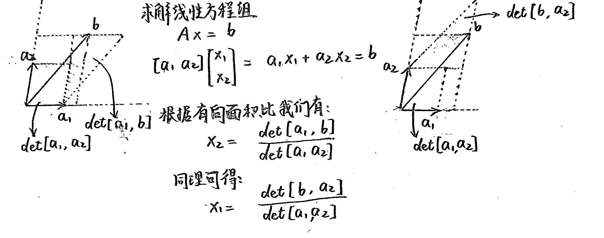
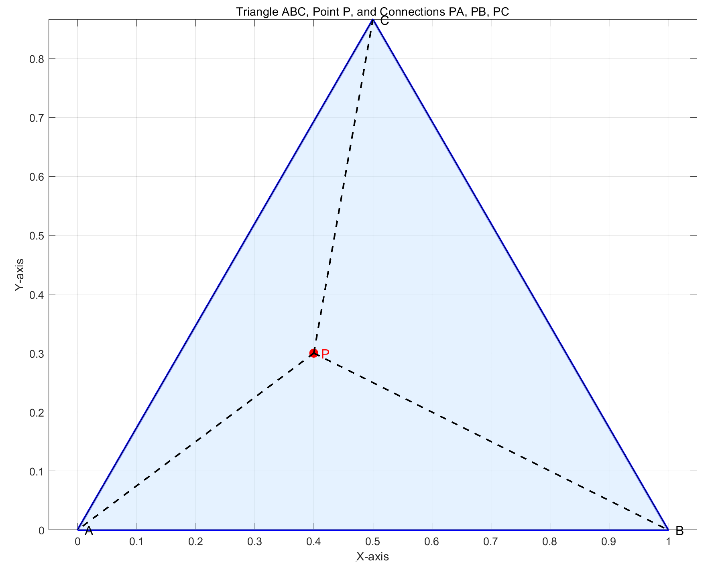
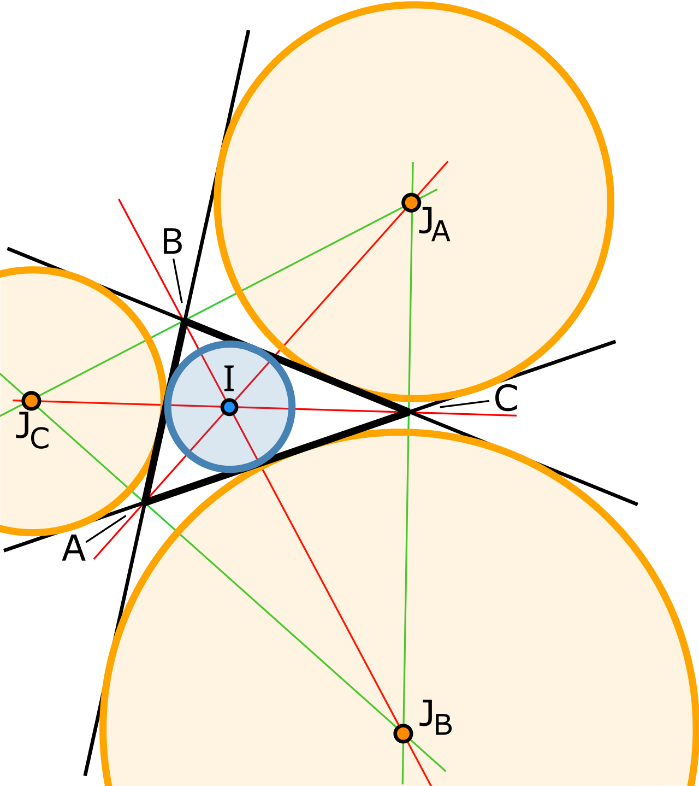

# FDU 高等线性代数 8. 解析几何

本文根据邵美悦老师授课内容整理而成，并参考了以下教材：  

* Convex Optimization (S. Boyd & L. Vandenberghe) Chapter $2$
* 凸优化 (S. Boyd & L. Vandenberghe) 第 $2$ 章

欢迎批评指正!

## 8.1 常用的几何对象

### 8.1.1 仿射集合

给定向量集合 $S \subseteq \mathbb R^n$   
若对于任意 $\begin{cases} x,y \in S\\ \alpha \in \mathbb R \end{cases}$ 都有 $\alpha x+(1-\alpha)y \in S$，则称 $S$ 是一个**仿射集合** (affine set).

- 更直观的定义是：  
  若 $S$ 任意两个不同点 $x,y$ 所确定的**直线** $l_{xy} = \{\alpha x + (1-\alpha)y:\alpha \in \mathbb R\}$ 都包含于 $S$，  
  则称向量集合 $S \subseteq \mathbb R^n$ 是一个**仿射集合**.

- 上述定义可以推广到多个点的情况:  
  向量集合 $S \subseteq \mathbb R^n$ 为**仿射集合**，  
  当且仅当对于任意 $\begin{cases} k \geq 2 \in \mathbb N_+\\ x_1,x_2,\dots ,x_k \in S\\ \alpha_1,\alpha_2,\dots,\alpha_k \in \mathbb R\\ \alpha_1 + \alpha_2 + \dots + \alpha_k = 1 \end{cases}$     
  其**仿射组合** (affine combination) $\alpha_1 x_1 + \alpha_2 x_2 + \dots + \alpha_kx_k \in S$ 

****

**从几何的角度来说，仿射集合可以表示为 $\mathbb R^n$ 的一个子空间加上一个偏移量.**  
为说明这一点，考虑仿射集合 $S \subseteq \mathbb R^n$  
给定 $x_0 \in S$，记集合 $V = S- x_0 = \{x-x_0 \ |\ x\in S\}$   
对于任意 $\begin{cases} v_1,v_2 \in V\\ \alpha_1,\alpha_2 \in \mathbb R \end{cases}$ 有 $\begin{cases} v_1 + x_0 \in S\\ v_2 + x_0 \in S \end{cases}$   
进而有 $\alpha_1 (v_1 + x_0) +\alpha_2 (v_2 + x_0) + (1-\alpha_1-\alpha_2)x_0 \in S$   
化简后即 $\alpha_1 v_1 + \alpha_2 v_2 + x_0 \in S$   
因而有 $\alpha_1 v_1 + \alpha_2 v_2 \in V$   
这说明集合 $V = S- x_0 = \{x-x_0\ |\ x\in S\}$ 对向量加法和数乘封闭，  
因此 $V$ 是 $\mathbb R^n$ 的子空间.  
所以**仿射集合** $S$ **可以表示为** $\mathbb R^n$ **的一个子空间** $V$ **加上一个偏移量** $x_0$，  
即 $S = V + x_0 = \{v+x_0 \ | \ v \in V\}$ 

**与仿射集合 $S \subseteq \mathbb R^n$ 关联的子空间 $V \subseteq \mathbb R^n$ 的唯一性很好证明：**  
对于任意 $\begin{cases} x_0^{(1)} , x_0^{(2)} \in S\\ x_0^{(1)}\neq x_0^{(2)} \end{cases}$，记 $\begin{cases} V_1  = S - x_0^{(1)}\\ V_2  = S - x_0^{(2)} \end{cases}$  
我们可以构造 $V_1,V_2$ 之间的同构 $f(v) = v + x_0^{(1)} - x_0^{(2)}\ \ \ (\forall \ v\in V_1)$   
这说明 $V_1 ,V_2$ 是 $\mathbb R^n$ 的同一子空间.  
因此**与仿射集合 $S \subseteq \mathbb R^n$ 关联的子空间 $V \subseteq \mathbb R^n$ 和偏移量 $x_0 \in S$ 的选取无关**，  
偏移量 $x_0$ 可以是仿射集合 $S$ 中的任意一点.

****

一个有趣的事实:  
**任意仿射集合 $S\in \mathbb R^n$ 都能等价表示为一个 $n$ 维线性方程组的解集.**  
(值得注意的是，这样的表示不是唯一的，从充分性的证明中可窥见一二)  

- $\mathbb R^n$ 中的 $1$ 维仿射空间 $\{b+\alpha v:\alpha\in \mathbb R\}$ 称为**直线**.  
  其中 $v,b$ 是 $\mathbb R^n$ 中给定的向量，且 $v\neq 0_n$ 
  
- $\mathbb R^{n}$ 中的 $n-1$ 维仿射空间 $\{x\in \mathbb R^n:w^{\mathrm T}x + \alpha = 0\}$ 称为**超平面**.  
  其中 $w$ 是 $\mathbb R^n$ 中给定的非零向量，$\alpha\in \mathbb R$ 是给定标量.
  
- 我们称 $\mathbb R^n$ 中形如 $\{x\in \mathbb R^n:w^{\mathrm T}x \geq  \alpha\}$ 的子集称为**闭半空间**.  
  我们称 $\mathbb R^n$ 中形如 $\{x\in \mathbb R^n:w^{\mathrm T}x > \alpha\}$ 的子集称为**开半空间**.   
  它们均可视为线性不等式的解集.  

- **多面体** (Polyhedron, pl: Polyhedra) 是有限个半空间和超平面的交集.  
  一般可以表示为: (假设有 $m$ 个半空间和 $p$ 个超平面)
  $$
  \{x\in \mathbb R^n: Ax \preceq  b,Cx =d\}\text{ where }
  \begin{cases} 
  A \in \mathbb R^{m\times n}\\ 
  b \in \mathbb R^{m}\\ 
  C \in \mathbb R^{p\times n}\\ 
  d\in \mathbb R^p \end{cases}
  $$
  其中 $\preceq$ 代表 $\mathbb R^{m}$ 上的广义不等关系.  
  由于交集运算是保凸的，故多面体一定是凸集.

**证明:**

- **① 必要性:**    
  给定 $\begin{cases} m \in \mathbb N_+\\ A\in \mathbb R^{m\times n}\\ \ b \in \mathbb R^m \end{cases}$    
  记线性方程组 $Ax=b$ 的解集为 $S = \{x\in \mathbb R^n \ |\ Ax=b\}$   
  对于任意 $\begin{cases} x_1, x_2 \in S\\ \alpha \in \mathbb R \end{cases}$ 有:  
  $$
  \begin{align}
  A[\alpha x_1 + (1-\alpha)x_2]
  &=
  \alpha Ax_1 + (1-\alpha) Ax_2\\
  &=
  \alpha b +(1-\alpha)b\\
  &=
  b
  \end{align}
  $$
  因此有 $\alpha x_1 + (1-\alpha)x_2 \in S$   
  这说明解集 $S = \{x\in \mathbb R^n \ |\ Ax=b\}$ 是一个仿射集合.  
  而且我们可以知道:  
  若已知某个 $x_0 \in S$，则仿射集合 $S$ 可表示为 $S = \text{Ker}(A) + x_0$，则它是 $\mathbb R^n$ 的子空间.   
  其中 $\text{Ker}(A)= \{x\in \mathbb R^n \ |\ Ax=0_m\}$ 是**线性映射** (表示矩阵) $A$ 的零空间.

- **② 充分性:**  
  给定仿射集合 $S\subseteq \mathbb R^n$ 和其中的一点 $x_0 \in S$  
  根据之前的结论，集合 $V = S- x_0 = \{x-x_0\  |\  x\in S\}$ 是 $\mathbb R^n$ 的一个子空间.  
  我们记 $\mathbb R^n$ 中子空间 $V$ 的正交补空间为 $V^\bot$   
  我们可以构造一个**线性变换** $A\in \mathbb R^{n\times n}$，  
  它在 $V^\bot$ 上的作用是**恒等映射**，而在 $V$ 上的作用是**零映射**，即 $\begin{cases} A V^\bot = V^\bot\\ AV = O_n \end{cases}$   
  那么这个线性变换 $A\in \mathbb R^{n\times n}$ 的零空间 $\text{Ker} (A) =V$   
  于是仿射集合 $S$ 可表示为 $S = \text{Ker}(A) + x_0  = \{x+x_0:\begin{cases}x\in \mathbb R^n\\ Ax = 0_m\end{cases}\}$   

  记 $b := Ax_0$，再将上式中的 $x+x_0$ 复用记号为 $x$，则 $S=\{x\in \mathbb R^n : Ax=b\}$   
  表明仿射集合 $S$ 是线性方程组 $Ax=0_m$ 的解集.  
  (值得说明的是，上述充分性证明中 $A$ 的构造是不唯一的)  

### 8.1.2 凸集

**仿射集合是隶属于凸集的概念，仿射集合可视为凸集的特例.**   
(请注意对比二者的定义)  
给定向量集合 $S \subseteq \mathbb R^n$  
若对于任意 $\begin{cases} x,y \in S\\ 0 \leq \alpha \leq 1 \end{cases}$ 都有 $\alpha x+(1-\alpha)y \in S$，则称 $S$ 是一个**凸集**.  

- 更直观的定义是：  
  若 $S$ 任意两个不同点 $x,y$ 所确定的**线段** $s_{xy}= \{\alpha x + (1-\alpha)y:\alpha \in [0,1]\}$ 都包含于 $S$，  
  则称向量集合 $S \subseteq \mathbb R^n$ 是一个**凸集**.

- **上述定义可以推广到多个点的情况**：  
  向量集合 $S \subseteq \mathbb R^n$ 为**凸集**，  
  当且仅当对于任意 $\begin{cases} k \geq 2 \in \mathbb N_+\\ x_1,x_2,\dots ,x_k \in S\\ \alpha_1,\alpha_2,\dots,\alpha_k \in \mathbb R\\ \alpha_1 + \alpha_2 + \dots + \alpha_k = 1 \\ \alpha _1 ,\alpha_2,\dots,\alpha_k \geq 0\end{cases}$  
  其**凸组合** (convex combination) $\alpha_1 x_1 + \alpha_2 x_2 + \dots + \alpha_kx_k \in S$ 

- 给定集合 $S\subseteq \mathbb R^n$  
  我们称 $S$ 中的点的**所有凸组合**构成的集合为 $S$ 的**凸包** (convex hull)，记为 $\text{conv} (S)$  
  易知 $\text{conv} (S)$ 是包含 $S$ 的最小的凸集，  
  且 $S$ 为凸集当且仅当 $\text{conv}(S) = S$.  

若凸集 $S$ 中的某一点 $v$ 不能表示为其他点的凸组合，则我们称 $v$ 为 $S$ 的一个**顶点** (vertex)  

- **(Krein-Milman 定理)** 非空有界闭凸集使其所有顶点的凸包.
- [(Linear Program)](https://math.stackexchange.com/questions/896388/why-does-the-maximum-minimum-of-linear-programming-occurs-at-a-vertex) 线性规划的最优解如果存在，则一定可以在可行域的顶点取到.

*****

有界的多面体称为**多胞体** (Polytope)  
它可以表示为有限个点的凸包:
$$
\text{conv}\{x_1,x_2,\dots,x_k\} = 
\{\alpha_1 x_1+\dots+\alpha_k x_k: \alpha\succeq 0_k,1_k^{\mathrm T}\alpha = 1\}
$$
最简单的一类多胞体 (Polytope) 是**单纯形** (Simplex)  
设 $k+1$ 个向量 $x_0,x_1,\dots,x_k$ **仿射独立** (affinely independent)  
即 $x_1-x_0,\dots,x_k-x_0$ **线性独立** (linearly independent)  
则 $x_0,x_1,x_2,\dots,x_k$ 所确定的单纯形为 $\text{conv}\{x_0,x_1,x_2,\dots,x_k\}$   
其仿射维数为 $k$，因此称为 $\mathbb R^n$ 空间的 $k$ 维单纯形.  
常见的单纯形有：  

- $1$ 维单纯形是线段，$2$ 维单纯形是三角形 (包括内部)，$3$ 维单纯形是四面体.
- **单位单纯形** (unit simplex) 为 $\text{conv}\{0,e_1,\dots,e_n\} = \{x\in \mathbb R^n:x\succeq 0_n,1_n^{\mathrm T}x \leq 1\}$   
  其中 $e_1,\dots,e_n$ 为 $\mathbb R^n$ 的标准基向量，这是一个 $n$ 维单纯形.
- **概率单纯形** (probability simplex) 为 $\text{conv}\{e_1,\dots,e_n\} = \{x\in \mathbb R^n: x \succeq 0_n, 1^{\mathrm T}x=1\}$   
  这是一个 $n-1$ 维单纯形，其任意一点 $x$ 的 $n$ 个分量分别代表某一离散分布的 $n$ 个概率.

****

与凸集相关的定理: [FDU 最优化方法 2. 凸集 - 知乎](https://zhuanlan.zhihu.com/p/678323242)

- **(凸集分离定理)**    
  对于任意给定的两个不相交的凸集 $C_1,C_2 \subset \mathbb R^n$，  
  我们总能找到一个超平面 $\{x\in \mathbb R^n:a^{\mathrm T}x =b\}\ (a\neq 0_n)$ 将 $C_1,C_2$ 分离开来.  
  我们称 $\{x\in \mathbb R^n:a^{\mathrm T}x =b\}\ (a\neq 0_n)$ 为 $C_1,C_2$ 的**分离超平面**  

  所谓 "(非严格)分离"，就是指分离超平面对应的仿射函数 $f(x) = a^{\mathrm T}x-b$ 能够 (非严格) 区分 $C_1,C_2$，  
  假设分离超平面的法向量 $a \neq 0_n \in \mathbb R^n$ 指向 $C_2$ 所在的一侧，则我们有:   
  $$
  \begin{cases} 
  f(x) = a^{\mathrm T}x-b \leq 0, &\text{if}\ x\in C_1\\ 
  f(x) = a^{\mathrm T}x-b \geq 0, &\text{if}\ x\in C_2 \end{cases}
  $$

- **(支撑超平面定理)**   
  对于任意非空凸集 $C\subset \mathbb R^n$ 和任意 $x_0 \in \text{bd}(C) = \text{cl}(C)\backslash\text{int}(C)$  
  $C$ 在 $x_0$ 处总存在支撑超平面，即存在 $a\neq 0_n\in \mathbb R^n$ 使得对于任意 $x\in C$ 都有 $a^{\mathrm T}(x-x_0) \leq 0$ 成立.  
- **(Brouwer 不动点定理)**  
  若 $C\subset \mathbb R^n$ 是非空有界闭凸集，$f:C\mapsto C$ 是连续映射，  
  则存在 $x\in C$ 使得 $f(x)=x$ 

- **(投影)** 单点集 $\{x\}$ 到任意凸集 $C$ (可以是无界集)，一定可以取到距离的最小值:
  $$
  \text{dist} (x,C) = \inf_{y\in C} \|x-y\|_2 = \min_{y\in C} \|x-y\|_2 = \|x-p\|_2
  $$
  其中 $p$ 是 $x$ 在 $C$ 上的投影，也就是说 $p:=\arg\min_{y\in C}\|x-y\|_2$ 

***

凸函数在定义域 (也是凸集) 的内部是连续的，在边界上可以不连续.

### 8.1.3 锥

**锥是独立于凸集的概念.**  
给定向量集合 $S \subseteq \mathbb R^n$  
若对于任意 $\begin{cases} x \in S\\ \alpha \geq 0 \end{cases}$ 都有 $\alpha x \in S$，  
则称 $S$ 是一个**锥**，又称**非负齐次(集)** (nonnegative homogeneous).  

- 更直观的定义是:  
  若 $S$ 任意一点 $x$ 和原点所确定的**射线** $r_{Ox}= \{\alpha x:\alpha \geq 0\}$ 都包含于 $S$，  
  则称向量集合 $S \subseteq \mathbb R^n$ 是一个**锥**.

- 若 $S \subseteq \mathbb R^n$ 是一个锥，同时又是一个凸集，  
  则我们称 $S$ 是一个**凸锥** (convex cone)  
  结合锥和凸集的定义容易证明：  
  $S \subseteq \mathbb R^n$ 为凸锥当且仅当对于任意 $\begin{cases} x_1,x_2 \in S\\ \alpha_1,\alpha_2 \geq 0 \end{cases}$ 都有 $\alpha_1 x_1+\alpha_2 x_2 \in S$ 成立.  

- **上述定义可以推广到多个点的情况:**  
  向量集合 $S \subseteq \mathbb R^n$ 为**凸锥**，  
  当且仅当对于任意 $\begin{cases} k \geq 2 \in \mathbb N_+\\ x_1,x_2,\dots ,x_k \in S\\ \alpha_1,\alpha_2,\dots,\alpha_k \geq 0\end{cases}$  
  其**锥组合** (conic combination) $\alpha_1 x_1 + \alpha_2 x_2 + \dots + \alpha_kx_k \in S$  

- 给定集合 $S\subseteq \mathbb R^n$  
  我们称 $S$ 中的点的**所有锥组合**构成的集合为 $S$ 的**锥包** (conic hull)，记为 $\text{cone}(S)$  
  易知 $\text{cone}(S)$ 是包含 $S$ 的最小的凸锥，  
  且 $S$ 为凸锥当且仅当 $\text{cone}(S) = S$. 
- 给定凸锥 $S\subseteq \mathbb R^n$   
  我们定义**对偶锥**为 $S^*:=\{y\in \mathbb R^n:y^{\mathrm T}x \geq 0\text{ for all }x\in S\}$   
  若 $S\subseteq \mathbb R^n$ 是闭凸锥，则它是自对偶的: $(S^*)^* = S$ 

****

考虑 $n$ 阶 Hermite 半正定阵构成的集合 $\mathbb S^n_+$ (半定锥)  
设 $A$ 的谱分解为 $A=\sum_{i=1}^n \lambda_i(A) q_iq_i^{\mathrm H}$   
显然 $A$ 在 $\mathbb S^n_+$ 中的投影为 $\prod_{\mathbb S^n_+} (A) = \sum_{i=1}^n \max\{\lambda_i(A),0\}q_iq_i^{\mathrm H}$   
我们可以验证它在 Frobenius 范数的意义下达到距离的最小值:  
$$
\begin{align}
\|A-H\|_{\mathrm F}^2
&\geq 
\sum_{i=1}^n (\lambda_i(A) - \lambda_i(H))^2\quad (\text{Hoffman-Wielandt})\\
&\geq
\sum_{\lambda_i(A)<0} (\lambda_i(A))^2\\
&=
\left\|\sum_{\lambda_i(A)<0} \lambda_i(A) q_iq_i^{\mathrm H}\right\|^2_{\mathrm F}\\
&=
\left\|\sum_{i=1}^n \lambda_i(A)q_iq_i^{\mathrm H}-\sum_{i=1}^n \max\{\lambda_i(A),0\}q_iq_i^{\mathrm H}\right\|^2_{\mathrm F}\\
&=
\left\|
A - \prod_{\mathbb S^n_+} (A)
\right\|_{\mathrm F}^2
\end{align}\quad (\forall\ H\in \mathbb S^n_+)
$$

## 8.2 仿射几何

### 8.2.1 仿射映射

保持仿射性的映射 $F:\mathbb R^n\mapsto \mathbb R^m$ 称为**仿射映射**. 
$$
F(\alpha x + (1-\alpha)y) 
=
\alpha F(x) + (1-\alpha) F(y)\quad (\forall\ x,y\in \mathbb R^{n},\alpha\in \mathbb R)
$$
仿射映射可以表示为一个线性映射加上一个偏移量: $F(x) = L(x) + b\ (\forall\ x\in \mathbb R^n)$   
其中线性映射 $L(\cdot)$ 满足:  
$$
L(\alpha x + \beta y) = \alpha L(x) + \beta L(x)\quad (\forall\ x,y\in \mathbb R^n,\alpha,\beta\in \mathbb R)
$$
仿射映射还可等价表示为:  
$$
y = F(x) = Ax+b\\
\Leftrightarrow\\
\begin{bmatrix}
y\\
1
\end{bmatrix}
=
\begin{bmatrix}
F(x)\\
1
\end{bmatrix}
=
\begin{bmatrix}
A & b\\
& 1
\end{bmatrix}
\begin{bmatrix}
x\\
1
\end{bmatrix}
$$
仿射映射可以保持:

- ① 点的共线/共面
- ② 直线或曲线的相交/相切
- ③ 平行线段比、面积比和体积比
- ④ 重心坐标

三角形在仿射变换下是等价的 (因此一般的三角形可通过仿射变换变为简单的三角形, 例如正三角形)  
椭圆在仿射变换下是等价的 (因此一般的椭圆可通过仿射变换变为单位圆)  
例如求椭圆 $x^2 + xy + y^2 = 5$ 的内接三角形的面积最大值，  
可以通过仿射变换将问题转化为求单位圆的内接三角形的面积最大值   
(当且仅当内接三角形为正三角形时取到)  
(这个结论有个错误证明: 非等腰的内接三角形取不到最大值，不能逻辑严密地推出只能在等边三角形时取最大值，尽管事实的确如此) 

****

常用的可逆仿射变换:  
平移变换、旋转变换、镜像变换、伸缩变化、错切变换.  
$$
\text{2D: }\begin{bmatrix}
x_{\text{new}}\\
y_{\text{new}}\\
1
\end{bmatrix} = A \begin{bmatrix}
x\\
y\\
1
\end{bmatrix} 
=
\begin{bmatrix}
a_{11} & a_{12} & a_{13}\\
a_{21} & a_{22} & a_{23}\\
0 & 0 & 1
\end{bmatrix}
\begin{bmatrix}
x\\
y\\
1
\end{bmatrix}\\
$$

### 8.2.2 行列式

给定矩阵 $A=[a_1,\dots,a_n]\in \mathbb C^{n\times n}$  
设 $\mathbb C^{n\times n}\mapsto \mathbb C$ 的泛函 $f(\cdot)$ 满足以下性质:

- ① 关于矩阵的列是线性的:  
  $$
  \begin{align}
  &f(a_1,\dots,a_{i-1},\alpha a_i+\beta b_i,a_{i+1},\dots,a_n)\\
  &=
  \alpha f(a_1,\dots,a_{i-1},a_i,a_{i+1},\dots,a_n)
  +
  \beta f(a_1,\dots,a_{i-1},b_i,a_{i+1},\dots,a_n)\\
  &(\forall\ a_1,\dots,a_n,b_i\in \mathbb C^n,\alpha,\beta\in \mathbb C\text{ and }i=1,\dots,n)
  \end{align}
  $$

- ② 交错性: (即列交换后泛函值取反)
  $$
  f(\dots,a_j,\dots,a_{i},\dots) = - f(\dots,a_i,\dots,a_j,\dots)\quad (\forall\ j>i)
  $$
  这保证了如果 $A$ 列线性相关，则 $f(A)$ 的值为 $0$

- ③ 保持单位阵为 $1$:  
  $$
  f(I_n) = f(e_1,\dots,e_n) = 1
  $$
  其中 $e_1,\dots,e_n$ 为 $\mathbb C^n$ 的标准正交基.

记 $A=[a_{ij}]_{i,j=1}^n$，则我们有:  
$$
\begin{align}
f(A)
&=
f(a_1,\dots,a_n)\\
&=
f\left(\sum_{i_1=1}^n a_{i_1,1}e_{i_1},\dots,\sum_{i_n=1}^n a_{i_n,n}e_{i_n}\right)\\
&=
\sum_{i_1=1}^n\dotsm \sum_{i_n=1}^na_{i_1,1}\dotsm a_{i_n,n} f(e_{i_1},\dots,e_{i_n})
\end{align}
$$
注意到 $f(e_{i_1},\dots,e_{i_n})\neq 0$ 当且仅当 $i_1,\dots,i_n$ 互不相等 (即是 $\{1,\dots,n\}$ 的排列)  
若 $i_1,\dots,i_n$ 相对于 $\{1,\dots,n\}$ 的自然排列进行了奇数次交换，则 $f(e_{i_1},\dots,e_{i_n})=-1$  
若 $i_1,\dots,i_n$ 相对于 $\{1,\dots,n\}$ 的自然排列进行了偶数次交换，则 $f(e_{i_1},\dots,e_{i_n})=1$    
换言之，当 $i_1,\dots,i_n$ 是 $\{1,\dots,n\}$ 的一个排列时，我们有 $f(e_{i_1},\dots,e_{i_n})=\text{sgn}(i_1,\dots,i_n)$ 成立.  
于是我们有:  
$$
\begin{align}
f(A)
&=
\sum_{i_1=1}^n\dotsm \sum_{i_n=1}^na_{i_1,1}\dotsm a_{i_n,n} f(e_{i_1},\dots,e_{i_n})\\
&=
\sum_{\pi\in S_n} \text{sgn}(\pi) a_{\pi(1),1}\dotsm a_{\pi(n),n}\\
&=
\det(A)
\end{align}
$$
因此行列式是唯一的能够保持单位阵为 $1$ 的**交错多线性泛函**.

****

**行列式的几何意义:**  
若 $a_1,\dots,a_n\in \mathbb R^n$, 则 $\det([a_1,\dots,a_n])$ 代表由棱 $a_1,\dots,a_n$ 生成的 $n$ 维平行多面体的有向体积 (比).

- 行列式的交错性质就是为了给体积定方向 (正向为正值，反向为负值)  
  这样做的好处是可以使得几何问题代数化.  
- 行列式理解成有向体积比会更好，其中 $1$ 就是单位阵的行列式对应的有向体积.

**(Cramer 法则)**  
若 $a_1,\dots,a_n,x,b\in \mathbb F^n$，且 $\det([a_1,\dots,a_n])\neq 0$，  
则关于 $x$ 的线性方程组 $[a_1,\dots,a_n]x=b$ 有唯一解 $x_\star$，其第 $k$ 个分量 $e_k^{\mathrm H}x_\star$ 满足:  
$$
e_k^{\mathrm H}x_\star = \frac{\det([a_1,\dots,a_{k-1},b,a_{k+1},\dots,a_n])}{\det([a_1,\dots,a_{k-1},a_k,a_{k+1},\dots,a_n])}\quad (k=1,\dots,n)
$$

- Cramer 法则的一种不自然的证法:  
  $$
  A\text{adj}(A) = \text{adj}(A) A = \det(A) I_n\\
  \Leftrightarrow\\
  A^{-1} = \frac{\text{adj}(A)}{\det(A)}\\
  \Leftrightarrow\\
  x = A^{-1}b = \frac{\text{adj}(A) b}{\det(A)}
  $$
  最后比较 $x$ 和 $\frac{\text{adj}(A) b}{\det(A)}$ 的元素得到 Cramer 法则.

- 我们可以通过行列式的几何意义给出 **Cramer 法则**的一种理解.   
  

****

**[(15-puzzle)](https://oi-wiki.org/misc/15-puzzle/)**  
可解性规则:  
假设游戏网格的宽度是偶数 (例如 $4\times 4$)  
目标空格所在的行 (从下往上计数) 与逆序数的奇偶性相同，则可解; 否则不可解.  
(在排列中，逆序数是指相邻两个数字中，左侧数字比右侧数字大的对数)  
例如以下问题无解: (其中 $16$ 代表空格)
$$
\begin{bmatrix}
1 & 2 & 3 & 4\\
5 & 6 & 7 & 8\\
9 & 10 & 11 & 12\\
13 & \boxed{15} & \boxed{14} & 16
\end{bmatrix}\to \begin{bmatrix}
1 & 2 & 3 & 4\\
5 & 6 & 7 & 8\\
9 & 10 & 11 & 12\\
13 & \boxed{14} & \boxed{15} & 16
\end{bmatrix}
$$

目标空格在最后一行，行号为 $1$ (从下往上计数, 奇数行)  
初始状态逆序数为 $1$ (奇数)，但目标状态的逆序数为 $0$ (偶数)   
因此排列的奇偶性不同，该问题无解.

### 8.2.3 重心坐标

> 有界的多面体称为**多胞体** (Polytope)  
> 它可以表示为有限个点的凸包:
> $$
> \text{conv}\{x_1,x_2,\dots,x_k\} = 
> \{\alpha_1 x_1+\dots+\alpha_k x_k: \alpha\succeq 0_k,1_k^{\mathrm T}\alpha = 1\}
> $$
> 最简单的一类多胞体 (Polytope) 是**单纯形** (Simplex)  
> 设 $k+1$ 个向量 $x_0,x_1,\dots,x_k$ **仿射独立** (affinely independent)  
> 即 $x_1-x_0,\dots,x_k-x_0$ **线性独立** (linearly independent)  
> 则 $x_0,x_1,x_2,\dots,x_k$ 所确定的单纯形为 $\text{conv}\{x_0,x_1,x_2,\dots,x_k\}$   
> 其仿射维数为 $k$，因此称为 $\mathbb R^n$ 空间的 $k$ 维单纯形.  
> 常见的单纯形有：  
>
> - $1$ 维单纯形是线段，$2$ 维单纯形是三角形 (包括内部)，$3$ 维单纯形是四面体.
> - **单位单纯形** (unit simplex) 为 $\text{conv}\{0,e_1,\dots,e_n\} = \{x\in \mathbb R^n:x\succeq 0_n,1_n^{\mathrm T}x \leq 1\}$   
>   其中 $e_1,\dots,e_n$ 为 $\mathbb R^n$ 的标准基向量，这是一个 $n$ 维单纯形.
> - **概率单纯形** (probability simplex) 为 $\text{conv}\{e_1,\dots,e_n\} = \{x\in \mathbb R^n: x \succeq 0_n, 1^{\mathrm T}x=1\}$   
>   这是一个 $n-1$ 维单纯形，其任意一点 $x$ 的 $n$ 个分量分别代表某一离散分布的 $n$ 个概率.

[(Barycentric coordinate system - Wikipedia)](https://en.wikipedia.org/wiki/Barycentric_coordinate_system) 
若 $x_0,x_1,\dots,x_n$ 是 $\mathbb R^n$ 中某个单纯形的顶点，  
则对于任意 $x\in \mathbb R^n$ 都存在唯一的一组常数 $\alpha_0,\alpha_1,\dots,\alpha_n$ 使得:  
$$
x = \alpha_0 x_0 + \alpha_1 x_1 + \dotsm + \alpha_n x_n
$$
我们称 $[\alpha_0,\alpha_1,\dots,\alpha_n]$ 为 $x$ 关于 $x_0,x_1,\dots,x_n$ 的**重心坐标** (barycentric coordinate)  
(与 $[\alpha_0,\alpha_1,\dots,\alpha_n]$ 有着相同比例的坐标也可称为重心坐标, 即用比例关系代表一个点)

****

以 $\mathbb R^2$ 为例，考虑三角形 $\triangle ABC$ 和 $\mathbb R^2$ 中的一点 $P$:

$$
P = \alpha A + \beta B + \gamma C\\
\text{where }\alpha + \beta + \gamma = 1\\
\Leftrightarrow\\
\begin{bmatrix}
p_x\\
p_y\\
1
\end{bmatrix}
=
\begin{bmatrix}
a_x & b_x & c_x\\
a_y & b_y & c_y\\
1 & 1 & 1
\end{bmatrix}
\begin{bmatrix}
\alpha\\
\beta\\
\gamma
\end{bmatrix}
$$
我们有如下关系:  
$$
\begin{align}
\alpha 
&=
\frac{\frac12\det 
\begin{bmatrix}
p_x & b_x & c_x\\
p_y & b_y & c_y\\
1 & 1 & 1
\end{bmatrix}}
{\frac12 
\det
\begin{bmatrix}
a_x & b_x & c_x\\
a_y & b_y & c_y\\
1 & 1 & 1
\end{bmatrix}}
=
\frac{S_{\triangle PBC}}{S_{\triangle ABC}}\\

\beta
&=
\frac{\frac12\det 
\begin{bmatrix}
a_x & p_x & c_x\\
a_y & p_y & c_y\\
1 & 1 & 1
\end{bmatrix}}
{\frac12 
\det
\begin{bmatrix}
a_x & b_x & c_x\\
a_y & b_y & c_y\\
1 & 1 & 1
\end{bmatrix}}
=
\frac{S_{\triangle APC}}{S_{\triangle ABC}}\\

\gamma
&=
\frac{\frac12\det 
\begin{bmatrix}
a_x & b_x & p_x\\
a_y & b_y & p_y\\
1 & 1 & 1
\end{bmatrix}}
{\frac12 
\det
\begin{bmatrix}
a_x & b_x & c_x\\
a_y & b_y & c_y\\
1 & 1 & 1
\end{bmatrix}}
=
\frac{S_{\triangle ABP}}{S_{\triangle ABC}}
\end{align}
$$
三角线性插值:
$$
P = A\alpha + B\beta + C\gamma\\
f(P) = f(A)\alpha + f(B)\beta + f(C)\gamma
$$

****

**三角形的五心:**

- **① 重心 (centroid)**   
  重心是三角形三条中线的交点，也是顶点的质心.  
  其重心坐标为 $[1:1:1]$ 

- **② 内心 (incenter)**  
  内心是三角形三条角平分线的交点，也是内切圆的圆心.  
  其重心坐标为 $[a:b:c]$   
  其中我们使用 $a,b,c$ 简记三角形的边 $BC,AC,AB$
  
- **③ 垂心 (orthocenter)**  
  垂心是三角形三条高线的交点.  
  其重心坐标为 $[\tan(A):\tan(B):\tan(C)]$   
  其中我们使用 $A,B,C$ 简记三角形的内角 $\angle BAC,\angle ABC,\angle BCA$   

- **④ 外心 (circumcenter)**  
  外心是三角形三条中垂线的交点，也是外接圆的圆心.  
  其重心坐标为 $[\sin(2A):\sin(2B):\sin(2C)]$  
  其中我们使用 $A,B,C$ 简记三角形的内角 $\angle BAC,\angle ABC,\angle BCA$   

- **⑤ 旁心 (excenters)**  
  旁心是三角形一条内角平分线和两条外角平分线的交点，即某一边的外切圆圆心.  

  

  其中 $A$ 对应的旁心 $I_A$ 的重心坐标为 $[-a,b,c]$   
  $B$ 对应的旁心 $I_B$ 的重心坐标为 $[a,-b,c]$    
  $C$ 对应的旁心 $I_C$ 的重心坐标为 $[a,b,-c]$

### 8.2.4 射影几何

**射影几何** (projective geometry)    
它是仿射几何的推广，放弃了对平行线段比的保持，只保持了相交关系.  
(例如拍摄不是仿射变换，而是射影变换)  
齐次坐标 (放弃了最后一列 $1,1,1$)  
重心坐标就是一种齐次坐标.

**The End**
