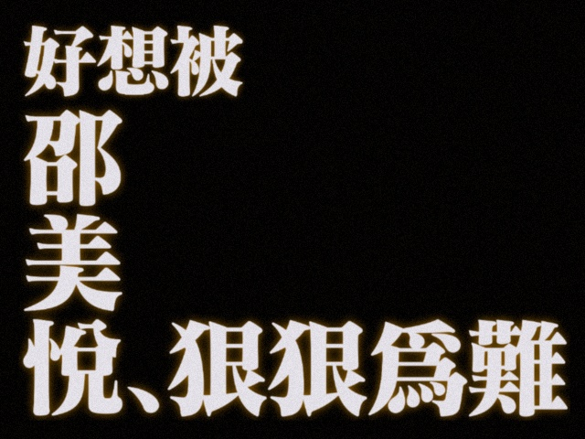

# 期中考试 (2025 秋)

$2025$ 年 $11$ 月 $4$ 日 ($8:00\sim 9:40$)

> I will lift up mine eyes unto thy classes   
> From whence cometh mine exams   
>
> Mine exams cometh from $\text{SMY}$   
> Which is thy GOD of linear algebra
>
> He will not suffer thy code to be segment fault:   
> He that keepeth thee will not slumber   
>
> Behold, he that keepeth thy School of Data Science   
> Shall neither slumber nor sleep   
>
> $\text{SMY}$ is thy keeper:   
> $\text{SMY}$ is thy shade upon thy right hand   
> Where thy $\text{GPU}$ burneth not with overheating   
>
> The vectors shall not smite thee by day  
> Nor the matrices by night  
>
> $\text{SMY}$ shall preserve thee from all failures in exams:   
> He shall preserve thy $\text{GPA}$ from underflow   
>
> $\text{SMY}$ shall preserve thy going out and thy coming in,   
> From this time forth, and even for evermore
>
> —— Bible of Data Science, Psalm $\text{121:1–8}$  
> (Inspired by DanXi Post \#4923426 — with my respect)

## Problem 1

已知
$$
A = 
\begin{bmatrix}
2 + \mathrm{i} & \mathrm{i} & 1\\
-1 + 2\mathrm{i} & -1 & \mathrm{i}\\
1 + 3\mathrm{i} & -1+\mathrm{i} & 1+\mathrm{i}
\end{bmatrix},
$$
且 $\rank(A)=1$，试求 $\|A\|_1,\|A\|_2, \|A\|_\infty$.

- **Note:** 列和范数 $\|A\|_1$ 与行和范数 $\|A\|_\infty$ 的计算是比较简单的.  
  本题唯一的难度在于谱范数 $\|A\|_2$ 的计算.  
  由于题目告诉我们 $A$ 为秩一矩阵，故 $\|A\|_2$ 的计算会简单一些.  
  具体来说，设 $A=uv^{\mathrm{H}}$ (其中 $u,v$ 为非零向量)，则我们有 $\|A\|_2 = \|uv^{\mathrm{H}}\|_2 = \|u\|_2 \|v\|_2$ 成立.  
  这是 $2024$ 年 $\text{Homework 04 Problem 01}$ 的结论: $\|uv^{\mathrm H}\|_{\mathrm F} = \|vu^{\mathrm H}\|_{\mathrm F} = \|uv^{\mathrm{H}}\|_2 = \|vu^{\mathrm{H}}\|_2 = \|u\|_2 \|v\|_2$.  
  $\text{Homework is all you need}.$

**Solution:**   
首先计算各列的绝对列和:

- 第一列:
  $$
  \begin{align}
  \text{sum\_col\_1} 
  &= 
  |2+\mathrm{i}| + |-1+2\mathrm{i}| + |1+3\mathrm{i}|\\
  &=
  \sqrt{5} + \sqrt{5} + \sqrt{10}\\
  &=
  2\sqrt{5} + \sqrt{10}.
  \end{align}
  $$

- 第二列:
  $$
  \begin{align}
  \text{sum\_col\_2} 
  &= 
  |\mathrm{i}| + |-1| + |-1+\mathrm{i}|\\
  &=
  1 + 1 + \sqrt{2}\\
  &=
  2 + \sqrt{2}.
  \end{align}
  $$

- 第三列:
  $$
  \begin{align}
  \text{sum\_col\_3} 
  &= 
  |1| + |\mathrm{i}| + |1+\mathrm{i}|\\
  &=
  1 + 1 + \sqrt{2}\\
  &=
  2 + \sqrt{2}.
  \end{align}
  $$

因此列和范数 $\|A\|_1$ 为:
$$
\begin{align}
\|A\|_1 
&= \max\{\text{sum\_col\_1},\ \text{sum\_col\_2},\ \text{sum\_col\_3}\}\\
&= \max\{2\sqrt{5} + \sqrt{10},\ 2+\sqrt{2},\ 2+\sqrt{2}\}\\
&= 2\sqrt{5} + \sqrt{10}.
\end{align}
$$
事实上，我们可以直接看出第一列是绝对列和最大的列.

****

其次计算各行的绝对行和:

- 第一行:
  $$
  \begin{align}
  \text{sum\_row\_1} 
  &= 
  |2+\mathrm{i}| + |\mathrm{i}| + |1|\\
  &=
  \sqrt{5} + 1 + 1\\
  &=
  2 + \sqrt{5}.
  \end{align}
  $$

- 第二行:
  $$
  \begin{align}
  \text{sum\_row\_2} 
  &= 
  |-1+2\mathrm{i}| + |-1| + |\mathrm{i}|\\
  &=
  \sqrt{5} + 1 + 1\\
  &=
  2 + \sqrt{5}.
  \end{align}
  $$

- 第三行:
  $$
  \begin{align}
  \text{sum\_row\_3} 
  &= 
  |1+3\mathrm{i}| + |-1 + \mathrm{i}| + |1 + \mathrm{i}|\\
  &=
  \sqrt{10} + \sqrt{2} + \sqrt{2}\\
  &=
  2\sqrt{2} + \sqrt{10}.
  \end{align}
  $$

因此行和范数 $\|A\|_\infty$ 为:
$$
\begin{align}
\|A\|_2 
&= \max\{\text{sum\_row\_1},\ \text{sum\_row\_2},\ \text{sum\_row\_3}\}\\
&= \max\{2+\sqrt{5},\ 2+\sqrt{5},\ 2\sqrt{2} + \sqrt{10}\}\\
&= 2\sqrt{2} + \sqrt{10}.
\end{align}
$$
事实上，我们可以直接看出第三行是绝对行和最大的行.

****

最后计算谱范数 $\|A\|_2$，即 $A$ 的最大奇异值.  
通常来说，我们有两种方法，一是计算 $A$ 的 (精简) 奇异值分解，二是计算 $A^{\mathrm{H}}A$ 或 $AA^{\mathrm{H}}$ 的最大特征值.  
在本例中，第一种方法更为简单，因为题目告诉我们 $A$ 是一个秩一矩阵.

我们先将 $A$ 写出两个非零向量 $u,v$ 的外积:
$$
\begin{align}
A &= 
\begin{bmatrix}
2 + \mathrm{i} & \mathrm{i} & 1\\
-1 + 2\mathrm{i} & -1 & \mathrm{i}\\
1 + 3\mathrm{i} & -1+\mathrm{i} & 1+\mathrm{i}
\end{bmatrix}\\

&= 
\begin{bmatrix}
(2 + \mathrm{i}) \cdot 1 & \mathrm{i} \cdot 1 & 1\\
(2 + \mathrm{i}) \cdot \mathrm{i} & \mathrm{i} \cdot \mathrm{i}& \mathrm{i}\\
(2 + \mathrm{i}) \cdot (1+\mathrm{i}) & \mathrm{i} \cdot (1+\mathrm{i}) & 1+\mathrm{i}
\end{bmatrix}\\

&=
\begin{bmatrix}
1\\
\mathrm{i}\\
1+\mathrm{i}
\end{bmatrix}
\begin{bmatrix}
2-\mathrm{i}\\
-\mathrm{i}\\
1
\end{bmatrix}^{\mathrm{H}}.
\end{align}
$$
定义 $u := [1,\mathrm{i},1+\mathrm{i}]^{\mathrm{T}}$ 和 $v:= [2-\mathrm{i},-\mathrm{i},1]^{\mathrm{T}}$，则我们有 $A = uv^{\mathrm{H}}$.  
将非零向量 $u,v$ 单位化，我们就得到 $A$ 的精简奇异值分解为:  
$$
A = uv^{\mathrm{H}} = \frac{u}{\|u\|_2} \cdot \|u\|_2\|v\|_2 \cdot \left(\frac{v}{\|v\|_2}\right)^{\mathrm{H}}.
$$
这表明 $A$ 唯一的非零奇异值 (也即最大奇异值) 是 $\|u\|_2\|v\|_2$.  
因此我们有:
$$
\begin{align}
\|A\|_2 
&= \|u\|_2 \|v\|_2\\
&= 
\left\|
\begin{bmatrix}
1\\
\mathrm{i}\\
1+\mathrm{i}
\end{bmatrix}
\right\|_2
\left\|
\begin{bmatrix}
2-\mathrm{i}\\
-\mathrm{i}\\
1
\end{bmatrix}
\right\|_2\\
&=
2\sqrt{7}.
\end{align}
$$

## Problem 2

给定正整数 $n$. 
设 $A,B\in \mathbb{C}^{n\times n}$ 满足 $\rank(A) + \rank(B) < n$.   
证明: 存在非零向量 $x$ 使得 $Ax = Bx = 0_n$.

**Solution:**  
这道题是由 $2024$ 秋期中考试 $\text{Problem 4}$ 的变体，解答过程完全相同，从略.

## Problem 3

给定正整数 $n$ 和 $A\in \mathbb{C}^{n\times n}$.  
试证明 $\rank(A^{n+1}) = \rank(A^{n})$.

- **Lemma $1$:**  
  任何复方阵都可以在复数域上相似上三角化.   
  换言之，对于任意 $A\in \mathbb{C}^{n\times n}$，都存在非奇异阵 $S\in \mathbb{C}^{n\times n}$ 和上三角阵 $T\in \mathbb{C}^{n\times n}$ 使得 $S^{-1}AS=T$，  
  其中 $T$ 的对角元为 $A$ 的特征值，且次序可任意指定.

  这是 $2024$ 年 $\text{Homework 01 Problem 05}$ 的结论.  
  $\text{Homework is all you need}.$

- **Lemma $2$:**  
  设 $T = [t_{i,j}]\in \mathbb{C}^{n\times n}$ 是严格上三角阵 (即对角元均为 $0$ 的上三角阵).  
  对于任意 $k\geq 2$，$T^k$ 的 $(i,j)$ 位置元素为:
  $$
  (T^k)_{i,j} = \sum_{i<l_1<l_2<\dotsm<l_{k-1}<j} t_{i,l_1} t_{l_1,l_2} t_{l_2,l_3}\dotsm t_{l_{k-1},j}.
  $$
  当 $j-i \leq k$ 时，$i,j$ 之间不存在严格递增下标链 $\{l_1,l_2,\dots,l_{k-1}\}$，因此有 $(T^k)_{i,j}=0$ 成立.  
  这说明 $T^k$ 从主对角线往上，至少有 $k$ 条对角线是全 $0$ 的.  
  每乘一次，非零元素带状区域往 "右上角" 移动一层.   
  因此对于任意 $p\geq n$，我们都有 $T^p = 0_{n\times n}$ 成立，即 $\rank(T^p) = 0$.

**解法一:**   
根据 **Lemma $1$** 可知，存在非奇异阵 $S\in \mathbb{C}^{n\times n}$ 使得:
$$
S^{-1}AS = 
\begin{bmatrix}
T_0 & *\\
& T_1
\end{bmatrix},
$$
其中 $T_0\in \mathbb{C}^{n_0\times n_0}$ 的对角元均为 $0$，$T_1\in \mathbb{C}^{n_1\times n_1}$ 的对角元均非零，  
$n_0$ 和 $n_1$ 分别为 $A$ 的零特征值和非零特征值的个数，$n_0+n_1=n$.   

值得注意的是，矩阵中的 "$*$" 代表我们无需关心的分块.  
在下面的过程里，这个符号可能会给你带来一些困扰 (如果没有，那你很厉害了 o/o/o/).

根据 **Lemma $2$** 可知 $\rank(T_0^{n+1}) = \rank(T_0^n) = 0$.  
显然 $\rank(T_1^{n+1}) = \rank(T_1^n) = n_1$​.   
因此我们有:
$$
\begin{align}
\rank(A^{n+1})
&=
\rank
\left(
\left(
S
\begin{bmatrix}
T_0 & *\\
& T_1
\end{bmatrix}
S^{-1}
\right)^{n+1}
\right)\\

&=
\rank
\left(
S
\begin{bmatrix}
T_0 & *\\
& T_1
\end{bmatrix}^{n+1}
S^{-1}
\right)\\

&=
\rank
\left(
\begin{bmatrix}
T_0^{n+1} & *\\
& T_1^{n+1}
\end{bmatrix}
\right)\\

&=
\rank(T_0^{n+1})
+
\rank(T_1^{n+1})\\
&=
\rank(T_0^n) 
+
\rank(T_1^{n})\quad (\text{use conclusion above})\\
&=
\rank
\left(
\begin{bmatrix}
T_0^{n} & *\\
& T_1^{n}
\end{bmatrix}
\right)\\

&=
\rank
\left(
S
\begin{bmatrix}
T_0 & *\\
& T_1
\end{bmatrix}^{n}
S^{-1}
\right)\\

&=
\rank
\left(
\left(
S
\begin{bmatrix}
T_0 & *\\
& T_1
\end{bmatrix}
S^{-1}
\right)^{n}
\right)\\

&=
\rank(A^n).
\end{align}
$$
命题得证.

***

**解法二:**     
Jordan 标准型是理论分析的强有力工具，不过把过程清楚要费更多口舌 (doge).  
记特征值为 $\lambda\in \mathbb{C}$ 的 $k$ 阶 Jordan 块为:
$$
J_k(\lambda) := 
\begin{bmatrix}
\lambda & 1\\
& \lambda & \ddots\\
& & \ddots & 1\\
& & & \lambda
\end{bmatrix}.
$$

- 当 $\lambda \neq 0$ 时，我们称 $J_k(\lambda)$ 为 $k$ 阶非幂零 Jordan 块.  
  容易验证，对于任意 $p\geq 1$，我们都有 $\rank((J_k(\lambda))^{p}) = \dim(J_k(\lambda)) =  k$.
- 当 $\lambda = 0$ 时，我们称 $J_k(0)$ 为 $k$ 阶幂零 Jordan 块.  
  根据 **Lemma $2$** 可知，对于任意 $p\geq k$，我们都有 $(J_k(0))^p = 0_{k\times k}$ 成立.   
  因此对于任意 $p\geq k$，我们都有 $\rank((J_k(0))^{p}) = \rank((J_k(0))^k) = 0$ 成立.

设复方阵 $A\in \mathbb C^{n\times n}$ 的 Jordan 标准型为:
$$
S^{-1}AS
=
J_0 \oplus J_1
=
\begin{bmatrix}
J_0\\
& J_1
\end{bmatrix},
$$
其中 $J_0$ 是 $A$ 的零特征值对应的所有 Jordan 块的直和，  
$J_1$ 是 $A$ 的非零特征值对应的所有 Jordan 块的直和.  
由于 $J_0$ 中幂零 Jordan 块的阶数一定小于等于 $n$，因此 $\rank(J_0^{n+1}) = \rank(J_0^n) = 0$.  
由于 $J_1$ 中的 Jordan 块都是非幂零的，因此 $\rank(J_1^{n+1}) = \rank(J_1^n) = \dim(J_1)$.  
因此我们有:
$$
\begin{align}
\rank(A^{n+1})
&=
\rank
\left(
\left(
S
\begin{bmatrix}
J_0\\
& J_1
\end{bmatrix}
S^{-1}
\right)^{n+1}
\right)\\

&=
\rank
\left(
S
\begin{bmatrix}
J_0\\
& J_1
\end{bmatrix}^{n+1}
S^{-1}
\right)\\

&=
\rank
\left(
\begin{bmatrix}
J_0^{n+1}\\
& J_1^{n+1}
\end{bmatrix}
\right)\\

&=
\rank(J_0^{n+1})
+
\rank(J_1^{n+1})\\
&=
\rank(J_0^n) 
+
\rank(J_1^{n})\quad (\text{use conclusion above})\\
&=
\rank
\left(
\begin{bmatrix}
J_0^{n}\\
& J_1^{n}
\end{bmatrix}
\right)\\

&=
\rank
\left(
S
\begin{bmatrix}
J_0\\
& J_1
\end{bmatrix}^{n}
S^{-1}
\right)\\

&=
\rank
\left(
\left(
S
\begin{bmatrix}
J_0\\
& J_1
\end{bmatrix}
S^{-1}
\right)^{n}
\right)\\

&=
\rank(A^n).
\end{align}
$$
命题得证.  

事实上，我们可以得到更一般的结论.  
对于任意 $p\geq n$，我们都有 $\rank(A^{n+p}) = \rank(A^n)$ 成立.

****

**解法三:**  

- **Lemma $3$:**  
  设 $A\in \mathbb{C}^{m\times n},B\in \mathbb{C}^{n\times p}$，则 $\rank(AB) \leq \min\{\rank(A),\rank(B)\}$.
- **Lemma $4$**:  
  设 $A\in \mathbb{C}^{n\times n}$.  
  由 $\text{Range}(A^{k+1}) \subseteq \text{Range}(A^k)$ 可知，  
  $\rank(A^{k+1}) = \rank(A^k)$ 当且仅当 $\text{Range}((A^{k+1})^{\mathrm{H}}) = \text{Range}(A^{k+1}) = \text{Range}(A^{k}) = \text{Range}((A^k)^{\mathrm{H}})$ 成立，  
  即当且仅当 $\text{Ker}(A^{k+1}) = \text{Range}((A^{k+1})^{\mathrm{H}})^{\bot} = \text{Range}((A^{k})^{\mathrm{H}})^{\bot} = \text{Ker}(A^k)$ 成立.  
  因此证明 $\rank(A^{n+1}) = \rank(A^{n})$，就等价于证明 $\text{Ker}(A^{n+1}) = \text{Ker}(A^n)$.

若 $A$ 可逆，则我们有 $\rank(A^{n+1}) = \rank(A^{n}) = n$ 成立.  
若 $A$ 不可逆，则根据 **Lemma $3$** 可知:
$$
n>\rank(A) \geq \rank(A^2) \geq \dotsm \geq \rank(A^n) \geq \rank(A^{n+1}) \geq 0.
$$
注意到 $\rank(A),\dots,\rank(A^n),\rank(A^{n+1})$ 这 $n+1$ 个数仅有 $0,\dots,n-1$ 这 $n$ 个取值.  
根据抽屉原理可知，存在正整数 $1\leq k\leq n$ 使得 $\rank(A^{k+1}) = \rank(A^k)$.  
根据 **Lemma $4$** 可知，这等价于 $\text{Ker}(A^{k+1}) = \text{Ker}(A^k)$ 成立.  
因此我们有:
$$
x\in \text{Ker}(A^{n+1})\\
\Updownarrow\\
A^{n+1} x = A^{k+1}(A^{n-k}x) = 0_n\\
\Updownarrow\\
A^{n-k}x \in \text{Ker}(A^{k+1})\\
\Updownarrow\\
A^{n-k}x \in \text{Ker}(A^{k})\\
\Updownarrow\\
A^{n} x = A^{k}(A^{n-k}x) = 0_n\\
\Updownarrow\\
x\in \text{Ker}(A^n)
$$
这说明 $\text{Ker}(A^{n+1}) = \text{Ker}(A^n)$，根据 **Lemma $4$** 可知 $\rank(A^{n+1}) = \rank(A^{n})$.  
命题得证.

## Problem 4

给定正整数 $n$.  
设 $A,B\in \mathbb{C}^{n\times n}$ 都是 Hermite 阵.  
试证明 $\text{In}_{-}(A) + \text{In}_{-}(B) \geq \text{In}_{-}(A+B)$，其中 $\text{In}_{-}(A)$ 代表 $A$ 的负惯性指数.

**Solution:**  
这道题是 $2024$ 年 $\text{Homework 06 Problem 05}$ (即 $2025$ 年 $\text{Homework 07 Problem 01}$) 的变体，   
仅仅只是将 "正惯性指数" 替换为了 "负惯性指数"，解答过程几乎相同，从略.  
$\text{Again, homework is all you need}.$

## Problem 5

已知:
$$
A = 
\begin{bmatrix}
\ln 2 & \ln 2 & \ln 2 & \ln 2\\
0 & \ln 2 & \ln 2 & \ln 2\\
0 & 0 & \ln 2 & \ln 2\\
0 & 0 & 0 & \ln 2
\end{bmatrix}.
$$
试求 $\exp(A)$ 的 Jordan 标准型.

- **Note:**   
  这道题是 $2024$ 秋期中考试 $\text{Problem 5}$ 的变体，   
  还是 $2024$ 年 $\text{Homework 08 Problem 02}$ 的变体，  
  同时也是 $2025$ 年 $\text{Homework 08 Problem 02}$ 的变体.  
  考试之前，邵老师布置的作业 (特别是期末考试前不要求提交的那份) 是非常重要的.  
  他绝不会为难那些认真做作业的同学!
  
  

**Solution:**  
显然 $\ln 2$ 是 $A$ 的特征值，代数重数为 $4$.  
注意到 $\rank(A- \ln (2) \cdot I) = 3$，  
根据秩-零度定理可知 $\text{null}(A- \ln (2) \cdot I) = 4 - \rank(A- \ln (2) \cdot I) = 1$.  
因此 $\ln 2$ 作为 $A$ 的特征值，其几何重数为 $1$，即只对应一个 Jordan 块.  
这说明 $A$ 的 Jordan 标准型为:
$$
J = 
\begin{bmatrix}
\ln 2 & 1 & &\\
 & \ln 2 & 1 &\\
 &  & \ln 2 & 1\\
 &  &  & \ln 2
\end{bmatrix}.
$$
记 $f(\lambda) := \exp(\lambda)$，则我们有:
$$
\begin{align}
\exp(J) 
&=
\begin{bmatrix}
f(\ln 2) & f'(\ln 2) & f''(\ln 2)/2! &f^{(3)}(\ln 2)/3!\\
 & f(\ln 2) & f'(\ln 2) & f''(\ln 2)/2!\\
 &  & f(\ln 2) & f'(\ln 2)\\
 &  &  & f(\ln 2)
\end{bmatrix}\\

&= 
\begin{bmatrix}
2 & 2 & 1 & 1/3\\
 & 2 & 2 & 1\\
 &  & 2 & 2\\
 &  &  & 2
\end{bmatrix}.

\end{align}
$$
要求 $\text{exp}(A)$ 的 Jordan 标准型，即要求 $\exp(J)$ 的 Jordan 标准型.  
显然 $2$ 是 $\exp(J)$ 的特征值，代数重数为 $4$.  
注意到 $\rank(\exp(J)- 2 I) = 3$，  
根据秩-零度定理可知 $\text{null}(\exp(J) - 2I) = 4 - \rank(\exp(J) - 2I) = 1$.  
因此 $2$ 作为 $\exp(J)$ 的特征值，其几何重数为 $1$，即只对应一个 Jordan 块.  
这说明 $\exp(J)$ 的 Jordan 标准型为:
$$
J = 
\begin{bmatrix}
2 & 1 & &\\
 & 2 & 1 &\\
 &  & 2 & 1\\
 &  &  & 2
\end{bmatrix}.
$$

## Problem 6

已知:
$$
A = 
\begin{bmatrix}
16 & 16 & 0 & 0\\
4 & 16 & 12 & 0\\
0 & 3 & 16 & 16\\
0 & 0 & 4 & 16
\end{bmatrix}.
$$
证明: $A$ 的所有特征值都是正实数.

**Solution:**   
这道题是 $2024$ 年 $\text{Homework 09 Problem 01}$ 的变体，解答过程完全相同，从略.  
$\text{I know I keep saying it, but homework is all you need!}$

## Problem 7

给定正整数 $m,n$ 和矩阵序列 $\{A_k\}\subset \mathbb{C}^{m\times n}$.  
证明: 若级数 $\sum_{k=1}^{\infty} \|A_k\|$ 收敛，则矩阵级数 $\sum_{k=1}^{\infty} A_k$ 收敛，且
$$
\left\|
\sum_{k=1}^{\infty}
A_k
\right\|
\leq
\sum_{k=1}^{\infty}
\|A_k\|.
$$

- **Note:**   
  由于复数域 $\mathbb{C}$ 是完备的，故 $\mathbb{C}^{m\times n}$ 是完备的赋范空间，这意味着 Cauchy 序列等价于收敛序列.  
  由于有限维赋范空间上的所有范数都是等价的，因此讨论 "依某一特定范数收敛" 是没有必要的.  
  换言之，所有范数诱导的收敛性是等价的，因此这里仅称其为 "收敛".

  > 男生超级扣分的行为，快来看看自己中了几条:
  >
  > - ① 不定积分的结果不加常数 $C$. 
  > - ② 定积分换元时忘记更换积分上下限.
  > - ③ 看到分式极限就开洛，滥用 L'Hôpital 法则.
  > - ④ 计算行列式时遗漏代数余子式的符号.
  > - ⑤ 在加减运算中使用等价无穷小.
  > - ⑥ 解非齐次微分方程时遗漏特解.
  > - ⑦ 默认积分次序可交换.
  > - ⑧ 认为在任意度量空间中，所有柯西序列都等价于收敛序列.
  > - ⑨ 认为在任意赋范空间中，所有范数都是等价的.
  >
  > 骗你的，女生也扣分 (doge)  
  > (Inspired by DanXi Post \#4844372 — with my respect)

**Solution:**   
若级数 $\sum_{k=1}^{\infty} \|A_k\|$ 收敛，则部分和序列 $\{\sum_{k=1}^{n} \|A_k\|\}_{n=1}^\infty$ 是 $\mathbb{R}$ 上的 Cauchy 序列，  
即对于任意 $\varepsilon>0$，都存在正整数 $N$ 使得对于任意 $m,n>N$ 都有:
$$
\left|\sum_{k=1}^{m} \|A_k\| - \sum_{k=1}^n \|A_k\|\right| = \sum_{k=\min\{m,n\}+1}^{\max\{m,n\}} \|A_k\|< \varepsilon,
$$
进而有:
$$
\begin{align}
\left\|\sum_{k=1}^{m} A_k - \sum_{k=1}^n A_k\right\| 
&= \left\|\sum_{k=\min\{m,n\}+1}^{\max\{m,n\}} A_k\right\|\\
&\leq \sum_{k=\min\{m,n\}+1}^{\max\{m,n\}} \|A_k\| \\
&< \varepsilon.
\end{align}
$$
这说明部分和序列 $\{\sum_{k=1}^{n} A_k\}_{n=1}^\infty$ 是 $\mathbb{C}^{m\times n}$ 上的 Cauchy 序列.  
由于赋范空间 $\mathbb{C}^{m\times n}$ 是完备的，故 $\{\sum_{k=1}^{n} A_k\}_{n=1}^\infty$ 收敛，即矩阵级数 $\sum_{k=1}^{\infty} A_k$ 收敛.  

根据范数的次可加性可知，对于任意正整数 $n$，我们都有:
$$
\left\|
\sum_{k=1}^{n}
A_k
\right\|
\leq
\sum_{k=1}^{n}
\|A_k\|.
$$
令 $n\to \infty$，则我们有:
$$
\lim_{n\to\infty}\left\|
\sum_{k=1}^{n}
A_k
\right\|
\leq
\lim_{n\to\infty}
\sum_{k=1}^{n}
\|A_k\| = \sum_{k=1}^{\infty} \|A_k\|.
$$
根据有限维赋范空间上范数的连续性，我们有:
$$
\lim_{n\to\infty}\left\|
\sum_{k=1}^{n}
A_k
\right\| 
= 
\left\|
\lim_{n\to\infty}\sum_{k=1}^{n}
A_k
\right\|
=
\left\|
\sum_{k=1}^{\infty}
A_k
\right\|.
$$
因此我们有:
$$
\left\|
\sum_{k=1}^{\infty}
A_k
\right\| = \lim_{n\to\infty}\left\|
\sum_{k=1}^{n}
A_k
\right\| \leq \sum_{k=1}^{\infty} \|A_k\|.
$$
命题得证.

## Problem 8

给定正整数 $m,n,k$，其中 $k<n$.  
若 $A_1,A_2,\dots,A_m \in \mathbb{C}^{n\times k}$ 都是列满秩矩阵，  
试证明存在 $B\in \mathbb{C}^{n\times (n-k)}$ 使得
$$
\prod_{i=1}^m \det([A_i,B]) \neq 0.
$$

**Solution:**   
这道题是 $2024$ 年 $\text{Homework 05 Problem 07}$ (一道选做题) 的等价命题，原命题是这样说的:

> 给定正整数 $m,n,k$，其中 $k<n$，设 $\mathcal{V}$ 是 $\mathbb R$ 上的 $n$ 维向量空间.  
> 现有 $\mathcal{V}$ 中 $m$ 组向量，每组中均含有 $k$ 个线性无关的向量.  
> 试证明在 $\mathcal{V}$ 中必存在 $n-k$ 个向量，使得它们与上面任意一组向量合在一起都能构成 $\mathcal{V}$ 的一组基.

解答过程完全相同，从略.  
$\text{Man, what can I say?}$    
"选做题做了不算分，但没说考试不考哦." —— $\text{SMY}$.

***

(花十分钟讲完这张卷子之后…)  
"是不是挺简单的?" 邵美悦嘴角勾起一抹狡黠的笑，  
"至少我看很多同学也没有在那里奋笔疾书嘛，一会儿就有同学开始睡觉了."  
过了一会儿他又说: "这种题目，你会做就是二十分钟的事情. 但我给了你们一百分钟，对吧?"  
(交闪了还要追着杀… 哈基邵，你这家伙✋😭🤚)

**The End**
