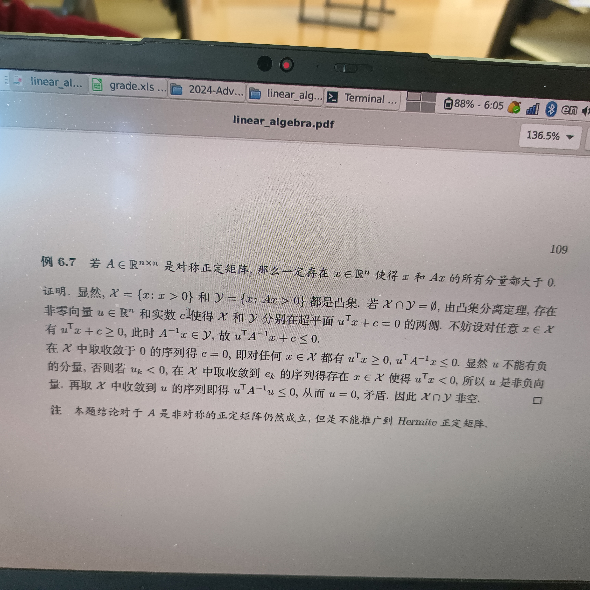
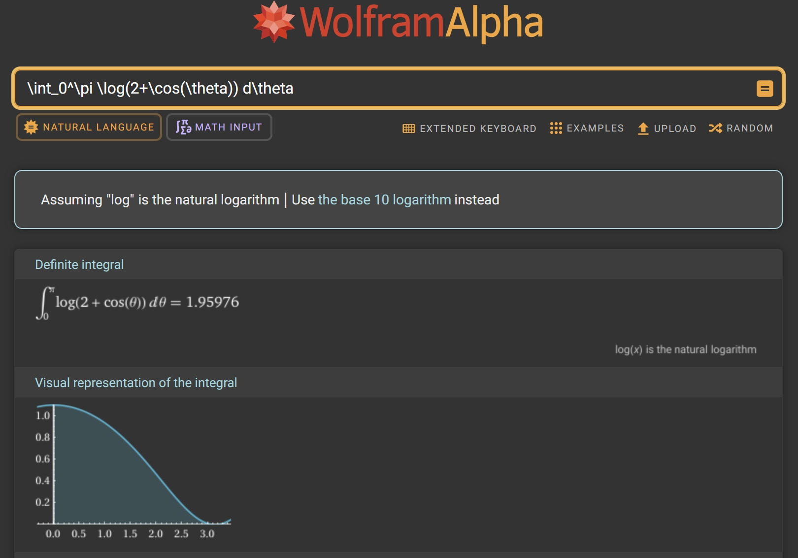

# 补充习题

- 笔记待补充:
  - 正定矩阵
  - 非负矩阵
  - 特征值的扰动分析

## Problem 1

是否存在实方阵 $A$ 使得 $A^4+I$ 为零矩阵?

存在.  
多项式 $t^4+1$ 的根为 $t=\exp\{\frac14\pi i\},\exp\{\frac34\pi i\},\exp\{\frac{5}{4}\pi i\},\exp\{\frac{7}{4}\pi i\}$  
我们可以将其搭配为两对共轭复根，并化为复数的实嵌入.

## Problem 2

试证明 $AXB=C$ 的唯一解是 $X=A^\dagger CB^\dagger$ 

### Problem 3

设 $A$ 是实正定阵，存在正向量 $x\succ 0_n$ 使得 $Ax$ 也为正向量 $Ax\succ 0_n$   
使用凸集分离定理证明.

**证明:**

### Problem 4

计算 $\int_0^\pi \log(2+ \cos(\theta))d\theta$     

- 这个定积分是不好直接求解的，其原函数不是初等函数.  
  邵老师将其转化为 Riemann 和的极限去做.

**Solution:**   
我们定义:
$$
A_n := \begin{bmatrix}
2 & \frac{1}{2} & & &\\
\frac{1}{2} & 2 & \frac{1}{2} & &\\
& \ddots & \ddots & \ddots & \\
& & \frac{1}{2} & 2 & \frac{1}{2}\\
 & & & \frac{1}{2} & 2
\end{bmatrix}_{n\times n}
$$
根据 Homework 7 Problem 4 的结论可知 $A_n$ 的特征值为 $\lambda = 2+\cos(\frac{k\pi}{n+1})\ (k=1,\dots,n)$   
对应的特征向量为:
$$
x=\begin{bmatrix}
\sin(\frac{k\pi}{n+1})\\
\sin(\frac{2k\pi}{n+1})\\
\vdots\\
\sin(\frac{(n-1)k\pi}{n+1})\\
\sin(\frac{nk\pi}{n+1})\\
\end{bmatrix}\quad (k=1,\dots,n)
$$
当 $n\geq 3$ 时，我们有:   
(三对角阵行列式递推的技巧: 按最后一列展开，对角元降 $1$ 阶，非对角元降 $2$ 阶)
$$
\begin{align}
\det(A_n) 
&=
2\det(A_{n-1}) - \frac12 \cdot \frac12 \det(A_{n-2})\\
&=
2\det(A_{n-1}) - \frac14 \det(A_{n-2}) 
\end{align}
$$
求解特征方程 $\phi^2 = 2\phi - \frac14$ 可得 $\phi_{1,2}= 1 \pm \frac{\sqrt 3}{2}$   
于是 $\det(A_n)$ 具有形如 $C_1\phi_1^n + C_2 \phi_2^n$ 的通项公式.  
代入 $\begin{cases}
\det(A_1)=2\\
\det(A_2) = 4-\frac{1}{4} = \frac{15}{4}\end{cases}$ 可得: 
$$
{\begin{cases}
C_1 (1+\frac{\sqrt{3}}{2}) + C_2 (1-\frac{\sqrt{3}}{2}) = (C_1 + C_2) + \frac{\sqrt{3}}{2}(C_1-C_2) = 2\\
C_1 (1+\frac{\sqrt{3}}{2})^2 + C_2 (1-\frac{\sqrt{3}}{2})^2 = 
\frac{7}{4}(C_1+C_2) + \sqrt{3}(C_1-C_2) = \frac{15}{4}\\
\end{cases}}\\
\Rightarrow\\
\begin{cases}
C_1 + C_2 = 1\\
C_1 - C_2 = \frac{2\sqrt{3}}{3}
\end{cases}\Rightarrow
\begin{cases}
C_1 = \frac12 + \frac{\sqrt{3}}{3}\\
C_2 = \frac12 - \frac{\sqrt{3}}{3}
\end{cases}
$$
因此 $\det(A_n) = C_1\phi_1^n + C_2\phi_2^n =  (\frac12 + \frac{\sqrt{3}}{3})(1+\frac{\sqrt{3}}{2})^n + (\frac12 - \frac{\sqrt{3}}{3})(1-\frac{\sqrt{3}}{2})^n$

注意到:  
$$
\begin{align}
\int_0^\pi \log(2+\cos(\theta)) d\theta
&=
\lim_{n\to\infty}\frac{\pi}{n+1} \sum_{k=0}^{n} \log({2+\cos(\frac{k\pi}{n+1})})\\
&=
\lim_{n\to\infty}\frac{\pi}{n+1} \sum_{k=1}^{n} \log({2+\cos(\frac{k\pi}{n+1})})\\
&=
\lim_{n\to\infty}\frac{\pi}{n+1}\log(\prod_{k=1}^{n} {\left(2+\cos(\frac{k\pi}{n+1})\right)})\\
&=
\lim_{n\to\infty}\frac{\pi}{n+1} \log({\det(A_n)})\\

&= 
\lim_{n\to\infty}\frac{\pi}{n+1} \log({C_1\phi_1^n + C_2\phi_2^n})\\
&=
\pi \lim_{n\to\infty} \log({\sqrt[n]{C_1\phi_1^n + C_2\phi_2^n}})\\
&=
\pi \log(\phi_1)\\
&=
\pi \log(1+\frac{\sqrt{3}}{2})\\
&\approx
1.9598
\end{align}
$$
**使用 WolframAlpha 验证:**

