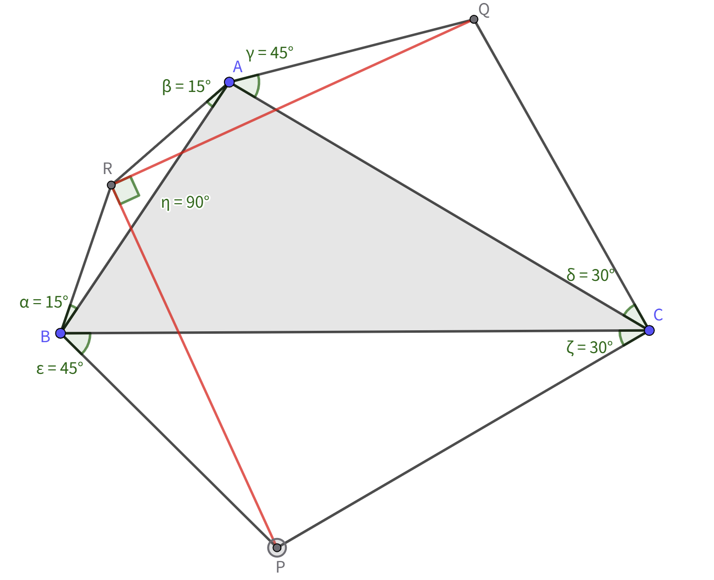
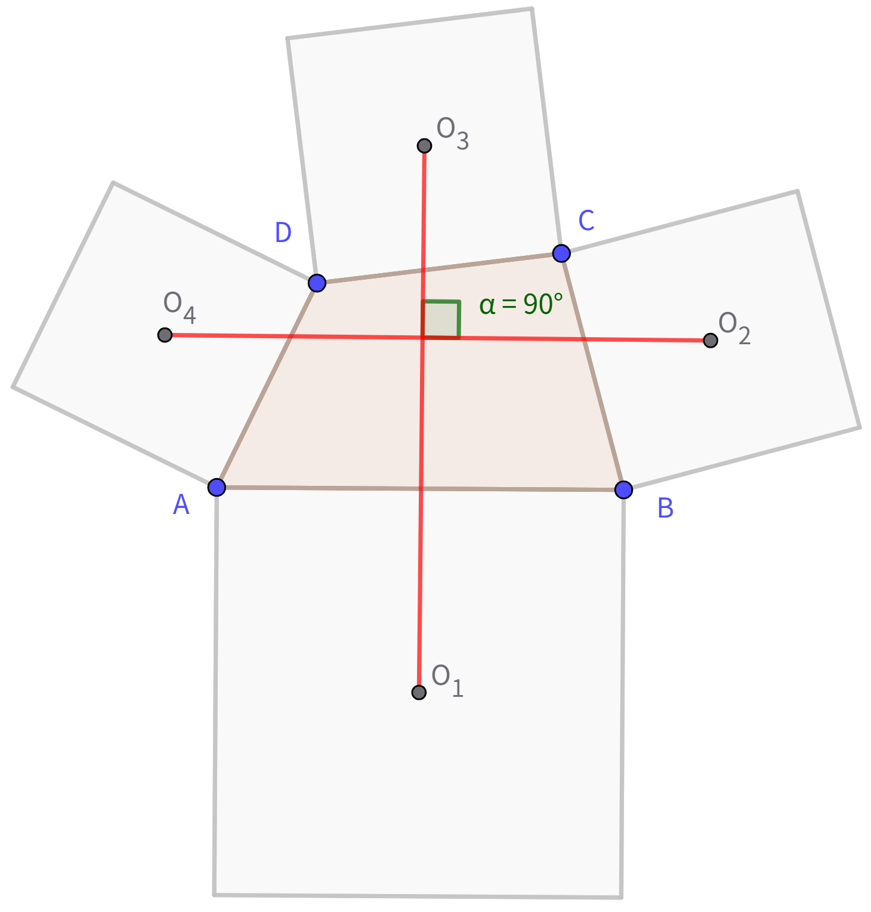

# FDU 高等线性代数 Homework 01

Due: Sept. 9, 2024  
姓名: 雍崔扬  
学号: 21307140051  

## Problem 1

设 $n$ 为给定的正整数，求 $n$ 阶矩阵 $A$ 的所有特征值和特征向量.
$$
A =
\begin{bmatrix}
0 & 1 &  & & \\
 & 0 & 1 & & \\
 &  & \ddots & \ddots &\\
 &  &  & 0 & 1 \\
1 &  &  &  & 0
\end{bmatrix}
$$

- **Insight:**  
  实际上，我们观察到 $A$ 是一个 **Frobenius 友阵**，  
  故其特征多项式可以一眼看出来: $\det(\lambda I - A)=\lambda^n - 1$.   
  因此其特征值为 $\lambda_k =\omega^k$，对应的特征向量为 $[1,\omega^k,\dotsm,\omega^{(n-2)k},\omega^{(n-1)k}]^{\mathrm{T}}$，  
  其中 $\omega = \exp(2\pi\mathrm{i}/n)$，$k=0,1,\dots,n-1$.
  
  一般的 **Frobenius 友阵**形如
  $$
  A:= 
  \begin{bmatrix}
  0 & 1\\
  & 0 & 1\\
  & & \ddots & \ddots\\
  & & & 0 & 1\\
  -\alpha_0 & -\alpha_1 & \dotsm & -\alpha_{n-2} & -\alpha_{n-1}
  \end{bmatrix}
  \text{ or }
  \begin{bmatrix}
  -\alpha_{n-1} & -\alpha_{n-2} & \dotsm & -\alpha_1 & -\alpha_0\\
  1& 0\\
  & \ddots & \ddots &\\
  & & 1 & 0 &\\
  & & & 1 & 0 
  \end{bmatrix}
  \text{ or }
  \begin{bmatrix}
  0 & & &  & -a_0\\
  1 & 0 &  & & -a_1\\
  & 1 & \ddots & & \vdots\\
  & & \ddots & 0 & -a_{n-2}\\
  & & & 1 & -a_{n-1}
  \end{bmatrix}.
  $$
  可以证明其极小多项式 $m_A(t)$ 和特征多项式 $p_A(t)$ 均为 $t^n + a_{n-1}t^{n-1} + a_{n-2}t^{n-2} + \dots + a_1 t + a_0$.  
  特别地，取 $A$ 为第一种形式的 Frobenius 友阵，则我们有
  $$
  \begin{bmatrix}
  0 & 1\\
  & 0 & 1\\
  & & \ddots & \ddots\\
  & & & 0 & 1\\
  -\alpha_0 & -\alpha_1 & \dotsm & -\alpha_{n-2} & -\alpha_{n-1}
  \end{bmatrix}
  \begin{bmatrix}
  1\\
  \lambda\\
  \vdots\\
  \lambda^{n-2}\\
  \lambda^{n-1}
  \end{bmatrix} 
  =
  \begin{bmatrix}
  1\\
  \lambda\\
  \vdots\\
  \lambda^{n-2}\\
  \lambda^{n-1}
  \end{bmatrix}
  \lambda.
  $$
  这说明，若 $\lambda$ 为 $A$ 的特征值 (即满足 $\lambda^n + a_{n-1}\lambda^{n-1} + a_{n-2}\lambda^{n-2} + \dots + a_1 \lambda + a_0=0$)，  
  则 $[1,\lambda,\dotsm,\lambda^{n-2},\lambda^{n-1}]^{\mathrm{T}}$ 为对应的特征向量.

**Solution:**     
(我们这里给出最基础的做法，不使用 Frobenius 友阵的结论)  
方阵 $A$ 的特征多项式为
$$
\begin{align}
\det(\lambda I-A)
&=
\begin{vmatrix}
\lambda & -1 &  & & \\
 & \lambda & -1 & & \\
 &  & \ddots & \ddots &\\
 &  &  & \lambda & -1 \\
-1 &  &  &  & \lambda
\end{vmatrix}_n\\

&=

\lambda 

\begin{vmatrix}
\lambda & -1 & & \\
& \ddots & \ddots &\\
 &  & \lambda & -1 \\
 &  &  &   \lambda
\end{vmatrix}_{n-1}
+
(-1)^{n+1}\cdot (-1)
\begin{vmatrix}
-1 & & & \\
\lambda & -1 & &\\
&\ddots & \ddots & \\
&&\lambda&-1
\end{vmatrix}_{n-1}\\

&=
\lambda \cdot \lambda^{n-1} 
+
1\cdot (-1)^{n-1}\\
&=
\lambda^n -1.
\end{align}
$$
令 $\det(\lambda I-A) = \lambda^n -1 = 0$，可解得 $n$ 个根为
$$
\lambda_k = \sqrt[n]{1}\exp\left\{\mathrm{i}\left(\frac{0 + 2k\pi}{n}\right)\right\} = \left(\exp(\frac{2\pi \mathrm{i}}{n})\right)^k\ \ (k=0,1,\dots,n-1).
$$
若记 $\omega = \exp(2\pi\mathrm{i}/n)$，则我们可以将方阵 $A$ 的 $n$ 个特征值写为
$$
\lambda_k = \omega^k\ \ (k=0,1,\dots,n-1).
$$

求解 $\lambda_k$ 对应的特征向量就是要求解如下方程组:
$$
(\lambda_k I_n -A)x = 
\begin{bmatrix}
\lambda_k & -1 &  & & \\
 & \lambda_k & -1 & & \\
 &  & \ddots & \ddots &\\
 &  &  & \lambda_k & -1 \\
-1 &  &  &  & \lambda_k
\end{bmatrix}x = 0_n\\
    
\Updownarrow\\\

\begin{cases}
x_2 = \lambda_k x_1\\
x_3 = \lambda_k x_2\\
\ \ \ \ \ \ \vdots\\
x_n = \lambda_k x_{n-1}\\
x_1 = \lambda_k x_n.
\end{cases}
$$
我们可以取 $\lambda_k=\omega^k\ (k=0,1,\dots,n-1)$ 对应的特征向量 $x^{(k)}$ 为
$$
x^{(k)} = \begin{bmatrix}
1\\
\lambda_k\\
\vdots\\
\lambda_k^{n-1}\end{bmatrix} = 
\begin{bmatrix}
1\\
\omega^k\\
\vdots\\
\omega^{(n-1)k}
\end{bmatrix}.
$$

## Problem 2

试证明复数 $z_1, z_2, z_3$ 满足 $|z_1-z_2| = |z_2-z_3| = |z_3-z_1|$ 的充要条件是
$$
z_1^2 + z_2^2 + z_3^2 - z_1 z_2 - z_2 z_3 - z_3 z_1 = 0.
$$

- **Lemma 1:**  
  设 $\omega = \exp(2\pi\mathrm{i}/n)$，则我们有
  $$
  \begin{align}
  \sum_{k=0}^{n-1} \omega^k 
  &= 1 + \omega + \dotsm + \omega^{n-1} \\
  &= \frac{1-\omega^n}{1-\omega} \quad(\text{note that }\omega^n = \exp(\frac{2\pi\mathrm{i}}{n}\cdot n) = \exp(2\pi\mathrm{i})=1)\\
  &= \frac{1-1}{1-\omega}\\
  &= 0.
  \end{align}
  $$

- **Lemma 2 (两个非零复数的乘积也不是零):**   
  若 $z_1z_2=0$，则 $z_1$ 和 $z_2$ 至少有一个是零.

  - 当 $z_1=0$ 时，结论成立.  
  - 当 $z_1\neq 0$ 时，可知逆元 $z_1^{-1}$ 存在，我们有 $z_2 =z_2(z_1z_1^{-1}) = z_1^{-1} (z_1z_2) = z_1^{-1}\cdot 0 =0$.

**Solution:**  
若 $z_1,z_2,z_3$ 中有任意两个是相等的，   
则可根据 $|z_1-z_2| = |z_2-z_3| = |z_3-z_1|=0$ 推出 $z_1=z_2=z_3 =0$，  
进而有 $z_1^2 + z_2^2 + z_3^2 - z_1 z_2 - z_2 z_3 - z_3 z_1 = 0$.   
此时命题成立.

下证 $z_1,z_2,z_3$ 互不相同时命题成立.  

- **① 必要性:**  

  若 $|z_1-z_2| = |z_2-z_3| = |z_3-z_1|$，则 $z_1,z_2,z_3$ 三点确定了一个正三角形.    
  记 $\omega = \exp(2\pi\mathrm{i}/3)$，则我们有    
  $$
  \begin{cases}
  z_2-z_3 = (z_2-z_1)\omega\\
  z_1-z_3 = (z_2-z_1)\omega^2,\end{cases}
  $$
  于是有
  $$
  \begin{align}
  z_1^2 + z_2^2 + z_3^2 - z_1 z_2 - z_2 z_3 - z_3 z_1 
  &=
  \frac12(z_2-z_1)^2 + \frac12(z_2-z_3)^2 + \frac12 (z_1-z_3)^2\\
  &=
  \frac12(z_2-z_1)^2(1+\omega^2 + \omega^4)\quad (\text{note that }\omega^3 = 1)\\
  &=
  \frac12 (z_2-z_1)^2 (1 + \omega^2 + \omega)\quad (\text{utilize Lemma 1})\\
  &=
  \frac12(z_2-z_1)^2 \cdot 0\\
  &=
  0.
  \end{align}
  $$
  
- **② 充分性:**  
  根据 **Lemma 1** 我们有 $\omega^2+\omega+1=0$，即有 $\omega^2+\omega = -1$.   
  若 $z_1^2 + z_2^2 + z_3^2 - z_1 z_2 - z_2 z_3 - z_3 z_1 = 0$，则我们有  
  $$
  \begin{align}
  0 
  &=z_1^2 + z_2^2 + z_3^2 - z_1 z_2 - z_2 z_3 - z_3 z_1\quad (\text{note that }\omega^3=1\text{ and }\omega^2+\omega = -1)\\
  &= 
  z_1^2 + \omega^3z_2^2 + \omega^3z_3^2 +(\omega^2+\omega)z_1 z_2 +(\omega^2+\omega)z_2 z_3 +(\omega^2+\omega)z_3 z_1\\
  &= 
  (z_1 + \omega z_2 + \omega^2 z_3)(z_1 + \omega^2 z_2 + \omega z_3).
  \end{align}
  $$
  
  根据 **Lemma 2** 可知 $z_1 + \omega z_2 + \omega^2 z_3$ 和 $z_1 + \omega^2 z_2 + \omega z_3$ 至少有一个是零.  
  不失一般性，设 $z_1 + \omega z_2 + \omega^2 z_3=0$，则左右同乘 $(\omega^2-\omega)$ 可得  
  $$
  \begin{align}
  0
  &=(\omega^2-\omega)(z_1 + \omega z_2 + \omega^2 z_3)\\
  &=
  (\omega^2-\omega)z_1 + (\omega^3-\omega^2)z_2 + (\omega^4-\omega^3)z_3\\
  &=
  (\omega^2-\omega)z_1 + (1-\omega^2)z_2 + (\omega-1)z_3\\
  &=
  (\omega-1)(z_3-z_1) + (\omega^2-1)(z_1-z_2)\\
  &=
  (\omega -1)((z_3-z_1) + (\omega+1)(z_1-z_2))\\
  &=
  (\omega -1)((z_3-z_2) + \omega(z_1-z_2)).
  \end{align}
  $$
  由于 $\omega - 1 = \exp(2\pi\mathrm{i}/3)-1 = \neq 0$，故根据 **Lemma 2** 可知
  $$
  \begin{cases}
  (z_3-z_1) + (\omega+1)(z_1-z_2) = 0\\
  (z_3-z_2) + \omega(z_1-z_2) = 0.
  \end{cases}
  $$
  注意到
  $$
  \begin{cases}
  |\omega+1| = |-\frac12 + \frac{\sqrt{3}}{2}\mathrm{i} +1| = 1\\
  |\omega| = |\exp(\frac{2\pi\mathrm{i}}{3})| = 1,\end{cases}
  $$
  于是我们有
  $$
  \begin{align}
  |z_3-z_1| 
  &= |-(\omega+1)(z_2-z_1)|\\ 
  &= |\omega+1|\cdot|z_2-z_1|\\ 
  &= 1\cdot|z_2-z_1|\\
  &= |z_2-z_1|\\
  \hline
  |z_3-z_2|
  &=|-\omega(z_2-z_1)|\\ 
  &= |\omega| \cdot |z_2-z_1|\\ 
  &= 1\cdot|z_2-z_1|\\
  &=|z_2-z_1|,
  \end{align}
  $$
  因此 $|z_1-z_2| = |z_2-z_3| = |z_3-z_1|$.

综上所述，命题得证.  
事实上，下列命题是等价的:

- $|z_1-z_2| = |z_2-z_3| = |z_3-z_1|$
- $z_1^2 + z_2^2 + z_3^2 - z_1 z_2 - z_2 z_3 - z_3 z_1 = \frac12[(z_2-z_1)^2 + (z_2-z_3)^2 +(z_1-z_3)^2] = 0$ 
- $z_1 + \omega z_2 + \omega^2 z_3 =0$ (其中 $\omega = \exp(2\pi\mathrm{i}/3)$)

***

**(2025 补充习题)**  
已知 $z_1=1-\mathrm{i},\ z_2=2+3\mathrm{i}$，试求复数 $z_3$ 使得 $|z_1-z_2| = |z_2-z_3| = |z_3-z_1|$.

**Solution:**   
根据 $|z_1-z_2| = |z_2-z_3| = |z_3-z_1|$ 可知 $z_1,z_2,z_3$ 在复平面中构成正三角形的顶点.  
因此令 $z_2-z_1$ 顺/逆时针旋转 $\pi/3$ 便可得到 $z_3-z_1$.  
根据 $z_3-z_1 = \exp(\pm \pi\mathrm{i}/3) (z_2-z_1)$ 可知  
$$
\begin{align}
z_3 
&= z_1 + \exp(\pm \pi\mathrm{i}/3) (z_2-z_1)\\
&= 1 - \mathrm{i} + \frac12 (1 \pm \sqrt{3} \mathrm{i})(2+ 3\mathrm{i} - 1 + \mathrm{i})\\
&= \frac{1}{2} (3\mp 4\sqrt{3} + (2\pm \sqrt{3})\mathrm{i}).
\end{align}
$$

因此 $z_3$ 有两个解:

- 一个是 $\frac{1}{2} (3 - 4\sqrt{3} + (2 + \sqrt{3})\mathrm{i})$
- 一个是 $\frac{1}{2} (3 + 4\sqrt{3} + (2 - \sqrt{3})\mathrm{i})$

## Problem 3

给定的正整数 $m,n$，记 $\omega = \exp(2\pi\mathrm{i}/m)$.  
试证明对任何 $A, B \in \mathbb{C}^{n \times n}$ 都有
$$
A^m + B^m = \frac{1}{m} \sum_{k = 0}^{m - 1} (A + \omega^k B)^m.
$$

- **Lemma (两个非零复数的乘积也不是零):**   
  若 $z_1z_2=0$，则 $z_1$ 和 $z_2$ 至少有一个是零.
  - 当 $z_1=0$ 时，结论成立.  
  - 当 $z_1\neq 0$ 时，可知逆元 $z_1^{-1}$ 存在，我们有 $z_2 =z_2(z_1z_1^{-1}) = z_1^{-1} (z_1z_2) = z_1^{-1}\cdot 0 =0$.

**Solution:**      
注意到 $A,B$ 不一定是可交换的 (即 $AB=BA$).  
因此 $(A+B)^m$ 不能简单展开为 $\sum_{j=0}^m \binom{m}{j} A^{m-j}B^j$.

我们记 $(A+B)^m$ 的展开式中 $\binom{m}{j}$ 个由 $m-j$ 个 $A$ 和 $j$ 个 $B$ 构成的项之和为 $\text{term}(A,B,j)$.  
显然我们有 $\text{term}(A,\omega^kB,j) = \omega^{jk} \text{term}(A,B,j)$ 成立.

因为有限求和是可以交换次序的，所以我们有
$$
\begin{align}
\frac{1}{m} \sum_{k = 0}^{m - 1} (A + \omega^k B)^m
&=
\frac1m \sum_{k=0}^{m-1} \left\{\sum_{j=0}^m \text{term}(A,\omega^kB,j)\right\}\\
&=
\frac1m \sum_{k=0}^{m-1} \left\{\sum_{j=0}^m \omega^{jk}\text{term}(A,B,j)\right\}\\
&=
\frac1m \sum_{j=0}^{m} \left\{ \left(\sum_{k=0}^{m-1} \omega^{jk}\right) \text{term}(A,B,j)\right\}.
\end{align}
\tag{3.1}
$$
注意到 $\omega^m = 1$ (即 $\omega$ 是 $1$ 的一个 $m$ 次复根).

- 当 $j$ 为 $m$ 的整数倍 (即 $j$ 为 $0$ 或 $m$) 时，我们有
  $$
  \sum_{k=0}^{m-1} \omega^{jk} = \sum_{k=0}^{m-1} 1 = m.
  $$

- 当 $j$ 不为 $m$ 的整数倍 (即 $j=1,\dots,m-1$) 时，我们有
  $$
  \begin{align}
  \omega^j \sum_{k=0}^{m-1} \omega^{jk} 
  &= \omega^j(1+ \omega^j + \dots +\omega^{(m-2)j} + \omega^{(m-1)j})\\
  &= \omega^j+ \omega^{2j} + \dots + \omega^{(m-1)j} + \omega^{mj}\quad (\text{note that }\omega^m=1)\\
  &= \omega^j+ \omega^{2j} + \dots + \omega^{(m-1)j} + 1\\
  &= \sum_{k=0}^{m-1} \omega^{jk}.
  \end{align}
  $$
  于是有 $(\omega^j-1)\sum_{k=0}^{m-1} \omega^{jk} = 0$ 成立.  
  由于 $\omega^j - 1 = \exp{(\frac{2j\pi \mathrm{i}}{m})} -1\neq 0$，故根据 **Lemma** 可知 $\sum_{k=0}^{m-1} \omega^{jk} = 0$.

综上所述，我们有
$$
\sum_{k=0}^{m-1} \omega^{jk} = \begin{cases}
m, & \text{if }j = 0,m\\
0, & \text{if }j=1,\dots,m-1.
\end{cases}
$$
将上述结果代入 $(3.1)$ 式中我们有
$$
\begin{align}
\frac{1}{m} \sum_{k = 0}^{m - 1} (A + \omega^k B)^m
&=
\frac1m \sum_{j=0}^{m} \left\{ \left(\sum_{k=0}^{m-1} \omega^{jk}\right) \text{term}(A,B,j) \right\}\\
&=
\frac1m (m A^m + m B^m)\\
&=
A^m + B^m.
\end{align}
$$
命题得证.

## Problem 4

> 以下内容均来自 **Complex Variables and Applications (9th Edition J. Brown, R. Churchill) Chaper 6**
>
> **(Complex Variables and Applications 第 74 节)**  
> 若函数在简单闭围道 $C$ 的内部除了有限多个奇点以外处处解析，则这些奇点必定是孤立奇点.  
> 特殊地，有理函数 (即两个多项式函数的商) 的奇点总是孤立奇点，因为分母中的多项式函数仅有有限个零点.
>
> **(Complex Variables and Applications 第 75 节)**    
> 若 $z_0$ 是函数 $f$ 的孤立奇点，则存在正数 $R>0$ 使得 $f$ 在 $0<|z-z_0|<R$ 中的任意一点 $z$ 处解析  
> 因此函数 $f$ 关于 $z_0$ 的 Laurent 级数展开式为  
> $$
> f(z) = \sum_{n=0}^\infty a_n (z-z_0)^n + \sum_{n=1}^\infty \frac{b_n}{(z-z_0)^n}\\
> \begin{align}
> a_n &= \frac1{2\pi \mathrm{i}}\oint_C \frac{f(z)}{(z-z_0)^{n+1}}{\mathrm d}z\quad\ \  (n=0,1,\dots)\\
> b_n &= \frac1{2\pi \mathrm{i}}\oint_C \frac{f(z)}{(z-z_0)^{-n+1}}{\mathrm d}z\quad (n=1,2,\dots),
> \end{align}
> $$
> 其中 $C$ 为 $0<|z-z_0|<R$ 中任意围绕 $z_0$ 的简单正向闭围道.
>
> 特别地，$b_1$ 的表达式为  
> $$
> b_1 = \frac1{2\pi \mathrm{i}}\oint_C f(z){\mathrm d}z.
> $$
> 我们称其为函数 $f$ 在孤立奇点 $z_0$ 处的**留数** (residue)，记为 $\underset{z=z_0}{\text{Res}} f(z)$，于是我们有 
> $$
> \oint_C f(z){\mathrm d}z = 2\pi \mathrm{i}\cdot\underset{z=z_0}{\text{Res}} f(z).
> $$
> **(Cauchy 留数定理, Complex Variables and Applications 第 76 节)**  
> 设 $C$ 为正向简单闭围道.  
> 若函数 $f$ 在 $C$ 及其内部除了有限多个奇点 $z_k\ (k=1,\dots,n)$ 以外处处解析 (自然是孤立奇点)，  
> 则我们有
> $$
> \oint_C f(z){\mathrm d}z = 2\pi \mathrm{i}\sum_{k=1}^n \underset{z=z_k}{\text{Res}} f(z).
> $$
> 即 $f$ 沿 $C$ 的积分值 $\oint_C f(z) {\mathrm d}z$ 为其内部有限个奇点处的留数之和的 $2\pi \mathrm{i}$ 倍.
>
> 下面的定理仅仅涉及一个留数，故运用起来有时比 Cauchy 留数定理更加方便.  
> **(Complex Variables and Applications 第 77 节 定理)**     
> 若函数 $f$ 在有限平面上除了有限多个奇点以外处处解析，且这些奇点落在一条正向简单闭围道 $C$ 的内部，  
> 则我们有
> $$
> \oint_C f(z){\mathrm d}z = 2\pi \mathrm{i} \cdot \underset{z=0}{\text{Res}} \left\{\frac1{z^2} f\left(\frac1z\right)\right\}.
> $$

**计算复积分:**
$$
\oint_{|z| = 4} \frac{1}{z^2 - 3z + 2}{\mathrm d}z
$$
记围道 $C$ 为 $|z|=4$ 确定的正向圆周 (即逆时针方向).  
注意到多项式函数 $p(z)=z^2 -3z+2$ 在整个复平面都是解析的，且仅有 $z=1,2$ 两个零点.  
因此 $f(z)=1/p(z)$ 在复平面上仅有 $z=1,2$ 两个孤立奇点，且都落在围道 $C$ 的内部.

**Solution 1:**  
最直接的做法是计算 $f(z)$ 的留数.  

- 计算 $f(z)$ 在 $z=1$ 附近的 Laurent 级数展开:
  $$
  \begin{align}
  f(z)
  &=
  \frac{1}{z^2 - 3z + 2}\quad (\text{suppose that }|z-1|<1)\\
  &=
  \frac{1}{(z-1)(z-2)}\quad (\text{denote }w := z-1)\\
  &=
  \frac{1}{w(w-1)}\quad (\text{note that }\frac{1}{1-w} = \sum_{n=0}^\infty w^n\text{,\ whenever }|w|<1)\\
  &=
  -\frac{1}{w}\sum_{n=0}^\infty w^n\\
  &=
  -\sum_{n={0}}^\infty w^{n-1}.
  \end{align}
  $$
  其 $1/w$ 项的系数为 $-1$，故 $f(z)$ 在 $z=1$ 处的留数 $\underset{z=1}{\text{Res}}f(z) = -1$.

  > 事实上，由于 $z=1$ 是 $f(z)$ 的简单奇点，我们可通过极限计算对应的留数:
  > $$
  > \underset{z=1}{\text{Res}}f(z) = \lim_{z\to 1} (z-1)f(z) = \lim_{z\to 1} \frac{1}{z-2} = \frac{1}{1-2} = -1.
  > $$

- 计算 $f(z)$ 在 $z=2$ 附近的 Laurent 级数展开: 
  $$
  \begin{align}
  f(z)
  &=
  \frac{1}{z^2 - 3z + 2}\quad (\text{suppose that }|z-2|<1)\\
  &=
  \frac{1}{(z-1)(z-2)}\quad (\text{denote }w := z-2)\\
  &=
  \frac{1}{(w+1)w}\quad (\text{note that }\frac{1}{1+w} = \sum_{n=0}^\infty (-w)^n\text{,\ whenever }|w|<1)\\
  &=
  \frac{1}{w}\sum_{n=0}^\infty (-w)^n\\
  &=
  -\sum_{n={0}}^\infty (-w)^{n-1}.
  \end{align}
  $$
  其 $1/w$ 项的系数为 $1$，故 $f(z)$ 在 $z=2$ 处的留数 $\underset{z=2}{\text{Res}}f(z) = 1$.

  > 事实上，由于 $z=2$ 是 $f(z)$ 的简单奇点，我们可通过极限计算对应的留数:
  > $$
  > \underset{z=2}{\text{Res}}f(z) = \lim_{z\to 2} (z-2)f(z) = \lim_{z\to 2} \frac{1}{z-1} = \frac{1}{2-1} = 1.
  > $$

根据 Cauchy 留数定理可知
$$
\begin{align}
\oint_{|z|=4} f(z){\mathrm d}z 
&= 2\pi \mathrm{i}\cdot \left(
\underset{z=1}{\text{Res}}f(z) + \underset{z=2}{\text{Res}}f(z)
\right)\\ 
&= 2\pi \mathrm{i} \cdot (-1 + 1)\\
&= 0.
\end{align}
$$

***

**Solution 2:**  
另一种方法是计算 $\frac1{z^2}f(\frac1z)$ 在 $z=0$ 处的留数.  
定义 $g(z) := \frac1{z^2}f(\frac1z)$，则我们有
$$
\begin{align}
g(z) 
&=
\frac1{z^2}f\left(\frac1z\right)\\
&=
\frac1{z^2} \cdot\frac{z^2}{1-3z+2z^2}\\
&=
\frac{1}{(1-2z)(1-z)}.
\end{align}
$$
根据 **Lemma** 可知 $g(z)$ 的 Laurent 级数中 $1/z$ 项的系数即为所求留数.  
注意到 $g(z)$ 在 $z=0$ 处是解析的，其 Laurent 级数展开即为 Taylor 级数展开，  
因此没有 $1/z$ 项，于是有
$$
\underset{z=0}{\text{Res}}\left\{\frac1{z^2}f\left(\frac1z\right)\right\} = 0.
$$
因此 $f$ 在 $C$ 上的积分为
$$
\oint_C f(z){\mathrm d}z = \oint_C  \frac{1}{z^2 - 3z + 2}{\mathrm d}z = 2\pi \mathrm{i}\cdot \underset{z=0}{\text{Res}}\left\{\frac1{z^2}f\left(\frac1z\right)\right\} = 2\pi \mathrm{i}\cdot 0 = 0.
$$

## Problem 5

试证明任何复方阵都可以在复数域上相似上三角化，  
即对于任意复方阵 $A\in \mathbb C^{n\times n}$ 总存在非奇异阵 $P$ 使得 $P^{-1}AP$ 为上三角矩阵.

**Solution:**   
当 $n=1$ 时，命题显然成立.  
当 $n\geq 2$ 时，假设对于所有维数小于 $n$ 的复方阵，上述命题都成立.  
下面对 $n$ 维复方阵证明该命题.

设 $(\lambda_1,x_1)$ 是 $A\in \mathbb C^{n\times n}$ 的一个特征对，即满足 $A_1x_1=x_1\lambda_1$.  
将 $x_1$ 扩充为 $\mathbb{C}^n$ 的一组基 $x_1,v_2,\dots,v_n$，  
定义非奇异阵 $P_1:=[x_1,v_2,\dots,v_n]=[x_1,V]$，则我们有
$$
\begin{align}
AP_1
&= A[x_1,V]\\ 
&= [Ax_1, AV]\\
&= [x_1\lambda_1, AV]\\
&= [x_1,V]
[\lambda_1e_1, P_1^{-1}AV]\quad (\text{denote }P_1^{-1}AV = 
\begin{bmatrix}
*\\
A_2
\end{bmatrix}\in \mathbb{C}^{n\times (n-1)})\\
&= [x_1,V]
\begin{bmatrix}
\lambda_1 & *\\
& A_2
\end{bmatrix}\\
&=
P_1
\begin{bmatrix}
\lambda_1 & *\\
& A_2
\end{bmatrix}.
\end{align}
$$
根据归纳假设可知，存在非奇异阵 $\widetilde P_2\in \mathbb{C}^{(n-1)\times (n-1)}$ 使得 $T_2 := \widetilde{P}_2^{-1}A_2 \widetilde{P}_2$ 为上三角阵.  
定义 $P_2 := 1 \oplus \widetilde P_2$ 和 $P=P_1P_2$ 可知  
$$
\begin{align}
P^{-1}AP
&=
P_2^{-1}P_1^{-1} A P_1 P_2\\
&=
\begin{bmatrix}
1\\
& P_2^{-1}
\end{bmatrix}
\begin{bmatrix}
\lambda_1 & *\\
& A_2
\end{bmatrix}
\begin{bmatrix}
1\\
& P_2
\end{bmatrix}\\
&=
\begin{bmatrix}
\lambda_1 & *\\
& P_2^{-1}A_2P_2
\end{bmatrix}\\
&=
\begin{bmatrix}
\lambda_1 & *\\
& T_2
\end{bmatrix}.
\end{align}
$$
因此 $T:= P^{-1}AP$ 为上三角阵.  
根据数学归纳法，命题得证.

## Problem 6 (optional)

设 $n$ 为正整数.  
已知 $n$ 次系数多项式 $f(z) = \sum_{k = 0}^{n} a_k z^k$ 的系数满足 $a_0 > \dotsm > a_n>0$  
证明: $f(z)$ 的所有复根都在单位圆外.   

- **Hint:** 考察 $g(z)=(1 - z) f(z)$.

**Solution:**      
当 $|z|\leq 1$ 时，我们有
$$
\begin{align}
|g(z)|
&=
|(1-z)f(z)|\\
&=
\left|(1-z)\sum_{k=0}^n a_k z^k\right|\\
&=
\left|a_0 + \sum_{k=1}^{n} (a_k - a_{k-1})z^k - a_n z^{n+1}\right|\quad (\text{triangle inequality})\\
&\geq 
|a_0| - \left|\sum_{k=1}^{n} (a_k - a_{k-1})z^k - a_n z^{n+1}\right|\quad (\text{triangle inequality and }|z_1z_2|=|z_1||z_2|\text{ for all }z_1,z_2\in \mathbb C)\\

&\geq |a_0| - \sum_{k=1}^{n}|a_k-a_{k-1}| |z|^k - |a_n| |z|^{n+1} \quad (\text{note that }a_0 > \dotsm > a_n>0)\\
&=a_0 - \sum_{k=1}^n(a_{k-1}-a_k) |z|^k - a_n |z|^{n+1} \quad (\text{note that }|z|\leq 1)\\
&\geq a_0 - \sum_{k=1}^n(a_{k-1}-a_k) \cdot 1 - a_n \cdot 1\\
&= a_0 - (a_0 - a_n) - a_n\\
&= 0.
\end{align}
$$

上述三个不等号同时取等的充要条件是:

-  ① $\sum_{k=1}^{n} (a_k - a_{k-1})z^k - a_n z^{n+1}$ 与 $a_0$ 反方向 (即与 $1$ 反方向)   
  (注意 $a_0$ 是正实数，而 $a_k-a_{k-1}<0\ (k=1,\dots,n)$)
- ② $z,z^2,\dots,z^{n+1}$ 同方向
- ③ $|z|=1$

容易验证这样的 $z$ 只能是 $z = \exp(2m\pi \mathrm{i}) = 1\ \ (m\in \mathbb Z)$.     
因此当 $|z|\leq 1$ 且 $z\neq 1$ 时，我们都有 $|g(z)|>0$ 成立，表明这样的 $z$ 不是 $g(z)$ 的根.  
于是 $g(z)$ 的根要么是 $z=1$，要么满足 $|z|>1$.

注意到 $g(z)=(1 - z) f(z)$ 的复根除了额外的 $1$ 以外，其余复根都与 $f(z)$ 的相同.  
而根据 $f(1) = \sum_{k=0}^n a_k>0$ 可知 $z=1$ 不是 $f(z)$ 的根.  
因此 $f(z)$ 的所有根都满足 $|z|>1$，即都落在单位圆周 $|z|=1$ 的外部.

## Problem 7 (optional)

证明下面的函数不是解析函数，但在复平面上处处满足 Cauchy–Riemann 方程:
$$
f(z) = 
\begin{cases} 
\exp(-z^{-4}), & z \neq 0, \\
0, & z = 0.
\end{cases}
$$

- **(可导的必要条件, Complex Variables and Applications 第 21 节)** 
  设函数 $f(z) = u(x,y) + \mathrm{i} v(x,y)$ 在点 $z_0=(x_0,y_0)$ 处可导，  
  则 $u,v$ 在 $(x_0,y_0)$ 处可偏导，且其一阶偏导数满足 **Cauchy–Riemann 方程**  
  $$
  \begin{cases}
  u_x(x_0,y_0) = v_y(x_0,y_0)\\
  u_y(x_0,y_0) = - v_x(x_0,y_0).
  \end{cases}
  $$
  此时导数 $f'(z_0) = u_x(x_0,y_0) + \mathrm{i} v_x(x_0,y_0)$.
  
  **(极坐标形式)**  
  设函数 $f(z) = u(\rho,\theta) + \mathrm{i}v(\rho,\theta)$ 在点 $z_0=\rho_0 \mathrm{e}^{\mathrm{i}\theta_0}$ 处可导，  
  则 $u,v$ 在 $(\rho_0,\theta_0)$ 处可偏导，且其一阶偏导数满足 **Cauchy–Riemann 方程**  
  $$
  \begin{cases}
  \rho u_\rho(\rho_0,\theta_0) = v_\theta(\rho_0,\theta_0)\\
  u_\theta(\rho_0,\theta_0) = - \rho v_\rho(\rho_0,\theta_0).
  \end{cases}
  $$
  此时导数 $f'(z_0) = \mathrm{e}^{-\mathrm{i}\theta_0} (u_\rho(\rho_0,\theta_0) + \mathrm{i}v_\rho(\rho_0,\theta_0))$.

**Solution:**     
当 $z=0$ 时:

- 计算 $u_x(0,0)$ 和 $v_x(0,0)$:  
  (取 $z=h$，从实轴方向逼近 $0$)
  $$
  \begin{align}
  u_x(0,0) &= 
  \lim_{h\to 0}
  \frac{u(h,0)-u(0,0)}{h-0}
  =
  \lim_{h\to 0} 
  \frac{\text{Re}\{\exp(-h^{-4})\}-0}{h-0}
  =
  \lim_{h\to 0} 
  \frac{\exp(-h^{-4})-0}{h-0}
  =
  0\\
  
  v_x(0,0) &= \lim_{h\to 0} \frac{v(h,0) - v(0,0)}{h-0} = \lim_{h\to 0} 
  \frac{\text{Im}\{\exp(-h^{-4})\}-0}{h-0}
  =
  \lim_{h\to 0} 
  \frac{0-0}{h-0}
  =
  0.
  \end{align}
  $$

- 计算 $u_y(0,0)$ 和 $v_y(0,0)$:   
  (取 $z=\mathrm{i}h$，从虚轴方向逼近 $0$)
  $$
  \begin{align}
  u_y(0,0) 
  &= \lim_{h\to 0}\frac{u(0,h)-u(0,0)}{h-0} 
  = \lim_{h\to0}\frac{\text{Re}\{\exp(-(\mathrm{i}h)^{-4})\}-0}{h-0} 
  = \lim_{h\to 0} 
  \frac{\exp(-h^{-4})-0}{h-0}
  =
  0\\
  v_y(0,0)
  &=
  \lim_{h\to 0} \frac{v(0,h) - v(0,0)}{h-0}
  = \lim_{h\to0}\frac{\text{Im}\{\exp(-(\mathrm{i}h)^{-4})\}-0}{h-0}
  = \lim_{h\to0}\frac{0 - 0}{h-0} = 0.
  \end{align}
  $$

因此我们有
$$
\begin{cases}
u_x(x_0,y_0) = v_y(x_0,y_0) = 0\\
u_y(x_0,y_0) = - v_x(x_0,y_0) = 0.
\end{cases}
$$
即 $f$ 在 $z = 0$ 处满足 Cauchy–Riemann 方程.

***

当 $z\neq 0$ 时，我们有
$$
\begin{align}
f(z)
&=
\exp(-z^{-4})\\
&=
\exp(-\rho^{-4}e^{-4\mathrm{i}\theta})\\
&=
\exp\left(-\rho^{-4}(\cos(-4\theta) + \mathrm{i}\sin(-4\theta))\right)\\
&=
\exp\left(-\rho^{-4}\cos(-4\theta)\right) \cdot \exp\left(\mathrm{i}\cdot (-\rho^{-4}\sin(-4\theta))\right)\\
&=
\exp\left(-\rho^{-4}\cos(-4\theta)\right) \cdot \left(\cos\left(-\rho^{-4}\sin(-4\theta)\right) + \mathrm{i}\sin\left(-\rho^{-4}\sin(-4\theta)\right)\right)\\
&=
u(\rho,\theta) + \mathrm{i} v(\rho,\theta),
\end{align}
$$
其中我们记
$$
{\begin{align}
u(\rho,\theta) &= \exp\left(-\rho^{-4}\cos(-4\theta)\right) \cos\left(-\rho^{-4}\sin(-4\theta)\right) = g(\rho,\theta)\cos(h(\rho,\theta))\\
v(\rho,\theta) &= \exp\left(-\rho^{-4}\cos(-4\theta)\right) \sin\left(-\rho^{-4}\sin(-4\theta)\right) = g(\rho,\theta)\sin(h(\rho,\theta))
\end{align}}\\

\text{where }

\begin{cases}
g(\rho,\theta) = \exp\left(-\rho^{-4}\cos(-4\theta)\right)\\
h(\rho,\theta) = -\rho^{-4} \sin(-4\theta)
\end{cases}

\Rightarrow 

\begin{cases}
g_\rho(\rho,\theta) = 4\rho^{-5}\cos(-4\theta) g(\rho,\theta)\\
g_\theta(\rho,\theta) = -4\rho^{-4}\sin(-4\theta) g(\rho,\theta)\\
h_\rho(\rho,\theta) = 4\rho^{-5}\sin(-4\theta)\\
h_\theta(\rho,\theta) = 4\rho^{-4}\cos(-4\theta)
\end{cases}
$$
经计算可得 
$$
\begin{align}
u_\rho(\rho,\theta) 
&= g_\rho(\rho,\theta) \cos(h(\rho,\theta)) + g(\rho,\theta)[-\sin(h(\rho,\theta))h_\rho(\rho,\theta)]\\
&= 4\rho^{-5}\cos(-4\theta) g(\rho,\theta)\cos(h(\rho,\theta)) - g(\rho,\theta)\sin(h(\rho,\theta))4\rho^{-5}\sin(-4\theta)\\
&= 4\rho^{-5}g(\rho,\theta)\cos(h(\rho,\theta)-4\theta)\\

\hline
u_\theta(\rho,\theta) 
&= g_\theta(\rho,\theta)\cos(h(\rho,\theta)) + g(\rho,\theta)[-\sin(h(\rho,\theta))h_\theta(\rho,\theta)]\\
&= -4\rho^{-4}\sin(-4\theta) g(\rho,\theta) \cos(h(\rho,\theta)) - g(\rho,\theta)\sin(h(\rho,\theta))4\rho^{-4}\cos(-4\theta)\\
&= -4\rho^{-4}g(\rho,\theta) \sin(h(\rho,\theta)-4\theta)\\

\hline
v_\rho(\rho,\theta) 
&= g_\rho(\rho,\theta)\sin(h(\rho,\theta)) + g(\rho,\theta)\cos(h(\rho,\theta)) h_\rho(\rho,\theta)\\
&= 4\rho^{-5}\cos(-4\theta) g(\rho,\theta) \sin(h(\rho,\theta)) + g(\rho,\theta) \cos(h(\rho,\theta)) 4\rho^{-5}\sin(-4\theta)\\
&= 4\rho^{-5}g(\rho,\theta) \sin(h(\rho,\theta)-4\theta)\\

\hline
v_\theta(\rho,\theta) 
&=
g_\theta(\rho,\theta)\sin(h(\rho,\theta)) + g(\rho,\theta)\cos(h(\rho,\theta)) h_\theta(\rho,\theta)\\
&=
-4\rho^{-4}\sin(-4\theta) g(\rho,\theta) \sin(h(\rho,\theta)) + g(\rho,\theta)\cos(h(\rho,\theta)) 4\rho^{-4}\cos(-4\theta)\\
&= 4\rho^{-4}g(\rho,\theta)\cos(h(\rho,\theta)-4\theta).
\end{align}
$$

因此对于任意 $\rho>0$ 和 $\theta\in \mathbb R$ 我们都有 
$$
\begin{cases}
\rho u_\rho(\rho,\theta) = v_\theta(\rho,\theta)\\
u_\theta(\rho,\theta) = - \rho v_\rho(\rho,\theta).
\end{cases}
$$
因此 $f$ 在任意 $z\neq 0$ 处都满足 Cauchy–Riemann 方程.  
综上所述，$f$ 在复平面上处处满足 Cauchy–Riemann 方程.

***

解析函数要求在定义域内处处可导，但 $f(z)$ 在 $z=0$ 处不可导.  
我们考虑 $|f(z)|$ 在 $z\to0$ 时的极限行为:
$$
\begin{align}
|f(z)| 
&= |\exp(-z^{-4})|\\ 
&= \left|\exp(-\rho^{-4}\mathrm{e}^{-4\mathrm{i}\theta})\right|\\
&= \left|\exp\left(-\rho^{-4}\cos(-4\theta)\right) \exp\left(-\rho^{-4} \sin (-4\theta) \mathrm{i}\right)\right|\\
&= \exp\left(-\rho^{-4}\cos(4\theta)\right).
\end{align}
$$

- 若 $\cos(4\theta)>0$，则当 $\rho\to 0_+$ 时有 $|f(z)| \to 0$.
- 若 $\cos(4\theta)=0$，则 $|f(z)| = 1\ (\forall\ \rho\geq 0)$.
- 若 $\cos(4\theta)<0$，则当 $\rho\to 0_+$ 时有 $|f(z)| \to \infty$.

因此 $f$ 在 $z=0$ 处不连续，更谈不上在 $z=0$ 处复可微了.  
故 $f$ 不是解析函数.

## Problem 8 (optional)

对于 Euclid 平面 $\mathbb R^2$ 内的任意三角形 $\triangle ABC$  
向外作 $\angle ABR, \angle BCP, \angle CAQ$ 使得 $\begin{cases}
\angle CBP = \angle CAQ = 45\degree\\
\angle BCP = \angle ACQ = 30\degree\\
\angle ABR = \angle BAR = 15\degree\end{cases}$.   
试利用复数证明 $\angle QRP = 90\degree$ 且 $|QR| = |RP|$.

**Solution:**    
记 $\overrightarrow{OA},\overrightarrow{OB},\overrightarrow{OC},\overrightarrow{OR},\overrightarrow{OP},\overrightarrow{OQ}$ 的复数表示为 $a,b,c,z_1,z_2,z_3$.

根据 $1-2(\sin(\frac{\pi}{12}))^2 = \cos(\frac{\pi}{6})=\frac{\sqrt3}2$ 可解得 $\sin(\frac{\pi}{12}) = \frac{\sqrt 6-\sqrt 2}{4}$，进而有 $\cos(\frac{\pi}{12}) = \frac{\sqrt{6}+\sqrt 2}{4}$.   
根据正弦定理可知
$$
\frac{|BR|}{|BA|}= \frac{|AR|}{|AB|} = \frac{\sin(\frac{\pi}{12})}{\sin(\frac{5\pi}{6})} = \frac{\frac{\sqrt 6-\sqrt 2}{4}}{\frac12} = \frac{\sqrt 6-\sqrt 2}{2}\\

\frac{|BP|}{|BC|} = \frac{|AQ|}{|AC|} =\frac{\sin(\frac{\pi}{6})}{\sin(\frac{7\pi}{12})} = \frac{\frac12}{\frac{\sqrt{6}+\sqrt 2}{4}} = \frac{\sqrt6-\sqrt2}{2}.
$$
记 $\omega = \exp(\pi\mathrm{i}/12)$，则我们有
$$
\begin{cases}
z_1 - b = \overrightarrow{BR} = \frac{\sqrt6-\sqrt2}{2} \omega \overrightarrow{BA} = \frac{\sqrt6-\sqrt2}{2} \omega (a-b)\\
z_1 - a = \overrightarrow{AR} = \frac{\sqrt6-\sqrt2}{2} \bar \omega \overrightarrow{AB} = \frac{\sqrt6-\sqrt2}{2} \bar \omega (b-a)\\
z_2 - b = \overrightarrow{BP} =  \frac{\sqrt6-\sqrt2}{2} \bar \omega^3 \overrightarrow{BC} = \frac{\sqrt6-\sqrt2}{2} \bar \omega^3 (c-b)\\
z_3-a = \overrightarrow{AQ} = \frac{\sqrt6-\sqrt2}{2}\omega^3\overrightarrow{AC} = \frac{\sqrt6-\sqrt2}{2} \omega^3 (c-a)
\end{cases}

\text{where }
\begin{cases}
\omega = \cos(\frac{\pi}{12}) + \mathrm{i} \sin(\frac{\pi}{12}) = \frac{\sqrt 6 + \sqrt 2}{4} + \frac{\sqrt 6 - \sqrt 2}{4}\mathrm{i}\\
\bar \omega =\cos(-\frac{\pi}{12}) + \mathrm{i}\sin(-\frac{\pi}{12}) = \frac{\sqrt 6 + \sqrt 2}{4} - \frac{\sqrt 6 - \sqrt 2}{4}\mathrm{i}\\
\bar \omega^3 = \cos(-\frac{\pi}{4}) + \mathrm{i}\sin(-\frac{\pi}{4}) = \frac{\sqrt 2}{2} - \frac{\sqrt 2}{2}\mathrm{i}\\
\omega^3 = \cos(\frac{\pi}{4}) + \mathrm{i}\sin(\frac{\pi}{4}) = \frac{\sqrt 2}{2} + \frac{\sqrt2}2\mathrm{i}.\\
\end{cases}
$$

要证明 "$\angle QRP = 90\degree$ 且 $|QR| = |RP|$"，即要证 $\overrightarrow{RQ} = \exp(\pi\mathrm{i}/2) \overrightarrow{RP}$，  
也就等价于证明 $z_3-z_1 = \mathrm{i} (z_2-z_1)$. 
$$
\begin{align}
z_3-z_1 - i(z_2-z_1)
&=
((z_3-a)-(z_1-a)) - \mathrm{i}((z_2-b)-(z_1-b))\\
&=
\left(\frac{\sqrt6-\sqrt2}{2}\omega^3 (c-a) - \frac{\sqrt6-\sqrt2}{2} \bar \omega (b-a)\right) - \mathrm{i}\left(\frac{\sqrt6-\sqrt2}{2} \bar \omega^3 (c-b) - \frac{\sqrt6-\sqrt2}{2} \omega (a-b)\right)\\
&=
\frac{\sqrt6-\sqrt2}{2} (\omega^3 (c-a) - \bar \omega (b-a) - \mathrm{i} \bar \omega^3 (c-b) + \mathrm{i} \omega (a-b))
\end{align}
$$

因此要证明 $z_3-z_1 - \mathrm{i} (z_2-z_1) = 0$，等价于证明 $\omega^3 (c-a) - \bar \omega (b-a) - \mathrm{i} \bar \omega^3 (c-b) + \mathrm{i} \omega (a-b)=0$，  
也就等价于证明 $a,b,c$ 项的系数分别为 $0$:

- $a$ 的系数为:
  $$
  \begin{align}
  - \omega^3 +  \bar \omega + \mathrm{i} \omega
  &=
  -\left(\frac{\sqrt 2}{2} + \frac{\sqrt 2}2\mathrm{i}\right) + \left(\frac{\sqrt 6 + \sqrt 2}{4} - \frac{\sqrt 6 - \sqrt 2}{4}\mathrm{i}\right) + \mathrm{i} \left(\frac{\sqrt 6 + \sqrt 2}{4} + \frac{\sqrt 6 - \sqrt 2}{4}\mathrm{i}\right)\\
  &= 
  \left(-\frac{\sqrt 2}{2} + \frac{\sqrt 6 + \sqrt 2}{4} - \frac{\sqrt 6 - \sqrt 2}{4}\right)
  +
  \mathrm{i}\left(-\frac{\sqrt 2}{2} - \frac{\sqrt 6 - \sqrt 2}{4} + \frac{\sqrt 6 + \sqrt 2}{4}\right)\\
  &=
  0.
  \end{align}
  $$
  
- $b$ 的系数为:
  $$
  \begin{align}
  -\bar \omega + \mathrm{i}\bar \omega^3 - \mathrm{i}\omega
  &=
  -\left( \frac{\sqrt 6 + \sqrt 2}{4} - \frac{\sqrt 6 - \sqrt 2}{4}\mathrm{i}\right) + \mathrm{i} \left( \frac{\sqrt 2}{2} - \frac{\sqrt 2}{2}\mathrm{i}\right) - \mathrm{i} \left( \frac{\sqrt 6 + \sqrt 2}{4} + \frac{\sqrt 6 - \sqrt 2}{4}\mathrm{i}\right)\\
  &=
  \left(-\frac{\sqrt 6 + \sqrt 2}{4} + \frac{\sqrt 2}{2} + \frac{\sqrt 6 - \sqrt 2}{4}\right)
  +
  \mathrm{i}\left(\frac{\sqrt 6 - \sqrt 2}{4} + \frac{\sqrt 2}{2} - \frac{\sqrt 6 + \sqrt 2}{4}\right)
  \\
  &=
  0.
  \end{align}
  $$
  
- $c$ 的系数为:
  $$
  \begin{align}
  \omega^3 - \mathrm{i}\bar \omega^3 
  &=
  \left(\frac{\sqrt 2}{2} + \frac{\sqrt2}2\mathrm{i}\right) - \mathrm{i} \left(\frac{\sqrt 2}{2} - \frac{\sqrt2}2\mathrm{i}\right)\\
  &=
  \left(\frac{\sqrt 2}{2} - \frac{\sqrt2}2\right) + \mathrm{i} \left(\frac{\sqrt 2}{2} - \frac{\sqrt2}2\right)\\
  &=
  0.
  \end{align}
  $$

命题得证.

## Problem 9

记 $z=x+\mathrm{i}y\ (x,y\in \mathbb{R})$.  
关于复变量 $z$ 的函数 $f$ 可以视为关于独立实变量 $x,y$ 的二元函数，  
而 $x,y$ 与 $z,\bar{z}$ 可以互相线性表示，因此函数 $f$ 从形式上可视为关于独立变量 $z,\bar{z}$ 的二元函数.  
试证明在此意义下 Cauchy–Riemann 方程可表示为 $\partial{f}/\partial{\bar{z}} = 0$.

**Solution:**    
注意到 $x,y$ 与 $z,\bar{z}$ 可以互相线性表示
$$
\begin{cases}
z = x+\mathrm{i}y\\
\bar{z} = x-\mathrm{i}y
\end{cases}
\quad
\Rightarrow
\quad
\begin{cases}
x = \frac12 (z + \bar{z})\\
y = \frac{1}{2\mathrm{i}}(z-\bar{z}) = -\frac{\mathrm{i}}{2}(z-\bar{z}).
\end{cases}
$$
于是我们有
$$
\begin{align}
\mathrm{d}f
&=
\frac{\partial f}{\partial x} \mathrm{d}x 
+
\frac{\partial f}{\partial y} \mathrm{d}y\\
&=
\frac{\partial f}{\partial x} 
\left(\frac{\partial x}{\partial z}\mathrm{d}z + \frac{\partial x}{\partial \bar{z}}\mathrm{d}{\bar{z}}\right)
+
\frac{\partial f}{\partial y} 
\left(\frac{\partial y}{\partial z}\mathrm{d}z + \frac{\partial y}{\partial \bar{z}}\mathrm{d}{\bar{z}}\right)\\

&=
\frac{\partial f}{\partial x} 
\left(\frac12\mathrm{d}z + \frac12\mathrm{d}{\bar{z}}\right)
+
\frac{\partial f}{\partial y} 
\left(-\frac{\mathrm{i}}{2}\mathrm{d}z + \frac{\mathrm{i}}{2}\mathrm{d}{\bar{z}}\right)\\

&=
\frac12 \left(\frac{\partial f}{\partial x} - \mathrm{i}\frac{\partial f}{\partial y}\right) \mathrm{d}z
+
\frac12 \left(\frac{\partial f}{\partial x} + \mathrm{i}\frac{\partial f}{\partial y}\right) \mathrm{d}\bar{z}\\

&=
\frac{\partial f}{\partial z} \mathrm{d}z + \frac{\partial f}{\partial \bar{z}}\mathrm{d}\bar{z}.
\end{align}
$$
因此我们有
$$
\begin{align}
\frac{\partial f}{\partial z} &= \frac12\left(\frac{\partial f}{\partial x} - \mathrm{i}\frac{\partial f}{\partial y}\right)\\

\frac{\partial f}{\partial \bar{z}} &= \frac12\left(\frac{\partial f}{\partial x} + \mathrm{i}\frac{\partial f}{\partial y}\right).\\
\end{align}
$$
记 $f(x,y) = u(x,y) + \mathrm{i} v(x,y)$，则我们有  
$$
\begin{align}
\frac{\partial f}{\partial \bar{z}} 
&= \frac12\left(\frac{\partial f}{\partial x} + \mathrm{i}\frac{\partial f}{\partial y}\right)\\
&= \frac12\left(
u_x + \mathrm{i}v_x + \mathrm{i}(u_y + \mathrm{i}v_y)
\right)\\
&= 
\frac12(u_x - v_y + \mathrm{i}(v_x + u_y)).
\end{align}
$$
因此 Cauchy–Riemann 方程 $\begin{cases}
u_x = v_y\\
v_x = -u_y
\end{cases}$ 就等价于 $\partial{f}/\partial{\bar{z}} = 0$.

## Problem 10 (optional)

利用复数证明 **Van Aubel 定理**:  
在 Euclid 平面内，由凸四边形 $ABCD$ 的各边分别向外作正方形，  
其中心依次记为 $O_1,O_2,O_3,O_4$，那么 $O_1O_3\ \bot\ O_2O_4$，且 $|O_1O_3| = |O_2O_4|$.

**Solution:**  
设 $A,B,C,D,O_1,O_2,O_3,O_4$ 对应的复数为 $z_1,z_2,z_3,z_4,v_1,v_2,v_3,v_4$，  
记 $\omega = \exp(\pi\mathrm{i}/4)$，则我们有 
$$
\begin{align}
v_1-z_2 &= \frac{\omega}{\sqrt{2}} (z_1-z_2)\\
v_2-z_3 &= \frac{\omega}{\sqrt{2}} (z_2-z_3)\\
v_3 - z_4 &= \frac{\omega}{\sqrt{2}} (z_3-z_4)\\
v_4-z_1 &= \frac{\omega}{\sqrt{2}} (z_4-z_1).
\end{align}
$$
因此我们有
$$
\begin{align}
v_3-v_1 &= \left(z_4 + \frac{\omega}{\sqrt{2}} (z_3-z_4)\right) - \left(z_2 + \frac{\omega}{\sqrt{2}} (z_1-z_2)\right)\\
&= \frac{1}{2}((-z_1-z_2 + z_3 + z_4) + \mathrm{i}(-z_1 + z_2 + z_3 -z_4))\\
v_4-v_2 &= \left(z_1 + \frac{\omega}{\sqrt{2}} (z_4-z_1)\right) - \left(z_3 + \frac{\omega}{\sqrt{2}} (z_2-z_3)\right)\\
&= \frac12((z_1-z_2 -z_3 + z_4) + \mathrm{i}(-z_1 - z_2 + z_3 + z_4)).
\end{align}
$$
于是我们有 $v_4-v_2 = \mathrm{i} (v_3-v_1)$ 成立.  
注意到 $\mathrm{i} = \exp(\pi\mathrm{i}/2)$，故 $O_2O_4$ 是由 $O_1O_3$ 顺时针旋转 $90\degree$ 得到的，  
即有 $O_1O_3\ \bot\ O_2O_4$ 和 $|O_1O_3| = |O_2O_4|$ 成立.

## Problem 11 (optional)

定义:  
$$
\mathbb{H} = 
\left\{
\begin{bmatrix}
\alpha & \beta\\
-\bar{\beta} & \bar{\alpha}
\end{bmatrix}
:
\alpha,\beta\in \mathbb{C}
\right\}.
$$
试证明 $\mathbb{H}$ 对矩阵加法和乘法封闭，并建立这两种运算所满足的运算律.

- **Insight:**  
  作为 $4$ 维实代数，$\mathbb{H}$ 与 Hamilton 的四元数代数同构.   
  换言之，它就是四元数代数 $\{a+b\mathrm{i} + c\mathrm{j} + d\mathrm{k}:a,b,c,d\in \mathbb{R}\}$的一个 $2\times 2$ 复矩阵表示，  
  其中 $\mathrm{i,j,k}$ 满足 $\mathrm{i}^2 = \mathrm{j}^2 = \mathrm{k}^2 = \mathrm{ijk}=-1$.  
  根据邵老师课上的内容我们知道，四元数代数亏损了乘法交换律，因此不是数域.

**Solution:**  
定义:
$$
M(\alpha,\beta) := \begin{bmatrix}
\alpha & \beta\\
-\bar{\beta} & \bar{\alpha}
\end{bmatrix}\quad (\forall\ \alpha,\beta\in \mathbb{C}).
$$

- 对矩阵加法封闭.  
  对于任意 $\alpha_1,\alpha_2,\beta_1,\beta_2\in \mathbb{C}$，我们都有
  $$
  \begin{align}
  M(\alpha_1,\beta_1) + M(\alpha_2,\beta_2)
  &=
  \begin{bmatrix}
  \alpha_1 & \beta_1\\
  -\bar{\beta_1} & \bar{\alpha_1}
  \end{bmatrix}
  +
  \begin{bmatrix}
  \alpha_2 & \beta_2\\
  -\bar{\beta_2} & \bar{\alpha_2}
  \end{bmatrix}\\
  
  &=
  \begin{bmatrix}
  \alpha_1 + \alpha_2 & \beta_1 + \beta_2\\
  -\overline{\beta_1 + \beta_2} & \overline{\alpha_1 + \alpha_2}
  \end{bmatrix}\\
  
  &=
  M(\alpha_1 + \alpha_2,\beta_1 + \beta_2) \in \mathbb{H}.
  \end{align}
  $$

- 对矩阵乘法封闭.  
  对于任意 $\alpha_1,\alpha_2,\beta_1,\beta_2\in \mathbb{C}$，我们都有  
  $$
  \begin{align}
  M(\alpha_1,\beta_1) \cdot M(\alpha_2,\beta_2)
  &=
  \begin{bmatrix}
  \alpha_1 & \beta_1\\
  -\bar{\beta}_1 & \bar{\alpha}_1
  \end{bmatrix}
  \cdot
  \begin{bmatrix}
  \alpha_2 & \beta_2\\
  -\bar{\beta}_2 & \bar{\alpha}_2
  \end{bmatrix}\\
  
  &=
  \begin{bmatrix}
  \alpha_1\alpha_2 - \beta_1 \bar \beta_2 & \alpha_1\beta_2 + \beta_1 \bar{\alpha}_2\\
  -\bar{\beta}_1\alpha_2 - \bar{\alpha}_1 \bar{\beta}_2 & -\bar{\beta}_1\beta_2 + \bar{\alpha}_1\bar{\alpha}_2
  \end{bmatrix}\\
  
  &=
  M(\alpha_1\alpha_2-\beta_1\bar{\beta}_2,  \alpha_1\beta_2 + \beta_1 \bar{\alpha}_2) \in \mathbb{H}.
  \end{align}
  $$

根据矩阵加法和乘法的性质可知，$\mathbb{H}$ 几乎满足所有的运算律，唯独不满足乘法交换律.

- **(矩阵加法)** 对于任意 $M,M_1,M_2,M_3 \in \mathbb{H}$ 我们有:  

  - 封闭 (closed): $M_1+M_2 \in \mathbb{H}$ 

  - 可结合 (associative): $(M_1+M_2)+M_3 = M_1 + (M_2+M_3)$ 

  - 可交换 (commutative): $M_1 + M_2 = M_2 + M_1$ 

  - 单位元 (identity): $0_{2\times 2}\in \mathbb H\ \text{such that }M + 0_{2\times 2} = M$ 

  - 逆元 (inverse): $\exists \ (-M)\in \mathbb{H}\ \text{such that }M + (-M) = 0_{2\times 2}$ 

- **(矩阵乘法)** 对于任意 $M,M_1,M_2,M_3 \in \mathbb{H}$ 我们有:

  - 封闭: $M_1 \cdot M_2 \in \mathbb{H}$ 
  - 可结合: $(M_1 \cdot M_2) \cdot M_3 = M_1 \cdot (M_2 \cdot M_3)$ 
  - 单位元: $I_2\in \mathbb{H}\ \text{such that }M \cdot I_2 = M$ 
  - 逆元: 若 $\det(M)= |\alpha|^2 + |\beta|^2\neq 0$，  
    则 $\exists\ M^{-1} = \frac{1}{|\alpha|^2 + |\beta|^2}
    \begin{bmatrix} \bar{\alpha} & -\beta\\ \bar{\beta} & \alpha\end{bmatrix} \in \mathbb{H}\ \text{such that }M\cdot M^{-1} = I_2$ 

  通常不可交换: $M_1\cdot M_2$ 通常不等于 $M_2\cdot M_1$.

## Problem 12

给定正整数 $m,n$，设 $A\in \mathbb{C}^{m\times m},\ B\in \mathbb{C}^{n\times n},\ X\in \mathbb{C}^{m\times n}$.  
试证明 $\text{vec}(AXB) = (B^\mathrm{T} \otimes A) \text{vec}(X)$.

**Solution:**  
我们首先证明此命题的一个简化版本.  
设 $a\in \mathbb{C}^{m},\ b\in \mathbb{C}^{n},\ X=[x_1,x_2,\dots,x_n]\in \mathbb{C}^{m\times n}$，则 $a^{\mathrm{T}}Xb = (b^\mathrm{T} \otimes a^\mathrm{T}) \text{vec}(X)$.
$$
\begin{align}
(b^\mathrm{T} \otimes a^\mathrm{T}) \text{vec}(X)
&=
\begin{bmatrix}
b_1a^{\mathrm{T}} & b_2 a^{\mathrm{T}} & \dotsm & b_n a^\mathrm{T}
\end{bmatrix}
\begin{bmatrix}
x_1\\
x_2\\
\vdots\\
x_n
\end{bmatrix}\\

&=
\sum_{j=1}^n b_ja^\mathrm{T}x_j\\
&=
a^{\mathrm{T}}
\begin{bmatrix}
x_1 & x_2 & \dotsm & x_n
\end{bmatrix}
\begin{bmatrix}
b_1\\
b_2\\
\vdots\\
b_n
\end{bmatrix}\\
&=
a^{\mathrm{T}} Xb.
\end{align}
$$
现将 $A\in \mathbb{C}^{m\times m},\ B\in \mathbb{C}^{n\times n}$ 记为
$$
A = 
\begin{bmatrix}
a_1^\mathrm{T}\\
a_2^\mathrm{T}\\
\vdots\\
a_m^\mathrm{T}
\end{bmatrix},\quad
B = 
\begin{bmatrix}
b_1 & b_2 & \dotsm & b_n
\end{bmatrix},
$$
则我们有
$$
(B^\mathrm{T} \otimes A) \text{vec}(X)
=
\begin{bmatrix}
b_1^\mathrm{T} \otimes a_1^\mathrm{T}\\
b_1^\mathrm{T} \otimes a_2^\mathrm{T}\\
\vdots\\
b_1^\mathrm{T} \otimes a_m^\mathrm{T}\\
\hline
b_2^\mathrm{T} \otimes a_1^\mathrm{T}\\
b_2^\mathrm{T} \otimes a_2^\mathrm{T}\\
\vdots\\
b_2^\mathrm{T} \otimes a_m^\mathrm{T}\\
\hline
\vdots\\
\hline
b_n^\mathrm{T} \otimes a_1^\mathrm{T}\\
b_n^\mathrm{T} \otimes a_2^\mathrm{T}\\
\vdots\\
b_n^\mathrm{T} \otimes a_m^\mathrm{T}
\end{bmatrix}\text{vec}(X)

=
\begin{bmatrix}
(b_1^\mathrm{T} \otimes a_1^\mathrm{T})\text{vec}(X)\\
(b_1^\mathrm{T} \otimes a_2^\mathrm{T})\text{vec}(X)\\
\vdots\\
(b_1^\mathrm{T} \otimes a_m^\mathrm{T})\text{vec}(X)\\
\hline
(b_2^\mathrm{T} \otimes a_1^\mathrm{T})\text{vec}(X)\\
(b_2^\mathrm{T} \otimes a_2^\mathrm{T})\text{vec}(X)\\
\vdots\\
(b_2^\mathrm{T} \otimes a_m^\mathrm{T})\text{vec}(X)\\
\hline
\vdots\\
\hline
(b_n^\mathrm{T} \otimes a_1^\mathrm{T})\text{vec}(X)\\
(b_n^\mathrm{T} \otimes a_2^\mathrm{T})\text{vec}(X)\\
\vdots\\
(b_n^\mathrm{T} \otimes a_m^\mathrm{T})\text{vec}(X)
\end{bmatrix}

=
\begin{bmatrix}
a_1^\mathrm{T} Xb_1\\
a_2^\mathrm{T} Xb_1\\
\vdots\\
a_m^\mathrm{T} Xb_1\\
\hline
a_1^\mathrm{T} Xb_2\\
a_2^\mathrm{T} Xb_2\\
\vdots\\
a_m^\mathrm{T} Xb_2\\
\hline
\vdots\\
\hline
a_1^\mathrm{T} Xb_n\\
a_2^\mathrm{T} Xb_n\\
\vdots\\
a_m^\mathrm{T} Xb_n
\end{bmatrix}
=
\text{vec}(AXB).
$$

**The End**
