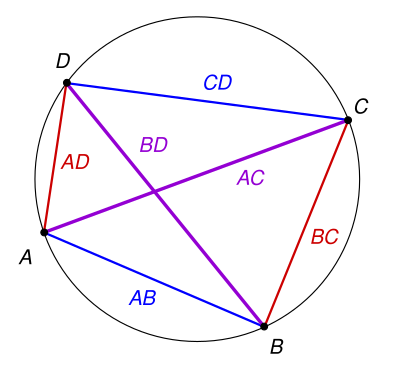

# 高等线性代数 Homework 09

Due: Nov. 18, 2024  
姓名: 雍崔扬  
学号: 21307140051 

## Problem 1

设: 
$$
A = 
\begin{bmatrix}
16 & 16 & 0 & 0\\
4 & 16 & 12 & 0\\
0 & 3 & 16 & 16\\
0 & 0 & 4 & 16
\end{bmatrix}
$$
利用 Gershgorin 圆盘定理证明 $A$ 的特征值的实部都严格大于 $0$.

- **Lemma $1$: (关于行的 Gershgorin 圆盘定理, Matrix Analysis 定理 $6.1.1$)**  
  记 $A = [a_{i,j}]\in \mathbb C^{n\times n}$ 第 $i$ 行的**去心绝对行和** (deleted absolute row sums) 为 $\text{Row}'_i(A) = \sum_{j\neq i}^n |a_{i,j}|$.  
  记 $A$ 关于第 $i$ 行的 **Gershgorin 圆盘**为 $G_i(A):=\{z\in \mathbb C : |z-a_{i,i}| \leq \text{Row}'_i(A)\}$.    
  则我们有以下命题成立: 

  - ① $A$ 的 $n$ 个特征值一定落在这 $n$ 个关于行的 Gershgorin 圆盘的并集 $G(A):= \bigcup_{i=1}^n G_i(A)$ 中.  

  - ② 进一步，若 $S\subset \mathbb C$ 是 $A$ 的 $k$ 个关于行的 Gershgorin 圆盘的并集，  
    且与剩下的 $n-k$ 个关于行的 Gershgorin 圆盘不相交，  
    则 $S$ 恰好包含 $A$ 的 $k$ 个特征值 (按照它们的代数重数计算).

  - ③ 特殊地，若某个关于行的 Gershgorin 圆盘与其余 $n-1$ 个关于行的 Gershgorin 圆盘不相交，  
    则它恰好包含 $A$ 的 $1$ 个特征值，且该特征值一定是单重的.

  - ④ 考虑第 $i$ 行的 Gershgorin 圆盘 $G_i(A)$ 的元素到原点的最远距离，  
    即为 $\text{Row}'_i(A) + |a_{i,i}| = \sum_{j\neq i}^n |a_{i,j}| + |a_{i,i}| = \sum_{j=1}^n |a_{i,j}|$，即 $A$ 第 $i$ 行的绝对行和.  
    注意到 $A$ 的模最大特征值落在 $G(A):= \bigcup_{i=1}^n G_i(A)$ 中，因此我们有:   
    $$
    \rho(A) = \max_{1\leq i\leq n} |\lambda_i(A)| \leq \max_{1\leq i\leq n} \sum_{j=1}^n |a_{i,j}| = \|A\|_\infty
    $$
    这与谱半径定理的结论 $\rho(A)\leq \|A\|_\infty$ 是吻合的.
  
- 对 $D^{-1}AD$ 及其转置 $D A^{-1}D^{-1}$ 应用 Gershgorin 圆盘定理就得到如下结果:  
  **Lemma $2$: (Matrix Analysis 推论 $6.1.6$)**  
  任意给定 $A=[a_{i,j}]\in \mathbb C^{n\times n}$ 和 $D=\text{diag}\{d_1,\dots,d_n\}\ (d_i>0\text{ for all }i=1,\dots,n)$.   
  我们都有以下命题成立: 

  - ① $A$ 的 $n$ 个特征值一定落在 $G(D^{-1}AD)=\bigcup_{i=1}^n G_i(D^{-1}AD) = \bigcup_{i=1}^n \{z\in \mathbb C: |z-a_{i,i}|\leq \frac{1}{d_i}\sum_{j\neq i}^n d_j |a_{i,j}|\}$​ 中.    
    此外，若这些圆盘中有 $k$ 个的并集与剩下的 $n-k$ 个都不相交，  
    则这个并集恰好包含 $A$ 的 $k$ 个特征值 (按照它们的代数重数计算).
  - ② $A$ 的 $n$ 个特征值一定落在 $G(DA^{\mathrm{T}}D^{-1})=\bigcup_{j=1}^n G_j(DA^{\mathrm{T}}D^{-1}) = \bigcup_{j=1}^n \{z\in \mathbb C: |z-a_{j,j}|\leq d_j\sum_{i\neq j}^n \frac{1}{d_i} |a_{i,j}|\}$ 中.    
    此外，若这些圆盘中有 $k$ 个的并集与剩下的 $n-k$ 个都不相交，  
    则这个并集恰好包含 $A$ 的 $k$ 个特征值 (按照它们的代数重数计算).
  - ③ $\rho(A) \leq \min\{\|D^{-1}AD\|_\infty, \|DA^{\mathrm T}D^{-1}\|_\infty\} = \min\{\|D^{-1}AD\|_\infty, \|D^{-1}AD\|_1\}$

  记忆这些结论的诀窍是 "行变换是左乘的，列变换是右乘的".  
  因此 $D^{-1}AD = [\frac{1}{d_{i}}a_{i,j} d_j]$ 而 $DA^{\mathrm T}D^{-1} = [d_i a_{j,i}\frac{1}{d_j}]$ (方括号中都是对应矩阵 $(i,j)$ 位置上的元素).  
  额外的参数 $d_1,\dots,d_n>0$ 让我们有足够的灵活性对特征值进行任意好的估计.

*****

**Proof:**  
考虑方阵:
$$
A = 
\begin{bmatrix}
16 & 16 &  & \\
4 & 16 & 12 & \\
 & 3 & 16 & 16\\
 &  & 4 & 16
\end{bmatrix}
$$

注意到:   
$$
\begin{align}
a_{12} &= 16 = 4\times 4 = 4a_{21}\\
a_{23} &= 12 = 4\times 3 = 4a_{32}\\
a_{34} &= 16 = 4\times 4 = 4 a_{43}.
\end{align}
$$
故可取 $D:= \text{diag}\{8,4,2,1\}$ (后一项是前一项的 $1/2$).
则我们有:  
$$
D^{-1}AD = \begin{bmatrix}
16 & 8 &  &\\
8 & 16 & 6 & \\
& 6 & 16 & 8\\
& & 8 & 16
\end{bmatrix}.
$$
我们发现它严格对角占优，故它的所有关于行的 Gershgorin 圆盘都不包含 $0$ (复平面原点)，  
同时注意到 $D^{-1}AD$ 是对称阵，故 $A$ 的特征值均为实数.  
综上所述，$A$ 的特征值均为正实数.

## Problem 2

给定正整数 $n$.  
试证明对于任意 $a,b,c,d\in \mathbb R^n$ 都有:  
$$
\|a-b\|_2^2 + \|b-c\|_2^2 + \|c-d\|_2^2 + \|d-a\|_2^2 \geq \|a-c\|_2^2 + \|b-d\|_2^2.
$$
- **(一个更难的问题: Ptolemy 定理)**   
  对于任意 $a,b,c,d\in \mathbb R^n$ 都有 $\|a-c\|_2 \|b-d\|_2 \leq \|a-b\|_2 \|c-d\|_2 + \|a-d\|_2\|b-c\|_2$.  
  取等条件是 $a,b,c,d$ 共面且端点共圆，即四边形 $ABCD$ 是圆内接的:
  
  

**Proof:**    
记 $\mathbb R^n$ 的 Euclid 内积为 $\langle \cdot ,\cdot \rangle$，则我们有:
$$
\begin{align}
&\|a-b\|_2^2 + \|b-c\|_2^2 + \|c-d\|_2^2 + \|d-a\|_2^2\\
&=
\langle a-b , a-b \rangle + \langle b -c , b-c \rangle + \langle c-d , c-d \rangle + \langle d-a , d-a \rangle\\
&=
2\langle a,a\rangle + 2\langle b,b\rangle + 2\langle c,c\rangle + 2\langle d,d\rangle 
-2\langle a,b\rangle  - 2\langle b,c\rangle - 2\langle c,d \rangle - 2 \langle d,a\rangle\\
&=
2\langle a,a\rangle + 2\langle b,b\rangle + 2\langle c,c\rangle + 2\langle d,d\rangle 
-2\langle a+c,b+d\rangle\\
&=
(\langle a,a\rangle + \langle b,b\rangle + \langle c,c\rangle + \langle d,d\rangle - 2\langle a,c\rangle 
- 2 \langle b,d\rangle) 
+ 
(\langle a,a\rangle + \langle b,b\rangle + \langle c,c\rangle + \langle d,d\rangle + 2\langle a,c\rangle 
+ 2 \langle b,d\rangle) 
-2\langle a+c,b+d\rangle\\
&=
(\langle a-c,a-c\rangle + \langle b-d,b-d\rangle) 
+
(\langle a+c,a+c\rangle + \langle b+d,b+d\rangle) 
-2\langle a+c,b+d\rangle\\
&=
\|a-c\|_2^2 + \|b-d\|_2^2 + \|(a+c) - (b+d)\|_2^2\\
&\geq 
\|a-c\|_2^2 + \|b-d\|_2^2.
\end{align}
$$
取等条件是 $a+c=b+d$.  
这意味着 $ABCD$ 是平行四边形 (它一定是圆内接的).   
此时就是平行四边形恒等式 $\|x+y\|^2 +\|x-y\|^2 = 2\|x\|^2 + 2\|y\|^2\ \ (\forall\ x,y\in \mathbb R^n)$.  
命题得证.

****

事实上，上述命题可以推广到 $\mathbb C^n$:  
$$
\begin{align}
&\|a-b\|_2^2 + \|b-c\|_2^2 + \|c-d\|_2^2 + \|d-a\|_2^2\\
&=
\langle a-b , a-b \rangle + \langle b -c , b-c \rangle + \langle c-d , c-d \rangle + \langle d-a , d-a \rangle\\
&=
2\langle a,a\rangle + 2\langle b,b\rangle + 2\langle c,c\rangle + 2\langle d,d\rangle 
-2\text{Re}\langle a,b\rangle  - 2\text{Re}\langle b,c\rangle - 2\text{Re}\langle c,d \rangle - 2\text{Re} \langle d,a\rangle\\
&=
2\langle a,a\rangle + 2\langle b,b\rangle + 2\langle c,c\rangle + 2\langle d,d\rangle 
-2\text{Re}\langle a+c,b+d\rangle\\
&=
(\langle a,a\rangle + \langle b,b\rangle + \langle c,c\rangle + \langle d,d\rangle - 2\text{Re}\langle a,c\rangle 
- 2 \text{Re}\langle b,d\rangle) \\
&\qquad+ 
(\langle a,a\rangle + \langle b,b\rangle + \langle c,c\rangle + \langle d,d\rangle + 2\text{Re}\langle a,c\rangle 
+ 2 \text{Re}\langle b,d\rangle) 
-2\text{Re}\langle a+c,b+d\rangle\\
&=
(\langle a-c,a-c\rangle + \langle b-d,b-d\rangle) 
+
(\langle a+c,a+c\rangle + \langle b+d,b+d\rangle) 
-2\text{Re}\langle a+c,b+d\rangle\\
&=
\|a-c\|_2^2 + \|b-d\|_2^2 + \|(a+c) - (b+d)\|_2^2\\
&\geq 
\|a-c\|_2^2 + \|b-d\|_2^2.
\end{align}
$$

## Problem 3

给定正整数 $n$，设 $(V,\langle \cdot, \cdot \rangle)$ 是 $n$ 维内积空间.  
若 $V$ 中的向量 $x$ 与 $V$ 的一组基 $v_1,\dots,v_n$ 的每个向量都正交，  
试证明 $x=0_V$，其中 $0_V$ 代表 $V$ 的加法单位元.  

**Proof:**  
我们可以使用经典 Gram–Schmidt 过程将 $v_1,\dots,v_n$ 标准正交化得到 $q_1,\dots,q_n$:   
(由于 $v_1,\dots,v_n$ 线性无关，故这个过程可以完整进行)
$$
v_1 = q_1 r_{11}\\
\Downarrow\\
\begin{cases}
r_{11} = \|v_1\|_2\\
q_1 = \frac{v_1}{\|v_1\|_2} = \frac{v_1}{r_{11}}
\end{cases}\\
v_k 
= \sum_{i=1}^k q_i r_{ik} 
= \sum_{i=1}^k q_i\langle q_i,v_k\rangle 
= q_k r_{kk} + \sum_{i=1}^{k-1} q_i\langle q_i, v_k\rangle
\ (k=2,\dots,n)\\
\Downarrow\\
\text{for }k=2,\dots,n\ \begin{cases}
r_{ik} = \langle q_i,v_k\rangle\ (i=1,\dots,k-1)\\
r_{kk} = \|v_k - \sum_{i=1}^{k-1} q_i r_{ik}\|_2\\
q_k = \frac{1}{r_{kk}} (v_k - \sum_{i=1}^{k-1} q_i r_{ik})
\end{cases}
$$
可以证明 $q_1,\dots,q_n$ 是 $V$ 的一组基.  
否则必然存在某个 $q_i=0_V$，这与 $\|q_i\| = \langle q_i,q_i\rangle =  1$ 的事实矛盾.   
于是可设 $x$ 在 $q_1,\dots,q_n$ 下的表示为 $x=\alpha_1 q_1 + \dots+ \alpha_n q_n$，   
其中 $\alpha_1,\dots,\alpha_n\in \mathbb F$，而 $\mathbb F$ 是内积空间 $V$ 对应的数域，注意内积空间一定是线性空间.

注意到 $v_1,\dots,v_n$ 可以表示为 $q_1,\dots,q_n$ 的线性组合: $v_k = \sum_{i=1}^k q_i r_{ik}\ (k=1,\dots,n)$，   
因此根据 $x$ 与 $v_1,\dots,v_n$ 都正交可以推出 $x$ 与 $q_1,\dots,q_n$ 都正交.  
于是我们有:
$$
\alpha_i = \langle x,q_i\rangle = 0\ (\forall\ i=1,\dots,n).
$$
这表明 $x=0_V$，命题得证.

## Problem 4

给定正整数 $n$，设 $A\in \mathbb R^{n\times n}$ 是对称正定阵.  
试证明对于任意 $x,y\in \mathbb R^n$ 都有:
$$
y^{\mathrm T}A^{-1}y + x^{\mathrm T}Ax \geq 2y^{\mathrm T}x.
$$
试探究等号成立的充要条件.

**Proof:**   
注意到 $A\in \mathbb R^{n\times n}$ 是对称正定阵 (自然是正规矩阵).  
因此其存在谱分解 $A=Q^{\mathrm T}\Lambda Q$，  
其中 $Q\in \mathbb R^{n\times n}$ 为正交阵，而 $\Lambda = \text{diag}\{\lambda_1,\dots,\lambda_n\}$ 是具有正实数对角元的对角阵.  
我们定义:
$$
\Lambda^{\frac12} := \text{diag}\{\sqrt{\lambda_1},\dots,\sqrt{\lambda_n}\}\\
A^{\frac12} := Q^{\mathrm T}\Lambda^{\frac12} Q\\
A^{-\frac12} := (A^{\frac12})^{-1} = Q^{\mathrm T}\Lambda^{-\frac12} Q
$$
显然 $A^{\frac12}$ 也是对称正定阵.  
因此我们有:
$$
\begin{align}
y^{\mathrm T}A^{-1}y + x^{\mathrm T}Ax - 2y^{\mathrm T}x
&=
(A^{-\frac12}y)^{\mathrm T}(A^{-\frac12} y) + (A^{\frac12}x)^{\mathrm T}(A^{\frac12}x) - 2(A^{-\frac12}y)^{\mathrm T}(A^{\frac12}x)\\
&=
\|A^{-\frac12} y  - A^{\frac12} x\|_2^2\\
&\geq 0
\end{align}
$$
当且仅当 $A^{-\frac12}y = A^{\frac12} x$ 时取等，即 $y=Ax$ 时取等.  
命题得证.

****

事实上，上述命题可以推广到复数域:    
给定正整数 $n$，设 $A\in \mathbb C^{n\times n}$ 是 Hermite 正定阵 (自然是正规矩阵)，   
因此其存在谱分解 $A=U^{\mathrm H}\Lambda U$，   
其中 $U\in \mathbb C^{n\times n}$ 为酉矩阵，而 $\Lambda = \text{diag}\{\lambda_1,\dots,\lambda_n\}$ 是具有正实数对角元的对角阵.   
可以类似定义:
$$
\Lambda^{\frac12} := \text{diag}\{\sqrt{\lambda_1},\dots,\sqrt{\lambda_n}\}\\
A^{\frac12} := U^{\mathrm H}\Lambda^{\frac12} U\\
A^{-\frac12} := (A^{\frac12})^{-1} = U^{\mathrm H}\Lambda^{-\frac12} U
$$
对于任意 $x,y\in \mathbb C^n$ 都有:  
$$
\begin{align}
y^{\mathrm H}A^{-1}y + x^{\mathrm H}Ax - 2\text{Re}(y^{\mathrm T}x)
&=
(A^{-\frac12}y)^{\mathrm H}(A^{-\frac12} y) + (A^{\frac12}x)^{\mathrm H}(A^{\frac12}x) - 2\text{Re}((A^{-\frac12}y)^{\mathrm H}(A^{-\frac12}x))\\
&=
\|A^{-\frac12} y  - A^{\frac12} x\|_2^2\\
&\geq 0
\end{align}
$$
当且仅当 $A^{-\frac12}y = A^{\frac12} x$ 时取等，即 $y=Ax$ 时取等.

****

**邵老师提供的证明:**  
给定 Hermite 正定阵 $A\in \mathbb C^{n\times n}$.  
定义内积 $\langle x,y\rangle_A := y^{\mathrm H}Ax\ (\forall\ x,y\in \mathbb C^n)$ (记其诱导的范数为 $\|\cdot\|_A$)，则我们有:  
$$
\begin{align}
y^{\mathrm H}A^{-1}y + x^{\mathrm H}Ax
&=
\langle A^{-1}y, A^{-1}y\rangle_A + \langle x,x\rangle_A\\
&=
\|A^{-1}y\|_A^2 + \|x\|_A^2\\
&\geq
2\|A^{-1}y\|_A \|x\|_A\quad (\text{Cauchy-Schwarz})\\
&\geq
2|\langle x,A^{-1}y\rangle_A|\\
&\geq
2 \langle x,A^{-1}y\rangle_A\\
&=
2 y^{\mathrm H}x.
\end{align}\ (\forall\ x,y\in \mathbb C^n)
$$

## Problem 5

若 $T$ 是内积空间上的保持内积的变换，试证明 $T$ 一定是线性变换.

**Proof:**   
考虑域 $\mathbb F$ 上的内积空间 $(V,\langle \cdot,\cdot\rangle)$.   
若 $T$ 是内积空间上的保持内积的变换，则我们有:
$$
\langle T(x),T(y)\rangle = \langle x,y\rangle\ (\forall\ x,y\in V).
$$

- ① 对于任意 $x_1,x_2\in V$ 我们都有: 
  $$
  \begin{align}
  &\langle T(x_1+x_2)-T(x_1)-T(x_2),T(x_1+x_2)-T(x_1)-T(x_2)\rangle\\
  &= \langle T(x_1+x_2),T(x_1+x_2)\rangle  
  - 
  \langle T(x_1),T(x_1+x_2)\rangle
  -
  \langle T(x_2),T(x_1+x_2)\rangle\\
  &\quad -\langle T(x_1+x_2),T(x_1)\rangle + \langle T(x_1),T(x_1)\rangle + \langle T(x_2),T(x_1)\rangle\\
  &\quad -\langle T(x_1+x_2),T(x_2)\rangle + \langle T(x_1),T(x_2)\rangle + \langle T(x_2),T(x_2)\rangle
  \\
  &=
  \langle x_1+x_2,x_1+x_2\rangle  
  - 
  \langle x_1,x_1+x_2\rangle
  -
  \langle x_2,x_1+x_2\rangle\\
  &\quad -\langle x_1+x_2,x_1\rangle + \langle x_1,x_1\rangle + \langle x_2,x_1\rangle\\
  &\quad -\langle x_1+x_2,x_2\rangle + \langle x_1,x_2\rangle + \langle x_2,x_2\rangle\\
  &=
  \langle x_1,x_1+x_2\rangle + \langle x_2,x_1+x_2\rangle
  - 
  \langle x_1,x_1+x_2\rangle
  -
  \langle x_2,x_1+x_2\rangle\\
  &\quad -\langle x_1,x_1\rangle -\langle x_2,x_1\rangle + \langle x_1,x_1\rangle + \langle x_2,x_1\rangle\\
  &\quad -\langle x_1,x_2\rangle - \langle x_2,x_2\rangle + \langle x_1,x_2\rangle + \langle x_2,x_2\rangle\\
  &=
  0
  \end{align}
  $$
  因此 $T(x_1+x_2)=T(x_1)+T(x_2)\ (\forall\ x_1,x_2\in V)$.

- ② 对于任意 $x\in V$ 和 $\alpha\in \mathbb F$ 我们都有:  
  $$
  \begin{align}
  &\langle T(\alpha x)-\alpha T(x), T(\alpha x) - \alpha T(x)\rangle\\
  &=
  \langle T(\alpha x), T(\alpha x)\rangle - \langle \alpha T(x),T(\alpha x)\rangle 
  -
  \langle T(\alpha x),\alpha T(x)\rangle + \langle \alpha T(x),\alpha T(x)\rangle\\
  &=
  \langle \alpha x,\alpha x\rangle - \alpha \langle x,\alpha x\rangle - \bar \alpha \langle \alpha x,x\rangle + |\alpha|^2 \langle x,x\rangle\\
  &=
  |\alpha|^2 \langle x,x\rangle - |\alpha|^2 \langle x,x\rangle - |\alpha|^2 \langle x,x\rangle + |\alpha|^2 \langle x,x\rangle\\
  &=
  0
  \end{align}
  $$

综合①②可知 $T$ 是 $V$ 上的线性变换.  

进一步，根据 $T$ 保持内积的性质可知 $T$ 保持范数:  
$$
\|T(x)\| = \sqrt{\langle T(x),T(x)\rangle} = \sqrt{\langle x,x\rangle} = \|x\|\quad (\forall\ x\in V)
$$
由于 $T$ 是 $V$ 上的线性变换，故 $\|T(x)-T(y)\| = \|T(x-y)\| = \|x-y\|\ (\forall\ x,y\in V)$.  
因此 $T(x)=T(y)$ 当且仅当 $x=y$，这表明 $T$ 是一个单射.  
在有限维空间中，任何线性单射算子必定是满射，因此 $T$ 还是一个满射.  
于是 $T$ 是 $V$ 上的保同构.

*****

**(错误的做法)**  
考虑域 $\mathbb F$ 上的内积空间 $(V,\langle \cdot,\cdot\rangle)$.  
若 $T$ 是内积空间上的保持内积的变换，则我们有:
$$
\langle T(x),T(y)\rangle = \langle x,y\rangle\ (\forall\ x,y\in V).
$$
现固定 $y\in V$  

- ① 对于任意 $x_1,x_2\in V$ 我们都有:  
  $$
  \begin{align}
  \langle T(x_1+x_2),T(y)\rangle
  &=
  \langle x_1+x_2,y\rangle\\
  &=
  \langle x_1,y\rangle + \langle x_2,y\rangle\\
  &=
  \langle T(x_1),T(y)\rangle + \langle T(x_2),T(y)\rangle\\
  &=
  \langle T(x_1)+T(x_2),T(y)\rangle
  \end{align}
  $$
  即有 $\langle T(x_1+x_2) - T(x_1)-T(x_2),T(y)\rangle=0\ (\forall\ x_1,x_2\in V)$ 成立.  
  根据 $y\in V$ 的任意性可知 $T(x_1+x_2)=T(x_1)+T(x_2)\ (\forall\ x_1,x_2\in V)$.

  > 注意: 我们需要说明 $T$ 是满射，即 $\text{Range}(T)=V$.  
  > 尽管在有限维内积空间 (一定是 Hilbert 空间) 中保积算子 $T$ 一定是满射 (因而是同构).
  
- ② 对于任意 $x\in V$ 和 $\alpha\in \mathbb F$ 我们都有:  
  $$
  \begin{align}
  \langle T(\alpha x),T(y)\rangle
  &=
  \langle \alpha x,y\rangle\\
  &=
  \alpha \langle x,y\rangle\\
  &=
  \alpha \langle T(x),T(y)\rangle\\
  &=
  \langle \alpha T(x),T(y)\rangle
  \end{align}
  $$
  即有 $\langle T(\alpha x) - \alpha T(x),T(y)\rangle=0\ (\forall\ x\in V,\alpha\in \mathbb F)$ 成立.   
  根据 $y\in V$ 的任意性可知 $T(\alpha x)=\alpha T(x)\ (\forall\ x\in V,\alpha\in \mathbb F)$.
  
  > 出的问题与 ① 相同

综合①②可知 $T$ 是 $V$ 上的线性变换.

## Problem 6 (optional)

给定正整数 $n>1$.   
试证明 $\mathbb C^n$ 上的 $l_1$ 范数和 $l_\infty$ 范数都不能由内积诱导.

- **Lemma: 平行四边形恒等式 (Parallelogram Identity)**  
  设$\{V , \langle\cdot ,\cdot\rangle\}$ 为域 $\mathbb{F}$ 上的内积空间，$\|\cdot\|$ 为 $\langle\cdot,\cdot \rangle$ 诱导出的范数，则我们有:  
  $$
  \|x+y\|^2 +\|x-y\|^2 = 2\|x\|^2 + 2\|y\|^2\ \ (\forall\ x,y\in V)
  $$
  展开消去交叉项即可证明:
  $$
  \begin{align}
  \|x+y\|^2 +\|x-y\|^2 
  &= \langle x+y ,x+y\rangle + \langle x-y ,x-y\rangle\\
  &= \langle x ,x\rangle+\langle x ,y\rangle + \langle y ,x\rangle + \langle y ,y\rangle + \langle x ,x\rangle - \langle x ,y\rangle -\langle y ,x\rangle + \langle y ,y\rangle \\ 
  &=  2\langle x ,x\rangle + 2\langle y ,y\rangle \\
  &=  2\|x\|^2 + 2\|y\|^2
  \end{align}
  $$

  平行四边形恒等式刻画了能被内积诱导出的范数所必须满足的性质.

**Proof:**  
我们只需举出反例说明 $\mathbb C^n\ (n>1)$ 上的 $l_1$ 范数和 $l_\infty$ 范数不满足平行四边形恒等式即可.  

- ① 取 $x=e_1$ 和 $y=e_2$ (其中 $e_1,\dots,e_n$ 代表 $\mathbb C^n$ 的标准正交基)，  
  则我们有:  
  $$
  \begin{align}
  \|x+y\|_1^2 +\|x-y\|_1^2 - 2\|x\|_1^2 - 2\|y\|_1^2
  &=
  \|e_1+e_2\|_1^2 + \|e_1-e_2\|_1^2 - 2\|e_1\|_1^2 - 2\|e_2\|_1^2\\
  &=
  2^2 + 2^2 - 2\cdot 1^2 - 2\cdot 1^2\\
  &=
  4\\
  &\neq 0
  \end{align}
  $$
  因此 $\mathbb C^n\ (n>1)$ 上的 $l_1$ 范数不满足平行四边形恒等式.

- ② 取 $x=e_1$ 和 $y=e_2$，则我们有:
  $$
  \begin{align}
  \|x+y\|_\infty^2 +\|x-y\|_\infty^2 - 2\|x\|_\infty^2 - 2\|y\|_\infty^2
  &=
  \|e_1+e_2\|_\infty^2 + \|e_1-e_2\|_\infty^2 - 2\|e_1\|_\infty^2 - 2\|e_2\|_\infty^2\\
  &=
  1^2 + 1^2 - 2\cdot 1^2 - 2\cdot 1^2\\
  &=
  -2\\
  &\neq 0
  \end{align}
  $$
  因此 $\mathbb C^n\ (n>1)$ 上的 $l_\infty$ 范数不满足平行四边形恒等式.

综上所述，$\mathbb C^n\ (n>1)$ 上的 $l_1$ 范数和 $l_\infty$ 范数都不能由内积诱导.

## Problem 7 (optional) 

设 $V$ 是 $[-1,1]$ 上的实系数多项式全体构成的向量空间.  
定义 $V\times V\mapsto \mathbb R$ 的泛函 $\langle \cdot ,\cdot \rangle$ 如下:  
$$
\langle p,q\rangle := \int_{-1}^1 \frac{p(t)q(t)}{\sqrt{1-t^2}}{\mathrm d}t\quad (\forall\ p,q\in V)
$$
试证明 $\langle \cdot ,\cdot \rangle$ 构成 $V$ 上的一个内积，  
且第一类 Chebyshev 多项式 $p_n(t)=\cos(n\arccos (t))\ (\forall\ n\in \mathbb N)$ 在该内积下两两正交.

- **(内积的定义)**  
  设 $V$ 是建立在域 $\mathbb F = \mathbb R\ \text{or }\mathbb C$ 上的线性空间.   
  泛函 $\langle\cdot,\cdot\rangle:V\times V\mapsto \mathbb F$ 称为一个**内积** (inner product)，如果它满足下列五条公理:  
  对于任意 $x,y,z\in V$ 和 $\alpha\in \mathbb F$ 
  - ① 非负性: $\langle x,x\rangle \geq 0$
  - ② 正定性: $\langle x,x\rangle = 0$ 当且仅当 $x=0_V$   
  - ③ 线性性: $\langle x+y,z\rangle = \langle x,z\rangle + \langle y,z\rangle$ 
  - ④ 齐次性: $\langle \alpha x,y\rangle = \alpha \langle x,y\rangle$
  - ⑤ 共轭对称性: $\overline{\langle x,y\rangle} = \langle y,x\rangle$

**Proof:**   
我们逐一验证 $\langle \cdot ,\cdot \rangle$ 在 $V$ 上满足内积定义的五条公理:

- ① 非负性:  
  $$
  \langle p,p\rangle = \int_{-1}^1 \frac{(p(t))^2}{\sqrt{1-t^2}}{\mathrm d}t\geq 0\ (\forall\ p\in V)
  $$

- ② 正定性:  
  $$
  \langle p,p\rangle = \int_{-1}^1 \frac{(p(t))^2}{\sqrt{1-t^2}}{\mathrm d}t =0\\
  \Leftrightarrow\\
  p(t)\equiv 0\ (\forall\ t\in [-1,1])
  $$

- ③ 线性性:  
  $$
  \begin{align}
  \langle p_1+p_2,q\rangle 
  &=
  \int_{-1}^1 \frac{(p_1(t)+p_2(t))q(t)}{\sqrt{1-t^2}}{\mathrm d}t\\
  &=
  \int_{-1}^1 \frac{p_1(t)q(t)}{\sqrt{1-t^2}}{\mathrm d}t
  +
  \int_{-1}^1 \frac{p_2(t)q(t)}{\sqrt{1-t^2}}{\mathrm d}t\\
  &=
  \langle p_1,q\rangle + \langle p_2,q\rangle 
  \end{align}\ (\forall\ p_1,p_2,q\in V)
  $$

- ④ 齐次性:  
  $$
  \begin{align}
  \langle \alpha p,q\rangle
  &=
  \int_{-1}^1 \frac{(\alpha p(t))q(t)}{\sqrt{1-t^2}}{\mathrm d}t\\
  &=
  \alpha \int_{-1}^1 \frac{p(t)q(t)}{\sqrt{1-t^2}}{\mathrm d}t\\
  &=
  \alpha \langle p,q\rangle
  \end{align}\ (\forall\ p,q\in V,\alpha\in \mathbb F)
  $$

- ⑤ (共轭) 对称性:  
  $$
  \begin{align}
  \langle q,p\rangle
  &=
  \int_{-1}^1 \frac{q(t)p(t)}{\sqrt{1-t^2}}{\mathrm d}t\\
  &=
  \int_{-1}^1 \frac{p(t)q(t)}{\sqrt{1-t^2}}{\mathrm d}t\\
  &=
  \langle p,q\rangle
  \end{align}\ (\forall\ p,q\in V)
  $$

因此 $\langle \cdot ,\cdot \rangle$ 构成 $V$ 上的一个内积.

***

现考虑第一类 Chebyshev 多项式 $p_n(t)=\cos(n\arccos (t))\ (\forall\ n\in \mathbb N)$.   
对于任意 $m,n\in \mathbb N$ 我们都有:
$$
\begin{align}
\langle p_n,p_m\rangle
&=
\int_{-1}^1 \frac{p_n(t)p_m(t)}{\sqrt{1-t^2}}{\mathrm d}t\\
&=
\int_{-1}^1 \frac{\cos(n\arccos (t))\cos(m\arccos (t))}{\sqrt{1-t^2}} {\mathrm d}t\ (\text{Let }\theta := \arccos(t) \in [0,\pi])\\
&=
\int_{\pi}^0 \frac{\cos(n\theta) \cos(m\theta)}{\sqrt{1-\cos^2(\theta)}}{\mathrm d}(\cos(\theta))\\
&=
\int_{\pi}^0 \frac{\frac12[\cos(n\theta-m\theta) + \cos(n\theta + m\theta)]}{\sin(\theta)} (-\sin(\theta) {\mathrm d}\theta)\\
&=
\frac12 \int_0^\pi\cos((n-m)\theta){\mathrm d}\theta + \frac12 \int_0^\pi \cos((n+m)\theta){\mathrm d}\theta 
\end{align}
$$
注意到对于任意 $k\in \mathbb Z$ 我们都有: 
$$
\int_{0}^{\pi}\cos(k\theta){\mathrm d}\theta = \begin{cases}
\int_0^\pi 1d\theta = \pi & \text{if }k=0\\
\frac1k \sin(k\theta)|_{\theta=0}^{\theta=\pi} = 0 &\text{if }k\neq 0
\end{cases}
$$
因此我们有:  
$$
\begin{align}
\langle p_n,p_m\rangle
&=
\frac12 \int_0^\pi\cos((n-m)\theta){\mathrm d}\theta + \frac12 \int_0^\pi \cos((n+m)\theta){\mathrm d}\theta \\
&=
\begin{cases}
\pi & \text{if }m=n = 0\\
\frac12 \pi & \text{if }m=n\in \mathbb Z_+\\
0 & \text{if }m,n\in \mathbb N\text{ such that }m\neq n
\end{cases}
\end{align}
$$
这表明 $p_n(t)=\cos(n\arccos (t))\ (\forall\ n\in \mathbb N)$ 是两两正交的.  
命题得证.

**The End**