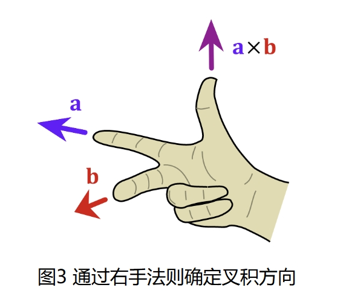

# 高等线性代数 Homework 10

Due: Nov. 25, 2024  
姓名: 雍崔扬  
学号: 21307140051 

## Problem 1

给定正整数 $n$ 和 $A=[a_{i,j}]_{i,j=1}^n\in \mathbb C^{n\times n}$.  
试证明 Hadamard 不等式:
$$
|\det(A)|^2 \leq \prod_{i=1}^n \sum_{j=1}^n |a_{i,j}|^2.
$$

**Proof:**     
记 $A$ 的行向量为 $a_1,\dots,a_n$.  
设 $A$ 的 $\text{RQ}$ 分解为:
$$
A = 
\begin{bmatrix}
a_1^{\mathrm{T}}\\
a_2^{\mathrm{T}}\\
\vdots\\
a_n^{\mathrm{T}}
\end{bmatrix}
=
\begin{bmatrix}
r_{1,1} & r_{1,2} & \dotsm & r_{1,n}\\
& r_{2,2} & \ddots & \vdots\\
& & \ddots & r_{n-1,n}\\
& & & r_{n,n}
\end{bmatrix}
\begin{bmatrix}
q_1^{\mathrm{T}}\\
q_2^{\mathrm{T}}\\
\vdots\\
q_n^{\mathrm{T}}
\end{bmatrix}
=
\begin{bmatrix}
r_1^{\mathrm{T}}\\
r_2^{\mathrm{T}}\\
\vdots\\
r_n^{\mathrm{T}}
\end{bmatrix}
Q
=
RQ,
$$
其中 $Q\in \mathbb{C}^{n\times n}$ 为酉矩阵，$R\in \mathbb{C}^{n\times n}$​ 为具有正实数对角元的上三角阵.   
注意到 $a_i^{\mathrm{T}} = r_i^{\mathrm{T}}Q\ (i=1,\dots,n)$，因此我们有:  
$$
\begin{align}
\|a_i\|_2 
&= \|Q^{\mathrm{T}}r_i\|_2 \quad (\text{note that }l_2\text{ norm is unitary-invariant})\\
&= \|r_i\|_2\\
&\geq r_{i,i},
\end{align}\ (\forall\ i=1,\dots,n)
$$
当且仅当 $a_i^{\mathrm{T}}=r_{i,i} q_{i}^{\mathrm{T}}$ 时取等.  
于是我们有:
$$
\begin{align}
|\det(A)|
&=
|\det(RQ)|\\
&=
|\det(R)\det(Q)|\\
&=
|\det(R)||\det(Q)|\quad (\text{note that }|\det(Q)|= 1)\\
&=
1 \cdot \prod_{i=1}^n r_{i,i}\\
&\leq
\prod_{i=1}^n \|a_i\|_2\\
&=
\prod_{i=1}^n \sqrt{\sum_{j=1}^n |a_{i,j}|^2}.
\end{align}
$$
当且仅当 $a_i^{\mathrm{T}}=r_{i,i} q_{i}^{\mathrm{T}}\ (i=1,\dots,n)$ 时取等，即 $a_1,\dots,a_n$ 相互正交时取等.  
因此我们有:
$$
|\det(A)|^2 \leq \prod_{i=1}^n \sum_{j=1}^n |a_{i,j}|^2.
$$

****

**(Matrix Analysis $2.1$ 节习题 $23$)**  
类似地，我们有如下结论:
$$
|\det(A)|^2 \leq \prod_{j=1}^n \sum_{i=1}^n |a_{i,j}|^2.
$$
这根据 $\det(A^{\mathrm{T}}) = \det(A)$ 可以直接由 Hadamard 不等式推出，  
或者将 Hadamard 不等式证明过程中的 $\text{RQ}$ 分解替换为 $\text{QR}$ 分解即可.

**Proof:**  
当 $A$ 为奇异矩阵时，命题显然成立，当且仅当 $A$ 的某一行 $a_i$ 为零向量时取等.  
当 $A$ 为非奇异矩阵时，存在唯一的 $\text{QR}$ 分解 $A=QR$，   
其中 $Q=[q_1,\dots,q_n]\in \mathbb C^{n\times n}$ 为酉矩阵，  
而 $R=[r_1,\dots,r_n]=[r_{i,j}]_{i,j=1}^n\in \mathbb C^{n\times n}$ 为具有正实数对角元的上三角阵. 
$$
A = [a_1,\dots,a_n] = [q_1,\dots,q_n] 
\begin{bmatrix}
r_{1,1} & \dotsm & r_{1,n}\\
& \ddots & \vdots\\
& & r_{n,n}
\end{bmatrix} =
Q[r_1,\dots,r_n]=QR.
$$
 注意到 $a_j = Qr_j\ (j=1,\dots,n)$，因此我们有:  
$$
\begin{align}
\|a_j\|_2 
&= \|Qr_j\|_2 \quad (\text{note that }l_2\text{ norm is unitary-invariant})\\
&= \|r_j\|_2\\
&\geq r_{j,j},
\end{align}\ (\forall\ j=1,\dots,n)
$$
当且仅当 $a_j=q_j r_{j,j}$ 时取等.  
于是我们有:
$$
\begin{align}
|\det(A)|
&=
|\det(QR)|\\
&=
|\det(Q)\det(R)|\\
&=
|\det(Q)||\det(R)|\quad (\text{note that }|\det(Q)|= 1)\\
&=
1 \cdot \prod_{j=1}^n r_{j,j}\\
&\leq
\prod_{j=1}^n \|a_j\|_2\\
&=
\prod_{j=1}^n \sqrt{\sum_{i=1}^n |a_{i,j}|^2}.
\end{align}
$$
当且仅当 $a_j=q_jr_{j,j}\ (j=1,\dots,n)$ 时取等，即 $a_1,\dots,a_n$ 相互正交时取等.  
因此我们有:
$$
|\det(A)|^2 \leq \prod_{j=1}^n \sum_{i=1}^n |a_{i,j}|^2.
$$


## Problem 2

**(Matrix Analysis $2.5$ 节习题 $32$)**  
试证明 Euler 旋转轴定理:  
若 $A\in \mathbb R^{3\times 3}$ 为正交阵，且 $\det(A)=1$，则存在 $v\in \mathbb R^3\backslash\{0\}$ 使得 $Av=v$.

- **Lemma $1$: (Matrix Analysis 定理 $2.5.8$)**  
  若 $A\in \mathbb R^{n\times n}$ 是正规的，则下列命题成立:
  
  - ① 存在实正交阵 $Q\in \mathbb R^{n\times n}$ 使得 $Q^{\mathrm T}AQ$ 为拟对角阵，  
    每个对角块要么是 $1\times 1$ 的 (对应 $A$ 的一个实特征值)，  
    要么是 $2\times 2$ 的，且具有特殊形式 $\begin{bmatrix}
    a & b\\
    -b & a\end{bmatrix}\ (b>0)$ (对应 $A$ 的一对共轭复特征值 $a\pm ib$).    
    这些对角块由 $A$ 的特征值完全确定，但可以按照任意预先指定的次序出现.
  - ② 两个 $n$ 阶实正规矩阵是实正交相似的，当且仅当它们具有完全相同的特征值.
  
- **Lemma $2$: (Matrix Analysis 推论 $2.5.11$)**  
  设 $A\in \mathbb R^{n\times n}$，则下列命题成立: 

  - ① $A=A^{\mathrm T}$ 当且仅当存在一个实正交阵 $Q\in \mathbb R^{n\times n}$ 使得 $Q^{\mathrm T}AQ =\text{diag}\{\lambda_1,\dots,\lambda_n\}\in \mathbb R^{n\times n}$，   
    其中 $\lambda_1,\dots,\lambda_n$ 为 $A$ 的 $n$ 个实特征值.  
    此外，两个 $n$ 阶实对称矩阵是实正交相似的，当且仅当它们具有完全相同的特征值.

  - ② $A=-A^{\mathrm T}$ 当且仅当存在一个实正交阵 $Q\in \mathbb R^{n\times n}$ 和一个非负整数 $p\in \mathbb N$ 使得:  
    $$
    Q^{\mathrm T}AQ = \text{diag}(0_{n-2p})\oplus 
    b_1
    \begin{bmatrix}
    0 & 1\\
    -1 & 0
    \end{bmatrix} \oplus \dotsm \oplus 
    b_p
    \begin{bmatrix}
    0 & 1\\
    -1 & 0
    \end{bmatrix}\ (\text{where }b_1,\dots,b_p>0)
    $$
    其中 $\pm ib_1,\dots,\pm ib_p$ 为 $A$ 的 $p$ 对非零共轭复特征值.  
    此外，两个 $n$ 阶实反对称矩阵是实正交相似的，当且仅当它们具有完全相同的特征值.

  - ③ $A^{\mathrm T}A=I_n$ 当且仅当存在一个实正交阵 $Q\in \mathbb R^{n\times n}$ 和一个非负整数 $p\in \mathbb N$ 使得:  
    $$
    Q^{\mathrm T}AQ = \text{diag}\{\lambda_1,\dots,\lambda_{n-2p}\}\oplus 
    \begin{bmatrix}
    \cos(\theta_1) & \sin(\theta_1)\\
    -\sin(\theta_1) & \cos(\theta_1)
    \end{bmatrix}
    \oplus
    \dotsm
    \oplus
    \begin{bmatrix}
    \cos(\theta_p) & \sin(\theta_p)\\
    -\sin(\theta_p) & \cos(\theta_p)
    \end{bmatrix},
    $$
    其中 $\lambda_1,\dots,\lambda_{n-2p}\in \{1,-1\}$，且 $\theta_1,\dots,\theta_p\in (0,\pi)$.  
    $A$ 的特征值是 $\lambda_1,\dots,\lambda_{n-2p}\in \{1,-1\}$ 加上 $\mathrm{e}^{\pm i\theta_1},\dots,\mathrm{e}^{\pm i\theta_p}$.   
    此外，两个 $n$ 阶实正交矩阵是实正交相似的，当且仅当它们具有完全相同的特征值.

****

**Solution: ([Reference](https://vmm.math.uci.edu/PalaisPapers/EulerFPT.pdf))**  
若 $A\in \mathbb R^{3\times 3}$ 为正交阵，且 $\det(A)=1$，  
则根据 **Lemma 2** 可知 $A$ 实正交相似于 $1\oplus \begin{bmatrix}
\cos(\theta) & \sin(\theta)\\
-\sin(\theta) & \cos(\theta)\end{bmatrix}$ (其中 $\theta\in [0,\pi]$)，  
即存在实正交阵 $Q=[q_1,q_2,q_3]\in \mathbb R^{3\times 3}$ 使得:
$$
A=Q\begin{bmatrix}
\cos(\theta) & \sin(\theta) & \\
-\sin(\theta) & \cos(\theta) &\\
& & 1
\end{bmatrix} Q^{\mathrm T}
$$
取 $v=Q[0,0,1]^{\mathrm T}=q_3$ (它是 $Q$ 的第 $3$ 列，显然不为零向量)，则我们有:  
$$
Av =
AQ\begin{bmatrix}
0\\
0\\
1
\end{bmatrix}
=
Q
\begin{bmatrix}
\cos(\theta) & \sin(\theta) & \\
-\sin(\theta) & \cos(\theta) &\\
& & 1
\end{bmatrix}\begin{bmatrix}
0\\
0\\
1
\end{bmatrix}
=
Q\begin{bmatrix}
0\\
0\\
1
\end{bmatrix}=v
$$
命题得证.


## Problem 3

给定正整数 $n$.  
设 $A\in \mathbb C^{n\times n}$ 为 Hermite 正定阵，$w\in \mathbb C^n$ 满足 $w^{\mathrm H}Aw=1$.  
若 $H=I-2ww^{\mathrm H}A$，试证明 $H^{-1}=H$，并求解 $H$ 的所有特征值.

- **Lemma:**  
  给定单位向量 $w\in \mathbb C^n$，定义 Householder 矩阵 $H:= I-2ww^{\mathrm H}$.  
  可以证明 $H$ 是 Hermite 的酉矩阵:
  $$
  \begin{align}
  H^{\mathrm H}
  &=
  (I-2ww^{\mathrm H})^{\mathrm H}\\
  &=
  I-2ww^{\mathrm H}\\
  &=
  H\\
  \hline
  H^{\mathrm H}H
  &=
  H^2\\
  &=
  (I-2ww^{\mathrm H})^2\\
  &=
  I - 4ww^{\mathrm H} + 4 ww^{\mathrm H}ww^{\mathrm H}\quad (\text{note that }w^{\mathrm H}w = \|w\|^2 = 1)\\
  &=
  I - 4ww^{\mathrm H} + 4ww^{\mathrm H}\\
  &=
  I
  \end{align}
  $$
  且特征值为 $n-1$ 个 $1$ 和 $1$ 个 $-1$ (这是因为 $ww^{\mathrm H}$ 的特征值是 $n-1$ 个 $0$ 和 $1$ 个 $1$).

**Solution:**   
注意到 $A\in \mathbb C^{n\times n}$ 是 Hermite 正定阵 (自然是正规矩阵)，因此它可酉对角化，且特征值均为正实数.  
即存在酉矩阵 $U\in \mathbb C^{n\times n}$ 和对角元为正实数的对角阵 $\Lambda := \text{diag}\{\lambda_1,\dots,\lambda_n\}$ 使得 $A=U\Lambda U^{\mathrm H}$.   
我们定义:
$$
\Lambda^{\frac12} := \text{diag}\{\lambda_1^{\frac12},\dots,\lambda_n^{\frac12}\}\\
A^{\frac12}:= U\Lambda^{\frac12}U^{\mathrm H}
$$
显然 $A^{\frac12}$ 也是 Hermite 正定阵.  
于是我们有 $\|A^{\frac12}w\|^2 = w^{\mathrm H}A^{\frac12}A^{\frac12}w = w^{\mathrm H}Aw = 1$ 成立.

定义 Householder 矩阵 $H_0:= I_n -2(A^{\frac12}w)(A^{\frac12}w)^{\mathrm H} = I_n - 2A^{\frac12} ww^{\mathrm H}A^{\frac12}$.    
根据 **Lemma** 可知 $H_0$ 是 Hermite 的酉矩阵，且特征值为 $n-1$ 个 $1$ 和 $1$ 个 $-1$.  
注意到:  
$$
\begin{align}
H 
&=
I - 2ww^{\mathrm H}A\\
&=
A^{-\frac12}(I-2A^{\frac12}ww^{\mathrm H} A^{\frac12}) A^{\frac12}\\
&=
A^{-\frac12} H_0 A^{\frac12}
\end{align}
$$
因此 $H$ 与 $H_0$ 相似 (故特征值为 $n-1$ 个 $1$ 和 $1$ 个 $-1$).  
注意到:
$$
\begin{align}
H^2
&=
(A^{-\frac12} H_0 A^{\frac12})(A^{-\frac12} H_0 A^{\frac12})\\
&=
A^{-\frac12}H_0^2 A^{\frac12}\quad (\text{note that }H_0^2 = I_n)\\
&=
A^{-\frac12}I_n A^{\frac12}\\
&=
I_n
\end{align}
$$
因此 $H^{-1}=H$，命题得证.


## Problem 4 

给定正整数 $n$ 以及 $n$ 阶复方阵 $A$.  
试证明以下命题等价:

- ① $A$ 是正规矩阵，即 $AA^{\mathrm H} = A^{\mathrm H}A$
- ② $A$ 可表示为 $A=X+iY$，其中 $X,Y$ 是 Hermite 阵且 $XY=YX$ 
- ③ $\|A\|_F^2 = \sum_{k=1}^n |\lambda_k|^2$ (其中 $\lambda_1,\dots,\lambda_n$ 是 $A$ 的特征值)
- ④ 存在复数域上的多项式 $f(\lambda)$ 使得 $A^{\mathrm H}=f(A)$
- ⑤ $A$ 的任意特征向量都是 $A^{\mathrm H}$ 的特征向量

**Proof:**  
**① $\Leftrightarrow$ ②**

> 任意复方阵 $A\in \mathbb C^{n\times n}$ 都可以唯一地分解为 $A = H(A) + K(A)$  
> 其中 $H(A) = \frac12(A+A^{\mathrm H})$ 称为 $A$ 的 **Hermite 部分**，而 $K(A) = \frac12(A-A^{\mathrm H})$ 称为 $A$ 的**反 Hermite 部分**.  
> 通常我们会从 $K(A)$ 中提取一个 $i$ 出来，就得到 $A$ 的 **Toeplitz 分解**:   
> $$
> A = H(A) + iK(A)\text{ where }\begin{cases}
> H(A) = \frac12 (A+A^{\mathrm H})\\
> K(A) = \frac1{2i} (A-A^{\mathrm H})
> \end{cases}
> $$

- **① $\Rightarrow$ ②**  
  设 $A$ 是正规矩阵，取 $\begin{cases}
  X:= \frac12(A+A^{\mathrm H})\\
  Y:= \frac{1}{2\mathrm{i}}(A-A^{\mathrm H})\end{cases}$ 就得到 $A$ 的 Toeplitz 分解 $A=X+\mathrm{i}Y$  
  $$
  \begin{align}
  X+\mathrm{i}Y
  &=
  \frac12(A+A^{\mathrm H}) + \mathrm{i}\cdot \frac{1}{2\mathrm{i}} (A-A^{\mathrm H})\\
  &=
  \frac12(A+A^{\mathrm H}) + \frac12(A-A^{\mathrm H})\\
  &=
  A\\
  \hline
  X^{\mathrm H} 
  &=
  \left[\frac12(A+A^{\mathrm H})\right]^{\mathrm H}\\
  &=
  \frac12(A^{\mathrm H}+A)\\
  &=
  X\\
  \hline
  Y^{\mathrm H}
  &=
  \left[\frac1{2\mathrm{i}}(A-A^{\mathrm H})\right]^{\mathrm H}\\
  &=
  -\frac1{2\mathrm{i}}(A^{\mathrm H}-A)\\
  &=
  Y\\
  \hline
  XY 
  &=
  \frac12(A+A^{\mathrm H})\cdot \frac{1}{2\mathrm{i}}(A-A^{\mathrm H})\\
  &=
  \frac{1}{4\mathrm{i}}(A^2+A^{\mathrm H}A-AA^{\mathrm H} - (A^{\mathrm H})^2)\quad (\text{note that }A^{\mathrm H}A=AA^{\mathrm H})\\
  &=
  \frac{1}{4\mathrm{i}}(A^2-(A^{\mathrm H})^2)\\
  &=
  \frac{1}{4\mathrm{i}}(A^2 - A^{\mathrm H}A + AA^{\mathrm H} - (A^{\mathrm H})^2)\\
  &=
  \frac{1}{2\mathrm{i}}(A-A^{\mathrm H})\cdot \frac12(A+A^{\mathrm H})\\
  &=
  YX
  \end{align}
  $$
  因此 $X,Y$ 是 Hermite 阵且 $XY=YX$.

- **① $\Leftarrow$ ②**   
  设 $A$ 可表示为 $A=X+\mathrm{i}Y$，其中 $X,Y$ 是 Hermite 阵且 $XY=YX$.   
  则我们有:  
  $$
  \begin{align}
  A^{\mathrm H}A
  &=
  (X+\mathrm{i}Y)^{\mathrm H} (X+\mathrm{i}Y)\\
  &=
  (X^{\mathrm H}-\mathrm{i}Y^{\mathrm H})(X+\mathrm{i}Y)\quad (\text{note that }X^{\mathrm H}=X,Y^{\mathrm H}=Y)\\
  &=
  (X-\mathrm{i}Y)(X+\mathrm{i}Y)\\
  &=
  X-\mathrm{i}YX + \mathrm{i}XY - \mathrm{i}^2 Y^2\quad (\text{note that }YX=XY)\\
  &=
  X-\mathrm{i}^2Y^2\\
  &=
  X+\mathrm{i}YX - \mathrm{i}XY-\mathrm{i}^2Y^2\\
  &=
  (X+\mathrm{i}Y)(X-\mathrm{i}Y)\\
  &=
  (X+\mathrm{i}Y)(X+\mathrm{i}Y)^{\mathrm H}\\
  &=
  AA^{\mathrm H}
  \end{align}
  $$
  这表明 $A$ 是正规矩阵.

*****

**① $\Leftrightarrow$ ③**

> **(Schur 分解定理的推论)**  
> 正规矩阵 $A\in \mathbb C^{n\times n}$ (满足 $A^{\mathrm H}A =AA^{\mathrm H}$, 即 $A$ 与 $A^{\mathrm H}$ 可交换) 可以酉对角化，且对角元的次序可以任意指定.  
> 反过来，可酉对角化的矩阵 $A\in \mathbb C^{n\times n}$ 也一定是正规矩阵.  
> **因此正规矩阵和可酉对角化的矩阵是等价的.**

- **① $\Rightarrow$ ③**  
  若 $A$ 是正规矩阵，则 $A$ 可酉对角化，  
  即存在酉矩阵 $U\in \mathbb C^{n\times n}$ 和对角阵 $\Lambda = \text{diag}\{\lambda_1,\dots,\lambda_n\}$ 使得 $A=U\Lambda U^{\mathrm H}$.   
  于是我们有:  
  $$
  \begin{align}
  \|A\|_F^2
  &=
  \tr(A^{\mathrm H}A)\\
  &=
  \tr((U\Lambda U^{\mathrm H})^{\mathrm H}(U\Lambda U^{\mathrm H}))\\
  &=
  \tr(U \bar\Lambda U^{\mathrm H} U\Lambda U^{\mathrm H})\quad (\text{where }\bar\Lambda=\text{diag}\{\bar\lambda_1,\dots,\bar \lambda_n\})\\
  &=
  \tr(U \bar\Lambda \Lambda U^{\mathrm H})\\
  &=
  \tr(\bar\Lambda \Lambda U^{\mathrm H}U)\\
  &=
  \tr(\bar \Lambda \Lambda)\\
  &=
  \sum_{i=1}^n |\lambda_i|^2
  \end{align}
  $$

- **① $\Leftarrow$ ③**  
  设 $\|A\|_F^2 = \sum_{i=1}^n |\lambda_i|^2$ (其中 $\lambda_1,\dots,\lambda_n$ 是 $A$ 的特征值).  
  设 $A$ 的 Schur 分解为 $A=UTU^{\mathrm H}$，   
  其中 $U\in \mathbb C^{n\times n}$ 为酉矩阵，上三角阵 $T=[t_{ij}]\in \mathbb C^{n\times n}$ 的对角元为 $\lambda_1,\dots,\lambda_n$.
  于是我们有:  
  $$
  \begin{align}
  \|A\|_F^2
  &=
  \tr(A^{\mathrm H}A)\\
  &=
  \tr((UTU^{\mathrm H})^{\mathrm H}(UTU^{\mathrm H}))\\
  &=
  \tr(UT^{\mathrm H}U^{\mathrm H} UTU^{\mathrm H})\\
  &=
  \tr(UT^{\mathrm H}TU^{\mathrm H})\\
  &=
  \tr(T^{\mathrm H}TU^{\mathrm H}U)\\
  &=
  \tr(T^{\mathrm H}T)\\
  &=
  \|T\|_F^2\\
  &=
  \sum_{i=1}^n |\lambda_i|^2 + \sum_{i<j}^n |t_{ij}|^2\\
  &=
  \sum_{i=1}^n |\lambda_i|^2
  \end{align}
  $$
  因此我们有 $\sum_{i<j}^n |t_{ij}|^2=0$，说明 $T$ 为对角阵.  
  故 $A$ 的 Schur 分解 $A=UTU^{\mathrm H}$ 实际上就是 $A$ 的谱分解 $A=U\text{diag}\{\lambda_1,\dots,\lambda_n\}U^{\mathrm H}=U\Lambda U^{\mathrm H}$.  
  于是我们有:  
  $$
  \begin{align}
  A^{\mathrm H}A
  &=(U\Lambda U^{\mathrm H})^{\mathrm H}(U\Lambda U^{\mathrm H})\\
  &= U\bar \Lambda U^{\mathrm H}U\Lambda U^{\mathrm H}\\
  &= U\bar \Lambda \Lambda U^{\mathrm H}\\
  &= U\Lambda \bar\Lambda U^{\mathrm H}\\
  &= (U\Lambda U^{\mathrm H})(U\bar \Lambda U^{\mathrm H})\\
  &= (U\Lambda U^{\mathrm H})(U\Lambda U^{\mathrm H})^{\mathrm H}\\
  &= AA^{\mathrm H}
  \end{align}
  $$
  这意味着 $A$ 是正规矩阵.

***

**① $\Leftrightarrow$ ④**

> **Lagrange 插值多项式:** [(reference)](https://math.stackexchange.com/questions/455402/t-is-normal-if-and-only-if-exist-polynomial-p-s-t-t-pt) 
> 给定 $(x_1,y_1),\dots,(x_n,y_n)$ (设 $x_1,\dots,x_n$ 互不相同)  
> 一个不超过 $n-1$ 次多项式 $p(x)$ 构造如下:  
> $$
> p(x) := \sum_{i=1}^n y_i p_i(x)\text{ where }p_i(x) := \prod_{1\leq j\leq n,\ j\neq i}\frac{x-x_j}{x_i-x_j}\ (\forall\ i=1,\dots,n)
> $$
> 可以证明:  
> $$
> p_i(x_j) = \begin{cases}
> 0 & \text{if }j\neq i\\
> 1 & \text{if }j=i
> \end{cases}\ (\forall\ i=1,\dots,n)\\
> p(x_i) = y_i\ (\forall\ i=1,\dots,n)
> $$

- **① $\Rightarrow$ ④**  
  若 $A$ 是正规矩阵，则存在谱分解 $A=U\Lambda U^{\mathrm H}$.  
  设 $A$ 的互不相同的特征值为 $\lambda_1,\dots,\lambda_d$，代数重数分别为 $n_1,\dots,n_d$ (满足 $n_1+\dotsm + n_d = n$).  
  定义 Lagrange 插值多项式 (不超过 $d-1$ 次):  
  $$
  p(\lambda):= \sum_{i=1}^d \bar \lambda_i p_i(\lambda)\text{ where }p_i(\lambda):= \prod_{1\leq j\leq d,\ j\neq i}\frac{\lambda-\lambda_j}{\lambda_i - \lambda_j}\ (\forall\ i=1,\dots,d)
  $$
  则我们有:  
  $$
  p_i(\lambda_j) = \begin{cases}
  0 & \text{if }j\neq i\\
  1 & \text{if }j=i
  \end{cases}\ (\forall\ i=1,\dots,d)\\
  p(\lambda_i) = \bar \lambda_i\ (\forall\ i=1,\dots,d)
  $$
  因此我们有:  
  $$
  \begin{align}
  p(A)
  &=
  p(U\Lambda U^{\mathrm H})\\
  &=
  Up(\Lambda)U^{\mathrm H}\\
  &=
  U\bar \Lambda U^{\mathrm H}\\
  &=
  (U\Lambda U^{\mathrm H})^{\mathrm H}\\
  &=
  A^{\mathrm H}
  \end{align}
  $$

- **① $\Leftarrow$ ④**   
  设 $A$ 的 Schur 分解为 $A=UTU^{\mathrm H}$.   
  其中 $U\in \mathbb C^{n\times n}$ 为酉矩阵，上三角阵 $T=[t_{ij}]\in \mathbb C^{n\times n}$ 的对角元为 $\lambda_1,\dots,\lambda_n$.   
  若存在复数域上的多项式 $p(\lambda)$ 使得 $A^{\mathrm H}=p(A)$，则我们有:   
  $$
  \begin{align}
  p(A)
  &=
  p(UTU^{\mathrm H})\\
  &=
  Up(T)U^{\mathrm H}\quad (\text{note that }p(A)=A^{\mathrm H})\\
  &=
  A^{\mathrm H}\\
  &=
  (UT U^{\mathrm H})^{\mathrm H}\\
  &=
  UT^{\mathrm H}U^{\mathrm H}
  \end{align}
  $$
  于是我们有 $Up(T)U^{\mathrm H} = UT^{\mathrm H}U^{\mathrm H}$ 成立，即有 $p(T)=T^{\mathrm H}$ 成立.  

  注意到 $p(T)$ 是上三角阵，而 $T^{\mathrm H}$ 为下三角阵，故 $T$ 为对角阵.  
  故 $A$ 的 Schur 分解 $A=UTU^{\mathrm H}$ 实际上就是 $A$ 的谱分解 $A=U\text{diag}\{\lambda_1,\dots,\lambda_n\}U^{\mathrm H}=U\Lambda U^{\mathrm H}$.   
  这意味着 $A$ 是正规矩阵.

***

**① $\Leftrightarrow$ ⑤**

- **① $\Rightarrow$ ⑤**  
  若 $A$ 是正规矩阵，则存在谱分解 $A=U\Lambda U^{\mathrm H}$.
  注意到 $A^{\mathrm H}$ 的谱分解即为 $A^{\mathrm H} = U \bar\Lambda U^{\mathrm H}$.  
  上述两式可以等价表示为:  
  $$
  AU= U\Lambda\\
  A^{\mathrm H}U=U\bar\Lambda
  $$
  这表明 $U$ 的 $n$ 个列向量都是 $A,A^{\mathrm H}$ 的公共特征向量.  
  因此 $A$ 的任意特征向量都是 $A^{\mathrm H}$ 的特征向量.

- **① $\Leftarrow$ ⑤**    
  **(Matrix Analysis $2.5$ 节习题 $34$)** ([reference](https://math.stackexchange.com/questions/4720128/every-eigenvector-of-t-is-an-eigenvector-of-t-prove-that-t-is-a-normal))   
  设 $A$ 的 Schur 分解为 $A=UTU^{\mathrm H}$.   
  其中 $U = [u_1,\dots,u_n]\in \mathbb C^{n\times n}$ 为酉矩阵，上三角阵 $T=[t_{ij}]\in \mathbb C^{n\times n}$ 的对角元为 $\lambda_1,\dots,\lambda_n$.    
  注意到 $u_1$ 是 $A$ 关于 $\lambda_1$ 的特征向量.
  
  若 $A$ 的任意特征向量都是 $A^{\mathrm H}$ 的特征向量，则我们有:  
  $$
  \begin{align}
  T
  &=U^{\mathrm H}AU\\
  &=
  [u_i^{\mathrm H}Au_j]_{i,j=1}^n\\
  &=
  \left[\begin{array}{c|ccc}
  u_1^{\mathrm H}Au_1 & u_1^{\mathrm H}Au_2 & \dotsm & u_1^{\mathrm H}Au_n\\
  \hline
  u_2^{\mathrm H}Au_1 & u_2^{\mathrm H}Au_2 & \dotsm & u_2^{\mathrm H}Au_n\\
  \vdots & \vdots & &\vdots\\
  u_n^{\mathrm H}Au_1 & u_n^{\mathrm H}Au_2 & \dotsm & u_n^{\mathrm H}Au_n
  \end{array}\right]\quad (\text{note that }Au_1=u_1\lambda_1\text{ and }u_1^{\mathrm H}A=\lambda_1 u_1^{\mathrm H})\\
  &=
  \left[\begin{array}{c|ccc}
  \lambda_1 u_1^{\mathrm H}u_1 & \lambda_1u_1^{\mathrm H}u_2 & \dotsm & \lambda_1 u_1^{\mathrm H}u_n\\
  \hline
  \lambda u_2^{\mathrm H}u_1 & u_2^{\mathrm H}Au_2 & \dotsm & u_2^{\mathrm H}Au_n\\
  \vdots & \vdots & &\vdots\\
  \lambda u_n^{\mathrm H}u_1 & u_n^{\mathrm H}Au_2 & \dotsm & u_n^{\mathrm H}Au_n
  \end{array}\right]\\
  &=
  \left[\begin{array}{c|ccc}
  \lambda_1  & 0 & \dotsm & 0\\
  \hline
  0 & u_2^{\mathrm H}Au_2 & \dotsm & u_2^{\mathrm H}Au_n\\
  \vdots & \vdots & &\vdots\\
  0 & u_n^{\mathrm H}Au_2 & \dotsm & u_n^{\mathrm H}Au_n
  \end{array}\right]\\
  \end{align}
  $$
  
  对比 Schur 型 $T$ 的结构，我们知道 $T$ 的第 $1$ 行的非对角元均为零，且对于第 $2$ 列有:
  $$
  \begin{cases}
  u_2^{\mathrm H}Au_2= \lambda_2\\
  u_i^{\mathrm H}Au_2 = 0\ (\forall\ i\in \{1,\dots,n\}\backslash\{2\})
  \end{cases}
  $$
  无论 $\lambda_2$ 是否为零，我们都有 $Au_2\ \bot\ \text{span}\{u_1,u_3,\dots,u_n\} = \text{span}\{u_2\}^\bot$.  
  因此 $Au_2\in \text{span}\{u_2\}$，表明 $u_2$ 是 $A$ 的特征向量.  
  根据 $u_2^{\mathrm H}Au_2 = \lambda_2$ 可知 $u_2$ 是 $A$ 关于 $\lambda_2$ 的特征向量，故有:  
  $$
  u_i^{\mathrm H} Au_2 = \lambda_2 u_i^{\mathrm H}u_2 = \begin{cases}
  \lambda_2 & \text{if }i=2\\
  0 & \text{if }i=3,\dots,n
  \end{cases}\\
  
  u_2^{\mathrm H} Au_j = \lambda_2 u_2^{\mathrm H}u_j = \begin{cases}
  \lambda_2 & \text{if }j=2\\
  0 & \text{if }j=3,\dots,n
  \end{cases}\\
  $$
  于是 Schur 型 $T$ 的第 $2$ 行的非对角元均为零.  
  以此类推，可知 Schur 型 $T=\text{diag}\{\lambda_1,\dots,\lambda_n\}$.    
  故 $A$ 的 Schur 分解 $A=UTU^{\mathrm H}$ 实际上就是 $A$ 的谱分解 $A=U\text{diag}\{\lambda_1,\dots,\lambda_n\}U^{\mathrm H}=U\Lambda U^{\mathrm H}$.   
  这意味着 $A$ 是正规矩阵.
  
  > **(失败的尝试)**    
  > 设 $A$ 的任意特征向量都是 $A^{\mathrm H}$ 的特征向量.  
  > 于是对于 $A$ 的任意特征对 $(\lambda,x)$ 都有:  
  > $$
  > \begin{cases}
  > Ax=x\lambda\\
  > A^{\mathrm H}x = x\bar \lambda\ \Leftrightarrow\ x^{\mathrm H}A = \lambda x^{\mathrm H}
  > \end{cases}
  > $$
  > 这表明 $A$ 的任意特征向量都是 $A$ (对应特征值) 的左特征向量，即 $A$ 的任意特征对 $(\lambda,x)$ 都是正规的.  
  >
  > 现考虑 $A$ 的不同特征值的特征对 $(\lambda,x),(\mu,y)$ (其中 $\lambda\neq \mu$)  
  > 利用共轭算子的性质我们有:   
  > $$
  > \begin{align}
  > (\lambda-\mu)\langle x,y\rangle
  > &=
  > \langle \lambda x, y\rangle - \langle x, \bar \mu y\rangle\\
  > &=
  > \langle Ax,y\rangle - \langle x, A^{\mathrm H}y\rangle\\
  > &=
  > 0
  > \end{align}
  > $$
  > 根据 $\lambda\neq \mu$ 可知 $\langle x,y\rangle=0$，这表明 $A$ 的不同特征值对应的特征向量相互正交.
  >
  > 当 $A$ 的特征值互不相同时，它一定具有 $n$ 个互不相同的特征向量，因而存在谱分解.  
  > 此时可得 $A$ 是正规矩阵.   
  > **(存疑)** 当 $A$ 具有重特征值时，它可由方阵序列 $\{A_n\}$ 逼近.  
  > 其中 $A_n\ (\forall\ n\in \mathbb Z_+)$ 只有单特征值，且 $A_n^{\mathrm H}$ 和 $A_n$ 具有相同的特征向量 (因而是正规矩阵，存在谱分解 $A_n=U_n\Lambda_n U_n^{\mathrm H}$)  
  > 此时可得 $A$ 是正规矩阵.
  >
  > (**疑点:** 有重特征值时能保证 $A$ 有 $n$ 个线性无关的特征向量吗?  
  > 此外，能保证相同特征值的线性无关的特征向量相互正交吗?  
  > 因为我们的目标是证明 $A$ 有 $n$ 个相互正交的特征向量)


## Problem 5

**(单边 Jacobi 迭代)**  
计算如下矩阵的奇异值分解:
$$
A=\begin{bmatrix}
1 & 1 & 1 & 1\\
1 & -1 & 1 & 1\\
1 & 0 & -2 & 1
\end{bmatrix}.
$$

- **Lemma:**  
  我们可以这样将两个线性相关的向量 $x,\alpha x\in \mathbb R^n$ 正交化: 
  $$
  \begin{bmatrix}
  x & \alpha x
  \end{bmatrix}
  \begin{bmatrix}
  c & s\\
  -s & c
  \end{bmatrix}=
  \begin{bmatrix}
  \sqrt{\alpha^2+1}x & 0_n
  \end{bmatrix}\text{ where }\begin{cases}
  c = \frac{1}{\sqrt{\alpha^2 + 1}}\\
  s = \frac{-\alpha}{\sqrt{\alpha^2+1}}
  \end{cases}
  $$

**Solution:**  
注意到 $A$ 的列向量组中，第 $1,2,3$ 列相互正交，而第 $4$ 列与第 $1$ 列线性相关.  
**单边 Jacobi 迭代**的思想指导我们使用一个正交变换 $Q_{1,4}$ 将第 $4$ 列化为零:  
$$
Q_{1,4}:= \begin{bmatrix}
\frac{\sqrt2}{2}& & & -\frac{\sqrt2}{2}\\
& 1 & & \\
& & 1 & \\
\frac{\sqrt 2}{2} & & &\frac{\sqrt 2}{2}
\end{bmatrix}\\

A Q_{1,4} =\begin{bmatrix}
1 & 1 & 1 & 1\\
1 & -1 & 1 & 1\\
1 & 0 & -2 & 1
\end{bmatrix}
\begin{bmatrix}
\frac{\sqrt2}{2}& & & -\frac{\sqrt2}{2}\\
& 1 & & \\
& & 1 & \\
\frac{\sqrt 2}{2} & & &\frac{\sqrt 2}{2}
\end{bmatrix}
=
\begin{bmatrix}
\sqrt{2} & 1 & 1 & 0\\
\sqrt{2} & -1 & 1 & 0\\
\sqrt{2} & 0 & -2 & 0
\end{bmatrix}
$$
这样 $AQ_{1,4}$ 的列向量就相互正交了.  
此时可取:  
$$
U := \begin{bmatrix}
\frac{\sqrt{3}}{3} & \frac{\sqrt 2}{2} & \frac{\sqrt{6}}{6}\\
\frac{\sqrt{3}}{3} & -\frac{\sqrt 2}{2} & \frac{\sqrt{6}}{6}\\
\frac{\sqrt{3}}{3} & 0 & -\frac{\sqrt{6}}{3}
\end{bmatrix}\\

\Sigma:= \begin{bmatrix}
\sqrt{6} & & & 0\\
& \sqrt{2} & & 0\\
& & \sqrt{6} & 0
\end{bmatrix}\\

V:= Q_{1,4} = \begin{bmatrix}
\frac{\sqrt2}{2}& & & -\frac{\sqrt2}{2}\\
& 1 & & \\
& & 1 & \\
\frac{\sqrt 2}{2} & & &\frac{\sqrt 2}{2}
\end{bmatrix}\\
A=U\Sigma V^{\mathrm T}
$$
为保证奇异值从大到小排列，我们可以交换 $\Sigma$ 的 $(2,2),(3,3)$ 位置，  
并对应交换 $U$ 的 $2,3$ 列和 $V$ 的 $2,3$ 行:  
$$
U := \begin{bmatrix}
\frac{\sqrt{3}}{3} & \frac{\sqrt{6}}{6} & \frac{\sqrt 2}{2}\\
\frac{\sqrt{3}}{3} & \frac{\sqrt{6}}{6} & -\frac{\sqrt 2}{2}\\
\frac{\sqrt{3}}{3} & -\frac{\sqrt{6}}{3} & 0
\end{bmatrix}\\

\Sigma:= \begin{bmatrix}
\sqrt{6} & & & 0\\
& \sqrt{6} & & 0\\
& & \sqrt{2} & 0
\end{bmatrix}\\

V:= \begin{bmatrix}
\frac{\sqrt2}{2}& & & -\frac{\sqrt2}{2}\\
& 0 & 1 & \\
& 1& 0 & \\
\frac{\sqrt 2}{2} & & &\frac{\sqrt 2}{2}
\end{bmatrix}\\
A=U\Sigma V^{\mathrm T}
$$
Matlab 代码验证:

```matlab
A = [1, 1, 1, 1;
     1,-1, 1, 1;
     1, 0,-2,1];

U = [sqrt(3)/3, sqrt(6)/6, sqrt(2)/2;
     sqrt(3)/3, sqrt(6)/6, -sqrt(2)/2;
     sqrt(3)/3, -sqrt(6)/3, 0];

Sigma = [sqrt(6), 0, 0, 0;
         0, sqrt(6), 0, 0;
         0, 0, sqrt(2), 0];

V = [sqrt(2)/2, 0, 0, -sqrt(2)/2;
     0, 0, 1, 0;
     0, 1, 0, 0;
     sqrt(2)/2, 0, 0, sqrt(2)/2];

disp("U * Sigma * V':");
disp(U * Sigma * V');
```

运行结果:

```
U * Sigma * V':
    1.0000    1.0000    1.0000   1.0000
    1.0000   -1.0000    1.0000   1.0000
    1.0000         0   -2.0000   1.0000
```


## Problem 6 (optional)

([Euler's Fixed Point Theorem.pdf](https://vmm.math.uci.edu/PalaisPapers/EulerFPT.pdf)) $\&$ ([Rodrigues' Rotation Formula](https://www.cnblogs.com/wtyuan/p/12324495.html)) $\&$ (Matrix Computation 习题 $6.4.7$)  
若 $a=[a_1,a_2,a_3]^{\mathrm T}$ 是 $\mathbb R^3$ 中的单位向量.  
试证明绕 $a$ 逆时针旋转 $\theta$ 的旋转变换为:  
$$
Q = \begin{bmatrix}
a_1^2 (1-\cos(\theta)) + \cos(\theta) & a_1a_2(1-\cos(\theta)) - a_3\sin(\theta) & a_1a_3(1-\cos(\theta)) + a_2\sin(\theta)\\
a_1a_2 (1-\cos(\theta)) + a_3\sin(\theta) & a_2^2 (1-\cos(\theta)) + \cos(\theta)
& a_2a_3(1-\cos(\theta)) - a_1\sin(\theta)\\
a_1a_3 (1-\cos(\theta)) - a_2\sin(\theta) & a_2a_3(1-\cos(\theta)) + a_1\sin(\theta)
& a_3^2(1-\cos(\theta)) + \cos(\theta)
\end{bmatrix}
$$

- **Background (叉积)**  
  定义 $a\in \mathbb R^3$ 的叉积算子:    
  $$
  [a]_{\times}:=\begin{bmatrix}
  0 & -a_3 & a_2\\
  a_3 & 0 & -a_1\\
  -a_2 & a_1 & 0\end{bmatrix}
  $$
  可以证明对于任意与 $a$ 线性无关的 $b\in \mathbb R^3$ 都有 $[a]_\times b$ 垂直于 $\text{span}\{a,b\}$.  
  具体来说 $[a]_\times b = \|a\|\|b\| \sin(\angle(a,b))\cdot n$，   
  其中 $\angle (a,b)\in [0,\pi]$，单位向量 $n$ 的方向由右手法则确定.
  
  

**Solution:**    
注意到 $a$ 是单位向量，因此 $\text{span}\{a\}$ 的正投影算子为 $aa^{\mathrm T}$，而 $\text{span}\{a\}^\bot$ 的正投影算子为 $I-aa^{\mathrm T}$.  
考虑向量 $x\in \mathbb R^3$

- ① 平行于旋转轴 $a$ 的部分: $x_{\parallel} = aa^{\mathrm T} x$ 
- ② 垂直于旋转轴 $a$ 的部分: $x_{\bot} = (I-aa^{\mathrm T}) x$ 

当向量 $x$ 绕旋转轴 $a $ 逆时针旋转 $\theta$ 时，$x_{\parallel}$ 保持不变，而 $x_\bot$ 发生改变.  
具体来说 $x_\bot$ 变为 $\cos(\theta)x_\bot +\sin(\theta) [a]_\times x$.   
因此我们有:  
$$
\begin{align}
x_{\text{rotate}}
&=
x_{\parallel} + \cos(\theta) x_\bot  + \sin(\theta) [a]_\times x \\ 
&=
(aa^{\mathrm T})x + \cos(\theta)(I-aa^{\mathrm T})x + \sin(\theta) [a]_{\times} x
\end{align}
$$
于是对应的线性算子为:  
$$
\begin{align}
Q
&=
aa^{\mathrm T} + \cos(\theta)(I-aa^{\mathrm T}) + \sin(\theta)[a]_\times \\
&=
(1-\cos(\theta))aa^{\mathrm T} + \cos(\theta)I + \sin(\theta)[a]_\times\\
&=
(1-\cos(\theta))
\begin{bmatrix}
a_1^2 & a_1a_2 & a_1a_3\\
a_2a_1 & a_2^2 & a_2a_3\\
a_3a_1 & a_3a_2 & a_3^2
\end{bmatrix}
+
\cos(\theta)
\begin{bmatrix}
1\\
& 1\\
&&1
\end{bmatrix}
+
\sin(\theta)
\begin{bmatrix}
0 & -a_3 & a_2\\
a_3 & 0 & -a_1\\
-a_2 & a_1 & 0\end{bmatrix}\\

&=
\begin{bmatrix}
a_1^2 (1-\cos(\theta)) + \cos(\theta) & a_1a_2(1-\cos(\theta)) - a_3\sin(\theta) & a_1a_3(1-\cos(\theta)) + a_2\sin(\theta)\\
a_1a_2 (1-\cos(\theta)) + a_3\sin(\theta) & a_2^2 (1-\cos(\theta)) + \cos(\theta)
& a_2a_3(1-\cos(\theta)) - a_1\sin(\theta)\\
a_1a_3 (1-\cos(\theta)) - a_2\sin(\theta) & a_2a_3(1-\cos(\theta)) + a_1\sin(\theta)
& a_3^2(1-\cos(\theta)) + \cos(\theta)
\end{bmatrix}
\end{align}
$$


## Problem 7 (optional)

**(极分解的变形)**  
试证明任意复方阵都可以分解为一个正投影矩阵和一个非奇异矩阵的乘积.

- 直观来说，有限维 Euclid 空间上的一个线性变换 $A$ 可以分解为:  
  先作用一个同构 (由非奇异矩阵表征)，再作用一个 $\text{Range}(A)$ 的 (正) 投影算子.

**Proof:**     
设 $A$ 的奇异值分解为:  
$$
A=U\Sigma V^{\mathrm H} = [U_1,U_2]\begin{bmatrix}
\Sigma_r & 0_{r\times (n-r)}\\
0_{(n-r)\times r} & 0_{(n-r)\times (n-r)}
\end{bmatrix}
[V_1,V_2]^{\mathrm H},
$$
其中 $r=\rank(A)$，而 $U_1,V_1\in \mathbb C^{n\times r}$ 和 $U_2,V_2\in \mathbb C^{n\times (n-r)}$ 列标准正交.

定义 $A$ 的 Moore-Penrose 伪逆 $A^\dagger := V_1^{\mathrm H}\Sigma_{r}^{-1}U_1$，它满足 Penrose 方程组:  
$$
\begin{cases}
AA^\dagger A = A\\
A^\dagger AA^\dagger = A^\dagger\\
(AA^\dagger)^{\mathrm H} = AA^\dagger\\
(A^\dagger A)^{\mathrm H} = A^\dagger A\\
\end{cases}
$$
根据 Penrose 方程组可知 $AA^\dagger$ 自伴且幂等，因而是正交投影算子，且投影空间为 $\text{Range}(A)$.   
注意到 $AA^\dagger = (U_1\Sigma_rV_1^{\mathrm H})(V_1\Sigma_r^{-1}U_1^{\mathrm H}) = U_1U_1^{\mathrm H}$.
$$
\begin{align}
A 
&= 
U\Sigma V^{\mathrm H} \\
&= [U_1,U_2]\begin{bmatrix}
\Sigma_r & 0_{r\times (n-r)}\\
0_{(n-r)\times r} & 0_{(n-r)\times (n-r)}
\end{bmatrix}
[V_1,V_2]^{\mathrm H}\\
&=
[U_1,U_2] 
\begin{bmatrix}
I_r & 0_{r\times (n-r)}\\
0_{(n-r)\times r} & 0_{(n-r)\times (n-r)}
\end{bmatrix}
\begin{bmatrix}
\Sigma_r & 0_{r\times (n-r)}\\
0_{(n-r)\times r} & I_{n-r}
\end{bmatrix}[V_1,V_2]^{\mathrm H}\\
&=
[U_1,U_2] 
\begin{bmatrix}
I_r & 0_{r\times (n-r)}\\
0_{(n-r)\times r} & 0_{(n-r)\times (n-r)}
\end{bmatrix}
[U_1,U_2]^{\mathrm H}
[U_1,U_2]
\begin{bmatrix}
\Sigma_r & 0_{r\times (n-r)}\\
0_{(n-r)\times r} & I_{n-r}
\end{bmatrix}[V_1,V_2]^{\mathrm H}\\
&=
(U_1U_1^{\mathrm H})
(U_1\Sigma_r V_1^{\mathrm{H}} + U_2 V_2^{\mathrm{H}})\\
&=
(U_1U_1^{\mathrm H})(A + U_2 V_2^{\mathrm{H}})
\end{align}
$$
这样就将 $A$ 表示为一个正交投影算子 $U_1U_1^{\mathrm H}$ 和一个非奇异矩阵 $A + U_2 V_2^{\mathrm{H}}$ 的乘积了.

***

> **(失败的尝试)**   
> 定义 $A$ 的 Moore-Penrose 伪逆 $A^\dagger := V_1^{\mathrm H}\Sigma_{r}^{-1}U_1$，它满足 Penrose 方程组:  
> $$
> \begin{cases}
> AA^\dagger A = A\\
> A^\dagger AA^\dagger = A^\dagger\\
> (AA^\dagger)^{\mathrm H} = AA^\dagger\\
> (A^\dagger A)^{\mathrm H} = A^\dagger A\\
> \end{cases}
> $$
> 根据 Penrose 方程组可知 $AA^\dagger$ 自伴且幂等，因而是正交投影算子，且投影空间为 $\text{Range}(A)$.  
> 注意到 $AA^\dagger = (U_1\Sigma_rV_1^{\mathrm H})(V_1\Sigma_r^{-1}U_1^{\mathrm H}) = U_1U_1^{\mathrm H}$.
>
> 记 $I_n=[e_1,\dots,e_n]$ 为 $\mathbb C^n$ 默认的标准正交基构成的基矩阵.  
> 注意到 $U$ 的列向量构成 $\mathbb C^n$ 的一组标准正交基，  
> 因此存在非奇异矩阵 $B\in \mathbb C^{n\times n}$ 使得 $U = EB$.  
> 于是任意 $x\in \mathbb C^n$ 在标准正交基 $U$ 下的坐标为 $Bx$.


## Problem 8 (optional)

考虑闭区间 $[0,1]$ 上的连续实值函数构成的线性空间 $C([0,1])$.  
在 $C([0,1])$ 上定义内积:   
(注意 $C([0,1])$ 在此内积 (诱导的范数) 下不是完备的，因此不是 Hilbert 空间)
$$
\langle f,g\rangle =\int_0^1 f(t)g(t){\mathrm d}t\ (\forall\ f,g\in C([0,1]))
$$
试证明 $\mathcal V$ 中存在序列 $\{e_n\}$ 使得 $\langle e_i,e_j\rangle = \delta_{i,j}$ (其中 $\delta_{i,j} =  {\Large\mathbb 1}(i=j)$ 为 Kronecker 记号).

- 实数域上的标准正交 Schauder 基为 $\{1,\sqrt{2}\cos(2\pi t),\sqrt{2}\sin(2\pi t),\sqrt{2}\cos(4\pi t),\sqrt{2}\sin(4\pi t),\dots\}$
- 复数域上的标准正交 Schauder 基为 $\{1,\mathrm{e}^{-\mathrm{i}2\pi t},\mathrm{e}^{\mathrm{i}2\pi t},\mathrm{e}^{-\mathrm{i}4\pi t},\mathrm{e}^{\mathrm{i}4\pi t},\dots\}$

**Proof:**  
考虑序列 $\{e_n(t)=\sqrt{2}\cos(2\pi nt):n\in \mathbb Z_+\}$  
$$
\begin{align}
\langle e_n,e_m\rangle
&=
\int_0^1 e_n(t)e_m(t){\mathrm d}t\\
&=
\int_0^1 \sqrt{2}\cos(2\pi nt)\sqrt{2}\cos(2\pi mt){\mathrm d}t\\
&=
\int_0^1 \cos(2\pi(n+m)t) {\mathrm d}t + \int_0^1 \cos(2\pi(n-m)t){\mathrm d}t
\end{align}
$$
注意到对于任意 $k\in \mathbb Z$ 我们都有:  
$$
\int_{0}^{1}\cos(2\pi k t){\mathrm d}t = \begin{cases}
\int_0^1 1 \mathrm{d}\theta = 1 & \text{if }k=0\\
\frac1{2\pi k} \sin(2\pi kt)|_{t=0}^{t=1} = 0 &\text{if }k\neq 0
\end{cases}
$$
于是我们有:  
$$
\begin{align}
\langle e_n,e_m\rangle 
&=\int_0^1 \cos(2\pi(n+m)t) {\mathrm d}t + \int_0^1 \cos(2\pi(n-m)t){\mathrm d}t\\
&=
0 + \delta_{n,m}\\
&=
\delta_{n,m}
\end{align}
$$

****

考虑序列 $\{f_n(t)=\sqrt{2}\sin(2\pi nt):n\in \mathbb Z_+\}$  
$$
\begin{align}
\langle f_n,f_m\rangle
&=
\int_0^1 f_n(t)f_m(t){\mathrm d}t\\
&=
\int_0^1 \sqrt{2}\sin(2\pi nt)\sqrt{2}\sin(2\pi mt){\mathrm d}t\\
&=
\int_0^1 \cos(2\pi(n-m)t) {\mathrm d}t - \int_0^1 \cos(2\pi(n+m)t){\mathrm d}t
\end{align}
$$
注意到对于任意 $k\in \mathbb Z$ 我们都有:  
$$
\int_{0}^{1}\cos(2\pi k t){\mathrm d}t = \begin{cases}
\int_0^1 1 \mathrm{d}\theta = 1 & \text{if }k=0\\
\frac1{2\pi k} \sin(2\pi kt)|_{t=0}^{t=1} = 0 &\text{if }k\neq 0
\end{cases}
$$
于是我们有:  
$$
\begin{align}
\langle f_n,f_m\rangle 
&=\int_0^1 \cos(2\pi(n-m)t) {\mathrm d}t - \int_0^1 \cos(2\pi(n+m)t){\mathrm d}t\\
&=
\delta_{n,m} - 0\\
&=
\delta_{n,m}
\end{align}
$$

****

考虑序列 $\{e_n(t)=\sqrt{2}\cos(2\pi nt):n\in \mathbb Z_+\}$ 和 $\{f_n(t)=\sqrt{2}\sin(2\pi nt):n\in \mathbb Z_+\}$    
$$
\begin{align}
\langle e_n,f_m\rangle
&=
\int_0^1 e_n(t)f_m(t){\mathrm d}t\\
&=
\int_0^1 \sqrt{2}\cos(2\pi nt)\sqrt{2}\sin(2\pi mt){\mathrm d}t\\
&=
\int_0^1 \sin(2\pi(n+m)t) {\mathrm d}t + \int_0^1 \sin(2\pi(n-m)t){\mathrm d}t
\end{align}
$$
注意到对于任意 $k\in \mathbb Z$ 我们都有:  
$$
\int_{0}^{1}\sin(2\pi k t){\mathrm d}t = \begin{cases}
\int_0^1 1 \mathrm{d}\theta = 1 & \text{if }k=0\\
-\frac1{2\pi k} \cos(2\pi kt)|_{t=0}^{t=1} = 0 &\text{if }k\neq 0
\end{cases}
$$
于是我们有:  
$$
\begin{align}
\langle e_n,f_m\rangle 
&=\int_0^1 \sin(2\pi(n+m)t) {\mathrm d}t + \int_0^1 \cos(2\pi(n-m)t){\mathrm d}t\\
&=
0 + \delta_{n,m}\\
&=
\delta_{n,m}
\end{align}
$$
**The End**
